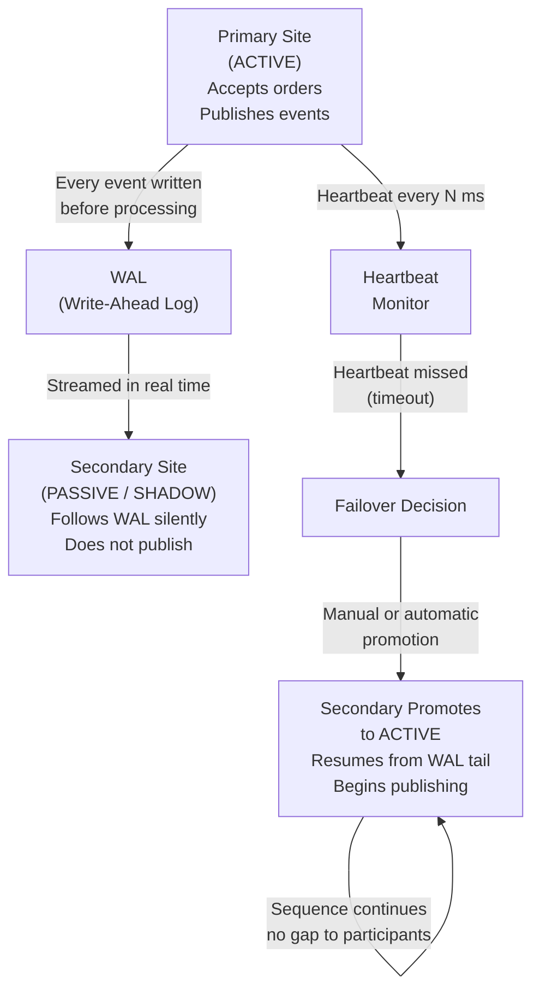

# Primary and Secondary Sites, Resilience Architecture

A financial exchange is critical infrastructure. If it goes down unexpectedly, due to hardware failure, software bug, network outage, or even a power cut, the consequences are severe: participants cannot trade, prices cannot be discovered, and confidence in the market is damaged. For this reason, exchanges operate with **redundancy**, duplicate systems at separate locations.

Two metrics define the resilience targets:

**RPO (Recovery Point Objective):** The maximum amount of data loss acceptable. For a matching engine, RPO is effectively **zero** — no committed trade or order acknowledgement can ever be lost. A trade that was confirmed to a participant and then lost in a crash would represent a contractual failure with regulatory and legal consequences.

**RTO (Recovery Time Objective):** The maximum acceptable downtime. Different systems have different RTOs: a batch reporting system might tolerate hours; a matching engine must recover in **seconds to minutes**. NYSE and NASDAQ publish target failover times; for critical components, modern exchanges target sub-minute RTO. The 2015 NYSE trading halt, discussed in the Reference Data section, lasted 3.5 hours — widely considered an unacceptable RTO for a major exchange, and a benchmark against which subsequent resilience investments were made.

## Primary and Secondary Sites

A **primary site** (also called the **primary** or **production site**) is where the live matching engine runs. All orders are processed here, all trades happen here.

A **secondary site** (also called the **backup**, **disaster recovery site**, or **secondary**) is an identical system at a geographically separate location. Its purpose: if the primary site becomes unavailable, the secondary site can take over and continue matching.

Real exchanges take this very seriously. NASDAQ, for example, operates data centres in multiple states. The LSE has co-primary sites in Basildon (Essex) and a secondary site elsewhere in England. CME has sites in Aurora (Illinois) and other locations.

## Synchronisation: Keeping the Secondary Current

For the secondary to be able to take over instantly, it must be an exact replica of the primary's state at all times. This means every order, trade, and state change on the primary must be reflected on the secondary with minimal delay.

Approaches include:

**State replication:** The primary engine sends every order event to the secondary before or immediately after processing it. The secondary maintains an identical copy of the order book, only it does not publish results or accept new orders from participants, it merely follows along silently.

**Log-based replication:** Every incoming message is written to a durable **write-ahead log (WAL)** before being processed. The secondary replays from the log. If the primary fails, the secondary catches up to the log's tail and takes over. This is architecturally similar to how database replication works (PostgreSQL's streaming replication, for example, uses this approach).

**Consensus protocols:** In the most robust designs (used by clearing houses and critical infrastructure), a consensus algorithm like **Raft** or **Paxos** ensures both the primary and secondary agree on every event before it is considered "committed." Nothing is published to participants until both sites confirm they have the event. This guarantees zero data loss on failover but adds latency.

## Failover

**Failover** is the act of switching from the primary to the secondary. It may be:

- **Automatic (active-passive):** The system detects the primary has stopped responding (via heartbeat monitoring) and automatically promotes the secondary to primary, alerting participants. The challenge: detecting a true failure vs. a temporary network partition without making hasty decisions — the **split-brain problem**: if both sites think the other is dead, both might try to become primary simultaneously, resulting in two active engines accepting conflicting orders.

  The standard distributed-systems solutions are **fencing** (issuing a command that forces the suspected-failed node to stop operating before the secondary takes over — sometimes called **STONITH: Shoot The Other Node In The Head**) and **quorum requirements** (requiring the agreement of a majority of nodes before any single node can assume the primary role). Without one of these mechanisms, split-brain in a matching engine produces a catastrophic situation: two independent order books diverging while both believe they are the authoritative state.

- **Manual (operator-controlled):** A human operator monitors the primary and initiates failover when a problem is confirmed. This is slower (seconds or minutes, not milliseconds) but avoids false failovers.

- **Active-active:** Both sites process orders simultaneously, and a consensus mechanism ensures they produce identical results. Extremely complex but enables zero-downtime failover.

  True active-active matching engines are **rare in production exchanges** because distributed consensus introduces latency, and maintaining deterministic total ordering across two simultaneously-processing sites is a fundamentally hard problem. Most production exchanges prefer active-passive or shadow replication rather than active-active, accepting a brief failover window in exchange for simplicity and predictable latency.

## The Geographic Trade-Off

Placing the secondary site far from the primary protects against geographically localised disasters (earthquakes, floods, building fires). But distance means higher network latency, making synchronisation slower.

A common compromise: a "near" site (same city or region, connected by dark fibre) provides fast synchronisation and fast failover, plus a "far" site (different country or continent) for true disaster recovery.

