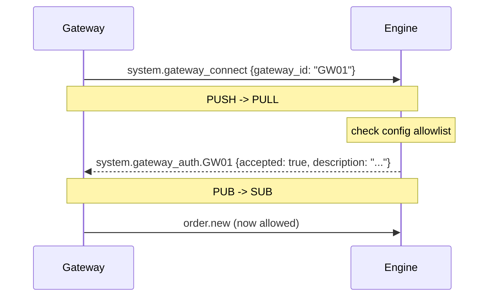

# Architecture

!!! note "Learning objectives"
    After reading this page you will understand:

    - Why a multi-process message-passing architecture was chosen over a monolith or
      a shared-memory design, and how this mirrors real trading systems
    - The fundamental messaging concepts: topics, publish/subscribe, point-to-point,
      broadcast, and subscription filters
    - How the ZeroMQ brokerless topology connects all processes in EduMatcher
    - The internal data structures of an order book — heaps, lazy deletion, price-level
      indexes — and how to read a visual order book depth diagram
    - The time complexity of every core operation: insert, match, cancel, stop trigger


## Why This Architecture?

### Three ways to build a trading system

Before looking at what EduMatcher does, it helps to understand the alternatives
and why they fall short for this use case.

**Option 1 — Monolith**
: One process, one program.  The user types an order, matching runs, results print.
  Simple to build, simple to debug.  Falls apart as soon as two users need to trade
  simultaneously, or when you want to add an audit log without touching the matching code.

**Option 2 — Shared memory / threads**
: Multiple threads share an in-process order book protected by a lock.
  Common in C++ HFT cores.  Fast, but extremely hard to reason about:
  lock contention, priority inversion, and data races all wait to bite you.
  Also single-machine — you can't run the viewer on a separate screen
  without redesigning everything.

**Option 3 — Multi-process message passing**
: Each process owns its own state and communicates by sending messages.
  No shared memory, no locks.  Processes can run on different machines.
  Adding a new observer (an audit logger, a new data feed) means writing a
  new subscriber — the engine doesn't change.

EduMatcher uses Option 3.  It is also how most real exchange systems are
actually built: a matching engine core that publishes every event on an internal
bus, with a fleet of downstream consumers (clearing, risk, market data
distribution, surveillance) that subscribe to the topics they care about.

### Core messaging concepts

Before reading the topology diagram, it is worth having clear definitions:

**Topic**
: A string label attached to every message that identifies what kind of event it
  carries.  Examples: `trade.executed`, `order.fill.GW01`, `book.AAPL`.
  Think of it like the subject line of an email — the sender sets it, the
  receiver uses it to decide whether to read the body.

**Publish / Subscribe (PUB/SUB)**
: One sender, many potential receivers.  The sender *publishes* to a topic; every
  process that has *subscribed* to that topic receives a copy.  Processes that have
  not subscribed never see the message.  This is how the engine broadcasts book
  updates: one `book.AAPL` message is published; the viewer, the stats recorder,
  and the board all receive it independently.

**Subscription filter**
: A subscriber declares which topics it wants to receive.  In ZeroMQ, the filter is
  a simple prefix match: a subscription for `"order.fill.GW01"` receives only
  messages whose topic starts with that string.  A subscription for `"book."` receives
  book updates for all symbols.  An empty-string subscription receives everything.

**Broadcast**
: A message sent to all subscribers simultaneously with no specific address.
  The engine broadcasts `session.state` when the trading phase changes — every
  process (gateways, viewers, stats, board) reacts according to its own logic.

**Point-to-point (PUSH/PULL)**
: One sender, exactly one receiver.  EduMatcher uses PUSH/PULL for order
  submission: a gateway *pushes* an order message and the engine *pulls* it.
  No other process sees that message; no routing table is needed because the
  engine is the only process that ever binds the PULL socket.

**Message routing**
: In a broker-based system, the broker reads the topic and decides which queue
  to put the message in.  In EduMatcher, routing is done by the ZeroMQ
  layer using the subscription filter — no broker, no routing table, no extra
  process.


## Overview

EduMatcher uses a **broker-less ZeroMQ** topology.  
The matching engine is the only process that *binds* sockets — all other processes *connect* to it.  
No ZMQ broker daemon, no message queue server, no external dependencies beyond ZMQ itself.


## ZMQ Topology

```
                          ┌───────────────────────────────┐
                          │      Matching Engine          │
  Gateway(s)              │                               │
  ──PUSH──────────────►   │  PULL :5555  receives orders  │
                          │  PUB  :5556  broadcasts events│
  Scheduler               │                               │
  ──PUSH──────────────►   └───────────┬───────────────────┘
                                      │ PUB :5556
                    ┌─────────────────┼──────────────────────┐
                    │                 │                      │
              ┌─────▼──────┐  ┌──────▼──────┐  ┌────────────▼──────┐
              │ Gateway(s) │  │  Viewer(s)  │  │  pm-orders        │
              │ SUB        │  │  SUB        │  │  SUB              │
              │ order.*    │  │  book.*     │  │  order.*          │
              │ combo.*    │  │             │  │  (all gateways)   │
              │ session.*  │  │             │  │                   │
              └────────────┘  └─────────────┘  └───────────────────┘
                    │
              ┌─────▼──────┐  ┌─────────────┐  ┌─────────────┐  ┌─────────────┐
              │  Audit     │  │  Clearing   │  │  Stats      │  │  Board      │
              │  SUB       │  │  SUB        │  │  SUB        │  │  SUB        │
              │  (all)     │  │  trade.*    │  │  trade.*    │  │  book.*     │
              └────────────┘  └─────────────┘  │  book.*     │  │  trade.*    │
                                               └─────────────┘  └─────────────┘
```


## Message Topics

All messages are two-frame ZMQ multipart:

- **frame[0]** — topic string (used for SUB filtering)
- **frame[1]** — JSON payload

| Topic | Direction | Description |
|-------|-----------|-------------|
| `order.new` | GW → Engine | New order submission |
| `order.cancel` | GW → Engine | Cancel request |
| `order.combo` | GW → Engine | Submit multi-leg combo order |
| `order.combo_cancel` | GW → Engine | Cancel a combo and all its legs |
| `session.transition` | Scheduler → Engine | Request session phase change |
| `system.gateway_connect` | GW → Engine | Gateway authentication request |
| `system.symbols_request` | Any → Engine | Request active symbol list |
| `book.snapshot_request` | Any → Engine | Request immediate book snapshot |
| `order.orders_request` | GW → Engine | Request resting orders for a gateway |
| `order.ack.{GW_ID}` | Engine → GW | Order accepted or rejected |
| `order.fill.{GW_ID}` | Engine → GW | Partial or full fill |
| `order.cancelled.{GW_ID}` | Engine → GW | Cancel confirmed |
| `order.expired.{GW_ID}` | Engine → GW | Order expired (DAY/ATO/ATC at phase change or shutdown) |
| `order.orders.{GW_ID}` | Engine → GW | Response: list of resting orders |
| `combo.ack.{GW_ID}` | Engine → GW | Combo accepted or rejected |
| `combo.status.{GW_ID}` | Engine → GW | Combo lifecycle status change |
| `system.gateway_auth.{GW_ID}` | Engine → GW | Authentication response |
| `system.symbols.{GW_ID}` | Engine → Requestor | Response: list of symbols |
| `session.state` | Engine → all | Current session phase broadcast |
| `auction.result.{SYMBOL}` | Engine → all | Auction uncross result |
| `trade.executed` | Engine → all | Trade occurred |
| `book.{SYMBOL}` | Engine → all | Order book snapshot after each change |
| `system.eod` | Engine → all | End-of-day shutdown broadcast |


## Process Roles

| Process | ZMQ Sockets | Binds/Connects | Role |
|---------|------------|----------------|------|
| Engine | PULL :5555, PUB :5556, PUB :5557 | **Binds** all | Matching, session state, combo tracking, drop-copy |
| Gateway | PUSH→5555, SUB→5556 | Connects | User order entry, authenticates on connect |
| Scheduler | PUSH→5555 | Connects | Drives session phase transitions |
| Viewer | SUB→5556 | Connects | Real-time book display (per symbol) |
| pm-orders | SUB→5556 | Connects | Order status monitor (all gateways) |
| Audit | SUB→5556 | Connects | Universal event logging |
| Clearing | SUB→5556 | Connects | P&L tracking, trade settlement |
| Stats | SUB→5556 | Connects | OHLCV statistics, SQLite persistence |
| Ticker | SUB→5556 | Connects | Scrolling market data display |
| Board | SUB→5556 | Connects | Multi-symbol paged market display (all symbols) |


## Order Book Data Structures

### Visual: order depth at each price level

Before looking at the heap internals, here is what an order book actually looks like
from a market participant's perspective.  Each price level accumulates all the resting
orders placed at that price.  Time priority determines which order fills first within
a level.

```
        BID SIDE                            ASK SIDE
  (buyers waiting to buy)            (sellers waiting to sell)

  Price    Qty   Orders               Price    Qty   Orders
  ──────  ─────  ──────               ──────  ─────  ──────
  150.00   800     3    ◄── best bid  150.25   500     1    ◄── best ask
  149.75   650     2                  150.50   300     2
  149.50   200     1                  150.75   450     3
  149.25   500     2                  151.00   200     1
  149.00   300     1                  151.25   350     2

                    ▲                  ▲
                    └── SPREAD ────────┘
                       (150.25 - 150.00 = 0.25)
```

Reading this table:

- The **best bid** (150.00) and **best ask** (150.25) define the current spread.
- A MARKET BUY would consume the ask side top-down (best ask first): 500 @ 150.25,
  then 300 @ 150.50, etc., until its quantity is filled.
- A MARKET SELL would consume the bid side top-down: 800 @ 150.00, then 650 @ 149.75, etc.
- A LIMIT BUY at 150.10 would *not* cross the spread (best ask is 150.25 > 150.10),
  so it would rest on the bid side at a new level between 150.00 and 150.25.
- Within the 150.00 bid level, 3 separate orders are resting.  The order with the
  earliest timestamp fills first when a sell aggressor arrives.

The "Qty" column shows **total visible quantity** at that level.  Iceberg orders
only contribute their `visible_qty` (the current peak); the hidden reserve is
not shown.

### Internal representation

```
OrderBook (per symbol)
├── _bids        max-heap  [(-price, timestamp, order), ...]
├── _asks        min-heap  [( price, timestamp, order), ...]
├── _buy_stops   min-heap  [( stop_price, timestamp, order), ...]
├── _sell_stops   max-heap  [(-stop_price, timestamp, order), ...]
├── _order_index  dict[order_id → Order]   (all resting orders)
└── _entry_index  dict[order_id → HeapEntry] (bid/ask heap entries)
```

**Price-time priority**: within the same price level, earlier-submitted orders are filled first.
Lazy deletion is used — heap entries are marked invalid on cancel/fill and skipped on next access.


## Thread Model

Each process is **single-process, single-thread** for the main logic, with one optional background
thread for ZMQ receiving in interactive processes (gateway, viewer, orders, clearing).

The engine runs a single-threaded event loop using `zmq.Poller` with a 200 ms timeout,
making it safe from concurrent modification without locks.


## Core Matching Algorithm — In Depth

This section describes the exact data structures, algorithms, and time complexities
used by the matching engine.


### Order Book Organization

Each symbol gets its own `OrderBook` instance.  Internally it maintains **six primary data structures** organized for fast price-time-priority matching:

```
OrderBook("AAPL")
│
├── _bids          max-heap  [HeapEntry(-price, timestamp, order), ...]
├── _asks          min-heap  [HeapEntry( price, timestamp, order), ...]
│
├── _buy_stops     min-heap  [(stop_price, timestamp, order), ...]
├── _sell_stops    max-heap  [(-stop_price, timestamp, order), ...]
│
├── _bid_qty       dict[int, int]      price_ticks → total visible resting qty
├── _ask_qty       dict[int, int]      price_ticks → total visible resting qty
│
├── _order_index   dict[order_id, Order]       all resting orders (fast cancel lookup)
└── _entry_index   dict[order_id, HeapEntry]   heap entry pointers (lazy delete)
```

**Why heaps?**  Python's `heapq` gives us O(log n) insertion and O(1) peek at best price.
Since we always match against the best available price, a heap is the natural choice.

**Bids use negated prices** so that `heapq` (a min-heap) pops the *highest* bid first:

```python
# Bid key:  (-price, timestamp)  →  highest price wins, ties broken by earliest time
# Ask key:  ( price, timestamp)  →  lowest  price wins, ties broken by earliest time
```

**Price-level quantity indexes** (`_bid_qty`, `_ask_qty`) are auxiliary `dict[price, int]`
maps that track the aggregate visible quantity at each price level.  They enable O(p)
FOK pre-checks (where p = number of distinct price levels) instead of walking every
heap entry.


### Heap Entry and Lazy Deletion

Each heap entry is a wrapper object:

```python
@dataclass
class HeapEntry:
    key:   tuple       # (-price, ts) for bids; (price, ts) for asks
    order: Order
    valid: bool = True # set False on cancel/fill → "tombstone"
```

When an order is cancelled or filled, we do **not** remove it from the heap immediately
(which would require O(n) search + O(log n) sift).  Instead we mark `entry.valid = False`
(O(1)).  Stale entries are garbage-collected lazily when they bubble to the top during
`_peek()`:

```
┌────────────────────────────────────────────────────────┐
│               _asks min-heap                           │
│                                                        │
│   top → [100.0, t=1, VALID]  ← best ask                │
│          [100.0, t=3, INVALID]  ← tombstone, skipped   │
│          [101.5, t=2, VALID]                           │
│          [102.0, t=4, VALID]                           │
└────────────────────────────────────────────────────────┘

_peek() pops invalid entries until a valid one is at the top.
Amortized O(1) access to the best price.
```


### Matching Algorithm: The Sweep

The core of the matching engine is the `_sweep()` function.  It is called by
MARKET, LIMIT, FOK, and ICEBERG order types.

#### Pseudocode

```
function SWEEP(aggressor, opposite_heap, price_limit):
    while aggressor.remaining_qty > 0:
        best ← PEEK(opposite_heap)        // O(1) amortized (lazy GC)
        if best is None:
            break                          // no more resting orders
        if price_limit exists:
            if BUY  and best.price > price_limit: break
            if SELL and best.price < price_limit: break

        // Self-match prevention (SMP)
        if aggressor.gateway_id == best.gateway_id and SMP enabled:
            handle SMP action (cancel aggressor / resting / both)
            continue or return

        fill_qty   ← min(aggressor.remaining_qty, best.remaining_qty)
        fill_price ← best.price             // passive price wins (maker gets their price)

        APPLY_FILL(aggressor, best, fill_qty, fill_price)
```

#### Visual Flow

```
                 Incoming BUY LIMIT @ 101.0, qty=25
                              │
                              ▼
          ┌─────── ASKS HEAP (min-heap) ──────────┐
          │                                       │
          │  [100.0, t=1, qty=10]  ← best ask     │ ← fills 10 @ 100.0
          │  [100.5, t=2, qty=8 ]  ← next best    │ ← fills 8  @ 100.5
          │  [101.0, t=3, qty=20]  ← crosses      │ ← fills 7  @ 101.0
          │  [102.0, t=4, qty=5 ]  ← above limit  │ ← STOP: price > 101.0
          │                                       │
          └───────────────────────────────────────┘
                              │
                              ▼
          Result: 3 trades (10+8+7 = 25 filled), aggressor FILLED
```

#### Order-Type Dispatch

```
incoming order
      │
      ├─ MARKET  ──→ SWEEP(no price_limit) → discard unfilled remainder
      │
      ├─ LIMIT   ──→ SWEEP(price=order.price) → REST unfilled portion on own side
      │
      ├─ FOK     ──→ PRE-CHECK available qty via _bid_qty/_ask_qty
      │                 if insufficient → REJECT immediately
      │                 else → SWEEP(price=order.price)
      │
      ├─ ICEBERG ──→ SWEEP visible slice → replenish peak from hidden qty → REST
      │
      └─ STOP / STOP_LIMIT ──→ add to stop heap → no immediate match
                                 triggers later when last_trade_price crosses stop_price
```


### Apply Fill

When a match is found, `_apply_fill` performs these updates atomically:

```
function APPLY_FILL(aggressor, passive, fill_qty, fill_price):
    1. Create Trade object (symbol, buyer/seller, price, qty, timestamp)
    2. Update last_trade_price, last_buy/sell_price
    3. aggressor.remaining_qty -= fill_qty
       → status = FILLED if 0 else PARTIAL
    4. passive.remaining_qty   -= fill_qty
       → status = FILLED if 0 else PARTIAL
       → if FILLED: mark HeapEntry.valid = False (tombstone)
    5. Deduct fill_qty from price-level qty index (_bid_qty / _ask_qty)
    6. If passive is ICEBERG and displayed_qty exhausted:
       → replenish displayed_qty from hidden remainder
       → update timestamp (loses time priority — back of queue)
       → re-insert into heap with fresh key
```


### Stop Order Trigger Mechanism

Stop orders live in **separate heaps**, sorted by trigger price:

```
_buy_stops:  min-heap by ( stop_price, timestamp) — triggers when price RISES to/above
_sell_stops: max-heap by (-stop_price, timestamp) — triggers when price FALLS to/below
```

After every trade, `_check_stops()` peeks at both heaps:

```
function CHECK_STOPS(last_trade_price):
    triggered = []

    // BUY stops: sorted cheapest first; fire all where last_price >= stop
    while _buy_stops not empty:
        if top.stop_price > last_trade_price: break
        pop entry
        convert STOP → MARKET (or STOP_LIMIT → LIMIT)
        triggered.append(order)

    // SELL stops: sorted most expensive first; fire all where last_price <= stop
    while _sell_stops not empty:
        if top.stop_price < last_trade_price: break
        pop entry
        convert STOP → MARKET (or STOP_LIMIT → LIMIT)
        triggered.append(order)

    // Re-process each triggered order through the book
    for order in triggered:
        process(order)  → may produce additional trades → may trigger more stops (recursion)
```


### Resting an Order

When a LIMIT order does not fully cross the spread, its remainder is placed on the book:

```
function REST(order):
    if BUY:
        key = (-order.price, order.timestamp)   # negated → max-heap behavior
        heappush(_bids, HeapEntry(key, order))
        _bid_qty[order.price] += order.remaining_qty
    else:
        key = (order.price, order.timestamp)
        heappush(_asks, HeapEntry(key, order))
        _ask_qty[order.price] += order.remaining_qty

    _order_index[order.id] = order
    _entry_index[order.id] = entry
```


### Cancellation

```
function CANCEL(order_id):
    order = _order_index[order_id]          // O(1) lookup
    entry = _entry_index[order_id]          // O(1) lookup
    entry.valid = False                     // tombstone — O(1)
    deduct remaining qty from _bid_qty or _ask_qty
    order.status = CANCELLED
    return order
```

No heap restructuring needed — lazy deletion handles cleanup on next `_peek()`.


### Time Complexity Summary

| Operation | Complexity | Notes |
|-----------|-----------|-------|
| Insert (rest on book) | O(log n) | `heapq.heappush` |
| Best-price access | O(1) amortized | `_peek()` with lazy GC of tombstones |
| Match one level | O(log n) | Pop from heap |
| Full sweep (k fills) | O(k log n) | k = number of resting orders matched |
| Cancel | O(1) | Tombstone + dict lookup |
| FOK pre-check | O(p) | p = distinct price levels (via qty index) |
| Stop trigger check | O(k log s) | k triggered stops out of s total |
| Snapshot (book image) | O(n) | Walk all valid entries |
| Order lookup by ID | O(1) | `_order_index` dict |

Where **n** = total resting orders on one side of one book.


### Combo Orders — Data Structures and Tracking

Combo orders are **parent containers** that decompose into normal child orders.
The engine uses two dictionaries to track the parent-child relationship:

```
Engine
├── _combos           dict[combo_internal_id → ComboOrder]
└── _order_to_combo   dict[child_order_id → combo_internal_id]
```

A `ComboOrder` holds per-leg state:

```
ComboOrder
├── id                 str (internal UUID)
├── combo_id           str (user label)
├── gateway_id         str
├── combo_type         AON
├── tif                DAY | GTC
├── legs               list[ComboLeg]        (2–10 entries)
├── status             PENDING | PARTIALLY_MATCHED | MATCHED | FAILED | CANCELLED
├── child_order_ids    list[str]             (parallel to legs by index)
├── leg_fill_qty       dict[leg_index → int] (filled qty per leg)
└── leg_statuses       dict[leg_index → str] (OrderStatus.value per leg)
```

#### Combo Lifecycle State Machine

```
                     ┌─── all legs fill ────► MATCHED
                     │
   PENDING ──► PARTIALLY_MATCHED ──┤
     │                              │
     │                              └─── leg cancelled/expired ──► FAILED
     │                                           │
     │                                           ▼
     │                                   cascade-cancel siblings
     │
     └── user cancels ──► CANCELLED (+ cascade-cancel siblings)
```

#### Combo Entry Algorithm

```
function HANDLE_COMBO_ORDER(payload):
    combo = ComboOrder.from_dict(payload)

    // === Validation phase ===
    validate gateway auth                            O(1)
    validate 2 ≤ legs ≤ 10                          O(1)
    validate no duplicate symbols                    O(L) where L=leg count
    validate all symbols in allowlist                O(L)
    validate each leg (qty > 0, price if needed)    O(L)

    ACK combo to gateway

    // === Child order creation phase ===
    for i, leg in enumerate(combo.legs):             O(L)
        child = Order.create(from leg fields)
        child.combo_parent_id = combo.id
        child.leg_index = i

        combo.child_order_ids.append(child.id)       O(1)
        _order_to_combo[child.id] = combo.id         O(1)
        _order_symbol[child.id]   = leg.symbol       O(1)

        trades, events = book.process(child)         O(k log n) per leg

        // Publish fills/rejects for immediate matches
        for event in events:
            publish fill/reject messages

        combo.leg_statuses[i] = child.status.value
        combo.leg_fill_qty[i] = filled amount

    _combos[combo.id] = combo                        O(1)
    UPDATE_COMBO_STATUS(combo)                       O(L)
```

#### Combo Status Update (after any child event)

```
function CHECK_COMBO_AFTER_CHILD_EVENT(child_order):
    combo_id = _order_to_combo[child_order.id]       O(1)
    combo    = _combos[combo_id]                     O(1)

    idx = child_order.leg_index
    combo.leg_statuses[idx] = child_order.status
    combo.leg_fill_qty[idx] = filled amount

    if child_order.status in (CANCELLED, EXPIRED):
        CASCADE_CANCEL(combo, FAILED)                O(L)
        return

    UPDATE_COMBO_STATUS(combo)                       O(L)

function UPDATE_COMBO_STATUS(combo):
    if all leg_statuses == FILLED:                   O(L)
        combo.status = MATCHED
        publish combo.status MATCHED
    elif any leg has PARTIAL or FILLED fill:
        combo.status = PARTIALLY_MATCHED
        publish combo.status PARTIALLY_MATCHED
```

#### Cascade Cancel

```
function CASCADE_CANCEL(combo, terminal_status):
    combo.status = terminal_status

    for child_id in combo.child_order_ids:           O(L)
        symbol = _order_symbol[child_id]             O(1)
        book   = books[symbol]                       O(1)
        book.cancel_order(child_id)                  O(1) — tombstone
        publish order.cancelled
        remove from _order_symbol, _order_to_combo   O(1)

    publish combo.status
```

#### Combo Event Propagation Flow

```
  ┌─────────────────────────────────────────────────────────────────────┐
  │                       MATCHING ENGINE                               │
  │                                                                     │
  │   incoming order ──► OrderBook.process()                            │
  │         │                    │                                      │
  │         │              fills/trades                                 │
  │         │                    │                                      │
  │         ▼                    ▼                                      │
  │   publish fill       was this a combo child?                        │
  │   publish trade       │                                             │
  │                       ├── NO  → done                                │
  │                       └── YES → _check_combo_after_child_event()    │
  │                                      │                              │
  │                         ┌────────────┴────────────┐                 │
  │                         │                         │                 │
  │                    child FILLED?            child CANCELLED?        │
  │                         │                         │                 │
  │                         ▼                         ▼                 │
  │                  update leg_fill_qty       CASCADE_CANCEL           │
  │                  update leg_statuses         │                      │
  │                         │                    ├── cancel siblings    │
  │                         ▼                    └── publish FAILED     │
  │                  all legs FILLED?                                   │
  │                    │          │                                     │
  │                   YES         NO                                    │
  │                    │          │                                     │
  │                    ▼          ▼                                     │
  │              publish      publish                                   │
  │              MATCHED    PARTIALLY_MATCHED                           │
  │                                                                     │
  └─────────────────────────────────────────────────────────────────────┘
```

#### Combo Time Complexity Summary

| Operation | Complexity | Notes |
|-----------|-----------|-------|
| Validate combo | O(L) | L = leg count (2–10, bounded constant) |
| Create & post all children | O(L × k log n) | k matches per leg |
| Lookup child→combo parent | O(1) | `_order_to_combo` dict |
| Update combo status | O(L) | Iterate leg_statuses |
| Cascade-cancel | O(L) | One tombstone per child |
| Combo cancel by user | O(L) | Lookup by combo_id is O(C) worst-case* |

\* User-facing cancel searches `_combos` by `combo_id` string (not internal UUID).
With C active combos, worst-case is O(C).  In practice C is small and could be
indexed if needed.

Since L is bounded at 10, all combo-specific operations are effectively **O(1)** in
big-O terms relative to book size n.


### Session State Machine

The engine manages a session state that controls which order types are accepted and
whether matching occurs.  The scheduler process drives transitions by sending
`session.transition` messages.

#### States and Transitions

```
   ┌──────────┐         ┌──────────────────┐         ┌────────────┐
   │ PRE_OPEN │────────►│ OPENING_AUCTION  │────────►│ CONTINUOUS │
   │          │         │                  │         │            │
   └──────────┘         └──────────────────┘         └─────┬──────┘
        ▲                                                  │
        │                                                  ▼
   ┌────┴─────┐         ┌──────────────────┐         ┌────────────┐
   │  CLOSED  │◄────────│ CLOSING_AUCTION  │◄────────│            │
   │          │         │                  │         │            │
   └──────────┘         └──────────────────┘         └────────────┘
```

Additional valid shortcuts: `PRE_OPEN → CONTINUOUS`, `CONTINUOUS → CLOSED`.

#### Phase Behavior

| Phase | Matching? | Accepts | Rejects |
|-------|-----------|---------|---------|
| PRE_OPEN | No | LIMIT, STOP, STOP_LIMIT, ICEBERG | MARKET, FOK, IOC, ATO, ATC |
| OPENING_AUCTION | No | Same as PRE_OPEN + ATO | MARKET, FOK, IOC, ATC |
| CONTINUOUS | Yes | All types | ATO, ATC |
| CLOSING_AUCTION | No | Same as PRE_OPEN + ATC | MARKET, FOK, IOC, ATO |
| CLOSED | — | Nothing | All |

During no-matching phases, accepted orders rest on the book but the sweep is never called.
Stop orders are stored but do not fire (no trades occur to trigger them).

#### Handling a Transition

```
function HANDLE_SESSION_TRANSITION(to_state):
    if transition not in VALID_TRANSITIONS[current_state]:
        log warning, ignore
        return

    prev_state = current_state
    current_state = to_state

    // If exiting an auction phase → uncross all books
    if prev_state in (OPENING_AUCTION, CLOSING_AUCTION):
        for each symbol book:
            UNCROSS(book)

    // Expire phase-specific orders
    if prev_state == OPENING_AUCTION:
        expire all ATO orders → publish order.expired
    if prev_state == CLOSING_AUCTION:
        expire all ATC orders → publish order.expired

    publish session.state { state, prev_state }
```


### Auction Uncross Algorithm — Equilibrium Price

When exiting an auction phase, accumulated orders execute at a **single equilibrium price**.
This is the price that maximizes total traded quantity.

#### Algorithm

```
function UNCROSS(book):
    // 1. Collect all candidate prices (every distinct bid and ask price)
    candidates = sorted(unique(bid_prices ∪ ask_prices))

    best_price    = None
    best_exec_qty = 0
    best_surplus  = ∞

    // 2. Evaluate each candidate
    for P in candidates:
        buy_qty  = Σ resting bid qty where bid_price ≥ P
        sell_qty = Σ resting ask qty where ask_price ≤ P
        exec_qty = min(buy_qty, sell_qty)
        surplus  = |buy_qty − sell_qty|

        // 3. Selection: maximize exec_qty, then minimize surplus, then lowest price
        if exec_qty > best_exec_qty:
            best_price, best_exec_qty, best_surplus = P, exec_qty, surplus
        elif exec_qty == best_exec_qty and surplus < best_surplus:
            best_price, best_exec_qty, best_surplus = P, exec_qty, surplus
        elif exec_qty == best_exec_qty and surplus == best_surplus and P < best_price:
            best_price = P

    if best_exec_qty == 0:
        publish auction.result { eq_price: null, eq_qty: 0 }
        return

    // 4. Execute: fill orders at equilibrium price using price-time priority
    remaining = best_exec_qty
    while remaining > 0:
        // match best bid against best ask, fill_price = best_price
        best_bid = PEEK(bids)
        best_ask = PEEK(asks)
        fill_qty = min(best_bid.remaining, best_ask.remaining, remaining)
        APPLY_FILL(best_bid, best_ask, fill_qty, best_price)
        remaining -= fill_qty

    publish auction.result { eq_price, eq_qty, trades_count, imbalance_side, imbalance_qty }
```

**Key difference from continuous matching**: In continuous mode, each fill happens at the
**resting** order's price (price improvement for the aggressor).  In auction uncross, ALL
fills happen at the same computed equilibrium price — neither the bid's limit nor the ask's
limit is used directly.

#### Complexity

| Operation | Complexity | Notes |
|-----------|-----------|-------|
| Collect candidates | O(n) | Scan all resting orders |
| Evaluate all candidates | O(p × n) | p prices × n cumulative sums (optimizable to O(n) with prefix sums) |
| Execute fills | O(k log n) | k fills at equilibrium price |

Where p = distinct price levels, n = total resting orders, k = orders matched.


### Gateway Authentication

Before a gateway can submit orders, it must authenticate with the engine.
If the engine has a `gateways.alf` section in its config, only listed gateway IDs are accepted.



If `accepted: false`, the gateway prints the rejection reason and exits.
If no `gateways.alf` section exists in config, all gateway IDs are auto-accepted
(backward-compatible mode).

Orders from gateways that have not completed the auth handshake are rejected with
reason "Gateway not connected: {GW_ID}".


### Engine Event Loop

The engine processes messages sequentially in a single thread:

```
function RUN():
    restore_gtc()          // reload GTC orders + combos from disk
    load_config()          // seed stats, inject MM orders

    loop:
        poll PULL socket (200 ms timeout)

        if message available:
            topic, payload = decode(message)
            dispatch:
                "order.new"              → _handle_new_order(payload)
                "order.cancel"           → _handle_cancel(payload)
                "order.combo"            → _handle_combo_order(payload)
                "order.combo_cancel"     → _handle_combo_cancel(payload)
                "session.transition"     → _handle_session_transition(payload)
                "system.gateway_connect" → _handle_gateway_connect(payload)
                "system.symbols_request" → _handle_symbols_request(payload)
                "book.snapshot_request"  → _handle_snapshot_request(payload)
                "order.orders_request"   → _handle_orders_request(payload)

        flush_snapshots()  // publish throttled book images for dirty symbols

        if shutdown requested:
            _shutdown()    // save GTC, expire DAY, save combos, publish EOD
            break
```

No locks, no shared memory, no race conditions.  The sequential dispatch guarantees
that combo status transitions and cascade-cancels are atomic from the system's
perspective.


## Performance Optimizations

The matching engine was optimized from **~57,000 orders/second** to **~160,000
orders/second** — a 2.8× improvement — using only pure-Python changes (no C
extensions, no Cython, no multiprocessing).  This section explains each technique
and *why* it works.


### How to read the numbers

Every number below was measured with the engine running in a single thread,
processing orders through the full hot path (deserialize → validate → match →
build messages → publish).  "µs" means microseconds (one millionth of a second).


###  `__slots__` on hot-path classes

**What it does:**  By default, Python objects store their attributes in a hidden
dictionary (`__dict__`).  When you add `__slots__ = ('x', 'y')` to a class,
Python stores attributes in a fixed-size C array instead.

**Why it's faster:**

- Attribute access goes from a hash-table lookup (~60–80 ns) to a direct offset
  lookup (~30 ns) — roughly 2× faster per access.
- Each instance uses ~40% less memory (no per-object dict allocation), which
  means less work for the garbage collector.

**Where we applied it:**

- `Order` (the most common object — one per incoming request)
- `Trade` (one per fill)
- `_HeapEntry` (internal wrapper — thousands live on the book at once)
- `OrderBook` (only a few instances, but accessed on every single order)

**Before/after for a dataclass:**

```python
# Before
@dataclass
class Order:
    id: str
    symbol: str
    ...

# After — just add slots=True
@dataclass(slots=True)
class Order:
    id: str
    symbol: str
    ...
```

For classes that aren't dataclasses (like `_HeapEntry`), you define it manually:

```python
class _HeapEntry:
    __slots__ = ('key', 'order', 'valid')

    def __init__(self, key, order, valid=True):
        self.key   = key
        self.order = order
        self.valid = valid
```

**Drawbacks:**  You can no longer add arbitrary attributes at runtime (e.g.
`order.debug_tag = "test"` will raise `AttributeError`).  Multiple inheritance
becomes tricky — all parent classes must also declare `__slots__` or you lose
the benefit.  Adding a new field requires updating the `__slots__` tuple, which
is easy to forget.


###  Fast enum lookup dictionaries

**What it does:**  Replaces `Side("BUY")` with a pre-built dictionary lookup
`_SIDE_MAP["BUY"]`.

**Why it's faster:**  Python's `Enum(value)` constructor iterates through *all*
members comparing each string (~600–800 ns).  A dictionary lookup is ~50 ns.
With 5 enums per order, this saves ~3 µs per deserialization call.

```python
# Build once at module load time
_SIDE_MAP = {v.value: v for v in Side}      # {"BUY": Side.BUY, "SELL": Side.SELL}
_TYPE_MAP = {v.value: v for v in OrderType}

# Then in from_dict():
side = _SIDE_MAP[d["side"]]   # ~50 ns instead of Side("BUY") at ~700 ns
```

**Drawbacks:**  If you add a new enum member, you must remember that the lookup
dict was built at import time — it won't automatically include the new member
unless you rebuild it.  Also, an invalid value like `_SIDE_MAP["INVALID"]` raises
a `KeyError` instead of the more descriptive `ValueError` that `Side("INVALID")`
would give, making debugging slightly harder.


###  Single `time.time()` call per order (cached timestamp)

**What it does:**  Calls `time.time()` once at the top of the hot path and passes
the result (`now`) down to every function that needs a timestamp.

**Why it's faster:**  `time.time()` is a system call — it crosses from Python into
the OS kernel and back.  On macOS this costs ~300–500 ns.  A single aggressive
order that triggers stops could call `time.time()` 4–6 times.  By caching it,
we pay the cost exactly once.

```python
def _handle_new_order(self, payload):
    now = time.time()                    # one syscall
    ...
    trades, events = book.process(order, now=now)  # passed through

# Inside the order book:
def _apply_fill(self, aggressor, passive, qty, price, trades, events, now):
    trade = Trade.create(..., now=now)   # reuses cached timestamp
```

**Drawbacks:**  All fills and stop triggers within the same order share the exact
same timestamp, even if matching takes a few microseconds.  This means you lose
sub-microsecond precision for sequencing events within a single order.  It also
pollutes the function signatures — every internal method now carries an extra
`now` parameter, making the code slightly harder to read and test.


###  Monotonic integer trade IDs (replacing `uuid4()`)

**What it does:**  Generates trade IDs as sequential integers (`1`, `2`, `3`, ...)
instead of random UUIDs.

**Why it's faster:**  `uuid.uuid4()` reads from `/dev/urandom` (a kernel call) and
then formats 128 random bits into a hyphenated string — total cost ~1.5 µs.
`next(counter)` is a pure-Python operation costing ~30 ns.

```python
import itertools

_trade_counter = itertools.count(1)

@classmethod
def create(cls, ...):
    return cls(id=str(next(_trade_counter)), ...)
```

> Trade IDs only need to be unique within a single engine session, not globally,
> so a monotonic counter is safe here.

**Drawbacks:**  IDs are no longer globally unique — if you restart the engine,
counter resets to 1 and old trade IDs may collide with new ones.  This makes it
unsafe to merge trade logs from multiple sessions without adding a session prefix.
Also, sequential IDs leak information (e.g. competitors can estimate your trade
volume by observing the ID gap between two of their fills).


###  `orjson` instead of stdlib `json`

**What it does:**  Replaces `json.dumps(payload).encode()` with `orjson.dumps(payload)`.

**Why it's faster:**  `orjson` is a C-extension JSON serializer that:

- Encodes directly to `bytes` (no intermediate `str` → `.encode()` step)
- Uses SIMD instructions for string escaping
- Is ~9× faster than stdlib json for typical 10-key dictionaries

| Serializer | Cost per call |
|------------|--------------|
| `json.dumps().encode()` | ~2,100 ns |
| `orjson.dumps()` | ~230 ns |

With 2–4 messages published per order, this alone saved ~4–7 µs on aggressive
orders.

```python
try:
    import orjson
    def _dumps(obj): return orjson.dumps(obj)
except ImportError:
    import json
    def _dumps(obj): return json.dumps(obj).encode()
```

The fallback ensures the code works in environments where `orjson` isn't
installed — it just runs slower.

**Drawbacks:**  Adds a third-party dependency (`orjson`) that must be installed
and kept updated.  `orjson` is stricter than stdlib `json` — it rejects `NaN`,
`Infinity`, and non-string dict keys that stdlib silently accepts.  If your
payloads ever contain these edge cases, you'll get a `TypeError` at runtime.
The library is also platform-specific (compiled C/Rust), so it may not be
available on all architectures (e.g. some Alpine Docker images).


###  Eliminate redundant serialization (`to_dict()` removal)

**What it does:**  Instead of calling `order.to_dict()` to build a full 18-key
dictionary and then passing it to a message function, we build only the keys the
message actually needs, directly from object attributes.

**Why it's faster:**  `to_dict()` unconditionally copies all 18 fields and calls
`.value` on every enum — cost ~3–4 µs.  The ack message only needs 6 of those
fields.  Building a minimal dict inline costs ~250 ns.

```python
# Before — wasteful
self.pub_sock.send_multipart(
    make_fill_msg(evt.gateway_id, evt.id, ..., order=evt.to_dict())
)

# After — only the fields the consumer needs
self.pub_sock.send_multipart([
    fill_topic_bytes,
    _dumps({
        "order_id": evt.id,
        "fill_qty": evt.quantity - evt.remaining_qty,
        "status":   evt.status.value,
        ...
    }),
])
```

**Drawbacks:**  The message schema is now implicitly defined at each call site
instead of in one canonical `to_dict()` method.  If a downstream consumer adds a
field requirement, you need to find and update every inline dict that builds that
message type.  Forgetting one is a subtle bug.  It also makes writing integration
tests harder — you can't just mock `to_dict()` and check its output.


###  Inlined message construction

**What it does:**  Bypasses helper functions like `make_ack_msg()` and builds the
two-frame ZMQ message (`[topic_bytes, payload_bytes]`) directly at the call site.

**Why it's faster:**  Each helper function allocates a dict, conditionally merges
fields via `.update()`, then calls `encode()` which does *another* function call.
That's 3 function calls + 2 dict allocations.  Inlining collapses all of that
into a single dict literal + one `orjson.dumps()`:

| Approach | Cost |
|----------|------|
| `make_ack_msg(...)` | ~950 ns |
| Inlined with `_dumps()` | ~450 ns |

**Drawbacks:**  Code duplication — the message format is now repeated at each
call site instead of living in one helper.  If the message protocol changes
(e.g. adding a `"version"` field to all messages), you must update every inline
construction point.  The engine code also becomes longer and denser, making
code reviews harder.  For low-frequency messages (rejects, cancels), the savings
are negligible and the readability cost isn't justified.


###  Pre-cached topic bytes

**What it does:**  ZMQ topic strings like `"order.ack.GW01"` are the same for every
message sent to a given gateway.  We encode them once and store the `bytes` in a
dictionary, avoiding repeated `f"order.ack.{gw}".encode()` calls.

**Why it's faster:**  `f-string + .encode()` costs ~100 ns per call.  With 3–4
messages per order, that's ~300–400 ns wasted on creating the same bytes.  A dict
lookup is ~50 ns total.

```python
# Populate on first use
self._topic_cache[gw] = f"order.ack.{gw}".encode()

# Hot path
topic = self._topic_cache[gw]  # ~50 ns instead of ~100 ns
```

**Drawbacks:**  The cache grows unboundedly — if gateways connect and disconnect
frequently with unique IDs, the dict accumulates stale entries (a minor memory
leak).  In practice this is a non-issue since gateway IDs are static, but in a
general-purpose system you'd want eviction logic.  It also adds a layer of
indirection that can confuse readers unfamiliar with the pattern.


###  Local variable caching in tight loops

**What it does:**  Before entering the matching loop, we copy frequently-accessed
object attributes into local variables.

**Why it's faster:**  In CPython, local variable access (`LOAD_FAST` bytecode) is a
direct array-index operation (~30 ns).  Attribute access (`LOAD_ATTR`) involves a
descriptor lookup even with `__slots__` (~50–70 ns).  In a loop that runs 5–50
iterations, this adds up.

```python
def _sweep(self, aggressor, opposite_heap, ...):
    # Cache once before the loop
    _side       = aggressor.side         # LOAD_FAST inside loop
    _smp_action = aggressor.smp_action
    _peek       = self._peek             # avoid self.__dict__ lookup per iteration

    while aggressor.remaining_qty > 0 and opposite_heap:
        best = _peek(opposite_heap)      # local call, not self._peek(...)
        if _side == Side.BUY and best.price > price_limit:
            break
        ...
```

**Drawbacks:**  Makes the code less obvious — a reader seeing `_peek(heap)` has
to scroll up to understand it's actually `self._peek`.  If the cached attribute
is mutable and gets reassigned on `self` during the loop (unlikely here, but
possible in other contexts), the local copy becomes stale and introduces bugs.
Debugging is also harder because inspecting `self._peek` in a debugger won't
show the value actually used inside the loop.


###  `__new__` for fast deserialization

**What it does:**  Uses `object.__new__(cls)` + direct slot writes instead of
calling the dataclass-generated `__init__` with 19 keyword arguments.

**Why it's faster:**  CPython's function-call machinery needs to parse and bind
each keyword argument — with 19 kwargs this alone costs ~400 ns.  `__new__`
creates a bare instance in ~80 ns, and then each `o.field = value` is a simple
`STORE_ATTR` (~30 ns with slots).

```python
@classmethod
def from_dict(cls, d: dict) -> "Order":
    o = object.__new__(cls)
    o.id         = d["id"]
    o.symbol     = d["symbol"]
    o.side       = _SIDE_MAP[d["side"]]
    ...
    return o
```

**Drawbacks:**  Completely bypasses `__init__`, so any validation, default value
assignment, or `__post_init__` logic in the dataclass is skipped.  If you later
add a new field with a default value to the dataclass, `from_dict` won't
automatically pick it up — you'll get an `AttributeError` on first access.
This pattern also breaks the implicit contract that dataclass instances are
always fully initialized, which can confuse static analysis tools like mypy.


### Summary

| # | Technique | Savings per order | Applies to |
|---|-----------|-------------------|------------|
| 1 | `__slots__` | ~1.5–2 µs | All hot-path objects |
| 2 | Enum lookup dicts | ~3 µs | `Order.from_dict()` |
| 3 | Cached timestamp | ~1–2 µs | Fills + stop triggers |
| 4 | Monotonic trade IDs | ~1.5 µs | Every fill |
| 5 | `orjson` | ~4–7 µs | Every published message |
| 6 | No redundant `to_dict()` | ~3 µs | Ack + fill messages |
| 7 | Inlined messages | ~500 ns | Ack + fill + trade |
| 8 | Pre-cached topic bytes | ~300 ns | All messages |
| 9 | Local var caching | ~200–800 ns | Sweep loop |
| 10 | `__new__` deserialization | ~400 ns | `Order.from_dict()` |

**Result:**

| Metric | Before | After | Change |
|--------|--------|-------|--------|
| Throughput | 57,000 TPS | 160,000 TPS | **+180%** |
| Median latency | 23.5 µs | 8.5 µs | **−64%** |
| P90 latency | 25.7 µs | 10.0 µs | **−61%** |

All of these improvements are **pure Python** — no C extensions, no multi-threading,
no unsafe hacks.  The key insight is that in a tight loop, small costs (100 ns here,
200 ns there) compound rapidly.  At 160,000 orders/second, each order has a budget
of only **6.25 µs** — every nanosecond matters.

## Tick And Time Representation

- Internal prices are stored as integer ticks in core engine/model logic.
- Internal timestamps are stored as integer nanoseconds (`time_ns`).
- Conversion happens at boundaries only:
    - Inbound user/config prices (decimal) -> ticks.
    - Outbound UI/messages/reporting values -> decimal prices.
    - Outbound display timestamps use seconds derived from ns (`ns / 1e9`).
- Matching, queue priority, auction price selection, and stop logic all operate
    on integer values to avoid float drift.
