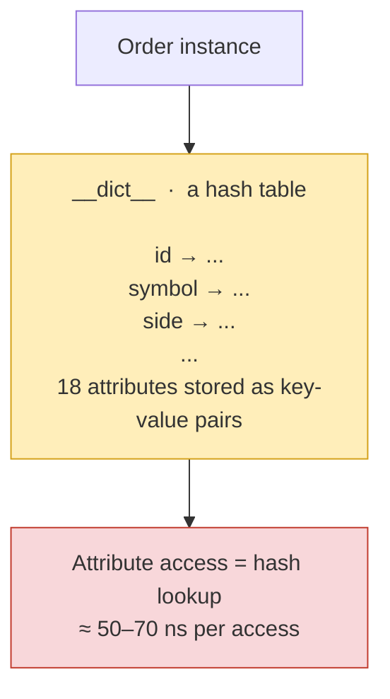
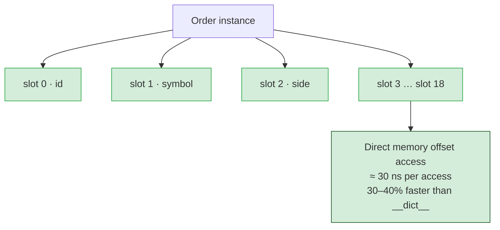
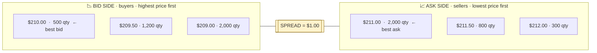
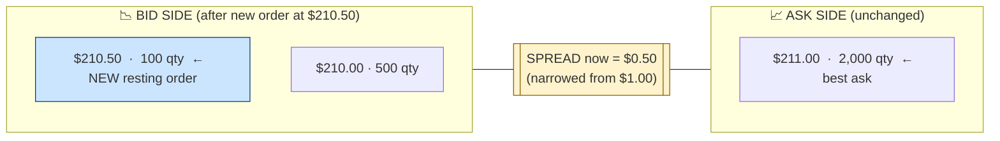
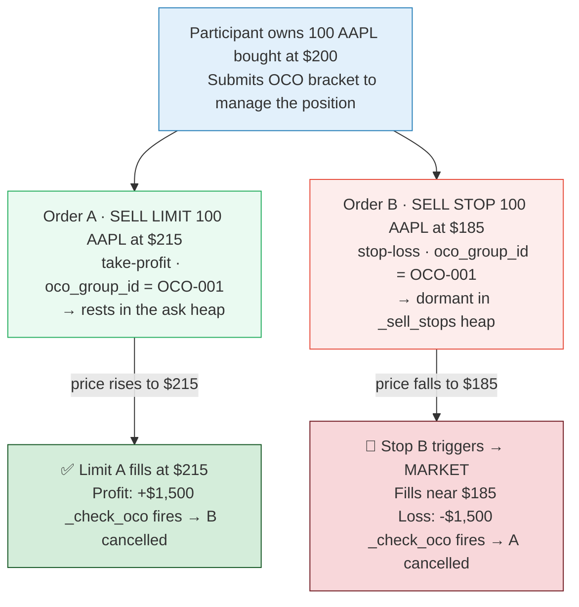
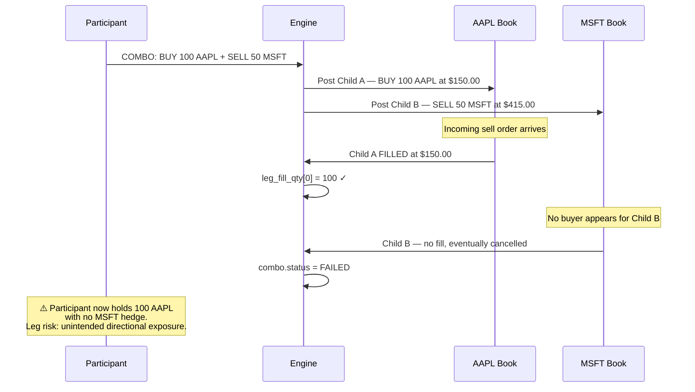
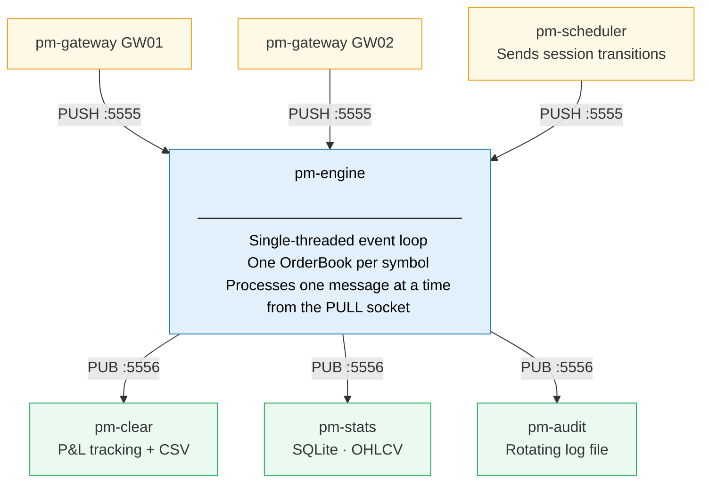
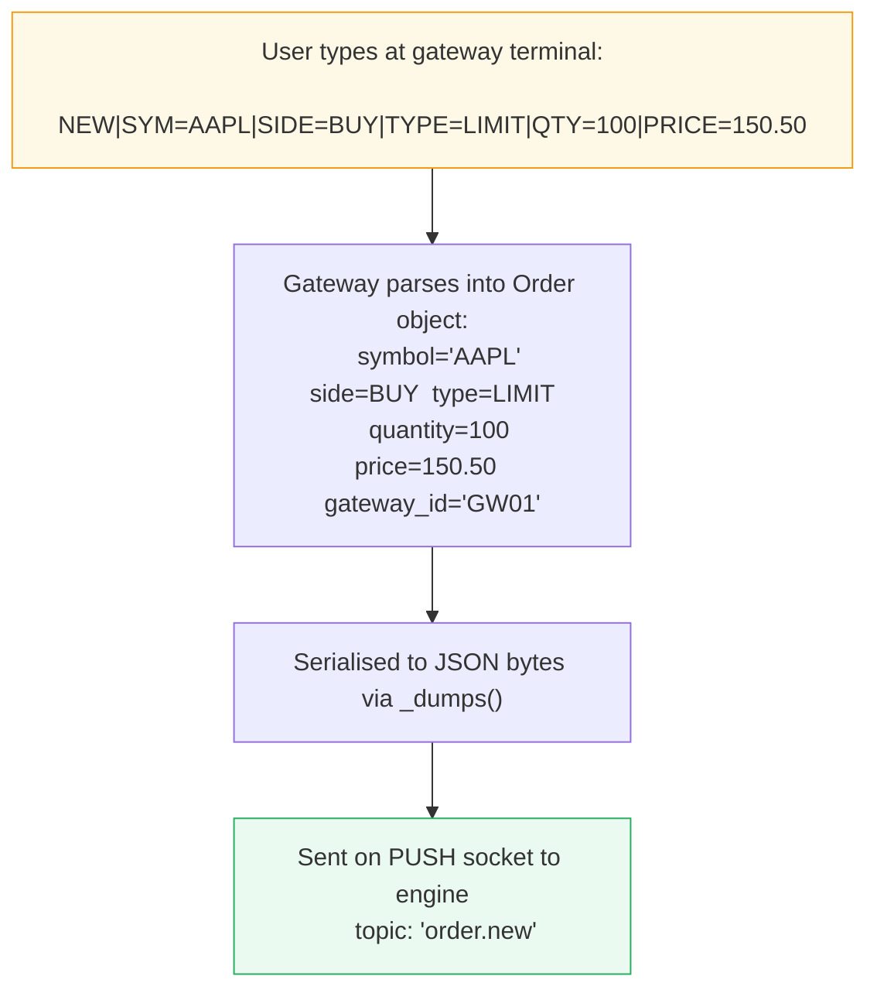
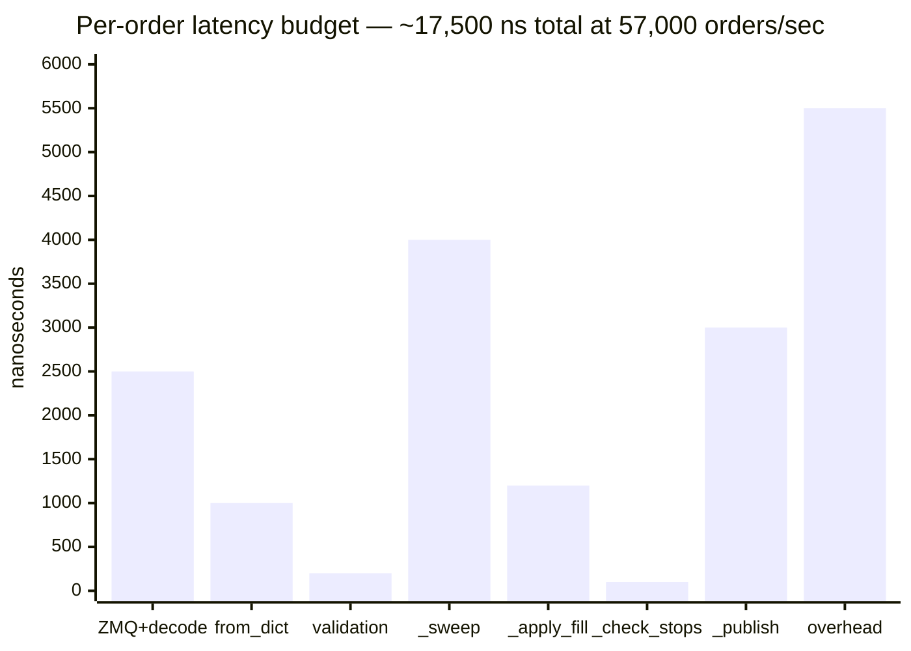

# EduMatcher — Architecture, Data Structures, and Code Walkthrough

> **Audience:** A developer new to both the codebase and financial systems. This
> document builds understanding from first principles — starting with the simplest
> possible trading concept and expanding layer by layer until the full system makes
> sense. Every concept is immediately connected to the actual code that implements it.

> **Note on code samples:** Some code samples in this document show `float` prices
> and `time.time()` timestamps — the original types before the tick migration was
> applied. The production codebase now uses **integer tick prices** (e.g. `$150.30`
> is stored as `15030` for a symbol with a `$0.01` tick size) and **integer
> nanosecond timestamps** from `monotonic_ns()` (see `models/clock.py`). The
> concepts and logic are identical; only the types differ. Where the distinction
> matters it is called out explicitly. See `EduMatcher_Tick_Migration_Plan_v6.md`
> for the full details.

-----

## Quick-Reference Glossary

Terms you will encounter throughout this document, defined up front:

|Term                |Meaning                                                                                                                                       |
|--------------------|----------------------------------------------------------------------------------------------------------------------------------------------|
|**Resting order**   |An order sitting in the book, waiting for a counterparty to fill it                                                                           |
|**Aggressive order**|An incoming order that immediately sweeps against resting orders                                                                              |
|**Passive order**   |The resting order on the other side of a fill; sets the price                                                                                 |
|**Spread**          |The gap between the best bid and best ask prices                                                                                              |
|**TIF**             |Time-In-Force — how long an order stays live                                                                                                  |
|**DAY**             |Order expires at end of the current trading session                                                                                           |
|**GTC**             |Good-Till-Cancelled — order persists across sessions until explicitly cancelled                                                               |
|**ATO**             |At-The-Open — order valid only during the opening auction                                                                                     |
|**ATC**             |At-The-Close — order valid only during the closing auction                                                                                    |
|**FOK**             |Fill-Or-Kill — fill the entire quantity immediately or reject entirely                                                                        |
|**IOC**             |Immediate-Or-Cancel — fill what you can immediately, cancel the rest                                                                          |
|**VWAP**            |Volume-Weighted Average Price — average price weighted by trade size                                                                          |
|**OHLCV**           |Open, High, Low, Close, Volume — standard market data for a time period                                                                       |
|**SMP**             |Self-Match Prevention — detecting when your own orders would trade with each other                                                            |
|**OCO**             |One-Cancels-Other — two linked orders; filling one automatically cancels the other                                                            |
|**P&L**             |Profit and Loss                                                                                                                               |
|**Tick**            |The minimum price increment for an instrument (e.g. $0.01 for US equities)                                                                    |
|**Aggressor side**  |Which side (BUY or SELL) was the incoming aggressive order in a fill                                                                          |
|**Leg risk**        |The risk that one part of a multi-leg order fills while another part does not, leaving an unintended position                                 |
|**GC**              |Garbage Collection — Python’s automatic memory reclamation; frequent allocation of large objects increases GC pressure (time spent collecting)|
|**BST**             |Binary Search Tree — a tree data structure where each node has at most two children and values are stored in sorted order for O(log n) search |

-----

## Table of Contents

1. [Quick-Reference Glossary](#quick-reference-glossary)
1. [What Is an Exchange? The One-Sentence Version](#1-what-is-an-exchange-the-one-sentence-version)
1. [The Limit Order: The Atom of Trading](#2-the-limit-order-the-atom-of-trading)
1. [The Order Book: A Sorted List of Promises](#3-the-order-book-a-sorted-list-of-promises)
1. [The First Match: How Two Orders Become a Trade](#4-the-first-match-how-two-orders-become-a-trade)
1. [Data Structures: Why Heaps?](#5-data-structures-why-heaps)
1. [The Order Model: Every Field Explained](#6-the-order-model-every-field-explained)
1. [Beyond Limit Orders: The Full Order Type Taxonomy](#7-beyond-limit-orders-the-full-order-type-taxonomy)
1. [The Trading Day: Auctions and Continuous Matching](#8-the-trading-day-auctions-and-continuous-matching)
1. [Complex Orders: Combos and OCO](#9-complex-orders-combos-and-oco)
1. [The Message Bus: Why ZeroMQ?](#10-the-message-bus-why-zeromq)
1. [The Full Process Architecture](#11-the-full-process-architecture)
1. [Optimisations: Speed, Memory, and Latency](#12-optimisations-speed-memory-and-latency)
1. [Persistence: Surviving a Restart](#13-persistence-surviving-a-restart)
1. [Clearing and Settlement: Following the Money](#14-clearing-and-settlement-following-the-money)
1. [What Is Missing: The Gap to Production](#15-what-is-missing-the-gap-to-production)

-----

## How to Use This Document

Read sections 1–5 in order — they build on each other and the later sections will
not make sense without them. After Section 5, most sections are self-contained and
can be read in any order depending on what you want to understand.

**Recommended reading sequence for the codebase itself:**

1. `models/order.py` — the atom. Every other file uses `Order`.
1. `engine/order_book.py` — how atoms are organised and matched.
1. `engine/main.py` — how the order book is orchestrated across symbols and sessions.
1. `models/message.py` — what the engine publishes and what format it uses.
1. `gateway/main.py` — how a user interacts with the engine.
1. `clearing/main.py` — how fills become P&L.

The rest of the system (`stats`, `audit`, `ticker`, `board`, `scheduler`,
`ai_trader`) are consumers of events produced by the above. Read them once you
understand the core.

-----

## 1. What Is an Exchange? The One-Sentence Version

An exchange is a system that takes **buy orders** and **sell orders** from many
participants, figures out which buyers and sellers agree on a price, and executes
trades between them.

That is the entire job. Everything else — auctions, stop orders, circuit breakers,
clearing — is elaboration on that core.

EduMatcher implements this job in Python. It is not production-grade (we will be
explicit about what is missing), but it models every core concept faithfully.

-----

## 2. The Limit Order: The Atom of Trading

A **limit order** is a participant saying: *“I want to buy X shares of AAPL, but
I will not pay more than $150.00.”* Or the reverse: *“I want to sell X shares but
I will not accept less than $151.00.”*

The key word is **limit** — the participant places a maximum (for a buy) or minimum
(for a sell) on the price they will accept. This is not the same as saying
“buy at $150.00” — it means “buy at $150.00 *or better*.”

In EduMatcher, this translates directly to the `Order` dataclass:

```python
# models/order.py
@dataclass(slots=True)
class Order:
    id:           str          # globally unique identifier
    symbol:       str          # which instrument: "AAPL", "MSFT", etc.
    side:         Side         # BUY or SELL
    order_type:   OrderType    # LIMIT, MARKET, STOP, etc.
    quantity:     int          # total shares requested
    remaining_qty: int         # shares not yet filled (starts equal to quantity)
    price:        Optional[float]  # the limit price — None for market orders
    gateway_id:   str          # which participant submitted this
    timestamp:    float        # when it arrived (seconds since epoch)
    status:       OrderStatus  # NEW → PARTIAL → FILLED (or CANCELLED, REJECTED, EXPIRED)
```

The `remaining_qty` field is crucial — it is how we track partial fills. If you
order 100 shares and 30 have traded, `remaining_qty` is 70. The order stays in the
book until either `remaining_qty` reaches zero (fully filled) or the order is
cancelled.

### Why `__slots__`?

Notice `@dataclass(slots=True)`. Without `__slots__`, every Python object stores
its attributes in a dictionary:



With `__slots__`, Python replaces the dictionary with a fixed C array:



Each attribute access saves roughly 20-40 nanoseconds. With thousands of fills per
second and 5+ attribute accesses per fill, this compounds to 1-2 microseconds saved
per order — about 15% of the total per-order budget.

Memory savings are also significant: no per-object `__dict__` means each `Order`
uses roughly 40% less memory. With thousands of resting orders in the book, this
reduces both memory consumption and garbage collection pressure.

-----

## 3. The Order Book: A Sorted List of Promises

The **order book** is the core data structure of an exchange. It holds all resting
(unfilled) orders, organised by price level, waiting for a counterparty.

Conceptually, it looks like this for AAPL:



The **spread** is the gap between the best bid ($210.00) and the best ask ($211.00).
In this example, the cheapest you can buy immediately is $211.00. The most you can
sell immediately is $210.00.

**When does a match occur?** Two orders can trade when their prices *cross* — the
buyer’s limit price is at or above the seller’s limit price. In the diagram above,
if a new buy order arrived at $211.00 or higher, it would match against the resting
sell at $211.00. The book would be crossed and a trade would happen.

**When does a match NOT occur?** If a new buy order arrives at $210.50, it cannot
fill immediately — the cheapest available seller wants $211.00, which is more than
the buyer is willing to pay. The new buy order would rest in the book at $210.50,
narrowing the spread. The book would now look like:



This accumulation of unfilled limit orders is what creates depth in the book.

In EduMatcher, this is `OrderBook`:

```python
# engine/order_book.py
class OrderBook:
    __slots__ = (
        "symbol",
        "_bids",       # max-heap of resting buy orders
        "_asks",       # min-heap of resting sell orders
        "_buy_stops",  # min-heap of buy stop orders
        "_sell_stops", # max-heap of sell stop orders
        "_trailing_stops",  # list of trailing stop orders
        "_bid_qty",    # dict[price → total qty at that price level]
        "_ask_qty",    # dict[price → total qty at that price level]
        "_order_index",  # dict[order_id → Order] — for O(1) cancel lookup
        "_entry_index",  # dict[order_id → _HeapEntry] — for lazy deletion
        "last_trade_price",  # most recent fill price — used by stop trigger checks
        "last_trade_qty",    # quantity of the most recent fill
        "last_buy_price",    # most recent price where the aggressor was a buyer
        "last_sell_price",   # most recent price where the aggressor was a seller
        "recent_trades",     # deque[Trade] maxlen=20 — rolling window of last 20 fills,
                             # published in book snapshots so the viewer can show a
                             # live tape of recent transactions for this symbol
    )
```

Notice `__slots__` here too — `OrderBook` is accessed on every incoming order.
With 15 attributes accessed in the matching hot path, every slot optimisation
multiplies across every order processed.

There is one `OrderBook` instance per symbol. The engine holds them in a dict:

```python
# engine/main.py
self.books: dict[str, OrderBook] = {}  # symbol → OrderBook

def _book(self, symbol: str) -> OrderBook:
    if symbol not in self.books:
        self.books[symbol] = OrderBook(symbol)  # create on first order
    return self.books[symbol]
```

-----

## 4. The First Match: How Two Orders Become a Trade

Here is the simplest possible matching scenario:

**Scenario:** The book has a resting sell order: 100 shares of AAPL at $211.00.
A new buy order arrives: 50 shares of AAPL at $215.00 (willing to pay up to $215).

The buy price ($215.00) is higher than the ask price ($211.00). These orders
**cross** — the buyer is willing to pay more than the seller requires. A trade
happens.

In EduMatcher, this flows through `OrderBook.process()`:

```python
def process(self, order: Order, *, match: bool = True, now: int | None = None):
    ...
    elif order.order_type == OrderType.LIMIT:
        self._match_limit(order, trades, events, now)
    ...
```

`_match_limit` calls `_sweep`:

```python
def _match_limit(self, order, trades, events, now):
    opposite = self._asks if order.side == Side.BUY else self._bids
    self._sweep(order, opposite, price_limit=order.price, trades=trades,
                events=events, now=now)
    if order.remaining_qty > 0:
        self._rest(order)  # unfilled remainder rests on the book
```

`_sweep` is the core matching loop:

```python
def _sweep(self, aggressor, opposite_heap, price_limit, trades, events, now):
    # Cache frequently-accessed attributes as locals for speed.
    # (Section 12 shows the full set of cached locals including _smp_action
    # and _gw_id for self-match prevention; this version is simplified.)
    _side = aggressor.side
    _peek = self._peek
    _apply_fill = self._apply_fill

    while aggressor.remaining_qty > 0 and opposite_heap:
        best = _peek(opposite_heap)    # O(1) — best resting order
        if best is None:
            break

        # Price check: stop if the best available price is too expensive
        if price_limit is not None:
            if _side == Side.BUY and best.price > price_limit:
                break  # cheapest ask is above our limit — stop
            if _side == Side.SELL and best.price < price_limit:
                break  # best bid is below our limit — stop

        fill_qty = min(aggressor.remaining_qty, best.remaining_qty)
        fill_price = best.price
        _apply_fill(aggressor, best, fill_qty, fill_price, trades, events, now)
```

The fill price is **always the resting order’s price**, not the aggressor’s price.
This is a fundamental exchange rule: the passive order (sitting in the book) sets
the price. Our buyer offered up to $215 but paid $211 — the resting seller’s price.
This is beneficial to the aggressive side (buyer pays less than maximum) and is how
all continuous limit order markets work.

`_apply_fill` records the trade:

```python
def _apply_fill(self, aggressor, passive, fill_qty, fill_price, trades, events, now):
    if aggressor.side == Side.BUY:
        buy_order, sell_order = aggressor, passive
    else:
        buy_order, sell_order = passive, aggressor

    trade = Trade.create(
        symbol=self.symbol,
        buy_order_id=buy_order.id,
        sell_order_id=sell_order.id,
        buy_gateway_id=buy_order.gateway_id,
        sell_gateway_id=sell_order.gateway_id,
        price=fill_price,
        quantity=fill_qty,
        aggressor_side=aggressor.side.value,  # "BUY" or "SELL" — for clearing/stats
        now=now,  # reuse pre-computed timestamp — no extra syscall
    )
    trades.append(trade)
    self.last_trade_price = fill_price

    # Update quantities
    aggressor.remaining_qty -= fill_qty
    passive.remaining_qty -= fill_qty

    # Update statuses
    aggressor.status = FILLED if aggressor.remaining_qty == 0 else PARTIAL
    passive.status   = FILLED if passive.remaining_qty == 0 else PARTIAL
    if passive.status == FILLED:
        self._entry_index[passive.id].valid = False  # lazy deletion
    ...
```

The result: a `Trade` object is produced and added to the `trades` list. The engine
will publish this to all subscribers on the message bus. The passive order’s heap
entry is marked `valid = False` so `_peek` will skip it next time (lazy deletion —
explained fully in Section 5).

### What Happens to `trades` and `events` After `process()` Returns?

`process()` returns two lists: `trades` (completed fills) and `events` (order state
changes). Back in `engine/main.py`, after `book.process()` returns, the engine
publishes both:

```python
def _handle_new_order(self, payload: dict) -> None:
    ...
    trades, events = book.process(order, match=do_match, now=now)
    self._publish_events(events, book)   # sends fill/cancel acks to gateways
    self._publish_trades(trades)          # sends trade.executed to all subscribers
    self._mark_dirty(symbol)             # schedules a book snapshot
```

`_publish_events()` iterates the `events` list and sends a private fill notification
to each affected gateway — the buyer’s gateway and the seller’s gateway each receive
their own message. These messages are private (topic includes the gateway ID) so only
the relevant participant sees their own fill.

`_publish_trades()` broadcasts the trade to ALL subscribers on the PUB socket with
topic `trade.executed`. The clearing process, stats recorder, and audit log all
receive it.

### The Partial Fill Case

In the scenario above, the buy order was for 50 shares against a sell order for 100
shares. After the fill:

- **Aggressive order (buy 50)**: `remaining_qty = 0` → status = `FILLED`. It is
  consumed entirely.
- **Passive order (sell 100)**: `remaining_qty = 50` → status = `PARTIAL`. It
  remains in the book, still resting at $211.00, waiting for the next buyer.

The next buy order that matches $211.00 would fill against those remaining 50 shares.

-----

## 5. Data Structures: Why Heaps?

### The Problem

The matching engine’s inner loop asks one question thousands of times per second:
*“What is the best resting order right now?”*

For bids: best = highest price. For asks: best = lowest price. The structure must
support:

1. **O(1) peek at the best order** — called on every incoming aggressive order
1. **O(log n) insert** — every new resting order
1. **O(1) cancel** — without scanning the book

A sorted list satisfies (1) but insert/delete are O(n). A balanced BST (Binary
Search Tree — a tree where each node is larger than all nodes in its left subtree
and smaller than all in its right, giving O(log n) search) satisfies all three but
has significant constant-factor overhead in Python. The EduMatcher solution: **a
heap with lazy deletion and a flat index**.

### The Heap

Python’s `heapq` module implements a **min-heap**: a list where `list[0]` is always
the smallest element. Insert and pop are O(log n); reading `list[0]` is O(1).

For asks (we want cheapest first) this is natural. For bids (we want most expensive
first) we negate the price:

```python
# For asks: price goes in directly — lowest ask stays at heap[0]
key = (order.price, order.timestamp)

# For bids: negate price so highest bid sorts first
key = (-order.price, order.timestamp)
```

Using a tuple `(price, timestamp)` as the key encodes **price-time priority** for
free: Python compares tuples element-by-element, so same-price orders are broken by
arrival time automatically.

### The `_HeapEntry` Wrapper

`Order` objects cannot be compared directly (should a BUY be “less than” a SELL?).
The `_HeapEntry` wrapper carries the sort key separately:

```python
class _HeapEntry:
    __slots__ = ("key", "order", "valid")

    def __init__(self, key, order, valid=True):
        self.key   = key    # (±price, timestamp) — the sort key
        self.order = order  # the Order object — never compared
        self.valid = valid  # False when cancelled or filled

    def __lt__(self, other):
        return self.key < other.key  # heapq only calls __lt__
```

`__slots__` here is critical — `_HeapEntry` is the most frequently allocated object
in the system, one per resting order. Without slots, each instance carries a
`__dict__` with three keys, using ~200 bytes. With slots: ~72 bytes and ~30% faster
attribute access. In a book with 5,000 resting orders this saves ~640KB of memory
and reduces GC (Garbage Collection — Python’s automatic memory reclamation) pressure
significantly.

### Lazy Deletion

Python’s `heapq` has no `remove()` operation. Finding and removing an element from
the middle of a heap would require an O(n) scan plus O(log n) re-heapification —
O(n) total. For a high-frequency system, this is unacceptable.

The solution: when an order is cancelled or filled, **do not remove its entry from
the heap**. Just set `entry.valid = False`:

```python
def cancel_order(self, order_id: str) -> Optional[Order]:
    order = self._order_index.get(order_id)
    if order is None:
        return None
    order.status = OrderStatus.CANCELLED
    entry = self._entry_index.get(order_id)
    if entry:
        entry.valid = False    # O(1) — the entry stays in the heap
        self._deduct_qty_index(entry.order, ...)
    return order
```

The `_peek` method handles lazy cleanup:

```python
def _peek(self, heap: list[_HeapEntry]) -> Optional[Order]:
    while heap:
        entry = heap[0]
        if not entry.valid:
            heapq.heappop(heap)  # discard — O(log n), paid once
            continue
        o = entry.order
        if o.status in (FILLED, CANCELLED, REJECTED, EXPIRED):
            heapq.heappop(heap)
            entry.valid = False
            continue
        return o  # valid resting order found
    return None
```

The cost of discarding an invalid entry (one `heappop`) is O(log n), but it is paid
only once per entry. In a busy book where orders are frequently cancelled before
they fill, this approach replaces O(n) remove operations with O(log n) cleanup
spread across many `_peek` calls.

**What “amortised O(1)” means for `_peek`:** In the *worst* case, a single `_peek`
call could pop many stale entries before finding a valid one — O(k log n) where k
is the number of stale entries. But each stale entry is paid for exactly once, by
the single `_peek` call that removes it. Spread across all `_peek` calls over time,
the average cost per call is O(1). This is what “amortised O(1)” means: not O(1)
every time, but O(1) on average over many calls.

### The Dual-Index Pattern

The book maintains two flat dictionaries in parallel with the heaps:

```python
self._order_index:  dict[str, Order]      # order_id → Order
self._entry_index:  dict[str, _HeapEntry] # order_id → heap entry
```

These answer different questions:

- `_order_index`: “Given an order ID, give me the Order object.” Used for cancel
  and amend operations that arrive from the outside with just an order ID.
- `_entry_index`: “Given an order ID, give me its heap entry so I can mark it
  invalid.” Used by the lazy deletion pattern.

Without `_order_index`, cancelling an order requires scanning the heap — O(n).
With it, cancel is two O(1) dict lookups plus setting a boolean.

**Concrete example — cancelling order `"abc-123"`:**

```python
# A cancel message arrives with only the order_id — no symbol, no price.
# Without the indexes, we would need to:
#   1. Scan all 5000 entries in _bids to find it — O(n)
# With the dual index:
#   1. _order_index["abc-123"] → the Order object — O(1)
#   2. _entry_index["abc-123"] → the _HeapEntry → set .valid = False — O(1)
#   3. _bid_qty[order.price] -= order.remaining_qty  — O(1)
#      if _bid_qty[order.price] == 0: del _bid_qty[order.price]  — O(1)
```

That last line is important: when the last resting order at a price level is
cancelled or filled, the price level entry is deleted from `_bid_qty` (or
`_ask_qty`). This keeps the dict compact and ensures the FOK availability check and
depth snapshot only see price levels that actually have live orders at them.

### The Price-Level Quantity Index

```python
self._bid_qty: dict[int, int]  # price_ticks → total qty at that bid level
self._ask_qty: dict[int, int]  # price_ticks → total qty at that ask level
```

This index is maintained in sync with the heap and answers: *“How much total
quantity is available at price X?”*

It enables two expensive operations to become cheap:

**FOK pre-check** — a Fill-Or-Kill order must verify full fillability before any
fills execute. Without this index, checking would require scanning all heap entries
— O(n). With it:

```python
def _available_qty(self, heap, price_limit, side) -> int:
    qty_index = self._ask_qty if side == Side.BUY else self._bid_qty
    total = 0
    for price, qty in qty_index.items():
        if side == Side.BUY  and price <= price_limit: total += qty
        if side == Side.SELL and price >= price_limit: total += qty
    return total
    # O(P) where P = distinct price levels, typically << n
```

`qty_index` is chosen based on which side is being checked: a BUY order needs to
know how much sell-side liquidity is available, so it reads `_ask_qty`. The price
filter then checks whether each price level is within the order’s limit.

**Depth metrics** — computing how much volume sits within 1% of mid price doesn’t
require iterating all resting orders, just the price-level dict.

### Summary: Why This Combination?

|Operation               |Complexity    |Mechanism                |
|------------------------|--------------|-------------------------|
|Peek best order         |O(1) amortised|heap[0] + lazy skip      |
|Insert new resting order|O(log n)      |heappush                 |
|Cancel order            |O(1)          |dict lookup + valid=False|
|Amend (price change)    |O(log n)      |invalidate + new heappush|
|FOK availability check  |O(P)          |price-level dict         |
|Depth metrics           |O(P)          |price-level dict         |
|Full book snapshot      |O(n)          |iterate heap             |

Where n = resting orders, P = distinct price levels (P << n in practice).

-----

## 6. The Order Model: Every Field Explained

> **Migration note:** The field types shown below reflect the **original** codebase
> before the tick migration. In the current codebase: `price`, `stop_price`, and
> `trail_offset` are `Optional[int]` (tick counts), and `timestamp` is `int`
> (nanoseconds from `monotonic_ns()`). The field names and semantics are unchanged.
> See `EduMatcher_Tick_Migration_Plan_v6.md` for the full type changes.

```python
@dataclass(slots=True)
class Order:
    # --- Identity ---
    id:           str       # UUID — globally unique, set at creation
    symbol:       str       # "AAPL", "MSFT" — which instrument

    # --- Order specification ---
    side:         Side      # BUY or SELL
    order_type:   OrderType # LIMIT, MARKET, STOP, STOP_LIMIT, FOK, IOC, ICEBERG, TRAILING_STOP
    tif:          TIF       # Time-In-Force: DAY, GTC, ATO, ATC
    quantity:     int       # original total requested
    remaining_qty: int      # how much is still unfilled
    price:        Optional[float]  # limit price; None for pure market orders

    # --- Stop order fields ---
    stop_price:   Optional[float]  # STOP/STOP_LIMIT/TRAILING_STOP trigger
    trail_offset: Optional[float]  # TRAILING_STOP: distance from market

    # --- Iceberg fields ---
    visible_qty:   Optional[int]   # fixed peak size (e.g. 100 of 1000)
    displayed_qty: Optional[int]   # current visible slice (replenished after fill)

    # --- Execution context ---
    gateway_id:   str       # which participant submitted this
    timestamp:    float     # arrival time (used for price-time priority)
    status:       OrderStatus  # NEW → PARTIAL → FILLED or CANCELLED/REJECTED/EXPIRED

    # --- Self-match prevention ---
    smp_action:   SmpAction # NONE, CANCEL_AGGRESSOR, CANCEL_RESTING, CANCEL_BOTH

    # --- Complex order group membership ---
    oco_group_id:    Optional[str]  # if part of a One-Cancels-Other pair
    combo_parent_id: Optional[str]  # if a leg of a combo order
    leg_index:       Optional[int]  # position in combo legs list (0-based)

    # --- Quote origin (added in the feature plan) ---
    origin:   OrderOrigin   # ORDER (default) or QUOTE (created from a market-maker quote)
    quote_id: Optional[str] # the QuoteEntry ID this leg belongs to; None for regular orders
```

The four SMP actions represent different business policies for what to do when your
own order is about to trade against your other order:

- **`NONE`** — no prevention. Allow self-trading. This is dangerous (creates
  artificial volume, potentially manipulative) but sometimes used in testing or by
  systems that manage their own SMP at a higher level.
- **`CANCEL_AGGRESSOR`** — cancel the incoming order. The resting order stays. Use
  this when you want to protect your standing orders: “I am quoting at $150 and I
  do not want my own algorithmic orders sweeping my own quotes.” The resting order
  continues to be available to other participants.
- **`CANCEL_RESTING`** — cancel the resting order instead, and continue sweeping
  the next order in the queue. Use this when your aggressive order is more important
  than your resting order: “I am sending a new best price and it should supersede
  my old price, not bounce off it.” The sweep loop calls `continue` to look at the
  next resting order, which may belong to a different participant.
- **`CANCEL_BOTH`** — cancel both. Use when you want to clean up: “Neither of these
  orders should exist simultaneously.”

`CANCEL_AGGRESSOR` is the most common default in practice.

### Time-In-Force (TIF): How Long Does the Order Live?

**DAY** — expires at market close. The most common default. On engine shutdown,
all DAY orders receive an `order.expired` notification.

**GTC (Good-Till-Cancelled)** — persists until explicitly cancelled or filled.
Survives engine restarts (saved to `data/gtc_orders.json` on shutdown, restored on
startup). Institutional participants often use GTC to maintain standing limit orders.

**ATO (At-The-Open)** — valid only during the opening auction. The engine rejects
ATO orders submitted outside `OPENING_AUCTION` state:

```python
# engine/main.py
if self._sessions_enabled and order.tif == TIF.ATO and
   self._session_state != SessionState.OPENING_AUCTION:
    # reject with reason "ATO orders only accepted during opening auction"
```

**ATC (At-The-Close)** — same pattern, valid only during `CLOSING_AUCTION`.

### The Enum Design Pattern

All enums in EduMatcher inherit from both `str` and `Enum`:

```python
class Side(str, Enum):
    BUY  = "BUY"
    SELL = "SELL"
```

`Side.BUY == "BUY"` evaluates to `True`. This means enum members can be compared
directly to JSON strings, eliminating conversion in hot paths. When you receive a
JSON message with `"side": "BUY"`, you can compare directly without calling
`Side("BUY")` first.

For deserialization, fast lookup dicts replace the slow `Enum(value)` constructor:

```python
# Built once at module load — O(1) lookup vs O(n) scan inside Enum()
_SIDE_MAP:   dict[str, Side]        = {v.value: v for v in Side}
_TYPE_MAP:   dict[str, OrderType]   = {v.value: v for v in OrderType}
_STATUS_MAP: dict[str, OrderStatus] = {v.value: v for v in OrderStatus}
```

`Enum("BUY")` iterates all members doing string comparisons — ~600-800ns per call.
Dict lookup is ~50ns. With 5 enum constructions per `Order.from_dict()` call (called
on every incoming order), this saves ~3-4µs per order — roughly 15-20% of the
deserialization budget.

### The `from_dict` Bypass

The `Order.from_dict()` method bypasses the `dataclass` `__init__` entirely:

```python
@classmethod
def from_dict(cls, d: dict[str, Any]) -> "Order":
    # PERF: bypass __init__ — saves ~400ns from argument dispatch overhead
    o = object.__new__(cls)
    o.id        = d["id"]
    o.symbol    = d["symbol"]
    o.side      = _SIDE_MAP[d["side"]]
    o.order_type = _TYPE_MAP[d["order_type"]]
    o.tif       = _TIF_MAP[d["tif"]]
    ...
    return o
```

The normal dataclass `__init__` with 19 keyword arguments spends ~400ns on argument
dispatch alone. Writing slot values directly via `__new__` eliminates this.

-----

## 7. Beyond Limit Orders: The Full Order Type Taxonomy

### Market Order

A market order says “buy/sell at whatever price is available right now.” No price
limit. In `_match_market`:

```python
def _match_market(self, order, trades, events, now):
    opposite = self._asks if order.side == Side.BUY else self._bids
    self._sweep(order, opposite, price_limit=None, ...)  # no price check
    if order.remaining_qty > 0:
        order.status = OrderStatus.CANCELLED  # unfillable remainder: discard
```

Note: market orders **cannot rest**. If there is not enough liquidity to fill the
entire quantity, the remainder is discarded (cancelled). This is correct exchange
behaviour — a market order without a price limit cannot sit in the book because
there is nothing to price it at.

### IOC (Immediate-Or-Cancel)

Like a limit order but with a strict rule: fill what you can at the limit price,
cancel any unfilled remainder immediately. Never rests in the book.

```python
def _match_ioc(self, order, trades, events, now):
    self._sweep(order, opposite, price_limit=order.price, ...)
    if order.remaining_qty > 0:
        order.status = OrderStatus.CANCELLED  # unlike LIMIT: never rests
        events.append(order)
```

IOC is useful for participants who want price certainty but are not willing to
wait in the queue.

### FOK (Fill-Or-Kill)

The most restrictive type: either the entire quantity fills immediately or the
entire order is rejected. No partial fills, no resting.

```python
def _match_fok(self, order, trades, events, now):
    opposite = self._asks if order.side == Side.BUY else self._bids
    available = self._available_qty(opposite, order.price, order.side)
    if available < order.quantity:
        order.status = OrderStatus.REJECTED
        events.append(order)
        return  # reject entirely — no fills
    self._sweep(order, opposite, price_limit=order.price, ...)
```

Note the pre-check using `_available_qty`. This uses the `_bid_qty`/`_ask_qty`
price-level index — O(P) rather than O(n) — before any fills are attempted. This
is important for correctness: if the check fails, zero fills have occurred, so
there is no partial state to unwind.

### Stop Orders

A stop order is a **conditional order**: it becomes active (converts to a market or
limit order) when the market price reaches the stop price.

- **Buy stop** — triggers when price **rises** to `stop_price`. Used to buy into
  upward momentum or to limit losses on a short position.
- **Sell stop** — triggers when price **falls** to `stop_price`. Used to cut losses
  on a long position (“stop-loss”).

Stop orders rest in separate heaps, not the bid/ask book:

```python
self._buy_stops:  list[_HeapEntry]  # min-heap keyed by (stop_price, timestamp)
self._sell_stops: list[_HeapEntry]  # max-heap keyed by (-stop_price, timestamp)
```

After every fill, the engine checks whether any stops should trigger:

```python
def _check_stops(self, now: int) -> list[Order]:
    if self.last_trade_price is None:
        return []

    triggered = []

    # Buy stops: fire when last_price >= stop_price
    while self._buy_stops:
        entry = self._buy_stops[0]
        stop_price, _ = entry.key
        if self.last_trade_price < stop_price:
            break  # KEY INSIGHT: heap is sorted — if top hasn't triggered,
                   # none below it will either. O(1) in the common case.
        heapq.heappop(self._buy_stops)
        # Convert stop → market or limit
        stop_order = entry.order
        if stop_order.order_type == OrderType.STOP:
            stop_order.order_type = OrderType.MARKET
            stop_order.price = None
        else:  # STOP_LIMIT
            stop_order.order_type = OrderType.LIMIT
        triggered.append(stop_order)

    # ... similar for sell stops
    return triggered
```

The `break` is the critical optimisation. Because the heap is sorted by stop price,
if the top entry has not triggered, none of the entries deeper in the heap can have
triggered either. This makes stop checking O(1) in the common case (no stops firing)
and O(k log k) when k stops fire. A naive linear scan would be O(s) on every single
trade, where s is the total number of pending stops.

### STOP vs STOP_LIMIT: A Critical Difference

When a stop order triggers, it converts into a different order type. The choice has
a significant risk implication:

- **STOP** → converts to a **MARKET** order. It will fill at whatever price is
  available. If the market has moved sharply (“gapped”), you might fill at a much
  worse price than your stop. For example: your sell stop is at $145. The last trade
  is at $140 (a $5 gap down overnight). Your stop triggers and converts to a market
  sell — you fill at $140, not $145.
- **STOP_LIMIT** → converts to a **LIMIT** order at the original limit price. It
  will only fill at that price or better. This protects you from gap fills — but
  the order may not fill at all if the market has gapped past the limit. Continuing
  the example: your sell stop_limit at $145 converts to a limit sell at $145. The
  market is now at $140 — no buyer wants to pay $145. Your order rests unfilled, and
  your exposure continues.

Neither is strictly better; the choice depends on whether you prioritise execution
certainty (STOP) or price certainty (STOP_LIMIT).

### Trailing Stop Orders

A trailing stop is a stop whose trigger price **moves with the market**. A sell
trailing stop with offset $2 starts at `last_price - $2`. As price rises, the stop
rises with it. If price falls, the stop holds and eventually triggers.

```python
for order in self._trailing_stops:
    if order.side == Side.SELL:
        # Ratchet up: if market rises, tighten the stop
        candidate = trade_price - order.trail_offset
        if candidate > order.stop_price:
            order.stop_price = candidate  # stop can only move up, never down

        # Trigger: price fell to the stop
        if trade_price <= order.stop_price:
            order.order_type = OrderType.MARKET
            triggered.append(order)
            continue

    still_active.append(order)

self._trailing_stops = still_active  # lazy deletion via list rebuild
```

Trailing stops use a simple list rather than a heap because their stop price changes
on every trade. Maintaining heap order would require re-heapifying on every price
update — expensive. The list is iterated fully each time, but trailing stop lists
are typically short.

### Iceberg Orders

An iceberg order hides most of its quantity. It shows only a `visible_qty` (the
“tip”) in the public book; the hidden reserve is not visible to other participants.

**Why use an iceberg?** A participant wanting to buy 10,000 shares of a thinly
traded stock faces a problem: if they show 10,000 shares as a resting buy, other
participants see the large demand and may raise their ask prices. By showing only
100 shares at a time, the buyer avoids revealing their true intention and gets
better prices.

**Concrete example:** An iceberg BUY order arrives with `quantity=1000`,
`visible_qty=100`. In the book, only 100 shares are visible. A sell order arrives
and fills those 100 shares. The iceberg replenishes: a new 100-share peak is
created from the remaining 900 hidden shares. This continues until either all
1,000 shares fill or the order is cancelled. Each replenishment resets the timestamp,
putting the iceberg at the back of its price level’s queue.

```python
# Resting: only displayed_qty is shown to the market
def _rest(self, order: Order) -> None:
    qty = (
        order.displayed_qty           # iceberg: show only the peak
        if order.order_type == OrderType.ICEBERG
        else order.remaining_qty      # regular: show full quantity
    )
    ...
    self._bid_qty[order.price] = self._bid_qty.get(order.price, 0) + qty
```

After the visible slice is consumed, it replenishes from the hidden reserve and
goes to the **back of the queue** at its price level:

**Why back of the queue?** Fairness. Other participants who have been patiently
waiting at the same price level should not be indefinitely displaced by an iceberg
that keeps recycling to the front. Each time the iceberg replenishes, it takes its
turn at the back, just like any other new order arriving at that price.

```python
# In _apply_fill, after filling a passive iceberg:
if passive.remaining_qty > 0 and passive.displayed_qty == 0:
    new_peak = min(passive.visible_qty, passive.remaining_qty)
    passive.displayed_qty = new_peak
    passive.timestamp = now  # back of queue — new timestamp
    self._reinsert_iceberg(passive)  # invalidate old entry, push new one
```

The timestamp update is the key mechanism. By resetting the timestamp, the
replenished iceberg gets a later key than any order that was already waiting at
that price, correctly losing queue priority.

-----

## 8. The Trading Day: Auctions and Continuous Matching

Real exchanges do not simply run continuous matching all day. A typical trading day
looks like this:

```mermaid
timeline
    title Trading Day Session States
    09:00 : PRE_OPEN
          : Orders accepted
          : No matching yet
    09:25 : OPENING_AUCTION
          : Collect resting interest
          : No matching
    09:30 : CONTINUOUS
          : Normal continuous matching
          : Runs until 16:00
    16:00 : CLOSING_AUCTION
          : Collect resting interest
          : No matching
    16:05 : CLOSED
          : No new orders accepted
```

This is modelled in `models/session.py`:

```python
class SessionState(str, Enum):
    PRE_OPEN         = "PRE_OPEN"
    OPENING_AUCTION  = "OPENING_AUCTION"
    CONTINUOUS       = "CONTINUOUS"
    CLOSING_AUCTION  = "CLOSING_AUCTION"
    CLOSED           = "CLOSED"

VALID_TRANSITIONS = {
    SessionState.PRE_OPEN:        {SessionState.OPENING_AUCTION, SessionState.CONTINUOUS},
    SessionState.OPENING_AUCTION: {SessionState.CONTINUOUS},
    SessionState.CONTINUOUS:      {SessionState.CLOSING_AUCTION, SessionState.CLOSED},
    SessionState.CLOSING_AUCTION: {SessionState.CLOSED},
    SessionState.CLOSED:          {SessionState.PRE_OPEN},
}
```

The `VALID_TRANSITIONS` dict enforces that the engine cannot jump from, say,
`CLOSED` directly to `CONTINUOUS` — sessions must flow through the defined states.

**Why enforce transitions explicitly?** Without this guard, a bug in the scheduler
(or a test script that sends transitions in the wrong order) could put the engine
in an impossible state — for example, jumping from `CLOSED` directly to
`CONTINUOUS`, bypassing the opening auction entirely. Real exchange rules require
that every trading day begins with an opening auction to establish a fair opening
price. Encoding the valid transitions explicitly ensures the engine’s session logic
can never be violated by external inputs.

### The Scheduler: A Separate Process

Transitions are driven by the `pm-scheduler` process — a completely separate Python
process that sends `session.transition` messages to the engine over ZMQ:

```python
# scheduler/main.py
for hhmm, state in schedule:
    target = _time_today(hhmm)
    wait_secs = (target - datetime.now()).total_seconds()
    time.sleep(wait_secs)
    push_sock.send_multipart(make_session_transition_msg(state))
```

The key design insight: **the engine does not know what time it is**. It receives
transitions from outside. This means the scheduler can be replaced with a test
harness that fires all transitions immediately (`--now` mode), without changing the
engine at all.

### No-Matching Mode: Collecting Auction Interest

During auction phases, `OrderBook.process()` is called with `match=False`:

```python
def process(self, order, *, match: bool = True, now=None):
    if not match:
        if order.order_type in (OrderType.MARKET, OrderType.FOK, OrderType.IOC):
            order.status = OrderStatus.REJECTED
            return trades, events  # these cannot rest
        self._rest(order)  # LIMIT/ICEBERG rest without matching
        return trades, events
```

Market, FOK, and IOC orders are rejected during auctions — they require immediate
execution which is not available. Limit orders simply rest and accumulate.

### The Auction Uncross

At the end of an auction, `compute_equilibrium` finds the price that maximises
executable volume:

```python
# engine/auction.py
def compute_equilibrium(book: "OrderBook") -> AuctionResult:
    # Build cumulative buy and sell quantities at each price level
    # Uses _bid_qty and _ask_qty directly — O(P) not O(n)
    bid_prices = sorted(book._bid_qty.keys(), reverse=True)
    ask_prices = sorted(book._ask_qty.keys())

    # For each candidate price P:
    # buy_qty  = Σ bids at prices >= P  (buyers willing to pay at least P)
    # sell_qty = Σ asks at prices <= P  (sellers willing to accept at most P)
    # exec_qty = min(buy_qty, sell_qty) — how much actually trades
    # Pick P that maximises exec_qty; break ties by minimising surplus
```

For example, imagine this auction book:

```
Price    Cumul. bids (qty willing to pay ≥ P)    Cumul. asks (qty willing to accept ≤ P)    Executable
$209     1,000                                    0                                          0   (all sellers want ≥$210; none will take $209)
$210       700                                  300                                        300   min(700, 300) = 300
$211       500                                  700                                        500   min(500, 700) = 500  ← maximum
$212       200                                  900                                        200
```

**Cumulative bids at price P** = total quantity of buy orders with a limit price *at or above P* — buyers willing to pay at least P. As P rises, fewer buyers qualify, so the cumulative count falls.

**Cumulative asks at price P** = total quantity of sell orders with a limit price *at or below P* — sellers willing to accept P or anything higher. As P falls, fewer sellers qualify, so the cumulative count also falls.

Equilibrium price = $211 (maximises volume at 500 lots)

After uncross: 500 trades happen at $211
· 500 lots of buy orders at $211+ are filled
· 500 lots of sell orders at $211 and below are filled
· Remaining: 200 buy orders still resting (bid surplus)

Tie-breaking: if two candidate prices produce the same executable volume, the
algorithm picks the price closest to the previous close (the reference price from
`book_stats.json`).

After finding the price, `execute_uncross` fills all crossable interest:

```python
def execute_uncross(book, eq_price):
    now = monotonic_ns()  # from models/clock.py — single strictly-increasing
                          # nanosecond timestamp for all auction fills
    while True:
        best_bid = book._peek(book._bids)
        best_ask = book._peek(book._asks)
        if best_bid is None or best_ask is None:
            break
        if best_bid.price < eq_price: break  # remaining bids below equilibrium
        if best_ask.price > eq_price: break  # remaining asks above equilibrium
        fill_qty = min(best_bid.remaining_qty, best_ask.remaining_qty)
        book._apply_fill(best_bid, best_ask, fill_qty, eq_price, ...)
```

All auction fills happen at the single equilibrium price, simultaneously. The
`now = monotonic_ns()` outside the loop means all trades in one auction uncross share
the same timestamp — reflecting their logical simultaneity.

-----

## 9. Complex Orders: Combos and OCO

Iceberg orders are covered in Section 7. This section covers the two order types
that link multiple orders together at the engine level.

### OCO (One-Cancels-Other)

An OCO pair consists of two orders linked together. When either fills, the other
is automatically cancelled. A typical use: “I bought AAPL at $200 and I want to
automatically take profit at $215, but also automatically cut my loss if price falls
to $185.” OCO pairs can span different symbols — a long position in one stock could
be protected by a stop order in a correlated one.

**Concrete OCO lifecycle — take-profit at $215, stop-loss at $185:**



Only one of outcome 2a or 2b ever occurs — whichever fills first cancels its sibling.
The participant is guaranteed to exit their position at one of the two prices.

```python
# engine/main.py
self._oco_groups:   dict[str, list[str]] = {}  # oco_id → [order_id_1, order_id_2]
self._order_to_oco: dict[str, str]       = {}  # order_id → oco_id
```

After any fill that reaches FILLED status:

```python
def _check_oco_after_event(self, order: Order) -> None:
    oco_id = order.oco_group_id
    order_ids = self._oco_groups.get(oco_id)
    sibling_ids = [oid for oid in order_ids if oid != order.id]
    for sibling_id in sibling_ids:
        symbol = self._order_symbol.get(sibling_id)
        book = self.books.get(symbol)
        if book:
            cancelled = book.cancel_order(sibling_id)
            if cancelled:
                self.pub_sock.send_multipart(make_oco_cancelled_msg(...))
    self._oco_groups.pop(oco_id, None)
```

### Combo Orders (Multi-Leg)

A combo order ties multiple single-instrument orders together. The implemented
semantics is AON (All-Or-None): the combo is considered complete only when all
legs fill. If any leg fails, the remaining legs are cancelled.

```python
# models/combo.py
@dataclass
class ComboOrder:
    id:              str          # internal UUID
    combo_id:        str          # user-provided label
    gateway_id:      str
    combo_type:      ComboType    # AON
    tif:             TIF
    legs:            list[ComboLeg]
    child_order_ids: list[str]    # populated after child orders are created
    leg_fill_qty:    dict[int, int]  # leg_index → filled quantity
    leg_statuses:    dict[int, str]  # leg_index → OrderStatus value
```

The engine decomposes a combo into individual child orders, one per leg, and posts
them to their respective symbol books:

```python
def _accept_combo(self, combo: ComboOrder, ...) -> bool:
    for i, leg in enumerate(combo.legs):
        child = Order.create(symbol=leg.symbol, side=leg.side, ...)
        child.combo_parent_id = combo.id
        child.leg_index = i

        self._order_to_combo[child.id] = combo.id
        book = self._book(leg.symbol)
        trades, events = book.process(child)
        ...

    self._combos[combo.id] = combo
```

When a child fills, the engine updates the parent combo’s status. When all legs
fill, the combo is marked `MATCHED`:

```python
def _check_combo_after_child_event(self, order: Order) -> None:
    combo_id = self._order_to_combo.get(order.id)
    combo = self._combos.get(combo_id)
    combo.leg_statuses[order.leg_index] = order.status.value
    combo.leg_fill_qty[order.leg_index] = order.quantity - order.remaining_qty

    if combo.is_fully_filled:
        combo.status = ComboStatus.MATCHED
        self.pub_sock.send_multipart(make_combo_status_msg(..., "MATCHED"))
    elif order.status in (CANCELLED, EXPIRED, REJECTED):
        # Cascade cancel: one leg failed, cancel all remaining
        combo.status = ComboStatus.FAILED
        for child_id in combo.child_order_ids:
            if child_id != order.id:
                symbol = self._order_symbol.get(child_id)
                book = self.books.get(symbol)
                if book:
                    book.cancel_order(child_id)
```

**Important limitation:** this implementation has **leg risk** — the risk that one
leg fills while another does not, leaving an unintended open position. Child orders
are posted to independent books. If Leg A fills but Leg B never fills, the combo
reaches `FAILED` and Leg B is cancelled — but Leg A’s fill is a real, committed
trade. It cannot be reversed. True atomic combo matching requires a dedicated combo
book where both sides must match simultaneously. This is not implemented.

**Concrete legging risk scenario:**



This is why production combo matching uses a dedicated combo order book where both
legs are evaluated together before any fills are committed.

-----

## 10. The Message Bus: Why ZeroMQ?

### The Problem with Direct Function Calls

Imagine implementing the exchange as a single monolithic program. The matching
engine calls clearing functions directly; the viewer calls engine functions to get
book state; the stats recorder calls engine functions to get trades. This works but
has severe problems:

1. **Tight coupling**: the engine must know about clearing, the viewer, the stats
   recorder. Adding a new consumer requires modifying the engine.
1. **Single process**: a crash in the clearing code crashes the matching engine —
   catastrophic.
1. **Scalability**: you cannot run clearing on a different machine.
1. **Testing**: you cannot test the engine without starting all other components.

### The Publish-Subscribe Pattern

EduMatcher uses a **message bus** — a communication channel where:

- The **engine publishes** events (trades, fills, book updates)
- Any number of **subscribers** receive the events they care about
- The engine has **no knowledge of its subscribers**

This is the ZeroMQ PUB/SUB pattern:

```python
# messaging/bus.py

def make_publisher(addr: str) -> zmq.Socket[bytes]:
    """PUB socket — engine binds here, broadcasts everything."""
    sock = get_context().socket(zmq.PUB)
    sock.bind(addr)
    return sock

def make_subscriber(addr: str, *topics: str) -> zmq.Socket[bytes]:
    """SUB socket — subscriber connects and filters by topic prefix."""
    sock = get_context().socket(zmq.SUB)
    sock.connect(addr)
    for t in topics:
        sock.setsockopt(zmq.SUBSCRIBE, t.encode())
    return sock
```

The engine publishes on port 5556. Every other process connects to 5556 and
subscribes to the topics it cares about. The engine does not know or care who is
listening.

### Topic-Based Filtering

ZeroMQ PUB/SUB filters by message prefix at the network level — subscribers only
receive messages whose topic matches their subscription prefix. This means:

- The clearing process subscribes to `"trade.executed"` — receives only trades
- The stats process subscribes to `"trade.executed"` and `"book."` — trades and
  book snapshots
- The audit process subscribes to `""` (empty prefix) — receives everything
- A specific gateway subscribes to `"order.fill.GW01"` — only its own fills

```python
# clearing/main.py
self.sub = make_subscriber(ENGINE_PUB_ADDR, "trade.executed")

# stats/main.py
self.sub = make_subscriber(ENGINE_PUB_ADDR, "trade.executed", "book.", "system.eod")

# audit/main.py
self.sub = make_subscriber(ENGINE_PUB_ADDR)  # no topics = subscribe to all
```

ZeroMQ performs topic matching in the PUB socket’s send path before the bytes even
hit the network. This means processes that subscribe to only one topic type see zero
overhead from the thousands of other messages being published per second.

### PUSH/PULL for Order Submission

Order submission uses a different ZeroMQ pattern — PUSH/PULL:

```python
# engine binds a PULL socket
ENGINE_PULL_ADDR = "tcp://127.0.0.1:5555"
self.pull_sock = make_puller(ENGINE_PULL_ADDR)

# each gateway connects a PUSH socket
push_sock = make_pusher(ENGINE_PULL_ADDR)
push_sock.send_multipart(make_order_new_msg(order.to_dict()))
```

PUSH/PULL is a pipeline pattern: multiple pushers (gateways) deliver work to one
puller (engine). ZeroMQ handles buffering and flow control. The engine processes one
message at a time from its single PULL socket — this single-reader property is what
makes the engine naturally thread-safe without any locks.

### Message Format

Every ZMQ message is two frames:

```
Frame 0: topic bytes (e.g. b"order.fill.GW01")
Frame 1: JSON payload bytes (e.g. b'{"order_id": "...", "fill_qty": 100, ...}')
```

```python
# models/message.py
def encode(topic: str, payload: dict[str, Any]) -> list[bytes]:
    return [topic.encode(), _dumps(payload)]

def decode(frames: list[bytes]) -> tuple[str, dict[str, Any]]:
    topic   = frames[0].decode()
    payload = _loads(frames[1])
    return topic, payload
```

For JSON serialization, EduMatcher uses `orjson` when available — a C-extension
library that is ~9-10x faster than the Python standard library `json`:

```python
try:
    import orjson as _json_mod
    def _dumps(obj): return _json_mod.dumps(obj)  # returns bytes directly
    def _loads(data): return _json_mod.loads(data)
except ImportError:
    import json as _json_fallback
    def _dumps(obj): return _json_fallback.dumps(obj).encode()
    def _loads(data): return _json_fallback.loads(data)
```

At 2-4 encode/decode calls per order on the hot path, the difference between
`json` (~2.1µs/call) and `orjson` (~0.22µs/call) saves 4-7µs per order — a
significant fraction of the total latency budget.

### Why ZeroMQ Specifically?

Several message bus technologies exist. ZeroMQ was chosen for EduMatcher because:

**Brokerless** — no central message broker process to manage. Each socket connects
directly. This simplifies deployment and eliminates a single point of failure.

**In-process or cross-network** — switching from `tcp://127.0.0.1:5555` to
`tcp://10.0.1.5:5555` requires changing a single string. The same code works for
local processes and distributed systems.

**Extremely low latency** — ZeroMQ message passing overhead is in the microseconds.
For a trading system where each additional millisecond matters, this is essential.

**Simple API** — 5 lines to create a publisher, 3 lines to create a subscriber.
The bus abstraction `messaging/bus.py` is 68 lines total.

**Zero configuration** — no broker process, no configuration files, no schema
registry. Just connect and start sending.

-----

## 11. The Full Process Architecture

EduMatcher is a **multi-process system**. Each process is a separate Python program
with its own memory space, started independently. The diagram below shows the
core message-flow processes. Display processes (`pm-viewer`, `pm-board`, `pm-ticker`)
and the AI trader (`pm-ai-trader`) also connect to the PUB socket on port 5556 but
are omitted for clarity — they are pure subscribers that display data and never send
orders to the engine.



### The Engine: Single-Threaded by Design

The matching engine uses a single-threaded **event loop** — a programming pattern
where a program continuously waits for the next event (a message, a timeout, a
signal), processes it fully, then returns to waiting. No work happens in parallel;
everything is sequential. This is not a limitation — it is a deliberate design
choice:

```python
# engine/main.py
while self._running:
    socks = dict(poller.poll(timeout=200))  # wait up to 200ms for a message
    if self.pull_sock in socks:
        frames = self.pull_sock.recv_multipart()
        topic, payload = decode(frames)
        if topic == "order.new":
            self._handle_new_order(payload)
        elif topic == "order.cancel":
            self._handle_cancel(payload)
        # ... etc
    self._flush_snapshots()  # throttled book snapshot publishing
```

Because only one message is processed at a time, there are **no race conditions**.
Every data structure in the engine — `self.books`, `self._order_symbol`,
`self._combos`, `self._oco_groups` — is modified by a single thread. No locks
are needed. No atomic operations. No memory barriers.

This is a well-known pattern in financial systems: a **single-writer** architecture
where correctness is ensured by sequential processing rather than synchronisation.
The cost is that the engine cannot use multiple CPU cores for matching — but in
practice, a single modern CPU core can process tens of thousands of orders per
second, more than sufficient for most exchange volumes.

### The Gateway: User Interface

The gateway translates human-readable ALF commands into ZMQ messages
(see [ALF Protocol Reference](../user-guide/20-app-alf-protocol.md)):



The gateway has two threads:

- **Main thread**: reads commands from stdin (with readline/prompt_toolkit), sends
  to engine
- **Subscriber thread**: listens for responses from the engine (acks, fills,
  cancellations), displays them to the user

These threads communicate via ZMQ rather than shared memory, keeping them decoupled.

### Clearing: Tracking Positions and P&L

```python
# clearing/main.py
@dataclass
class PositionRecord:
    symbol:       str
    gateway_id:   str
    position:     float = 0.0   # net qty (+ = long, - = short)
    avg_cost:     float = 0.0   # VWAP cost basis
    realized_pnl: float = 0.0   # from closed legs
    last_price:   float = 0.0

    @property
    def unrealized_pnl(self) -> float:
        return self.position * (self.last_price - self.avg_cost)
```

The clearing process subscribes to `trade.executed`, updates a P&L ledger for each
participant on each side of every trade, and appends to a CSV file. The VWAP cost
basis update:

```python
def apply_fill(self, qty: int, price: float, is_buy: bool) -> None:
    signed_qty = qty if is_buy else -qty
    if (self.position > 0 and is_buy) or (self.position < 0 and not is_buy):
        # Adding to position — volume-weighted average price update
        total_cost = self.avg_cost * abs(self.position) + price * qty
        self.position += signed_qty
        self.avg_cost = total_cost / abs(self.position)
    else:
        # Reducing position — realise P&L at the difference from avg cost
        reduce_qty = min(qty, abs(self.position))
        self.realized_pnl += (price - self.avg_cost) * reduce_qty * (1 if self.position > 0 else -1)
        self.position += signed_qty
```

### Stats: OHLCV and Market Data

The stats process subscribes to trades and book snapshots, persisting them to
SQLite:

- `trade_log` — every individual trade (price, quantity, buyer, seller)
- `daily_stats` — one row per (date, symbol): open, high, low, close, volume,
  VWAP, trade count
- `price_snapshots` — mid-price snapshot every 15 minutes per symbol

### Audit: The Complete Event Log

The audit process subscribes to **all topics** (empty filter):

```python
self.sub = make_subscriber(ENGINE_PUB_ADDR)  # subscribes to everything
```

Every event — order acks, fills, cancellations, trades, book snapshots, session
transitions — is written as a timestamped JSON line to a rotating log file. This
is the closest thing to a full audit trail in the system.

-----

## 12. Optimisations: Speed, Memory, and Latency

This section collects all performance-oriented decisions in one place, explains
the reasoning, and quantifies the expected impact where possible.

### The Latency Budget

Before reading individual optimisations, it helps to understand what we are
optimising for. At the tested throughput of 57,000 orders/second, each order has
**~17.5 microseconds** of budget (1 second ÷ 57,000):



|Step|Component                                |Cost          |Notes                            |
|----|-----------------------------------------|--------------|---------------------------------|
|1   |ZMQ receive + decode JSON                |~2,500 ns     |                                 |
|2   |`Order.from_dict()`                      |~1,000 ns     |With `__new__` bypass + enum maps|
|3   |Tick validation + price conversion       |~200 ns       |                                 |
|4   |`_sweep()` matching loop                 |~4,000 ns     |Varies by fill count             |
|5   |`Trade.create()` + `_apply_fill()`       |~1,200 ns     |                                 |
|6   |`_check_stops()`                         |~100 ns       |O(1) when no stops trigger       |
|7   |`_publish_events()` + `_publish_trades()`|~3,000 ns     |JSON encode + ZMQ send           |
|8   |Overhead (function calls, misc)          |~5,500 ns     |                                 |
|    |**Total**                                |**~17,500 ns**|                                 |

Each optimisation in this section attacks one of these buckets. The numbers are
approximate and vary by hardware, OS scheduler, and fill rate — but the relative
proportions are stable. JSON serialization and the sweep loop together consume the
most time; both receive dedicated optimisations below.

### Architecture: Single Timestamp Per Order

```python
# engine/main.py — _handle_new_order()
now = monotonic_ns()  # ONE call per incoming order — int nanoseconds
                      # from models/clock.py; guaranteed strictly increasing

trades, events = book.process(order, match=do_match, now=now)
# now is threaded through:
#   _match_limit → _sweep → _apply_fill → Trade.create(now=now)
#   _check_stops → triggered.timestamp = now
#   _reinsert_iceberg → iceberg.timestamp = now
```

`monotonic_ns()` is a wrapper around `time.time_ns()` that guarantees strictly
increasing values even when the system clock steps backward (e.g. due to NTP
adjustments on a virtual machine). Each call costs ~300-500ns on macOS/Linux. An
aggressive order that triggers stop orders can recurse through `process()` several
times. Without this optimisation, each level of recursion would call `monotonic_ns()`
independently. With it: one call, threaded through as a parameter.

**Why do triggered stops need the same `now` as the original order?**

When an aggressive order fills and triggers a stop, the stop order enters the book
with `timestamp = now`. If the triggered order were assigned a fresh `monotonic_ns()`
timestamp, it would appear to have arrived *later* than the fill that triggered it —
which is technically accurate but creates a subtle inconsistency: all the events
produced by one incoming message would have slightly different timestamps, making
the audit log harder to reason about. Using the same `now` for the entire cascade
means “all events caused by message X happened at time T.”

Savings: 2-4 `monotonic_ns()` calls eliminated per aggressive order with stops ≈
0.6-2µs per order.

### `__slots__` on All Hot-Path Objects

Applied to: `Order`, `Trade`, `_HeapEntry`, `OrderBook`.

The reasoning is the same for all: these are the objects accessed most frequently
in the inner loop. `__slots__` eliminates the per-object `__dict__`, making
attribute access ~30% faster and reducing memory by ~40% per instance. This also
reduces GC (Garbage Collection) pressure — with fewer and smaller objects allocated
per order, Python’s garbage collector runs less frequently.

At 57,000 orders/second (the tested throughput), `__slots__` on `Order` alone saves
roughly 2µs per order from reduced attribute lookup in the sweep loop.

### Pre-Built Enum Lookup Dicts

```python
_SIDE_MAP:   dict[str, Side]   = {v.value: v for v in Side}
_TYPE_MAP:   dict[str, OrderType] = {v.value: v for v in OrderType}
# ... etc
```

Python’s `Enum("BUY")` constructor iterates all members doing string comparisons.
For a 5-member enum this is ~600-800ns. A dict lookup is ~50ns. With 5 enum
constructions per `Order.from_dict()`, this saves ~3-4µs per inbound order.

### `from_dict` via `__new__` Bypass

```python
o = object.__new__(cls)     # skip __init__ entirely
o.id = d["id"]              # write slots directly
o.side = _SIDE_MAP[d["side"]]
# ...
```

The dataclass-generated `__init__` with 19 keyword arguments spends ~400ns on
Python’s argument parsing and dispatch machinery. Bypassing it via `__new__` and
direct slot writes reduces `from_dict` from ~1400ns to ~1000ns — a 29% improvement
on the deserialization hot path.

### Pre-Cached ZMQ Topic Bytes

```python
# engine/main.py
self._topic_cache: dict[str, bytes] = {}

# On first order from a gateway, populate all hot topics:
_tc[_gw]               = f"order.ack.{_gw}".encode()
_tc[f"fill.{_gw}"]     = f"order.fill.{_gw}".encode()
_tc[f"cancel.{_gw}"]   = f"order.cancelled.{_gw}".encode()

# On every subsequent order, use the cached bytes:
self.pub_sock.send_multipart([
    _tc.get(f"fill.{evt.gateway_id}") or f"order.fill.{evt.gateway_id}".encode(),
    _dumps({...}),
])
```

Building a ZMQ topic bytes object requires an f-string format operation plus
`.encode()`. Cost: ~100ns per message. With 3-4 messages per order and thousands
of orders per second, pre-caching saves ~300-400ns per order.

### Inlined Message Dicts on Hot Paths

The `make_fill_msg()` helper function builds a base dict then calls `.update()` to
merge order fields. Two allocations plus a hash merge. For high-frequency paths,
EduMatcher inlines the entire dict literal:

```python
# Instead of:
self.pub_sock.send_multipart(make_fill_msg(gw, order_id, fill_qty, ...))

# The engine uses (prices converted from int ticks to float at this output boundary):
from edumatcher.models.price import from_ticks

self.pub_sock.send_multipart([
    fill_topic_bytes,           # pre-cached
    _dumps({                    # single allocation, single orjson call
        "order_id":      evt.id,
        "fill_qty":      evt.quantity - evt.remaining_qty,
        "fill_price":    from_ticks(book.last_trade_price, evt.symbol),
        "remaining_qty": evt.remaining_qty,
        "status":        evt.status.value,
        "symbol":        evt.symbol,
        "side":          evt.side.value,
        "order_type":    evt.order_type.value,
        "qty":           evt.quantity,
        "price":         from_ticks(evt.price, evt.symbol) if evt.price else None,
    }),
])
```

The helper function is preserved in `message.py` for use in non-hot paths
(testing, less-frequent operations) where readability matters more than speed.

### Throttled Book Snapshot Publishing

Publishing a full order book snapshot requires iterating all heap entries — O(n).
Doing this on every fill at high throughput would consume significant CPU on
serialization alone.

```python
SNAPSHOT_INTERVAL = 0.5  # seconds

def _flush_snapshots(self) -> None:
    # time.monotonic() here is correct and intentional. We are measuring
    # elapsed wall-clock duration (how many seconds since the last snapshot),
    # NOT generating an event timestamp for price-time priority. For duration
    # measurements, time.monotonic() returning a float of seconds is exactly
    # right. monotonic_ns() from models/clock.py is only for event timestamps.
    now = time.monotonic()
    sent: set[str] = set()
    for symbol in self._dirty_symbols:
        last = self._last_snapshot.get(symbol, 0.0)
        if now - last >= self.SNAPSHOT_INTERVAL:
            book = self.books.get(symbol)
            if book:
                self.pub_sock.send_multipart(make_book_msg(symbol, book.snapshot()))
            self._last_snapshot[symbol] = now
            sent.add(symbol)
    self._dirty_symbols -= sent
```

Books are marked “dirty” when any order changes their state. Snapshots are
published at most every 500ms per symbol, regardless of fill rate. This decouples
snapshot publishing cost from order throughput.

### Trade ID: Monotonic Counter Instead of UUID

```python
# models/trade.py
_trade_counter = itertools.count(1)

@classmethod
def create(cls, ...):
    return cls(
        id=str(next(_trade_counter)),  # ≈50ns
        ...
    )
```

`uuid.uuid4()` calls `/dev/urandom` — a system call costing ~1.5-2µs. Trade IDs
only need to be unique within a single engine run (order IDs, assigned by gateways,
need global uniqueness). The monotonic counter eliminates the syscall entirely.
At 57,000 trades per second, this saves ~86ms per second of CPU time on ID
generation alone.

### Local Variable Caching in the Inner Loop

```python
def _sweep(self, aggressor, opposite_heap, price_limit, trades, events, now):
    # Cache before the loop — not inside it
    _side       = aggressor.side        # avoid re-reading slot on each iteration
    _smp_action = aggressor.smp_action
    _gw_id      = aggressor.gateway_id
    _peek       = self._peek            # avoid method lookup on each call
    _apply_fill = self._apply_fill

    while aggressor.remaining_qty > 0 and opposite_heap:
        best = _peek(opposite_heap)  # local call — no self. lookup
        if _side == Side.BUY and best.price > price_limit:
            break
        ...
```

In CPython, `self.attribute` is a `LOAD_ATTR` bytecode instruction (descriptor
lookup, ~50-70ns). A local variable is `LOAD_FAST` (array index, ~30ns). In a loop
that may iterate 10+ times for a single aggressive order sweeping multiple price
levels, caching saves ~20-40ns per iteration × N iterations = 0.2-0.8µs per order.

This is standard practice in performance-sensitive Python and is documented in the
Python documentation as a recommended optimisation for hot loops.

### `orjson` for Serialization

```python
try:
    import orjson as _json_mod
    def _dumps(obj): return _json_mod.dumps(obj)  # ~0.22µs
except ImportError:
    import json as _json_fallback
    def _dumps(obj): return _json_fallback.dumps(obj).encode()  # ~2.1µs
```

`orjson` is a C-extension library with 9-10x better throughput than `json`. With
2-4 encode calls per order on the hot path, this saves 4-7µs per order at typical
trade rates.

### FOK Pre-Check with Price-Level Index

```python
def _available_qty(self, heap, price_limit, side) -> int:
    qty_index = self._ask_qty if side == Side.BUY else self._bid_qty
    total = 0
    for price, qty in qty_index.items():
        if side == Side.BUY  and price <= price_limit: total += qty
        if side == Side.SELL and price >= price_limit: total += qty
    return total
```

For a FOK order that cannot be filled, without this index the engine would start
filling orders (generating events), realise partway through it cannot complete, and
would need to reverse those fills — extremely complex. With the index, the check is
O(P) price levels before any fills are attempted, and rejection is clean.

-----

## 13. Persistence: Surviving a Restart

When the engine restarts, two categories of state need to be restored:

**GTC Orders** — resting limit orders with `TIF.GTC` survive trading days. On
shutdown they are serialised to JSON, wrapped in a versioned envelope so the engine
can detect files from incompatible earlier versions:

```python
# engine/persistence.py
def save_gtc_orders(orders: list[Order], path: Path) -> None:
    gtc = [
        o.to_dict()
        for o in orders
        if o.tif == TIF.GTC and o.status in (OrderStatus.NEW, OrderStatus.PARTIAL)
    ]
    output = {"format_version": 2, "orders": gtc}  # version 2 = current format
    path.write_text(json.dumps(output, indent=2))
    # → data/gtc_orders.json
```

On the next startup, the loader checks the version field before parsing. A file
from an incompatible engine version (wrong format_version) raises a `RuntimeError`
rather than silently loading bad data:

```python
def load_gtc_orders(path: Path) -> list[Order]:
    if not path.exists():
        return []
    raw = json.loads(path.read_text())
    if isinstance(raw, list):  # old pre-migration format — no version field
        raise RuntimeError(f"{path} is in the pre-migration format. Delete it.")
    if raw.get("format_version") != 2:
        raise RuntimeError(f"Unsupported format_version in {path}. Delete it.")
    return [Order.from_dict(d) for d in raw.get("orders", [])]
```

On the next startup, they are restored before any new orders are accepted:

```python
def _restore_gtc(self) -> None:
    orders = load_gtc_orders(GTC_ORDERS_FILE)
    for order in orders:
        order.status = OrderStatus.NEW  # reset from PARTIAL if needed
        book = self._book(order.symbol)
        book.process(order)  # re-insert into the heap
        self._order_symbol[order.id] = order.symbol
```

The original `timestamp` is preserved in the serialisation (`Order.to_dict()`
includes it). This means restored GTC orders maintain their original price-time
priority — a participant who submitted an order before the restart still gets their
earlier position in the queue.

**Book Statistics** — the last traded prices per symbol are persisted so that stop
order logic and display have a reference price on restart:

```python
def save_book_stats(books: dict[str, OrderBook], path: Path) -> None:
    stats = {
        symbol: {
            "last_buy_price":  book.last_buy_price,
            "last_sell_price": book.last_sell_price,
        }
        for symbol, book in books.items()
    }
    path.write_text(json.dumps(stats, indent=2))
    # → data/book_stats.json
```

**GTC Combos** — multi-leg combo orders whose legs are resting GTC are also
persisted, along with the parent-child linkage needed to continue tracking them
after restart.

### What Persistence Does NOT Cover

- **DAY orders** — expire at shutdown. Participants receive `order.expired`
  notifications. They must re-submit on the next day.
- **Trade history** — the clearing CSV is the trade record, not the engine. The
  engine has no trade log beyond the in-memory `recent_trades` deque (maxlen=20)
  per book.
- **Positions** — clearing maintains positions in-memory. A clearing process
  restart loses all position state (cleared from the ledger in memory).

-----

## 14. Clearing and Settlement: Following the Money

Clearing is the process of ensuring both sides of a trade actually deliver what they
promised: the buyer delivers money, the seller delivers shares. EduMatcher
implements a simplified clearing process that tracks positions and P&L.

```python
# clearing/main.py
class ClearingProcess:
    def __init__(self):
        # ledger[gateway_id][symbol] → PositionRecord
        self._ledger: dict[str, dict[str, PositionRecord]] = defaultdict(dict)
```

When a trade arrives:

1. The buyer’s position increases by `trade.quantity`
1. The seller’s position decreases by `trade.quantity`
1. If this closes or reduces a position, realised P&L is computed
1. The trade is appended to `clearing_report.csv`

The P&L calculation uses **VWAP (Volume-Weighted Average Price)** as the cost
basis. If you buy 100 shares at $150 and then 50 more at $160, your average cost
is (100×150 + 50×160) / 150 = $153.33. When you later sell, your profit is
computed against this average, not against any specific purchase.

**Concrete P&L walkthrough:**

```
Trade 1: BUY  100 AAPL at $150.00
  position = +100,  avg_cost = $150.00,  realized_pnl = $0

Trade 2: BUY   50 AAPL at $160.00  (adding to the long position)
  total_cost = 150.00 × 100 + 160.00 × 50 = $23,000
  position   = 150
  avg_cost   = 23,000 / 150 = $153.33
  realized_pnl = $0   (no reduction in position yet)

Trade 3: SELL  80 AAPL at $165.00  (partially closing)
  reduce_qty   = min(80, 150) = 80
  realized_pnl += (165.00 - 153.33) × 80 = $933.60
  position     = 150 - 80 = 70     (still long 70 shares)
  avg_cost     = $153.33            (unchanged — we closed at market, avg cost of
                                     remaining position is still the VWAP)

  unrealized_pnl = 70 × (165.00 - 153.33) = $816.67 (if last_price = $165.00)
```

```python
def apply_fill(self, qty, price, is_buy):
    signed_qty = qty if is_buy else -qty
    if (self.position > 0 and is_buy) or (self.position < 0 and not is_buy):
        # Adding to an existing position (long getting longer, or short getting shorter).
        # Update the VWAP average cost to include the new fill.
        total_cost = self.avg_cost * abs(self.position) + price * qty
        self.position += signed_qty
        self.avg_cost = total_cost / abs(self.position)
    else:
        # Reducing or reversing a position — realise P&L on the closed portion.
        reduce_qty = min(qty, abs(self.position))
        self.realized_pnl += (price - self.avg_cost) * reduce_qty * (1 if self.position > 0 else -1)
        self.position += signed_qty
        # Note: if the fill crosses zero (e.g. long 50, sell 100 → short 50),
        # avg_cost should be reset to the fill price for the new short portion.
        # This simplified version does not handle that case.
```

In a real exchange, clearing is far more complex:

- **CCP (Central Counterparty) novation** — when a trade is novated, the CCP
  legally steps between the buyer and seller, becoming the seller to every buyer
  and the buyer to every seller. This means if one side defaults, the CCP absorbs
  the loss rather than the counterparty. Novation requires the CCP to have enough
  capital to cover potential defaults.
- **Margin requirements** — participants must deposit collateral (margin) to cover
  their potential losses. The CCP calculates and collects this daily.
- **Settlement (T+2 delivery)** — “T+2” means the actual transfer of shares and
  money happens two business days after the trade date (Trade date + 2). This delay
  exists because settlement systems need time to confirm and coordinate the transfers.
- **Netting** — rather than settling each trade individually, a participant’s many
  buys and sells in the same stock across the day are aggregated. Only the net
  position change is settled, dramatically reducing the number of actual transfers.

EduMatcher’s clearing is educational — it shows the concept without the regulatory
and legal infrastructure.

-----

## 15. What Is Missing: The Gap to Production

EduMatcher is explicitly educational. Here is a complete and honest accounting of
what would need to be added to make it production-grade. Each item is a
non-trivial engineering project.

### 15.1 Message Sequence Numbers and Guaranteed Delivery

**What is missing:** Every ZMQ message published by the engine has no sequence
number. If a subscriber (clearing, stats, audit) disconnects for 5 seconds and
reconnects, it has silently missed all messages published during that time. There
is no way to detect the gap or replay missing messages.

**What production requires:** Every published message carries a monotonically
increasing sequence number. Subscribers track the last sequence they received. On
reconnect, they send a `replay_request` with `from_seq=N`. The engine (or a
dedicated replay buffer) re-sends all stored messages from sequence N forward.

The replay buffer must be bounded (a deque of fixed capacity) and must persist
across engine restarts. In real exchanges this is called a **sequenced message
store** or a **persistent log** (similar to Apache Kafka’s commit log).

```
MISSING:
  - Sequence numbers on all published messages
  - Replay request/response protocol
  - Persistent message log with configurable retention
  - Gap detection on subscriber side
  - Subscriber reconnect logic with automatic replay
```

### 15.2 Authentication and Authorisation

**What is missing:** Any process can connect to port 5555 and submit orders as any
`gateway_id`. There is no proof that `GW01` is actually GW01.

The existing `system.gateway_connect` handshake:

```python
# engine/main.py — after Phase 2 of the implementation plan
def _handle_gateway_connect(self, payload):
    gateway_id = payload.get("gateway_id")
    self._sessions[gateway_id] = ParticipantSession(
        gateway_id=gateway_id,
        role=ParticipantRole.TRADER,   # default unless configured otherwise
        connected=True,
    )
    self.pub_sock.send_multipart(make_gateway_auth_msg(gateway_id, accepted=True))
```

This accepts any connection that knows the port number. `ParticipantSession` is a
dataclass that records each connected gateway’s role (`ParticipantRole.TRADER` or
`ParticipantRole.MARKET_MAKER`) and its disconnect behaviour (whether to cancel its
orders or leave them resting when the gateway disconnects). These roles control what
message types the gateway may submit (e.g. only `MARKET_MAKER` sessions may submit
two-sided quotes). However, there is no cryptographic proof that the connecting
process is who it claims to be.

**What production requires:**

- **Authentication**: cryptographic proof of identity. In practice: TLS client
  certificates, or a challenge-response protocol where the client proves knowledge
  of a private key.
- **Authorisation**: the authenticated identity is mapped to permissions. GW01 may
  trade AAPL and MSFT but not TSLA. MM01 may submit quotes. ADMIN01 may cancel any
  order. These permissions must be checked on every operation.
- **Session tokens**: short-lived tokens issued after authentication, rotated
  periodically.
- **Audit trail**: every authentication event and authorisation decision logged.

### 15.3 TLS Encryption

**What is missing:** All ZMQ communication is plaintext TCP. Any process on the
network can read order messages, trade data, and fill reports.

**What production requires:** TLS (Transport Layer Security — the same encryption
that secures HTTPS web traffic) or ZMQ’s built-in **CurveZMQ** (a lightweight
elliptic-curve cryptography layer built directly into ZeroMQ, which provides both
encryption and authentication without a full TLS certificate infrastructure)
encryption on all sockets.

### 15.4 Primary and Secondary (Failover) Sites

**What is missing:** EduMatcher runs on one machine. If that machine crashes, the
exchange stops. All in-flight orders and state are lost.

**What production requires:** A complete standby site running a **replica** of the
primary engine. Replication strategies include:

**Active-Passive:** The primary engine processes all orders. Every message is also
sent to the secondary, which replays them but does not publish results. If the
primary fails, the secondary activates and takes over from its last replicated state.
The challenge: at the moment of failover, messages in-flight (sent to primary but
not yet acknowledged to gateways) may be processed twice on the secondary (duplicate
orders) or not at all (lost fills). This requires careful sequencing.

**Active-Active:** Both engines process orders, and a consensus protocol (such as
**Raft** or **Paxos** — distributed algorithms that allow a group of machines to
agree on a sequence of decisions even if some machines fail) ensures they agree on
every fill before publishing. Slower but provides no loss. Used by the most critical
systems (e.g. central clearing houses).

**Log-based replication:** Every order message is written to a durable log (e.g.
**Apache Kafka** — a distributed event streaming platform that stores messages in
an ordered, persistent, replicated log) before being processed. The secondary
replays from the log. Failover is a matter of the secondary catching up to the
primary’s position in the log and activating. Clean and auditable.

The specific challenge for an exchange: during failover, gateways must reconnect to
the secondary site without losing their session state (open orders, pending fills).
This requires the secondary to have a complete, up-to-date copy of all open order
state.

```
MISSING:
  - Engine state replication
  - Failover detection (heartbeat monitoring)
  - Failover activation procedure
  - Gateway reconnect during failover
  - Duplicate message detection after failover
```

### 15.5 Order Replay and Recovery

**What is missing:** If the engine crashes mid-processing (after receiving an order
but before publishing its ack), that order is silently lost. The gateway never
receives an ack or rejection — it is left in an unknown state.

**What production requires:** A **write-ahead log (WAL)** — before processing any
order, the engine writes it to a durable log. On restart, the engine replays the log
to reconstruct the exact order book state up to the crash point. Gateways that
reconnect receive replayed acks for any orders that were processed before the crash.

This is similar to how database transaction logs work. The core principle: if
something is committed to the log, it happened; if it is not in the log, it did not.

### 15.6 Rate Limiting and Risk Checks

**What is missing:** Any gateway can submit an unlimited number of orders per second.
A buggy algorithm could send 100,000 orders per second, overwhelming the engine.

**What production requires:**

- **Rate limits**: maximum orders per second per gateway, enforced at the gateway
  level before messages reach the engine.
- **Pre-trade risk checks**: maximum order size, maximum position size, maximum
  notional value per order, price sanity checks. These include **collar bands** —
  price boundaries that reject any order whose price deviates by more than a
  configured percentage from the last trade price or a reference price. A collar
  protects the market from runaway prices during volatile periods.
- **Kill switch**: immediate cancellation of all orders for a session, invokable
  by the firm or the exchange.
- **Fat finger protection**: “fat finger” is trading slang for accidentally typing
  the wrong number (e.g. selling 10,000 shares when you meant 100, or pricing at
  $15.00 when you meant $150.00). Fat finger filters reject orders whose price or
  quantity deviates wildly from expected ranges.

### 15.7 High-Precision Timestamps and Clock Synchronisation

**Status in EduMatcher:** Nanosecond integer timestamps via `monotonic_ns()` (from
`models/clock.py`) are now implemented — see `EduMatcher_Tick_Migration_Plan_v6.md`.
`monotonic_ns()` wraps `time.time_ns()` with a guarantee of strictly increasing
values even when the system clock is adjusted backward. All `Order`, `Trade`, and
`ComboOrder` timestamps are `int` nanoseconds. The price-time priority heap key is
`(±price_ticks, timestamp_ns)` — both integers, exact comparison.

**What still needs production work:**

- **PTP (IEEE 1588 Precision Time Protocol)** — a standard for synchronising clocks
  across a network to sub-microsecond accuracy. Without PTP, timestamps from
  different machines can differ by milliseconds or more, making cross-process
  timestamp comparisons unreliable. GW01’s timestamp and the engine’s received-at
  timestamp may diverge significantly if their system clocks are not synchronised.
- **Timestamping at the wire** — hardware timestamps captured in the network card
  at the moment a packet arrives, rather than when software processes it. Required
  for regulatory compliance in most jurisdictions, which mandate proof of when an
  order was received to the microsecond.

### 15.8 Price Precision

**Status in EduMatcher:** Integer tick-based prices are now implemented — see
`EduMatcher_Tick_Migration_Plan_v6.md`. All prices inside the engine are stored
as `int` tick counts. For a symbol with `tick_decimals=2` (the default), `$150.30`
is stored as `15030`. Conversion to/from float happens only at I/O boundaries
(gateway input and ZMQ output). This eliminates floating-point equality bugs in
matching and dict key collisions in the price-level index.

The original problem and why it was worth solving:

```python
>>> 100.1 + 0.2
100.30000000000001  # not 100.30
>>> 150.30 == 150.10 + 0.20
False               # should be True — would cause a missed match in old code
```

**What still needs production work:** The tick size per symbol is configured
statically in `engine_config.yaml`. A production system needs dynamic tick size
changes (e.g. when a stock splits), per-exchange tick tables, and validation that
submitted prices are multiples of the tick size before they enter the engine.

### 15.9 Network Level: FIX Protocol

**What is missing:** EduMatcher’s gateway uses a simplified text protocol
(`NEW|SYM=AAPL|SIDE=BUY|...`). Real exchanges use the **FIX (Financial Information
eXchange) protocol** — an industry standard for order submission that has been in
use since 1992.

FIX is a tag-value format:

```
8=FIX.4.4|35=D|49=BROKER01|56=EXCHANGE|11=ORD001|55=AAPL|54=1|38=100|44=150.50|40=2|
```

Tag 8 = protocol version, 35 = message type (D = new order single), 55 = symbol,
54 = side (1 = buy), 38 = quantity, 44 = price, 40 = order type (2 = limit).

Supporting FIX requires: a FIX engine (parser, session management, sequence number
tracking, resend request handling), support for multiple FIX versions (4.2, 4.4,
5.0), and extensions for specific asset classes and order types.

### 15.10 Regulatory Requirements

**What is missing:** Depending on jurisdiction, an exchange must:

- **Report all trades** to a trade repository within milliseconds. **MiFID II**
  (Markets in Financial Instruments Directive II — the EU’s primary regulation
  governing trading venues, in force since 2018) and **Regulation NMS** (National
  Market System — the US regulation requiring best execution across all US equity
  exchanges) both mandate near-real-time trade reporting.
- **Maintain audit logs** for 5-7 years, accessible on regulatory demand
- **Implement best execution** policies — document that orders were filled at the
  best available price
- **Market surveillance** — detect and report potentially manipulative patterns:
  - **Spoofing**: placing large orders to create the appearance of demand or supply,
    then cancelling them before they execute — intended to mislead other participants
    about where prices are headed
  - **Layering**: a form of spoofing using multiple orders at several price levels
    to create a false order book impression
  - **Wash trading**: buying and selling the same instrument to yourself (or a
    related party) to generate artificial volume — detected by SMP but requiring
    broader surveillance to catch across different accounts
- **Circuit breakers** mandated by regulation — **Limit Up-Limit Down (LULD)** is
  the US equity market circuit breaker rule: if a stock’s price moves more than a
  defined percentage in a short window, trading is paused for 15 minutes to prevent
  cascading crashes
- **Pre- and post-trade transparency** — publish order book data in real time

None of these are implemented in EduMatcher. They collectively represent years of
engineering work for a real exchange.

### Summary Table

|Category            |EduMatcher                                                              |Production                                        |
|--------------------|------------------------------------------------------------------------|--------------------------------------------------|
|Message delivery    |Fire-and-forget, no guarantees                                          |Sequence numbers, replay, guaranteed delivery     |
|Authentication      |Gateway ID only, no cryptographic proof                                 |TLS certificates, challenge-response              |
|Authorisation       |Role-based (TRADER/MARKET_MAKER) — no enforcement of symbol restrictions|Fine-grained per-operation, per-symbol permissions|
|Failover            |None                                                                    |Primary/secondary with automatic failover         |
|Clock precision     |✅ Integer nanoseconds via `monotonic_ns()`                              |+ PTP synchronisation, hardware wire timestamps   |
|Price arithmetic    |✅ Integer tick-based, configurable per symbol                           |+ Dynamic tick size changes, exchange tick tables |
|Order protocol      |Custom text (`NEW|SYM=AAPL|...`)                                        |FIX 4.4 / 5.0                                     |
|Rate limiting       |None                                                                    |Per-gateway limits enforced at gateway            |
|Pre-trade risk      |None                                                                    |Fat finger, collar bands, kill switch             |
|Regulatory reporting|None                                                                    |Real-time trade reporting, audit retention        |
|Trade persistence   |CSV file                                                                |Durable, replicated, queryable store              |
|Replay buffer       |None                                                                    |Persistent log with configurable retention        |

✅ = implemented in EduMatcher

-----

## Conclusion

EduMatcher implements the intellectual core of a matching engine — the part that
is genuinely difficult to reason about — with real optimisations and real trade-offs,
in clean Python that exposes the underlying decisions.

What it teaches:

- **Price-time priority** and how a heap encodes it in a single tuple key
- **Lazy deletion** as the right solution to the “no remove in a heap” problem
- **Single-writer architecture** as the simplest correct path to thread safety
- **Publish-subscribe messaging** as the decoupling pattern that lets each component
  evolve independently
- **The full order type taxonomy** and why each type exists
- **Auction mechanics** and how equilibrium price maximises matched volume
- **Integer tick arithmetic** and why float prices are insufficient for matching
- **The real gap** between educational and production systems

The codebase is designed to be read. Refer to the reading guide at the top of this
document for the recommended sequence.

-----

*Part of the EduMatcher documentation series — May 2026. v6.*