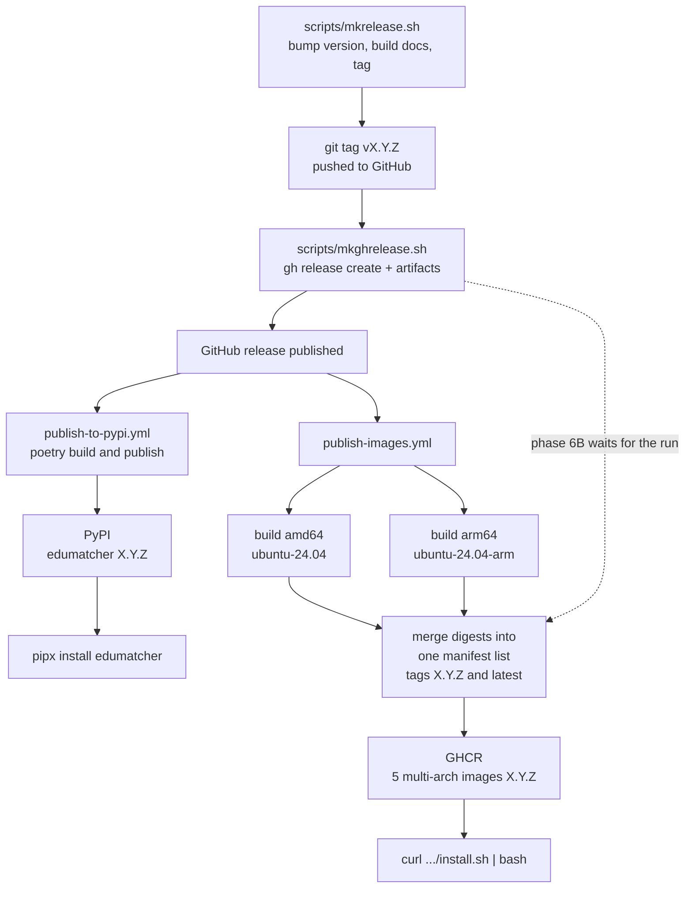

## How a release is produced

Two scripts and two GitHub workflows. One tag produces the Python package and
the container images together, all carrying the same version, which is what
lets the installer pin a whole system with a single number.



Each image is built **natively** on both architectures rather than emulated,
then the two are joined into one manifest list. A user on Intel and a user on
Apple Silicon pull the same tag and each gets the right binary.

The five published images are:

```text
ghcr.io/johan162/edumatcher                 the exchange, all pm-* processes
ghcr.io/johan162/edumatcher-terminal-gui    the trading terminal
ghcr.io/johan162/edumatcher-log-gui         the log viewer
ghcr.io/johan162/edumatcher-config-gui      the configuration builder
ghcr.io/johan162/edumatcher-trader-gui      the trader GUI
```

`latest` is only moved for an exact `vMAJOR.MINOR.PATCH` tag, so a pre-release
never becomes what a new user gets by default — the same rule the PyPI workflow
uses to choose between PyPI and TestPyPI.

### Publishing by hand

`make ghcr-push` in `deployment/docker/` builds all six images from your
checkout and pushes them, for when the workflow cannot run:

```bash
export GITHUB_USER=<you> GHCR_TOKEN=<token with write:packages>
make ghcr-push                              # all six, tagged :dev
make ghcr-push TAG=0.20.6 FORCE=1 LATEST=1  # as a release tag
```

It builds only for the architecture you are on. Pushing a single-architecture
image over a release tag replaces the manifest list, and users on the other
architecture then get "no matching manifest" — which you will not notice,
because your own machine keeps working. That is why a release-looking tag needs
`FORCE=1` and why `latest` is never moved unless asked.


## Developer release checklist

For the maintainer cutting a release. Steps 1-4 are local, 5-7 are automated
but need watching, and 8-10 are the checks that the release actually works for
somebody who is not you.

### Before tagging

1. **Working tree is clean and tests pass.**
   ```bash
   ./scripts/mkbld.sh
   ```

2. **`CHANGELOG.md` has an entry for this version.** 

- Add a new `CHANGELOGENTRY.md`. Using the custom copilot skill `/changelog-entry` to create a draft version based on the git-logs
- or if there is no copilot available Use the script `scripts/mkchlogentry.sh` drafts one from the commit logs.


### Tag and release

3. **Run `scripts/mkrelease.sh`.** It bumps the version, builds the
   documentation bundles, commits and tags.

4. **Wait for the CI workflows on the tag to go green** before creating the
   release.

5. **Run `scripts/mkghrelease.sh`.** It validates the artifacts in `dist/`,
   creates the GitHub release, and then waits for the container image workflow.

   | Option | Effect |
   |---|---|
   | `--dry-run` | Show what would happen; create nothing |
   | `--pre-release` | Force pre-release marking regardless of the tag |
   | `--skip-images` | Do not wait for the image workflow |
   | `IMAGE_WAIT_MINUTES=n` | How long to wait (default 30) |
   
    ```bash
    git switch main && git pull --ff-only
    ./scripts/mkghrelease.sh
    ```

   If the image workflow fails, the GitHub release still exists — only the
   images are missing. Re-run just that part:
   ```bash
   gh run view <run-id> --log-failed
   gh workflow run publish-images.yml -f tag=vX.Y.Z
   ```

### After the release

6. **Verify the one-line install as a stranger would.** First **stop any stack
   you already have running** — the released deployment and the source-built one
   use the same container names and host ports, so an install started beside a
   running stack silently attaches to it and verifies nothing:

   ```bash
   make -C deployment/docker down-all
   ```

   Then install into a throwaway directory so your own instance is untouched:
   ```bash
   curl -fsSL https://raw.githubusercontent.com/johan162/EduMatcher/vX.Y.Z/deployment/curl/install.sh \
       | bash -s -- --dir /tmp/em-release-test
   ```
   Then open <http://localhost:8090>, and clean up with
   `cd /tmp/em-release-test && ./edumatcher.sh uninstall --data`.

7. **Verify the PyPI install** in a fresh environment:
    ```bash
    pipx install edumatcher==X.Y.Z
    ```

!!! tip "Where releases usually go wrong"
    Two failures are quiet rather than loud. An image built from PyPI instead
    of the checkout looks like a successful build but ships the *previous*
    release — step 3's `Installing local wheel` line is what catches it. And
    private GHCR packages fail only for other people, never for the maintainer
    who is already authenticated — step 9, run without credentials, is what
    catches that.

## Doing a manual GHCR push

Normally the push is handled by the workflow but it can be manually overridden.
The target `ghcr-push` in `deployment/docker/Makefile` builds all six images from. 
In will login with ghe existing GITHUB_USER/GHCR_TOKEN, then tags and pushes each one.

```
export GITHUB_USER=<user with admin priv> GHCR_TOKEN=<token with write:packages>

make ghcr-push                              # all six, tagged :dev
make ghcr-push TAG=0.20.6 FORCE=1           # ...as a release tag
make ghcr-push TAG=0.20.6 FORCE=1 LATEST=1  # ...and move :latest
```

## Summary: To make a release, step-by-step

```bash
# 1. Bump version in pyproject.toml
poetry version 0.3.2

# 2. Create the changelog template with help of copilot using the custom skill 
/changelog-entry 0.3.2 patch

# 3. Review and edit CHANGELOG.md as needed. The commit the new changelog
git add CHANGELOG.md
git commit -m "chore(changelog): v0.3.2"

# 4. Build and validate release artifacts.
# Use --intro for real releases because mkghrelease.sh expects the intro bundle.
./scripts/mkbld.sh --intro

# 5. Commit release-ready changes on develop, then preview release actions
GITHUB_USER=<your-gh-user> ./scripts/mkrelease.sh patch --dry-run

# 6. Execute the local release flow (squash merge develop -> main, tag, push, sync back)
GITHUB_USER=<your-gh-user> ./scripts/mkrelease.sh patch

# 7. After CI is green on main, create the GitHub release from main
git switch main && git pull --ff-only
./scripts/mkghrelease.sh
```

---
##  Appendix: The release scripts

## What `mkbld.sh` does

`mkbld.sh` is the build gate before release scripts. It currently:

1. validates environment and required Poetry tools
2. runs `black`, `flake8`, `mypy` (and `pyright` if available)
3. runs all `npm` tests for the `web-apps/`
4. runs pytyest tests with coverage threshold **80%**
5. updates coverage badge when `coverage.xml` changed
6. builds and verifies Python packages
7. builds all documentations, user-guide PDF+EPUB, doc-site, training bundles, etc 
8. optionally builds Exchange Intro bundle when `--intro` is provided

For release publishing, prefer running `./scripts/mkbld.sh --intro`.


### What `mkrelease.sh` expects

The script is designed around this model:

- `GITHUB_USER` environment variable is set
- you are on a **clean `develop` branch**
- local `develop` is synced with remote
- the requested version is not already tagged
- `CHANGELOG.md` already contains an entry for that version
- release artifacts already exist in `dist/` and pass `twine check`

Important usage detail: `mkrelease.sh` argument is only the release type
(`major`, `minor`, or `patch`). The version is read from `pyproject.toml`.

During execution, `mkrelease.sh` will:

1. validate repo state and changelog/version/tag preconditions
2. squash-merge `develop` into `main` and create `v<version>` tag
3. push `main` and the tag
4. merge `main` back into `develop` and push `develop`
5. wait for GitHub Actions completion with `gh run watch --exit-status`


### What `mkghrelease.sh` expects

The script is designed around this model:

- `GITHUB_USER` environment variable is set
- authenticated `gh` CLI on PATH
- you are on a **clean `main` branch** synced with remote
- latest release tag already exists on `main`
- required artifacts exist:
  - wheel in `dist/`
  - sdist in `dist/`
  - user-guide bundle in `docs/dist/`
  - exchange-intro bundle in `docs-exchange-intro/dist/`

It auto-detects pre-releases from tags ending in `rcN` (or you can force with
`--pre-release`) and creates the GitHub release using notes extracted from
`CHANGELOG.md`.


##  Common pitfalls for new developers

### Forgetting which data directory is live

In a source checkout, `src/data/` — not `~/.local/share/edumatcher/` — is the
data directory every local process and every test reads and writes. A
"compiled config has been modified since it was compiled" error from
`pytest`, or a `pm-config-deploy` you ran that doesn't seem to take effect,
is almost always this. See
[Where your data directory actually is](../part-4-developing/010-development-practice.md#where-your-data-directory-actually-is)
above.

### Starting clients before the engine

Most processes assume the engine sockets already exist. Start `pm-engine` first.

### Using a gateway ID that is not in `engine_config.yaml`

`pm-alf-console --id SOMEONE` only works if that gateway is configured.

### Forgetting that observer processes depend on each other

`pm-ticker` and `pm-board` rely on statistics written by `pm-stats`.

### Assuming docs-only changes need no validation

They still need:

```bash
poetry run mkdocs build
```

### Treating helper scripts as canonical truth

Some scripts are polished automation; others still show drift from earlier repo
history. Read before relying on them.

### Ignoring end-to-end behavior

A change that passes unit tests can still break:

- startup order
- message topics
- gateway acknowledgements
- persistence restore
- UI observers

That is why a minimal live run is worth doing.

##  Suggested first-week path for a new developer

If you are onboarding, this is a good sequence:

1. Set up Poetry and build the docs
2. Run the minimal live system once
3. Submit a few manual orders through `pm-alf-console`
4. Run the normal test suite
5. Read the deterministic verification page
6. Pick one small bug fix or documentation improvement
7. Run the full quality gate before opening a PR

That path teaches both the **theory** and the **operational shape** of the
system before you attempt deeper engine work.
