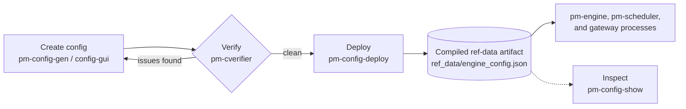

# The Configuration Workflow

<a id="configuring-pm-log-srv"></a>
<a id="participants"></a>
<a id="symbol-universe"></a>
<a id="engine_tuning"></a>
<a id="role-privileges"></a>
<a id="collar-reference-price-selection"></a>
<a id="per-symbol-risk-level-assignment"></a>
<a id="sessions_enabled"></a>
<a id="market-maker-obligation-defaults"></a>
<a id="engine_tuningsnapshot_interval_sec"></a>
<a id="engine_tuningquote_history_maxlen"></a>
<a id="engine_tuningdrop_copy_buffer_size"></a>
<a id="engine_tuningrecent_trades_maxlen"></a>
<a id="engine_tuningdepth_snapshot_tolerance_ticks"></a>
<a id="session-schedule"></a>
<a id="engine-behavior-flags"></a>
<a id="risk-controls-and-collars"></a>
<a id="circuit-breakers"></a>
<a id="participant-fields"></a>
<a id="configuring-pm-index"></a>
<a id="configuring-pm-ralf-gwy"></a>
<a id="which-process-reads-what"></a>
<a id="pm-config-gen-engine-config-generator"></a>
<a id="pm-config-deploy-compile-and-install-a-configuration"></a>
<a id="pm-config-show-config-viewer"></a>

!!! note "Learning objectives"
    After reading this page you will understand:

    - Which `engine_config.yaml` sections are required when a config file exists
    - How to generate a starter config with `pm-config-gen`
    - Which fields the current engine and scheduler parsers recognize
    - How to configure the optional `pm-ralf-gwy`, `pm-md-gwy`, `pm-balf-gwy`, `pm-dc-gwy`, `pm-index`, `pm-log-srv`, and `pm-api-gwy` blocks
    - How to configure symbols, gateways, risk controls, market-maker seeds, combo seeds, and schedules
    - How to inspect a deployed config at a glance with `pm-config-show`
    - How to choose between minimal, medium, and fully featured configurations
    - Which checks to perform before using a config in a class, demo, or test

## Configuration Workflow

`engine_config.yaml` is compiled, not read directly. The file you author is
never the file any process runs — it always passes through the same
create → verify → deploy pipeline before it becomes the ref-data artifact the
exchange actually loads:



The rest of this page documents each stage: generating a starter file,
verifying it, deploying it as the compiled artifact every process reads, and
inspecting what was deployed.

## Configuring the Exchange

The matching engine and session scheduler both read `engine_config.yaml`. The
engine uses it to define the symbol universe, authenticated ALF gateway IDs,
session mode, risk controls, market-maker policy, per-symbol outstanding shares,
and startup seeds. The scheduler uses only the optional `schedule` section.
The optional `alf_gateway`, `balf_gateway`, `post_trade_gateway`,
`market_data_gateway`, `dc_gateway`, `log_server`, and `api_gateways` sections
are read by `pm-alf-gwy`, `pm-balf-gwy`, `pm-ralf-gwy`, `pm-md-gwy`,
`pm-dc-gwy`, `pm-log-srv`, and `pm-api-gwy` respectively.

If the config file is absent, `pm-engine` starts in unrestricted mode: any symbol
and gateway can be used, and no startup seeds are loaded. If the config file is
present, the parser requires two sections:

- `symbols` - a mapping of accepted symbols; generated examples include a
  positive integer `outstanding_shares` field for each symbol
- `participants` - a list with at least one accepted ALF gateway

The sample `engine_config.yaml` intentionally keeps the
live configuration minimal and places the full parser-recognized shape in
comments. This page explains that shape in operational terms.

!!! tip "Prefer a form over the CLI? Use the Config Builder GUI"
    If you would rather build or edit `engine_config.yaml` visually — with live
    validation, per-field help, and import of an existing file — see the
    [Configuration GUI (`config-gui`)](030-config-gui.md) chapter. It targets the
    same file format as `pm-config-gen` described below.

!!! note "`participants` lists identities, not gateway processes"
    The top-level `participants:` list holds the *participant identities*
    that may log in. The gateway **processes** themselves are
    configured via separate **top-level** keys (`alf_gateway`, `balf_gateway`,
    `market_data_gateway`, `post_trade_gateway`, `dc_gateway`, `log_server`, and
    `api_gateways`) and are read by their own processes, not by `pm-engine`.

Each protocol's configuration lives in a different part of `engine_config.yaml`:

- **ALF** — two parts. *Who may connect* is configured under `participants`; `pm-engine` uses it to authenticate order-entry connections from `pm-alf-console` and `pm-alf-gwy`, as well as `pm-balf-gwy` (the gateway id used in the BALF configurations must exist under `participants`). *How the TCP gateway behaves* (port, timeouts, rate limits) is configured under the top-level `alf_gateway` key and read by `pm-alf-gwy`; see [Configuring `pm-alf-gwy`](../../reference-manual/part-3-configuration/010-schema-and-process-blocks.md#configuring-pm-alf-gwy).
  Uses a pipe-delimited text format (`FIELD=VALUE|FIELD=VALUE`).
- **BALF** — configured under the top-level `balf_gateway` key; used by `pm-balf-gwy`. Uses fixed-width binary frames with sequence numbers and integer-scaled prices, targeting programmatic clients where text-parsing overhead is undesirable. See [BALF Gateway](../part-5-gateways/020-balf-gateway.md) for more usage and [BALF Protocol](../../protocols-and-clients/part-2-specifications/020-balf.md) for the full specification.
- **CALF** — configured under the top-level `market_data_gateway` key; used by `pm-md-gwy`. Provides a subscribe/unsubscribe market-data feed delivering order-book snapshots, trade prints, and session-state changes over a persistent TCP connection with sequence-based gap detection. See [Market Data Feed](../part-5-gateways/030-calf-gateway.md) for usage and [CALF Protocol](../../protocols-and-clients/part-2-specifications/030-calf.md) for the full protocol specification.
- **RALF** — configured under the top-level `post_trade_gateway` key; used by `pm-ralf-gwy`. Provides a replayable audit feed of all executed trades, including the original order details, over a persistent TCP connection with sequence-based gap detection. See [Post Trade](../part-5-gateways/040-ralf-gateway.md) for usage and [RALF Protocol](../../protocols-and-clients/part-2-specifications/040-ralf.md) for the full protocol specification.
- **DC1** — configured under the top-level `dc_gateway` key; used by `pm-dc-gwy`. Relays the engine's internal drop-copy feed to plain TCP clients that cannot speak ZeroMQ, using the lightweight DC1 text protocol. See [Drop-Copy Gateway](../part-5-gateways/060-drop-copy-gateway.md) for full usage and protocol details.
- **LALF** — configured under the top-level `log_server` key; used by `pm-log-srv`. Collects operational `logging`-module output from every other `pm-*` process over a persistent TCP connection into a queryable SQLite database. The same key also configures **LALF-PS**, the ZeroMQ `PUB`/`PULL` interface that distributes those rows back out to live log viewers. See [Centralized Log Server](../part-6-observe-and-recover/040-log-server.md) for usage and [LALF Protocol Reference](../../protocols-and-clients/part-2-specifications/050-lalf.md) for the full protocol specification.
- A Full overview of all protocol and their intended usage can be found in [Protocols Overview](../../protocols-and-clients/part-1-choosing-and-connecting/010-protocols-overview.md).

## File Location

EduMatcher separates the configuration you *author* from the one the exchange
*runs*.

The authored `engine_config.yaml` lives wherever suits you — normally under
version control alongside the rest of your course material. Edit it, review it,
diff it.

What the exchange runs is a *compiled artifact* at
`<EDUMATCHER_DATA_DIR>/ref_data/engine_config.json`. That is the only file any
running process reads. No process accepts a config path, so it is not possible
to start two of them against different files.

`<EDUMATCHER_DATA_DIR>` is resolved centrally by the runtime configuration
module. `EDUMATCHER_DATA_DIR` takes precedence; without it, a source checkout
uses `<repo>/src/data/`, while an installed production package uses
`~/.local/share/edumatcher`. Source mode is determined from the installed
location of `edumatcher/config.py` (its package parent is named `src`), not from
the current working directory. See [Reference Manual — how the default is
selected](../../reference-manual/part-1-command-line/010-processes-environment-and-ports.md#how-the-default-is-selected) for the exact
precedence rules.

The same resolver places configured relative runtime paths, such as
`data/stats.db` and `data/log.db`, under this shared data directory. This keeps
`pm-engine`, `pm-stats`, `pm-log-srv`, and `pm-api-gwy` on the same files even
when they are launched from different directories.

See [Compile Configs with `pm-config-deploy`](#compile-configs-with-pm-config-deploy)
for how the authored file becomes that artifact.


## Generate Configs with `pm-config-gen`

`pm-config-gen` creates a parser-compatible `engine_config.yaml` from concise
CLI inputs. It is designed for operators and instructors who want to bootstrap
new sessions without manually writing large YAML blocks.

Use it when:

- you are creating a new class/demo config from scratch
- you want consistent defaults and validation hints
- you need repeatable config generation in scripts

## Generate Configs with `config-gui` 

A more user friendly way to create a configuration file (also known as 
reference data) is to spin up the Web-App. The easiest way to run it is by running the
container image. You can use either `docker` or `podman` but in the examples we use
`podman`

1. Download latest `edumatcher-config-gui-<VERSION>.tar.gz` and unzip 
2. `podman load --input dist/edumatcher-config-gui-<VERSION>tar.gz` 
3. Then run: `podman run -p 8080:8080 edumatcher-config-gui:<VERSION>`

You can then access the UI at `http://localhost:8080/`

More details of the Web app and how to use it can be found in [Configuration GUI](./030-config-gui.md)

## Verify Configs with `pm-cverifier`

Before starting the engine with a hand-written or generated config, run
`pm-cverifier` to get a deep, actionable report on every problem the config
contains — not just the first one the engine would encounter.

```bash
# human-readable report
pm-cverifier engine_config.yaml

# CI-friendly: fail on any warning, output JSON
pm-cverifier --strict --format json engine_config.yaml
```

`pm-cverifier` is **read-only** and safe to run at any time.  It reports:

- every YAML syntax or schema error that would prevent the engine from starting
- semantic inconsistencies (e.g. sessions enabled but no schedule, MM gateway
  without seed quotes, index constituent not in `symbols`)
- completeness advisories (e.g. no reference prices, MM obligations not enforced)
- a plain-English **Risk Summary** showing what collars, circuit breakers, and
  gateways are actually active

For a full description of all check codes and CLI options, see
[Config Verifier (pm-cverifier)](020-config-verifier.md).


### Quick start

Installed mode:

```bash
pm-config-gen \
  --symbols AAPL MSFT \
  --participants TRADER01 TRADER02 OPS01:ADMIN \
  --outstanding-shares AAPL:15400000000 \
  --outstanding-shares MSFT:7430000000 \
  --sessions-enabled \
  --output engine_config.yaml
```

Poetry/source mode:

```bash
poetry run pm-config-gen \
  --symbols AAPL MSFT \
  --participants TRADER01 TRADER02 OPS01:ADMIN \
  --outstanding-shares AAPL:15400000000 \
  --outstanding-shares MSFT:7430000000 \
  --sessions-enabled \
  --output engine_config.yaml
```

Print to stdout only (no file write):

```bash
pm-config-gen \
  --symbols AAPL \
  --participants TRADER01 \
  --outstanding-shares AAPL:15400000000 \
  --dry-run
```

### Important behavior

- If `--output` is omitted, YAML is printed to stdout.
- If `--output` exists, generation fails unless `--force` is set.
- If any gateway is `MARKET_MAKER` and you do not pass `--seed-mm-mid-range`,
  MM quote stubs are emitted with `bid_price: null` and `ask_price: null`.
  Fill these values before starting `pm-engine`.
- If you pass `--seed-mm-mid-range`, MM quotes are emitted with concrete prices
  on the configured tick grid.
- Loader validation is skipped only in the MM-stub case above. It runs
  automatically for non-MM configs, MM configs with seeded midpoints, and
  `--no-mm-seed-quotes` configs (see below).
- `--no-mm-seed-quotes` sets `require_mm_seed_quotes: false`. A `MARKET_MAKER`
  gateway may then exist with no `market_maker_quotes` entries at all — a
  genuinely empty book at startup — instead of the null-priced stub. See
  [Market-Maker Quotes](../../participant-guide/part-3-market-making/010-market-maker-quotes.md#opting-out-require_mm_seed_quotes-false)
  for why this differs from real-market practice and when to use it.

MM quote generation decision matrix:

| Gateway/flags state | Generated `market_maker_quotes` | Generated `last_buy_price` / `last_sell_price` |
|---|---|---|
| No `MARKET_MAKER` gateway configured | No MM quote section emitted | Only emitted if `--seed-last-prices` is set (as `null` placeholders) |
| `MARKET_MAKER` present, no `--seed-mm-mid-range` | Stub quotes with `bid_price: null`, `ask_price: null` | `null` placeholders only if `--seed-last-prices` is set |
| `MARKET_MAKER` present, with `--seed-mm-mid-range MIN:MAX` | Concrete bid/ask quote prices generated on tick grid | If `--seed-last-prices-from-mm` is set, both are set to the same midpoint used for seeded quotes |
| `MARKET_MAKER` present, with `--no-mm-seed-quotes`, no `--seed-mm-mid-range` | No MM quote section emitted (`require_mm_seed_quotes: false` recorded instead) | Only emitted if `--seed-last-prices` is set (as `null` placeholders) |
| `MARKET_MAKER` present, with `--no-mm-seed-quotes` and `--seed-mm-mid-range MIN:MAX` | No MM quote section emitted — `--no-mm-seed-quotes` always wins; the mid range is used only for last prices | If `--seed-last-prices-from-mm` is set, both are set to the generated midpoint (this is how the `*-nomm` examples get reference prices with an empty book) |

In this guide, "MM stub" means a quote row exists but prices are `null` and must
be filled manually. "Full MM setup" means concrete bid/ask prices are generated
for each MM quote seed at generation time.

### Option reference

Required inputs:

| Option                             | Type              | Description                               |
|------------------------------------|-------------------|-------------------------------------------|
| `--symbols SYM [SYM ...]`          | Repeatable tokens | Symbol universe (uppercased on parse)     |
| `--participants GW_SPEC [GW_SPEC ...]` | Repeatable tokens | Gateway specs as `ID[:ROLE[:DISCONNECT[:DESCRIPTION]]]` |
| `--participant-smp GW_ID:SMP_ACTION`   | Repeatable        | Sets `participants[<GW_ID>].smp_action` (`NONE`, `CANCEL_AGGRESSOR`, `CANCEL_RESTING`, `CANCEL_BOTH`); `GW_ID` must be one of `--participants`; omitted gateways inherit `--participant-default-smp`, else `NONE`. `GW_ID:NONE` is written when it overrides a non-`NONE` default. See [Risk Controls — Self-Match Prevention](../part-4-run-a-market/040-risk-controls.md#self-match-prevention-smp) |
| `--participant-default-smp SMP_ACTION` | Choice            | Writes `participant_defaults.smp_action`, inherited by every gateway without its own `smp_action`. See [Participant Defaults](../../reference-manual/part-3-configuration/010-schema-and-process-blocks.md#participant-defaults) |
| `--participant-default-disconnect DISCONNECT` | Choice     | Writes `participant_defaults.disconnect_behaviour` (`CANCEL_ALL`, `CANCEL_QUOTES_ONLY`, `LEAVE_ALL`). Gateways whose `--participants` spec does not name a disconnect behaviour inherit it instead of the per-role default; this includes `ADMIN` and `MARKET_MAKER` gateways. See [Participant Defaults](../../reference-manual/part-3-configuration/010-schema-and-process-blocks.md#participant-defaults) |

Session and schedule options:

| Option                                         | Type      | Default | Description                                                            |
|------------------------------------------------|-----------|---------|------------------------------------------------------------------------|
| `--sessions-enabled` / `--no-sessions-enabled` | Flag pair | `false` | Enable/disable scheduler-driven sessions                               |
| `--schedule` / `--no-schedule`                 | Flag pair | auto    | Force include/exclude `schedule`; auto emits when sessions are enabled |
| `--pre-open HH:MM`                             | String    | `09:00` | Schedule pre-open time                                                 |
| `--opening-auction HH:MM`                      | String    | `09:25` | Opening auction start                                                  |
| `--continuous HH:MM`                           | String    | `09:30` | Continuous start                                                       |
| `--closing-auction HH:MM`                      | String    | `16:00` | Closing auction start                                                  |
| `--closing-end HH:MM`                          | String    | `16:05` | Closing auction end                                                    |

Core engine and risk options:

| Option                                   | Type             | Default         | Description                                         |
|------------------------------------------|------------------|-----------------|-----------------------------------------------------|
| `--snapshot-interval SECS`               | float (`> 0`)    | `0.5`           | `engine_tuning.snapshot_interval_sec`               |
| `--quote-history-maxlen N`               | int (`> 0`)      | `30`            | `engine_tuning.quote_history_maxlen`                |
| `--drop-copy-buffer-size N`              | int (`> 0`)      | `10000`         | `engine_tuning.drop_copy_buffer_size`               |
| `--recent-trades-maxlen N`               | int (`> 0`)      | `20`            | `engine_tuning.recent_trades_maxlen`                |
| `--depth-snapshot-tolerance-ticks N`     | int (`> 0`)      | `100`           | `engine_tuning.depth_snapshot_tolerance_ticks`      |
| `--no-collars`                           | Flag             | off             | Emit `enforce_collars: false`                       |
| `--no-circuit-breakers`                  | Flag             | off             | Emit `enforce_circuit_breakers: false`              |
| `--static-band PCT`                      | float in `(0,1)` | unset           | Default risk-control static band (`DEFAULT` level)  |
| `--dynamic-band PCT`                     | float in `(0,1)` | unset           | Default risk-control dynamic band (`DEFAULT` level) |
| `--symbol-static-band SYM:PCT`           | Repeatable       | none            | Per-symbol `collar.static_band_pct` override        |
| `--symbol-dynamic-band SYM:PCT`          | Repeatable       | none            | Per-symbol `collar.dynamic_band_pct` override       |
| `--symbol-max-order-qty SYM:N`           | Repeatable       | none            | Per-symbol `order_limits.max_order_qty` (shares, `> 0`) |
| `--symbol-max-order-value SYM:AMOUNT`    | Repeatable       | none            | Per-symbol `order_limits.max_order_value` (notional, `> 0`) |
| `--symbol-risk-level SYM:LEVEL`          | Repeatable       | none            | Per-symbol `symbols.<SYM>.level` override           |
| `--risk-level NAME:STATIC[:DYNAMIC]`     | Repeatable       | none            | Add named risk levels under `risk_controls.levels`  |
| `--cb-levels NAME:SHIFT[:HALT_MINS] ...` | List | built-in ladder | Circuit-breaker level specs |
| `--cb-window-ns NS`                      | int (`> 0`)      | `300000000000`  | Circuit-breaker reference window                    |

Market-maker and symbol defaults:

| Option | Type | Default | Description |
|---|---|---|---|
| `--mm-spread-ticks N` | int (`> 0`) | `20` | Global MM spread threshold |
| `--mm-min-qty N` | int (`> 0`) | `100` | Global MM min quantity |
| `--enforce-mm-obligations` / `--no-enforce-mm-obligations` | Flag pair | `false` | Global MM obligation toggle |
| `--tick-decimals N` | int `0..8` | `2` | Default `tick_decimals` for symbols |
| `--outstanding-shares SYM:N` | Repeatable | none | Per-symbol outstanding shares in the generated config |
| `--seed-last-prices` | Flag | off | Emit `last_buy_price`/`last_sell_price` placeholders |
| `--seed N` | int | random source default | Deterministic RNG seed for generated training values |
| `--seed-mm-mid-range MIN:MAX` | string | none | Seed MM quotes from a random midpoint in the inclusive price range |
| `--mm-seed-spread-ticks N` | int (`> 0`) | `10` | Half-spread, in ticks, for seeded MM stub quotes (bid/ask sit this many ticks either side of the seeded midpoint) |
| `--no-mm-seed-quotes` | flag | off | Set `require_mm_seed_quotes: false` — allow a `MARKET_MAKER` gateway with no seeded quotes |
| `--seed-last-prices-from-mm` | Flag | off | Set `last_buy_price`/`last_sell_price` to the same midpoint used for seeded MM quotes |

Output and safety options:

| Option | Type | Default | Description |
|---|---|---|---|
| `--output FILE` | Path | none | Write YAML to file |
| `--force` | Flag | off | Overwrite existing output file |
| `--dry-run` | Flag | off | Print YAML only; do not write file |
| `--comment-default-config-fields` | Flag | off | Add a header comment block listing defaultable `engine_config.yaml` fields currently omitted from the generated file |

Post-trade gateway options:

| Option                                       | Type        | Default                    | Description                                                 |
|----------------------------------------------|-------------|----------------------------|-------------------------------------------------------------|
| `--post-trade-gateway`                       | Flag        | off                        | Emit top-level `post_trade_gateway` block for `pm-ralf-gwy` |
| `--post-trade-name`                          | string      | `ralf-gwy01`               | `post_trade_gateway.name`                                   |
| `--post-trade-bind-address`                  | string      | `0.0.0.0`                  | `post_trade_gateway.bind_address`                           |
| `--post-trade-port`                          | int (`> 0`) | `5580`                     | `post_trade_gateway.port`                                   |
| `--post-trade-replay-retention-sec`          | int (`> 0`) | `86400`                    | `post_trade_gateway.replay_retention_sec`                   |
| `--post-trade-heartbeat-interval-sec`        | int (`> 0`) | `1`                        | `post_trade_gateway.heartbeat_interval_sec`                 |
| `--post-trade-idle-timeout-sec`              | int (`> 0`) | `5`                        | `post_trade_gateway.idle_timeout_sec`                       |
| `--post-trade-max-client-queue`              | int (`> 0`) | `10000`                    | `post_trade_gateway.max_client_queue`                       |
| `--post-trade-allowed-roles ROLE [ROLE ...]` | list        | `CLEARING DROP_COPY AUDIT` | `post_trade_gateway.allowed_roles`                          |

Market-data gateway options:

| Option                                             | Type        | Default                     | Description                                                |
|----------------------------------------------------|-------------|-----------------------------|------------------------------------------------------------|
| `--market-data-gateway`                            | Flag        | off                         | Emit top-level `market_data_gateway` block for `pm-md-gwy` |
| `--market-data-enabled` / `--market-data-disabled` | Flag pair   | unset (`true` when emitted) | Set `market_data_gateway.enabled`                          |
| `--market-data-name`                               | string      | `md-gwy01`                  | `market_data_gateway.name`                                 |
| `--market-data-bind-address`                       | string      | `0.0.0.0`                   | `market_data_gateway.bind_address`                         |
| `--market-data-port`                               | int (`> 0`) | `5570`                      | `market_data_gateway.port`                                 |
| `--market-data-heartbeat-interval-sec`             | int (`> 0`) | `1`                         | `market_data_gateway.heartbeat_interval_sec`               |
| `--market-data-idle-timeout-sec`                   | int (`> 0`) | `5`                         | `market_data_gateway.idle_timeout_sec`                     |
| `--market-data-replay-window-sec`                  | int (`> 0`) | `30`                        | `market_data_gateway.replay_window_sec`                    |
| `--market-data-max-symbols-per-client`             | int (`> 0`) | `200`                       | `market_data_gateway.max_symbols_per_client`               |
| `--market-data-max-client-queue`                   | int (`> 0`) | `10000`                     | `market_data_gateway.max_client_queue`                     |
| `--market-data-depth-levels`                       | int (`> 0`) | `10`                        | `market_data_gateway.depth_levels`                          |

ALF gateway options:

| Option | Type | Default | Description |
|---|---|---|---|
| `--alf-gateway` | Flag | off | Emit top-level `alf_gateway` block for `pm-alf-gwy`; any other `--alf-*` option also emits it |
| `--alf-enabled` / `--alf-disabled` | Flag pair | enabled | `alf_gateway.enabled` |
| `--alf-name` | string | `alf-gwy01` | `alf_gateway.name` |
| `--alf-bind-address` | string | `0.0.0.0` | `alf_gateway.bind_address` |
| `--alf-port` | int (`1..65535`) | `5565` | `alf_gateway.port` |
| `--alf-heartbeat-interval-sec` | int (`> 0`) | `5` | `alf_gateway.heartbeat_interval_sec` |
| `--alf-handshake-timeout-sec` | int (`> 0`) | `10` | `alf_gateway.handshake_timeout_sec` |
| `--alf-idle-timeout-sec` | int (`> 0`) | `30` | `alf_gateway.idle_timeout_sec` |
| `--alf-max-connections` | int (`> 0`) | `64` | `alf_gateway.max_connections` |
| `--alf-max-client-queue` | int (`> 0`) | `10000` | `alf_gateway.max_client_queue` |
| `--alf-max-commands-per-second` | int (`> 0`) | `100` | `alf_gateway.max_commands_per_second` |
| `--alf-max-errors-before-disconnect` | int (`> 0`) | `50` | `alf_gateway.max_errors_before_disconnect` |
| `--alf-error-window-sec` | int (`> 0`) | `60` | `alf_gateway.error_window_sec` |

BALF gateway options:

| Option | Type | Default | Description |
|---|---|---|---|
| `--balf-gateway` | Flag | off | Emit top-level `balf_gateway` block for `pm-balf-gwy` |
| `--balf-name` | string | `balf-gwy01` | `balf_gateway.name` |
| `--balf-bind-address` | string | `0.0.0.0` | `balf_gateway.bind_address` |
| `--balf-port` | int (`> 0`) | `5560` | `balf_gateway.port` |
| `--balf-heartbeat-interval-sec` | int (`> 0`) | `1` | `balf_gateway.heartbeat_interval_sec` |
| `--balf-heartbeat-timeout-sec` | int (`> 0`) | `5` | `balf_gateway.heartbeat_timeout_sec` |
| `--balf-idle-timeout-sec` | int (`> 0`) | `30` | `balf_gateway.idle_timeout_sec` |
| `--balf-auth-timeout-sec` | int (`> 0`) | `10` | `balf_gateway.auth_timeout_sec` |
| `--balf-max-connections` | int (`> 0`) | `64` | `balf_gateway.max_connections` |
| `--balf-max-client-queue` | int (`> 0`) | `10000` | `balf_gateway.max_client_queue` |
| `--balf-max-messages-per-second` | int (`> 0`) | `100` | `balf_gateway.max_messages_per_second` |
| `--balf-max-errors-before-disconnect` | int (`> 0`) | `10` | `balf_gateway.max_errors_before_disconnect` |
| `--balf-error-window-sec` | int (`> 0`) | `60` | `balf_gateway.error_window_sec` |
| `--balf-duplicate-session-policy` | enum | `REJECT_NEW` | `balf_gateway.duplicate_session_policy`; `REJECT_NEW` or `EVICT_OLD` |

Drop-copy gateway options:

| Option | Type | Default | Description |
|---|---|---|---|
| `--dc-gateway` | Flag | off | Emit top-level `dc_gateway` block for `pm-dc-gwy` |
| `--dc-name` | string | `dc-gwy01` | `dc_gateway.name` |
| `--dc-bind-address` | string | `0.0.0.0` | `dc_gateway.bind_address` |
| `--dc-port` | int (`> 0`) | `5590` | `dc_gateway.port` |
| `--dc-heartbeat-interval-sec` | int (`> 0`) | `5` | `dc_gateway.heartbeat_interval_sec` |
| `--dc-idle-timeout-sec` | int (`> 0`) | `30` | `dc_gateway.idle_timeout_sec` |
| `--dc-max-client-queue` | int (`> 0`) | `10000` | `dc_gateway.max_client_queue` |

Log server options:

| Option | Type | Default | Description |
|---|---|---|---|
| `--log-server` | Flag | off | Emit top-level `log_server` block for `pm-log-srv` |
| `--log-server-enabled` / `--log-server-disabled` | Flag pair | unset (`true` when emitted) | Set `log_server.enabled` |
| `--log-server-name` | string | `log-srv01` | `log_server.name` |
| `--log-server-bind-address` | string | `0.0.0.0` | `log_server.bind_address` |
| `--log-server-port` | int (`> 0`) | `5600` | `log_server.port` |
| `--log-server-db-path` | path | `data/log.db` | `log_server.db_path` |
| `--log-server-retention-days` | int (`>= 0`) | `30` | `log_server.retention_days`; `0` means unbounded retention |
| `--log-server-max-message-bytes` | int (`> 0`) | `65536` | `log_server.max_message_bytes` |
| `--log-server-max-client-queue` | int (`> 0`) | `10000` | `log_server.max_client_queue` |
| `--log-server-write-batch-size` | int (`> 0`) | `50` | `log_server.write_batch_size` |
| `--log-server-write-batch-interval-ms` | int (`> 0`) | `100` | `log_server.write_batch_interval_ms` |
| `--log-server-heartbeat-interval-sec` | int (`> 0`) | `5` | `log_server.heartbeat_interval_sec` |

Log server LALF-PS options — the ZeroMQ log-distribution interface, see
[LALF-PS](../part-6-observe-and-recover/040-log-server.md#lalf-ps-the-zeromq-log-distribution-interface):

| Option | Type | Default | Description |
|---|---|---|---|
| `--log-server-pubsub-enabled` / `--log-server-pubsub-disabled` | Flag pair | unset (`true` when emitted) | Set `log_server.pubsub_enabled` — the master switch for LALF-PS |
| `--log-server-pub-port` | int (`> 0`) | `5601` | `log_server.pub_port` — ZeroMQ `PUB` socket carrying rows, ticks, backfill chunks and acks |
| `--log-server-pull-port` | int (`> 0`) | `5602` | `log_server.pull_port` — ZeroMQ `PULL` socket receiving subscriber control requests |
| `--log-server-lease-sec` | int (`> 0`) | `30` | `log_server.lease_sec` — subscription lease TTL |
| `--log-server-max-lease-sec` | int (`>= lease_sec`) | `300` | `log_server.max_lease_sec` — ceiling on a subscriber's requested lease |
| `--log-server-max-subscribers` | int (`> 0`) | `32` | `log_server.max_subscribers` |
| `--log-server-notify-interval-ms` | int (`> 0`) | `250` | `log_server.notify_interval_ms` — `NOTIFY`-mode coalescing window |
| `--log-server-backfill-chunk-rows` | int (`> 0`) | `500` | `log_server.backfill_chunk_rows` |
| `--log-server-max-backfill-minutes` | int (`> 0`) | `1440` | `log_server.max_backfill_minutes` |
| `--log-server-max-backfill-rows` | int (`> 0`) | `100000` | `log_server.max_backfill_rows` |
| `--log-server-max-pending-rows` | int (`> 0`) | `20000` | `log_server.max_pending_rows` |
| `--log-server-pub-sndhwm` | int (`> 0`) | `10000` | `log_server.pub_sndhwm` |

Passing any of these implies the `log_server` block, so `--log-server` is
not additionally required. `pm-config-gen` refuses to write a file that
`pm-log-srv` would then refuse to start on: `port`, `pub_port` and
`pull_port` must resolve to three different numbers (compared against each
other's *defaults*, not only against explicitly-set values), and
`max-lease-sec` must be at least `lease-sec`.

```bash
# Two log servers on one host — move the whole three-port block
pm-config-gen --symbols AAPL --participants GW01 \
  --log-server-port 5700 --log-server-pub-port 5701 --log-server-pull-port 5702

# Collect logs but publish nothing: no ZeroMQ socket is bound
pm-config-gen --symbols AAPL --participants GW01 --log-server-pubsub-disabled

# Reap dead viewers within 10 s, and cap concurrent viewers at 8
pm-config-gen --symbols AAPL --participants GW01 \
  --log-server-lease-sec 10 --log-server-max-subscribers 8
```

API gateway options:

| Option | Type | Default | Description |
|---|---|---|---|
| `--api-gateway` | Flag | off | Emit top-level `api_gateways` block for `pm-api-gwy` |
| `--api-gateway-name NAME` | string | `default` | Name of the generated `api_gateways.<NAME>` entry for single-process generation |
| `--api-gateway-instance NAME:GATEWAY[,GATEWAY...][:PORT]` | Repeatable | none | Emit one named API gateway process per option; use `NAME::PORT` for an identity-free read-only process |
| `--api-gateway-enabled` / `--api-gateway-disabled` | Flag pair | unset (`true` when emitted) | Set each generated API gateway `enabled` field |
| `--api-gateway-host ADDR` | string | `127.0.0.1` | HTTP bind address |
| `--api-gateway-port N` | int (`> 0`) | `8080` | HTTP listen port |
| `--api-gateway-swagger-enabled` / `--api-gateway-swagger-disabled` | Flag pair | unset (`true` when emitted) | Enable or disable `/docs` and `/openapi.json` |
| `--api-gateway-log-level LEVEL` | enum | `info` | `debug`, `info`, `warning`, or `error` |
| `--api-gateway-stats-db PATH` | path | `data/stats.db` | SQLite database used by `/history/*` endpoints |
| `--api-key KEY:GATEWAY_ID[:DESCRIPTION]` | Repeatable | none | Add an explicit bearer-token credential; use `GATEWAY_ID=null` for read-only access |
| `--api-gateway-generate-keys` / `--no-api-gateway-generate-keys` | Flag pair | generated when emitted | Generate one key for each `participants` entry |
| `--api-gateway-readonly-key` | Flag | off | Generate an additional read-only key with `gateway_id: null` |
| `--api-gateway-rate-limit-writes-per-second N` | int (`> 0`) | `10` | Per-key write rate limit |
| `--api-gateway-rate-limit-burst N` | int (`> 0`) | `20` | Per-key write burst capacity |
| `--api-gateway-engine-auth-sec SECS` | float (`> 0`) | `3.0` | Engine auth timeout field |
| `--api-gateway-engine-reply-sec SECS` | float (`> 0`) | `3.0` | Engine request/reply timeout |
| `--api-gateway-wait-ack-sec SECS` | float (`> 0`) | `3.0` | `?wait=ack` timeout |
| `--api-gateway-order-retention-sec SECS` | int (`>= 0`) | `3600` | Seconds a terminal order stays in the gateway's in-memory cache. `0` disables eviction |

Combo seed options:

| Option | Type | Default | Description |
|--------|------|---------|-------------|
| `--combo COMBO_SPEC` | Repeatable | none | Seed a `market_maker_combos` entry; format described in [`--combo` format](#-combo-format) |

Index options:

| Option                                  | Type       | Default         | Description                                                                                 |
|-----------------------------------------|------------|-----------------|---------------------------------------------------------------------------------------------|
| `--index ID[:DESCRIPTION]`              | Repeatable | none            | Define an index; `ID` is alphanumeric, `DESCRIPTION` is optional text after the first colon |
| `--index-constituents ID:SYM[,SYM,...]` | Repeatable | none            | Set constituent symbols for the named index                                                 |
| `--index-base-value ID:VALUE`           | Repeatable | `1000.0`        | Override `base_value` for the named index                                                   |
| `--index-interval ID:SECS`              | Repeatable | `1.0`           | Override `publish_interval_sec` for the named index                                         |
| `--index-history-file ID:PATH`          | Repeatable | derived from ID | Override `history_file` path; default is `data/indexes/<ID>_history.jsonl`                  |
| `--index-state-file ID:PATH`            | Repeatable | derived from ID | Override `state_file` path; default is `data/indexes/<ID>_state.json`                       |

Up to 5 indices may be defined. Every constituent symbol must appear in `--symbols`. Every index must have at least one constituent. Each `ID` must be alphanumeric. When `history_file` and `state_file` are omitted, `pm-config-gen` derives them from the index ID under `data/indexes/`.

When `--api-gateway` is enabled, `pm-config-gen` emits sensible local defaults
and automatically generates one bearer token for each configured ALF gateway.
Pass `--seed N` to make those generated keys reproducible. Use
`--no-api-gateway-generate-keys` when you only want manually supplied
`--api-key` entries.

Use repeated `--api-gateway-instance` options when you want separate API
gateway processes for logical separation. A non-null `gateway_id` can belong to
only one generated API gateway entry. An instance with no gateway list uses the
`NAME::PORT` form and is suitable for a dashboard or other read-only service.
For example, this gives the desk process credentials for every participant and
the dashboard process one read-only credential:

```bash
pm-config-gen \
  --symbols AAPL MSFT \
  --participants TRADER01 TRADER02 MM01:MARKET_MAKER OPS01:ADMIN \
  --api-gateway-instance desk:TRADER01,TRADER02,MM01,OPS01:8080 \
  --api-gateway-instance dashboards::8081 \
  --api-gateway-readonly-key \
  --seed 20260814 \
  --output engine_config.yaml
```

With named instances, `--api-gateway-readonly-key` is generated only for
identity-free instances such as `dashboards::8081`; it is not added to the
identity-bound `desk` instance. Read-only `gateway_id: null` credentials may
be repeated across named instances.

Typical CLI example for a local lab with RALF enabled:

```bash
pm-config-gen \
  --symbols AAPL MSFT \
  --participants TRADER01 TRADER02 OPS01:ADMIN \
  --sessions-enabled \
  --post-trade-gateway \
  --post-trade-bind-address 127.0.0.1 \
  --post-trade-port 5580 \
  --post-trade-replay-retention-sec 3600 \
  --post-trade-heartbeat-interval-sec 1 \
  --post-trade-idle-timeout-sec 10 \
  --post-trade-max-client-queue 2000 \
  --post-trade-allowed-roles CLEARING AUDIT \
  --outstanding-shares AAPL:15400000000 \
  --outstanding-shares MSFT:7430000000 \
  --output engine_config.yaml
```

This generates a standard engine config plus a top-level `post_trade_gateway`
block for `pm-ralf-gwy`. Use `127.0.0.1` for a single-host lab; switch to a
controlled network bind such as `0.0.0.0` only when external clients must
connect from other machines.

### `--participants` format

Each gateway token is:

```text
ID[:ROLE[:DISCONNECT[:DESCRIPTION]]]
```

Examples:

- `TRADER01`
- `MM01:MARKET_MAKER`
- `OPS01:ADMIN:LEAVE_ALL`
- `MM01:MARKET_MAKER:CANCEL_QUOTES_ONLY:Primary market maker`

The optional fourth field sets `description` on the generated gateway entry.
It may contain spaces; the entire string after the third colon is used as-is.

Role defaults for disconnect behavior:

| Role           | Default disconnect behavior |
|----------------|-----------------------------|
| `TRADER`       | `CANCEL_ALL`                |
| `MARKET_MAKER` | `CANCEL_QUOTES_ONLY`        |
| `ADMIN`        | `LEAVE_ALL`                 |

### `--symbol-opts` format

Use `--symbol-opts` for per-symbol overrides:

```text
SYMBOL:KEY=VALUE[,KEY=VALUE,...]
```

Example:

```bash
pm-config-gen \
  --symbols AAPL MSFT \
  --participants TRADER01 MM01:MARKET_MAKER \
  --symbol-opts AAPL:tick_decimals=2,level=L1,mm_spread_ticks=8 \
  --symbol-opts MSFT:dynamic_band=0.03,cb_halt_l1=10,ace_initial_band=0.05 \
  --symbol-opts AAPL:enforce_mm_obligation=true
```

Supported `KEY` values:

| Key                                                                       | Value type                | Effect                                                              |
|---------------------------------------------------------------------------|---------------------------|---------------------------------------------------------------------|
| `tick_decimals`                                                            | int `0..8`                | Override symbol tick precision                                      |
| `static_band`                                                              | float `(0,1)`             | Symbol collar static band                                           |
| `dynamic_band`                                                             | float `(0,1)`             | Symbol collar dynamic band                                          |
| `max_order_qty`                                                            | int `> 0`                 | Symbol `order_limits.max_order_qty` cap                             |
| `max_order_value`                                                          | float `> 0`               | Symbol `order_limits.max_order_value` cap (display money)           |
| `cb_shift_l1` / `cb_shift_l2` / `cb_shift_l3`                             | float `(0,1)`             | Override CB level shift pct                                         |
| `cb_halt_l1` / `cb_halt_l2` / `cb_halt_l3`                                | int `>= 0` minutes        | Override CB halt duration (`0` means rest-of-day)                  |
| `ace_enabled`                                                              | `true` / `false`          | Enable or disable Automated Corridor Expansion for that symbol       |
| `ace_initial_band`                                                         | float `(0,1)`             | Symbol reopening corridor half-width                                 |
| `ace_random_end_ns`                                                        | int `>= 0` ns             | Symbol random-end bound (`0` = predictable reopen times)             |
| `level`                                                                    | string                    | Symbol risk level key                                               |
| `mm_spread_ticks`                                                          | int `> 0`                 | Symbol MM spread threshold                                          |
| `mm_min_qty`                                                               | int `> 0`                 | Symbol MM minimum quantity                                          |
| `enforce_mm_obligation`                                                    | `true` or `false`         | Override per-symbol `enforce_mm_obligation` in `mm_obligation_defaults.symbols` |

Four of these have explicit flags as well, which avoids the `KEY=VALUE`
syntax when you are only setting one thing — the two collar bands and the two
order-limit caps:

```bash
pm-config-gen \
  --symbols AAPL MSFT \
  --participants TRADER01 \
  --symbol-static-band AAPL:0.18 \
  --symbol-dynamic-band AAPL:0.03 \
  --symbol-max-order-qty AAPL:50000 \
  --symbol-max-order-value AAPL:2500000
```

The caps are equivalent to
`--symbol-opts "AAPL:max_order_qty=50000,max_order_value=2500000"`, and like
every order limit they apply to that symbol alone — there is no risk-level or
global form of them (see [Risk Controls](../part-4-run-a-market/040-risk-controls.md)).

Per-symbol risk-level assignment can also use an explicit flag:

```bash
pm-config-gen \
  --symbols AAPL MSFT TSLA \
  --participants TRADER01 \
  --risk-level CORE:0.18:0.02 \
  --risk-level HIGH_BETA:0.12:0.04 \
  --symbol-risk-level AAPL:CORE \
  --symbol-risk-level TSLA:HIGH_BETA
```

`--symbol-risk-level` is a convenience alias for `--symbol-opts SYM:level=...`.
It writes `symbols.<SYM>.level` and uses the same runtime validation rules.

Unknown symbols/keys or invalid values in `--symbol-opts` are reported as
warnings and ignored.

The generated `symbols:` section also includes an `outstanding_shares` field
for every symbol. Use that as the slow-changing input for statistics and future
index-style consumers; market capitalization can then be derived from it and
the latest price instead of being stored as a separate static field.

### `--combo` format

`--combo` seeds one `market_maker_combos` entry per flag:

```text
ID:TYPE:TIF:LEG[,LEG,...]
```

Where each `LEG` is:

```text
SYM/SIDE/ORDER_TYPE/QTY[/PRICE[/STOP_PRICE[/SMP_ACTION]]]
```

| Part         | Required | Accepted values                                                                       | Default  |
|--------------|:--------:|---------------------------------------------------------------------------------------|----------|
| `ID`         | Yes      | Non-empty string; becomes `combo_id`                                                  | —        |
| `TYPE`       | Yes      | `AON`                                                                                 | —        |
| `TIF`        | Yes      | `DAY`, `GTC`, `ATO`, `ATC`                                                            | —        |
| `SYM`        | Yes      | Symbol in `--symbols`; unique within the combo                                        | —        |
| `SIDE`       | Yes      | `BUY`, `SELL`                                                                         | —        |
| `ORDER_TYPE` | Yes      | `LIMIT`, `MARKET`, `STOP`, `STOP_LIMIT`, `FOK`, `ICEBERG`, `IOC`, `TRAILING_STOP`    | —        |
| `QTY`        | Yes      | Positive integer                                                                      | —        |
| `PRICE`      | No       | Integer tick count or decimal display price (see note below); omit or use `null` for market orders | `null`   |
| `STOP_PRICE` | No       | Integer tick count or decimal display price for stop orders; omit or use `null` otherwise | `null`   |
| `SMP_ACTION` | No       | `NONE`, `CANCEL_AGGRESSOR`, `CANCEL_RESTING`, `CANCEL_BOTH`                           | `NONE`   |

Constraints: at least 2 and at most 10 legs; each `SYM` must appear in `--symbols`; duplicate leg symbols within one combo are rejected.

!!! note "`--combo` PRICE/STOP_PRICE accept ticks or a decimal price"
    Unlike hand-written `market_maker_combos` YAML — where `legs[].price`/`legs[].stop_price`
    are always integer ticks — the `--combo` flag's `PRICE`/`STOP_PRICE` parts accept **either**
    a plain integer tick count (e.g. `20950`) **or** a decimal display price containing a `.`
    (e.g. `209.50`), which is converted to ticks using the leg symbol's `tick_decimals`. With
    `tick_decimals: 2`, both `20950` and `209.50` produce the same stored value: `$209.50`.

Minimal two-leg example:

```bash
pm-config-gen \
  --symbols AAPL MSFT \
  --participants TRADER01 \
  --combo "SEED-PAIR:AON:DAY:AAPL/BUY/LIMIT/100/20950,MSFT/SELL/LIMIT/50/41550" \
  --output engine_config.yaml
```

Generated `market_maker_combos` section:

```yaml
market_maker_combos:
  - combo_id: SEED-PAIR
    combo_type: AON
    tif: DAY
    legs:
      - symbol: AAPL
        side: BUY
        order_type: LIMIT
        quantity: 100
        price: 20950
        stop_price: null
        smp_action: NONE
      - symbol: MSFT
        side: SELL
        order_type: LIMIT
        quantity: 50
        price: 41550
        stop_price: null
        smp_action: NONE
```

Multiple combos use repeated `--combo` flags:

```bash
pm-config-gen \
  --symbols AAPL MSFT TSLA \
  --participants TRADER01 \
  --combo "PAIR-AM:AON:DAY:AAPL/BUY/LIMIT/100/20950,MSFT/SELL/LIMIT/50/41550" \
  --combo "PAIR-AT:AON:DAY:AAPL/BUY/LIMIT/100/20950,TSLA/SELL/LIMIT/20/24800" \
  --output engine_config.yaml
```

### Practical recipes

Minimal classroom config:

```bash
pm-config-gen \
  --symbols AAPL \
  --participants TRADER01 TRADER02 OPS01:ADMIN \
  --outstanding-shares AAPL:15400000000 \
  --no-sessions-enabled \
  --output engine_config.yaml
```

Session-driven day with risk levels and CB ladder:

```bash
pm-config-gen \
  --symbols AAPL MSFT TSLA \
  --participants TRADER01 TRADER02 OPS01:ADMIN \
  --outstanding-shares AAPL:15400000000 \
  --outstanding-shares MSFT:7430000000 \
  --outstanding-shares TSLA:3200000000 \
  --sessions-enabled \
  --risk-level L1:0.30:0.05 \
  --risk-level L2:0.20:0.02 \
  --cb-levels L1:0.07:5 L2:0.13:15 L3:0.20 \
  --output engine_config.yaml
```

Market-maker session with seeded startup quotes:

```bash
pm-config-gen \
  --symbols AAPL MSFT \
  --participants TRADER01 MM01:MARKET_MAKER OPS01:ADMIN \
  --outstanding-shares AAPL:15400000000 \
  --outstanding-shares MSFT:7430000000 \
  --sessions-enabled \
  --enforce-mm-obligations \
  --seed 20260621 \
  --seed-mm-mid-range 20:300 \
  --seed-last-prices-from-mm \
  --output engine_config.yaml
```

After generation, validate manually:

```bash
poetry run python -c 'from pathlib import Path; from edumatcher.engine.config_loader import load_engine_config; print(load_engine_config(Path("engine_config.yaml")))'
```

If MM gateways are present and you do not use `--seed-mm-mid-range`, fill all `market_maker_quotes` prices first, then
run the validation command.

Post-trade gateway config with explicit RALF listener settings:

```bash
pm-config-gen \
  --symbols AAPL MSFT \
  --participants TRADER01 OPS01:ADMIN \
  --outstanding-shares AAPL:15400000000 \
  --outstanding-shares MSFT:7430000000 \
  --post-trade-gateway \
  --post-trade-bind-address 127.0.0.1 \
  --post-trade-port 5580 \
  --post-trade-allowed-roles CLEARING AUDIT \
  --output engine_config.yaml
```

Expected emitted section:

```yaml
post_trade_gateway:
  name: ralf-gwy01
  bind_address: 0.0.0.0
  port: 5580
  replay_retention_sec: 3600
  heartbeat_interval_sec: 1
  idle_timeout_sec: 10
  max_client_queue: 2000
  allowed_roles:
    - CLEARING
    - AUDIT
```

This is the quickest path when you want one command that prepares both:

- the engine symbol and ALF gateway config used by `pm-engine`
- the optional RALF listener settings used by `pm-ralf-gwy`

REST/WebSocket API gateway config with generated keys:

```bash
pm-config-gen \
  --symbols AAPL MSFT \
  --participants TRADER01 TRADER02 OPS01:ADMIN \
  --outstanding-shares AAPL:15400000000 \
  --outstanding-shares MSFT:7430000000 \
  --api-gateway \
  --api-gateway-readonly-key \
  --api-gateway-host 0.0.0.0 \
  --api-gateway-port 8080 \
  --seed 20260624 \
  --output engine_config.yaml
```

Expected emitted section shape:

```yaml
api_gateways:
  default:
    enabled: true
    host: 0.0.0.0
    port: 8080
    swagger_enabled: true
    log_level: info
    stats_db: data/stats.db
    credentials:
      - api_key: key-trader01-...
        gateway_id: TRADER01
        description: Generated key for TRADER01
      - api_key: key-trader02-...
        gateway_id: TRADER02
        description: Generated key for TRADER02
      - api_key: key-ops01-...
        gateway_id: OPS01
        description: Generated key for OPS01
      - api_key: key-readonly-...
        gateway_id: null
        description: Generated read-only market-data key
    rate_limit:
      writes_per_second: 10
      burst: 20
    timeouts:
      engine_auth_sec: 3.0
      engine_reply_sec: 3.0
      wait_ack_sec: 3.0
```

Explicit API-key config:

```bash
pm-config-gen \
  --symbols AAPL \
  --participants TRADER01 \
  --api-key trader-secret:TRADER01:"Desk app" \
  --api-key dashboard-secret:null:"Read-only dashboard" \
  --no-api-gateway-generate-keys \
  --output engine_config.yaml
```

`gateway_id` values in API credentials must either be `null` for read-only
market-data access or match an ID from `participants`. Generated keys are plain
YAML bearer tokens for local labs and teaching setups; production deployments
should manage secrets with the surrounding platform and terminate TLS in front
of `pm-api-gwy`.

For multiple generated processes, start a specific named entry with
`pm-api-gwy --instance NAME`.

BALF gateway config with explicit settings:

```bash
pm-config-gen \
  --symbols AAPL MSFT \
  --participants TRADER01 TRADER02 \
  --outstanding-shares AAPL:15400000000 \
  --outstanding-shares MSFT:7430000000 \
  --balf-gateway \
  --balf-bind-address 127.0.0.1 \
  --balf-port 5560 \
  --balf-duplicate-session-policy EVICT_OLD \
  --output engine_config.yaml
```

Expected emitted section:

```yaml
balf_gateway:
  name: balf-gwy01
  bind_address: 0.0.0.0
  port: 5560
  heartbeat_interval_sec: 1
  heartbeat_timeout_sec: 5
  idle_timeout_sec: 30
  auth_timeout_sec: 10
  max_connections: 64
  max_client_queue: 10000
  max_messages_per_second: 100
  max_errors_before_disconnect: 10
  error_window_sec: 60
  duplicate_session_policy: EVICT_OLD
```

Index calculation config with `pm-index`:

```bash
pm-config-gen \
  --symbols AAPL MSFT TSLA \
  --participants TRADER01 OPS01:ADMIN \
  --outstanding-shares AAPL:15400000000 \
  --outstanding-shares MSFT:7430000000 \
  --outstanding-shares TSLA:3200000000 \
  --sessions-enabled \
  --index EDU100:"EduMatcher broad index" \
  --index-constituents EDU100:AAPL,MSFT,TSLA \
  --output engine_config.yaml
```

Expected emitted section shape:

```yaml
indices:
  - id: EDU100
    description: EduMatcher broad index
    base_value: 1000.0
    publish_interval_sec: 1.0
    history_file: data/indexes/EDU100_history.jsonl
    state_file: data/indexes/EDU100_state.json
    constituents:
      - AAPL
      - MSFT
      - TSLA
```

With multiple indices and custom settings:

```bash
pm-config-gen \
  --symbols AAPL MSFT TSLA \
  --participants TRADER01 OPS01:ADMIN \
  --outstanding-shares AAPL:15400000000 \
  --outstanding-shares MSFT:7430000000 \
  --outstanding-shares TSLA:3200000000 \
  --index TECH2:"Technology pair" \
  --index-constituents TECH2:AAPL,MSFT \
  --index-base-value TECH2:500.0 \
  --index-interval TECH2:2.0 \
  --index VOLAT1:"High-beta watch" \
  --index-constituents VOLAT1:TSLA \
  --output engine_config.yaml
```

Startup combo seeds with two pairs:

```bash
pm-config-gen \
  --symbols AAPL MSFT TSLA \
  --participants TRADER01 TRADER02 OPS01:ADMIN \
  --outstanding-shares AAPL:15400000000 \
  --outstanding-shares MSFT:7430000000 \
  --outstanding-shares TSLA:3200000000 \
  --sessions-enabled \
  --combo "SEED-AM:AON:DAY:AAPL/BUY/LIMIT/100/20950,MSFT/SELL/LIMIT/50/41550" \
  --combo "SEED-AT:AON:DAY:AAPL/BUY/LIMIT/100/20950,TSLA/SELL/LIMIT/20/24800" \
  --output engine_config.yaml
```

Custom circuit-breaker ladder in place of the built-in defaults:

```bash
pm-config-gen \
  --symbols AAPL MSFT TSLA \
  --participants TRADER01 OPS01:ADMIN \
  --sessions-enabled \
  --cb-levels L1:0.07:5 L2:0.13:15 L3:0.20 \
  --output engine_config.yaml
```

Per-symbol reopening-auction band override while using global defaults for the circuit-breaker levels:

```bash
pm-config-gen \
  --symbols AAPL TSLA \
  --participants TRADER01 OPS01:ADMIN \
  --cb-levels L1:0.07:5 L2:0.13:15 L3:0.20 \
  --symbol-opts TSLA:ace_initial_band=0.05 \
  --output engine_config.yaml
```

Gateway description labels and per-symbol MM obligation override:

```bash
pm-config-gen \
  --symbols AAPL MSFT \
  --participants \
    "TRADER01:TRADER:CANCEL_ALL:Student desk 1" \
    "TRADER02:TRADER:CANCEL_ALL:Student desk 2" \
    "MM01:MARKET_MAKER:CANCEL_QUOTES_ONLY:Primary market maker" \
    "OPS01:ADMIN:LEAVE_ALL:Instructor console" \
  --enforce-mm-obligations \
  --symbol-opts AAPL:enforce_mm_obligation=true,mm_spread_ticks=8 \
  --symbol-opts MSFT:enforce_mm_obligation=false \
  --seed-mm-mid-range 20:300 \
  --seed 20260706 \
  --sessions-enabled \
  --output engine_config.yaml
```

This uses `enforce_mm_obligation=false` on MSFT to disable the check for that
symbol only, while leaving it enabled globally. Gateway descriptions appear in
the generated YAML as the `description` field on each `participants` entry.


## Compile Configs with `pm-config-deploy`

`pm-config-deploy` is the bridge between the file you author and the compiled
artifact the exchange runs (see [File Location](#file-location)). It:

1. **validates** the authored file with all four `pm-cverifier` layers, so a
   configuration nobody checked can no longer reach a running exchange;
2. **resolves every default exactly once**, rather than in the eight loaders
   that used to hold their own copies and could drift apart;
3. **installs** the result atomically, alongside a copy of the source it was
   built from.

```bash
pm-config-deploy my_config.yaml         # validate, compile and install
pm-config-deploy --check my_config.yaml # validate only, install nothing
pm-config-deploy --show                 # where do the deployed files live?

pm-engine --verbose
pm-scheduler
```

The artifact is not a reformatted copy of your YAML. A source naming two keys
compiles to nine fully-resolved sections: a `market_data_gateway` block you
never wrote still arrives with all of its fields, which is what lets each
process deserialise rather than decide.

Deployment replaces the running configuration but does not disturb live
processes; restart them to pick it up.

### Add a symbol with `pm-new-symbol`

To list a new symbol (an IPO) in the running configuration, stop the exchange
and use `pm-new-symbol` (alias `pm-ipo`). It edits the deployed
configuration's authored source, validates it, and redeploys it:

```bash
pm-new-symbol --symbol NEWCO --ipo-price 20.00 --outstanding-shares 50000000
```

See [Listing a New Symbol](../part-4-run-a-market/010-new-symbols.md) for the full procedure.

### Deploying example configurations

By using the option `--example` it is possible to deploy one of the example configurations
supplied as examples in an easy way. 

The available examples are all located in the directory `docs/examples/ref_data/<SPEC>/engine_config.yaml` and are as follows

| Directory | `--example` shorthand | Profile | Number of symbols | Session enabled | MM seed quotes |
|---|---|---|---|---|---|
| `s1-basic-setup` | `s1-basic` | basic | 1 | no | yes |
| `s1-nominal-setup` | `s1-nominal` | nominal | 1 | yes | yes |
| `s1-complex-setup` | `s1-complex` | complex | 1 | yes | yes |
| `s3-basic-setup` | `s3-basic` | basic | 3 | no | yes |
| `s3-nominal-setup` | `s3-nominal` | nominal | 3 | yes | yes |
| `s3-complex-setup` | `s3-complex` | complex | 3 | yes | yes |
| `s10-basic-setup` | `s10-basic` | basic | 10 | no | yes |
| `s10-nominal-setup` | `s10-nominal` | nominal | 10 | yes | yes |
| `s10-complex-setup` | `s10-complex` | complex | 10 | yes | yes |
| `s30-basic-setup` | `s30-basic` | basic | 30 | no | yes |
| `s30-nominal-setup` | `s30-nominal` | nominal | 30 | yes | yes |
| `s30-complex-setup` | `s30-complex` | complex | 30 | yes | yes |
| `s150-basic-setup` | `s150-basic` | basic | 150 | no | yes |
| `s150-nominal-setup` | `s150-nominal` | nominal | 150 | yes | yes |
| `s150-complex-setup` | `s150-complex` | complex | 150 | yes | yes |
| `s1-basic-nomm-setup` | `s1-basic-nomm` | basic | 1 | no | no |
| `s1-nominal-nomm-setup` | `s1-nominal-nomm` | nominal | 1 | yes | no |
| `s1-complex-nomm-setup` | `s1-complex-nomm` | complex | 1 | yes | no |
| `s3-basic-nomm-setup` | `s3-basic-nomm` | basic | 3 | no | no |
| `s3-nominal-nomm-setup` | `s3-nominal-nomm` | nominal | 3 | yes | no |
| `s3-complex-nomm-setup` | `s3-complex-nomm` | complex | 3 | yes | no |
| `s10-basic-nomm-setup` | `s10-basic-nomm` | basic | 10 | no | no |
| `s10-nominal-nomm-setup` | `s10-nominal-nomm` | nominal | 10 | yes | no |
| `s10-complex-nomm-setup` | `s10-complex-nomm` | complex | 10 | yes | no |
| `s30-basic-nomm-setup` | `s30-basic-nomm` | basic | 30 | no | no |
| `s30-nominal-nomm-setup` | `s30-nominal-nomm` | nominal | 30 | yes | no |
| `s30-complex-nomm-setup` | `s30-complex-nomm` | complex | 30 | yes | no |
| `s150-basic-nomm-setup` | `s150-basic-nomm` | basic | 150 | no | no |
| `s150-nominal-nomm-setup` | `s150-nominal-nomm` | nominal | 150 | yes | no |
| `s150-complex-nomm-setup` | `s150-complex-nomm` | complex | 150 | yes | no |

The shorthand is always `s<count>-<profile>`, where `<count>` is one of `1`,
`3`, `10`, `30`, or `150` and `<profile>` is one of `basic`, `nominal`, or
`complex`. Any shorthand also accepts an optional trailing `-nomm`
(`s<count>-<profile>-nomm`, e.g. `s3-basic-nomm`) to deploy the
no-market-maker-quotes variant of that same example — the `MARKET_MAKER`
gateway is still present so a market maker can connect and quote, but the
book starts with no seeded `market_maker_quotes` at all, so the very first
order rests on an empty book instead of matching immediately. See
[docs/concepts/03-concepts-mm-quotes.md](../../participant-guide/part-3-market-making/010-market-maker-quotes.md)
for why real markets always need an opening quote (even on IPO day) while
this teaching exchange lets you opt out of one. The three profiles differ as
follows:

| Profile | Gateways | Sessions and schedule | Auxiliary blocks | Risk controls |
|---|---|---|---|---|
| basic | 4 (2 `TRADER`, 1 `MARKET_MAKER`, 1 `ADMIN`) | disabled — starts in `CONTINUOUS` | none | engine defaults only |
| nominal | 4 (2 `TRADER`, 1 `MARKET_MAKER`, 1 `ADMIN`) | enabled, with a full `schedule` | `post_trade_gateway`, `market_data_gateway`, `api_gateways` (`desk` + `dashboards`) | engine defaults only |
| complex | 8 (5 `TRADER`, 2 `MARKET_MAKER`, 1 `ADMIN`) | enabled, with a full `schedule` | same as nominal, plus `market_maker_combos` | named `risk_controls` levels and a `circuit_breaker_defaults` ladder |

Pick `basic` for a quick matching demo with no scheduler, `nominal` for a
realistic single-desk session with the market-data, post-trade, and REST
gateways available, and `complex` when you need multiple desks, two market
makers, startup combo seeds, and explicit collar/circuit-breaker policy.

For example

```bash
pm-config-deploy --example s3-basic
```

will validate, compile, and install
`docs/examples/ref_data/s3-basic-setup/engine_config.yaml` as the
deployed `ref_data/engine_config.json` artifact, exactly as if you had passed
that path as `SOURCE`. The same shorthand works with `pm-setup --config`.
Appending `-nomm`, as in `pm-config-deploy --example s3-basic-nomm` or
`pm-setup --config s3-basic-nomm`, deploys
`docs/examples/ref_data/s3-basic-nomm-setup/engine_config.yaml`
instead.

### What the artifact records about itself

```json
"meta": {
  "schema_version": 3,
  "compiler_version": "0.17.0",
  "compiled_at": "2026-07-30T16:43:18.000Z",
  "source_path": "/Users/you/course/engine_config.yaml",
  "source_sha256": "e3bc2f14cf5c10da…",
  "content_sha256": "87be4dc0b9b645cb…"
}
```

The two digests answer different questions, and both are checked:

- `source_sha256` — *has the authored file changed since this was built?* Each
  process warns at startup when it has, so an edit you forgot to deploy is
  visible rather than silently ignored.
- `content_sha256` — *has this file changed since it was built?* Recomputed on
  every load. Editing the deployed artifact by hand is refused, naming
  `pm-config-deploy` as the way to make the change properly.

The payload digest detects modification, not malice: it travels inside the file
it protects, so anyone who edits the payload can recompute it. Proving
provenance rather than integrity would need a signature.

`schema_version` guards against a build reading an artifact shaped for another;
an unknown version is refused with a message telling you to recompile.

If you are running from a Poetry checkout, prefix commands with `poetry run`.

### Missing-file Behavior

Neither process accepts a config path on the command line — both always read
the deployed artifact — and they handle a missing artifact differently:

| Process        | No deployed artifact                     |
|----------------|-------------------------------------------|
| `pm-engine`    | Starts unrestricted                        |
| `pm-scheduler` | Fatal error — refuses to start             |

Unrestricted engine mode means there is no symbol allowlist, no gateway
allowlist, no configured risk levels, no seeded last prices, no seeded
market-maker quotes, no configured startup combos, and no outstanding share
metadata.

`pm-scheduler` treats a missing artifact as fatal because running a timetable
the engine has never seen is worse than not starting at all. This is
different from a *deployed* config with session scheduling disabled
(`sessions_enabled: false` or no `schedule` section): in that case the
scheduler starts normally and falls back to its built-in default schedule.

## Inspect Configs with `pm-config-show`

`pm-config-show` prints the effective configuration as a terminal dashboard and
exits. Where `pm-cverifier` answers *is this file correct*, `pm-config-show`
answers *what does this file actually say* — a question that is surprisingly
hard to answer by reading the YAML, because a deployed config is 800–1500 lines
of which perhaps 150 are data.

```bash
pm-config-show                       # the deployed config, essentials only
pm-config-show -m                    # denser: risk, breakers, gateway tuning
pm-config-show -a                    # everything, API keys unmasked
pm-config-show -f my_config.yaml     # an authored file, before deploying it
pm-config-show --format pdf -o exchange.pdf
```

With no arguments it reads `<DATA_DIR>/ref_data/engine_config.yaml` — the same
file [File Location](#file-location) describes — so what you see is what the
exchange was configured from. `pm-config-show` is **read-only**: it never writes
to the configuration or the data directory, and `--output` is the only path it
ever creates.

Three questions dominate day-to-day use, and the layout is built around them.

**Which ports are in use, and what binds each one?** This is the one thing that
cannot be read off the file at all. Three engine sockets and two index sockets
are compiled into `config.py` and appear nowhere in the YAML; and a gateway
section present *without* a `port:` key still binds, on its runtime default. The
ports panel shows all of them together with the process, the function, and where
the value came from — `fixed`, `env`, `set` or `default` — and flags any port
claimed twice in red, the same condition `pm-cverifier` reports as `M018`.

**What are the API keys?** They exist to be copied, so a key is never wrapped or
truncated at any width, and no styling is applied inside the token, which lets a
terminal double-click select the whole thing. Keys are masked by default;
`--all` reveals them. Masked and revealed keys are the same length, so revealing
never moves the layout.

**What instruments are configured?** The symbol list reflows into as many
side-by-side sub-tables as the width allows, reading alphabetically *down* each
column like a printed index.

```text
╭─  ENGINE CONFIGURATION  ─────────────────────────────────────────────────────────────────────────╮
│ docs/examples/ref_data/s10-nominal-setup/engine_config.yaml                                      │
│ 33.7 kB  ·  2026-08-20 17:32  ·  via --file                                                      │
│ ● on sessions   ● on collars   ● on breakers   ○ off mm-oblig                                    │
│ 10 symbols   4 participants   2 API gateways   5 keys   9 listeners                              │
╰──────────────────────────────────────────────────────────────────────────────────────────────────╯
╭─  PORTS & LISTENERS  ────────────────────────────────────────────────────────────────────────────╮
│  PORT   PROTO      PROCESS       FUNCTION                                    BIND                │
│ ──────────────────────────────────────────────────────────────────────────────────────────────── │
│  5555   ZMQ PULL   pm-engine     Order intake (CALF)                         127.0.0.1   fixed   │
│  5556   ZMQ PUB    pm-engine     Event + book feed                           127.0.0.1   fixed   │
│  5557   ZMQ PUB    pm-engine     Drop-copy feed                              127.0.0.1   fixed   │
│  5558   ZMQ PUB    pm-index      Index value publish                         127.0.0.1   env     │
│  5559   ZMQ PULL   pm-index      Index command intake                        127.0.0.1   env     │
│  5570   TCP        pm-md-gwy     Market data (MDLF)                          127.0.0.1   set     │
│  5580   TCP        pm-ralf-gwy   Post-trade (RALF)                           127.0.0.1   set     │
│  8080   HTTP       pm-api-gwy    REST API — desk                             0.0.0.0     set     │
│  8081   HTTP       pm-api-gwy    REST API — dashboards                       0.0.0.0     set     │
╰──────────────────────────────────────────────────────────────────────────────────────────────────╯
╭─  API KEYS  ─────────────────────────────────────────────────────────────────────────────────────╮
│ GATEWAY ID      API GW        ROLE              API KEY                                          │
│ ──────────────────────────────────────────────────────────────────────────────────────────────── │
│ TRADER01        desk          TRADER            key-trader01-••••••••••••••••••••••••••••g6u1    │
│ TRADER02        desk          TRADER            key-trader02-••••••••••••••••••••••••••••y09z    │
│ OPS01           desk          ADMIN             key-ops01-••••••••••••••••••••••••••••oes2       │
│ MM01            desk          MARKET_MAKER      key-mm01-••••••••••••••••••••••••••••1o3s        │
│ —               dashboards    READ-ONLY         key-readonly-••••••••••••••••••••••••••••nrjd    │
│ masked — run with -a/--all to reveal                                                             │
╰──────────────────────────────────────────────────────────────────────────────────────────────────╯
```

### Adapting to the terminal

The layout is computed from the terminal you actually have; there is no fixed
column count. Panels are packed side by side where they fit, short panels are
stacked beside tall ones so no gutter is left empty, and individual tables shed
optional columns as they narrow. In round terms:

| Terminal | What you get |
|---|---|
| below 72 columns or 18 rows | A plain summary: filename, counts, flags, and the port map. No boxes. |
| 72–99 columns | Single column; wide tables drop their optional columns. |
| 100–169 columns | Two columns, sometimes three where panels are narrow. |
| 170 columns and up | Three columns; symbols reflow to four or five sub-tables. |

At the default density only, the output is also trimmed to fit the window
height: optional panels are dropped first, then the symbol list is shortened.
Both trims say so, and name the flag that brings the content back. Passing `-m`
or `-a` disables height trimming entirely — asking for more information is taken
as accepting that you will scroll.

### Options

| Option | Meaning |
|---|---|
| `-f`, `--file YAML` | Config file to read. Default: `<DATA_DIR>/ref_data/engine_config.yaml`. |
| `-m`, `--density [1\|2]` | Pack more in. Bare `-m` means `1`. Adds collars, circuit breakers, gateway tuning and combo seeds at `1`; engine tuning, indices, the reopening ladder and per-symbol override markers at `2`. |
| `-a`, `--all` | Everything: implies `-m 2`, unmasks API keys, and lists unrecognised top-level keys. |
| `--format {terminal,pdf}` | Output format. Default `terminal`. |
| `-o`, `--output FILE` | Destination for `--format pdf`. Defaults to `engine-config-<stem>.pdf`. |
| `--no-color` | Suppress ANSI colour. Also implied when stdout is not a TTY, or when `NO_COLOR` is set. |
| `--ascii` | ASCII box drawing. Auto-enabled on non-UTF-8 terminals. |
| `--width N`, `--height N` | Force render dimensions, for piping or scripted capture. |

Density is a *layout* control and `--all` is a *disclosure* control, which is
why they are separate flags: `-m 2` shows every setting but keeps keys masked,
so it stays safe to run on a projector.

Exit codes are `0` on success, `2` when the file is missing or unreadable, and
`3` when the YAML does not parse. A parse failure prints the parser's message
and points at `pm-cverifier` rather than attempting partial recovery.

### PDF output

`--format pdf` renders the same content to A4 landscape across several pages:
an overview with the full port table and the session schedule, an access page
with participants and credentials, a risk and market-making page, then as many
symbol pages as the universe needs, and an appendix of tuning and indices. Every
page repeats the four global enforcement flags in its header and carries
`page N of M`, so a page printed on its own still says whether collars were on.

```bash
pm-config-show --format pdf -o handout.pdf              # keys masked
pm-config-show --format pdf --all -o operations.pdf     # keys in full
```

!!! warning "A PDF made with `--all` contains live credentials"
    Masking is per-run, not per-file. Prefer the masked form for anything you
    hand out or print for a class.


## Minimal Example

Use this when you want the smallest fully working configured exchange. It starts
in continuous matching mode, accepts only `AAPL`, and allows two trader gateways.
This mirrors the live sample `engine_config.yaml`.

```yaml
sessions_enabled: false
enforce_collars: true
enforce_circuit_breakers: true
engine_tuning:
  snapshot_interval_sec: 0.5

symbols:
  AAPL:
    tick_decimals: 2
    last_buy_price: 209.50
    last_sell_price: 210.50

participants:
  - id: TRADER01
    description: Student workstation 1
    role: TRADER
    disconnect_behaviour: CANCEL_ALL
  - id: TRADER02
    description: Student workstation 2
    role: TRADER
    disconnect_behaviour: CANCEL_ALL
```

This config does not define a `MARKET_MAKER` gateway, so no
`market_maker_quotes` are required.


## Medium Example

Use this for a classroom session with scheduled phases, multiple symbols, an
operator gateway, reusable collar levels, and a normal continuous trading day.

```yaml
sessions_enabled: true
enforce_collars: true
enforce_circuit_breakers: true
engine_tuning:
  snapshot_interval_sec: 0.5

risk_controls:
  default_level: L2
  levels:
    L1:
      collar:
        static_band_pct: 0.30
        dynamic_band_pct: 0.05
    L2:
      collar:
        static_band_pct: 0.20
        dynamic_band_pct: 0.02

symbols:
  AAPL:
    tick_decimals: 2
    last_buy_price: 209.50
    last_sell_price: 210.50
  MSFT:
    tick_decimals: 2
    level: L1
    last_buy_price: 415.00
    last_sell_price: 415.50
  TSLA:
    tick_decimals: 2
    collar:
      dynamic_band_pct: 0.04

participants:
  - id: TRADER01
    description: Student workstation 1
    role: TRADER
    disconnect_behaviour: CANCEL_ALL
  - id: TRADER02
    description: Student workstation 2
    role: TRADER
    disconnect_behaviour: CANCEL_ALL
  - id: OPS01
    description: Instructor console
    role: ADMIN
    disconnect_behaviour: LEAVE_ALL

schedule:
  weekdays:
    pre_open: "09:00"
    opening_auction_start: "09:25"
    continuous_start: "09:30"
    closing_auction_start: "16:00"
    closing_auction_end: "16:05"
```

This still avoids market-maker seed quotes. Students can supply liquidity
manually, and the operator can manage session phases and exchange-wide
circuit-breaker controls.


## Fully Complex Example

Use this as a reference for every major parser-supported feature: market-maker
roles, quote seeds, obligation policy, collar profiles, circuit-breaker defaults,
symbol overrides, startup combo seeds, and scheduler times.

```yaml
sessions_enabled: true
enforce_collars: true
enforce_circuit_breakers: true
engine_tuning:
  snapshot_interval_sec: 0.5
  quote_history_maxlen: 30
  drop_copy_buffer_size: 10000
  recent_trades_maxlen: 20
  depth_snapshot_tolerance_ticks: 100

mm_obligation_defaults:
  enforce_mm_obligation: true
  mm_max_spread_ticks: 20
  mm_min_qty: 100
  symbols:
    AAPL:
      enforce_mm_obligation: true
      mm_max_spread_ticks: 8
      mm_min_qty: 200
    TSLA:
      enforce_mm_obligation: true
      mm_max_spread_ticks: 40
      mm_min_qty: 50

risk_controls:
  default_level: L2
  levels:
    L1:
      collar:
        static_band_pct: 0.30
        dynamic_band_pct: 0.05
    L2:
      collar:
        static_band_pct: 0.20
        dynamic_band_pct: 0.02
    L3:
      collar:
        static_band_pct: 0.12
        dynamic_band_pct: 0.01

circuit_breaker_defaults:
  reference_window_ns: 300000000000
  levels:
    L1:
      price_shift_pct: 0.07
      halt_duration_ns: 300000000000
    L2:
      price_shift_pct: 0.13
      halt_duration_ns: 900000000000
    L3:
      price_shift_pct: 0.20
      halt_duration_ns:

participants:
  - id: TRADER01
    description: Student workstation 1
    role: TRADER
    disconnect_behaviour: CANCEL_ALL
  - id: TRADER02
    description: Student workstation 2
    role: TRADER
    disconnect_behaviour: CANCEL_ALL
  - id: MM01
    description: Primary market maker
    role: MARKET_MAKER
    disconnect_behaviour: CANCEL_QUOTES_ONLY
    quote_refresh_policy: INACTIVATE_ON_ANY_FILL
    enforce_mm_obligation: true
    mm_max_spread_ticks: 20
    mm_min_qty: 100
    mm_obligations:
      AAPL:
        enforce_mm_obligation: true
        max_spread_ticks: 6
        min_qty: 300
      TSLA:
        enforce_mm_obligation: true
        max_spread_ticks: 50
        min_qty: 50
  - id: MM02
    description: Backup market maker
    role: MARKET_MAKER
    disconnect_behaviour: CANCEL_QUOTES_ONLY
    quote_refresh_policy: INACTIVATE_ON_FULL_FILL
    enforce_mm_obligation: true
    mm_max_spread_ticks: 30
    mm_min_qty: 50
  - id: OPS01
    description: Instructor console
    role: ADMIN
    disconnect_behaviour: LEAVE_ALL

symbols:
  AAPL:
    tick_decimals: 2
    last_buy_price: 209.50
    last_sell_price: 210.50
    collar:
      dynamic_band_pct: 0.015
    circuit_breaker:
      levels:
        L1:
          halt_duration_ns: 180000000000
    market_maker_quotes:
      - gateway_id: MM01
        quote_id: SEED-MM01-AAPL
        bid_price: 209.00
        ask_price: 211.00
        bid_qty: 2000
        ask_qty: 2000
        tif: DAY
        seed_once: true
      - gateway_id: MM02
        quote_id: SEED-MM02-AAPL
        bid_price: 208.50
        ask_price: 211.50
        bid_qty: 1000
        ask_qty: 1000
        tif: DAY
        seed_once: true

  MSFT:
    tick_decimals: 2
    level: L1
    last_buy_price: 415.00
    last_sell_price: 415.50
    market_maker_quotes:
      - gateway_id: MM01
        quote_id: SEED-MM01-MSFT
        bid_price: 414.00
        ask_price: 416.00
        bid_qty: 1000
        ask_qty: 1000
        tif: DAY
        seed_once: true

  TSLA:
    tick_decimals: 2
    level: L3
    last_buy_price: 248.00
    last_sell_price: 249.00
    collar:
      dynamic_band_pct: 0.04
    circuit_breaker:
      levels:
        L1:
          halt_duration_ns: 600000000000
        L2:
          halt_duration_ns: 1800000000000
    market_maker_quotes:
      - gateway_id: MM01
        quote_id: SEED-MM01-TSLA
        bid_price: 247.00
        ask_price: 250.00
        bid_qty: 500
        ask_qty: 500
        tif: DAY
        seed_once: false

market_maker_combos:
  - combo_id: SEED-PAIR-AAPL-MSFT
    combo_type: AON
    tif: DAY
    legs:
      - symbol: AAPL
        side: BUY
        order_type: LIMIT
        quantity: 100
        price: 20950
        smp_action: NONE
      - symbol: MSFT
        side: SELL
        order_type: LIMIT
        quantity: 50
        price: 41550
        smp_action: NONE

schedule:
  weekdays:
    pre_open: "09:00"
    opening_auction_start: "09:25"
    continuous_start: "09:30"
    closing_auction_start: "16:00"
    closing_auction_end: "16:05"
```

!!! important "Every price in this file is display money"
    `market_maker_quotes`, `last_buy_price`/`last_sell_price` and startup combo
    legs all use display prices such as `209.50`. The engine converts them to
    ticks as it loads, and rejects a price the symbol's tick grid cannot
    represent: at `tick_decimals: 2`, `209.505` is a config error rather than a
    price quietly rounded to `209.50` or `209.51`.


## Configuration Checklist

Use this checklist when creating a new engine configuration.

1. Decide session mode.
   Use `sessions_enabled: false` for simple demos and tests. Use
   `sessions_enabled: true` when `pm-scheduler` should drive phases.

2. Define the symbol universe.
   Add every tradable symbol under `symbols`, set `tick_decimals`, and add
   `last_buy_price` / `last_sell_price` if viewers should start with references.

3. Define ALF gateways.
   Add every expected `pm-alf-console --id ...` under `participants`. Choose
   `TRADER`, `MARKET_MAKER`, or `ADMIN`, then choose disconnect behavior.

4. Decide whether market makers exist.
   If no gateway has `role: MARKET_MAKER`, `market_maker_quotes` are optional.
   If any gateway has `role: MARKET_MAKER`, every symbol needs at least one
   quote seed. Quote seed `gateway_id` values must reference configured
   `MARKET_MAKER` gateways.

5. Add risk controls only as needed.
   Use `risk_controls.levels` for reusable collar profiles,
   `circuit_breaker_defaults` for the global breaker ladder, and symbol-level
   overrides only for exceptions.

6. Add market-maker obligation policy if quote quality matters.
   Start with `mm_obligation_defaults`, override by symbol under
   `mm_obligation_defaults.symbols`, and use `participants[*].mm_obligations`
   only for gateway-specific exceptions.

7. Add startup combos only after symbols are stable.
   Keep combo leg symbols unique within one combo, use 2 to 10 legs, and remember
   combo leg prices are integer ticks.

8. Add index calculations if needed.
   Define each `pm-index` process in the `indices` block. Every constituent must
   appear in `symbols:` with a positive `outstanding_shares`. Run
   `pm-index` for each configured index; `pm-config-gen --index` generates the
   block automatically.

9. Add a schedule if sessions are enabled.
   Provide all five schedule keys for readability and confirm times are local
   server `HH:MM` strings.

10. Check persistence before first run.
    Remove stale state when changing seed behavior or symbol universe, especially
    `book_stats.json`, `gtc_orders.json`, and `gtc_combos.json` in the data
    directory (`src/data/` in a source checkout, `~/.local/share/edumatcher`
    when installed, or `$EDUMATCHER_DATA_DIR` if set).

11. Validate before class or demo.
    Start `pm-engine --verbose`, connect each gateway
    ID you expect to use, and run `SYMBOLS` from a gateway.


## Startup and Persistence Order

The effective engine startup sequence is:

```text
Engine startup
    |
    +-- 1. Parse config if present
    +-- 2. Bind main PULL/PUB sockets
    +-- 3. Load persisted book stats from <DATA_DIR>/book_stats.json
    +-- 4. Restore persisted GTC orders from <DATA_DIR>/gtc_orders.json
    +-- 5. Restore persisted GTC combos from <DATA_DIR>/gtc_combos.json
    +-- 6. Inject market_maker_quotes
    +-- 7. Inject market_maker_combos
    +-- 8. Bind drop-copy PUB :5557 if available
    +-- 9. Publish initial book snapshots
```

`<DATA_DIR>` resolves to `src/data/` in a source checkout, `~/.local/share/edumatcher`
when installed, or `$EDUMATCHER_DATA_DIR` if that environment variable is set.

This ordering means persisted GTC state comes back before config seed liquidity,
and persisted book stats override `last_buy_price` / `last_sell_price` seeds.
When changing seed behavior or symbol definitions, consider removing stale data:

```bash
# from a source checkout:
rm -f src/data/gtc_orders.json src/data/book_stats.json src/data/gtc_combos.json
# or, if EDUMATCHER_DATA_DIR is set:
rm -f "$EDUMATCHER_DATA_DIR"/gtc_orders.json "$EDUMATCHER_DATA_DIR"/book_stats.json "$EDUMATCHER_DATA_DIR"/gtc_combos.json
```


## Adding or Removing Symbols

Adding a symbol is the configuration equivalent of an **IPO (initial listing)**:
you define the instrument together with its opening reference price
(`last_buy_price` / `last_sell_price`), its issued share count
(`outstanding_shares`), and — when a market maker is configured — its opening
quote. Those opening values seed the book's last prices and both the collar and
circuit-breaker references, so the symbol is priced and protected from its very
first order (see
[Risk Controls - Day one (IPO) behaviour](../part-4-run-a-market/040-risk-controls.md#day-one-ipo-behaviour)).

!!! warning "The symbol universe is fixed at startup"
    `pm-engine` reads `symbols` once, at startup. There is **no** command to
    list a new symbol intra-day. Introducing a symbol always means editing
    `engine_config.yaml` and restarting the engine — plan the full instrument
    set before the session, or restart during a maintenance window to add a new
    listing.

Edit `engine_config.yaml` and restart the engine.

- adding a symbol makes it tradable on next startup
- removing a symbol causes future orders for it to be rejected
- persisted GTC orders for removed symbols are skipped during restore
- startup combo seeds referencing removed symbols make config loading fail
- `mm_obligation_defaults.symbols.<SYMBOL>` entries must reference configured symbols


## Validation Commands

For a quick parser check from a source checkout:

```bash
poetry run python -c 'from pathlib import Path; from edumatcher.engine.config_loader import load_engine_config; print(load_engine_config(Path("engine_config.yaml")))'
```

If the file is valid, this prints the parsed `EngineConfig` object.  On error
you get a traceback ending with a descriptive message:

```text
ValueError: Engine config must have a 'symbols' mapping
```

```text
ValueError: participants[0].disconnect_behaviour is invalid
```

For installed (pipx) users who do not have access to the `poetry run` environment,
pass the config file to the engine directly — it validates on startup:

```bash
pm-engine
```

For the focused config parser test suite:

```bash
poetry run pytest tests/test_config_loader.py tests/test_config_extensions.py
```

These commands answer *does it load*. To see what a file that loads actually
says — ports, keys, participants, symbols — use
[`pm-config-show`](#inspect-configs-with-pm-config-show).


## Verifying the Deployed Artifact

The compiled artifact carries two independent integrity checks. They answer
different questions, they fail differently, and confusing them wastes an
afternoon — so they are described separately here.

| Check | Compares | Severity | Runs |
|---|---|---|---|
| **Content digest** | the artifact against *itself* | **error** — the process refuses to start | on every load, in every process |
| **Source staleness** | the artifact against the authored YAML | **warning** — the process starts anyway | when a process reports its deployment |

### The content digest (an error)

Every artifact stores `meta.content_sha256`: a SHA-256 over all of its own
sections *except* `meta`. On **every** load, `load_compiled_config()`
recomputes that digest and refuses the file if it no longer matches.

**The YAML is not involved.** Nothing is recompiled, and the authored file is
not read. The check is a *round trip of the artifact through the running
build's own type definitions*:

1. parse `engine_config.json`;
2. build the `CompiledConfig` dataclass tree from it;
3. serialise that tree straight back to primitives;
4. canonicalise (sorted keys, fixed indent) and SHA-256 the result;
5. compare against the `meta.content_sha256` stored inside the same file.

Step 2 is the one that surprises people. A key **absent** from the JSON is
filled from the dataclass default, and step 3 writes out **every** declared
field. So what gets hashed is not the file's bytes — it is what those bytes
mean to *this* build. Adding a configuration field to the code is therefore
enough to change the digest of an artifact nobody has touched: the key decodes
to its default and is re-emitted as `"new_field": null`, which the recorded
digest never covered.

That is a completely different situation from a hand-edit, and it needs a
different fix, so the loader distinguishes them **exactly** rather than by
guesswork: before reporting anything it also hashes the payload *as it sits on
disk*. If that still matches what was recorded, the file is provably intact and
only the schema moved.

**Cause 1 — the artifact predates a schema change.** Nothing is wrong with the
file; it was compiled by a build that declared a different set of configuration
fields. Upgrading (or downgrading) EduMatcher across such a change invalidates
every artifact compiled before it. This is the common cause and it is not a
fault:

```text
ArtifactError: compiled config is intact but was compiled against a
different configuration schema: it was written by version 0.29.2, and this
build declares a different set of configuration fields. Nothing has been
edited — run pm-config-deploy to recompile it
```

**Cause 2 — the deployed `.json` really was edited** after deployment. The
payload no longer hashes to what the file itself records:

```text
ArtifactError: compiled config has been modified since it was compiled
(payload digest 8e77158733b5… does not match the recorded 4a63ba384b6f…)
— edit the source and run pm-config-deploy rather than editing the deployed
artifact
```

An edit is the more serious finding, so an edit *on top of* a schema change
reports as an edit.

The check is symmetric, and deliberately so: an artifact compiled by a *newer*
build fails on an older one too, because the older build ignores the field it
does not know about and re-emits a payload missing it. Neither direction can
silently run a configuration it has misread.

!!! note "This detects modification, not malice"
    The digest travels inside the file it protects, so anyone who edits the
    payload can recompute it. It proves the artifact is internally consistent,
    not that it came from a trusted party — that would need a signature over a
    key the artifact does not carry.

A coarser gate runs *before* the digest: `meta.schema_version` must equal the
`SCHEMA_VERSION` the build reads, and a mismatch produces its own distinct
error. That version is bumped only when an older reader would **misinterpret**
a newer artifact; an additively-changed schema is left to the digest check,
which already refuses it loudly and now names the reason.

### The source staleness check (a warning)

The artifact also records `meta.source_path` and `meta.source_sha256` — where
the YAML was read from, and the SHA-256 of its text. This is the check that
*does* look at your YAML, and it catches the one failure compiling introduces:
editing the authored file and forgetting to deploy, so the exchange keeps
running the previous configuration while the file on disk says otherwise.

```text
engine_config.yaml has changed since the running configuration was compiled
at 2026-09-04T09:43:28.000Z — this exchange is still running the previous
one. Run pm-config-deploy to pick up the edit.
```

It only warns. It also stays silent when the source is unreachable — a
configuration compiled on another machine, or from a file since moved, is not
evidence of staleness, and warning about it would train you to ignore the
warning.

### Checking both by hand

Where the two files live:

```bash
pm-config-deploy --show
```

To see the artifact's provenance and confirm both checks pass, from a source
checkout:

```bash
poetry run python - <<'PY'
from edumatcher.config_artifact import (
    load_compiled_config, content_digest, staleness)

cfg = load_compiled_config()
print("compiled by :", cfg.meta.compiler_version, "at", cfg.meta.compiled_at)
print("source      :", cfg.meta.source_path)
print("recorded    :", cfg.meta.content_sha256[:16])
print("recomputed  :", content_digest(cfg)[:16])
print("stale?      :", staleness(cfg) or "no - source matches")
PY
```

Reaching the `recomputed` line at all means the digest check already passed —
`load_compiled_config()` raises on a mismatch rather than returning a bad
config, so the two digests can never print differently. The line is there to
show you the value, not to perform the comparison.

### Fixing a digest mismatch

Both causes have the same fix — recompile the YAML that is already deployed
beside the artifact:

```bash
pm-config-deploy src/data/ref_data/engine_config.yaml
```

Two things to know before reaching for something else:

- **`pm-config-deploy` has no `--force`.** It takes a positional source path
  and always overwrites. The `--force` you may be thinking of belongs to
  `pm-setup`, where it means "recompile and overwrite an already-deployed
  configuration" — a different command with a different source.
- **Do not "fix" it with `--example`** unless you really are on a stock
  example. A deployed configuration generated from an example is identical to
  it *except* for the randomly generated `api_key` values, and redeploying
  from the example silently replaces every one of them.

Redeploying is always safe here: the artifact is derived data, and the YAML
beside it is by construction the exact bytes that were last compiled.

---

## See Also

**In this book:**

- [Running the Engine](../part-3-run/010-running-the-exchange.md) - startup order and common runtime workflows
- [Risk Controls](../part-4-run-a-market/040-risk-controls.md) - collar and circuit-breaker behavior in depth
- [Persistence](../part-6-observe-and-recover/010-persistence.md) - how GTC orders, book stats, and combos are saved and restored

**Participant Guide:**

- ALF Console - ALF commands and gateway behavior

**Reference Manual:**

- Processes - which process reads which config section
