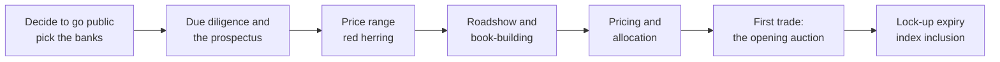
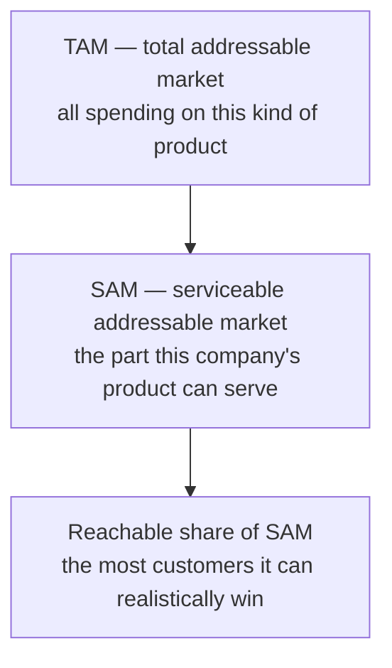
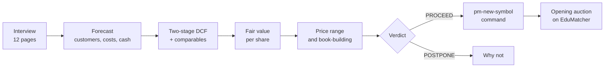

# IPO Valuation (`pm-valuation`)

!!! note "Learning objectives"
    After reading this page you will understand:

    - What an initial public offering (IPO) is, who takes part, and the steps from the decision to go public to the first trade
    - Why a sum of money today is worth more than the same sum later, and how interest rates, risk and discounting express that
    - How a company is valued from its future cash flows (a DCF) and from what investors pay for similar companies (comparables)
    - How a young company's forecast is built from its market (TAM, SAM), its customers and its costs
    - How scenarios and a Monte Carlo simulation show what the company might be worth, not just one number
    - What the offering document is (a prospectus in Sweden, an S-1 in the US), and how book-building turns a valuation into an offer price
    - How a Swedish IPO and a US IPO differ, and how to switch `pm-valuation` between them
    - Why the final price is part calculation and part judgement, and what goes wrong when it is too high or too low
    - How to use `pm-valuation`: the interview, the report, the PDF, scenario files and the hand-off to `pm-new-symbol`

!!! tip "How to read this page"
    The page has two parts. **Part I** (up to
    [Using pm-valuation](#using-pm-valuation)) teaches the finance: no
    background in investment banking or accounting is assumed. Every idea is
    introduced with a small worked example you can check with a calculator.
    **Part II** is the reference for the tool. If you already know what a DCF
    and a book-build are, skip to Part II.

    The numbers in the worked examples are chosen to be easy to follow. Where
    a section says *"in the Tornfalk case"*, the numbers come from the
    classroom case `pm-valuation --case tornfalk`, so you can find them in the
    tool's own report.

    `pm-valuation` works in two **frameworks**: a Swedish IPO (the default:
    amounts in SEK, a prospectus approved by Finansinspektionen, a listing on
    Nasdaq Stockholm) and a US IPO (`--market us`: USD, an S-1 filed with the
    SEC). Part I explains both; its examples are Swedish. A *billion* is
    1,000 million, a Swedish *miljard* (not a *biljon*), written "bn".

## Going public: what an IPO is

A young company is usually owned by a small group: its founders, its
employees (through shares and options) and venture capital funds that
invested in return for part of the company. These **private** owners cannot
easily sell their shares, and the company can raise new money only by
negotiating with a few investors at a time.

An **initial public offering** (IPO) changes that. The company sells shares
to the public for the first time, and the shares are then **listed** on a
stock exchange, where anyone can buy and sell them. Companies go public to:

- **raise capital** for growth: new shares are sold and the money goes to the
  company (the *primary* offering);
- **give existing owners a way out**: some existing shares may be sold in the
  same offering (the *secondary* offering), and all shares become tradable
  after a waiting period;
- **gain a currency**: listed shares can pay for acquisitions and reward
  employees;
- **gain visibility and credibility** with customers, suppliers and lenders.

The price of this is permanent public scrutiny, heavy reporting duties, the
cost of the offering itself, and the loss of some control.

### Who takes part

| Party | Role in the IPO |
|---|---|
| **Issuer** | The company selling shares. Its management and board decide to go public and must agree the price. |
| **Existing shareholders** | Founders, employees and venture investors. Every new share sold dilutes them; a secondary offering lets some of them sell. |
| **Underwriters** | Investment banks that organise the offering, write the prospectus with the lawyers, market the shares and, in a *firm commitment* underwriting, buy the shares from the company and resell them. They are paid a fee, the **gross spread** or commission: typically around 7% of the money raised in a mid-sized US IPO, and roughly half that in Europe. |
| **Institutional investors** | Pension funds, mutual funds, hedge funds and insurers. They buy most of an IPO and their orders decide the price. |
| **Retail investors** | Private individuals, usually offered a smaller tranche. In Sweden they apply through their bank or an online broker. |
| **Cornerstone investors** | Large investors who commit to buy a fixed amount before the offer opens. Common in Swedish IPOs, rare in US ones. |
| **The regulator** | In Sweden **Finansinspektionen** (FI), which must approve the prospectus; in the United States the Securities and Exchange Commission (SEC), which must declare the registration statement effective. No shares can be offered before that. |
| **The exchange** | Lists the shares and runs the first trading. On EduMatcher the opening auction finds the first price. |

### Primary and secondary markets

The IPO itself happens in the **primary market**: the company sells shares
to investors at the **offer price**, and the money flows to the company. From
the first trade onwards, investors trade with each other in the
**secondary market**, the exchange, and the company receives nothing more.
The difference between the offer price and the price at which trading ends on
the first day is the **first-day return**, or **pop**.



Each step is explained in [The IPO process](#the-ipo-process) below, after the
finance that the price is built on.

## The pricing dilemma: science and black magic

Everything in this page leads to one number: the **offer price**. It is the
hardest number in the whole process, because both ways of getting it wrong
are expensive.

| | Price too high | Price too low |
|---|---|---|
| **In the book** | Investors refuse to order: the book is thin or undersubscribed | The book is many times oversubscribed |
| **On the first day** | The stock falls below the offer price ("breaks issue"); buyers lose money at once | The stock jumps: a large pop |
| **Who pays** | The investors who bought, and the bankers' reputation with them | The company and the selling shareholders: they sold for less than the market would pay |
| **Worst case** | The IPO is pulled or postponed; the company may not get another chance for months | *Money left on the table*: the pop times the shares sold, a real loss to the company |
| **Longer term** | A "broken" IPO is remembered; later fund-raising is harder | A modest pop is good marketing; a huge one looks like a mistake |

Too high, and nobody buys. Too low, and you give money away. The right price
is somewhere between, and it is found by two very different kinds of work:

- **Hard finance.** A valuation built from the company's expected cash
  flows, a discount rate and the prices of comparable companies. It is
  arithmetic: given the assumptions, anyone gets the same answer. It gives a
  **range** of defensible values.
- **Judgement, negotiation and market mood** — the "black magic". What
  investors will actually pay on the day depends on sentiment, on which
  stocks are in fashion, on the story management tells, on how badly the
  founders want a higher number than their last private round, and on what
  the bankers think their investor clients will accept. None of this is in a
  spreadsheet, and all of it moves the price.

`pm-valuation` makes both halves visible. The valuation chapters of its report
are the hard finance. The pricing chapter simulates the black magic with
labelled heuristics (interest levels, a hype factor, a coverage target), so
you can see *which way* each force pushes the price. The final judge is the
opening auction on EduMatcher, where your fellow students' orders decide
whether the price was right.

## Money has a time value

The whole of valuation rests on one idea: **a sum of money today is worth
more than the same sum in the future.** There are three reasons.

1. **Opportunity.** Money you have today can be invested and grow. If you wait
   a year for it, you lose a year of growth.
2. **Inflation.** Prices rise, so the same amount buys less later.
3. **Risk.** A promise of future money may not be kept. The further away and
   the less certain the payment, the less it is worth today.

The rest of this section turns these three reasons into arithmetic.

### Interest and compounding

If you deposit 1,000 at an interest rate of 5% a year, after one year you have
$1{,}000 \times 1.05 = 1{,}050$. In the second year you earn interest on the
interest as well, $1{,}050 \times 1.05 = 1{,}102.50$, and after three years
$1{,}157.63$. This is **compounding**. In general, an amount $PV$ invested at a
rate $r$ for $n$ years grows to a **future value**

$$
FV = PV \times (1 + r)^n
$$

Compounding is slow at first and powerful later. A handy approximation, the
*rule of 72*: money doubles in about $72 / (\text{rate in \%})$ years. At 8% it
doubles in about 9 years.

### Present value and discounting

Turn the question around: **what is a payment in the future worth today?** If
1,000 arrives in three years and you could earn 5% a year meanwhile, it is
worth the amount that would grow to 1,000 in three years:

$$
PV = \frac{FV}{(1 + r)^n} = \frac{1{,}000}{1.05^3} = 863.84
$$

This is **discounting**, and $r$ is the **discount rate**. The factor
$1/(1+r)^n$ is the **discount factor**: the value today of 1 received in year
$n$. Two things make a future payment worth less today: a higher rate, and a
longer wait.

| Discount factor | Year 1 | Year 5 | Year 10 | Year 20 | Year 30 |
|---|---:|---:|---:|---:|---:|
| at 4% | 0.962 | 0.822 | 0.676 | 0.456 | 0.308 |
| at 10% | 0.909 | 0.621 | 0.386 | 0.149 | 0.057 |
| at 20% | 0.833 | 0.402 | 0.162 | 0.026 | 0.004 |

Read the table as prices: at a 10% discount rate, 1 promised in ten years is
worth 0.386 today; at 20% it is worth 0.162. The same promise of 1,000 in
three years is worth 863.84 at 5% but only 657.52 at 15%. **The discount rate
is the single most powerful number in a valuation**, because it acts on every
future cash flow at once, and hardest on the distant ones.

### The risk-free rate

Which rate should you discount at? Start with the return you can get with
**no risk** at all: lending to a government that can always repay in its own
currency. The yield on a long-dated government bond (for a Swedish company the
10-year Swedish government bond, for a US company the 10-year US Treasury) is
used as the **risk-free rate**, $r_f$. It pays for time and expected
inflation, but not for risk. `pm-valuation` defaults to 3.0% in the Swedish
framework (about the Swedish 10-year yield in August 2026) and 4.25% in the
US one. Check today's value before you rely on it.

### Risk and the required return

Nobody buys shares in a loss-making technology company to earn the risk-free
rate. Investors demand a **risk premium** on top: the riskier the investment,
the higher the return they require, and so the higher the rate at which they
discount its future cash flows. The **required return** is the discount rate.

The standard way to set it for shares is the **capital asset pricing model**
(CAPM):

$$
r_e = r_f + \beta \times ERP
$$

- The **equity risk premium** (ERP) is the extra return investors expect from
  the stock market as a whole over the risk-free rate, usually estimated at
  4–6% a year. `pm-valuation` defaults to 5.6% in the Swedish framework (the
  median in PwC's 2026 survey of Swedish practitioners) and 5% in the US one.
- **Beta** ($\beta$) measures how strongly a stock moves with the market. A
  beta of 1 moves with the market; 1.5 moves 50% more, up and down. Young
  technology companies have high betas.

For a Swedish company with a beta of 1.5:
$r_e = 3.0\% + 1.5 \times 5.6\% = 11.4\%$. Practitioners add further premia
that CAPM leaves out, for small size and for the risk that a young company
fails to deliver its plan. In the Tornfalk case the first five years are
discounted at 15.9%: 11.4% plus a 1.5% size premium plus a 3% execution
premium. From year 6, when the company is expected to be established, the rate
falls to 9.66% ($3.0\% + 1.1 \times 5.6\% + 0.5\%$).

When a company also borrows, the lenders require a return too (the interest
rate, reduced by the tax it saves). The average of the two required returns,
weighted by how much of the company is financed each way, is the **weighted
average cost of capital** (WACC). Most young companies have little debt, so
their WACC is close to the cost of equity.

!!! tip "Risk lowers value"
    Higher risk means a higher discount rate, and a higher discount rate means
    a lower value today for the same expected cash flows. This is why the
    market pays less for a promise from a start-up than for the same promise
    from a government.

### Streams of cash: NPV, perpetuities and growth

A company does not pay one amount once; it produces a **stream** of cash
flows. Its value today is the sum of the present values of every flow. For
an investment, subtracting what it costs today gives the **net present
value** (NPV).

**Example.** A machine costs 1,000 today and earns 400 a year for three years.
At a 10% discount rate:

| Year | Cash flow | Discount factor | Present value |
|---:|---:|---:|---:|
| 1 | 400 | 0.9091 | 363.64 |
| 2 | 400 | 0.8264 | 330.58 |
| 3 | 400 | 0.7513 | 300.53 |
| | | **Total** | **994.74** |

The machine earns 1,200 in total but is worth only 994.74 today, so its NPV is
$994.74 - 1{,}000 = -5.26$: at a 10% required return it is not quite worth
buying.

Companies are expected to last indefinitely. A cash flow $C$ that continues
for ever (a **perpetuity**) is worth $C / r$; one that starts at $C$ next year
and then grows at a constant rate $g$ for ever (a **growing perpetuity**) is
worth

$$
PV = \frac{C}{r - g}
$$

At $r = 10\%$, a perpetual 100 a year is worth 1,000. If it grows at 2.5% a
year it is worth $100 / (0.10 - 0.025) = 1{,}333$; at 5% growth, 2,000; at 8%,
5,000. Two lessons follow. First, value is extremely sensitive to long-run
growth when $g$ is close to $r$. Second, $g$ must stay below $r$, and in
practice at or below the long-run growth of the economy (2–3%), or the formula
claims the company will one day be larger than the world.

## What a company is worth

A share is a claim on part of a company's future. So the value of a company
is, in principle, the present value of all the cash it will ever be able to
pay its owners. That principle is simple; applying it to a company that has
never made a profit is where the work lies.

### Three ways to value a company

| Approach | Question it asks | Used for |
|---|---|---|
| **Intrinsic value** (discounted cash flow, DCF) | What are the company's expected future cash flows worth today? | The core of the valuation; forces every assumption into the open |
| **Relative value** (comparables, multiples) | What do investors pay for similar listed companies, per unit of revenue or profit? | A check on the DCF, and what investors in the book will actually compare |
| **Asset value** | What would the company's assets fetch if sold? | Banks, property and failing companies; rarely useful for a software company whose value is its customers and people |

The DCF and the comparables rarely agree. The DCF reflects *your* forecast;
comparables reflect the *market's* current mood about the sector. When the two
differ widely, one of them is telling you something: either your forecast is
too cautious, or the sector is priced for perfection. `pm-valuation` blends
them (70% DCF, 30% comparables by default) and warns when they differ by more
than 50%.

### From profit to cash

An income statement starts with **revenue** and subtracts costs to reach
profit. A simplified one, in the order `pm-valuation` reports it:

| Line | Meaning |
|---|---|
| Revenue | What customers pay |
| − Cost of revenue | Running the service: infrastructure, support, operations staff |
| = **Gross profit** | What is left to pay for everything else; as a share of revenue, the *gross margin* |
| − Research and development (R&D) | Building the product |
| − Sales and marketing (S&M) | Winning customers |
| − General and administrative (G&A) | Finance, legal, management, the cost of being listed |
| − Stock-based compensation | Pay in shares; a real cost, because it dilutes every other owner |
| = **EBITDA** | Earnings before interest, taxes, depreciation and amortisation |
| − Depreciation and amortisation (D&A) | The cost of equipment spread over its useful life |
| = **EBIT** | Earnings before interest and taxes: the operating profit |

**Profit is not cash.** Three adjustments turn operating profit into the cash
the business actually generates:

- **Taxes** are paid on profit. Losses in early years are carried forward
  (a *net operating loss*, NOL) and reduce the tax on later profits.
- **Capital expenditure** (capex) is cash spent on equipment now; the income
  statement only shows it slowly, as depreciation. So add back D&A and
  subtract capex.
- **Working capital** is cash tied up in running the business: customers who
  have not yet paid, minus suppliers not yet paid and customers who paid in
  advance. Growth usually ties up more of it. Subscription companies that bill
  a year in advance are the happy exception: their growth *releases* cash.

The result is the **free cash flow to the firm** (FCFF): the cash available to
everyone who financed the company, before any of it is paid to lenders or
owners.

$$
FCFF = EBIT - \text{taxes} + D\&A - \text{capex} - \Delta\text{working capital}
$$

**Example — Tornfalk, year 5 (SEK m):**
EBIT 1,101.9 − taxes 122.7 + D&A 100.2 − capex 248.1 − change in working
capital (−94.4) = **925.7**. The change in working capital is negative because
Tornfalk's customers pay in advance, so growth adds cash rather than using it.

### Enterprise value and equity value

Think of buying a house with a mortgage. The house is worth 500,000; the
mortgage is 300,000; the owner's share (the equity) is worth 200,000. If the
house also contains a safe with 20,000 in it, the owner's equity is worth
220,000.

A company works the same way. Discounting FCFF gives the value of the
business as a whole, the **enterprise value** (EV), which belongs to lenders
and owners together. To reach the value of the shares, the **equity value**:

$$
\text{Equity value} = EV + \text{cash} - \text{debt}
$$

Dividing by the number of shares gives the **value per share**, the number the
offer price is compared with. In the Tornfalk case: EV 10,330.4 m SEK, plus
900.0 m net cash, minus 180.0 m in offering fees, divided by 120 million
pre-IPO shares, is a DCF value of 92.09 SEK per share.

!!! note "Why the money raised does not change the value per share"
    Selling new shares at a *fair* price brings in exactly as much cash as the
    new shares are worth, so existing owners neither gain nor lose, except for
    the fees. The model therefore values the company before the IPO and
    deducts only the costs of raising the money.

## Forecasting a young company

A DCF needs cash flows for years to come. For a mature company, next year
looks like last year plus a little. For a young company growing 50% a year,
you have to build the forecast from its drivers. `pm-valuation` does this from
the bottom up, and so should you when you answer its questions.

### How big can it get? TAM, SAM and the reachable share



- The **total addressable market** (TAM) is everything customers spend on this
  kind of product worldwide: the whole pond.
- The **serviceable addressable market** (SAM) is the part the company's
  product, geography and price can actually serve.
- The **reachable share** (sometimes called the *serviceable obtainable
  market*, SOM) is the part of SAM the company can realistically win against
  competitors. It depends on the market structure: a fragmented, competitive
  market allows a smaller share than one where a few firms dominate.

In the Tornfalk case in year 1: a TAM of 448 mdr (miljarder kronor), of which 25% is serviceable
(112 mdr), of which Tornfalk can reach at most 8%, about 9 mdr of revenue, or
14,222 customers at 630,000 SEK a year each. It has 2,600 today: plenty of
room to grow, but not unlimited room.

### Customers, churn and price

Revenue is built from customers:

- Each year the company **wins** new customers (*gross adds*), faster while it
  is small relative to its reachable market and slower as it approaches that
  ceiling. This S-shaped path is called **logistic** growth.
- It **loses** a share of its customers every year: the **churn** rate.
- Each customer pays the **average revenue per user** (ARPU), which grows with
  price rises and upselling.

Tornfalk, year 1: 2,600 customers at the start, 1,508 won, 208 lost (8%
churn), 3,900 at the end. Revenue is ARPU times the average number of customers
during the year: 2,047.5 m SEK.

**Unit economics** ask whether a customer is worth what it costs to win. The
*lifetime value* (LTV) is the gross profit a customer brings before leaving:
with an ARPU of 60,000, a 75% gross margin and 8% churn, a customer stays on
average $1 / 0.08 = 12.5$ years and is worth $60{,}000 \times 0.75 / 0.08 =
562{,}500$. Compare it with the *customer acquisition cost* (CAC), all sales
and marketing spend divided by customers won. An LTV at least three times the
CAC is a common mark of a healthy subscription business.

### People and costs

Staff are the largest cost of a young technology company. Headcount grows with
revenue, but less than proportionally (the model's *elasticity*, 0.6 by
default: 10% more revenue needs about 6% more people). Revenue per employee
therefore rises as the company grows, and the operating margin with it. This
**operating leverage** is why investors accept years of losses: they are
paying for the margin the company will have once it is large.

## The discounted cash flow, step by step

A DCF applies the time value of money to the forecast. Here it is on a small
company, with round numbers, before looking at what `pm-valuation` adds.

**Step 1 — Forecast the free cash flows.** Five years: −20, −5, 10, 25, 35
(millions). The early losses are typical of a growing company.

**Step 2 — Choose the discount rate.** 12%.

**Step 3 — Discount each year.**

| Year | FCFF | Discount factor at 12% | Present value |
|---:|---:|---:|---:|
| 1 | −20 | 0.8929 | −17.86 |
| 2 | −5 | 0.7972 | −3.99 |
| 3 | 10 | 0.7118 | 7.12 |
| 4 | 25 | 0.6355 | 15.89 |
| 5 | 35 | 0.5674 | 19.86 |
| | | **Sum, years 1–5** | **21.02** |

**Step 4 — Add a terminal value.** The company does not stop after year 5.
Assume its cash flow grows at 3% a year for ever from then on. With the growing
perpetuity formula, the value at the end of year 5 of all later years is the
**terminal value**:

$$
TV_5 = \frac{FCFF_6}{r - g} = \frac{35 \times 1.03}{0.12 - 0.03} = 400.56
$$

It is worth $400.56 \times 0.5674 = 227.29$ today.

**Step 5 — Enterprise value.** $21.02 + 227.29 = 248.31$ million.

**Step 6 — Bridge to value per share.** With 50 m cash, 20 m debt and 10 m
shares: $(248.31 + 50 - 20) / 10 = 27.83$ per share.

!!! warning "Most of the value is in the far future"
    In this example **91.5%** of the enterprise value is the terminal value:
    the years after the forecast ends. That is normal for a growth company, and
    it is the DCF's great weakness. Change the discount rate by one point and
    the value per share moves from 27.83 to 31.99 (at 11%) or 24.53 (at 13%).
    Change long-run growth by one point and it moves to 25.36 (2%) or 30.92
    (4%). A DCF is only as good as its assumptions, which is why the report
    shows sensitivity grids and why the offer price is not simply the DCF
    value.

### What `pm-valuation` does differently

The model follows the same steps with more care in three places:

- **Two stages.** Years 1–5 are discounted at a higher rate (risky growth)
  than years 6–10 (established business). Each year's discount factor is the
  product of every earlier year's rate, so later years carry the high early
  rate too.
- **Ten years, not five,** so that growth can slow before the terminal value
  takes over.
- **Growth must be paid for.** The simple formula above lets the company grow
  for ever for free. The model's terminal value instead asks how much the
  company must reinvest to grow at $g$, given the return it earns on new
  investment (RONIC).

$$
TV_N = \frac{NOPAT_{N+1} \times \left(1 - \dfrac{g}{RONIC}\right)}{r_2 - g}
$$

NOPAT is operating profit after tax. If new investment earns only the cost of
capital, growth adds no value at all. In the Tornfalk case, the terminal value
is 66.6% of an enterprise value of 10,330.4 m SEK.

## Comparables: what the market pays

The second method asks what investors currently pay for similar listed
companies, expressed as a **multiple**: enterprise value divided by revenue,
by EBITDA, or by profit. Young companies without profits are compared on
**EV / revenue**, usually next year's revenue.

In the Tornfalk case, listed business-software companies trade at 10 times
next year's revenue. Tornfalk's next-year revenue of 2,047.5 m SEK therefore
implies an enterprise value of 20,475 m SEK, and 176.62 SEK per share: almost
double the DCF's 92.09. The blend, 70% DCF and 30% comparables, is the
**fair value** of 117.45 SEK per share.

Multiples are quick and they are what investors in the book will look at. But
they import the market's mood wholesale: when a sector is in fashion, every
company in it looks cheap next to its peers.

## Uncertainty: scenarios, sensitivity and Monte Carlo

Every input to the forecast is a guess. A single fair value hides how good or
bad the guess might be. Three tools show the range.

**Scenarios.** Set every driver to a pessimistic value at once (the *bear*
case) and then to an optimistic value (the *bull* case). In the Tornfalk case
fair value ranges from 16.94 (bear) through 117.45 (base) to 307.41 SEK
(bull): a reminder of how much is unknown.

**Sensitivity and the tornado.** Move one driver at a time to its bear and bull
values, keeping everything else at base, and rank the drivers by how far they
move fair value. The ranked bars look like a tornado. The drivers at the top
are the ones worth arguing about; for Tornfalk it is how fast headcount grows
with revenue, then how much of its market it can reach.

**Monte Carlo simulation.** Scenarios move all drivers together to their
extremes, which is unlikely; the tornado moves one at a time, which ignores
combinations. A **Monte Carlo** simulation does neither. It builds thousands of
possible companies, each with every driver drawn at random from its range, and
values each one exactly as the base case. The result is a **distribution** of
fair values:

- The **median** (P50) is the middle company; P5 and P95 bound the central 90%.
- Drivers are **correlated**: in reality good news tends to arrive together
  (strong growth, low churn, a strong market). The model links the draws
  through a common factor with correlation $\rho$ (0.5 by default).
- The most useful single number is the share of simulated companies worth
  **less than the offer price**: the probability that IPO buyers overpay.

In the Tornfalk case (10,000 companies): P5 58.53, median 110.48, P95 174.18
SEK; and in 43.8% of them fair value is below the 105.00 SEK offer price. The
book was twelve times covered, yet for the fundamentals the price is close to
a coin flip.

## The IPO process

With the finance in place, here is how a valuation becomes an offer price.
`pm-valuation` follows the Swedish process by default: a prospectus approved
by Finansinspektionen, and a listing on Nasdaq Stockholm. With `--market us`
it follows the American one: a Form S-1 filed with the SEC, and a listing on
Nasdaq or NYSE. The two differ in names, legal detail and a few conventions,
not in substance:

| | Sweden (`--market se`, the default) | United States (`--market us`) |
|---|---|---|
| Company form | Public limited company, **AB (publ)** | Corporation, **Inc.**, usually incorporated in Delaware |
| Offering document | **Prospectus**, under the EU Prospectus Regulation | Registration statement, **Form S-1**, which contains the prospectus |
| Who checks it | **Finansinspektionen** (FI) approves it | The **SEC** reviews it and declares it effective |
| Exchange | Nasdaq Stockholm, Main Market | Nasdaq or NYSE |
| Price range | Stated in the prospectus; its top is the **maximum price** | Filed in an amended S-1; the final price may be up to about 20% outside it |
| Bank fees (model default) | 3% of the money raised | 7% of the money raised |
| Buyers | Institutions, often **cornerstone investors**, and an offer to the public | Mainly institutions |
| Currency | SEK | USD |

### Preparing: the banks and the prospectus

The company chooses its **underwriters**, one or more investment banks led by
a *bookrunner*, in Swedish deals often called the *global coordinator*. Months
of **due diligence** follow: bankers, lawyers and auditors check everything the
company will say about itself, because everyone responsible for the offering
document is liable if it is misleading. Only a public company may offer its
shares to the public, so a Swedish private company (AB) first becomes a public
one, **AB (publ)**. A few weeks before the offer, it usually announces its
**intention to float**, which starts the public conversation about the IPO.

The result is the **prospectus**, the document investors read. In Sweden,
Finansinspektionen must approve it before the offer opens. In the United
States it is the main part of the **registration statement, Form S-1**, filed
with the SEC. The headings differ; the content is much the same:

| Part of the prospectus | What it tells an investor |
|---|---|
| Summary | The business and the offering in a few pages; the S-1 also has a cover page with the price, the shares and the banks' fee |
| **Risk factors** | Everything that could go wrong, from competition to key people leaving |
| Reasons for the offer and use of proceeds | Why the company lists, and what it will do with the money |
| Capitalisation and **dilution** | How the share count changes, and how much new investors pay over the book value per share |
| Operating and financial review (MD&A in an S-1) | Management's explanation of the numbers |
| Business and market | The company, its market and its strategy |
| Financial statements | Audited accounts |
| Terms of the offer, or Underwriting | The price range, how shares are allocated, the banks, their fees and the lock-up agreements |

Smaller companies may publish lighter documents. In the EU, small and
medium-sized companies, and companies listing on a growth market such as
Nasdaq First North, may use the shorter **EU Growth prospectus**. In the
United States, an **emerging growth company** (EGC, annual revenue below about
1.235 billion dollars) may, for example, present fewer years of audited
accounts, and a **smaller reporting company** (SRC) qualifies by its public
float or revenue. The report's first section is the document's cover in
brief: the **Prospectus cover** with the issuer, its ICB industry code,
Finansinspektionen and the listing venue, or, with `--market us`, the **S-1
cover** with the SIC code and the EGC and SRC status, which `pm-valuation`
works out from your answers.

### The price range and the IPO discount

When the offer opens, the prospectus is published with a **price range**, for
example 94.50–105.00 SEK per share. In the United States, the company files an
amended S-1 with the range and prints the **preliminary prospectus**,
nicknamed the *red herring* for the red warning on its cover that the
registration is not yet effective.

The range is deliberately set **below** fair value. The gap is the **IPO
discount**, typically 10–15%, and there are good reasons for it:

- New investors take a risk on a company with no trading history; the
  discount pays them for it.
- A stock that rises on its first day creates goodwill and attention, and
  makes the next offering easier.
- Bankers want a book of orders several times larger than the offering, so
  that the price holds when trading starts (see below).

In the Tornfalk case, fair value is 117.45 SEK, a 15% discount gives a
midpoint of 99.83, and the range is rounded to 94.50–105.00 SEK. If management
insists on a minimum valuation, for example no lower than the last private
funding round, the range moves up to meet it, and the discount shrinks. When
it shrinks too far, the IPO cannot be sold (the Halvard case).

### The roadshow and book-building

Often before the offer is even launched, a few large investors commit to buy
a fixed amount of money's worth of shares at whatever price is set. These
**cornerstone investors** are common in Sweden. Their names in the prospectus
tell other investors that professionals have already checked the company.

Then, for one to two weeks, management and the bankers present the company to
institutional investors in meetings and presentations: the **roadshow**. The
investors respond with **indications of interest**: how many shares they
would buy, and at what maximum price. These orders are not binding, but
reputations depend on them. In Sweden the offer is usually also open to the
public: private investors apply for shares through their bank or online
broker during the same period.

The bookrunner collects all indications in **the book**, and so learns how
much demand there is at every price. The key number is **coverage**, or
oversubscription: demand divided by the value of the shares offered.

| Price (SEK) | Coverage (Tornfalk's book) |
|---:|---:|
| 75.50 (20% below the range) | 31.41× |
| 94.50 (bottom of the range) | 16.22× |
| 105.00 (top of the range, the maximum price) | 11.92× |

Demand falls as the price rises, as it should. A book covered 12 times means
investors asked for twelve times the shares on offer. Such a deal is called
**hot**.

### Pricing and allocation

When the book closes, the company and the bookrunner set the **offer price**.
The usual rule: the highest price at which the book is still comfortably
oversubscribed, typically at least three times.

How high that can go depends on the market. In Sweden, the prospectus states
the top of the range as the **maximum price**. Private investors applied on
that promise, so a higher price would need a supplement to the prospectus that
lets everyone withdraw, and in practice the maximum price is a hard limit.
`pm-valuation` uses it as one. In the United States a deal may price about 20%
outside the filed range without re-filing, and with `--market us` that is the
limit instead. Tornfalk prices at the maximum price, 105.00 SEK, and is still
11.92 times covered: an American deal would have raised the price above the
range.

At 12 times coverage most investors get only a fraction of what they asked
for. **Allocation** is at the bookrunner's discretion: cornerstones receive
their shares first, then long-term investors are favoured, and so, it is often
said, are the bank's best clients. Tornfalk's institutions receive about 8% of
their orders, its private investors about 22%. Unfilled investors who still
want the stock must buy it on the exchange on the first day. That unfilled
demand drives the first-day price up.

If the book is covered less than the target, the deal can still price at the
bottom of the range on a **thin book**, with a real risk of trading below the
offer price. If it is not covered even once, the IPO is **postponed**.

Real IPOs usually also include an **over-allotment option**, called the
**greenshoe** in the United States: the banks may sell up to 15% more shares
and buy them back in the market if the price falls, which supports the price.
`pm-valuation` leaves it out.

### The first day and after

Trading starts with an **opening auction**: buy and sell orders collected
before the open are matched at the single price that trades the most shares
(see [Auctions & Scheduling](030-sessions-and-scheduling.md)). That price, not the
offer price, is the market's first verdict.

The first-day return is the **pop**. IPOs in Sweden, the United States and
most other countries have on average closed their first day above the offer
price, in the United States somewhere in the high teens of percent over the
past four decades, with enormous variation: some double, some fall. The pop
is a gain for the investors who were allocated shares, and a cost to the
company:

$$
\text{Money left on the table} = \text{pop} \times \text{offer price} \times \text{shares sold}
$$

Tornfalk's expected pop is 29.8%. On 38.1 million shares sold at 105.00 SEK,
that is 1,193.1 million SEK, about 1.2 miljarder kronor, that the company
could have raised but did not.

Two dates matter after the IPO:

- **Lock-up expiry.** Existing owners usually agree not to sell for 180 days,
  sometimes longer. When the lock-up ends, many more shares can be sold, and
  the price often weakens in anticipation. For Tornfalk, 120 million pre-IPO
  shares, 3.2 times the free float, are released.
- **Index inclusion.** Stock-market indices require a minimum size, a minimum
  free float (shares available to trade) and usually a *seasoning* period of
  trading before a new stock can join. Inclusion brings buying from index
  funds, so investors in the book value the prospect of it. See
  [Market Index](070-market-index.md).

## The black magic: what the formulas cannot tell you

The valuation gives a defensible range. What decides where in that range, or
outside it, the price ends up is not arithmetic:

- **Market mood and the IPO window.** When stocks are rising and recent IPOs
  have done well, investors queue up; after a market fall, the same company
  cannot be sold at any sensible price. Companies time their IPOs for an open
  *window*.
- **Fashion.** Sectors go in and out of favour, and the comparables multiple
  moves with them. A company valued at 10 times revenue one year may be worth
  4 times the next with no change in its business.
- **The story.** Investors buy a narrative about the future: a new market, a
  platform, a famous founder. A convincing story shows up as demand in the
  book, not as a change in the discount rate.
- **Anchoring.** Founders and venture investors anchor on the valuation of the
  last private funding round. Pricing below it (a *down round*) is painful for
  them, so they may set a floor that the market will not meet.
- **Conflicting incentives.** The bankers' fee is a percentage of the money
  raised, which favours a higher price. But their long-term business is with
  the institutional investors who buy IPOs, which favours a lower price and a
  pop. The company wants the most money; it also wants a successful first day.
- **The self-fulfilling pop.** Oversubscription creates unfilled demand, which
  creates the pop, which is reported as success, which creates demand for the
  next IPO.

`pm-valuation` represents these forces with a few labelled **heuristics**,
not finance theory. Investor interest levels and a hype factor move demand,
a coverage target sets the pricing rule, and a formula links coverage to the
expected pop. They show which way each force pushes, and how strongly
compared with the others. They do not forecast the first day. On EduMatcher
the opening auction does that, with real orders from real people.

!!! tip "Try it"
    Run `pm-valuation --case tornfalk`, press F5, then `b` to go back.
    Change only the investor interest and hype on page 9, press F5 again and
    `c` to compare. The valuation does not move at all, and the offer price
    stays at the maximum price, 105.00 SEK. But coverage falls from 11.92 to
    5.01 times, and the expected pop from 29.8% to 16.9%. That is the black
    magic, isolated.

## Using pm-valuation

[Listing a New Symbol](010-new-symbols.md) starts from an agreed offer price.
`pm-valuation` is where that price comes from. It interviews you about a
fictive company, values it with the methods of Part I, and simulates the IPO
that sells its shares:



The tool is a teaching model, not a pricing engine. Every rate, multiple and
sector preset is an assumption, and the demand and first-day-pop formulas are
calibrated heuristics that show direction and causes. The real first-day price
is found by the opening auction once the symbol is listed, which is the point
of the exercise: the students' own orders decide whether their price was
right. The formulas, presets and worked example are in the design document,
`docs-design/EduMatcher-valuation.md`.

## Quick start

Start from a classroom case, change what you like, and press F5:

```bash
pm-valuation --case tornfalk
```

Or print the report without the interview:

```bash
pm-valuation --case tornfalk --no-tui --mode deterministic
```

```text
Tornfalk Security AB (TORN) — IPO valuation  PROCEED

1. Verdict
  PROCEED

   Fair value per share           117.45
   Price range              94.50–105.00
   Offer price                    105.00
   Market capitalisation      16,600.0 m
   Primary raise               4,000.0 m
   Coverage                       11.92×
   Expected first-day pop          29.8%
...
17. Next step
  pm-new-symbol --symbol TORN --ipo-price 105.00 --outstanding-shares 158095238 --tick-decimals 2
```

Without `--load` or `--case`, the interview starts empty: every answer has an
automatic value, so pressing F5 straight away values an average Swedish B2B
software company, in SEK.

## Sweden or the United States

The market, page 1's last question, decides the IPO framework and every
country-specific default. Sweden (`se`) is the default; `--market us` on the
command line selects the United States and overrides the scenario file.

| | `se` | `us` |
|---|---|---|
| Currency | SEK | USD |
| Offering document and report section 2 | Prospectus, approved by Finansinspektionen; **Prospectus cover** with the ICB industry code | Form S-1, filed with the SEC; **S-1 cover** with SIC code, EGC and SRC status |
| Default company name, incorporation, lead bank | Newco AB, Sweden, Fiktiva Banken AB | Newco Inc., Delaware, Fictive & Co. |
| Risk-free rate, equity risk premium | 3.0%, 5.6% | 4.25%, 5% |
| Tax rate, inflation, long-run growth | 20.6%, 2%, 2% | 25%, 2.5%, 2.5% |
| Bank fee (gross spread) | 3% | 7% |
| Maximum price above the range | 0%: the top of the range is the maximum price | 20% |
| Typical share price at the IPO | About 100 SEK | About 20 dollars |

Money defaults, such as a sector's cost per employee or the index rulebook's
minimum size, are converted into the market's currency at a fixed 10 SEK per
dollar. Swedish salaries are set lower than American ones, and revenue per
employee is scaled with them, so staff costs keep the same share of revenue in
both markets.

The market is saved in the scenario file, and **the file's amounts are in
that market's currency**. `--market us` on a Swedish case therefore reads
1.4bn of revenue as 1.4 billion dollars, not kronor, and values a company ten
times larger. To compare the frameworks fairly, convert the amounts too.

Swedish and English count large numbers differently. A Swedish *miljard* is
a thousand million, the English **billion**; a Swedish *biljon* is a million
million. `pm-valuation` accepts both spellings for amounts (see
[Typing values](#typing-values)). Field values are shown in the market's
words: `400mdr` and `900mkr` in Sweden, `40bn` and `90m` in the United States,
in the interview, in scenario files and in the report's list of
assumptions. The report's own tables are in millions, `m`, which read the same
in both languages.

## Sector presets

The sector preset on page 1 is the most important single choice in the
interview: it fills in most of the other answers with values that fit
together for one kind of business. There are 18, grouped by industry the way
Nasdaq Stockholm classifies listed companies. Nasdaq's Nordic exchanges have
used FTSE Russell's **Industry Classification Benchmark** (ICB) since 2011:
11 industries, divided into about 170 subsectors, each with an eight-digit
code. The US SEC files companies under four-digit **SIC codes** (Standard
Industrial Classification). A preset carries both, and the cover of the
report shows the one its market uses: *ICB 10101015 Software* on a Swedish
prospectus, *SIC 7372* on an S-1.

| Preset | ICB subsector | A customer is | Comparables multiple | Year-10 margin | What sets it apart |
|---|---|---|---:|---:|---|
| **Technology** | | | | | |
| `b2b_saas` | 10101015 Software | business account | 10× | 20%–35% | Fast growth, few customers leave, high gross margin; losses now, wide margins later |
| `consumer_subscription` | 10101020 Consumer Digital Services | paying subscriber | 5× | 15%–30% | Millions of small customers, a third of them leave each year |
| `online_marketplace` | 10101020 Consumer Digital Services | active buyer | 6× | 15%–30% | Keeps a fee on each sale; heavy marketing to win buyers |
| `deep_tech_hardware` | 10102010 Semiconductors | enterprise account | 3× | 12%–25% | Hardware plus service; high capex, cash tied up in stock |
| `consulting` | 10101010 Computer Services | client account | 1.6× | 8%–16% | Staff are nearly all the cost, so margins barely widen with size; little capex |
| **Telecommunications** | | | | | |
| `telecom_operator` | 15102015 Telecommunications Services | subscriber | 2.6× | 15%–28% | Heavy network capex and fixed costs; stable subscribers; low beta |
| **Health Care** | | | | | |
| `medtech` | 20102010 Medical Equipment | hospital or clinic account | 3.9× | 18%–30% | High gross margin and heavy R&D; approval risk raises the execution premium |
| `healthcare_services` | 20101010 Health Care Facilities | care contract or clinic | 1.2× | 6%–12% | Staff-heavy and stable; paid by regions, insurers or patients; low beta |
| **Consumer Discretionary** | | | | | |
| `retail_stores` | 40401030 Specialty Retailers | store | 0.6× | 4%–10% | Growth by opening stores; goods bought in and rent eat most of revenue; stock ties up cash |
| `ecommerce_retail` | 40401010 Diversified Retailers | active buyer | 0.4× | 3%–8% | Thin margins on goods bought in; 40% of buyers stop each year |
| `video_games` | 40203040 Electronic Entertainment | paying player | 4× | 15%–30% | Hit-driven: more than half of paying players leave each year; high execution premium |
| `media_publishing` | 40301030 Publishing | subscriber or reader | 1.4× | 8%–15% | A slowly shrinking market; print, distribution and royalty costs |
| **Consumer Staples** | | | | | |
| `consumer_brands` | 45102020 Food Products | retail or distribution account | 1.6× | 8%–15% | Ingredients and production are half of revenue; brand marketing; low beta |
| **Industrials** | | | | | |
| `fintech_payments` | 50205015 Transaction Processing Services | merchant | 7× | 15%–30% | Grows with merchants' sales; card-network fees; cash tied up in settlement |
| `industrial_machinery` | 50204000 Machinery: Industrial | industrial customer | 1.2× | 8%–16% | Materials are the largest cost; factories need capex; stock and invoices tie up cash |
| `construction_services` | 50101015 Engineering and Contracting Services | project client | 0.8× | 4%–9% | Low margins on large projects; subcontractors and materials |
| `logistics_transport` | 50206060 Transportation Services | shipper account | 0.8× | 5%–12% | Vehicles and warehouses need capex; fuel and hired haulage; low margins |
| **Utilities** | | | | | |
| `renewable_energy` | 65101010 Alternative Electricity | power-purchase contract | 6× | 30%–50% | Capital-heavy: parks are built up front (capex 35% of revenue) and depreciated over 25 years |

The comparables multiple is the enterprise value investors pay per unit of
next year's revenue, and the year-10 margin is the range of EBIT margins the
model considers plausible for the sector (warning V008 outside it). Software
is valued at many times its revenue because most of each extra sale is profit;
a construction company earns a few percent on each sale and is valued at less
than its revenue. Every preset's default company is tuned to be coherent in
both markets, but the values are illustrative, not researched benchmarks.

**Choosing a preset.** Pick the business model that is closest, not the
product: a company selling software to hospitals is `b2b_saas`, not `medtech`.
Then change the answers that do not fit; the preset only supplies starting
values. Look at what "a customer is" for the preset: for `retail_stores` the
model counts stores, so "customers" grow as the chain opens shops and "churn"
means closing them.

**Companies without a preset.** Some businesses are valued in other ways, and
the model would teach them wrongly:

- **Banks and insurers** borrow and lend as their business, so the cash flow
  to the whole firm means little. They are valued on their equity and its
  return, for example price to book value.
- **Property companies** are valued on the market value of their buildings
  less their debt, the *net asset value*.
- **Pre-revenue biotech** has no customers yet. Its drugs in development are
  valued one by one, weighted by the chance each passes its trials
  (*risk-adjusted NPV*).
- **Mining and oil exploration** companies are valued on the resources in the
  ground and the cost of extracting them.

## The interview

The interview is a full-screen terminal form with twelve pages, laid out like
the other EduMatcher terminal programs (`pm-viewer`, `pm-board`): the
EduMatcher badge, program and version in the top bar, and a rounded box
around each area.

```text
 EduMatcher   pm-valuation x.yy.z   │   Tornfalk Security AB (TORN)   │   Page 3/11   │   Level Intermediate
╭─ Pages ────────────────────────╮╭─ 3 Customers & pricing ────────────────────────────────────╮╭─ Live preview ───────╮
│  1 Company               ✎4    ││ Last FY revenue             1.4mdr        ✎ you           ^││ Fair value           │
│  2 Market                      ││ Customers now               2,600         ✎ you            ││       117.45         │
│▶ 3 Customers & pricing   ✎2    ││ ARPU per year                             600,000 · preset ││ DCF        92.09     │
│  4 People                      ││ Annual churn                              8% · preset      ││ Comps     176.62     │
│  5 Costs                       ││ Customer growth, year 1                   50% · preset     ││                      │
│  6 Capital & tax         ✎1    ││                                                            ││ Range 94.50–105.00   │
│  7 Discount rates              ││                                                            ││ Offer 105.00 at 11.9×│
│  8 Offering              ✎2    ││                                                            ││                      │
│  9 Investors & sentiment ✎4    ││                                                            ││ PROCEED              │
│ 11 Management                  ││                                                            ││                      │
│ 12 Simulation                  ││                                                            ││                      │
│                                ││                                                           v││                      │
╰────────────────────────────────╯╰─ F3 → Advanced: 1 more field here · 1 answer hidden ───────╯╰─ F4 explain ─────────╯
╭─ Field description ──────────────────────────────────────────────────────────────────────────────────────────────────╮
│ Annual churn — The share of customers lost each year. At 8% the average customer stays 1 / 0.08 = 12.5 years; at 35% │
│ (typical for consumer apps) less than 3. Churn sets a customer's lifetime value, the profit it brings before         │
│ leaving: ARPU × gross margin (the share of revenue left after the direct cost of serving customers) / churn.         │
│ Business software often churns 5-15% a year.                                                                         │
│                                                                                                                      │
│                                                                                                                      │
╰──────────────────────────────────────────────────────────────────────────────────────────────────────────────────────╯
 Tab next · PgDn page · Enter pick · Ctrl-D clear · F1 glossary · F2 review · F3 level · F5 calculate · F9 save · Esc qu
```

- **Top bar:** the company, the page and the [level](#levels-how-much-the-interview-asks).
- **Pages:** the pages at the current level; ✎ counts your answers on each.
- **The form**, titled with the page: one field per row, your answer or the
  automatic value beside it. Its bottom border says what F3 adds on this page.
- **Live preview:** fair value, the price range and the verdict, recalculated
  as you type. F4 explains each number with its current value: for example
  that fair value is 70% of the DCF value plus 30% of the comparables value,
  and why the offer price stopped where it did. See
  [The live preview](#the-live-preview) for every line in full.
- **Field description:** what the field in focus means, or what is wrong with
  its value.

| Page | What it asks |
|---|---|
| 1 Company | Name, ticker, **sector preset**, cover details, **market** (`se` or `us`) |
| 2 Market | Addressable market, its growth, your reachable share |
| 3 Customers & pricing | Last year's revenue, customers, price per customer, churn, growth |
| 4 People | Headcount, cost per employee, how hiring follows revenue |
| 5 Costs | Infrastructure, acquisition cost, R&D, G&A, stock-based pay |
| 6 Capital & tax | Capex, working capital, tax, loss carry-forwards, cash and debt |
| 7 Discount rates | Risk-free rate, equity risk premium, betas and premia per stage |
| 8 Offering | Shares before the IPO, raise, fees, IPO discount, lock-ups |
| 9 Investors & sentiment | Institutional and retail interest, hype, comparable multiple |
| 10 Index | The fictive index rulebook, and what the exchange may relax |
| 11 Management | Last private round, minimum market cap, maximum dilution |
| 12 Simulation | Scenarios, Monte Carlo draws, seed, correlation |

### Levels: how much the interview asks

Not every question matters equally, and a beginner should not face 129 of
them. The interview has four **levels**. Each shows the fields of the levels
before it and adds more; every field it does not show keeps its automatic
value, so the valuation is always complete.

| Level | Fields | What it adds |
|---|---:|---|
| **Beginner** (the default) | 16 | The essentials: name, sector, market, market size, revenue and growth, cash and debt, the risk-free rate, the raise and IPO discount, investor interest and hype, the last private round |
| **Intermediate** | 43 | Customers, price and churn; headcount; tax; the equity risk premium, betas and terminal growth; share count and fees; the comparable multiple and DCF weight; management's limits |
| **Advanced** | 88 | Costs in detail, capital and working capital, the size and execution premia, lock-ups and cornerstones, the size of the book, the index rulebook, the Monte Carlo settings |
| **Expert** | 129 | Everything: staff splits, WACC and horizon settings, rate overrides, the bear and bull value of every scenario driver |

Start at a level with `--level`, and change it at any time with F3, which
steps Beginner → Intermediate → Advanced → Expert and back. The title bar
shows the level. The bottom border of the form says how many fields the next
level adds on this page, and warns when answers you typed or loaded sit in
fields the current level hides: they are still used. Pages with no fields at
the current level are left out of the page list; at Beginner, pages 4, 5, 10
and 12 are. The [Field reference](#field-reference) below explains every
field and gives its level.

### Automatic values and their source

Every question can be skipped. The hint beside a field shows what the model
will use instead, and where it comes from:

| Source | Meaning |
|---|---|
| **you** | Your answer. It always wins |
| **preset** | The sector preset chosen on page 1 |
| **derived** | Computed from other answers, e.g. customers from revenue ÷ price |
| **default** | A fixed default, or the market's, e.g. the Swedish 20.6% tax rate |

F2 opens the review page: every value in one table with its source, which is
also section 3 of the report.

### Typing values

| Field | Accepts | Notes |
|---|---|---|
| Money and counts | `90m`, `1.4bn`, `2.5k`, `1_000`, `60,000` | Swedish suffixes too: `90mkr` (miljoner kronor), `1.4md` or `1.4mdr` (miljarder). In the Swedish market, amounts are shown with `mkr` and `mdr` |
| Percentages | `12`, `12%`, `0.5` | A plain number is **percentage points**: `0.5` is 0.5%, never 50% |
| Ratios | `10`, `10x` | |
| Yes / no | `yes`, `no` | |
| Choices | Enter opens a pick-list | Sector, market structure, interest levels, … |
| Optional fields | `none` | "Not given", e.g. no last private round |

An empty field goes back to its automatic value (Ctrl-D does the same). A
value out of range turns the field red and the error replaces the field description.
F5 refuses to calculate while any field has a problem, and lists them.

### Keys

| Key | Action |
|---|---|
| Tab / Shift-Tab, ↓ / ↑ | Next / previous field |
| PgDn / PgUp | Next / previous page |
| Enter | Open a pick-list |
| Ctrl-D | Clear the field back to its automatic value |
| F1 | Glossary: type to filter it, ↑ / ↓ and PgUp / PgDn to scroll |
| F2 | Review every value and its source |
| F3 | Next level: Beginner → Intermediate → Advanced → Expert → Beginner. The form's bottom border says what it adds on this page |
| F4 | Explain the live preview: what each number means and how it was reached, with today's values (↑ / ↓ scroll, Esc closes) |
| F5 | Calculate and open the report |
| F9 | Save the scenario |
| Esc / Ctrl-Q | Quit; asks first if there are unsaved changes |

## The live preview

The box on the right of the interview is the **live preview**. It values the
company again after every keystroke, so you see at once what an answer does.
It shows the deterministic base case: one forecast with every answer at its
value, without the bear and bull scenarios or the Monte Carlo simulation
(those need F5). Every number is per share, in the market's currency, and is
the same number the report shows after F5. F4 opens the same explanations as
below, with the values on your screen.

| Line | What it is | Computed from |
|---|---|---|
| Fair value | What one share is worth after the IPO | DCF and Comps, blended |
| DCF | The value of the company's own forecast cash flows, per share | The whole forecast and the discount rates |
| Comps | The value at the price the market pays for similar companies, per share | Next year's revenue and the comparable multiple |
| Range | The price range published before investors order | Fair value and the IPO discount |
| Offer … at …× | The price IPO buyers pay, and how many times the offer is covered by orders | The book of orders at every price in the band |
| Verdict | PROCEED, THIN BOOK or POSTPONE | The book, and management's limits |
| ⚠ notes | How many plausibility warnings the model raised | The checks behind the report's warnings |

The numbers form a chain: the two methods give fair value, fair value gives
the range, and the range is where the book is tested. An answer that moves
fair value therefore moves everything below it; an answer about investors
moves only the offer price, the coverage and the verdict. The examples below
use the Tornfalk case (`pm-valuation --case tornfalk`): fair value 117.45,
DCF 92.09, comparables 176.62, range 94.50–105.00, offer 105.00 at 11.9×,
PROCEED.

### Fair value

**Meaning.** The model's best estimate of what one share is worth once the
IPO has settled: after the new money has come in and the fees have gone out.
It is the anchor for everything else in the preview and in the IPO.

**Calculation.** A weighted average of the two valuation methods, with the
*DCF weight* $w$ on page 9 (70% by default):

$$
\text{Fair value} = w \times \text{DCF} + (1 - w) \times \text{Comps}
$$

Tornfalk: $0.7 \times 92.09 + 0.3 \times 176.62 = 64.46 + 52.99 = 117.45$.

**Weight and importance.** Fair value decides the price range, and with it
where the offer price can land, so it is the most important number on the
screen. Because the DCF counts 70%, the forecast and the discount rates
dominate it. The report's tornado chart ranks the answers that move it most.
For Tornfalk, moving each scenario driver alone from its pessimistic to its
optimistic value changes fair value by:

| Driver | Fair value, bear → bull | Swing |
|---|---:|---:|
| Headcount elasticity | 73.27 → 154.48 | 81.22 |
| Maximum share of SAM | 83.13 → 152.09 | 68.96 |
| Customer growth, year 1 | 93.02 → 123.84 | 30.82 |
| Comparable EV / NTM revenue | 102.09 → 132.80 | 30.71 |
| Annual churn | 104.47 → 125.99 | 21.52 |
| Beta, year 6 on | 107.68 → 126.37 | 18.70 |

Setting the DCF weight to 50% instead of 70% moves fair value from 117.45 to
134.36 without changing the company at all: the weight is a judgement about
which method to trust, and it matters as much as many forecast inputs.

### DCF

**Meaning.** The value per share of the cash the company itself is expected to
generate, turned into today's money: the intrinsic value. It does not care
what the stock market pays for similar companies today.

**Calculation.** In four steps (see
[The discounted cash flow, step by step](#the-discounted-cash-flow-step-by-step)):

1. Forecast the free cash flow to the firm (FCFF) for each of the ten years.
2. Add a terminal value for all the years after the forecast.
3. Discount each year at the stage-1 rate (years 1–5) and the stage-2 rate
   (year 6 on) and add them up: the enterprise value (EV).
4. Bridge to one share. The IPO money cancels out, because new investors pay
   for their shares exactly what they add; only the fees remain:

$$
\text{DCF} = \frac{\text{EV} + \text{cash} - \text{debt} - f \times R - X}{S_\text{pre}}
$$

where $R$ is the primary raise, $f$ the gross spread (the banks' fee), $X$
the other offering expenses and $S_\text{pre}$ the shares before the IPO.
Tornfalk: EV 10,330.4 mkr at rates of 15.90% and 9.66%, plus 900 mkr of cash,
minus 120 mkr of spread (3% of 4 mdr) and 60 mkr of other expenses, is
11,050.4 mkr; divided by 120 million shares, 92.09.

**Weight and importance.** 70% of fair value by default, and the most
sensitive of the three values: 66.6% of Tornfalk's EV is terminal value, so
anything that changes the long run changes it a lot. For Tornfalk:

| Change | DCF | Fair value |
|---|---:|---:|
| None | 92.09 | 117.45 |
| Risk-free rate 3% → 4% | 79.78 | 108.83 |
| Terminal growth 2% → 2.5% | 97.14 | 120.99 |
| Annual churn 8% → 10% | 82.56 | 110.78 |

### Comps

**Meaning.** The value per share if the company were priced like comparable
listed companies: the relative value, and what investors in the book will
check first. It moves with market mood; the DCF does not.

**Calculation.** The comparable multiple (page 9; 10× for business software)
times next year's revenue gives the enterprise value, which then crosses the
same bridge as the DCF:

$$
\text{Comps} = \frac{\text{multiple} \times \text{revenue}_1 + \text{cash} - \text{debt} - f \times R - X}{S_\text{pre}}
$$

Tornfalk: $10 \times 2{,}047.5 = 20{,}475$ mkr, plus 900 cash, minus 180 of
fees, is 21,195 mkr; divided by 120 million shares, 176.62.

**Weight and importance.** 30% of fair value by default. It depends on only
two things: the multiple and next year's revenue. Each extra turn of the
multiple adds next year's revenue divided by the shares, 17.06 per share for
Tornfalk (11× gives 193.69), and 30% of that, 5.12, to fair value. Costs,
margins and discount rates do not enter it at all, so a company with heavy
costs can look much better on comparables than on its own cash flows. When
the two methods differ by more than 50%, the report warns (V017). Tornfalk's
DCF is 48% below its comparables value, just inside the limit, and the gap is
itself worth explaining.

### Range

**Meaning.** The price range printed in the prospectus before investors
place their orders. It is set below fair value on purpose: the **IPO
discount** pays investors for buying an untested stock and leaves room for
the price to rise on the first day.

**Calculation.** The midpoint is fair value less the IPO discount $d$ (page
8, 15% by default); the range is 5% either side, rounded outwards to "nice"
prices:

$$
\text{mid} = \text{Fair value} \times (1 - d), \qquad
\text{low} = \lfloor 0.95 \times \text{mid} \rfloor_{\text{step}}, \qquad
\text{high} = \lceil 1.05 \times \text{mid} \rceil_{\text{step}}
$$

The step depends on the price: 0.01 below 2, 0.10 below 10, 0.50 below 100,
5.00 below 1,000, and so on. Tornfalk: $117.45 \times 0.85 = 99.83$;
$0.95 \times 99.83 = 94.84$ rounds down to 94.50, and $1.05 \times 99.83 =
104.83$ rounds up to 105.00.

If management has a **minimum market cap** (page 11), its price, the floor,
is $(\text{minimum market cap} - R) / S_\text{pre}$. A range below the floor
is moved up to start there, keeping its width, and the preview adds "(moved
by the floor)". If the moved range leaves the banks less than the minimum
IPO discount (5%) below fair value, the IPO is postponed: the Halvard case.

**Weight and importance.** The range is fixed by fair value and the
discount; nothing about investors enters it. It matters because it limits
the offer price: in Sweden the top of the range is the maximum price. Note
how the step widens at 100: a 10% discount gives Tornfalk a midpoint of
105.71 and a range of 100.00–115.00, 15 wide instead of 10.50.

### Offer price and coverage

**Meaning.** "Offer 105.00 at 11.9×" is the price IPO buyers pay, and the
**coverage** at that price: orders for 11.9 times the value of the shares on
offer. Coverage above 1 means investors receive less than they asked for,
and the unfilled ones buy on the first day.

**Calculation.** The model builds the book: the demand at every price on the
step grid, from the bottom of the band, 80% of the range's low (or the
management floor, if higher), to the maximum price (the top of the range in
Sweden, 20% above it in the US). At each price $P$:

$$
\text{coverage}(P) = \frac{\text{institutional}(P) + \text{retail}(P) + \text{cornerstone}}{R + \text{secondary shares} \times P}
$$

Institutional demand is the number of institutions × their average order ×
the interest level (0.3× to 2.2×) × small factors for the lock-up, the index
prospects, dual-class shares and hype, all × $(\text{fair value}/P)^{3}$, so
it falls quickly as the price rises above fair value. Retail demand is the
applicants × their average application × their interest × $(1 + 0.25 \times
\text{hype})$, and falls more slowly with the price. The deal is priced at
the **highest price whose coverage is at least the target** (3× by default,
page 9).

Tornfalk at 105.00: 60 institutions × 200 mkr × 2.2 (very high interest) ×
1.08 (index prospects) × 1.15 (hype 5) × $(117.45/105)^3 = 1.40$ gives
45,888 mkr; 20,000 retail applicants × 25,000 SEK × 1.5 × 2.25 ×
$(117.45/105)^{0.6}$ gives 1,805 mkr. Together 47,693 mkr against a 4 mdr
offer: 11.92×. Every price in the band is covered more than 3 times, so the
deal is priced at the highest, the maximum price 105.00.

**Weight and importance.** The offer price is what the company actually
receives per share, so it decides the money raised, the dilution and the
market capitalisation at listing. It depends on fair value through the
range, and on the investor answers through the book. Investor interest and
hype move coverage a lot but the offer price little, because the price
cannot leave the band. Coverage is not value: a hot book (12×) says that
demand would have supported a higher price, and the money left on the table
is the cost of the discount.

### Verdict

**Meaning and calculation.**

- **PROCEED**: some price in the band is covered at least the target number
  of times; the deal is priced as above.
- **THIN BOOK**: no price reaches the target, but the bottom of the band is
  covered at least once; the deal is priced there, with a real risk of
  trading below its offer price.
- **POSTPONE**: the book is not covered even once at the bottom of the band,
  or management's floor leaves the banks less than the minimum discount. The
  preview shows the reason under F4.

**Weight and importance.** The only line about *whether* the IPO happens;
every other line is about *how much*. A POSTPONE has no offer price, and
`--list` refuses to list it.

### Notes

**Meaning and calculation.** "⚠ 2 notes" counts the warnings and
observations from the model's plausibility checks (V001–V021): for example a
year-10 EBIT margin outside the sector's range, most of the value lying
beyond the horizon, or the DCF and comparables differing by more than 50%.
F2 lists them under the values; the report explains each one. The line is
absent when there are none.

**Weight and importance.** Notes do not change any number. They tell you
which numbers to trust less, and they make good questions for a write-up:
why is the margin so high, why do the two methods disagree?

## The report

F5 opens the report in a scrollable viewer with a section index on the left.

| Key | Action |
|---|---|
| ↑ / ↓, PgUp / PgDn, Space, Home / End | Scroll |
| Tab / Shift-Tab | Next / previous section |
| `b` | **Back to the interview, with every answer kept** |
| `c` | Compare with the previous calculation: headline numbers, changes, and the inputs that changed |
| `e` | Export the report as Markdown |
| `p` | Write the report as a printable PDF (see below) |
| `q` | Quit |

`b`, change one answer, F5, `c` is the what-if loop the exercise is built on.

The sections, in order:

| Section | Content |
|---|---|
| Verdict | PROCEED, PROCEED (THIN BOOK) or POSTPONE, the headline numbers and why |
| Prospectus cover, or S-1 cover | Issuer, ticker, industry code (ICB in Sweden, SIC in the US), the authority and the listing venue; for the US also emerging-growth and smaller-reporting status |
| Assumptions | Every input with its source |
| Market and customers; Unit economics; Headcount | The ten-year operating forecast |
| Income statement; Taxes, reinvestment and FCFF | From revenue to free cash flow |
| Discount rates; DCF | The rate build-up per stage, discount factors, terminal value |
| Bridge and fair value | From enterprise value to value per share, blended with comparables |
| Scenarios, tornado and sensitivity | Bear / base / bull, the drivers that matter most, two grids |
| Monte Carlo | The distribution of fair value, and the chance the offer price is too high |
| Pricing | Range, management floor, the book at every price, the chosen price, allocation, first-day pop |
| Capitalisation and dilution | Shares before and after, dilution to new investors |
| Lock-ups, free float and index | The index rulebook at the offer price, and the lock-up overhang |
| Risk factors | The model's warnings, phrased as a prospectus would |
| Next step | The `pm-new-symbol` command, and the index command for later |
| What this model leaves out | Its limits |

Scenarios appear with `--mode deterministic` or `both`, Monte Carlo with
`montecarlo` or `both`; the section numbers close up when one is left out.

### How the offer price is chosen

The range is fair value less the IPO discount (15% by default), rounded to
"nice" prices. Management's minimum market cap can move it up. The book is
then built at every price from 20% below the range up to the **maximum
price**: the top of the range in Sweden, 20% above it with `--market us`. The
deal is priced at the **highest price that is covered at least 3×**. If no
price reaches 3×, it is priced at the bottom of the band on a thin book. If
even that is less than 1× covered, or the management floor leaves the bankers
less than the minimum discount to fair value, the IPO is **postponed**.

### The PDF report

`--pdf FILE`, or `p` in the report viewer, writes the report as a document
for print: A4 by default, `--paper letter` for US Letter.

```bash
pm-valuation --case tornfalk --no-tui --pdf tornfalk.pdf
```

It holds the same numbers as the terminal report, arranged as a document:

| Part | Content |
|---|---|
| Cover | Company, verdict and headline figures |
| Contents | Every chapter and section, with page numbers |
| Executive summary | The verdict, the headline figures, why, what the model flags, the principal risks and the next step |
| Chapters 1–6 | The company and its offering; operating forecast; valuation; uncertainty; the offering; risks and next steps. Each chapter and section opens with prose on what it shows and how to read it |
| Figures | Revenue and free cash flow over the forecast; the tornado; the Monte Carlo distribution against the offer price; the book's coverage at each price |
| Appendix A | Every assumption with its source |
| Appendix B | The glossary |

Every page after the cover carries the company in its header, and the page
number and the disclaimer in its footer. The document has PDF bookmarks for
each chapter and section. The comparison with a previous run (`c`) is not
part of it.

The PDF uses the Vera font that ships with ReportLab, embedded in the file.
Vera has no Greek letters or check marks, so the PDF spells those few symbols
out: "Beta" for β, "correlation" for ρ, "met" and "not met" for ✓ and ✗.

## Scenario files

A scenario file holds only what you typed. Defaults are recomputed when it is
loaded, so a change to a sector preset shows up.

```yaml
pm_valuation: 1
company:   {name: Tornfalk Security AB, ticker: TORN, sector: b2b_saas, market: se}
customers: {last_fy_revenue: 1.4bn, now: 2600}
capital:   {cash: 900m}
offering:  {shares_pre: 120m, raise: 4bn}
investors: {inst_interest: very_high, retail_interest: high, hype: 5, n_institutions: 60}
```

Amounts are in the currency of the file's market: here SEK.

Values are written the way you type them in the interview. Loading is strict:
an unknown field or format version is an error, so a typo cannot silently
fall back to a default.

| Command | Effect |
|---|---|
| F9, or `--save FILE` | Write your answers |
| `--save FILE --with-defaults` | Write every value, each commented with its source: a fully specified case to hand out |
| `--load FILE` | Start from a file |
| `--case NAME` | Start from a classroom case shipped with the tool |

The classroom cases are `tornfalk` (Tornfalk Security AB, a hot deal) and
`halvard` (Halvard Robotics AB, a hard one), both Swedish. The
[IPO Valuation training chapter](../../training-guide/280-ipo-valuation.md) uses them.

## Listing the result

`--list` passes the priced IPO to `pm-new-symbol`, in the same process and
with the same arguments the Next step section prints:

```bash
pm-opctl-cli stop
pm-valuation --load tornfalk.yaml --no-tui --list
pm-opctl-cli start
```

- `--list` needs `--no-tui`. Explore in the interview, save with F9, then
  list from the saved file, so the listed price is always reproducible.
- `--config PATH` is passed on as `pm-new-symbol --config`: the authored YAML
  to edit. Without it, the deployed configuration's source is edited and
  redeployed.
- Every `pm-new-symbol` guard applies: the exchange must be stopped, and no
  saved state may exist for the symbol (see
  [Why it refused](010-new-symbols.md#why-it-refused)).
- A postponed IPO has nothing to list: the report is printed, and the command
  exits with status 1.
- The seed quote, collar and other listing options are `pm-new-symbol`'s
  defaults. To choose them, run the printed command yourself with the extra
  options.

When the index verdict is positive, Next step also prints the
`pm-index-admin-cli` command for the first trading day on which the stock can
join the index. That is a later step, not part of listing.

## Exit status

| Status | Meaning |
|---|---|
| 0 | Success, including a POSTPONE verdict |
| 1 | Invalid answers in `--no-tui` mode, an unreadable scenario file, or a failed `--list` |
| 2 | Usage error, e.g. `--list` without `--no-tui` |

## Options

| Option | Default | Meaning |
|---|---|---|
| `--load FILE` | none | Scenario file to start from |
| `--case NAME` | none | Classroom case to start from (`tornfalk`, `halvard`) |
| `--market M` | the scenario's, else `se` | IPO framework and defaults: `se` (Sweden) or `us` (United States) |
| `--no-tui` | off | Print the report instead of interviewing |
| `--level LEVEL` | `beginner` | Interview detail: `beginner`, `intermediate`, `advanced` or `expert` (see [Levels](#levels-how-much-the-interview-asks)) |
| `--mode MODE` | the scenario's, else `both` | `deterministic`, `montecarlo` or `both` |
| `--draws N` | `10000` | Monte Carlo draws |
| `--seed S` | `42` | Monte Carlo seed |
| `--save FILE` | none | Write the scenario |
| `--with-defaults` | off | With `--save`: write every value with its source |
| `--export FILE` | none | Write the report as Markdown |
| `--pdf FILE` | none | Write the report as a printable PDF |
| `--paper SIZE` | `a4` | PDF page size: `a4` or `letter` |
| `--presets FILE` | bundled | Alternative sector presets |
| `--list` | off | With `--no-tui`: list the priced IPO with `pm-new-symbol` |
| `--config PATH` | the deployed source | With `--list`: the engine YAML to edit |

!!! tip "Terminal width"
    The interview is laid out for a terminal at least 120 columns wide; in a
    narrower one the automatic-value hints are cut off first. Reports printed
    with `--no-tui` are always 100 columns wide, so they read the same in a
    terminal, a pipe or a file; a narrower terminal wraps their lines. A
    table wider than 100 columns is split into parts that each repeat its
    first column. `--export` writes every table in one piece.

## Field reference

This part explains every field in the interview, page by page, for readers
who are new to finance. Each page opens with what it is about and why it
matters to the valuation, followed by a table of all its fields.

- **Field** is the name shown in the interview.
- **Level** is the first level that shows the field (see
  [Levels](#levels-how-much-the-interview-asks)).
- **Default** is the automatic value used when you leave the field empty, and
  where it comes from (see [Automatic values and their source](#automatic-values-and-their-source)).
  Values follow the default Swedish market (`se`). Where the American market
  (`us`) differs, its value follows the slash. "Preset" values are shown for
  the default `b2b_saas` sector; the other sectors are in the design document.
- **Explanation** says what the field means, how the model uses it, and what
  happens when you change it.

Money amounts are in the market's currency: SEK for `se`, USD for `us`.
Swedish amounts are written as the interview shows them: `mkr` for millions
of kronor and `mdr` for *miljarder*, thousands of millions. The
sector presets are written in dollars and converted at 10 SEK per dollar;
salaries and revenue per employee are then set 30% lower for Sweden.

### Page 1 — Company

The first page is the **cover of the offering document**: who is going public,
where, and under what name. Almost everything here is for display, as it
would appear on the first page of a prospectus or an S-1. Three fields do
change the valuation: the **sector preset**, which supplies most of the other
defaults; the **market**, which supplies the country's rates, tax, fees and
currency; and **dual-class shares**, which lowers institutional demand. Choose
the market and the sector first, because the other pages fill in from them.

| Field | Level | Default | Explanation |
|---|---|---|---|
| Company name | Beginner | Market: Newco AB / Newco Inc. | The legal name of the company going public, as it will stand on the cover of the prospectus (or the S-1). A Swedish limited company ends in **AB**, *aktiebolag* ("share company"), the counterpart of *Inc.*; a listed one is an **AB (publ)**, a public company that may offer shares to anyone. The name is used in the report's title and headers and in the proposed ticker. It does not affect the value. |
| Proposed ticker | Intermediate | Derived from the name: NEWC | The short symbol the stock will trade under on the exchange, and the name `pm-new-symbol` lists it with. It must be 1–8 characters of A–Z, 0–9, `.` or `_`. The default drops suffixes such as AB or Inc., then takes the first four letters of a one-word name, or three letters of the first word and one of the second. Traders see only this symbol all day, so real companies choose it with care. |
| Sector preset | Beginner | `b2b_saas` | The company's business model. A **preset** is a coherent set of starting values for one kind of business: market size, price per customer, how many customers leave each year, costs, capital needs, risk (beta and the execution premium) and how the stock market values similar companies. There are 18, from software and consulting to retail, heavy industry and power production; Enter opens the list, grouped by industry with a line on each. See [Sector presets](#sector-presets) for what each one is and which companies have none. Every value marked "preset" changes when you change the sector, unless you typed it yourself. |
| Industry code | Advanced | Derived from the sector and market: ICB 10101015 Software / SIC 7372 | The official industry classification on the cover of the offering document. In Sweden it is the **ICB** subsector (Industry Classification Benchmark), the classification Nasdaq Stockholm uses: an eight-digit code whose first two digits are the industry (10 is Technology). In the US it is the four-digit **SIC** code (Standard Industrial Classification) the SEC files companies under (7372 is prepackaged software). Display only. |
| Incorporated in | Advanced | Market: Sweden / Delaware | The country (or US state) where the company is registered as a legal person, and whose company law governs it. Swedish IPOs are usually of Swedish ABs; most US companies are incorporated in Delaware for its well-tested company law. Display only. |
| Currency | Advanced | Market: SEK / USD | The currency of every amount you type and every amount in the report. It follows the market. Large numbers can be typed with suffixes: `m` for million, `bn` for billion, and the Swedish `mkr` (miljoner kronor), `md` or `mdr` (miljarder). A billion is a thousand million: a Swedish *miljard*, not a *biljon*. The model's arithmetic does not depend on the currency. |
| Fiscal year end | Advanced | December 31 | The last day of the company's financial year, on which its annual accounts are closed. "Year 0" in the forecast is the last completed financial year; year 1 is the next. Most Swedish and US companies use the calendar year. Display only. |
| Dual-class shares | Intermediate | no | Whether the company has two classes of shares with different voting power, for example A shares with ten votes each and B shares with one, so that founders keep control while selling most of the capital. This is common in Sweden. Institutional investors (pension, insurance and investment funds) see a governance risk, because they cannot outvote the founders, so the model lowers their orders by 5%. Many stock-market indices also refuse such companies unless the exchange agrees (page 10). |
| Lead underwriter | Advanced | Market: Fiktiva Banken AB / Fictive & Co. | The investment bank that leads the IPO, the *bookrunner* or *global coordinator*. It advises on the price, writes the prospectus with the company's lawyers, markets the shares to investors, collects their orders and allocates the shares. Display only. |
| Use of proceeds | Advanced | "General corporate purposes, including working capital, R&D and sales expansion" | What the company will do with the money it raises, a section every prospectus must have. Investors read it to judge whether the money will create value (new products, expansion) or merely replace existing owners' money. Display only. |
| Market | Beginner | `se` | The IPO framework, Swedish (`se`) or American (`us`). It decides the offering document (prospectus approved by Finansinspektionen, or an S-1 filed with the SEC), the currency, the country defaults for interest rates, tax, inflation and bank fees, and whether the deal may be priced above its price range. See [Sweden or the United States](#sweden-or-the-united-states). `--market` on the command line overrides it. |

### Page 2 — Market

A company can only grow as large as its market allows. This page describes
that market in three steps, from the whole industry down to what this
company can realistically win. The **total addressable market** (TAM) is
all spending on this kind of product. The **serviceable addressable market**
(SAM) is the part this product can serve. The **maximum share** of the SAM is
the most the company can win against its rivals. Together they set the
ceiling that the company's customer growth slows toward, so they have a large
effect on the value: they decide how big the company can ever get.

| Field | Level | Default | Explanation |
|---|---|---|---|
| Total addressable market | Beginner | Preset: 400 mdr / 40 bn USD | The total yearly spending on this kind of product by every possible customer, worldwide, today. It is the size of the whole industry, not the company's revenue. It can be estimated *top-down*, from industry reports, or *bottom-up*, as the number of possible customers × the yearly price. Start-ups are tempted to quote a huge TAM; it matters only through the SAM and the share below. |
| TAM growth, year 1 | Intermediate | Preset: 12% | How fast the whole market grows next year. The rate then falls in a straight line to the terminal growth rate (page 7, the growth assumed for ever after the forecast) by the last forecast year, because no market can outgrow the economy for ever. A fast-growing market lifts the ceiling on the company's size year by year. |
| SAM share of TAM | Intermediate | Preset: 25% | The share of the total market that this product can actually serve, given its countries, languages, customer segments and price. A product sold only in Europe to mid-sized companies might serve 20–30% of its TAM. With the defaults, the SAM is 25% of 400 mdr = 100 mdr. |
| Market structure | Beginner | competitive | How contested the market is, which sets the largest share of the SAM the company can realistically win: `fragmented` 5% (many small rivals), `competitive` 8%, `oligopoly` 15% (a few large players) or `dominant` 30% (close to a monopoly). With the defaults, the most revenue the company can reach today is 8% of 100 mdr = 8 mdr, against 900 mkr of revenue last year. |
| Maximum share of SAM | Expert | Derived from the market structure: 8% | The same ceiling, typed directly instead of through the market structure. Customer growth follows an **S-curve**: fast while the company is small compared with its ceiling, then slowing as it gets closer, like a new product spreading through a population. It is one of the ten scenario drivers (page 12), and usually one of the inputs with the largest effect on value. |

### Page 3 — Customers & pricing

Revenue is the number of customers × the average revenue per customer. This
page gives the starting point, last year's revenue and customers, and the
three forces that move them: how fast new customers are won, how many are
lost each year, and how the price per customer changes. These inputs drive
the whole operating forecast on the pages that follow. Revenue and customers
are linked: if you give only one of them, the model derives the other from
the price per customer.

| Field | Level | Default | Explanation |
|---|---|---|---|
| Last FY revenue | Beginner | Preset: 900 mkr / 90 m USD | Revenue (sales) in the last completed financial year, *year 0*: the starting point of the forecast. It is the most important fact about a young company, and the one investors check first. If you give customers but not revenue, it is derived as 0.85 × customers × ARPU (see the next field for why 0.85). |
| Customers now | Intermediate | Derived: 1,765 | Paying customers at the end of year 0. What a "customer" is depends on the sector: a business account, a subscriber, a buyer, a shop. The default is revenue ÷ (0.85 × ARPU): 900 mkr ÷ (0.85 × 600,000) ≈ 1,765. The 0.85 allows for growth during the year: customers who joined during the year paid for only part of it, so the year earned less than the year-end customer count × a full year's price. Compared with the ceiling from page 2, the customer count shows how far along its S-curve the company already is. |
| ARPU per year | Intermediate | Preset: 600,000 SEK / 60,000 USD | **Average revenue per user**: what one customer pays per year on average. For business software it is the yearly contract value; for a marketplace it is only the fee the platform keeps (the *take rate*), not the value of what was bought. Revenue = customers × ARPU. A high ARPU with few customers (enterprise software) and a low ARPU with millions of customers (a consumer app) can give the same revenue with very different costs. |
| ARPU growth, year 1 | Advanced | 5% | How much the average customer pays more next year, from price increases and from selling more to existing customers (*upselling*). It fades to general inflation (page 5) by the end of the forecast. Because the market (page 2) is measured in money, a faster-rising price also means the market holds fewer customers. A scenario driver: bear 3%, bull 7%. |
| Annual churn | Intermediate | Preset: 8% | The share of customers lost each year. At 8% the average customer stays 1 ÷ 0.08 = 12.5 years; at 35%, typical for consumer apps, less than three. Churn decides a customer's **lifetime value**, the gross profit it brings before it leaves: ARPU × gross margin ÷ churn (the gross margin is the share of revenue left after the direct cost of serving customers). Halving churn roughly doubles what each customer is worth. Business software often loses 5–15% of customers a year. A scenario driver. |
| Customer growth, year 1 | Beginner | Preset: 50% | Net growth in the number of customers next year: customers won minus customers lost, as a share of today's customers. From year 2, growth slows by itself as the company approaches its ceiling (the S-curve). It is a **scenario driver**: one of the ten inputs the report varies between a pessimistic (*bear*) and an optimistic (*bull*) value, here 30% and 65%, to show how uncertain the valuation is. |

### Page 4 — People

For a young technology company, staff are the largest cost by far, so how
many people it needs as it grows decides most of its future profit. The key
idea is **operating leverage**: if revenue grows faster than the number of
employees, each employee brings in more revenue every year, and the profit
margin widens. This page sets today's headcount, what each employee costs,
and how hiring follows growth.

| Field | Level | Default | Explanation |
|---|---|---|---|
| Headcount | Intermediate | Derived: 643 / 450 | The number of employees today. The default divides last year's revenue by the sector's typical revenue per employee: 900 mkr ÷ 1.4 mkr = 643. A company with many more staff than that for its revenue is investing heavily ahead of growth, or is inefficient. |
| Loaded cost per employee | Intermediate | Preset: 1.05 mkr / 150,000 USD | The full yearly cost of one employee: salary plus social charges and pension (in Sweden, employer contributions of about a third of the salary), benefits, office space and equipment. It is often 1.3–1.5 times the salary itself. Headcount × loaded cost is the staff cost, which the model splits into the four departments below. |
| Wage inflation | Advanced | 3.5% | How much the loaded cost per employee rises each year. It is usually a little above general inflation, because wages also rise with productivity and because technology staff are in demand. |
| Headcount growth | Advanced | `follow_revenue` | How the number of employees grows. `follow_revenue` ties hiring to revenue growth through the elasticity below, never slower than the floor: when revenue grows 50%, staff grow 30% at the default elasticity. `explicit` ignores revenue and moves in a straight line from the year-1 hiring rate to the floor in the last forecast year; use it when you have a hiring plan. |
| Headcount elasticity | Intermediate | 0.6 | In `follow_revenue` mode: the percentage growth in staff for each percentage of revenue growth. At 0.6, revenue up 50% needs 30% more staff. Below 1, revenue per employee rises as the company grows, which is operating leverage; at 1, margins stay where they are; above 1, the company gets less efficient as it grows. Because staff are most of the cost, this input often has the largest single effect on value in the report's **tornado** chart, which ranks inputs by how far changing each one alone moves the value. A scenario driver: bear 0.7, bull 0.5. |
| Headcount growth, year 1 | Advanced | 25% | In `explicit` mode only: the hiring rate next year, as a share of today's staff. |
| Headcount growth floor | Advanced | 4% | The slowest staff growth in any year in `follow_revenue` mode, and the rate reached in the last forecast year in `explicit` mode. Even a mature company keeps hiring a little, to replace leavers and support new products. |
| Staff share: R&D | Expert | Preset: 38% | The share of employees in **research and development**: engineers, designers and product managers who build the product. Their cost is an operating expense. The four shares must add up to 100%. |
| Staff share: sales & marketing | Expert | Preset: 30% | The share of employees who win customers: sales people, marketing, partnerships. Their cost is part of the total cost of acquiring customers, together with the paid acquisition cost on page 5. |
| Staff share: G&A | Expert | Preset: 14% | The share in **general and administrative** work: finance, legal, HR and management. G&A usually shrinks as a share of revenue as the company grows, one more source of operating leverage. |
| Staff share: operations | Expert | Preset: 18% | The share in support and service operations: customer support, onboarding, running the platform. Their cost is part of the **cost of revenue**, the direct cost of delivering the product, so it lowers the gross margin rather than the operating expenses. |

### Page 5 — Costs

Apart from staff, a company spends money on delivering its product, on
winning customers, on development tools and offices, and, once listed, on
being a public company. This page sets those costs. Some are fixed amounts
that rise with inflation, some grow with the number of customers, and some
are a share of revenue. Together with page 4 they turn the revenue forecast
into operating profit: **EBIT**, earnings before interest and taxes.

| Field | Level | Default | Explanation |
|---|---|---|---|
| Infrastructure, fixed | Advanced | Preset: 60 mkr / 6 m USD | Yearly hosting and platform costs that do not depend on the number of customers: the base cost of running the service at all. It rises with inflation. It is part of the cost of revenue. Because it is fixed, it weighs heavily while the company is small and becomes a small share of revenue as it grows. |
| Infrastructure per customer | Advanced | Preset: 40,000 SEK / 4,000 USD | The yearly cost of serving one more customer: computing, storage, support tools, and for hardware the cost of the delivered equipment. It rises with inflation. Compared with the ARPU (600,000 SEK) it shows how much of each customer's payment is left as gross profit. |
| Other cost of revenue | Advanced | Preset: 6% | Other direct costs that grow with revenue, as a share of it: card and payment fees, licences for third-party software built into the product, app-store fees. Revenue minus all costs of revenue is the **gross profit**; as a share of revenue, the gross margin. Software companies often have gross margins of 70–80%. |
| Paid acquisition cost per customer | Intermediate | Derived from the preset: 300,000 SEK / 30,000 USD | The marketing money spent to win one new customer: advertising, campaigns, events, referral fees. Sales staff are counted in headcount, not here. The default is the sector's multiple of the ARPU (0.5 × 600,000 for `b2b_saas`). A customer is worth winning only if its lifetime value (page 3) is several times what it cost to win; a common rule of thumb is at least 3 times. A scenario driver: bear 390,000, bull 240,000. |
| Acquisition cost growth | Advanced | 3% | How fast the cost of winning a customer rises each year. The easiest customers are won first; later ones need more persuasion, and rivals bid up advertising prices. This is one reason growth becomes more expensive as a company matures. |
| R&D, non-staff | Advanced | 4% | Development spending other than salaries, as a share of revenue: developer tools, software licences, test equipment, cloud capacity for development. |
| G&A, non-staff | Advanced | 3% | Administrative spending other than salaries, as a share of revenue: rent, insurance, accountants and lawyers. |
| Public-company cost | Advanced | 30 mkr / 3 m USD | What it costs each year to be listed: the audit, insurance for directors, investor relations, exchange fees, quarterly reports and compliance with market rules. A private company does not pay these, so they are a real cost of going public. They grow with inflation and are part of G&A. |
| Stock-based compensation | Intermediate | 12% | Shares and share options given to employees as pay, as a share of staff cost. An **option** is the right to buy a share later at a fixed price, which is valuable if the share price rises. No cash is paid, but it is a real cost: new shares **dilute** the existing owners, who then own a smaller slice of the company. The model counts it as an expense, like salaries, and does not add it back. |
| General inflation | Advanced | Market: 2% / 2.5% | The general rise in prices each year. Fixed costs rise with it, and ARPU growth fades to it by the end of the forecast. The Riksbank (Sweden's central bank) and the US Federal Reserve both aim for inflation of about 2% a year. |

### Page 6 — Capital & tax

Profit is not the same as cash. A company must also buy equipment, fund the
money tied up in running its business, and pay tax, and the valuation is
built on the cash that is left, the **free cash flow**. This page sets those
items, and the cash and debt the company has today, which are added to or
subtracted from the value of the business to find the value of its shares.

| Field | Level | Default | Explanation |
|---|---|---|---|
| Capex | Advanced | Preset: 3% | **Capital expenditure**: cash spent on long-lived equipment such as servers, hardware and office fit-outs, as a share of revenue. The income statement spreads this cost over the equipment's life as depreciation, but the cash leaves the company at once, so capex lowers free cash flow in the year it is spent. Hardware companies need much more capex than software companies. |
| Useful life | Advanced | Preset: 4 years | The number of years over which capex is depreciated, in equal amounts (*straight line*): equipment bought for 4 m with a four-year life costs 1 m a year in the income statement. The preset's life fits its assets: 4 years for servers and computers, 10 for factory machinery, 25 for wind turbines. Depreciation is not a payment; it spreads cash already spent. A longer life raises reported profit in the early years but does not change the cash, so it hardly changes the value. |
| Opening PP&E | Advanced | Derived: 54 mkr / 5.4 m USD | **Property, plant and equipment**: the book value of the company's equipment today, what it cost less the depreciation so far. Each year capex adds to it and depreciation (PP&E ÷ useful life) reduces it. The default is the level the equipment settles at: capex × useful life ÷ 2 = 3% × 900 mkr × 4 ÷ 2 = 54 mkr. |
| Net working capital | Advanced | Preset: −5% | The money tied up in day-to-day business, as a share of revenue: what customers owe plus inventory, minus what the company owes suppliers and what customers have paid in advance. When it is positive, as for a hardware maker with stock and slow-paying customers, growth absorbs cash. When it is negative, as for software paid a year in advance, growth releases cash, because customers pay before the company delivers. |
| Tax rate | Intermediate | Market: 20.6% / 25% | Corporate income tax on operating profit (EBIT). Sweden's rate is 20.6%; the US rate of about 25% combines federal and state taxes. A young company pays no tax while it makes losses, and its losses then shelter its first profits (next field). After the forecast the company pays the full rate, which matters most for the terminal value. |
| Tax losses carried forward | Intermediate | 0 | Losses from past years that can be set against future profits, so that no tax is paid until they are used up. Young companies often have large ones, and ignoring them undervalues the company. The forecast's own early losses are added to this amount automatically. |
| Cash | Beginner | 0 | Cash in the bank before the IPO. The discounted cash flow values the business itself, its **enterprise value**. Cash is not needed to run the business, so it is added on top to reach the value of the shares: equity value = enterprise value + cash − debt. The money raised in the IPO is handled separately (page 8). |
| Debt | Beginner | 0 | Loans and bonds before the IPO. Lenders are paid before shareholders, so debt is subtracted from the enterprise value to reach the value of the shares. Like a house bought with a mortgage: the house is the enterprise value, the owner's share of it is the equity value. |

### Page 7 — Discount rates

Money received in the future is worth less than money today, both because
today's money could earn interest and because the future is uncertain. The
**discount rate** is the yearly return investors require, and it turns each
future cash flow into today's money: a cash flow in year *t* is divided by
(1 + rate)^*t*. This page builds that rate from its parts. It starts from the
**risk-free rate**, what a government bond pays. It adds a premium for the risk
of shares, scaled by the company's **beta**, and premia for its small size and
for the risk that its plan fails. The model uses two rates: a higher one for
the risky first five years (stage 1) and a lower one once the company has
become established (stage 2). With the Swedish defaults, stage 1 is
3.0 + 1.5 × 5.6 + 1.5 + 3.0 = 15.9% and stage 2 is 3.0 + 1.1 × 5.6 + 0.5 =
9.66%. See [Risk and the required return](#risk-and-the-required-return) for
the ideas behind them.

| Field | Level | Default | Explanation |
|---|---|---|---|
| Risk-free rate | Beginner | Market: 3.0% / 4.25% | The return on an investment with no risk of loss, measured by the yield on a long-dated government bond: the Swedish or US 10-year bond. Every discount rate starts here, so a higher risk-free rate lowers every value. The default is a recent round figure, not a quote: check today's yield and type it in. |
| Equity risk premium | Intermediate | Market: 5.6% / 5.0% | The extra yearly return investors demand for owning shares in general rather than government bonds, because shares can fall and bonds (held to the end) cannot. It cannot be observed directly; surveys of professionals put it at about 5–6% (5.6% for Sweden in PwC's 2026 study). It is multiplied by the beta, so it matters most for high-beta companies. |
| Beta, years 1-5 | Intermediate | Preset: 1.5 | **Beta** measures how strongly a stock moves with the stock market as a whole: at 1 it moves with the market, at 1.5 it rises and falls 50% more. Investors cannot avoid this kind of risk by owning many shares, so they demand to be paid for it: cost of equity = risk-free rate + beta × equity risk premium, the **capital asset pricing model** (CAPM). Young growth companies have high betas. This is the beta for stage 1. |
| Beta, year 6 on | Intermediate | Preset: 1.1 | The beta once the company is established. Mature companies behave more like the market as a whole, so their beta drifts toward 1. It also applies to the terminal value, the value of every year after the forecast, so small changes here move the value a lot. A scenario driver: bear 1.4, bull 0.9. |
| Size premium, years 1-5 | Advanced | 1.5% | Extra yearly return investors demand from small companies, on top of the CAPM. Small companies fail more often, and their shares are harder to sell quickly without moving the price, so investors want to be paid more for holding them. 1–3% is a common range. Added to the stage-1 rate. |
| Size premium, year 6 on | Advanced | 0.5% | The size premium from year 6 onwards. By then the company is larger and its shares easier to trade, so the premium is smaller. It is part of the stage-2 rate, which also discounts the terminal value, so small changes here move value noticeably. |
| Execution premium | Advanced | Preset: 3.0% | Extra yearly return in stage 1 only, for the risk that the plan simply does not happen: products are late, customers do not come, key people leave. It is the main reason the first five years have their own, higher rate. Once the company is established, it falls away. The preset sets it: 2% for established businesses such as construction or retail, 5% for medical devices awaiting approval, 6% for a game studio living on hits. A scenario driver: bear + 3 points, bull − 2 points (6% and 1% at 3%). |
| Target debt ratio D/V | Expert | 0% | The share of the company's capital (debt plus equity, *D* + *E* = *V*) that it plans to finance with debt. With debt, the discount rate becomes a **weighted average cost of capital** (WACC): the cost of equity and the after-tax cost of debt, weighted by their shares. Debt is cheaper than equity, so some debt lowers the rate. Most growth companies have none. |
| Cost of debt | Expert | Derived: risk-free + 3% = 6.0% / 7.25% | The interest rate the company pays on its debt, before tax. Interest is deducted before tax is charged, so the model uses it after tax: cost × (1 − tax rate). Used only when the target debt ratio is above 0. |
| Stage-1 years | Expert | 5 | How many years are discounted at the higher stage-1 rate; the following years use the stage-2 rate. Each year's discount factor multiplies all the earlier years' rates together, so later years still carry the stage-1 discount of the early years. |
| Forecast horizon | Expert | 10 | How many years are forecast one by one before the terminal value takes over. It should be long enough for growth to settle close to the terminal growth rate; the model warns if revenue is still growing much faster than that in the last year. |
| Terminal growth | Intermediate | Market: 2% / 2.5% | The yearly growth of the cash flows for ever after the forecast. The **terminal value** is the value, at the end of the forecast, of all those later years, and for a young company it is often more than half of the total value. Terminal growth must stay well below the stage-2 rate, and at or below the growth of the whole economy: no company can outgrow the economy for ever. A scenario driver: bear 1.5%, bull 2.5% (2% / 3% for `us`). |
| RONIC spread | Expert | 2% | **RONIC** is the return on new invested capital: the yearly profit on money the company reinvests to keep growing after the forecast. The spread is how far it is above the stage-2 rate. Growth needs reinvestment; if new money earns only what investors require (a spread of 0), growth adds no value at all. A larger spread means growth needs less reinvestment, which raises the terminal value. |
| Override rate, years 1-5 | Expert | none (built up) | Type the stage-1 discount rate directly instead of building it up from the fields above. Useful to test a rate you have from elsewhere, for example from a bank's research report. The build-up is then shown as not used. |
| Override rate, year 6 on | Expert | none (built up) | Type the stage-2 discount rate directly. The terminal value is also discounted at this rate, so it must be well above the terminal growth rate; otherwise the terminal value explodes, and the model reports that it cannot value the company. |
| Mid-year convention | Expert | no | Discount each year's cash flow as if it arrived in the middle of the year rather than at its end, because cash comes in all year round. It raises the value by about half a year of discounting. Off by default, so that the report's tables can be checked by hand. |

### Page 8 — Offering

The offering is the sale itself: how many shares exist before the IPO, how
much new money the company raises, what the banks and advisers are paid, and
how far below fair value the shares are offered. It also sets the lock-ups
that keep existing owners from selling right after the listing. None of these
change what the business is worth, but they decide the price per share, how
much of the company the new investors get, and how much it costs to raise
the money.

| Field | Level | Default | Explanation |
|---|---|---|---|
| Pre-IPO shares (fully diluted) | Intermediate | Derived: 139,000,000 / 69,000,000 | The number of shares before the IPO, **fully diluted**: employee options and convertible securities are counted as if they had already become shares, because they will. Before listing, companies *split* their shares (turn each one into several) so that the price per share lands at a usual level; the default does the same, aiming at about 100 SEK (20 USD) per share. The share count changes the price of each share, not the value of the company: a pizza cut into more slices is not a bigger pizza. |
| Primary raise (gross) | Beginner | Derived: 2.75 mdr / 275 m USD | The new money the company raises by issuing new shares, before fees. At a fair price, raising money neither creates nor destroys value for the existing owners: the company gets cash worth exactly what the new shares are worth. Only the fees cost them something. The default is 20% of the company's value at the comparables' multiple, rounded to 250 mkr (25 m USD). The money raised, divided by the price, gives the number of new shares, and so the dilution (page 11). |
| Secondary shares | Intermediate | 0 | Existing shares sold in the offering by current owners, such as founders or venture funds. The money goes to them, not to the company. They make the offering larger, so more demand is needed to cover it, and they add to the free float (the shares anyone can trade), but they change neither the company's value nor the number of shares. Investors watch them: owners selling heavily at the IPO can be a warning sign. |
| Gross spread | Intermediate | Market: 3% / 7% | The banks' fee, as a share of the money raised. The banks (**underwriters**) organise the offering, market it and guarantee that the shares are sold. About 7% is customary for mid-sized US IPOs; European IPOs, Swedish ones included, typically pay roughly half. It is a cost to the company and lowers the value per share. |
| Other offering expenses | Advanced | Derived: 47.5 mkr / 4.75 m USD | Lawyers, auditors, printing, the regulator's and the exchange's fees: paid whatever the price. The default is 20 mkr (2 m USD) plus 1% of the raise. Like the gross spread, they reduce the value per share. |
| IPO discount | Beginner | 15% | How far below fair value the **price range** is set, the range of prices published in the prospectus before investors place their orders. The discount rewards investors for buying a stock with no trading history, and leaves room for the price to rise on the first day. 10–15% is typical. The final **offer price** is then chosen from the orders (page 9). |
| Minimum IPO discount | Expert | 5% | The smallest discount to fair value at which the banks will still launch the offering. Below it, investors get no reward for the risk of an untested stock, and the book would not fill. If management's minimum valuation (page 11) pushes the price range that high, the IPO is **postponed**. |
| Maximum price above the range | Expert | Market: 0% / 20% | How far above the top of the price range the deal may be priced. In Sweden and the rest of the EU, the top of the range is the **maximum price** stated in the prospectus; pricing above it would need a supplement that lets investors withdraw, so the default is 0%. In the US a deal may be priced about 20% above the filed range without filing again (SEC Rule 430A). |
| Lock-up | Advanced | 180 days | The number of days after the IPO during which existing owners (founders, staff, venture investors) promise not to sell. It tells new investors that insiders are staying, which lifts their demand a little for longer lock-ups. When it ends, many shares may be offered at once, and the price often weakens in anticipation: the *lock-up overhang*. |
| Lock-up coverage | Advanced | 100% | The share of the pre-IPO shares that the lock-up covers. Locked shares cannot be sold, so they are not part of the free float until the lock-up ends. Shares that are not locked are tradable from the first day: they make the stock easier to trade and to include in an index, but can also be sold into the first day's market. |
| Cornerstone commitment | Advanced | 0 | Money that **cornerstone investors**, large investors such as pension funds, promise to invest before the offering opens, at whatever price is set. Their names in the prospectus give other investors confidence, and their orders make the book safer from the start. Common in Sweden and the rest of the Nordics, and in Hong Kong. Cornerstones receive their shares first. |
| Cornerstone lock-in | Expert | 180 days | How long the cornerstone investors promise to keep their shares. Until then those shares are not part of the free float. |
| Retail tranche | Advanced | 10% | The share (*tranche*, French for slice) of the offering reserved for private investors, **retail** investors; institutions receive the rest. If retail investors order less, institutions take the difference, and the other way round. A larger retail tranche spreads ownership widely; institutions are seen as more stable long-term owners. |

### Page 9 — Investors & sentiment

This is where valuation meets **demand**. During the book-building, the banks
collect orders from institutions and private investors, and learn how many
shares they would buy at each price. The fields on this page describe who
those investors are and how keen they are. They move the order book, and so
the offer price and the expected first-day rise, but not the fair value.
The exceptions are the comparable multiple and the DCF weight, which say how
fair value itself is calculated. With the defaults, 40 institutions each ordering 137.5 mkr
bring 5.5 mdr of orders at fair value, twice the 2.75 mdr on offer, before
interest, hype and index prospects are applied.

| Field | Level | Default | Explanation |
|---|---|---|---|
| Institutional interest | Beginner | medium | How warm the professional investors are: pension, insurance and investment funds. Before launching, the banks sound them out in meetings (*testing the waters*). The five levels scale institutional demand: `very_low` 0.3×, `low` 0.6×, `medium` 1×, `high` 1.5×, `very_high` 2.2×. It is the biggest single lever on the book, and it is judgement, not calculation. |
| Institutions in the book | Advanced | 40 | How many institutions place orders. Together with the average order, it sets the size of the institutional book at fair value. |
| Average institutional order | Advanced | Derived: 5% of the raise = 137.5 mkr | The typical institutional order, in money, at a price equal to fair value. At higher prices institutions order less (see the elasticity below). |
| Retail interest | Beginner | medium | How keen private investors are, on the same five levels as institutional interest (0.3× to 2.2×). In Sweden, private investors apply for IPO shares through their bank or online broker. Retail money is a small part of most books, but it reacts strongly to hype. |
| Retail applicants | Advanced | 20,000 | How many private investors apply for shares. |
| Average retail application | Advanced | 25,000 SEK / 2,500 USD | The typical private investor's order. With the defaults, retail demand at fair value is 20,000 × 25,000 = 500 mkr before interest and hype. |
| Hype factor | Beginner | 3 | Press and social-media excitement around the listing, on a scale of 0 to 10. It swells retail demand (3.5 times at 10), nudges institutions a little, and makes private investors less sensitive to the price. It also adds to the expected **first-day pop**, the rise from the offer price during the first day of trading. Hype is not value: it moves the book, not the fair value. |
| Target coverage | Intermediate | 3× | How many times over the banks want the offering to be ordered: 3× means orders for three times the shares on offer. The deal is priced at the highest price that still meets this target. An oversubscribed book leaves investors with less than they asked for, and their buying on the first day supports the price. |
| Comparable EV / NTM revenue | Intermediate | Preset: 10× | How the stock market values similar listed companies: their **enterprise value** (the value of the whole business) divided by their revenue over the **next twelve months** (NTM). Companies without profits are usually valued on revenue. The model multiplies the company's own next-year revenue by this number to get the *comparables valuation*. It moves with market fashion: the same software company may be worth 10 times revenue one year and 5 times the next. A scenario driver: bear 7×, bull 13×. |
| DCF weight | Intermediate | 70% | How much the discounted cash flow valuation counts in fair value; the comparables valuation gets the rest. The DCF reflects your own forecast of the company's cash; comparables reflect what the market pays for similar companies today, mood included. Bankers look at both. Set 100% to see the pure value of the company's own cash flows, or 0% to price it like the market. |
| Institutional price elasticity | Expert | 3 | How sharply institutions cut their orders as the price rises above fair value: demand at price *P* is proportional to (fair value ÷ *P*) to the power of this number. At 3, a price 10% above fair value cuts orders by about a quarter. A higher number makes demand fall off faster, so the book supports a lower offer price. |

### Page 10 — Index

A **stock-market index**, such as the OMX Stockholm 30, is a list of shares
whose combined price is followed as a measure of the market. **Index funds**
simply buy every share in their index, so a company that joins one gets
forced buying from them, and investors in the IPO value that prospect. This
page is the rulebook of a fictive index: how large and how freely traded a
company must be, and how long it must have traded, before it can join. The
report checks the IPO against it at the offer price, and a likely inclusion
raises institutional demand in the book by up to 10%. See
[Market Index](070-market-index.md) for the index on EduMatcher.

| Field | Level | Default | Explanation |
|---|---|---|---|
| Minimum market cap | Intermediate | 5 mdr / 500 m USD | Index rule: the company's **market capitalisation**, the price per share × all shares, must be at least this. Indices want companies large enough to matter to the funds that track them. Checked at the offer price; size rules are never relaxed. |
| Minimum free float | Advanced | 15% | Index rule: the share of all shares that is freely tradable, the **free float**. Shares that are locked up, or held by cornerstone investors, do not count. Index funds must be able to buy the stock without pushing its price up. The exchange may relax this rule to 10%. |
| Minimum free-float cap | Advanced | 1.5 mdr / 150 m USD | Index rule: the value of the freely tradable shares (free-float shares × price) must be at least this. Index funds weight each member by its free-float value, so a company with a small float would have too small a weight to matter. Never relaxed. |
| Seasoning | Advanced | 63 trading days | Index rule: how long a new stock must have traded before it can join, so that it has a price history and the swings of its first days have settled. 63 trading days is about three months. The exchange may waive most of it, bringing inclusion forward to day 10. |
| Fast-entry market cap | Expert | 50 mdr / 5 bn USD | Index rule: an IPO at least this large skips the seasoning period and joins after a short delay, because an index that left out such a large company would no longer represent the market. Fast entry gives the strongest boost to demand in the book. |
| Fast-entry delay | Expert | 5 trading days | How many trading days after listing a fast-entry company joins the index. |
| Multiple share classes allowed | Advanced | no | Index rule: whether companies with several share classes (dual-class shares, page 1) may join. Some indices exclude them because outside shareholders cannot outvote the founders. The exchange may agree to admit them. |
| Exchange may relax | Advanced | none | Which index rules the exchange is willing to loosen for this listing: `seasoning`, `float`, `multi_class`, `all`, or `none`. The report shows the index verdict both with and without the relaxation, so you can see what it is worth. |
| Passive assets tracking the index | Expert | none | Optional: the money in index funds that track this index. Together with the next field, it lets the report estimate how many shares the index funds must buy when the stock joins. |
| Index free-float market cap | Expert | none | Optional: the combined free-float value of all the index's current members. The new stock's **weight** in the index is its own free-float value ÷ (this total + its own). Index funds must then buy that weight × the passive assets above. |

### Page 11 — Management

The company's own leaders, the CEO, the CFO and the board, have limits of
their own. They may refuse to sell the company below the value it had in its
last funding round, give away more than a certain share of it, or raise less
than it needs. This page states those limits. The model does not change the
valuation to meet them; it checks them, moves the price range up when it
must, and postpones the IPO when no price can satisfy both management and
investors. The [Halvard case](../../training-guide/280-ipo-valuation.md) shows how.

| Field | Level | Default | Explanation |
|---|---|---|---|
| Last private round, post-money | Beginner | none | The value of the company at its last private (venture capital) funding round: the price paid per share then × all shares after the round, the **post-money valuation**. Founders and venture investors hate listing below it, a **down round**, because it shows that the company lost value and can trigger clauses that give some investors extra shares. |
| Minimum market cap | Intermediate | Derived: the last private round | The lowest market capitalisation after the IPO that management will accept. The price that meets it is the *management floor*: (minimum market cap − raise) ÷ pre-IPO shares. If the price range is below the floor, it is moved up to it. If that leaves the banks less than the minimum IPO discount to fair value (page 8), the IPO is postponed. |
| Maximum dilution | Intermediate | 25% | The largest share of the company, after the IPO, that management will give to new investors: new shares ÷ all shares after the IPO. **Dilution** is the price of new money: existing owners keep a smaller slice of a company with more cash. The report warns if the offering exceeds it. |
| Minimum net proceeds | Advanced | none | Optional: the least money the company must receive, after the banks' fee and other expenses, for the IPO to be worth doing, for example to fund the next years of the plan. The report warns if the offering falls short. |

### Page 12 — Simulation

A valuation is only as good as its assumptions, and every one of them is
uncertain. This page controls how the report shows that uncertainty. The
**deterministic** part computes fixed cases: a pessimistic (*bear*), a base
and an optimistic (*bull*) scenario, a **tornado** chart that moves one input at
a time to its bear and bull value and ranks them by their effect on value,
and sensitivity grids. The **Monte Carlo** part simulates thousands of
possible companies, each with its inputs drawn at random between their bear
and bull values, and shows the spread of fair values that results. The ten
inputs that are varied are the **scenario drivers**; their bear and bull values
are Expert fields. See
[Uncertainty: scenarios, sensitivity and Monte Carlo](#uncertainty-scenarios-sensitivity-and-monte-carlo).

| Field | Level | Default | Explanation |
|---|---|---|---|
| Mode | Intermediate | both | Which analyses the report runs: `deterministic` (scenarios, tornado and sensitivity grids), `montecarlo` (the simulation) or `both`, which also compares the two. `--mode` on the command line overrides it. |
| Monte Carlo draws | Advanced | 10,000 | How many companies the simulation draws. More draws give smoother, steadier results but take longer; 10,000 takes a few seconds. |
| Random seed | Advanced | 42 | The starting point of the random number generator. The same seed gives exactly the same simulation, so a class can compare results. Change it to see how much the results move by chance alone. |
| Execution correlation ρ | Advanced | 0.5 | How strongly the six operating drivers (customer growth, churn, price growth, market share ceiling, acquisition cost, headcount elasticity) move together in the simulation, from 0 to 1. Good and bad news tend to come together: a company that grows fast usually also keeps its customers. At 0 each is drawn independently; at 1 they move in step, which widens the spread of values. The comparable multiple and the rate drivers are always drawn independently. |
| Customer growth, year 1: bear / bull | Expert | Derived: base × 0.6 / × 1.3 (30% / 65%) | The pessimistic and optimistic ends of the plausible range for next year's customer growth (page 3). The **bear scenario** sets every driver to its bear value at once, and the bull scenario to its bull value; the tornado moves this driver alone. The Monte Carlo draws it between the two, with your base value as the most likely. The same holds for every pair below. |
| Annual churn: bear / bull | Expert | Derived: base × 1.5 / × 0.7 (12% / 5.6%) | The range for customers lost each year. Bear is higher churn. |
| ARPU growth, year 1: bear / bull | Expert | Derived: base − 2 / + 2 points (3% / 7%) | The range for next year's rise in revenue per customer. |
| Maximum share of SAM: bear / bull | Expert | Derived: base × 0.7 / × 1.3 (5.6% / 10.4%) | The range for the ceiling on market share (page 2). |
| Paid acquisition cost per customer: bear / bull | Expert | Derived: base × 1.3 / × 0.8 (390,000 / 240,000 SEK) | The range for the marketing cost of winning a customer. Bear is more expensive. |
| Headcount elasticity: bear / bull | Expert | Derived: base + 0.1 / − 0.1 (0.7 / 0.5) | The range for how fast staff grow with revenue. Bear is more staff per unit of growth. |
| Comparable EV / NTM revenue: bear / bull | Expert | Derived: base × 0.7 / × 1.3 (7× / 13×) | The range for the multiple the market pays for similar companies (page 9). |
| Execution premium: bear / bull | Expert | Derived: base + 3 / − 2 points (6% / 1%) | The range for the stage-1 premium for the risk that the plan fails (page 7). Bear is a higher premium, so a lower value. |
| Beta, year 6 on: bear / bull | Expert | Derived: base + 0.3 / − 0.2 (1.4 / 0.9) | The range for the beta of the established company (page 7). |
| Terminal growth: bear / bull | Expert | Derived: base − 0.5 / + 0.5 points (1.5% / 2.5%) | The range for growth after the forecast (page 7). |

## Where to go next

- [Listing a New Symbol](010-new-symbols.md) - what `--list` does to the configuration
- [Auctions & Scheduling](030-sessions-and-scheduling.md) - the opening auction that tests the price
- [Market Index](070-market-index.md) - the index the report's inclusion verdict refers to
- [Index Admin CLI](080-index-administration.md) - adding the stock to an index after seasoning
- [IPO Valuation training chapter](../../training-guide/280-ipo-valuation.md) - the classroom exercise
