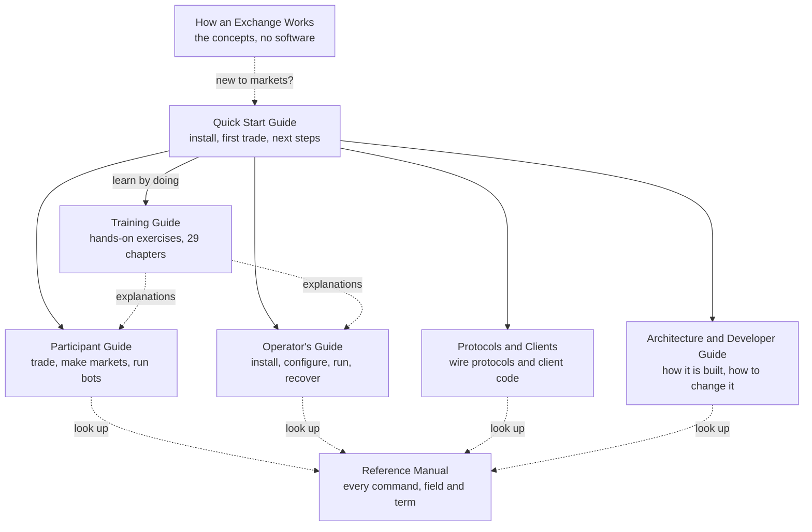

# How to Use This Book

Welcome to EduMatcher. This Quick Start Guide takes you from nothing to a
running exchange, a trade you made yourself and a clear idea of where to go
next. It is meant to be finished in a single sitting.

| | |
|---|---|
| **Who it is for** | Anyone new to EduMatcher: students, instructors trying the system, developers |
| **What you need** | A computer with Podman or Docker (or Python 3.13 and `pipx`), and a terminal |
| **What you do not need** | Any finance background, Python knowledge or a copy of the source code |
| **Time** | About 15 minutes to a running exchange, about an hour to finish Part I |

## What you will be able to do

After this book you can:

1. explain in a few sentences what EduMatcher is and how its parts fit together;
2. install and start the whole exchange, including its browser applications;
3. put an order into an order book, see it rest, match it, cancel and amend
   orders, and read your position and profit or loss;
4. run the exchange through a trading day with an opening and a closing phase;
5. write, check and deploy a configuration of your own;
6. pick the book that matches what you want to do next.

## How the book is organized

| Part | Chapters | What you get |
|---|---|---|
| **I. See it run** | What EduMatcher Is; Install and Start; Your First Trade; The Browser Applications | A running exchange and your first trades |
| **II. Next steps** | Run a Trading Session; Your Own Configuration; Choose Your Next Book | A full session, your own venue, a route onward |
| **Appendices** | When Something Does Not Work; FAQ; Quick Glossary | Help when you are stuck, and the words you need |

Each chapter starts with what it will teach you and ends with a checkpoint or
a short list of where to read more. Nothing in a later chapter is needed to
finish an earlier one.

!!! tip "New to exchanges altogether?"
    Read [How an Exchange Works](../../../how-exchange-works.md) first, or
    alongside this book. It explains order books, bids and asks, auctions and
    market makers without assuming you know any of them, and makes everything
    here easier to follow.

## The EduMatcher library

This guide is one of eight books. You do not have to read them all — most
people read this one, then one or two others that match their role.

| Book | Read it when you want to… | Written for |
|---|---|---|
| **How an Exchange Works** | understand exchanges in general, before touching any software | anyone new to markets |
| **Quick Start Guide** (this book) | get started | everyone, first |
| **Training Guide** | learn by doing, one exercise at a time | students, self-learners, classes |
| **Participant Guide** | trade, quote as a market maker, run trading bots, use the trading screens | traders and students |
| **Operator's Guide** | install, configure, run, supervise and recover an exchange | instructors and operators |
| **Protocols and Clients** | connect your own program to the exchange | client and tool developers |
| **Architecture and Developer Guide** | understand or change how EduMatcher is built | contributors |
| **Reference Manual** | look up one command, option, configuration field or term | everyone, mid-task |

[Choose Your Next Book](../part-2-next-steps/030-choose-your-book.md) at the
end of this guide gives a reading path for each role.

## Conventions

- A line starting with `$`, or a bare command in a `bash` block, is typed in a
  normal terminal.
- `[TRADER01]>` is the prompt of a **trader console** (`pm-alf-console`); type
  the text after it there.
- `[OPS01|ADMIN]>` is the prompt of the **operator console** (`pm-admin`).
- Output shown in a plain block is what you should see. Times, order IDs and
  some spacing will differ on your machine.
- `!!! tip`, `!!! note` and `!!! warning` boxes hold advice you can skip on a
  first reading; **Checkpoint** paragraphs tell you how to know a step worked.
