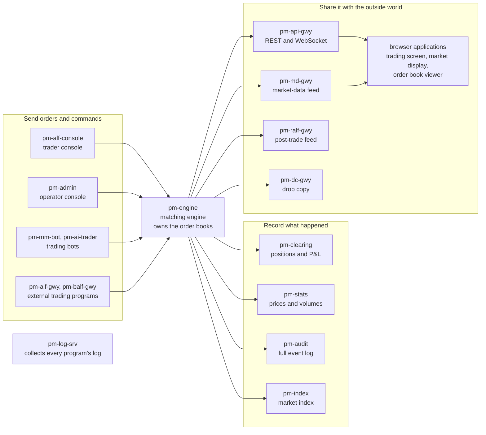

# What EduMatcher Is

!!! note "Learning objectives"
    After reading this chapter you will know:

    - what EduMatcher is and what you can learn with it
    - why it runs as many small `pm-*` programs instead of one
    - the five ideas that make the rest of the documentation readable
    - three details that surprise almost every newcomer

## A working exchange, built for learning

EduMatcher is an educational stock exchange that really works. It has a
matching engine, order books, a trading day with opening and closing
auctions, market makers, risk controls, statistics, profit-and-loss tracking,
an audit trail, external gateways and market-data feeds, monitoring tools and
automated trading bots. Its architecture and behavior stay close to those of
a real exchange.

That makes it useful for three kinds of learning:

- **Market microstructure** — what happens inside an order book, why auctions
  exist, and how spreads, time priority, market makers and risk controls shape
  a market.
- **Exchange operations** — how to configure a trading venue, start it, run a
  trading day, watch it and find out afterwards what happened.
- **Protocol and system design** — how order entry, market data, post-trade
  feeds, logging and recovery are separated in a system of cooperating
  processes.

Some things are deliberately simpler than on a real exchange so that they do
not get in the way of learning: authentication is minimal, there is no member
and user hierarchy, and there is no standby system or other fault tolerance.
The Reference Manual's
[Known Limitations](../../reference-manual/90-backmatter/020-known-limitations.md)
lists the rest. EduMatcher is for teaching and experimenting — **never use it
for real money**.

!!! tip "The documentation is large; your first steps are not"
    EduMatcher covers a whole exchange, so its documentation is long. You do
    not need most of it to begin. One process, one symbol and two orders are
    enough for a first trade, and that is where this guide takes you next.

## The system in one picture

EduMatcher is a set of independent programs, all named `pm-*`, that talk to
each other over a message bus. Only one of them, the **engine**, owns the
order books and decides what trades. Every other program sends instructions
to the engine, listens to what it announces, or passes that information on to
someone else.

The first idea to take away is that **the exchange is not one program**. It is
a small operating environment. A five-minute demonstration needs only the
engine and two trader consoles. A classroom session adds a trading-day
schedule, recorders for prices and profits, market data, logging and the
browser displays. The container installation in the next chapter starts all
of them for you with one command.

Why split it up this way? Real exchanges do, for the same reasons: each part
can fail, restart or be replaced without stopping the others, and the engine —
the part that must be correct and fast — stays small. The Architecture and
Developer Guide tells that story in
[Architecture](../../architecture-and-development/part-1-architecture/010-architecture-overview.md).

## Five ideas to learn first

These five ideas are enough to make the rest of the documentation readable.
You will meet every one of them in the next two chapters.

| Idea | What it means |
|---|---|
| **Engine** | `pm-engine`, the one program that owns all order books and matches orders. If the engine is not running, nothing trades. |
| **Symbol** | A tradeable instrument, such as `AAPL`. Each symbol has its own order book, its own price step (the *tick size*) and its own risk settings. |
| **Participant** | Anyone who connects to trade or to operate: a student, a bot, the instructor. Each has an ID such as `TRADER01` and a **role** — `TRADER`, `MARKET_MAKER` or `ADMIN` — that decides what it may do. On the wire and in the consoles, the participant ID is also called the **gateway ID**. |
| **Session phase** | Where the trading day is: `PRE_OPEN`, `OPENING_AUCTION`, `CONTINUOUS`, `CLOSING_AUCTION` or `CLOSED` (plus phases for halts). Orders are treated differently in each. |
| **Deployed configuration** | One configuration file describes the whole exchange: its symbols, participants, trading day and rules. You edit it as YAML and *deploy* it; every program then reads the same compiled copy. |

Two more ideas matter once you start looking at results:

- **Events are not records.** The engine *announces* what happens as it
  happens. Recorder programs such as `pm-stats`, `pm-clearing` and `pm-audit`
  turn those announcements into files and databases — but only while they are
  running. Anything that happens while a recorder is stopped is not in its
  records.
- **Inside and outside are separate.** The `pm-*` programs talk to each other
  over an internal message bus. Programs written by other people connect from
  outside through **gateways** that speak documented protocols (ALF, BALF,
  CALF, RALF, drop copy, REST and WebSocket). The Protocols and Clients book
  describes them.

## Three details that surprise newcomers

### An empty order book is normal

An exchange never invents prices. A book has buyers and sellers only when
someone has put orders into it. If you send an order and nothing happens, the
most likely reason is simply that nobody is waiting on the other side at a
price that matches. Liquidity comes from other participants, from
**market makers** whose job is to quote both a buying and a selling price, or
from the bots EduMatcher provides.

### Prices are whole numbers of ticks inside

You see prices like `150.25`. Inside, the engine stores and matches whole
numbers of *ticks*: with two decimals, `150.25` is `15025` ticks. This avoids
rounding errors in matching and in totals. The commands, screens and APIs
convert for you; only raw database rows show the tick form.

### Trading dates are not calendar dates in UTC

Every event carries a precise UTC timestamp, but daily statistics and profit
summaries are grouped by the exchange's own **trading date** in its local time
zone. A session that runs across midnight UTC can therefore have one trading
date and two UTC dates. This only matters when you compare daily reports, and
the [Sessions and Scheduling](../../operator-guide/part-4-run-a-market/030-sessions-and-scheduling.md#the-trading-date)
chapter explains it in full.

## Where to go next

Continue with [Install and Start](020-install-and-start.md). If any of the
words above were new, keep the [Quick Glossary](../90-backmatter/030-quick-glossary.md)
open alongside.
