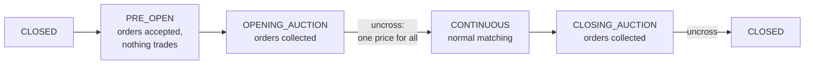

# Run a Trading Session

!!! note "Learning objectives"
    After this chapter you will be able to:

    - name the phases of a trading day and say what each does to an order
    - move the exchange through those phases yourself from the operator console
    - see an opening auction collect orders and match them at a single price
    - find the records the exchange keeps of everything that happened

**Time:** about 45 minutes. **You need:** the exchange from
[Install and Start](../part-1-see-it-run/020-install-and-start.md) and
[Your First Trade](../part-1-see-it-run/030-your-first-trade.md) behind you.

## A trading day has phases

So far the exchange has been open for continuous trading all the time. Real
exchanges are not: they open and close on a timetable, and they use
**auctions** to start and end the day. EduMatcher follows the same pattern.



| Phase | What happens to orders |
|---|---|
| `CLOSED` | Everything is rejected: *Market is closed*. |
| `PRE_OPEN` | Orders are accepted and rest in the book, but **nothing trades**, even if prices cross. |
| `OPENING_AUCTION` | Still no trading. The engine works out the single price at which the most shares can change hands. |
| `CONTINUOUS` | The auction **uncrosses** at that price, then normal one-by-one matching runs all day. |
| `CLOSING_AUCTION` | Orders are collected again for a closing price. |
| back to `CLOSED` | The closing auction uncrosses; `DAY` orders expire. |

Why the auctions? At the open, overnight news means nobody knows the right
price. Letting everyone's orders gather first and then trading all of them at
one price is fairer than rewarding whoever happens to arrive first, and it
produces an official opening and closing price.

## Step 1 — Switch to a configuration with a timetable

The configuration `s3-nominal-nomm` has the same three symbols and four
participants, an empty book, and a weekday timetable: pre-open 09:00, opening
auction 09:25, continuous trading 09:30, closing auction 16:00 to 16:05. It
also switches on circuit breakers, which you will not trip today.

**Containers:**

```bash
cd ~/.edumatcher
./edumatcher.sh config s3-nominal-nomm
./edumatcher.sh restart
```

(Keep `EM_PROFILE=default` from the previous chapter, so the market-maker bot
stays off.)

**Python package:**

```bash
pm-opctl-cli stop
pm-setup --config s3-nominal-nomm --force
pm-opctl-cli start
```

The process set includes `pm-scheduler`, which moves the exchange through the
phases at the times in the timetable — in the container's time zone, which is
UTC unless you set `TZ` in `.env`. Outside those hours the exchange simply sits
in `CLOSED`. In this chapter you will drive the phases by hand, which works
at any time of day.

## Step 2 — Open the operator console

In a shell inside the exchange, connect as the operator `OPS01`:

```bash
pm-admin --id OPS01
```

`pm-admin` is the **operator console**. It can see and do things a trader
cannot: show the whole book, change the session phase, halt a symbol,
disconnect a participant. Its prompt is `[OPS01|ADMIN]>`. Ask where the day
is:

```text
[OPS01|ADMIN]> SESSION_STATUS
  Session state     : CLOSED
  Auto-scheduling   : ON
[OPS01|ADMIN]> SCHEDULE
```

`SCHEDULE` prints the timetable. Two more commands give you the operator's
view of the exchange:

```text
[OPS01|ADMIN]> SYMBOLS
[OPS01|ADMIN]> GATEWAYS
```

`GATEWAYS` lists every participant with its role and whether it is connected
right now.

Open two trader consoles as in the previous chapter (`pm-alf-console --id
TRADER01` and `--id TRADER02`) and try to buy something from `TRADER01`:

```text
[TRADER01]> NEW|SYM=AAPL|SIDE=BUY|TYPE=LIMIT|QTY=100|PRICE=150.00|TIF=DAY
[09:58:10.822] REJECTED  334087acbd9d91957322d02fc9db99a7 code=MARKET_CLOSED  Market is closed
```

That is the `CLOSED` phase doing its job.

## Step 3 — Pre-open: orders wait

Move the exchange to pre-open. From `CLOSED` this is the only legal step:

```text
[OPS01|ADMIN]> SESSION|STATE=PRE_OPEN
SESSION  CLOSED → PRE_OPEN
```

Now send a buy at 150.00 from `TRADER01` and a sell at 149.00 from
`TRADER02`:

```text
[TRADER01]> NEW|SYM=AAPL|SIDE=BUY|TYPE=LIMIT|QTY=100|PRICE=150.00|TIF=DAY
```

```text
[TRADER02]> NEW|SYM=AAPL|SIDE=SELL|TYPE=LIMIT|QTY=100|PRICE=149.00|TIF=DAY
```

Both are acknowledged, and **neither trades** — even though the buyer would
pay more than the seller asks. In continuous trading these two orders would
have matched instantly. In pre-open they wait.

## Step 4 — The opening auction and the uncross

Step through the auction into continuous trading:

```text
[OPS01|ADMIN]> SESSION|STATE=OPENING_AUCTION
SESSION  PRE_OPEN → OPENING_AUCTION
[OPS01|ADMIN]> SESSION|STATE=CONTINUOUS
SESSION  OPENING_AUCTION → CONTINUOUS
```

At the moment continuous trading starts, the auction **uncrosses**. Both
traders receive a fill:

```text
[09:59:13.304] FILL      0aeb15eef2df8ba63f2eaf806e628600  qty=100 @149.0  remaining=0  [FILLED]
```

Every order matched in an auction trades at **one price**, the
**equilibrium price**: the price at which the largest number of shares can
change hands. Here any price from 149.00 to 150.00 would let all 100 shares
trade; when several prices tie, EduMatcher's rule picks the lowest, so both
fill at 149.00. With more orders on each side the choice becomes a real
calculation, and the Training Guide's [Auctions](../../training-guide/070-auctions.md)
chapter has you work one out by hand.

!!! tip "Phases only move forward"
    The engine accepts only the transitions in the order shown in the
    diagram. A jump such as `CLOSED` straight to `CONTINUOUS` is refused. If
    a `SESSION|STATE=` command seems to do nothing, run `SESSION_STATUS` to
    see where you really are.

Finish the day the same way — `SESSION|STATE=CLOSING_AUCTION`, then
`SESSION|STATE=CLOSED` — and any `DAY` orders still resting expire.

!!! note "Hand control versus the scheduler"
    `pm-scheduler` only acts at the times in the timetable. Between those
    times your manual changes stand; at the next scheduled time the scheduler
    moves the exchange on again. When you want the clock to run the day for
    you, just leave it alone during trading hours.

## Step 5 — Look at the records

The exchange records everything while it runs. From a shell inside it:

```bash
pm-stats-cli trades           # every matched trade
pm-stats-cli daily            # open, high, low, close and volume per symbol and day
pm-clearing-cli pnl           # positions and profit or loss per participant
pm-audit-cli events --limit 20    # the last 20 events of the full audit trail
```

These read the databases written by `pm-stats`, `pm-clearing` and `pm-audit`.
They are ordinary files in the data directory, so you can also open them
with any SQLite tool.

And to watch the market live in the terminal rather than the browser:

```bash
pm-viewer --symbol AAPL      # one order book in detail
pm-board                     # several symbols at once
pm-ticker                    # a scrolling tape of trades
```

## Checkpoint

- `SESSION_STATUS` shows the phase you set.
- Your pre-open orders traded only when continuous trading started, both at
  the same price.
- `pm-stats-cli trades` lists that trade.

## Where to read more

| If you want to know… | Read |
|---|---|
| Every phase, the scheduler, holidays and the trading date | Operator's Guide, [Session Scheduling and Auctions](../../operator-guide/part-4-run-a-market/030-sessions-and-scheduling.md) |
| How the trading day looks from the trader's seat | Participant Guide, [A Full Trading Day](../../participant-guide/part-1-trading-basics/030-the-trading-day-and-auctions.md) |
| Everything the operator console can do | Operator's Guide, [The Admin Console and Exchange Commands](../../operator-guide/part-3-run/020-admin-console-and-commands.md) |
| Halts, price collars and circuit breakers | Operator's Guide, [Risk Controls](../../operator-guide/part-4-run-a-market/040-risk-controls.md) |
| What each record contains | Operator's Guide, [Statistics and Reporting](../../operator-guide/part-4-run-a-market/060-statistics-and-reporting.md) and [Audit Trail](../../operator-guide/part-6-observe-and-recover/020-audit-trail.md) |
