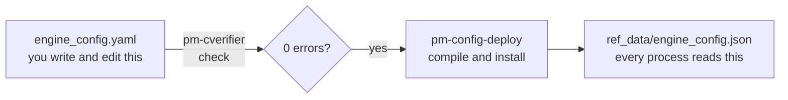

# Your Own Configuration

!!! note "Learning objectives"
    After this chapter you will be able to:

    - explain the difference between the file you edit and the file the
      exchange runs
    - generate a configuration with your own symbols and participants
    - check it with the configuration verifier before you deploy it
    - deploy it, on either installation route, and confirm it is running

**Time:** about 30 minutes.

## The one idea to understand first

EduMatcher separates **the file you edit** from **the file it runs**:



You write YAML. `pm-config-deploy` checks it, compiles it and installs the
compiled copy in the data directory, where every `pm-*` process reads it at
startup. Editing the YAML alone changes nothing until you deploy it and
restart. That is deliberate: in a system of many processes, the alternative is
processes that disagree about the rules.

## Step 1 — Generate a starting point

You rarely write a configuration from scratch. `pm-config-gen` writes a
complete, valid one from a few options:

```bash
pm-config-gen \
    --symbols AAPL MSFT TSLA NOKIA \
    --participants TRADER01:TRADER TRADER02:TRADER OPS01:ADMIN MM01:MARKET_MAKER \
    --seed-mm-mid-range 20:200 \
    --seed-last-prices-from-mm \
    --api-gateway-instance desk:TRADER01,TRADER02,MM01,OPS01:8080 \
    --api-gateway-instance dashboards::8081 \
    --api-gateway-readonly-key \
    --market-data-gateway --market-data-enabled \
    --output my_exchange.yaml
```

What the options do:

| Option | Effect |
|---|---|
| `--symbols` | The instruments to trade; each gets its own order book |
| `--participants ID:ROLE` | Who may connect, and as what: `TRADER`, `MARKET_MAKER` or `ADMIN` |
| `--seed-mm-mid-range 20:200` | Gives `MM01` a starting quote on every symbol around a random price between 20 and 200. A participant with the `MARKET_MAKER` role must have one, unless you ask for an empty book with `--no-mm-seed-quotes` |
| `--seed-last-prices-from-mm` | Uses the same prices as each symbol's reference price, which the price checks (collars) need |
| `--api-gateway-instance …`, `--api-gateway-readonly-key` | Creates API keys, so the Trading GUI and the market displays can log in |
| `--market-data-gateway --market-data-enabled` | Turns on the market-data feed that TapeDeck uses |
| `--output` | Where to write the YAML |

Open `my_exchange.yaml` in an editor and read it: every section carries
comments. `pm-config-gen --help` lists the many other options — schedules,
risk limits, combos, an index — and the Configuration GUI at
<http://localhost:8092> does the same job with forms.

!!! tip "On the container route"
    The commands in this chapter run inside the exchange, so write the file
    there and copy it out, or run `pm-config-gen` on your own machine if you
    also have the Python package. The simplest container-only way is to start
    from the configuration that is already running:

    ```bash
    ./edumatcher.sh shell cat /data/ref_data/engine_config.yaml > my_exchange.yaml
    ```

    and edit that file.

## Step 2 — Check it

```bash
pm-cverifier my_exchange.yaml
```

`pm-cverifier` checks the YAML, every field, and the rules between fields — a
market maker without a quote, a schedule with phases out of order, a symbol
whose risk settings contradict each other — and explains each problem in
plain words. A clean run ends with:

```text
Verdict:  ✓ OK — no issues found
```

Warnings and advisories are fine to leave alone at this stage; **errors** must
be fixed, because the engine will refuse to start. Running the verifier every
time is much faster than finding a problem when the engine will not start.

## Step 3 — Deploy and restart

**Python package:**

```bash
pm-config-deploy my_exchange.yaml    # checks, compiles and installs it
pm-opctl-cli stop
pm-opctl-cli start
```

**Containers:**

```bash
cd ~/.edumatcher
./edumatcher.sh config ./my_exchange.yaml
./edumatcher.sh shell pm-cverifier /config/engine_config.yaml
./edumatcher.sh restart
```

`./edumatcher.sh config` copies your file into `~/.edumatcher/config`, where
the exchange container sees it as `/config/engine_config.yaml`; the restart
deploys it.

## Checkpoint

After the restart, ask the running exchange what it was configured with:

```bash
pm-config-show
```

The panels list your four symbols and four participants. TapeDeck shows the
new symbols, and `NOKIA` has a market maker's quote on it.

## Where to read more

| Topic | Read |
|---|---|
| The whole configuration workflow, with complete examples | Operator's Guide, [The Configuration Workflow](../../operator-guide/part-2-configure/010-the-configuration-workflow.md) |
| Every check the verifier makes | Operator's Guide, [Configuration Verifier](../../operator-guide/part-2-configure/020-config-verifier.md) |
| A form-based editor instead of YAML | Operator's Guide, [Configuration GUI](../../operator-guide/part-2-configure/030-config-gui.md) |
| Ready-made configurations to copy | Operator's Guide, [Example Engine Configs](../../operator-guide/part-2-configure/040-example-configs.md) |
| Every field, its type and its default | Reference Manual, [Configuration Schema](../../reference-manual/part-3-configuration/010-schema-and-process-blocks.md) |
| Why a market maker must quote, and how to opt out | Participant Guide, [Market-Maker Quotes](../../participant-guide/part-3-market-making/010-market-maker-quotes.md) |
