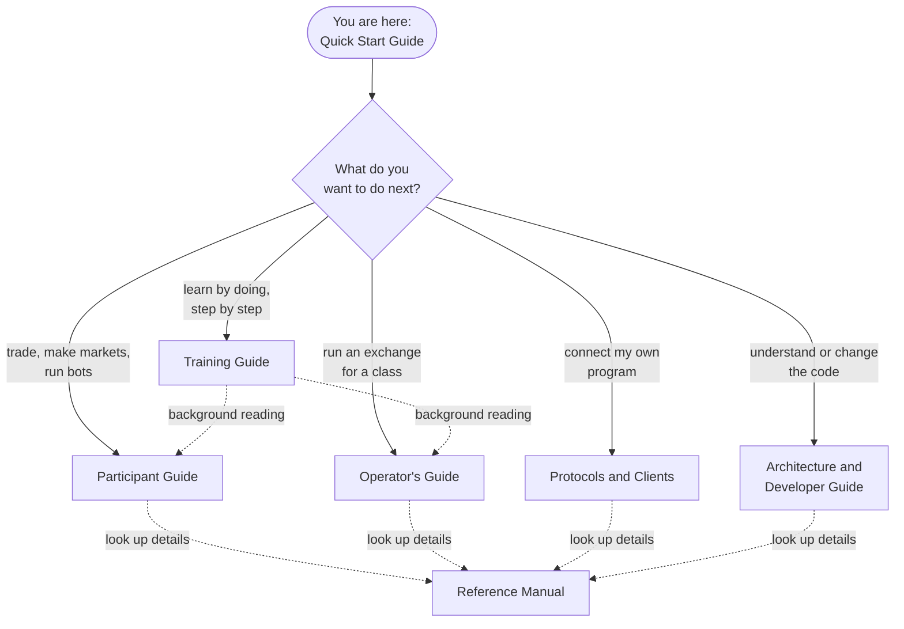

# Choose Your Next Book

!!! note "Learning objectives"
    After this chapter you will know which book to open next for what you
    want to do, and in what order to read it.

You have run an exchange, traded on it, operated a trading day and deployed a
configuration of your own. From here there is no single order: pick the path
that matches what you want to do. A rule of thumb for the whole library:
**read a chapter when you have a question it answers**, not before. Only the
Training Guide is meant to be worked through from start to finish.

## The library at a glance

| Book | Open it when you want to… |
|---|---|
| [Training Guide](../../training-guide/index.md) | learn every feature through exercises with checkpoints |
| [Participant Guide](../../participant-guide/part-1-trading-basics/010-gateways-and-how-you-connect.md) | trade: order types, auctions, combo orders, market making, bots, P&L, the trading screens |
| [Operator's Guide](../../operator-guide/part-1-install-and-deploy/010-installation.md) | install, configure, run, supervise and recover an exchange |
| [Protocols and Clients](../../protocols-and-clients/part-1-choosing-and-connecting/010-protocols-overview.md) | write a program that trades on, or listens to, the exchange |
| [Architecture and Developer Guide](../../architecture-and-development/part-1-architecture/010-architecture-overview.md) | understand how EduMatcher is built, or change it |
| [Reference Manual](../../reference-manual/part-1-command-line/010-processes-environment-and-ports.md) | look up one command, option, configuration field or term |
| [How an Exchange Works](../../../how-exchange-works.md) | understand exchanges in general, without any software |

## Reading paths by role

### Student learning to trade

1. [How an Exchange Works](../../../how-exchange-works.md), if markets are new to you.
2. Training Guide, chapters 00–08: placing, amending and cancelling orders,
   order types, time in force and auctions.
3. Participant Guide, as background whenever an exercise raises a question —
   start with [The Order Book](../../participant-guide/part-1-trading-basics/020-the-order-book.md)
   and [Order Types](../../participant-guide/part-2-orders/020-order-types.md).

### Instructor running a class

1. Operator's Guide, Parts I–III: installation, configuration and
   [Running the Exchange](../../operator-guide/part-3-run/010-running-the-exchange.md).
2. Operator's Guide, [Session Scheduling and Auctions](../../operator-guide/part-4-run-a-market/030-sessions-and-scheduling.md)
   and [Risk Controls](../../operator-guide/part-4-run-a-market/040-risk-controls.md).
3. Training Guide, chapters 00–19, to know exactly what your students will do.
4. Participant Guide, [AI Traders](../../participant-guide/part-4-automated-trading/010-ai-traders.md)
   and [The Market-Maker Bot](../../participant-guide/part-3-market-making/030-the-market-maker-bot.md),
   to make a classroom market look alive.

### Market maker

1. Participant Guide, Part III: [Market-Maker Quotes](../../participant-guide/part-3-market-making/010-market-maker-quotes.md),
   [Market Making](../../participant-guide/part-3-market-making/020-market-making.md)
   and [The Market-Maker Bot](../../participant-guide/part-3-market-making/030-the-market-maker-bot.md).
2. Training Guide, chapter 09 (Market Making) and chapter 21 (bot tuning).

### Operator or supervisor

1. Operator's Guide, [Running the Exchange](../../operator-guide/part-3-run/010-running-the-exchange.md)
   and [The Admin Console and Exchange Commands](../../operator-guide/part-3-run/020-admin-console-and-commands.md).
2. [Risk Controls](../../operator-guide/part-4-run-a-market/040-risk-controls.md),
   then Part VI: persistence, the audit trail and the log server.

### Analyst or auditor

1. Participant Guide, [Positions and P&L](../../participant-guide/part-5-positions-and-results/010-positions-and-pnl.md).
2. Operator's Guide, [Statistics and Reporting](../../operator-guide/part-4-run-a-market/060-statistics-and-reporting.md),
   [Audit Trail](../../operator-guide/part-6-observe-and-recover/020-audit-trail.md)
   and [Audit Replay](../../operator-guide/part-6-observe-and-recover/030-audit-replay.md).

### Developer of a client, feed handler or dashboard

1. Protocols and Clients, [Protocols Overview](../../protocols-and-clients/part-1-choosing-and-connecting/010-protocols-overview.md),
   which tells you which protocol fits your purpose. For a dashboard the REST
   and WebSocket API is usually the right answer.
2. The specification of that protocol in Part II, and the session behavior
   chapter in Part III.
3. Training Guide, chapters 22–27, for exercises against a live gateway.

### Contributor to EduMatcher itself

1. Architecture and Developer Guide, [Architecture](../../architecture-and-development/part-1-architecture/010-architecture-overview.md)
   and the [Guided Tour](../../architecture-and-development/part-1-architecture/020-guided-tour.md).
2. [Development Practice](../../architecture-and-development/part-4-developing/010-development-practice.md)
   and [The Development Loop](../../architecture-and-development/part-4-developing/020-development-workflow.md).

## Depth by interest

**Automated traders.** Bots are the easiest way to get a book that looks alive
without typing orders: see the Participant Guide's
[AI Traders](../../participant-guide/part-4-automated-trading/010-ai-traders.md)
and [The Market-Maker Bot](../../participant-guide/part-3-market-making/030-the-market-maker-bot.md).

**The internals.** The Architecture and Developer Guide's
[Order Book Deep Dive](../../architecture-and-development/part-2-inside-the-engine/010-order-book-deep-dive.md)
and [Order Flow Through the Engine](../../architecture-and-development/part-2-inside-the-engine/020-order-flow-end-to-end.md)
follow one order through the code.

**Everything at once.** The Training Guide covers every feature, in order,
over 29 chapters.
