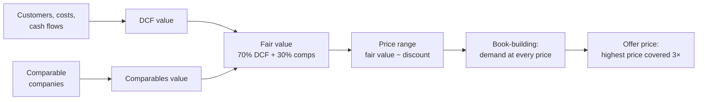

# IPO Valuation (`pm-valuation`)

## Objective

Price an initial public offering the way an investment bank's equity
capital markets desk would: value the company, build the book, choose the
offer price, and then list the stock on EduMatcher and let the opening
auction show whether the price was right.

You will practice:

- reading a valuation report from the verdict down to the cash flows
- telling a price set by fundamentals from a price set by demand
- using the what-if loop: change one answer, recalculate, compare
- reading a Monte Carlo distribution against the offer price
- finding what it takes to rescue a postponed IPO
- saving a scenario and handing it out as a fully specified case
- listing the priced IPO with `pm-new-symbol` and trading it

 


!!! abstract "Pre-reading in the User Guide"
    - [IPO Valuation](../operator-guide/part-4-run-a-market/020-valuation.md)
    - [Listing a New Symbol](../operator-guide/part-4-run-a-market/010-new-symbols.md)

## Prerequisites

- Chapter 00 completed (EduMatcher installed). Exercises 1–6 need nothing
  else: `pm-valuation` runs without an exchange.
- Exercise 7 lists and trades the stock. It needs chapters 01–03 (a running
  exchange with a market maker and two trader consoles) and the auctions
  chapter ([Auctions](070-auctions.md)), because the new stock opens in the
  opening auction.
- A terminal at least 120 columns wide: the interview is laid out for it,
  and printed reports are 100 columns wide.

 

## Background

An IPO has two prices. **Fair value** is what the company's future cash flows
are worth today. The **offer price** is what new investors pay. They differ on
purpose: banks price an IPO at a discount to fair value (15% by default) so
that the first day's trading ends above the offer price, which rewards the
investors who took the risk of buying an unknown stock.

`pm-valuation` computes both:



**Coverage** is demand divided by the shares offered. A 12× covered book means
investors asked for twelve times what is for sale. Banks price at the highest
price that is still covered at least 3×, so that most investors receive less
than they asked for and buy the rest in the market on day one. That is what
drives the **first-day pop**. In Sweden the top of the price range in the
prospectus is the **maximum price**: the deal cannot price above it. In the
United States it may price up to about 20% above the filed range.

Two classroom cases ship with the tool. Both are Swedish companies listing on
Nasdaq Stockholm, and their amounts are in SEK:

| Case | Company | Sector |
|---|---|---|
| `tornfalk` | Tornfalk Security AB (TORN) | Business software |
| `halvard` | Halvard Robotics AB (HALV) | Hardware plus service |

!!! note "The American framework"
    `pm-valuation` follows the Swedish IPO process by default. `--market us`
    switches to the American one: an S-1 instead of a prospectus, US rates,
    tax and bank fees, and pricing up to 20% above the range. A case file's
    amounts are in its own market's currency, so `--market us` on a Swedish
    case reads its kronor as dollars. See
    [Sweden or the United States](../operator-guide/part-4-run-a-market/020-valuation.md#sweden-or-the-united-states).

 

## Exercise 1: A First Report

Print the Tornfalk report, and export it to a file you can reread:

```bash
pm-valuation --case tornfalk --no-tui --mode deterministic --export tornfalk.md
```

```text
[output]
Tornfalk Security AB (TORN) — IPO valuation  PROCEED

1. Verdict
  PROCEED

   Fair value per share           117.45
   Price range              94.50–105.00
   Offer price                    105.00
   Market capitalisation      16,600.0 m
   Primary raise               4,000.0 m
   Coverage                       11.92×
   Expected first-day pop          29.8%
```

:material-checkbox-blank-outline: The verdict is PROCEED at 105.00 SEK.

Answer from the report:

1. The offer price is 105.00, the top of the range. Why exactly 105.00, and
   not higher? (Section 13, Pricing.)
2. How much money did the company leave on the table, and who received it?
3. Fair value blends the DCF value and the comparables value. How far apart
   are they, and why?

!!! tip "Answers"
    1. 105.00 is the maximum price stated in the prospectus. Private
       investors applied on that promise, so the deal cannot price above it
       without a supplement that lets everyone withdraw. Even at 105.00 the
       book is 11.92× covered: demand would have supported more, and an
       American deal would have priced above the range.
    2. 1,193.1 m SEK, about 1.2 miljarder kronor: the expected first-day pop
       (29.8%) times the offer price times the 38.1 million shares sold. The
       new investors receive it, not the company.
    3. The DCF gives 92.09 and the comparables 176.62, almost twice as much.
       Listed software companies trade at 10 times next year's revenue, a
       multiple that Tornfalk's own forecast cash flows do not justify. The
       model weights the DCF 70% and the comparables 30%.

## Exercise 2: Where the Value Comes From

Read sections 10 (DCF) and 11 (Bridge and fair value) in `tornfalk.md`.

1. What share of the enterprise value is the terminal value?
2. Fair value is 70% DCF and 30% comparables. Start the interview, set the
   DCF weight to 100% and press F5:

    ```bash
    pm-valuation --case tornfalk --mode deterministic --level intermediate
    ```

    Page 9, *DCF weight*: type `100`. (A plain number in a percentage field is
    percentage points.)

:material-checkbox-blank-outline: Fair value is now 92.09, the DCF value.

!!! tip "What changes"
    The terminal value is 66.6% of the enterprise value (question 1). With
    100% DCF, the range falls to 74.00–82.50 and the deal prices at 82.50,
    again the maximum price, on an 11.85× book. Investor demand did not
    change, so the book pushes the price to the top of the range again. The valuation method
    moved the range; demand chose the price inside it.

## Exercise 3: The What-If Loop

Start the interview again, so the DCF weight is back to 70%, and press F5 to
see the base report:

```bash
pm-valuation --case tornfalk --mode deterministic
```

Then:

1. Press `b` to go back. Every answer is kept.
2. On page 9, set *Institutional interest* and *Retail interest* to `medium`
   (Enter opens the pick-list) and *Hype* to `2`.
3. Press F5, then `c` to compare with the previous run.

:material-checkbox-blank-outline: The comparison shows the three inputs you
changed.

Which moved more: the offer price, or the first-day pop? Why?

!!! tip "Answer"
    The price does not move: it stays at the maximum price, 105.00, now on a
    5.01× book instead of 11.92×. The pop falls from 29.8% to 16.9%, and the
    money left on the table from 1,193.1 m to 676.0 m SEK. With fewer excess
    orders, fewer unfilled investors buy on day one.
    Sentiment shows up in the aftermarket before it shows up in the price.

## Exercise 4: How Sure Are We?

Run the Monte Carlo simulation (10,000 draws; a few seconds):

```bash
pm-valuation --case tornfalk --no-tui --mode montecarlo --export tornfalk-mc.md
```

Read section 12 (Monte Carlo).

1. What is the median fair value, and how does it compare with the
   deterministic base case?
2. What is the probability that fair value is below the offer price?

!!! tip "Answers"
    1. The median is 110.48 and the mean 112.70, both below the base case
       117.45. The driver ranges are skewed, so the base case is not the
       expected case.
    2. 43.8%, close to a coin flip, even though the offer price is 11% below
       the base-case fair value. A hot book is a statement about demand, not
       about value. That is the question Exercise 7 puts to the market.

## Exercise 5: A Postponed IPO

```bash
pm-valuation --case halvard --no-tui --mode deterministic
```

```text
[output]
Halvard Robotics AB (HALV) — IPO valuation  POSTPONE
```

:material-checkbox-blank-outline: The verdict is POSTPONE.

1. Why? Read the Verdict and section 13 (Pricing).
2. Management's minimum market cap is derived from the last private round.
   Start the interview
   (`pm-valuation --case halvard --mode deterministic --level intermediate`)
   and, on page 11, lower *Minimum market cap* step by step: `2.6mdr`,
   `2.5mdr`, `2.4mdr`, `2.3mdr`. Watch the preview after each one. What is
   the highest minimum that lists the stock, and on what kind of book?

!!! tip "Answers"
    1. The last private round valued Halvard at 2.7 miljarder SEK
       post-money, and management will not list below that. The market cap
       after the IPO includes the 500 mkr raised, so the floor price is
       (2,700 mkr − 500 mkr) / 20 m pre-IPO shares = 110.00, which moves the
       range to 110.00–120.50. Its midpoint (115.25) is above fair value
       (112.68): the bankers need at least a 5% discount to sell the deal,
       and there is none left.
    2. 2.5 mdr lists the stock, but on a thin book (2.63×, below the 3×
       target). At 2.3 mdr or less the book is covered 3×:

    | Minimum market cap | Result |
    |---|---|
    | 2.7 mdr (the last round) | POSTPONE |
    | 2.6 mdr | POSTPONE: the discount is 2.2%, still under 5% |
    | 2.5 mdr | PROCEED (THIN BOOK) at 100.00, 2.63× covered |
    | 2.4 mdr | PROCEED (THIN BOOK) at 95.00, 2.98× covered |
    | 2.3 mdr or less | PROCEED at 94.50, 3.01× covered, market cap 2,390 mkr |

    Listing means accepting a **down round**: a public valuation of 2,390 m
    SEK against 2.7 miljarder in the last private round. Raising institutional interest
    does not help (try it): the floor binds before demand does.

## Exercise 6: Save and Hand Out a Case

In the interview, press F9 and save to `halvard-rescue.yaml`. Then write a
fully specified version for another group:

```bash
pm-valuation --load halvard-rescue.yaml --no-tui --mode deterministic \
    --save halvard-full.yaml --with-defaults
```

:material-checkbox-blank-outline: `halvard-rescue.yaml` holds only the
answers you typed; `halvard-full.yaml` holds every value, each commented with
its source (`you`, `preset`, `derived`, `default`).

Why does the short file stay correct if someone later changes a sector
preset, while the full one does not?

## Exercise 7: Let the Market Decide

List Tornfalk on your exchange and trade it.

1. Stop the exchange and list the priced IPO:

    ```bash
    pm-opctl-cli stop
    pm-valuation --case tornfalk --no-tui --mode deterministic --list
    pm-opctl-cli start
    ```

    ```text
    [output]
    Listed TORN in …/engine_config.yaml: IPO price 105.00, 158095238 shares outstanding
      seed quote MM01: 1000 @ 104.90 / 1000 @ 105.10 (DAY)
    Deployed to …/engine_config.json. Start the exchange to open trading.
    ```

2. During the pre-open, each trader enters orders for TORN at the price they
   believe in: buyers who missed out in the book, and allocated investors
   ready to take a profit.
3. Watch the opening auction set the first price (see [Auctions](070-auctions.md)).

:material-checkbox-blank-outline: TORN has an opening price.

Compare it with the offer price (105.00) and the report's expected first-day
close (105.00 × 1.298 = 136.32). Was the offer price too low, as the pop
heuristic says, or too high, as the Monte Carlo suggests in almost one draw
out of two?

!!! note "If `--list` refuses"
    The refusals are `pm-new-symbol`'s: the exchange is still running, the
    data directory holds saved state for TORN from an earlier run, or the
    configuration has several market-maker gateways and one must be chosen for
    the seed quote. See
    [Why it refused](../operator-guide/part-4-run-a-market/010-new-symbols.md#why-it-refused). For the
    last one, run the command from the report's Next step section yourself,
    adding `--mm-gateway-id`.

 

## Summary

| Task | Command |
|---|---|
| Interview a classroom case | `pm-valuation --case tornfalk` |
| Show more fields | `… --level intermediate` (or `advanced`, `expert`), or F3 |
| Print a report | `pm-valuation --case tornfalk --no-tui` |
| Scenarios only, no Monte Carlo | `… --mode deterministic` |
| Export the report | `… --export report.md` |
| Print the report | `… --pdf report.pdf` (or `p` in the report) |
| Save answers / a full case | F9, or `--save FILE [--with-defaults]` |
| Start from a saved file | `pm-valuation --load FILE` |
| Price and list | `pm-valuation --load FILE --no-tui --list` |
| In the report | `b` back, `c` compare, `e` export, `p` PDF, Tab next section |

 

## Reflection

In Exercise 1 the book was 12× covered at the maximum price, and in
Exercise 4 the offer price was above fair value in almost half the draws.
Both are true of the same deal. Who is right, the book or the model, and what
does your opening auction in Exercise 7 say?

## See Also

- IPO Valuation — User Guide — every key, field format, report section and option
- Listing a New Symbol — what `--list` does to the configuration, and the IPO-day checklist
- Auctions & Scheduling — how the opening price is found
- Market Index — the index inclusion the report predicts
