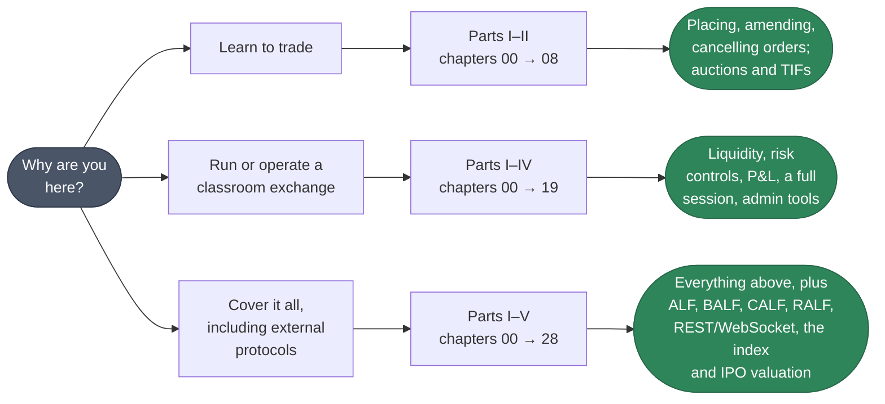

# Training Guide

Welcome to the EduMatcher self-study training programme. This hands-on guide
takes you from a cold start to confidently operating every major feature of
the exchange, one exercise at a time, with a checkpoint after each step.

| | |
|---|---|
| **Who it is for** | Students, self-learners and classes who learn best by doing |
| **What it assumes** | Basic command-line and YAML skills. No finance background is needed |
| **How it relates to the other books** | Each chapter links to the Participant Guide, Operator's Guide or Protocols and Clients for the explanation, and to the Reference Manual for details — the exercises do not repeat them |

If you are new to finance, first read
[How an Exchange Works](../../how-exchange-works.md), a non-technical
introduction to what an exchange does. If you have not run EduMatcher at all
yet, the [Quick Start Guide](../quick-start/00-front/010-how-to-use-this-book.md)
is the gentler first hour; this guide then goes deeper.

## How to use this guide

The 29 chapters (00–28) form **one sequence**. Each chapter's
*Prerequisites* section names what it needs, and for almost every chapter that
is everything before it: later exercises reuse the configuration, the
processes and the orders that earlier ones set up. Work through the chapters
in order and stop when you have covered what you need —
[Choose your path](#choose-your-path) below shows where. Three chapters can be
taken early:

- **18 — Exchange Observer Processes** needs only chapters 00–03. Taking it
  straight after chapter 03 gives you the viewers and monitors for every
  later chapter.
- **25 — Market Index** needs only chapters 00–03 (plus `pm-stats` from
  chapter 15 for its last exercise).
- **28 — IPO Valuation** needs only chapter 00 for its first six exercises;
  the last also needs 00–03 and 07.

### What you need

- **EduMatcher installed.** Any of the routes in the Operator's Guide
  [Installation](../operator-guide/part-1-install-and-deploy/010-installation.md)
  chapter works; chapter 00 walks through them and helps you pick.
- **Several terminals.** The exchange is a set of processes, and this guide
  asks you to watch them side by side. A multiplexer (`tmux`, `screen`) or
  split panes helps, but separate windows are fine.

### The two consoles

This is the one thing worth knowing before chapter 00, because mixing them up
is the most common early mistake:

| | `pm-alf-console` | `pm-admin` |
|---|---|---|
| You are | a **trader** | the **exchange operator** |
| Prompt shown in this guide | `[TRADER01]>` | `[GW_ADMIN\|ADMIN]>` |
| Typical commands | `NEW`, `AMEND`, `CANCEL`, `STATUS`, `ORDERS`, `POS`, `QUOTE`, `QLEGS` | `BOOK`, `HALT_SYM`, `CANCEL_SYM`, `KILL\|GW=`, `SESSION\|STATE=`, `GATEWAYS` |
| Can see the whole order book | No | Yes |

A prompt containing `|ADMIN]>` always means the `pm-admin` terminal. Anything
else is a trader console. Commands are **not** interchangeable between them —
a `BOOK` typed into a trader console just answers `Unknown command`.

The configuration you build in chapter 01 calls the operator `GW_ADMIN`. The
integration chapters 22–27 each generate a fresh configuration whose operator
is `OPS01`, the same name the bundled example configurations and the Quick
Start use. The role, `ADMIN`, is what matters.

### Keeping the market open

Your configuration has sessions enabled, so the engine starts every run in
`CLOSED` and rejects orders until the trading day is opened. Chapter 01 shows
how to open it by hand from the operator console — `SESSION|STATE=PRE_OPEN`,
then `SESSION|STATE=CONTINUOUS` — and the exercises assume you do this after
every engine restart. If an order comes back `REJECTED … code=MARKET_CLOSED`,
this is why.

### Conventions

- `[TRADER01]>` — type this at that trader console's prompt.
- `[GW_ADMIN|ADMIN]>` — type this at the operator console's prompt.
- A plain `$` or a bare command — type this in a normal shell.
- `[output]` — expected output; exact wording may vary between versions.
- :material-checkbox-blank-outline: — a checkpoint. Verify it before moving on;
  if it fails, the next exercise will not behave as described.

## Choose your path

| Your goal | Work through | What you'll have |
|---|---|---|
| **Learn to trade** — place, amend, and cancel orders; understand fills, TIFs, order types, and auctions | Parts I–II (00–08) | Everything a working trader needs day to day |
| **Run or operate a classroom exchange** — liquidity, risk controls, P&L, a full session, admin tools | Parts I–IV (00–19) | Everything above, plus the operator's toolkit |
| **Cover everything, including external protocols** | Parts I–V (00–28) | The full training programme |

## Training plan

The five parts follow the chapter numbers, so reading the book front to back
is reading the chapters in order.

### Part I — Foundations

| # | Chapter | You will be able to | Background reading |
|---|---------|---------------------|-------------|
| 00 | [Installation & Setup](000-installation.md) | Install EduMatcher and know where its files live | [Installation](../operator-guide/part-1-install-and-deploy/010-installation.md), [Quick Start Guide](../quick-start/part-1-see-it-run/020-install-and-start.md) |
| 01 | [Configuring & Starting Up](010-configuring-startup.md) | Author, verify, deploy a configuration; start the engine, scheduler and both consoles | [The Configuration Workflow](../operator-guide/part-2-configure/010-the-configuration-workflow.md), [Config Verifier](../operator-guide/part-2-configure/020-config-verifier.md), [Running the Exchange](../operator-guide/part-3-run/010-running-the-exchange.md) |
| 02 | [Setting Up Market-Maker Liquidity](020-setting-up-MM-bots.md) | Seed a two-sided book so there is something to trade against | [Market Making](../participant-guide/part-3-market-making/020-market-making.md), [Market-Maker Bot](../participant-guide/part-3-market-making/030-the-market-maker-bot.md) |
| 03 | [The First Trade](030-the-first-trade.md) | Submit orders, read fills, follow an order's lifecycle | [ALF Console](../participant-guide/part-2-orders/010-the-trader-console.md), [Order Types](../participant-guide/part-2-orders/020-order-types.md) |

### Part II — Trading mechanics

| # | Chapter | You will be able to | Background reading |
|---|---------|---------------------|-------------|
| 04 | [Amending Orders](040-amending-orders.md) | Change price and quantity, and predict the effect on queue priority | [Order Amendment](../participant-guide/part-2-orders/020-order-types.md#order-amendment-amend) |
| 05 | [Order Types Deep Dive](050-order-types.md) | Use MARKET, STOP, STOP_LIMIT, FOK, IOC, ICEBERG and TRAILING_STOP | [Order Types](../participant-guide/part-2-orders/020-order-types.md) |
| 06 | [Time-in-Force & Sessions](060-time-in-force-sessions.md) | Choose a TIF and predict how each session phase treats it | [Auctions & Scheduling](../operator-guide/part-4-run-a-market/030-sessions-and-scheduling.md) |
| 07 | [Auctions](070-auctions.md) | Run an auction and compute the equilibrium price by hand | [Auctions & Scheduling — Equilibrium price](../operator-guide/part-4-run-a-market/030-sessions-and-scheduling.md#equilibrium-price) |
| 08 | [Cancelling & Managing Orders](080-cancelling-orders.md) | Inspect and cancel resting orders; use the operator's bulk-cancel tools | [ALF Console](../participant-guide/part-2-orders/010-the-trader-console.md), [The Admin Console and Exchange Commands](../operator-guide/part-3-run/020-admin-console-and-commands.md) |

### Part III — Liquidity, risk and results

| # | Chapter | You will be able to | Background reading |
|---|---------|---------------------|-------------|
| 09 | [Market Making](090-market-making.md) | Run a two-sided quote by hand and inspect its legs | [Market Making](../participant-guide/part-3-market-making/020-market-making.md) |
| 10 | [Combo Orders](100-combo-orders.md) | Submit multi-leg and OCO orders, and reason about leg risk | [Combo Orders](../participant-guide/part-2-orders/030-combo-and-oco-orders.md) |
| 11 | [Risk Controls](110-risk-controls.md) | Configure and trigger collars, circuit breakers, halts and the kill switch | [Risk Controls](../operator-guide/part-4-run-a-market/040-risk-controls.md) |
| 12 | [P&L & Clearing](120-pnl-clearing.md) | Read positions, VWAP cost and realized/unrealized P&L | [Positions and P&L](../participant-guide/part-5-positions-and-results/010-positions-and-pnl.md) |
| 13 | [Market Data & Drop Copy](130-market-data-drop-copy.md) | Explain the market-data and drop-copy feeds and watch them | [Drop Copy](../protocols-and-clients/part-3-session-behaviour/060-drop-copy.md), [DC Gateway](../operator-guide/part-5-gateways/060-drop-copy-gateway.md) |
| 14 | [AI Traders & Swarm](140-ai-traders.md) | Generate realistic order flow for a demo or class | [AI Traders](../participant-guide/part-4-automated-trading/010-ai-traders.md) |

### Part IV — Running a full session

| # | Chapter | You will be able to | Background reading |
|---|---------|---------------------|-------------|
| 15 | [Statistics & Reporting](150-statistics-reporting.md) | Query OHLCV, trades and snapshots for analysis | [Statistics and Reporting](../operator-guide/part-4-run-a-market/060-statistics-and-reporting.md) |
| 16 | [Persistence & Recovery](160-persistence-recovery.md) | Say what survives a restart, and verify it | [Persistence](../operator-guide/part-6-observe-and-recover/010-persistence.md), [Audit Trail](../operator-guide/part-6-observe-and-recover/020-audit-trail.md) |
| 17 | [Capstone Scenario](170-capstone-scenario.md) | Run a full session end to end, combining everything above | [Running the Exchange](../operator-guide/part-3-run/010-running-the-exchange.md) |
| 18 | [Exchange Observer Processes](180-exchange-observer-processes.md) | Compare the book, tape, order monitor, audit trail, stats and clearing views side by side | [Processes, Environment and Ports](../reference-manual/part-1-command-line/010-processes-environment-and-ports.md) |
| 19 | [Advanced Admin Operations](190-advanced-admin-operations.md) | Use `KICK`, `QCANCEL`, `CANCEL_SYM` and manual session overrides | [The Admin Console and Exchange Commands](../operator-guide/part-3-run/020-admin-console-and-commands.md) |

### Part V — Integration and advanced topics

Chapters 20, 22–24, 26 and 27 connect *other software* to the exchange over
its wire protocols and APIs; 21 automates the operator, 25 adds a market index
and 28 prices an IPO.

| # | Chapter | You will be able to | Background reading |
|---|---------|---------------------|-------------|
| 20 | [Drop-Copy Replay & Recovery](200-drop-copy-replay-recovery.md) | Detect sequence gaps and recover a consumer | [Drop Copy — Replay](../protocols-and-clients/part-3-session-behaviour/060-drop-copy.md#replay) |
| 21 | [Automation & MM Bot Tuning](210-automation-commandclient-mm-bot.md) | Script operator workflows and tune `pm-mm-bot` | [The Admin Console and Exchange Commands](../operator-guide/part-3-run/020-admin-console-and-commands.md), [Market-Maker Bot](../participant-guide/part-3-market-making/030-the-market-maker-bot.md) |
| 22 | [RALF Post-Trade Protocol](220-ralf.md) | Write a clearing, drop-copy or audit consumer | [RALF Gateway](../operator-guide/part-5-gateways/040-ralf-gateway.md), [RALF Protocol](../protocols-and-clients/part-2-specifications/040-ralf.md) |
| 23 | [CALF Market-Data Protocol](230-calf.md) | Write a market-data consumer with snapshots and replay | [CALF Gateway](../operator-guide/part-5-gateways/030-calf-gateway.md), [CALF Protocol](../protocols-and-clients/part-2-specifications/030-calf.md) |
| 24 | [API Gateway REST/WebSocket](240-api-gwy.md) | Trade and query over REST, and stream over WebSocket | [API Gateway](../operator-guide/part-5-gateways/050-api-gateway.md), [REST API Reference](../protocols-and-clients/part-2-specifications/060-rest-and-websocket.md) |
| 25 | [Market Index (`pm-index`)](250-index.md) | Run an index and apply corporate actions without disturbing its level | [Market Index](../operator-guide/part-4-run-a-market/070-market-index.md), [Index Administration (`pm-index-admin-cli`)](../operator-guide/part-4-run-a-market/080-index-administration.md) |
| 26 | [ALF TCP Gateway](260-alf-gwy.md) | Speak ALF over a raw socket | [ALF Gateway](../operator-guide/part-5-gateways/010-alf-gateway.md), [ALF Protocol](../protocols-and-clients/part-2-specifications/010-alf.md) |
| 27 | [BALF TCP Gateway](270-balf-gwy.md) | Speak the binary order-entry protocol | [BALF Gateway](../operator-guide/part-5-gateways/020-balf-gateway.md), [BALF Protocol](../protocols-and-clients/part-2-specifications/020-balf.md) |
| 28 | [IPO Valuation](280-ipo-valuation.md) | Price an IPO, then list it and let the opening auction judge the price | [IPO Valuation](../operator-guide/part-4-run-a-market/020-valuation.md), [Listing a New Symbol](../operator-guide/part-4-run-a-market/010-new-symbols.md) |

## After the training

Use the [Participant Guide](../participant-guide/00-front/010-how-to-use-this-book.md),
the [Operator's Guide](../operator-guide/00-front/010-how-to-use-this-book.md), the
[Reference Manual](../reference-manual/00-front/010-how-to-use-this-book.md)
and the [Glossary](../reference-manual/90-backmatter/010-glossary.md) for day-to-day reference.
