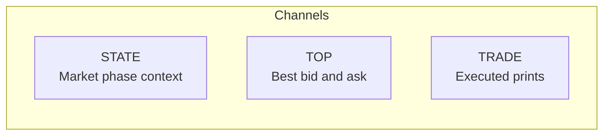
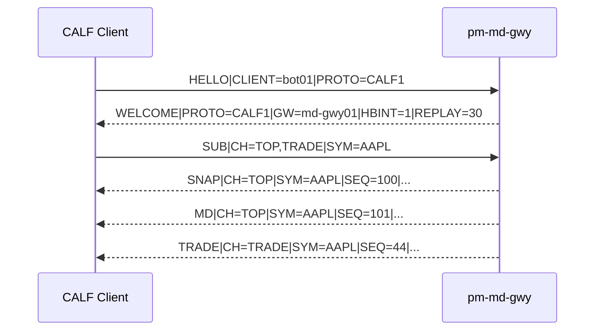
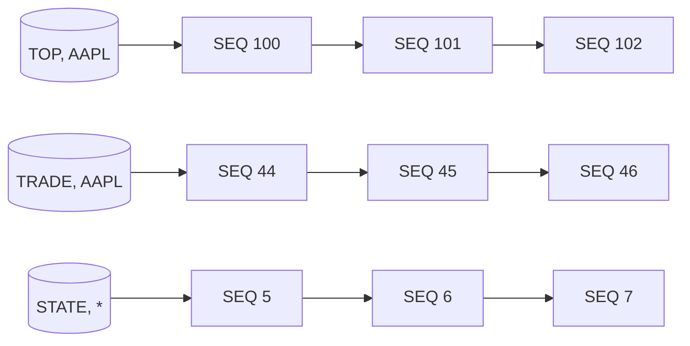
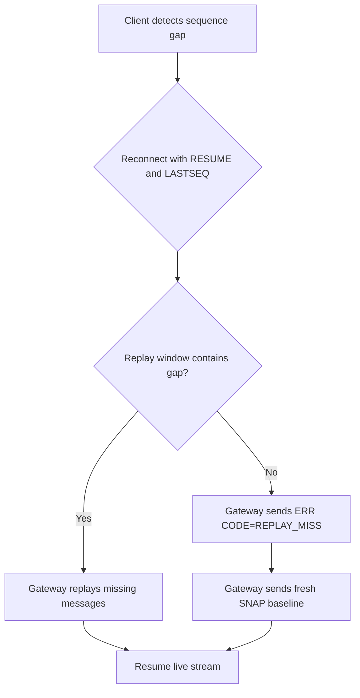
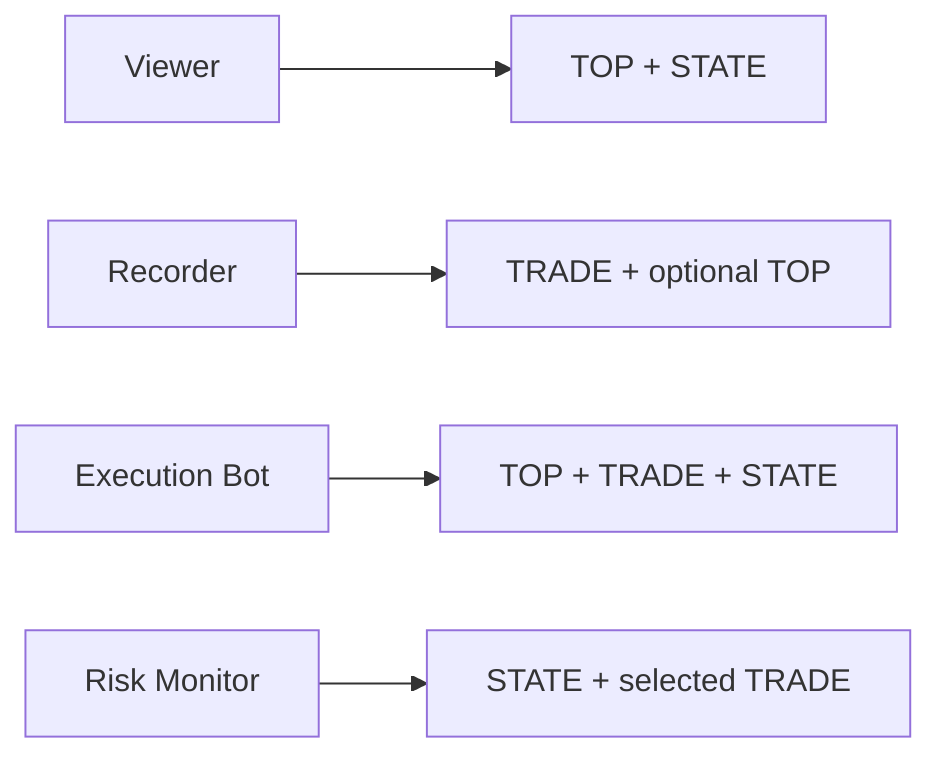
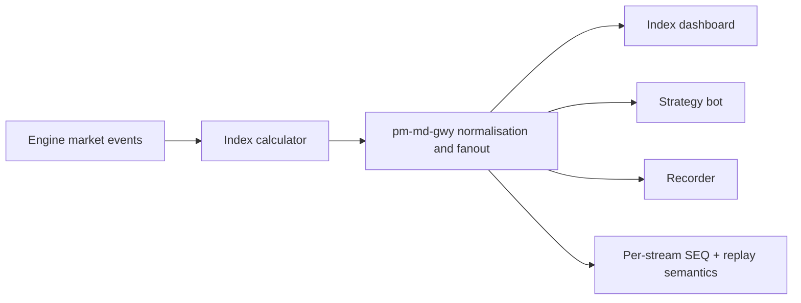

# Market Data Feed (CALF)

!!! note "Learning objectives"
    After reading this page you will understand:

    - What CALF is and why a market-data protocol is separate from order entry
    - How CALF channels expose different levels of market information
    - How `TOP`, `TRADE`, and `STATE` complement each other
    - How participants subscribe and stay synchronized using a generic text protocol
    - How sequence numbers and replay make reconnect behavior deterministic
    - How the same CALF model can disseminate derived index calculations


## Why CALF Exists

EduMatcher already provides order-entry protocols:

- `ALF`: simple text order entry
- `BALF`: binary order entry

`CALF` adds the missing piece: **market data distribution**.

Order entry answers: "How do I submit intent to trade?"
Market data answers: "What is happening in the market right now?"

`CALF` is designed as a readable, line-based TCP protocol so learners can inspect
it in a terminal while still following exchange-grade ideas:

- channelized subscriptions
- snapshots plus incrementals
- sequence-based gap detection
- bounded replay recovery


## Information Levels by Channel

CALF separates data into channels so clients can subscribe only to what they need.

| Channel | What it tells you | Typical client use |
|---|---|---|
| `TOP` | Best bid/ask, top sizes, last-trade fields (`SNAP` + `MD`) | UI book widgets, spread monitoring, execution bots |
| `TRADE` | Executed prints (`TRADE`) | Tape display, strategy triggers, volume analytics |
| `STATE` | Session/instrument state transitions (`STATE`) | Session-aware bots, operational monitors |

Think of the three channels as answering increasingly specific questions about the market:

| Question | Channel |
|---|---|
| Is trading open, auction, halted, or closed? | `STATE` |
| What is the current best bid, best ask, and spread? | `TOP` |
| What price and size just executed, and who was the aggressor? | `TRADE` |



The channels are **independent subscriptions** — you can take any combination depending on what your client needs.


## Core Message Types

CALF uses one UTF-8 line per message (`\n` terminated):

```text
<MSGTYPE>|KEY=VALUE|KEY=VALUE|...\n
```

The messages you will encounter first as a client:

| Message | Who sends it | Purpose |
|---|---|---|
| `HELLO` | Client | Start the session |
| `WELCOME` | Gateway | Confirm session, advertise parameters |
| `SUB` | Client | Subscribe to channels and symbols |
| `SNAP` | Gateway | Point-in-time baseline for a stream |
| `MD` | Gateway | Incremental top-of-book change |
| `TRADE` | Gateway | Executed trade print |
| `STATE` | Gateway | Session or instrument state transition |
| `HB` | Gateway | Heartbeat when no data is flowing |
| `ERR` | Gateway | Error notification |

!!! note "SNAP is a message type, not a channel"
    You subscribe to a channel (`TOP` or `STATE`). The gateway then automatically
    sends a `SNAP` baseline for that channel. Clients never subscribe to `SNAP` directly.


## How Participants Subscribe

A participant opens a TCP connection and follows a small, generic flow:

1. Send `HELLO`
2. Receive `WELCOME`
3. Send one or more `SUB` commands
4. Process `SNAP` baseline(s)
5. Process live incrementals (`MD`, `TRADE`, `STATE`)

Annotated example — each line is one complete CALF message:

```text
# Client identifies itself and requests CALF version 1
HELLO|CLIENT=bot01|PROTO=CALF1

# Gateway confirms; HB every 1 s, replay window 30 s, known symbols AAPL and MSFT
WELCOME|PROTO=CALF1|GW=md-gwy01|HBINT=1|REPLAY=30|SYMBOLS=AAPL,MSFT

# Client subscribes to TOP (best bid/ask) and TRADE (fills) for AAPL
SUB|CH=TOP,TRADE|SYM=AAPL

# Gateway sends snapshot: current top-of-book at SEQ=100
# BID=150.10 x 1200, ASK=150.12 x 900, last trade was 150.11 x 300
SNAP|CH=TOP|SYM=AAPL|SEQ=100|TS=2026-06-07T10:16:00.000Z|BID=150.10|BIDSZ=1200|ASK=150.12|ASKSZ=900|LAST=150.11|LASTSZ=300

# The best bid just moved to 150.11 x 1400 — only changed fields are sent
MD|CH=TOP|SYM=AAPL|SEQ=101|TS=2026-06-07T10:16:00.115Z|BID=150.11|BIDSZ=1400

# A trade executed: 200 shares at 150.12, buy-side was the aggressor
TRADE|CH=TRADE|SYM=AAPL|SEQ=44|TS=2026-06-07T10:16:00.141Z|PX=150.12|QTY=200|SIDE=BUY
```




## Staying Up To Date Reliably

`CALF` uses monotonic `SEQ` numbers per `(CH, SYM)` stream.

That means sequence tracking is per stream, not global:

- `(TOP, AAPL)` has one independent counter
- `(TRADE, AAPL)` has another
- `(STATE, *)` has its own



Client rule:

- If current `SEQ != previous + 1`, you detected a gap
- Attempt replay when possible
- If replay misses the window, accept fresh `SNAP` and continue

This gives deterministic behavior on reconnect without requiring full historical storage.


## First Connect vs Reconnect

### First connect

When you connect for the first time, the gateway has no history to replay for you.
Instead it sends a `SNAP` — a complete point-in-time picture of the current state
for each `(CH, SYM)` pair you subscribed to. Record the `SEQ` from that `SNAP`.
Every incremental message (`MD`, `TRADE`, `STATE`) that follows will have
`SEQ = last_seen + 1`. As long as the sequence is gapless you are fully in sync.

### Reconnect

- Send `HELLO` with `RESUME=1` and `LASTSEQ` for one stream
- If gap is within replay window, gateway replays missing messages
- If not, gateway sends `ERR|CODE=REPLAY_MISS` and then a fresh `SNAP`



This keeps client logic straightforward: always restore a known baseline, then continue incrementally.


## Why This Matters For Different Participants

Different participant types consume different CALF slices:

- Viewer: `TOP` + `STATE` for spread, best levels, and market phase
- Recorder: `TRADE` (and often `TOP`) for post-trade analysis
- Execution bot: `TOP` + `TRADE` + `STATE` for session-aware strategy decisions
- Risk monitor: `STATE` + selected `TRADE` streams for halt/session supervision



The same protocol works for all, with different subscription sets.


## CALF and Index Dissemination

The `CALF` channel model is also suitable for **disseminating index calculations**.

Conceptually, an index feed is just another ordered stream of derived market facts:

- index value
- timestamp
- optional contribution metadata
- sequence for gap detection/recovery

In EduMatcher, this can be integrated in the same operational pattern as other CALF
streams, so clients can consume index updates with the same subscription, sequence,
and replay semantics they already use for `TOP`/`TRADE`/`STATE`.

Practical options include:

- publishing index values as a dedicated CALF stream in the gateway
- mapping index updates into `STATE`-style or dedicated symbol streams for consumers

A client subscribing to index data would follow the same handshake and sequence rules as any other CALF stream. For example, an index update might look like:

```text
SUB|CH=TOP|SYM=EDU-INDEX
SNAP|CH=TOP|SYM=EDU-INDEX|SEQ=1|TS=2026-06-07T10:00:00.000Z|LAST=1042.30
MD|CH=TOP|SYM=EDU-INDEX|SEQ=2|TS=2026-06-07T10:00:05.000Z|LAST=1043.10
```

The key idea: **one generic subscriber model for both raw market events and derived index events**.




## Minimal Client Checklist

For a robust CALF client implementation:

1. **Parse line-by-line** — TCP is a byte stream; a single `recv()` can contain part of a line, one full line, or several lines at once. Buffer and split on `\n`.
2. **Track `last_seq` per stream** — keep a dict keyed by `(CH, SYM)` and check every incoming `SEQ`.
3. **Treat missing fields in `MD` as unchanged** — if an `MD` message has no `ASK` field, the ask price has not moved since the last `SNAP` or `MD` that carried it. Do not reset it to zero.
4. **Handle `HB`** — a heartbeat means the gateway is alive but quiet. If neither data nor `HB` arrives, the connection may be dead.
5. **On gap, attempt replay; on replay miss, reset from `SNAP`** — send `HELLO|RESUME=1|LASTSEQ=<n>`; if you get `ERR CODE=REPLAY_MISS` instead of replayed messages, accept the fresh `SNAP` that follows.
6. **Keep subscriptions narrow** — only subscribe to `(CH, SYM)` pairs your process actually uses.


## Summary

CALF gives EduMatcher a readable but production-shaped market-data model:

- channelized information levels (`TOP`, `TRADE`, `STATE`)
- snapshot baseline + incremental updates
- deterministic sync via per-stream sequences
- bounded replay for short disconnect recovery
- reusable dissemination pattern for derived outputs such as index calculations

This makes CALF a practical bridge between educational clarity and realistic feed behavior.


[Glossary →](../glossary.md)
