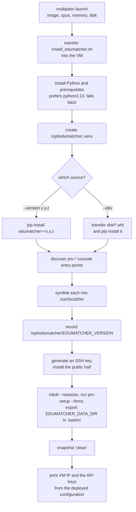

# VM Runtime Image with Pinned PyPI Release

!!! note "Learning objectives"
    After reading this page you will understand:

    - How to build a Multipass VM preinstalled with a chosen EduMatcher release
    - Why the image uses pip in a dedicated venv rather than pipx
    - What provisioning does, and how every `pm-*` command reaches
      `/usr/local/bin`
    - How to operate, snapshot, upgrade and reset the VM
    - When to reach for the VM instead of the container deployment


## Summary

`deployment/vm/` builds a Multipass VM carrying one chosen EduMatcher release,
with every `pm-*` command on the system PATH and a configuration already
deployed. It is the option to pick when you want a *machine* to log into —
a workshop image you can snapshot and reset between classes, or an environment
where processes are started by hand.

| Script | Role |
|---|---|
| `deployment/vm/Makefile` | The everyday interface — `build`, `up`, `shell`, `ssh`, `status`, `restore`, `clean` |
| `deployment/vm/mknode.sh` | Creates and provisions the VM |
| `deployment/vm/install_edumatcher.sh` | The in-VM installer `mknode.sh` runs |
| `deployment/vm/curl_setup_vm.sh` | Repository-free entry point; fetches the two scripts above and forwards its arguments |
| `deployment/vm/mkupd.sh` | Updates an existing VM in place |
| `deployment/vm/mkdevnode.sh` | A larger *development workstation* VM — a different thing, see below |

!!! tip "VM or container?"
    Use [`deployment/docker/`](07-container-and-networks.md) when you want the
    whole system — exchange plus all four web GUIs — running with one command,
    or when you are changing code and need a fast rebuild. Use the VM when you
    want a real machine, a snapshot you can roll back to, or a demo that
    survives being handed to somebody else. The VM installs the backend only;
    the web GUIs are part of the container deployment.


## Why pip in a venv instead of pipx

For a shared VM runtime image, pip in a dedicated virtual environment fits
better than pipx:

1. **Deterministic system paths** — every `pm-*` command resolves from
   `/usr/local/bin`, the same for every user on the machine.
2. **One controlled runtime location** — `/opt/edumatcher/.venv`, easy to
   inspect, replace or reason about.
3. **Easier service wiring** — unit files and scripts can reference stable
   absolute paths.

pipx remains the right choice for a per-user workstation install. This image
has a system-wide command-link requirement that pipx does not serve as
directly.


## Build the VM

From a checkout, through the Makefile:

```bash
cd deployment/vm
make build                              # VM named 'ems', local wheel
make build NAME=ems-026 VERSION=0.26.0  # a pinned PyPI release
make build DEV=1                        # explicitly the wheel in ../../dist
make help                               # every target and variable
```

`make build` writes the VM name to `.vm-name`, so `make shell`, `make ssh`,
`make status` and the rest need no arguments afterwards.

Without a repository checkout:

```bash
curl -fsSL https://raw.githubusercontent.com/johan162/EduMatcher/main/deployment/vm/curl_setup_vm.sh \
    | bash -s -- --version 0.26.3
```

`curl_setup_vm.sh` downloads `mknode.sh` and `install_edumatcher.sh` into a
temporary directory and forwards everything after `--` to `mknode.sh`. Set
`REPO_OWNER`, `REPO_NAME` or `REPO_REF` to pull them from a fork or branch.

### `mknode.sh` options

| Option | Default | Description |
|---|---|---|
| `--name <vm-name>` | `ems` | VM instance name |
| `--image <image>` | `lts` | Base Multipass image |
| `--cpus <count>` | `4` | Virtual CPUs |
| `--memory <size>` | `4G` | RAM |
| `--disk <size>` | `6G` | Disk |
| `--version <x.y.z>` | `dev` | PyPI release to install |
| `--dev` | — | Install the local wheel from the repository's `dist/`. This is what happens by default when no `--version` is given |
| `--snapshot` | already enabled | Snapshot after provisioning. Snapshots are on by default, so this only makes it explicit — there is no `--no-snapshot` |
| `--snapshot-name <name>` | `clean` | Snapshot name |
| `--ssh-key <path>` | `~/.ssh/<vm-name>_ed25519` | Private key whose public half is installed for passwordless login |
| `--help` | — | Usage |

!!! warning "The default is `--dev`, not a release"
    `DEFAULT_VERSION` is `dev`, so a bare `mknode.sh` or `make build` installs
    the wheel from the repository's `dist/` directory and fails if none is
    there. Run `poetry build` first, or pass `--version`/`VERSION=`.


## What provisioning does



Two details are easy to miss:

- **`pm-setup` runs from `/home/ubuntu/session`, but that is not the data
  directory.** The deployed configuration goes to
  `/home/ubuntu/.local/share/edumatcher`, which provisioning exports as
  `EDUMATCHER_DATA_DIR` in `.bashrc`. `~/session` is only a convenient working
  directory.
- **The API keys are printed once, at the end.** `mknode.sh` finishes by
  showing the VM's IP address and the admin, TRADER01, TRADER02 and MM01 keys
  from the deployed configuration. Keep that output, or recover them later with
  `pm-config-show`.

### Verify the install

Inside the VM:

```bash
ls -1 /usr/local/bin/pm-*                 # the linked commands
ls -1 /opt/edumatcher/.venv/bin/pm-*      # their targets
cat /opt/edumatcher/EDUMATCHER_VERSION    # what was installed
```


## Operate the VM

```bash
cd deployment/vm
make shell            # or: multipass shell ems
make ssh              # passwordless, as user 'ubuntu'
make status           # pm-opctl-cli list — one row per process
make health           # exit 0 when every process is OK
make info             # VM name and multipass state
make up / make down   # start and stop the VM
```

Inside the VM, the process manager starts the whole stack:

```bash
pm-opctl-cli start          # the 'default' profile
pm-opctl-cli list
pm-opctl-cli stop
```

To run processes by hand instead — the arrangement the User Guide assumes —
open a shell per process with `multipass shell ems` and start them separately:

| Terminal | Command |
|---|---|
| 1 | `pm-engine --verbose` |
| 2 | `pm-audit --terminal` |
| 3 | `pm-clearing` |
| 4 | `pm-viewer --symbol AAPL` |
| 5 | `pm-alf-console --id TRADER01` |

See [Processes](../user-guide/170-processes.md) for what each one does and what
the `default`, `mini` and `micro` profiles contain.


## Snapshots, upgrades and reset

Provisioning takes a snapshot named `clean` by default. That is what makes this
image worth using for teaching: after a class has filled the order books with
nonsense, one command puts the VM back to freshly-provisioned.

```bash
make restore                  # roll back to the 'clean' snapshot
make clean                    # multipass delete --purge
```

For a new release, prefer an immutable rebuild under a new name so the old VM
stays available:

```bash
make build NAME=ems-026 VERSION=0.26.0
```

To reprovision an existing VM in place:

```bash
./mkupd.sh --vm-name ems
```


## Development nodes are a different thing

`mkdevnode.sh` builds a larger *development workstation* VM from a checkout,
with SSH access and the toolchain `scripts/verify_setup.sh` checks for. It is
not a runtime image and not a substitute for `mknode.sh` or the curl path — use
it when you want to develop EduMatcher inside a VM rather than run it.


## Reference

- `deployment/vm/README.md` — the same material as a quick reference beside the
  scripts
- [Container and Network Setup](07-container-and-networks.md) — the container
  deployment, which runs the same backend plus the web GUIs
- [Installation](../user-guide/005-installation.md) — all five installation
  modes from a user's perspective
