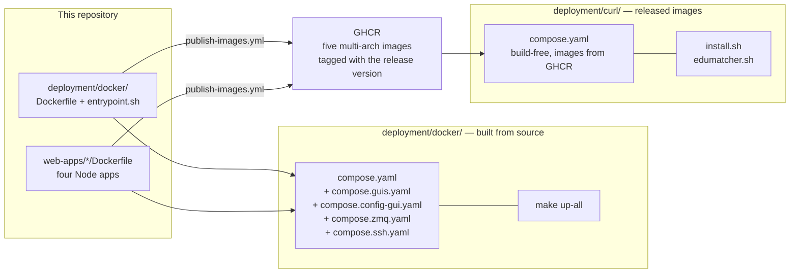
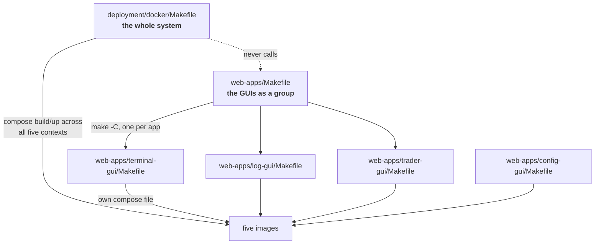
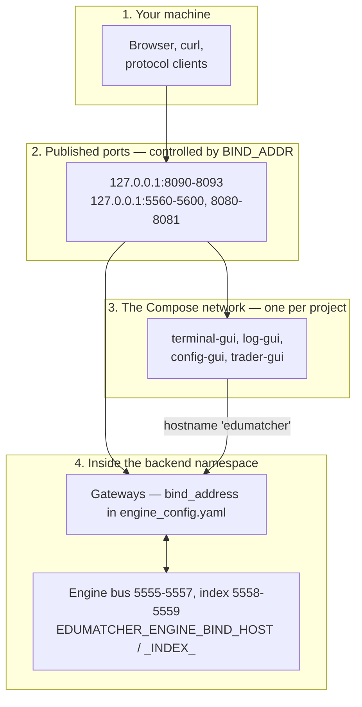
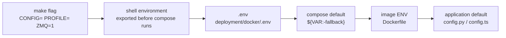
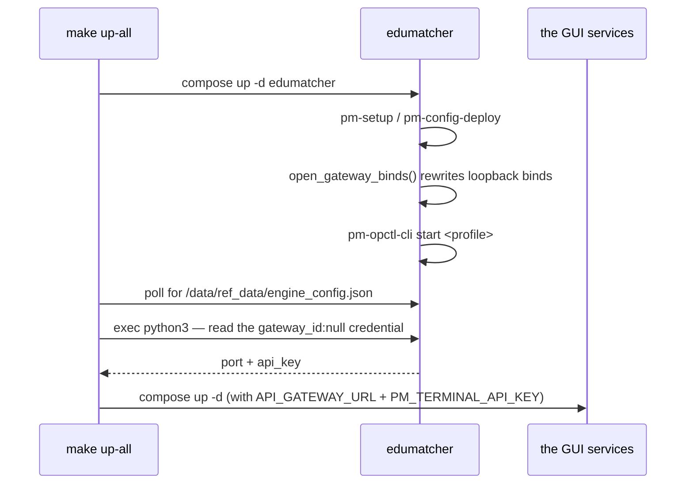
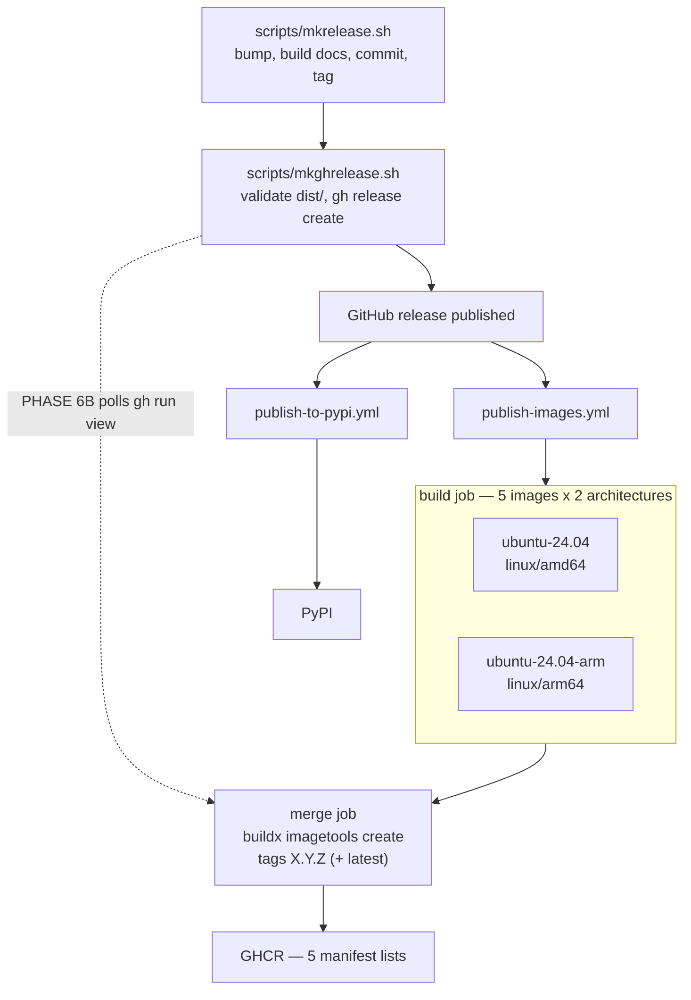
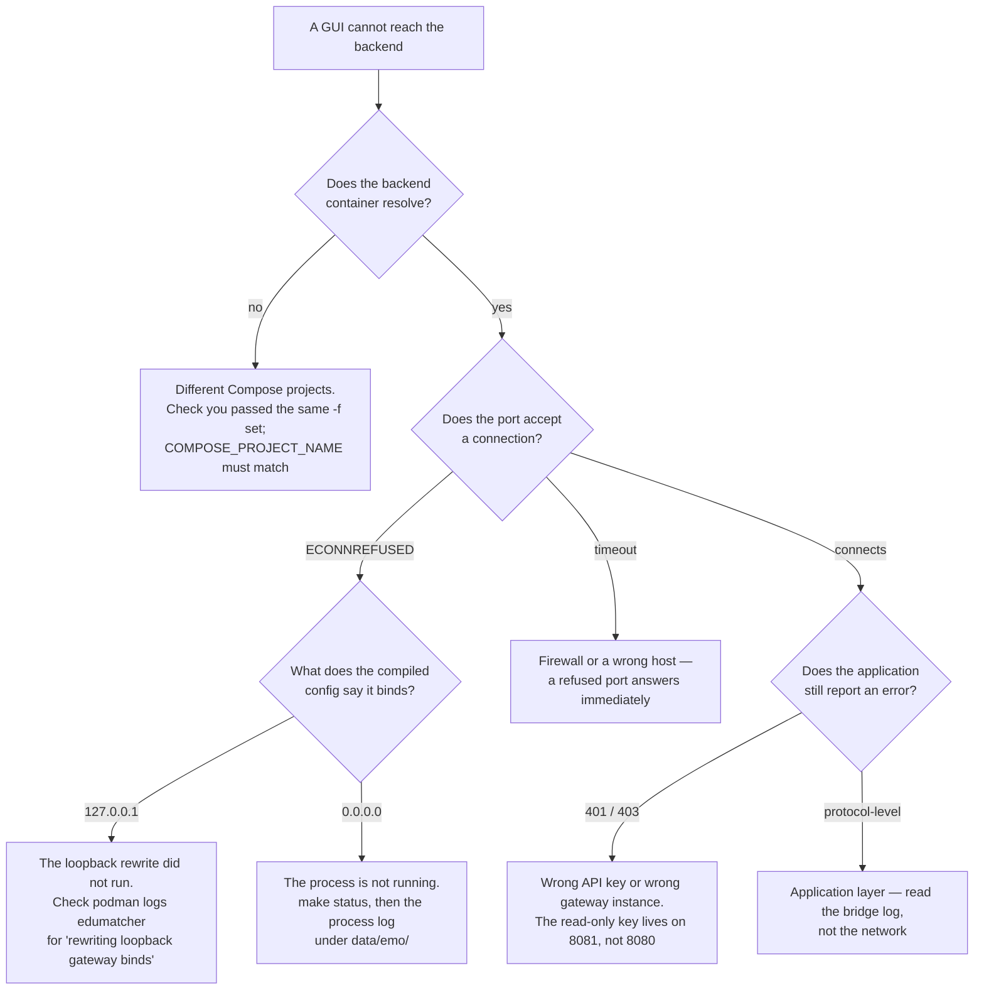
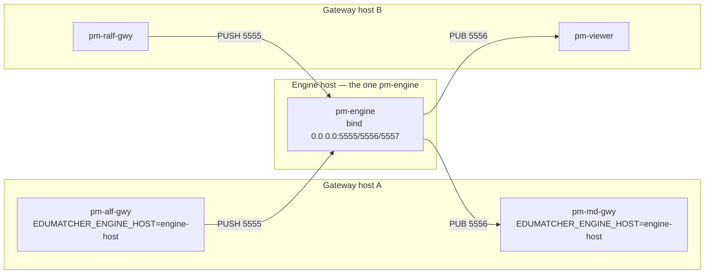

# Container and Network Setup

!!! note "Learning objectives"
    After reading this page you will understand:

    - How the five container images, the compose overlays and the three layers
      of Makefile fit together
    - Where networking responsibility actually sits, and which of the several
      `127.0.0.1`/`0.0.0.0` knobs controls what
    - What is baked into an image at build time versus decided at start time,
      and the precedence order between the ways of setting each
    - How a release turns one git tag into a wheel and five multi-architecture
      images
    - What maintenance this design will demand as the system grows, and where
      it will drift first
    - How to diagnose a container that "is running" but cannot be reached


## Summary

EduMatcher ships as **five container images** that run as **one Compose
project**:

| Image | Built from | Serves |
|---|---|---|
| `edumatcher` | `deployment/docker/` | Every `pm-*` process — engine, gateways, REST API |
| `edumatcher-terminal-gui` | `web-apps/terminal-gui/` | Trading terminal, port 8090 |
| `edumatcher-log-gui` | `web-apps/log-gui/` | Log viewer, port 8091 |
| `edumatcher-config-gui` | `web-apps/config-gui/` | Configuration builder, port 8092 |
| `edumatcher-trader-gui` | `web-apps/trader-gui/` | Trader GUI, port 8093 |

The backend is one container by design — the engine's ZeroMQ bus binds
loopback by default, so every `pm-*` process must share a network namespace,
with `pm-opctl-cli` as the process manager inside it. The GUIs are separate
containers that reach it over the Compose network.

There are two deployments of that same set:



`deployment/docker/` is the one you use while changing the code: it builds
from your working tree. `deployment/curl/` is its released twin: identical
wiring, no `build:` sections, images pulled by tag. Keeping those two in step
is the main standing maintenance cost of this design — see
[Part 6](#part-6-maintenance-burden).


## Part 1 — How the Makefiles are structured

There are three layers, and they answer three different questions.



| Layer | File | Owns | Use it when |
|---|---|---|---|
| **System** | `deployment/docker/Makefile` | The backend image, and Compose across all five services. Data directory, profiles, configuration deployment, publishing | You want a working exchange with GUIs |
| **Group** | `web-apps/Makefile` | Fanning out to three GUI Makefiles with a shared `VM_BACKEND_IP` | You run the GUIs against a backend that is *not* in the same Compose project — a Multipass VM, or a host install |
| **App** | `web-apps/<gui>/Makefile` | One application: npm workspace, its own image, its own compose file | You are developing that one GUI |

The system layer does **not** call the group layer. It reaches the same
Dockerfiles directly through `compose.guis.yaml`'s build contexts
(`../../web-apps/<gui>`). That is deliberate — one Compose project is what
puts every container on one network — but it does mean the GUI service
definitions exist in two places. See [Part 6](#part-6-maintenance-burden).

### What the app Makefiles give you

Each GUI Makefile has the same shape (`make help` in any of them):

| Group | Targets |
|---|---|
| npm workspace | `install`, `build`, `build-debug`, `typecheck`, `test`, `lint`, `format` |
| Development servers | `dev`, `dev-web`, `dev-bridge` |
| Container | `cbuild`, `up`, `down`, `restart`, `logs`, `ps` |
| Distribution | `cdist` — an image exported as an `xz`-compressed tarball for offline delivery |
| Registry | `ghcr-login`, `cpush`, `ghcr-logout` |

!!! warning "Two different GHCR paths exist, and they tag differently"
    A GUI's own `make cpush` tags with **that app's `package.json` version**
    (terminal-gui is `0.1.0`), while `deployment/docker`'s `make ghcr-push` and
    the release workflow tag with the **EduMatcher release version**
    (`0.20.5`). Only the latter produces a coherent set that the installer can
    pin with one number. Use a per-app `cpush` for ad-hoc work on one GUI;
    never as part of a release.

### Variable names that mean different things

Two collisions are worth committing to memory before you invent a third:

| Name | In `deployment/docker/Makefile` | Elsewhere |
|---|---|---|
| `VERSION` | Which **PyPI release to install into the image** (`make build VERSION=0.20.4`) | In a GUI Makefile, that app's `package.json` version |
| `TAG` | Which **registry tag to push** (`make ghcr-push TAG=0.20.6`) | — |
| `CONFIG` | A `make`-level flag: an example name *or* a file path | `EM_CONFIG` / `EM_CONFIG_FILE` are the container-level variables it sets |

`ghcr-push` uses `TAG` rather than `VERSION` precisely because `VERSION`
already had a contradictory meaning one target away.


## Part 2 — Networking: who is responsible for what

### Bind address versus connect address

A ZeroMQ or TCP endpoint appears twice in this codebase and the two are not
interchangeable:

- A **bind** address is what a server listens on. `127.0.0.1` accepts only
  connections originating inside the same network namespace. `0.0.0.0` accepts
  connections arriving on any interface the namespace has.
- A **connect** address is what a client dials. It must name a host that is
  reachable *from the client's* namespace.

In `edumatcher/config.py` these are separate constants:

```python
# Bind side — where a server listens
EDUMATCHER_ENGINE_BIND_HOST = os.getenv("EDUMATCHER_ENGINE_BIND_HOST", "127.0.0.1")
ENGINE_PULL_BIND_ADDR = f"tcp://{EDUMATCHER_ENGINE_BIND_HOST}:5555"

# Connect side — where a client dials
EDUMATCHER_ENGINE_HOST = os.getenv("EDUMATCHER_ENGINE_HOST", "127.0.0.1")
ENGINE_PULL_ADDR = f"tcp://{EDUMATCHER_ENGINE_HOST}:5555"
```

Setting the bind host does not move any client, and setting the connect host
does not open any listener. Cross-host work needs both.

### The four layers an address passes through



| Layer | Controlled by | Set where | `0.0.0.0` here means |
|---|---|---|---|
| Published ports | `BIND_ADDR` | `.env` | **Anyone on your LAN can reach the exchange** |
| Compose network | Compose project membership | which `-f` overlays you pass | — |
| Gateway listeners | `bind_address:` / `host:` | `engine_config.yaml` | Any container on the Compose network |
| Engine + index bus | `EDUMATCHER_ENGINE_BIND_HOST`, `EDUMATCHER_INDEX_BIND_HOST` | `compose.zmq.yaml`, via `ZMQ=1` | Same, plus publishable to the host |

Only the first is a security boundary. The rest are inside a namespace that
already isolates the container; widening them exposes nothing that a published
port does not already expose.

### Why the GUIs need no host address at all

All five services belong to one Compose project, so Compose puts them on one
network and registers the backend under the service name, the container name
*and* the hostname — all three resolve to the same address:

```console
$ podman exec edumatcher-trader-gui getent hosts edumatcher
10.89.2.2       edumatcher.dns.podman
```

That is why `compose.guis.yaml` points every GUI at `edumatcher:<port>` and
why `host.docker.internal`, the `host-gateway` pseudo-address and
`VM_BACKEND_IP` have all disappeared from that path. Those existed to route
GUI traffic out to the host and back in, which behaved differently on Docker
Desktop, Linux Docker and Podman. `web-apps/Makefile` still carries
`VM_BACKEND_IP` because it serves the other case: GUIs in one project talking
to a backend that is somewhere else entirely.

### The loopback rewrite

The bundled example configurations set `bind_address: 127.0.0.1` on the
market-data and post-trade gateways. On a host install that is a real
protection — the protocol gateways have no authentication. Inside a container
it protects nothing and makes the gateway unreachable from a sibling
container, which is exactly what leaves the trading terminal showing
`calf: RECONNECTING`.

`entrypoint.sh:open_gateway_binds()` therefore rewrites `bind_address:` and
`host:` values of `127.0.0.1` to `0.0.0.0` in the deployed YAML and re-runs
`pm-config-deploy` to recompile and re-validate. It is guarded by a `grep`, so
it is a no-op on restart, and it touches only those two keys — the only bind
keys in the schema; nothing in `engine_config.yaml` uses either to mean
"connect to".

The alternative — editing the twelve bundled examples — was rejected because it
would also loosen every bare-metal `pm-setup`, and because the rewrite already
covers any future example that sets loopback.


## Part 3 — Build time versus run time

The single most common way to waste an hour here is to change something at run
time that was decided at build time, or the reverse.

| Decided at **build** time (baked into the image) | Decided at **run** time (changeable with a restart) |
|---|---|
| Which EduMatcher package is installed — local wheel, PyPI, or a pinned version | Which engine configuration is deployed (`EM_CONFIG`, `EM_CONFIG_FILE`) |
| Whether `openssh-server` exists (`WITH_SSH`) | Whether `sshd` is started (`EM_SSH`, via `SSH=1`) |
| The Python base image (`PYTHON_VERSION`) | Which process profile runs (`EM_PROFILE`) |
| `EDUMATCHER_DATA_DIR=/data`, `PATH`, the entrypoint | Timezone (`TZ`) |
| **The compiled SPA bundle for each GUI** | Which host interface ports publish on (`BIND_ADDR`) |
| npm registry, proxy and CA settings used during the build | Every GUI's backend addresses and API key |
| Each GUI's default `WEB_PORT` | The port it actually listens on (`PORT`), and its host mapping |

The one that catches people is the SPA bundle: a change to any GUI's frontend
needs an image rebuild. `make up-all` builds an image that is missing, but does
not rebuild one that already exists — use `make build` or
`$(COMPOSE) ... build` when you have changed frontend source.

### Precedence when the same thing is settable in several places



Leftmost wins. A `make` flag becomes an exported variable for that one
invocation only; `.env` is Compose's own file and is where machine-specific
choices belong; the `${VAR:-fallback}` defaults inside the compose files are
the last stop before the image's own `ENV`.

This is why `make up-all CONFIG=ten-nominal` does not edit `.env`, and why
re-running plain `make up-all` afterwards goes back to whatever `.env` says.
Compose notices the changed environment and recreates the container, so the
switch takes effect without an explicit `down`.

### Build arguments

Backend (`deployment/docker/Dockerfile`): `PYTHON_VERSION`,
`EDUMATCHER_VERSION`, `PIP_INDEX_URL`, `WITH_SSH`.

Each GUI (`web-apps/*/Dockerfile`): `WEB_PORT`, `NPM_REGISTRY`,
`NPM_STRICT_SSL`, `HTTP_PROXY`, `HTTPS_PROXY`, `NO_PROXY`; config-gui also
takes `USE_PROXY_CA` and `CA_CERT_FILE`.

The backend's package source is selected by what is present rather than by a
flag:

```dockerfile
COPY .wheel/ /tmp/wheel/
RUN if ls /tmp/wheel/*.whl; then pip install /tmp/wheel/*.whl;   # local build
    elif [ -n "${EDUMATCHER_VERSION}" ]; then pip install "edumatcher==${EDUMATCHER_VERSION}";
    else pip install edumatcher; fi                              # newest on PyPI
```

`make build` puts a freshly built wheel in `.wheel/`; `PYPI=1` and
`VERSION=x.y.z` clear it first.

!!! danger "Always confirm which package went into the image"
    A successful build prints
    `Installing local wheel: /tmp/wheel/edumatcher-<version>.whl`. If you see
    pip *downloading* `edumatcher` instead, the image contains a published
    release and your source change is not in it — while everything else about
    the build looks fine. This exact failure mode has cost real debugging time
    on this project, from a path in the `RUN` step that did not match the
    `COPY` destination.


## Part 4 — Starting and configuring the whole system

```bash
cd deployment/docker
make build          # backend image from a wheel built out of this checkout
make up-all         # exchange + terminal-, log- and trader-gui
make down-all       # stop and remove everything
```

| Flag | Applies to | Effect |
|---|---|---|
| `CONFIG=<name>` | `up`, `up-all` | Deploy a bundled example |
| `CONFIG=<file>` | `up-all` | Copy the file to `config/`, mount it read-only at `/config`, deploy it |
| `PROFILE=<name>` | `up`, `up-all` | `default`, `mini` or `micro` |
| `ZMQ=1` | `up`, `up-all` | Add `compose.zmq.yaml`: publish the raw bus and set the engine/index bind hosts to `0.0.0.0` |
| `SSH=1` | `up`, `up-all` | Add `compose.ssh.yaml` and prepare `authorized_keys` |
| `CONFIG_GUI=1` | `up-all` | Add `compose.config-gui.yaml` |
| `PYPI=1`, `VERSION=` | `build` | Install from PyPI instead of the checkout |
| `CONTAINER_ENGINE=docker` | all | Force Docker when Podman is also installed |

`make mounts` reports, for every container, which host directory is behind each
path inside it and which image it came from — the fastest way to tell whether
the stack answering your ports is the one you started.

The overlays are additive `-f` files, which is why they compose freely:
`make up-all CONFIG=ten-complex PROFILE=mini ZMQ=1 CONFIG_GUI=1`.

### Why `up-all` runs in two phases

The trading terminal reads history through `pm-api-gwy` using the credential
whose `gateway_id` is `null`. That key is **generated per engine
configuration** — different in each of the twelve examples — and is issued on
the `dashboards` instance (8081), not `desk` (8080). It does not exist until
the exchange has deployed its configuration, so it cannot be a compose default.



`deployment/curl/edumatcher.sh start` performs the identical sequence with the
same extraction snippet — that logic lives in `edumatcher.sh` rather than in
`install.sh` so there is one copy on the released path.

A configuration with no read-only credential is not an error: the start
continues and warns. The live CALF feed needs no key; only history does.


## Part 5 — The release process

One git tag produces a wheel and five multi-architecture images, all carrying
the same version. That coupling is what lets `install.sh --version 0.26.2`
pin an entire system with one number.



Points a developer needs to know:

**Each image is built twice, natively.** A single-runner build with
`platforms: linux/amd64,linux/arm64` would emulate the foreign architecture
under QEMU — four Node images each running `npm ci` and a Vite build, which
turns a release into hours. Instead each `(image, arch)` pair builds on its own
native runner and pushes **by digest only**; a merge job then joins the two
digests into a manifest list and applies the tags. arm64 hosted runners are
generally available and free for public repositories.

**The merge job selects digests by exact image prefix.** Each build job uploads
its digest as an artifact named `digests-<image>-<arch>`, and the merge job
collects them with a glob. `edumatcher` is a prefix of all four
`edumatcher-*-gui` names, so that glob over-matches: the backend's merge job
receives every image's digests. It therefore filters the downloaded files —
each is named `<image>@<hex>` — by exact prefix, and asserts it ended up with
exactly two. Without the filter the backend asks the registry for a GUI's
digest under `ghcr.io/…/edumatcher` and gets `not found`; without the count
check, a missing architecture would publish a single-architecture image under
the release tag, which nobody notices because the maintainer's own machine
still works.

**The backend's wheel is built inside the workflow**, not taken from PyPI.
`publish-to-pypi.yml` fires on the same `release: published` event, so whether
the new version has reached PyPI yet is a race — and losing it means shipping
an image one release behind. The workflow runs `poetry build` and drops the
wheel into `deployment/docker/.wheel/` before the image build.

**`latest` only moves for an exact `vMAJOR.MINOR.PATCH` tag**, so a pre-release
never becomes what a new user gets by default. That is the same test
`publish-to-pypi.yml` uses to choose between PyPI and TestPyPI.

**`mkghrelease.sh` waits but does not push.** Its PHASE 6B polls
`gh run view` for the image workflow — bounded by `IMAGE_WAIT_MINUTES`
(default 30), skippable with `--skip-images` — and reports the five image
references. If the workflow fails the GitHub release still exists; only the
images are missing, and `gh workflow run publish-images.yml -f tag=vX.Y.Z`
re-runs just that part.

### The manual escape hatch

`make ghcr-push` in `deployment/docker/` builds all five images from your
checkout and pushes them. It exists for when the workflow cannot run at all.

```bash
export GITHUB_USER=<you> GHCR_TOKEN=<token with write:packages>
make ghcr-push                              # all five, tagged :dev
make ghcr-push TAG=0.20.6 FORCE=1 LATEST=1  # as a release tag
```

It can only build for the architecture you are on. Pushing single-arch over a
release tag **replaces the manifest list**, and users on the other
architecture then get "no matching manifest" — a failure you will not observe,
because your own machine still works. Hence `FORCE=1` for a release-looking
tag, and `latest` never moving unless asked.

### Two release failures that are silent

| Failure | Who sees it | What catches it |
|---|---|---|
| Image built from PyPI instead of the checkout | Nobody — it looks like a normal build | The `Installing local wheel:` line in the build output |
| A tag published with only one architecture | Only users on the other architecture | The merge job's two-digest assertion |
| GHCR packages left private | Everyone except the maintainer, who is already authenticated | Installing from a machine with no credentials |
| A package that predates the workflow | Only that one image, and only in CI | `permission_denied: read_package` on push |

A newly created GHCR package is private. Until each of the five is made public
in its package settings, `podman pull` fails for every user but you.

### A package the workflow did not create

A package that a workflow pushes for the first time is linked to the repository
automatically, and `GITHUB_TOKEN` can write to it from then on. A package that
already existed — because someone pushed it by hand with a personal access
token, for instance with a GUI's own `make cpush` — belongs to the *user*
account and has no repository in its access list. `GITHUB_TOKEN` is scoped to
the repository, so the push fails:

```text
#21 [auth] johan162/edumatcher-config-gui:pull,push token for ghcr.io
#21 DONE 0.0s
#20 pushing layers 0.5s done
#20 ERROR: failed to push ghcr.io/johan162/edumatcher-config-gui: denied: permission_denied: read_package
```

The authentication *succeeds* and the layers upload; only the manifest write is
refused. Fix it once, on the package's page under **Package settings → Manage
Actions access → Add repository**, granting the repository the **Write** role.
Deleting the package and letting the workflow recreate it works too, and loses
whatever was published under it.

This is another failure that only appears for images somebody published by
hand before the workflow existed — which is one more reason not to use a
per-app `cpush` as part of a release.


## Part 6 — Maintenance burden

This design trades some duplication for a property that is hard to get any
other way: one Compose project, therefore one network, therefore no host
addresses anywhere. Knowing exactly what that costs is the point of this
section.

### Adding a sixth application

Every place that has to change, in order:

1. `web-apps/<new-gui>/` — Dockerfile, compose file, Makefile (copy the closest
   existing app; they are deliberately near-identical)
2. `deployment/docker/compose.guis.yaml` — service definition pointing at
   `edumatcher:<port>`, **never** at a host address
3. `deployment/curl/compose.yaml` — the same service, image from GHCR, no
   `build:` section
4. `deployment/docker/Makefile` — add the image to `GUI_IMAGES`
5. `.github/workflows/publish-images.yml` — add it to **both** matrices, the
   `build` job's `image:` list and the `merge` job's. If the new name is a
   prefix of another image's name, or another's is a prefix of it, the digest
   filter in the merge job already handles it — but check that the count
   assertion still expects one digest per architecture
6. `deployment/docker/.env.example` and `deployment/curl/.env.example` — its
   host port
7. `deployment/curl/edumatcher.sh` — the `urls` output
8. Docs — the port tables in
   `docs/user-guide/005-installation.md`, `deployment/docker/README.md` and
   `deployment/curl/README.md`

Steps 2 and 3 are the pair that will drift.

### Known duplication, and how to detect drift

| Duplicated | Between | Detection |
|---|---|---|
| GUI service definitions | `deployment/docker/compose.guis.yaml` and `deployment/curl/compose.yaml` | The script below |
| The read-only-credential lookup | `deployment/docker/Makefile`, `deployment/curl/edumatcher.sh`, `web-apps/terminal-gui/Makefile` | Three copies in two languages; a change to the credential schema touches all three |
| The image list | `Makefile:GUI_IMAGES` and both workflow matrices | A missing entry means an image silently is not published |
| Port numbers | Both `.env.example` files, both compose files, three READMEs, the user guide | Grep |

A drift check for the compose pair, worth running before a release:

```bash
python3 - <<'PY'
import yaml
dev = {**yaml.safe_load(open('deployment/docker/compose.yaml'))['services'],
       **yaml.safe_load(open('deployment/docker/compose.guis.yaml'))['services'],
       **yaml.safe_load(open('deployment/docker/compose.config-gui.yaml'))['services']}
rel = yaml.safe_load(open('deployment/curl/compose.yaml'))['services']
assert sorted(dev) == sorted(rel), (sorted(dev), sorted(rel))
keys = ["CALF_HOST","CALF_PORT","API_GATEWAY_URL","LOG_SRV_HOST","LOG_SRV_PORT",
        "LOG_SRV_PUB_PORT","LOG_SRV_PULL_PORT","API_PROXY_TARGET","LOG_DB_PATH"]
for svc in sorted(rel):
    d, r = dev[svc].get('environment', {}), rel[svc].get('environment', {})
    for k in keys:
        assert d.get(k) == r.get(k), f"{svc}.{k}: dev={d.get(k)!r} release={r.get(k)!r}"
print("compose files agree")
PY
```

### Standing costs

**Version coupling.** Every image carries the EduMatcher release version, so
every release republishes all five even when only the backend changed. That is
the price of "one tag names a coherent set" and is almost certainly the right
trade — but it means a GUI-only fix still needs a full release.

**The GUI `package.json` versions are now decorative** for release purposes.
They still drive `make cdist` and per-app `cpush`. If that divergence starts
causing confusion, the fix is to stop versioning the apps independently rather
than to reintroduce per-app tags into the release.

**Build minutes grow linearly with images.** Ten build jobs today; a sixth
application makes it twelve. The GitHub Actions cache is scoped per
`(image, arch)`, so an unchanged app is cheap, but the matrix is not free.

**The credential-lookup snippet is the fragile one.** It reads a specific shape
out of the compiled configuration — `api_gateways.<name>.credentials[].gateway_id`.
A schema change there breaks three call sites that no test covers.


## Part 7 — Troubleshooting

### Two signals that look like proof and are not

**"I can reach the port from the host."** Podman's rootless port forwarding
delivers a published connection to *loopback inside the container's
namespace*. A gateway bound to `127.0.0.1` therefore answers host traffic
perfectly while refusing every sibling container. Host reachability tells you
nothing about container-to-container reachability.

**"`make status` is green."** `pm-opctl-cli list` reports
`tcp connect to 127.0.0.1:5570 ok`, but that probe also runs inside the
container over the same loopback. A healthy process table is not evidence that
anything outside that container can connect.

### Tracking down a network block



The ladder of commands behind that tree:

```bash
# 1. Name resolution across the Compose network
podman exec edumatcher-trader-gui getent hosts edumatcher

# 2. An actual connection attempt, from where it matters — with a
#    known-good port as the control
podman exec edumatcher-terminal-gui node -e '
const net = require("net");
for (const p of [5600, 5570]) {
  const s = net.connect(p, "edumatcher", () => { console.log(p, "OPEN"); s.end(); });
  s.on("error", e => console.log(p, "FAIL", e.code));
}'

# 3. What the processes actually read — the compiled artifact, not the YAML
podman exec edumatcher python3 -c \
  "import json; print(json.load(open('/data/ref_data/engine_config.json'))['market_data_gateway'])"

# 4. Did the entrypoint rewrite the binds?
podman logs edumatcher | grep -i 'rewriting loopback'

# 5. What the bridges think of their own uplinks
curl -s localhost:8090/api/bridge/status   # calf, logging
curl -s localhost:8091/api/bridge/status   # lalfPs, logDb

# 6. Which ports are actually published
podman port edumatcher

# 7. Which directory on disk is behind each container path, and where each
#    container came from.  make mounts  in deployment/docker, or
#    ./edumatcher.sh mounts  in a released install. The raw forms:
podman inspect edumatcher-log-gui \
  --format '{{range .Mounts}}{{.Source}} -> {{.Destination}}{{"\n"}}{{end}}'
podman ps --filter name=edumatcher --format '{{.Names}}\t{{.Image}}\t{{.CreatedAt}}'
```

Step 3 is the one that settles arguments. The deployed YAML in `ref_data/` is
the *source* copy; the compiled JSON beside it is what every process reads,
with defaults resolved. Reading the YAML has sent people down the wrong path on
this project more than once.

### Other things that will bite

| Symptom | Cause |
|---|---|
| `terminal-gui` shows a live book but empty history | `PM_TERMINAL_API_KEY` unset, or `API_GATEWAY_URL` pointing at 8080 where the read-only key is not valid |
| `log-gui` shows live entries but no history | The `./data:/backend-data:ro` mount is missing or empty; the viewer needs the *file* `log.db`, not just the socket |
| A source change has no effect | The image was built from PyPI — see the warning in [Part 3](#part-3-build-time-versus-run-time) |
| `no container with name or ID ... found` during `down` | podman-compose removes only what the named files declare; Docker Compose removes by project label and does not care. `down-all` adds the config-gui overlay only when that container exists |
| A GUI shows data that predates this install | Another install's containers. `make mounts` / `./edumatcher.sh mounts` names the directory behind each container path. Both deployments use the same fixed container names and host ports, so compose leaves an existing one alone and serves you its exchange. `podman ps` — the image tells you which: `ghcr.io/...` is the released stack, `localhost/...` the source-built one. Both `start` paths now refuse this rather than attaching |
| No health status in `podman ps` | Podman ignores the image `HEALTHCHECK` on OCI-format images. Nothing here depends on it — the Makefile sequences the phases itself |
| `apt-get` fails with "Release file is not valid yet" | The podman-machine VM's clock has drifted behind after a host suspend. The Dockerfile passes `Acquire::Check-Date=false`, but fix the clock: it also skews the trading calendar and every timestamp in `log.db` |


## Part 8 — What a genuine multi-host split would still need

Nothing in this section is implemented. It exists so the next person to take
the deployment in that direction knows what is already in place.

### What exists today

- The engine can bind a real interface, not only loopback
  (`EDUMATCHER_ENGINE_BIND_HOST`), and `pm-index` follows the same pattern.
- Every consumer resolves the engine through `EDUMATCHER_ENGINE_HOST`, so
  pointing a remote gateway or viewer at another host needs no source change.

### What is missing

**Load balancing is not possible, because there is exactly one engine.**
`pm-engine` owns the order book, the trade sequence and the single source of
truth. Multi-host here can only mean distributing *gateways and viewers*
across hosts, all still talking to one engine. Settle that scope question
before writing code.

**No transport security or authentication.** ZeroMQ PUSH/PULL and PUB/SUB
accept whatever connects. The loopback bind was an accidental safety net;
making the bind host configurable removed it. Participants authenticate to the
ALF/BALF *gateways*, and the engine trusts whatever a gateway forwards — an
assumption that stops being free once port 5555 is reachable across a real
network. TLS, ZeroMQ CURVE, or network ACLs are the options; none are
implemented.

**No service discovery.** Every connect address is one static environment
variable naming one host.

**No cross-host orchestration.** `compose.yaml` describes containers on one
host. Several hosts means running the engine independently on each and wiring
the variables by hand.

**No cross-host health signalling.** `pm-opctl-cli health` has a known
pre-existing discrepancy even within one container — its built-in `index-srv`
entry probes `127.0.0.1:5610` while `pm-index` binds 5558/5559 — which is why
the image `HEALTHCHECK` TCP-probes the engine on 5555 instead.



Every arrow already works with the existing bind/connect pair. What the picture
lacks is everything above: nothing authenticates host A to the engine, nothing
discovers its address, nothing orchestrates the three hosts as one unit.


## Reference

- `deployment/docker/README.md` — day-to-day usage of the source-built stack
- `deployment/curl/README.md` — the released, pull-only deployment
- [Installation](../user-guide/005-installation.md) — the user-facing view of
  the same material, including every flag and directory
- [Processes](../user-guide/170-processes.md) — what each `pm-*` process does
  and what the profiles contain
- `docs-design/EduMatcher-Cross-host-connection.md` — an earlier, broader
  *unimplemented* proposal for cross-host support: per-process `--bind-host`
  and `--engine-host` flags, a `primary`-IP auto-resolve, port-level
  environment overrides, and a `network:` section in `engine_config.yaml`.
  Treat it as the backlog for Part 8, not as current behaviour.
