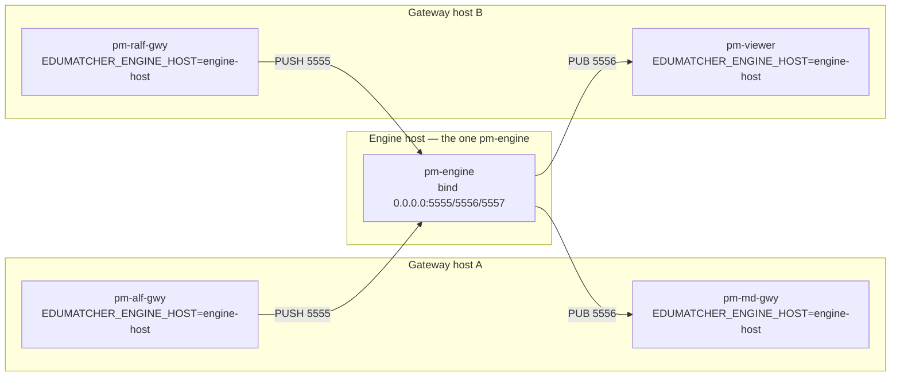

# Container and Network Setup

!!! note "Learning objectives"
    After reading this page you will understand:

    - How the single-container Podman/Docker deployment in `container/` is put together
    - Why the engine's ZeroMQ bus was loopback-only, and how it is now configurable
    - The difference between an engine *bind* address and a client *connect* address
    - How to expose the exchange to other machines on your network today
    - What a future multi-host / load-balanced backend split would need on top of
      what exists now, and what it deliberately does not solve


## Summary

`container/` packages the entire EduMatcher backend — every `pm-*` process,
reference data, databases, and logs — into one Podman/Docker container that
behaves like the Multipass VM in `../vm/`, minus the VM's clock-drift-on-suspend
problem. It is a single container by design: one network namespace, one
`pm-opctl-cli` process manager, `make build` / `make up` / `make shell` /
`make down` as the whole interface.

Until recently, one specific constraint enforced that design at the source
level: the engine's three ZeroMQ bus sockets were hardcoded to bind
`127.0.0.1`, with no override. That constraint has been relaxed — the engine's
bind host is now controlled by `EDUMATCHER_ENGINE_BIND_HOST`, the same pattern
already used for `pm-index`. This page documents the container as it exists
today, the networking model behind it, and — separately — what would still be
needed to genuinely split the backend across multiple hosts. Relaxing the bind
constraint is a *prerequisite* for that future; it is not the same thing as
doing it.


## Part 1 — The container today

### Why one container

The container is used as a *machine*, not as a set of microservices: one
container, `pm-opctl-cli` as the process manager inside it, you log in and
work — exactly the Multipass VM's operating model, just without a guest
kernel to resume after a host suspend. See `container/README.md` for the full
day-to-day usage reference (`make shell`, `make status`, `make logs`,
`make config-deploy`, and so on); this page focuses on how its networking is
built and why.

### What ships in the image

| | |
|---|---|
| Base | `python:3.13-slim-bookworm`, two-stage build |
| EduMatcher | installed with `pip` into `/opt/edumatcher/.venv` |
| OS extras | `procps` (pm-opctl-cli's `pgrep`/`ps`), `tini` (PID 1), `tzdata`, `curl`, `openssh-server` (optional) |
| Data | `/data`, bind-mounted from `./data` on the host |
| PID 1 | `entrypoint.sh` under `tini` |

`entrypoint.sh` does four things on start: prepare `/data` and deploy the
selected example configuration, optionally start `sshd`, start the
`pm-opctl-cli` profile, then wait and stop the profile cleanly on `SIGTERM`.
Every environment variable the container sets — including the two network
variables this page is about — is visible to every `pm-*` process
`pm-opctl-cli` starts, because they are ordinary child processes and inherit
the container's environment. There is no separate propagation step to
maintain; setting a variable on the container is enough.

### Ports today

All ports bind `127.0.0.1` on the host by default; `BIND_ADDR=0.0.0.0` in
`.env` opens them to the local network (see [Backend on the LAN
today](#backend-on-the-lan-today) below for what that does and does not
achieve).

**Always published** — the client-facing gateways, which already bind
`0.0.0.0` *inside* the container and need nothing special:

| Port | Process | Protocol | Purpose |
|-----:|---------|----------|---------|
| 5560 | `pm-balf-gwy` | TCP | Binary ALF order entry |
| 5565 | `pm-alf-gwy` | TCP | ALF order entry |
| 5570 | `pm-md-gwy` | TCP | Market data (CALF/MDLF) |
| 5580 | `pm-ralf-gwy` | TCP | Post trade (RALF) |
| 5590 | `pm-dc-gwy` | TCP | Drop copy (DCLF) |
| 5600 | `pm-log-srv` | TCP | Log ingest (LALF) |
| 8080 | `pm-api-gwy` | HTTP | REST API, `desk` instance |
| 8081 | `pm-api-gwy` | HTTP | REST API, `dashboards` instance |

**Published with `ZMQ=1`** — the raw internal message bus, off by default
because every port opened here is one more way into a running exchange:

| Port | Process | Socket | Purpose |
|-----:|---------|--------|---------|
| 5555 | `pm-engine` | ZMQ PULL | Order intake |
| 5556 | `pm-engine` | ZMQ PUB | Event + book feed |
| 5557 | `pm-engine` | ZMQ PUB | Drop-copy feed |
| 5558 | `pm-index` | ZMQ PUB | Index values |
| 5559 | `pm-index` | ZMQ PULL | Index commands |
| 5601 | `pm-log-srv` | ZMQ PUB | LALF-PS broadcast |
| 5602 | `pm-log-srv` | ZMQ PULL | LALF-PS control |

**Published with `SSH=1`**: host port `2222` → container port `22`.


## Part 2 — Bind addresses vs. connect addresses

This is the concept the rest of the page depends on, and it is easy to blur
the two if you have not had to keep them apart before.

A ZeroMQ (or any TCP) socket has two independent addresses:

- **Bind address** — what the *listening* process binds to. `0.0.0.0` means
  "accept connections arriving on any of this machine's network interfaces."
  `127.0.0.1` means "accept connections only from this same machine."
  `0.0.0.0` is a wildcard for binding; it is not a real, routable address.
- **Connect address** — what a *client* dials. This must be a real, reachable
  IP or hostname — `0.0.0.0` is meaningless here, because there is no machine
  actually at that address to connect to.

A process that both binds a socket and connects to another process's socket
(which describes most `pm-*` processes on the engine bus — a gateway binds its
own client-facing port *and* connects to the engine's PULL/PUB sockets) needs
both addresses available separately. Conflating them — using one constant for
both roles — is exactly the trap: setting a shared "engine host" constant to
`0.0.0.0` so the engine binds all interfaces would silently break every other
process's *connect* address at the same time, since `0.0.0.0` is not
connectable.

`edumatcher.config` already modeled this correctly for `pm-index` before this
change, and now models it the same way for the engine:

```python
# Index process endpoints (pre-existing)
EDUMATCHER_INDEX_BIND_HOST = os.getenv("EDUMATCHER_INDEX_BIND_HOST", "127.0.0.1")
EDUMATCHER_ENGINE_HOST = os.getenv("EDUMATCHER_ENGINE_HOST", "127.0.0.1")  # connect-side, for clients of BOTH pm-index and pm-engine

INDEX_PUB_ADDR = f"tcp://{EDUMATCHER_INDEX_BIND_HOST}:{EDUMATCHER_INDEX_PUB_PORT}"   # bind
INDEX_PUB_CONNECT_ADDR = f"tcp://{EDUMATCHER_ENGINE_HOST}:{EDUMATCHER_INDEX_PUB_PORT}"  # connect

# Engine bus endpoints (new)
EDUMATCHER_ENGINE_BIND_HOST = os.getenv("EDUMATCHER_ENGINE_BIND_HOST", "127.0.0.1")

ENGINE_PULL_BIND_ADDR = f"tcp://{EDUMATCHER_ENGINE_BIND_HOST}:5555"   # what pm-engine binds
ENGINE_PULL_ADDR      = f"tcp://{EDUMATCHER_ENGINE_HOST}:5555"        # what everyone else connects to
```

`EDUMATCHER_ENGINE_HOST` already existed — it was introduced for `pm-index`'s
connect-side addresses and happened to be named generically enough to reuse
for the engine trio without a second variable. Its default (`127.0.0.1`) is
unchanged, so nothing downstream changes value unless one or both variables
are explicitly set.

| Variable | Role | Consumed by | Default |
|---|---|---|---|
| `EDUMATCHER_ENGINE_BIND_HOST` | Where `pm-engine` binds its 3 bus sockets | `pm-engine` only | `127.0.0.1` |
| `EDUMATCHER_ENGINE_HOST` | Where every other process connects to reach the engine | gateways, `pm-board`, `pm-viewer`, `pm-scheduler`, `pm-audit`, `pm-clearing`, `pm-stats`, `pm-orders`, `pm-ticker`, `pm-index`, `pm-ai-trader`, `pm-alf-console`, `commands/cli` | `127.0.0.1` |
| `EDUMATCHER_INDEX_BIND_HOST` | Where `pm-index` binds its 2 sockets | `pm-index` only | `127.0.0.1` |

Only `pm-engine`'s and `pm-index`'s own bind call sites needed to change
(`engine/main.py`, `engine/drop_copy.py`). Every one of the fifteen-plus
consumer processes listed above kept importing the same connect-side constant
names with unchanged default values, so nothing else in the codebase needed
to change.

`pm-log-srv` is a third case worth naming explicitly: it already binds
`0.0.0.0` **unconditionally**, by its own design, with no environment
variable involved at all. It needs no bind-host override because it never
restricted itself to loopback in the first place.


## Part 3 — How the container uses this today

Before this change, the container could not simply publish ports 5555–5557,
because nothing inside the container was listening on any interface those
published ports could reach — the engine was bound to `127.0.0.1`, a published
Docker port maps to a container-external interface, and loopback is not
externally reachable no matter how a port is published. The old workaround
was a `socat` TCP relay started by `entrypoint.sh`, listening on the
container's own IP and forwarding each connection through to `127.0.0.1`.
Functionally correct — ZMTP is a plain TCP byte stream, so a relay is
transparent to it — but it was a workaround for a source-level limitation,
running one extra process per relayed port, for no other reason than that the
engine could not be told to bind anywhere else.

`container/compose.zmq.yaml` now does this instead:

```yaml
services:
  edumatcher:
    environment:
      EDUMATCHER_ENGINE_BIND_HOST: "0.0.0.0"
      EDUMATCHER_INDEX_BIND_HOST: "0.0.0.0"
    ports:
      - "${BIND_ADDR:-127.0.0.1}:5555:5555"
      - "${BIND_ADDR:-127.0.0.1}:5556:5556"
      - "${BIND_ADDR:-127.0.0.1}:5557:5557"
      - "${BIND_ADDR:-127.0.0.1}:5558:5558"
      - "${BIND_ADDR:-127.0.0.1}:5559:5559"
      - "${BIND_ADDR:-127.0.0.1}:5601:5601"
      - "${BIND_ADDR:-127.0.0.1}:5602:5602"
```

The engine and `pm-index` now bind the ports directly, on the container's own
`0.0.0.0`. No relay process, no `socat` dependency in the image, one less
moving part between "container is up" and "port is reachable."

```bash
make up ZMQ=1

# then, from the host:
pm-dc-spy --host 127.0.0.1 --port 5557        # engine drop-copy feed
```

Everything inside the container still talks to everything else over
`127.0.0.1` by default — `EDUMATCHER_ENGINE_HOST` is not touched by
`compose.zmq.yaml`, so in-container clients keep connecting to loopback
exactly as before. `EDUMATCHER_ENGINE_BIND_HOST=0.0.0.0` only widens *who can
reach the socket*, not where the socket's own connect-side consumers look for
it. That asymmetry — bind wide, connect narrow, both correct at once — is the
entire point of keeping the two variables separate.

### Backend on the LAN today

Setting `BIND_ADDR=0.0.0.0` in `.env` publishes the compose ports on every
interface of the *host* machine, and (with `ZMQ=1`) the engine and index
sockets are actually listening for it, rather than being present but
unreachable. This is enough for another machine on the same network to reach
this one container's REST API, gateways, or (with `ZMQ=1`) raw bus. It is
**not** a multi-host backend: there is still exactly one `pm-engine` process,
still running inside this one container, still the single order-matching
authority for the whole exchange. What changed is that other machines can now
*reach* it — not that the backend itself is distributed.


## Part 4 — What a genuine multi-host split would still need

This section is deliberately speculative — nothing here is implemented. It
exists so that the next person who wants to take the container in this
direction knows what is already in place and what is still missing, instead
of rediscovering both from scratch.

### What today's change already provides

- The engine can bind a real, LAN-reachable interface instead of only
  loopback — `EDUMATCHER_ENGINE_BIND_HOST=0.0.0.0` or a specific NIC address.
- Every consumer process already resolves the engine's address through one
  environment variable (`EDUMATCHER_ENGINE_HOST`) rather than a hardcoded
  constant, so pointing a *remote* gateway, viewer, or scheduler at an
  engine on a different host needs no source changes — only setting that one
  variable before the process starts.
- `pm-index` follows the identical pattern, so the same is true for anything
  that depends on the index feed.

### What is still missing

**No load balancing is possible, because there is exactly one engine.**
`pm-engine` is the sole order-matching authority — one in-memory order book,
one sequence of trades, one source of truth. Nothing about today's change
makes it possible to run two engines and split traffic between them; a
matching engine that owns the order book is not the kind of process that
horizontally scales by adding replicas behind a load balancer. "Load
balancing" in a future multi-host EduMatcher would have to mean distributing
*gateways, viewers, and other stateless-ish clients* across hosts, all still
talking to the one engine — not distributing the engine itself. Anyone
picking this up should settle that scope question explicitly before writing
code, because it changes what "multi-host" is even solving.

**No transport security or authentication.** ZeroMQ PUSH/PULL and PUB/SUB
sockets accept whatever connects; today, the loopback-only bind was an
accidental safety net — nothing could reach the engine's order-intake socket
except a process already inside the same container. Widening the bind host
removes that accident, not by design but as an unavoidable side effect of
making the host configurable at all. Authentication of *inbound orders*
already exists at the ALF/BALF gateway layer (participants authenticate to
the gateway, not to the engine), and this project's working assumption is
that gateways are trusted — so the engine trusts whatever a gateway forwards
to it. That assumption stops being free the moment the engine's PULL socket
is reachable across a real network boundary rather than only from
co-located, already-trusted gateway processes: something has to prevent an
arbitrary host on the LAN from talking directly to port 5555 and injecting
orders as if it were a gateway. TLS, CURVE (ZeroMQ's built-in
authentication/encryption mechanism), or network-level ACLs are all options;
none are implemented today, and the existing `container/README.md` firewall
guidance ("keep `BIND_ADDR=127.0.0.1` unless you need it") is the only
mitigation currently in place.

**No service discovery.** Every connect-side address today is one
environment variable naming one host. A real multi-host deployment with
several gateway machines, or gateways that come and go, would need some way
for a process to find the engine's current address without a human typing an
IP into every process's environment — a DNS name, a config service, or at
minimum a documented convention for how addresses get distributed. Nothing
here provides that; `EDUMATCHER_ENGINE_HOST` is a single static value.

**No cross-host container orchestration.** `container/compose.yaml` describes
one container on one host. Multiple hosts running EduMatcher processes today
means running Docker/Podman independently on each machine and wiring the
environment variables by hand — nothing here introduces Kubernetes, Docker
Swarm, or any other multi-node orchestrator. That may be a reasonable next
step, but it is a separate decision from "can the engine bind a real
interface," which is all this change addresses.

**No health/readiness signaling across hosts.** `pm-opctl-cli health` already
has a known pre-existing discrepancy even within one container — see the
Troubleshooting section of `container/README.md` — where it probes a port
`pm-index` does not actually bind under the `default` profile. A multi-host
setup would need every remote consumer to know when the engine is actually up
and reachable before connecting — today that is left entirely to each
process's own retry/reconnect behavior.

### An indicative topology, if this were built out

The diagram below is illustrative only — it shows what the *pieces* would
look like with the current single-engine constraint respected, not a
recommendation or a tested design.



Every arrow here already works with today's `EDUMATCHER_ENGINE_BIND_HOST` /
`EDUMATCHER_ENGINE_HOST` pair. What is missing from the picture is everything
in the previous subsection: nothing authenticates host A or host B to the
engine, nothing discovers `engine-host`'s address automatically, and nothing
orchestrates these three hosts as one deployable unit. Building any of that
out is a separate, larger design effort — this page's job is only to make
clear where that effort would start from.


## Reference: related design material

- `container/README.md` — day-to-day container usage: build, run, ports,
  data directory, profiles, troubleshooting.
- `docs-design/EduMatcher-Cross-host-connection.md` — an earlier, broader
  *unimplemented* design proposal covering this same idea. It specifies the
  same `EDUMATCHER_ENGINE_BIND_HOST` variable documented here, plus
  additional scope this project has not built: per-process CLI flags
  (`--bind-host`, `--engine-host`), a `primary`-IP auto-resolve convenience,
  port-level environment overrides, and an optional `engine_config.yaml`
  `network:` section. Treat it as the fuller backlog if cross-host support
  ever becomes a first-class feature, not as a description of current
  behavior.
