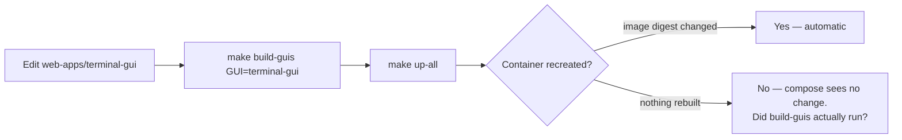
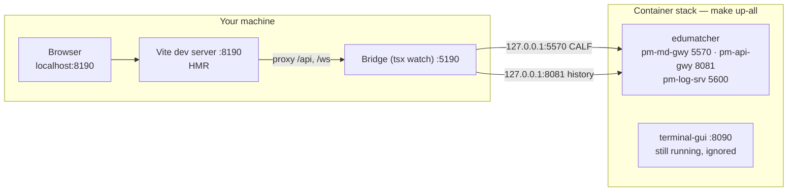

# The Development Loop

!!! note "Learning objectives"
    After reading this page you will understand:

    - Why a change in `web-apps/` is invisible after `make up-all`, and the one
      flag that fixes it
    - How to run a web application on your own machine, with hot reload, against
      the exchange running in containers — and why that works without any
      configuration
    - Exactly what each of the four applications needs from a running backend:
      which ports, which files, which credentials
    - Which of the three loops to reach for, given the change you are making
    - The handful of things that will waste an afternoon if you do not know them


## Summary

There are three ways to run EduMatcher while developing it, and the whole
chapter is about choosing between them.

| | What runs where | Feedback | Use it for |
|---|---|---|---|
| **Container loop** | Everything in containers | ~1–3 min per web-app change | Verifying what you will ship; anything touching the Dockerfile, compose files or the entrypoint |
| **Hybrid loop** | Exchange in containers, one web app on the host | Instant — Vite HMR, `tsx watch` | Almost all front-end and bridge work |
| **Local loop** | Everything on the host (`pm-setup`, `pm-opctl-cli`) | Instant | Python work on the engine, gateways and CLIs |

The hybrid loop is the one to reach for by default when working on
`web-apps/`, and it needs no special build of anything:

```bash
cd deployment/docker && make up-all              # the exchange, in containers
eval "$(make -s dev-env GUI=terminal-gui)"       # the two values that cannot be defaulted
cd ../../web-apps/terminal-gui && make dev       # Vite on 8190, bridge on 5190
```

That works because **every bridge defaults its connect targets to
`127.0.0.1`**, and `127.0.0.1` is exactly where the container stack publishes
its ports. The container and the host see the same addresses.


## Part 1 — Why `make up-all` does not pick up your change

`up-all` runs `compose up -d`, deliberately *without* `--build`. Compose only
builds an image that does not exist yet, so an image tagged
`edumatcher-terminal-gui:latest` from an hour ago is reused as-is. Your change
is in the working tree, not in the image, and nothing warns you.

The reason it is not simply `--build` by default: that re-evaluates five build
contexts on every start, including the backend's, which turns a three-second
start into a multi-minute one. Building is a separate decision from starting.

So the loop is *build, then start*:

```bash
make build-guis GUI=terminal-gui     # rebuild one image
make up-all                          # recreate the containers whose image changed
```

or, in one step:

```bash
make up-all BUILD=1 GUI=terminal-gui
make up-all BUILD=1                  # all four
```

`make build-guis` with no `GUI=` rebuilds all four. It builds through
`compose.yaml -f compose.guis.yaml -f compose.config-gui.yaml`, so config-gui
is always buildable here whether or not you start it with `CONFIG_GUI=1`.

For a **backend** change the equivalent is `make build`, which rebuilds the
wheel from the checkout first:

```bash
cd deployment/docker
make build && make up-all
```

!!! warning "Check the wheel line"
    `make build` must print `==> building wheel from the repository checkout`
    followed by `Installing local wheel: ...`. If it installed from PyPI
    instead, you have been testing the released code, not yours. See
    [Build time versus run time](07-container-and-networks.md#part-3-build-time-versus-run-time).




## Part 2 — The hybrid loop, and why it needs no wiring

Run the exchange in containers and one web application directly on your
machine. You get Vite hot module replacement in the browser and `tsx watch`
restarting the bridge on save, against a real exchange with real market data.



Three facts make this work with no configuration:

1. **Each app's Vite config already proxies to its own bridge.** `/api` and
   `/ws` on the dev server are forwarded to `127.0.0.1:<bridge port>`, so the
   browser only ever talks to one origin and there is no CORS question.
2. **Each bridge defaults every connect target to `127.0.0.1`** — `CALF_HOST`,
   `LOG_SRV_HOST`, `API_GATEWAY_URL`, all of them.
3. **The stack publishes to `127.0.0.1`** by default (`BIND_ADDR`). The two
   halves meet without either being told about the other.

The containerised GUI keeps running on 8090–8093 the whole time. That is
useful rather than confusing: it is your reference. Compare `localhost:8190`
with `localhost:8090` and you are comparing your change against what is
currently shipped.

### `make dev-env`

Two things genuinely cannot be defaulted: the read-only API key, which is
generated per engine configuration, and the paths into this stack's `./data`.
`make dev-env` reads them out of the running backend and prints them as `export`
lines, so they can be evaluated straight into your shell:

```console
$ cd deployment/docker
$ make -s dev-env GUI=terminal-gui
# terminal-gui: web on 8190, bridge on 5190 (Vite proxies /api and /ws)
export API_GATEWAY_URL=http://127.0.0.1:8081
export PM_TERMINAL_API_KEY=key-readonly-2kqhcbckg7rk5mkdf6c3ldjd9hbc8ve5

$ eval "$(make -s dev-env GUI=terminal-gui)"
```

Warnings — a missing credential, an unpublished port, a `log.db` that does not
exist yet — go to **stderr**, so they reach you on the terminal without ending
up inside the `eval`.

Re-run it after `make up-all CONFIG=<other>`: the read-only key is different in
every bundled configuration, and a stale key gives you a live order book with
empty history panels and a 401 in the bridge log.

### Ports at a glance

| Application | Dev web | Dev bridge | Container | Needs from the backend |
|---|---|---|---|---|
| terminal-gui | 8190 | 5190 | 8090 | 5570 CALF, 8081 history + read-only key, 5600 log ingest |
| log-gui | 8191 | 5191 | 8091 | 5601/5602 (needs `ZMQ=1`), `data/log.db` |
| trader-gui | 8193 | — | 8093 | 8080 only, proxied by Vite |
| config-gui | 8192 | 5192 | 8092 | nothing |

The dev ports are deliberately `81xx`/`51xx` against the containers' `80xx`, so
both can run at once.


## Part 3 — Per-application recipes

Each app needs `make install` once (and again after a dependency change).

### terminal-gui

```bash
cd deployment/docker && make up-all
eval "$(make -s dev-env GUI=terminal-gui)"
cd ../../web-apps/terminal-gui
make install          # first time only
make dev              # bridge + web together
```

Open <http://localhost:8190>.

`make dev` runs both halves. `make dev-web` and `make dev-bridge` run one each,
which is what you want when you are attaching a debugger to the bridge or when
the bridge is stable and only the React app is changing.

What it connects to: `pm-md-gwy` on 5570 for the live CALF feed, `pm-api-gwy`
on **8081** for history, and `pm-log-srv` on 5600 for its own logging uplink.
All three are always published — no `ZMQ=1` needed.

| Symptom | Cause |
|---|---|
| Live book, empty history | `PM_TERMINAL_API_KEY` unset or stale. Re-run `dev-env` |
| History 401s | The key is valid on 8081 only; `API_GATEWAY_URL` points at 8080 |
| `calf: RECONNECTING` | 5570 not published, or the backend is not running |

The read-only credential is the one whose `gateway_id` is `null`, issued on the
`dashboards` instance. Nothing else in the system needs it, and it is never
sent to the browser.

### log-gui

```bash
cd deployment/docker && make up-all ZMQ=1
eval "$(make -s dev-env GUI=log-gui)"
cd ../../web-apps/log-gui && make install && make dev
```

Open <http://localhost:8191>.

**`ZMQ=1` is required here, unlike every other app.** The log bridge subscribes
to `pm-log-srv`'s LALF-PS sockets on 5601/5602, and those are ZeroMQ sockets
published only by the ZMQ overlay. Without it you get the history views —
which read `log.db` directly — and no live stream. `dev-env` checks for this
and says so.

`dev-env` also exports two paths:

- `LOG_DB_PATH` → the stack's `data/log.db`, the same file `pm-log-srv` writes.
  The bridge opens it read-only.
- `ACK_STORE_PATH` → `data/log-ui-acks.db`, the bridge's own store. In the
  container this is a named volume; on the host it sits beside `log.db`.

If `log.db` does not exist yet, the exchange has not logged anything —
`pm-log-srv` creates it on the first entry.

### trader-gui

```bash
cd deployment/docker && make up-all
cd ../../web-apps/trader-gui && make install && make dev
```

Open <http://localhost:8193>. **No `dev-env` needed**: trader-gui has no
bridge, and `vite.config.ts` proxies `/api` — REST and the WebSocket upgrades
for `/events`, `/market-data` and `/admin/monitor` — straight to
`http://localhost:8080`, the `desk` instance. Trading credentials are entered
in the browser, so there is no key to inject.

That also makes it the one app whose dev server is a true drop-in for the
container: the only difference is who serves the static bundle.

### config-gui

```bash
cd web-apps/config-gui && make install && make dev
```

Open <http://localhost:8192>. **The backend does not need to be running at
all.** config-gui is a standalone authoring tool for `engine_config.yaml`; its
Fastify server on 5192 shells out to the Python `pm-setup` tooling and talks to
no exchange. That is also why it is opt-in (`CONFIG_GUI=1`) in the container
stack.

Its dev server needs the Python side available on your `PATH` — `npm run
verify:python` checks that.


## Part 4 — Choosing a loop

| The change you are making | Loop | Command |
|---|---|---|
| React component, styling, a view | Hybrid | `make dev` in the app |
| Bridge logic, a protocol client under `packages/` | Hybrid | `make dev`; `tsx watch` restarts on save |
| Anything in `src/edumatcher/` | Local, then container | `poetry run pm-...`; then `make build && make up-all` |
| A Dockerfile, compose file or `entrypoint.sh` | Container | `make build-guis` / `make build`, then `make up-all` |
| Ports, published addresses, bind hosts | Container | Only the container exercises the namespace |
| Anything before a release | Container | It is what CI builds and users install |

The rule behind the table: **the hybrid loop is faster but does not exercise
the container topology.** A change that is invisible to the network — a
component, a query, a formatter — is safe to develop hybrid and verify once in
containers at the end. A change to how processes find each other has to be
tested where the namespaces are real, because the hybrid loop routes everything
over host loopback and will happily hide a bind-address mistake. See
[The two planes and their defaults](07-container-and-networks.md#the-two-planes-and-their-defaults).

### Editing shared packages

Each app is an npm workspace root, and the Vite configs alias
`@edumatcher/<pkg>` to the package's `src/` rather than its build output. A
change in `packages/calf-protocol/` therefore hot-reloads in the browser with
no build step — but only for the *web* half. The bridge imports the compiled
package, so `tsx watch` picks it up on save without a rebuild too, while a
production `make build` does compile them.


## Part 5 — Things that will bite

| Symptom | Cause |
|---|---|
| A web-app change does nothing after `make up-all` | No `--build`. Use `make up-all BUILD=1 GUI=<app>` |
| `make build-guis` succeeds, the browser still shows the old build | The image was rebuilt but the container was not recreated. Run `make up-all` afterwards |
| `EADDRINUSE` on 8190/8191/8193 | A previous `make dev` is still running. The container ports are 80xx and never collide with these |
| Empty history panels in the hybrid terminal | Stale `PM_TERMINAL_API_KEY` after switching configuration. Re-run `dev-env` |
| No live entries in the hybrid log viewer | Started without `ZMQ=1`, so 5601/5602 are not published |
| `dev-env` prints a warning and no exports | The backend container is not running, or has not deployed its configuration yet |
| Hybrid app works, containerised one does not | Almost always a bind address or a hostname: the hybrid path uses `127.0.0.1`, the container path uses the service name `edumatcher`. This is exactly the class of bug the hybrid loop cannot see |
| `make dev` fails on a missing module | `make install` has not run since a dependency changed |
| Backend change has no effect | The image was built from PyPI, not your checkout |

!!! tip "Two exchanges, one set of ports"
    `deployment/curl/` uses the same container names and host ports as
    `deployment/docker/`. If a released install is running, the dev stack
    refuses to start rather than attaching to it — but a *hybrid* app has no
    such guard, and will happily connect to whichever exchange owns 5570.
    `./edumatcher.sh stop` in `~/.edumatcher`, or `make mounts` to see which
    data directory is really behind the container you are talking to.


## Reference

| Command | Where | What it does |
|---|---|---|
| `make up-all` | `deployment/docker` | Start the exchange and the GUIs |
| `make up-all ZMQ=1` | `deployment/docker` | ... and publish the ZeroMQ bus (needed by hybrid log-gui) |
| `make build-guis [GUI=<app>]` | `deployment/docker` | Rebuild web-app images |
| `make up-all BUILD=1 [GUI=<app>]` | `deployment/docker` | Rebuild, then start |
| `make build` | `deployment/docker` | Rebuild the backend image from a fresh local wheel |
| `make dev-env GUI=<app>` | `deployment/docker` | Print the environment for a hybrid run |
| `make mounts` | `deployment/docker` | Which directory is behind each container path |
| `make install` | `web-apps/<app>` | npm workspace install |
| `make dev` | `web-apps/<app>` | Dev server(s) with hot reload |
| `make dev-web` / `dev-bridge` | `web-apps/<app>` | One half only |
| `make test` / `typecheck` | `web-apps/<app>` | Vitest / TypeScript |

Related: [Container and Network Setup](07-container-and-networks.md) for the
deployed topology, the release pipeline and the network model;
[Development Practice](01-dev-practice.md) for the Python side.
