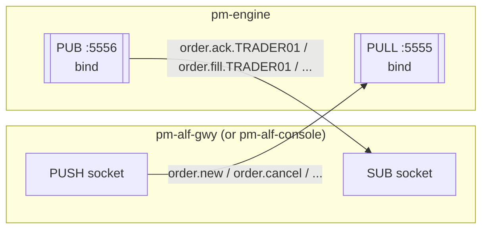
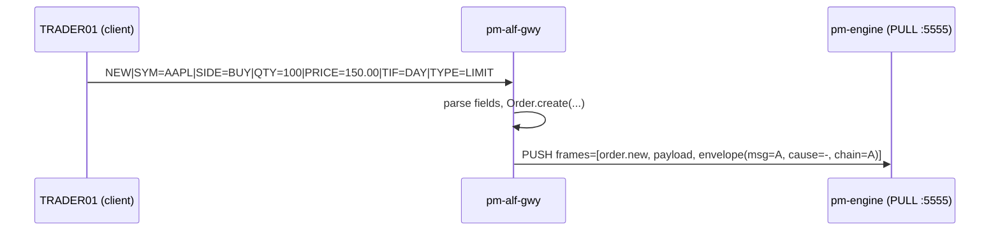
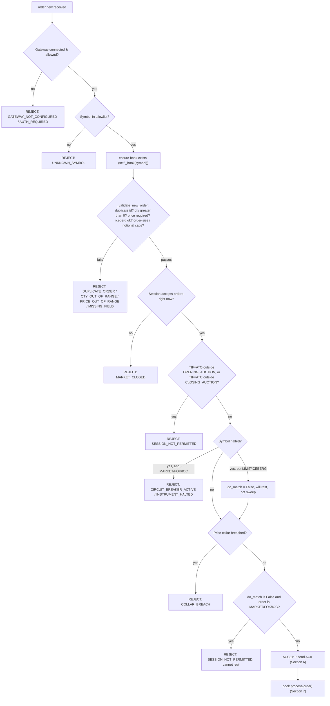
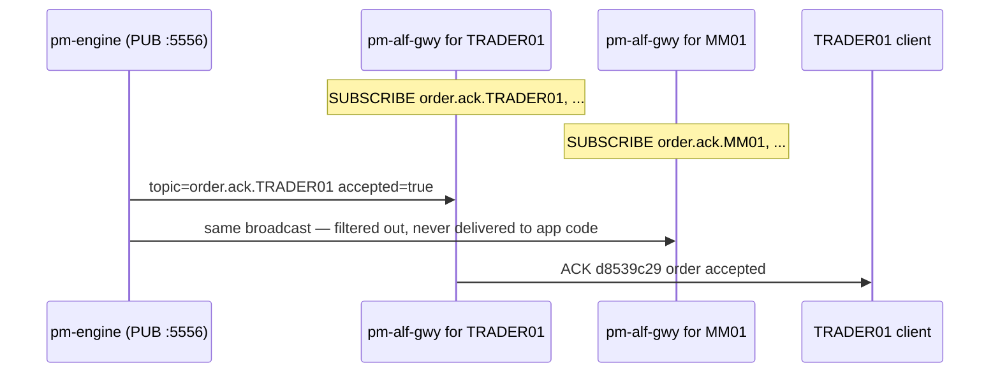
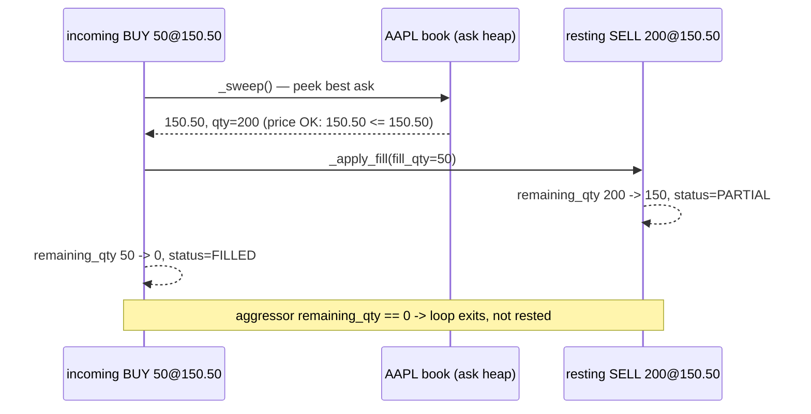
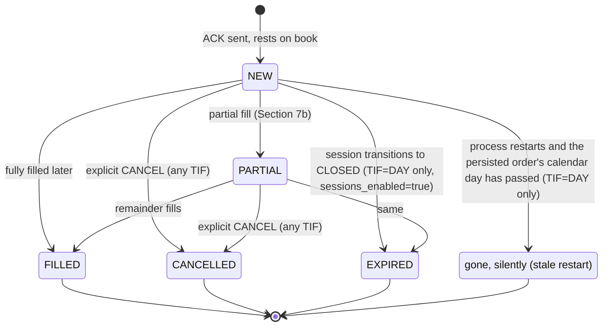
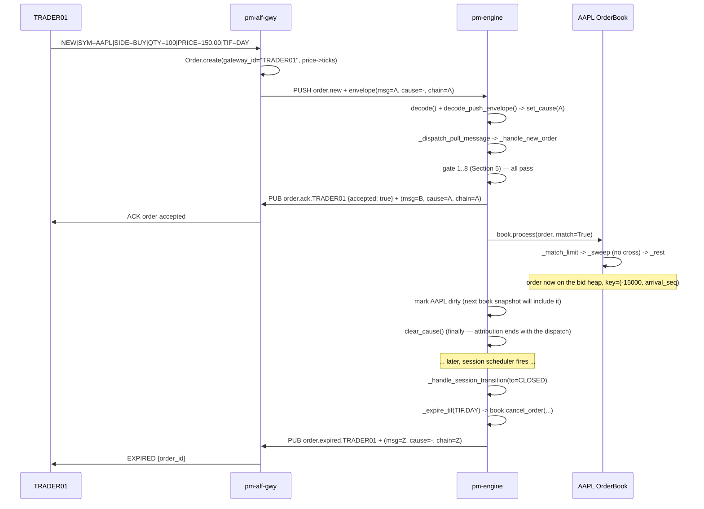

# Order Flow Through the Engine: A NEW LIMIT Order, Step by Step

!!! note "Learning objectives"
    After reading this page you will understand:

    - The exact sequence of sockets and processes a `NEW` order crosses between
      a trader's keystroke and a resting entry in the book
    - Every check the engine runs before an order can rest or trade, in the
      order it runs them, with the code that runs them
    - How the engine's `ACK` finds its way back to the *one* gateway that sent
      the order — there is no per-connection routing table, just a topic
      string
    - What actually happens to the order inside `OrderBook.process()` —
      resting, partial fill, full fill — with a worked numeric example
    - Exactly when a `TIF=DAY` order leaves the book: on a fill, on an
      explicit cancel, on the scheduled session close — and, separately, what
      happens (and does **not** happen) to it across a process restart
    - Where to look first when something about an order's fate is unclear

!!! info "What is covered"
    This page walks one concrete case end to end: gateway `TRADER01` submits
    `NEW BUY 100 AAPL LIMIT @150.00` while the session is `CONTINUOUS`. Every
    code snippet below is taken from the real files (line numbers omitted —
    they drift; the surrounding context does not). Nothing here is
    simplified into a lie; where a snippet is trimmed for length, the
    omission is marked and the full function is named so you can go read it.

The goal is to make it boring. An exchange matching engine sounds like it
should be full of clever tricks. It mostly is not — it is a long, explicit
checklist, run in a fixed order, each step small enough to hold in your head.
The complexity is in the *number* of steps, not in any single one of them.

## 1. The moving parts

Two ZeroMQ sockets connect every gateway process to the one engine process:



- **PULL (`:5555`)** — every gateway process `connect()`s a PUSH socket to it
  and sends commands *in*. Many gateways, one engine, one-way traffic.
- **PUB (`:5556`)** — the engine broadcasts *everything* it does. Every
  gateway `connect()`s a SUB socket and filters, by topic prefix, for only
  the events addressed to the gateway ids it is currently serving.

```python
# messaging/bus.py
def make_puller(addr: str) -> zmq.Socket[bytes]:
    """PULL socket — engine receives orders."""
    sock = get_context().socket(zmq.PULL)
    sock.bind(addr)
    return sock

def make_publisher(addr: str) -> "CausalPublisher":
    """PUB socket — broadcasts events, sequenced and causally stamped."""
    sock = get_context().socket(zmq.PUB)
    sock.bind(addr)
    return CausalPublisher(SequencedPublisher(sock))
```

A message is two frames of **content** — a topic string and a JSON payload —
followed by **envelope** frames that describe the message rather than carry
it:

| Frame | PUB (engine → subscribers) | PUSH (gateway → engine) |
|---|---|---|
| 0 | topic | topic |
| 1 | JSON payload | JSON payload |
| 2 | per-topic sequence | causal envelope |
| 3 | causal envelope | — |

The envelope is metadata, not content, which is why it rides in frames
instead of in the JSON: the hot publish path never decodes and re-encodes a
message to stamp it, and the same three fields do not have to be declared on
each of the 114 message types in `spec/messages/`. Sections 3, 4 and 8 show
it being written and read; if you only care about the order flow, the one
thing to know is that `decode()` ignores it entirely.

```python
# models/message.py
def encode(topic: str, payload: dict[str, Any]) -> list[bytes]:
    return [topic.encode(), _dumps(payload)]

def decode(frames: list[bytes]) -> tuple[str, dict[str, Any]]:
    topic = frames[0].decode()
    payload = _loads(frames[1])
    return topic, payload
```

Keep that shape in mind — `(topic, payload)` — it is the unit everything
below is built from. The envelope never changes it; `decode` reads frames 0
and 1 and stops, so every consumer written before the envelope existed still
works unmodified.

## 2. The scenario

`TRADER01`, connected through `pm-alf-gwy`, types:

```
NEW|SYM=AAPL|SIDE=BUY|QTY=100|PRICE=150.00|TIF=DAY|TYPE=LIMIT
```

Session state is `CONTINUOUS`. AAPL's book currently has no resting bids and
one resting ask at 150.50 for 200 shares. This order does not cross — it
will rest. Section 7 below re-runs the same order at a price that *does*
cross, to show a partial fill too.

## 3. From keystroke to the engine's doorstep

`pm-alf-gwy` parses the ALF text line, builds an `Order`, and pushes it —
there is no engine-visible difference between an order that arrived over
ALF, BALF, REST, or from `pm-alf-console` directly; they all end up as the
same `order.new` PULL message.

```python
# alf_gwy/gateway.py — _handle_new_single (trimmed)
order = Order.create(
    symbol=symbol,
    side=side,
    order_type=order_type,
    quantity=quantity,
    gateway_id=self._require_gw(session),   # ← the AUTHENTICATED session's id
    tif=tif,
    price=self._ticks(price, symbol, "PRICE") if price is not None else None,
    ...
)
self._send_to_engine(make_order_new_unchecked_msg(order.to_dict()))
```

Two things worth pausing on:

- **`gateway_id` comes from the session, not from the wire fields.** A
  client cannot claim to be a different gateway than the one it
  authenticated as — `_require_gw(session)` raises if the session never
  completed `HELLO`. This is the fact the ACK routing in Section 6 depends
  on.
- **Price is already converted to ticks** (`self._ticks(...)`) before the
  order ever leaves the gateway process. The engine never does float
  arithmetic on a price — see `docs-design/EduMatcher-Requirements.md`
  section 15.2 if you want the full story on ticks vs. display money.

`_send_to_engine` is a thin wrapper around the PUSH socket:

```python
# alf_gwy/gateway.py — _send_to_engine (trimmed)
def _send_to_engine(self, frames: list[bytes], ...) -> None:
    self._push.send_multipart(frames)
```

**This send is where the causal chain begins.** `make_pusher` returns a
`CausalPusher`, which appends an envelope frame carrying a fresh `msg_id`
(a ULID), no `causation_id` — nothing on the bus caused this, the trader
typed it — and a `correlation_id` equal to its own `msg_id`. Everything the
engine publishes in response will cite that id and carry that chain, which
is what makes "show me everything this submission caused" a lookup rather
than a reconstruction. The gateway code above does not mention any of it:
wrapping the socket is what stops thirteen client processes each having to
remember. See `models/envelope.py` and
[Architecture — Causal envelope](../architecture/01-architecture.md#causal-envelope).



## 4. The engine's front door

The engine's whole life is one loop: poll the PULL socket, decode, dispatch,
run maintenance, repeat.

```python
# engine/main.py — run() (trimmed)
while self._running:
    socks = dict(poller.poll(timeout=200))          # 200 ms tick
    if self.pull_sock in socks:
        frames = self.pull_sock.recv_multipart()
        topic, payload = decode(frames)
        cause = decode_push_envelope(frames)        # the gateway's msg_id

        self.pub_sock.set_cause(cause)
        try:
            self._dispatch_pull_message(topic, payload)
        finally:
            self.pub_sock.clear_cause()
    self._run_maintenance()
```

Those three extra lines are the entire causality mechanism on the engine
side. While a cause is set, **everything** published — the ACK, the fills,
the trade print, a cascade of OCO cancels — is attributed to this message
and inherits its chain, without a single publish site knowing. Three things
about that are worth understanding rather than skimming:

- **`decode()` still reads only frames 0 and 1.** The envelope rides behind
  them, so nothing downstream of the payload changed.
- **The `finally` is load-bearing.** If a handler raises, the cause must be
  cleared anyway — otherwise `_run_maintenance()` below, which has no
  external cause at all, would publish scheduler ticks and circuit-breaker
  trips attributed to an order that had already failed.
- **This is safe only because the loop is single-threaded.** Exactly one
  inbound message is in flight, so there is never more than one cause in
  scope. A multi-threaded publisher would need a context variable, and
  `CausalPublisher`'s docstring says so.

A message published with **no** cause in scope is not missing information:
it declares `causation_id = null`, which is the engine positively stating
that it decided this by itself.

`_dispatch_pull_message` is a plain `if/elif` chain from topic string to
handler method — no registry, no magic, just a long ladder:

```python
# engine/main.py — _dispatch_pull_message (trimmed)
try:
    if topic == TOPIC_ORDER_NEW:
        self._handle_new_order(payload)
    elif topic == TOPIC_ORDER_CANCEL:
        self._handle_cancel(payload)
    elif topic == TOPIC_ORDER_AMEND:
        self._handle_amend(payload)
    ...
    else:
        self._unknown_topic_count += 1
        log.warning("No dispatch handler for topic %s ...", topic)
except Exception as exc:
    self._error_count += 1
    log.error("Error processing %s (#%d): %s", topic, self._error_count, exc)
    self._reject_after_error(topic, payload, fills_before)
```

The `try/except` around the whole ladder is deliberate: one malformed or
unexpected payload must never take the process down, and it must never
leave the submitting gateway simply waiting forever for an ACK that will
never come — `_reject_after_error` sends a `REJECTED` with
`code=INTERNAL_ERROR` so the caller's wait always terminates in *something*.

Our message matches `TOPIC_ORDER_NEW`, so `_handle_new_order(payload)` runs
next. Everything from here to "resting or trading" happens inside that one
method.

## 5. The gauntlet: every check, in order

`_handle_new_order` is a sequence of guard clauses. Each one either rejects
(sends a NACK and returns) or falls through to the next. Below is the exact
order, each with the real check.



The code, one gate at a time:

**Gate 1 — gateway connected and allowed.**

```python
ok, reason = self._gateway_status(order.gateway_id)
if not ok:
    self._reject(gateway_id=order.gateway_id, order_id=order.id,
                  code=self._gateway_reject_code(reason), reason=reason, ...)
    return
```

**Gate 2 — symbol allowlist.**

```python
if self._allowed_symbols and order.symbol not in self._allowed_symbols:
    self._reject(..., code="UNKNOWN_SYMBOL",
                  reason=f"Symbol not configured: {order.symbol}", ...)
    return
```

**Gate 3 — boundary validation**, all in one place
(`_validate_new_order`), run *before* any ACK so a malformed order never
reaches the book:

```python
# engine/main.py — _validate_new_order (trimmed)
if order.id in self._order_symbol:
    return "DUPLICATE_ORDER", f"Duplicate order id {order.id}"
if order.quantity <= 0 or order.remaining_qty <= 0:
    return "QTY_OUT_OF_RANGE", "Quantity must be positive"
price_required = order.order_type in (
    OrderType.LIMIT, OrderType.FOK, OrderType.STOP_LIMIT, OrderType.ICEBERG,
)
if price_required and (order.price is None or order.price <= 0):
    return ("PRICE_OUT_OF_RANGE",
            f"{order.order_type.value} order requires a positive price")
# ... ICEBERG visible_qty checks ...
# ... order-size / notional cap check via validate_order_limits() ...
return None
```

Our order is `LIMIT`, `quantity=100`, `price=15000` ticks — every check
here passes.

**Gate 4 — session gating.**

```python
if self._sessions_enabled and not accepts_orders(self._session_state):
    self._reject(..., code="MARKET_CLOSED", reason="Market is closed", ...)
    return
```

Session is `CONTINUOUS`, which `accepts_orders()` allows.

**Gate 5 — ATO/ATC window.** `TIF=DAY` skips both of these gates outright
(they only fire for `TIF=ATO` outside `OPENING_AUCTION` and `TIF=ATC`
outside `CLOSING_AUCTION`).

**Gate 6 — halt check.** AAPL is not halted, so this falls straight
through.

**Gate 7 — price collar.** If a collar is configured for AAPL,
`validate_collar` compares 150.00 against the reference price and the
configured band. Assume it passes.

**Gate 8 — no-match-phase rejection.** Only bites `MARKET`/`FOK`/`IOC`
orders when `do_match` is `False` (auction phase or halted symbol forcing
LIMIT-only resting). Our order is `LIMIT`, so this is a no-op either way.

Every gate passed. The order is now **accepted**.

## 6. The ACK — sent before the book ever sees the order

This is the detail most people expect to be complicated and is not: the ACK
is built and published *before* `book.process()` runs at all.

```python
# engine/main.py — _handle_new_order (trimmed)
_gw = order.gateway_id                         # "TRADER01"
ack_topic = self._topic_cache.get(_gw)
if ack_topic is None:
    self._topic_cache[_gw] = topic_order_ack(_gw).encode()   # b"order.ack.TRADER01"
    ack_topic = self._topic_cache[_gw]

self.pub_sock.send_multipart([
    ack_topic,
    dumps({
        "order_id": order.id,
        "accepted": True,
        "reason": "",
        "symbol": order.symbol,
        "side": _side_v,
        "order_type": _ot_v,
        "tif": _tif_v,
        "qty": order.quantity,
        "price": _price_v,
        "client_tag": order.client_tag,
    }),
])
```

**How does the engine know which gateway to answer?** It doesn't look
anything up — `order.gateway_id` is already `"TRADER01"`, carried in the
payload since Section 3 (`self._require_gw(session)`), and it becomes half
of the outbound *topic string*: `order.ack.TRADER01`. There is no
per-connection socket or address to remember on the engine side at all.

**And which submission is it answering?** Note what the snippet above does
*not* contain: anything about correlation. The `send_multipart` call goes
through the `CausalPublisher` wrapper, which stamps `causation_id` = the
submitting message's `msg_id` from the cause Section 4 set. So the ACK
answers a specific *message*, not merely a gateway — which matters the
moment a trader has two orders in flight and both acks route to the same
topic. Before the envelope this had to be inferred by matching `order_id`
between the submission and the ack; now the engine states it.

Delivery is ZeroMQ's job, and it works by **prefix filtering on the
subscriber side**, not by the publisher picking a destination:

```python
# alf_gwy/gateway.py — _gateway_topics
def _gateway_topics(self, gateway_id: str) -> tuple[str, ...]:
    return (
        topic_gateway_auth(gateway_id),
        topic_order_ack(gateway_id),      # "order.ack.TRADER01"
        topic_order_fill(gateway_id),
        ...
    )
```

When `TRADER01` authenticates, `pm-alf-gwy` calls `SUBSCRIBE` on exactly
those topic strings. The engine's PUB socket broadcasts to *every* gateway
process indiscriminately; each one's SUB socket silently drops anything that
does not match one of its subscribed prefixes. `MM01`'s gateway process
never even receives `order.ack.TRADER01` — ZeroMQ filters it at the network
layer before it reaches Python.



`pm-alf-gwy` then relays the ACK into the ALF text protocol
(`_dispatch_response` → `ACK|ORDER_ID=...|ACCEPTED=TRUE`), and `TRADER01`'s
terminal prints it.

One caveat: this ACK means *"the engine accepted the order for
processing"*, not *"this is its final state"*. For `MARKET`/`FOK`/`IOC`
orders the book can still reject afterwards (e.g. insufficient liquidity for
a `FOK`) — a second, `accepted=False` message follows in that case. For our
resting `LIMIT` order, this ACK is the only acknowledgement it gets; its
fate from here is reported via `order.fill` / `order.cancelled` /
`order.expired`.

## 7. Handing the order to the book

```python
# engine/main.py — _handle_new_order (trimmed)
do_match = is_matching_enabled(self._session_state)   # True in CONTINUOUS
trades, events = book.process(order, match=do_match, now=now)
```

`OrderBook.process` dispatches on `order_type`:

```python
# engine/order_book.py — process (trimmed)
elif order.order_type == OrderType.LIMIT:
    self._match_limit(order, trades, events, now)
```

```python
# engine/order_book.py — _match_limit
def _match_limit(self, order, trades, events, now):
    opposite = self._asks if order.side == Side.BUY else self._bids
    self._sweep(order, opposite, price_limit=order.price,
                trades=trades, events=events, now=now)
    if order.remaining_qty > 0 and order.status not in _DEAD_STATUSES:
        self._rest(order)
```

`_sweep` is one `while` loop: peek the best opposite order, stop if its
price is worse than our limit, otherwise fill against it and keep going
until either side runs out.

```python
# engine/order_book.py — _sweep (trimmed)
while aggressor.remaining_qty > 0 and opposite_heap:
    best = self._peek(opposite_heap)
    if best is None:
        break
    if price_limit is not None:
        if side == Side.BUY and best.price > price_limit:
            break                      # nothing left is cheap enough — stop
        if side == Side.SELL and best.price < price_limit:
            break
    fill_qty = min(aggressor.remaining_qty, best.remaining_qty)
    self._apply_fill(aggressor, best, fill_qty, best.price, trades, events, now)
```

That's the entire matching algorithm for a LIMIT order: **peek, compare
price, fill the smaller of the two remaining quantities, repeat.** No
special cases beyond price-time priority (best price first, then arrival
order at a tied price — see the heap key in `_rest` below) and self-match
prevention (skipped here for brevity — see
`docs/architecture/02-architecture-guide.md` section 4 for the full sweep
including SMP).

### 7a. Outcome 1 — the order rests (our scenario)

AAPL's best ask is 150.50; our bid is 150.00. `150.50 > 150.00`, so the very
first price check in `_sweep` breaks the loop immediately — nothing trades.
Back in `_match_limit`, `order.remaining_qty` is still 100, so it rests:

```python
# engine/order_book.py — _rest (trimmed)
def _rest(self, order: Order) -> None:
    price = order.price
    order.arrival_seq = self._next_seq()          # time priority (H1)
    if order.side == Side.BUY:
        key = (-price, order.arrival_seq)         # highest price first
        heap = self._bids
        self._bid_qty[price] = self._bid_qty.get(price, 0) + order.remaining_qty
    else:
        key = (price, order.arrival_seq)          # lowest price first
        heap = self._asks
        ...
    heapq.heappush(heap, _HeapEntry(key=key, order=order))
    self._order_index[order.id] = order
    self._entry_index[order.id] = entry
```

That's the whole "resting order" concept: a heap entry keyed
`(-price, arrival_seq)` for bids (so `heapq`, a min-heap, naturally pops the
*highest* price first) or `(price, arrival_seq)` for asks (lowest price
first), plus two dict lookups (`_order_index`, `_entry_index`) so a later
`CANCEL`/`AMEND` can find it in O(1) instead of scanning a heap.

`book.process` returns `trades=[]`, `events=[]` — nothing to publish. The
book is now dirty (marked via `self._mark_dirty(order.symbol)`) and will
appear in the next throttled `book.AAPL` snapshot.

### 7b. Outcome 2 — a crossing order (worked example)

Suppose instead `TRADER01` had bid **150.50 for 50 shares** — at or above
the resting ask. `_sweep`'s price check now passes (`150.50` is not
`> 150.50`), so it fills:

```
fill_qty = min(50, 200) = 50
_apply_fill(aggressor=bid, resting=ask@150.50, fill_qty=50, price=150.50, ...)
```

`_apply_fill` (not reproduced in full — see `order_book.py`) does three
things: creates a `Trade`, decrements both orders' `remaining_qty`, and sets
each order's `status` (`FILLED` if `remaining_qty` hits zero, `PARTIAL`
otherwise). The aggressor's `remaining_qty` is now 0 — the loop exits
because `aggressor.remaining_qty > 0` is false — and since it is not
`> 0`, `_match_limit` does **not** rest it. The resting ask had 200 shares
and is now down to 150, still resting with `status=PARTIAL`.



`trades` now has one `Trade`, `events` has both `Order` objects (the filled
aggressor and the partially-filled resting order) — Section 8 covers what
happens to them next.

## 8. Publishing what happened

Back in `_handle_new_order`, the `events` list (every order whose status
just changed) drives the publish loop. The important subtlety is
deduplication: a single aggressive order that sweeps several price levels
appears **once per level** in `events`, each occurrence carrying the same
order object with its *final*, cumulative state — so a naive loop would
publish the same fill several times with the wrong quantity split. A
seen-set fixes it:

```python
# engine/main.py — _handle_new_order (trimmed)
published_fill_ids: set[str] = set()
for evt in events:
    filled_qty = evt.quantity - evt.remaining_qty
    if filled_qty > 0 and evt.id not in published_fill_ids:
        published_fill_ids.add(evt.id)
        self.pub_sock.send_multipart([
            fill_topic_for(evt.gateway_id),
            dumps({
                "order_id": evt.id,
                "fill_qty": filled_qty,
                "fill_price": ...,
                "remaining_qty": evt.remaining_qty,
                "status": "PARTIAL_FILL" if evt.remaining_qty else "FILLED",
                ...
            }),
        ])
for trade in trades:
    self._publish_trade(trade)     # trade.executed + both sides' positions
```

`_publish_trade` is the single fan-out point for a trade: it broadcasts the
public `trade.executed` tape event, updates **both** counterparties'
position ledgers (`_update_position`), feeds the drop-copy relay if one is
attached, and checks whether this print should trip a circuit breaker. This
is the *only* place any of those four things happen, regardless of whether
the trade came from a plain NEW order, a quote leg, a combo child, an OCO
leg, or an auction uncross — one path, four side effects, always in that
order.

Every one of those messages — the ACK from Section 6, each `order.fill`,
the `trade.executed` print, the drop-copy relay — carries the same
`correlation_id`, because all of them are published inside the dispatch
window Section 4 opened. One aggressive order that sweeps four price levels
produces a dozen messages across five topics and two gateways, and they are
one `WHERE correlation_id = ?` away from each other. That is the payoff of
attributing at the socket rather than at the publish site: the fan-out did
not have to thread anything through to get it.

Note also what this does *not* claim. The counterparty's `order.fill` is
caused by **our** submission, and says so — the resting order's own
submission, minutes earlier, is a different chain. Causality here means
"this message exists because that one was processed", not "these belong to
the same trader".

If nothing filled (our resting-order scenario from 7a), `events` and
`trades` are both empty — the loop above simply does nothing, and the
resting order's only trace on the wire so far is the ACK from Section 6.

## 9. TIF and the lifetime of a resting order

Our order rested with `TIF=DAY`. What removes it, and when?



There are exactly four ways a `TIF=DAY` order stops resting. Two are the
same for every TIF; two are DAY-specific.

**1 & 2 — fill and explicit cancel.** Nothing DAY-specific here: a fill
happens the moment a crossing order sweeps it (Section 7b); a cancel happens
the moment the owning gateway sends `CANCEL` (`Engine._handle_cancel`). Both
apply identically to `GTC`.

**3 — the scheduled end of the trading day**, *if and only if*
`sessions_enabled` is `true` and `pm-scheduler` actually drives a transition
to `CLOSED`:

```python
# engine/main.py — _handle_session_transition (trimmed)
self._session_state = to_state
if to_state == SessionState.CLOSED:
    self._expire_tif(TIF.DAY)     # <- the only caller of this, for TIF.DAY
```

```python
# engine/main.py — _expire_tif
def _expire_tif(self, tif: TIF) -> None:
    for book in self.books.values():
        for order in book.resting_orders():
            if order.tif == tif:
                cancelled = book.cancel_order(order.id)
                if cancelled:
                    cancelled.status = OrderStatus.EXPIRED
                    self.pub_sock.send_multipart(make_expired_msg(
                        cancelled.gateway_id, cancelled.id,
                        order=cancelled.to_dict(),
                    ))
```

This is the *only* code path that ever publishes `order.expired` for a
`TIF=DAY` order. If `sessions_enabled` is `false` (many training/demo
configs run this way), **this path never runs at all** — nothing in the
engine ever expires a DAY order on a clock. It rests exactly as long as a
`GTC` order would, until something else removes it.

**4 — a stale restart**, which is a completely different mechanism and does
*not* publish anything.

### What happens at shutdown — and it is *not* removal

```python
# engine/main.py — _shutdown (trimmed)
def _shutdown(self) -> None:
    all_resting = self._resting_gtc_orders()      # TIF in (GTC, DAY)
    save_gtc_orders(all_resting, GTC_ORDERS_FILE)
    save_book_stats(self.books, BOOK_STATS_FILE)
    ...
```

```python
# engine/persistence.py — save_gtc_orders
gtc = [
    o.to_dict() for o in orders
    if o.tif in (TIF.GTC, TIF.DAY)
    and o.status in (OrderStatus.NEW, OrderStatus.PARTIAL)
]
_atomic_write_text(path, json.dumps(gtc, indent=2))
```

**A `TIF=DAY` order is persisted to `data/gtc_orders.json` on shutdown,
exactly like a `GTC` order.** Nothing is expired, nothing is discarded — a
clean shutdown (SIGINT/SIGTERM) and a crash both leave the file in this
state (a crash loses at most `_PERSIST_INTERVAL_SEC` = 5 seconds of changes,
via the periodic `_flush_persistence` checkpoint that runs the same
save on every maintenance tick — see `_run_maintenance`). **A process exit
is not a day boundary.**

### What happens at the next startup — this is where staleness is decided

```python
# engine/main.py — _restore_gtc (trimmed)
today = datetime.now().date()
for order in orders:                                  # loaded from the JSON file
    if order.tif == TIF.DAY:
        order_day = datetime.fromtimestamp(order.timestamp / 1e9).date()
        if order_day < today:
            log.info(f"Discarding stale TIF=DAY order {order.id[:8]} ...")
            continue                                   # <- never restored, never expired
    order.status = OrderStatus.NEW
    book.process(order, match=False)                  # rest it, no sweep
```

The check is a plain calendar-date comparison against the order's original
`timestamp`, evaluated **once, at process startup** — not continuously, not
at midnight, not tied to the scheduler in any way. Two consequences follow
directly from that:

- If the engine is restarted several times *within* the same calendar day, a
  `TIF=DAY` order survives every restart unchanged — the date comparison
  keeps passing.
- If the engine simply never restarts, a `TIF=DAY` order with
  `sessions_enabled=false` never expires at all, ever — there is no
  wall-clock timer for it, only the two checks above (session-close, or a
  restart after the date has rolled over).

And critically: **a stale order discarded here never generates an
`order.expired` message.** By the time this code runs, the PUB socket may
not even have a single subscriber yet — the order is simply absent from the
book that gets rebuilt, and absent from the file the next time it is
re-saved. A gateway reconnecting after a multi-day outage learns about the
loss only by *absence*: it is not in the `ORDERS` snapshot it requests on
reconnect, not in `QLEGS` (Section 10 below), and no lifecycle event for it
will ever arrive.

### Summary table

| Trigger | Applies to | Publishes `order.expired`? | Where in the code |
|---|---|---|---|
| Fill (full or partial) | any TIF | no — `order.fill` instead | `OrderBook._apply_fill` |
| Explicit `CANCEL` | any TIF | no — `order.cancelled` instead | `Engine._handle_cancel` |
| Session → `CLOSED` | `TIF=DAY` (and `ATO`/`ATC` at their own phase boundaries) | **yes** | `Engine._expire_tif`, called from `_handle_session_transition` |
| Process shutdown (clean or crash) | none — it is persisted, not removed | no | `Engine._shutdown` / `_flush_persistence` |
| Process restart, order's date has passed | `TIF=DAY` only | no — silently dropped | `Engine._restore_gtc` |

## 10. Debugging cheat-sheet

When an order did something you did not expect, these are the places to
look, roughly in the order you should look at them:

| Question | Where to look |
|---|---|
| Was the order rejected, and why? | The `REJECT_CODE`/`reason` on the `ACK` — every reject in Section 5 goes through `Engine._reject`, which always sets both |
| Did the engine even see it? | Engine log at `INFO`: `NEW {id} {symbol} {side} ...` is logged right before `book.process` in `_handle_new_order` |
| Did it fill, partially or fully? | `order.fill.{gateway_id}` on the wire; `trade.executed` for the public tape; engine log `TRADE {id} {symbol} qty=... @...` |
| Is it still resting? | `ORDERS` (ALF) / `system.orders_request` — walks `book.resting_orders()` directly, so it can never disagree with the book |
| Did it expire, and when? | `order.expired.{gateway_id}`; only ever sent from `_expire_tif`, only for a real session transition to `CLOSED` |
| Did I lose it across a restart? | Check the engine's startup log for `Discarding stale TIF=DAY order ...` — if you see it, that order is gone and nothing else will tell you |
| Is a handler silently swallowing exceptions? | It cannot — every branch of `_dispatch_pull_message` is wrapped, and any exception increments `self._error_count` and logs at `ERROR` with the topic name |
| Fine-grained counters for a whole class of rejects | `self._debug_counts` (`new_order_reject_gateway`, `_reject_symbol`, `_reject_validation`, `_reject_session`, `_reject_halt`, `_reject_collar`, `_reject_no_match_phase`, ...) — logged as one summary line every 5 seconds at `DEBUG` via `_flush_debug_summary` |
| **What did this one submission cause?** | Grep the audit log for its `chain=` id — every descendant carries it. This replaces walking `order_id` → `trade_ids` → counterparty `order_id` by hand |
| **Why was this message published at all?** | Its `cause=` id names the message that caused it. Grep for that `msg=` to find it. A *missing* `cause=` is an answer too: the engine decided it alone |
| Did the bus drop anything? | `seq=` in the audit line is dense **per topic**, so a jump means messages were lost on that topic. PUB/SUB drops silently once a subscriber falls behind; this is the only thing that reveals it |

### Following a chain

The envelope turns the awkward part of a post-mortem into two greps:

```bash
# 1. find the submission
grep 'order.new' data/audit.log | grep 'AAPL' | tail -1
# ... [order.new] [seq=8812 msg=01ARZ3NDEKTSV4RRFFQ69G5FAV chain=01ARZ3ND...] {...}

# 2. everything it caused, in order — acks, fills, trade prints, cascades,
#    across every topic and both counterparties
grep 'chain=01ARZ3NDEKTSV4RRFFQ69G5FAV' data/audit.log
```

The lines come back in audit-receipt order. For true publication order, sort
by the `msg=` id: ULIDs are minted in publish order, so lexicographic order
is the order the engine did things — across all topics, not just one.

## 11. The whole thing, end to end



Note the last message. The expiry carries **no** `cause`: hours after the
submission, a session transition removed the order, and nothing the trader
sent caused it. A new chain starts there, and that is the honest record —
the alternative, attributing the expiry to the original submission, would
make an automatic venue action look like a consequence of something the
trader did.

Every arrow in that diagram is a function call or a ZMQ message you can grep
for by name. The messages are two frames of content — topic and payload —
plus the envelope frames behind them (`[topic, payload, seq, envelope]` on
PUB, `[topic, payload, envelope]` on PUSH). There is no step in between.
