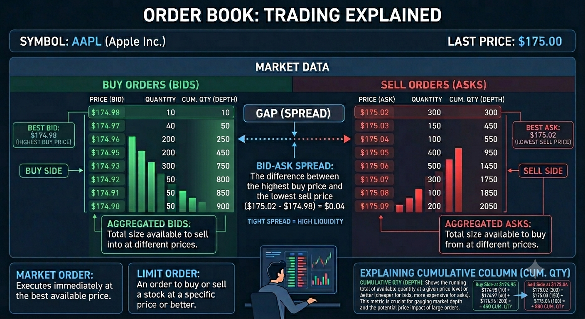
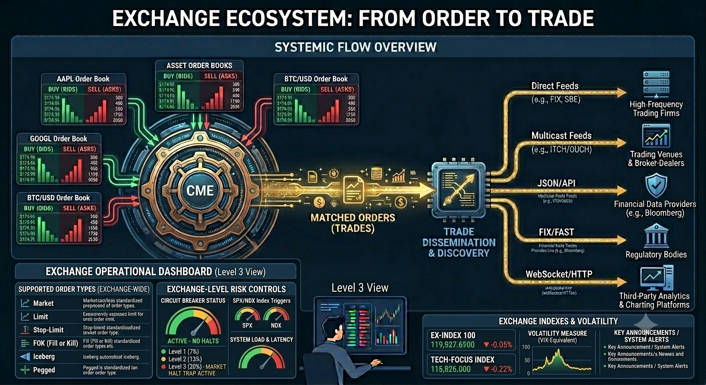
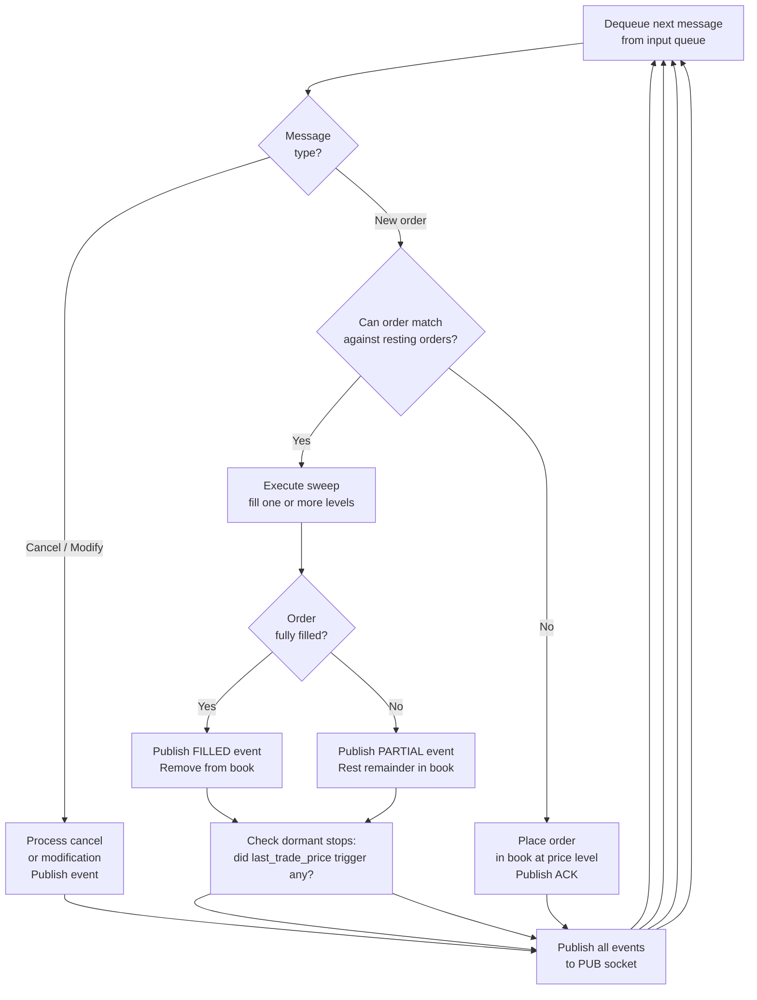
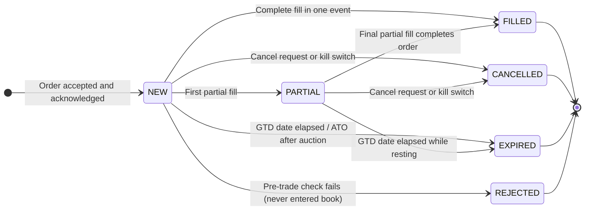
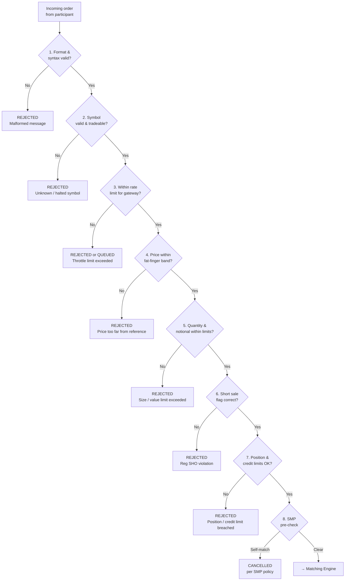
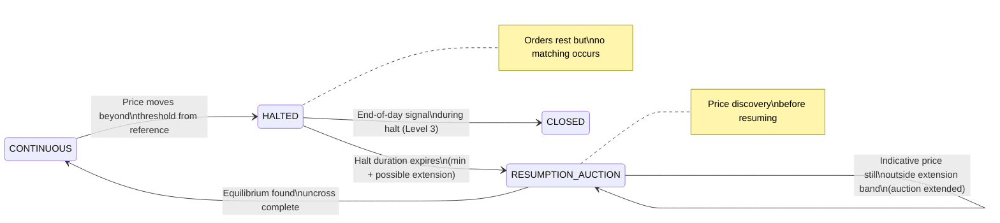
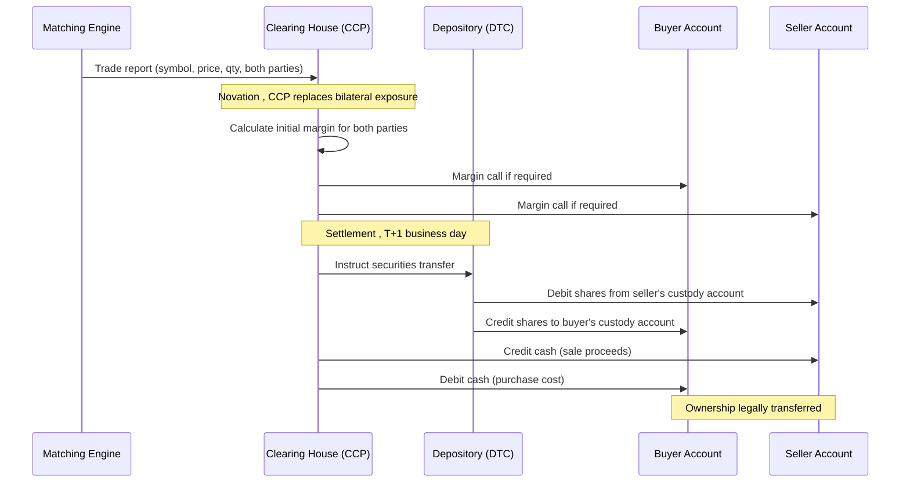
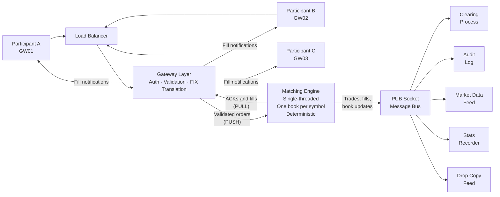
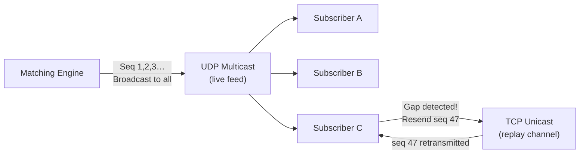
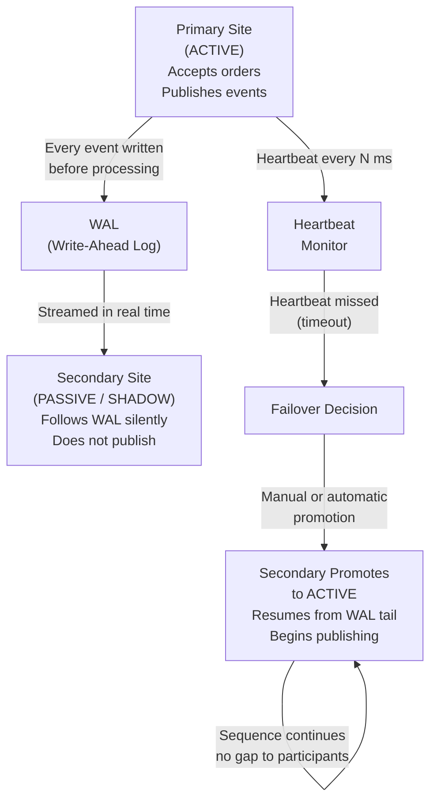

## How a Financial Exchange Works

**A Conceptual Introduction for Software Developers**

> *No code. No fear. Just the concepts you need to understand the system you are building.*

---

## Part I: Foundation , Markets, History, and Participants

*Context, vocabulary, and the people that define exchange markets , the foundation you need before the mechanics make sense.*

---

!!! note "Historic Notes"

    In 1609, a Dutch merchant named Isaac Le Maire organised a consortium of traders to sell shares in the Dutch East India Company (VOC) that they did not yet own. The plan was to drive down the price and buy the shares back cheaply before delivery, the first recorded large-scale short selling operation in financial history. The scheme was brazen enough that the Amsterdam city council attempted to ban short selling the following year. The ban failed. Le Maire was undaunted: he had grasped something fundamental about financial markets that would take regulators centuries to fully accept. Markets are not just places where things are bought and sold. They are environments in which participants constantly probe the rules, exploit information asymmetries, and invent instruments to express views that the market has never had to handle before. The job of exchange infrastructure , the order books, the matching engines, the risk controls, and the audit trails, is to provide a fair, stable, and trustworthy arena for all of this to happen, without breaking when the participants are clever, aggressive, or occasionally reckless.

    Every section of this Part can be traced, directly or indirectly, back to what was happening in Amsterdam in 1602 when the VOC issued the world's first publicly traded shares. The primary market, the secondary market, the concept of equity, the vocabulary of long and short, the role of brokers, the need for a central marketplace, it was all there, in embryonic form, four centuries ago. 
    
    Part I builds that foundation.

---


**Part Summary:**

Build the conceptual base: why exchanges exist, how capital formation connects to secondary trading, how market language evolved, and who the key participants are in modern venues.

**Learning Objectives:**

- Explain the economic purpose of exchanges in the broader capital-raising cycle.
- Distinguish primary vs secondary markets and debt vs equity at a practical level.
- Use core market vocabulary confidently in historical and modern context.
- Identify major participant types and their incentives in real-world exchange ecosystems.

**Content:**

- Before the Exchange: How Companies Raise Capital
- What Is a Financial Exchange, and Why Does It Exist?
- The Language of the Market: A Short History
- The Participants
- A Brief Tour of Real-World Exchanges


## Before the Exchange: How Companies Raised Capital


To understand why a financial exchange exists, you first need to understand why anyone bothers issuing shares in the first place. This section is a brief detour into basic corporate finance, the world your exchange is built to serve.

### The Problem of Growth

Imagine a small software company. It has a product, a team, and paying customers, but it wants to grow: hire more engineers, open offices in new countries, and invest in research that will take three years to generate revenue. All of that costs money, far more money than the company currently earns in a month or a quarter.

Where does that money come from? There are three broad categories of answer, and real companies use all three at different stages of their lives.

### Option 1: Retained Earnings (Self-Funding)

The simplest source of capital is the company's own profits. If the company earns more than it spends, it can save that surplus and invest it in growth. This is called **retained earnings**, profits "retained" in the business rather than distributed to owners.

Self-funding is attractive because it involves no outside parties and no obligations. The problem is that it is slow. If the opportunity is time-sensitive, a competitor is building the same product, or a market window is closing, waiting years to accumulate enough internal cash may mean losing the race. Most high-growth opportunities require more capital, faster, than retained earnings can provide.

### Option 2: Debt, Loans and Bonds

The second option is to borrow money. Borrowed money must be repaid, with interest [3]. The cost of borrowing (the interest rate) depends on how creditworthy the borrower is: established, profitable companies with predictable revenues can borrow cheaply; young, risky startups may not be able to borrow at all, or only at very high interest rates.

**Bank loans** are the most familiar form of debt. A company borrows a sum from a bank and repays it over time. This works well for small amounts and short timeframes, but a single bank may not be willing, or able, to provide hundreds of millions of dollars to a single borrower.

**Bonds** solve the scale problem by spreading the borrowing across many lenders. A bond is a standardised piece of debt. A company issues a bond with a **face value** (say, $1,000), a **coupon rate** (say, 5% per year), and a **maturity date** (say, 10 years from now). The investor who buys the bond lends the company $1,000 today. In return, the company promises to pay $50 per year (5% of $1,000) as regular interest payments (these periodic payments are called **coupons**, named after the physical coupon slips investors used to cut off and redeem before the digital age), and to repay the full $1,000 when the bond matures in 10 years.

A large company might issue millions of these bonds simultaneously, raising hundreds of millions of dollars from thousands of individual investors. Those investors later need to be able to sell their bonds if they want their money back before maturity, and so bonds, just like shares, trade on exchanges and electronic markets.

**The key characteristic of debt:** the company has an unconditional obligation to make the promised payments. If it cannot, it is in default, which can lead to bankruptcy proceedings. Bondholders are **creditors**: they have a legal claim against the company's assets. In a bankruptcy, creditors get paid before the company's owners.

### Option 3: Equity, Selling Ownership

The third option is fundamentally different in character: instead of borrowing money and promising to repay it, the company sells a piece of itself.

**Equity** is ownership. When a company issues **shares** (also called **stock** in American English, or **equities** in market terminology), it is dividing ownership of the business into small, standardised units and selling those units to investors [3]. Each unit, each share, represents a proportional claim on the company's assets, earnings, and future.

Here is the important distinction from debt: **there is no promise of repayment**. If you buy a share in a company, the company does not promise to give your money back. It does not promise to pay you any specific amount at any specific time. What you receive instead is ownership.

**What does ownership actually mean?**

- **Residual claim on profits:** If the company earns a profit and its board of directors decides to distribute some of that profit to owners, shareholders receive their proportional share as a **dividend**. Dividends are not guaranteed, the board may decide to reinvest profits in the business instead. But shareholders are entitled to whatever is left over after all expenses and debts are paid. This "residual" or "leftover" claim is the defining characteristic of equity.

- **Capital appreciation:** If the company grows and becomes more valuable, each share becomes worth more. A shareholder who paid $10 for a share and sells it when the company is worth twice as much can sell at roughly $20, realising a **capital gain**. The theoretical upside of an equity position is unlimited, a share can appreciate many times over (Apple has multiplied in value hundreds of times since its IPO). Compare this to a bond, where the return is capped at the promised coupon rate.

- **Voting rights:** Shares typically carry the right to vote on major corporate decisions, electing the board of directors, approving mergers and acquisitions, and other significant matters. Owning 51% of the shares means controlling a majority of votes, which is why "controlling stake" is a meaningful concept.

- **Limited liability:** If the company goes bankrupt, shareholders can lose the money they invested, but nothing more. They are not personally liable for the company's debts. This protection ("limited liability") is a fundamental feature of the modern corporation and one reason equity investment became widespread.

- **Market capitalisation (market cap):** The total market value of all a company's outstanding shares, calculated as share price multiplied by the total number of shares in existence. If Apple has approximately 15.4 billion shares outstanding and each trades at $190, Apple's market cap is roughly $2.9 trillion [1]. Market cap is the most widely used shorthand for a company's size. When rankings refer to "the world's largest exchange by listed market cap," they are summing the market caps of every company listed there.

**What does ownership mean for the company?**

Issuing equity capital has an important advantage over debt: the company is not obligated to make regular payments, and there is no maturity date on which it must repay anything. This flexibility is why many high-growth companies prefer equity, they can invest in long-term projects without the burden of fixed interest payments.

The trade-off is **dilution**: selling shares means selling a portion of the company. The founders and early investors own a smaller fraction of the whole. If a founder owned 100% of a company worth $1 million and raises $250,000 by selling a 20% stake to new investors, the company is now worth $1.25 million ($1 million of existing business value plus the $250,000 cash just raised). The founder owns 80% of $1.25 million, still $1 million in absolute terms, but a smaller fraction of the whole. The investors own 20% of $1.25 million = $250,000, exactly what they paid. Managed carefully, dilution is acceptable; managed carelessly, founders can lose control of their own companies.

**Common stock and preferred stock**

In practice, not all shares are equal. Most retail investors hold **common stock** (called **ordinary shares** in UK and European markets), which carries voting rights and a residual claim on profits. **Preferred stock** (or **preference shares**) is a different class: typically no voting rights, but a higher-priority claim on dividends and assets in a liquidation. Preferred holders are paid before common stockholders, though still after bondholders. Venture capital investors almost always receive preferred stock in early-stage companies, giving them downside protection that common stockholders lack [3].

When a company IPOs, most preferred shares convert to common shares. For exchange system developers, the class distinction matters because instruments are classified, regulated, and referenced differently. When you see "AAPL" on an exchange, it refers specifically to Apple's common stock. Preferred shares, if listed, trade under a different ticker (typically something like "AAPL-PRA").

### The Difference Between Debt and Equity

A useful mental model: when a company issues bonds, it is renting capital, borrowing it with the obligation to return it. When a company issues equity, it is selling a permanent stake, the investor becomes a partial owner, sharing in the future of the business.

The consequence:

| | **Debt (Bonds, Loans)** | **Equity (Shares)** |
|---|---|---|
| Relationship to company | Lender / Creditor | Owner |
| Return | Fixed interest (coupon) | Variable (dividends + capital gains) |
| Repayment obligation | Yes, principal returned at maturity | No |
| Payment priority in bankruptcy | Paid first | Paid last (residual) |
| Risk to investor | Lower (predictable return) | Higher (no guaranteed return) |
| Dilutes ownership? | No | Yes |
| Upside potential | Capped (only the promised coupons) | Unlimited (shares in a successful company grow without limit) |

A sophisticated investor builds a **portfolio** that mixes both: bonds for predictable income and capital preservation, equities for growth potential. The entire investment industry, pension funds, mutual funds, hedge funds, is built around managing this balance.

### Going Public: The Initial Public Offering (IPO)

Early in a company's life, its shares are held by a small, private group: the founders, early employees (who often receive shares as part of their compensation), and **venture capital (VC) investors** who provided early funding in exchange for equity stakes. These shares are not available to the general public; the company is **private**.

At some point, usually when the company has proven its business model and needs a large infusion of capital for the next phase of growth, the company may choose to **go public**: to offer its shares for sale to anyone who wants to buy them. This event is called the **Initial Public Offering (IPO)**.

In an IPO:

1. The company works with **investment banks** to **underwrite** the offering. Underwriting means the banks agree to buy all the shares at a guaranteed price and immediately sell them on. This guarantee means the company receives its cash even if investor demand is weaker than expected. In practice, the banks first conduct a **roadshow**, a series of presentations to large institutional investors, to gauge demand and set the final price. They rarely actually get stuck holding the shares.
2. New shares are created and sold, with the proceeds going directly to the company (or to early investors who are "cashing out" their stakes).
3. The company's shares are listed on a stock exchange, NYSE, NASDAQ, LSE, or another regulated market.
4. From that moment, anyone can buy or sell the shares through the exchange.

Some of the largest IPOs in history by proceeds raised illustrate the scale: Saudi Aramco raised $25.6 billion in its 2019 IPO on the Saudi Exchange (Tadawul) [1]; Alibaba raised $21.8 billion on NYSE in 2014 [1]; Arm Holdings raised $4.9 billion on NASDAQ in September 2023 [1]. Each of these companies brought enormous new pools of capital onto public markets. 

In recent times the 2026 IPO on NASDAQ for SpaceX (Symbol: SPCX) is the worlds largest IPO ever made. SpaceX was valued at approximately $1.77 trillion at IPO and went up to roughly 2.01 trillion as closing price on the first trading day, validating the IPO set price. Interesting enough the share price (initially at \$135) was not set as a "blue chip" price which traditionally means an evaluation of $\geq$ \$200 per share.

### The Primary Market vs. the Secondary Market

This distinction is critical, and it is where the exchange fits in.

The **primary market** [3] is where new securities are created and sold for the first time. In an IPO, the company sells newly issued shares directly to investors, and the company receives the money. A bond issuance is also a primary market transaction, new bonds are created and the company receives the loan proceeds.

The **secondary market** [3] is where investors buy and sell securities that already exist, trading with each other rather than with the company. When you buy shares of Apple on NASDAQ today, Apple does not receive your money. The person selling you those shares receives it. Apple issued those shares long ago; they have been trading between investors ever since.

**The stock exchange is among the primary venues of the secondary market.** It is the most visible and regulated secondary market venue, but not the only one, OTC secondary trading, private transactions, and alternative trading systems also exist. For practical purposes in this document, when we say "the exchange," we mean a regulated, centralised lit venue; this is where the concepts of price-time priority, order books, and matching engines apply most directly.

This insight is important: the exchange does not help companies raise money directly. It helps investors trade securities they already own. But without the secondary market, the primary market would barely function. Here is why:

Who would invest in a company's IPO if they knew they could never sell their shares? Who would buy a 10-year bond if they had to hold it for exactly 10 years with no way out? The existence of a liquid secondary market, a place where you can sell whenever you want at a fair price, is what makes investors willing to commit capital to companies in the first place. The exchange provides the exit. And the availability of an exit enables entry.

**The primary market and secondary market form a virtuous cycle:**

- Companies raise money in the primary market because investors are willing to commit capital.
- Investors commit capital because the secondary market lets them exit when they choose.
- The secondary market functions well because many investors participate.
- Many investors participate because companies with real value list their shares there.

The stock exchange, the subject of this entire document, is the infrastructure that makes this cycle turn.

```{.mermaid width=400}
flowchart TD
    CO["🏢 Company"]
    PM["Primary Market\nIPO / follow-on offering\nCompany receives cash"]
    EX["Stock Exchange\nSecondary Market"]
    INV["Investors\nBuyers and Sellers"]

    CO -- "Issues new shares" --> PM
    PM -- "Shares delivered to first investors" --> INV
    INV -- "Buy and sell shares\namong themselves" --> EX
    EX -- "Price discovery\nand liquidity" --> INV
    EX -. "No cash flows back\nto the company" .-> CO
```

### A Word on Other Instruments

The same framework applies to other instruments:

- **Bonds** trade on bond markets (some exchange-based, others over the counter) after issuance. Investors can sell their bonds before maturity, receiving the current market price rather than waiting for repayment.

- **Futures and options** are not claims on existing assets at all, they are contracts about future transactions [12] [13]. Their markets have their own logic, but the exchange's role (centralised matching, price discovery, fairness) is the same. 

- **Exchange-Traded Funds (ETFs)** are baskets of shares (or bonds, or commodities) that themselves trade as a single share. iShares, Vanguard, and SPDR products are examples. ETFs trade on exchanges exactly like individual stocks.

- **Market indices** are calculated measures of the aggregate performance of a defined basket of securities. The **S&P 500** tracks 500 large US companies and is the most closely followed equity index in the world, first published in its current form by Standard & Poor's in 1957. The **Dow Jones Industrial Average (DJIA)**, dating to 1896, tracks 30 large US companies. The **NASDAQ Composite** tracks all stocks listed on NASDAQ. Indices themselves are not directly tradeable, but **index futures** (on CME), **index options** (on Cboe), and **index ETFs** allow investors to trade the performance of a whole index with a single instrument. When a portfolio manager says "the market is up 0.8% today," they almost always mean the S&P 500. When exchange system developers build risk calculations or position monitors, index levels are frequently the benchmark against which positions are marked.

With this foundation in place, understanding what a share is, why companies issue them, and what role the exchange plays, we can now look at the mechanics of how an exchange actually operates.


## What Is a Financial Exchange, and Why Does It Exist?


### The Core Problem

Imagine you own 1,000 shares of a technology company (you understand now what that means: you own a tiny fraction of that company, acquired when you bought the shares from a previous owner on the secondary market) and you want to sell them. Somewhere out there, someone wants to buy exactly 1,000 shares of that same company at roughly the price you have in mind. The problem is finding each other.

Before modern exchanges existed, this "finding" problem was enormous. Stock trading happened in coffee houses, in the street ("Exchange Alley Coffeehouses"), or through networks of personal contacts. One of the first places on record was "Jonathan's Coffee House" (The Forerunner to the London Stock Exchange) founded around 1680 by Jonathan Miles, Jonathan's became the primary gathering place for stock brokers, [Jonathan's Coffee-House](https://grokipedia.com/page/Jonathan's_Coffee-House).  Prices were inconsistent, you might sell at one price while, moments later, someone else sold the same shares at a very different price. There was no guarantee you were getting a fair deal, and there was no way to know what "fair" even meant.

> **Auctions by the Candle**
>
> Garraway's Coffee House was opened by Thomas Garway and famed for being the first place in England to retail tea (in 1657). It was quickly rebuilt on a grand scale after the 1666 Great Fire. While Jonathan's focused heavily on shares, Garraway's specialised in commodities, hosting the Hudson's Bay Company's first fur auction in 1671 and later auctioning Australian wool.
>
> Garraway's was legendary for its unique bidding system: an auctioneer would light an inch of tallow candle, and the last bid placed before the flame flickered out won the goods. [Candle Auction](https://en.wikipedia.org/wiki/Candle_auction)

The golden era of the informal Exchange Alley coffeehouses came to a catastrophic halt on March 25, 1748, when a massive fire broke out in Cornhill, destroying Jonathan's, Garraway's, and nearly 100 surrounding buildings. Though both shops were eventually rebuilt, the financial markets were rapidly moving toward formal, dedicated corporate buildings, leaving the casual coffeehouse model behind. 

A financial exchange solves this problem by acting as a **centralised marketplace**, a single place where all buyers and sellers come together, where prices are visible to everyone, and where agreed rules govern who trades with whom at what price. The NYSE was founded in 1792 under a buttonwood tree on Wall Street [10]; NASDAQ launched in 1971 as the world's first electronic stock market [10]. Both exist to solve the same fundamental problem: matching buyers with sellers fairly and efficiently.

It is worth noting that exchanges are among the most visible matching venues, but not the only ones. **Over-the-counter (OTC) markets** (where participants negotiate directly), **Alternative Trading Systems (ATSs)**, **Electronic Communication Networks (ECNs)**, and **internalisers** (brokers who match client orders internally against their own inventory) all also match trades. The concepts in this document apply most directly to regulated exchanges, but the same vocabulary, order book, spread, price-time priority, is used across all these venues.

### The Three Promises of an Exchange

Every exchange makes three implicit promises to its participants:

**1. Price discovery.** At any moment, the current price of an asset reflects the aggregate opinion of all participants currently willing to trade it. You can look at the market and see what "fair value" is right now.

**2. Liquidity.** You can convert your asset into cash (or vice versa) quickly, without having to wait indefinitely for a counterparty to appear. The exchange provides the infrastructure that makes counterparties findable.

**3. Fairness and transparency.** The rules for who trades first and at what price are known in advance, applied consistently, and visible to all participants equally. There is no backroom dealing.

### How Exchanges Are Regulated

Exchanges do not operate by custom alone. They are licensed and supervised by government regulators whose rules directly shape how exchange systems are designed and built.

In the United States, equity exchanges are overseen by the **Securities and Exchange Commission (SEC)**, established by the Securities Exchange Act of 1934 in the aftermath of the 1929 crash and subsequent Great Depression. The crash and its causes deserve a sentence of context here, because they explain why the SEC's mandate is what it is.

Between 1928 and September 1929, the US stock market had doubled. Investors were buying heavily on **margin**, borrowing money to buy more stock than they could afford outright. When prices began to fall in October 1929, margin calls forced widespread selling. Selling drove prices lower, which triggered more margin calls, which drove more selling , the same feedback loop that automated portfolio insurance would recreate in 1987. The Dow Jones Industrial Average fell 89% from its 1929 peak to its 1932 trough. Thousands of banks failed. Millions lost their savings. The subsequent investigation found rampant stock manipulation, insider trading, misleading corporate disclosures, and conflicts of interest at every level of the market. The Securities Act of 1933 and the Securities Exchange Act of 1934 were Congress's direct response: transparency requirements, registration of securities, prohibition of fraud, and the creation of the SEC to enforce the rules. The exchange system you are building operates under the regulatory framework those 1930s laws set in motion.

Several regulations appear throughout this document and in most exchange codebases. It is worth naming them here:

- **Regulation NMS (National Market System, 2005):** Requires that equity orders receive the nationally best available price across all registered trading venues. This single rule is the reason the US has 16+ registered equity exchanges competing for order flow, and the reason **smart order routing** exists , brokers must route to wherever the best price is, not just the closest or the cheapest.

- **Regulation SHO (2005):** Governs short sales, including the **locate** requirement (broker-dealers must verify shares can be borrowed before accepting a short sale order) and delivery obligations.

- **Market Access Rule (Rule 15c3-5, 2010):** Requires broker-dealers providing market access to have pre-trade risk controls: maximum order sizes, credit limits, and kill switches. Enacted directly in response to the 2010 Flash Crash.

In Europe, the equivalent framework is **MiFID II (Markets in Financial Instruments Directive II, 2018)**, which mandates best execution, algorithmic trading controls (including mandatory kill switch testing), trade reporting, and systematic internaliser reporting. Any exchange system intended to operate in EU markets must comply.

Understanding which regulator and which rules apply is not just a legal matter. It is an engineering specification: audit trail formats, kill switch accessibility, pre-trade check requirements, and market data publication rules are all regulatory mandates, not optional features.

### Instruments: What Is Being Traded?

An exchange does not trade "things" in a physical sense. It trades **instruments**, standardised financial contracts representing ownership or obligation. The most common are:

- **Equities (stocks):** A share represents a small piece of ownership in a company. When you buy one share of Apple (ticker symbol: AAPL), you own a tiny fraction of Apple Inc. NYSE and NASDAQ are primarily equity exchanges.

- **Futures contracts:** An agreement to buy or sell something (oil, gold, a stock index) at a specified price on a specified future date. CME Group is one of the world's largest futures exchanges.

- **Options:** The right (but not the obligation) to buy or sell an instrument at a specific price before a specific date. Cboe is a major options exchange.

- **Foreign exchange (FX) pairs:** The price of one currency expressed in another, such as EUR/USD (how many US dollars one Euro buys). FX trades largely on electronic networks rather than centralised exchanges, though the principles are similar.

An equity exchange handles each **symbol** (like AAPL, MSFT, or TSLA) as a separate tradeable instrument, each with its own independent order book.


## The Language of the Market: A Short History


Before you read about participants, orders, and matching engines, it is worth pausing on something that will serve you well throughout your career working on exchange systems: **much of the language you will encounter in this codebase has historical roots that no longer match the physical reality**. Terms that sound arbitrary or old-fashioned are fossil words, the language of a world of wooden desks, brass bells, and paper ledgers that gradually evolved into the nanosecond world of today. Understanding where the words came from will make them stick, and will save you from wondering why a system full of cutting-edge software keeps referring to things like "the book," "the tape," and "the floor."

### The Physical Book

Before electronic trading systems, every major exchange operated a physical trading floor, and on that floor, for every stock, there was a person responsible for maintaining order: in NYSE's terminology, this was called the **specialist**. The specialist's job was to act as a market maker for their assigned stocks, and to maintain, literally on paper, a record of every outstanding buy and sell order that had been submitted but not yet filled.

This record was kept in a physical **ledger book**. The book was divided into two columns: one for buy orders (bids) listing each buyer's offered price and quantity, and one for sell orders (asks) listing each seller's demanded price and quantity. The specialist would review the book, try to match buyers with sellers, and maintain an orderly market by quoting prices to floor brokers who came to trade.

When a broker wanted to buy shares and asked "what's the market in IBM?", the specialist would look at their book and say, for example, "fifty-five for five hundred, five hundred at fifty-five and a quarter", meaning the best available buyer was offering $55 for 500 shares, and the best available seller was asking $55.25 for 500 shares. The specialist was reading, live, from their paper book.

The physical book is gone. Every exchange in the world now maintains its order book in computer memory, with data structures designed for nanosecond access. But the **name** has survived completely intact. When developers and traders today say "the book," "working an order into the book," "resting in the book," or "taking from the book," they are using the exact same language that floor traders used when pointing at a physical ledger. The order book is one of the purest examples of terminology that crossed from physical to digital without losing a syllable.

### Open Outcry and the Pit

On exchange floors like CME Group's in Chicago, trading in futures contracts was conducted through **open outcry**, a method where traders stood in a sunken circular area called a **pit** and literally shouted their bids and asks at each other, using a combination of voice and hand signals to communicate price, quantity, and direction. The noise was enormous. The system worked because the pit was small enough that everyone could hear and see everyone else.

The CME Group operated open outcry pits for decades. Some products, particularly certain agricultural and options contracts, continued in open outcry long after equity markets went fully electronic, largely because the pit handled complex, illiquid products where human negotiation had genuine advantages. CME substantially wound down its open outcry operations in 2015 [9], though some niche trading still occurs. The physical pit is where terms like "floor broker" (a broker who executes trades on the physical floor), "floor trader" (a trader who trades for their own account from the floor), and "pit committee" originated.

The terms survive in documentation, regulations, and informal industry speech even though the pits themselves are mostly silent now.

### The Ticker Tape

Before electronic screens, prices of completed trades were published via the **stock ticker**, a telegraph-based machine, invented by Edward Calahan in 1867 [15] and later improved by Thomas Edison, that printed a continuous stream of abbreviated stock symbols and trade prices on a narrow paper tape. The tape moved fast (hence "ticker", the machine made a ticking sound) and the strip of paper would pile up on the floor of brokerages around the country as trades printed in real time.

Reading the tape was a skill. A **tape reader** was someone who could watch the continuous stream of prices and volumes and infer what institutional buyers and sellers were doing, one of the earliest forms of technical analysis. An even earlier form of market observation appears in Joseph de la Vega's *Confusión de Confusiones* (1688) [4], the oldest known book about stock trading, written in Amsterdam about the VOC share market, which describes participants reading order flow and inferring intent from patterns of buying and selling.

In 1878, the phone was invented. In 1929, the first electronic ticker was installed. By the 1960s, electronic displays began replacing paper. Today, the "ticker" refers to the digital price feeds streaming across screens in every trading firm, brokerage, and financial news channel, and the **ticker symbol** (AAPL, MSFT, GOOG) is the abbreviated code printed on the old paper tape.

When you see terms like "tick" (the minimum price movement), "tick data" (a record of every trade), or "ticker plant" (the server infrastructure that publishes market data), you are using the language of a machine that ran on telegraph cables and printed on paper strips.

### The Language Lives in the Code

These historical terms are not just in trading rooms and textbooks. They are in the source code. A developer reading an exchange codebase for the first time will find:

- `bid_price`, `ask_price`, `spread` , the physical ledger's two columns, reduced to struct fields
- `lot_size`, `tick_size` , the standardisation introduced by the early commodity pits
- `aggressor_side` , which party crossed the spread; matters for fee calculation and regulatory reporting
- `book.add_order()`, `book.cancel_order()`, `book.sweep()` , the specialist's actions, now function calls
- `GTC`, `DAY`, `IOC` , time-in-force codes whose full names (Good-Till-Cancelled, Day, Immediate-or-Cancel) are rarely spoken, used daily in hundreds of millions of orders
- `tape_price`, `last_trade_price` , what the ticker printed, now a field in a trade record
- `long_position`, `short_position` , the Amsterdam merchant's grain warehouse, abstracted to a signed integer

Every time you read a function name or a variable name in exchange software that sounds like it belongs in a different century, it does. The codebase is the physical exchange, translated.

### Black Monday and the Origin of Circuit Breakers

On 19 October 1987, US stock markets fell **22.6%** in a single day, the largest single-day percentage drop in the history of the Dow Jones Industrial Average. This event, known as **Black Monday**, remains the most severe one-day market crash on record. A more detailed account of this is described in secion [18.4 Historical circuit breaker](03-PART%20III%20-%20Risk%20and%20Compliance.md#historical-circuit-breaker)

The crash was not driven by a single piece of bad news. It was amplified by automated **portfolio insurance** programmes, algorithmic selling strategies designed to protect institutional portfolios by automatically selling futures contracts as prices fell. As these programmes sold, prices fell further, triggering more programme selling, which pushed prices further down , a feedback loop that human traders could not interrupt. The lack of any coordinated mechanism to pause trading made the spiral self-reinforcing.

The Presidential Task Force on Market Mechanisms (the "Brady Commission"), reporting to President Reagan in January 1988, concluded that the absence of circuit breakers and coordinated pause mechanisms across markets had allowed the panic to become catastrophic. Its central recommendation was explicit: create automatic trading halts that could interrupt the feedback loop and give participants time to assess [Brady Commission Report, January 1988].

NYSE introduced the first market-wide circuit breakers in 1988 directly in response. The specific thresholds have been adjusted several times since (most recently after March 2020, when Level 1 was triggered four times in two weeks during the COVID-19 crash), but the mechanism traces directly to that January 1988 report.

This history matters for exchange system developers because circuit breakers are not bureaucratic decorations. They are the engineering response to a proven systemic failure mode: automated systems amplifying each other into a catastrophic spiral. Every halt threshold, every resumption auction, every "do not accept orders during HALTED state" condition in a matching engine exists because of what happened on 19 October 1987.

### Settling Up: Settlement Periods and Why They Exist

The historical reason settlement took multiple days has nothing to do with technology and everything to do with physical logistics. In the era of paper stock certificates, when you sold your shares, you had to physically deliver a paper certificate to the buyer, and they had to physically deliver cash or a cheque to you. Messengers on bicycles carried these documents between brokerage firms on Wall Street. Giving everyone five business days (the original settlement period was T+5) provided time for paperwork to move across Manhattan, be checked, and be processed.

As the industry moved to dematerialisation (electronic records replacing paper certificates) and electronic funds transfer, settlement windows shrank: T+5 became T+3 in the 1990s, T+2 in 2017, and T+1 in 2024 in the US [8]. The "T+N" notation remains standard even as the N shrinks. Some markets are exploring same-day (T+0) settlement, though this requires that cash and securities be available at the exact moment of trading, a more demanding operational requirement.

### The Bid, the Ask, and the Spread

The two most fundamental prices in any market are the **bid** and the **ask** (also called the **offer** in some contexts). These are ancient words in the context of markets.

**Bid** comes from Old English *beodan*, meaning to announce, command, or offer. To bid for something is to announce the price you are willing to pay. A bidder at an auction makes a bid; a trader in a market makes a bid. The word has been used in commercial contexts for over a thousand years.

**Ask** (or offer) is the counterpart: the price at which someone is willing to sell. Asking a price for goods is as old as commerce.

The **spread** is the difference between the best bid and the best ask at any moment: if the best bid is $150.30 and the best ask is $150.35, the spread is $0.05. The spread is both a measure of market quality (tight spreads mean the market is liquid and efficient; wide spreads mean it is illiquid or uncertain) and the primary source of income for market makers, who earn the spread by continuously standing ready to buy at the bid and sell at the ask.

The phrase **"crossing the spread"** means submitting an order aggressive enough to immediately match against a resting order. An investor who submits a buy order at $150.35 (the ask) rather than waiting at $150.30 (the bid) is crossing the spread and paying for the privilege of immediate execution. This small payment , a few cents, or a fraction of a cent in liquid markets , is the cost of immediacy, and it is the foundation of the market maker's business model.

### Blue Chips, Bulls, and Bears

Not all inherited terminology has to do with physical infrastructure. Some comes from adjacent worlds:

**Blue chip** stocks are large, well-established, financially sound companies, the most prestigious tier of the equity market. The term comes from poker: in casino chips, blue has traditionally been the highest denomination. The first recorded use in finance was by Oliver Gingold at Dow Jones in 1923, who described stocks trading at $200 or more per share as "blue chip stocks." [14]

**Bull market** (rising prices) and **bear market** (falling prices) have disputed origins, but the most widely cited explanation refers to how each animal attacks: a bull thrusts its horns upward, a bear swipes its paws downward. The terms appear in financial writing as early as the 18th century. Today, a market that has fallen 20% or more from a recent peak is formally defined as a bear market; a sustained rise of 20% or more from a trough is a bull market.

**Going long** and **going short** have roots far older than stock markets. Their origin lies in the physical trade of commodities, grain, spices, metals, cloth, timber, and other durable goods, that dominated commerce for centuries before financial securities existed.

A merchant in a 17th-century Amsterdam or London trading house who had purchased a large stock of grain and was storing it in a warehouse was described as being **long** in grain [4]. The word captured two ideas simultaneously: first, that they *possessed* the goods, they owned something tangible, in their hands, in their warehouse; and second, that durable goods could be held *over time*. Grain kept through winter. Spices kept for years. Metal did not spoil. A merchant who was "long" in such goods had an inventory that would *last a long time*, goods with longevity. The root connection is direct: long as in duration, as in possession extended through time.

This is still exactly what "going long" means in modern finance: you own the asset and you are exposed to its price over time. If you buy shares of a company and hold them, you are long those shares. If the price rises, your long position profits; if it falls, it loses. Nothing about the meaning has changed, only the asset has shifted from sacks of grain in a warehouse to electronic records in a clearing house.

**Going short** comes from the opposite situation: a merchant who had promised to deliver goods they did not yet possess. In forward contracts, common in the grain and commodity markets of the 17th and 18th centuries, a seller would commit to deliver a quantity of goods at a future date and price. If they had sold more than their warehouse contained, they were "short" of the goods, deficient, lacking, falling short of their obligations. The same word family as "we are short of supplies," "he fell short of expectations," or "shortage." Being short meant your inventory was insufficient to cover what you had committed to deliver. You would need to go into the market and buy before the delivery date, hoping prices had fallen so you could profit on the difference.

The Dutch East India Company (VOC), founded in 1602 and traded on the Amsterdam Exchange from that same year, pioneered many instruments still in use today, transferable shares, dividend payments, and the secondary market in those shares [5] [11], and became the arena for what is likely the first recorded large-scale short selling operation in financial history: in 1609, a merchant named Isaac Le Maire organised a group of traders to sell VOC shares they did not own, betting the price would fall so they could buy them back cheaply before delivery [5]. The scheme was disruptive enough that the Amsterdam city council attempted to ban short selling the following year, the earliest known attempt to regulate the practice [5]. It did not stick; short selling has been controversial, periodically banned, and always present in markets ever since.

"Long" and "short" thus carry the physical memory of a world where trading meant moving real goods between warehouses and ships. A developer reading `last_sell_price` or `position += signed_qty` in the matching engine's clearing code is working with concepts that a 17th-century spice merchant would have recognised immediately, even if the technology would be unrecognisable to them.

### The Operational Mechanics of Short Selling, Borrow and Locate

The historical explanation above describes the *economics* of short selling. The modern operational reality involves several additional steps that are invisible in the exchange's order book but fundamental to how clearing and settlement actually work.

**You must borrow before you short.** Before a participant can sell shares they do not own, they must first arrange to borrow those shares from someone who does own them. This is called the **locate** process, finding and reserving a source of borrowable shares. In the US, Regulation SHO (adopted by the SEC in 2005) mandates that broker-dealers must have a reasonable grounds to believe shares can be borrowed before accepting a short sale order. Selling short without a locate is called **naked short selling** and is generally illegal.

**Where the borrow comes from.** Shares available to borrow come primarily from long investors who hold shares in custody through a broker or prime broker. These holders consent (usually automatically through their account agreements) to their shares being lent out in exchange for a **lending fee**. The custodian or prime broker intermediates: they find willing lenders and lend the shares to the short seller. The short seller pays a daily lending fee (the **borrow rate**) while the position is open.

**Borrow rates and hard-to-borrow stocks.** Most large-cap, liquid stocks are "easy to borrow", borrow rates are near zero because many shares are available. Smaller, heavily-shorted, or thinly-traded stocks can be "hard to borrow", rates of 5%, 20%, or even higher per annum, applied daily. For a stock with a 50% annualised borrow rate, a short position held for one week costs roughly 1% just in borrowing costs, before considering any price movement. The difficulty of finding borrows can itself become a market signal: rising borrow rates indicate increasing short interest and limited available supply.

**Short recall risk.** The lender can recall their shares at any time (with short notice). If the lender sells their shares or instructs their custodian to recall the loan, the short seller must return the shares immediately, either by buying in the open market (a **buy-in**) or finding a new lender. In volatile markets, recalls at inopportune moments can force short sellers to cover at bad prices.

**Settlement obligation.** At settlement (T+1 in the US), the short seller must deliver the shares. They do not own them, they borrowed them. Their clearing position shows a negative (short) holding. The CCP ensures delivery; if the short seller fails to deliver, the failed settlement process applies.

**Why this matters for exchange developers.** The exchange's matching engine processes short sales exactly like any other sell order, the distinction between a short sale and a long sale is invisible at the order book level. The matching engine does not know or care whether the seller owns the shares. The borrow and locate process happens entirely outside the exchange, in the prime brokerage and custody infrastructure. However, exchange reporting systems are required to flag short sales (in the US, short sale orders must be marked "short" in the FIX message and this appears in the audit trail), and some regulatory checks at the gateway level confirm the short sale flag is present.


### Wall Street

**Wall Street** is named after an actual wall, a wooden palisade built in 1653 by Dutch colonists along the northern edge of their settlement (then called New Amsterdam, now Lower Manhattan) to protect against British and Native American incursions. The wall is long gone; the street that replaced it became the financial centre of America, and now "Wall Street" is a metonym for the entire US financial industry, regardless of where the actual firms are physically located.

### Why This Matters for You

When you encounter a term in the codebase that seems oddly concrete for a piece of software, "the book," "the tape," "the spread," "the floor price," "tick by tick", the reason it sounds physical is that it *was* physical. These words have been used continuously, with the same meanings, through every technological revolution the industry has undergone, because the underlying concepts remained constant even as the implementation changed completely.

This is also why you will find financial terminology resistant to renaming even when better alternatives exist. Saying "priority queue" instead of "the book" would be technically precise but professionally unintelligible. Finance is a conservative industry with deep institutional memory, and the vocabulary is part of that memory. Learning the words, and where they came from, is learning the culture.


## The Participants


Before diving into mechanics, it helps to know who is actually in the room.

### Traders and Investors

The broadest category of participant is anyone who buys or sells for themselves, whether they are profit-seeking or managing risk.

**Retail investors** are individuals trading their own money, typically through brokerage apps (Robinhood, Fidelity, Schwab, eToro). Retail orders tend to be small (a few hundred shares at most), arrive randomly throughout the day, and , critically , are considered **uninformed flow** by market makers, meaning they are statistically unlikely to be based on superior information about the company's near-term prospects. Retail flow is therefore profitable to serve: the spread can be captured with low adverse selection risk.

**Institutional investors** are organisations managing money on behalf of others: pension funds, mutual funds, hedge funds, insurance companies, sovereign wealth funds, endowments. They trade in sizes that can move markets , a pension fund rebalancing its portfolio may need to buy or sell millions of shares over days or weeks without moving the price against itself. Their orders are typically routed through execution desks that use VWAP algorithms, dark pools, and smart order routing to minimise market impact. The largest institutional investors (BlackRock manages over $10 trillion in assets [1]) have more market influence than many sovereign nations.

The distinction between retail and institutional matters for exchange designers because the two populations have different latency tolerances, different order sizes, different information sets, and different legal frameworks governing their trading. Payment for Order Flow (PFOF) exists because retail flow is genuinely more profitable to service than institutional flow, and this shapes the routing decisions of retail brokers.

In exchange terminology, when a participant submits an aggressive order that immediately executes against a resting order in the book, they are called a **taker** , they are "taking" liquidity that was already available. The participant whose resting order was filled is the **maker** (they "made" liquidity available).

### High-Frequency Trading (HFT) and Proprietary Trading Firms

A distinct and important participant type that does not fit neatly into the retail/institutional or maker/taker classification is the **high-frequency trading (HFT) firm** and broader class of **proprietary trading firms** (often called "prop shops").

These firms trade entirely for their own account, with their own capital, using automated strategies. They do not manage client money and do not act as brokers. Well-known firms include Citadel Securities, Virtu Financial, Jane Street, Jump Trading, and IMC. Some (like Citadel Securities and Virtu) are primarily market makers; others run arbitrage and statistical arbitrage strategies.

HFT firms are estimated to account for approximately 50% of equity trading volume on US exchanges [1], and a significant portion of derivatives volume. They make markets extremely tight (narrow spreads) in liquid products because competition between HFT market makers is intense. They also create controversy: critics argue that latency arbitrage gives them an unfair structural advantage over slower participants; defenders argue that their market making activity lowers costs for everyone.

For exchange developers, HFT firms are the most technically demanding participants. Their latency requirements drive the design of co-location services, the nanosecond timestamping standards, and the deterministic processing guarantees that define high-performance matching engine architecture. When an exchange system must process millions of messages per second with microsecond response times, it is largely because HFT participants require it.

### Market Makers

This is a concept worth understanding deeply, because it is central to how exchanges actually work in practice, and because the exchange system you are building contains a significant amount of code dedicated specifically to managing market makers.

A **market maker** is a professional participant who continuously quotes both a buy price and a sell price for an instrument. They are simultaneously willing to buy from anyone who wants to sell, and to sell to anyone who wants to buy. In exchange for taking on this obligation, they earn the **spread**, the small gap between the price they will buy at and the price they will sell at. Market makers are the reason you can usually buy or sell a stock immediately without waiting for a human counterparty to appear. Their standing orders are already in the book, waiting.

NYSE has what it calls **Designated Market Makers (DMMs)**, specific firms assigned to each stock with obligations to maintain fair and orderly markets. Nasdaq calls them **Market Makers**. Eurex, the European derivatives exchange, runs a formal **Market Making Programme** with contractual quoting obligations. When a market maker's resting order is later filled by someone else's incoming order, the market maker is called a **maker** (they "made" liquidity available). The person whose order triggered the fill is the **taker**. Exchanges frequently give makers a fee rebate and charge takers a fee, to incentivise the provision of liquidity.

> **Key idea:** Market makers earn the spread by continuously providing two-sided quotes, a standing bid and ask, making it possible for others to trade immediately at any time. They are not passive: their position changes with every fill, and they must manage inventory and information risk in real time. The *Market Makers* section of Part II examines the full operational detail: formal obligations, what happens when a quote is hit, protection mechanisms, and the software implications of supporting them.

### Brokers

**Broker** itself is an old word. The word "broker" traces back to Middle English (brocour) and Anglo-Norman (abrocour), originally referring to a middleman, small trader, or wine merchant. It referred originally to a person who "broaches" (opens) a cask and sells the wine retail, an intermediary between producer and consumer. By the late medieval period it had generalised to any trade intermediary, and it has carried that meaning into finance.

A broker does not trade for their own account. They act as an intermediary: they receive orders from clients and submit them to the exchange on the client's behalf. Retail brokerages (Fidelity, Schwab, eToro) aggregate small orders from millions of individuals. Institutional brokers (Goldman Sachs, Morgan Stanley, JPMorgan) execute large block orders for institutional clients with minimum market impact.

**Prime brokers** are a specific tier of broker providing a package of services to sophisticated clients, primarily hedge funds: securities lending (enabling short selling), leveraged financing, consolidated clearing and custody across multiple brokers, and sometimes execution services. Without a prime broker relationship, a hedge fund could not efficiently short sell or use leverage. The major prime brokers are divisions of the large investment banks.

### The Exchange Itself

The exchange is not a passive infrastructure provider. It is a regulated entity that enforces rules, monitors for manipulation, reports trades to regulators, and ensures the market functions fairly. In many jurisdictions, exchanges are themselves public companies listed on exchanges (NYSE's parent company, ICE, is listed on NYSE; NASDAQ lists on Nasdaq).

A significant historical shift: exchanges used to be **member-owned mutuals**, non-profit organisations run for the benefit of their broker-dealer members. Over the past 30 years, most major exchanges have **demutualised**, converting to for-profit public companies. NYSE demutualised and listed in 2006; London Stock Exchange demutualised in 2001. This shift changed the incentive structure of exchanges: they now compete for order flow and listing fees, and their technology investment decisions are driven partly by shareholder returns.

### Regulators

Regulators are not participants in the traditional sense, they do not submit orders, but they are the most consequential stakeholders in exchange system design. Every audit trail format, kill switch requirement, pre-trade check, and trade report exists to satisfy a regulatory obligation.

In the US, the **SEC** oversees equity exchanges and broker-dealers. The **CFTC** oversees futures and derivatives exchanges. **FINRA** (Financial Industry Regulatory Authority) is a self-regulatory organisation that oversees broker-dealers. Exchanges themselves are also self-regulatory organisations (SROs): they have obligations to monitor their own markets and report suspicious activity.

Internationally: the **FCA** (Financial Conduct Authority) in the UK, **ESMA** (European Securities and Markets Authority) and national regulators under MiFID II in the EU, the **FSA** in Japan, the **SFC** in Hong Kong, and ASIC in Australia.

For exchange developers, the practical implication is that regulatory requirements are non-negotiable features. A matching engine that produces a legally insufficient audit trail is not a working matching engine, regardless of its throughput. Understanding which regulator and which ruleset governs a given exchange is part of the technical specification.

> **Note, quotes vs orders:** Throughout this document, the terms "order" and "quote" are sometimes used to describe resting instructions in the book. Operationally they are different: a **quote** is a two-sided bid/ask pair submitted by a market maker (a single instruction generating two linked legs), while an **order** is a one-sided instruction submitted by any participant. A quote may internally generate one or two order records with linked identifiers; quote IDs and order IDs may differ. The *Market Makers* section of Part II covers this distinction in detail.


## A Brief Tour of Real-World Exchanges


To ground these concepts in reality, here is a brief overview of the exchanges most relevant to exchange system developers.

### NYSE (New York Stock Exchange)

Founded in 1792, NYSE is the world's largest equity exchange by market capitalisation of listed companies. Its founding is traced to the **Buttonwood Agreement** of 17 May 1792, when 24 stockbrokers signed a document under a buttonwood tree on Wall Street agreeing to trade securities only among themselves and at fixed commission rates [10]. This agreement established the principle of a closed, rule-governed professional market , the model that all regulated exchanges follow today.

NYSE is a **hybrid market**: it combines electronic order matching with **Designated Market Makers (DMMs)** who have responsibilities to maintain fair and orderly markets and can intervene manually in certain situations. NYSE uses price-time priority and runs opening and closing auctions. Its closing auction is among the most important pricing events in global finance, determining the official closing prices that benchmark trillions of dollars of fund performance.

Despite being the iconic "stock exchange," NYSE handles only a fraction of total US equity volume. Due to fragmentation under Reg NMS, NYSE typically accounts for roughly 20–25% of US equity volume [1]; the rest routes to NASDAQ, Cboe, and dozens of other venues. This is not a sign of weakness , it reflects the fragmented, competitive nature of modern US equity markets.

### NASDAQ
NASDAQ launched in 1971 as the world's first fully electronic stock exchange. It is home to many of the world's largest technology companies (Apple, Microsoft, Amazon, Google). NASDAQ is a pure electronic market, no floor traders, no DMMs in the traditional sense. It pioneered the technology approach to exchange operation and drove down transaction costs dramatically.

### CME Group (Chicago Mercantile Exchange)
CME Group is the world's largest futures exchange, operating CME, CBOT (Chicago Board of Trade), NYMEX, and COMEX. Futures contracts on everything from interest rates to agricultural commodities to weather indices trade here. CME uses the Globex electronic trading platform, which processes millions of orders per day. CME uses both price-time priority and pro-rata allocation depending on the product.

### Eurex
Part of Deutsche Börse Group, Eurex is Europe's largest derivatives exchange, headquartered in Frankfurt. Eurex is known for its sophisticated market making programmes and its strict but fair treatment of high-frequency trading. The Eurex T7 trading system is used by multiple exchanges globally. Eurex introduced the concept of formally structured market maker obligations with MMP protection.

### LSE (London Stock Exchange)
The LSE is one of Europe's oldest exchanges, dating to the 17th century coffee houses. It trades equities, bonds, and ETFs. The LSE uses the SETS (Stock Exchange Electronic Trading System) for liquid equities and runs opening and closing auctions. The LSE's Millennium Exchange technology platform is used by dozens of exchanges globally.

### Euronext

Euronext is Europe's largest exchange group by number of listed companies, operating markets in Amsterdam, Brussels, Paris, Lisbon, Dublin, Oslo, and Milan. Originally formed in 2000 by the merger of the Paris, Amsterdam, and Brussels exchanges, it expanded significantly through subsequent acquisitions including the Milan Stock Exchange (Borsa Italiana) in 2021. Euronext uses the **Optiq** trading platform and operates under MiFID II. Its Amsterdam exchange is historically notable as the successor to the world's first stock exchange (the Amsterdam Exchange, 1602).

### Nasdaq Stockholm (Stockholmsbörsen, STO)

Nasdaq Stockholm is Sweden's primary regulated securities exchange and one of the core venues in the Nordic region. The original Stockholm Stock Exchange dates to 1863, and the modern market became part of the Nasdaq group through Nasdaq's acquisition of OMX in 2008. Today, Nasdaq Stockholm operates as part of the wider Nasdaq Nordic market structure alongside Copenhagen, Helsinki, and Icelandic venues.

For exchange developers, Nasdaq Stockholm is a useful real-world reference because it combines deep local equity liquidity with a highly standardised pan-Nordic technology model. The market is fully electronic, supports auction phases (including opening and closing auctions), and runs under the same MiFID II transparency and best-execution regime as other EU venues.

The venue's best-known benchmark is the **OMXS30** index, which tracks the 30 most traded shares on Nasdaq Stockholm. The exchange is the home listing venue for many major Swedish and Nordic companies, including names such as Ericsson, Volvo, Atlas Copco, and Investor AB, making it central to Nordic equity price discovery.

From an infrastructure perspective, Nasdaq Stockholm aligns with broader Nasdaq market technology standards (including INET-based matching architecture for cash equities) and interoperates with regional post-trade infrastructure such as Euroclear Sweden for securities settlement. In practical terms, this makes it a strong example of how a national exchange can preserve local market identity while operating inside a larger cross-border technology and regulatory framework.Nasdaq Stockholm is Sweden's primary regulated securities exchange and one of the core venues in the Nordic region. The original Stockholm Stock Exchange dates to 1863, and the modern market became part of the Nasdaq group through Nasdaq's acquisition of OMX in 2008. Today, Nasdaq Stockholm operates as part of the wider Nasdaq Nordic market structure alongside Copenhagen, Helsinki, and Icelandic venues.

For exchange developers, Nasdaq Stockholm is a useful real-world reference because it combines deep local equity liquidity with a highly standardised pan-Nordic technology model. The market is fully electronic, supports auction phases (including opening and closing auctions), and runs under the same MiFID II transparency and best-execution regime as other EU venues.

The venue's best-known benchmark is the **OMXS30** index, which tracks the 30 most traded shares on Nasdaq Stockholm. The exchange is the home listing venue for many major Swedish and Nordic companies, including names such as Ericsson, Volvo, Atlas Copco, and Investor AB, making it central to Nordic equity price discovery.

From an infrastructure perspective, Nasdaq Stockholm aligns with broader Nasdaq market technology standards (including INET-based matching architecture for cash equities) and interoperates with regional post-trade infrastructure such as Euroclear Sweden for securities settlement. In practical terms, this makes it a strong example of how a national exchange can preserve local market identity while operating inside a larger cross-border technology and regulatory framework.

### IEX (Investors Exchange)

IEX launched as a dark pool in 2013 and became a registered national securities exchange in 2016. It is the exchange that popularised the **speed bump**: a deliberate 350-microsecond delay applied to incoming orders, designed to level the playing field between HFT latency arbitrage strategies and slower institutional investors. IEX was the subject of Michael Lewis's 2014 book *Flash Boys*, which brought widespread public attention to HFT and exchange structure debates.

The speed bump attracted significant institutional support from large asset managers who believed it reduced predatory latency arbitrage. However, IEX has consistently captured a relatively small share of US equity volume (typically 2–3%) [1], suggesting that the speed bump's appeal did not translate into dominant market share. Whether this reflects genuine limitations of the model or simply the difficulty of displacing entrenched incumbent exchanges remains debated in market structure circles. IEX remains disproportionately influential in regulatory discussions given its size, having prompted rule-making discussions at the SEC around speed bumps and exchange access fees.

### Cboe (Chicago Board Options Exchange)
Cboe is the world's largest options exchange, operating Cboe, C2, BZX, BYX, EDGX, and EDGA exchanges. Cboe invented the listed options market in 1973. It calculates the VIX (Volatility Index, the "fear gauge" of the market) from options prices.

### JPX (Japan Exchange Group)
JPX was formed in 2013 by merging the Tokyo Stock Exchange (TSE) and Osaka Securities Exchange. It is the world's third-largest exchange by market capitalisation of listed companies, behind NYSE and NASDAQ. JPX operates on an all-electronic platform called arrowhead. Japanese markets have their own session structure, tick size rules, and circuit breaker conventions; the daily price limit system (where trading in a stock is suspended if it moves more than a set amount from the previous close) differs from the US LULD approach.

### HKEX (Hong Kong Exchanges and Clearing)
HKEX is the primary exchange for Hong Kong-listed equities and also provides the main electronic gateway for mainland China stocks through the Shanghai-Hong Kong Stock Connect and Shenzhen-Hong Kong Stock Connect programmes. Stock Connect allows international investors to trade China A-shares (mainland China stocks) and allows mainland investors to trade Hong Kong-listed stocks through a northbound/southbound quota system, a unique regulatory and technical arrangement that requires matching engines on both sides to coordinate.

### SGX (Singapore Exchange)

SGX is Southeast Asia's largest exchange, trading equities, derivatives, and fixed income. It is notable as a hub for Asian futures contracts, Nikkei 225 futures, MSCI Asia index futures, and iron ore contracts all trade on SGX. SGX acquired Scientific Beta (factor indices) and has invested heavily in data analytics services alongside its exchange operations.

### ASX (Australian Securities Exchange)

ASX serves the Australian equity and derivatives markets. It became notable in the technology community for its attempt to replace its CHESS (Clearing House Electronic Subregister System) settlement platform with a blockchain-based system, a project that was eventually cancelled in 2022 after years of development, at significant cost. The cancellation is a cautionary tale for exchange technologists about the risks of replacing proven settlement infrastructure with unproven technology.


## Part II: Orders, Matching, and the Trading Day

*How orders work, how the matching engine processes them, and how a complete trading day unfolds from open to close.*

---

!!! note "Historic Notes"

    In the summer of 1929, **Jesse Livermore** — then the most famous speculator in America began quietly selling short. He had been watching the tape for weeks, reading the continuous stream of prices and volumes that printed on the stock ticker, and he had seen something that troubled him: large blocks of stock were appearing at the top of rallies, absorbed by relentless selling pressure that the public could not see. The great bull market felt unstoppable, but the tape told a different story. Livermore increased his short positions through September and October. When the crash came in late October 1929, he made approximately $100 million, in 1929 dollars, in weeks [Reminiscences of a Stock Operator, Edwin Lefèvre, 1923].
    
    Livermore did not know about matching engines, FIX protocols, or price-time priority. But he understood, intuitively and empirically, exactly what this entire Part formalises: that every trade is the intersection of a buyer's intent and a seller's intent, encoded in an order; that the order book is a record of unresolved intentions; that the sequence and size of fills reveals information about who is doing what; and that the rules governing when and how orders match determine the character of the market.

    Part II is the technical formalisation of what Livermore read in the tape.

---

**Part Summary:**

Move from concepts to mechanics: how participant intent is encoded in order types, how matching logic enforces fairness, and how the trading session progresses from open through close.

**Learning Objectives:**

- Read an order ticket and understand each field's execution implications.
- Compare major order types and time-in-force instructions by risk and behavior.
- Trace how price-time priority and order book state changes produce trades.
- Describe the end-to-end lifecycle of a trade across a full trading day.

**Content:**

- The Order: The Fundamental Unit
- Order Types, The Vocabulary of Intent
- Time-In-Force, How Long Should the Order Live?
- The Order Book, The Exchange's Memory
- Price-Time Priority, The Fairness Rule
- The Matching Engine, The Heart of the Exchange
- The Life of a Trade
- Market Makers, The Providers of Liquidity
- The Opening and Closing Auction
- Trading Sessions, The Day in the Life of a Market
- Putting It All Together


## The Order: The Fundamental Unit

Everything in an exchange system revolves around the **order**. An order is an instruction from a participant to the exchange: "I want to buy (or sell) a certain quantity of a certain instrument, subject to certain conditions."

Every order carries several key pieces of information:

| Field | What it specifies | Notes |
|---|---|---|
| **Symbol** | Which instrument | "AAPL" = Apple; "ES" = E-mini S&P 500 futures. Each symbol has its own independent order book. |
| **Side** | BUY or SELL | Defines everything about how the order interacts with the book. |
| **Quantity** | How many units to trade | Typically a positive integer. The **lot** is the standard unit; for US equities one lot = one share; Asian markets often have lot sizes of 100 or 1,000 shares. |
| **Price** | Limit price (for limit orders) | Maximum a buyer will pay, or minimum a seller will accept. Market orders carry no price. |
| **Time-In-Force** | How long the order remains valid | So important it gets its own section below. |
| **Arrival timestamp** | When the exchange received the order | Recorded to nanosecond precision. Not just metadata , it is the tiebreaker in price-time priority. |
| **Identity** | Which gateway (participant) submitted it | Used for self-match prevention, kill switches, and regulatory reporting. |


## Order Types, The Vocabulary of Intent

The type of an order describes the conditions under which it should execute. Understanding order types is fundamental to understanding exchange system code, because the matching engine has different logic for each type.

### Limit Orders

A **limit order** says: "I am willing to trade at this price or better, but no worse."

- A buy limit order at $150.30 says: "Fill me at $150.30 or cheaper, but never at $150.31 or higher."
- A sell limit order at $150.35 says: "Fill me at $150.35 or higher, but never at $150.34 or lower."

The word "limit" refers to the price limit the participant is imposing. If an incoming limit order cannot immediately find a counterparty at an acceptable price, it **rests** in the order book, waiting. Resting orders are also called **passive orders**, they are not actively seeking to trade; they are waiting to be found.

Limit orders are by far the most common order type in most markets.

#### Price Improvement

An important and often surprising behaviour: **a limit order executes at the best available price, not necessarily at its own limit price**. This is called **price improvement**.

Example: the best ask is $150.30 (someone is selling at $150.30). You submit a buy limit order at $150.40. Your order says "I am willing to pay up to $150.40" , but since the best available seller is only asking $150.30, you trade at $150.30. You receive $0.10 per share of price improvement relative to your limit. Your limit of $150.40 was the *worst* price you were willing to accept, not the target.

This applies in both directions:
- A buy limit at $150.40 crossing a $150.30 ask → fills at **$150.30** (better for the buyer)
- A sell limit at $150.25 crossing a $150.30 bid → fills at **$150.30** (better for the seller)

The limit price is a *floor* for sellers and a *ceiling* for buyers. The actual execution price is the best price available at the time, which will always be at least as good as the limit.

Price improvement matters for execution quality analysis. Regulators (SEC Rule 605) require broker-dealers to publish statistics showing how often their clients received price improvement versus the quoted price when their orders were executed. Large retail brokers like Fidelity and Charles Schwab report that a significant percentage of their retail orders receive price improvement, particularly for small orders routed to market makers who can beat the NBBO [1].

### Market Orders

A **market order** says: "Fill me immediately at whatever the current market price is." There is no price constraint. The exchange executes it against the best available resting orders immediately.

Market orders maximise the probability of immediate execution, but execution is still subject to available liquidity, the current exchange state, risk controls, and regulatory protections. A market order submitted during a trading halt, against an empty book, or at a price outside a circuit-breaker band will not fill. In normal continuous trading conditions, market orders can be treated as effectively execution-guaranteed, but not price-guaranteed. Market orders are used when certainty of execution matters more than certainty of price.

**The slippage danger in thin markets.** If you submit a market buy for 10,000 shares but only 100 shares are available at the best ask, your order sweeps through every available seller in order of price until 10,000 shares are filled. Each level you sweep through costs you more. In an extreme case, you may end up paying dramatically more than intended, this is called **market impact** or **slippage**.

The most consequential real-world example occurred on 6 May 2010, the **Flash Crash**. At 2:45pm Eastern time, the E-mini S&P 500 futures contract (the most liquid futures product in the world at the time) fell approximately 6% in about five minutes, largely because a series of large market sell orders swept through a book that other participants had temporarily withdrawn from, leaving almost no resting bids. The joint SEC/CFTC investigation found that a single large sell algorithm had begun selling 75,000 E-mini contracts at market price, and as the price fell, other algorithms also began selling, creating a feedback loop. Some individual equities briefly traded at $0.01 or $100,000 during the chaos, because market orders crossed nearly empty books [SEC/CFTC Flash Crash Report, September 2010]. The circuit breaker mechanisms introduced after 2010 were specifically designed to prevent a recurrence.

Because they have no price to wait at, market orders cannot rest in the book. If they cannot immediately fill (for example, if there are no sellers at all), they are cancelled.

### Stop Orders

A **stop order** sits dormant until the market price reaches a specified trigger level (the **stop price**). When triggered, it converts to another order type and enters the book.

- A **stop-loss order** is a sell stop: "If the price falls to $145, automatically sell for me." Used by investors to automatically exit a losing position and limit further losses.
- A **buy stop** triggers when the price rises to the stop price. Used to enter a position on upward momentum: "If the stock breaks above $155, buy it, that confirms the uptrend."

Stop orders do not sit in the regular bid/ask book, they are held in a separate dormant queue and injected into the book only when triggered. It is worth noting that stop orders are not universally supported natively at the exchange level: some exchanges handle stops internally as described here; others leave stop order logic to brokers or client-side systems, sending only the resulting limit or market order to the exchange once the trigger is reached. The exchange system you are building handles stops natively, this is a deliberate design choice.

### Stop-Limit Orders

A **stop-limit order** is a stop order that, when triggered, converts to a **limit order** rather than a market order. This gives the trader price protection but introduces the risk of non-execution.

Example: A sell stop-limit with a stop price of $145 and a limit price of $144. When the market falls to $145, the order converts to a sell limit at $144. It will only execute at $144 or better. If the market drops sharply past $144 (a "gap"), the order sits unfilled. Compare with a plain stop order, which converts to market and fills at whatever price is available, guaranteed execution, but potentially at $140 instead of $144.

Neither is universally better; the choice depends on whether the trader prioritises execution certainty (stop-market) or price certainty (stop-limit).

### Trailing Stop Orders

A **trailing stop** is a stop order with a twist: the stop price automatically adjusts as the market moves in a favourable direction, but freezes when it moves against the position.

Example: You bought shares at $150. You set a sell trailing stop with an offset (also called the **trail distance**) of $5.00. The stop starts at $145. If the price rises to $160, the stop rises to $155. If the price then rises to $170, the stop rises to $165. But if the price then falls back to $167, the stop freezes at $165, it cannot move down, and will trigger a sale if the price continues falling and reaches $165.

The mechanism that advances the stop in the favourable direction is called the **ratchet**, like a mechanical ratchet that only moves in one direction. The trail offset is stored as a fixed distance, and the ratchet advances by subtracting this offset from each new high-water-mark price.

### How a Trailing Stop Actually Executes

This is a point of frequent confusion, so it deserves careful explanation.

**The trailing stop is not a resting sell order in the book.** Before it fires, it is completely invisible to the market, held in a separate dormant queue inside the matching engine, with no presence in the bid or ask side of the order book. It does not compete with other sell orders. It does not queue behind them. It simply waits, monitoring the last trade price as each fill occurs.

The question "how can a trailing stop ever execute if there is always a better sell order in the book?" contains a false premise: the trailing stop is not *in* the book. Other sellers at higher prices are irrelevant to it.

**What happens when the stop triggers.** When the last traded price falls to or below the stop price, the trailing stop converts into a **market sell order** and is injected into the book. A market sell order goes directly to the *buy side*, it matches against the best available bid. Other sell orders are completely irrelevant at this point. The market sell does not queue behind limit sells; it sweeps across to the buyers.

To make this concrete with the example above: the stop price has ratcheted up to $165. The price starts falling. At $165.50, nothing. At $165.01, nothing. At $165.00, the stop triggers. A market sell order is born and immediately matches against whatever buyer is sitting at the top of the bid queue. If the best bid is $164.95, the fill occurs at $164.95. The trailing stop has executed.

**The common mental model that causes confusion.** People sometimes imagine the trailing stop as a limit sell order sitting in the book at $165, waiting in the queue behind other sellers who are already there. Under that mental model, yes, it seems like it could never execute, because better-priced sellers would always be ahead of it. But that mental model is wrong. A trailing stop is a trigger and a market order, not a limit order competing for queue position.

**The trade-off.** Because the trailing stop fires as a market order, execution is guaranteed (assuming buyers exist) but price is not. In a fast-moving market the price may have dropped well below the stop price by the time the market order fills. This is the same gap risk that applies to all stop orders: the stop triggers at $165 but if the market is falling quickly and the best bid is $162, that is where the fill occurs.

Trailing stop logic is not universally implemented at the exchange level. On some venues it is handled client-side (the trading algorithm tracks the high-water mark and adjusts the stop price manually), on others broker-side, and on others natively within the matching engine. Wherever it is implemented, the ratchet behaviour and the dormant-then-market-order execution model are the same.

### Iceberg Orders

An **iceberg order** (also called a **reserve order** or **hidden order**) is a large order that conceals most of its size. It shows only a small visible portion, the **peak** or **tip**, to other participants. When the visible portion is consumed by fills, the order automatically replenishes from its hidden reserve, showing a new peak.

Why would someone want this? If you need to buy 100,000 shares, showing the full size in the book signals your intention to the entire market. Other participants may raise their ask prices or front-run your order before you can fill it. By showing only 1,000 shares at a time, you hide your true intent and reduce your **market impact**.

The trade-off is **queue priority**: each replenishment gets a fresh timestamp and goes to the back of the queue at that price level, rather than retaining the position of the original order. The exchange's other participants can see that an iceberg is present (the order keeps replenishing at the same price), but not how large the hidden reserve is.

Iceberg orders are widely used by institutional investors and market makers on exchanges like the LSE, Euronext, and Deutsche Börse.

### Hidden Liquidity, Priority Rules, and Midpoint Orders

Different exchanges treat hidden liquidity differently, and the rules matter for developers building order management systems.

**Displayed vs hidden priority:** On some exchanges, fully displayed (non-iceberg) orders at a given price level have strict priority over hidden or iceberg orders at the same price, even if the iceberg arrived earlier. The reasoning: participants who take the risk of displaying their intentions publicly should be rewarded with better queue position. On other exchanges, FIFO applies equally to hidden and displayed orders, first in, first out regardless of visibility. Knowing which rule applies on a given venue determines how institutional participants choose between iceberg and fully disclosed orders.

**Reserve refresh priority:** When an iceberg replenishes, a new peak appears from the hidden reserve, most exchanges treat the replenishment as a new order submission for queue purposes: it goes to the back of the queue at that price. This "back-of-queue on refresh" rule means icebergs that replenish many times lose priority relative to new participants arriving at the same price. Some venues implement partial priority preservation, but "back of queue on refresh" is the most common.

**Midpoint peg orders:** A **midpoint peg order** is an order whose price continuously tracks the current mid price (the average of the best bid and best ask). It never displays at a price, it sits invisibly, adjusting to the mid in real time. It executes only when a counterparty arrives whose order is also willing to trade at the midpoint. Midpoint peg orders are common in dark pools and supported by some lit venues, most notably IEX.

**Why would any counterparty accept this when there are better-priced limit orders in the book?**

This is the question that stops most people when they first encounter midpoint pegs, and the answer dismantles the confusion immediately: *the midpoint is a better price than the quoted ask for a buyer, and a better price than the quoted bid for a seller*. Both parties benefit compared to a standard trade at the quoted prices. There is no sacrifice involved.

Consider the numbers:

| | Price |
|---|---|
| Best bid (highest buyer) | $150.30 |
| Best ask (lowest seller) | $150.35 |
| **Mid price** | **$150.325** |

A standard market buy fills at the **ask**: $150.35. A midpoint peg buy fills at the **mid**: $150.325. The midpoint peg buyer pays $0.025 *less* per share than if they had bought at the quoted ask.

A standard market sell fills at the **bid**: $150.30. A midpoint peg sell fills at the **mid**: $150.325. The midpoint peg seller receives $0.025 *more* per share than if they had sold at the quoted bid.

Neither party is giving anything up. Both are doing better than the quoted market price by half the spread, they are sharing the spread between them rather than each paying it in full to the market maker. This is not a compromise; it is a joint saving.

**A worked example.**

An institutional investor wants to buy 200,000 shares of AAPL. The book shows:
- Best bid: $150.30 / 10,000 shares
- Best ask: $150.35 / 10,000 shares
- Mid: $150.325

*Option A, aggressive market order:* Fill the entire 200,000 shares by sweeping the ask side. The first 10,000 fill at $150.35, then the next level, and so on. The average fill price will be well above $150.35 due to market impact. Transaction cost: spread paid on every share, plus significant slippage.

*Option B, midpoint peg in a dark pool:* The buyer submits a midpoint peg buy for 200,000 shares in a dark pool. The order sits invisible, pegged at $150.325. Separately, a pension fund that wants to sell 200,000 shares submits a midpoint peg sell in the same dark pool.

The dark pool matches them: 200,000 shares trade at $150.325.

- Buyer paid $150.325 instead of $150.35, saving $0.025 × 200,000 = **$5,000**.
- Seller received $150.325 instead of $150.30, gaining $0.025 × 200,000 = **$5,000**.
- The spread of $0.05 was split equally. Total joint saving: $10,000 compared to trading at the quoted prices.

Neither party showed their intention in the lit book, avoiding the price impact of a visible 200,000-share order. Both traded at a price inside the spread. This is the proposition that makes midpoint pegs attractive.

**Who uses midpoint pegs?**

Midpoint pegs are primarily used by institutional investors, mutual funds, pension funds, hedge funds, who have large orders, are price-sensitive, and are not urgently time-pressured. They have enough time to wait for a natural counterparty at the midpoint. High-frequency traders and market makers generally do not use midpoint pegs because they need execution certainty, not price improvement at the cost of uncertain timing.

**The trade-offs.**

The critical limitation is that **there is no guarantee of execution**. A midpoint peg buy will only fill if a seller willing to trade at the midpoint appears. In a liquid market this may happen quickly. In a thin or one-sided market the order may wait indefinitely. If the market moves strongly against you while you wait, the price rises while you hold a midpoint peg buy, the opportunity to buy at the original mid price may have passed by the time a counterparty appears. The participant must accept that improved price comes at the cost of execution certainty.

The mid price itself also moves continuously. An institution submitting a midpoint peg at $150.325 may find the mid has moved to $150.50 by the time it fills, if the market has drifted. The pegged price tracks the mid; the participant does not control the final execution price precisely, only that it will be the mid whenever the fill occurs.

**Midpoint pegs in dark pools vs lit venues.**

In a dark pool, the entire book is hidden, so a midpoint peg buyer and a midpoint peg seller can find each other without either revealing their interest to the lit market. The dark pool operator runs a separate matching process against the midpoint.

On IEX (a lit exchange), midpoint pegs work slightly differently. The midpoint peg sits passively at the mid. An *aggressive* order, a sell order willing to accept a price at or below the mid, arrives from a participant routing to IEX. That aggressive sell is priced at or below $150.325 and matches the resting midpoint peg buy at the mid. The aggressive seller "crosses to mid" by accepting the mid price instead of demanding the full ask. They receive $150.325, still better than the bid ($150.30), and the midpoint peg buyer gets their fill at $150.325 instead of paying the ask ($150.35). IEX's speed bump (350 microseconds) is relevant here: it prevents fast-moving quotes from making the midpoint stale before the fill occurs, ensuring the mid price used in the match is genuinely current.

**The developer perspective.**

The matching engine must handle midpoint pegs as a separate priority queue that sits parallel to the regular price-time priority book. The mid price must be recalculated on every book update (every time the best bid or best ask changes). The midpoint peg queue must be checked against incoming orders and against each other. The fill price for a midpoint peg match is not a stored order price, it is computed dynamically at match time as (best_bid + best_ask) / 2, requiring care with rounding to the nearest valid tick.

### OCO Orders (One-Cancels-Other)

An **OCO order** is a pair of orders linked together by a rule: if either order fills (or is cancelled), the other is automatically cancelled.

Classic use case: You own shares bought at $200. You want to take profit if the price rises to $215, but also automatically cut your losses if it falls to $185. You submit:
- Order A: Sell limit at $215 (take-profit)
- Order B: Sell stop at $185 (stop-loss)
- Linkage: these are an OCO pair

Only one of A or B will ever execute. Whichever triggers first cancels the other. This is called a **bracket order**, the position is "bracketed" between a profit target above and a loss limit below.

OCO orders are a standard feature of most professional trading platforms and are supported by exchanges including CME and CBOE.

### Combo Orders

A **combo order** (also called a **spread order** or **strategy order**) is a single instruction to simultaneously execute orders in multiple instruments. Each component is called a **leg**. [12]

Example: A **pairs trade**, buy 100 shares of AAPL and sell 50 shares of MSFT simultaneously, treating the combined position as a single trade. The trader believes AAPL will outperform MSFT relative to each other, and wants to be exposed only to the relative difference between them, not to overall market direction.

Combo orders are critical in derivatives markets. On CME, a futures trader might simultaneously buy a March contract and sell a June contract on the same underlying, a **calendar spread**. Eurex offers a rich set of combination strategies for options, including straddles (buy a call and buy a put at the same strike), strangles (buy a call and buy a put at different strikes), and butterflies (three strikes, two legs long and one short in a specific ratio).

The execution challenge is **leg risk**: if one leg fills and the other does not, the trader is left with an unintended one-sided position. Production exchange systems handle this with sophisticated combo matching engines; simpler systems accept the leg risk explicitly.

### Implied Orders, Synthetic Liquidity from Existing Orders

This concept trips up almost every developer encountering derivatives exchange systems for the first time. Read it slowly.

The clearest real-world examples of implied orders come from **futures markets**. A futures contract is a standardised agreement to buy or sell a fixed quantity of an underlying asset, crude oil, wheat, a stock index, a currency, at a predetermined price on a specified future delivery date. Each delivery month trades as a separate instrument with its own independent order book: a January crude oil contract and a February crude oil contract are two distinct products, each with its own buyers and sellers. (A fuller treatment of futures contracts is in the glossary and in Part I.) The important thing for this section is simply that the *same underlying asset*, crude oil, trades simultaneously in several different month-dated contracts, and participants may want to trade the *difference* between months just as much as they want to trade any individual month outright.

In a market with both outright order books (January futures, February futures) and spread order books (the January/February calendar spread), an opportunity exists: two existing orders, one in the spread book and one in an outright book, can be combined to create what looks like a new order in the other outright book. This derived offer is called an **implied order**.

The critical thing to understand before the example: **implied orders do not create liquidity from nowhere.** They are a different expression of liquidity that already exists. This distinction will become completely clear through the example.

#### A Step-by-Step Implied Order Example

**The instruments.** We have three order books:

| Book | What it represents |
|---|---|
| **January** | Outright WTI crude oil futures, January delivery |
| **February** | Outright WTI crude oil futures, February delivery |
| **Jan/Feb Spread** | The calendar spread; spread price = January price − February price |

**Spread price convention.** A spread price of −$2.00 means January is trading $2.00 *below* February. A participant who *buys* the spread buys January and sells February simultaneously. If the spread price is −$2, and January is at $75, the spread buyer buys January at $75 and sells February at $77 (the $2 difference).

**The book before anything happens.**

| Book | Side | Price | Lots | Who |
|---|---|---|---|---|
| January (outright) | Ask | $75.00 | 50 | Trader A |
| Jan/Feb Spread | Bid | −$2.00 | 30 | Trader B |
| February (outright) | | *empty* | | |

Trader A wants to sell 50 January lots at $75.00 or better.
Trader B wants to buy the Jan/Feb spread at −$2.00, meaning they will buy January and sell February, as long as February is at least $2.00 more expensive than January.

The February outright book is completely empty. No one has placed any outright February order.

**How the implied order is computed.** The matching engine observes:
- There is a January seller at $75.00 (Trader A).
- There is a spread buyer who will sell February at January + $2.00 (Trader B).
- Combining these: if January is $75.00, then Trader B will sell February at $75.00 + $2.00 = **$77.00**.

The engine therefore publishes an **implied February ask at $77.00** in the February outright book. This offer did not come from a new participant. It was computed entirely from two pre-existing orders.

The implied offer is limited to the smaller of the two underlying quantities: min(50, 30) = 30 lots. Trader B can only sell February up to 30 lots (his spread size), even though Trader A has 50.

**Now the February order book looks like this:**

| Book | Side | Price | Lots | Source |
|---|---|---|---|---|
| February | Ask | $77.00 | 30 | *Implied* (from Trader A + Trader B) |

**Step 3: A buyer arrives.** Trader C submits a buy order for 20 lots of February at $77.00.

The matching engine recognises that this matches the implied February offer. To execute the implied match, it must fire all three legs *simultaneously and atomically*:

1. **Leg 1, outright January:** Trader A sells 20 lots of January to Trader B at **$75.00**.
2. **Leg 2, Jan/Feb spread:** Trader B's spread order fills for 20 lots at **−$2.00** (bought January at $75, sold February at $77; $75 − $77 = −$2 ✓).
3. **Leg 3, outright February:** Trader C buys 20 lots of February from Trader B at **$77.00**.

All three executions happen in the same atomic operation. There is no moment in time when Leg 1 has fired but Leg 2 has not.

**The book after the match:**

| Book | Side | Price | Remaining lots |
|---|---|---|---|
| January (outright) | Ask | $75.00 | 30 (was 50, Trader A consumed 20) |
| Jan/Feb Spread | Bid | −$2.00 | 10 (was 30, Trader B consumed 20) |
| February (implied) | Ask | $77.00 | 10 (min of 30 and 10 remaining) |

**Where Trader B stands after the trade.** Trader B has successfully executed their spread strategy. Their clearing positions are:
- Long 20 January lots at entry price $75.00
- Short 20 February lots at entry price $77.00

The net economic result: they paid $75 for January and received $77 for February, a net receipt of $2 per lot, which is exactly the spread price they bid (−$2 means $2 received by the buyer). Their margin requirement is calculated on the *spread* exposure, which is much lower than holding two outright positions, because the long January and short February partly hedge each other against flat price moves in crude oil.

**Why no new liquidity was created.** Before the match, the total outstanding liquidity was:
- 50 lots of January for sale at $75
- 30 spread bids willing to buy January and sell February at a $2 differential

After the match, the total outstanding liquidity is:
- 30 lots of January for sale at $75
- 10 spread bids

In both cases, the February implied offer is entirely derived from the other two books. The 20 lots of February that Trader C bought were not new, they were constructed from 20 of Trader A's January lots and 20 of Trader B's spread lots. Each of those 20 lots was consumed exactly once. Nothing was duplicated.

Now remove Trader A's January order and watch what happens: the implied February offer disappears instantly, because one of its two components is gone. This is the definitive proof that the implied book holds no independent liquidity.

#### The Two Directions of Implied Matching

The example above is **implied-in**: an outright order plus a spread order imply a new outright in the other month.

The reverse is **implied-out**: two outright orders imply a spread. If there is a January buyer at $75 and a February seller at $77, the engine can see an implied spread sell at $75 − $77 = −$2. This implied spread sell can match a resting spread buyer at −$2. CME Globex supports both implied-in and implied-out across all its major futures products.

#### Developer Implications

Implied matching creates several engineering challenges that are absent from simple outright matching:

**Continuous recalculation.** Every change to an outright or spread order, a new order, a cancellation, a partial fill, potentially changes the implied prices in all related books. The engine must recalculate implied quotes in real time after every event.

**Atomicity across legs.** When an implied order matches, all underlying legs must execute atomically. If any leg cannot execute (because, say, the underlying outright order was cancelled in the same microsecond), the entire match must be rolled back. This requires careful locking or sequential execution discipline.

**Preventing double-execution.** Trader A's January order simultaneously participates in the January outright book and the implied February book. If both a direct January buyer and an implied February buyer arrive at the same instant, only one can fill Trader A, not both. The engine must serialise access to the underlying order regardless of which implied or outright path claims it first.

**Implied-of-implied (second-order implied).** Some exchanges allow implied orders derived from other implied orders, a spread-of-spreads implying an outright two months away, for instance. The combinatorial complexity grows quickly, and most exchanges limit the depth of implied chains (typically one or two levels).

> **Key idea:** Implied orders are not free liquidity. They are a mechanism for expressing in one market the combined willingness already committed in two other markets. When an implied order matches, it consumes real orders from real books. The total liquidity in the system decreases by exactly the quantity matched, just as it would in any ordinary trade.


## Time-In-Force, How Long Should the Order Live?


Every order must specify how long it should remain active if not immediately filled. This is called **Time-In-Force (TIF)** and is a standard attribute on every order in every major exchange system.

### DAY
The order is valid only for the current trading session. At the end of the session, it is automatically cancelled. This is the default and most common TIF.

### GTC, Good-Till-Cancelled
The order remains active until it is completely filled or explicitly cancelled by the participant. It survives overnight, across weekends, and across holidays. This requires special handling by the exchange: GTC orders must be persisted to durable storage at the end of each session and reloaded at the start of the next.

The risk for the participant: a GTC order placed when a stock was at $100 might unexpectedly fill at a different point in the market cycle if the participant forgets about it.

### GTD, Good-Till-Date
A variant of GTC with a specified expiry date and time. The order remains active until it is completely filled, explicitly cancelled, or the specified expiry date arrives, whichever comes first. On the expiry date the order is automatically cancelled regardless of fill status.

GTD is standard on most professional trading platforms and widely used by institutional investors who want the persistence of GTC without the open-ended risk of an order remaining active indefinitely. A fund manager expecting a news event on a specific date might place limit orders to accumulate a position and use GTD to ensure they expire automatically if not filled by the event date.

From an engineering perspective GTD behaves like GTC with an additional scheduled cancellation task: the exchange's session scheduler must track each GTD order's expiry and issue the cancellation at the right moment, even if no other event in the system triggers it.

### ATO, At-The-Open
The order is valid only during the **opening auction** (the special matching procedure that establishes the first price of the day). If not filled in the opening auction, it is cancelled. On NYSE, these are sometimes called **Market-At-Open (MOO)** or **Limit-At-Open (LOO)** orders depending on whether they carry a price limit.

An important restriction: ATO orders submitted after the opening auction has concluded are rejected, the TIF cannot be satisfied after the moment it targets has passed. Some exchanges accept ATO orders throughout the pre-open period; others impose a cutoff time before the auction begins.

### ATC, At-The-Close
Valid only during the **closing auction**. Extremely common among institutional investors who need to trade at or near the official closing price, many funds are benchmarked against closing prices. On NYSE, the closing auction on a typical day handles a substantial portion of the day's entire volume in the final moments of trading [See NYSE Closing Auction Dynamics, 2023].

Like ATO, ATC orders submitted after the closing auction has already run are rejected. Unlike DAY orders, ATC orders cannot accumulate position through the continuous session, they are specifically targeting the single closing price that emerges from the auction uncross.

### IOC, Immediate-Or-Cancel
Fill as much as possible immediately; cancel any unfilled remainder instantly. Unlike a market order, an IOC can carry a limit price: "Fill whatever you can at $150.30 or better right now; cancel the rest." IOC orders never rest in the book.

### FOK, Fill-Or-Kill
Fill the **entire** quantity immediately, or cancel the entire order without any partial fill. Used when partial fills are unacceptable, for instance, an arbitrage strategy that only works if the full quantity executes simultaneously across legs.

The exchange must verify available liquidity before executing any fills. In practice, the engine performs a **dry-run sweep**: it walks through the book checking whether the full quantity can be matched at acceptable prices, without committing any fills. Only if the full quantity is satisfiable does the engine execute the actual fills. If at any point the available depth is insufficient, including because part of the available liquidity belongs to the same participant (which SMP would cancel), the entire order is cancelled without a single fill occurring. This is more complex than a standard market order sweep: the engine must complete a full hypothetical assessment of the book before touching it.

**IOC vs FOK in one sentence:** IOC accepts a partial fill and cancels the rest; FOK requires a full fill or cancels entirely. Both execute immediately and neither rests in the book.

### TIF Quick Reference

| TIF | Rests in book? | Accepts partial fill? | Valid period | Typical use case |
|---|---|---|---|---|
| **DAY** | Yes | Yes | Current session | Most orders; default |
| **GTC** | Yes | Yes | Until cancelled | Long-term limit orders |
| **GTD** | Yes | Yes | Until specified date | Event-driven; expires automatically |
| **ATO** | Opening auction only | Yes | Opening auction | Participate in the open price |
| **ATC** | Closing auction only | Yes | Closing auction | Benchmark to the close |
| **IOC** | No | Yes (partial OK) | Immediate only | Aggressive, price-limited; remainder cancelled |
| **FOK** | No | No (all or nothing) | Immediate only | Arbitrage, multi-leg strategies |


## The Order Book, The Exchange's Memory


The **order book** (also called the **limit order book** or **LOB**) is the central data structure of a matching engine [1] [2]. It is the live record of every resting order in the market, all the buyers waiting to buy and all the sellers waiting to sell, organised by price.



***Figure 1:** The most important data structure in an Exchange - the book.*

> **Key idea:** The order book contains only *resting* orders, those waiting for a counterparty. The current "market price" is derived from the book (as the mid of best bid and ask) or from the last trade, not from a stored field.

Think of it as two sorted lists:

**The bid side**, all resting buy orders, sorted from the highest price (most attractive for sellers) down to the lowest. A buyer offering $150.34 is at the top of the bid side if no one else is offering more.

**The ask side** (also called the **offer side**), all resting sell orders, sorted from the lowest price (most attractive for buyers) up to the highest. A seller asking $150.35 is at the top of the ask side if no one is asking less.

**What a real order book looks like.** At any given moment, a simplified snapshot of the AAPL book might be:

| Bid Qty | Bid Price | | Ask Price | Ask Qty |
|---:|:---:|---|:---:|:---|
| 2,000 | $150.34 | ← **best bid** \| **best ask** → | $150.35 | 1,500 |
| 1,500 | $150.33 | | $150.36 | 2,800 |
| 3,200 | $150.32 | | $150.37 | 1,000 |
| 800 | $150.31 | | $150.38 | 4,200 |

The **spread** here is $150.35 − $150.34 = $0.01. The **mid price** is ($150.34 + $150.35) / 2 = $150.345. If a market sell order for 3,500 shares arrives, it sweeps: 1,500 shares at $150.34 (exhausting that level), then 2,000 of the 2,800 available at $150.33. The new best bid after the sweep is $150.33 with 800 shares remaining.

### A Note on Implementation

It is probably safe to say that no other data structure in an exchange is as heavily optimised as the order book. A modern exchange may maintain tens of thousands of order books simultaneously (one per tradeable symbol) and process millions of operations per second across them. Shaving a microsecond ($10^{-6}$s) from each operation or reducing the per-order memory footprint by a few bytes can translate directly into measurable throughput and latency gains at scale. Understanding *why* involves looking at how software architecture is shaped by hardware constraints.

#### Principles of order book design

**Constant-time best price access.** The single most frequent operation is reading or modifying the best bid or best ask. Any design that requires traversal to find the top of book is immediately disqualified. Real implementations maintain direct pointers or indices to the best price level on each side, updated as levels are created or exhausted.

**O(1) insertion at an existing price level.** Once the correct price level is located, appending an order to the back of the queue at that level must be constant time. A doubly-linked list per price level is the classic choice: it gives O(1) append and O(1) removal by pointer (important for cancellations, which are the most common message type in modern markets).

**Efficient price-level lookup.** Finding the correct price level for a new limit order requires a structure keyed on price. Options include sorted arrays, red-black trees, skip lists, and direct-indexed arrays (when the price range is bounded and the tick size is fixed). Direct indexing by price offset is $O(1)$ and is preferred when applicable, at the cost of pre-allocated memory for the entire price range.

**Minimise allocations on the hot path.** Dynamic memory allocation (malloc/new) is unpredictable in latency due to fragmentation and system calls. High-performance engines pre-allocate pools of order objects and price-level nodes at startup, then dispense and recycle from the pool during trading, achieving deterministic allocation latency.

#### Aligning software architecture with hardware

Modern CPUs are fast enough that raw instruction throughput is rarely the bottleneck. Instead, the limiting factor is **memory access latency**: an L1 cache hit takes ~1ns, an L3 hit takes ~10ns, but a main-memory fetch costs 50–100ns. A single cache miss during a match can dominate total processing time. This hardware reality drives several architectural choices:

**Cache-line-friendly data layout.** Order book structures are laid out so that the data accessed together during a match (the top-of-book price level, the first few orders in the queue, the quantity and price fields) resides in adjacent cache lines. This often means using arrays of structs (AoS) or structs of arrays (SoA) tuned so that the hot fields pack into 64-byte cache-line boundaries.

**Hot-path fits in L3 (or even L2).** Engineers measure the working set of the critical matching path, the code and data touched for every single incoming order, and ensure it fits within the processor's L2 or L3 cache. If the hot path spills to main memory on every invocation, latency degrades dramatically. This constrains both the code size (keeping the matching loop tight and branchless where possible) and the data footprint per book.

**NUMA awareness.** On multi-socket servers, accessing memory attached to a remote socket costs 2–3x more than local memory. Exchange engines pin each matching thread to a specific CPU core and ensure that the order books it manages reside in the same NUMA node's memory.

**Branch prediction and prefetching.** Critical paths are written to minimise unpredictable branches. Where future memory accesses are known (e.g. walking a price-level queue), software prefetch instructions are inserted manually so data arrives in cache before it is needed.

#### How real exchanges achieve speed

**Single-threaded-per-book design.** Rather than using locks to protect a shared book from concurrent access, most production exchanges assign each order book to exactly one thread (or one core). All messages for that symbol are routed through a single sequencer thread. This eliminates lock contention entirely, which is the single largest source of latency variance in concurrent systems.

**Kernel bypass networking (DPDK / FPGA NICs).** The operating system's network stack adds 5–15μs of latency per packet. Exchanges bypass the kernel entirely using user-space networking frameworks (like DPDK or Solarflare's OpenOnload) or offload protocol parsing to FPGA-based network cards. Messages arrive directly in user-space memory, often with hardware timestamps accurate to nanoseconds.

**Busy-polling instead of interrupts.** Rather than sleeping and waiting for an interrupt when no message is pending, the matching thread continuously polls the network ring buffer. This trades CPU power for lower latency: when a message arrives, processing begins within nanoseconds rather than waiting for an interrupt-to-thread-wake cycle (~2–5μs).

**FPGA and ASIC acceleration.** Some exchanges (and many trading firms) implement parts of the matching logic or the entire order book in FPGAs, achieving sub-microsecond matching latency. The trade-off is development complexity and reduced flexibility for protocol changes.

**Huge pages and locked memory.** Using 2MB or 1GB huge pages reduces TLB (Translation Lookaside Buffer) misses, which are another source of unpredictable latency. Critical memory regions are also locked (mlock) to prevent the OS from swapping them to disk.

**Co-location and deterministic networking.** Exchanges offer co-location services where participants place their servers in the same data centre, with equalised cable lengths to ensure fair, low-latency access. The exchange's own matching infrastructure is connected via cut-through switches with sub-microsecond forwarding latency.

The cumulative effect of these techniques is that a modern exchange can process an order, match it against resting liquidity, update the book, generate execution reports, and publish market data, all in well under 10 microseconds from the moment the network packet arrives.


### The Spread

The **spread** is the gap between the best bid (highest buy offer) and the best ask (lowest sell offer). If the best bid is $150.30 and the best ask is $150.35, the spread is $0.05.

The spread represents the immediate cost of trading: if you need to buy right now, you pay the ask price; if you need to sell right now, you receive the bid price. The round-trip cost of buying and immediately selling is the spread.

A **tight spread** (small gap) indicates a liquid, efficiently-priced market. A **wide spread** indicates illiquidity, less competition between market participants, higher trading costs. Market makers earn the spread: they buy at the bid and sell at the ask, pocketing the difference.

The **mid price** is the arithmetic average of the best bid and best ask: (150.30 + 150.35) / 2 = $150.325. This is often used as the "current price" of an instrument when no trade has occurred recently.

### Depth

**Depth** refers to how much quantity is resting at each price level. A market with 50,000 shares resting within $0.05 of the best bid is "deep", you can trade a large size without moving the price much. A market with only 100 shares available near the best price is "shallow", a single large order will sweep through multiple price levels.

**Level 1 data** shows only the best bid price, best ask price, and quantities. **Level 2 data** (also called **market depth** or the full order book) shows all resting price levels. Professional traders subscribe to Level 2 data because depth reveals information about near-term price pressure.

### Measuring Depth

Depth is not a single number, it is a shape. Practitioners and algorithms use several derived measures to quantify it for different purposes.

**Quantity at a price level.** The simplest measure: the total resting quantity at a single specific price. If there are three sell orders at $150.35 for 200, 500, and 300 shares respectively, the quantity at $150.35 is 1,000 shares. This is what Level 2 data shows at each row.

**Cumulative depth within N ticks.** More useful than a single level is knowing how much total quantity is available within a price range. If AAPL has a best ask of $150.35 and you sum all resting ask quantities from $150.35 to $150.45 (10 ticks), you get the total shares you could buy while moving the price at most 10 cents. A large cumulative depth within a few ticks indicates a resilient, liquid market; a small cumulative depth means a single large order will sweep many levels quickly.

**Bid-ask imbalance (depth ratio).** Compare the total resting quantity on the bid side to the total on the ask side, within some symmetric window around the mid price:

```
Imbalance = bid_depth / (bid_depth + ask_depth)
```

A value of 0.5 means the book is balanced, roughly equal buying and selling interest. A value near 1.0 means the bid side is much heavier: many buyers, few sellers. This is often interpreted as short-term upward price pressure. A value near 0.0 means the ask side is dominant: selling pressure. Market microstructure research consistently finds that order book imbalance is a short-term predictor of price direction. Many trading algorithms compute it as a continuous signal.

**Market impact estimation.** Given a target order size S, you can compute the *average price* you would pay by sweeping through the book level by level. If you want to buy 5,000 shares and the book is:

| Ask price | Qty |
|---|---|
| $150.35 | 2,000 |
| $150.40 | 1,500 |
| $150.45 | 2,000 |

Your 5,000-share buy sweeps all three levels: 2,000 at $150.35, 1,500 at $150.40, 1,500 at $150.45. The volume-weighted average price is:

```
VWAP = (2000 × 150.35 + 1500 × 150.40 + 1500 × 150.45) / 5000 = $150.395
```

The **market impact** is the difference between this average and the initial best ask: $150.395 − $150.35 = $0.045 per share. Depth data lets a trader estimate their market impact before submitting, which is critical for execution strategy: split into smaller orders, use an iceberg, route to a dark pool, or simply accept the impact if time pressure is high.

**Available depth at cost.** The inverse of the above: given a maximum acceptable average price (or maximum price movement), how large an order can you execute within that budget? This is how automated execution algorithms compute optimal slice sizes.

**Volume-at-touch vs total book depth.** A useful distinction: *volume at touch* is only the best bid and ask (Level 1). *Total book depth* includes all visible levels. An iceberg order contributes only its visible peak to displayed depth, so total book depth may understate available liquidity if icebergs are present. This is why dark pool liquidity (invisible until matched) and iceberg reserves (invisible until refreshed) are relevant even to participants who believe they can read the full book.

### Price Levels

A **price level** is a single specific price at which one or more orders are resting. All orders at $150.30 form one price level on the bid side. When all orders at a given price level have been filled or cancelled, that price level disappears from the book.

### The Order Book Is Not the Market Price

This is a subtle but important point: the order book shows only **resting orders**, orders that have not yet traded. The current market price, as quoted in news tickers and trading apps, is typically the price of the **most recent actual trade**, not the price of any resting order. After a trade happens, the market price updates. Between trades, the price is conventionally shown as the mid of the book.

This means there are actually several distinct "prices" in play at any moment, each used for a different purpose:

**Last trade price.** The price at which the most recent fill occurred. This is what scrolling tickers and trading screens display as the "current price" during the session. It updates with every fill, potentially many times per second in a liquid market.

**Mid price.** The average of the best bid and best ask: (best_bid + best_ask) / 2. Used as a proxy for fair value between trades, particularly when no trade has occurred for a while. Derived from the book, not from any actual transaction.

**Previous day's closing price.** Once the session ends, the **official closing price** from the closing auction becomes the reference price for the entire period the market is closed, typically overnight and across weekends. This is the price used to value portfolios at end of day, to calculate overnight P&L, to set the reference for the next day's static price collars, and to publish the figures that appear in newspapers, financial reports, and fund valuations.

> **Closing Auction and Static Price Collar**
>
> Two terms in that paragraph will be unfamiliar at this point in the document, so a brief preview is warranted.
>
> The **closing auction** is a special matching procedure that runs at the end of the trading day: rather than matching orders one at a time as they arrive, the exchange collects all outstanding buy and sell interest over a short accumulation period and then computes the single price at which the greatest number of shares can trade simultaneously, matching all eligible orders at that one price. This produces a more authoritative closing price than simply taking the last trade of continuous trading, which might have been a small or unusual transaction. The closing auction is covered in full in the *Opening and Closing Auction* section of Part II.
>
> A **static price collar** (also called a fat-finger filter) is a pre-trade risk control that rejects any incoming order whose submitted price strays too far from the previous closing price, protecting against obvious entry errors such as a misplaced decimal point. Because it uses the closing price as its benchmark, it must be recalculated at the start of each new session. Static price collars are covered in full in the *Trading Sessions* section of Part II.

The closing price carries particular weight precisely because it is independently determined by a transparent auction process rather than by a single trade that could be anomalous or thin. A portfolio worth $10 million at 3:59pm might be marked at a slightly different value at 4:00pm if the closing auction produced a different price, but that closing price is considered more authoritative because it reflects the broadest simultaneous expression of supply and demand at that moment of the day.

For exchange developers, the closing price has several concrete implications. It is the reference that the static price collar compares each new day's orders against. It is the benchmark that performance reports are measured against. It is the number that triggers overnight margin calls if positions have moved far enough. And it is the price that must be persisted at end of session, broadcast to all downstream systems, and made available when the exchange reopens the following morning.

### What the World Sees vs What the Engine Knows

Most market participants see only an **aggregated view** of the book: total quantity at each price level, without knowing how many individual orders make up that quantity or who placed them. The exchange itself knows the full detail, every individual order, its owner, its arrival time, its type. Publishing the aggregated view is part of the exchange's **market data** service; it's how participants observe the market.


## Price-Time Priority, The Fairness Rule


One of the most fundamental questions an exchange must answer is: when multiple resting orders are at the same price, which one gets filled first?

The universal answer on mainstream exchanges is **price-time priority**:

1. **Better price goes first.** A buyer offering $150.40 gets priority over a buyer offering $150.30, because the seller gets a better deal. A seller asking $150.25 gets priority over a seller asking $150.35.

2. **At the same price, earlier arrival goes first.** Among all buy orders at $150.30, the one that arrived first gets filled first. This is **first-in, first-out (FIFO)** ordering within a price level.

This seems simple, but it has profound implications. It means:

- Participants are incentivised to quote good prices, better prices move you to the front of the queue.
- Participants are incentivised to act quickly, at any given price, being early is an advantage.
- It is completely transparent and deterministic, the exchange's matching rules are known in advance, equally to everyone.

Price-time priority is the default on NYSE, NASDAQ, CME, Eurex, LSE, and virtually every major exchange [1]. Price-time FIFO is dominant in equities markets, but derivatives markets sometimes use alternative allocation rules. The most common alternative is **pro-rata**, where fills at a price level are distributed proportionally to the size of each resting order. To make the difference concrete:

**Example:** 60 lots are available to sell at a price. Two buy orders are resting at that price: Order X for 100 lots (arrived first) and Order Y for 40 lots (arrived second).

- *Under FIFO:* Order X arrived first and has priority. It receives all 60 lots. Order Y receives nothing.
- *Under pro-rata:* The 60 lots are distributed in proportion to order size. Total resting demand = 100 + 40 = 140 lots. Order X receives 60 × (100/140) ≈ 43 lots; Order Y receives 60 × (40/140) ≈ 17 lots. Both orders fill partially.

Pro-rata rewards size over speed: a large order gets more even if it arrived later. It is common in interest-rate futures markets (where orders can be very large and the marginal value of nanosecond speed is lower) and in some options markets. CME Group uses pro-rata allocation for its SOFR (Secured Overnight Financing Rate) futures and US Treasury futures, while using FIFO for its equity index futures (E-mini S&P 500, E-mini Nasdaq 100) [CME Group Matching Algorithm Guide, 2023]. Knowing which rule a venue uses matters enormously for anyone building order-routing or execution logic: an HFT firm optimising for FIFO markets (be first) must use entirely different strategies than one optimising for pro-rata markets (be large).

For the exchange to implement price-time priority correctly, two things must be true: prices must be comparable without ambiguity (hence integer tick counts), and order arrival must be sequenced deterministically. Modern exchange systems use **nanosecond-precision timestamps** as one component of this sequencing. However, the timestamp alone does not fully guarantee fairness, what matters is the order in which messages are **accepted into the exchange system**, which also depends on network routing, gateway sequencing, and in high-performance systems, hardware timestamping infrastructure. The timestamp records when the exchange received the order; the sequencing infrastructure ensures that two orders arriving within the same nanosecond are ordered consistently and reproducibly.

### How Order Amendments Affect Priority

Orders do not always stay unchanged from submission to fill. Participants modify their orders, adjusting price, changing quantity, or occasionally altering other attributes. The question of how an amendment affects queue priority is important, and the rules are consistent across almost all major exchanges.

**The guiding principle:** priority is earned by making a commitment at a specific price at a specific moment in time. When that commitment changes in a way that is beneficial to the participant at the expense of others in the queue, the priority is lost. When the change is a concession, giving up something, priority is retained.

Applied to the three common amendment types:

**Price change → priority is lost.** If a resting buy order at $150.30 is amended to $150.35, it receives a new timestamp and goes to the back of the queue at $150.35. The logic is straightforward: the order at $150.30 was competing for queue position against others who committed to $150.35 earlier. If it could simply "upgrade" its price while retaining the earlier timestamp, it would jump ahead of participants who made the $150.35 commitment first, which is unfair to them.

*Example:* At 10:00:00.000 you submit a buy limit at $150.30 and join the queue behind five other orders at that price. At 10:00:05.000 the market is moving and you amend your price up to $150.31. Your order now has a new timestamp of 10:00:05.000 and goes to the back of the queue at $150.31, even though several orders at $150.31 arrived between 10:00:00 and 10:00:05.

**Quantity increase → priority is lost.** If a resting order is amended upward from 500 shares to 1,000 shares, it receives a new timestamp and goes to the back of the queue. The logic: the order now claims twice as much of the available execution as it originally committed to. Participants who arrived later but were waiting behind the 500-share order should not now find themselves behind a 1,000-share version of the same order.

**Quantity decrease → priority is retained.** If a resting order is amended downward from 1,000 shares to 200 shares, the timestamp and queue position are unchanged. The logic: the order is conceding some of its claim, not expanding it. This is a concession that favours other participants (more liquidity becomes available behind it), so there is no fairness reason to penalise it.

These rules hold on NYSE, NASDAQ, CME, Eurex, LSE, and virtually every other major exchange. They are sometimes informally summarised as: *increasing your claim loses priority; decreasing your claim does not.*

**Cancel-and-replace.** Some participants, particularly market makers who update quotes frequently, do not amend orders but instead cancel the old order and submit a new one. The new order always gets a fresh timestamp at the back of the queue, there is no way to retain priority through a cancel-replace. Some systems provide an **order modify** message specifically to allow quantity reductions without losing priority; using a cancel-replace when you only want to decrease size is a mistake that costs queue position unnecessarily.

**Implications for software:** the exchange engine must apply the correct priority rule based on the type of amendment. A modify message that contains only a quantity decrease should leave the order's timestamp unchanged. Any other modification, price change, quantity increase, TIF change, or unknown field change, should assign a new timestamp. The simplest safe implementation: treat all amendments other than quantity decrease as cancel-plus-new-order.

### Ticks: The Minimum Price Increment

Prices in financial markets do not move continuously. They move in discrete steps called **ticks**. The minimum price movement is the **tick size**.

For most US equities, the tick size is $0.01 (one cent). A stock can trade at $150.30 or $150.31 but not at $150.305. For US equity futures on CME, tick sizes vary by product, the E-mini S&P 500 futures contract moves in increments of 0.25 index points. EUR/USD in the interbank market moves in **pips**, which are 0.0001 of the exchange rate. For a comprehensive treatment of how tick sizes affect market structure, see [1].

The tick size matters because it defines the minimum spread (a market maker must quote at least one tick wide), affects the precision of all price calculations, and determines how prices are represented in the system.

In software, storing prices as floating-point decimals (like Python's `float`) is dangerous because of binary representation errors, 150.30 stored as a float is actually 150.29999999999998... in the computer's memory. Two orders both at "$150.30" might have slightly different binary representations and be treated as different price levels, a subtle but serious bug.

The standard solution is to store prices as **integer tick counts**: the number of minimum increments from zero. $150.30 with a tick size of $0.01 is stored as the integer 15030. Integers are exact. 15030 always equals 15030. All arithmetic, comparison, addition, subtraction, is exact with integers. Prices are only converted back to decimal notation when displaying them to humans, at the output boundary.

**What happens when a non-aligned price is submitted?** If a participant submits a limit buy at $150.305 when the tick size is $0.01, the price is not a valid tick multiple. The pre-trade validation layer rejects the order before it reaches the matching engine and returns an error message identifying the nearest valid prices on either side ($150.30 and $150.31) so the participant can resubmit correctly. The order receives REJECTED status and never enters the book. This becomes especially important at larger tick sizes, a futures product with a $0.25 tick makes it easy to accidentally submit a price like $150.10 that falls between valid multiples.


## The Matching Engine, The Heart of the Exchange


The **matching engine** is the software that receives orders, manages the order book, and executes trades when buy and sell orders are compatible. It is the exchange's most critical, performance-sensitive component.



***Figure 1:** The matching engine receives orders from participants, manages the order book, and executes trades when compatible orders are found. It publishes trade and order status events to participants and subscribers.*


### The Core Loop

At its simplest, the matching engine runs an endless loop:

1. Receive an incoming order.
2. Check if it can immediately match against resting orders on the opposite side.
3. If yes, execute the match (create a trade, update quantities, notify participants).
4. If there is remaining unfilled quantity, decide what to do with it (rest it in the book, or cancel it, depending on order type and TIF).
5. Check if any dormant stop orders have now been triggered by the new trade price.
6. Publish the results (trades, order status changes) to participants and subscribers.




### The Sweep

When an aggressive order arrives and begins filling against the resting book, this process is called **sweeping** the book. The aggressive order works through price levels one by one, from best to worst, until either it is fully filled or it reaches its limit price (or the book runs out of orders).

For example, a market buy order for 5,000 shares arrives:
- Takes 2,000 shares at the best ask of $150.35.
- Takes 1,500 shares at the next level, $150.40.
- Takes 1,200 shares at $150.45.
- Takes 300 shares at $150.50.
- Fully filled. Total cost: a weighted average of these prices.

The price impact of sweeping through multiple levels is called **slippage** or **market impact**, the large order moved the effective price away from the initial best ask.

### Single-Threaded by Design

Perhaps counterintuitively, most matching engines are **single-threaded**, they process orders one at a time, in strict sequence, with no parallel processing of orders. This is not a performance limitation; it is a deliberate design choice.

The order book is a shared, stateful data structure. If two threads tried to modify it simultaneously, you would need complex locking mechanisms to prevent corruption, and you might still end up with non-deterministic outcomes. In a system where fairness and determinism are legally required, this is unacceptable.

By processing orders in a single thread, the engine guarantees that the outcome is perfectly deterministic: given the same sequence of orders, the same sequence of trades will always result.

> **Key idea:** Single-threaded design is a feature, not a limitation. It makes the matching engine auditable, replayable, and legally defensible. Performance comes from algorithmic efficiency, not parallelism.

The performance requirement is achieved through algorithmic efficiency (correct data structures, avoiding unnecessary computation) rather than parallelism. The world's fastest matching engines can process orders in microseconds or even nanoseconds. CME Globex handles approximately 30–35 million messages per day across all products [CME Group Market Statistics, 2023]. NASDAQ's matching engines acknowledge orders in under 100 microseconds in typical conditions; co-located HFT firms that respond to market data and submit an order may achieve round-trip latencies below 5 microseconds. These numbers drive the entire hardware and architecture design: no garbage-collected language, no dynamic memory allocation in the critical path, no operating system calls that can introduce variable latency.

### One Book Per Symbol

The matching engine maintains one order book per tradeable symbol. AAPL trades in one book, MSFT in another. These books are entirely independent, an order in the AAPL book cannot interact directly with an order in the MSFT book (combo orders handle cross-symbol interaction at a higher level).

Conceptually, one logical order book per symbol is the correct mental model. In production systems, the implementation may be distributed differently, books may be sharded across cores, replicated for high availability, or partitioned by instrument group across multiple machines, but the logical behaviour is identical: each symbol has its own independent price-time priority queue.

**Where symbol independence breaks down:** Several order types and matching mechanisms require coordination *across* symbols, and developers should not over-generalise the "symbols are independent" rule:

- **Spread orders and calendar spreads** (CME): a single order to buy a March futures contract and sell a June contract simultaneously. The exchange must evaluate both legs together, filling only one is leg risk.

- **Implied matching** (derivatives markets): if there is a spread order to trade March-vs-June, and a separate outright order in June, the exchange can "imply" a synthetic March price and fill the outright June against the spread. CME Globex implements implied matching across multiple contract months.

- **Multi-leg options strategies** (Eurex, CBOE): a straddle (buy call + buy put at the same strike) or a strangle requires co-ordination between two different option series, each with its own symbol.

- **Basket orders and index rebalancing**: trading a portfolio of dozens of stocks as a single instruction requires cross-symbol scheduling and coordination.

For exchange system developers, this means the "separate process per symbol" architecture that works cleanly for single-instrument matching must be extended, or wrapped with a higher-level combinator, to handle any multi-leg or implied matching requirements.

### The Role of Data Structures

The order book needs to answer one question extremely fast: "What is the best available price right now?" Priority queues and heap-like structures are conceptually useful for understanding this, a heap gives O(1) access to the minimum or maximum element, and O(log n) insertion and deletion, which suits the matching engine's primary operations well.

Production exchange engines, however, often use more specialised data structures optimised for FIFO ordering within price levels, cache locality, and deterministic latency: balanced trees, skip lists, or intrusive linked lists indexed by price level are common. The conceptual model of "best price always accessible in O(1)" is correct regardless of the underlying structure; the heap is a pedagogically useful approximation of what these structures achieve.


## The Life of a Trade


Let us trace a single trade from start to finish.

### Order Submission

Participant A, connected through Gateway GW01, submits a limit buy order: "Buy 500 shares of AAPL at $150.30, DAY." The order arrives as a **FIX message** (Financial Information eXchange , the standard protocol for order submission in financial markets, covered in full in the Technology Architecture section). The gateway validates the basic format and forwards it to the matching engine.

The engine receives the order and assigns it:
- A **unique order ID** (a system-wide identifier, discussed in detail in the architecture section)
- A **timestamp** (nanosecond precision)
- An initial status of **NEW** (the order has been accepted and registered)

The engine publishes an **acknowledgment (ACK)** back to GW01 confirming the order is live. The order now rests in the book.

### The Match

Moments later, Participant B, connected through Gateway GW02, submits a sell limit order: "Sell 500 shares of AAPL at $150.30, DAY." Or perhaps a market sell order. Either way, the engine determines that this sell order can match the resting buy order.

The match happens: 500 shares trade at $150.30. Two events occur simultaneously:
- Order A transitions from status NEW to **FILLED**.
- Order B transitions from status NEW to FILLED.

Both GW01 and GW02 receive **fill notifications** (also called **execution reports**) detailing the trade: quantity, price, and any remaining unfilled quantity.

A **trade record** is created, capturing:
- The trade ID
- The symbol
- The price
- The quantity
- The IDs of both orders involved
- The IDs of both gateways (participants)
- The timestamp
- Which side was the **aggressor** (which order arrived and "took" the fill)

The aggressor field is more than just a label. It matters for several reasons. First, for **fee calculation**: most exchanges charge takers (aggressors) a fee and pay makers (resting orders) a rebate, so correctly identifying which side was aggressive determines the billing for each trade. Second, for **regulatory reporting**: in some jurisdictions, trades must be classified as "buy-initiated" or "sell-initiated" based on which side was the aggressor. Third, for **market analysis**: the sequence of buyer-initiated and seller-initiated trades is a standard input to microstructure models that infer order flow direction and predict short-term price movement. Fourth, for **clearing**: in some clearing architectures, the aggressor side may have different margin or settlement obligations.

### Partial Fills

If Order A was for 500 shares but only 300 shares were available at $150.30, a **partial fill** occurs: 300 shares trade, Order A's status becomes **PARTIAL** with 200 shares remaining, and it continues resting at $150.30 waiting for more sellers.

### Publication

Every trade is immediately published over the market data feed to all subscribers. The viewer, board, stats database, clearing system, and any other subscriber all receive the trade notification within microseconds of it occurring.

### Order Status Lifecycle

An order passes through a defined set of statuses during its lifetime. Understanding these is essential for anyone building order management, reporting, or audit systems.

| Status | Meaning |
|---|---|
| **NEW** | The order has been accepted and acknowledged by the exchange. It is live, either resting in the book (if a limit order) or being matched (if aggressive). |
| **PARTIAL** | At least one fill has occurred but the order quantity is not yet fully satisfied. The remaining quantity continues to rest or be eligible for matching. |
| **FILLED** | The entire order quantity has been executed. The order is complete and leaves the book. |
| **CANCELLED** | The order was withdrawn before it was fully filled, either by the participant, by the exchange (e.g., kill switch), or by a system rule (e.g., end-of-day cancellation of DAY orders). |
| **REJECTED** | The order was refused by the gateway or the engine before entering the book, for example, failing a pre-trade risk check, containing an invalid price, or submitted during a halt. A rejected order never entered the book. |
| **EXPIRED** | The order's time-in-force condition was not met. GTD orders that reach their expiry date without filling receive this status. ATO orders unfilled after the opening auction expire automatically. |

The key transitions: an order starts as NEW. A partial fill moves it to PARTIAL. A final fill completes the transition to FILLED. A cancel message (from the participant) or a kill switch (from the exchange) moves a NEW or PARTIAL order to CANCELLED. A pre-trade rejection produces REJECTED without the order ever becoming NEW. An elapsed GTD date produces EXPIRED.



> **Key idea for developers:** REJECTED is fundamentally different from CANCELLED. A rejected order never existed in the book; a cancelled order did. Audit trails must record both, but they have different implications for position tracking (a rejected order has no position impact) and for regulatory reporting.


## Market Makers, The Providers of Liquidity


Earlier we introduced market makers conceptually as liquidity providers. In this section we examine their operational interaction with the exchange in much greater detail: quote lifecycles, formal obligations, protection mechanisms, inventory risk, and the software implications of supporting them.

> **Key idea:** Market making is not a passive activity. The market maker's position, risk, and obligations change with every fill, every second of elapsed quoting time, and every price movement in the market. The exchange system must enforce all of this automatically, in real time, without manual intervention.

### Market Maker Obligations

Being a designated market maker is not a free lunch. The exchange grants privileges, reduced fees, faster data access, and in some markets priority access to certain order flow, but in return imposes binding contractual obligations. These are monitored continuously in real time. Failing to meet them results in financial penalties or loss of market maker status.

The typical obligations, in descending order of fundamentality, are:

**1. Two-sided quoting.** The market maker must always have both a live bid and a live ask resting in the book at the same time. Quoting only one side defeats the purpose of providing liquidity and is a contractual breach.

**2. Maximum spread.** The ask price must not be more than a specified number of ticks above the bid. If the market maker agreement specifies a maximum spread of 5 ticks on AAPL (tick size $0.01), the market maker can never quote a bid at $150.30 and an ask at $150.36 simultaneously, the gap of 6 ticks is too wide.

**3. Minimum size.** Both the bid and ask must offer at least a specified minimum quantity. Quoting 50 shares when the minimum is 200 is insufficient; the liquidity must be meaningful.

**4. Maximum distance from mid.** Quotes must remain within a specified distance of the current mid price. Quoting a bid at $100 and an ask at $200 on a $150 stock satisfies the letter of two-sided quoting but not its spirit.

**5. Presence obligation.** The market maker must be actively quoting for at least a specified percentage of the trading session, commonly 85% or more. This prevents market makers from only quoting on easy days and disappearing on volatile ones when liquidity is most needed.

**6. Re-quoting obligation.** After either side of a quote is filled, the market maker must post a fresh replacement quote within a specified maximum delay, typically a few hundred milliseconds to a few seconds depending on the product and exchange. The exchange system must track fill events and monitor whether replacement quotes arrive in time.

### The Two-Sided Dilemma: When One Side Is Taken

The obligations above sound manageable until you think carefully about what happens at the moment of a fill. This is where market making becomes genuinely complex, and where the concept of **adverse selection** becomes central.

**Adverse selection** occurs when the participant trading against a market maker is doing so because they have information that the market maker lacks. The informed trader knows the price is about to move; the market maker does not. The market maker ends up buying at $150.30 just before the price falls, or selling at $150.35 just before the price rises. This is not bad luck; it is the systematic consequence of always being available to trade against anyone who shows up.

The arithmetic makes the danger concrete. Suppose a market maker is quoting AAPL:
- **Bid:** Buy 500 shares at $150.30
- **Ask:** Sell 500 shares at $150.35

An aggressive sell order arrives and hits the bid. The market maker has just bought 500 shares at $150.30. But their ask, "sell 500 shares at $150.35", is still live. The problem: this situation is no longer neutral. The seller was aggressive , they had a reason to sell urgently. If that reason is information (the price is about to fall), the market maker has been adversely selected.

The arithmetic: if the true price falls to $150.10 after the fill, the market maker now holds 500 shares worth $150.10 that they paid $150.30 for. Loss: $0.20 × 500 = **$100**. Their entire spread revenue for this fill was $0.05 × 500 = **$25** (the half-spread). A single adverse selection event of $100 wipes out the spread revenue from four previous trades. If the informed seller keeps hitting the bid repeatedly before the market maker can react, the losses compound rapidly.

The exchange system must have a defined policy about what to do with the surviving side, because these events occur in microseconds with no time for manual decisions.

### Quote Refresh Policies

The **quote refresh policy** is the rule governing what happens to the surviving leg of a two-sided quote when the other leg fills.

**Policy 1, Cancel both sides immediately (most conservative).** The moment either the bid or ask is filled, the entire quote is automatically cancelled. The market maker starts fresh and must submit a new two-sided quote within their re-quoting window. This is the safest policy: no stale inventory, no unintended exposure. Eurex implements this style (sometimes called "Eurex-style inactivation") for many of its market making programmes.

**Policy 2, Cancel only the filled side, leave the other active.** The surviving side remains live. Faster for market liquidity but riskier for the market maker, if prices are moving, the surviving quote may already be stale.

**Policy 3, Leave both sides active.** No automatic action. Riskiest; used only in tightly controlled situations.

The exchange system must implement all variants, configurable per market maker per product, typically via a quote refresh policy setting checked each time a quote leg fills.

### Market Maker Protection (MMP)

Even with careful refresh policies, market makers face a specific danger: **adverse selection at high speed**.

When an algorithm with access to breaking news starts aggressively selling, it does not submit one large order, it sends many small orders in rapid succession, each hitting the market maker's bid before they can react. In milliseconds, the market maker has bought far more inventory than intended at prices that are about to move against them.

**Market Maker Protection (MMP)** is the automated countermeasure. The exchange maintains a rolling time window per market maker and counts fills within it. If fills arrive faster than a configured threshold, MMP fires automatically, cancelling all of that market maker's quotes without waiting for human intervention.

After MMP fires, the market maker enters a **protection period** to assess and decide before re-quoting. MMP parameters (fill count, time window) are configured per market maker per symbol and are formally specified in market maker agreements. In Eurex's framework, a typical MMP configuration might be "5 fills within 500 milliseconds" for a liquid equity option , if five fills occur faster than that, the system assumes the market maker is being picked off by an informed algorithm and activates protection automatically [Eurex T7 Market Maker Protection User Guide]. The parameters are different for each product: a highly liquid product like a major equity index option might allow more fills in a given window than an illiquid single-stock option.

**Why exchanges provide MMP:** Without it, market makers would either quote much wider spreads (to compensate for adverse selection risk) or withdraw entirely. MMP is not a favour to market makers, it is infrastructure that makes tight spreads and deep liquidity sustainable for the whole market.

In a typical implementation a fill-counter function tracks fills against the rolling window, and an MMP activation function cancels all resting quotes for that market maker when the threshold is exceeded.

### The Full Lifecycle of a Market Maker Quote

```{.mermaid width=350}
flowchart TD
    A["1. Submit two-sided quote\nBid and ask resting in the book"]
    B["2. Quote rests\nParticipants may trade against either leg"]
    C["3. Fill event occurs\nOne leg hit by an aggressive order"]
    D["4. Refresh policy fires\nSurviving leg cancelled or left active"]
    E{"5. MMP check\nNth fill in rolling window?"}
    F["6. Re-quoting window starts\nExchange tracks deadline for fresh quote"]
    G["MMP fires\nAll quotes cancelled, protection period"]
    H["7. Fresh quote submitted\nNew bid and ask at updated prices"]

    A --> B --> C --> D --> E
    E -- No --> F
    E -- Yes --> G --> F
    F --> H --> B
```

This cycle, repeating dozens of times per minute per symbol, is what "providing liquidity" means operationally. A professional market maker runs sophisticated algorithms that evaluate every fill, update pricing models, and decide within microseconds whether and at what prices to re-quote.


## The Opening and Closing Auction


Trading does not simply start at 9:30am and stop at 4:00pm (for US equities). The transition between closed and open trading is managed through a **call auction**, also called a **fixing** or **uncross**.

### The Problem an Auction Solves

Imagine the exchange has been closed overnight. Many participants have new orders to submit. If the exchange simply opened and started matching immediately, the first few orders would define the opening price, which would be arbitrary and potentially far from "fair value" based on overnight news.

Instead, exchanges run an **opening auction**:

1. During a pre-open period (e.g., 7:00am–9:30am for NYSE), participants submit limit orders. These orders are accepted but not matched. The book quietly accumulates interest on both sides.

2. At the close of the auction period, the exchange's **equilibrium algorithm** finds the single price at which the maximum quantity can trade. This is the **equilibrium price** (also called the **clearing price** or **auction price**).

3. All orders that can trade at the equilibrium price are **uncrossed** (matched) simultaneously, all at that one price. There is no sweeping through levels, everyone trades at the same price.

4. Any remaining unfilled orders transition to the continuous book.

The result is a fair opening price that reflects the overnight information available to all participants simultaneously, rather than favouring whoever happened to submit their order a few milliseconds earlier.

### Finding the Equilibrium Price

The equilibrium price is the price that maximises total traded volume, the **maximum executable volume rule**. For each candidate price, the algorithm calculates:
- How many buy orders would trade at that price or better (buyers willing to pay at least that much)
- How many sell orders would trade at that price or better (sellers willing to accept at most that much)

The executable volume at each candidate price is `min(cumulative_bids, cumulative_asks)`. The price that maximises this is the equilibrium.

**A worked example.** During the pre-open period, the following orders have accumulated:

*Buy orders:* 500 shares at $152, 1,000 shares at $151, 800 shares at $150

*Sell orders:* 600 shares at $150, 900 shares at $151, 800 shares at $152

The equilibrium algorithm evaluates each candidate price:

| Candidate Price | Buyers willing to pay ≥ price | Sellers willing to accept ≤ price | Executable (min) |
|---|---|---|---|
| $150 | 500+1,000+800 = 2,300 | 600 | **600** |
| $151 | 500+1,000 = 1,500 | 600+900 = 1,500 | **1,500** ← maximum |
| $152 | 500 | 600+900+800 = 2,300 | **500** |

The equilibrium price is **$151** , the single price at which the most volume (1,500 shares) can trade. All buyers who bid $151 or more (1,500 shares total) and all sellers who asked $151 or less (1,500 shares total) trade simultaneously at $151, regardless of their individual limit prices. The buyer who bid $152 still pays only $151, receiving $1 per share of price improvement. The seller who asked $150 still receives $151, getting $1 above their minimum. The remaining 800-share sell order at $152 does not execute (too expensive; no buyers remain) and transitions to the continuous book.

**Tie-breaking when multiple prices produce the same volume:** If two candidate prices both yield 500 shares executable, the algorithm must choose between them. The standard tie-breaking rules, applied in order, are:

1. **Minimise the imbalance.** The imbalance is the unfilled quantity on the heavier side after the uncross. Prefer the price that leaves the smallest imbalance. If at $151 the buy side has 500 executable but 200 additional buy orders remain, the imbalance is 200. A price with a smaller imbalance is preferred.

2. **Match market pressure.** If imbalances remain equal, prefer the price in the direction of the remaining pressure, if there is a surplus of buys, choose the higher of the tied prices; if a surplus of sells, the lower.

3. **Proximity to reference price.** If all else is still equal, choose the price closest to a reference price (typically the previous close or the last traded price from the previous session).

**Indicative pricing during the accumulation period:** While the auction is still accumulating orders and before uncrossing, many exchanges continuously publish an **indicative uncross price**, the price that *would* result if uncrossing happened at that moment. This lets participants adjust their orders as the indicative price evolves. The indicative price is recalculated after every order arrives.

**Auction imbalance messaging:** Exchanges often publish the **imbalance**, how many more shares are on the buy side than the sell side at the indicative price, to help participants decide whether to submit offsetting orders before the uncross. NYSE publishes closing auction imbalances starting at 3:45pm, giving participants 15 minutes to respond before the 4:00pm uncross.

### The Closing Auction

The closing auction works identically but at the end of the day, establishing the official **closing price**. This is one of the most important prices in the market, it is used to benchmark fund performance, price derivatives, and compute official valuations of positions. The NYSE closing auction is one of the most liquidity-rich events in the US equity market: it regularly accounts for 10–15% of a stock's entire day's trading volume, compressed into a few seconds of uncrossing [NYSE Closing Auction Dynamics, 2023]. On some benchmark index rebalancing days the proportion is even higher, as index funds must trade at exactly the closing price to match their benchmarks.


## Trading Sessions, The Day in the Life of a Market


A trading day is structured into distinct phases, each with different rules about what is allowed.

### Pre-Open / Pre-Market

Before the formal opening, some exchanges accept orders for the day (limit orders, ATO orders, GTC orders from previous days). No matching occurs. This is the accumulation phase for the opening auction.

### Opening Auction

As described above, orders collected, equilibrium computed, uncross executed, continuous trading begins.

### Continuous Trading (the main session)

The normal matching mode. Orders arrive continuously, the engine matches them in real time, trades happen as soon as compatible orders meet. This is the primary trading session, NYSE runs from 9:30am to 4:00pm Eastern time, LSE from 8:00am to 4:30pm London time.

### Intraday Auction (optional)

Some exchanges run a brief scheduled auction during the continuous session, typically at a fixed time such as noon or 1:00pm. These **intraday auctions** serve several purposes.

For exchanges that handle both liquid and illiquid instruments, an intraday auction gives participants a chance to trade illiquid stocks against a concentrated pool of interest, rather than relying on sparse continuous liquidity throughout the day. Large institutional orders that are difficult to execute in continuous trading can be "parked" to the intraday auction where counterparties are known to aggregate.

For derivatives markets, intraday auctions are also used as **volatility auctions** , if a futures contract moves rapidly during continuous trading and triggers a volatility interruption (not a full halt, but a brief pause), the exchange may resume through a short auction rather than returning immediately to continuous matching. Eurex runs scheduled intraday auctions for certain futures products and uses volatility-triggered auctions as a softer alternative to full circuit breaker halts.

From the exchange system perspective, an intraday auction is mechanically identical to the opening or closing auction: orders accumulate during the auction call period, the engine computes the equilibrium price, and the uncross executes simultaneously.

### Post-Close

After the formal close, several important processes run:

**After-hours trading.** Some exchanges, particularly US equity venues, allow limited after-hours trading through electronic communication networks (ECNs). Volume and liquidity are substantially lower than during the regular session, spreads are wider, and price moves can be exaggerated. Not all order types are supported. The exchange may operate a separate "extended hours" trading mode with different rules from the main session.

**GTC order persistence.** Good-Till-Cancelled orders that did not fill during the session must be saved to durable storage so they can be reloaded into the order book when the next session begins. This is a non-trivial operation: each GTC order must be written to a persistent store with all its parameters (symbol, side, price, quantity, participant ID, original submission timestamp). At start-of-day, these orders are reloaded before the pre-open period begins, and each is re-acknowledged to the originating participant. If a GTC order's participant has disconnected overnight, the exchange must decide whether to hold the order or cancel it.

**End-of-day batch processes.** The close of session triggers a cascade of batch processes: the official closing price is published and broadcast to downstream systems; daily P&L is calculated for all participants; clearing reports are generated; statistics (OHLCV , Open, High, Low, Close, Volume) are finalised and archived; surveillance reports are run against the day's audit trail. These processes are not in the matching engine's critical path, but they must complete before the next session begins. Their failure can delay the next day's open.

**Book state save.** The complete state of the order book , including all resting limit orders that will carry forward , is written to disk. This is the snapshot that will be used as the starting point for warm restart if needed.

### State Machine

A well-designed exchange system models these transitions as a **state machine**, a finite set of states with explicit rules about which transitions are allowed. You cannot jump from PRE_OPEN directly to CLOSED without going through OPENING_AUCTION and CONTINUOUS. This prevents bugs where the engine enters an impossible state due to a software error or out-of-order messages. If the transition is not in the allowed list, the system rejects it.

```{.mermaid width=600}
stateDiagram-v2
    direction TB
    [*] --> PRE_OPEN

    PRE_OPEN --> OPENING_AUCTION : Auction start time
    note right of PRE_OPEN : Orders accepted, no matching

    OPENING_AUCTION --> CONTINUOUS : Equilibrium found, uncross executed
    note right of OPENING_AUCTION : Orders accumulate, no matching yet

    CONTINUOUS --> HALTED : Circuit breaker trip
    HALTED --> RESUMPTION_AUCTION : Halt period expires
    RESUMPTION_AUCTION --> CONTINUOUS : Resumption uncross complete

    CONTINUOUS --> CLOSING_AUCTION : End-of-day signal
    HALTED --> CLOSING_AUCTION : End-of-day signal during halt

    CLOSING_AUCTION --> CLOSED : Closing uncross complete
    note right of CLOSING_AUCTION : Final price determination

    CLOSED --> [*]
    note right of CLOSED : GTC orders persisted, book saved
```

Each arrow represents a permitted transition. Any attempt to trigger a transition not shown is rejected as invalid. This state machine is enforced in the exchange's session scheduler, which issues state change commands to the matching engine at the appropriate times.


## Putting It All Together


Let us trace the life of a complex event through the entire system using the vocabulary we have now built.

**Scenario:** It is 10:47am. Trading is in the CONTINUOUS session. A large institutional investor decides to sell 50,000 shares of AAPL aggressively using a limit order priced at $150.20, while the best bid in the book is $150.35.

**Step 1:** The investor's trading system sends the order to the exchange gateway (GW03). The gateway parses the FIX message, validates the format, and forwards it to the matching engine.

**Step 2:** The engine receives the order, assigns it a unique order ID (say, `f3a7-... ` UUID) and a nanosecond timestamp. Status: NEW. The engine acknowledges to GW03.

**Step 3:** The engine checks the order type: LIMIT SELL at $150.20. Since the best bid is $150.35 (above the limit price), this order will immediately sweep the buy side.

**Step 4:** The engine sweeps. It fills against resting buy orders, starting at $150.35, then $150.30, then $150.25, then $150.20, until either the 50,000 shares are exhausted or all bids above $150.20 are consumed. Along the way:
- A market maker's GTC bid for 1,000 shares at $150.35 is completely consumed by the sweep. Status: NEW → FILLED.
- An iceberg order's visible 500-share peak at $150.30 gets filled, triggering replenishment from the hidden reserve.
- Several DAY limit orders at $150.25 get partially or fully filled.

**Step 5:** After each fill, the engine updates `last_trade_price`. After sweeping $150.35 bids (aggressive side is SELL), `last_sell_price` is also updated to $150.35.

**Step 6:** The engine checks dormant stops. Does the new `last_trade_price` trigger any waiting stop orders? Suppose a buy stop at $150.40 was waiting, but the price just moved down, not up, so it does not trigger. A sell stop at $150.30 was waiting, the last trade price of $150.25 is now below $150.30, so this sell stop triggers, converting to a market sell order and immediately joining the sweep.

**Step 7:** After all fills, the engine checks whether any circuit breaker thresholds have been breached. Suppose the last closing auction cleared at $153.50 and the collar band for this stock is ±2%. The lower band is $153.50 × 0.98 = $150.43. The sweep has driven the last trade price down to $150.20, which is below the lower band; a circuit breaker trips. The engine transitions to HALTED state, all market maker quotes are cancelled (stale quotes cannot be maintained during a halt), and a halt notification is published.

**Step 8:** All fill events are published to the PUB socket. GW03 receives fill notifications for the institutional investor's order (now showing PARTIAL status, 50,000 shares ordered, 38,000 filled before the halt, 12,000 remaining). Each market maker whose bid was hit receives their fill notification on their respective gateways.

**Step 9:** The drop copy feed receives a copy of all these fill events, tagged with sequence numbers, and forwards them to the clearing broker's risk system.

**Step 10:** The clearing process updates positions. The institutional investor's AAPL position decreases by 38,000. The various market makers' positions increase accordingly. P&L is updated for all parties.

**Step 11:** After the halt period (say, 5 minutes), the scheduler sends a RESUME command. The engine transitions back to CONTINUOUS trading (or, if specified, initiates a brief resumption auction first). Market makers re-quote. Trading resumes.

**Step 12:** The 12,000-share remainder of the institutional investor's sell order continues resting on the ask side at $150.20 and will fill when buyers willing to pay $150.20 or more appear.

In this single scenario, we used: limit orders, GTC orders, iceberg orders, fill notifications, last trade price, last sell price, stop orders, circuit breakers, collar bands, automatic market maker quote cancellation on halt, drop copy, clearing, P&L, trading sessions, and the state machine. Every piece of vocabulary we have discussed had a role to play.

The message flow between components in steps 1–10 can be visualised as follows:

```{.mermaid width=600}
sequenceDiagram
    participant INV as Institutional Investor
    participant GW3 as Gateway GW03
    participant ME as Matching Engine
    participant GW1 as Gateway GW01 (MM)
    participant PUB as PUB Socket
    participant DC as Drop Copy
    participant CL as Clearing

    INV->>GW3: FIX: SELL 50,000 AAPL LIMIT $150.20
    GW3->>ME: Validated order (internal format)
    ME->>GW3: ACK , order NEW (UUID assigned)
    GW3->>INV: Execution report: NEW

    loop Sweep bids $150.35 → $150.20
        ME->>PUB: Trade event (price, qty, both sides)
        PUB->>GW1: Fill notification → market maker FILLED
        PUB->>GW3: Fill notification → investor PARTIAL
        PUB->>DC: Drop copy fill event (seq numbered)
        PUB->>CL: Position update
    end

    ME->>ME: last_trade_price < collar band → HALT
    ME->>PUB: Session state: CONTINUOUS → HALTED
    PUB->>GW1: Cancel all MM quotes (stale during halt)
    PUB->>DC: HALT event (seq numbered)

    Note over ME,CL: 5-minute halt period

    ME->>ME: Scheduler: RESUME
    ME->>PUB: Session state: HALTED → CONTINUOUS
    GW1->>ME: Fresh two-sided quote re-submitted
```


## Indexes, The Market's Single Number


Every concept so far has been about a single instrument: one order, one book, one matching engine, one symbol's price. But participants, journalists, regulators, and pension trustees all ask a broader question every day: *how did the market do?* Answering that question with one number is the job of a **market index**.

> **Key idea:** An index is a single number computed from a basket of instruments that summarises the collective movement of a market or a slice of it. It is not itself tradable, it is a *measurement*, but vast sums of real money are invested, settled, and risk-managed against that measurement. Getting it right matters far more than its "just a number" appearance suggests.

### What an Index Is, and Why Exchanges Maintain Them

An index reduces hundreds or thousands of individual prices to one figure that rises and falls with the market it tracks. The S&P 500 summarises 500 large US companies; the FTSE 100 tracks the largest 100 on the London Stock Exchange; the DAX follows 40 major German firms; the Nikkei 225 covers Japan. When the news says "the market was up 1.2% today," it is quoting an index.

Exchanges and specialist index providers maintain indexes for several reasons:

- **A benchmark.** Investors measure their own performance against an index. A fund that returned 8% when its benchmark returned 12% underperformed, even though it made money.
- **A tradable underlying.** You cannot trade the index directly, but you can trade *derivatives* of it: index futures, index options, and exchange-traded funds (ETFs) that hold the basket. These are some of the most heavily traded instruments in the world.
- **A risk-control reference.** As we will see, market-wide safety mechanisms such as circuit breakers are triggered by index moves, not by individual stocks.
- **An economic signal.** Central banks, governments, and businesses watch indexes as a barometer of economic confidence.

A single exchange or index provider typically maintains *many* indexes at once: a broad market index, sector sub-indexes (technology, financials, energy), size-segmented indexes (large-cap, mid-cap, small-cap), and themed indexes. Each is just a different basket and a different set of rules applied to the same underlying prices.

### How Indexes Are Weighted

The central design question for any index is: *when AAPL moves 1% and a small company moves 1%, should they affect the index equally?* The answer is the index's **weighting methodology**, and there are three common approaches.

**Price-weighted.** Each constituent contributes in proportion to its *share price*. The Dow Jones Industrial Average works this way: a $400 stock moves the index four times as much as a $100 stock, regardless of company size. This is a historical accident from the era when adding up prices by hand was the only practical method, and it produces distortions, a stock's influence depends on the arbitrary number of shares it has issued, not on its economic importance.

**Equal-weighted.** Every constituent gets the same weight regardless of size or price. Simple, but it requires constant rebalancing as prices drift apart, and it gives tiny companies the same influence as giants.

**Market-capitalisation-weighted.** Each constituent contributes in proportion to its **market capitalisation**, the total value of its shares. This is how the S&P 500, FTSE 100, DAX, and almost every modern serious index works, and it is the method worth understanding in depth.

#### Market Capitalisation and Normalisation

A company's **market capitalisation** ("market cap") is simply:

```
market cap = share price × shares outstanding
```

A company trading at $200 with one billion shares is worth $200 billion. In a cap-weighted index, that company's influence is its market cap as a fraction of the *total* market cap of all constituents. A $400 billion company in an index whose constituents total $4 trillion drives 10% of the index's movement; a $40 billion company drives 1%. Large companies dominate, which is usually what we want, the index reflects where the market's money actually sits.

But there is a problem. If you just add up the market caps of 500 companies, you get a number in the tens of trillions, an unwieldy figure that means nothing to a human and that jumps every time a company issues shares or is swapped out of the index. The solution is **normalisation against a divisor**.

> **Key idea:** An index level is the aggregate market cap of its constituents divided by a **divisor**, a scaling number chosen so the index reads as a friendly figure (say, 1000 at launch) and, crucially, so the level stays continuous when the basket itself changes.

```
index level = aggregate market cap / divisor
```

At launch, the divisor is set so the index equals its chosen **base value**. If the constituents total $7 trillion and you want the index to start at 1000, you set the divisor to $7 trillion ÷ 1000 = $7 billion. From then on, as prices move, the aggregate cap moves, and dividing by the (mostly fixed) divisor produces the published level.

**A worked example.** Suppose a small index has three constituents:

| Company | Price | Shares outstanding | Market cap |
|---|---|---|---|
| Alpha | $209.50 | 15,000,000,000 | $3,142,500,000,000 |
| Beta | $415.00 | 7,400,000,000 | $3,071,000,000,000 |
| Gamma | $248.00 | 3,200,000,000 | $793,600,000,000 |
| **Total** | | | **$7,007,100,000,000** |

To launch at a base value of 1000:

```
divisor = 7,007,100,000,000 / 1000 = 7,007,100,000
index level = 7,007,100,000,000 / 7,007,100,000 = 1000.00
```

Now if Alpha rises to $230, the aggregate cap rises to about $7.32 trillion, and the index reads roughly 1045, up 4.5%. Notice that Alpha, the largest constituent, moved the index more than an identical percentage move in tiny Gamma would have. That is cap weighting doing its job.

Most serious indexes refine this further with **free-float adjustment**: instead of *all* shares outstanding, they count only the shares actually available to public trading, excluding blocks held by founders, governments, or strategic owners that never trade. A company that is 60% owned by its founding family has only 40% of its shares influencing supply and demand, so only that 40% should influence the index. The principle is identical; only the share count used in the market-cap formula changes.

### Corporate Actions and the Divisor

Here is where index maintenance becomes genuinely delicate. Companies do things to their share structure that change the raw numbers without changing their economic value, and a naive index would lurch wildly every time.

**Stock splits.** A company does a 2-for-1 split: every share becomes two, and the price halves. A $200 stock becomes a $100 stock with twice as many shares. The market cap is *unchanged*, the company is worth exactly what it was a second earlier. But if the index simply plugged in the new $100 price without noticing the doubled share count, it would appear to halve that constituent's contribution, and the index would drop for no real reason.

**Dividends.** When a company pays a cash dividend, its share price typically drops by roughly the dividend amount on the **ex-dividend date** (the buyer no longer receives that payout). Again, no value was destroyed, it was handed to shareholders, but the price, and therefore the raw market cap, falls.

**Share issuance, buybacks, mergers, and spin-offs.** Each of these changes the share count or the set of constituents. A company issuing new shares raises its market cap without its price moving. A constituent being acquired must be removed entirely.

> **Key idea:** Whenever a corporate action changes the *aggregate market cap* of the basket for a reason unrelated to genuine price movement, the divisor is adjusted to absorb the change, so the index level does not jump at that instant. Only *future* price movements then change the level.

The mechanism is a simple ratio. If a corporate action changes the aggregate cap from an old value to a new value, the divisor is rescaled by the same ratio:

```
new divisor = old divisor × (new aggregate cap / old aggregate cap)
```

Because the level is `aggregate cap ÷ divisor`, multiplying both the cap *and* the divisor by the same factor leaves the level unchanged at the moment of adjustment. The index glides through the event seamlessly. This is precisely the technique the S&P 500 has used for decades, its famous divisor is a closely tracked number that evolves continuously as constituents split, pay dividends, get added, and get removed [S&P Dow Jones Indices, *Index Mathematics Methodology*].

```{.mermaid width=420}
flowchart TD
    A["Corporate action occurs\n(split, dividend, issuance, removal)"]
    B["Aggregate market cap\nchanges for non-price reason"]
    C["Rescale the divisor\nby the same ratio"]
    D["Index level unchanged\nat the instant of adjustment"]
    E["Future price moves\nnow change the level normally"]
    A --> B --> C --> D --> E
```

The continuity this provides is not a nicety, it is the whole point. An index is only meaningful if a move from 4000 to 4040 always means "the market rose 1%," never "a constituent happened to split last night."

### Getting Into the Index: The S&P 500 Example

Membership in a major index is coveted, and the criteria are strict. The S&P 500 is instructive because it is *not* purely mechanical, a committee makes the final call, which surprises many people who assume it is simply "the 500 biggest US companies."

To be eligible for the S&P 500, a company must broadly satisfy rules such as [S&P Dow Jones Indices, *U.S. Indices Methodology*]:

- **Domicile.** It must be a US company.
- **Market capitalisation.** It must exceed a minimum threshold that is raised periodically to keep pace with the market (in the billions of dollars, and revised upward over the years).
- **Liquidity.** Its shares must trade actively enough that index funds can buy and sell without distorting the price; there are minimum requirements on float-adjusted value traded.
- **Public float.** A sufficient proportion of its shares must be publicly available for trading, not locked up by insiders.
- **Profitability.** The sum of its most recent four quarters of earnings must be positive, *and* the most recent quarter must be positive. This single rule has kept some very large, fast-growing-but-unprofitable companies out for years.
- **Committee approval.** Even meeting every numeric rule does not guarantee entry. An index committee selects constituents to keep the index representative of the US large-cap economy.

This contrasts with rules-based indexes like the Russell or FTSE families, which reconstitute mechanically on a schedule with no discretion. Both philosophies exist; the trade-off is between predictability (rules) and representativeness (committee judgement).

Indexes are **reconstituted** periodically, additions and removals are batched and announced in advance, so that the funds tracking them have time to adjust. And this advance announcement is where the drama begins.

### The Consequences of Being Included

Being added to a major index is one of the most valuable non-operational events that can happen to a public company, because of a structural feature of modern markets: **passive investing**.

Trillions of dollars sit in **index funds** and **ETFs** whose mandate is to hold exactly the index basket, in exactly the index proportions. These funds are not allowed to exercise judgement, when a stock joins the S&P 500, every S&P 500 index fund is *contractually obliged* to buy it, in proportion to its index weight, regardless of price. Collectively that can mean tens of billions of dollars of forced, price-insensitive demand arriving on a known date.

> **Key idea:** Index inclusion converts a stock from something investors *may* buy into something a huge cohort of funds *must* buy. That forced demand, and the front-running of it by other traders, is the **index inclusion effect**.

The textbook illustration is Tesla's addition to the S&P 500 in December 2020. Because of its size, index funds needed to buy on the order of tens of billions of dollars of Tesla stock to mirror the index, and traders who anticipated that demand bought ahead of them. Tesla's share price rose dramatically between the announcement and the actual inclusion date, an enormous move driven substantially by the mechanics of index membership rather than by any change in the company's business that week.

The consequences of inclusion (and its mirror image, *removal*) include:

- **Forced buying or selling** by index funds on the reconstitution date.
- **Anticipatory trading** by others, often pushing the price before the funds even act.
- **A permanently broader shareholder base** and usually improved liquidity and visibility.
- **A lower cost of capital** for the company, since constant index-fund demand supports its share price.
- **Removal pain**, conversely, being dropped from an index forces mass selling and can depress a struggling company further.

This is also why the integrity of index *membership decisions* matters so much: a single inclusion can move billions of dollars, so the rules and the committee must be transparent and free from manipulation.

### Why Correct Index Calculation Is Critical

It is tempting to treat an index as a cosmetic summary. It is anything but. Consider everything that depends, in legally and financially binding ways, on the published number:

- **Derivatives settle against it.** Index futures and index options pay out based on the index level at expiry. If the closing index print is wrong by a fraction of a percent, the settlement payments on billions of dollars of contracts are wrong.
- **ETFs are priced against it.** An ETF's fair value is derived from the basket; errors propagate directly into what investors pay and receive.
- **Performance is judged against it.** Fund manager bonuses, fund inflows, and investor decisions all hinge on the benchmark.
- **Risk controls fire on it.** Market-wide circuit breakers (below) are triggered by index moves.

Because so much rests on it, index calculation must be **deterministic, auditable, and reproducible**. The same inputs must always produce the same output; every divisor adjustment must be recorded so the history can be reconstructed and explained; and the **closing value**, "the print", must be computed with special care, because that is the value that settles derivatives and strikes fund valuations. A calculation error in an index is not a cosmetic blemish; it is a chain reaction that can mis-settle contracts, misprice funds, and trigger or fail to trigger safety mechanisms.

This is exactly why, in real systems, index calculation is kept *separate* from the matching engine. The engine's one job is to match orders deterministically with minimal latency; index calculation involves aggregation, persistence, and historical record-keeping that have no business adding delay to order processing. The index is computed by a dedicated subscriber that *listens* to the trade feed and never interferes with matching.

### What to Watch Out For

Indexes carry a number of subtle hazards that anyone building or relying on them should respect.

**Stale prices.** If a constituent has not traded recently, the index must use its last known price. In a fast-moving or thinly traded market, parts of the index can be "stale," reflecting prices that are minutes old. During stress, this can make the index lag reality.

**The closing auction and "marking the close."** Because the closing print settles so much money, the final minutes of trading attract enormous volume and, occasionally, manipulation attempts, traders pushing a constituent's price at the very close to influence the settlement. Surveillance pays special attention here.

**Reconstitution turbulence.** On the days indexes add and drop members, the forced flows described above create unusual volume and volatility. "Triple witching" days, when index futures, index options, and stock options all expire together, are notorious for this.

**Reflexivity and concentration.** When a huge fraction of investment is passive, the index can start to *drive* the market rather than merely *measure* it. Money flows into index funds, which mechanically buy the largest constituents, which raises their weight, which attracts more flows. The largest few names can come to dominate the index to a degree that worries regulators about concentration risk.

**Survivorship and continuity bias.** Because failing companies are removed and replaced by thriving ones, a long-running index quietly flatters itself, the losers are dropped from the historical record. An index's long-term return is partly an artefact of this constant pruning.

**Free-float and corporate-action edge cases.** Splits with awkward ratios, special dividends, spin-offs that create new entities, rights issues, all are fiddly to handle, and each is an opportunity to introduce a discontinuity if the divisor is adjusted incorrectly.

### Indexes in Risk Control

Finally, indexes are not just measured, they are wired directly into the market's safety machinery. The most important example connects back to the circuit breakers discussed in Part III.

**Market-wide circuit breakers** halt *all* trading on an exchange when the market falls too far, too fast, and in the United States these are triggered by the **S&P 500 index**, not by any single stock. The thresholds are defined as percentage declines from the previous day's closing level [SEC / NYSE / Nasdaq market-wide circuit breaker rules]:

| Level | S&P 500 decline from prior close | Action |
|---|---|---|
| Level 1 | 7% | 15-minute halt (if before 3:25pm) |
| Level 2 | 13% | 15-minute halt (if before 3:25pm) |
| Level 3 | 20% | Trading halted for the remainder of the day |

The logic is the same single-symbol circuit breaker idea you already understand, monitor a reference price, halt when it moves too far, but applied to the *whole market* through its index. The index is the trigger that pauses thousands of individual books at once, giving participants time to absorb information and preventing a cascading crash. (Individual stocks have their own, separate Limit Up-Limit Down protections; the index drives the *market-wide* halt.)

Indexes feed risk control in other ways too:

- **Volatility indexes** such as the VIX are themselves derived from index-option prices and serve as a market-wide "fear gauge" that risk managers and regulators watch closely.
- **Portfolio risk limits** are frequently expressed relative to an index ("our tracking error against the benchmark must stay below 2%").
- **Margin and stress testing** for index derivatives depend on the index level and its volatility.

> **Key idea:** An index is simultaneously a *measurement*, a *tradable reference*, and a *safety trigger*. The same number that tells a journalist "the market is down 2%" can, a few percent lower, automatically halt every order book on the exchange.

### Key Takeaways

- An **index** condenses a basket of instruments into one number; it is a measurement, but enormous sums are invested, settled, and risk-managed against it.
- Modern serious indexes are **market-capitalisation-weighted**, often **free-float adjusted**, so each constituent's influence matches its economic size.
- The index level is the **aggregate market cap divided by a divisor**; the divisor normalises the level to a friendly base value and, when rescaled, keeps the index continuous through changes to the basket.
- **Corporate actions** (splits, dividends, issuance, mergers) change raw numbers without changing value; the **divisor is adjusted** to absorb them so the level does not jump.
- Major indexes like the **S&P 500** have strict eligibility rules and, in some cases, committee discretion; inclusion is not automatic.
- **Index inclusion** forces passive funds to buy and triggers anticipatory trading, the **index inclusion effect**, with large, real price consequences.
- **Correct, deterministic, auditable** index calculation is critical because derivatives settle on it, funds are priced on it, and risk controls fire on it.
- Watch for **stale prices, closing-print manipulation, reconstitution turbulence, reflexivity, and corporate-action edge cases**.
- Indexes are wired into **risk control**: in the US, **market-wide circuit breakers** halt all trading based on S&P 500 declines of 7%, 13%, and 20%.

## Part III: Risk, Compliance, and Post-Trade

*The safeguards that protect markets and participants , before, during, and after each trade , and the regulatory obligations that underpin them.*

---

!!! note "Historic Notes"

    On the morning of 23 February 1995, Peter Baring, chairman of Barings Bank, called the Bank of England. The bank, founded in 1762, banker to the British royal family, and widely regarded as one of the most respected financial institutions in the world had a problem. One of its traders in Singapore, a 28-year-old named **Nick Leeson**, had accumulated positions in Nikkei 225 futures that nobody at headquarters knew about. The positions totalled approximately $7 billion in notional exposure. Leeson had hidden the losses in an error account numbered 88888, exploiting gaps in the firm's controls and the geographic distance between Singapore and London. When the 1995 Kobe earthquake sent Japanese equity markets sharply lower, Leeson's positions collapsed. Barings' total losses were £827 million. Three days after Peter Baring's phone call, the bank was placed in administration. It was eventually sold to ING for £1. The UK's oldest merchant bank had ceased to exist [Bank of England, February 1995].

    Barings had pre-trade risk controls. They were simply not checking position limits at the firm level, not monitoring the error account's exposure, and not asking why a single trader in Singapore was generating such unusual patterns of activity.

    Every section of Part III is, in some sense, the answer to the question: "What would have stopped Nick Leeson?" Pre-trade position limits would have flagged his accumulation. A firm-level kill switch, properly monitored, could have halted his trading. A drop copy feed to an independent risk team would have revealed the hidden positions. Regulatory surveillance would have detected the anomalous patterns. And the Knight Capital story at the end of this Part shows that a firm can implement all of these controls, and still fail, if a kill switch takes 45 minutes to operate when a system is running out of control.

---

**Part Summary:**

Focus on market safety and accountability: the controls that prevent bad orders, the mechanisms that stabilize volatility, and the post-trade processes that make executed trades legally and financially final.

**Learning Objectives:**

- Explain why pre-trade controls are separated from matching in production architectures.
- Understand circuit breakers, collars, SMP, and kill switches as layered protections.
- Distinguish routine order-management actions from emergency risk interventions.
- Follow the trade path beyond execution into clearing, settlement, and surveillance.

**Content:**

- Pre-Trade Risk Controls: Before the Matching Engine
- Risk Controls, Protecting the Market
- Self-Match Prevention, When You Would Trade with Yourself
- Drop Copy, The Shadow Record
- Clearing and Settlement, When the Trade Becomes Real
- Regulatory Surveillance, Exchanges Are Not Passive
- A Cautionary Tale, Knight Capital, August 1, 2012


## Pre-Trade Risk Controls: Before the Matching Engine


The matching engine is the heart of the exchange, but many orders never reach it. A layer of **pre-trade risk controls** sits between the participant and the matching engine, rejecting orders that violate size, price, or credit constraints before any matching logic runs. This separation matters architecturally: the matching engine is optimised purely for speed; risk checking is separated so that it can be comprehensive without slowing the core matching path.

### Why a Separate Risk Layer?

A professional trading firm may submit thousands of orders per second. Even a brief software malfunction, a misconfigured algorithm, a bad data feed, a network glitch causing order duplication, can flood the exchange with harmful orders. If each of these reached the matching engine, the damage could propagate to other participants through filled trades that cannot easily be reversed. Pre-trade risk controls are the exchange's first line of defence.

### Common Pre-Trade Checks

**Maximum order quantity.** An order for 1 billion shares is almost certainly an error. Every exchange imposes an upper limit on the quantity of any single order. The limit may be absolute (no order may exceed X shares) or relative (no order may exceed Y% of the recent average daily volume).

**Maximum notional value.** Complementary to quantity limits: the total value of an order (quantity × price) must not exceed a threshold. A limit buy for 1,000 shares at $150.00 has a notional value of $150,000. If the threshold is $10 million, the order passes. If the participant submits 1,000 shares at $15,000 due to a decimal error, the notional is $15 million, rejected.

**Fat-finger price filter.** Orders whose submitted price is far from the current market price are rejected before reaching the matching engine. This catches typographical errors (an extra zero, a misplaced decimal point) before they touch the book. The fat-finger filter is calibrated per instrument based on its typical price range and volatility.

**Position limits and credit limits.** These two controls are frequently grouped together but measure different things and require different data to evaluate.

*Position limits* cap the number of units a participant may hold in a given instrument, long or short. A position limit of 500,000 shares means a participant cannot hold more than 500,000 shares long or be more than 500,000 shares short at any time. Checking a position limit requires knowing the participant's current settled and unsettled position , data fed from the clearing system into the gateway as a continuously updated parameter. They are designed to prevent any single participant from accumulating a position large enough to create settlement or market concentration risk.

*Credit limits* (also called notional or exposure limits) cap the total financial obligation outstanding at any moment: the mark-to-market value of current positions plus the notional value of all open orders not yet filled. A credit limit of $10 million means the sum of position value plus unfilled order commitments cannot exceed $10 million. Credit limits are harder to check in real time than position limits because they require tracking the full "open order book" , every outstanding order submission and cancellation , as well as settled positions. The example above: already long 50,000 shares, new order would take you to 100,000, limit is 75,000 , that is a position limit breach. A separate check might reject an order because the notional value of all outstanding orders already exceeds the credit threshold, even if the eventual position itself would be within limits.

**Rate limiting / throttling.** Each participant connection (gateway) is permitted to submit at most N orders per second. If submissions arrive faster than this rate, excess orders are queued or rejected. This protects the exchange from denial-of-service conditions, whether deliberate or accidental.

**Short sale flagging.** In the United States, Regulation SHO (2005) requires that any sell order where the seller does not own the shares be explicitly marked as a **short sale** in the FIX message. The gateway must validate two things: (1) that the "short" flag is correctly present on any sell order for shares the participant does not hold, and (2) that the participant has a valid **locate** confirming shares are available to borrow. Accepting a short sale without a locate is a Reg SHO violation. As described in the *Short Selling* section of Part I, the locate process itself happens in prime brokerage infrastructure outside the exchange, but the gateway enforces that the flag is present before forwarding to the matching engine.

**Self-match prevention (SMP).** Detects when an incoming order would match against a resting order from the same participant, a "wash trade." Described fully in the *Self-Match Prevention* section of this Part.

### Check Ordering: Fail-Fast by Cost

The sequence in which pre-trade checks run is not arbitrary. Checks requiring external state lookups are more expensive than checks that can be performed on the order message alone. The standard pattern is to fail-fast with the cheapest checks first:

1. **Format and syntax** , Is the message well-formed? Are required fields present and correctly typed? Zero external lookups. Cheapest possible rejection.
2. **Symbol validity** , Is the symbol known, active, and in a session state that accepts orders? Requires only a reference data table lookup.
3. **Rate limiting** , Is this gateway within its message rate allowance? In-memory counter per gateway, no external state.
4. **Fat-finger price check** , Is the submitted price within a configured percentage of the reference price? Requires only a cached reference price per symbol.
5. **Quantity and notional limits** , Does the order exceed size or value thresholds? Requires only the order fields and configured thresholds.
6. **Short sale flag check** , If the order is a sell, is the flag correctly set and locate valid?
7. **Position and credit limits** , Would this order breach the participant's position or credit limits? Requires current position data from the clearing system , the most expensive check.
8. **SMP pre-check** , Does an obvious self-match with a resting order exist?

Failing at step 1 takes nanoseconds. Failing at step 7 takes longer because it requires consulting external state. Running all checks in parallel wastes resources on orders that would be rejected at step 1; running them in this sequence minimises latency for both accepted and rejected orders.



### The Gateway as Risk Layer

In most production architectures, the gateway performs these checks. The gateway is the first system to touch an incoming order; it can reject it immediately without the order ever reaching the matching engine's single-threaded queue. This keeps the matching engine clean and fast.

The consequence for software design: the gateway and the matching engine have different codebases, different deployment configurations, and different update cadences. The gateway can be scaled horizontally (multiple gateway processes); the matching engine is typically single-threaded per symbol.

> **Key idea:** The matching engine is optimised for speed, not safety. Safety is enforced before the order arrives. Developers working on gateway code must treat pre-trade checks as first-class functionality, not as an afterthought.


## Risk Controls, Protecting the Market


An exchange has a duty not just to its participants but to market stability as a whole. The risk controls described in this section exist because markets can go very wrong, very fast.

### Circuit Breakers

A **circuit breaker** (also called a **trading curb** in some regulatory contexts) is a mechanism that automatically halts trading when prices move too fast. The name comes from electrical circuit breakers, they "trip" to prevent damage when current (activity) becomes excessive.

**Why they exist:** In modern electronic markets, automated trading algorithms can drive prices far from fundamental value in seconds. The **2010 Flash Crash** saw the Dow Jones Industrial Average fall nearly 1,000 points in minutes before recovering [7]. Circuit breakers prevent such cascades from becoming permanent damage by imposing a mandatory pause during which participants can assess the situation, cancel erroneous orders, re-price their quotes, and allow the market to find equilibrium. A halt that lasts five minutes can prevent a price dislocation that might otherwise take hours or days to unwind.

The origin of circuit breakers is the **Black Monday crash of 19 October 1987**, when US markets fell 22.6% in a single day. The Presidential Task Force on Market Mechanisms (the Brady Commission) recommended coordinated market-wide pause mechanisms in its January 1988 report, directly leading to the first exchange circuit breakers being implemented. The full history is in the *Black Monday and the Origin of Circuit Breakers* section of Part I.

**The basic mechanism:** After each trade, the exchange calculates how much the price has moved relative to a reference price (typically the most recent auction price, or the price at the start of a defined time window). If the movement exceeds a configured threshold in either direction, trading in that symbol is halted. During the halt, new orders can still be submitted and will rest in the book, but no matching occurs. When the halt ends, trading resumes through a **resumption auction** rather than instantly returning to continuous matching , this ensures that the first post-halt price is determined by the broadest available supply and demand, not by a single resting order that happens to be at the top of a thin book.

The circuit breaker introduces its own state machine within the trading session:



Note that this is a sub-machine nested within the full trading session state machine (which is described in Part II). A halt can occur multiple times during a single session; each time the circuit breaker trips in CONTINUOUS, the session cycles through HALTED → RESUMPTION_AUCTION → CONTINUOUS before continuing.

### Should Halt Duration Be Fixed or Proportional to Move Size?

This is a genuine design question, and the answer, confirmed by how major markets actually operate, is that both the trigger thresholds *and* the halt durations should be graduated by severity. The reasoning is straightforward: the purpose of a halt is to allow participants enough time to respond. A 0.5% move may reflect a momentary liquidity gap that resolves in two minutes. A 15% move may reflect genuine macroeconomic news that requires participants to read announcements, consult risk managers, recalculate valuations, and obtain fresh margin collateral, a process that cannot be completed in two minutes no matter how urgently it proceeds.

There is also a clearing-house dimension: a large move triggers margin calls at the CCP. The clearing house must calculate the calls, and participants must fund them. A halt that ends before margin can be collected leaves the clearing house exposed to exactly the counterparty risk that margining is designed to eliminate. Longer halts on larger moves give the clearing infrastructure time to operate correctly.

**The counterargument: predictability has value.** The main argument for a fixed halt duration is that participants value certainty. A fixed 5-minute halt lets every participant set a timer, prepare their re-entry orders, and be ready the instant continuous trading resumes. A variable halt ("somewhere between 5 and 30 minutes depending on severity") creates uncertainty that can itself generate anxiety and cautious behaviour. Some exchanges deliberately publish a fixed duration for this reason, the predictability is considered worth more than the additional precision of proportional calibration.

The practical resolution used by many exchanges is a **minimum halt with conditional extension**: the halt lasts at least the minimum duration, but the resumption auction can be extended in fixed increments (say, 2 minutes at a time) if the indicative uncross price is still far from the reference price when the auction is about to close. This bounds the uncertainty (participants know the halt is at least N minutes) while preventing a forced uncross at a price nobody believes in.

### Tiered Thresholds and Durations: How Major Markets Actually Work

**US market-wide circuit breakers (S&P 500 index)**

The US operates three explicitly tiered halt levels, where the severity of the market drop determines both whether a halt occurs and how long it lasts:

| Level | S&P 500 intraday decline | Halt duration | Notes |
|---|---|---|---|
| **Level 1** | 7% | 15 minutes | Not triggered in last 35 minutes of session |
| **Level 2** | 13% | 15 minutes | Not triggered in last 35 minutes of session |
| **Level 3** | 20% | Remainder of trading day | Triggered at any time; session ends |

Level 3 is effectively infinite for that day: a 20% intraday crash ends all US equity trading. The logic is that such a move cannot be a technical error, it is a market-wide catastrophe requiring the financial system to assess damage, value positions, and meet obligations overnight before resuming trading.

These market-wide halts are rare; Level 1 was triggered four times in March 2020 during the COVID-19 crash. Level 3 has never been triggered under the current rules.

**US single-stock circuit breakers (LULD, Limit Up-Limit Down)**

For individual stocks, the US LULD system takes a complementary approach: rather than varying the halt duration by severity, it varies the *trigger band* by instrument type, acknowledging that normal volatility differs across stocks.

| Tier | Instruments | Band during regular hours | Band in early/late sessions |
|---|---|---|---|
| **Tier 1** | S&P 500, Russell 1000, selected ETFs | ±5% | ±10% |
| **Tier 2** | Other NMS stocks | ±10% | ±20% |
| **Leveraged ETFs** | Multiply the applicable tier by the leverage factor | Up to ±75% for very leveraged instruments | , |

If the price moves outside the band, a 15-second monitoring period begins. If the price does not return inside the band within 15 seconds, a 5-minute trading pause is triggered. The halt duration is fixed at 5 minutes regardless of how far the price moved, but the threshold that triggers the halt reflects the instrument's normal volatility characteristics.

### The 2020 COVID-19 Circuit Breaker Events

The most recent real-world test of the US market-wide circuit breaker system was the four Level 1 halts triggered in March 2020. These remain the only times the modern percentage-based system has halted all US equity trading, and they confirmed both that the mechanism worked as designed and that it had not been calibrated for the specific dynamics of a pandemic-driven crash.

| Date | Trigger Time (EST) | S&P 500 Level | Context |
|---|---|---|---|
| March 9, 2020 | 9:34 AM | 2,772.39 | Saudi–Russia oil price war combined with accelerating COVID-19 spread |
| March 12, 2020 | 9:35 AM | 2,564.24 | WHO declared COVID-19 a global pandemic; US announced European travel bans |
| March 16, 2020 | 9:30 AM | 2,490.47 | Triggered at the exact opening bell despite an emergency Fed rate cut overnight |
| March 18, 2020 | 12:56 PM | 2,429.23 | Intraday halt as liquidity withdrew mid-session |

Each halt lasted the mandatory 15 minutes. Trading resumed through a brief reopening auction each time. The halts functioned as the Brady Commission intended: providing a window for participants to cancel erroneous orders, re-submit with updated prices, and allow the resumption auction to establish a coordinated reopening rather than a scramble into a thin book.

Several operational characteristics of these events are worth noting for exchange system developers:

**Level 2 was not triggered** despite the Dow falling approximately 13% on March 16. The Level 2 threshold is measured from the previous day's close, and after a Level 1 halt and resumption the reference level is reset. The measurement window effectively restarts, which means a further 13% decline from the *post-halt* level would be required to trigger Level 2.

**Market-wide circuit breakers do not apply before 9:30am.** The March 16 halt triggered at the exact opening bell because the overnight futures market had already been limit-down on CME (CME imposes its own ±5% limit on equity futures outside regular hours). The circuit breaker mechanism described in this section governs only the regular session. Pre-market and after-hours risk management is handled separately at the futures exchange level.

**Single-stock LULD pauses ran in parallel.** Independently of the four market-wide halts, individual stock LULD pauses were triggered thousands of times throughout March 2020 as individual securities moved outside their instrument-level bands. Market-wide and single-stock circuit breakers are entirely separate systems with different triggers and separate enforcement.


**Eurex and European venues: volatility interruptions**

Eurex uses **volatility interruptions** for individual futures and options products. When the price moves beyond a configured range from the reference price, continuous trading is interrupted and a brief auction is called. The duration is not rigidly fixed: the auction continues until equilibrium is found, with a minimum duration and the ability to extend if the indicative price remains far from the reference. This auction-based resumption (rather than a timed pause followed by immediate continuous trading) means the halt naturally lasts as long as price discovery requires.

**Japan: daily price limits**

JPX (Japan Exchange Group) uses a different paradigm: instead of a halt, the exchange imposes **daily price limits** that prevent the price from moving more than a set percentage from the previous close. If the price hits the limit (up or down), trading can continue at that price but cannot move beyond it. This is a continuous constraint rather than a discrete halt, the market remains open but price movement is bounded. If the next day opens near the limit, the limit is widened. This approach prioritises continuity over interruption.

### Design Implications for Exchange System Developers

A well-designed circuit breaker subsystem is not a single boolean "halt or not halt." It is a configurable, multi-tier system with the following parameters per instrument (or instrument group):

- **Reference price source:** Last auction price? Rolling 5-minute reference? Opening price?
- **Measurement window:** How far back does the comparison look? (Some use the last trade; others use the last 5 minutes of trades to avoid single-trade noise.)
- **Trigger thresholds:** One threshold or multiple tiers (7%, 13%, 20%)?
- **Halt duration per tier:** Fixed time, minimum-plus-extension, or auction-until-equilibrium?
- **Extension condition:** If halt duration is extendable, what is the condition for extension? (Indicative price outside a band? Insufficient volume in the resumption auction?)
- **Maximum halt duration:** Is there a ceiling beyond which the halt automatically transitions to session-end?
- **Day-of-session rules:** Some halts (like US Level 1/2) do not trigger in the last 35 minutes of the session to avoid trapping participants with no time to exit.
- **Resumption mechanism:** Immediate continuous trading or mandatory resumption auction?

All of these should be stored in reference data and readable at runtime without a code deployment. A circuit breaker whose parameters require a software release to adjust is a liability, market conditions and regulatory requirements change, and the ability to tune the parameters independently of the engine is essential operational flexibility.

> **Key idea:** Circuit breakers are not binary on/off switches. They are tiered, configurable risk controls where both the trigger threshold and the halt duration should scale proportionally with the severity of the price movement. A small disruption needs a short pause; a large crash may end the session entirely. The US market-wide circuit breaker system (7%/15min, 13%/15min, 20%/rest-of-day) is the canonical real-world example of this principle in practice.


### Price Collars (Collar Bands)

**Price collars** are price filters that reject individual orders whose submitted price is too far from a reference price.

There are typically two bands:

**Static collar (fat-finger filter):** Compares the submitted price to the last official close price. If the submitted price is more than X% away from the close, the order is rejected. This catches "fat finger" errors, trader mistypos that accidentally add or remove a zero. A sell order at $15.00 when the stock is trading at $150.00 is almost certainly a typo and should never reach the book.

The term **fat finger** is industry slang for typing errors, accidentally pressing the wrong key. A famous fat-finger incident occurred in 2005 when a Mizuho Securities trader accidentally sold 610,000 shares of a Japanese company at 1 yen each instead of 1 share at 610,000 yen. The resulting chaos cost the firm hundreds of millions of dollars and prompted stricter controls globally. [16]

**Dynamic collar (reference price filter):** Compares the submitted price to the most recent traded price. If the submitted price is more than Y% away from the last trade, the order is rejected. This prevents a participant from slowly walking the price away from fair value through a series of trades, each slightly outside the previous range.

The two collars serve different purposes:
- The static collar protects against outright mistakes (orders many times the current price).
- The dynamic collar protects against gradual manipulation or runaway algorithms.

### Self-Match Prevention (SMP)

A participant should not be able to trade with themselves. If you have a resting sell order at $150.35 and you submit a buy order at $150.40, those orders would match, but both sides belong to you. No real change of ownership has occurred; you have simply generated artificial trading volume. This is called **wash trading** and is illegal under most exchange regulations.

**Self-Match Prevention (SMP)** detects when an incoming order would match against a resting order from the same participant (identified by gateway ID) and applies a policy:

- **Cancel Aggressor:** Cancel the incoming order. Your resting order remains. This is the most common default.
- **Cancel Resting:** Cancel the resting order and continue looking for a counterparty. Used when the new order supersedes the old one.
- **Cancel Both:** Cancel both orders. Used when you want a clean slate.

Different strategies suit different circumstances. A market maker who is re-quoting (sending new bids and asks continuously) might prefer Cancel Resting to ensure their latest quote is the active one. A participant who wants to protect their standing orders would choose Cancel Aggressor.

### Kill Switch

A **kill switch** is an emergency control that immediately cancels every resting order and quote associated with a specific participant or gateway connection.

It can be triggered by:
- **The participant themselves:** "Our system is malfunctioning, cancel everything immediately."
- **The exchange:** "This participant's behaviour is disrupting the market; we are cancelling all their orders."
- **Automatic disconnect handling:** If a gateway connection is lost, the exchange may automatically trigger a kill switch to prevent stale orders from sitting in the book without the participant being able to manage them.

After a kill switch, the participant's connection is typically marked as **inactive**. Before they can re-enter orders, they must reconnect and authenticate. This gives a human a chance to assess the situation before resuming trading.

Kill switches are mandatory features under regulations including MiFID II (EU) and the **Market Access Rule (Rule 15c3-5, 2010)** in the United States. As noted in the *How Exchanges Are Regulated* section of Part I, the Market Access Rule was enacted directly in response to the 2010 Flash Crash and requires broker-dealers to have pre-trade risk controls and post-trade monitoring, including the ability to immediately halt trading. MiFID II additionally mandates that kill switch functionality be **regularly tested** , it is not sufficient to have a kill switch that works only in theory. Every exchange must demonstrate the ability to cancel a participant's orders immediately when required, and must produce evidence of this capability to regulators on request.

### Mass Cancel, Not the Same as a Kill Switch

These two mechanisms are frequently confused because they both result in orders being cancelled. They serve entirely different purposes and have entirely different consequences for the participant.

**Mass cancel** is an order management message, a normal, operational request submitted by the participant themselves to cancel multiple orders at once. It is intentional, deliberate, and routine. Examples:

- "Cancel all my resting orders in AAPL", a trader repositioning ahead of earnings.
- "Cancel all DAY orders across all symbols", an end-of-session cleanup.
- "Cancel all my orders on the bid side", a market maker pausing one side of their quotes while reassessing direction.

After a mass cancel executes, the participant's gateway connection remains **fully active**. The participant can immediately submit new orders. There is no interruption to their session, no authentication required, no human review needed. The mass cancel is simply a fast, convenient way to withdraw multiple resting orders with a single message rather than cancelling each one individually.

A mass cancel generates individual cancellation events for each order in the audit trail, exactly as if the participant had cancelled each order manually. From the exchange's perspective, it is indistinguishable from a burst of individual cancel messages; it just arrives more efficiently.

**The kill switch**, by contrast, is an emergency measure. Its defining characteristics that distinguish it from mass cancel are:

| | Mass Cancel | Kill Switch |
|---|---|---|
| Who initiates | Participant only | Participant, exchange, or auto-triggered |
| Gateway remains active | Yes, participant can send new orders immediately | No, gateway is marked INACTIVE |
| Purpose | Routine order management | Emergency: malfunction, regulatory action, disconnect |
| Reconnect required | No | Yes, human review before resuming |
| Audit log entry | Series of cancel events | GATEWAY_SUSPENDED event + cancel events |
| Can target a subset of orders | Yes (by symbol, side, type) | No, cancels everything for that gateway |
| Used for scheduled cleanup | Yes | No, misusing it would lock out the participant |

A market maker who updates their quotes hundreds of times per second will use mass cancel routinely during the session, for example, withdrawing all quotes when MMP fires, or when they detect a stale data feed. They would never use a kill switch for this; a kill switch would force them to re-authenticate before trading again.

A kill switch is invoked when a system is out of control. A mass cancel is invoked when a system is in control but wants to change its position quickly.

> **Key idea:** Use a kill switch when something has gone wrong and a human must intervene before trading resumes. Use a mass cancel when a participant wants to cancel orders as part of normal operation. The difference is not just functional, it is architectural: the kill switch changes the gateway state; the mass cancel does not.


## Self-Match Prevention, When You Would Trade with Yourself


**Self-match prevention (SMP)** deserves its own treatment because it is one of the most commonly misunderstood features of exchange systems, and because it has both regulatory and operational dimensions.

### The Problem

Imagine a market maker who runs two algorithms simultaneously, one placing bids, another sweeping asks. If the bid algorithm quotes $150.30 and the ask algorithm routes a buy order at $150.30 or higher, the two sides match against each other. No ownership has changed hands; no real trade has occurred. Both sides belong to the same firm.

This is called a **wash trade**. It is problematic for several reasons:

- It generates artificial trading volume, misleading other participants about market activity.
- It creates artificial price pressure (many wash trades in sequence can move a price without genuine supply/demand).
- It is illegal under market manipulation regulations in most jurisdictions (the EU's Market Abuse Regulation, the US SEC's Rule 10b-5, and others explicitly prohibit wash trading).

### The SMP Mechanism

SMP detects the wash condition and applies one of several policies before any fill occurs:

**Cancel the aggressor** (most common default): The incoming order is cancelled. The resting order remains in the book, available to other participants. Use this when you want to protect your standing quotes from being inadvertently swept by your own algorithms.

**Cancel the resting order**: The resting order is cancelled; the incoming order continues to sweep looking for a different counterparty. Use this when the new order reflects a more current view of value and should supersede the old one.

**Cancel both**: Both the resting and incoming order are cancelled. Use this when you want to eliminate both sides cleanly, for example, when re-positioning and wanting neither order to remain active.

**Allow the match (no SMP)**: Some systems permit self-matching in testing environments or for specific account structures where the "two sides" are legally distinct entities despite sharing a gateway ID. In most production environments, SMP is always on.

### How SMP Identifies a Self-Match

How the matching engine identifies orders from the same participant is exchange specific.
Exchanges can identify these traders using one or several of the following mechanisms:

- SMP IDs (Self-Match Prevention Identifiers): Market participants register unique identifiers (e.g., SMP IDs, STP IDs, or STPF IDs = "Self-Match Prevention Functionality Identifier") with the exchange. When submitting quotes or orders via APIs like FIX or SBE, the trader tags the message with this ID. The matching engine checks for matching SMP IDs on resting and incoming orders to prevent execution.
- Firm/Trader Identifiers: SMP IDs are often paired with firm-level identifiers (such as a Globex Firm ID or Operator ID) to ensure that the cross-matching is coming from the same organization.
- Account Numbers: In some simplified systems, the clearing account or firm account number is used by the exchange to block two orders from the same overarching entity from crossing.
- Cross-Broker Tagging: Sophisticated frameworks (guided by standards from groups like DMIST) allow participants to share an SMP ID across multiple brokers. This means that even if a firm routes orders through different prime brokers, the exchange will still recognize them as the same trader and prevent self-trading.

#### What is the SBE?

**SBR** stands for *Simple Binary Encoding (SBE)* it is a high-performance, non-textual message protocol designed for electronic trading. It was developed by the FIX Trading Community as a faster alternative to traditional text-based protocols.

- **Binary Format:** Unlike standard FIX protocol which sends data as text (e.g., 35=D;49=FIRM), SBE transmits data as raw binary bytes (zeros and ones).
- **Fixed Position:** SBE uses fixed-length fields or highly predictable schemas. The matching engine knows exactly which byte contains the STPF ID without needing to scan or parse the entire message.
- **Ultra-Low Latency:** Because computers read binary natively, SBE requires almost zero CPU overhead to decode. This allows algorithmic traders to submit orders—complete with their STPF IDs—in microseconds.
- 

### Why This Matters for Developers

SMP is implemented inside the matching sweep loop, it runs after price compatibility is checked but before any fill is committed. The code path must handle all three cancellation outcomes, generate appropriate event notifications (the cancelled order receives a cancellation event, not a fill), and continue the sweep to look for non-self counterparties if the resting order was cancelled.

> **Key idea:** SMP is not just a courtesy feature, it is a legal requirement on regulated exchanges. An exchange that facilitates wash trading faces regulatory action. Every exchange system must implement it correctly.


## Drop Copy, The Shadow Record

A **drop copy** is a real-time copy of all order lifecycle events for a participant, sent simultaneously to a designated recipient, typically a **clearing broker**, **prime broker**, **risk management system**, or directly to a **regulator**.

The name comes from the physical world: the exchange, or the trader, used to drop a "carbon copy" of each order event to the designated desk as it happened.

### Why Drop Copy Exists

A large institutional investor might have dozens of trading desks, each submitting orders to the exchange through its own gateway. The firm's central risk management system needs to see all order and fill activity in real time to monitor aggregate position and exposure. But having the risk system receive from dozens of separate gateways is complex. Instead, the exchange provides a single drop copy feed that aggregates all activity for that firm, regardless of which gateway originated it.

Clearing brokers use drop copy to see fills on behalf of their clients in real time, so they can begin the clearing and settlement process immediately without waiting for end-of-day reports.

Regulators can mandate drop copy access to monitor for suspicious activity in real time. Under the SEC's 15c3-5 Market Access Rule, broker-dealers are required to have real-time monitoring capabilities; a drop copy feed to an independent risk system is one of the standard ways to satisfy this requirement.

### What a Drop Copy Message Contains

A drop copy event is a complete record of the order lifecycle event. A typical fill notification on the drop copy feed includes:

| Field | Purpose |
|---|---|
| **Sequence number** | Monotonically increasing counter for this feed |
| **Timestamp** | Nanosecond-precision time of the event |
| **Order ID** | The exchange-assigned unique order identifier |
| **Client Order ID** | The participant's own order reference |
| **Gateway ID** | Which connection submitted the order |
| **Symbol** | Which instrument |
| **Side** | BUY or SELL |
| **Order type** | LIMIT, MARKET, etc. |
| **Original quantity** | What the order was for |
| **Filled quantity** | How much filled in this event |
| **Remaining quantity** | What is left after this fill |
| **Fill price** | Price at which this fill occurred |
| **Order status** | NEW / PARTIAL / FILLED / CANCELLED |
| **Aggressor flag** | Was this order the aggressive (taker) side? |

The fill price and aggressor flag are used by the clearing broker to calculate real-time P&L and determine fee billing.

### Drop Copy vs Market Data

Drop copy is a **private** feed , it contains information about a specific participant's orders, which they would not want published to the whole market. Market data (the order book, trades) is **public**, published to all subscribers. Drop copy is delivered on a separate, secured channel, typically authenticated with the participant's credentials.

### Sequence Numbers and Gap Recovery

Each event in the drop copy includes a **sequence number**, a monotonically increasing counter. If the recipient momentarily loses their connection and reconnects, they can request a replay of missed events using the last received sequence number.

Worked example: the clearing broker's risk system receives sequence numbers 1, 2, 3, 4 and then loses connectivity briefly. When it reconnects, it sees sequence number 7 arrive. It immediately knows events 5 and 6 were missed. It sends a retransmission request: "resend from sequence 5." The exchange replays events 5, 6, 7 over a separate unicast channel. The risk system processes them in order and is now fully caught up before sequence 8 arrives.

Without sequence numbers, the risk system would have no reliable way to detect the gap. It might operate with a stale position view , showing a position of, say, 5,000 shares when the true position is 7,000 , until the next end-of-day reconciliation. For a real-time risk management system, this is unacceptable.

> **Key idea:** The drop copy sequence number is the risk manager's safety net. A system that processes drop copy events without checking sequence numbers for gaps will eventually make risk decisions based on incorrect positions. Sequence integrity monitoring is not optional.


## Clearing and Settlement, When the Trade Becomes Real


Matching an order creates a **trade agreement**, two parties have committed to exchange shares and money. But the matching is just the beginning. Before ownership actually changes hands, the trade must be **cleared** and **settled**. Many engineers initially believe that matching equals completion. In reality, matching, clearing, and settlement are three distinct processes with different institutions, different timelines, and different risks.

> **Key idea:** Matching creates an agreement. Clearing determines and guarantees obligations. Settlement transfers assets. All three must succeed before the trade is legally complete. Each involves separate systems and separate institutions.



### What Matching Creates

When the matching engine fills two orders, it creates a **trade record**, an agreement that Participant A will sell X shares to Participant B at price P. At this point:
- The shares have not moved.
- The money has not moved.
- The trade is an obligation, not a completed transfer.

Both parties are now **counterparties** to each other. If either defaults, fails to deliver the shares or fails to pay, the other party suffers.

### Clearing: Guaranteeing the Trade

**Clearing** is the process by which a third party, the **Central Counterparty Clearing House (CCP)**, steps between the buyer and seller and guarantees the trade will settle, even if one party defaults.

Through a legal process called **novation**, the CCP becomes:
- The seller to every buyer.
- The buyer to every seller.

After novation, Participant A no longer has a counterparty exposure to Participant B. They have a counterparty exposure only to the CCP. And Participant B has a counterparty exposure only to the CCP. Neither party needs to worry about the other's creditworthiness.

This is transformative for market structure: it means participants can trade with strangers, people they have never met and know nothing about, with confidence that the trade will settle, because the CCP's creditworthiness is the only thing that matters.

**Major CCPs:**
- **OCC (Options Clearing Corporation):** Clears equity options in the US.
- **DTCC (Depository Trust and Clearing Corporation) / NSCC:** Clears most US equity trades.
- **LCH:** Major clearing house in Europe and globally, clearing interest rate swaps, equities, and other products.
- **Eurex Clearing:** Clears Eurex derivatives and selected equity trades.
- **CME Clearing:** Clears futures and options on CME Group exchanges.

### Margin: The Clearing House's Protection

If the CCP guarantees every trade, how does it protect itself from losses if a participant defaults? The answer is **margin**, collateral that participants must post to cover their potential losses.

**Initial margin** is deposited when a position is opened. It represents an estimate of the maximum likely loss over a short period (typically 1–2 days). For a long position in 1,000 shares of a $150 stock, the initial margin might be 10%, meaning $15,000 deposited as collateral before the position can be held overnight.

**Variation margin** (also called **mark-to-market**) is the daily cash settlement of gains and losses. At the end of each trading day, positions are revalued at the current market price. If the price moved against you, cash equal to the loss is transferred from your margin account via the CCP. If it moved in your favour, you receive cash. The key point is that losses are realised in cash *each day* rather than accumulating silently. Worked example: you are long 10,000 shares bought at $150. At day's end the closing price is $145. Your variation margin debit is $5 × 10,000 = **$50,000**, transferred from your account to the CCP. The following day you start with a position valued at $145, not $150. Your accumulated loss is never larger than one day's move, because it was cashed out yesterday.

**Maintenance margin** is the minimum balance that must be maintained. If losses cause the balance to fall below this level, the participant receives a **margin call** , a demand to deposit additional collateral immediately. Failure to meet a margin call results in the CCP liquidating the position to recover the deficit.

Margin is especially important for derivatives (futures, options) where positions are leveraged and losses can exceed the initial investment. The most consequential demonstration of what happens when margin requirements are inadequate is the **2008 financial crisis**, and specifically the collapse of **Lehman Brothers** on 15 September 2008.

Lehman filed for bankruptcy with over $600 billion in liabilities [Federal Reserve Bank of New York, 2010]. A large portion of Lehman's derivatives exposure was in **OTC (over-the-counter) derivatives** , bilateral contracts negotiated directly between Lehman and individual counterparties, not cleared through a CCP. These contracts had no daily variation margin settlement, no novation, and no independent collateral calculation. When Lehman defaulted, its counterparties discovered that the bilateral collateral arrangements were insufficient to cover the full exposure. The resulting losses, uncertainty about who held what exposure, and the consequent freeze in credit markets contributed directly to the worst financial crisis since the Great Depression.

The contrast with exchange-traded and CCP-cleared derivatives is direct: CME Clearing required daily mark-to-market variation margin on all futures positions. No CME futures participant suffered an uncollateralised counterparty loss from the Lehman bankruptcy, because the CCP had collected daily variation margin throughout the life of each position and held margin sufficient to cover the default. CME's guarantee fund covered any residual shortfall. The crisis is the strongest argument ever made in favour of mandatory central clearing for derivatives , a principle subsequently enshrined in the Dodd-Frank Act in the US (2010) and the European Market Infrastructure Regulation (EMIR, 2012), both of which require most standardised OTC derivatives to be cleared through authorised CCPs [BIS, 2019].

### Clearing Members and the Clearing Hierarchy

Not all market participants have direct relationships with the CCP. The clearing infrastructure is organised in layers:

**Direct clearing members** (or **general clearing members**) are firms , typically large banks and broker-dealers , that have a direct legal relationship with the CCP. They post margin directly to the CCP and are responsible for guaranteeing trades cleared in their name. They may also clear trades on behalf of others.

**Non-clearing members** are firms whose trades must be guaranteed by a clearing member. A hedge fund, for example, typically cannot be a direct clearing member of a CCP. Instead, it routes its trades through a **clearing broker** (usually a prime broker who is also a clearing member), who guarantees settlement to the CCP. The hedge fund posts margin to the clearing broker; the clearing broker posts to the CCP.

This hierarchy matters for exchange developers because the clearing system must track not just which firm traded, but which clearing member guarantees each trade. The risk layering determines who bears the loss if a participant defaults: first the participant's posted margin, then the clearing broker's guarantee, then the CCP's guarantee fund, and finally the surviving clearing members' mutualized contributions. Understanding this chain explains why clearing brokers care so intensely about the credit quality and position size of their clients.

### Delivery versus Payment (DvP)

**Delivery versus payment (DvP)** is the settlement principle that the transfer of securities and the transfer of cash happen simultaneously and conditionally: neither the securities nor the cash are released until both are available. This eliminates the risk of one party delivering while the other fails to pay.

The risk DvP is designed to eliminate has a name in financial history: **Herstatt risk**, after the 1974 failure of Bankhaus Herstatt, a small German bank. On 26 June 1974, German banking regulators withdrew Herstatt's banking licence at 3:30pm local time, after the close of interbank settlement in Germany but while the New York foreign exchange settlement was still open. Herstatt had already received Deutsche Mark payments from its counterparties in Germany but had not yet made the corresponding US dollar payments to banks in New York. Those New York banks had delivered value but received nothing, and the abrupt closure meant they never would. The losses and resulting settlement uncertainty froze parts of the interbank market for days [BIS Committee on Payment and Settlement Systems, 2003]. Herstatt risk , the risk that one leg of a settlement transfers while the other fails , is the foundational motivation for the DvP principle.

Without DvP, a seller might deliver shares and then find the buyer has defaulted before paying. DvP ensures atomicity: either both transfers happen or neither does.

### Settlement: The Actual Transfer

**Settlement** is the final exchange, shares move from the seller's custody account to the buyer's, and cash moves from the buyer's account to the seller's. After settlement, ownership has legally changed.

US equities currently settle on **T+1**, one business day after the trade date. The market previously operated on T+5 (paper certificates and bicycle messengers), then T+3, then T+2 as settlement infrastructure was digitised, and moved to T+1 in 2024 [8]. Some markets (certain money market funds, US Treasury securities) already settle same-day. Same-day settlement eliminates settlement risk entirely but requires that cash and securities be available at the moment of trading.

### Failed Settlement

Not all trades settle on time. A **failed settlement** occurs when one party cannot deliver, the seller lacks the shares (perhaps their own purchase has not yet settled), or the buyer lacks the cash. Failed settlements create a cascading chain of problems, since other participants may be counting on receiving those shares to fulfil their own obligations.

**Buy-ins** are a remedy: if a seller fails to deliver shares, the buyer has the right to purchase the shares in the open market at the seller's expense. Buy-ins are relatively rare in liquid markets but are a meaningful operational risk in illiquid or small-cap stocks.

### Custody and Depositories

**Custody** refers to the safekeeping of securities on behalf of investors. Most investors do not directly hold share certificates, their broker holds shares in a nominee account at a **depository**. The depository maintains the master record of who owns what.

In the US, the **DTCC's Depository Trust Company (DTC)** is the central securities depository, it holds the vast majority of US equity shares. Electronic book-entry transfers between DTC accounts enable settlement without physical movement of certificates.

This dematerialisation (replacing paper certificates with electronic records) is what made T+5→T+3→T+2→T+1 settlement possible. When settlement meant physically moving certificates, five days was genuinely necessary. With electronic records, same-day settlement is technically feasible.

### VWAP and P&L

A clearing system tracks each participant's **position** (how many units they hold, positive for long, negative for short) and their **Profit and Loss (P&L)**.

**VWAP (Volume-Weighted Average Price)** is the average price paid for a position, weighted by quantity filled. If you buy 100 shares at $150 and then 50 more at $160, your VWAP is (100×$150 + 50×$160) / 150 = **$153.33**. Your break-even price is $153.33; selling above this generates profit, selling below generates a loss. Market participants use VWAP both as a benchmark for execution quality (did you beat the average price over the period?) and as the entry price for P&L calculation.

**Unrealised P&L** (also called **open P&L** or **mark-to-market P&L**) is the gain or loss on positions that have not yet been closed. If you hold 150 shares with a VWAP of $153.33 and the current market price is $160, your unrealised P&L is (160 − 153.33) × 150 = **$1,000.50**. It is "unrealised" because you have not yet sold and may not receive that price. Unrealised P&L is updated continuously as the market price moves.

**Realised P&L** is the gain or loss locked in by completed trades. If you sell all 150 shares at $160, your realised P&L becomes $1,000.50 and the position is closed to zero. Realised P&L does not change after the trade is done; it is a permanent record of what was earned or lost.

For exchange developers, the distinction matters because position monitoring systems must track both: unrealised P&L is what triggers margin calls and risk alerts in real time, while realised P&L is what flows into the official accounting records at end of day.


## Regulatory Surveillance, Exchanges Are Not Passive


An exchange does not simply match orders and publish data. It actively monitors for market abuse and is legally required to report suspicious activity to regulators. This section introduces the concepts; developers working on exchange infrastructure will eventually need to understand them because audit trail and surveillance requirements shape the design of event logging, data retention, and monitoring systems.

### Types of Market Abuse

**Spoofing.** A participant places a large order with no genuine intention to trade , they want to move the visible order book in a way that influences other participants' decisions. Once the desired movement occurs, they cancel the spoof order before it can fill. Spoofing was used extensively in electronic markets before regulatory crackdowns; it is now explicitly illegal in the US (the Dodd-Frank Act, 2010) and the EU (Market Abuse Regulation, 2016).

The most significant spoofing prosecution to date is the case against **Navinder Singh Sarao**, a British trader who operated from his parents' home in suburban London. From 2009 to 2014, Sarao deployed automated software to place large layered sell orders in E-mini S&P 500 futures on CME , orders that were real and visible in the order book but were automatically cancelled before they could fill. These "spoofed" orders created a false impression of selling pressure, causing other algorithms to sell into a book that appeared weaker than it was. The US Department of Justice alleged that Sarao's activity contributed to the market conditions present during the Flash Crash of 6 May 2010. UK authorities arrested Sarao in April 2015; he pleaded guilty in the US in November 2016. The case established that spoofing is prosecutable as market manipulation even when no individual order is fraudulent in isolation , it is the pattern of placement-with-intent-to-cancel that constitutes the offence [DOJ press release, November 2016; CFTC v. Sarao, 2015].

**Layering.** A variant of spoofing: multiple large orders are placed on one side of the book at various price levels to create the appearance of depth and pressure, then cancelled when the deception has served its purpose.

**Wash trading.** As described in the *Pre-Trade Risk Controls* section of Part III. Trading with oneself to generate artificial volume.

**Front running.** Acting on knowledge of another participant's pending orders before they execute, for example, a broker who sees a large client order about to move the market, and trades for their own account first. Illegal and a serious breach of fiduciary duty.

**Insider trading.** Trading on material, non-public information. Not an order flow manipulation but handled by the same regulatory framework. The exchange's audit trail is a key source of evidence in insider trading investigations.

**Quote stuffing.** Flooding the exchange with a high volume of orders and cancellations to consume the matching engine's bandwidth and slow down competitors. A high-frequency trading abuse pattern.

### How Exchanges Detect Abuse

Exchanges run **market surveillance systems**, separate processes that consume the complete audit trail of all events and apply pattern detection algorithms. The key inputs are:

- Every order submission, modification, and cancellation, with precise timestamps.
- Every fill, including which gateway was on each side.
- A record of which orders were placed "close in time" to cancellations, from the same gateway.

Modern surveillance systems flag suspicious patterns (a large order placed and cancelled within milliseconds, many times in sequence) for human review. Some use machine learning to detect patterns that do not match known abuse templates.

### The Audit Trail

The **audit trail** is the exchange's complete, immutable record of every event. Every order that arrives, every modification, every fill, every cancellation, every rejection , each is written to the audit log with a high-precision timestamp. The audit trail must be:

- **Complete:** nothing omitted, even rejected orders.
- **Immutable:** no post-hoc modification.
- **Retained:** regulatory requirements typically mandate multi-year retention (7 years under US rules).
- **Replayable:** given the audit log, regulators must be able to reconstruct the full state of the market at any past moment.

This replayability requirement is not incidental. It is the reason exchange systems are designed for **deterministic replay**: given the same ordered sequence of events from the audit log, the matching engine must reproduce exactly the same fills, cancellations, and book state. Any non-determinism in the matching engine would make audit trail replay unreliable.

**The Consolidated Audit Trail (CAT).** In the US, the SEC requires all exchanges and broker-dealers to report order and trade events to a centralised database called the **Consolidated Audit Trail (CAT)**, operational since 2020. CAT is the most comprehensive market surveillance database ever built: it captures every order, modification, cancellation, and fill across every registered US exchange and FINRA venue, correlated by customer account. Before CAT, regulators had to subpoena records from each exchange separately and then manually correlate them. CAT gives the SEC the ability to reconstruct the entire market activity for any customer on any day within hours. For exchange developers, this means every event must be reported to CAT in the required format, within required latency windows, or the exchange faces regulatory sanctions.

**Suspicious Transaction Reports (STRs).** Exchanges are not merely passive data sources. When the surveillance system identifies activity that may constitute market abuse, the exchange is legally required to file a **Suspicious Transaction Report** with the relevant regulator (the SEC or CFTC in the US, the FCA in the UK). Exchanges have internal compliance teams that review surveillance flags and decide whether to file. The audit trail is the primary evidence attached to these reports.

> **Key idea:** Every event in the exchange system should be written to the audit log before the response is sent to the participant. The audit log is primary; the matching engine state is derived from it.


## A Cautionary Tale, Knight Capital, August 1, 2012


Everything in the *Pre-Trade Risk Controls* section, maximum quantity limits, position limits, kill switches, deployment discipline, exists partly because of what happened to one firm on one morning. The story of Knight Capital is the most important cautionary tale in the history of electronic trading, and every developer who touches exchange-adjacent code should know it.

### The Company

In the summer of 2012, Knight Capital Group was one of the most important firms in US equity markets. As a market maker and broker, Knight handled approximately 10–15% of all US equity trading volume, billions of shares every day across thousands of stocks. It was a highly regarded, well-capitalised firm at the centre of the market structure that had emerged after electronic trading matured.

### The Morning

On August 1, 2012, the NYSE launched a new feature called the **Retail Liquidity Program (RLP)**, designed to attract more retail order flow to the exchange by offering price improvements. Participating firms were required to deploy new software to handle the RLP order types.

Knight deployed new code to its production trading servers. The deployment involved eight servers that handled the firm's market making in NYSE-listed stocks.

Seven of the eight servers received the new code correctly.

One did not.

On the one misconfigured server, old code, a legacy module called **SMARS (Smart Market Access Routing System)** that had been used years earlier for a different purpose and was supposed to be permanently deactivated, was still present and was inadvertently reactivated by the deployment process. This old code had a function called **"Power Peg"** that had been repurposed from its original use. When RLP orders arrived on the live NYSE that morning, the old code on the misconfigured server interpreted them as triggers for Power Peg and began acting on them.

Power Peg, as activated, executed a simple but lethal loop: for each incoming RLP trigger, it would buy shares at the market offer price and then immediately sell them at the market bid price, buying high and selling low, over and over again. It was, in effect, a machine programmed to continuously pay the spread.

### 45 Minutes

At 9:30am, the NYSE opened for trading.

Knight's SMARS system on the one misconfigured server immediately began sending orders into the market. The orders were technically valid, they passed all of the exchange's pre-trade checks. NYSE processed them correctly. From the exchange's perspective, Knight was simply an aggressive, very active participant.

From Knight's perspective, the firm was haemorrhaging money at a speed no human could track in real time.

Over the next 45 minutes, the misconfigured server sent approximately **4 million orders** into the market. Knight accumulated net positions in approximately 154 different stocks, a total long-short exposure of around **$7 billion**. Because Power Peg was designed to flip positions rapidly (buy at the ask, sell at the bid, repeatedly), not to accumulate directional positions, the system was continuously entering and exiting trades, but at a net loss equal to approximately the bid-ask spread on every single round trip, multiplied by millions of times.

Knight's trading operations desk noticed the anomalous activity almost immediately. Error messages appeared. Phones rang. Colleagues tried to identify which system was responsible. They tried to cancel the rogue orders. Several attempts were made and failed, the orders kept coming. It took the operations team approximately 45 minutes to identify the misconfigured server, isolate it, and stop the trading loop.

By 10:15am, Knight had lost approximately **$440 million**, in 45 minutes.

To put that number in context: Knight's entire net equity capital before August 1 was approximately $400 million. The firm had destroyed slightly more than its total equity in less than one trading session.

### The Aftermath

Knight survived only through an emergency capital injection arranged over the following two days. A consortium of investment firms provided $400 million in rescue financing in exchange for equity stakes that gave them majority ownership. Effectively, Knight Capital ceased to exist as an independent firm. Several months later, what remained of Knight merged with Getco LLC to form KCG Holdings, which was eventually acquired by Virtu Financial in 2017.

### What Went Wrong: A Technical Post-Mortem

The SEC conducted a detailed investigation and published its findings in 2013. The root causes, in the order they would need to have been addressed to prevent the disaster:

**1. Deployment process without verification.** Eight servers needed the same software. A manual deployment procedure was used, and it was not verified to confirm all eight servers were identically configured. In any production system where a single misconfigured server can cause catastrophic damage, every deployment must include an automated post-deployment verification step that confirms every node is running the correct version with the correct configuration.

**2. Active dangerous code in a production binary.** The Power Peg code had not been removed from the codebase, it had merely been deactivated. In a production trading system, deprecated code that can cause harmful behaviour should be removed entirely, not commented out or conditionally disabled. Code that is not present cannot be accidentally reactivated.

**3. No position limit or notional limit at the firm level.** Knight's pre-trade risk controls were focused on individual order validation, not on accumulated firm-wide exposure. A firm-level position monitor that triggered a circuit breaker when gross exposure exceeded, say, $100 million in a short window would have halted the rogue system after the first few seconds. The system ran for 45 minutes because nothing automatically stopped it when the positions grew to dangerous size.

**4. Kill switch inaccessible in the moment of crisis.** Knight had kill switch capability in principle. But in the chaos of the morning, the operations team was unable to exercise it quickly. Finding the right kill switch, confirming it was correct, getting approvals, and executing it took far too long. A kill switch that takes 45 minutes to operate is not a kill switch. Emergency controls must be pre-tested, clearly documented, instantly accessible, and operable by a single person under extreme stress.

**5. No automated detection of anomalous trading patterns.** An algorithm sending 4 million orders in 45 minutes, accumulating $7 billion in exposure on one server while the other seven servers show normal activity, should have been automatically detectable. A real-time monitor comparing per-server activity, or watching the rate of position accumulation relative to normal levels, would have flagged the anomaly within seconds. Automated detection should not require a human to notice something is wrong.

**6. The exchange cannot protect you from yourself.** This deserves particular emphasis. NYSE processed every single one of Knight's 4 million orders correctly. None of them violated any exchange rule. The exchange is not in a position to determine whether a participant's trading strategy makes business sense, only whether the orders are technically valid. Pre-trade risk controls at the exchange level (quantity limits, fat-finger price filters, rate limits) exist to protect the market as a whole from clearly erroneous orders. They are not a substitute for participant-side risk management. Knight's situation could not have been prevented at the exchange level alone.

### The Legacy

The Knight Capital incident triggered a wave of regulatory attention to algorithmic trading risk. The SEC's 2013 Market Access Rule (Rule 15c3-5), which had been in effect at the time of the incident, required broker-dealers to have risk controls for market access, but the incident demonstrated that the rule's requirements were insufficient or that compliance was inadequate.

Subsequently, regulators in the US, EU (under MiFID II), and other jurisdictions tightened requirements for:
- Pre-deployment testing of algorithmic trading systems
- Kill switch accessibility and testing requirements (MiFID II mandates regular kill switch testing)
- Intraday position and notional limits
- Automated anomaly detection

Every requirement in the *Pre-Trade Risk Controls* section of this document, and the kill switch discussion, is grounded in part in the lesson that Knight Capital paid $440 million to teach.

> **Key idea:** The market does not stop when your system malfunctions. Every order your system sends is valid in the exchange's eyes until you cancel it or your gateway is disconnected. The only protection against a runaway algorithm is pre-trade risk controls on your own side, deployed correctly, verified after every deployment, and exercisable instantly under pressure.


## Part IV: Technology, Infrastructure, and Market Ecology

*The engineering stack, distributed-systems concerns, market data, and the broader market ecology in which the exchange operates.*

---

!!! note "Historic Notes"

    In 1983, NASDAQ sent **Thomas Peterffy** a letter. Peterffy, a Hungarian-born engineer who had become a prolific options trader, had done something the exchange had never anticipated: he had wired a workstation terminal directly to a computer that automatically generated and submitted options orders based on his models. NASDAQ's rules required that a terminal be operated by a human hand. The letter demanded he comply.

    Peterffy's response was to hire a typist to sit at the keyboard and type the computer's output into the terminal as fast as the computer generated it. The absurdity lasted a few months before NASDAQ changed the rules to accommodate electronic order submission. Peterffy, who eventually founded Interactive Brokers and became a billionaire, had glimpsed the future of market infrastructure. Every exchange in the world is now built on exactly the principle that NASDAQ once tried to prohibit: automated, computer-generated orders, submitted at machine speed, processed by machine logic, without a human hand in the loop [Interactive Brokers company history].

    Part IV is the technical story of how that future was built. It covers the gateway that receives those automated orders, the matching engine that processes them in microseconds, the market data infrastructure that broadcasts results to thousands of subscribers simultaneously, and the resilience, latency, and operational systems that keep it all running twenty-four hours before the opening bell rings on the next trading day.

---

**Part Summary:**

Examine the engineering reality of exchanges at scale: deterministic engines, messaging and market-data distribution, resilience patterns, and the fragmented multi-venue environment where routing and latency shape outcomes.

**Learning Objectives:**

- Understand the roles of gateways, matching engines, buses, and subscribers.
- Evaluate resilience strategies such as replication, failover, and site architecture.
- Explain how market data sequencing, replay, and snapshots preserve correctness.
- Relate routing, venue fragmentation, and latency design to execution quality.

**Content:**

- Speed Bumps, Leveling the Playing Field
- The Technology Architecture
- Primary and Secondary Sites, Resilience Architecture
- Load Balancing, Distributing the Work
- Market Data Architecture, How the Market Sees Itself
- Smart Order Routing and Market Fragmentation
- Latency and Co-location, The Speed Dimension
- Corporate Actions, When the Instrument Changes
- Determinism, Replay, and Persistence, The Exchange Must Not Forget
- Reference Data, The Exchange's Ground Truth


## Speed Bumps, Leveling the Playing Field


Not all exchange participants operate on equal footing. High-frequency trading (HFT) firms invest heavily in co-location, low-latency network links between venues, and specialised hardware to be a few microseconds faster than competitors. Being faster often means seeing price changes and reacting before others, which can be profitable but is also controversial from a market-structure perspective.

### What Is a Speed Bump?

A **speed bump** is a deliberate artificial delay introduced by the exchange to incoming orders. A fixed delay (for example, 350 microseconds) does **not** erase relative timing differences: if one order is 1 microsecond earlier before the delay, it is still 1 microsecond earlier after the delay. What the speed bump can do is reduce the value of ultra-small latency edges and make some short-horizon race strategies harder, especially when combined with venue rules on cancels, quote updates, and matching behavior.

### IEX: The Most Famous Speed Bump

**IEX (Investors Exchange)**, founded in 2012 and launched as a regulated exchange in 2016, introduced the speed bump concept to mainstream exchange operation [6]. IEX routes all orders through 38 miles of coiled fibre-optic cable (housed in a small box called the "magic shoe") before they reach the matching engine. The cable introduces a fixed 350-microsecond delay.

IEX's founders argued in the book *Flash Boys* (Lewis, 2014) [6] that speed advantages primarily benefit HFT firms at the expense of long-term investors. The speed bump was their answer. IEX gained regulatory recognition as a licensed national securities exchange and stimulated substantial regulatory and academic debate about speed bump design, though it has consistently captured a small fraction of total US equity volume (around 2–3%) rather than displacing the established venues [1]. Its significance lies more in having demonstrated that speed bump mechanisms are legally and operationally viable, and in influencing ongoing market structure policy discussions, than in market share.

### Speed Bumps in Broader Design

Speed bumps can be applied selectively, for example, only to **cancel** messages but not to new orders. This prevents a practice called **last-look** where a market maker posts an order, and then when someone attempts to fill it, the market maker races to cancel before the fill completes. If cancels are delayed but the fill is immediate, the market maker cannot escape the fill.

Several European venue operators and regulators have discussed asymmetric speed bump rules for cancel messages under MiFID II's framework for algorithmic trading controls, though no major European exchange has adopted a speed bump comparable to IEX's.


## The Technology Architecture


Now let us look at how all these concepts are realised in a production technology stack.



### The Gateway

The **gateway** is the participant-facing interface, the "door" through which participants connect to the exchange. Each participant connects through their assigned gateway. The gateway's responsibilities:

- **Authentication:** Verifying the participant's identity and credentials.
- **Session management:** Tracking active connections, handling reconnections.
- **Message translation:** Converting the participant's orders from their format (FIX protocol, binary, or text commands) into the exchange's internal format.
- **Basic validation:** Checking that mandatory fields are present, that the symbol is valid, that quantities are positive.

In many architectures, the gateway performs only structural and session checks, while instrument-specific validation (tick alignment, price collars, and auction/session constraints) is enforced in the matching engine or in a dedicated risk layer fed by reference data. Some venues do cache reference data in gateways and validate there too; the key requirement is consistent enforcement in exactly one authoritative path.

**FIX Protocol:** The industry-standard format for order submission is FIX (Financial Information eXchange), a text-based protocol developed in the early 1990s. A FIX order message looks something like:
```
8=FIX.4.2|35=D|49=CLIENT1|56=EXCHANGE|11=ORDER001|55=AAPL|54=1|38=100|44=150.30|40=2|59=0
```
(Note: the `|` separator here is a display convention. On the wire, FIX uses the SOH character, ASCII value 1, a non-printable control character, as the field delimiter. Tools and documentation almost always substitute `|` or `^A` for readability.)

All eleven fields in this message have meaning:

| Tag | Name | Value | Meaning |
|---|---|---|---|
| 8 | BeginString | FIX.4.2 | Protocol version |
| 35 | MsgType | D | New order (single-sided) |
| 49 | SenderCompID | CLIENT1 | Who is sending this message |
| 56 | TargetCompID | EXCHANGE | Who should receive it |
| 11 | ClOrdID | ORDER001 | Client's own order identifier (used to track and cancel) |
| 55 | Symbol | AAPL | Instrument to trade |
| 54 | Side | 1 | 1=Buy, 2=Sell |
| 38 | OrderQty | 100 | Quantity in shares |
| 44 | Price | 150.30 | Limit price |
| 40 | OrdType | 2 | 1=Market, 2=Limit, 3=Stop |
| 59 | TimeInForce | 0 | 0=DAY, 1=GTC, 3=IOC, 4=FOK, 7=ATC |

Most exchanges accept FIX (or a compressed binary variant called FAST or ITCH for market data). A simplified FIX-inspired text format for internal gateway commands might look like: `NEW|SYM=AAPL|SIDE=BUY|TYPE=LIMIT|QTY=100|PRICE=150.30`.

### Binary Protocols: ITCH and OUCH

FIX is human-readable and widely compatible but inefficient for high-throughput, low-latency environments. Every order message is a text string that must be scanned for field separators and parsed into numeric types. At a million messages per second, this overhead matters.

Production exchanges use **binary protocols** for the critical paths. The most widely deployed are those developed by NASDAQ and adopted or adapted by many exchanges globally:

**NASDAQ ITCH (market data)** is a binary UDP-based protocol for publishing the full order book feed. Instead of text like `35=D|44=150.30`, an ITCH message is a fixed-width binary structure, a 44-byte trade execution message, for example, contains the timestamp (8 bytes), order reference number (8 bytes), side (1 byte), shares (4 bytes), stock symbol (8 bytes padded), and price (4 bytes). An ITCH message is 2–5× smaller than its FIX equivalent and requires no text parsing; the fields are at fixed offsets and read directly as integers. ITCH 5.0 is the current version and is publicly documented by NASDAQ. Many other exchanges (Euronext, LSE, SIX, and others) publish protocols that are ITCH-inspired or ITCH-compatible [NASDAQ ITCH 5.0 specification].

**NASDAQ OUCH (order submission)** is the binary counterpart for order entry. Where FIX is session-based and feature-rich, OUCH is minimal: an "Enter Order" message is 40 bytes. OUCH is transmitted over TCP (for reliability) in the same way FIX is, but the compact binary format dramatically reduces serialisation overhead.

**CME MDP3 (Market Data Platform 3)** is CME Group's binary market data protocol, based on the **SBE (Simple Binary Encoding)** standard. SBE is schema-driven: a protocol specification file defines every message type's field layout, and code generators produce optimised parsers for multiple languages. The generated parsers decode directly from the raw buffer with no heap allocation, which is critical for deterministic latency. CME's GLOBEX matching engine publishes all market data in MDP3 format [CME Group MDP3 specification].

For exchange developers, the practical implication is that systems dealing with high-volume data, market data normalisation, risk engines, algo trading systems, will almost always use binary protocols on the critical path, with FIX reserved for session management and less latency-sensitive channels.

### TCP vs UDP: Why Market Data and Order Submission Use Different Transports

Order submission uses **TCP** (Transmission Control Protocol). TCP guarantees reliable, in-order delivery: if a packet is lost, TCP automatically retransmits it. For order management, this is essential, a lost order acknowledgement or fill notification must eventually arrive. TCP also provides backpressure: if the receiver falls behind, the sender slows down automatically.

Market data uses **UDP multicast**. UDP (User Datagram Protocol) has no reliability guarantee, packets can be lost and are not retransmitted automatically. But UDP's advantages are significant:

- **One-to-many delivery:** A single UDP multicast packet can be received by hundreds of subscribers simultaneously. With TCP, the exchange would need to maintain a separate connection and send a separate copy of each message to each subscriber, which does not scale.
- **No connection overhead:** UDP is connectionless; there is no TCP handshake, no per-connection state.
- **Lower latency:** No TCP acknowledgement flow, no retransmission delay.

How does UDP's unreliability get handled? Through **sequence numbers**. Every ITCH/MDP3 message carries a sequence number. If a subscriber receives message 1000 followed by 1002, it knows 1001 was lost. It requests a retransmission via a separate **TCP unicast recovery channel** (specifically for replay requests). This hybrid design, UDP multicast for the live feed, TCP unicast for recovery, is standard across all major exchange market data architectures.



Order submission uses the reverse pattern, TCP from participant to exchange, because every order must be reliably received and acknowledged.

### The Matching Engine

The matching engine is the exchange's core computational component: the software that receives every incoming order, maintains the state of all order books, and executes trades when compatible buy and sell orders can be paired. It sits at the centre of the architecture, receiving from all gateways through a single serialised input queue and publishing results to all subscribers. A single-threaded design, one book per symbol, and deterministic processing are its defining characteristics, each discussed in detail in the *Matching Engine* section above. The gateway is the entry point into this pipeline; the engine is where the actual work happens.

### The Message Bus

The matching engine communicates with all other components through a **message bus**, a pub/sub (publish/subscribe) messaging system. The engine publishes events (trades, order status changes, book snapshots) to topics, and subscribers connect to the topics they care about.

**ZeroMQ (ZMQ)** is a commonly used messaging library for educational and smaller production implementations. The engine can use a PUSH/PULL socket pair with the gateways (for commands flowing in) and a PUB socket (for market data and events flowing out to subscribers). In high-performance production environments, alternatives purpose-built for financial infrastructure include **Aeron** (developed by Real Logic, used by several exchanges and clearing houses for its deterministic low latency), **Chronicle Queue** (a persistent, low-latency IPC mechanism), and custom UDP multicast implementations. The conceptual pub/sub model is the same regardless of the underlying transport.

Topics on the PUB socket might include:
- `trade.executed.AAPL`, a trade happened in AAPL
- `order.fill.GW01`, a fill event for Gateway 01's participant
- `book.snapshot.AAPL`, current state of the AAPL order book
- `session.state`, the trading session changed state

Subscribers filter by topic, receiving only the events relevant to them.

### Subscribers

Any process that connects to the engine's PUB socket and processes events is a **subscriber**. Common subscribers:

- **Clearing process:** Tracks positions and P&L for all participants, generates clearing reports.
- **Stats recorder:** Stores OHLCV (Open, High, Low, Close, Volume) statistics to a database for historical analysis.
- **Viewer/Board:** Display processes that show the current order book, recent trades, and market data on screens.
- **Ticker:** A simplified display of the most recent prices.
- **Audit log:** A complete, immutable record of every event, for regulatory purposes.
- **AI trader / algorithmic participants:** Automated trading strategies that observe market data and submit orders.

The key design principle: subscribers are passive receivers. They observe the market through event streams. They do not write to the order book.

### Book Snapshots

Subscribers that start up mid-session need a way to get caught up on current book state without replaying every event since the start of day. The engine periodically publishes **book snapshots**, a complete current view of all resting orders, aggregated by price level, to the market data feed. A subscriber that misses events can simply wait for the next snapshot, typically published every 500 milliseconds per symbol.

Snapshots include:
- All bid price levels with total resting quantity
- All ask price levels with total resting quantity
- The last trade price and quantity
- Recent trade history (a rolling window of the last N trades)
- The current tick size for the symbol (so subscribers can correctly format prices)


## Primary and Secondary Sites, Resilience Architecture


A financial exchange is critical infrastructure. If it goes down unexpectedly, due to hardware failure, software bug, network outage, or even a power cut, the consequences are severe: participants cannot trade, prices cannot be discovered, and confidence in the market is damaged. For this reason, exchanges operate with **redundancy**, duplicate systems at separate locations.

Two metrics define the resilience targets:

**RPO (Recovery Point Objective):** The maximum amount of data loss acceptable. For a matching engine, RPO is effectively **zero**, no committed trade or order acknowledgement can ever be lost. A trade that was confirmed to a participant and then lost in a crash would represent a contractual failure with regulatory and legal consequences.

**RTO (Recovery Time Objective):** The maximum acceptable downtime. Different systems have different RTOs: a batch reporting system might tolerate hours; a matching engine must recover in **seconds to minutes**. NYSE and NASDAQ publish target failover times; for critical components, modern exchanges target sub-minute RTO. The 2015 NYSE trading halt, discussed in the Reference Data section, lasted 3.5 hours, widely considered an unacceptable RTO for a major exchange, and a benchmark against which subsequent resilience investments were made.

### Primary and Secondary Sites

A **primary site** (also called the **primary** or **production site**) is where the live matching engine runs. All orders are processed here, all trades happen here.

A **secondary site** (also called the **backup**, **disaster recovery site**, or **secondary**) is an identical system at a geographically separate location. Its purpose: if the primary site becomes unavailable, the secondary site can take over and continue matching.

Real exchanges take this very seriously. NASDAQ, for example, operates data centres in multiple states. The LSE has co-primary sites in Basildon (Essex) and a secondary site elsewhere in England. CME has sites in Aurora (Illinois) and other locations.

### Synchronisation: Keeping the Secondary Current

For the secondary to be able to take over instantly, it must be an exact replica of the primary's state at all times. This means every order, trade, and state change on the primary must be reflected on the secondary with minimal delay.

Approaches include:

**State replication:** The primary engine sends every order event to the secondary before or immediately after processing it. The secondary maintains an identical copy of the order book, only it does not publish results or accept new orders from participants, it merely follows along silently.

**Log-based replication:** Every incoming message is written to a durable **write-ahead log (WAL)** before being processed. The secondary replays from the log. If the primary fails, the secondary catches up to the log's tail and takes over. This is architecturally similar to how database replication works (PostgreSQL's streaming replication, for example, uses this approach).

**Consensus protocols:** In the most robust designs (used by clearing houses and critical infrastructure), a consensus algorithm like **Raft** or **Paxos** ensures both the primary and secondary agree on every event before it is considered "committed." Nothing is published to participants until both sites confirm they have the event. This guarantees zero data loss on failover but adds latency.

### Failover

**Failover** is the act of switching from the primary to the secondary. It may be:



- **Automatic (active-passive):** The system detects the primary has stopped responding (via heartbeat monitoring) and automatically promotes the secondary to primary, alerting participants. The challenge: detecting a true failure vs. a temporary network partition without making hasty decisions, the **split-brain problem**: if both sites think the other is dead, both might try to become primary simultaneously, resulting in two active engines accepting conflicting orders.

  The standard distributed-systems solutions are **fencing** (issuing a command that forces the suspected-failed node to stop operating before the secondary takes over, sometimes called **STONITH: Shoot The Other Node In The Head**) and **quorum requirements** (requiring the agreement of a majority of nodes before any single node can assume the primary role). Without one of these mechanisms, split-brain in a matching engine produces a catastrophic situation: two independent order books diverging while both believe they are the authoritative state.

- **Manual (operator-controlled):** A human operator monitors the primary and initiates failover when a problem is confirmed. This is slower (seconds or minutes, not milliseconds) but avoids false failovers.

- **Active-active:** Both sites process orders simultaneously, and a consensus mechanism ensures they produce identical results. Extremely complex but enables zero-downtime failover.

  True active-active matching engines are **rare in production exchanges** because distributed consensus introduces latency, and maintaining deterministic total ordering across two simultaneously-processing sites is a fundamentally hard problem. Most production exchanges prefer active-passive or shadow replication rather than active-active, accepting a brief failover window in exchange for simplicity and predictable latency.

### The Geographic Trade-Off

Placing the secondary site far from the primary protects against geographically localised disasters (earthquakes, floods, building fires). But distance means higher network latency, making synchronisation slower.

A common compromise: a "near" site (same city or region, connected by dark fibre) provides fast synchronisation and fast failover, plus a "far" site (different country or continent) for true disaster recovery.


## Load Balancing, Distributing the Work


A single exchange may serve dozens of gateways simultaneously, each handling orders from hundreds of participants. As trading volume grows, a single matching engine process may become a bottleneck.

### Horizontal Scaling Across Symbols

The most natural scaling approach for an exchange is to distribute different symbols across different matching engine instances. The AAPL book and the MSFT book are completely independent, they can run on different servers, different processes, even in different data centres.

This is called **partitioning by symbol**. It scales well: adding a new server lets you handle more symbols, without requiring coordination between servers (since no order crosses symbol boundaries except through combo order handling at a higher level).

### Gateway Load Balancing

Multiple gateway processes can run in parallel, each accepting connections from different participants. Gateways forward orders to the appropriate matching engine instance based on symbol. This allows gateway capacity to scale independently of matching engine capacity.

A **load balancer** sits in front of the gateways, distributing incoming participant connections across the available gateway processes. Participants typically do not know which specific gateway process they are connected to, the load balancer makes this transparent.

### The Unique Order Number Challenge

This is where scaling creates a genuinely complex problem, and it is worth understanding in detail.

Every order must have a **unique identifier**, a number or string that unambiguously identifies it across the entire system, forever. The order ID appears in trade records, audit logs, regulatory reports, and clearing messages. It must be:

1. **Unique:** No two orders should ever have the same ID.
2. **Monotonically increasing:** A later order should always have a higher (or at least not lower) ID than an earlier order. This property is valuable for sequencing, for detecting missed events, and for regulatory audit trails that can be sorted by order arrival.
3. **Globally consistent across sites:** If the primary site generates order ID 1000 and then the secondary takes over, the secondary must not also generate an order ID 1000 for a different order.

**The straightforward solution:** A single, central counter. Every time an order arrives, atomically increment the counter and assign the result. Order IDs are 1, 2, 3, 4... This is perfectly monotonic and unique.

**The problem:** A single central counter is a single point of failure. If that counter's database is unavailable, no new orders can be accepted, the entire exchange halts. It is also a bottleneck, every order, from every gateway, must go through the same counter.

**Solution 1: Pre-allocated ranges.** The primary site and secondary site each hold a pre-allocated range of IDs. The primary uses 1–1,000,000; the secondary uses 1,000,001–2,000,000. If the primary uses up its range and requests more, the allocation manager assigns the next block. If the primary fails and the secondary takes over, the secondary continues from its own unused range. No IDs collide, and no coordination is needed at order submission time.

The challenge: if the primary used IDs 1–50,000 before failing and the secondary starts from 1,000,001, there is a large gap in the ID sequence. This is not strictly a problem (the IDs are still unique and monotonically increasing) but it can confuse monitoring systems that expect dense sequences.

**Solution 2: Site-prefixed IDs.** Each site adds a prefix to its generated IDs: `P-000001` for primary, `S-000001` for secondary. IDs are unique because the prefixes differ. This is simple but makes IDs slightly longer, and "comparing" IDs (which one came first?) requires stripping the prefix.

**Solution 3: Time-based IDs.** Compose the ID from the nanosecond timestamp plus a site identifier plus a sequence number within that nanosecond. For example: `{timestamp_ns}{site_id}{seq}`. This is monotonically increasing (later timestamps = higher IDs), unique per site (different site IDs), and unique within a nanosecond (the sequence counter handles simultaneous orders). Used in various forms by high-volume systems. The challenge: the IDs become very large numbers.

**Solution 4: UUIDs.** A **UUID (Universally Unique Identifier)** is a 128-bit random or time-based identifier. UUID v4 is randomly generated; UUID v1 is based on time and network address. UUIDs are practically guaranteed unique without coordination. The drawback: they are not sequential, and they are large (32 hex characters). Sorting by UUID does not give you arrival order.

**In practice:** Exchange systems typically use a hybrid approach, a system like pre-allocated ranges for transaction ordering (where strict monotonicity matters), and UUIDs for order IDs in internal databases (where uniqueness is paramount and ordering can be handled separately by timestamp). A common approach uses UUID-based order IDs combined with monotonically increasing nanosecond timestamps to achieve both uniqueness and chronological ordering.

### Monotonic Timestamps Across Sites

The nanosecond timestamp on each order must be monotonically increasing, not just within one machine, but across the entire system. If the primary is generating timestamps and then the secondary takes over, the secondary cannot start generating timestamps smaller than the last one the primary generated.

This requires clock synchronisation (NTP or PTP), monotonic enforcement via a wrapper that guarantees strictly increasing values, and site coordination when the secondary takes over.

**An important nuance:** in practice, deterministic sequencing identifiers matter more than absolute wall-clock timestamp precision. Production exchange systems frequently tolerate small amounts of clock drift and same-timestamp collisions, because the canonical ordering of events is defined by **sequencing infrastructure**, the order in which the single-threaded engine processes messages from its queue, not by the wall-clock value of the timestamp. Timestamps are primarily for auditability and observability; the sequencing of the input queue defines what actually happens. The monotonic enforcement described here prevents the most obvious failures (a clock jumping backward and assigning a "past" timestamp to a new order), but it is the engine's input queue, not the clock, that ultimately determines priority.


## Market Data Architecture, How the Market Sees Itself


The order book and trade data produced by the matching engine are published as **market data**, real-time feeds that participants and their systems consume to make trading decisions. Market data architecture is a significant engineering domain in its own right.

### Snapshots vs Incremental Updates

A **snapshot** is a complete picture of the current book state: all resting price levels, their quantities, the last trade price, recent trade history. An **incremental update** (also called a **delta**) describes only what changed since the previous message: an order was added, a fill occurred, or a level was removed.

Sending full snapshots is wasteful, most of the book did not change. Production systems send incremental updates continuously and periodic full snapshots (e.g., every second or every 5 seconds) so that subscribers who missed messages can resynchronise.

### Sequence Numbers

Every market data message carries a **sequence number**, a monotonically increasing integer. Subscribers track the last received sequence number. If a message with sequence number 1000 arrives followed by 1002, the subscriber knows message 1001 was lost (a **gap**). The subscriber must either request a replay of message 1001 or wait for the next full snapshot to resynchronise.

Without sequence numbers, a subscriber has no reliable way to detect data loss. A subscriber that silently misses a cancellation event would have a stale view of the book, showing a resting order that no longer exists, and any trading decisions based on that view could be incorrect.

### Sequencing Scope and Session Boundaries

For production feeds, sequence semantics must be explicit in protocol documentation:

- **Scope:** Is sequencing global, per symbol, per channel, or per partition?
- **Reset policy:** Do sequence numbers reset at start-of-day, or continue indefinitely?
- **Wrap behaviour:** What happens at integer limits?
- **Recovery anchor:** Should clients request replay from a sequence number, timestamp, or both?

Without these rules, two clients can implement different recovery logic and both appear correct in normal conditions, then diverge under packet loss or after a session restart.

### Gap Recovery and Replay

Exchanges provide a **replay channel** or **retransmission service**: a subscriber can request resending of specific message sequence numbers it missed. Some exchanges use **multicast** delivery for the live feed (one packet sent to all subscribers simultaneously) and **unicast TCP** for retransmission (individual resend requests).

The replay buffer typically holds the last N seconds of messages, enough to cover a brief network hiccup. A subscriber disconnected for several minutes may not be able to replay from the live feed and must wait for the next full snapshot.

### Conflation

When the exchange is under high load, market data messages may queue behind each other. **Conflation** is the process of merging consecutive updates for the same price level into a single message, reducing message volume at the cost of losing intermediate states. A subscriber using conflated data may not see every individual order addition and cancellation, it only sees the net effect on each price level. This is acceptable for display purposes but not for analytical systems that need complete tick data.

### Tick-to-Trade Latency

**Tick-to-trade latency** is the time from when a market data message leaves the exchange to when a trading decision based on that message results in an order being submitted and received by the exchange. It is a critical performance metric for market makers and HFT firms. Reducing tick-to-trade latency requires optimising every component in the path: network delivery, data parsing, decision logic, order serialisation, and order routing.

### Top-of-Book vs Depth-of-Book

Some participants subscribe only to **top-of-book** data (best bid and ask prices and quantities only, Level 1). Others subscribe to **depth-of-book** (multiple price levels, Level 2). Depth data requires more bandwidth and processing but enables more sophisticated analysis of near-term price pressure.

> **Key idea:** Market data is not just a convenience, it is the primary input to every trading algorithm and market maker. Its correctness, latency, and sequencing directly affect the quality of market participants' decisions. Exchange developers must treat market data publishing with the same rigour as the matching engine itself.


## Smart Order Routing and Market Fragmentation


Modern equity markets are not a single exchange. In the US, there are over a dozen registered stock exchanges plus dozens of alternative trading venues, all trading the same stocks. This fragmentation has profound implications for participants and exchange systems.

### Why Markets Are Fragmented

Regulatory choices drive fragmentation. In the US, **Regulation NMS** (National Market System), implemented in 2007, required that orders be filled at the best available price across all exchanges, creating strong incentives for new venues to compete with NYSE and NASDAQ. The EU's **MiFID II** directive had similar effects in European markets. Today, a stock like AAPL may have 5–15% of its volume on NYSE, 25–30% on NASDAQ, and the remainder distributed across CBOE, IEX, EDGX, EDGA, and other venues, plus dark pools and internalisers.

### The National Best Bid and Offer (NBBO)

In the US, regulators require that market participants be offered the best available price across all exchanges. The **National Best Bid and Offer (NBBO)** is the highest available bid price and the lowest available ask price, computed in real time across all exchanges. If AAPL's best bid is $150.30 on NYSE and $150.31 on NASDAQ, the NBBO bid is $150.31. A market sell order must be executed at the NBBO price or better, a broker cannot route it to NYSE at $150.30 when $150.31 is available elsewhere.

### Smart Order Routing (SOR)

A **Smart Order Router (SOR)** is software that determines how to route an order across multiple venues to achieve the best overall execution. For a large buy order, the SOR might:
1. Route 200 shares to IEX (cheapest in fees).
2. Route 500 shares to NASDAQ (deepest at the best ask).
3. Route 300 shares to CBOE (additional depth at the next price level).
4. Hold back remaining shares pending fills.

The SOR must evaluate venue fees, available depth, likely price impact, and speed simultaneously. A naive router that always sends everything to the same exchange would often leave better prices on the table elsewhere.

In real implementations, SOR logic also incorporates:

- **Protected-quote obligations** (for example, US trade-through constraints)
- **Queue position probability** (expected fill likelihood if posted passively)
- **Venue toxicity signals** (adverse-selection risk by venue and time of day)
- **Hidden-liquidity interaction** (dark midpoint opportunities versus lit certainty)

These constraints are why production SORs are stateful optimisation systems rather than simple price sorters.

### Dark Pools and Hidden Liquidity

A **dark pool** is a trading venue, often operated by a bank or broker-dealer, where orders are not displayed in a public order book. Participants submit orders to the dark pool and are matched against other participants' dark pool orders, typically at the midpoint of the NBBO. The trade is only publicly reported after it occurs.

Why would anyone use a dark pool? A large institutional investor trying to buy 1 million shares knows that showing their intention in a lit (public) order book would immediately move prices against them as other participants react. By routing to a dark pool, they hide their intent and may receive fills at better prices with less market impact.

The trade-offs: dark pools offer less market impact for large orders but provide no pre-trade transparency (you cannot see what orders are resting, or whether a counterparty exists at all). **Lit markets** (public order books on regulated exchanges) offer full pre-trade transparency but more information leakage.

The existence of dark pools explains why the displayed order book is not the whole market. At any moment, significant liquidity may be available in dark venues that is invisible to standard Level 2 data.

> **Key idea:** When working on exchange software, be aware that "the market" is larger than "the exchange." Smart order routing, fragmented liquidity, and dark pools are the reality in which the exchange you are building operates. Features like the NBBO, order routing decisions, and market data aggregation all exist because of fragmentation.

### Payment for Order Flow (PFOF)

**Payment for Order Flow (PFOF)** is a practice in which retail brokers sell their clients' order flow to wholesale market makers, large firms such as Citadel Securities, Virtu Financial, and G1 Execution Services, rather than routing orders to lit exchanges. The market maker pays the broker a per-share fee for the right to execute the orders internally.

Why do market makers pay for retail flow? Retail orders have low **adverse selection risk**, retail investors are statistically less likely to be trading on superior information than institutional investors or HFT firms. A market maker can fill a retail order at or near the NBBO and earn the spread with relatively low risk of being "picked off." The retail flow is essentially a stream of low-risk, profitable execution opportunities.

Why do brokers accept PFOF instead of routing to exchanges? The payment from market makers subsidises the broker's operations, enabling the zero-commission trading that many retail brokers now offer. Platforms like Robinhood derive a significant fraction of their revenue from PFOF.

**The controversy.** PFOF supporters argue that retail orders receive **price improvement**, fills at prices better than the NBBO bid or ask, because market makers compete for the flow. Critics argue that by routing to market makers rather than lit exchanges, retail orders never contribute to public price discovery; the market maker captures the profit that would otherwise benefit the investor through tighter spreads; and the broker has a structural conflict of interest (paid to route to a market maker, not to find genuinely best execution).

PFOF is **banned in the United Kingdom and the European Union** under MiFID II, which requires all brokers to achieve best execution and prohibits inducements that conflict with client interests. In the US, the SEC proposed significant restrictions on PFOF in 2022 as part of a broader equity market structure reform but faced substantial industry opposition; the proposed rules had not been finalised as of 2025. Developers building exchange or brokerage infrastructure should monitor this area as the regulatory position remains subject to change.

### Dark Pool Regulatory Scrutiny

Dark pools are legal but have attracted significant regulatory attention when operators have misrepresented how they work. In 2014, the New York Attorney General's office and the SEC brought cases against major dark pool operators:

**Barclays** agreed to pay $70 million in 2016 to settle allegations that it misled clients about the presence of high-frequency traders in its dark pool (LX Liquidity Cross), claiming to offer protection from HFT while actually allowing aggressive HFT firms to trade against institutional clients [SEC v. Barclays, 2016].

**Credit Suisse** paid $84.3 million to settle similar allegations about its CrossFinder dark pool in the same period.

These cases established that dark pool operators have affirmative obligations of transparency to their clients about pool membership and execution policies, not just about prices. For exchange developers, the lesson is that any venue offering dark or non-displayed liquidity must have defensible, auditable, and accurate representations of its matching rules and participant population.

### Exchange Fee Models: Maker-Taker and Taker-Maker

Understanding how exchanges charge for trading is essential for anyone building SOR logic, because fee differences between venues directly affect routing decisions.

**Maker-taker** is the dominant fee model among US equity exchanges. It works as follows:

- **Makers** (participants who post resting limit orders, providing liquidity) receive a **rebate**, the exchange pays them a small amount per share, typically $0.0020–$0.0030.
- **Takers** (participants who submit aggressive orders that execute against resting orders) pay a **fee**, typically $0.0025–$0.0035 per share.
- The exchange retains the difference as its revenue.

This model incentivises liquidity provision: market makers are paid to quote, and the payment compensates partly for adverse selection risk. NYSE Arca and NASDAQ use maker-taker structures. A SOR routing a large aggressive order that sweeps through multiple levels will pay taker fees on every share executed, for a million-share institutional order, fees can be $25,000–$35,000 on a single execution, making fee comparison between venues a significant input to routing decisions.

**Taker-maker** (sometimes called the **inverted model**) reverses the incentives: takers are paid a rebate and makers are charged a fee. This sounds counterintuitive, but it attracts aggressive order flow from participants who want to execute immediately and are willing to pay to provide that flow to the maker side. EDGA and EDGX (Cboe US Equities) have offered inverted structures. Inverted venues are often used for orders in highly liquid symbols where the maker-taker economics of the dominant venues create distortions.

**Zero-fee models:** Some venues, particularly in the EU, charge neither makers nor takers a per-trade fee, instead monetising through subscription data fees, co-location charges, or flat access fees. Aquis Exchange operates on a subscription model.

For SOR logic: a venue with a large rebate for makers may be preferred for posting passive orders even if its spread is fractionally wider, because the rebate income offsets the spread cost. This creates visible patterns in routing decisions that can appear irrational without understanding the fee structure.

**Best execution** is the regulatory obligation for brokers and investment firms to take all reasonable steps to achieve the best possible outcome for their clients when executing orders. "Best" is not simply the highest price or lowest cost in isolation, regulators define it as the best overall result considering price, execution costs, speed, likelihood of execution, market impact, and other relevant factors.

In the EU, best execution is mandated by MiFID II and requires firms to maintain and publish an order execution policy and prove compliance quarterly. In the US, the SEC's duty of best execution (codified in FINRA Rule 5310 for broker-dealers) has similar intent.

Best execution is the regulatory foundation that makes smart order routing necessary. Without a best execution obligation, a broker could route all orders to the venue that pays the highest PFOF kickback, regardless of the execution quality. Best execution compliance creates the legal obligation to have and use a SOR that genuinely seeks the best available outcome for the client, and to document that process.

For exchange developers, best execution manifests in several observable ways: exchanges must be fast (slow fills mean worse prices), transparent (firms need accurate data to compare venues), and competitive on fees. An exchange that is consistently expensive or slow will be deprioritised by SOR systems fulfilling their best execution duty.

### Trade Reporting Obligations

An exchange's matching engine does not operate in regulatory silence. Every executed trade must be reported to regulators and/or public reporting facilities within strict time limits. For exchange developers, these obligations manifest as mandatory downstream subscribers that cannot be missed or delayed.

**US equity markets:** Trades on registered exchanges are reported automatically by the exchange to the **Securities Information Processor (SIP)**, which consolidates all exchange trades into the public tape. Off-exchange trades (from dark pools, internalised retail flow, or OTC transactions) must be reported by broker-dealers to a **FINRA Trade Reporting Facility (TRF)** within 10 seconds of execution, which then publishes them to the consolidated tape.

**EU markets under MiFID II:** Investment firms must report every trade to a regulator via an **Approved Reporting Mechanism (ARM)** within T+1, and publish the trade to the market via an **Approved Publication Arrangement (APA)** as close to real time as technologically possible (immediately for liquid instruments; deferred up to 15 minutes for illiquid instruments with large size). Large exchanges typically operate their own APAs and ARMs as part of their data services.

**Derivatives under EMIR (EU) and Dodd-Frank (US):** Most standardised OTC derivatives trades must be reported to a **Trade Repository (TR)**, DTCC Derivatives Repository, ICE Trade Vault, and CME Trade Repository are the major EU TRs. Both counterparties must report, or one must be designated to report on both sides.

For exchange developers, these obligations mean the clearing and audit systems must produce reports in multiple formats to multiple regulatory recipients within multiple latency windows, without impacting the matching engine's performance. The reporting infrastructure is a first-class engineering component, not an afterthought.

### Execution Algorithms, Slicing Large Orders

An individual investor buying 100 shares submits a single order. An institutional investor buying 5 million shares cannot. Sending a single 5-million-share market order would sweep through every level of the book, move the price dramatically, and fill at disastrous average prices. Instead, institutions break large orders into many small pieces and execute them over time, typically using standardised **execution algorithms** (called **algos**).

Understanding execution algorithms matters for exchange developers because they generate the vast majority of order flow in real markets. What looks like continuous random order activity in the book is largely the output of algos executing institutional orders. Algos also interact directly with exchange features: smart order routing, dark pool access, iceberg orders, and closing auctions are all used by algos as tools.

**VWAP (Volume-Weighted Average Price) algorithm.** The most common benchmark for institutional execution. The goal: execute the large order throughout the day such that your average price is close to, or better than, the day's overall VWAP. A VWAP algo estimates the expected volume profile of the stock throughout the day (typically heavier at open and close, lighter mid-day) and participates proportionally, sending more orders during high-volume periods. Performance is measured by comparing the average execution price to the day's VWAP; beating VWAP is good, lagging it is bad.

**TWAP (Time-Weighted Average Price) algorithm.** Simpler than VWAP: divide the total quantity evenly across equal time slices. If you need to buy 1 million shares over 2 hours with 1-minute slices, send approximately 8,333 shares per minute regardless of volume. TWAP is predictable and easy to verify but leaves performance on the table relative to VWAP in markets with a non-uniform volume profile. Used when the trader wants mechanical simplicity or when the stock is illiquid and has no reliable volume profile.

**Implementation Shortfall (IS) / Arrival Price.** More sophisticated than VWAP or TWAP. The benchmark is the *decision price*, the market price at the moment the investment decision was made (the "arrival price"). The algorithm minimises the difference between this theoretical price and the actual average execution price. IS algos trade faster when the price is moving away from you (urgency increases to avoid further shortfall) and slower when the price moves in your favour. They adapt dynamically to market conditions rather than following a fixed schedule. IS is often preferred by quantitative funds whose models predict short-term price moves, they want to execute before the predicted move happens, not passively over the full day.

**Percentage of Volume (POV) / In-Line.** Participate at a fixed percentage of the market's traded volume, for example, "be 10% of whatever the market trades." If the market trades 100,000 shares in an interval, the algo sends 10,000. This limits market impact (you are never the dominant force in the market) and adapts naturally to varying liquidity throughout the day.

> **Key idea:** The vast majority of exchange order flow originates from execution algorithms, not from humans pressing buttons. Understanding how these algos work helps explain patterns visible in market data, clustering of activity near the open and close (VWAP/ATC algos), evenly-spaced order arrivals (TWAP), and bursts of activity when prices move (IS algos increasing urgency).


## Latency and Co-location, The Speed Dimension


Speed is not incidental to electronic markets, it is a primary competitive dimension. Understanding why latency matters, and what mechanisms exchange systems use to minimise it, is essential background for exchange developers.

### Why Latency Matters

At any moment, the same stock is trading on multiple exchanges simultaneously. If the price of AAPL changes on NYSE, that information takes time to propagate to NASDAQ. During that window, even if only 50 microseconds, participants who know the price has changed on NYSE can trade on NASDAQ before NASDAQ's quotes adjust. This is called **latency arbitrage**.

Market makers must continuously update their quotes faster than latency arbitrageurs can act. A market maker whose quotes are 10 microseconds stale will find themselves adversely selected on the stale side. The entire market structure is shaped by this dynamic: venue design, technology choices, and the physical geography of data centres all aim to reduce or equalise latency.

### Co-location

**Co-location** is the practice of placing a participant's trading servers physically inside the same data centre as the exchange's matching engine. Even tens of kilometres of metro fibre typically add hundreds of microseconds of round-trip latency in real paths. A co-located server in the same facility can reduce this to low single-digit microseconds end-to-end on optimised networks.

Exchanges provide co-location as a service: they sell rack space in their data centres to participants who want the lowest possible latency. NYSE's co-location facility in Mahwah, New Jersey, and NASDAQ's in Carteret, New Jersey, host servers for hundreds of trading firms. Eurex runs co-location at its Frankfurt data centre.

### Microwave and Laser Links

The speed of light in fibre-optic cable is approximately 70% of the speed of light in a vacuum, light travels somewhat slower through glass than through air. For data links between distant locations (Chicago to New York, London to Frankfurt), microwave and millimetre-wave radio links are faster than fibre because radio waves travel at nearly the speed of light through air.

The economics of this advantage are extreme. **Spread Networks** spent approximately $300 million in 2010 to build a new dark-fibre route between Chicago and New York, reducing round-trip latency from roughly 16ms (existing routes) to approximately 13ms. The project was considered a breakthrough and was financially obsolete within a few years when microwave networks achieved the same route in approximately 8ms, less than a straight-line vacuum path via fibre would have taken.

Multiple firms have since built dedicated microwave networks between major financial data centres. The Chicago-to-New York microwave path (approximately 1,200km) takes around 4 milliseconds by microwave versus 6–7ms by fibre, a meaningful advantage in latency-sensitive trading. Experimental laser links (which travel through air but require line-of-sight and clear weather) can be even faster.

### Hardware Acceleration

For the most latency-sensitive operations, software running on general-purpose CPUs is too slow. Exchange systems and trading firms use:

**FPGAs (Field-Programmable Gate Arrays):** Reconfigurable hardware chips that can implement logic in dedicated circuits rather than software. An FPGA can parse a market data message and generate an order response in tens of nanoseconds, far faster than any software path.

**Kernel bypass:** Standard network communication on Linux involves the operating system kernel, data travels from the network card through kernel buffers to user-space. This adds microseconds of latency. Kernel bypass technologies (DPDK, OpenOnload) allow applications to communicate directly with the network hardware, eliminating kernel overhead.

**Specialised trading network adapters (SmartNICs):** General-purpose Ethernet cards are designed for throughput, not latency. A dedicated class of network interface cards, sometimes called **SmartNICs** or **ultra-low-latency NICs**, is built specifically for trading environments. The most widely deployed in financial markets are the **AMD Solarflare** cards (originally from Solarflare Communications, acquired by Xilinx, then by AMD), along with **NVIDIA Mellanox ConnectX** adapters.

What distinguishes these cards from commodity NICs:

- **Onload / kernel bypass stack built into the card driver.** Solarflare's *OpenOnload* and *TCPDirect* technologies implement a full user-space TCP/IP stack that runs inside the application process, entirely bypassing the Linux kernel for every send and receive. A packet sent with OpenOnload never touches the kernel, it goes directly from application memory to the NIC hardware. Round-trip latency for a network message drops from the 20–50 microseconds typical of a standard Linux kernel path to roughly 1–5 microseconds.

- **Hardware timestamping with nanosecond precision.** When a packet arrives at the NIC, the card itself records the arrival time in hardware, before any software has seen the packet. This timestamp is far more accurate than a software timestamp applied by the operating system (which may be delayed by scheduling jitter, interrupt coalescing, or kernel overhead). Hardware timestamps are important for two reasons: regulatory compliance (audit trails require accurate order-arrival times), and latency measurement (calculating the precise round-trip time of a market data message requires knowing exactly when each packet arrived at the wire, not when software noticed it).

- **Kernel-free packet capture.** Solarflare's *SolarCapture* allows applications to capture every packet at line rate, 10 Gbps, 25 Gbps, or 100 Gbps, without packet loss and with hardware timestamps on each frame. Trading firms use this for post-trade analysis and regulatory audit trails without impacting the latency of the live trading path.

- **CPU offload.** Certain networking operations, checksum calculation, TCP segmentation, flow steering, are offloaded to the NIC hardware entirely, freeing the CPU to run trading logic rather than network stack operations.

A typical co-location deployment for a market making firm might use Solarflare or Mellanox adapters for all connections to the exchange gateway, running OpenOnload or ConnectX's RDMA (Remote Direct Memory Access) stack in the application. The same physical server that sends thousands of orders per second also hardware-timestamps every incoming market data packet, providing a complete, nanosecond-accurate audit trail of every event the system observed and every action it took.

For developers building exchange infrastructure rather than trading clients, the significance is slightly different: the exchange's own gateway servers and matching engine servers commonly use the same class of hardware to minimise the latency of accepting, processing, and acknowledging orders, and to generate the authoritative hardware timestamps that appear in the regulatory audit trail.

**Deterministic latency:** In high-frequency systems, not just average latency but **worst-case latency** matters. A response that is usually 5 microseconds but occasionally spikes to 500 microseconds due to garbage collection or OS scheduling jitter is unacceptable. Systems are designed with deterministic, bounded latency using techniques like memory pre-allocation, real-time OS scheduling, and CPU pinning.

### PTP Clock Synchronisation

When events across multiple machines must be compared, all machines must share a common, accurate time source. **PTP (IEEE 1588 Precision Time Protocol)** synchronises clocks across a network to sub-microsecond accuracy, far more precise than NTP (which achieves only millisecond accuracy). Exchange systems and co-location facilities use PTP or dedicated hardware timing signals (GPS-disciplined oscillators) to ensure that timestamps on events from different machines are directly comparable.

> **Key idea:** In exchange infrastructure, latency is not just a performance metric, it determines who gets to trade at what price. Every architectural decision (data structures, networking, hardware) has latency implications. Understanding this context helps you make better design choices even in components not directly in the critical path.


## Operational Observability and Incident Response

Production readiness depends not only on matching correctness, but on fast, reliable detection and recovery when something degrades. An exchange that matches perfectly but cannot tell when it is sick, or cannot recover quickly when it is, is not production-grade. Observability and incident response are first-class engineering features, and in many jurisdictions they are also regulatory obligations.

### The Four Golden Signals

A useful framework for deciding *what* to measure is the set of **four golden signals** popularised by site reliability engineering. Each maps directly onto an exchange:

- **Latency:** how long operations take, for example order ACK and fill time. Measure successful and failed requests separately, a fast rejection is not the same as a fast fill.
- **Traffic:** demand on the system, for example orders per second, cancels per second, and market-data messages published.
- **Errors:** the rate of failed operations, for example rejects by reason code.
- **Saturation:** how full the system is, for example ingress queue depth, CPU and cache pressure, and WAL write latency. Saturation is the leading indicator: it rises *before* latency and errors degrade.

The value of the framework is that it turns an open-ended "what should we monitor?" into four concrete questions that every component, gateway, matcher, market-data publisher, must answer.

### Core Production Signals

Building on the golden signals, exchanges track and alert on:

- End-to-end order ACK/fill latency (p50/p95/p99/p99.9)
- Ingress queue depth and backlog age per gateway and per symbol partition
- Market-data publish latency and subscriber lag
- Sequence-gap and retransmission rates on each market-data channel
- Replay buffer utilisation and replay hit/miss ratios
- Reject rates by code (risk, syntax, session, throttling)
- Order-to-trade and cancel-to-fill ratios per participant
- Business-level events: halts, MMP and LULD firings, extreme auction imbalances
- Failover readiness (replication lag, last durable offset, heartbeat health)

These metrics should be broken out by venue session state (auction, continuous, halt), because acceptable baselines differ by phase. A p99 latency that is healthy during continuous trading may be meaningless during an auction uncross.

### Clock and Time-Synchronisation Health

An exchange is a time machine: every order is sequenced, every event is timestamped, and the audit trail is only as trustworthy as the clocks that produced it. **Clock health** is therefore a first-class signal unique to exchange infrastructure.

Operators monitor the **offset** between each host's clock and a reference (via PTP or NTP), the drift rate, and the synchronisation source's own health. A gateway whose clock has drifted from the matching engine can produce timestamps that appear out of order, corrupting sequencing logic and regulatory reporting. Because clock degradation is silent, it must be alerted on directly rather than inferred after the fact.

### The Three Pillars: Metrics, Logs, Traces

Mature observability rests on three complementary data types:

- **Metrics** are aggregated numeric time series (the signals above). They are cheap to store and ideal for dashboards and alerting, but they cannot explain *why* a single order behaved oddly.
- **Logs** are structured, timestamped records of discrete events. In an exchange they overlap heavily with the **audit trail**, every accept, reject, fill, and cancellation, and must be structured (machine-parseable fields, not free text) to be searchable under pressure.
- **Traces** follow a single request across components. By attaching a **correlation ID** (typically the order ID) to every message, an operator can reconstruct an order's full path, gateway → risk checks → matcher → market-data publish, and locate exactly where latency or an error was introduced.

Metrics tell you *that* something is wrong, traces tell you *where*, and logs tell you *why*.

### Service-Level Objectives and Error Budgets

To distinguish "degraded" from "normal", a venue defines **Service-Level Indicators (SLIs)**, the precise metrics it cares about, and **Service-Level Objectives (SLOs)**, the target values for those metrics, for example "99.9% of order ACKs within 200 microseconds during continuous trading."

The gap between an SLO and 100% is the **error budget**: the amount of degradation the venue is willing to tolerate over a period. Error budgets convert reliability into an explicit, shared currency, when the budget is healthy, teams can ship changes faster; when it is exhausted, the priority shifts to stability. Because acceptable performance differs by session phase, SLOs are usually defined per phase rather than as a single daily number.

### Alerting Design

More monitoring is not automatically better. Poorly designed alerting produces **alert fatigue**, where operators learn to ignore a noisy channel and miss the one alert that mattered.

Good practice favours **symptom-based alerts** (page when participants are affected, for example fills are slow) over **cause-based alerts** (page on every elevated CPU reading), and separates **paging** alerts (wake a human now) from **ticketing** alerts (review during business hours). Critically, the monitoring system must itself be monitored: a **dead-man's-switch** or **heartbeat** alert fires when expected signals *stop arriving*, catching the dangerous case where the exchange looks healthy only because telemetry has silently failed.

### Runbooks and Recovery Drills

A professional venue maintains tested runbooks for:

- Gateway degradation and targeted traffic shedding
- Symbol-partition isolation (quarantine one partition without halting all trading)
- Primary-to-secondary failover with deterministic replay verification
- Market-data incident handling (gap storms, replay saturation, stale snapshots)

Runbooks should include operator decision thresholds, not just command sequences. Drills should be rehearsed under load and during controlled session simulations, not only in staging idle conditions. **Determinism and replay** (covered later in this part) are themselves incident-response tools: the ability to replay an exact input sequence lets operators reproduce a failure offline while live trading continues, and the **kill switch** and **mass cancel** controls (from the risk and compliance part) are the operator's primary levers for containing a runaway participant.

### Incident Command and Postmortems

When an incident exceeds routine handling, an explicit structure prevents chaos. Incidents are assigned a **severity level** (for example SEV1 for a trading-impacting outage down to SEV3 for a contained, non-customer-facing fault), which drives escalation and communication expectations.

A defined **incident command** model assigns clear roles, an **Incident Commander** who coordinates and decides, and a separate **communications lead** who keeps participants and stakeholders informed, so that responders are not simultaneously fixing and explaining. Afterwards, a **blameless postmortem** records the timeline, measures **time-to-detect (MTTD)** and **time-to-recover (MTTR)**, and produces concrete corrective actions that feed back into runbooks, alerts, and tests. The goal is organisational learning, not individual blame; engineers who fear punishment hide the very information that prevents recurrence.

### Participant Communication and Regulatory Obligations

An exchange outage is not a private engineering matter. Participants need timely, accurate notice through **status pages** and **market notices** so they can manage their own risk, and silence during an incident erodes trust faster than the outage itself.

In many jurisdictions, incident handling is mandated. In the US, **Regulation SCI (Systems Compliance and Integrity)** requires covered market infrastructure to maintain capacity and resilience, to report significant systems issues to the regulator, and to conduct business-continuity testing. Observability and incident response are therefore compliance functions as much as engineering ones: the venue must be able to *demonstrate*, with evidence, that it detected, communicated, and resolved an incident appropriately.

> **Key idea:** Low latency is valuable, but operational predictability is what keeps markets open during stress. A venue is publishable and production-grade only when observability and incident response, signals, tracing, SLOs, alerting, runbooks, incident command, and regulatory communication, are engineered as first-class features rather than added after the first outage.


## Corporate Actions, When the Instrument Changes


An exchange does not just serve static instruments. Companies whose shares trade on an exchange undergo **corporate actions**, events that change the structure of the instrument itself. These events have significant operational consequences for every component of an exchange system.

### Stock Splits

A **stock split** divides each existing share into multiple new shares, reducing the price proportionally. If AAPL trades at $200 and does a 4-for-1 split, each shareholder receives 4 shares for every 1 they held; the price adjusts to approximately $50. The total market capitalisation is unchanged.

Exchange implications:
- All open limit orders must be adjusted: an order to buy 100 shares at $200 becomes an order to buy 400 shares at $50.
- Historical price data must be adjusted (or marked as pre-split) to avoid false apparent price changes.
- Tick size may change (a lower price may use a different tick increment).
- Reference data (symbol metadata) must be updated.

A **reverse split** works in the opposite direction: multiple shares are consolidated into one, and the price rises proportionally. A company trading at $0.50 might do a 10-for-1 reverse split to bring the price to $5, typically to meet exchange listing requirements.

### Dividends

When a company declares a dividend, shares trade **cum-dividend** (with dividend entitlement) up to the **ex-dividend date**, after which they trade **ex-dividend** (without dividend entitlement). The price typically drops by approximately the dividend amount on the ex-dividend date.

Open orders spanning the ex-dividend date may require handling, some exchanges cancel all open orders; others adjust prices.

### Mergers and Acquisitions

When a company is acquired, its shares may be converted to shares in the acquirer, cash, or a combination. The target company's shares are eventually **delisted**, removed from trading on the exchange. All open orders in the target must be cancelled. Open positions must be settled.

### Symbol Changes and Delistings

Companies change their ticker symbols (rebranding, mergers). Systems that track positions and orders by symbol must handle symbol remapping without losing continuity. **Delistings** require orderly unwinding of all open orders and positions in the symbol.

### Why Corporate Actions Matter to Developers

Corporate actions are among the most operationally complex events an exchange system handles. They require coordination across: the order book engine (cancel or adjust open orders), the clearing system (adjust positions and cost bases), the market data system (update reference data), the audit trail (record the adjustment events), and downstream applications that may have cached the old instrument parameters.

A developer who underestimates corporate action complexity will eventually face a bug report like: "after the split, the order that was resting at $200 for 100 shares is now resting at $200 for 100 shares instead of $50 for 400 shares." The split was never propagated to the open order book.

> **Key idea:** Instruments are not static. Every system that touches order, position, or price data must be prepared to handle corporate action adjustments. Reference data management is a discipline in its own right in production exchange systems.


## Determinism, Replay, and Persistence, The Exchange Must Not Forget


These three properties, determinism, replay, and persistence, are the engineering foundations that allow an exchange to be trusted over long periods. They are closely related and each depends on the others.

### Deterministic Replay

A matching engine is **deterministic** if, given the same initial state and the same ordered sequence of input messages, it always produces exactly the same outputs: the same fills, the same cancellations, the same book state, and the same sequence of events.

Determinism matters because:

**Auditing.** Regulators must be able to reconstruct what happened in the market at any past moment. If the exchange keeps a complete ordered log of every input message, a regulator (or an internal audit team) can replay that log and recreate the exact state of the book at any point. Non-determinism would make replay unreliable, replaying the log might produce different results from the original run.

**Debugging.** When a bug is discovered in exchange software, the developer needs to reproduce the exact sequence of events that triggered it. A deterministic engine with a complete message log can be replayed in a test environment to reproduce the bug precisely.

**Disaster recovery.** If the primary matching engine crashes, the secondary can recover by replaying the input log from the last known good snapshot. The state it reconstructs will be identical to the primary's last state.

The key implication for software design: the matching engine must have no hidden sources of non-determinism. Random number generators (if used), system clock reads, and any external state must be eliminated from the matching path, or be made deterministic inputs from the log. In practice, this means the `now` timestamp used for order sequencing is passed in as an input parameter, not read from the system clock mid-execution.

> **Key idea:** The matching engine's determinism is a design requirement, not an implementation detail. Every decision that could introduce non-determinism, reading the clock, using a hash map with randomised iteration order, calling OS functions, must be carefully controlled.

### Sequence Numbers

Exchange systems use **sequence numbers** pervasively. Every message on every channel carries a monotonically increasing sequence number. This enables:

- **Gap detection:** A subscriber that receives sequence 1001 after 999 knows it missed 1000.
- **Replay:** A subscriber can request retransmission of specific sequence numbers.
- **Ordered reconstruction:** In disaster recovery, replaying messages in sequence-number order guarantees correct reconstruction.
- **Practical exactly-once semantics through duplicate detection:** True exactly-once delivery is notoriously difficult in distributed systems. Production exchanges achieve it in practice by sequencing every message and detecting duplicates at the receiver: if a message with sequence number N has already been processed, a second arrival of the same N is discarded. This gives the effect of exactly-once processing without requiring distributed coordination, each receiver maintains the last processed sequence number and silently discards retransmissions.

Sequence numbers are distinct from order IDs. An order ID identifies an order throughout its lifetime; a sequence number identifies a message in a specific channel at a specific moment. The same order generates multiple messages (new, partial fill, fill, cancel), each message has its own sequence number.

### Persistence and Recovery

A production exchange cannot lose state across restarts or failures. This requires deliberate persistence design.

**Write-ahead logging (WAL):** Before processing any input message, the engine writes it to a durable, append-only log. The log is the source of truth. The in-memory state (the order book) is a derived, transient representation. If the engine crashes, it recovers by replaying the WAL from a recent **snapshot**, a complete dump of the book state at a known point, and then replaying subsequent WAL entries.

**Snapshots:** Taking a full snapshot of the order book periodically reduces the amount of WAL that must be replayed on recovery. A snapshot taken every 5 minutes means recovery replays at most 5 minutes of WAL entries regardless of how long the engine has been running.

**Warm restart:** A restart where the engine begins from a snapshot and replays recent WAL entries, typically completing in seconds. Distinguished from a **cold start** (starting from the beginning of the day, replaying all entries) which takes longer.

**GTC persistence:** Good-Till-Cancelled orders survive session boundaries. They must be persisted at end-of-day and reloaded at start-of-day. This requires a separate persistence layer beyond the WAL, typically a structured file or database holding the open GTC order set with all their parameters.

**Failover:** When the primary engine fails, the secondary takes over. For failover to be seamless, the secondary must have been receiving and processing all input messages in parallel (shadow mode), maintaining an up-to-date copy of the book state. When the primary fails, the secondary's warm state is already current; it only needs to begin accepting new inputs and publishing outputs.

> **Key idea:** The exchange cannot lose a single order or trade. Persistence is not optional. Every production exchange system is built around the assumption that hardware will fail, software will crash, and the system must recover to exactly the state it had before the failure.


## Reference Data, The Exchange's Ground Truth


Every component of an exchange system depends on a common set of facts about the instruments it handles: what symbols exist, what their tick sizes are, what their trading hours are, and dozens of other parameters. This is called **reference data** (also called **static data** or **instrument master data**), and it is the foundational layer that every other component reads from.

Reference data is not glamorous. It does not move prices or fill orders. But a disproportionate fraction of real exchange outages, including some very expensive ones, originate from bad reference data, not from bugs in the matching engine. A matching engine with perfect logic will produce wrong results if given incorrect tick sizes, wrong price scales, or stale contract specifications.

### What Reference Data Contains

For each tradeable symbol, the exchange maintains:

**Identity**
- **Symbol / Ticker:** The exchange-assigned code (AAPL, ESH4, EURUSD).
- **ISIN (International Securities Identification Number):** A 12-character global identifier for the underlying security, independent of which exchange it trades on. AAPL has one ISIN regardless of whether it trades on NYSE, NASDAQ, or a European exchange.
- **CUSIP (US) / SEDOL (UK):** Alternative identification systems used in clearing and settlement.
- **Full name and issuer:** Apple Inc., the US Treasury, the underlying company.

**Price parameters**
- **Tick size:** The minimum price increment. For AAPL on NASDAQ, $0.01. For E-mini S&P 500 futures on CME, 0.25 index points.
- **Tick decimals / price scale:** The number of decimal places in a price. Used to convert between float display prices and integer tick counts.
- **Price currency:** USD, EUR, GBP, JPY. An exchange may list instruments denominated in different currencies.
- **Contract multiplier (derivatives):** For futures and options, the dollar value of one price unit. The E-mini S&P 500 has a multiplier of $50, a 1-point move in the index is worth $50 per contract.

**Quantity parameters**
- **Minimum lot size:** The smallest tradeable quantity. In some Asian markets, equities trade in lots of 100 or 1000 shares.
- **Quantity increment:** Orders must be whole multiples of this quantity.

**Lifecycle and schedule**
- **Trading status:** ACTIVE, SUSPENDED, HALTED, DELISTED, PRE-IPO.
- **Session schedule:** When pre-open, continuous, and close auction periods begin and end. Different instruments on the same exchange may have different session schedules (bonds vs equities, for example).
- **Expiry date (derivatives):** Futures and options expire. The matching engine must stop accepting new orders and settle open positions on the expiry date.
- **Last trading day:** For futures, the last day orders can be submitted.
- **Settlement method (derivatives):** Cash settlement (the difference between the final price and the original trade price is exchanged in cash) or physical delivery (the underlying asset is actually delivered).

**Risk parameters**
- **Price collars:** Static and dynamic collar band percentages specific to this instrument.
- **Circuit breaker thresholds:** How much the price must move in a window before a halt is triggered.
- **Position limits:** Maximum position any single participant may hold.

### Why Reference Data Is So Dangerous to Get Wrong

Because reference data is read by every component, matching engine, gateway, clearing, market data, surveillance, a single wrong value can corrupt all of them simultaneously.

**Tick size error:** If the reference data says the tick size for AAPL is $0.10 instead of $0.01, the matching engine will reject all orders priced in odd cents as "tick-misaligned." The exchange will appear broken, even though the matching engine itself is working correctly.

**Contract multiplier error:** If a futures contract's multiplier is loaded as 500 instead of 50, every P&L calculation, every margin requirement, every risk check is ten times too large. Participants' risk limits will be breached on positions that should be well within bounds.

**Expiry date error:** If a futures contract's expiry is recorded as one day late, the matching engine will continue accepting orders for a contract that has already expired. Trades that should be impossible will be committed.

**Session schedule error:** If the closing auction is scheduled to begin 30 minutes earlier than intended, orders will stop matching during normal continuous trading for 30 minutes.

All of these have happened in real exchanges. Reference data errors have caused trading halts, regulatory interventions, and significant financial losses.

A prominent real-world example: on **8 July 2015, NYSE halted all trading for approximately 3.5 hours**. The cause was a software configuration mismatch introduced during a gateway update deployed the previous evening. The new gateway software version was incompatible with the version running on some internal systems, causing connectivity failures that propagated into a halt of the entire venue. Trading migrated to NASDAQ and other venues, demonstrating both the fragility of reference data and system configuration, and the resilience of the fragmented US equity market structure as a whole, since the market continued to function on other venues while NYSE was dark [NYSE Inc. statement, July 2015; SEC review].

### Reference Data as an Exchange Engineering Problem

For developers, reference data has several important architectural properties:

**It changes rarely but critically.** Most reference data for a given instrument is stable for months. But corporate actions (the *Corporate Actions* section of Part IV) change it: a stock split changes the tick size and price scale, a reverse split changes quantities, a name change alters the symbol. These changes must be propagated atomically, all components must switch to the new values at the same moment, not over a period of minutes.

**It is loaded at startup and cached aggressively.** The matching engine reads tick sizes and price scales for every order it processes. If it had to query a database for each order, latency would be unacceptable. Reference data is loaded into memory at engine startup and cached. The flip side: if a cached value is stale, every order processed during the stale period is affected.

**Version control and audit matter.** Reference data changes must be versioned and audited. Regulators may ask: "What were the circuit breaker parameters for AAPL at 2:43pm on the day of the halt?" If reference data is overwritten rather than versioned, that question cannot be answered.

> **Key idea:** Reference data is the configuration that all exchange software depends on. Treat it with the same rigour as code changes, version controlled, tested before deployment, applied atomically, and auditable after the fact. A wrong tick size is just as dangerous as a bug in the matching loop.


## References

The following sources were drawn upon in writing this document. 


**[1]** Harris, Larry. *Trading and Exchanges: Market Microstructure for Practitioners*. Oxford University Press, 2003. ISBN 978-0-19-514470-3.

The standard academic and practitioner reference for exchange mechanics and market microstructure. Covers order types, price-time priority, the order book, spreads, market makers, adverse selection, and much of the vocabulary in this document. Recommended as the primary companion text for anyone building exchange software.


**[2]** Hasbrouck, Joel. *Empirical Market Microstructure: The Institutions, Economics, and Econometrics of Securities Trading*. Oxford University Press, 2007. ISBN 978-0-19-530164-3.

A rigorous academic treatment of the order book and matching process. Covers the econometrics of market data, information in order flow, and the theory underlying price-time priority. More mathematical than [1] but an authoritative source on how order books actually behave in practice.


**[3]** Brealey, Richard A., Stewart C. Myers, and Franklin Allen. *Principles of Corporate Finance*. 13th edition. McGraw-Hill Education, 2020. ISBN 978-1-260-01390-0.

The leading corporate finance textbook, used in business schools worldwide. Covers equity, bonds, dividends, IPOs, cost of capital, and the relationship between primary and secondary markets. The source for concepts in Part I of this document (equity, bonds, how companies raise capital).


**[4]** De la Vega, Joseph. *Confusión de Confusiones* (written 1688). Translated by Hermann Kellenbenz. Harvard University Graduate School of Business Administration, Kress Library of Business and Economics, 1957.

The oldest known book about stock market trading, written in Amsterdam in 1688 by a Spanish merchant named Joseph de la Vega. Describes, in dialogues, the practices of the Amsterdam VOC share market, including resting orders, market making, and speculative trading. A remarkable primary source demonstrating that many modern concepts are centuries old. The Kellenbenz translation includes a scholarly introduction providing historical context.


**[5]** Petram, Lodewijk. *The World's First Stock Exchange*. Columbia Business School Publishing, 2014. ISBN 978-0-231-16714-9. (Originally published in Dutch as *De wereld's eerste beurs*. Uitgeverij Atlas Contact, 2011.)

The definitive modern history of the Amsterdam Exchange and the VOC share market. Covers the founding of the VOC (1602), the development of the first secondary market in shares, Isaac Le Maire's 1609 short selling campaign against VOC stock, the 1610 Amsterdam edict attempting to ban short selling, and the broader financial innovations that originated in 17th-century Amsterdam. Directly cited for the Le Maire material in this document.


**[6]** Lewis, Michael. *Flash Boys: A Wall Street Revolt*. W.W. Norton & Company, 2014. ISBN 978-0-393-24413-3.

A narrative account of the founding of IEX by Brad Katsuyama and colleagues, describing the practice of high-frequency trading, its effects on institutional investors, and the design of the speed bump as a countermeasure. The primary source for the IEX material in the *Speed Bumps* section of Part IV. Accessible to non-specialist readers; recommended as background reading for anyone working on exchange latency and fairness.


**[7]** U.S. Securities and Exchange Commission and Commodity Futures Trading Commission. *Findings Regarding the Market Events of May 6, 2010*. Joint Report. 30 September 2010.

The official regulatory investigation into the 2010 Flash Crash, which saw the Dow Jones Industrial Average fall approximately 1,000 points in minutes on May 6, 2010. Analyses the sequence of events, the role of automated trading, and the breakdown of circuit breakers. 

Available at: https://www.sec.gov/news/studies/2010/marketevents-report.pdf


**[8]** U.S. Securities and Exchange Commission. *SEC Adopts T+2 Settlement Cycle for Securities Transactions*. Press Release No. 2017-68. 22 March 2017.

The formal SEC announcement of the rule change shortening US equity settlement from T+3 to T+2, effective September 5, 2017. Contains the rationale for the change and the text of the amended rules. Available at: https://www.sec.gov/news/press-release/2017-68


**[9]** CME Group. *CME Group to Close Open Outcry Trading in Most Futures Pits*. Press Release. 4 February 2015. Available at: https://www.cmegroup.com

The formal announcement that CME Group would cease open outcry operations in most of its Chicago futures pits, transitioning those products to fully electronic trading. Marks the practical end of an era of physical floor trading that had defined futures markets for over a century.


**[10]** Michie, Ranald C. *The Global Securities Market: A History*. Oxford University Press, 2006. ISBN 978-0-19-928065-3.

A comprehensive scholarly history of securities markets worldwide from the 17th century to the present. Covers the origins of the NYSE and NASDAQ, the development of settlement practices, short selling regulation, and the transition from physical to electronic trading. Cited for historical facts about exchange foundations and the evolution of market structure.


**[11]** Goetzmann, William N., and K. Geert Rouwenhorst, eds. *The Origins of Value: The Financial Innovations that Created Modern Capital Markets*. Oxford University Press, 2005. ISBN 978-0-19-517571-4.

An edited volume of scholarly essays examining the historical development of financial instruments and markets. Includes detailed coverage of the Dutch East India Company, the Amsterdam Exchange, and the origin of tradeable shares, futures, and options. The chapter by Gelderblom and Jonker, "Amsterdam as the Cradle of Modern Futures and Options Trading, 1550–1650," is particularly relevant to the Amsterdam material in the *Language of the Market* section of Part I.


**[12]** Natenberg, S. *Option Volatility and Pricing*. McGraw-Hill, 2nd edition, 1994. ISBN 978-1-55738-486-7.

The practitioner standard. Used as the internal training text at options market making firms for decades. Covers every significant multi-leg strategy, spreads, straddles, strangles, ratio spreads, butterflies, condors, with worked examples from first principles. It explains synthetic positions in depth: synthetic long stock (long call + short put at the same strike), synthetic short stock (short call + long put), synthetic calls and puts, and how put-call parity makes them equivalent. It explains why these constructions exist, delta hedging, volatility trading, arbitrage, not just what they are. The section on volatility spreads directly connects to why exchanges need to support combo orders natively.


**[13]** Hull, John C. *Options, Futures, and Other Derivatives*. Pearson/Prentice Hall, (13th edition, 2021). ISBN 978-0-13-813423-3.

The authoritative academic and practitioner reference for all derivatives. Chapter 12 covers trading strategies involving options in detail, spreads (bull, bear, box, butterfly), combinations (straddles, strangles, strips, straps), with numerical examples and payoff diagrams. The chapters on futures also cover calendar spreads and the basis. Hull grounds everything in put-call parity and arbitrage relationships, which is what makes synthetics work. More mathematical than Natenberg but more complete.


**[14]** *Oliver Gingold and "blue chip" (1923-1924):* The attribution of the first financial use of "blue chip stocks" to Dow Jones employee *Oliver Gingold* circa 1923-1924 is widely repeated in financial dictionaries (including Merriam-Webster). The reference used here come from **Philadelphis University* [Blue Chip term](https://www.philadelphia.edu.jo/academics/bnfarchive/uploads/bluechip.pdf)


**[15]** *Edward Calahan and the stock ticker (1867):* Widely documented in the history of telegraphy and American industry. The invention is discussed in Calahan's own patents of the period [U.S. Patent No 76,157](https://www.invent.org/inductees/edward-calahan), [Edward A. Calahan](https://en.wikipedia.org/wiki/Edward_A._Calahan), 


**[16]** *Mizuho Securities fat-finger incident (2005):* The December 2005 incident in which a Mizuho trader submitted an order to sell 610,000 shares at ¥1 rather than 1 share at ¥610,000 was extensively reported in media, e.g. [Fat-finger error](https://grokipedia.com/page/Fat-finger_error), [FinExtra - Mizuho sues TSE over 'fat finger' trade botch-up](https://www.finextra.com/newsarticle/16081/mizuho-sues-tse-over-fat-finger-trade-botch-up),  [Guardian](https://www.theguardian.com/business/2005/dec/09/japan.internationalnews1). It has become a standard illustrative example in financial risk management literature. 

**[17]** Lovelock, Mendel, Wright. *An Introduction to the Mathematics of Money*. Springer Verlag, 2007. ISBN 978-0387-34432-4.

A personal favourite, because it quietly dismantles concepts you were certain you understood. Take interest: you think you know what it is? Probably not. At the very least you will come away knowing how the *effective interest rate* on a loan ought to be calculated, and why an effective rate of a few million percent is rather less alarming than it sounds. In the EU this figure must, by law, be quoted on every instalment-based payment, which has inspired businesses to develop a remarkable repertoire of entirely legal "tricks" for arriving at the lowest quotable number.


## Exchanges own technical references

Publicly available technical specifications and documentation provide exact structural logic and algorithmic details for combo and implied/synthetic orders across major electronic matching engines.

### CME Globex Matching Engine & Implied Logic

CME Group provides open-access engineering wikis that map out their continuous multi-leg matching models.

* **Implied Orders Functionality:** To read the explicit state constraints, calculation boundaries, and engine generation rules for "Implied-In" and "Implied-Out" routing structures, visit the [CME Globex Implied Orders Documentation](https://cmegroupclientsite.atlassian.net/wiki/display/EPICSANDBOX/Implied+Orders).
* **Options-Specific Implied Generation:** For data regarding RFQ-triggered timers and second-generation restriction models, see the [CME Globex Implied Options Documentation](https://cmegroupclientsite.atlassian.net/wiki/spaces/EPICSANDBOX/pages/457327346/Implied+Options).
* **Algorithmic Match Priorities:** To inspect how implied quantities interact with Pro Rata or FIFO allocation passes when competing with outright resting orders, review the [CME Globex Matching Algorithms Reference](https://cmegroupclientsite.atlassian.net/wiki/display/EPICSANDBOX/CME+Globex+Matching+Algorithms).
 
### Cboe US Options Complex Book Architecture

Cboe details its execution logic for multi-leg derivative allocations, net premium sorting, and atomicity verification.

* **Technical Specifications Library:** Access the complete engineering documentation library, covering binary order entry and auction layout parameters, via the [Cboe U.S. Options Technical Specifications](https://www.cboe.com/us/options/support/technical/).
* **Complex Book Fundamentals:** For an structural layout of multi-leg order handling constraints and leg ratio normalization, review the [Cboe Titanium Complex Order Basics](https://www.cboe.com/document/tech-spec/content/technical-specifications/cboe-titanium-u.s.-options-complex-book-process/complex-order-basics).
* **Complex Book Process Guide:** To dive into the complete structural manual—detailing Signed Values on the Complex Book (debit vs. credit), order sorting mechanisms, and Complex Order Auctions (COA)—view the comprehensive [Cboe Titanium Complex Book Process Document](https://www.cboe.com/document/tech-spec/document/technical-specifications/cboe-titanium-u.s.-options-complex-book-process).

### Intercontinental Exchange (ICE) Order Books

ICE manages highly nested energy and financial spreads that utilize synthetic order generation.

* **Market Data & Connectivity Controls:** For foundational parameters on data fields, systemic electronic metrics, and electronic volume calculations within the ICE infrastructure, refer to the [Intercontinental Exchange Connect User Guide](https://www.ice.com/publicdocs/Connect_Web_User_Guide_.pdf).

### NYSE Pillar (Equity Trading Platform)

The core documentation for understanding order behavior, priority categories, and amendment rules across the NYSE (New York Stock Exchange) platform

* Pillar is NYSE technology platform which enables members to access NYSE equities and options markets using standard protocols, [NYSE Pillar](https://www.nyse.com/trade/pillar)

* The structural and architectural details are broken down in the official NYSE [Pillar Functional Differences Guide](https://www.nyse.com/publicdocs/nyse/markets/nyse/Functional_Differences_NYSE_Pillar.pdf). This resource outlines how market collars, auction imbalances, and continuous trading interactions operate inside the core matching engine.

* [Order types Matrix (XLSX)](https://www.nyse.com/publicdocs/nyse/NYSE_Pillar_FIX_Gateway_Order_Type_Matrix.xlsx) supported by NYSE 


### Notes on Sources Not Cited Inline

Some specific facts in this document are well established in the historical and financial literature but could not be attributed to a single verifiable primary aademic document within this text, but rather second hand sources such as NYSE own publications and posts. For example:

**NYSE closing auction volume (substantial part of daily volume):** Based on exchange market structure analyses published periodically by NYSE Group and referenced in market microstructure research. The specific percentage varies by year and instrument; the range given is illustrative. See [The shifting dynamics of the NYSE Closing Auction](https://www.nyse.com/data-insights/nyse-closing-auction-dynamics-2023)


