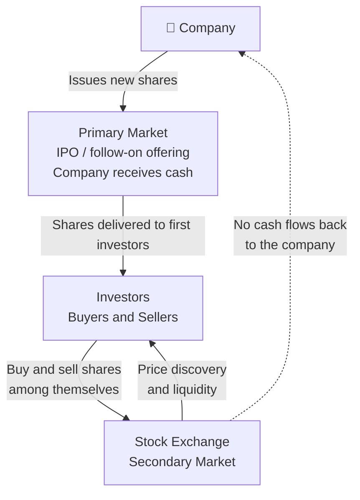
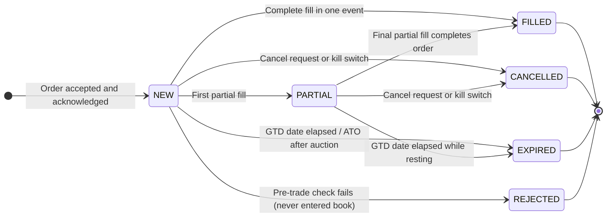
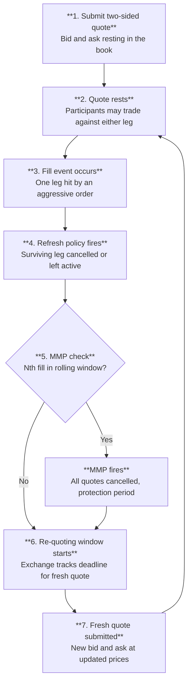
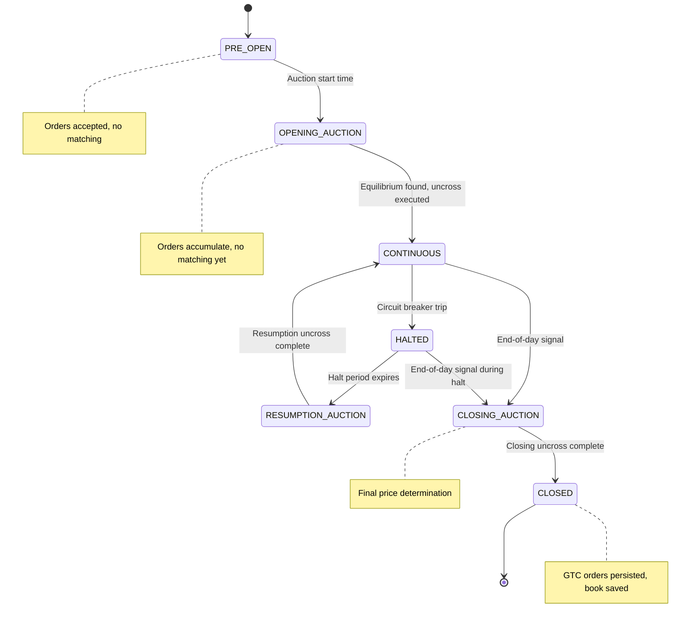
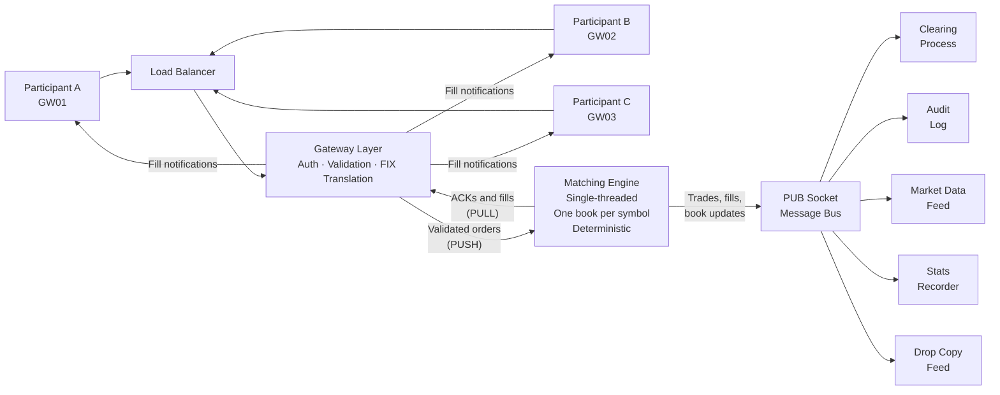

# How a Financial Exchange Works

**A Conceptual Introduction for Software Developers**

> *No code. No fear. Just the concepts you need to understand the system you are building.*


## Preface

You have been asked to work on a financial exchange system. The codebase is full of words like "bid," "ask," "FOK," "the book," "OCO," "circuit breaker," "drop copy," and "kill switch," and many more. These are not arbitrary names, each one represents a concept that evolved over decades of real-world market operation, regulation, and hard-won lessons about what can go wrong when large amounts of money change hands at high speed.

This document is a conceptual map. It will not show you a single line of code. Instead, it will walk you through the world your code inhabits: the participants, the rules, the safeguards, and the architecture that together constitute a financial exchange. By the end, you should be able to read a description of a market event, "GW01 submitted a GTC iceberg order that triggered a circuit breaker halt; the matching engine moved to CLOSING_AUCTION state and the scheduler notified all subscribers via the PUB socket", and understand every word of it.

By necessity most of the concepts are only very briefly discussed. Any fuller discussion would render 100's of pages of hard-core finance literature and the point of this document is not to be a complete introduction to finance (if even such a thing is possible). Instead you will find excellent academic references (that I have drawn upon in writing this) that do indeed have 100's of pages of, sometimes very complex math, at the end of this document.

Real exchanges are referenced throughout to anchor the concepts in reality. The NYSE (New York Stock Exchange), CME Group (Chicago Mercantile Exchange), Eurex, LSE (London Stock Exchange), NASDAQ, and IEX are among the most influential exchanges in the world, and each has contributed to the vocabulary and practices you will encounter here. 

*This document is a conceptual introduction to financial exchange systems for software developers. The concepts described here apply equally to production exchange systems at NYSE, NASDAQ, CME, Eurex, LSE, and any other regulated marketplace. The regulations, market structures, and specific rules of real exchanges are more complex than described here, this document is an introduction, not a complete specification. When in doubt, consult the official rulebooks of the relevant exchange.*


## Table of Contents

**Part I: Foundation — Markets, History, and Participants**

- Before the Exchange: How Companies Raise Capital
- What Is a Financial Exchange, and Why Does It Exist?
- The Language of the Market: A Short History
- The Participants
- A Brief Tour of Real-World Exchanges

**Part II: Orders, Matching, and the Trading Day**

- The Order: The Fundamental Unit
- Order Types, The Vocabulary of Intent
- Time-In-Force, How Long Should the Order Live?
- The Order Book, The Exchange's Memory
- Price-Time Priority, The Fairness Rule
- The Matching Engine, The Heart of the Exchange
- The Life of a Trade
- Market Makers, The Providers of Liquidity
- The Opening and Closing Auction
- Trading Sessions, The Day in the Life of a Market
- Putting It All Together

**Part III: Risk, Compliance, and Post-Trade**

- Pre-Trade Risk Controls: Before the Matching Engine
- Risk Controls, Protecting the Market
- Self-Match Prevention, When You Would Trade with Yourself
- Drop Copy, The Shadow Record
- Clearing and Settlement, When the Trade Becomes Real
- Regulatory Surveillance, Exchanges Are Not Passive
- A Cautionary Tale, Knight Capital, August 1, 2012

**Part IV: Technology, Infrastructure, and Market Ecology**

- Speed Bumps, Leveling the Playing Field
- The Technology Architecture
- Primary and Secondary Sites, Resilience Architecture
- Load Balancing, Distributing the Work
- Market Data Architecture, How the Market Sees Itself
- Smart Order Routing and Market Fragmentation
- Latency and Co-location, The Speed Dimension
- Corporate Actions, When the Instrument Changes
- Determinism, Replay, and Persistence, The Exchange Must Not Forget
- Reference Data, The Exchange's Ground Truth

- Glossary
- References


## Part I: Foundation — Markets, History, and Participants

Context, vocabulary, and the people that define exchange markets — the foundation you need before the mechanics make sense.


### Before the Exchange: How Companies Raise Capital


To understand why a financial exchange exists, you first need to understand why anyone bothers issuing shares in the first place. This section is a brief detour into basic corporate finance, the world your exchange is built to serve.

#### The Problem of Growth

Imagine a small software company. It has a product, a team, and paying customers, but it wants to grow: hire more engineers, open offices in new countries, and invest in research that will take three years to generate revenue. All of that costs money, far more money than the company currently earns in a month or a quarter.

Where does that money come from? There are three broad categories of answer, and real companies use all three at different stages of their lives.

#### Option 1: Retained Earnings (Self-Funding)

The simplest source of capital is the company's own profits. If the company earns more than it spends, it can save that surplus and invest it in growth. This is called **retained earnings**, profits "retained" in the business rather than distributed to owners.

Self-funding is attractive because it involves no outside parties and no obligations. The problem is that it is slow. If the opportunity is time-sensitive, a competitor is building the same product, or a market window is closing, waiting years to accumulate enough internal cash may mean losing the race. Most high-growth opportunities require more capital, faster, than retained earnings can provide.

#### Option 2: Debt, Loans and Bonds

The second option is to borrow money. Borrowed money must be repaid, with interest [3]. The cost of borrowing (the interest rate) depends on how creditworthy the borrower is: established, profitable companies with predictable revenues can borrow cheaply; young, risky startups may not be able to borrow at all, or only at very high interest rates.

**Bank loans** are the most familiar form of debt. A company borrows a sum from a bank and repays it over time. This works well for small amounts and short timeframes, but a single bank may not be willing, or able, to provide hundreds of millions of dollars to a single borrower.

**Bonds** solve the scale problem by spreading the borrowing across many lenders. A bond is a standardised piece of debt. A company issues a bond with a **face value** (say, $1,000), a **coupon rate** (say, 5% per year), and a **maturity date** (say, 10 years from now). The investor who buys the bond lends the company $1,000 today. In return, the company promises to pay $50 per year (5% of $1,000) as regular interest payments (these periodic payments are called **coupons**, named after the physical coupon slips investors used to cut off and redeem before the digital age), and to repay the full $1,000 when the bond matures in 10 years.

A large company might issue millions of these bonds simultaneously, raising hundreds of millions of dollars from thousands of individual investors. Those investors later need to be able to sell their bonds if they want their money back before maturity, and so bonds, just like shares, trade on exchanges and electronic markets.

**The key characteristic of debt:** the company has an unconditional obligation to make the promised payments. If it cannot, it is in default, which can lead to bankruptcy proceedings. Bondholders are **creditors**: they have a legal claim against the company's assets. In a bankruptcy, creditors get paid before the company's owners.

#### Option 3: Equity, Selling Ownership

The third option is fundamentally different in character: instead of borrowing money and promising to repay it, the company sells a piece of itself.

**Equity** is ownership. When a company issues **shares** (also called **stock** in American English, or **equities** in market terminology), it is dividing ownership of the business into small, standardised units and selling those units to investors [3]. Each unit, each share, represents a proportional claim on the company's assets, earnings, and future.

Here is the important distinction from debt: **there is no promise of repayment**. If you buy a share in a company, the company does not promise to give your money back. It does not promise to pay you any specific amount at any specific time. What you receive instead is ownership.

**What does ownership actually mean?**

- **Residual claim on profits:** If the company earns a profit and its board of directors decides to distribute some of that profit to owners, shareholders receive their proportional share as a **dividend**. Dividends are not guaranteed, the board may decide to reinvest profits in the business instead. But shareholders are entitled to whatever is left over after all expenses and debts are paid. This "residual" or "leftover" claim is the defining characteristic of equity.

- **Capital appreciation:** If the company grows and becomes more valuable, each share becomes worth more. A shareholder who paid $10 for a share and sells it when the company is worth twice as much can sell at roughly $20, realising a **capital gain**. The theoretical upside of an equity position is unlimited, a share can appreciate many times over (Apple has multiplied in value hundreds of times since its IPO). Compare this to a bond, where the return is capped at the promised coupon rate.

- **Voting rights:** Shares typically carry the right to vote on major corporate decisions, electing the board of directors, approving mergers and acquisitions, and other significant matters. Owning 51% of the shares means controlling a majority of votes, which is why "controlling stake" is a meaningful concept.

- **Limited liability:** If the company goes bankrupt, shareholders can lose the money they invested, but nothing more. They are not personally liable for the company's debts. This protection ("limited liability") is a fundamental feature of the modern corporation and one reason equity investment became widespread.

**What does ownership mean for the company?**

Issuing equity capital has an important advantage over debt: the company is not obligated to make regular payments, and there is no maturity date on which it must repay anything. This flexibility is why many high-growth companies prefer equity, they can invest in long-term projects without the burden of fixed interest payments.

The trade-off is **dilution**: selling shares means selling a portion of the company. The founders and early investors own a smaller fraction of the whole. If a founder owned 100% of a company worth $1 million and raises $250,000 by selling a 20% stake to new investors, the company is now worth $1.25 million ($1 million of existing business value plus the $250,000 cash just raised). The founder owns 80% of $1.25 million, still $1 million in absolute terms, but a smaller fraction of the whole. The investors own 20% of $1.25 million = $250,000, exactly what they paid. Managed carefully, dilution is acceptable; managed carelessly, founders can lose control of their own companies.

#### The Difference Between Debt and Equity

A useful mental model: when a company issues bonds, it is renting capital, borrowing it with the obligation to return it. When a company issues equity, it is selling a permanent stake, the investor becomes a partial owner, sharing in the future of the business.

The consequence:

| | **Debt (Bonds, Loans)** | **Equity (Shares)** |
|---|---|---|
| Relationship to company | Lender / Creditor | Owner |
| Return | Fixed interest (coupon) | Variable (dividends + capital gains) |
| Repayment obligation | Yes, principal returned at maturity | No |
| Payment priority in bankruptcy | Paid first | Paid last (residual) |
| Risk to investor | Lower (predictable return) | Higher (no guaranteed return) |
| Dilutes ownership? | No | Yes |
| Upside potential | Capped (only the promised coupons) | Unlimited (shares in a successful company grow without limit) |

A sophisticated investor builds a **portfolio** that mixes both: bonds for predictable income and capital preservation, equities for growth potential. The entire investment industry, pension funds, mutual funds, hedge funds, is built around managing this balance.

#### Going Public: The Initial Public Offering (IPO)

Early in a company's life, its shares are held by a small, private group: the founders, early employees (who often receive shares as part of their compensation), and **venture capital (VC) investors** who provided early funding in exchange for equity stakes. These shares are not available to the general public; the company is **private**.

At some point, usually when the company has proven its business model and needs a large infusion of capital for the next phase of growth, the company may choose to **go public**: to offer its shares for sale to anyone who wants to buy them. This event is called the **Initial Public Offering (IPO)**.

In an IPO:
1. The company works with investment banks to determine an appropriate share price and to market the offering to large institutional investors.
2. New shares are created and sold, with the proceeds going directly to the company (or to early investors who are "cashing out" their stakes).
3. The company's shares are listed on a stock exchange, NYSE, NASDAQ, LSE, or another regulated market.
4. From that moment, anyone can buy or sell the shares through the exchange.

Recent famous IPOs include Airbnb (2020), Snowflake (2020), and Arm Holdings (2023). Each of these companies raised billions of dollars through their IPOs.

#### The Primary Market vs. the Secondary Market

This distinction is critical, and it is where the exchange fits in.

The **primary market** [3] is where new securities are created and sold for the first time. In an IPO, the company sells newly issued shares directly to investors, and the company receives the money. A bond issuance is also a primary market transaction, new bonds are created and the company receives the loan proceeds.

The **secondary market** [3] is where investors buy and sell securities that already exist, trading with each other rather than with the company. When you buy shares of Apple on NASDAQ today, Apple does not receive your money. The person selling you those shares receives it. Apple issued those shares long ago; they have been trading between investors ever since.

**The stock exchange is among the primary venues of the secondary market.** It is the most visible and regulated secondary market venue, but not the only one, OTC secondary trading, private transactions, and alternative trading systems also exist. For practical purposes in this document, when we say "the exchange," we mean a regulated, centralised lit venue; this is where the concepts of price-time priority, order books, and matching engines apply most directly.

This insight is important: the exchange does not help companies raise money directly. It helps investors trade securities they already own. But without the secondary market, the primary market would barely function. Here is why:

Who would invest in a company's IPO if they knew they could never sell their shares? Who would buy a 10-year bond if they had to hold it for exactly 10 years with no way out? The existence of a liquid secondary market, a place where you can sell whenever you want at a fair price, is what makes investors willing to commit capital to companies in the first place. The exchange provides the exit. And the availability of an exit enables entry.

**The primary market and secondary market form a virtuous cycle:**

- Companies raise money in the primary market because investors are willing to commit capital.
- Investors commit capital because the secondary market lets them exit when they choose.
- The secondary market functions well because many investors participate.
- Many investors participate because companies with real value list their shares there.

The stock exchange, the subject of this entire document, is the infrastructure that makes this cycle turn.



#### A Word on Other Instruments

The same framework applies to other instruments:

- **Bonds** trade on bond markets (some exchange-based, others over the counter) after issuance. Investors can sell their bonds before maturity, receiving the current market price rather than waiting for repayment.

- **Futures and options** are not claims on existing assets at all, they are contracts about future transactions [12] [13]. Their markets have their own logic, but the exchange's role (centralised matching, price discovery, fairness) is the same. 

- **Exchange-Traded Funds (ETFs)** are baskets of shares (or bonds, or commodities) that themselves trade as a single share. iShares, Vanguard, and SPDR products are examples. ETFs trade on exchanges exactly like individual stocks.

With this foundation in place, understanding what a share is, why companies issue them, and what role the exchange plays, we can now look at the mechanics of how an exchange actually operates.

### What Is a Financial Exchange, and Why Does It Exist?


#### The Core Problem

Imagine you own 1,000 shares of a technology company (you understand now what that means: you own a tiny fraction of that company, acquired when you bought the shares from a previous owner on the secondary market) and you want to sell them. Somewhere out there, someone wants to buy exactly 1,000 shares of that same company at roughly the price you have in mind. The problem is finding each other.

Before modern exchanges existed, this "finding" problem was enormous. Stock trading happened in coffee houses, in the street ("Exchange Alley Coffeehouses"), or through networks of personal contacts. One of the first places on record was "Jonathan's Coffee House" (The Forerunner to the Stock Exchange) founded around 1680 by Jonathan Miles, Jonathan's became the primary gathering place for stock brokers, [Jonathan's Coffee-House](https://grokipedia.com/page/Jonathan's_Coffee-House).  Prices were inconsistent, you might sell at one price while, moments later, someone else sold the same shares at a very different price. There was no guarantee you were getting a fair deal, and there was no way to know what "fair" even meant.

> **Auctions by the Candle**
>
> Garraway's Coffee House was opened by Thomas Garway and famed for being the first place in England to retail tea (in 1657). It was quickly rebuilt on a grand scale after the 1666 Great Fire. While Jonathan's focused heavily on shares, Garraway's specialised in commodities, hosting the Hudson's Bay Company's first fur auction in 1671 and later auctioning Australian wool.
>
> Garraway's was legendary for its unique bidding system: an auctioneer would light an inch of tallow candle, and the last bid placed before the flame flickered out won the goods. [Candle Auction](https://en.wikipedia.org/wiki/Candle_auction)

The golden era of the informal Exchange Alley coffeehouses came to a catastrophic halt on March 25, 1748, when a massive fire broke out in Cornhill, destroying Jonathan's, Garraway's, and nearly 100 surrounding buildings. Though both shops were eventually rebuilt, the financial markets were rapidly moving toward formal, dedicated corporate buildings, leaving the casual coffeehouse model behind. 

A financial exchange solves this problem by acting as a **centralised marketplace**, a single place where all buyers and sellers come together, where prices are visible to everyone, and where agreed rules govern who trades with whom at what price. The NYSE was founded in 1792 under a buttonwood tree on Wall Street [10]; NASDAQ launched in 1971 as the world's first electronic stock market [10]. Both exist to solve the same fundamental problem: matching buyers with sellers fairly and efficiently.

It is worth noting that exchanges are among the most visible matching venues, but not the only ones. **Over-the-counter (OTC) markets** (where participants negotiate directly), **Alternative Trading Systems (ATSs)**, **Electronic Communication Networks (ECNs)**, and **internalisers** (brokers who match client orders internally against their own inventory) all also match trades. The concepts in this document apply most directly to regulated exchanges, but the same vocabulary, order book, spread, price-time priority, is used across all these venues.

#### The Three Promises of an Exchange

Every exchange makes three implicit promises to its participants:

**1. Price discovery.** At any moment, the current price of an asset reflects the aggregate opinion of all participants currently willing to trade it. You can look at the market and see what "fair value" is right now.

**2. Liquidity.** You can convert your asset into cash (or vice versa) quickly, without having to wait indefinitely for a counterparty to appear. The exchange provides the infrastructure that makes counterparties findable.

**3. Fairness and transparency.** The rules for who trades first and at what price are known in advance, applied consistently, and visible to all participants equally. There is no backroom dealing.

#### Instruments: What Is Being Traded?

An exchange does not trade "things" in a physical sense. It trades **instruments**, standardised financial contracts representing ownership or obligation. The most common are:

- **Equities (stocks):** A share represents a small piece of ownership in a company. When you buy one share of Apple (ticker symbol: AAPL), you own a tiny fraction of Apple Inc. NYSE and NASDAQ are primarily equity exchanges.

- **Futures contracts:** An agreement to buy or sell something (oil, gold, a stock index) at a specified price on a specified future date. CME Group is one of the world's largest futures exchanges.

- **Options:** The right (but not the obligation) to buy or sell an instrument at a specific price before a specific date. Cboe is a major options exchange.

- **Foreign exchange (FX) pairs:** The price of one currency expressed in another, such as EUR/USD (how many US dollars one Euro buys). FX trades largely on electronic networks rather than centralised exchanges, though the principles are similar.

An equity exchange handles each **symbol** (like AAPL, MSFT, or TSLA) as a separate tradeable instrument, each with its own independent order book.

### The Language of the Market: A Short History


Before you read about participants, orders, and matching engines, it is worth pausing on something that will serve you well throughout your career working on exchange systems: **much of the language you will encounter in this codebase has historical roots that no longer match the physical reality**. Terms that sound arbitrary or old-fashioned are fossil words, the language of a world of wooden desks, brass bells, and paper ledgers that gradually evolved into the nanosecond world of today. Understanding where the words came from will make them stick, and will save you from wondering why a system full of cutting-edge software keeps referring to things like "the book," "the tape," and "the floor."

#### The Physical Book

Before electronic trading systems, every major exchange operated a physical trading floor, and on that floor, for every stock, there was a person responsible for maintaining order: in NYSE's terminology, this was called the **specialist**. The specialist's job was to act as a market maker for their assigned stocks, and to maintain, literally on paper, a record of every outstanding buy and sell order that had been submitted but not yet filled.

This record was kept in a physical **ledger book**. The book was divided into two columns: one for buy orders (bids) listing each buyer's offered price and quantity, and one for sell orders (asks) listing each seller's demanded price and quantity. The specialist would review the book, try to match buyers with sellers, and maintain an orderly market by quoting prices to floor brokers who came to trade.

When a broker wanted to buy shares and asked "what's the market in IBM?", the specialist would look at their book and say, for example, "fifty-five for five hundred, five hundred at fifty-five and a quarter", meaning the best available buyer was offering $55 for 500 shares, and the best available seller was asking $55.25 for 500 shares. The specialist was reading, live, from their paper book.

The physical book is gone. Every exchange in the world now maintains its order book in computer memory, with data structures designed for nanosecond access. But the **name** has survived completely intact. When developers and traders today say "the book," "working an order into the book," "resting in the book," or "taking from the book," they are using the exact same language that floor traders used when pointing at a physical ledger. The order book is one of the purest examples of terminology that crossed from physical to digital without losing a syllable.

#### Open Outcry and the Pit

On exchange floors like CME Group's in Chicago, trading in futures contracts was conducted through **open outcry**, a method where traders stood in a sunken circular area called a **pit** and literally shouted their bids and asks at each other, using a combination of voice and hand signals to communicate price, quantity, and direction. The noise was enormous. The system worked because the pit was small enough that everyone could hear and see everyone else.

The CME Group operated open outcry pits for decades. Some products, particularly certain agricultural and options contracts, continued in open outcry long after equity markets went fully electronic, largely because the pit handled complex, illiquid products where human negotiation had genuine advantages. CME substantially wound down its open outcry operations in 2015 [9], though some niche trading still occurs. The physical pit is where terms like "floor broker" (a broker who executes trades on the physical floor), "floor trader" (a trader who trades for their own account from the floor), and "pit committee" originated.

The terms survive in documentation, regulations, and informal industry speech even though the pits themselves are mostly silent now.

#### The Ticker Tape

Before electronic screens, prices of completed trades were published via the **stock ticker**, a telegraph-based machine, invented by Edward Calahan in 1867 [15] and later improved by Thomas Edison, that printed a continuous stream of abbreviated stock symbols and trade prices on a narrow paper tape. The tape moved fast (hence "ticker", the machine made a ticking sound) and the strip of paper would pile up on the floor of brokerages around the country as trades printed in real time.

Reading the tape was a skill. A **tape reader** was someone who could watch the continuous stream of prices and volumes and infer what institutional buyers and sellers were doing, one of the earliest forms of technical analysis. An even earlier form of market observation appears in Joseph de la Vega's *Confusión de Confusiones* (1688) [4], the oldest known book about stock trading, written in Amsterdam about the VOC share market, which describes participants reading order flow and inferring intent from patterns of buying and selling.

In 1878, the phone was invented. In 1929, the first electronic ticker was installed. By the 1960s, electronic displays began replacing paper. Today, the "ticker" refers to the digital price feeds streaming across screens in every trading firm, brokerage, and financial news channel, and the **ticker symbol** (AAPL, MSFT, GOOG) is the abbreviated code printed on the old paper tape.

When you see terms like "tick" (the minimum price movement), "tick data" (a record of every trade), or "ticker plant" (the server infrastructure that publishes market data), you are using the language of a machine that ran on telegraph cables and printed on paper strips.

#### Settling Up: Settlement Periods and Why They Exist

The historical reason settlement took multiple days has nothing to do with technology and everything to do with physical logistics. In the era of paper stock certificates, when you sold your shares, you had to physically deliver a paper certificate to the buyer, and they had to physically deliver cash or a cheque to you. Messengers on bicycles carried these documents between brokerage firms on Wall Street. Giving everyone five business days (the original settlement period was T+5) provided time for paperwork to move across Manhattan, be checked, and be processed.

As the industry moved to dematerialisation (electronic records replacing paper certificates) and electronic funds transfer, settlement windows shrank: T+5 became T+3 in the 1990s, T+2 in 2017, and T+1 in 2024 in the US [8]. The "T+N" notation remains standard even as the N shrinks. Some markets are exploring same-day (T+0) settlement, though this requires that cash and securities be available at the exact moment of trading, a more demanding operational requirement.

#### Blue Chips, Bulls, and Bears

Not all inherited terminology has to do with physical infrastructure. Some comes from adjacent worlds:

**Blue chip** stocks are large, well-established, financially sound companies, the most prestigious tier of the equity market. The term comes from poker: in casino chips, blue has traditionally been the highest denomination. The first recorded use in finance was by Oliver Gingold at Dow Jones in 1923, who described stocks trading at $200 or more per share as "blue chip stocks." [14]

**Bull market** (rising prices) and **bear market** (falling prices) have disputed origins, but the most widely cited explanation refers to how each animal attacks: a bull thrusts its horns upward, a bear swipes its paws downward. The terms appear in financial writing as early as the 18th century. Today, a market that has fallen 20% or more from a recent peak is formally defined as a bear market; a sustained rise of 20% or more from a trough is a bull market.

**Going long** and **going short** have roots far older than stock markets. Their origin lies in the physical trade of commodities, grain, spices, metals, cloth, timber, and other durable goods, that dominated commerce for centuries before financial securities existed.

A merchant in a 17th-century Amsterdam or London trading house who had purchased a large stock of grain and was storing it in a warehouse was described as being **long** in grain [4]. The word captured two ideas simultaneously: first, that they *possessed* the goods, they owned something tangible, in their hands, in their warehouse; and second, that durable goods could be held *over time*. Grain kept through winter. Spices kept for years. Metal did not spoil. A merchant who was "long" in such goods had an inventory that would *last a long time*, goods with longevity. The root connection is direct: long as in duration, as in possession extended through time.

This is still exactly what "going long" means in modern finance: you own the asset and you are exposed to its price over time. If you buy shares of a company and hold them, you are long those shares. If the price rises, your long position profits; if it falls, it loses. Nothing about the meaning has changed, only the asset has shifted from sacks of grain in a warehouse to electronic records in a clearing house.

**Going short** comes from the opposite situation: a merchant who had promised to deliver goods they did not yet possess. In forward contracts, common in the grain and commodity markets of the 17th and 18th centuries, a seller would commit to deliver a quantity of goods at a future date and price. If they had sold more than their warehouse contained, they were "short" of the goods, deficient, lacking, falling short of their obligations. The same word family as "we are short of supplies," "he fell short of expectations," or "shortage." Being short meant your inventory was insufficient to cover what you had committed to deliver. You would need to go into the market and buy before the delivery date, hoping prices had fallen so you could profit on the difference.

The Dutch East India Company (VOC), founded in 1602 and traded on the Amsterdam Exchange from that same year, pioneered many instruments still in use today, transferable shares, dividend payments, and the secondary market in those shares [5] [11], and became the arena for what is likely the first recorded large-scale short selling operation in financial history: in 1609, a merchant named Isaac Le Maire organised a group of traders to sell VOC shares they did not own, betting the price would fall so they could buy them back cheaply before delivery [5]. The scheme was disruptive enough that the Amsterdam city council attempted to ban short selling the following year, the earliest known attempt to regulate the practice [5]. It did not stick; short selling has been controversial, periodically banned, and always present in markets ever since.

"Long" and "short" thus carry the physical memory of a world where trading meant moving real goods between warehouses and ships. A developer reading `last_sell_price` or `position += signed_qty` in the matching engine's clearing code is working with concepts that a 17th-century spice merchant would have recognised immediately, even if the technology would be unrecognisable to them.

#### The Operational Mechanics of Short Selling, Borrow and Locate

The historical explanation above describes the *economics* of short selling. The modern operational reality involves several additional steps that are invisible in the exchange's order book but fundamental to how clearing and settlement actually work.

**You must borrow before you short.** Before a participant can sell shares they do not own, they must first arrange to borrow those shares from someone who does own them. This is called the **locate** process, finding and reserving a source of borrowable shares. In the US, Regulation SHO (adopted by the SEC in 2005) mandates that broker-dealers must have a reasonable grounds to believe shares can be borrowed before accepting a short sale order. Selling short without a locate is called **naked short selling** and is generally illegal.

**Where the borrow comes from.** Shares available to borrow come primarily from long investors who hold shares in custody through a broker or prime broker. These holders consent (usually automatically through their account agreements) to their shares being lent out in exchange for a **lending fee**. The custodian or prime broker intermediates: they find willing lenders and lend the shares to the short seller. The short seller pays a daily lending fee (the **borrow rate**) while the position is open.

**Borrow rates and hard-to-borrow stocks.** Most large-cap, liquid stocks are "easy to borrow", borrow rates are near zero because many shares are available. Smaller, heavily-shorted, or thinly-traded stocks can be "hard to borrow", rates of 5%, 20%, or even higher per annum, applied daily. For a stock with a 50% annualised borrow rate, a short position held for one week costs roughly 1% just in borrowing costs, before considering any price movement. The difficulty of finding borrows can itself become a market signal: rising borrow rates indicate increasing short interest and limited available supply.

**Short recall risk.** The lender can recall their shares at any time (with short notice). If the lender sells their shares or instructs their custodian to recall the loan, the short seller must return the shares immediately, either by buying in the open market (a **buy-in**) or finding a new lender. In volatile markets, recalls at inopportune moments can force short sellers to cover at bad prices.

**Settlement obligation.** At settlement (T+1 in the US), the short seller must deliver the shares. They do not own them, they borrowed them. Their clearing position shows a negative (short) holding. The CCP ensures delivery; if the short seller fails to deliver, the failed settlement process applies.

**Why this matters for exchange developers.** The exchange's matching engine processes short sales exactly like any other sell order, the distinction between a short sale and a long sale is invisible at the order book level. The matching engine does not know or care whether the seller owns the shares. The borrow and locate process happens entirely outside the exchange, in the prime brokerage and custody infrastructure. However, exchange reporting systems are required to flag short sales (in the US, short sale orders must be marked "short" in the FIX message and this appears in the audit trail), and some regulatory checks at the gateway level confirm the short sale flag is present.

**Broker** itself is an old word. The word "broker" traces back to Middle English (brocour) and Anglo-Norman (abrocour), originally referring to a middleman, small trader, or wine merchant. It referred originally to a person who "broaches" (opens) a cask and sells the wine retail, an intermediary between producer and consumer. By the late medieval period it had generalised to any trade intermediary, and it has carried that meaning into finance.

#### Wall Street

**Wall Street** is named after an actual wall, a wooden palisade built in 1653 by Dutch colonists along the northern edge of their settlement (then called New Amsterdam, now Lower Manhattan) to protect against British and Native American incursions. The wall is long gone; the street that replaced it became the financial centre of America, and now "Wall Street" is a metonym for the entire US financial industry, regardless of where the actual firms are physically located.

#### Why This Matters for You

When you encounter a term in the codebase that seems oddly concrete for a piece of software, "the book," "the tape," "the spread," "the floor price," "tick by tick", the reason it sounds physical is that it *was* physical. These words have been used continuously, with the same meanings, through every technological revolution the industry has undergone, because the underlying concepts remained constant even as the implementation changed completely.

This is also why you will find financial terminology resistant to renaming even when better alternatives exist. Saying "priority queue" instead of "the book" would be technically precise but professionally unintelligible. Finance is a conservative industry with deep institutional memory, and the vocabulary is part of that memory. Learning the words, and where they came from, is learning the culture.

### The Participants


Before diving into mechanics, it helps to know who is actually in the room.

#### Traders (Regular Participants)

The most familiar participant is someone with a view on a stock's future price, they want to buy low and sell high, or sell high and buy back cheap. Individual investors, hedge funds, and asset managers all fall into this category. In exchange terminology, when they submit an aggressive order that immediately executes against resting orders in the order book (the digital ledger of all outstanding buy and sell orders, see *The Language of the Market* in Part I), they are called **takers**, they are "taking" liquidity that was already available.

#### Market Makers

This is a concept worth understanding deeply, because it is central to how exchanges actually work in practice, and because the exchange system you are building contains a significant amount of code dedicated specifically to managing market makers.

A **market maker** is a professional participant who continuously quotes both a buy price and a sell price for an instrument. They are simultaneously willing to buy from anyone who wants to sell, and to sell to anyone who wants to buy. In exchange for taking on this obligation, they earn the **spread**, the small gap between the price they will buy at and the price they will sell at. Market makers are the reason you can usually buy or sell a stock immediately without waiting for a human counterparty to appear. Their standing orders are already in the book, waiting.

NYSE has what it calls **Designated Market Makers (DMMs)**, specific firms assigned to each stock with obligations to maintain fair and orderly markets. Nasdaq calls them **Market Makers**. Eurex, the European derivatives exchange, runs a formal **Market Making Programme** with contractual quoting obligations. When a market maker's resting order is later filled by someone else's incoming order, the market maker is called a **maker** (they "made" liquidity available). The person whose order triggered the fill is the **taker**. Exchanges frequently give makers a fee rebate and charge takers a fee, to incentivise the provision of liquidity.

> **Key idea:** Market makers earn the spread by continuously providing two-sided quotes, a standing bid and ask, making it possible for others to trade immediately at any time. They are not passive: their position changes with every fill, and they must manage inventory and information risk in real time. The *Market Makers* section of Part II examines the full operational detail: formal obligations, what happens when a quote is hit, protection mechanisms, and the software implications of supporting them.

#### Brokers

A broker does not trade for their own account. They act as an intermediary: they receive orders from clients and submit them to the exchange on the client's behalf. Prime brokers provide additional services like lending and clearing.

#### The Exchange Itself

The exchange is not a passive infrastructure provider. It is a regulated entity that enforces rules, monitors for manipulation, reports trades to regulators, and ensures the market functions fairly. In many jurisdictions, exchanges are themselves public companies listed on exchanges (NYSE's parent company, ICE, is listed on NYSE; NASDAQ lists on Nasdaq).

> **Note, quotes vs orders:** Throughout this document, the terms "order" and "quote" are sometimes used to describe resting instructions in the book. Operationally they are different: a **quote** is a two-sided bid/ask pair submitted by a market maker (a single instruction generating two linked legs), while an **order** is a one-sided instruction submitted by any participant. A quote may internally generate one or two order records with linked identifiers; quote IDs and order IDs may differ. The *Market Makers* section of Part II covers this distinction in detail.

### A Brief Tour of Real-World Exchanges


To ground these concepts in reality, here is a brief overview of the exchanges most relevant to exchange system developers.

#### NYSE (New York Stock Exchange)
Founded in 1792, NYSE is the world's largest equity exchange by market capitalisation of listed companies. NYSE is a **hybrid market**, it combines electronic order matching with **Designated Market Makers (DMMs)** who have responsibilities to maintain fair and orderly markets and can intervene manually in certain situations. NYSE uses price-time priority and runs opening and closing auctions. Its closing auction is one of the most important pricing events in global finance.

#### NASDAQ
NASDAQ launched in 1971 as the world's first fully electronic stock exchange. It is home to many of the world's largest technology companies (Apple, Microsoft, Amazon, Google). NASDAQ is a pure electronic market, no floor traders, no DMMs in the traditional sense. It pioneered the technology approach to exchange operation and drove down transaction costs dramatically.

#### CME Group (Chicago Mercantile Exchange)
CME Group is the world's largest futures exchange, operating CME, CBOT (Chicago Board of Trade), NYMEX, and COMEX. Futures contracts on everything from interest rates to agricultural commodities to weather indices trade here. CME uses the Globex electronic trading platform, which processes millions of orders per day. CME uses both price-time priority and pro-rata allocation depending on the product.

#### Eurex
Part of Deutsche Börse Group, Eurex is Europe's largest derivatives exchange, headquartered in Frankfurt. Eurex is known for its sophisticated market making programmes and its strict but fair treatment of high-frequency trading. The Eurex T7 trading system is used by multiple exchanges globally. Eurex introduced the concept of formally structured market maker obligations with MMP protection.

#### LSE (London Stock Exchange)
The LSE is one of Europe's oldest exchanges, dating to the 17th century coffee houses. It trades equities, bonds, and ETFs. The LSE uses the SETS (Stock Exchange Electronic Trading System) for liquid equities and runs opening and closing auctions. The LSE's Millennium Exchange technology platform is used by dozens of exchanges globally.

#### IEX (Investors Exchange)
IEX launched as a dark pool in 2013 and became a registered national securities exchange in 2016. It is the exchange that popularised the speed bump, deliberately leveling the playing field between HFT firms and institutional investors. IEX remains smaller than NYSE and NASDAQ but influential in ongoing debates about market structure fairness.

#### Cboe (Chicago Board Options Exchange)
Cboe is the world's largest options exchange, operating Cboe, C2, BZX, BYX, EDGX, and EDGA exchanges. Cboe invented the listed options market in 1973. It calculates the VIX (Volatility Index, the "fear gauge" of the market) from options prices.

#### JPX (Japan Exchange Group)
JPX was formed in 2013 by merging the Tokyo Stock Exchange (TSE) and Osaka Securities Exchange. It is the world's third-largest exchange by market capitalisation of listed companies, behind NYSE and NASDAQ. JPX operates on an all-electronic platform called arrowhead. Japanese markets have their own session structure, tick size rules, and circuit breaker conventions; the daily price limit system (where trading in a stock is suspended if it moves more than a set amount from the previous close) differs from the US LULD approach.

#### HKEX (Hong Kong Exchanges and Clearing)
HKEX is the primary exchange for Hong Kong-listed equities and also provides the main electronic gateway for mainland China stocks through the Shanghai-Hong Kong Stock Connect and Shenzhen-Hong Kong Stock Connect programmes. Stock Connect allows international investors to trade China A-shares (mainland China stocks) and allows mainland investors to trade Hong Kong-listed stocks through a northbound/southbound quota system, a unique regulatory and technical arrangement that requires matching engines on both sides to coordinate.

#### SGX (Singapore Exchange)

SGX is Southeast Asia's largest exchange, trading equities, derivatives, and fixed income. It is notable as a hub for Asian futures contracts, Nikkei 225 futures, MSCI Asia index futures, and iron ore contracts all trade on SGX. SGX acquired Scientific Beta (factor indices) and has invested heavily in data analytics services alongside its exchange operations.

#### ASX (Australian Securities Exchange)

ASX serves the Australian equity and derivatives markets. It became notable in the technology community for its attempt to replace its CHESS (Clearing House Electronic Subregister System) settlement platform with a blockchain-based system, a project that was eventually cancelled in 2022 after years of development, at significant cost. The cancellation is a cautionary tale for exchange technologists about the risks of replacing proven settlement infrastructure with unproven technology.

## Part II: Orders, Matching, and the Trading Day

How orders work, how the matching engine processes them, and how a complete trading day unfolds from open to close.

### The Order: The Fundamental Unit

Everything in an exchange system revolves around the **order**. An order is an instruction from a participant to the exchange: "I want to buy (or sell) a certain quantity of a certain instrument, subject to certain conditions."

Every order carries several key pieces of information:

#### Symbol
Which instrument. "AAPL" means Apple shares; "MSFT" means Microsoft. The exchange handles a separate order book for each symbol.

#### Side
**BUY** or **SELL**. Deceptively simple, but it defines everything about how the order interacts with the book.

#### Quantity
How many shares (or contracts, or lots) the participant wants to trade. This is typically a positive integer. The term **lot** refers to the standard unit of quantity. For equities, one lot is usually one share, though some markets (particularly Asian exchanges) define a minimum lot size.

#### Price (for limit orders)
The maximum price the buyer will pay, or the minimum price the seller will accept. Orders submitted without a specific price are **market orders** (described below).

#### Time-In-Force
How long the order remains valid. This is so important it gets its own section below.

#### The Arrival Timestamp
When the exchange received the order, recorded to nanosecond precision. This is not just metadata, it is a critical part of the fairness mechanism, as you will see when we discuss price-time priority.

#### Identity
Which gateway (participant connection) submitted the order. The exchange uses this for self-match prevention, kill switches, and regulatory reporting.

### Order Types, The Vocabulary of Intent

The type of an order describes the conditions under which it should execute. Understanding order types is fundamental to understanding exchange system code, because the matching engine has different logic for each type.

#### Limit Orders

A **limit order** says: "I am willing to trade at this price or better, but no worse."

- A buy limit order at $150.30 says: "Fill me at $150.30 or cheaper, but never at $150.31 or higher."
- A sell limit order at $150.35 says: "Fill me at $150.35 or higher, but never at $150.34 or lower."

The word "limit" refers to the price limit the participant is imposing. If an incoming limit order cannot immediately find a counterparty at an acceptable price, it **rests** in the order book, waiting. Resting orders are also called **passive orders**, they are not actively seeking to trade; they are waiting to be found.

Limit orders are by far the most common order type in most markets.

#### Market Orders

A **market order** says: "Fill me immediately at whatever the current market price is." There is no price constraint. The exchange executes it against the best available resting orders immediately.

Market orders maximise the probability of immediate execution, but execution is still subject to available liquidity, the current exchange state, risk controls, and regulatory protections. A market order submitted during a trading halt, against an empty book, or at a price outside a circuit-breaker band will not fill. In normal continuous trading conditions, market orders can be treated as effectively execution-guaranteed, but not price-guaranteed. If you submit a large market buy order in a thin market, you might sweep through several price levels and pay far more than intended, this is called **market impact** or **slippage**. Market orders are used when certainty of execution matters more than certainty of price.

Because they have no price to wait at, market orders cannot rest in the book. If they cannot immediately fill, they are cancelled.

#### Stop Orders

A **stop order** sits dormant until the market price reaches a specified trigger level (the **stop price**). When triggered, it converts to another order type and enters the book.

- A **stop-loss order** is a sell stop: "If the price falls to $145, automatically sell for me." Used by investors to automatically exit a losing position and limit further losses.
- A **buy stop** triggers when the price rises to the stop price. Used to enter a position on upward momentum: "If the stock breaks above $155, buy it, that confirms the uptrend."

Stop orders do not sit in the regular bid/ask book, they are held in a separate dormant queue and injected into the book only when triggered. It is worth noting that stop orders are not universally supported natively at the exchange level: some exchanges handle stops internally as described here; others leave stop order logic to brokers or client-side systems, sending only the resulting limit or market order to the exchange once the trigger is reached. The exchange system you are building handles stops natively, this is a deliberate design choice.

#### Stop-Limit Orders

A **stop-limit order** is a stop order that, when triggered, converts to a **limit order** rather than a market order. This gives the trader price protection but introduces the risk of non-execution.

Example: A sell stop-limit with a stop price of $145 and a limit price of $144. When the market falls to $145, the order converts to a sell limit at $144. It will only execute at $144 or better. If the market drops sharply past $144 (a "gap"), the order sits unfilled. Compare with a plain stop order, which converts to market and fills at whatever price is available, guaranteed execution, but potentially at $140 instead of $144.

Neither is universally better; the choice depends on whether the trader prioritises execution certainty (stop-market) or price certainty (stop-limit).

#### Trailing Stop Orders

A **trailing stop** is a stop order with a twist: the stop price automatically adjusts as the market moves in a favourable direction, but freezes when it moves against the position.

Example: You bought shares at $150. You set a sell trailing stop with an offset (also called the **trail distance**) of $5.00. The stop starts at $145. If the price rises to $160, the stop rises to $155. If the price then rises to $170, the stop rises to $165. But if the price then falls back to $167, the stop freezes at $165, it cannot move down, and will trigger a sale if the price continues falling and reaches $165.

The mechanism that advances the stop in the favourable direction is called the **ratchet**, like a mechanical ratchet that only moves in one direction. The trail offset is stored as a fixed distance, and the ratchet advances by subtracting this offset from each new high-water-mark price.

#### How a Trailing Stop Actually Executes

This is a point of frequent confusion, so it deserves careful explanation.

**The trailing stop is not a resting sell order in the book.** Before it fires, it is completely invisible to the market, held in a separate dormant queue inside the matching engine, with no presence in the bid or ask side of the order book. It does not compete with other sell orders. It does not queue behind them. It simply waits, monitoring the last trade price as each fill occurs.

The question "how can a trailing stop ever execute if there is always a better sell order in the book?" contains a false premise: the trailing stop is not *in* the book. Other sellers at higher prices are irrelevant to it.

**What happens when the stop triggers.** When the last traded price falls to or below the stop price, the trailing stop converts into a **market sell order** and is injected into the book. A market sell order goes directly to the *buy side*, it matches against the best available bid. Other sell orders are completely irrelevant at this point. The market sell does not queue behind limit sells; it sweeps across to the buyers.

To make this concrete with the example above: the stop price has ratcheted up to $165. The price starts falling. At $165.50, nothing. At $165.01, nothing. At $165.00, the stop triggers. A market sell order is born and immediately matches against whatever buyer is sitting at the top of the bid queue. If the best bid is $164.95, the fill occurs at $164.95. The trailing stop has executed.

**The common mental model that causes confusion.** People sometimes imagine the trailing stop as a limit sell order sitting in the book at $165, waiting in the queue behind other sellers who are already there. Under that mental model, yes, it seems like it could never execute, because better-priced sellers would always be ahead of it. But that mental model is wrong. A trailing stop is a trigger and a market order, not a limit order competing for queue position.

**The trade-off.** Because the trailing stop fires as a market order, execution is guaranteed (assuming buyers exist) but price is not. In a fast-moving market the price may have dropped well below the stop price by the time the market order fills. This is the same gap risk that applies to all stop orders: the stop triggers at $165 but if the market is falling quickly and the best bid is $162, that is where the fill occurs.

Trailing stop logic is not universally implemented at the exchange level. On some venues it is handled client-side (the trading algorithm tracks the high-water mark and adjusts the stop price manually), on others broker-side, and on others natively within the matching engine. Wherever it is implemented, the ratchet behaviour and the dormant-then-market-order execution model are the same.

#### Iceberg Orders

An **iceberg order** (also called a **reserve order** or **hidden order**) is a large order that conceals most of its size. It shows only a small visible portion, the **peak** or **tip**, to other participants. When the visible portion is consumed by fills, the order automatically replenishes from its hidden reserve, showing a new peak.

Why would someone want this? If you need to buy 100,000 shares, showing the full size in the book signals your intention to the entire market. Other participants may raise their ask prices or front-run your order before you can fill it. By showing only 1,000 shares at a time, you hide your true intent and reduce your **market impact**.

The trade-off is **queue priority**: each replenishment gets a fresh timestamp and goes to the back of the queue at that price level, rather than retaining the position of the original order. The exchange's other participants can see that an iceberg is present (the order keeps replenishing at the same price), but not how large the hidden reserve is.

Iceberg orders are widely used by institutional investors and market makers on exchanges like the LSE, Euronext, and Deutsche Börse.

#### Hidden Liquidity, Priority Rules, and Midpoint Orders

Different exchanges treat hidden liquidity differently, and the rules matter for developers building order management systems.

**Displayed vs hidden priority:** On some exchanges, fully displayed (non-iceberg) orders at a given price level have strict priority over hidden or iceberg orders at the same price, even if the iceberg arrived earlier. The reasoning: participants who take the risk of displaying their intentions publicly should be rewarded with better queue position. On other exchanges, FIFO applies equally to hidden and displayed orders, first in, first out regardless of visibility. Knowing which rule applies on a given venue determines how institutional participants choose between iceberg and fully disclosed orders.

**Reserve refresh priority:** When an iceberg replenishes, a new peak appears from the hidden reserve, most exchanges treat the replenishment as a new order submission for queue purposes: it goes to the back of the queue at that price. This "back-of-queue on refresh" rule means icebergs that replenish many times lose priority relative to new participants arriving at the same price. Some venues implement partial priority preservation, but "back of queue on refresh" is the most common.

**Midpoint peg orders:** A **midpoint peg order** is an order whose price continuously tracks the current mid price (the average of the best bid and best ask). It never displays at a price, it sits invisibly, adjusting to the mid in real time. It executes only when a counterparty arrives whose order is also willing to trade at the midpoint. Midpoint peg orders are common in dark pools and supported by some lit venues, most notably IEX.

**Why would any counterparty accept this when there are better-priced limit orders in the book?**

This is the question that stops most people when they first encounter midpoint pegs, and the answer dismantles the confusion immediately: *the midpoint is a better price than the quoted ask for a buyer, and a better price than the quoted bid for a seller*. Both parties benefit compared to a standard trade at the quoted prices. There is no sacrifice involved.

Consider the numbers:

| | Price |
|---|---|
| Best bid (highest buyer) | $150.30 |
| Best ask (lowest seller) | $150.35 |
| **Mid price** | **$150.325** |

A standard market buy fills at the **ask**: $150.35. A midpoint peg buy fills at the **mid**: $150.325. The midpoint peg buyer pays $0.025 *less* per share than if they had bought at the quoted ask.

A standard market sell fills at the **bid**: $150.30. A midpoint peg sell fills at the **mid**: $150.325. The midpoint peg seller receives $0.025 *more* per share than if they had sold at the quoted bid.

Neither party is giving anything up. Both are doing better than the quoted market price by half the spread, they are sharing the spread between them rather than each paying it in full to the market maker. This is not a compromise; it is a joint saving.

**A worked example.**

An institutional investor wants to buy 200,000 shares of AAPL. The book shows:
- Best bid: $150.30 / 10,000 shares
- Best ask: $150.35 / 10,000 shares
- Mid: $150.325

*Option A, aggressive market order:* Fill the entire 200,000 shares by sweeping the ask side. The first 10,000 fill at $150.35, then the next level, and so on. The average fill price will be well above $150.35 due to market impact. Transaction cost: spread paid on every share, plus significant slippage.

*Option B, midpoint peg in a dark pool:* The buyer submits a midpoint peg buy for 200,000 shares in a dark pool. The order sits invisible, pegged at $150.325. Separately, a pension fund that wants to sell 200,000 shares submits a midpoint peg sell in the same dark pool.

The dark pool matches them: 200,000 shares trade at $150.325.

- Buyer paid $150.325 instead of $150.35, saving $0.025 × 200,000 = **$5,000**.
- Seller received $150.325 instead of $150.30, gaining $0.025 × 200,000 = **$5,000**.
- The spread of $0.05 was split equally. Total joint saving: $10,000 compared to trading at the quoted prices.

Neither party showed their intention in the lit book, avoiding the price impact of a visible 200,000-share order. Both traded at a price inside the spread. This is the proposition that makes midpoint pegs attractive.

**Who uses midpoint pegs?**

Midpoint pegs are primarily used by institutional investors, mutual funds, pension funds, hedge funds, who have large orders, are price-sensitive, and are not urgently time-pressured. They have enough time to wait for a natural counterparty at the midpoint. High-frequency traders and market makers generally do not use midpoint pegs because they need execution certainty, not price improvement at the cost of uncertain timing.

**The trade-offs.**

The critical limitation is that **there is no guarantee of execution**. A midpoint peg buy will only fill if a seller willing to trade at the midpoint appears. In a liquid market this may happen quickly. In a thin or one-sided market the order may wait indefinitely. If the market moves strongly against you while you wait, the price rises while you hold a midpoint peg buy, the opportunity to buy at the original mid price may have passed by the time a counterparty appears. The participant must accept that improved price comes at the cost of execution certainty.

The mid price itself also moves continuously. An institution submitting a midpoint peg at $150.325 may find the mid has moved to $150.50 by the time it fills, if the market has drifted. The pegged price tracks the mid; the participant does not control the final execution price precisely, only that it will be the mid whenever the fill occurs.

**Midpoint pegs in dark pools vs lit venues.**

In a dark pool, the entire book is hidden, so a midpoint peg buyer and a midpoint peg seller can find each other without either revealing their interest to the lit market. The dark pool operator runs a separate matching process against the midpoint.

On IEX (a lit exchange), midpoint pegs work slightly differently. The midpoint peg sits passively at the mid. An *aggressive* order, a sell order willing to accept a price at or below the mid, arrives from a participant routing to IEX. That aggressive sell is priced at or below $150.325 and matches the resting midpoint peg buy at the mid. The aggressive seller "crosses to mid" by accepting the mid price instead of demanding the full ask. They receive $150.325, still better than the bid ($150.30), and the midpoint peg buyer gets their fill at $150.325 instead of paying the ask ($150.35). IEX's speed bump (350 microseconds) is relevant here: it prevents fast-moving quotes from making the midpoint stale before the fill occurs, ensuring the mid price used in the match is genuinely current.

**The developer perspective.**

The matching engine must handle midpoint pegs as a separate priority queue that sits parallel to the regular price-time priority book. The mid price must be recalculated on every book update (every time the best bid or best ask changes). The midpoint peg queue must be checked against incoming orders and against each other. The fill price for a midpoint peg match is not a stored order price, it is computed dynamically at match time as (best_bid + best_ask) / 2, requiring care with rounding to the nearest valid tick.

#### OCO Orders (One-Cancels-Other)

An **OCO order** is a pair of orders linked together by a rule: if either order fills (or is cancelled), the other is automatically cancelled.

Classic use case: You own shares bought at $200. You want to take profit if the price rises to $215, but also automatically cut your losses if it falls to $185. You submit:
- Order A: Sell limit at $215 (take-profit)
- Order B: Sell stop at $185 (stop-loss)
- Linkage: these are an OCO pair

Only one of A or B will ever execute. Whichever triggers first cancels the other. This is called a **bracket order**, the position is "bracketed" between a profit target above and a loss limit below.

OCO orders are a standard feature of most professional trading platforms and are supported by exchanges including CME and CBOE.

#### Combo Orders

A **combo order** (also called a **spread order** or **strategy order**) is a single instruction to simultaneously execute orders in multiple instruments. Each component is called a **leg**. [12]

Example: A **pairs trade**, buy 100 shares of AAPL and sell 50 shares of MSFT simultaneously, treating the combined position as a single trade. The trader believes AAPL will outperform MSFT relative to each other, and wants to be exposed only to the relative difference between them, not to overall market direction.

Combo orders are critical in derivatives markets. On CME, a futures trader might simultaneously buy a March contract and sell a June contract on the same underlying, a **calendar spread**. Eurex offers a rich set of combination strategies for options, including straddles (buy a call and buy a put at the same strike), strangles (buy a call and buy a put at different strikes), and butterflies (three strikes, two legs long and one short in a specific ratio).

The execution challenge is **leg risk**: if one leg fills and the other does not, the trader is left with an unintended one-sided position. Production exchange systems handle this with sophisticated combo matching engines; simpler systems accept the leg risk explicitly.

#### Implied Orders, Synthetic Liquidity from Existing Orders

This concept trips up almost every developer encountering derivatives exchange systems for the first time. Read it slowly.

The clearest real-world examples of implied orders come from **futures markets**. A futures contract is a standardised agreement to buy or sell a fixed quantity of an underlying asset, crude oil, wheat, a stock index, a currency, at a predetermined price on a specified future delivery date. Each delivery month trades as a separate instrument with its own independent order book: a January crude oil contract and a February crude oil contract are two distinct products, each with its own buyers and sellers. (A fuller treatment of futures contracts is in the glossary and in Part I.) The important thing for this section is simply that the *same underlying asset*, crude oil, trades simultaneously in several different month-dated contracts, and participants may want to trade the *difference* between months just as much as they want to trade any individual month outright.

In a market with both outright order books (January futures, February futures) and spread order books (the January/February calendar spread), an opportunity exists: two existing orders, one in the spread book and one in an outright book, can be combined to create what looks like a new order in the other outright book. This derived offer is called an **implied order**.

The critical thing to understand before the example: **implied orders do not create liquidity from nowhere.** They are a different expression of liquidity that already exists. This distinction will become completely clear through the example.

##### A Step-by-Step Implied Order Example

**The instruments.** We have three order books:

| Book | What it represents |
|---|---|
| **January** | Outright WTI crude oil futures, January delivery |
| **February** | Outright WTI crude oil futures, February delivery |
| **Jan/Feb Spread** | The calendar spread; spread price = January price − February price |

**Spread price convention.** A spread price of −$2.00 means January is trading $2.00 *below* February. A participant who *buys* the spread buys January and sells February simultaneously. If the spread price is −$2, and January is at $75, the spread buyer buys January at $75 and sells February at $77 (the $2 difference).

**The book before anything happens.**

| Book | Side | Price | Lots | Who |
|---|---|---|---|---|
| January (outright) | Ask | $75.00 | 50 | Trader A |
| Jan/Feb Spread | Bid | −$2.00 | 30 | Trader B |
| February (outright) | | *empty* | | |

Trader A wants to sell 50 January lots at $75.00 or better.
Trader B wants to buy the Jan/Feb spread at −$2.00, meaning they will buy January and sell February, as long as February is at least $2.00 more expensive than January.

The February outright book is completely empty. No one has placed any outright February order.

**How the implied order is computed.** The matching engine observes:
- There is a January seller at $75.00 (Trader A).
- There is a spread buyer who will sell February at January + $2.00 (Trader B).
- Combining these: if January is $75.00, then Trader B will sell February at $75.00 + $2.00 = **$77.00**.

The engine therefore publishes an **implied February ask at $77.00** in the February outright book. This offer did not come from a new participant. It was computed entirely from two pre-existing orders.

The implied offer is limited to the smaller of the two underlying quantities: min(50, 30) = 30 lots. Trader B can only sell February up to 30 lots (his spread size), even though Trader A has 50.

**Now the February order book looks like this:**

| Book | Side | Price | Lots | Source |
|---|---|---|---|---|
| February | Ask | $77.00 | 30 | *Implied* (from Trader A + Trader B) |

**Step 3: A buyer arrives.** Trader C submits a buy order for 20 lots of February at $77.00.

The matching engine recognises that this matches the implied February offer. To execute the implied match, it must fire all three legs *simultaneously and atomically*:

1. **Leg 1, outright January:** Trader A sells 20 lots of January to Trader B at **$75.00**.
2. **Leg 2, Jan/Feb spread:** Trader B's spread order fills for 20 lots at **−$2.00** (bought January at $75, sold February at $77; $75 − $77 = −$2 ✓).
3. **Leg 3, outright February:** Trader C buys 20 lots of February from Trader B at **$77.00**.

All three executions happen in the same atomic operation. There is no moment in time when Leg 1 has fired but Leg 2 has not.

**The book after the match:**

| Book | Side | Price | Remaining lots |
|---|---|---|---|
| January (outright) | Ask | $75.00 | 30 (was 50, Trader A consumed 20) |
| Jan/Feb Spread | Bid | −$2.00 | 10 (was 30, Trader B consumed 20) |
| February (implied) | Ask | $77.00 | 10 (min of 30 and 10 remaining) |

**Where Trader B stands after the trade.** Trader B has successfully executed their spread strategy. Their clearing positions are:
- Long 20 January lots at entry price $75.00
- Short 20 February lots at entry price $77.00

The net economic result: they paid $75 for January and received $77 for February, a net receipt of $2 per lot, which is exactly the spread price they bid (−$2 means $2 received by the buyer). Their margin requirement is calculated on the *spread* exposure, which is much lower than holding two outright positions, because the long January and short February partly hedge each other against flat price moves in crude oil.

**Why no new liquidity was created.** Before the match, the total outstanding liquidity was:
- 50 lots of January for sale at $75
- 30 spread bids willing to buy January and sell February at a $2 differential

After the match, the total outstanding liquidity is:
- 30 lots of January for sale at $75
- 10 spread bids

In both cases, the February implied offer is entirely derived from the other two books. The 20 lots of February that Trader C bought were not new, they were constructed from 20 of Trader A's January lots and 20 of Trader B's spread lots. Each of those 20 lots was consumed exactly once. Nothing was duplicated.

Now remove Trader A's January order and watch what happens: the implied February offer disappears instantly, because one of its two components is gone. This is the definitive proof that the implied book holds no independent liquidity.

##### The Two Directions of Implied Matching

The example above is **implied-in**: an outright order plus a spread order imply a new outright in the other month.

The reverse is **implied-out**: two outright orders imply a spread. If there is a January buyer at $75 and a February seller at $77, the engine can see an implied spread sell at $75 − $77 = −$2. This implied spread sell can match a resting spread buyer at −$2. CME Globex supports both implied-in and implied-out across all its major futures products.

##### Developer Implications

Implied matching creates several engineering challenges that are absent from simple outright matching:

**Continuous recalculation.** Every change to an outright or spread order, a new order, a cancellation, a partial fill, potentially changes the implied prices in all related books. The engine must recalculate implied quotes in real time after every event.

**Atomicity across legs.** When an implied order matches, all underlying legs must execute atomically. If any leg cannot execute (because, say, the underlying outright order was cancelled in the same microsecond), the entire match must be rolled back. This requires careful locking or sequential execution discipline.

**Preventing double-execution.** Trader A's January order simultaneously participates in the January outright book and the implied February book. If both a direct January buyer and an implied February buyer arrive at the same instant, only one can fill Trader A, not both. The engine must serialise access to the underlying order regardless of which implied or outright path claims it first.

**Implied-of-implied (second-order implied).** Some exchanges allow implied orders derived from other implied orders, a spread-of-spreads implying an outright two months away, for instance. The combinatorial complexity grows quickly, and most exchanges limit the depth of implied chains (typically one or two levels).

> **Key idea:** Implied orders are not free liquidity. They are a mechanism for expressing in one market the combined willingness already committed in two other markets. When an implied order matches, it consumes real orders from real books. The total liquidity in the system decreases by exactly the quantity matched, just as it would in any ordinary trade.

### Time-In-Force, How Long Should the Order Live?


Every order must specify how long it should remain active if not immediately filled. This is called **Time-In-Force (TIF)** and is a standard attribute on every order in every major exchange system.

#### DAY
The order is valid only for the current trading session. At the end of the session, it is automatically cancelled. This is the default and most common TIF.

#### GTC, Good-Till-Cancelled
The order remains active until it is completely filled or explicitly cancelled by the participant. It survives overnight, across weekends, and across holidays. This requires special handling by the exchange: GTC orders must be persisted to durable storage at the end of each session and reloaded at the start of the next.

The risk for the participant: a GTC order placed when a stock was at $100 might unexpectedly fill at a different point in the market cycle if the participant forgets about it.

#### GTD, Good-Till-Date
A variant of GTC with a specified expiry date and time. The order remains active until it is completely filled, explicitly cancelled, or the specified expiry date arrives, whichever comes first. On the expiry date the order is automatically cancelled regardless of fill status.

GTD is standard on most professional trading platforms and widely used by institutional investors who want the persistence of GTC without the open-ended risk of an order remaining active indefinitely. A fund manager expecting a news event on a specific date might place limit orders to accumulate a position and use GTD to ensure they expire automatically if not filled by the event date.

From an engineering perspective GTD behaves like GTC with an additional scheduled cancellation task: the exchange's session scheduler must track each GTD order's expiry and issue the cancellation at the right moment, even if no other event in the system triggers it.

#### ATO, At-The-Open
The order is valid only during the **opening auction** (the special matching procedure that establishes the first price of the day). If not filled in the opening auction, it is cancelled. On NYSE, these are sometimes called **Market-At-Open (MOO)** or **Limit-At-Open (LOO)** orders depending on whether they carry a price limit.

An important restriction: ATO orders submitted after the opening auction has concluded are rejected, the TIF cannot be satisfied after the moment it targets has passed. Some exchanges accept ATO orders throughout the pre-open period; others impose a cutoff time before the auction begins.

#### ATC, At-The-Close
Valid only during the **closing auction**. Extremely common among institutional investors who need to trade at or near the official closing price, many funds are benchmarked against closing prices. On NYSE, the closing auction on a typical day handles a substantial portion of the day's entire volume in the final moments of trading [See NYSE Closing Auction Dynamics, 2023].

Like ATO, ATC orders submitted after the closing auction has already run are rejected. Unlike DAY orders, ATC orders cannot accumulate position through the continuous session, they are specifically targeting the single closing price that emerges from the auction uncross.

#### IOC, Immediate-Or-Cancel
Fill as much as possible immediately; cancel any unfilled remainder instantly. Unlike a market order, an IOC can carry a limit price: "Fill whatever you can at $150.30 or better right now; cancel the rest." IOC orders never rest in the book.

#### FOK, Fill-Or-Kill
Fill the **entire** quantity immediately, or cancel the entire order without any partial fill. Used when partial fills are unacceptable, for instance, an arbitrage strategy that only works if the full quantity executes simultaneously across legs.

The exchange must verify available liquidity before executing any fills. In practice, the engine performs a **dry-run sweep**: it walks through the book checking whether the full quantity can be matched at acceptable prices, without committing any fills. Only if the full quantity is satisfiable does the engine execute the actual fills. If at any point the available depth is insufficient, including because part of the available liquidity belongs to the same participant (which SMP would cancel), the entire order is cancelled without a single fill occurring. This is more complex than a standard market order sweep: the engine must complete a full hypothetical assessment of the book before touching it.

### The Order Book, The Exchange's Memory


The **order book** (also called the **limit order book** or **LOB**) is the central data structure of a matching engine [1] [2]. It is the live record of every resting order in the market, all the buyers waiting to buy and all the sellers waiting to sell, organised by price.

> **Key idea:** The order book contains only *resting* orders, those waiting for a counterparty. The current "market price" is derived from the book (as the mid of best bid and ask) or from the last trade, not from a stored field.

Think of it as two sorted lists:

**The bid side**, all resting buy orders, sorted from the highest price (most attractive for sellers) down to the lowest. A buyer offering $150.30 is at the top of the bid side if no one else is offering more.

**The ask side** (also called the **offer side**), all resting sell orders, sorted from the lowest price (most attractive for buyers) up to the highest. A seller asking $150.35 is at the top of the ask side if no one is asking less.

#### The Spread

The **spread** is the gap between the best bid (highest buy offer) and the best ask (lowest sell offer). If the best bid is $150.30 and the best ask is $150.35, the spread is $0.05.

The spread represents the immediate cost of trading: if you need to buy right now, you pay the ask price; if you need to sell right now, you receive the bid price. The round-trip cost of buying and immediately selling is the spread.

A **tight spread** (small gap) indicates a liquid, efficiently-priced market. A **wide spread** indicates illiquidity, less competition between market participants, higher trading costs. Market makers earn the spread: they buy at the bid and sell at the ask, pocketing the difference.

The **mid price** is the arithmetic average of the best bid and best ask: (150.30 + 150.35) / 2 = $150.325. This is often used as the "current price" of an instrument when no trade has occurred recently.

#### Depth

**Depth** refers to how much quantity is resting at each price level. A market with 50,000 shares resting within $0.05 of the best bid is "deep", you can trade a large size without moving the price much. A market with only 100 shares available near the best price is "shallow", a single large order will sweep through multiple price levels.

**Level 1 data** shows only the best bid price, best ask price, and quantities. **Level 2 data** (also called **market depth** or the full order book) shows all resting price levels. Professional traders subscribe to Level 2 data because depth reveals information about near-term price pressure.

#### Measuring Depth

Depth is not a single number, it is a shape. Practitioners and algorithms use several derived measures to quantify it for different purposes.

**Quantity at a price level.** The simplest measure: the total resting quantity at a single specific price. If there are three sell orders at $150.35 for 200, 500, and 300 shares respectively, the quantity at $150.35 is 1,000 shares. This is what Level 2 data shows at each row.

**Cumulative depth within N ticks.** More useful than a single level is knowing how much total quantity is available within a price range. If AAPL has a best ask of $150.35 and you sum all resting ask quantities from $150.35 to $150.45 (10 ticks), you get the total shares you could buy while moving the price at most 10 cents. A large cumulative depth within a few ticks indicates a resilient, liquid market; a small cumulative depth means a single large order will sweep many levels quickly.

**Bid-ask imbalance (depth ratio).** Compare the total resting quantity on the bid side to the total on the ask side, within some symmetric window around the mid price:

```
Imbalance = bid_depth / (bid_depth + ask_depth)
```

A value of 0.5 means the book is balanced, roughly equal buying and selling interest. A value near 1.0 means the bid side is much heavier: many buyers, few sellers. This is often interpreted as short-term upward price pressure. A value near 0.0 means the ask side is dominant: selling pressure. Market microstructure research consistently finds that order book imbalance is a short-term predictor of price direction. Many trading algorithms compute it as a continuous signal.

**Market impact estimation.** Given a target order size S, you can compute the *average price* you would pay by sweeping through the book level by level. If you want to buy 5,000 shares and the book is:

| Ask price | Qty |
|---|---|
| $150.35 | 2,000 |
| $150.40 | 1,500 |
| $150.45 | 2,000 |

Your 5,000-share buy sweeps all three levels: 2,000 at $150.35, 1,500 at $150.40, 1,500 at $150.45. The volume-weighted average price is:

```
VWAP = (2000 × 150.35 + 1500 × 150.40 + 1500 × 150.45) / 5000 = $150.395
```

The **market impact** is the difference between this average and the initial best ask: $150.395 − $150.35 = $0.045 per share. Depth data lets a trader estimate their market impact before submitting, which is critical for execution strategy: split into smaller orders, use an iceberg, route to a dark pool, or simply accept the impact if time pressure is high.

**Available depth at cost.** The inverse of the above: given a maximum acceptable average price (or maximum price movement), how large an order can you execute within that budget? This is how automated execution algorithms compute optimal slice sizes.

**Volume-at-touch vs total book depth.** A useful distinction: *volume at touch* is only the best bid and ask (Level 1). *Total book depth* includes all visible levels. An iceberg order contributes only its visible peak to displayed depth, so total book depth may understate available liquidity if icebergs are present. This is why dark pool liquidity (invisible until matched) and iceberg reserves (invisible until refreshed) are relevant even to participants who believe they can read the full book.

#### Price Levels

A **price level** is a single specific price at which one or more orders are resting. All orders at $150.30 form one price level on the bid side. When all orders at a given price level have been filled or cancelled, that price level disappears from the book.

#### The Order Book Is Not the Market Price

This is a subtle but important point: the order book shows only **resting orders**, orders that have not yet traded. The current market price, as quoted in news tickers and trading apps, is typically the price of the **most recent actual trade**, not the price of any resting order. After a trade happens, the market price updates. Between trades, the price is conventionally shown as the mid of the book.

This means there are actually several distinct "prices" in play at any moment, each used for a different purpose:

**Last trade price.** The price at which the most recent fill occurred. This is what scrolling tickers and trading screens display as the "current price" during the session. It updates with every fill, potentially many times per second in a liquid market.

**Mid price.** The average of the best bid and best ask: (best_bid + best_ask) / 2. Used as a proxy for fair value between trades, particularly when no trade has occurred for a while. Derived from the book, not from any actual transaction.

**Previous day's closing price.** Once the session ends, the **official closing price** from the closing auction becomes the reference price for the entire period the market is closed, typically overnight and across weekends. This is the price used to value portfolios at end of day, to calculate overnight P&L, to set the reference for the next day's static price collars, and to publish the figures that appear in newspapers, financial reports, and fund valuations.

>**Closing auction and Static Price Collar**
>
>Two terms in that paragraph will be unfamiliar at this point in the document, so a brief preview is warranted. The **closing >auction** is a special matching procedure that runs at the end of the trading day: rather than matching orders one at a time as they >arrive, the exchange collects all outstanding buy and sell interest over a short accumulation period and then computes the single >price at which the greatest number of shares can trade simultaneously, matching all eligible orders at that one price. This produces >a more authoritative closing price than simply taking the last trade of continuous trading, which might have been a small or unusual >transaction. The closing auction is covered in full in the *Opening and Closing Auction* section of Part II. A **static price collar** (also called a fat-finger filter) is a >pre-trade risk control that rejects any incoming order whose submitted price strays too far from the previous closing price, >protecting against obvious entry errors such as a misplaced decimal point. Because it uses the closing price as its benchmark, it >must be recalculated at the start of each new session. Static price collars are covered in full in the *Trading Sessions* section of Part II.

The closing price carries particular weight precisely because it is independently determined by a transparent auction process rather than by a single trade that could be anomalous or thin. A portfolio worth $10 million at 3:59pm might be marked at a slightly different value at 4:00pm if the closing auction produced a different price, but that closing price is considered more authoritative because it reflects the broadest simultaneous expression of supply and demand at that moment of the day.

For exchange developers, the closing price has several concrete implications. It is the reference that the static price collar compares each new day's orders against. It is the benchmark that performance reports are measured against. It is the number that triggers overnight margin calls if positions have moved far enough. And it is the price that must be persisted at end of session, broadcast to all downstream systems, and made available when the exchange reopens the following morning.

#### What the World Sees vs What the Engine Knows

Most market participants see only an **aggregated view** of the book: total quantity at each price level, without knowing how many individual orders make up that quantity or who placed them. The exchange itself knows the full detail, every individual order, its owner, its arrival time, its type. Publishing the aggregated view is part of the exchange's **market data** service; it's how participants observe the market.

### Price-Time Priority, The Fairness Rule


One of the most fundamental questions an exchange must answer is: when multiple resting orders are at the same price, which one gets filled first?

The universal answer on mainstream exchanges is **price-time priority**:

1. **Better price goes first.** A buyer offering $150.40 gets priority over a buyer offering $150.30, because the seller gets a better deal. A seller asking $150.25 gets priority over a seller asking $150.35.

2. **At the same price, earlier arrival goes first.** Among all buy orders at $150.30, the one that arrived first gets filled first. This is **first-in, first-out (FIFO)** ordering within a price level.

This seems simple, but it has profound implications. It means:

- Participants are incentivised to quote good prices, better prices move you to the front of the queue.
- Participants are incentivised to act quickly, at any given price, being early is an advantage.
- It is completely transparent and deterministic, the exchange's matching rules are known in advance, equally to everyone.

Price-time priority is the default on NYSE, NASDAQ, CME, Eurex, LSE, and virtually every major exchange [1]. Price-time FIFO is dominant in equities markets, but derivatives markets sometimes use alternative allocation rules. The most common alternative is **pro-rata**, where fills at a price level are distributed proportionally to the size of each resting order. To make the difference concrete:

**Example:** 60 lots are available to sell at a price. Two buy orders are resting at that price: Order X for 100 lots (arrived first) and Order Y for 40 lots (arrived second).

- *Under FIFO:* Order X arrived first and has priority. It receives all 60 lots. Order Y receives nothing.
- *Under pro-rata:* The 60 lots are distributed in proportion to order size. Total resting demand = 100 + 40 = 140 lots. Order X receives 60 × (100/140) ≈ 43 lots; Order Y receives 60 × (40/140) ≈ 17 lots. Both orders fill partially.

Pro-rata rewards size over speed: a large order gets more even if it arrived later. It is common in interest-rate futures markets (where orders can be very large and the marginal value of nanosecond speed is lower) and in some options markets. FIFO rewards speed over size: whoever commits first at a price wins. Knowing which rule a venue uses matters for anyone building order-routing or execution logic.

For the exchange to implement price-time priority correctly, two things must be true: prices must be comparable without ambiguity (hence integer tick counts), and order arrival must be sequenced deterministically. Modern exchange systems use **nanosecond-precision timestamps** as one component of this sequencing. However, the timestamp alone does not fully guarantee fairness, what matters is the order in which messages are **accepted into the exchange system**, which also depends on network routing, gateway sequencing, and in high-performance systems, hardware timestamping infrastructure. The timestamp records when the exchange received the order; the sequencing infrastructure ensures that two orders arriving within the same nanosecond are ordered consistently and reproducibly.

#### How Order Amendments Affect Priority

Orders do not always stay unchanged from submission to fill. Participants modify their orders, adjusting price, changing quantity, or occasionally altering other attributes. The question of how an amendment affects queue priority is important, and the rules are consistent across almost all major exchanges.

**The guiding principle:** priority is earned by making a commitment at a specific price at a specific moment in time. When that commitment changes in a way that is beneficial to the participant at the expense of others in the queue, the priority is lost. When the change is a concession, giving up something, priority is retained.

Applied to the three common amendment types:

**Price change → priority is lost.** If a resting buy order at $150.30 is amended to $150.35, it receives a new timestamp and goes to the back of the queue at $150.35. The logic is straightforward: the order at $150.30 was competing for queue position against others who committed to $150.35 earlier. If it could simply "upgrade" its price while retaining the earlier timestamp, it would jump ahead of participants who made the $150.35 commitment first, which is unfair to them.

*Example:* At 10:00:00.000 you submit a buy limit at $150.30 and join the queue behind five other orders at that price. At 10:00:05.000 the market is moving and you amend your price up to $150.31. Your order now has a new timestamp of 10:00:05.000 and goes to the back of the queue at $150.31, even though several orders at $150.31 arrived between 10:00:00 and 10:00:05.

**Quantity increase → priority is lost.** If a resting order is amended upward from 500 shares to 1,000 shares, it receives a new timestamp and goes to the back of the queue. The logic: the order now claims twice as much of the available execution as it originally committed to. Participants who arrived later but were waiting behind the 500-share order should not now find themselves behind a 1,000-share version of the same order.

**Quantity decrease → priority is retained.** If a resting order is amended downward from 1,000 shares to 200 shares, the timestamp and queue position are unchanged. The logic: the order is conceding some of its claim, not expanding it. This is a concession that favours other participants (more liquidity becomes available behind it), so there is no fairness reason to penalise it.

These rules hold on NYSE, NASDAQ, CME, Eurex, LSE, and virtually every other major exchange. They are sometimes informally summarised as: *increasing your claim loses priority; decreasing your claim does not.*

**Cancel-and-replace.** Some participants, particularly market makers who update quotes frequently, do not amend orders but instead cancel the old order and submit a new one. The new order always gets a fresh timestamp at the back of the queue, there is no way to retain priority through a cancel-replace. Some systems provide an **order modify** message specifically to allow quantity reductions without losing priority; using a cancel-replace when you only want to decrease size is a mistake that costs queue position unnecessarily.

**Implications for software:** the exchange engine must apply the correct priority rule based on the type of amendment. A modify message that contains only a quantity decrease should leave the order's timestamp unchanged. Any other modification, price change, quantity increase, TIF change, or unknown field change, should assign a new timestamp. The simplest safe implementation: treat all amendments other than quantity decrease as cancel-plus-new-order.

#### Ticks: The Minimum Price Increment

Prices in financial markets do not move continuously. They move in discrete steps called **ticks**. The minimum price movement is the **tick size**.

For most US equities, the tick size is $0.01 (one cent). A stock can trade at $150.30 or $150.31 but not at $150.305. For US equity futures on CME, tick sizes vary by product, the E-mini S&P 500 futures contract moves in increments of 0.25 index points. EUR/USD in the interbank market moves in **pips**, which are 0.0001 of the exchange rate. For a comprehensive treatment of how tick sizes affect market structure, see [1].

The tick size matters because it defines the minimum spread (a market maker must quote at least one tick wide), affects the precision of all price calculations, and determines how prices are represented in the system.

In software, storing prices as floating-point decimals (like Python's `float`) is dangerous because of binary representation errors, 150.30 stored as a float is actually 150.29999999999998... in the computer's memory. Two orders both at "$150.30" might have slightly different binary representations and be treated as different price levels, a subtle but serious bug.

The standard solution is to store prices as **integer tick counts**: the number of minimum increments from zero. $150.30 with a tick size of $0.01 is stored as the integer 15030. Integers are exact. 15030 always equals 15030. All arithmetic, comparison, addition, subtraction, is exact with integers. Prices are only converted back to decimal notation when displaying them to humans, at the output boundary.

**What happens when a non-aligned price is submitted?** If a participant submits a limit buy at $150.305 when the tick size is $0.01, the price is not a valid tick multiple. The pre-trade validation layer rejects the order before it reaches the matching engine and returns an error message identifying the nearest valid prices on either side ($150.30 and $150.31) so the participant can resubmit correctly. The order receives REJECTED status and never enters the book. This becomes especially important at larger tick sizes, a futures product with a $0.25 tick makes it easy to accidentally submit a price like $150.10 that falls between valid multiples.

### The Matching Engine, The Heart of the Exchange


The **matching engine** is the software that receives orders, manages the order book, and executes trades when buy and sell orders are compatible. It is the exchange's most critical, performance-sensitive component.

#### The Core Loop

At its simplest, the matching engine runs an endless loop:
1. Receive an incoming order.
2. Check if it can immediately match against resting orders on the opposite side.
3. If yes, execute the match (create a trade, update quantities, notify participants).
4. If there is remaining unfilled quantity, decide what to do with it (rest it in the book, or cancel it, depending on order type and TIF).
5. Check if any dormant stop orders have now been triggered by the new trade price.
6. Publish the results (trades, order status changes) to participants and subscribers.

#### The Sweep

When an aggressive order arrives and begins filling against the resting book, this process is called **sweeping** the book. The aggressive order works through price levels one by one, from best to worst, until either it is fully filled or it reaches its limit price (or the book runs out of orders).

For example, a market buy order for 5,000 shares arrives:
- Takes 2,000 shares at the best ask of $150.35.
- Takes 1,500 shares at the next level, $150.40.
- Takes 1,200 shares at $150.45.
- Takes 300 shares at $150.50.
- Fully filled. Total cost: a weighted average of these prices.

The price impact of sweeping through multiple levels is called **slippage** or **market impact**, the large order moved the effective price away from the initial best ask.

#### Single-Threaded by Design

Perhaps counterintuitively, most matching engines are **single-threaded**, they process orders one at a time, in strict sequence, with no parallel processing of orders. This is not a performance limitation; it is a deliberate design choice.

The order book is a shared, stateful data structure. If two threads tried to modify it simultaneously, you would need complex locking mechanisms to prevent corruption, and you might still end up with non-deterministic outcomes. In a system where fairness and determinism are legally required, this is unacceptable.

By processing orders in a single thread, the engine guarantees that the outcome is perfectly deterministic: given the same sequence of orders, the same sequence of trades will always result.

> **Key idea:** Single-threaded design is a feature, not a limitation. It makes the matching engine auditable, replayable, and legally defensible. Performance comes from algorithmic efficiency, not parallelism.

The performance requirement is achieved through algorithmic efficiency (correct data structures, avoiding unnecessary computation) rather than parallelism. The world's fastest matching engines can process orders in microseconds or even nanoseconds.

#### One Book Per Symbol

The matching engine maintains one order book per tradeable symbol. AAPL trades in one book, MSFT in another. These books are entirely independent, an order in the AAPL book cannot interact directly with an order in the MSFT book (combo orders handle cross-symbol interaction at a higher level).

Conceptually, one logical order book per symbol is the correct mental model. In production systems, the implementation may be distributed differently, books may be sharded across cores, replicated for high availability, or partitioned by instrument group across multiple machines, but the logical behaviour is identical: each symbol has its own independent price-time priority queue.

**Where symbol independence breaks down:** Several order types and matching mechanisms require coordination *across* symbols, and developers should not over-generalise the "symbols are independent" rule:

- **Spread orders and calendar spreads** (CME): a single order to buy a March futures contract and sell a June contract simultaneously. The exchange must evaluate both legs together, filling only one is leg risk.

- **Implied matching** (derivatives markets): if there is a spread order to trade March-vs-June, and a separate outright order in June, the exchange can "imply" a synthetic March price and fill the outright June against the spread. CME Globex implements implied matching across multiple contract months.

- **Multi-leg options strategies** (Eurex, CBOE): a straddle (buy call + buy put at the same strike) or a strangle requires co-ordination between two different option series, each with its own symbol.

- **Basket orders and index rebalancing**: trading a portfolio of dozens of stocks as a single instruction requires cross-symbol scheduling and coordination.

For exchange system developers, this means the "separate process per symbol" architecture that works cleanly for single-instrument matching must be extended, or wrapped with a higher-level combinator, to handle any multi-leg or implied matching requirements.

#### The Role of Data Structures

The order book needs to answer one question extremely fast: "What is the best available price right now?" Priority queues and heap-like structures are conceptually useful for understanding this, a heap gives O(1) access to the minimum or maximum element, and O(log n) insertion and deletion, which suits the matching engine's primary operations well.

Production exchange engines, however, often use more specialised data structures optimised for FIFO ordering within price levels, cache locality, and deterministic latency: balanced trees, skip lists, or intrusive linked lists indexed by price level are common. The conceptual model of "best price always accessible in O(1)" is correct regardless of the underlying structure; the heap is a pedagogically useful approximation of what these structures achieve.

### The Life of a Trade


Let us trace a single trade from start to finish.

#### Order Submission

Participant A, connected through Gateway GW01, submits a limit buy order: "Buy 500 shares of AAPL at $150.30, DAY." The gateway validates the basic format and forwards it to the matching engine.

The engine receives the order and assigns it:
- A **unique order ID** (a system-wide identifier, discussed in detail in the architecture section)
- A **timestamp** (nanosecond precision)
- An initial status of **NEW** (the order has been accepted and registered)

The engine publishes an **acknowledgment (ACK)** back to GW01 confirming the order is live. The order now rests in the book.

#### The Match

Moments later, Participant B, connected through Gateway GW02, submits a sell limit order: "Sell 500 shares of AAPL at $150.30, DAY." Or perhaps a market sell order. Either way, the engine determines that this sell order can match the resting buy order.

The match happens: 500 shares trade at $150.30. Two events occur simultaneously:
- Order A transitions from status NEW to **FILLED**.
- Order B transitions from status NEW to FILLED.

Both GW01 and GW02 receive **fill notifications** (also called **execution reports**) detailing the trade: quantity, price, and any remaining unfilled quantity.

A **trade record** is created, capturing:
- The trade ID
- The symbol
- The price
- The quantity
- The IDs of both orders involved
- The IDs of both gateways (participants)
- The timestamp
- Which side was the **aggressor** (which order arrived and "took" the fill)

The aggressor field is more than just a label. It matters for several reasons. First, for **fee calculation**: most exchanges charge takers (aggressors) a fee and pay makers (resting orders) a rebate, so correctly identifying which side was aggressive determines the billing for each trade. Second, for **regulatory reporting**: in some jurisdictions, trades must be classified as "buy-initiated" or "sell-initiated" based on which side was the aggressor. Third, for **market analysis**: the sequence of buyer-initiated and seller-initiated trades is a standard input to microstructure models that infer order flow direction and predict short-term price movement. Fourth, for **clearing**: in some clearing architectures, the aggressor side may have different margin or settlement obligations.

#### Partial Fills

If Order A was for 500 shares but only 300 shares were available at $150.30, a **partial fill** occurs: 300 shares trade, Order A's status becomes **PARTIAL** with 200 shares remaining, and it continues resting at $150.30 waiting for more sellers.

#### Publication

Every trade is immediately published over the market data feed to all subscribers. The viewer, board, stats database, clearing system, and any other subscriber all receive the trade notification within microseconds of it occurring.

#### Order Status Lifecycle

An order passes through a defined set of statuses during its lifetime. Understanding these is essential for anyone building order management, reporting, or audit systems.

| Status | Meaning |
|---|---|
| **NEW** | The order has been accepted and acknowledged by the exchange. It is live, either resting in the book (if a limit order) or being matched (if aggressive). |
| **PARTIAL** | At least one fill has occurred but the order quantity is not yet fully satisfied. The remaining quantity continues to rest or be eligible for matching. |
| **FILLED** | The entire order quantity has been executed. The order is complete and leaves the book. |
| **CANCELLED** | The order was withdrawn before it was fully filled, either by the participant, by the exchange (e.g., kill switch), or by a system rule (e.g., end-of-day cancellation of DAY orders). |
| **REJECTED** | The order was refused by the gateway or the engine before entering the book, for example, failing a pre-trade risk check, containing an invalid price, or submitted during a halt. A rejected order never entered the book. |
| **EXPIRED** | The order's time-in-force condition was not met. GTD orders that reach their expiry date without filling receive this status. ATO orders unfilled after the opening auction expire automatically. |

The key transitions: an order starts as NEW. A partial fill moves it to PARTIAL. A final fill completes the transition to FILLED. A cancel message (from the participant) or a kill switch (from the exchange) moves a NEW or PARTIAL order to CANCELLED. A pre-trade rejection produces REJECTED without the order ever becoming NEW. An elapsed GTD date produces EXPIRED.



> **Key idea for developers:** REJECTED is fundamentally different from CANCELLED. A rejected order never existed in the book; a cancelled order did. Audit trails must record both, but they have different implications for position tracking (a rejected order has no position impact) and for regulatory reporting.

### Market Makers, The Providers of Liquidity


Earlier we introduced market makers conceptually as liquidity providers. In this section we examine their operational interaction with the exchange in much greater detail: quote lifecycles, formal obligations, protection mechanisms, inventory risk, and the software implications of supporting them.

> **Key idea:** Market making is not a passive activity. The market maker's position, risk, and obligations change with every fill, every second of elapsed quoting time, and every price movement in the market. The exchange system must enforce all of this automatically, in real time, without manual intervention.

#### Market Maker Obligations

Being a designated market maker is not a free lunch. The exchange grants privileges, reduced fees, faster data access, and in some markets priority access to certain order flow, but in return imposes binding contractual obligations. These are monitored continuously in real time. Failing to meet them results in financial penalties or loss of market maker status.

The typical obligations, in descending order of fundamentality, are:

**1. Two-sided quoting.** The market maker must always have both a live bid and a live ask resting in the book at the same time. Quoting only one side defeats the purpose of providing liquidity and is a contractual breach.

**2. Maximum spread.** The ask price must not be more than a specified number of ticks above the bid. If the market maker agreement specifies a maximum spread of 5 ticks on AAPL (tick size $0.01), the market maker can never quote a bid at $150.30 and an ask at $150.36 simultaneously, the gap of 6 ticks is too wide.

**3. Minimum size.** Both the bid and ask must offer at least a specified minimum quantity. Quoting 50 shares when the minimum is 200 is insufficient; the liquidity must be meaningful.

**4. Maximum distance from mid.** Quotes must remain within a specified distance of the current mid price. Quoting a bid at $100 and an ask at $200 on a $150 stock satisfies the letter of two-sided quoting but not its spirit.

**5. Presence obligation.** The market maker must be actively quoting for at least a specified percentage of the trading session, commonly 85% or more. This prevents market makers from only quoting on easy days and disappearing on volatile ones when liquidity is most needed.

**6. Re-quoting obligation.** After either side of a quote is filled, the market maker must post a fresh replacement quote within a specified maximum delay, typically a few hundred milliseconds to a few seconds depending on the product and exchange. The exchange system must track fill events and monitor whether replacement quotes arrive in time.

#### The Two-Sided Dilemma: When One Side Is Taken

The obligations above sound manageable until you think carefully about what happens at the moment of a fill. This is where market making becomes genuinely complex.

Suppose a market maker is quoting AAPL:
- **Bid:** Buy 500 shares at $150.30
- **Ask:** Sell 500 shares at $150.35

An aggressive sell order arrives and hits the bid. The market maker has just bought 500 shares at $150.30. But their ask, "sell 500 shares at $150.35", is still live. The problem: this situation is no longer neutral. The seller was aggressive, they had a reason to sell urgently. If that reason is information (the price is about to fall), the market maker has been adversely selected. Their bid was hit at $150.30, the price may now fall, and they are still advertising a willingness to sell at $150.35, a price that may no longer reflect reality.

The exchange system must have a defined policy about what to do with the surviving side, because these events occur in microseconds with no time for manual decisions.

#### Quote Refresh Policies

The **quote refresh policy** is the rule governing what happens to the surviving leg of a two-sided quote when the other leg fills.

**Policy 1, Cancel both sides immediately (most conservative).** The moment either the bid or ask is filled, the entire quote is automatically cancelled. The market maker starts fresh and must submit a new two-sided quote within their re-quoting window. This is the safest policy: no stale inventory, no unintended exposure. Eurex implements this style (sometimes called "Eurex-style inactivation") for many of its market making programmes.

**Policy 2, Cancel only the filled side, leave the other active.** The surviving side remains live. Faster for market liquidity but riskier for the market maker, if prices are moving, the surviving quote may already be stale.

**Policy 3, Leave both sides active.** No automatic action. Riskiest; used only in tightly controlled situations.

The exchange system must implement all variants, configurable per market maker per product, typically via a quote refresh policy setting checked each time a quote leg fills.

#### Market Maker Protection (MMP)

Even with careful refresh policies, market makers face a specific danger: **adverse selection at high speed**.

When an algorithm with access to breaking news starts aggressively selling, it does not submit one large order, it sends many small orders in rapid succession, each hitting the market maker's bid before they can react. In milliseconds, the market maker has bought far more inventory than intended at prices that are about to move against them.

**Market Maker Protection (MMP)** is the automated countermeasure. The exchange maintains a rolling time window per market maker and counts fills within it. If fills arrive faster than a configured threshold, say, five fills in one second, MMP fires automatically, cancelling all of that market maker's quotes without waiting for human intervention.

After MMP fires, the market maker enters a **protection period** to assess and decide before re-quoting. MMP parameters (fill count, time window) are configured per market maker per symbol and are formally specified in market maker agreements. Eurex's MMP framework, for example, is a contractually binding system with defined parameters and obligations on both sides.

**Why exchanges provide MMP:** Without it, market makers would either quote much wider spreads (to compensate for adverse selection risk) or withdraw entirely. MMP is not a favour to market makers, it is infrastructure that makes tight spreads and deep liquidity sustainable for the whole market.

In a typical implementation a fill-counter function tracks fills against the rolling window, and an MMP activation function cancels all resting quotes for that market maker when the threshold is exceeded.

#### The Full Lifecycle of a Market Maker Quote



This cycle, repeating dozens of times per minute per symbol, is what "providing liquidity" means operationally. A professional market maker runs sophisticated algorithms that evaluate every fill, update pricing models, and decide within microseconds whether and at what prices to re-quote.

### The Opening and Closing Auction


Trading does not simply start at 9:30am and stop at 4:00pm (for US equities). The transition between closed and open trading is managed through a **call auction**, also called a **fixing** or **uncross**.

#### The Problem an Auction Solves

Imagine the exchange has been closed overnight. Many participants have new orders to submit. If the exchange simply opened and started matching immediately, the first few orders would define the opening price, which would be arbitrary and potentially far from "fair value" based on overnight news.

Instead, exchanges run an **opening auction**:

1. During a pre-open period (e.g., 7:00am–9:30am for NYSE), participants submit limit orders. These orders are accepted but not matched. The book quietly accumulates interest on both sides.

2. At the close of the auction period, the exchange's **equilibrium algorithm** finds the single price at which the maximum quantity can trade. This is the **equilibrium price** (also called the **clearing price** or **auction price**).

3. All orders that can trade at the equilibrium price are **uncrossed** (matched) simultaneously, all at that one price. There is no sweeping through levels, everyone trades at the same price.

4. Any remaining unfilled orders transition to the continuous book.

The result is a fair opening price that reflects the overnight information available to all participants simultaneously, rather than favouring whoever happened to submit their order a few milliseconds earlier.

#### Finding the Equilibrium Price

The equilibrium price is the price that maximises total traded volume, the **maximum executable volume rule**. For each candidate price, the algorithm calculates:
- How many buy orders would trade at that price or better (buyers willing to pay at least that much)
- How many sell orders would trade at that price or better (sellers willing to accept at most that much)

The executable volume at each candidate price is `min(cumulative_bids, cumulative_asks)`. The price that maximises this is the equilibrium.

**Tie-breaking when multiple prices produce the same volume:** If two candidate prices both yield 500 shares executable, the algorithm must choose between them. The standard tie-breaking rules, applied in order, are:

1. **Minimise the imbalance.** The imbalance is the unfilled quantity on the heavier side after the uncross. Prefer the price that leaves the smallest imbalance. If at $151 the buy side has 500 executable but 200 additional buy orders remain, the imbalance is 200. A price with a smaller imbalance is preferred.

2. **Match market pressure.** If imbalances remain equal, prefer the price in the direction of the remaining pressure, if there is a surplus of buys, choose the higher of the tied prices; if a surplus of sells, the lower.

3. **Proximity to reference price.** If all else is still equal, choose the price closest to a reference price (typically the previous close or the last traded price from the previous session).

**Indicative pricing during the accumulation period:** While the auction is still accumulating orders and before uncrossing, many exchanges continuously publish an **indicative uncross price**, the price that *would* result if uncrossing happened at that moment. This lets participants adjust their orders as the indicative price evolves. The indicative price is recalculated after every order arrives.

**Auction imbalance messaging:** Exchanges often publish the **imbalance**, how many more shares are on the buy side than the sell side at the indicative price, to help participants decide whether to submit offsetting orders before the uncross. NYSE publishes closing auction imbalances starting at 3:45pm, giving participants 15 minutes to respond before the 4:00pm uncross.

#### The Closing Auction

The closing auction works identically but at the end of the day, establishing the official **closing price**. This is one of the most important prices in the market, it is used to benchmark fund performance, price derivatives, and compute official valuations of positions. The NYSE closing auction is one of the most liquidity-rich events in the US equity market, regularly trading billions of dollars in seconds.

### Trading Sessions, The Day in the Life of a Market


A trading day is structured into distinct phases, each with different rules about what is allowed.

#### Pre-Open / Pre-Market

Before the formal opening, some exchanges accept orders for the day (limit orders, ATO orders, GTC orders from previous days). No matching occurs. This is the accumulation phase for the opening auction.

#### Opening Auction

As described above, orders collected, equilibrium computed, uncross executed, continuous trading begins.

#### Continuous Trading (the main session)

The normal matching mode. Orders arrive continuously, the engine matches them in real time, trades happen as soon as compatible orders meet. This is the primary trading session, NYSE runs from 9:30am to 4:00pm Eastern time, LSE from 8:00am to 4:30pm London time.

#### Intraday Auction (optional)

Some exchanges run a brief mid-day auction to handle large orders or specific instruments. Eurex runs scheduled intraday auctions for certain futures products.

#### Closing Auction

As described above, continuous trading pauses, orders for the closing price accumulate, equilibrium computed, uncross executed.

#### Post-Close

After the formal close, some exchanges allow limited after-hours trading (though with wider spreads and lower liquidity). GTC orders that didn't fill are persisted for the next day. The book is saved.

#### State Machine

A well-designed exchange system models these transitions as a **state machine**, a finite set of states with explicit rules about which transitions are allowed. You cannot jump from PRE_OPEN directly to CLOSED without going through OPENING_AUCTION and CONTINUOUS. This prevents bugs where the engine enters an impossible state due to a software error or out-of-order messages. If the transition is not in the allowed list, the system rejects it.



Each arrow represents a permitted transition. Any attempt to trigger a transition not shown is rejected as invalid. This state machine is enforced in the exchange's session scheduler, which issues state change commands to the matching engine at the appropriate times.

### Putting It All Together


Let us trace the life of a complex event through the entire system using the vocabulary we have now built.

**Scenario:** It is 10:47am. Trading is in the CONTINUOUS session. A large institutional investor decides to sell 50,000 shares of AAPL aggressively using a limit order priced at $150.20, while the best bid in the book is $150.35.

**Step 1:** The investor's trading system sends the order to the exchange gateway (GW03). The gateway parses the FIX message, validates the format, and forwards it to the matching engine.

**Step 2:** The engine receives the order, assigns it a unique order ID (say, `f3a7-... ` UUID) and a nanosecond timestamp. Status: NEW. The engine acknowledges to GW03.

**Step 3:** The engine checks the order type: LIMIT SELL at $150.20. Since the best bid is $150.35 (above the limit price), this order will immediately sweep the buy side.

**Step 4:** The engine sweeps. It fills against resting buy orders, starting at $150.35, then $150.30, then $150.25, then $150.20, until either the 50,000 shares are exhausted or all bids above $150.20 are consumed. Along the way:
- A market maker's GTC bid for 1,000 shares at $150.35 is completely consumed by the sweep. Status: NEW → FILLED.
- An iceberg order's visible 500-share peak at $150.30 gets filled, triggering replenishment from the hidden reserve.
- Several DAY limit orders at $150.25 get partially or fully filled.

**Step 5:** After each fill, the engine updates `last_trade_price`. After sweeping $150.35 bids (aggressive side is SELL), `last_sell_price` is also updated to $150.35.

**Step 6:** The engine checks dormant stops. Does the new `last_trade_price` trigger any waiting stop orders? Suppose a buy stop at $150.40 was waiting, but the price just moved down, not up, so it does not trigger. A sell stop at $150.30 was waiting, the last trade price of $150.25 is now below $150.30, so this sell stop triggers, converting to a market sell order and immediately joining the sweep.

**Step 7:** After all fills, the engine checks whether any circuit breaker thresholds have been breached. Suppose the last closing auction cleared at $153.50 and the collar band for this stock is ±2%. The lower band is $153.50 × 0.98 = $150.43. The sweep has driven the last trade price down to $150.20, which is below the lower band; a circuit breaker trips. The engine transitions to HALTED state, all market maker quotes are cancelled (stale quotes cannot be maintained during a halt), and a halt notification is published.

**Step 8:** All fill events are published to the PUB socket. GW03 receives fill notifications for the institutional investor's order (now showing PARTIAL status, 50,000 shares ordered, 38,000 filled before the halt, 12,000 remaining). Each market maker whose bid was hit receives their fill notification on their respective gateways.

**Step 9:** The drop copy feed receives a copy of all these fill events, tagged with sequence numbers, and forwards them to the clearing broker's risk system.

**Step 10:** The clearing process updates positions. The institutional investor's AAPL position decreases by 38,000. The various market makers' positions increase accordingly. P&L is updated for all parties.

**Step 11:** After the halt period (say, 5 minutes), the scheduler sends a RESUME command. The engine transitions back to CONTINUOUS trading (or, if specified, initiates a brief resumption auction first). Market makers re-quote. Trading resumes.

**Step 12:** The 12,000-share remainder of the institutional investor's sell order continues resting on the ask side at $150.20 and will fill when buyers willing to pay $150.20 or more appear.

In this single scenario, we used: limit orders, GTC orders, iceberg orders, fill notifications, last trade price, last sell price, stop orders, circuit breakers, collar bands, automatic market maker quote cancellation on halt, drop copy, clearing, P&L, trading sessions, and the state machine. Every piece of vocabulary we have discussed had a role to play.

## Part III: Risk, Compliance, and Post-Trade

The safeguards that protect markets and participants — before, during, and after each trade — and the regulatory obligations that underpin them.


### Pre-Trade Risk Controls: Before the Matching Engine


The matching engine is the heart of the exchange, but many orders never reach it. A layer of **pre-trade risk controls** sits between the participant and the matching engine, rejecting orders that violate size, price, or credit constraints before any matching logic runs. This separation matters architecturally: the matching engine is optimised purely for speed; risk checking is separated so that it can be comprehensive without slowing the core matching path.

#### Why a Separate Risk Layer?

A professional trading firm may submit thousands of orders per second. Even a brief software malfunction, a misconfigured algorithm, a bad data feed, a network glitch causing order duplication, can flood the exchange with harmful orders. If each of these reached the matching engine, the damage could propagate to other participants through filled trades that cannot easily be reversed. Pre-trade risk controls are the exchange's first line of defence.

#### Common Pre-Trade Checks

**Maximum order quantity.** An order for 1 billion shares is almost certainly an error. Every exchange imposes an upper limit on the quantity of any single order. The limit may be absolute (no order may exceed X shares) or relative (no order may exceed Y% of the recent average daily volume).

**Maximum notional value.** Complementary to quantity limits: the total value of an order (quantity × price) must not exceed a threshold. A limit buy for 1,000 shares at $150.00 has a notional value of $150,000. If the threshold is $10 million, the order passes. If the participant submits 1,000 shares at $15,000 due to a decimal error, the notional is $15 million, rejected.

**Fat-finger price filter.** Orders whose submitted price is far from the current market price are rejected before reaching the matching engine. This catches typographical errors (an extra zero, a misplaced decimal point) before they touch the book. The fat-finger filter is calibrated per instrument based on its typical price range and volatility.

**Credit and position limits.** The exchange (or the clearing broker) maintains a real-time record of each participant's current positions and open orders. If accepting a new order would cause the participant to exceed their credit limit or position limit (e.g., they are already long 50,000 shares and this order would take them to 100,000 when their limit is 75,000), the order is rejected.

**Rate limiting / throttling.** Each participant connection (gateway) is permitted to submit at most N orders per second. If submissions arrive faster than this rate, excess orders are queued or rejected. This protects the exchange from denial-of-service conditions, whether deliberate or accidental.

**Self-match prevention (SMP).** Detects when an incoming order would match against a resting order from the same participant, a "wash trade." Applied as a pre-trade check or within the matching engine depending on implementation.

#### The Gateway as Risk Layer

In most production architectures, the gateway performs these checks. The gateway is the first system to touch an incoming order; it can reject it immediately without the order ever reaching the matching engine's single-threaded queue. This keeps the matching engine clean and fast.

The consequence for software design: the gateway and the matching engine have different codebases, different deployment configurations, and different update cadences. The gateway can be scaled horizontally (multiple gateway processes); the matching engine is typically single-threaded per symbol.

> **Key idea:** The matching engine is optimised for speed, not safety. Safety is enforced before the order arrives. Developers working on gateway code must treat pre-trade checks as first-class functionality, not as an afterthought.

### Risk Controls, Protecting the Market


An exchange has a duty not just to its participants but to market stability as a whole. The risk controls described in this section exist because markets can go very wrong, very fast.

#### Circuit Breakers

A **circuit breaker** (also known [Trading Curb](https://share.google/ueieYolUF9JVVvu3V) in regulatory terms ) is a mechanism that automatically halts trading when prices move too fast. The name comes from electrical circuit breakers, they "trip" to prevent damage when current (activity) becomes excessive.

**Why they exist:** In modern electronic markets, automated trading algorithms can drive prices far from fundamental value in seconds. The **2010 Flash Crash** saw the Dow Jones Industrial Average fall nearly 1,000 points in minutes before recovering [7]. Circuit breakers prevent such cascades from becoming permanent damage by imposing a mandatory pause during which participants can assess the situation, cancel erroneous orders, re-price their quotes, and allow the market to find equilibrium. A halt that lasts five minutes can prevent a price dislocation that might otherwise take hours or days to unwind.

**The basic mechanism:** After each trade, the exchange calculates how much the price has moved relative to a reference price (typically the most recent auction price, or the price at the start of a defined time window). If the movement exceeds a configured threshold in either direction, trading in that symbol is halted. During the halt, new orders can still be submitted and will rest in the book, but no matching occurs. When the halt ends, trading resumes through a **resumption auction** rather than instantly returning to continuous matching, this ensures that the first post-halt price is determined by the broadest available supply and demand, not by a single resting order that happens to be at the top of a thin book.

#### Should Halt Duration Be Fixed or Proportional to Move Size?

This is a genuine design question, and the answer, confirmed by how major markets actually operate, is that both the trigger thresholds *and* the halt durations should be graduated by severity. The reasoning is straightforward: the purpose of a halt is to allow participants enough time to respond. A 0.5% move may reflect a momentary liquidity gap that resolves in two minutes. A 15% move may reflect genuine macroeconomic news that requires participants to read announcements, consult risk managers, recalculate valuations, and obtain fresh margin collateral, a process that cannot be completed in two minutes no matter how urgently it proceeds.

There is also a clearing-house dimension: a large move triggers margin calls at the CCP. The clearing house must calculate the calls, and participants must fund them. A halt that ends before margin can be collected leaves the clearing house exposed to exactly the counterparty risk that margining is designed to eliminate. Longer halts on larger moves give the clearing infrastructure time to operate correctly.

**The counterargument: predictability has value.** The main argument for a fixed halt duration is that participants value certainty. A fixed 5-minute halt lets every participant set a timer, prepare their re-entry orders, and be ready the instant continuous trading resumes. A variable halt ("somewhere between 5 and 30 minutes depending on severity") creates uncertainty that can itself generate anxiety and cautious behaviour. Some exchanges deliberately publish a fixed duration for this reason, the predictability is considered worth more than the additional precision of proportional calibration.

The practical resolution used by many exchanges is a **minimum halt with conditional extension**: the halt lasts at least the minimum duration, but the resumption auction can be extended in fixed increments (say, 2 minutes at a time) if the indicative uncross price is still far from the reference price when the auction is about to close. This bounds the uncertainty (participants know the halt is at least N minutes) while preventing a forced uncross at a price nobody believes in.

#### Tiered Thresholds and Durations: How Major Markets Actually Work

**US market-wide circuit breakers (S&P 500 index)**

The US operates three explicitly tiered halt levels, where the severity of the market drop determines both whether a halt occurs and how long it lasts:

| Level | S&P 500 intraday decline | Halt duration | Notes |
|---|---|---|---|
| **Level 1** | 7% | 15 minutes | Not triggered in last 35 minutes of session |
| **Level 2** | 13% | 15 minutes | Not triggered in last 35 minutes of session |
| **Level 3** | 20% | Remainder of trading day | Triggered at any time; session ends |

Level 3 is effectively infinite for that day: a 20% intraday crash ends all US equity trading. The logic is that such a move cannot be a technical error, it is a market-wide catastrophe requiring the financial system to assess damage, value positions, and meet obligations overnight before resuming trading.

These market-wide halts are rare; Level 1 was triggered four times in March 2020 during the COVID-19 crash. Level 3 has never been triggered under the current rules.

**US single-stock circuit breakers (LULD, Limit Up-Limit Down)**

For individual stocks, the US LULD system takes a complementary approach: rather than varying the halt duration by severity, it varies the *trigger band* by instrument type, acknowledging that normal volatility differs across stocks.

| Tier | Instruments | Band during regular hours | Band in early/late sessions |
|---|---|---|---|
| **Tier 1** | S&P 500, Russell 1000, selected ETFs | ±5% | ±10% |
| **Tier 2** | Other NMS stocks | ±10% | ±20% |
| **Leveraged ETFs** | Multiply the applicable tier by the leverage factor | Up to ±75% for very leveraged instruments |, |

If the price moves outside the band, a 15-second monitoring period begins. If the price does not return inside the band within 15 seconds, a 5-minute trading pause is triggered. The halt duration is fixed at 5 minutes regardless of how far the price moved, but the threshold that triggers the halt reflects the instrument's normal volatility characteristics.

#### Historical circuit breaker 

In March 2020, the *Level 1* market-wide circuit breaker was triggered 4 times within a two-week period due to pandemic-related panic and an oil price war.

Prior to this point, the modernized percentage-based circuit breaker system had never been triggered. These four events remain the only times the modern Level 1 system has ever halted trading across the entire US stock market.

**Timeline of the 2020 Market Halts**

All four halts occurred immediately after the opening bell, triggered by a 7% drop in the S&P 500 Index relative to the previous day's close. Each event triggered a mandatory 15-minute trading halt.

| Date | Trigger Time (EST) | S&P 500 Level at Halt | Catalyst / Context |
|---|---|---|---|
|March 9, 2020 | 9:34 AM | 2,772.39 |	Black Monday: Outbreak of a Saudi-Russia oil price war combined with compounding COVID-19 fears. |
|March 12, 2020 | 9:35 AM | 2,564.24 |	Black Thursday: The World Health Organization (WHO) officially declared COVID-19 a global pandemic, and the US announced European travel bans. |
|March 16, 2020 | 9:30 AM | 2,490.47 |	Immediate Halt: Triggered exactly at market open despite an emergency Sunday night 100-basis-point interest rate cut by the Federal Reserve. |
|March 18, 2020 | 12:56 PM | 2,429.23 |	Intraday Halt: Liquidity dried up mid-day as investors rushed out of equities and into cash/bonds.|

**Analyze the Mechanical Flow: How the Halts Handled the Panic**

The 2020 triggers proved that the regulatory overhaul following the 2010 Flash Crash worked exactly as intended. The system followed a strict sequential process to stabilize the market:

1. **The 7% Threshold Reached:** Algorithmic and retail selling pushed the S&P 500 down by 7%.
1. **Immediate Automated Pause:** The NYSE and all other US exchanges automatically paused trading for exactly 15 minutes.
1. **Order Book Stabilization:** During the 15-minute pause, investors could cancel existing orders or enter new ones, preventing high-frequency trading algorithms from vacuuming out all liquidity (which caused the 2010 crash).
1. **Price Discovery Reopened:** Market-makers gathered buy and sell interest to reopen stocks via an orderly auction process, mitigating a blind downward spiral.

**Crucial Financial Considerations (The Blind Spots)**

When reviewing extreme volatility events like 2020, investors often overlook these critical operational realities:

1. **Level 2 Was Never Reached:** Although the market finished significantly lower on these days—such as March 16, when the Dow dropped nearly 13%—the S&P 500 never hit the 13% Level 2 threshold after the initial Level 1 reopening.
1. **Pre-Market Limitations:** Market-wide circuit breakers are only active during regular trading hours (9:30 AM to 4:00 PM EST). Overnight panic is instead managed by CME futures "limit-down" price caps (typically 5%). This is why the March 16 halt triggered the exact second the opening bell rang.
1. **The Single-Stock Surge:** Outside of the market-wide halts, individual stock tickers triggered thousands of Limit Up-Limit Down (LULD) single-stock pauses throughout March 2020 as individual corporate valuations fluctuated wildly.


**Eurex and European venues: volatility interruptions**

Eurex uses **volatility interruptions** for individual futures and options products. When the price moves beyond a configured range from the reference price, continuous trading is interrupted and a brief auction is called. The duration is not rigidly fixed: the auction continues until equilibrium is found, with a minimum duration and the ability to extend if the indicative price remains far from the reference. This auction-based resumption (rather than a timed pause followed by immediate continuous trading) means the halt naturally lasts as long as price discovery requires.

**Japan: daily price limits**

JPX (Japan Exchange Group) uses a different paradigm: instead of a halt, the exchange imposes **daily price limits** that prevent the price from moving more than a set percentage from the previous close. If the price hits the limit (up or down), trading can continue at that price but cannot move beyond it. This is a continuous constraint rather than a discrete halt, the market remains open but price movement is bounded. If the next day opens near the limit, the limit is widened. This approach prioritises continuity over interruption.

#### Design Implications for Exchange System Developers

A well-designed circuit breaker subsystem is not a single boolean "halt or not halt." It is a configurable, multi-tier system with the following parameters per instrument (or instrument group):

- **Reference price source:** Last auction price? Rolling 5-minute reference? Opening price?
- **Measurement window:** How far back does the comparison look? (Some use the last trade; others use the last 5 minutes of trades to avoid single-trade noise.)
- **Trigger thresholds:** One threshold or multiple tiers (7%, 13%, 20%)?
- **Halt duration per tier:** Fixed time, minimum-plus-extension, or auction-until-equilibrium?
- **Extension condition:** If halt duration is extendable, what is the condition for extension? (Indicative price outside a band? Insufficient volume in the resumption auction?)
- **Maximum halt duration:** Is there a ceiling beyond which the halt automatically transitions to session-end?
- **Day-of-session rules:** Some halts (like US Level 1/2) do not trigger in the last 35 minutes of the session to avoid trapping participants with no time to exit.
- **Resumption mechanism:** Immediate continuous trading or mandatory resumption auction?

All of these should be stored in reference data and readable at runtime without a code deployment. A circuit breaker whose parameters require a software release to adjust is a liability, market conditions and regulatory requirements change, and the ability to tune the parameters independently of the engine is essential operational flexibility.

> **Key idea:** Circuit breakers are not binary on/off switches. They are tiered, configurable risk controls where both the trigger threshold and the halt duration should scale proportionally with the severity of the price movement. A small disruption needs a short pause; a large crash may end the session entirely. The US market-wide circuit breaker system (7%/15min, 13%/15min, 20%/rest-of-day) is the canonical real-world example of this principle in practice.


#### Price Collars (Collar Bands)

**Price collars** are price filters that reject individual orders whose submitted price is too far from a reference price.

There are typically two bands:

**Static collar (fat-finger filter):** Compares the submitted price to the last official close price. If the submitted price is more than X% away from the close, the order is rejected. This catches "fat finger" errors, trader mistypos that accidentally add or remove a zero. A sell order at $15.00 when the stock is trading at $150.00 is almost certainly a typo and should never reach the book.

The term **fat finger** is industry slang for typing errors, accidentally pressing the wrong key. A famous fat-finger incident occurred in 2005 when a Mizuho Securities trader accidentally sold 610,000 shares of a Japanese company at 1 yen each instead of 1 share at 610,000 yen. The resulting chaos cost the firm hundreds of millions of dollars and prompted stricter controls globally. [16]

**Dynamic collar (reference price filter):** Compares the submitted price to the most recent traded price. If the submitted price is more than Y% away from the last trade, the order is rejected. This prevents a participant from slowly walking the price away from fair value through a series of trades, each slightly outside the previous range.

The two collars serve different purposes:
- The static collar protects against outright mistakes (orders many times the current price).
- The dynamic collar protects against gradual manipulation or runaway algorithms.

#### Self-Match Prevention (SMP)

A participant should not be able to trade with themselves. If you have a resting sell order at $150.35 and you submit a buy order at $150.40, those orders would match, but both sides belong to you. No real change of ownership has occurred; you have simply generated artificial trading volume. This is called **wash trading** and is illegal under most exchange regulations.

**Self-Match Prevention (SMP)** detects when an incoming order would match against a resting order from the same participant (identified by gateway ID) and applies a policy:

- **Cancel Aggressor:** Cancel the incoming order. Your resting order remains. This is the most common default.
- **Cancel Resting:** Cancel the resting order and continue looking for a counterparty. Used when the new order supersedes the old one.
- **Cancel Both:** Cancel both orders. Used when you want a clean slate.

Different strategies suit different circumstances. A market maker who is re-quoting (sending new bids and asks continuously) might prefer Cancel Resting to ensure their latest quote is the active one. A participant who wants to protect their standing orders would choose Cancel Aggressor.

#### Kill Switch

A **kill switch** is an emergency control that immediately cancels every resting order and quote associated with a specific participant or gateway connection.

It can be triggered by:
- **The participant themselves:** "Our system is malfunctioning, cancel everything immediately."
- **The exchange:** "This participant's behaviour is disrupting the market; we are cancelling all their orders."
- **Automatic disconnect handling:** If a gateway connection is lost, the exchange may automatically trigger a kill switch to prevent stale orders from sitting in the book without the participant being able to manage them.

After a kill switch, the participant's connection is typically marked as **inactive**. Before they can re-enter orders, they must reconnect and authenticate. This gives a human a chance to assess the situation before resuming trading.

Kill switches are mandatory features under regulations like MiFID II (the European Union's Markets in Financial Instruments Directive) and are audited by regulators. Every exchange must demonstrate the ability to cancel a participant's orders immediately when required.

#### Mass Cancel, Not the Same as a Kill Switch

These two mechanisms are frequently confused because they both result in orders being cancelled. They serve entirely different purposes and have entirely different consequences for the participant.

**Mass cancel** is an order management message, a normal, operational request submitted by the participant themselves to cancel multiple orders at once. It is intentional, deliberate, and routine. Examples:

- "Cancel all my resting orders in AAPL", a trader repositioning ahead of earnings.
- "Cancel all DAY orders across all symbols", an end-of-session cleanup.
- "Cancel all my orders on the bid side", a market maker pausing one side of their quotes while reassessing direction.

After a mass cancel executes, the participant's gateway connection remains **fully active**. The participant can immediately submit new orders. There is no interruption to their session, no authentication required, no human review needed. The mass cancel is simply a fast, convenient way to withdraw multiple resting orders with a single message rather than cancelling each one individually.

A mass cancel generates individual cancellation events for each order in the audit trail, exactly as if the participant had cancelled each order manually. From the exchange's perspective, it is indistinguishable from a burst of individual cancel messages; it just arrives more efficiently.

**The kill switch**, by contrast, is an emergency measure. Its defining characteristics that distinguish it from mass cancel are:

| | Mass Cancel | Kill Switch |
|---|---|---|
| Who initiates | Participant only | Participant, exchange, or auto-triggered |
| Gateway remains active | Yes, participant can send new orders immediately | No, gateway is marked INACTIVE |
| Purpose | Routine order management | Emergency: malfunction, regulatory action, disconnect |
| Reconnect required | No | Yes, human review before resuming |
| Audit log entry | Series of cancel events | GATEWAY_SUSPENDED event + cancel events |
| Can target a subset of orders | Yes (by symbol, side, type) | No, cancels everything for that gateway |
| Used for scheduled cleanup | Yes | No, misusing it would lock out the participant |

A market maker who updates their quotes hundreds of times per second will use mass cancel routinely during the session, for example, withdrawing all quotes when MMP fires, or when they detect a stale data feed. They would never use a kill switch for this; a kill switch would force them to re-authenticate before trading again.

A kill switch is invoked when a system is out of control. A mass cancel is invoked when a system is in control but wants to change its position quickly.

> **Key idea:** Use a kill switch when something has gone wrong and a human must intervene before trading resumes. Use a mass cancel when a participant wants to cancel orders as part of normal operation. The difference is not just functional, it is architectural: the kill switch changes the gateway state; the mass cancel does not.

### Self-Match Prevention, When You Would Trade with Yourself


**Self-match prevention (SMP)** deserves its own treatment because it is one of the most commonly misunderstood features of exchange systems, and because it has both regulatory and operational dimensions.

#### The Problem

Imagine a market maker who runs two algorithms simultaneously, one placing bids, another sweeping asks. If the bid algorithm quotes $150.30 and the ask algorithm routes a buy order at $150.30 or higher, the two sides match against each other. No ownership has changed hands; no real trade has occurred. Both sides belong to the same firm.

This is called a **wash trade**. It is problematic for several reasons:

- It generates artificial trading volume, misleading other participants about market activity.
- It creates artificial price pressure (many wash trades in sequence can move a price without genuine supply/demand).
- It is illegal under market manipulation regulations in most jurisdictions (the EU's Market Abuse Regulation, the US SEC's Rule 10b-5, and others explicitly prohibit wash trading).

#### The SMP Mechanism

SMP detects the wash condition and applies one of several policies before any fill occurs:

**Cancel the aggressor** (most common default): The incoming order is cancelled. The resting order remains in the book, available to other participants. Use this when you want to protect your standing quotes from being inadvertently swept by your own algorithms.

**Cancel the resting order**: The resting order is cancelled; the incoming order continues to sweep looking for a different counterparty. Use this when the new order reflects a more current view of value and should supersede the old one.

**Cancel both**: Both the resting and incoming order are cancelled. Use this when you want to eliminate both sides cleanly, for example, when re-positioning and wanting neither order to remain active.

**Allow the match (no SMP)**: Some systems permit self-matching in testing environments or for specific account structures where the "two sides" are legally distinct entities despite sharing a gateway ID. In most production environments, SMP is always on.

#### How SMP Identifies a Self-Match

The matching engine identifies orders from the same participant by their **gateway ID** (the identifier of the connection through which the order was submitted). Two orders with the same gateway ID constitute a potential self-match. The SMP action specified on the incoming order governs what happens.

#### Why This Matters for Developers

SMP is implemented inside the matching sweep loop, it runs after price compatibility is checked but before any fill is committed. The code path must handle all three cancellation outcomes, generate appropriate event notifications (the cancelled order receives a cancellation event, not a fill), and continue the sweep to look for non-self counterparties if the resting order was cancelled.

> **Key idea:** SMP is not just a courtesy feature, it is a legal requirement on regulated exchanges. An exchange that facilitates wash trading faces regulatory action. Every exchange system must implement it correctly.

### Drop Copy, The Shadow Record

A **drop copy** is a real-time copy of all order lifecycle events for a participant, sent simultaneously to a designated recipient, typically a **clearing broker**, **prime broker**, **risk management system**, or directly to a **regulator**.

The name comes from the physical world: the exchange, or the trader, used to drop a "carbon copy" of each order event to the designated desk as it happened. 

#### Why Drop Copy Exists

A large institutional investor might have dozens of trading desks, each submitting orders to the exchange through its own gateway. The firm's central risk management system needs to see all order and fill activity in real time to monitor aggregate position and exposure. But having the risk system receive from dozens of separate gateways is complex. Instead, the exchange provides a single drop copy feed that aggregates all activity for that firm, regardless of which gateway originated it.

Clearing brokers use drop copy to see fills on behalf of their clients in real time, so they can begin the clearing and settlement process immediately without waiting for end-of-day reports.

Regulators can mandate drop copy access to monitor for suspicious activity in real time.

#### Drop Copy vs Market Data

Drop copy is a **private** feed, it contains information about a specific participant's orders, which they would not want published to the whole market. Market data (the order book, trades) is **public**, published to all subscribers. Drop copy is delivered on a separate, secured channel.

Each event in the drop copy includes a **sequence number**, a monotonically increasing counter. If the recipient momentarily loses their connection and reconnects, they can request a replay of any missed events using the sequence number.

### Clearing and Settlement, When the Trade Becomes Real


Matching an order creates a **trade agreement**, two parties have committed to exchange shares and money. But the matching is just the beginning. Before ownership actually changes hands, the trade must be **cleared** and **settled**. Many engineers initially believe that matching equals completion. In reality, matching, clearing, and settlement are three distinct processes with different institutions, different timelines, and different risks.

> **Key idea:** Matching creates an agreement. Clearing determines and guarantees obligations. Settlement transfers assets. All three must succeed before the trade is legally complete. Each involves separate systems and separate institutions.


#### What Matching Creates

When the matching engine fills two orders, it creates a **trade record**, an agreement that Participant A will sell X shares to Participant B at price P. At this point:
- The shares have not moved.
- The money has not moved.
- The trade is an obligation, not a completed transfer.

Both parties are now **counterparties** to each other. If either defaults, fails to deliver the shares or fails to pay, the other party suffers.

#### Clearing: Guaranteeing the Trade

**Clearing** is the process by which a third party, the **Central Counterparty Clearing House (CCP)**, steps between the buyer and seller and guarantees the trade will settle, even if one party defaults.

Through a legal process called **novation**, the CCP becomes:
- The seller to every buyer.
- The buyer to every seller.

After novation, Participant A no longer has a counterparty exposure to Participant B. They have a counterparty exposure only to the CCP. And Participant B has a counterparty exposure only to the CCP. Neither party needs to worry about the other's creditworthiness.

This is transformative for market structure: it means participants can trade with strangers, people they have never met and know nothing about, with confidence that the trade will settle, because the CCP's creditworthiness is the only thing that matters.

**Major CCPs:**
- **OCC (Options Clearing Corporation):** Clears equity options in the US.
- **DTCC (Depository Trust and Clearing Corporation) / NSCC:** Clears most US equity trades.
- **LCH:** Major clearing house in Europe and globally, clearing interest rate swaps, equities, and other products.
- **Eurex Clearing:** Clears Eurex derivatives and selected equity trades.
- **CME Clearing:** Clears futures and options on CME Group exchanges.

#### Margin: The Clearing House's Protection

If the CCP guarantees every trade, how does it protect itself from losses if a participant defaults? The answer is **margin**, collateral that participants must post to cover their potential losses.

**Initial margin** is deposited when a position is opened. It represents an estimate of the maximum likely loss over a short period (typically 1-2 days). For a long position in 1,000 shares of a $150 stock, the initial margin might be 10%, $15,000 deposited as collateral.

**Variation margin** (also called **mark-to-market**) is the daily cash settlement of gains and losses. At the end of each trading day, positions are revalued at the current market price. If the price moved against you, cash equal to the loss is transferred from your margin account to your counterparty's (via the CCP). If it moved in your favour, you receive cash. This daily cash flow means losses are realised incrementally rather than accumulating to a catastrophic amount at settlement.

**Maintenance margin** is the minimum balance that must be maintained in the margin account. If losses cause the balance to fall below the maintenance margin, the participant receives a **margin call**, a demand to deposit additional collateral immediately. Failure to meet a margin call results in the CCP liquidating the position.

Margin is especially important for derivatives (futures, options) where positions are leveraged and losses can exceed the initial investment. The 2008 financial crisis demonstrated what happens when margin requirements are inadequate, the collapse of multiple financial institutions stemmed partly from insufficient collateral for OTC derivatives positions.

#### Delivery versus Payment (DvP)

**Delivery versus payment (DvP)** is the settlement principle that the transfer of securities and the transfer of cash happen simultaneously and conditionally. Neither the securities nor the cash are released until both are available. This eliminates the risk of one party delivering while the other fails to pay, the most fundamental settlement risk.

Without DvP, a seller might deliver shares and then find the buyer has defaulted before paying. DvP ensures atomicity: either both transfers happen or neither does.

#### Settlement: The Actual Transfer

**Settlement** is the final exchange, shares move from the seller's custody account to the buyer's, and cash moves from the buyer's account to the seller's. After settlement, ownership has legally changed.

US equities currently settle on **T+1**, one business day after the trade date. The market previously operated on T+5 (paper certificates and bicycle messengers), then T+3, then T+2 as settlement infrastructure was digitised, and moved to T+1 in 2024 [8]. Some markets (certain money market funds, US Treasury securities) already settle same-day. Same-day settlement eliminates settlement risk entirely but requires that cash and securities be available at the moment of trading.

#### Failed Settlement

Not all trades settle on time. A **failed settlement** occurs when one party cannot deliver, the seller lacks the shares (perhaps their own purchase has not yet settled), or the buyer lacks the cash. Failed settlements create a cascading chain of problems, since other participants may be counting on receiving those shares to fulfil their own obligations.

**Buy-ins** are a remedy: if a seller fails to deliver shares, the buyer has the right to purchase the shares in the open market at the seller's expense. Buy-ins are relatively rare in liquid markets but are a meaningful operational risk in illiquid or small-cap stocks.

#### Custody and Depositories

**Custody** refers to the safekeeping of securities on behalf of investors. Most investors do not directly hold share certificates, their broker holds shares in a nominee account at a **depository**. The depository maintains the master record of who owns what.

In the US, the **DTCC's Depository Trust Company (DTC)** is the central securities depository, it holds the vast majority of US equity shares. Electronic book-entry transfers between DTC accounts enable settlement without physical movement of certificates.

This dematerialisation (replacing paper certificates with electronic records) is what made T+5→T+3→T+2→T+1 settlement possible. When settlement meant physically moving certificates, five days was genuinely necessary. With electronic records, same-day settlement is technically feasible.

#### VWAP and P&L

A clearing system tracks each participant's **position** (how many shares they hold, positive for long, negative for short) and their **Profit and Loss (P&L)**.

**VWAP (Volume-Weighted Average Price)** is the average price paid for a position, weighted by quantity. If you buy 100 shares at $150 and then 50 more at $160, your VWAP is (100×$150 + 50×$160) / 150 = $153.33. Your break-even price is $153.33; selling above this generates profit, below generates a loss.

### Regulatory Surveillance, Exchanges Are Not Passive


An exchange does not simply match orders and publish data. It actively monitors for market abuse and is legally required to report suspicious activity to regulators. This section introduces the concepts; developers working on exchange infrastructure will eventually need to understand them because audit trail and surveillance requirements shape the design of event logging, data retention, and monitoring systems.

#### Types of Market Abuse

**Spoofing.** A participant places a large order with no genuine intention to trade, they want to move the visible order book in a way that influences other participants' decisions. Once the desired movement occurs, they cancel the spoof order before it can fill. Spoofing was used extensively in electronic markets before regulatory crackdowns; it is now illegal in the US (the Dodd-Frank Act, 2010) and the EU (Market Abuse Regulation, 2016).

**Layering.** A variant of spoofing: multiple large orders are placed on one side of the book at various price levels to create the appearance of depth and pressure, then cancelled when the deception has served its purpose.

**Wash trading.** As described in the *Pre-Trade Risk Controls* section of Part III. Trading with oneself to generate artificial volume.

**Front running.** Acting on knowledge of another participant's pending orders before they execute, for example, a broker who sees a large client order about to move the market, and trades for their own account first. Illegal and a serious breach of fiduciary duty.

**Insider trading.** Trading on material, non-public information. Not an order flow manipulation but handled by the same regulatory framework. The exchange's audit trail is a key source of evidence in insider trading investigations.

**Quote stuffing.** Flooding the exchange with a high volume of orders and cancellations to consume the matching engine's bandwidth and slow down competitors. A high-frequency trading abuse pattern.

#### How Exchanges Detect Abuse

Exchanges run **market surveillance systems**, separate processes that consume the complete audit trail of all events and apply pattern detection algorithms. The key inputs are:

- Every order submission, modification, and cancellation, with precise timestamps.
- Every fill, including which gateway was on each side.
- A record of which orders were placed "close in time" to cancellations, from the same gateway.

Modern surveillance systems flag suspicious patterns (a large order placed and cancelled within milliseconds, many times in sequence) for human review. Some use machine learning to detect patterns that do not match known abuse templates.

#### The Audit Trail

The **audit trail** is the exchange's complete, immutable record of every event. Every order that arrives, every modification, every fill, every cancellation, every rejection, each is written to the audit log with a high-precision timestamp. The audit trail must be:

- **Complete:** nothing omitted, even rejected orders.
- **Immutable:** no post-hoc modification.
- **Retained:** regulatory requirements typically mandate multi-year retention.
- **Replayable:** given the audit log, regulators must be able to reconstruct the full state of the market at any past moment.

This replayability requirement is not incidental. It is the reason exchange systems are designed for **deterministic replay**: given the same ordered sequence of events from the audit log, the matching engine must reproduce exactly the same fills, cancellations, and book state. Any non-determinism in the matching engine would make audit trail replay unreliable.

> **Key idea:** Every event in the exchange system should be written to the audit log before the response is sent to the participant. The audit log is primary; the matching engine state is derived from it.

### A Cautionary Tale, Knight Capital, August 1, 2012


Everything in the *Pre-Trade Risk Controls* section, maximum quantity limits, position limits, kill switches, deployment discipline, exists partly because of what happened to one firm on one morning. The story of Knight Capital is the most important cautionary tale in the history of electronic trading, and every developer who touches exchange-adjacent code should know it.

#### The Company

In the summer of 2012, Knight Capital Group was one of the most important firms in US equity markets. As a market maker and broker, Knight handled approximately 10–15% of all US equity trading volume, billions of shares every day across thousands of stocks. It was a highly regarded, well-capitalised firm at the centre of the market structure that had emerged after electronic trading matured.

#### The Morning

On August 1, 2012, the NYSE launched a new feature called the **Retail Liquidity Program (RLP)**, designed to attract more retail order flow to the exchange by offering price improvements. Participating firms were required to deploy new software to handle the RLP order types.

Knight deployed new code to its production trading servers. The deployment involved eight servers that handled the firm's market making in NYSE-listed stocks.

Seven of the eight servers received the new code correctly.

One did not.

On the one misconfigured server, old code, a legacy module called **SMARS (Smart Market Access Routing System)** that had been used years earlier for a different purpose and was supposed to be permanently deactivated, was still present and was inadvertently reactivated by the deployment process. This old code had a function called **"Power Peg"** that had been repurposed from its original use. When RLP orders arrived on the live NYSE that morning, the old code on the misconfigured server interpreted them as triggers for Power Peg and began acting on them.

Power Peg, as activated, executed a simple but lethal loop: for each incoming RLP trigger, it would buy shares at the market offer price and then immediately sell them at the market bid price, buying high and selling low, over and over again. It was, in effect, a machine programmed to continuously pay the spread.

#### 45 Minutes

At 9:30am, the NYSE opened for trading.

Knight's SMARS system on the one misconfigured server immediately began sending orders into the market. The orders were technically valid, they passed all of the exchange's pre-trade checks. NYSE processed them correctly. From the exchange's perspective, Knight was simply an aggressive, very active participant.

From Knight's perspective, the firm was haemorrhaging money at a speed no human could track in real time.

Over the next 45 minutes, the misconfigured server sent approximately **4 million orders** into the market. Knight accumulated net positions in approximately 154 different stocks, a total long-short exposure of around **$7 billion**. Because Power Peg was designed to flip positions rapidly (buy at the ask, sell at the bid, repeatedly), not to accumulate directional positions, the system was continuously entering and exiting trades, but at a net loss equal to approximately the bid-ask spread on every single round trip, multiplied by millions of times.

Knight's trading operations desk noticed the anomalous activity almost immediately. Error messages appeared. Phones rang. Colleagues tried to identify which system was responsible. They tried to cancel the rogue orders. Several attempts were made and failed, the orders kept coming. It took the operations team approximately 45 minutes to identify the misconfigured server, isolate it, and stop the trading loop.

By 10:15am, Knight had lost approximately **$440 million**, in 45 minutes.

To put that number in context: Knight's entire net equity capital before August 1 was approximately $400 million. The firm had destroyed slightly more than its total equity in less than one trading session.

#### The Aftermath

Knight survived only through an emergency capital injection arranged over the following two days. A consortium of investment firms provided $400 million in rescue financing in exchange for equity stakes that gave them majority ownership. Effectively, Knight Capital ceased to exist as an independent firm. Several months later, what remained of Knight merged with Getco LLC to form KCG Holdings, which was eventually acquired by Virtu Financial in 2017.

#### What Went Wrong: A Technical Post-Mortem

The SEC conducted a detailed investigation and published its findings in 2013. The root causes, in the order they would need to have been addressed to prevent the disaster:

**1. Deployment process without verification.** Eight servers needed the same software. A manual deployment procedure was used, and it was not verified to confirm all eight servers were identically configured. In any production system where a single misconfigured server can cause catastrophic damage, every deployment must include an automated post-deployment verification step that confirms every node is running the correct version with the correct configuration.

**2. Active dangerous code in a production binary.** The Power Peg code had not been removed from the codebase, it had merely been deactivated. In a production trading system, deprecated code that can cause harmful behaviour should be removed entirely, not commented out or conditionally disabled. Code that is not present cannot be accidentally reactivated.

**3. No position limit or notional limit at the firm level.** Knight's pre-trade risk controls were focused on individual order validation, not on accumulated firm-wide exposure. A firm-level position monitor that triggered a circuit breaker when gross exposure exceeded, say, $100 million in a short window would have halted the rogue system after the first few seconds. The system ran for 45 minutes because nothing automatically stopped it when the positions grew to dangerous size.

**4. Kill switch inaccessible in the moment of crisis.** Knight had kill switch capability in principle. But in the chaos of the morning, the operations team was unable to exercise it quickly. Finding the right kill switch, confirming it was correct, getting approvals, and executing it took far too long. A kill switch that takes 45 minutes to operate is not a kill switch. Emergency controls must be pre-tested, clearly documented, instantly accessible, and operable by a single person under extreme stress.

**5. No automated detection of anomalous trading patterns.** An algorithm sending 4 million orders in 45 minutes, accumulating $7 billion in exposure on one server while the other seven servers show normal activity, should have been automatically detectable. A real-time monitor comparing per-server activity, or watching the rate of position accumulation relative to normal levels, would have flagged the anomaly within seconds. Automated detection should not require a human to notice something is wrong.

**6. The exchange cannot protect you from yourself.** This deserves particular emphasis. NYSE processed every single one of Knight's 4 million orders correctly. None of them violated any exchange rule. The exchange is not in a position to determine whether a participant's trading strategy makes business sense, only whether the orders are technically valid. Pre-trade risk controls at the exchange level (quantity limits, fat-finger price filters, rate limits) exist to protect the market as a whole from clearly erroneous orders. They are not a substitute for participant-side risk management. Knight's situation could not have been prevented at the exchange level alone.

#### The Legacy

The Knight Capital incident triggered a wave of regulatory attention to algorithmic trading risk. The SEC's 2013 Market Access Rule (Rule 15c3-5), which had been in effect at the time of the incident, required broker-dealers to have risk controls for market access, but the incident demonstrated that the rule's requirements were insufficient or that compliance was inadequate.

Subsequently, regulators in the US, EU (under MiFID II), and other jurisdictions tightened requirements for:
- Pre-deployment testing of algorithmic trading systems
- Kill switch accessibility and testing requirements (MiFID II mandates regular kill switch testing)
- Intraday position and notional limits
- Automated anomaly detection

Every requirement in the *Pre-Trade Risk Controls* section of this document, and the kill switch discussion, is grounded in part in the lesson that Knight Capital paid $440 million to teach.

> **Key idea:** The market does not stop when your system malfunctions. Every order your system sends is valid in the exchange's eyes until you cancel it or your gateway is disconnected. The only protection against a runaway algorithm is pre-trade risk controls on your own side, deployed correctly, verified after every deployment, and exercisable instantly under pressure.

## Part IV: Technology, Infrastructure, and Market Ecology

The engineering stack, distributed-systems concerns, market data, and the broader market ecology in which the exchange operates.


### Speed Bumps, Leveling the Playing Field


Not all exchange participants operate on equal footing. High-frequency trading (HFT) firms invest enormously in technology, co-location in exchange data centres, microwave and laser communication links between exchanges, custom hardware, to be a few microseconds faster than their competition. Being faster means they can see price changes and react before others can, which is profitable but controversial.

#### What Is a Speed Bump?

A **speed bump** is a deliberate artificial delay introduced by the exchange to all incoming orders. By delaying every order by the same small amount (say, 350 microseconds), the exchange eliminates the advantage of being just slightly faster than everyone else. If both the HFT firm's order and the institutional investor's order are delayed by 350 microseconds, the time gap between them is irrelevant.

#### IEX: The Most Famous Speed Bump

**IEX (Investors Exchange)**, founded in 2012 and launched as a regulated exchange in 2016, introduced the speed bump concept to mainstream exchange operation [6]. IEX routes all orders through 38 miles of coiled fibre-optic cable (housed in a small box called the "magic shoe") before they reach the matching engine. The cable introduces a fixed 350-microsecond delay.

IEX's founders argued in the book *Flash Boys* (Lewis, 2014) [6] that speed advantages primarily benefit HFT firms at the expense of long-term investors. The speed bump was their answer. IEX gained significant market share and regulatory approval, demonstrating that speed bumps are a viable exchange design.

#### Speed Bumps in Broader Design

Speed bumps can be applied selectively, for example, only to **cancel** messages but not to new orders. This prevents a practice called **last-look** where a market maker posts an order, and then when someone attempts to fill it, the market maker races to cancel before the fill completes. If cancels are delayed but the fill is immediate, the market maker cannot escape the fill.

Several European venue operators and regulators have discussed asymmetric speed bump rules for cancel messages under MiFID II's framework for algorithmic trading controls, though no major European exchange has adopted a speed bump comparable to IEX's.

### The Technology Architecture


Now let us look at how all these concepts are realised in a production technology stack.



#### The Gateway

The **gateway** is the participant-facing interface, the "door" through which participants connect to the exchange. Each participant connects through their assigned gateway. The gateway's responsibilities:

- **Authentication:** Verifying the participant's identity and credentials.
- **Session management:** Tracking active connections, handling reconnections.
- **Message translation:** Converting the participant's orders from their format (FIX protocol, binary, or text commands) into the exchange's internal format.
- **Basic validation:** Checking that mandatory fields are present, that the symbol is valid, that quantities are positive.

Importantly, the gateway does **not** validate tick alignment (whether prices are exact multiples of the tick size), it does not know the tick size for every symbol. That responsibility belongs to the engine.

**FIX Protocol:** The industry-standard format for order submission is FIX (Financial Information eXchange), a text-based protocol developed in the early 1990s. A FIX order message looks something like:
```
8=FIX.4.2|35=D|49=CLIENT1|56=EXCHANGE|11=ORDER001|55=AAPL|54=1|38=100|44=150.30|40=2|59=0
```
(Note: the `|` separator here is a display convention. On the wire, FIX uses the SOH character, ASCII value 1, a non-printable control character, as the field delimiter. Tools and documentation almost always substitute `|` or `^A` for readability.)

All eleven fields in this message have meaning:

| Tag | Name | Value | Meaning |
|---|---|---|---|
| 8 | BeginString | FIX.4.2 | Protocol version |
| 35 | MsgType | D | New order (single-sided) |
| 49 | SenderCompID | CLIENT1 | Who is sending this message |
| 56 | TargetCompID | EXCHANGE | Who should receive it |
| 11 | ClOrdID | ORDER001 | Client's own order identifier (used to track and cancel) |
| 55 | Symbol | AAPL | Instrument to trade |
| 54 | Side | 1 | 1=Buy, 2=Sell |
| 38 | OrderQty | 100 | Quantity in shares |
| 44 | Price | 150.30 | Limit price |
| 40 | OrdType | 2 | 1=Market, 2=Limit, 3=Stop |
| 59 | TimeInForce | 0 | 0=DAY, 1=GTC, 3=IOC, 4=FOK, 7=ATC |

Most exchanges accept FIX (or a compressed binary variant called FAST or ITCH for market data). A simplified FIX-inspired text format for internal gateway commands might look like: `NEW|SYM=AAPL|SIDE=BUY|TYPE=LIMIT|QTY=100|PRICE=150.30`.

#### The Matching Engine

The matching engine is the exchange's core computational component: the software that receives every incoming order, maintains the state of all order books, and executes trades when compatible buy and sell orders can be paired. It sits at the centre of the architecture, receiving from all gateways through a single serialised input queue and publishing results to all subscribers. A single-threaded design, one book per symbol, and deterministic processing are its defining characteristics, each discussed in detail in the *Matching Engine* section above. The gateway is the entry point into this pipeline; the engine is where the actual work happens.

#### The Message Bus

The matching engine communicates with all other components through a **message bus**, a pub/sub (publish/subscribe) messaging system. The engine publishes events (trades, order status changes, book snapshots) to topics, and subscribers connect to the topics they care about.

**ZeroMQ (ZMQ)** is a popular messaging library for this purpose. The engine has a PUSH/PULL socket pair with the gateways (for commands flowing in) and a PUB socket (for market data and events flowing out to subscribers).

Topics on the PUB socket might include:
- `trade.executed.AAPL`, a trade happened in AAPL
- `order.fill.GW01`, a fill event for Gateway 01's participant
- `book.snapshot.AAPL`, current state of the AAPL order book
- `session.state`, the trading session changed state

Subscribers filter by topic, receiving only the events relevant to them.

#### Subscribers

Any process that connects to the engine's PUB socket and processes events is a **subscriber**. Common subscribers:

- **Clearing process:** Tracks positions and P&L for all participants, generates clearing reports.
- **Stats recorder:** Stores OHLCV (Open, High, Low, Close, Volume) statistics to a database for historical analysis.
- **Viewer/Board:** Display processes that show the current order book, recent trades, and market data on screens.
- **Ticker:** A simplified display of the most recent prices.
- **Audit log:** A complete, immutable record of every event, for regulatory purposes.
- **AI trader / algorithmic participants:** Automated trading strategies that observe market data and submit orders.

The key design principle: subscribers are passive receivers. They observe the market through event streams. They do not write to the order book.

#### Book Snapshots

Subscribers that start up mid-session need a way to get caught up on current book state without replaying every event since the start of day. The engine periodically publishes **book snapshots**, a complete current view of all resting orders, aggregated by price level, to the market data feed. A subscriber that misses events can simply wait for the next snapshot, typically published every 500 milliseconds per symbol.

Snapshots include:
- All bid price levels with total resting quantity
- All ask price levels with total resting quantity
- The last trade price and quantity
- Recent trade history (a rolling window of the last N trades)
- The current tick size for the symbol (so subscribers can correctly format prices)

### Primary and Secondary Sites, Resilience Architecture


A financial exchange is critical infrastructure. If it goes down unexpectedly, due to hardware failure, software bug, network outage, or even a power cut, the consequences are severe: participants cannot trade, prices cannot be discovered, and confidence in the market is damaged. For this reason, exchanges operate with **redundancy**, duplicate systems at separate locations.

#### Primary and Secondary Sites

A **primary site** (also called the **primary** or **production site**) is where the live matching engine runs. All orders are processed here, all trades happen here.

A **secondary site** (also called the **backup**, **disaster recovery site**, or **secondary**) is an identical system at a geographically separate location. Its purpose: if the primary site becomes unavailable, the secondary site can take over and continue matching.

Real exchanges take this very seriously. NASDAQ, for example, operates data centres in multiple states. The LSE has co-primary sites in Basildon (Essex) and a secondary site elsewhere in England. CME has sites in Aurora (Illinois) and other locations.

#### Synchronisation: Keeping the Secondary Current

For the secondary to be able to take over instantly, it must be an exact replica of the primary's state at all times. This means every order, trade, and state change on the primary must be reflected on the secondary with minimal delay.

Approaches include:

**State replication:** The primary engine sends every order event to the secondary before or immediately after processing it. The secondary maintains an identical copy of the order book, only it does not publish results or accept new orders from participants, it merely follows along silently.

**Log-based replication:** Every incoming message is written to a durable **write-ahead log (WAL)** before being processed. The secondary replays from the log. If the primary fails, the secondary catches up to the log's tail and takes over. This is architecturally similar to how database replication works (PostgreSQL's streaming replication, for example, uses this approach).

**Consensus protocols:** In the most robust designs (used by clearing houses and critical infrastructure), a consensus algorithm like **Raft** or **Paxos** ensures both the primary and secondary agree on every event before it is considered "committed." Nothing is published to participants until both sites confirm they have the event. This guarantees zero data loss on failover but adds latency.

#### Failover

**Failover** is the act of switching from the primary to the secondary. It may be:

- **Automatic (active-passive):** The system detects the primary has stopped responding (via heartbeat monitoring) and automatically promotes the secondary to primary, alerting participants. The challenge: detecting a true failure vs. a temporary network partition without making hasty decisions (the **split-brain problem**, if both sites think the other is dead, both might try to become primary simultaneously, resulting in two active engines accepting conflicting orders).

- **Manual (operator-controlled):** A human operator monitors the primary and initiates failover when a problem is confirmed. This is slower (seconds or minutes, not milliseconds) but avoids false failovers.

- **Active-active:** Both sites process orders simultaneously, and a consensus mechanism ensures they produce identical results. Extremely complex but enables zero-downtime failover.

  True active-active matching engines are **rare in production exchanges** because distributed consensus introduces latency, and maintaining deterministic total ordering across two simultaneously-processing sites is a fundamentally hard problem. Most production exchanges prefer active-passive or shadow replication rather than active-active, accepting a brief failover window in exchange for simplicity and predictable latency.

#### The Geographic Trade-Off

Placing the secondary site far from the primary protects against geographically localised disasters (earthquakes, floods, building fires). But distance means higher network latency, making synchronisation slower.

A common compromise: a "near" site (same city or region, connected by dark fibre) provides fast synchronisation and fast failover, plus a "far" site (different country or continent) for true disaster recovery.

### Load Balancing, Distributing the Work


A single exchange may serve dozens of gateways simultaneously, each handling orders from hundreds of participants. As trading volume grows, a single matching engine process may become a bottleneck.

#### Horizontal Scaling Across Symbols

The most natural scaling approach for an exchange is to distribute different symbols across different matching engine instances. The AAPL book and the MSFT book are completely independent, they can run on different servers, different processes, even in different data centres.

This is called **partitioning by symbol**. It scales well: adding a new server lets you handle more symbols, without requiring coordination between servers (since no order crosses symbol boundaries except through combo order handling at a higher level).

#### Gateway Load Balancing

Multiple gateway processes can run in parallel, each accepting connections from different participants. Gateways forward orders to the appropriate matching engine instance based on symbol. This allows gateway capacity to scale independently of matching engine capacity.

A **load balancer** sits in front of the gateways, distributing incoming participant connections across the available gateway processes. Participants typically do not know which specific gateway process they are connected to, the load balancer makes this transparent.

#### The Unique Order Number Challenge

This is where scaling creates a genuinely complex problem, and it is worth understanding in detail.

Every order must have a **unique identifier**, a number or string that unambiguously identifies it across the entire system, forever. The order ID appears in trade records, audit logs, regulatory reports, and clearing messages. It must be:

1. **Unique:** No two orders should ever have the same ID.
2. **Monotonically increasing:** A later order should always have a higher (or at least not lower) ID than an earlier order. This property is valuable for sequencing, for detecting missed events, and for regulatory audit trails that can be sorted by order arrival.
3. **Globally consistent across sites:** If the primary site generates order ID 1000 and then the secondary takes over, the secondary must not also generate an order ID 1000 for a different order.

**The straightforward solution:** A single, central counter. Every time an order arrives, atomically increment the counter and assign the result. Order IDs are 1, 2, 3, 4... This is perfectly monotonic and unique.

**The problem:** A single central counter is a single point of failure. If that counter's database is unavailable, no new orders can be accepted, the entire exchange halts. It is also a bottleneck, every order, from every gateway, must go through the same counter.

**Solution 1: Pre-allocated ranges.** The primary site and secondary site each hold a pre-allocated range of IDs. The primary uses 1–1,000,000; the secondary uses 1,000,001–2,000,000. If the primary uses up its range and requests more, the allocation manager assigns the next block. If the primary fails and the secondary takes over, the secondary continues from its own unused range. No IDs collide, and no coordination is needed at order submission time.

The challenge: if the primary used IDs 1–50,000 before failing and the secondary starts from 1,000,001, there is a large gap in the ID sequence. This is not strictly a problem (the IDs are still unique and monotonically increasing) but it can confuse monitoring systems that expect dense sequences.

**Solution 2: Site-prefixed IDs.** Each site adds a prefix to its generated IDs: `P-000001` for primary, `S-000001` for secondary. IDs are unique because the prefixes differ. This is simple but makes IDs slightly longer, and "comparing" IDs (which one came first?) requires stripping the prefix.

**Solution 3: Time-based IDs.** Compose the ID from the nanosecond timestamp plus a site identifier plus a sequence number within that nanosecond. For example: `{timestamp_ns}{site_id}{seq}`. This is monotonically increasing (later timestamps = higher IDs), unique per site (different site IDs), and unique within a nanosecond (the sequence counter handles simultaneous orders). Used in various forms by high-volume systems. The challenge: the IDs become very large numbers.

**Solution 4: UUIDs.** A **UUID (Universally Unique Identifier)** is a 128-bit random or time-based identifier. UUID v4 is randomly generated; UUID v1 is based on time and network address. UUIDs are practically guaranteed unique without coordination. The drawback: they are not sequential, and they are large (32 hex characters). Sorting by UUID does not give you arrival order.

**In practice:** Exchange systems typically use a hybrid approach, a system like pre-allocated ranges for transaction ordering (where strict monotonicity matters), and UUIDs for order IDs in internal databases (where uniqueness is paramount and ordering can be handled separately by timestamp). A common approach uses UUID-based order IDs combined with monotonically increasing nanosecond timestamps to achieve both uniqueness and chronological ordering.

#### Monotonic Timestamps Across Sites

The nanosecond timestamp on each order must be monotonically increasing, not just within one machine, but across the entire system. If the primary is generating timestamps and then the secondary takes over, the secondary cannot start generating timestamps smaller than the last one the primary generated.

This requires clock synchronisation (NTP or PTP), monotonic enforcement via a wrapper that guarantees strictly increasing values, and site coordination when the secondary takes over.

**An important nuance:** in practice, deterministic sequencing identifiers matter more than absolute wall-clock timestamp precision. Production exchange systems frequently tolerate small amounts of clock drift and same-timestamp collisions, because the canonical ordering of events is defined by **sequencing infrastructure**, the order in which the single-threaded engine processes messages from its queue, not by the wall-clock value of the timestamp. Timestamps are primarily for auditability and observability; the sequencing of the input queue defines what actually happens. The monotonic enforcement described here prevents the most obvious failures (a clock jumping backward and assigning a "past" timestamp to a new order), but it is the engine's input queue, not the clock, that ultimately determines priority.

### Market Data Architecture, How the Market Sees Itself


The order book and trade data produced by the matching engine are published as **market data**, real-time feeds that participants and their systems consume to make trading decisions. Market data architecture is a significant engineering domain in its own right.

#### Snapshots vs Incremental Updates

A **snapshot** is a complete picture of the current book state: all resting price levels, their quantities, the last trade price, recent trade history. A **incremental update** (also called a **delta**) describes only what changed since the previous message, an order was added, a fill occurred, a level was removed.

Sending full snapshots is wasteful, most of the book did not change. Production systems send incremental updates continuously and periodic full snapshots (e.g., every second or every 5 seconds) so that subscribers who missed messages can resynchronise.

#### Sequence Numbers

Every market data message carries a **sequence number**, a monotonically increasing integer. Subscribers track the last received sequence number. If a message with sequence number 1000 arrives followed by 1002, the subscriber knows message 1001 was lost (a **gap**). The subscriber must either request a replay of message 1001 or wait for the next full snapshot to resynchronise.

Without sequence numbers, a subscriber has no reliable way to detect data loss. A subscriber that silently misses a cancellation event would have a stale view of the book, showing a resting order that no longer exists, and any trading decisions based on that view could be incorrect.

#### Gap Recovery and Replay

Exchanges provide a **replay channel** or **retransmission service**: a subscriber can request resending of specific message sequence numbers it missed. Some exchanges use **multicast** delivery for the live feed (one packet sent to all subscribers simultaneously) and **unicast TCP** for retransmission (individual resend requests).

The replay buffer typically holds the last N seconds of messages, enough to cover a brief network hiccup. A subscriber disconnected for several minutes may not be able to replay from the live feed and must wait for the next full snapshot.

#### Conflation

When the exchange is under high load, market data messages may queue behind each other. **Conflation** is the process of merging consecutive updates for the same price level into a single message, reducing message volume at the cost of losing intermediate states. A subscriber using conflated data may not see every individual order addition and cancellation, it only sees the net effect on each price level. This is acceptable for display purposes but not for analytical systems that need complete tick data.

#### Tick-to-Trade Latency

**Tick-to-trade latency** is the time from when a market data message leaves the exchange to when a trading decision based on that message results in an order being submitted and received by the exchange. It is a critical performance metric for market makers and HFT firms. Reducing tick-to-trade latency requires optimising every component in the path: network delivery, data parsing, decision logic, order serialisation, and order routing.

#### Top-of-Book vs Depth-of-Book

Some participants subscribe only to **top-of-book** data (best bid and ask prices and quantities only, Level 1). Others subscribe to **depth-of-book** (multiple price levels, Level 2). Depth data requires more bandwidth and processing but enables more sophisticated analysis of near-term price pressure.

> **Key idea:** Market data is not just a convenience, it is the primary input to every trading algorithm and market maker. Its correctness, latency, and sequencing directly affect the quality of market participants' decisions. Exchange developers must treat market data publishing with the same rigour as the matching engine itself.

### Smart Order Routing and Market Fragmentation


Modern equity markets are not a single exchange. In the US, there are over a dozen registered stock exchanges plus dozens of alternative trading venues, all trading the same stocks. This fragmentation has profound implications for participants and exchange systems.

#### Why Markets Are Fragmented

Regulatory choices drive fragmentation. In the US, **Regulation NMS** (National Market System), implemented in 2007, required that orders be filled at the best available price across all exchanges, creating strong incentives for new venues to compete with NYSE and NASDAQ. The EU's **MiFID II** directive had similar effects in European markets. Today, a stock like AAPL may have 5–15% of its volume on NYSE, 25–30% on NASDAQ, and the remainder distributed across CBOE, IEX, EDGX, EDGA, and other venues, plus dark pools and internalisers.

#### The National Best Bid and Offer (NBBO)

In the US, regulators require that market participants be offered the best available price across all exchanges. The **National Best Bid and Offer (NBBO)** is the highest available bid price and the lowest available ask price, computed in real time across all exchanges. If AAPL's best bid is $150.30 on NYSE and $150.31 on NASDAQ, the NBBO bid is $150.31. A market sell order must be executed at the NBBO price or better, a broker cannot route it to NYSE at $150.30 when $150.31 is available elsewhere.

#### Smart Order Routing (SOR)

A **Smart Order Router (SOR)** is software that determines how to route an order across multiple venues to achieve the best overall execution. For a large buy order, the SOR might:
1. Route 200 shares to IEX (cheapest in fees).
2. Route 500 shares to NASDAQ (deepest at the best ask).
3. Route 300 shares to CBOE (additional depth at the next price level).
4. Hold back remaining shares pending fills.

The SOR must evaluate venue fees, available depth, likely price impact, and speed simultaneously. A naive router that always sends everything to the same exchange would often leave better prices on the table elsewhere.

#### Dark Pools and Hidden Liquidity

A **dark pool** is a trading venue, often operated by a bank or broker-dealer, where orders are not displayed in a public order book. Participants submit orders to the dark pool and are matched against other participants' dark pool orders, typically at the midpoint of the NBBO. The trade is only publicly reported after it occurs.

Why would anyone use a dark pool? A large institutional investor trying to buy 1 million shares knows that showing their intention in a lit (public) order book would immediately move prices against them as other participants react. By routing to a dark pool, they hide their intent and may receive fills at better prices with less market impact.

The trade-offs: dark pools offer less market impact for large orders but provide no pre-trade transparency (you cannot see what orders are resting, or whether a counterparty exists at all). **Lit markets** (public order books on regulated exchanges) offer full pre-trade transparency but more information leakage.

The existence of dark pools explains why the displayed order book is not the whole market. At any moment, significant liquidity may be available in dark venues that is invisible to standard Level 2 data.

> **Key idea:** When working on exchange software, be aware that "the market" is larger than "the exchange." Smart order routing, fragmented liquidity, and dark pools are the reality in which the exchange you are building operates. Features like the NBBO, order routing decisions, and market data aggregation all exist because of fragmentation.

#### Payment for Order Flow (PFOF)

**Payment for Order Flow (PFOF)** is a practice in which retail brokers sell their clients' order flow to wholesale market makers, large firms such as Citadel Securities, Virtu Financial, and G1 Execution Services, rather than routing orders to lit exchanges. The market maker pays the broker a per-share fee for the right to execute the orders internally.

Why do market makers pay for retail flow? Retail orders have low **adverse selection risk**, retail investors are statistically less likely to be trading on superior information than institutional investors or HFT firms. A market maker can fill a retail order at or near the NBBO and earn the spread with relatively low risk of being "picked off." The retail flow is essentially a stream of low-risk, profitable execution opportunities.

Why do brokers accept PFOF instead of routing to exchanges? The payment from market makers subsidises the broker's operations, enabling the zero-commission trading that many retail brokers now offer. Platforms like Robinhood derive a significant fraction of their revenue from PFOF.

**The controversy.** PFOF supporters argue that retail orders receive **price improvement**, fills at prices better than the NBBO bid or ask, because market makers compete for the flow. Critics argue that by routing to market makers rather than lit exchanges, retail orders never contribute to public price discovery; the market maker captures the profit that would otherwise benefit the investor through tighter spreads; and the broker has a structural conflict of interest (paid to route to a market maker, not to find genuinely best execution).

PFOF is **banned in the United Kingdom and the European Union** under MiFID II, which requires all brokers to achieve best execution and prohibits inducements that conflict with client interests. In the US, the SEC proposed significant restrictions on PFOF in 2022 as part of a broader equity market structure reform. As of 2024 the regulatory landscape is evolving; developers building exchange or brokerage infrastructure should be aware that PFOF rules may change.

#### Best Execution, The Regulatory Foundation

**Best execution** is the regulatory obligation for brokers and investment firms to take all reasonable steps to achieve the best possible outcome for their clients when executing orders. "Best" is not simply the highest price or lowest cost in isolation, regulators define it as the best overall result considering price, execution costs, speed, likelihood of execution, market impact, and other relevant factors.

In the EU, best execution is mandated by MiFID II and requires firms to maintain and publish an order execution policy and prove compliance quarterly. In the US, the SEC's duty of best execution (codified in FINRA Rule 5310 for broker-dealers) has similar intent.

Best execution is the regulatory foundation that makes smart order routing necessary. Without a best execution obligation, a broker could route all orders to the venue that pays the highest PFOF kickback, regardless of the execution quality. Best execution compliance creates the legal obligation to have and use a SOR that genuinely seeks the best available outcome for the client, and to document that process.

For exchange developers, best execution manifests in several observable ways: exchanges must be fast (slow fills mean worse prices), transparent (firms need accurate data to compare venues), and competitive on fees. An exchange that is consistently expensive or slow will be deprioritised by SOR systems fulfilling their best execution duty.

#### Execution Algorithms, Slicing Large Orders

An individual investor buying 100 shares submits a single order. An institutional investor buying 5 million shares cannot. Sending a single 5-million-share market order would sweep through every level of the book, move the price dramatically, and fill at disastrous average prices. Instead, institutions break large orders into many small pieces and execute them over time, typically using standardised **execution algorithms** (called **algos**).

Understanding execution algorithms matters for exchange developers because they generate the vast majority of order flow in real markets. What looks like continuous random order activity in the book is largely the output of algos executing institutional orders. Algos also interact directly with exchange features: smart order routing, dark pool access, iceberg orders, and closing auctions are all used by algos as tools.

**VWAP (Volume-Weighted Average Price) algorithm.** The most common benchmark for institutional execution. The goal: execute the large order throughout the day such that your average price is close to, or better than, the day's overall VWAP. A VWAP algo estimates the expected volume profile of the stock throughout the day (typically heavier at open and close, lighter mid-day) and participates proportionally, sending more orders during high-volume periods. Performance is measured by comparing the average execution price to the day's VWAP; beating VWAP is good, lagging it is bad.

**TWAP (Time-Weighted Average Price) algorithm.** Simpler than VWAP: divide the total quantity evenly across equal time slices. If you need to buy 1 million shares over 2 hours with 1-minute slices, send approximately 8,333 shares per minute regardless of volume. TWAP is predictable and easy to verify but leaves performance on the table relative to VWAP in markets with a non-uniform volume profile. Used when the trader wants mechanical simplicity or when the stock is illiquid and has no reliable volume profile.

**Implementation Shortfall (IS) / Arrival Price.** More sophisticated than VWAP or TWAP. The benchmark is the *decision price*, the market price at the moment the investment decision was made (the "arrival price"). The algorithm minimises the difference between this theoretical price and the actual average execution price. IS algos trade faster when the price is moving away from you (urgency increases to avoid further shortfall) and slower when the price moves in your favour. They adapt dynamically to market conditions rather than following a fixed schedule. IS is often preferred by quantitative funds whose models predict short-term price moves, they want to execute before the predicted move happens, not passively over the full day.

**Percentage of Volume (POV) / In-Line.** Participate at a fixed percentage of the market's traded volume, for example, "be 10% of whatever the market trades." If the market trades 100,000 shares in an interval, the algo sends 10,000. This limits market impact (you are never the dominant force in the market) and adapts naturally to varying liquidity throughout the day.

> **Key idea:** The vast majority of exchange order flow originates from execution algorithms, not from humans pressing buttons. Understanding how these algos work helps explain patterns visible in market data, clustering of activity near the open and close (VWAP/ATC algos), evenly-spaced order arrivals (TWAP), and bursts of activity when prices move (IS algos increasing urgency).

### Latency and Co-location, The Speed Dimension


Speed is not incidental to electronic markets, it is a primary competitive dimension. Understanding why latency matters, and what mechanisms exchange systems use to minimise it, is essential background for exchange developers.

#### Why Latency Matters

At any moment, the same stock is trading on multiple exchanges simultaneously. If the price of AAPL changes on NYSE, that information takes time to propagate to NASDAQ. During that window, even if only 50 microseconds, participants who know the price has changed on NYSE can trade on NASDAQ before NASDAQ's quotes adjust. This is called **latency arbitrage**.

Market makers must continuously update their quotes faster than latency arbitrageurs can act. A market maker whose quotes are 10 microseconds stale will find themselves adversely selected on the stale side. The entire market structure is shaped by this dynamic: venue design, technology choices, and the physical geography of data centres all aim to reduce or equalise latency.

#### Co-location

**Co-location** is the practice of placing a participant's trading servers physically inside the same data centre as the exchange's matching engine. At the speed of light, the 40-kilometre round trip between a midtown Manhattan trading firm and the exchange data centre in New Jersey takes approximately 270 microseconds, a long time in electronic trading. A co-located server in the same rack as the matching engine has a round-trip latency of microseconds.

Exchanges provide co-location as a service: they sell rack space in their data centres to participants who want the lowest possible latency. NYSE's co-location facility in Mahwah, New Jersey, and NASDAQ's in Carteret, New Jersey, host servers for hundreds of trading firms. Eurex runs co-location at its Frankfurt data centre.

#### Microwave and Laser Links

The speed of light in fibre-optic cable is approximately 70% of the speed of light in a vacuum, light travels somewhat slower through glass than through air. For data links between distant locations (Chicago to New York, London to Frankfurt), microwave and millimetre-wave radio links are faster than fibre because radio waves travel at nearly the speed of light through air.

Multiple firms have built dedicated microwave networks between major financial data centres. The Chicago-to-New-York microwave path (approximately 1,200km) takes around 4 milliseconds by microwave versus 6–7ms by fibre, a meaningful advantage in latency-sensitive trading. Experimental laser links (which travel through air but require line-of-sight and clear weather) can be even faster.

#### Hardware Acceleration

For the most latency-sensitive operations, software running on general-purpose CPUs is too slow. Exchange systems and trading firms use:

**FPGAs (Field-Programmable Gate Arrays):** Reconfigurable hardware chips that can implement logic in dedicated circuits rather than software. An FPGA can parse a market data message and generate an order response in tens of nanoseconds, far faster than any software path.

**Kernel bypass:** Standard network communication on Linux involves the operating system kernel, data travels from the network card through kernel buffers to user-space. This adds microseconds of latency. Kernel bypass technologies (DPDK, OpenOnload) allow applications to communicate directly with the network hardware, eliminating kernel overhead.

**Specialised trading network adapters (SmartNICs):** General-purpose Ethernet cards are designed for throughput, not latency. A dedicated class of network interface cards, sometimes called **SmartNICs** or **ultra-low-latency NICs**, is built specifically for trading environments. The most widely deployed in financial markets are the **AMD Solarflare** cards (originally from Solarflare Communications, acquired by Xilinx, then by AMD), along with **NVIDIA Mellanox ConnectX** adapters.

What distinguishes these cards from commodity NICs:

- **Onload / kernel bypass stack built into the card driver.** Solarflare's *OpenOnload* and *TCPDirect* technologies implement a full user-space TCP/IP stack that runs inside the application process, entirely bypassing the Linux kernel for every send and receive. A packet sent with OpenOnload never touches the kernel, it goes directly from application memory to the NIC hardware. Round-trip latency for a network message drops from the 20–50 microseconds typical of a standard Linux kernel path to roughly 1–5 microseconds.

- **Hardware timestamping with nanosecond precision.** When a packet arrives at the NIC, the card itself records the arrival time in hardware, before any software has seen the packet. This timestamp is far more accurate than a software timestamp applied by the operating system (which may be delayed by scheduling jitter, interrupt coalescing, or kernel overhead). Hardware timestamps are important for two reasons: regulatory compliance (audit trails require accurate order-arrival times), and latency measurement (calculating the precise round-trip time of a market data message requires knowing exactly when each packet arrived at the wire, not when software noticed it).

- **Kernel-free packet capture.** Solarflare's *SolarCapture* allows applications to capture every packet at line rate, 10 Gbps, 25 Gbps, or 100 Gbps, without packet loss and with hardware timestamps on each frame. Trading firms use this for post-trade analysis and regulatory audit trails without impacting the latency of the live trading path.

- **CPU offload.** Certain networking operations, checksum calculation, TCP segmentation, flow steering, are offloaded to the NIC hardware entirely, freeing the CPU to run trading logic rather than network stack operations.

A typical co-location deployment for a market making firm might use Solarflare or Mellanox adapters for all connections to the exchange gateway, running OpenOnload or ConnectX's RDMA (Remote Direct Memory Access) stack in the application. The same physical server that sends thousands of orders per second also hardware-timestamps every incoming market data packet, providing a complete, nanosecond-accurate audit trail of every event the system observed and every action it took.

For developers building exchange infrastructure rather than trading clients, the significance is slightly different: the exchange's own gateway servers and matching engine servers commonly use the same class of hardware to minimise the latency of accepting, processing, and acknowledging orders, and to generate the authoritative hardware timestamps that appear in the regulatory audit trail.

**Deterministic latency:** In high-frequency systems, not just average latency but **worst-case latency** matters. A response that is usually 5 microseconds but occasionally spikes to 500 microseconds due to garbage collection or OS scheduling jitter is unacceptable. Systems are designed with deterministic, bounded latency using techniques like memory pre-allocation, real-time OS scheduling, and CPU pinning.

#### PTP Clock Synchronisation

When events across multiple machines must be compared, all machines must share a common, accurate time source. **PTP (IEEE 1588 Precision Time Protocol)** synchronises clocks across a network to sub-microsecond accuracy, far more precise than NTP (which achieves only millisecond accuracy). Exchange systems and co-location facilities use PTP or dedicated hardware timing signals (GPS-disciplined oscillators) to ensure that timestamps on events from different machines are directly comparable.

> **Key idea:** In exchange infrastructure, latency is not just a performance metric, it determines who gets to trade at what price. Every architectural decision (data structures, networking, hardware) has latency implications. Understanding this context helps you make better design choices even in components not directly in the critical path.

### Corporate Actions, When the Instrument Changes


An exchange does not just serve static instruments. Companies whose shares trade on an exchange undergo **corporate actions**, events that change the structure of the instrument itself. These events have significant operational consequences for every component of an exchange system.

#### Stock Splits

A **stock split** divides each existing share into multiple new shares, reducing the price proportionally. If AAPL trades at $200 and does a 4-for-1 split, each shareholder receives 4 shares for every 1 they held; the price adjusts to approximately $50. The total market capitalisation is unchanged.

Exchange implications:
- All open limit orders must be adjusted: an order to buy 100 shares at $200 becomes an order to buy 400 shares at $50.
- Historical price data must be adjusted (or marked as pre-split) to avoid false apparent price changes.
- Tick size may change (a lower price may use a different tick increment).
- Reference data (symbol metadata) must be updated.

A **reverse split** works in the opposite direction: multiple shares are consolidated into one, and the price rises proportionally. A company trading at $0.50 might do a 10-for-1 reverse split to bring the price to $5, typically to meet exchange listing requirements.

#### Dividends

When a company declares a dividend, shares trade **cum-dividend** (with dividend entitlement) up to the **ex-dividend date**, after which they trade **ex-dividend** (without dividend entitlement). The price typically drops by approximately the dividend amount on the ex-dividend date.

Open orders spanning the ex-dividend date may require handling, some exchanges cancel all open orders; others adjust prices.

#### Mergers and Acquisitions

When a company is acquired, its shares may be converted to shares in the acquirer, cash, or a combination. The target company's shares are eventually **delisted**, removed from trading on the exchange. All open orders in the target must be cancelled. Open positions must be settled.

#### Symbol Changes and Delistings

Companies change their ticker symbols (rebranding, mergers). Systems that track positions and orders by symbol must handle symbol remapping without losing continuity. **Delistings** require orderly unwinding of all open orders and positions in the symbol.

#### Why Corporate Actions Matter to Developers

Corporate actions are among the most operationally complex events an exchange system handles. They require coordination across: the order book engine (cancel or adjust open orders), the clearing system (adjust positions and cost bases), the market data system (update reference data), the audit trail (record the adjustment events), and downstream applications that may have cached the old instrument parameters.

A developer who underestimates corporate action complexity will eventually face a bug report like: "after the split, the order that was resting at $200 for 100 shares is now resting at $200 for 100 shares instead of $50 for 400 shares." The split was never propagated to the open order book.

> **Key idea:** Instruments are not static. Every system that touches order, position, or price data must be prepared to handle corporate action adjustments. Reference data management is a discipline in its own right in production exchange systems.

### Determinism, Replay, and Persistence, The Exchange Must Not Forget


These three properties, determinism, replay, and persistence, are the engineering foundations that allow an exchange to be trusted over long periods. They are closely related and each depends on the others.

#### Deterministic Replay

A matching engine is **deterministic** if, given the same initial state and the same ordered sequence of input messages, it always produces exactly the same outputs: the same fills, the same cancellations, the same book state, and the same sequence of events.

Determinism matters because:

**Auditing.** Regulators must be able to reconstruct what happened in the market at any past moment. If the exchange keeps a complete ordered log of every input message, a regulator (or an internal audit team) can replay that log and recreate the exact state of the book at any point. Non-determinism would make replay unreliable, replaying the log might produce different results from the original run.

**Debugging.** When a bug is discovered in exchange software, the developer needs to reproduce the exact sequence of events that triggered it. A deterministic engine with a complete message log can be replayed in a test environment to reproduce the bug precisely.

**Disaster recovery.** If the primary matching engine crashes, the secondary can recover by replaying the input log from the last known good snapshot. The state it reconstructs will be identical to the primary's last state.

The key implication for software design: the matching engine must have no hidden sources of non-determinism. Random number generators (if used), system clock reads, and any external state must be eliminated from the matching path, or be made deterministic inputs from the log. In practice, this means the `now` timestamp used for order sequencing is passed in as an input parameter, not read from the system clock mid-execution.

> **Key idea:** The matching engine's determinism is a design requirement, not an implementation detail. Every decision that could introduce non-determinism, reading the clock, using a hash map with randomised iteration order, calling OS functions, must be carefully controlled.

#### Sequence Numbers

Exchange systems use **sequence numbers** pervasively. Every message on every channel carries a monotonically increasing sequence number. This enables:

- **Gap detection:** A subscriber that receives sequence 1001 after 999 knows it missed 1000.
- **Replay:** A subscriber can request retransmission of specific sequence numbers.
- **Ordered reconstruction:** In disaster recovery, replaying messages in sequence-number order guarantees correct reconstruction.
- **Practical exactly-once semantics through duplicate detection:** True exactly-once delivery is notoriously difficult in distributed systems. Production exchanges achieve it in practice by sequencing every message and detecting duplicates at the receiver: if a message with sequence number N has already been processed, a second arrival of the same N is discarded. This gives the effect of exactly-once processing without requiring distributed coordination, each receiver maintains the last processed sequence number and silently discards retransmissions.

Sequence numbers are distinct from order IDs. An order ID identifies an order throughout its lifetime; a sequence number identifies a message in a specific channel at a specific moment. The same order generates multiple messages (new, partial fill, fill, cancel), each message has its own sequence number.

#### Persistence and Recovery

A production exchange cannot lose state across restarts or failures. This requires deliberate persistence design.

**Write-ahead logging (WAL):** Before processing any input message, the engine writes it to a durable, append-only log. The log is the source of truth. The in-memory state (the order book) is a derived, transient representation. If the engine crashes, it recovers by replaying the WAL from a recent **snapshot**, a complete dump of the book state at a known point, and then replaying subsequent WAL entries.

**Snapshots:** Taking a full snapshot of the order book periodically reduces the amount of WAL that must be replayed on recovery. A snapshot taken every 5 minutes means recovery replays at most 5 minutes of WAL entries regardless of how long the engine has been running.

**Warm restart:** A restart where the engine begins from a snapshot and replays recent WAL entries, typically completing in seconds. Distinguished from a **cold start** (starting from the beginning of the day, replaying all entries) which takes longer.

**GTC persistence:** Good-Till-Cancelled orders survive session boundaries. They must be persisted at end-of-day and reloaded at start-of-day. This requires a separate persistence layer beyond the WAL, typically a structured file or database holding the open GTC order set with all their parameters.

**Failover:** When the primary engine fails, the secondary takes over. For failover to be seamless, the secondary must have been receiving and processing all input messages in parallel (shadow mode), maintaining an up-to-date copy of the book state. When the primary fails, the secondary's warm state is already current; it only needs to begin accepting new inputs and publishing outputs.

> **Key idea:** The exchange cannot lose a single order or trade. Persistence is not optional. Every production exchange system is built around the assumption that hardware will fail, software will crash, and the system must recover to exactly the state it had before the failure.

### Reference Data, The Exchange's Ground Truth


Every component of an exchange system depends on a common set of facts about the instruments it handles: what symbols exist, what their tick sizes are, what their trading hours are, and dozens of other parameters. This is called **reference data** (also called **static data** or **instrument master data**), and it is the foundational layer that every other component reads from.

Reference data is not glamorous. It does not move prices or fill orders. But a disproportionate fraction of real exchange outages, including some very expensive ones, originate from bad reference data, not from bugs in the matching engine. A matching engine with perfect logic will produce wrong results if given incorrect tick sizes, wrong price scales, or stale contract specifications.

#### What Reference Data Contains

For each tradeable symbol, the exchange maintains:

**Identity**
- **Symbol / Ticker:** The exchange-assigned code (AAPL, ESH4, EURUSD).
- **ISIN (International Securities Identification Number):** A 12-character global identifier for the underlying security, independent of which exchange it trades on. AAPL has one ISIN regardless of whether it trades on NYSE, NASDAQ, or a European exchange.
- **CUSIP (US) / SEDOL (UK):** Alternative identification systems used in clearing and settlement.
- **Full name and issuer:** Apple Inc., the US Treasury, the underlying company.

**Price parameters**
- **Tick size:** The minimum price increment. For AAPL on NASDAQ, $0.01. For E-mini S&P 500 futures on CME, 0.25 index points.
- **Tick decimals / price scale:** The number of decimal places in a price. Used to convert between float display prices and integer tick counts.
- **Price currency:** USD, EUR, GBP, JPY. An exchange may list instruments denominated in different currencies.
- **Contract multiplier (derivatives):** For futures and options, the dollar value of one price unit. The E-mini S&P 500 has a multiplier of $50, a 1-point move in the index is worth $50 per contract.

**Quantity parameters**
- **Minimum lot size:** The smallest tradeable quantity. In some Asian markets, equities trade in lots of 100 or 1000 shares.
- **Quantity increment:** Orders must be whole multiples of this quantity.

**Lifecycle and schedule**
- **Trading status:** ACTIVE, SUSPENDED, HALTED, DELISTED, PRE-IPO.
- **Session schedule:** When pre-open, continuous, and close auction periods begin and end. Different instruments on the same exchange may have different session schedules (bonds vs equities, for example).
- **Expiry date (derivatives):** Futures and options expire. The matching engine must stop accepting new orders and settle open positions on the expiry date.
- **Last trading day:** For futures, the last day orders can be submitted.
- **Settlement method (derivatives):** Cash settlement (the difference between the final price and the original trade price is exchanged in cash) or physical delivery (the underlying asset is actually delivered).

**Risk parameters**
- **Price collars:** Static and dynamic collar band percentages specific to this instrument.
- **Circuit breaker thresholds:** How much the price must move in a window before a halt is triggered.
- **Position limits:** Maximum position any single participant may hold.

#### Why Reference Data Is So Dangerous to Get Wrong

Because reference data is read by every component, matching engine, gateway, clearing, market data, surveillance, a single wrong value can corrupt all of them simultaneously.

**Tick size error:** If the reference data says the tick size for AAPL is $0.10 instead of $0.01, the matching engine will reject all orders priced in odd cents as "tick-misaligned." The exchange will appear broken, even though the matching engine itself is working correctly.

**Contract multiplier error:** If a futures contract's multiplier is loaded as 500 instead of 50, every P&L calculation, every margin requirement, every risk check is ten times too large. Participants' risk limits will be breached on positions that should be well within bounds.

**Expiry date error:** If a futures contract's expiry is recorded as one day late, the matching engine will continue accepting orders for a contract that has already expired. Trades that should be impossible will be committed.

**Session schedule error:** If the closing auction is scheduled to begin 30 minutes earlier than intended, orders will stop matching during normal continuous trading for 30 minutes.

All of these have happened in real exchanges. Reference data errors have caused trading halts, regulatory interventions, and significant financial losses.

#### Reference Data as an Exchange Engineering Problem

For developers, reference data has several important architectural properties:

**It changes rarely but critically.** Most reference data for a given instrument is stable for months. But corporate actions (the *Corporate Actions* section of Part IV) change it: a stock split changes the tick size and price scale, a reverse split changes quantities, a name change alters the symbol. These changes must be propagated atomically, all components must switch to the new values at the same moment, not over a period of minutes.

**It is loaded at startup and cached aggressively.** The matching engine reads tick sizes and price scales for every order it processes. If it had to query a database for each order, latency would be unacceptable. Reference data is loaded into memory at engine startup and cached. The flip side: if a cached value is stale, every order processed during the stale period is affected.

**Version control and audit matter.** Reference data changes must be versioned and audited. Regulators may ask: "What were the circuit breaker parameters for AAPL at 2:43pm on the day of the halt?" If reference data is overwritten rather than versioned, that question cannot be answered.

> **Key idea:** Reference data is the configuration that all exchange software depends on. Treat it with the same rigour as code changes, version controlled, tested before deployment, applied atomically, and auditable after the fact. A wrong tick size is just as dangerous as a bug in the matching loop.

## Glossary

The following definitions are written to be concise and standalone, useful as a quick reference. 

### A

**Adverse Selection:** The risk a market maker faces when their quote is hit by a counterparty who has superior information about where prices are heading, causing the market maker to trade at a price that will quickly move against them. A market maker who is repeatedly adversely selected will lose money even while quoting at "correct" prices. MMP exists specifically to limit adverse selection damage.

**Aggressor / Taker:** The participant whose incoming order triggered a match by crossing the spread to meet a resting order. The aggressor "takes" liquidity that was already available. Contrast with *Maker*, the participant whose resting order was already in the book.

**Alternative Trading System (ATS):** A trading venue that matches orders but is not a registered national securities exchange. Includes ECNs and dark pools. Subject to lighter regulation than exchanges in some jurisdictions.

**Arbitrage:** The simultaneous purchase and sale of the same (or equivalent) asset on different markets to profit from a price difference. Pure arbitrage is risk-free (buy cheap here, sell expensive there at the same moment); in practice, most arbitrage involves some timing or execution risk. Arbitrage is the mechanism by which prices on different venues are kept consistent, arbitrageurs quickly eliminate price discrepancies, making markets more efficient. **Latency arbitrage** is a specific form exploiting the time it takes for price changes to propagate between venues.

**Ask / Offer:** The price at which a seller is willing to sell. The best (lowest) ask is the top of the sell side of the order book.

**ATC (At-The-Close):** An order TIF valid only during the closing auction.

**ATO (At-The-Open):** An order TIF valid only during the opening auction.

**Auction / Call Auction / Uncross / Fixing:** A trading mechanism where orders are collected over a period and then matched simultaneously at a single equilibrium price. Contrasts with continuous matching where orders match one at a time as they arrive.

**Auction Imbalance:** The excess of buy orders over sell orders (or vice versa) at the indicative uncross price during an auction. Published by exchanges to encourage offsetting orders before uncrossing.

**Audit Trail:** The complete, immutable, time-ordered record of every event in the exchange system, every order, fill, cancellation, and rejection, with precise timestamps. Required for regulatory reporting and replay-based recovery.


### B

**Basis:** In derivatives and futures markets, the price difference between two related instruments, most commonly between the spot/cash price and a futures price on the same underlying, or between two futures contracts with different expiry dates. In the implied order example in this document (the *Order Types* section of Part II), the spread price of −$2 between the January and February WTI contracts is the basis between those two contract months: January is $2 cheaper than February. The basis is not fixed; it changes continuously as supply and demand for the near and far months evolve independently. **Basis risk** is the risk that the expected relationship between two instruments diverges unexpectedly, a spread trader who expected the two legs to move together may find they do not, leaving an unintended net exposure. See *Implied Order*, *Calendar Spread*.

**Bear Market:** A sustained decline of 20% or more from a recent market peak. Originates from the image of a bear swiping its paws downward. Contrast with *Bull Market*.

**Best Ask:** The lowest resting sell price in the order book — the price at which a buyer
can trade immediately.

**Best Bid:** The highest resting buy price in the order book — the price at which a seller
can trade immediately.

**Best Execution:** The regulatory obligation for brokers and investment firms to take all reasonable steps to achieve the best possible result for their clients when executing orders. "Best" considers price, execution costs, speed, likelihood of execution, and market impact simultaneously, not just the quoted price in isolation. Mandated by MiFID II in the EU and the SEC's duty of best execution in the US. Best execution is the regulatory foundation that makes smart order routing (SOR) necessary: brokers must demonstrate their routing decisions genuinely serve clients' interests, not just the broker's economics.

**Bid:** The price at which a buyer is willing to buy. The best (highest) bid is the top of the buy side of the order book.

**Bid-Ask Imbalance:** A measure of depth asymmetry: bid_depth / (bid_depth + ask_depth), computed within a symmetric price window around the mid. Values near 1 indicate heavy buying interest; values near 0 indicate heavy selling interest. Used as a short-term price direction signal.

**Blue Chip:** A large, financially sound, well-established company, the most prestigious tier of the equity market. The term originates from poker, where blue chips represent the highest denomination.

**Bond:** A standardised debt instrument. The issuing company borrows money and promises to pay periodic interest (coupon payments) and return the face value (principal) at maturity. Bondholders are creditors, not owners, and are paid before equity holders in a bankruptcy. Bonds trade on secondary markets after issuance, allowing investors to exit before maturity. The financial term "bond" traces its roots back to the 14th century from the Old English word bindan and band, which eventually evolved into the standard English word "bind". The word was originally used to describe something that literally ties, fastens, or holds things together. Because a financial bond fundamentally operates as a formal, legally binding contract where an issuer promises to repay a loan with interest, the term stuck.

**Book Depth:** The total volume (quantity of shares) resting near the top of the order book. A deep book absorbs large orders without significant price impact. A thin (or shallow) book moves quickly on even moderate order flow.


**Book Snapshot:** A periodic complete view of the current order book state (all price levels and their quantities) published by the exchange for subscribers who need to get up to speed.

**Borrow Rate:** The annualised fee charged to a short seller for borrowing shares from a lender. Easy-to-borrow large-cap stocks typically have borrow rates near zero. Hard-to-borrow, heavily-shorted, or illiquid stocks can carry rates of 5–50% or more per annum, applied daily to the short position. Rising borrow rates signal increasing short interest and decreasing availability of lendable shares, and are themselves a market signal.

**Bracket Order:** A strategy combining an entry order with both a take-profit LIMIT and a
stop-loss STOP, typically implemented as an OCO pair. See [OCO](order-types.md#13-oco-one-cancels-other).

**Broker:** An intermediary who executes orders on behalf of clients without trading for their own account. The word traces to Old French/Norse roots meaning someone who opens a cask and sells by the cup, a retail intermediary.

**Bull Market:** A sustained rise of 20% or more from a recent market trough. Originates from the image of a bull thrusting its horns upward. Contrast with *Bear Market*.

**Buy-In:** A remedy for failed settlement: if a seller cannot deliver securities, the buyer purchases them in the open market at the seller's expense.


### C

**Calendar Spread:** A derivatives strategy involving the simultaneous purchase and sale of contracts on the same underlying instrument but with different expiry dates, for example, buy the March futures contract, sell the June futures contract. Used to profit from expected changes in the price difference (the "spread") between contract months. Requires cross-symbol coordination in the matching engine.

**Capital Appreciation:** An increase in the market price of a share (or other asset) above the price paid. The primary way equity investors generate returns.

**Capital Gain:** The profit realised when an asset is sold for more than it was purchased for.

**Cascade Cancel:** When a COMBO order fails (any leg is cancelled or rejected), all remaining unfilled legs of the combo are automatically cancelled. Previously executed fills are not reversed.

**CCP (Central Counterparty Clearing House):** An entity that stands between buyer and seller in a trade, becoming the legal counterparty to both, eliminating direct counterparty credit risk.

**Central Limit Order Book (CLOB):** The canonical order-matching mechanism used by most regulated equity exchanges. Orders are queued by price and time; the best bid and best ask are continuously matched when they overlap.

**Circuit Breaker:** An automatic trading halt triggered when price movement exceeds a threshold within a time window, designed to prevent cascading automated trading crashes.

**Clearing:** The process of confirming and recording a trade, and (via a CCP) guaranteeing its settlement.

**Co-location:** Placing a participant's trading servers physically inside the same data centre as the exchange's matching engine, minimising network round-trip latency to microseconds.

**Collar Band / Price Collar:** A price filter that rejects orders whose submitted price deviates too far from a reference price. Two distinct variants: the *static price collar* (compares against the last close) and the *dynamic price collar* (compares against the last trade). See those entries for details.

**Combo Order:** A single instruction to execute orders in multiple instruments simultaneously. Each component is a leg.

**Conflation (Market Data):** Merging consecutive market data updates for the same price level into a single message under high-load conditions. Reduces message volume at the cost of losing intermediate states.

**Continuous Trading:** The normal trading mode where orders match as soon as they arrive and a compatible counterparty is present. Contrasts with auction mode.

**Contract Multiplier:** For futures and options, the dollar (or other currency) value of a one-unit price move per contract. The E-mini S&P 500 has a multiplier of $50, a 1-point move in the index is worth $50 per contract. Essential reference data: a wrong multiplier affects every P&L and margin calculation.

**Corporate Action:** An event affecting a company's share structure, stock splits, dividends, mergers, delistings. Requires adjustments to all open orders, positions, and reference data in exchange systems.

**Counterparty Risk:** The risk that the other party to a trade defaults before settlement is complete. Cleared via CCP novation, which replaces bilateral counterparty risk with exposure to the CCP.

**Coupon:** The periodic interest payment on a bond. Named after the physical coupon strips that bond holders historically detached and redeemed for payment.

**Crossable:** Two orders are crossable when they overlap in price: a buy at or above a resting sell's price, or a sell at or below a resting buy's price. Crossable orders produce a trade.

**Crossing the Spread:** Submitting an order at a price that matches an existing resting order, triggering an immediate fill.

**Cum-Dividend:** The period during which a share trades *with* entitlement to a declared dividend, the buyer receives the upcoming payment. A share trades cum-dividend from the dividend announcement up to (but not including) the ex-dividend date. After the ex-dividend date the share trades *ex-dividend* and the buyer is not entitled to the payment. The price typically drops by approximately the dividend amount on the ex-dividend date.

**CUSIP:** A 9-character identifier for US and Canadian securities used in clearing and settlement. Analogous to ISIN.

**Custody:** The safekeeping of securities on behalf of investors by a broker or custodian bank, with records maintained at a central securities depository.


### D

**Dark Fibre:** Unused optical fibre cable already laid in the ground but not yet carrying data traffic ("lit"). Trading firms and data providers lease dark fibre from infrastructure companies and run their own optical transceivers, creating private, dedicated network links between financial data centres. Dark fibre links are used between major exchange co-location sites (e.g., NYSE in Mahwah and NASDAQ in Carteret) to reduce cross-venue latency for arbitrage and hedging strategies.

**Dark Pool:** A private trading venue where orders are not displayed in a public order book. Participants submit orders and are matched against other participants' orders, typically at the midpoint of the NBBO, with the trade only reported publicly after it occurs. Used by large institutional investors to trade without revealing their intentions and causing adverse price movement. Contrast with *lit markets* (public exchanges) where resting orders are visible to all. See *Regulatory Surveillance*.

**DAY:** An order TIF valid only for the current trading session.

**Delivery versus Payment (DvP):** The settlement principle that the transfer of securities and cash happen simultaneously and conditionally, neither is released without the other. Eliminates principal risk in settlement.

**Depth (Market Depth):** The total quantity of resting orders available at each price level. Deep markets can absorb large orders with minimal price impact.

**Depth-of-Book (Level 2):** Market data showing multiple price levels and their resting quantities, rather than only the best bid and ask.

**Designated Market Maker (DMM):** A firm assigned by an exchange to maintain fair and orderly markets in specific securities, with both privileges and obligations. NYSE's term; Nasdaq calls them Market Makers.

**Determinism (Exchange):** The property that given the same initial state and the same ordered input messages, the matching engine always produces identical outputs. Essential for audit trail replay and disaster recovery.

**Dilution:** The reduction in existing shareholders' ownership percentage when new shares are issued. Selling 20% of a company to new investors reduces existing owners to 80%.

**Dividend:** A cash payment made by a company to its shareholders, distributed from retained profits. Not guaranteed, the board of directors decides whether, when, and how much to pay. Companies that pay regular dividends are typically mature, profitable businesses with stable cash flows. High-growth companies often pay no dividend, choosing to reinvest profits in expansion. The key dates are: the *declaration date* (when the board announces the dividend), the *ex-dividend date* (buyers on or after this date do not receive the payment), the *record date* (the register of shareholders eligible to receive payment), and the *payment date* (when the cash is distributed).

**Drop Copy:** A real-time copy of all order lifecycle events for a specific participant, sent to a designated third party such as a clearing broker or risk system.

**DTCC (Depository Trust and Clearing Corporation):** The central clearing and settlement infrastructure for US equity markets. Its subsidiary DTC is the US central securities depository.

**Dynamic Price Collar (Reference Price Filter):** A pre-trade risk control that rejects any order whose submitted price deviates more than a configured percentage from the most recent traded price. Protects against algorithms that walk the price incrementally through a series of small trades. Contrast with *Static Price Collar*, which uses the last close as the reference. Together, the two collars provide overlapping protection against both sudden errors and gradual drift.


### E

**ECN (Electronic Communication Network):** An electronic trading system that automatically matches buy and sell orders, typically with narrower spreads than exchanges but less regulatory oversight.

**Equilibrium Price (Auction Price):** The single price at which the maximum volume can trade in a call auction. See [Auctions & Session Scheduling](auction.md).

**Equity:** Ownership stake in a company. Equity holders (shareholders) have a residual claim on the company's assets and earnings after all creditors are paid.

**ETF (Exchange-Traded Fund):** A basket of securities (shares, bonds, commodities) that itself trades as a single share on an exchange.

**Ex-Dividend Date:** The date from which a stock trades without entitlement to a declared dividend. Buyers on or after this date do not receive the dividend.

**Execution Algorithm (Algo):** Software that breaks a large institutional order into smaller pieces and executes them over time to minimise market impact and achieve a target average price. Common types include VWAP (match the day's volume-weighted average price), TWAP (distribute uniformly over time), Implementation Shortfall (minimise the gap between decision price and execution price), and POV/In-Line (participate at a fixed percentage of market volume). Execution algorithms generate the majority of order flow on modern exchanges.


### F

**Face Value (Bond):** The principal amount of a bond, the amount the issuer promises to repay at maturity, and the basis on which coupon payments are calculated.

**Failover:** The process of switching from a failed primary system to a secondary (backup) system.

**Fat Finger:** Industry slang for an accidental trading error caused by mistyping an order parameter (quantity, price, etc.).

**FIFO (First-In, First-Out):** Within a price level, orders are filled in the order they arrived. Earlier arrivals have priority.

**Fill:** An execution, a match between a buy and sell order resulting in a trade. Partial fills consume part of an order; a complete fill consumes all of it.

**Fill-Or-Kill (FOK):** An order that must be completely filled immediately or cancelled entirely.

**FIX (Financial Information eXchange):** The industry-standard protocol for electronic order submission, used by most exchanges and brokers globally.

**Flat:** Having no open position in a symbol (net quantity = 0). Neither long nor short.

**Floor Broker:** Historically, a broker who executed trades on the physical exchange floor. The term persists in regulations and informal speech.

**FPGA (Field-Programmable Gate Array):** Reconfigurable hardware chips that can implement market data parsing or order routing in dedicated logic circuits, achieving nanosecond-level latency.

**Front Running:** Acting on advance knowledge of a pending client order to trade for one's own account before executing the client's order, then profiting from the price movement the client's order causes. Illegal under market manipulation regulations and a serious breach of fiduciary duty. Front running is detected by surveillance systems that flag cases where a participant's own trades immediately precede large client executions in the same direction.

**Futures Contract:** A standardised agreement to buy or sell a specified quantity of an underlying asset (commodity, index, currency, interest rate) at a predetermined price on a specified future date. Obligations are legally binding. Futures are exchange-traded, margined, and marked-to-market daily. Unlike equity ownership, futures do not represent ownership of an underlying asset, they represent an obligation about a future transaction.


### G

**Gap (Market Data):** A missing sequence number in a market data feed, indicating a lost message. Subscribers must request retransmission or resynchronise from the next full snapshot.

**Gateway:** The participant-facing interface to the exchange. Handles authentication, session management, and message translation.

**Going Long:** Owning an asset in expectation that its price will rise, so it can be sold later at a profit. You are "long" the asset. The term originates in physical commodity trading: a merchant who had purchased durable goods, grain, spices, metal, cloth, and was holding them in a warehouse was described as "long" in those goods. The word captured both *possession* (you own something tangible) and *duration* (durable goods last a long time and can be held through seasons or years). Being long in modern finance carries exactly the same meaning: you hold the asset and are exposed to its price over time. A long position profits when the price rises and loses when it falls.

**Going Short / Short Selling:** Selling an asset you do not currently own, typically by borrowing it from another party, with the intention of buying it back later at a lower price and returning it, pocketing the difference. The term originates in physical commodity trading: a merchant who had sold goods they did not yet possess, committing to deliver more than their warehouse held, was "short" of the goods. The same word family as "falling short," "short of supplies," or "shortage", deficient, insufficient, lacking. In the early forward markets of Amsterdam and London, a short seller would sell forward (promise future delivery), then purchase the goods in the market before delivery, hoping prices had fallen. Isaac Le Maire's 1609 campaign against VOC shares is the earliest recorded large-scale short selling operation. Today, a short position profits when the price falls (you buy back cheaper than you sold) and loses when it rises, in theory without limit, since a rising price has no ceiling.

**GTC (Good-Till-Cancelled):** A time-in-force value that keeps an order alive across trading sessions. GTC
orders are serialised to `data/gtc_orders.json` at shutdown and reloaded next session.

**GTD (Good-Till-Date):** An order Time-In-Force variant that keeps an order active until it fills, is explicitly cancelled, or reaches a specified expiry date, whichever comes first. On the expiry date the order is automatically cancelled. Provides the persistence of GTC without the open-ended risk of an order remaining active indefinitely. Requires the exchange scheduler to track each GTD order's expiry and issue the cancellation at the right time.


### H

**Heap:** A data structure that gives O(1) access to the minimum (or maximum) element. Used in matching engines to efficiently maintain best price access.

**High-Frequency Trading (HFT):** Automated trading strategies that execute very large numbers of orders at extremely high speeds, typically holding positions for milliseconds or seconds rather than minutes or days. HFT firms invest heavily in low-latency infrastructure (co-location, microwave links, FPGAs) to gain speed advantages. Strategies include latency arbitrage, market making, and statistical arbitrage. Controversial because speed advantages can disadvantage slower participants; the subject of the IEX speed bump.


### I

**Iceberg Order / Hidden Order / Reserve Order:** An order that shows only a small visible peak while hiding a large reserve. Each time the visible portion fills, the order replenishes from the reserve. See [Order Types](order-types.md#6-iceberg).

**Immediate-Or-Cancel (IOC):** An order that fills as much as possible immediately and cancels any unfilled remainder. Never rests in the book.

**Implementation Shortfall (IS) / Arrival Price Algorithm:** An execution algorithm that minimises the difference between the *decision price* (the market price when the investment decision was made) and the actual average execution price. IS algos trade faster when the price moves against the position (urgency increases to avoid further shortfall) and slower when price moves favourably. More adaptive and sophisticated than VWAP or TWAP; preferred by quantitative funds whose models predict short-term price moves.

**Implied Matching:** A technique used in derivatives markets where the exchange combines spread orders and outright orders to synthesise matches that neither could achieve alone. For example: a spread order to buy March/sell June can be combined with a resting outright June sell to create an implied March buy. Implemented on CME Globex and Eurex for calendar spreads.

**Implied Order:** An order derived by the matching engine from a combination of existing spread and outright orders. Not submitted by any participant, computed from pre-existing orders and published in the relevant outright or spread book. When an implied order matches, all contributing orders execute simultaneously. If any contributing order is cancelled or filled by other means, the implied order disappears instantly.

**Implied-In:** A form of implied matching where an outright order in one month plus a spread order imply a new outright in the other month. Example: January sell at $75 + Jan/Feb spread buy at −$2 = implied February sell at $77.

**Implied-Out:** A form of implied matching where two outright orders imply a spread. Example: January buy at $75 + February sell at $77 = implied Jan/Feb spread sell at −$2.

**Inactivation (Quote):** Automatically cancelling or suspending the surviving leg of a two-sided quote the moment the other leg is filled. The market maker must re-quote both sides afresh within their re-quoting window. Used in conservative quote refresh policies (Eurex-style). Protects the market maker from being left with a stale unhedged quote after their inventory position has changed.

**Indicative Uncross Price:** During an auction accumulation period, the price at which uncrossing *would* occur if matching happened at that moment. Recalculated after every order arrival and published as a signal to help participants decide whether to adjust their orders before the actual uncross.

**Information Asymmetry:** A situation where some market participants have access to information (faster
data, better analytics) that others do not, giving them a trading advantage. Auctions reduce information asymmetry by letting all participants submit orders before any execution occurs.

**Informed Flow:** Order flow that originates from participants who have an informational advantage about near-term price direction, for example, participants who have seen relevant news before others. When a market maker is repeatedly hit by informed flow, they accumulate inventory at prices that are about to move against them. Informed flow is the root cause of adverse selection.

**Initial Margin:** Collateral deposited when opening a position to cover potential losses. Calculated by the CCP based on the instrument's historical volatility and the position size.

**Insider Trading:** Trading on material, non-public information, for example, buying shares before a publicly unannounced merger is announced. Illegal in all major jurisdictions. The exchange's audit trail is a key source of evidence in insider trading investigations, as regulators can reconstruct exactly who traded, when, and at what prices relative to when news became public.

**Instrument / Symbol:** The specific financial product being traded. Each instrument has its own order book.

**Internaliser:** A broker-dealer that matches client orders internally against its own inventory or other clients' orders, rather than routing to an exchange. A form of OTC secondary trading.

**IOC (Immediate-Or-Cancel):** A time-in-force (and order type) where an order sweeps available liquidity at
the limit price and any unfilled remainder is immediately cancelled. Never
rests on the book. See [Order Types](order-types.md#10-ioc-immediate-or-cancel).

**IPO (Initial Public Offering):** The first sale of a company's shares to the general public, after which the shares are listed and traded on a stock exchange.

**ISIN (International Securities Identification Number):** A 12-character global identifier for a security, independent of the exchange it trades on. A single company has one ISIN regardless of where its shares are listed.


### K

**Kernel Bypass:** Technology that allows a network application to communicate directly with network hardware, bypassing the operating system kernel and reducing latency from microseconds to sub-microsecond.

**Kill Switch:** An emergency control that immediately cancels all resting orders and quotes for a specific participant AND marks their gateway as inactive, preventing new order submission until the participant reconnects and re-authenticates. Triggered by the participant (emergency self-halt), the exchange operator, or automatically on gateway disconnect. Mandatory under most exchange regulations including MiFID II. Contrast with *Mass Cancel*, which cancels orders but leaves the gateway active.


### L

**Latency:** The time delay between an action and its effect. In exchanges, latency is measured in microseconds or nanoseconds. Low latency is a competitive advantage.

**Latency Arbitrage:** Trading that profits from the brief period between when a price changes on one venue and when that change propagates to another venue.

**Layering:** A market manipulation practice: placing large orders to create a false impression of market depth, then cancelling them once the desired price movement occurs.

**LCH:** A major international clearing house, part of the London Stock Exchange Group. Clears interest rate swaps, equities, foreign exchange, and other products.

**Leg:** One component order within a combo order or spread strategy.

**Leg Risk / Legging Risk:** The risk that one leg of a combo order fills while another does not, leaving an unintended single-instrument position.

**Level 1 Data:** The best bid and ask prices and quantities only.

**Level 2 Data (Market Depth):** The full order book, all price levels and their quantities.

**Limit Order:** An order to trade at a specified price or better. May rest in the book if not immediately matched.

**Limit Up-Limit Down (LULD):** A US regulatory circuit breaker mechanism that pauses trading in an individual stock if its price moves outside a percentage band (the "price band") calculated from a reference price. The bands are tighter for liquid large-cap stocks and wider for smaller, more volatile ones. If the best offer falls below the lower band or the best bid rises above the upper band, trading pauses for 15 seconds; if the imbalance persists, a 5-minute trading halt begins. Implemented across all US equity exchanges.

**Liquidity:** The ease with which an asset can be bought or sold without significantly affecting its price. High liquidity = tight spread, large depth, easy trading.

**Locate:** The process of finding and reserving a source of borrowable shares before executing a short sale. Under US Regulation SHO, broker-dealers must have reasonable grounds to believe shares can be borrowed before accepting a short sale order. "Failing to locate" before shorting is called naked short selling, which is illegal in most jurisdictions.

**Long Position:** Owning a positive quantity of shares. You profit if the price rises. Expressed
as a positive number in EduMatcher's P&L ledger.

**Lot:** The standard unit of quantity for an instrument.


### M

**Maintenance Margin:** The minimum collateral balance that must be maintained in a margin account. Falling below this level triggers a margin call.

**Maker:** The participant whose resting order was already in the book when a fill occurred. Contrast with *Aggressor/Taker*.

**Margin Call:** A demand from a clearing house or broker for a participant to deposit additional collateral to restore their margin account to the required level.

**Mark-to-Market:** The daily revaluation of positions at current market prices, with cash payments made to reflect daily gains and losses. The mechanism by which variation margin is calculated.

**Market Fragmentation:** The distribution of trading volume for a single instrument across multiple competing venues, exchanges, dark pools, ATSs, and internalisers. Modern equity markets are highly fragmented; in the US, AAPL may trade simultaneously across a dozen registered exchanges plus numerous alternative venues. Fragmentation improves competition and reduces fees but complicates order routing and best-execution analysis. Regulatory frameworks like Regulation NMS (US) and MiFID II (EU) were introduced partly in response to fragmentation.

**Market Impact / Slippage:** The adverse price movement caused by a large order sweeping through multiple price levels.

**Market Impact Estimation:** The process of computing, before order submission, the average price you would pay (or receive) by sweeping through available book levels for a given order size. Derived from the cumulative depth profile. Used by execution algorithms to size order slices and choose between aggressive execution and passive accumulation.

**Market Maker:** A professional participant obligated to continuously provide both buy and sell prices, ensuring liquidity for other participants.

**Market Maker Protection (MMP):** An exchange-provided mechanism that automatically cancels all of a market maker's resting quotes when fills arrive at a rate exceeding a configured threshold within a rolling time window. Protects market makers from being rapidly picked off by participants with superior information (adverse selection). After MMP fires, the market maker enters a protection period before re-quoting. Parameters (fill count, time window) are configured per market maker per symbol.

**Market Microstructure:** The study of how trading mechanisms, order types, and market rules affect
price formation and liquidity. EduMatcher is designed to demonstrate core microstructure concepts.

**Market Order:** An order that attempts immediate execution against available liquidity at the best obtainable prices. It prioritises execution certainty over price certainty, but execution is still subject to exchange state, available liquidity, price collars, and risk controls. A market order submitted during a halt, against an empty book, or rejected by a pre-trade risk check will not fill.

**Mass Cancel:** A participant-initiated message type that cancels multiple resting orders simultaneously, all orders for a symbol, all orders of a given type, or all orders system-wide. The gateway connection remains active after a mass cancel; the participant can submit new orders immediately. Contrast with *Kill Switch*, which inactivates the gateway and requires re-authentication.

**Matching Engine:** The core software that manages order books and matches buy and sell orders to produce trades.

**Maturity (Bond):** The date on which a bond's issuer must repay the face value to the bondholder.

**Microwave Link:** A radio communications link using microwave frequencies. Between financial data centres, microwave links provide lower latency than fibre-optic cables because radio waves travel faster through air than light through glass.

**Mid Price:** The average of the best bid and best ask: 
$\text{mid} = \frac{\text{best bid} + \text{best ask}}{2}$.
Often used as a reference price when the spread is non-zero.

**Midpoint Peg Order:** An order whose price continuously tracks the current mid price (the average of the best bid and best ask). Executes only when a counterparty arrives whose order is also willing to trade at the midpoint. The mid is a *better* price for both parties than the quoted bid or ask, the buyer pays less than the ask, the seller receives more than the bid; the spread is shared rather than fully paid. Provides price improvement at the cost of uncertain execution timing: there is no guarantee a counterparty will appear. Common in dark pools; also supported on IEX on the lit market. Never competes in the regular price-time priority queue, maintained as a separate midpoint matching layer.

**MMP Threshold:** The fill count and time window that together trigger Market Maker Protection. For example, "5 fills within 1 second." If this threshold is exceeded, the exchange automatically cancels all of the market maker's resting quotes. The threshold is negotiated per market maker, per symbol, and finding the right value is a key parameter of market making strategy.

**Monotonic:** Strictly non-decreasing. A monotonic sequence is one where each value is equal to or greater than all previous values. A strictly monotonic sequence is one where each value is strictly greater.


### N

**Naked Short Selling:** Selling shares short without first locating and arranging to borrow them. The seller delivers nothing at settlement, creating a "fail to deliver." Illegal in most jurisdictions under short sale regulations (Regulation SHO in the US). Distinguished from covered short selling, where shares have been located and borrowed.

**Nanosecond:** One billionth of a second (10⁻⁹ seconds). Modern matching engines record timestamps at nanosecond precision.

**NBBO (National Best Bid and Offer):** The best available bid and ask prices aggregated across all US exchanges, as required by Regulation NMS. Brokers must offer clients execution at or better than the NBBO.

**NAV (Net Asset Value):** The total value of a fund's holdings divided by the number of shares outstanding. For mutual funds, NAV is computed daily using the official **closing price** of each holding — one reason the closing price matters so much.

**Novation:** The legal process by which a CCP replaces the original buyer-seller relationship: the CCP becomes buyer to the seller and seller to the buyer, eliminating bilateral counterparty risk.

**NTP (Network Time Protocol):** A protocol for synchronising computer clocks over a network. Basic NTP achieves millisecond accuracy; higher-precision variants achieve sub-millisecond.


### O

**OCC (Options Clearing Corporation):** The central clearing house for equity options in the US.

**OCO (One-Cancels-Other):** Two linked orders where filling either automatically cancels the other. See [Order Types](order-types.md#13-oco-one-cancels-other).

**OHLCV:** Open, High, Low, Close, Volume, the five standard summary statistics recorded for each trading session (or any time period). Open: the first traded price. High: the highest traded price. Low: the lowest traded price. Close: the last traded price (the official closing price in a closing auction). Volume: total shares traded. OHLCV data forms the basis of almost all price charts and historical market analysis.

**Open Outcry:** The historical method of trading on exchange floors, where traders shouted bids and asks and used hand signals in a sunken circular area called a pit. Largely replaced by electronic trading.

**Options:** Contracts that give the buyer the right, but not the obligation, to buy (a **call option**) or sell (a **put option**) an underlying asset at a specified price (the **strike price**) before or on a specified date (the **expiry date**). The seller of an option takes on the corresponding obligation. Options are priced using models (Black-Scholes being the most famous) that account for time to expiry, volatility, interest rates, and the distance between the current price and the strike. Cboe is the world's largest options exchange.

**Order Book:** The central data structure of a matching engine, all resting buy and sell orders for a symbol, organised by price.

**Order ID:** A unique identifier assigned to each order upon submission. Must be unique across the entire system.

**OTC (Over-the-Counter):** Trading that occurs directly between two parties without going through an exchange. OTC trades are less transparent and subject to different regulations than exchange-traded transactions.


### P

**P&L (Profit and Loss):** The financial gain or loss on a trading position.

**Passive Order:** See *Resting Order*

**Payment for Order Flow (PFOF):** A practice in which retail brokers receive payment from wholesale market makers in exchange for routing client order flow to those market makers for internalisation rather than to lit exchanges. Market makers pay for retail flow because retail orders have lower adverse selection risk. Banned in the UK and EU under MiFID II. Controversial in the US, where it subsidises zero-commission brokerages but raises concerns about conflicts of interest and reduced price discovery. See *Best Execution*, *Internaliser*.

**Pit:** The sunken, octagonal or circular physical trading area on an exchange floor where open outcry trading happened. CME Group operated prominent futures pits in Chicago. Largely dormant today.

**Portfolio:** A collection of investments held by an investor, typically diversified across asset types (equities, bonds, etc.) to manage risk and return.

**Position:** A participant's current holding in an instrument, positive (long) if they own more than they have committed to deliver; negative (short) if they have committed to deliver more than they own; zero (flat) if both sides balance. Position tracking is the clearing system's primary responsibility.

**Pre-Trade Risk Controls:** Checks applied to orders before they reach the matching engine, quantity limits, notional limits, fat-finger filters, credit checks, and rate limiting. The gateway is typically the enforcement layer.

**Presence Obligation:** A market maker's contractual requirement to have live two-sided quotes resting in the book for a minimum percentage of the trading session, commonly 85% or more. Prevents market makers from only quoting on easy days and disappearing on volatile ones when liquidity is most needed.

**Price Discovery:** The process by which the market determines the current fair price of an asset through the interaction of buyers and sellers. A well-functioning exchange enables efficient price discovery: prices reflect all currently available information and update rapidly as new information arrives. Price discovery is one of the three core promises every exchange makes. Poor price discovery, where the traded price diverges significantly from fair value for extended periods, is a sign of market dysfunction.

**Price Level:** All resting orders at the same price on the same side of the book.

**Price-Time Priority:** The matching rule: better prices fill first; at the same price, earlier arrivals fill first.

**Primary Market:** Where new securities are issued and sold for the first time. The company (or government) receives the proceeds.

**Primary Site:** The active, live data centre running the production matching engine.

**Private Company:** A company whose shares are not publicly traded, held only by founders, employees, and private investors.

**Pro-Rata Allocation:** An alternative to price-time priority where fills at a price level are distributed proportionally among all resting orders at that level. Common in some futures markets.

**Protection Period:** The window of time after MMP fires during which a market maker has no active quotes and is expected to assess market conditions before deciding whether and at what prices to re-enter. The duration is typically a few seconds and is defined in the market maker agreement.

**PTP (Precision Time Protocol, IEEE 1588):** A network clock synchronisation protocol achieving sub-microsecond accuracy. Used in exchange infrastructure to ensure consistent timestamps across distributed systems.

**Public Company:** A company whose shares are listed on a stock exchange and available to any investor.


### Q

**Quote:** A two-sided order submitted by a market maker containing both a bid (buy) and an ask (sell) simultaneously. Unlike a regular order, the two legs are linked, what happens to one (a fill, a cancellation) triggers a defined response on the other according to the quote refresh policy.

**Quote Leg:** One side (bid or ask) of a two-sided market maker quote. Filling one leg triggers the quote refresh policy for the other leg.

**Quote Refresh Policy:** The rule governing what happens to the surviving leg of a two-sided quote when the other leg is filled. Three main variants: (1) cancel both sides immediately, the most conservative, used by Eurex-style inactivation; (2) cancel only the filled side, leave the other active; (3) leave both active. The choice reflects the market maker's balance between speed of re-entry and risk of holding stale inventory.

**Quote Stuffing:** A market manipulation practice where a participant rapidly submits and cancels a very large number of orders to consume exchange bandwidth, slow down competitors' systems, and create artificial confusion in market data. A form of denial-of-service abuse in electronic markets.


### R

**Ratchet:** The mechanism in a trailing stop that advances the stop price in the favourable direction but freezes it when the market reverses.

**Rate Limiting / Throttling:** A control that limits the number of orders a participant can submit per unit time. Prevents denial-of-service conditions from algorithmic misfires.

**Re-quoting Obligation:** A market maker's contractual requirement to post a fresh two-sided quote within a specified maximum delay after either leg of their previous quote is filled or after MMP fires. Failure to re-quote within this window counts against the presence obligation and may trigger penalties. The window is typically measured in milliseconds to low seconds.

**Realized P&L:** Profit or loss that has been "locked in" through a trade that reduced an open
position. Once realized, it cannot be reversed by subsequent price moves.

**Reference Data / Instrument Master:** The configuration data describing a tradeable instrument, tick size, price scale, session schedule, contract multiplier, trading status, expiry date, position limits. Read by every exchange component; an error propagates system-wide. Treat it with the same rigour as code: version-controlled, tested, applied atomically.

**Regulation NMS:** A US Securities and Exchange Commission regulation requiring that equity orders be executed at the best available price across all exchanges (the NBBO). A primary driver of US market fragmentation.

**Regulation SHO:** A US Securities and Exchange Commission rule governing short sales in equity markets. Key requirements: broker-dealers must have a reasonable belief shares can be borrowed before accepting a short sale order (the "locate" requirement); persistent fail-to-deliver situations must be closed out; short sales must be marked as "short" in order records. Adopted in 2005 to address concerns about abusive naked short selling.

**Replay (Exchange):** Replaying a recorded sequence of input messages through the matching engine to reconstruct past market states. Requires the engine to be deterministic.

**Reserve Refresh Priority:** The queue position rule for iceberg replenishment. Most exchanges place a newly replenished iceberg peak at the back of the queue at its price level, equivalent to a brand-new arrival, rather than preserving the original queue position.

**Resting Order / Passive Order:** An order that has been accepted by the exchange and is waiting in the book for a counterparty.

**Retained Earnings:** Profits kept within the business rather than distributed to shareholders. A source of self-funding for company growth.

**Rolling Window (MMP):** The time period over which fills are counted for Market Maker Protection purposes. Fills older than the window are discarded from the count; only fills within the current window matter. For example, a 1-second rolling window means: "if more than N fills have arrived in any sliding 1-second period, MMP fires."


### S

**Secondary Market:** Where existing securities are traded between investors. The issuing company does not receive proceeds. Stock exchanges are secondary markets.

**Secondary Site / Backup Site:** A standby data centre that can take over exchange operation if the primary site fails.

**Securities Lending / Stock Borrow:** The temporary transfer of securities from a lender (typically a long-term investor or custodian) to a borrower (typically a short seller) in exchange for collateral and a lending fee (borrow rate). Short sellers must borrow shares before selling short. The lender retains economic ownership (receives manufactured dividends and can recall the shares) but transfers legal title temporarily. Recall risk, the lender demanding shares back at an inconvenient time, is a key risk for short sellers.

**SEDOL:** A 7-character UK security identifier used in settlement and clearing. Analogous to CUSIP.

**Self-Match Prevention (SMP):** A mechanism that detects when a participant would trade against their own orders and applies a cancellation policy.

**Sequence Number:** A monotonically increasing counter attached to events (in a drop copy or message feed) to enable detection of missed events and ordered replay.

**Session State Machine:** The formal model of an exchange's trading day phases (PRE_OPEN, OPENING_AUCTION, CONTINUOUS, CLOSING_AUCTION, CLOSED) and the permitted transitions between them. See [A Full Trading Day](concepts-trading-day.md).

**Settlement:** The final transfer of securities from seller to buyer and cash from buyer to seller. Legally completes the trade. In the US, equity settlement currently occurs on T+1.

**Settlement Method (Derivatives):** Whether a futures or options contract settles by cash payment or physical delivery of the underlying asset. Determines post-expiry processing required by the exchange and clearing house.

**Shadow Replication / Shadow Mode:** An architectural pattern for high-availability exchange systems. The secondary site receives and processes all input messages in parallel with the primary, maintaining an up-to-date copy of the order book, but does not publish outputs or accept participant connections. If the primary fails, the secondary's in-memory state is already current and it can begin accepting inputs and publishing outputs with minimal failover time. More common in production than true active-active matching.

**Share / Stock:** A single unit of equity ownership in a company. Each share represents a fractional claim on the company's assets, earnings, and votes.

**Short Position:** Selling shares you do not own (borrowed from a broker). You profit if the
price falls. Expressed as a negative number in EduMatcher's P&L ledger.

**Slippage:** The difference between the expected fill price and the actual average fill
price, caused by executing against multiple price levels in the book. Large
orders in thin books experience more slippage.

**Smart Order Router (SOR):** Software that evaluates multiple trading venues and routes orders to achieve the best overall execution, balancing price, fees, available depth, and speed.

**SmartNIC / Ultra-Low-Latency NIC:** A specialised network interface card designed for trading and other latency-sensitive applications. Unlike commodity Ethernet cards, SmartNICs include an on-card kernel bypass networking stack (such as Solarflare's OpenOnload or Mellanox's RDMA), hardware timestamping of incoming packets to nanosecond precision, and CPU offload for networking tasks. Examples include the AMD Solarflare SFN series and NVIDIA Mellanox ConnectX series, widely deployed in exchange co-location environments.

**Snapshot (Persistence):** A complete dump of the matching engine's state (all resting orders, positions, key data) taken periodically to reduce recovery time by limiting the amount of write-ahead log that must be replayed.

**Specialist:** NYSE's historical term for the designated firm responsible for maintaining fair and orderly markets in a specific stock, including maintaining the physical order book. The modern equivalent is the Designated Market Maker (DMM).

**Speed Bump:** A deliberate artificial delay applied to all incoming orders to eliminate the advantage of being marginally faster than other participants. Pioneered by IEX.

**Split-Brain:** A failure mode in distributed systems where two nodes both believe themselves to be the active primary, leading to conflicting actions.

**Spoofing:** A market manipulation practice: placing orders with no intention of trading to move prices, then cancelling before execution. Illegal under market abuse regulations.

**Spread:** The difference between the best ask and the best bid. Market makers earn the spread; participants pay it as the cost of immediate trading.

**State Machine:** A formal model consisting of a finite set of states and explicit rules about which transitions between states are allowed.

**Static Price Collar (Fat-Finger Filter):** A pre-trade risk control that rejects any order whose submitted price deviates more than a configured percentage from the last official close price. Designed to catch obvious fat-finger errors, an order at $15.00 on a stock trading at $150.00 is almost certainly a decimal error. Because the reference is the previous close, the static collar is stable throughout the trading day. Contrast with *Dynamic Price Collar*, which tracks the most recent trade instead.

**Stop Order:** A conditional order that is dormant until the market price reaches the stop price, then converts to another order type.

**Stop Price:** The trigger price on a stop or stop-limit order. The order remains dormant until the market's last trade price reaches or crosses the stop price, at which point it activates and enters the book (as a market or limit order, depending on type). A buy stop has a stop price above the current market; a sell stop has a stop price below it.

**Stop-Limit Order:** A stop order that converts to a limit order when triggered. Provides price protection but may not execute if the market gaps.

**Stop-Loss:** A sell stop order used to automatically exit a losing long position if the price falls to a specified level.

**Sweeping:** The process of an aggressive order filling against resting orders at successive price levels.


### T

**T+1 / T+2 Settlement:** Settlement occurring 1 or 2 business days after the trade date. The US moved from T+3 to T+2 in 2017 and to T+1 in 2024.

**T+2 Settlement:** Settlement occurring two business days after the trade date. The US standard until 2024; most US equities now settle T+1. T+2 remains the standard in many other markets.

**Tick:** The minimum price movement for an instrument.

**Tick Count / Tick-Based Price:** A price represented as an integer number of minimum increments, rather than a decimal. Tick counts are exact; floating-point decimals are not.

**Tick Size:** The value of one tick, the minimum price increment for an instrument.

**Tick-to-Trade Latency:** The time from when a market data message leaves the exchange to when an order based on that message is received by the exchange. A key performance metric for market makers and HFT firms.

**Ticker / Ticker Symbol:** The abbreviated code identifying a tradeable instrument (e.g., AAPL for Apple Inc.). Named after the mechanical stock ticker machine that printed trade prices on paper tape using telegraph signals in the late 19th and early 20th centuries.

**Ticker Tape:** The narrow paper strip printed by the stock ticker machine, showing a continuous stream of trade symbols, prices, and volumes. The source of the term "tick" (minimum price movement) and related concepts.

**Time-In-Force (TIF):** The attribute specifying how long an order remains valid (DAY, GTC, IOC, FOK, ATO, ATC, or FOK/IOC).

**Top-of-Book (Level 1):** Market data showing only the best bid price, best ask price, and their quantities. The minimum information needed to understand the current market.

**Trade:** An executed match between a buy and sell order. Also called a fill or execution.

**Trailing Stop:** A stop order whose trigger price automatically advances in the favourable direction as the market moves, protected by a fixed trail offset.

**TWAP (Time-Weighted Average Price Algorithm):** An execution algorithm that distributes a large order evenly across equal time intervals, regardless of trading volume. Simple and predictable, but less adaptive than VWAP. Used when a stock has no reliable volume profile or when the trader wants mechanically consistent participation. Performance is measured against the average of prices during the execution window, not the overall day's VWAP.

**Two-Sided Quote:** A market maker's simultaneous bid and ask for the same instrument. Both sides must be live at the same time to fulfil the two-sided quoting obligation. A one-sided quote (only bid or only ask) is a contractual breach of market maker obligations.


### U

**UUID (Universally Unique Identifier):** A 128-bit identifier designed to be unique without central coordination. UUID v4 is randomly generated; UUID v1 incorporates the current time and network address.

**Uncross**
The single atomic batch execution that occurs at the end of an auction phase.
All crossable orders execute at the **equilibrium price** simultaneously.

**Unrealized P&L**
The theoretical profit or loss on an open position if it were closed at the
current market price. Changes continuously as the market moves. Becomes
realized P&L when the position is closed.

### V

**Variation Margin:** Daily cash payments reflecting mark-to-market gains and losses on open positions. Prevents losses from accumulating to unmanageable levels before settlement.

**Venture Capital (VC):** Private investment firms that provide funding to early-stage companies in exchange for equity stakes, before those companies are large enough to go public.

**VIX (Volatility Index):** A real-time index calculated by Cboe from the prices of S&P 500 options, representing the market's expectation of 30-day price volatility in the S&P 500. Commonly called the "fear gauge", when markets are uncertain or falling sharply, participants buy put options for protection, driving up option prices and therefore the VIX. Values above 30 typically indicate high market stress; values below 20 indicate relative calm. Derivatives on the VIX itself trade on Cboe.

**VWAP (Volume-Weighted Average Price):** The average price paid for shares, weighted by the quantity traded at each price level. EduMatcher uses VWAP as the cost basis for position tracking.
$$\text{VWAP} = \frac{\sum(\text{price}_i \times \text{qty}_i)}{\sum \text{qty}_i}$$

**VWAP Algorithm:** An execution algorithm that slices a large order and executes it throughout the day in proportion to expected trading volume, more during high-volume periods (open, close) and less during low-volume periods (mid-day). The goal is to achieve an average execution price close to or better than the day's volume-weighted average price. The most widely used institutional execution benchmark. Distinct from *VWAP (Volume-Weighted Average Price)*, which is a measurement; the VWAP algorithm is the execution strategy aimed at matching that measurement.


### W

**Wash Trading / Wash Trade:** A transaction where the same participant is on both sides, generating artificial trading volume with no real change of ownership. Illegal in all major jurisdictions under market manipulation regulations (the EU's Market Abuse Regulation, the US SEC's Rule 10b-5, and others). Also called a wash sale. Sometimes performed accidentally, see *Self-Match Prevention (SMP)*, but when deliberate, it is a form of market abuse used to inflate trading volume figures or create false impressions of liquidity.

**Write-Ahead Log (WAL):** A persistent, append-only log of all input messages to the matching engine. Written before processing; used for recovery and replay. The source of truth from which all derived state (the in-memory order book) can be reconstructed.


### Z


**ZeroMQ (ZMQ):** The high-performance messaging library used by EduMatcher for inter-process
communication. Uses a broker-less PUSH/PULL and PUB/SUB topology. No external
message queue server is required. See [Architecture](architecture.md).


## References

The following sources were drawn upon in writing this document. 


**[1]** Harris, Larry. *Trading and Exchanges: Market Microstructure for Practitioners*. Oxford University Press, 2003. ISBN 978-0-19-514470-3.

The standard academic and practitioner reference for exchange mechanics and market microstructure. Covers order types, price-time priority, the order book, spreads, market makers, adverse selection, and much of the vocabulary in this document. Recommended as the primary companion text for anyone building exchange software.


**[2]** Hasbrouck, Joel. *Empirical Market Microstructure: The Institutions, Economics, and Econometrics of Securities Trading*. Oxford University Press, 2007. ISBN 978-0-19-530164-3.

A rigorous academic treatment of the order book and matching process. Covers the econometrics of market data, information in order flow, and the theory underlying price-time priority. More mathematical than [1] but an authoritative source on how order books actually behave in practice.


**[3]** Brealey, Richard A., Stewart C. Myers, and Franklin Allen. *Principles of Corporate Finance*. 13th edition. McGraw-Hill Education, 2020. ISBN 978-1-260-01390-0.

The leading corporate finance textbook, used in business schools worldwide. Covers equity, bonds, dividends, IPOs, cost of capital, and the relationship between primary and secondary markets. The source for concepts in Part I of this document (equity, bonds, how companies raise capital).


**[4]** De la Vega, Joseph. *Confusión de Confusiones* (written 1688). Translated by Hermann Kellenbenz. Harvard University Graduate School of Business Administration, Kress Library of Business and Economics, 1957.

The oldest known book about stock market trading, written in Amsterdam in 1688 by a Spanish Jewish merchant named Joseph de la Vega. Describes, in dialogues, the practices of the Amsterdam VOC share market, including resting orders, market making, and speculative trading. A remarkable primary source demonstrating that many modern concepts are centuries old. The Kellenbenz translation includes a scholarly introduction providing historical context.


**[5]** Petram, Lodewijk. *The World's First Stock Exchange*. Columbia Business School Publishing, 2014. ISBN 978-0-231-16714-9. (Originally published in Dutch as *De wereld's eerste beurs*. Uitgeverij Atlas Contact, 2011.)

The definitive modern history of the Amsterdam Exchange and the VOC share market. Covers the founding of the VOC (1602), the development of the first secondary market in shares, Isaac Le Maire's 1609 short selling campaign against VOC stock, the 1610 Amsterdam edict attempting to ban short selling, and the broader financial innovations that originated in 17th-century Amsterdam. Directly cited for the Le Maire material in this document.


**[6]** Lewis, Michael. *Flash Boys: A Wall Street Revolt*. W.W. Norton & Company, 2014. ISBN 978-0-393-24413-3.

A narrative account of the founding of IEX by Brad Katsuyama and colleagues, describing the practice of high-frequency trading, its effects on institutional investors, and the design of the speed bump as a countermeasure. The primary source for the IEX material in the *Speed Bumps* section of Part IV. Accessible to non-specialist readers; recommended as background reading for anyone working on exchange latency and fairness.


**[7]** U.S. Securities and Exchange Commission and Commodity Futures Trading Commission. *Findings Regarding the Market Events of May 6, 2010*. Joint Report. 30 September 2010.

The official regulatory investigation into the 2010 Flash Crash, which saw the Dow Jones Industrial Average fall approximately 1,000 points in minutes on May 6, 2010. Analyses the sequence of events, the role of automated trading, and the breakdown of circuit breakers. Available at: https://www.sec.gov/news/studies/2010/marketevents-report.pdf


**[8]** U.S. Securities and Exchange Commission. *SEC Adopts T+2 Settlement Cycle for Securities Transactions*. Press Release No. 2017-68. 22 March 2017.

The formal SEC announcement of the rule change shortening US equity settlement from T+3 to T+2, effective September 5, 2017. Contains the rationale for the change and the text of the amended rules. Available at: https://www.sec.gov/news/press-release/2017-68


**[9]** CME Group. *CME Group to Close Open Outcry Trading in Most Futures Pits*. Press Release. 4 February 2015. Available at: https://www.cmegroup.com

The formal announcement that CME Group would cease open outcry operations in most of its Chicago futures pits, transitioning those products to fully electronic trading. Marks the practical end of an era of physical floor trading that had defined futures markets for over a century.


**[10]** Michie, Ranald C. *The Global Securities Market: A History*. Oxford University Press, 2006. ISBN 978-0-19-928065-3.

A comprehensive scholarly history of securities markets worldwide from the 17th century to the present. Covers the origins of the NYSE and NASDAQ, the development of settlement practices, short selling regulation, and the transition from physical to electronic trading. Cited for historical facts about exchange foundations and the evolution of market structure.


**[11]** Goetzmann, William N., and K. Geert Rouwenhorst, eds. *The Origins of Value: The Financial Innovations that Created Modern Capital Markets*. Oxford University Press, 2005. ISBN 978-0-19-517571-4.

An edited volume of scholarly essays examining the historical development of financial instruments and markets. Includes detailed coverage of the Dutch East India Company, the Amsterdam Exchange, and the origin of tradeable shares, futures, and options. The chapter by Gelderblom and Jonker, "Amsterdam as the Cradle of Modern Futures and Options Trading, 1550–1650," is particularly relevant to the Amsterdam material in the *Language of the Market* section of Part I.


**[12]** Natenberg, S. *Option Volatility and Pricing*. McGraw-Hill, 2nd edition, 1994. ISBN 978-1-55738-486-7.

The practitioner standard. Used as the internal training text at options market making firms for decades. Covers every significant multi-leg strategy, spreads, straddles, strangles, ratio spreads, butterflies, condors, with worked examples from first principles. It explains synthetic positions in depth: synthetic long stock (long call + short put at the same strike), synthetic short stock (short call + long put), synthetic calls and puts, and how put-call parity makes them equivalent. It explains why these constructions exist, delta hedging, volatility trading, arbitrage, not just what they are. The section on volatility spreads directly connects to why exchanges need to support combo orders natively.


**[13]** Hull, John C. *Options, Futures, and Other Derivatives*. Pearson/Prentice Hall, (13th edition, 2021). ISBN 978-0-13-813423-3.

The authoritative academic and practitioner reference for all derivatives. Chapter 12 covers trading strategies involving options in detail, spreads (bull, bear, box, butterfly), combinations (straddles, strangles, strips, straps), with numerical examples and payoff diagrams. The chapters on futures also cover calendar spreads and the basis. Hull grounds everything in put-call parity and arbitrage relationships, which is what makes synthetics work. More mathematical than Natenberg but more complete.


**[14]** *Oliver Gingold and "blue chip" (1923-1924):* The attribution of the first financial use of "blue chip stocks" to Dow Jones employee *Oliver Gingold* circa 1923-1924 is widely repeated in financial dictionaries (including Merriam-Webster). The reference used here come from **Philadelphis University* [Blue Chip term](https://www.philadelphia.edu.jo/academics/bnfarchive/uploads/bluechip.pdf)


**[15]** *Edward Calahan and the stock ticker (1867):* Widely documented in the history of telegraphy and American industry. The invention is discussed in Calahan's own patents of the period [U.S. Patent No 76,157](https://www.invent.org/inductees/edward-calahan), [Edward A. Calahan](https://en.wikipedia.org/wiki/Edward_A._Calahan), 


**[16]** *Mizuho Securities fat-finger incident (2005):* The December 2005 incident in which a Mizuho trader submitted an order to sell 610,000 shares at ¥1 rather than 1 share at ¥610,000 was extensively reported in media, e.g. [Fat-finger error](https://grokipedia.com/page/Fat-finger_error), [FinExtra - Mizuho sues TSE over 'fat finger' trade botch-up](https://www.finextra.com/newsarticle/16081/mizuho-sues-tse-over-fat-finger-trade-botch-up),  [Guardian](https://www.theguardian.com/business/2005/dec/09/japan.internationalnews1). It has become a standard illustrative example in financial risk management literature. 


## Exchanges own technical references

Publicly available technical specifications and documentation provide exact structural logic and algorithmic details for combo and implied/synthetic orders across major electronic matching engines.

### 1. CME Globex Matching Engine & Implied Logic

CME Group provides open-access engineering wikis that map out their continuous multi-leg matching models.

* **Implied Orders Functionality:** To read the explicit state constraints, calculation boundaries, and engine generation rules for "Implied-In" and "Implied-Out" routing structures, visit the [CME Globex Implied Orders Documentation](https://cmegroupclientsite.atlassian.net/wiki/display/EPICSANDBOX/Implied+Orders).
* **Options-Specific Implied Generation:** For data regarding RFQ-triggered timers and second-generation restriction models, see the [CME Globex Implied Options Documentation](https://cmegroupclientsite.atlassian.net/wiki/spaces/EPICSANDBOX/pages/457327346/Implied+Options).
* **Algorithmic Match Priorities:** To inspect how implied quantities interact with Pro Rata or FIFO allocation passes when competing with outright resting orders, review the [CME Globex Matching Algorithms Reference](https://cmegroupclientsite.atlassian.net/wiki/display/EPICSANDBOX/CME+Globex+Matching+Algorithms).

### 2. Cboe US Options Complex Book Architecture

Cboe details its execution logic for multi-leg derivative allocations, net premium sorting, and atomicity verification.

* **Technical Specifications Library:** Access the complete engineering documentation library, covering binary order entry and auction layout parameters, via the [Cboe U.S. Options Technical Specifications](https://www.cboe.com/us/options/support/technical/).
* **Complex Book Fundamentals:** For an structural layout of multi-leg order handling constraints and leg ratio normalization, review the [Cboe Titanium Complex Order Basics](https://www.cboe.com/document/tech-spec/content/technical-specifications/cboe-titanium-u.s.-options-complex-book-process/complex-order-basics).
* **Complex Book Process Guide:** To dive into the complete structural manual—detailing Signed Values on the Complex Book (debit vs. credit), order sorting mechanisms, and Complex Order Auctions (COA)—view the comprehensive [Cboe Titanium Complex Book Process Document](https://www.cboe.com/document/tech-spec/document/technical-specifications/cboe-titanium-u.s.-options-complex-book-process).

### 3. Intercontinental Exchange (ICE) Order Books

ICE manages highly nested energy and financial spreads that utilize synthetic order generation.

* **Market Data & Connectivity Controls:** For foundational parameters on data fields, systemic electronic metrics, and electronic volume calculations within the ICE infrastructure, refer to the [Intercontinental Exchange Connect User Guide](https://www.ice.com/publicdocs/Connect_Web_User_Guide_.pdf).

### 4. NYSE Pillar (Equity Trading Platform)

The core documentation for understanding order behavior, priority categories, and amendment rules across the NYSE (New York Stock Exchange) platform

* Pillar is NYSE technology platform which enables members to access NYSE equities and options markets using standard protocols, [NYSE Pillar](https://www.nyse.com/trade/pillar)

* The structural and architectural details are broken down in the official NYSE [Pillar Functional Differences Guide](https://www.nyse.com/publicdocs/nyse/markets/nyse/Functional_Differences_NYSE_Pillar.pdf). This resource outlines how market collars, auction imbalances, and continuous trading interactions operate inside the core matching engine.

* [Order types Matrix (XLSX)](https://www.nyse.com/publicdocs/nyse/NYSE_Pillar_FIX_Gateway_Order_Type_Matrix.xlsx) supported by NYSE 


### Notes on Sources Not Cited Inline

Some specific facts in this document are well established in the historical and financial literature but could not be attributed to a single verifiable primary aademic document within this text, but rather second hand sources such as NYSE own publications and posts. For example:

**NYSE closing auction volume (substantial part of daily volume):** Based on exchange market structure analyses published periodically by NYSE Group and referenced in market microstructure research. The specific percentage varies by year and instrument; the range given is illustrative. See [The shifting dynamics of the NYSE Closing Auction](https://www.nyse.com/data-insights/nyse-closing-auction-dynamics-2023)


