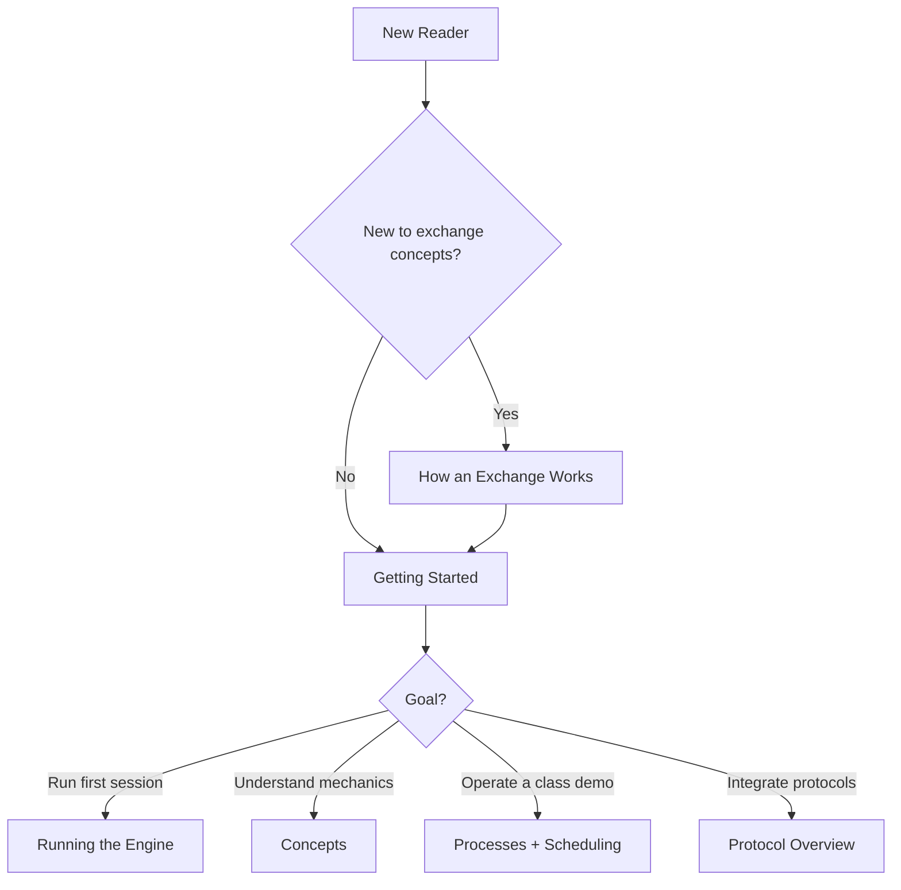
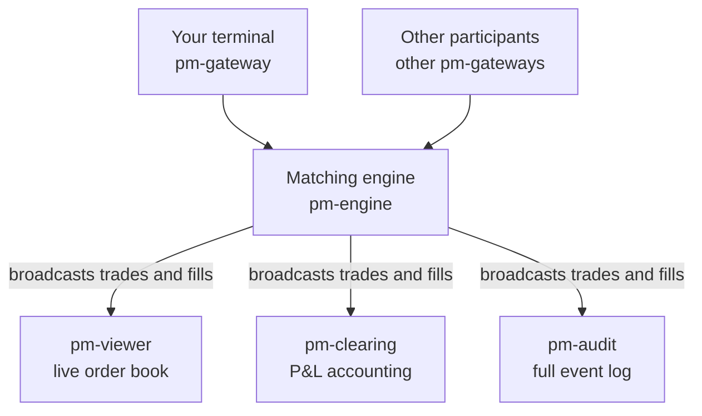

# EduMatcher, Educational Trading System

EduMatcher is a multi-process Python trading simulator for learning how exchanges work in practice.
It helps you build intuition for order matching, market microstructure, and exchange architecture through a runnable system.


**Figure 1: The Exchange with Order Books and the Central Matching Engine (CME).**

## Start Here

If you are new to exchanges, start with:

1. [How an Exchange Works](how-exchange-works.md). 
  This is a rather large book so for the first you should restrict the reading to Part I & II. The rest can be saved for when you need it.
2. [Getting Started](user-guide/00-getting-started.md). This will help you install EduMatcher.
3. [The Order Book](concepts/01-concepts-order-book.md). It cannot be overstated how important it is to thoroughly understand the concept of the *Order Book*
4. [Your First Trade](concepts/04-concepts-first-trade.md). Getting your feet wet before you run the exchange

If you are already familiar with trading, use this quick routing table:

| If you are... | Read this first | Then continue with |
|---|---|---|
| Hands-on user / instructor | [Getting Started](user-guide/00-getting-started.md) | [Configuration](user-guide/01-configuration.md) -> [Running the Engine](user-guide/03-running-the-engine.md) -> [Processes](user-guide/10-processes.md) |
| Developer extending the system | [Architecture Overview](architecture/01-architecture.md) | [Architecture Walkthrough](architecture/02-architecture-guide.md) -> [Messages](user-guide/09-messages.md) -> [Developer Info](developer/01-dev-practice.md) |
| Protocol reader | [Protocol Overview](user-guide/19-protocol-overview.md) | Choose protocol appendix and examples from there |



> Next step: Open [Getting Started](user-guide/00-getting-started.md) and pick either VM bootstrap or pipx install mode.

## What This System Models

In a real exchange, buy and sell orders meet in an order book managed by a matching engine.
EduMatcher reproduces that stack as separate processes communicating over a message bus, with all key behavior visible for learning and experimentation.



A trade occurs when orders cross, and matching follows price-time priority.
Better prices execute first; at the same price, earlier orders execute first.

> Next step: Read [The Order Book](concepts/01-concepts-order-book.md) to connect this model to concrete matching behavior.

## Reading Path (Beginner-Friendly)

1. [How an Exchange Works](how-exchange-works.md)
2. [Getting Started](user-guide/00-getting-started.md)
3. [The Order Book](concepts/01-concepts-order-book.md)
4. [Your First Trade](concepts/04-concepts-first-trade.md)
5. [P&L and Clearing](user-guide/07-pnl-clearing.md)
6. [A Full Trading Day](concepts/05-concepts-trading-day.md)

> Next step: Complete steps 1 to 4 first, then run a session and return for steps 5 and 6.

## Quick Start (Minimal)

For full setup details, see [Getting Started](user-guide/00-getting-started.md).

### Prerequisites

- Python 3.13+
- Either pipx (recommended for students/instructors) or Poetry (developer mode)

### Install

**Option 1: VM bootstrap mode (curl + Multipass)**

```bash
curl -fsSL https://raw.githubusercontent.com/johan162/EduMatcher/main/vm/curl_setup_vm.sh | bash -s -- --version 0.12.4 --snapshot
```

More details:
- [Getting Started](user-guide/00-getting-started.md)
- [VM runtime image](developer/05-vm-runtime-image.md)

**Option 2: Installed mode (pipx)**

```bash
pipx install edumatcher
pm-setup
```

### Run a minimal session

Open five terminals and run one process in each:

```bash
pm-engine --verbose
pm-audit --terminal
pm-clearing
pm-viewer --symbol AAPL
pm-gateway --id GW01
```

If you use Poetry, prefix commands with `poetry run`.

`GW01` must exist under `gateways.alf` in `engine_config.yaml`.

> Next step: Continue with [Running the Engine](user-guide/03-running-the-engine.md) for full process orchestration and troubleshooting.

## Self Paced Training

The [Training Manual](training/index.md) is a chapter-based, self-paced track for hands-on learning.
It complements the User Guide by turning concepts into guided exercises that you can run step by step.

If you want direct entry points, start with:

- [Installation](training/00-installation.md)
- [Configuring Startup](training/01-configuring-startup.md)
- [The First Trade](training/03-the-first-trade.md)
- [Auctions](training/07-auctions.md)
- [Risk Controls](training/11-risk-controls.md)

> Next step: Use [Training Index](training/index.md) as your checklist and cross-reference each chapter with the matching [User Guide](user-guide/00-getting-started.md) section.

## Next Stops

- [Configuration](user-guide/01-configuration.md)
- [Commands](user-guide/02-commands.md)
- [Running the Engine](user-guide/03-running-the-engine.md)
- [Gateway Commands](user-guide/08-gateway.md)
- [Protocol Overview](user-guide/19-protocol-overview.md)
