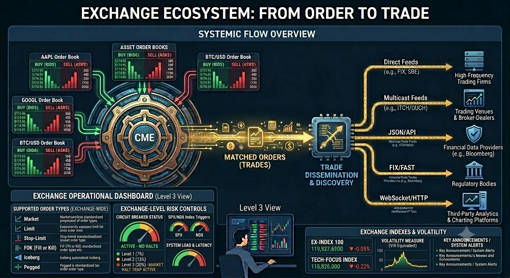
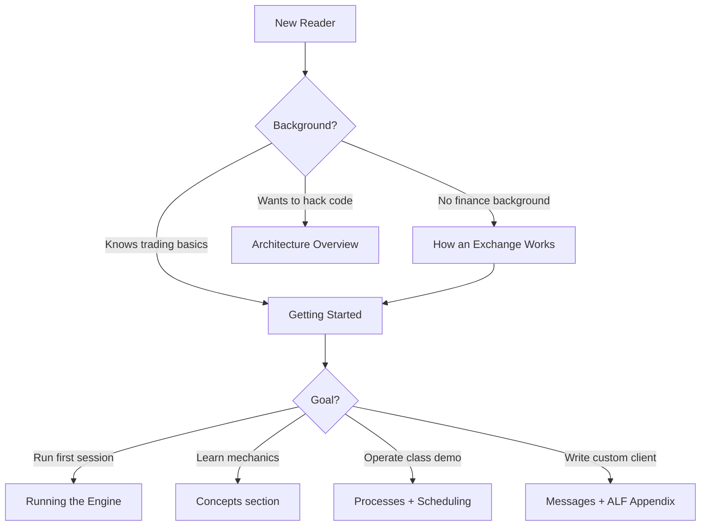
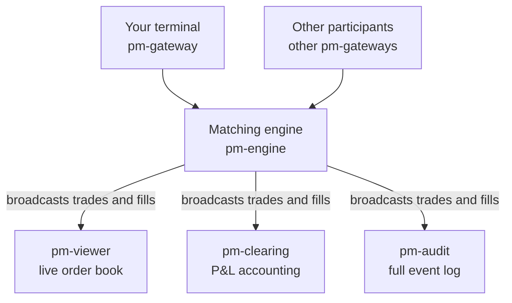

# EduMatcher, Educational Trading System

EduMatcher is a multi-process Python trading simulator designed to teach the fundamentals of
**order matching**, **market microstructure**, and **exchange architecture** through a hands-on,
fully runnable system.



**Figure 1: The Exchange with Order Books and the Central Matching Engine (CME).**

For more details on the core concept of the **Order Book** see [Concept Overview: Order Book](concepts/01-concepts-order-book.md)

## Start Here

Use this page as a routing guide based on your background and intent.

| If you are... | Read this first | Then continue with |
|---|---|---|
| New to finance / exchanges | [How an Exchange Works](how-exchange-works.md) | [Getting Started](user-guide/00-getting-started.md) → [The Order Book](concepts/01-concepts-order-book.md) → [Your First Trade](concepts/04-concepts-first-trade.md) |
| Familiar with trading, new to EduMatcher | [Getting Started](user-guide/00-getting-started.md) | [Running the Engine](user-guide/03-running-the-engine.md) → [Gateway Commands](user-guide/08-gateway.md) |
| Instructor running a classroom | [Getting Started](user-guide/00-getting-started.md) | [Configuration](user-guide/01-configuration.md) → [Processes](user-guide/10-processes.md) → [Auctions & Scheduling](user-guide/06-auctions-scheduling.md) |
| Developer extending the system | [Architecture Overview](architecture/01-architecture.md) | [Detailed Walkthrough](architecture/02-architecture-guide.md) → [Developer Info](developer/01-dev-practice.md) → [Order Book Deep Dive](concepts/02-concepts-order-book-deep-dive.md) |




## What Is This System Modelling?

When you buy a share of stock through a broker, your order travels to an
exchange — a regulated marketplace where buy and sell orders are matched. At
the heart of every exchange is a **matching engine**: software that maintains
an **order book** for each traded instrument, pairs buy orders with sell
orders, and produces **trades** when prices agree.

EduMatcher reproduces this entire stack as independent processes
communicating over a message bus, just as a real exchange does. The
difference is that here, everything is visible and inspectable:



A **trade** happens when two orders cross: a buyer willing to pay at least
what a seller is willing to accept. The matching engine applies
**price-time priority** — the best-priced order fills first; among orders at
the same price, the earliest one fills first.


## What You'll Learn

| Topic | Where |
|-------|-------|
| First run instructions with install modes | [Getting Started](user-guide/00-getting-started.md) |
| Exchange basics (for non-finance readers) | [How an Exchange Works](how-exchange-works.md) |
| Order books, bids, asks, spread, depth | [The Order Book](concepts/01-concepts-order-book.md) |
| How to execute your first trade | [Your First Trade](concepts/04-concepts-first-trade.md) |
| Session phases, opening & closing auctions | [A Full Trading Day](concepts/05-concepts-trading-day.md) |
| All ten order types with worked examples | [Order Types](user-guide/04-order-types.md) |
| Multi-leg combo and OCO strategies | [Combo Orders](user-guide/05-combos.md) |
| Realized vs. unrealized P&L, VWAP cost basis | [P&L & Clearing](user-guide/07-pnl-clearing.md) |
| ZeroMQ pub/sub architecture | [Architecture](architecture/01-architecture.md) |
| Definitions of all financial terms | [Glossary](glossary.md) |


## Suggested Reading Paths

### Path A: No finance background

1. **[How an Exchange Works](how-exchange-works.md)** — build intuition for buyers, sellers, order books, and trades
2. **[Getting Started](user-guide/00-getting-started.md)** — install and run your first end-to-end session
3. **[The Order Book](concepts/01-concepts-order-book.md)** — understand spread, depth, and price-time priority
4. **[Your First Trade](concepts/04-concepts-first-trade.md)** — walk through an execution from command to fill
5. **[P&L & Clearing](user-guide/07-pnl-clearing.md)** — connect fills to realized/unrealized outcomes

### Path B:  Hands-on user / instructor

1. **[Getting Started](user-guide/00-getting-started.md)**
2. **[Configuration](user-guide/01-configuration.md)**
3. **[Running the Engine](user-guide/03-running-the-engine.md)**
4. **[Gateway Commands](user-guide/08-gateway.md)**
5. **[Processes](user-guide/10-processes.md)** and **[Auctions & Scheduling](user-guide/06-auctions-scheduling.md)**

### Path C: Developer and protocol reader

1. **[Architecture Overview](architecture/01-architecture.md)**
2. **[Architecture Walkthrough](architecture/02-architecture-guide.md)**
3. **[Messages](user-guide/09-messages.md)**
4. **[ALF Protocol Appendix](user-guide/90-app-alf-protocol.md)**
5. **[BALF Protocol Appendix](user-guide/91-app-balf-protocol.md)**
6. **[CALF Protocol Appendix](user-guide/92-app-calf-protocol.md)**
7. **[Developer Info](developer/01-dev-practice.md)**

### When to read the Concepts section

The Concepts pages are best used as a **mental model track**. Read them when
you want intuition and context, then jump back to the User Guide when you are
ready to run commands.

| Concept page | Best time to read it |
|---|---|
| [The Order Book](concepts/01-concepts-order-book.md) | Before your first trade session |
| [Order Book Deep Dive](concepts/02-concepts-order-book-deep-dive.md) | After you've seen live fills and want matching details |
| [MM Quotes](concepts/03-concepts-mm-quotes.md) | Before enabling market-maker seeds / obligations |
| [Your First Trade](concepts/04-concepts-first-trade.md) | During your first hands-on run |
| [A Full Trading Day](concepts/05-concepts-trading-day.md) | Before using `pm-scheduler` and auction phases |
| [Market Data Feed (CALF)](concepts/06-concepts-market-data-feed.md) | When building or integrating market data consumers |


## Quick Start

This quick start points to the full walkthrough in
[Getting Started](user-guide/00-getting-started.md).

### Prerequisites

- Python 3.13+
- Either:
  - pipx (recommended for students/instructors), or
  - Poetry (for developers)

### Install (choose one)

**VM bootstrap mode (curl + Multipass)**

Prefer this mode if you want a ready-to-run Linux VM without installing Python
or cloning this repository on your host machine.

```bash
curl -fsSL https://raw.githubusercontent.com/johan162/EduMatcher/main/vm/curl_setup_vm.sh | bash -s -- --version 0.9.2 --snapshot
```

More information:
- [Getting Started - VM bootstrap mode](user-guide/00-getting-started.md)
- [Developer guide - VM runtime image](developer/05-vm-runtime-image.md)


**Installed mode (pipx)**

```bash
pipx install edumatcher
pm-setup
```

After `pm-setup`, choose one config bootstrap path:

```bash
# Option A: generate a fresh config from CLI flags
pm-config-gen --symbols AAPL MSFT --gateways TRADER01 TRADER02 OPS01:ADMIN --sessions-enabled --output engine_config.yaml

# Option B: start from the sample file copied by pm-setup
# and edit engine_config.yaml in place
```

For full generator options, see
[Configuration](user-guide/01-configuration.md#generate-configs-with-pm-config-gen).

**Developer mode (Poetry)**

```bash
git clone https://github.com/johan162/EduMatcher.git
cd EduMatcher
poetry install --with dev,docs
```

### Start the system (minimum viable session)

Open **five** terminal windows and run one process per window, in this order:

```bash
# Terminal 1 — Matching engine
pm-engine --verbose

# Terminal 2 — Audit log (printed to terminal)
pm-audit --terminal

# Terminal 3 — Clearing / P&L
pm-clearing

# Terminal 4 — Order book viewer for AAPL
pm-viewer --symbol AAPL

# Terminal 5 — Your gateway (user GW01)
pm-gateway --id GW01
```

If you are in developer mode, prefix each command with `poetry run`.

`GW01` must be configured under `gateways.alf` in `engine_config.yaml` or the
gateway will fail authentication and exit.

To add more users, watch more symbols, or enable auctions:

```bash
# Another user
pm-gateway --id GW02

# Watch MSFT in parallel
pm-viewer --symbol MSFT

# Global order status monitor
pm-orders

# Market statistics recorder
pm-stats

# Session scheduler (drives opening/closing auctions)
pm-scheduler --now
```

### One-command launch

On macOS, you can use the convenience launcher instead:

```bash
./tools/launch_all.sh
```

`tools/launch_all.sh` uses `osascript` to open new Terminal windows, so it is
macOS-specific rather than a generic background-process launcher.

### Browse the docs

```bash
poetry run mkdocs serve
# Open http://127.0.0.1:8000
```


## Reference Docs

### Ports used

| Socket | Address | Purpose |
|--------|---------|---------|
| Engine PULL | `tcp://127.0.0.1:5555` | Receive orders from gateways |
| Engine PUB  | `tcp://127.0.0.1:5556` | Broadcast all events to subscribers |
| Drop-copy PUB | `tcp://127.0.0.1:5557` | Broadcast fill-only drop-copy events |


## Console scripts

| Command | Description |
|---------|-------------|
| `pm-engine`   | Matching engine — the core process that must start first |
| `pm-gateway`  | User gateway (one per user) — accepts ALF commands on stdin ([ALF Protocol Reference](user-guide/90-app-alf-protocol.md)) |
| `pm-viewer`   | Live order book display for a single symbol |
| `pm-orders`   | Global order status monitor (all gateways, all symbols) |
| `pm-audit`    | Event logger — records every message to a rotating log file |
| `pm-clearing` | Trade settlement & P&L tracking |
| `pm-stats`    | Market statistics recorder (SQLite) — OHLCV, VWAP, snapshots |
| `pm-scheduler`| Session scheduler — drives auction/continuous phase transitions |
| `pm-ticker`   | Scrolling market-data ticker fed by `data/stats.db` and live books |
| `pm-board`    | Multi-symbol market board for demos or projections |
| `pm-ai-trader`| Single AI bot gateway/trader |
| `pm-ai-swarm` | Multi-agent AI trading swarm |


## Data files

Runtime files are created under your active data directory:

- Installed default: `~/.local/share/edumatcher`
- Source-checkout default: `<repo>/src/data/`
- Override in either mode: `EDUMATCHER_DATA_DIR`

| File | Content |
|------|---------|
| `gtc_orders.json` | Resting GTC orders — reloaded next trading day |
| `gtc_combos.json` | Resting GTC combo parents and child-link state |
| `book_stats.json` | Persisted per-symbol last-buy / last-sell context |
| `audit.log` | Full audit trail (rotating, max 10 MB × 5 files) |
| `clearing_report.csv` | Trade-by-trade settlement record |
| `stats.db` | SQLite database: daily OHLCV, snapshots, and trade log |


## Config directiry

EduMatcher resolves the engine configuration file using this priority order:

1. `--config` command-line flag on `pm-engine` / `pm-scheduler`
2. `EDUMATCHER_CONFIG` environment variable
3. Default location based on install mode

Default configuration location:

- Installed mode (`pipx install edumatcher`): `./engine_config.yaml` (current working directory)
- Source-checkout mode (Poetry/dev): `<repo>/engine_config.yaml`

Example:

```bash
export EDUMATCHER_CONFIG="$HOME/sessions/morning/engine_config.yaml"
pm-engine --verbose
```

