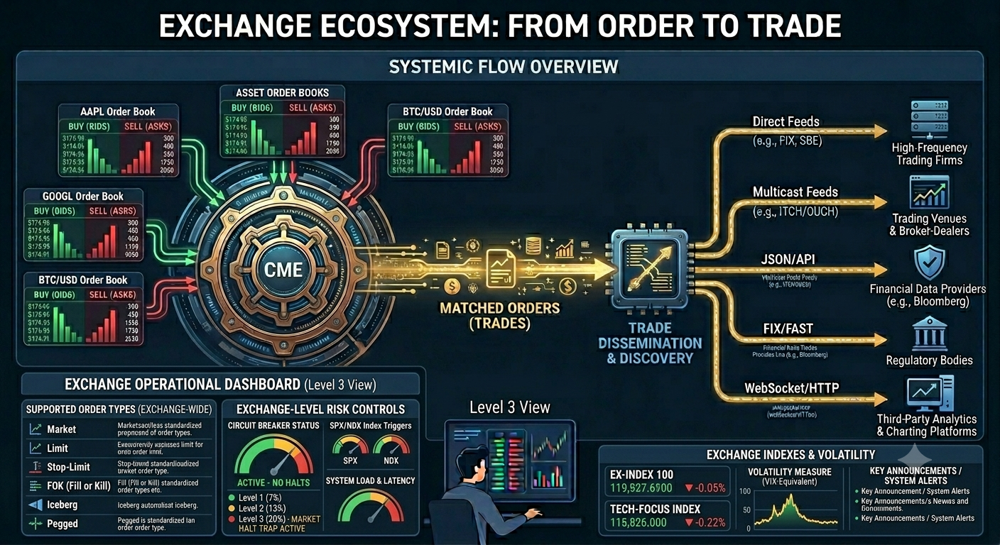
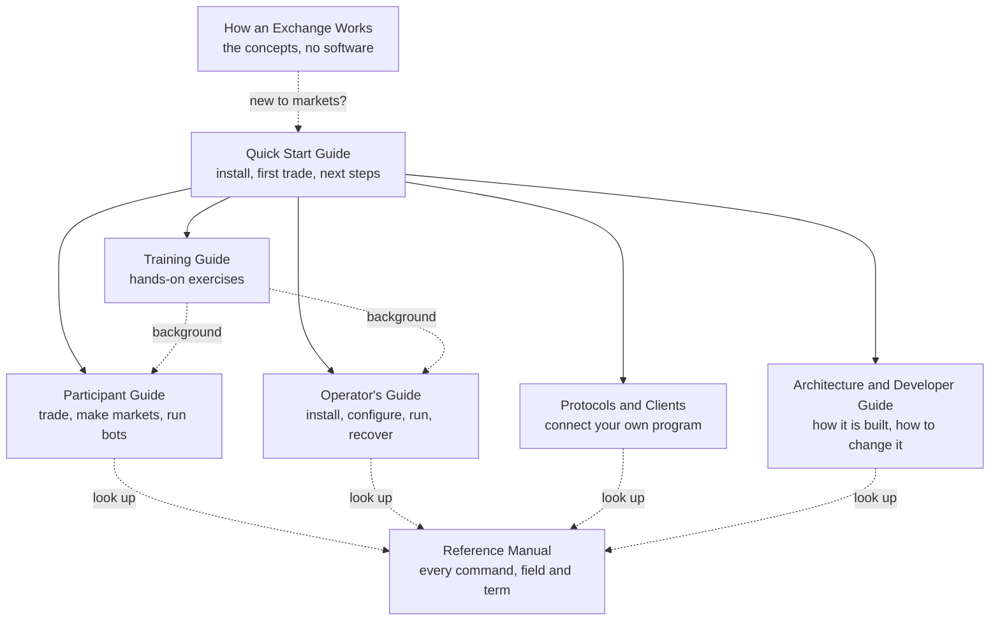

# EduMatcher Documentation

EduMatcher is an educational stock exchange you can run on your own computer.
It has a real matching engine and order books, a trading day with opening and
closing auctions, market makers, risk controls, statistics, profit-and-loss
tracking, an audit trail, external protocols and trading bots — close to a
real exchange in architecture and behavior, and built for learning how
exchanges work in practice.


**Figure 1: The exchange, with order books and the central matching engine.**

## Start here

| | Step | Time |
|---|---|---|
| **1** | **New to markets?** Read [How an Exchange Works](how-exchange-works.md). It explains order books, bids and asks, auctions and market makers without assuming any finance background. | an evening |
| **2** | **Everyone:** work through the [Quick Start Guide](books/quick-start/00-front/010-how-to-use-this-book.md). It installs the exchange, takes you through your first trade and a full trading day, and ends with your own configuration. | 1–3 hours |
| **3** | **Then choose your book** by what you want to do next — see the map and the table below, or the Quick Start's [Choose Your Next Book](books/quick-start/part-2-next-steps/030-choose-your-book.md). | — |

With Podman or Docker installed, this one command gets you a running exchange
and its five browser applications; the Quick Start's
[Install and Start](books/quick-start/part-1-see-it-run/020-install-and-start.md)
chapter explains what happens next:

```bash
curl -fsSL https://raw.githubusercontent.com/johan162/EduMatcher/main/deployment/curl/install.sh | bash
```

## The library

The documentation is a library of eight books. Each is written for one kind
of reader and one kind of task, so most people need only two or three of
them.


```mermaid
flowchart TD
    B0["How an Exchange Works\nthe concepts, no software"]
    QS["Quick Start Guide\ninstall, first trade, next steps"]
    TG["Training Guide\nhands-on exercises"]
    PG["Participant Guide\ntrade, make markets, run bots"]
    OG["Operator's Guide\ninstall, configure, run, recover"]
    PC["Protocols and Clients\nconnect your own program"]
    AD["Architecture and Developer Guide\nhow it is built, how to change it"]
    RM["Reference Manual\nevery command, field and term"]

    B0 -.->|"new to markets?"| QS
    QS --> TG
    QS --> PG
    QS --> OG
    QS --> PC
    QS --> AD
    TG -.->|"background"| PG
    TG -.->|"background"| OG
    PG -.->|"look up"| RM
    OG -.->|"look up"| RM
    PC -.->|"look up"| RM
    AD -.->|"look up"| RM
```

### Which books are for you

● = written for you, ○ = useful later

| Book | Student / trader | Instructor / operator | Client developer | Contributor |
|---|:---:|:---:|:---:|:---:|
| [How an Exchange Works](how-exchange-works.md) — exchange concepts without software | ● | ● | ● | ○ |
| [Quick Start Guide](books/quick-start/00-front/010-how-to-use-this-book.md) — install, first trade, first session | ● | ● | ● | ● |
| [Training Guide](books/training-guide/index.md) — 29 chapters of hands-on exercises | ● | ● | ○ | ○ |
| [Participant Guide](books/participant-guide/part-1-trading-basics/010-gateways-and-how-you-connect.md) — orders, auctions, market making, bots, P&L, trading screens | ● | ● | ○ | ○ |
| [Operator's Guide](books/operator-guide/part-1-install-and-deploy/010-installation.md) — install, configure, run, supervise and recover an exchange | ○ | ● | ○ | ○ |
| [Protocols and Clients](books/protocols-and-clients/part-1-choosing-and-connecting/010-protocols-overview.md) — the wire protocols, APIs and client examples | | ○ | ● | ○ |
| [Architecture and Developer Guide](books/architecture-and-development/part-1-architecture/010-architecture-overview.md) — the design, the code and how to change it | | | ○ | ● |
| [Reference Manual](books/reference-manual/part-1-command-line/010-processes-environment-and-ports.md) — commands, configuration fields, glossary | ○ | ● | ● | ● |

### I want to…

| I want to… | Start here | Then |
|---|---|---|
| understand what an exchange does | [How an Exchange Works](how-exchange-works.md) | [Quick Start: What EduMatcher Is](books/quick-start/part-1-see-it-run/010-what-is-edumatcher.md) |
| see EduMatcher run | [Quick Start: Install and Start](books/quick-start/part-1-see-it-run/020-install-and-start.md) | [Your First Trade](books/quick-start/part-1-see-it-run/030-your-first-trade.md) |
| learn by doing, step by step | [Training Guide](books/training-guide/index.md) | the chapters in order |
| trade or make markets | [Participant Guide: The Order Book](books/participant-guide/part-1-trading-basics/020-the-order-book.md) | [Order Types](books/participant-guide/part-2-orders/020-order-types.md) |
| run an exchange for a class | [Operator's Guide: Installation](books/operator-guide/part-1-install-and-deploy/010-installation.md) | [Running the Exchange](books/operator-guide/part-3-run/010-running-the-exchange.md) |
| find out why an order was rejected | [Participant Guide: The Trader Console](books/participant-guide/part-2-orders/010-the-trader-console.md) | [Operator's Guide: Risk Controls](books/operator-guide/part-4-run-a-market/040-risk-controls.md) |
| fix a configuration or startup problem | [Quick Start: When Something Does Not Work](books/quick-start/90-backmatter/020-when-something-does-not-work.md) | [Operator's Guide: Configuration Verifier](books/operator-guide/part-2-configure/020-config-verifier.md) |
| connect my own program | [Protocols and Clients: Protocols Overview](books/protocols-and-clients/part-1-choosing-and-connecting/010-protocols-overview.md) | the protocol's specification in Part II |
| understand or change the code | [Architecture](books/architecture-and-development/part-1-architecture/010-architecture-overview.md) | [Development Practice](books/architecture-and-development/part-4-developing/010-development-practice.md) |
| look up a command, field or term | [Reference Manual](books/reference-manual/part-1-command-line/010-processes-environment-and-ports.md) | [Glossary](books/reference-manual/90-backmatter/010-glossary.md) |

## Download the books

Every book is also available as an EPUB, for e-readers, screen readers and
adjustable text size:

| Book | EPUB |
|---|---|
| 📖 Quick Start Guide | [⬇️ Download](downloads/edumatcher_quick_start.epub) |
| 📖 Participant Guide | [⬇️ Download](downloads/edumatcher_participant_guide.epub) |
| 📖 Operator's Guide | [⬇️ Download](downloads/edumatcher_operator_guide.epub) |
| 📖 Reference Manual | [⬇️ Download](downloads/edumatcher_reference_manual.epub) |
| 📖 Protocols and Clients | [⬇️ Download](downloads/edumatcher_protocols_and_clients.epub) |
| 📖 Architecture and Developer Guide | [⬇️ Download](downloads/edumatcher_architecture_and_development.epub) |
| 📖 Training Guide | [⬇️ Download](downloads/edumatcher_training_guide.epub) |

Each book is also published as PDF on every
[GitHub release](https://github.com/johan162/EduMatcher/releases):

| Format | Best for |
|---|---|
| A4 light | Printed reference copies |
| B5 light | Compact print and tablets |
| A4 or B5 dark | Screen reading in low light |
| Chapter PDF | Sharing one focused chapter |

Contributors can build every format from a checkout with the targets in
`docs/Makefile` (`make help` in the `docs/` directory).

## What EduMatcher deliberately leaves out

EduMatcher keeps the parts of a real exchange that matter for learning and
simplifies the rest:

- **Authentication and authorization are minimal.** There is no hierarchy of
  members, firms and users; participants are identified by a configured ID.
- **There is no fault tolerance.** No hot-standby system, replication or
  failover; one machine runs the whole exchange.
- **Implied (synthetic) orders are not supported.** The Participant Guide
  explains the concept in [Implied Orders](books/participant-guide/part-2-orders/040-implied-orders.md).
- **Combo orders are not atomic.** They are a thin layer over the individual
  order books, not a book of their own.

The Reference Manual's
[Known Limitations](books/reference-manual/90-backmatter/020-known-limitations.md)
lists the rest.

!!! warning "Not for real trading"
    EduMatcher is for teaching and experimenting in a controlled
    environment. Never use it for real financial transactions.
