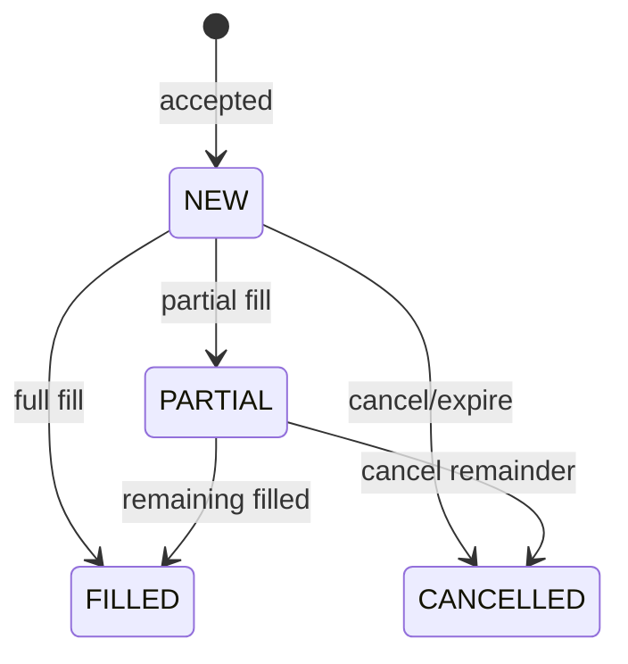

# 08 — Cancelling & Managing Orders

## Objective

Master the CANCEL, STATUS, and ORDERS commands for managing your resting orders
and understanding the order lifecycle.

---

## Exercise 1: Cancel a Resting Order

Place an order and then cancel it:

```
TRADER01> NEW|SYM=TSLA|SIDE=BUY|TYPE=LIMIT|QTY=100|PRICE=248.00|TIF=DAY
```

Note the `order_id`, then:

```
TRADER01> CANCEL|ORDER_ID=<order_id>
```

Expected: cancellation confirmed.

:material-checkbox-blank-outline: **Checkpoint:** order cancelled; STATUS shows status=CANCELLED.

---

## Exercise 2: Cancel a Partially Filled Order

1. Place a large limit buy at an aggressive price (to get a partial fill from the MM):
   ```
   TRADER01> NEW|SYM=AAPL|SIDE=BUY|TYPE=LIMIT|QTY=1000|PRICE=150.10|TIF=DAY
   ```

2. After partial fill, cancel the remainder:
   ```
   TRADER01> CANCEL|ORDER_ID=<order_id>
   ```

Expected: the unfilled portion is cancelled; the filled portion remains executed.

:material-checkbox-blank-outline: **Checkpoint:** cancel succeeds; filled qty preserved.

---

## Exercise 3: List All Resting Orders

The ORDERS command shows all your resting orders:

```
TRADER01> ORDERS
```

This displays order ID, symbol, side, type, price, qty, filled qty, and status
for every resting order belonging to your gateway.

:material-checkbox-blank-outline: **Checkpoint:** ORDERS lists your current resting orders.

---

## Exercise 4: Check Specific Order Status

```
TRADER01> STATUS|ORDER_ID=<order_id>
```

The response includes:

- `symbol`, `side`, `type`, `price`, `qty`
- `filled_qty`, `remaining_qty`
- `status` (NEW, PARTIAL, FILLED, CANCELLED)
- `tif`, timestamps

:material-checkbox-blank-outline: **Checkpoint:** STATUS returns full order details.

---

## Exercise 5: Cancel a Non-Existent Order

```
TRADER01> CANCEL|ORDER_ID=DOES_NOT_EXIST
```

Expected: rejection — order not found.

:material-checkbox-blank-outline: **Checkpoint:** error message returned cleanly.

---

## Exercise 6: Cancel Another Gateway's Order

Try cancelling an order belonging to TRADER02:

```
TRADER01> CANCEL|ORDER_ID=<trader02_order_id>
```

Expected: rejection — you can only cancel your own orders.

:material-checkbox-blank-outline: **Checkpoint:** cross-gateway cancel rejected.

---

## Exercise 7: Admin Kill Switch

From the admin gateway, cancel all orders for a specific gateway:

```
GW_ADMIN> KILL|GATEWAY_ID=TRADER01
```

All of TRADER01's resting orders are cancelled.

Or cancel all orders for a specific symbol across all gateways:

```
GW_ADMIN> CANCEL_SYM|SYM=TSLA
```

:material-checkbox-blank-outline: **Checkpoint:** admin commands successfully cancel orders.

---

## Order Lifecycle Summary



---

**Next:** [09 — Market Making](09-market-making.md)
