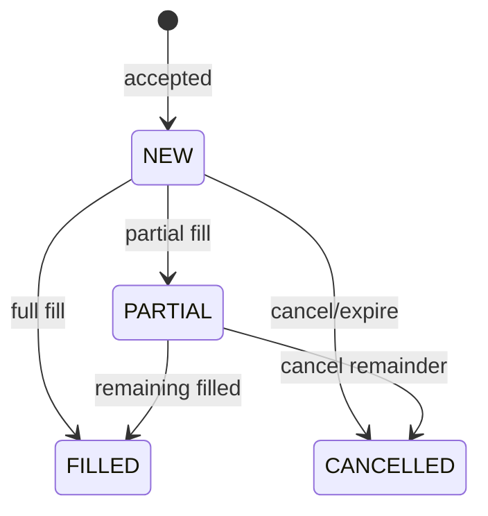

# Cancelling & Managing Orders

## Objective

Master the `STATUS`, `ORDERS`, and `CANCEL` commands for understanding gateway
state, inspecting resting orders, and managing the order lifecycle.

---

## Prerequisites

- Chapters 01–07 completed.
- At least one connected trader gateway with resting orders to manage.

---

## Exercise 1: Cancel a Resting Order

Place an order and then cancel it:

```
TRADER01> NEW|SYM=TSLA|SIDE=BUY|TYPE=LIMIT|QTY=100|PRICE=248.00|TIF=DAY
```

Note the `order_id`, then:

```
TRADER01> CANCEL|ID=<order_id>
```

Expected: cancellation confirmed.

:material-checkbox-blank-outline: **Checkpoint:** order cancelled; `ORDERS` no longer lists it as resting.

---

## Exercise 2: Cancel a Partially Filled Order

1. Place a large limit buy at an aggressive price (to get a partial fill from the MM):
   ```
   TRADER01> NEW|SYM=AAPL|SIDE=BUY|TYPE=LIMIT|QTY=1000|PRICE=150.10|TIF=DAY
   ```

2. After partial fill, cancel the remainder:
   ```
   TRADER01> CANCEL|ID=<order_id>
   ```

Expected: the unfilled portion is cancelled; the filled portion remains executed.

:material-checkbox-blank-outline: **Checkpoint:** cancel succeeds; filled qty preserved.

---

## Exercise 3: Compare STATUS and ORDERS

Place a fresh resting order so the gateway has something to inspect:

```
TRADER01> NEW|SYM=MSFT|SIDE=BUY|TYPE=LIMIT|QTY=25|PRICE=419.00|TIF=DAY
```

First run `STATUS`:

```
TRADER01> STATUS
```

`STATUS` gives a quick gateway/session summary: gateway ID, known symbols,
cached order counts by lifecycle state, cached quote legs, and position symbols.
It is useful for a fast health check, but it is not the detailed order table.

Now inspect the actual orders:

```
TRADER01> ORDERS
```

`ORDERS` is the gateway command for detailed order inspection. It displays order
ID, symbol, side, type, TIF, price, quantity, remaining quantity, and status for
orders belonging to your gateway.

Use `STATUS` when you need a quick health pulse. Use `ORDERS` when you are
debugging one specific order lifecycle.

:material-checkbox-blank-outline: **Checkpoint:** `STATUS` shows summary counts; `ORDERS` shows the full order row and ID.

---

## Exercise 4: Inspect Resting Order Details

```
TRADER01> ORDERS
```

Find your order in the table. The response includes:

- `symbol`, `side`, `type`, `price`, `qty`
- remaining quantity
- `status` (NEW, PARTIAL, FILLED, CANCELLED)
- `tif`, last update time

:material-checkbox-blank-outline: **Checkpoint:** `ORDERS` returns full details for each resting order.

---

## Exercise 5: Cancel a Non-Existent Order

```
TRADER01> CANCEL|ID=DOES_NOT_EXIST
```

Expected: rejection — order not found.

:material-checkbox-blank-outline: **Checkpoint:** error message returned cleanly.

---

## Exercise 6: Cancel Another Gateway's Order

Try cancelling an order belonging to TRADER02:

```
TRADER01> CANCEL|ID=<trader02_order_id>
```

Expected: rejection — you can only cancel your own orders.

:material-checkbox-blank-outline: **Checkpoint:** cross-gateway cancel rejected.

---

## Exercise 7: Admin Kill Switch

From the admin gateway, cancel all orders for a specific gateway:

```
GW_ADMIN> KILL|GATEWAY_ID=TRADER01
```

All of TRADER01's resting orders are cancelled.

Or cancel all orders for a specific symbol across all gateways:

```
GW_ADMIN> CANCEL_SYM|SYM=TSLA
```

:material-checkbox-blank-outline: **Checkpoint:** admin commands successfully cancel orders.

---

## Exercise 8: Inspect SYMBOLS Metadata from Gateway

Request the symbol catalog:

```
TRADER01> SYMBOLS
```

Look for metadata fields exposed in the gateway output (for example
`description`, `tick_size`, and any MM policy fields configured by the engine).

:material-checkbox-blank-outline: **Checkpoint:** you can explain how `SYMBOLS` complements config-file inspection during operations.

---

## Order Lifecycle Summary



---

## Further Reading

- [Gateway Commands](../user-guide/08-gateway.md)
- [Message Types (system.symbols)](../user-guide/09-messages.md)
- [ALF Protocol — Cancellation Semantics](../user-guide/20-app-alf-protocol.md)

---

**Next:** [09 — Market Making](09-market-making.md)
