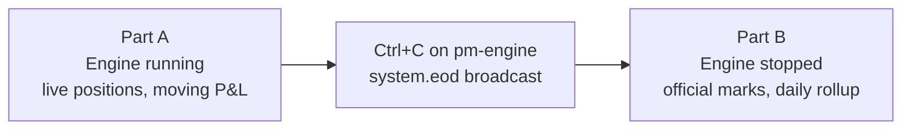

# P&L & Clearing

## Objective

Understand how the DB-backed clearing process tracks positions, computes VWAP
average cost, and reports realized and unrealized P&L per trader per symbol.
Gain hands-on proficiency with every `pm-clearing-cli` command verb — during
the trading day, at the close, and afterwards — and learn which of them are
meaningful in which of those three states.

!!! important "This chapter has three phases — check which one you are in"
    Clearing is the one subsystem whose most important behaviour only happens
    when the exchange **stops**. End-of-day marks are applied when the engine
    broadcasts `system.eod`, and it broadcasts that exactly once, during a
    graceful shutdown. So this chapter deliberately runs the exchange, then
    closes it, then keeps working on the data it left behind.

    Each part below is labelled with the state it needs. If an exercise returns
    nothing, the first thing to check is whether the engine is in the state
    that part assumes.

    | Part | Engine | Why |
    |---|---|---|
    | **A** — Intraday (Ex 1–10) | **Running**, with trading activity | You are watching positions and P&L change as trades arrive |
    | **B** — End of day (Ex 12–16) | **Stopped** — cleanly | The EOD sentinel and the official daily rollup only exist after `system.eod` |
    | **C** — Ongoing operations (Ex 17–18) | Either | Retention and restart behaviour are independent of a live session |

    `pm-clearing` itself keeps running throughout — it is the *engine* that
    stops between Part A and Part B.


!!! abstract "Pre-reading in the User Guide"
    - [P&L & Clearing](../user-guide/130-pnl-clearing.md)

## Prerequisites

- Chapters 01–11 completed.
- Live trading activity available (manual trading, AI traders, or both).


!!! note "Dates in this chapter"
    The commands use `$(date +%F)` — today's date — rather than a fixed one,
    so they return your own session's rows. If a query comes back empty, check
    with `pm-clearing-cli dates` which trading dates actually have data.

## Background

### What pm-clearing stores

`pm-clearing` subscribes to `trade.executed` events and persists all state in
`clearing.db` (SQLite WAL mode). There is no CSV artifact — everything is in
the database.

| Table | Purpose |
|---|---|
| `trade_events` | Append-only trade audit log |
| `gateway_symbol_positions` | Running live position per gateway/symbol |
| `gateway_daily_summary` | Daily rollup aggregates |
| `session_events` | EOD sentinel rows written on `system.eod` |
| `gateway_sessions` | Gateway connect/disconnect history |

### What pm-clearing maintains per position

- **net_qty** — signed quantity (positive = long, negative = short, 0 = flat)
- **avg_cost** — VWAP of entry prices (per unit; never multiplied by quantity)
- **realized_pnl** — profit/loss locked in by closing or crossing trades
- **unrealized_pnl** — paper profit/loss: `net_qty × (mark_price − avg_cost)`

### Position state machine

A position starts flat and transitions as fills arrive:

```
Flat → Long  (BUY fill opens a long)
Flat → Short (SELL fill opens a short)
Long → Flat  (SELL fill closes the full position, close_qty == net_qty)
Long → Short (SELL fill exceeds net_qty — cross-zero)
Short → Flat (BUY fill closes the full position)
Short → Long (BUY fill exceeds abs(net_qty) — cross-zero)
```

A cross-zero fill realizes P&L on the closing portion and sets `avg_cost` to
the fill price for the newly-opened side.

---

## Part A — Intraday exercises

!!! info "Engine: **running**"
    Everything in Part A assumes a live exchange with trades flowing. If your
    book is quiet, start `pm-mm-bot` or the AI traders from Chapter 14 so there
    is something to clear.


### Exercise 1: Start the clearing service

```bash
pm-clearing
```

Expected:

```
[INFO] Clearing connected - listening for trade events
```

:material-checkbox-blank-outline: **Checkpoint:** clearing service is running.

---

### Exercise 2: Check DB health

In a second terminal:

```bash
pm-clearing-cli health
```

Expected: one row showing the DB path, row counts for each table, the last
trade and last flush timestamps, and `wal_mode` enabled.

Run `health` again after a few trades to see the row counts grow.

:material-checkbox-blank-outline: **Checkpoint:** `health` returns a row with WAL mode enabled.

---

### Exercise 3: Build a long position and query it

From TRADER01:

```
[TRADER01]> NEW|SYM=AAPL|SIDE=BUY|TYPE=MARKET|QTY=200
[TRADER01]> NEW|SYM=AAPL|SIDE=BUY|TYPE=MARKET|QTY=100
```

Query the position:

```bash
pm-clearing-cli positions --gateway TRADER01 --symbol AAPL
```

Confirm:

- `net_qty` ≈ 300
- `avg_cost` is the VWAP of the two fills (not the last price alone)
- `buy_qty` is 300, `sell_qty` is 0

Query all open positions across every gateway and symbol:

```bash
pm-clearing-cli positions
```

:material-checkbox-blank-outline: **Checkpoint:** `positions` shows the AAPL long for TRADER01 with correct VWAP avg_cost.

---

### Exercise 4: Inspect the raw trade event log

```bash
pm-clearing-cli trades --gateway TRADER01 --symbol AAPL --limit 10
```

Each row is one matched fill. Observe: `id`, `trade_date`, `symbol`,
`quantity`, `price`, `tick_decimals`, `buy_gateway_id`, `sell_gateway_id`,
`aggressor_side`.

Switch format to JSON:

```bash
pm-clearing-cli --format json trades --gateway TRADER01 --symbol AAPL --limit 3
```

Export all trades for a date to CSV for a spreadsheet:

```bash
pm-clearing-cli --format csv trades --date "$(date +%F)" > trades_today.csv
```

:material-checkbox-blank-outline: **Checkpoint:** you can retrieve fills in table, JSON, and CSV formats.

---

### Exercise 5: Realize P&L by partially closing

Sell part of the AAPL position:

```
[TRADER01]> NEW|SYM=AAPL|SIDE=SELL|TYPE=MARKET|QTY=100
```

Expected accounting:

```
realized_pnl += (sell_price - avg_cost) x 100
net_qty = 200
```

Query:

```bash
pm-clearing-cli pnl --gateway TRADER01 --symbol AAPL
```

Confirm `realized_pnl` is non-zero and `total_pnl = realized_pnl + unrealized_pnl`.

Query the exchange-wide P&L across every gateway in one row per gateway:

```bash
pm-clearing-cli pnl
```

:material-checkbox-blank-outline: **Checkpoint:** `pnl` shows realized P&L on the partial close.

---

### Exercise 6: Cross-zero position

This is the most complex accounting path. Starting from the 200-share AAPL long:

```
[TRADER01]> NEW|SYM=AAPL|SIDE=SELL|TYPE=MARKET|QTY=300
```

This single order closes all 200 long shares **and** opens a 100-share short.

Expected accounting after the cross:

```
realized_pnl += (sell_price - avg_cost) x 200   ← the closing portion
net_qty      = -100                              ← new short side
avg_cost     = sell_price                        ← reset to open price of new side
```

Verify:

```bash
pm-clearing-cli positions --gateway TRADER01 --symbol AAPL
pm-clearing-cli pnl      --gateway TRADER01 --symbol AAPL
```

Close the short:

```
[TRADER01]> NEW|SYM=AAPL|SIDE=BUY|TYPE=MARKET|QTY=100
```

```bash
pm-clearing-cli pnl --gateway TRADER01 --symbol AAPL
```

Position should return to flat (`net_qty = 0`) with `realized_pnl` reflecting
both the original long close and the short round-trip.

:material-checkbox-blank-outline: **Checkpoint:** cross-zero P&L is realized correctly on the closing portion.

---

### Exercise 7: Exposure — net and gross notional

With a few positions open across symbols:

```bash
pm-clearing-cli exposure
```

Default sort is `gross_notional` (largest exposure first). Try other sorts:

```bash
pm-clearing-cli exposure --sort total_pnl
pm-clearing-cli exposure --sort net_notional
```

Fields include `net_qty`, `mark_price`, `net_notional`, `gross_notional`,
`realized_pnl`, `unrealized_pnl`, `total_pnl`.

This is the clearing house **risk concentration view**: a large `gross_notional`
with small `net_notional` means a participant is running offsetting positions that
could unwind rapidly.

:material-checkbox-blank-outline: **Checkpoint:** you can rank all positions by exposure and P&L.

---

### Exercise 8: Gateway-level P&L summary

To see every participant's P&L in a single query:

```bash
pm-clearing-cli gateways
```

Output: one row per gateway with `realized_pnl_total`, `unrealized_pnl_total`,
`total_pnl`, `net_qty_total`.

Filter to one participant:

```bash
pm-clearing-cli gateways --gateway TRADER01
```

Export for downstream reporting:

```bash
pm-clearing-cli --format csv gateways > gateway_pnl.csv
pm-clearing-cli --format json gateways > gateway_pnl.json
```

This is the clearing house **top-level risk snapshot**: one row per participant,
usable without knowing which symbols they traded.

:material-checkbox-blank-outline: **Checkpoint:** `gateways` returns a P&L summary row for each active participant.

---

### Exercise 9: Symbol-level clearing totals

Query what was cleared per symbol across all gateways:

```bash
pm-clearing-cli symbols
```

Sort by traded volume or P&L:

```bash
pm-clearing-cli symbols --sort traded_qty
pm-clearing-cli symbols --sort realized_pnl
```

Fields include `symbol`, `traded_qty`, `traded_notional`, `realized_pnl`,
`open_net_qty`, `open_unrealized_pnl`.

:material-checkbox-blank-outline: **Checkpoint:** `symbols` shows per-symbol volume and P&L across all participants.

---

### Exercise 10: Normalized vs raw-output

By default, price-derived fields are divided by `10^tick_decimals` to produce
display-currency units. Use `--raw-output` to see the raw integer tick values:

```bash
pm-clearing-cli positions --gateway TRADER01 --symbol AAPL
pm-clearing-cli --raw-output positions --gateway TRADER01 --symbol AAPL
```

Rules:
- `avg_cost` **is** normalized like the other price columns. It holds fractional ticks, so without normalization it would render 100x off next to `mark_price`
- Fields like `mark_price`, `realized_pnl`, `unrealized_pnl`, `buy_notional`, `sell_notional` are normalized by default

Use `--raw-output` when piping into scripts that expect tick integers, or when
debugging a suspected normalization issue.

:material-checkbox-blank-outline: **Checkpoint:** you can explain which fields are normalized and why `--raw-output` exists.

---

## Interlude — Closing the trading day

Everything in Part A was a *running* view: positions and unrealized P&L that
change with the next trade. Part B is about the *official* numbers — the ones a
clearing house would settle on. Those do not exist yet, and this section is how
you create them.

### Why the engine has to stop

The engine broadcasts `system.eod` from its **graceful shutdown path** and
nowhere else. There is no "run EOD now" command: closing the session moves the
phase to `CLOSED`, but the end-of-day marks are applied when the engine exits
cleanly. That single message is what turns a live position into a settled one.



### Exercise 11: Close the day

Do these in order. The order matters: `pm-clearing` must still be running when
the engine sends `system.eod`, or the message has nobody to receive it.

**1. Note your open positions**, so you can compare them with the settled
numbers afterwards:

```bash
pm-clearing-cli positions > /tmp/positions-before-eod.txt
cat /tmp/positions-before-eod.txt
```

**2. Close the session** from the operator console:

```
[GW_ADMIN|ADMIN]> SESSION|STATE=CLOSED
```

**3. Stop the engine cleanly.** Press `Ctrl+C` in the `pm-engine` terminal —
**not** `kill -9`. Wait for the shutdown messages; the engine saves GTC state,
book statistics, and then broadcasts EOD.

**4. Leave `pm-clearing` running.** It receives `system.eod` and applies the
marks. Watch its terminal: you should see it flush and write.

!!! warning "A hard kill skips EOD entirely"
    `kill -9` gives the engine no chance to run its shutdown path, so no
    `system.eod` is ever sent, no marks are applied, and every exercise in Part
    B returns nothing. If that happens, restart the engine, generate a trade or
    two, and close it properly this time.

:material-checkbox-blank-outline: **Checkpoint:** the engine has exited cleanly,
`pm-clearing` is still running, and its log shows it handled the EOD message.

---

## Part B — End-of-day exercises

!!! info "Engine: **stopped** (cleanly). `pm-clearing` still running."
    If you skipped the Interlude, go back and do it — none of the rows these
    exercises query exist until the engine has broadcast `system.eod`.

End-of-day (EOD) is when the clearing house finalizes marks, settles daily P&L,
and prepares tomorrow's opening state. `pm-clearing` handles this automatically
when the engine sends `system.eod`, but as a clearing operator you need to
verify and audit the result.

### What happens at EOD

When `pm-clearing` receives `system.eod`:

1. **Force-flushes** any buffered trades immediately
2. Applies official EOD **mark-to-market** using last-trade price (or mid-price
   if no trade occurred) to update `mark_price` and `unrealized_pnl`
3. Writes updated positions to `gateway_symbol_positions` so
   `end_unrealized_pnl` in `gateway_daily_summary` reflects the official EOD mark
4. Inserts an `EOD` sentinel row into `session_events`

---

### Exercise 12: Verify the EOD sentinel

The sentinel is your proof that marks were applied — the first thing to check
before trusting any settled number:

```bash
pm-clearing-cli eod --limit 5
```

Each row shows the timestamp and a `payload_json` containing the mark prices
applied. The `eod` sentinel is proof that marks were applied.

:material-checkbox-blank-outline: **Checkpoint:** `eod` returns at least one row with mark prices in `payload_json`.

---

### Exercise 13: Inspect the daily rollup, and compare it with Part A

Query the official daily summary for today:

```bash
pm-clearing-cli daily --date "$(date +%F)"
```

Now compare `end_unrealized_pnl` here with the `unrealized_pnl` you saved in
Exercise 11:

```bash
pm-clearing-cli positions
diff /tmp/positions-before-eod.txt <(pm-clearing-cli positions) || true
```

The numbers may differ, and understanding *why* is the point of this part.
Before EOD, `unrealized_pnl` was marked against whatever the last trade
happened to be at that instant. After EOD it is marked against the official
close — the last trade of the session, or the mid if the symbol never traded.
Only the second one is a number a clearing house would settle on.

:material-checkbox-blank-outline: **Checkpoint:** you can point at one position
whose mark changed at EOD, and say which price each version was marked against.

Filter to one gateway:

```bash
pm-clearing-cli daily --date "$(date +%F)" --gateway TRADER01
```

Key fields:
- `traded_qty`, `traded_notional` — total volume for the day
- `buy_qty`, `sell_qty`, `buy_notional`, `sell_notional` — side breakdown
- `end_net_qty`, `end_avg_cost`, `end_unrealized_pnl` — official EOD position state

Export the day's summary for settlement reporting:

```bash
pm-clearing-cli --format csv daily --date "$(date +%F)" > daily_settlement_$(date +%F).csv
```

Query across multiple days:

```bash
pm-clearing-cli daily --from "$(date +%F)" --to "$(date +%F)" --gateway TRADER01
```

:material-checkbox-blank-outline: **Checkpoint:** daily rollup contains `end_*` fields populated by the EOD mark pass.

---

### Exercise 14: Browse available trading dates

```bash
pm-clearing-cli dates
```

Add volume and net-amount totals per date:

```bash
pm-clearing-cli dates --with-totals
```

Filter by symbol to see on which days that symbol traded:

```bash
pm-clearing-cli dates --symbol AAPL
```

:material-checkbox-blank-outline: **Checkpoint:** you can navigate which dates have clearing data.

---

### Exercise 15: Reconciliation check

After EOD, verify that raw `trade_events` aggregates match `gateway_daily_summary`:

```bash
pm-clearing-cli reconcile --from "$(date +%F)" --to "$(date +%F)"
```

Expected:
- `OK — no discrepancies found.` when consistent
- Rows showing side / date / gateway / symbol / quantity-diff / notional-diff if not

Reconcile across the whole week:

```bash
pm-clearing-cli reconcile --from "$(date +%F)" --to "$(date +%F)"
```

If discrepancies appear, use `trades` to investigate the affected gateway/symbol/date.

:material-checkbox-blank-outline: **Checkpoint:** you can run a full reconciliation and interpret the result.

---

### Exercise 16: Session history

Query gateway connect and disconnect events recorded during the session:

```bash
pm-clearing-cli sessions
```

Show only sessions that have not yet disconnected (still open):

```bash
pm-clearing-cli sessions --connected-only
```

This is the operational audit trail for: who connected, when, and whether
they disconnected cleanly or the engine was killed unexpectedly.

:material-checkbox-blank-outline: **Checkpoint:** `sessions` returns at least one row per gateway that connected today.

---

## Part C — Ongoing operations

!!! info "Engine: **either**"
    Retention and restart behaviour do not depend on a live session. You can do
    these with the exchange still down, or after restarting it.

### Exercise 17: Data retention and pruning

`pm-clearing` prunes old `trade_events` rows on startup. The default window is
90 days. Control it with `--retention-days`:

```bash
# Start clearing with 30-day retention
pm-clearing --retention-days 30
```

Use `pm-clearing-cli prune` for on-demand pruning without restarting:

```bash
# Dry run — see how many rows would be deleted
pm-clearing-cli prune --days 30 --dry-run

# Actually prune and VACUUM
pm-clearing-cli prune --days 30
```

Use `--dry-run` first to avoid unintended data loss.
`prune` is the only `pm-clearing-cli` verb that writes to the database.

:material-checkbox-blank-outline: **Checkpoint:** you can run a dry-run prune and interpret the row count.

---

### Exercise 18: Reopen the exchange and confirm the settled day survives

The last thing a clearing operator needs to trust is that yesterday's settled
numbers are still there tomorrow, and that a new session does not disturb them.

**1. Restart the exchange** — engine, scheduler, gateways and market makers, as
in Chapter 01. `pm-clearing` can keep running throughout, or be restarted; both
work, because the state lives in `clearing.db`, not in memory.

**2. Confirm the closed day is intact:**

```bash
pm-clearing-cli dates
pm-clearing-cli daily --date "$(date +%F)"
```

The row you inspected in Exercise 13 should be unchanged.

**3. Trade once, then look again.** Submit a single order from a trader console
and let it fill, then:

```bash
pm-clearing-cli positions
pm-clearing-cli daily --date "$(date +%F)"
```

`positions` moves — that is the new session's live state. The settled
`end_unrealized_pnl` from the closed day does not change retroactively; the
rollup accumulates the new activity into the current trading date.

:material-checkbox-blank-outline: **Checkpoint:** the settled daily row survives
the restart, and you can explain which numbers are historical (fixed) and which
are live (moving).

!!! tip "This is the whole mental model of the chapter"
    `positions` and `pnl` answer *"where do we stand right now?"* and change
    with every fill. `daily`, `eod` and `sessions` answer *"what did we settle
    for that day?"* and are written once. Knowing which question a verb answers
    tells you whether the engine needs to be running for it to mean anything.

---

## Key Formulas

| Metric | Formula |
|--------|---------|
| Average cost (long) | $\frac{\sum(\text{buy\_price} \times \text{buy\_qty})}{\sum \text{buy\_qty}}$ |
| Realized P&L (closing sell) | $(\text{sell\_price} - \text{avg\_cost}) \times \text{qty\_closed}$ |
| Unrealized P&L (long) | $(\text{mark\_price} - \text{avg\_cost}) \times \text{net\_qty}$ |
| Unrealized P&L (short) | $(\text{avg\_cost} - \text{mark\_price}) \times |\text{net\_qty}|$ |
| Cross-zero realized | $(\text{fill\_price} - \text{avg\_cost}) \times |\text{old\_net\_qty}|$ |

---

## pm-clearing-cli verb reference

The **Answers** column is the one to internalise: a *live* verb changes with
the next fill, a *settled* verb is written once and then never moves.

| Verb | Answers | What it returns | Key options |
|---|---|---|---|
| `gateways` | live | One row per gateway: total realized, unrealized, total P&L | `--gateway`, `--limit` |
| `positions` | live | Full live position state per gateway/symbol | `--gateway`, `--symbol`, `--limit` |
| `pnl` | live | Focused P&L view (no qty/notional detail) | `--gateway`, `--symbol`, `--limit` |
| `exposure` | live | Net/gross notional exposure, sorted by size | `--gateway`, `--symbol`, `--sort`, `--limit` |
| `health` | live | DB row counts, last flush, WAL mode | — |
| `trades` | historical | Raw trade-level audit log | `--gateway`, `--symbol`, `--date`, `--from`, `--to`, `--limit` |
| `symbols` | historical | Symbol-level volume, notional, P&L | `--date`, `--from`, `--to`, `--sort`, `--limit` |
| `dates` | historical | Available trading dates | `--gateway`, `--symbol`, `--from`, `--to`, `--limit`, `--with-totals` |
| `sessions` | historical | Gateway connect/disconnect history | `--gateway`, `--from`, `--to`, `--limit`, `--connected-only` |
| `daily` | **settled** | Daily rollup + EOD snapshots | `--gateway`, `--symbol`, `--date`, `--from`, `--to`, `--limit` |
| `eod` | **settled** | EOD sentinel rows with mark prices | `--from`, `--to`, `--limit` |
| `reconcile` | historical | Raw vs summary discrepancies | `--gateway`, `--symbol`, `--from`, `--to`, `--retention-days` |
| `prune` | maintenance | Delete old `trade_events` + VACUUM (**writes**) | `--days`, `--dry-run` |

The two **settled** verbs are the ones that return nothing until the engine has
shut down cleanly at least once — that is the whole reason this chapter has an
Interlude in the middle.

Global options apply to all verbs and must be given **before** the verb:
`--format table|json|csv`, `--no-header`, `--raw-output`, `--datapath PATH`,
`--db-name NAME`.

```bash
# checkdocs: ignore  — the second line is a deliberate counter-example
pm-clearing-cli --format json positions      # correct
pm-clearing-cli positions --format json      # argparse error: unrecognized arguments
```

---

## Reflection

Why does realized P&L use the trade price at the moment of the closing fill,
while unrealized P&L keeps recalculating against the current mark? In the
cross-zero scenario, why is realized P&L computed only on the closing portion
and not the new opening portion?

At end-of-day, which three `pm-clearing-cli` commands would you run in order
to: (1) confirm the EOD mark was applied, (2) export the official daily
settlement file, and (3) check the audit integrity of the day's clearing?

An operator reports that `daily` returns no rows for yesterday, even though
`trades` clearly shows yesterday's activity. Give two different explanations
that are both consistent with that evidence, and say which command you would
run to tell them apart.

---

## Further Reading

- [P&L & Clearing](../user-guide/130-pnl-clearing.md)
- [Messages](../user-guide/270-message-reference.md)
- [Statistics and Reporting](../user-guide/140-statistics-and-reporting.md)
- [Your First Trade](../concepts/04-concepts-first-trade.md)

**Next:** [13 — Market Data & Drop Copy](130-market-data-drop-copy.md)
