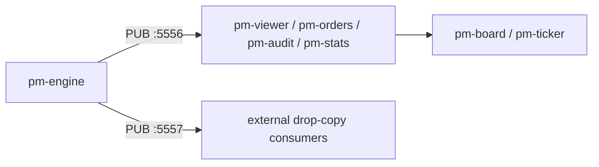

# Market Data & Drop Copy

## Objective

Observe real-time market data with the current EduMatcher tools and understand
where the engine's drop-copy feed fits into the architecture.

 

## Prerequisites

- Chapters 01–12 completed.
- Engine and at least one trader gateway active so events are visible.

 

## Background

EduMatcher publishes two event streams from `pm-engine`:

- **PUB :5556** — primary market data: books, trades, session state, order events.
- **PUB :5557** — drop-copy feed: per-participant fill events for risk,
  compliance, and back-office consumers.

There is no separate `pm-drop-copy` process. The engine binds the drop-copy feed
itself when it starts.

 

## Exercise 1: Open a Live Book Viewer

Start a live viewer for AAPL:

```bash
pm-viewer --symbol AAPL --depth 10
```

In a trader gateway, place or cancel a resting order and watch the viewer update:

```
TRADER01> NEW|SYM=AAPL|SIDE=BUY|TYPE=LIMIT|QTY=100|PRICE=149.80|TIF=DAY
```

:material-checkbox-blank-outline: **Checkpoint:** `pm-viewer` changes when the book changes.

 

## Exercise 2: Run the Cross-Gateway Order Monitor

Start the order monitor:

```bash
pm-orders
```

Now place orders from both `TRADER01` and `TRADER02`. The monitor should show
resting order state across gateways.

:material-checkbox-blank-outline: **Checkpoint:** `pm-orders` shows orders from multiple gateways.

 

## Exercise 3: Capture Events with pm-audit

Start the audit logger in terminal mode:

```bash
pm-audit --terminal
```

Execute a trade:

```
TRADER01> NEW|SYM=AAPL|SIDE=BUY|TYPE=MARKET|QTY=100
```

Watch `pm-audit` print the resulting events. This is the easiest training-safe
way to observe the event stream without writing a custom ZMQ subscriber.

:material-checkbox-blank-outline: **Checkpoint:** audit output shows the trade/order lifecycle events.

 

## Exercise 4: Confirm the Drop-Copy Feed Is Bound

Restart `pm-engine --verbose` and look for this startup line:

```
[ENGINE] Drop copy PUB bound on port 5557
```

That confirms the drop-copy publisher is active. It is intended for external
risk/compliance subscribers and publishes topics such as
`drop_copy.event.<gateway_id>`.

:material-checkbox-blank-outline: **Checkpoint:** you can identify the drop-copy socket in engine startup output.

 

## Exercise 5: Subscribe to the Drop-Copy Feed Directly

`pm-audit`/`pm-viewer`/`pm-orders` all read the *public* feed on port 5556.
None of them show you the drop-copy feed itself. To see it, connect a minimal
ZMQ subscriber:

```bash
python - <<'PY'
import json
import zmq

ctx = zmq.Context()
sock = ctx.socket(zmq.SUB)
sock.connect("tcp://127.0.0.1:5557")
sock.subscribe(b"drop_copy.event.")

print("listening on drop_copy.event.*")
for _ in range(10):
    topic, payload = sock.recv_multipart()
    msg = json.loads(payload)
    print(topic.decode(), "seq=", msg.get("seq"), "gateway=", msg.get("gateway_id"),
          "event_type=", msg.get("event_type"))
PY
```

While this is running, execute a trade from `TRADER01` in another terminal:

```
TRADER01> NEW|SYM=AAPL|SIDE=BUY|TYPE=MARKET|QTY=100
```

You should see one `drop_copy.event.<gateway_id>` message per participant on
each side of the trade, each with its own monotonically increasing `seq`.

:material-checkbox-blank-outline: **Checkpoint:** you received at least one drop-copy message directly from port 5557, distinct from anything `pm-audit` printed on port 5556.

 

## Exercise 6: Compare Public Events and Drop-Copy Purpose

Execute another trade and compare what each consumer is for:

| Consumer | Source | Purpose |
|----------|--------|---------|
| `pm-viewer` | PUB :5556 | Human-readable book view |
| `pm-orders` | PUB :5556 | Cross-gateway resting order monitor |
| `pm-audit --terminal` | PUB :5556 | Full event stream for inspection/logging |
| External drop-copy client | PUB :5557 | Per-participant fill feed for risk/compliance |

:material-checkbox-blank-outline: **Checkpoint:** explain why drop-copy is separate from the public market-data stream.

 

## Exercise 7: Launch the Market Board

Start the multi-symbol dashboard:

```bash
pm-board --rows 8 --interval 10
```

If `pm-stats` is running, `pm-board` combines live book state with recent OHLCV
context from `stats.db`.

:material-checkbox-blank-outline: **Checkpoint:** board shows AAPL, MSFT, and TSLA in one view.

 

## Key Architecture



 

## Reflection

Why does the engine publish drop-copy events on a **separate** socket
(`:5557`) rather than mixing them into the same `:5556` PUB feed that
viewers, orders, audit, and stats all subscribe to? What operational problem
would arise for a compliance drop-copy consumer if it shared a socket with
high-volume book/viewer traffic?

## Further Reading

- [Messages](../user-guide/270-messages.md)
- [Drop Copy](../user-guide/200-drop-copy.md)
- [Processes](../user-guide/170-processes.md)
- [CALF Protocol Reference](../user-guide/920-app-calf-protocol.md)
- [Market Data Feed](../concepts/06-concepts-market-data-feed.md)

**Next:** [14 — AI Traders & Swarm](14-ai-traders.md)

For a fuller hands-on tour of every viewer and observer process, see
[18 — Exchange Observer Processes](18-exchange-observer-processes.md).
