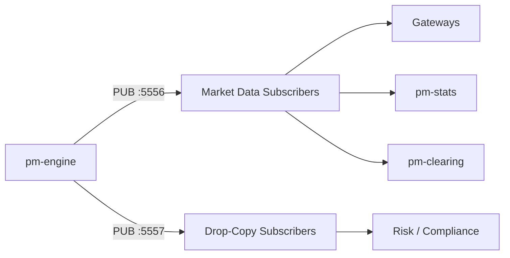

# 13 — Market Data & Drop Copy

## Objective

Subscribe to real-time market data via the CALF protocol and set up a drop-copy
feed for compliance/back-office purposes.

---

## Background

EduMatcher publishes two data streams:

- **PUB :5556** — primary market data (book updates, trades, session state).
- **PUB :5557** — drop-copy feed (all fills for compliance/risk).

The **CALF** (Common Application-Level Feed) protocol describes the message
format on these streams.

---

## Exercise 1: Subscribe to Book Updates

Any ZMQ SUB client can subscribe to topics. Start a simple subscriber:

```bash
pm-market-data --topic book.AAPL
```

Or using the gateway:

```
TRADER01> BOOK|SYM=AAPL
```

As orders are placed and filled, you'll see bid/ask updates in real-time.

:material-checkbox-blank-outline: **Checkpoint:** book updates stream in as trades occur.

---

## Exercise 2: Subscribe to Trade Events

```bash
pm-market-data --topic trade.executed
```

Every fill generates a `trade.executed` event with:

- symbol, price, quantity
- aggressor side
- timestamp

:material-checkbox-blank-outline: **Checkpoint:** trade events visible after executing trades.

---

## Exercise 3: Subscribe to Session State

```bash
pm-market-data --topic session.state
```

You'll see session transitions as the scheduler drives them.

:material-checkbox-blank-outline: **Checkpoint:** session state changes visible on the feed.

---

## Exercise 4: Start the Drop-Copy Feed

The drop-copy is a secondary PUB socket on port 5557:

```bash
pm-drop-copy
```

Subscribe to it separately — it mirrors all fill events for compliance recording:

```bash
pm-market-data --port 5557 --topic order.fill
```

:material-checkbox-blank-outline: **Checkpoint:** drop-copy shows fills in parallel with primary feed.

---

## Exercise 5: Compare Primary vs Drop-Copy

Execute a trade and verify:

1. The primary feed (:5556) shows the `trade.executed` event.
2. The drop-copy feed (:5557) shows the `order.fill` events for both parties.

The drop-copy includes gateway-specific information (which gateway was filled)
that the public trade feed does not expose.

:material-checkbox-blank-outline: **Checkpoint:** both feeds show the trade from different angles.

---

## Exercise 6: Topic Filtering

ZMQ SUB allows topic prefix filtering:

| Subscribe to | Receives |
|-------------|----------|
| `book.AAPL` | Only AAPL book updates |
| `book.` | All book updates (all symbols) |
| `trade.` | All trade events |
| `session.` | Session state changes |
| `circuit_breaker.` | Halt/resume events |

:material-checkbox-blank-outline: **Checkpoint:** you can selectively filter the feed.

---

## Key Architecture



---

**Next:** [14 — AI Traders & Swarm](14-ai-traders.md)
