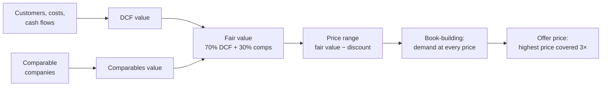

# IPO Valuation (`pm-valuation`)

## Objective

Price an initial public offering the way an investment bank's equity
capital markets desk would: value the company, build the book, choose the
offer price, and then list the stock on EduMatcher and let the opening
auction show whether the price was right.

You will practice:

- reading a valuation report from the verdict down to the cash flows
- telling a price set by fundamentals from a price set by demand
- using the what-if loop: change one answer, recalculate, compare
- reading a Monte Carlo distribution against the offer price
- finding what it takes to rescue a postponed IPO
- saving a scenario and handing it out as a fully specified case
- listing the priced IPO with `pm-new-symbol` and trading it

 


!!! abstract "Pre-reading in the User Guide"
    - [IPO Valuation](../user-guide/046-valuation.md)
    - [Listing a New Symbol](../user-guide/045-new-symbol.md)

## Prerequisites

- Chapter 00 completed (EduMatcher installed). Exercises 1–6 need nothing
  else: `pm-valuation` runs without an exchange.
- Exercise 7 lists and trades the stock. It needs chapters 01–03 (a running
  exchange with a market maker and two trader consoles) and the auctions
  chapter ([Auctions](070-auctions.md)), because the new stock opens in the
  opening auction.
- A terminal at least 100 columns wide. Printed reports are 100 columns
  wide, and at 80 columns the interview hides the automatic-value hints.

 

## Background

An IPO has two prices. **Fair value** is what the company's future cash flows
are worth today. The **offer price** is what new investors pay. They differ on
purpose: banks price an IPO at a discount to fair value (15% by default) so
that the first day's trading ends above the offer price, which rewards the
investors who took the risk of buying an unknown stock.

`pm-valuation` computes both:



**Coverage** is demand divided by the shares offered. A 7× covered book means
investors asked for seven times what is for sale. Banks price at the highest
price that is still covered at least 3×, so that most investors receive less
than they asked for and buy the rest in the market on day one. That is what
drives the **first-day pop**. The price may go up to 20% outside the filed
range; beyond that, a real IPO would have to be re-filed.

Two classroom cases ship with the tool:

| Case | Company | Sector |
|---|---|---|
| `kestrel` | Kestrel Security Inc. (KSEC) | Business software |
| `halvard` | Halvard Robotics Inc. (HALV) | Hardware plus service |

 

## Exercise 1: A First Report

Print the Kestrel report, and export it to a file you can reread:

```bash
pm-valuation --case kestrel --no-tui --mode deterministic --export kestrel.md
```

```text
[output]
Kestrel Security Inc. (KSEC) — IPO valuation  PROCEED

1. Verdict
  PROCEED

   Fair value per share           22.39
   Price range              18.00–20.00
   Offer price                    24.00
   Market capitalisation      1,865.0 m
   Primary raise                425.0 m
   Coverage                       7.04×
   Expected first-day pop         25.6%
```

:material-checkbox-blank-outline: The verdict is PROCEED at 24.00.

Answer from the report:

1. The range is 18.00–20.00, but the offer price is 24.00. Why exactly 24.00,
   and not higher? (Section 13, Pricing.)
2. How much money did the company leave on the table, and who received it?
3. What does the warning V017 say, and why is it typical of a hot deal?

!!! tip "Answers"
    1. 24.00 is 20% above the top of the range (20.00 × 1.2), the edge of the
       band a deal can price in without re-filing. Even at 24.00 the book is
       7.04× covered: demand would have supported more.
    2. 108.8 m: the expected first-day pop (25.6%) times the offer price times
       the shares sold. The new investors receive it, not the company.
    3. The DCF (16.98) and comparables (35.02) differ by more than 50%. Listed
       software companies trade at a revenue multiple that Kestrel's own cash
       flows do not justify, and the book prices off the comparables.

## Exercise 2: Where the Value Comes From

Read sections 10 (DCF) and 11 (Bridge and fair value) in `kestrel.md`.

1. What share of the enterprise value is the terminal value?
2. Fair value is 70% DCF and 30% comparables. Start the interview, set the
   DCF weight to 100% and press F5:

    ```bash
    pm-valuation --case kestrel --mode deterministic
    ```

    Page 9, *DCF weight*: type `100`. (A plain number in a percentage field is
    percentage points.)

:material-checkbox-blank-outline: Fair value is now 16.98, the DCF value.

!!! tip "What changes"
    The range falls to 13.50–15.50 and the deal prices at 18.50, still 20%
    above the range, on a 6.71× book. Investor demand did not change, so the
    book pushes the price to the top of the band again. The valuation method
    moved the range; demand chose the price inside it.

## Exercise 3: The What-If Loop

Start the interview again, so the DCF weight is back to 70%, and press F5 to
see the base report:

```bash
pm-valuation --case kestrel --mode deterministic
```

Then:

1. Press `b` to go back. Every answer is kept.
2. On page 9, set *Institutional interest* and *Retail interest* to `medium`
   (Enter opens the pick-list) and *Hype* to `2`.
3. Press F5, then `c` to compare with the previous run.

:material-checkbox-blank-outline: The comparison shows the three inputs you
changed.

Which moved more: the offer price, or the first-day pop? Why?

!!! tip "Answer"
    The price barely moves: 24.00 → 23.50, on a 3.14× book. The pop halves:
    25.6% → 13.2%, and the money left on the table falls from 108.8 m to
    55.9 m. With fewer excess orders, fewer unfilled investors buy on day one.
    Sentiment shows up in the aftermarket before it shows up in the price.

## Exercise 4: How Sure Are We?

Run the Monte Carlo simulation (10,000 draws; a few seconds):

```bash
pm-valuation --case kestrel --no-tui --mode montecarlo --export kestrel-mc.md
```

Read section 12 (Monte Carlo).

1. What is the median fair value, and how does it compare with the
   deterministic base case?
2. What is the probability that fair value is below the offer price?

!!! tip "Answers"
    1. The median is 21.10 and the mean 21.49, both below the base case
       22.39. The driver ranges are skewed, so the base case is not the
       expected case.
    2. 66.5%. In two draws out of three, the company is worth less than new
       investors pay. A hot book is a statement about demand, not about value.
       That is the question Exercise 7 puts to the market.

## Exercise 5: A Postponed IPO

```bash
pm-valuation --case halvard --no-tui --mode deterministic
```

```text
[output]
Halvard Robotics Inc. (HALV) — IPO valuation  POSTPONE
```

:material-checkbox-blank-outline: The verdict is POSTPONE.

1. Why? Read the Verdict and section 13 (Pricing).
2. Management's minimum market cap is derived from the last private round.
   Start the interview (`pm-valuation --case halvard --mode deterministic`)
   and, on page 11, lower *Minimum market cap* step by step: `230m`, `220m`,
   `210m`. Watch the preview after each one. What is the highest minimum
   that lists the stock, and on what kind of book?

!!! tip "Answers"
    1. The last private round valued Halvard at 240 m post-money, and
       management will not list below that. The market cap after the IPO
       includes the 50 m raised, so the floor price is (240 m − 50 m) / 20 m
       pre-IPO shares = 9.50, which moves the range to 9.50–10.40. Its
       midpoint (9.95) is above fair value (9.92): the bankers need at least a
       5% discount to sell the deal, and there is none left.
    2. 220 m lists the stock, but on a thin book (2.86×, below the 3× target).
       At 210 m or less the book is covered 3×:

    | Minimum market cap | Result |
    |---|---|
    | 240 m (the last round) | POSTPONE |
    | 230 m | POSTPONE: the discount is 4.7%, still under 5% |
    | 220 m | PROCEED (THIN BOOK) at 8.50, 2.86× covered |
    | 210 m or less | PROCEED at 8.30, 3.03× covered, market cap 216 m |

    Listing means accepting a **down round**: a public valuation of 216 m
    against 240 m in the last private round. Raising institutional interest
    does not help (try it): the floor binds before demand does.

## Exercise 6: Save and Hand Out a Case

In the interview, press F9 and save to `halvard-rescue.yaml`. Then write a
fully specified version for another group:

```bash
pm-valuation --load halvard-rescue.yaml --no-tui --mode deterministic \
    --save halvard-full.yaml --with-defaults
```

:material-checkbox-blank-outline: `halvard-rescue.yaml` holds only the
answers you typed; `halvard-full.yaml` holds every value, each commented with
its source (`you`, `preset`, `derived`, `default`).

Why does the short file stay correct if someone later changes a sector
preset, while the full one does not?

## Exercise 7: Let the Market Decide

List Kestrel on your exchange and trade it.

1. Stop the exchange and list the priced IPO:

    ```bash
    pm-opctl-cli stop
    pm-valuation --case kestrel --no-tui --mode deterministic --list
    pm-opctl-cli start
    ```

    ```text
    [output]
    Listed KSEC in …/engine_config.yaml: IPO price 24.00, 77708333 shares outstanding
      seed quote MM01: 1000 @ 23.90 / 1000 @ 24.10 (DAY)
    Deployed to …/engine_config.json. Start the exchange to open trading.
    ```

2. During the pre-open, each trader enters orders for KSEC at the price they
   believe in: buyers who missed out in the book, and allocated investors
   ready to take a profit.
3. Watch the opening auction set the first price (see [Auctions](070-auctions.md)).

:material-checkbox-blank-outline: KSEC has an opening price.

Compare it with the offer price (24.00) and the report's expected first-day
close (24.00 × 1.256 = 30.14). Was the offer price too low, as the pop
heuristic says, or too high, as the Monte Carlo suggests?

!!! note "If `--list` refuses"
    The refusals are `pm-new-symbol`'s: the exchange is still running, the
    data directory holds saved state for KSEC from an earlier run, or the
    configuration has several market-maker gateways and one must be chosen for
    the seed quote. See
    [Why it refused](../user-guide/045-new-symbol.md#why-it-refused). For the
    last one, run the command from the report's Next step section yourself,
    adding `--mm-gateway-id`.

 

## Summary

| Task | Command |
|---|---|
| Interview a classroom case | `pm-valuation --case kestrel` |
| Print a report | `pm-valuation --case kestrel --no-tui` |
| Scenarios only, no Monte Carlo | `… --mode deterministic` |
| Export the report | `… --export report.md` |
| Print the report | `… --pdf report.pdf` (or `p` in the report) |
| Save answers / a full case | F9, or `--save FILE [--with-defaults]` |
| Start from a saved file | `pm-valuation --load FILE` |
| Price and list | `pm-valuation --load FILE --no-tui --list` |
| In the report | `b` back, `c` compare, `e` export, `p` PDF, Tab next section |

 

## Reflection

In Exercise 1 the book was 7× covered at the top of the band, and in
Exercise 4 the offer price was above fair value in two draws out of three.
Both are true of the same deal. Who is right, the book or the model, and what
does your opening auction in Exercise 7 say?

## See Also

- [IPO Valuation — User Guide](../user-guide/046-valuation.md) — every key, field format, report section and option
- [Listing a New Symbol](../user-guide/045-new-symbol.md) — what `--list` does to the configuration, and the IPO-day checklist
- [Auctions & Scheduling](../user-guide/080-session-scheduling.md) — how the opening price is found
- [Market Index](../user-guide/150-market-index.md) — the index inclusion the report predicts
