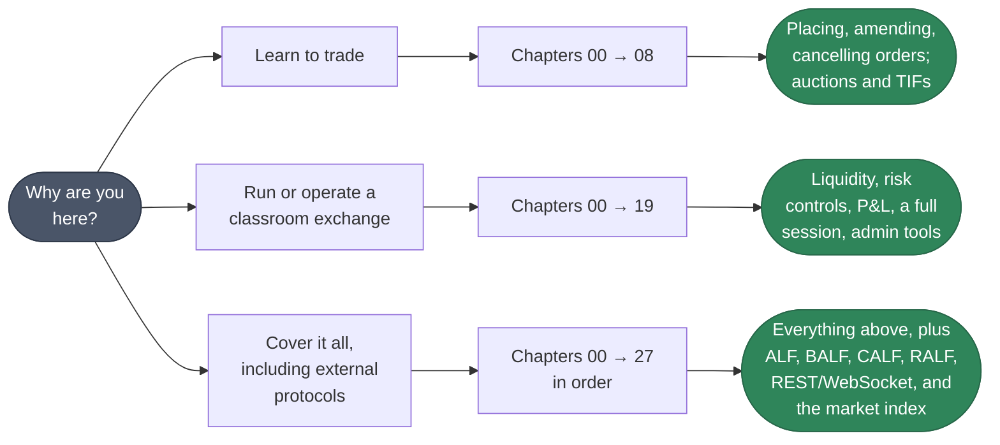
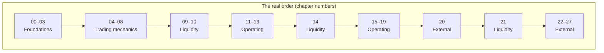

# Training Guide

Welcome to the EduMatcher self-study training programme. This hands-on guide
takes you from a cold start to confidently operating every major feature of the
exchange.

If you are new to finance we strongly recommend you start by
reading [How an Exchange Works](../how-exchange-works.md), a non-technical
introduction to the core components and data flows in an exchange. It will
make the training exercises more intuitive and meaningful.

## How to Use This Guide

The 28 chapters (00–27) are **one continuous sequence, not independent
modules**. Every chapter's own "Prerequisites" section names the chapters it
needs, and in every case but one that is simply "everything before it." There
is no reordering the sequence — if you only need part of what the exchange
does, the right move is to work through it from chapter 00 and stop when
you've covered what you need, not to skip ahead. [Choose Your Path](#choose-your-path)
below tells you where a given goal lets you stop.

Every chapter states its prerequisites and links the user-guide sections that
back it. Read those first if the topic is new to you; use them afterwards as
the reference.

### What you need

- **EduMatcher installed.** Any of the routes in
  [Installation](../user-guide/005-installation.md) works. Chapter 00 walks
  through them and helps you pick.
- **Several terminals.** The exchange is a set of processes, and this guide
  asks you to watch them side by side. A multiplexer (`tmux`, `screen`) or
  split panes helps, but separate windows are fine.
- **Basic YAML and command line.** No finance background is assumed.

### The two consoles

This is the one thing worth knowing before Chapter 00, because mixing them up
is the most common early mistake:

| | `pm-alf-console` | `pm-admin` |
|---|---|---|
| You are | a **trader** | the **exchange operator** |
| Prompt shown in this guide | `[TRADER01]>` | `[GW_ADMIN\|ADMIN]>` |
| Typical commands | `NEW`, `AMEND`, `CANCEL`, `STATUS`, `ORDERS`, `POS`, `QUOTE`, `QLEGS` | `BOOK`, `HALT_SYM`, `CANCEL_SYM`, `KILL\|GW=`, `SESSION\|STATE=`, `GATEWAYS` |
| Can see the whole order book | No | Yes |

A prompt containing `|ADMIN]>` always means the `pm-admin` terminal. Anything
else is a trader console. Commands are **not** interchangeable between them —
a `BOOK` typed into a trader console just answers `Unknown command`.

### Conventions

- `[TRADER01]>` — type this at that trader console's prompt.
- `[GW_ADMIN|ADMIN]>` — type this at the operator console's prompt.
- A plain `$` or a bare command — type this in a normal shell.
- `[output]` — expected output; exact wording may vary between versions.
- :material-checkbox-blank-outline: — a checkpoint. Verify it before moving on;
  if it fails, the next exercise will not behave as described.

 

## Choose Your Path

You do not have to complete all 28 chapters in one sitting. Because each
chapter only assumes the ones before it, picking a goal below just means
working through the sequence from chapter 00 and stopping where shown —
everything up to that point is genuine prerequisite for what follows, so
skipping ahead is not a shortcut, it just means an exercise stops working.

| Your goal | Work through chapters | What you'll have |
|---|---|---|
| **Learn to trade** — place, amend, and cancel orders; understand fills, TIFs, order types, and auctions | 00–08 | Everything a working trader needs day to day |
| **Run or operate a classroom exchange** — liquidity, risk controls, P&L, a full session, admin tools | 00–19 | Everything above, plus the operator's toolkit |
| **Cover everything, including external protocols** — bots and systems that talk to the exchange over ALF, BALF, CALF, RALF, REST, or WebSocket | 00–27 | The full training programme |

There is one shortcut worth knowing about: [chapter 25](#part-5-external-connectivity-integration-track)
(the market index) only needs chapters 00–03, so if all you want is
`pm-index`, you can jump to it early instead of working through the whole
sequence — see the note at the end of Part 5.

 

## Training Plan

The chapter numbers below are the order to work through them in — they are
grouped into five parts purely so you can find a topic quickly by browsing,
but a part is not a self-contained unit: some parts' chapters are spread
across the real sequence, interleaved with other parts.

Each row links to the lesson. The last column is the user-guide reading that
backs it — skim it before the chapter, or use it afterwards as the reference.

### Part 1 — Foundations

| # | Chapter | You will be able to | Pre-reading |
|---|---------|---------------------|-------------|
| 00 | [Installation & Setup](000-installation.md) | Install EduMatcher and know where its files live | [Installation](../user-guide/005-installation.md), [A Path Through the Guide](../user-guide/001-learning-path.md) |
| 01 | [Configuring & Starting Up](010-configuring-startup.md) | Author, verify, deploy a configuration; start the engine, scheduler and both consoles | [Configuration](../user-guide/010-configuration.md), [Config Verifier](../user-guide/020-config-verifier.md), [Running the Exchange](../user-guide/040-running-the-exchange.md) |
| 02 | [Setting Up Market-Maker Liquidity](020-setting-up-MM-bots.md) | Seed a two-sided book so there is something to trade against | [Market Making](../user-guide/090-market-maker.md), [Market-Maker Bot](../user-guide/100-mm-bot.md) |
| 03 | [The First Trade](030-the-first-trade.md) | Submit orders, read fills, follow an order's lifecycle | [ALF Console](../user-guide/055-alf-console.md), [Order Types](../user-guide/060-order-types.md) |

### Part 2 — Trading mechanics

| # | Chapter | You will be able to | Pre-reading |
|---|---------|---------------------|-------------|
| 04 | [Amending Orders](040-amending-orders.md) | Change price and quantity, and predict the effect on queue priority | [Order Amendment](../user-guide/060-order-types.md#order-amendment-amend) |
| 05 | [Order Types Deep Dive](050-order-types.md) | Use MARKET, STOP, STOP_LIMIT, FOK, IOC, ICEBERG and TRAILING_STOP | [Order Types](../user-guide/060-order-types.md) |
| 06 | [Time-in-Force & Sessions](060-time-in-force-sessions.md) | Choose a TIF and predict how each session phase treats it | [Auctions & Scheduling](../user-guide/080-session-scheduling.md) |
| 07 | [Auctions](070-auctions.md) | Run an auction and compute the equilibrium price by hand | [Auctions & Scheduling — Equilibrium price](../user-guide/080-session-scheduling.md#equilibrium-price) |
| 08 | [Cancelling & Managing Orders](080-cancelling-orders.md) | Inspect and cancel resting orders; use the operator's bulk-cancel tools | [ALF Console](../user-guide/055-alf-console.md), [Exchange Commands](../user-guide/160-exchange-commands.md) |

### Part 3 — Liquidity and automation

| # | Chapter | You will be able to | Pre-reading |
|---|---------|---------------------|-------------|
| 09 | [Market Making](090-market-making.md) | Run a two-sided quote by hand and inspect its legs | [Market Making](../user-guide/090-market-maker.md) |
| 10 | [Combo Orders](100-combo-orders.md) | Submit multi-leg and OCO orders, and reason about leg risk | [Combo Orders](../user-guide/070-combo-orders.md) |
| 14 | [AI Traders & Swarm](140-ai-traders.md) | Generate realistic order flow for a demo or class | [AI Traders](../user-guide/110-ai-traders.md) |
| 21 | [Automation & MM Bot Tuning](210-automation-commandclient-mm-bot.md) | Script operator workflows and tune `pm-mm-bot` | [Exchange Commands](../user-guide/160-exchange-commands.md), [Market-Maker Bot](../user-guide/100-mm-bot.md) |

### Part 4 — Operating the exchange

| # | Chapter | You will be able to | Pre-reading |
|---|---------|---------------------|-------------|
| 11 | [Risk Controls](110-risk-controls.md) | Configure and trigger collars, circuit breakers, halts and the kill switch | [Risk Controls](../user-guide/120-risk-controls.md) |
| 12 | [P&L & Clearing](120-pnl-clearing.md) | Read positions, VWAP cost and realized/unrealized P&L | [P&L & Clearing](../user-guide/130-pnl-clearing.md) |
| 15 | [Statistics & Reporting](150-statistics-reporting.md) | Query OHLCV, trades and snapshots for analysis | [Statistics and Reporting](../user-guide/140-statistics-and-reporting.md) |
| 16 | [Persistence & Recovery](160-persistence-recovery.md) | Say what survives a restart, and verify it | [Persistence](../user-guide/180-persistence.md), [Audit Trail](../user-guide/190-audit.md) |
| 17 | [Capstone Scenario](170-capstone-scenario.md) | Run a full session end to end, combining everything above | [Running the Exchange](../user-guide/040-running-the-exchange.md) |
| 18 | [Exchange Observer Processes](180-exchange-observer-processes.md) | Compare the book, tape, order monitor, audit trail, stats and clearing views side by side | [Processes](../user-guide/170-processes.md) |
| 19 | [Advanced Admin Operations](190-advanced-admin-operations.md) | Use `KICK`, `QCANCEL`, `CANCEL_SYM` and manual session overrides | [Exchange Commands](../user-guide/160-exchange-commands.md) |

### Part 5 — External connectivity (integration track)

These chapters are about connecting *other software* to the exchange over its
wire protocols and APIs.

| # | Chapter | You will be able to | Pre-reading |
|---|---------|---------------------|-------------|
| 13 | [Market Data & Drop Copy](130-market-data-drop-copy.md) | Explain the market-data and drop-copy feeds and watch them | [Drop Copy](../user-guide/200-drop-copy.md), [DC Gateway](../user-guide/201-dc-gateway.md) |
| 20 | [Drop-Copy Replay & Recovery](200-drop-copy-replay-recovery.md) | Detect sequence gaps and recover a consumer | [Drop Copy — Replay](../user-guide/200-drop-copy.md#replay) |
| 22 | [RALF Post-Trade Protocol](220-ralf.md) | Write a clearing, drop-copy or audit consumer | [RALF Gateway](../user-guide/250-ralf-gateway.md), [RALF Protocol](../user-guide/930-app-ralf-protocol.md) |
| 23 | [CALF Market-Data Protocol](230-calf.md) | Write a market-data consumer with snapshots and replay | [CALF Gateway](../user-guide/240-calf-gateway.md), [CALF Protocol](../user-guide/920-app-calf-protocol.md) |
| 24 | [API Gateway REST/WebSocket](240-api-gwy.md) | Trade and query over REST, and stream over WebSocket | [API Gateway](../user-guide/260-api-gateway.md), [REST API Reference](../user-guide/950-app-REST-API-reference.md) |
| 25 | [Market Index (`pm-index`)](250-index.md) | Run an index and apply corporate actions without disturbing its level | [Market Index](../user-guide/150-market-index.md), [Index Admin CLI](../user-guide/152-index-admin-cli.md) |
| 26 | [ALF TCP Gateway](260-alf-gwy.md) | Speak ALF over a raw socket | [ALF Gateway](../user-guide/220-alf-gateway.md), [ALF Protocol](../user-guide/900-app-alf-protocol.md) |
| 27 | [BALF TCP Gateway](270-balf-gwy.md) | Speak the binary order-entry protocol | [BALF Gateway](../user-guide/230-balf-gateway.md), [BALF Protocol](../user-guide/910-app-balf-protocol.md) |

!!! note "Chapter 25 is the one chapter you can take out of order"
    Every chapter above requires all chapters before it — except chapter 25
    (Market Index), which only needs chapters 00–03. Its natural reading
    partner is [Statistics & Reporting](150-statistics-reporting.md)
    (chapter 15) — `pm-index` history is queried the same way. It is
    numbered 25 because that is where it was written, between the API
    Gateway and ALF Gateway chapters; treat the number as an ordering
    convenience, not a dependency on chapters 04–24.

 

## Quick Reference

After completing the training, use the [User Guide](../user-guide/000-getting-started.md)
and [Glossary](../glossary.md) for day-to-day reference.
