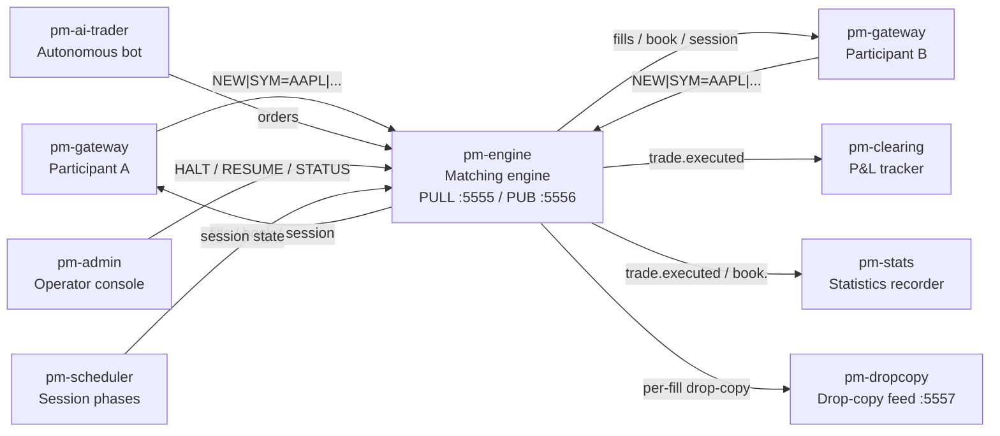
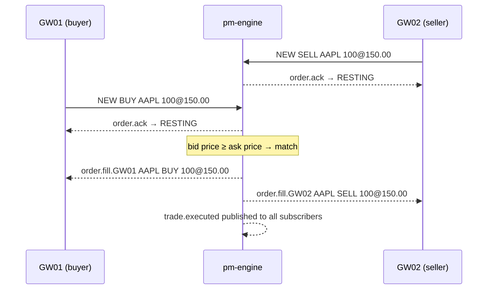
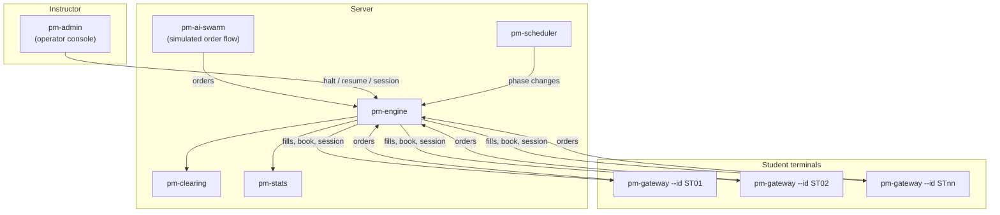

# Getting Started with EduMatcher

!!! note "Learning objectives"
    After reading this page you will understand:

    - What EduMatcher is and what you can do with it
    - The minimum steps to start an exchange and execute your first trade
    - What each process does and when to start it
    - Which sections to read next based on your role

---

## What is EduMatcher?

EduMatcher is a **fully functional financial exchange matching engine** built for
education, research, and demo purposes. It implements the same core mechanics that
underpin real stock exchanges:

- A **continuous order book** that matches buyers and sellers
- **Auction phases** (opening and closing) with equilibrium price calculation
- **Market-maker quoting** with obligations and protection
- **Risk controls**: price collars, circuit breakers, kill switches
- **Combo and OCO orders**: multi-leg strategies with cascade cancellation
- **Statistics recording** (OHLCV, VWAP, mid prices) in SQLite
- **Drop-copy feed** for compliance monitoring
- **Autonomous AI traders** to simulate real order flow

Participants connect via a terminal (the *gateway*) and type commands to place
orders. The engine matches them and publishes fill events over a ZeroMQ message bus
that all other processes subscribe to.



---

## What you need

| Requirement | Notes |
|---|---|
| Python 3.13 or later | Check with `python --version` |
| [Poetry](https://python-poetry.org/) | `pip install poetry` or `pipx install poetry` |
| Three terminal windows | Or a terminal multiplexer such as `tmux` or `screen` |
| A text editor | To create `engine_config.yaml` |

Install the project dependencies once:

```bash
git clone https://github.com/your-org/edumatcher.git
cd edumatcher
poetry install --with dev
```

---

## Five-minute minimum session

This walkthrough starts a matching engine, connects two participant terminals,
and executes one trade. No configuration file is required — the engine starts in
*unrestricted mode* when `engine_config.yaml` is absent.

### Step 1 — Start the engine

Open a terminal and run:

```bash
poetry run pm-engine
```

Expected output:

```
[ENGINE] EduMatcher matching engine starting
[ENGINE] Listening for orders on tcp://127.0.0.1:5555
[ENGINE] Publishing events on tcp://127.0.0.1:5556
[ENGINE] Drop-copy feed on tcp://127.0.0.1:5557
[ENGINE] Session state: PRE_OPEN
[ENGINE] Ready
```

The engine is now running. Leave this terminal open.

### Step 2 — Connect Participant A (the buyer)

Open a second terminal:

```bash
poetry run pm-gateway --id GW01
```

You should see a prompt after the connection banner:

```
[GW01] Connected to engine
GW01>
```

### Step 3 — Connect Participant B (the seller)

Open a third terminal:

```bash
poetry run pm-gateway --id GW02
```

```
[GW02] Connected to engine
GW02>
```

### Step 4 — Check the session state

On either gateway, ask what state the exchange is in:

```
GW01> STATUS
```

The engine replies with the current session state. In unrestricted mode it starts
in `PRE_OPEN`. To enable matching, advance to `CONTINUOUS`:

!!! tip "Skipping auctions in testing"
    Without `pm-scheduler`, the session state stays where you set it. Advance
    to `CONTINUOUS` with `pm-admin` or the operator console. The quickest way
    if you just have the engine running is to start with a config that sets
    `sessions_enabled: false` (which defaults to `CONTINUOUS`).

    For this walkthrough, start the engine with:

    ```bash
    echo "sessions_enabled: false" > /tmp/demo.yaml
    poetry run pm-engine --config /tmp/demo.yaml
    ```

### Step 5 — Place orders and trade

On Participant B's terminal, post a sell order at 150.00:

```
GW02> NEW|SYM=AAPL|SIDE=SELL|TYPE=LIMIT|QTY=100|PRICE=150.00|TIF=DAY
```

Expected response:

```
[HH:MM:SS] ORDER ACK  ord-xxxx  AAPL SELL LIMIT 100@150.00 DAY → RESTING
```

On Participant A's terminal, buy at the same price:

```
GW01> NEW|SYM=AAPL|SIDE=BUY|TYPE=LIMIT|QTY=100|PRICE=150.00|TIF=DAY
```

Both gateways see fill events:

```
[HH:MM:SS] FILL  ord-xxxx  AAPL BUY 100@150.00
[HH:MM:SS] FILL  ord-yyyy  AAPL SELL 100@150.00
```

A `trade.executed` event is published to all subscribers. Congratulations — you
just ran a trade on your own exchange.

### What happened under the hood



---

## Starting more processes

The engine is the only mandatory process. Add the others as you need them:

| When you want to… | Start this process |
|---|---|
| Watch P&L update in real time | `poetry run pm-clearing` |
| Record OHLCV statistics | `poetry run pm-stats` |
| Use `pm-admin` operator commands | `poetry run pm-admin` (interactive REPL) |
| Schedule opening/closing auctions | `poetry run pm-scheduler` |
| Add autonomous AI order flow | `poetry run pm-ai-swarm --count 5 --duration 60` |
| Feed compliance/risk systems | Subscribe to `:5557` (drop-copy socket) |

For a full classroom session, use the provided launch script:

```bash
./scripts/launch_all.sh
```

---

## Typical architecture for a classroom demo



Typical setup:

1. Instructor creates `engine_config.yaml` with student gateway IDs and symbols.
2. Instructor starts engine, scheduler, clearing, stats, and a small AI swarm.
3. Students each `ssh` to the server and run their gateway.
4. Instructor uses `pm-admin` to manage session phases and monitor the market.

---

## Reading path

Use the table below to decide what to read based on your goal.

| Goal | Read these sections in order |
|---|---|
| **Understand the full system** | 01 → 03 → 08 → 04 → 06 → 11 → 12 → 02 → 07 → 09 → 10 |
| **Set up a classroom session** | 01 → 03 → 08 → 06 → 14 (MM) → 15 (AI) |
| **Participate as a trader** | 08 → 04 → 05 |
| **Run as a market maker** | 01 → 08 → 14 (MM) |
| **Monitor the market** | 09 → 10 → 13 → 07 |
| **Write a custom client** | 09 → 20 → 02 |
| **Understand risk controls** | 12 → 06 → 04 |

---

## Glossary of terms used throughout this guide

| Term | Meaning |
|---|---|
| **Engine** | The `pm-engine` matching engine process — the authoritative order book |
| **Gateway** | A `pm-gateway` participant terminal; one per trader |
| **Symbol** | A tradeable instrument, e.g. `AAPL`, `MSFT` |
| **Order book** | Sorted list of resting bids and asks for one symbol |
| **Fill** | An execution — the result of two orders matching |
| **TIF** | Time-in-Force: how long an order lives (`DAY`, `GTC`, `ATO`, `ATC`) |
| **Tick** | Minimum price increment (e.g. 0.01 for most equities) |
| **Gateway ID** | Unique identifier for a participant connection, e.g. `GW01` |
| **Session state** | Phase of the trading day: `PRE_OPEN`, `OPENING_AUCTION`, `CONTINUOUS`, `CLOSING_AUCTION`, `CLOSED` |
| **Market maker** | A participant with role `MARKET_MAKER` who quotes two-sided prices |
| **Circuit breaker** | Automatic halt triggered when price moves beyond a configured threshold |
| **Drop copy** | A copy of all fill events published to a dedicated socket for compliance systems |

## See also

- [Configuration](01-configuration.md) — full `engine_config.yaml` reference
- [Running the Engine](03-running-the-engine.md) — detailed startup, monitoring, and troubleshooting
- [Gateway Commands](08-gateway.md) — complete command reference for participants
- [Order Types](04-order-types.md) — LIMIT, MARKET, STOP, ICEBERG, TRAILING_STOP, OCO, COMBO
- [Market Making](14-market-maker.md) — QUOTE command, obligations, and MMP
- [AI Traders](15-ai-traders.md) — autonomous order flow with `pm-ai-trader` and `pm-ai-swarm`
