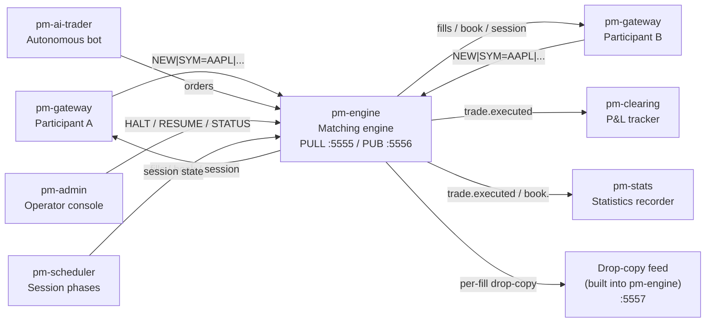
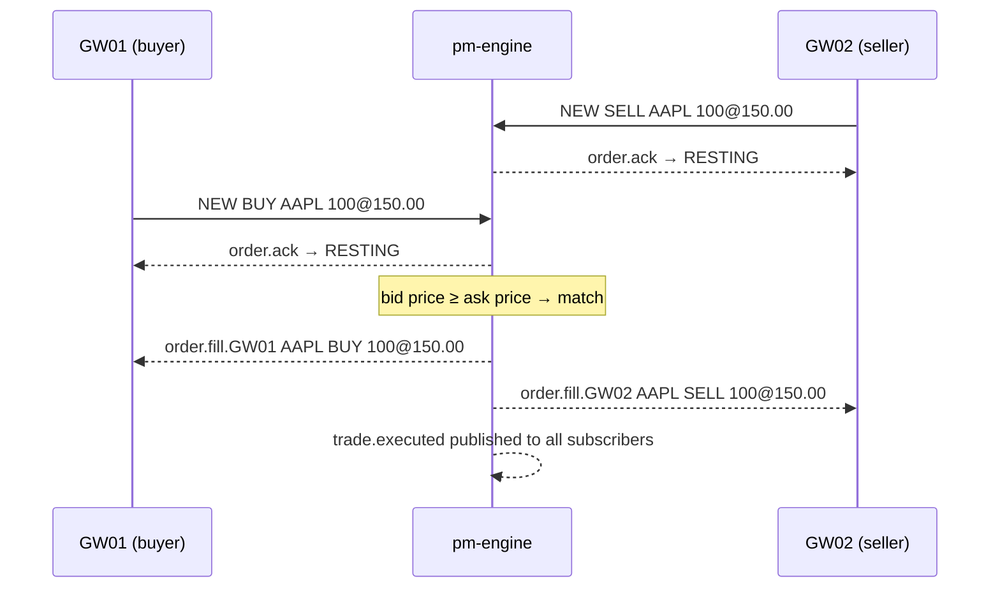
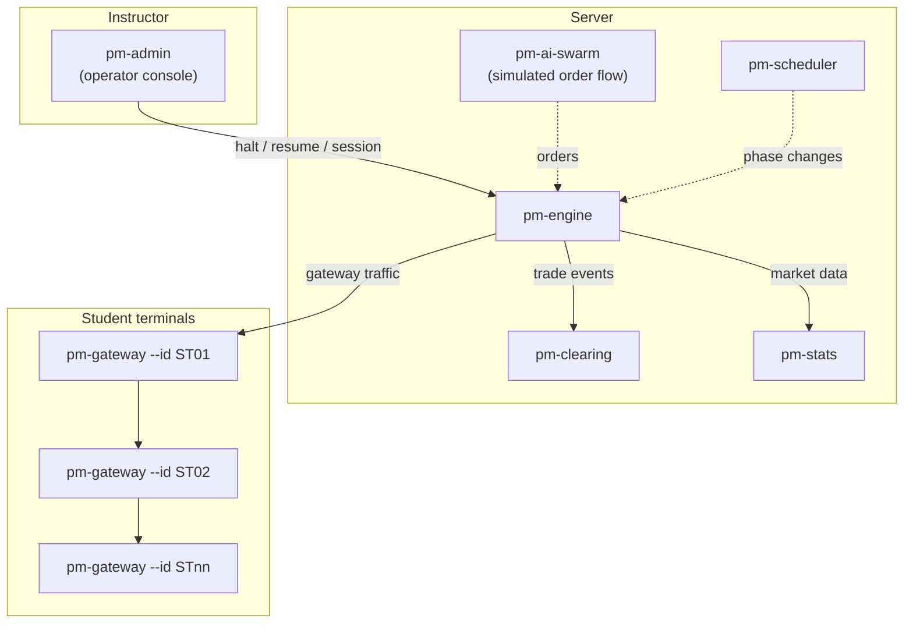

# Getting Started with EduMatcher

!!! note "Learning objectives"
    After reading this page you will understand:

    - What EduMatcher is and what you can do with it
    - The minimum steps to start an exchange and execute your first trade
    - What each process does and when to start it
    - How to quickly bootstrap a new `engine_config.yaml` with `pm-config-gen`
    - Which sections to read next based on your role


## What is EduMatcher?

EduMatcher is a **fully functional financial exchange matching engine** built for
education, research, and demo purposes. It implements the same core mechanics that
underpin real stock exchanges:

- A **continuous order book** that matches buyers and sellers
- **Auction phases** (opening and closing) with equilibrium price calculation
- **Market-maker quoting** with obligations and protection
- **Risk controls**: price collars, circuit breakers, kill switches
- **Combo and OCO orders**: multi-leg strategies with cascade cancellation
- **Statistics recording** (OHLCV, VWAP, mid prices) in SQLite
- **Drop-copy feed** for compliance monitoring
- **Autonomous AI traders** to simulate real order flow

Participants connect via a terminal (the *gateway*) and type commands to place
orders. The engine matches them and publishes fill events over a ZeroMQ message bus
that all other processes subscribe to.




## Installation

EduMatcher supports two installation modes. Choose the one that matches your role.


### VM bootstrap mode — `curl` + Multipass (no repo clone)

Use this mode when you want a ready-to-run EduMatcher VM without installing
Python or cloning this repository on your host.

**What is Multipass?**

Multipass is a lightweight VM manager from Canonical. It launches Ubuntu VMs
with simple CLI commands so you can run isolated Linux environments locally on
macOS, Linux, or Windows.

**Requirements**

| Requirement     | Notes                                                       |
|-----------------|-------------------------------------------------------------|
| Multipass       | Install from [multipass.run](https://multipass.run/install) |
| curl            | Used to download the VM bootstrap script                    |
| Internet access | Required for downloading scripts and PyPI packages          |
| Host resources  | Recommended minimum: 2 vCPU, 3 GB RAM, 10 GB disk           |

**Bootstrap with one command**

```bash
curl -fsSL https://raw.githubusercontent.com/johan162/EduMatcher/main/vm/curl_setup_vm.sh | bash -s -- --version 0.12.1 --snapshot
```

This command downloads the VM setup scripts, launches a Multipass VM,
installs EduMatcher in the VM, links all `pm-*` commands into
`/usr/local/bin`, prepares `/home/ubuntu/session`, and optionally takes
an initial snapshot.

**Start using the VM**

```bash
multipass shell edumatcher-vm
cd /home/ubuntu/session
pm-engine --verbose
```

Open additional host terminals and run `multipass shell edumatcher-vm` in each
terminal to start `pm-gateway`, `pm-viewer`, `pm-clearing`, and `pm-audit`.

**Useful bootstrap options**

```bash
# Different VM name and version
curl -fsSL https://raw.githubusercontent.com/johan162/EduMatcher/main/vm/curl_setup_vm.sh | \
    bash -s -- --name edumatcher-092 --version 0.12.1 --snapshot

# Tune resources
curl -fsSL https://raw.githubusercontent.com/johan162/EduMatcher/main/vm/curl_setup_vm.sh | \
    bash -s -- --cpus 2 --memory 3G --disk 10G
```

**Optional: inspect script before execution**

```bash
curl -fsSL https://raw.githubusercontent.com/johan162/EduMatcher/main/vm/curl_setup_vm.sh -o curl_setup_vm.sh
less curl_setup_vm.sh
bash curl_setup_vm.sh --version 0.12.1 --snapshot
```


### End-user / student mode — `pipx install` (recommended)

This is the quickest path if you just want to *run* an exchange session —
no source code, no Poetry, no virtual environment management.

**Requirements**

| Requirement                    | Notes                                    |
|--------------------------------|------------------------------------------|
| Python 3.13 or later           | Check with `python --version`            |
| Three or more terminal windows | Or a terminal multiplexer such as `tmux` |

**Install**

```bash
# Install pipx (once, if not already present)
pip install pipx
pipx ensurepath        # adds ~/.local/bin to PATH; reopen your shell after this

# Install EduMatcher — all pm-* commands land on your PATH
pipx install edumatcher
```

Or use the provided one-shot script (handles pipx installation automatically):

```bash
./scripts/install-runtime.sh
```

**Bootstrap your session directory**

```bash
cd ~/my-exchange-session    # create and cd into any working directory you like
pm-setup                    # creates ~/.local/share/edumatcher  +  copies engine_config.yaml here
```

`pm-setup` prints a shell snippet to add to your `.zshrc` / `.bashrc`:

```bash
export EDUMATCHER_DATA_DIR="$HOME/.local/share/edumatcher"
export EDUMATCHER_CONFIG="$HOME/my-exchange-session/engine_config.yaml"
```

After reloading your shell, every `pm-*` command picks up the right data
directory automatically — no flags needed.

**Edit the config, then start trading**

If you prefer generating a starter config instead of manually writing YAML:

```bash
pm-config-gen \
    --symbols AAPL MSFT \
    --gateways TRADER01 TRADER02 OPS01:ADMIN \
    --sessions-enabled \
    --output engine_config.yaml
```

Then edit any remaining details and start the engine.

For full generator details (all flags, `--symbol-opts`, MM quote stubs,
validation hints, and recipes), see
[Configuration](01-configuration.md#generate-configs-with-pm-config-gen).

```bash
# Edit the sample config that pm-setup copied into your directory
nano engine_config.yaml

# Start the engine
pm-engine --verbose
```


### Developer mode — Poetry + source checkout

Use this mode if you want to modify the engine, run tests, or contribute.

**Requirements**

| Requirement                          | Notes                                         |
|--------------------------------------|-----------------------------------------------|
| Python 3.13 or later                 | Check with `python --version`                 |
| [Poetry](https://python-poetry.org/) | `pip install poetry` or `pipx install poetry` |
| Three terminal windows               | Or `tmux` / `screen`                          |

**Install**

```bash
git clone https://github.com/johan162/EduMatcher.git
cd EduMatcher
poetry install --with dev
```

Data is stored in `src/data/` inside the repo and `engine_config.yaml` is
read from the repo root — no environment variables needed.

All commands are prefixed with `poetry run`:


```bash
poetry run pm-engine --verbose
poetry run pm-gateway --id GW01
```

!!! tip "Switching from developer to end-user mode"
    You can install the locally built wheel with pipx at any time:

    ```bash
    poetry build
    pipx install dist/edumatcher-*.whl --force
    pm-setup --force    # re-copy the latest sample config
    ```


## Environment variables

These two variables work in both modes. Set them in your shell profile to
override the defaults permanently.

| Variable              | Default (installed)          | Default (source)            | Purpose                                    |
|-----------------------|------------------------------|-----------------------------|--------------------------------------------|
| `EDUMATCHER_DATA_DIR` | `~/.local/share/edumatcher`  | `<repo>/src/data/`          | Where all persistent data files are stored |
| `EDUMATCHER_CONFIG`   | `./engine_config.yaml` (CWD) | `<repo>/engine_config.yaml` | Path to the engine configuration YAML      |

The `--config` flag on `pm-engine` and `pm-scheduler` always takes precedence
over both the environment variable and the default.


## PM command family overview

Use these tables as a quick index for every `pm-` entry point currently
documented. All commands are shown in pipx form; in developer mode prepend
`poetry run`. All `pm-` processes/utilities are described in [Processes](10-processes.md).

### Runtime processes (runnable)

| Command | Interactivity | Purpose | More information |
|---|---|---|---|
| `pm-engine` | Background | Matching engine; central order-book writer | [Processes](10-processes.md), [Running the Engine](03-running-the-engine.md), [Configuration](01-configuration.md) |
| `pm-gateway` | Interactive terminal | ALF participant terminal and order entry | [Processes](10-processes.md), [Gateway](08-gateway.md), [ALF Protocol](90-app-alf-protocol.md) |
| `pm-scheduler` | Background | Session phase transitions by schedule | [Processes](10-processes.md), [Auctions and Scheduling](06-auctions-scheduling.md) |
| `pm-viewer` | Terminal display | Single-symbol live order book view | [Processes](10-processes.md), [Order Types](04-order-types.md) |
| `pm-orders` | Terminal display | Live cross-gateway order status monitor | [Processes](10-processes.md), [Messages](09-messages.md) |
| `pm-board` | Terminal display | Multi-symbol market board display | [Processes](10-processes.md) |
| `pm-ticker` | Terminal display | Scrolling ticker with live plus OHLCV context | [Processes](10-processes.md), [Statistics and Reporting](16-statistics-and-reporting.md) |
| `pm-stats` | Background | Persist market statistics to SQLite | [Processes](10-processes.md), [Statistics and Reporting](16-statistics-and-reporting.md) |
| `pm-clearing` | Terminal display | Trade recording and running P&L | [Processes](10-processes.md), [P&L and Clearing](07-pnl-clearing.md) |
| `pm-audit` | Background | Full event log capture from the bus | [Processes](10-processes.md), [Persistence](11-persistence.md) |
| `pm-ralf-gwy` | Background | External post-trade dissemination gateway (RALF) | [Processes](10-processes.md), [Post-Trade Dissemination](18-post-trade.md), [RALF Protocol](93-app-ralf-protocol.md) |
| `pm-admin` | Interactive terminal | Interactive operational console | [Processes](10-processes.md), [Risk Controls](12-risk-controls.md) |
| `pm-ai-trader` | Background | Single autonomous trading bot gateway | [Processes](10-processes.md), [AI Bot Traders](../developer/02-ai-bot.md) |
| `pm-ai-swarm` | Background | Multi-agent autonomous trading swarm | [Processes](10-processes.md), [AI Bot Traders](../developer/02-ai-bot.md) |
| `pm-mm-bot` | Background | Autonomous market-maker quoting bot | [Processes](10-processes.md), [Market-Maker Bot](17-mm-bot.md) |
| `pm-md-gwy` | Background | Market-data distribution gateway (CALF) | [Processes](10-processes.md#pm-md-gwy-calf-market-data-gateway), [Market Data Feed](20-market-data-feed.md), [CALF Protocol](92-app-calf-protocol.md) |
| `pm-api-gateway` | Background | REST/WebSocket order-entry and market-data API gateway | [Processes](10-processes.md#pm-api-gateway-restwebsocket-api-gateway), [API Gateway](21-api-gateway.md) |
| `pm-index` | Background | Real-time cap-weighted index calculation and dissemination | [Processes](10-processes.md#pm-index-index-calculation-process), [Market Index](22-index.md) |

### CLI utilities (runnable)

| Command |  Purpose | More information |
|---|---|---|
| `pm-admin-cli` | Non-interactive admin commands for scripts | [Processes](10-processes.md), [Risk Controls](12-risk-controls.md) |
| `pm-cverifier` | Validate `engine_config.yaml` before runtime (YAML, schema, semantic, completeness checks) | [Processes](10-processes.md), [Configuration](01-configuration.md), [Config Verifier](23-config-verifier.md) |
| `pm-stats-cli` | Query `stats.db` without writing SQL | [Processes](10-processes.md#pm-stats-cli-statistics-query-cli), [Statistics and Reporting](16-statistics-and-reporting.md) |
| `pm-index-cli` | Read-only query interface for index history files | [Processes](10-processes.md#pm-index-cli-index-history-query-tool), [Commands](02-commands.md), [Market Index](22-index.md#using-pm-index-cli-recommended) |
| `pm-setup` |  Bootstrap local session directory and defaults | [Processes](10-processes.md), [Installation](00-getting-started.md#installation) |
| `pm-config-gen` | Generate `engine_config.yaml` from CLI options | [Processes](10-processes.md), [Configuration generator](01-configuration.md#generate-configs-with-pm-config-gen) |

### Planned runtime processes (design proposals)

| Command | Interactivity | Purpose | More information |
|---|---|---|---|
| `pm-balf-gateway` | Background | Binary order-entry gateway (BALF) | [Processes planned section](10-processes.md#planned-processes), [BALF Protocol](91-app-balf-protocol.md) |

For startup order and a practical first-run sequence, see
[Processes](10-processes.md#process-overview).


## Market-Maker Quick Reference

If your gateway role is `MARKET_MAKER`, this is the fastest practical command
set for quote operation and fill recognition:

| Goal                       | Command                                                                            |
|----------------------------|------------------------------------------------------------------------------------|
| Submit/replace quote       | `QUOTE\|SYM=AAPL\|BID=209.80\|ASK=210.20\|BID_QTY=500\|ASK_QTY=500\|QUOTE_ID=Q123` |
| Cancel active quote        | `QUOTE_CANCEL\|SYM=AAPL`                                                           |
| Show active quote legs     | `QLEGS`                                                                            |
| Show one-symbol quote legs | `QLEGS\|SYM=AAPL`                                                                  |
| Show recent completed legs | `QLEGS\|SHOW=RECENT`                                                               |
| Show active + recent legs  | `QLEGS\|SYM=AAPL\|SHOW=ALL`                                                        |

Recommended manual loop:

1. Send `QUOTE` with an explicit `QUOTE_ID`.
2. After any `FILL`, run `QLEGS|SYM=<symbol>|SHOW=ALL`.
3. Read `Filled?`, `Rem`, and `Leg status` to decide whether to re-quote.

See [Gateway](08-gateway.md#qlegs-inspect-mm-quote-legs-and-fill-flags) for
full `QLEGS` behavior and [Market Making](14-market-maker.md) for operator
workflows and policy-specific behavior.


## Five-minute minimum session

This walkthrough starts a matching engine, connects two participant terminals,
and executes one trade. No configuration file is required — the engine starts in
*unrestricted mode* when `engine_config.yaml` is absent.

### Step 1 — Start the engine

Open a terminal and run:

**"Installed (pipx)"** mode

```bash
pm-engine
```

**"Developer (Poetry)"** mode

 ```bash
 poetry run pm-engine
 ```

Expected output:

```
[ENGINE] EduMatcher matching engine starting
[ENGINE] Listening for orders on tcp://127.0.0.1:5555
[ENGINE] Publishing events on tcp://127.0.0.1:5556
[ENGINE] Drop-copy feed on tcp://127.0.0.1:5557
[ENGINE] Session state: PRE_OPEN
[ENGINE] Ready
```

The engine is now running. Leave this terminal open.

### Step 2 — Connect Participant A (the buyer)

Open a second terminal:

**"Installed (pipx)" mode**

```bash
pm-gateway --id GW01
```

**"Developer (Poetry)" mode**

```bash
poetry run pm-gateway --id GW01
```

You should see a prompt after the connection banner:

```
[GW01] Connected to engine
GW01>
```

### Step 3 — Connect Participant B (the seller)

Open a third terminal:

**"Installed (pipx)"** mode

 ```bash
 pm-gateway --id GW02
 ```

**"Developer (Poetry)"** mode
```bash
poetry run pm-gateway --id GW02
```

```
[GW02] Connected to engine
GW02>
```

### Step 4 — Check the session state

On either gateway, ask what state the exchange is in:

```
GW01> STATUS
```

The engine replies with the current session state. In unrestricted mode it starts
in `PRE_OPEN`. To enable matching, advance to `CONTINUOUS`:

!!! tip "Skipping auctions in testing"
    Without `pm-scheduler`, the session state stays where you set it. Advance
    to `CONTINUOUS` with `pm-admin` or the operator console. The quickest way
    if you just have the engine running is to start with a config that sets
    `sessions_enabled: false` (which defaults to `CONTINUOUS`).

For this walkthrough, start the engine with:

```bash
echo "sessions_enabled: false" > /tmp/demo.yaml
pm-engine --config /tmp/demo.yaml       # installed
# or:  poetry run pm-engine --config /tmp/demo.yaml
```

### Step 5 — Place orders and trade

!!! info "Book liquidity depends on your configuration"
    This walkthrough starts the engine with `sessions_enabled: false` and **no
    `engine_config.yaml`**, so the book is completely empty at startup.

    If you are running against an `engine_config.yaml` that configures `AAPL`
    with a `market_maker_quotes` seed block, the book already has a two-sided
    MM quote resting in it when trading opens. In that case, an aggressive order
    from one participant will immediately match against the seed quote — **before**
    the second participant even types anything. For example, a market buy from
    GW01 would fill against the MM's resting ask rather than waiting for GW02's
    sell.

    If this happens and you are surprised by an unexpected fill, check whether
    your config seeds the book:
    ```bash
    grep -A5 "market_maker_quotes" engine_config.yaml
    ```
    To follow this walkthrough exactly with a known-empty book, either start
    the engine with no config file, or use a config with no `market_maker_quotes`
    entries.

On Participant B's terminal, post a sell order at 150.00:

```
GW02> NEW|SYM=AAPL|SIDE=SELL|TYPE=LIMIT|QTY=100|PRICE=150.00|TIF=DAY
```

Expected response:

```
[HH:MM:SS] ORDER ACK  ord-xxxx  AAPL SELL LIMIT 100@150.00 DAY → RESTING
```

On Participant A's terminal, buy at the same price:

```
GW01> NEW|SYM=AAPL|SIDE=BUY|TYPE=LIMIT|QTY=100|PRICE=150.00|TIF=DAY
```

Both gateways see fill events:

```
[HH:MM:SS] FILL  ord-xxxx  AAPL BUY 100@150.00
[HH:MM:SS] FILL  ord-yyyy  AAPL SELL 100@150.00
```

A `trade.executed` event is published to all subscribers. Congratulations — you
just ran a trade on your own exchange.

### What happened under the hood




## Starting more processes

The engine is the only mandatory process. Add the others as you need them:

| When you want to…                                   | Start this process                      | More information                                           |
|-----------------------------------------------------|-----------------------------------------|------------------------------------------------------------|
| Watch P&L update in real time                       | `pm-clearing`                           | [P&L and Clearing](07-pnl-clearing.md)                     |
| Record OHLCV statistics                             | `pm-stats`                              | [Statistics and Reporting](16-statistics-and-reporting.md) |
| Query recorded statistics without SQL               | `pm-stats-cli daily --date 2026-06-14`  | [Statistics and Reporting](16-statistics-and-reporting.md) |
| Use `pm-admin` operator commands                    | `pm-admin` (interactive REPL)           | [Risk Controls](12-risk-controls.md)                       |
| Schedule opening/closing auctions                   | `pm-scheduler`                          | [Auctions and Scheduling](06-auctions-scheduling.md)       |
| Add autonomous AI order flow                        | `pm-ai-swarm --count 5 --duration 60`   | [AI Traders](15-ai-traders.md)                             |
| Add automated market-maker liquidity                | `pm-mm-bot --symbol AAPL`               | [Market-Maker Bot](17-mm-bot.md)                           |
| Feed external clearing/drop-copy consumers over TCP | `pm-ralf-gwy`                           | [Post-Trade Dissemination](18-post-trade.md)               |
| Feed compliance/risk systems                        | Subscribe to `:5557` (drop-copy socket) | [Drop Copy](13-drop-copy.md)                               |

For a full classroom session, use the provided launch script:

```bash
./tools/launch_all.sh
```

The script detects whether `pm-engine` is on PATH (installed mode) or falls
back to `poetry run` automatically when running from a source checkout.


## Typical architecture for a classroom demo



Typical setup:

1. Instructor creates `engine_config.yaml` with student gateway IDs and symbols.
2. Instructor starts engine, scheduler, clearing, stats, and a small AI swarm.
3. Students each `ssh` to the server and run their gateway.
4. Instructor uses `pm-admin` to manage session phases and monitor the market.


## Reading path

Use the table below to decide what to read based on your goal.

| Goal                           | Read these sections in order                         |
|--------------------------------|------------------------------------------------------|
| **Understand the full system** | 01 → 03 → 08 → 04 → 06 → 11 → 12 → 02 → 07 → 09 → 10 |
| **Set up a classroom session** | 01 → 03 → 08 → 06 → 14 (MM) → 15 (AI)                |
| **Participate as a trader**    | 08 → 04 → 05                                         |
| **Run as a market maker**      | 01 → 08 → 14 (MM)                                    |
| **Monitor the market**         | 09 → 10 → 13 → 07                                    |
| **Write a custom client**      | 09 → 20 → 02                                         |
| **Understand risk controls**   | 12 → 06 → 04                                         |


## Glossary of terms used throughout this guide

| Term                | Meaning                                                                                            |
|---------------------|----------------------------------------------------------------------------------------------------|
| **Engine**          | The `pm-engine` matching engine process — the authoritative order book                             |
| **Gateway**         | A `pm-gateway` participant terminal; one per trader                                                |
| **Symbol**          | A tradeable instrument, e.g. `AAPL`, `MSFT`                                                        |
| **Order book**      | Sorted list of resting bids and asks for one symbol                                                |
| **Fill**            | An execution — the result of two orders matching                                                   |
| **TIF**             | Time-in-Force: how long an order lives (`DAY`, `GTC`, `ATO`, `ATC`)                                |
| **Tick**            | Minimum price increment (e.g. 0.01 for most equities)                                              |
| **Gateway ID**      | Unique identifier for a participant connection, e.g. `GW01`                                        |
| **Session state**   | Phase of the trading day: `PRE_OPEN`, `OPENING_AUCTION`, `CONTINUOUS`, `CLOSING_AUCTION`, `CLOSED` |
| **Market maker**    | A participant with role `MARKET_MAKER` who quotes two-sided prices                                 |
| **Circuit breaker** | Automatic halt triggered when price moves beyond a configured threshold                            |
| **Drop copy**       | A copy of all fill events published to a dedicated socket for compliance systems                   |

## See also

- [Configuration](01-configuration.md) — full `engine_config.yaml` reference
- [Configuration generator](01-configuration.md#generate-configs-with-pm-config-gen) — build `engine_config.yaml` from CLI flags
- [Running the Engine](03-running-the-engine.md) — detailed startup, monitoring, and troubleshooting
- [Gateway Commands](08-gateway.md) — complete command reference for participants
- [Order Types](04-order-types.md) — LIMIT, MARKET, STOP, ICEBERG, TRAILING_STOP, OCO, COMBO
- [Market Making](14-market-maker.md) — QUOTE command, obligations, and MMP
- [AI Traders](15-ai-traders.md) — autonomous order flow with `pm-ai-trader` and `pm-ai-swarm`
- [Market-Maker Bot](17-mm-bot.md) — automated quoting with `pm-mm-bot`
- [Post-Trade Dissemination](18-post-trade.md) — external post-trade gateway with `pm-ralf-gwy`
- [External Protocols Overview](19-protocol-overview.md) — where ALF, BALF, CALF, and RALF fit and how to choose between them
- [RALF Protocol](93-app-ralf-protocol.md) — protocol-level wire specification
