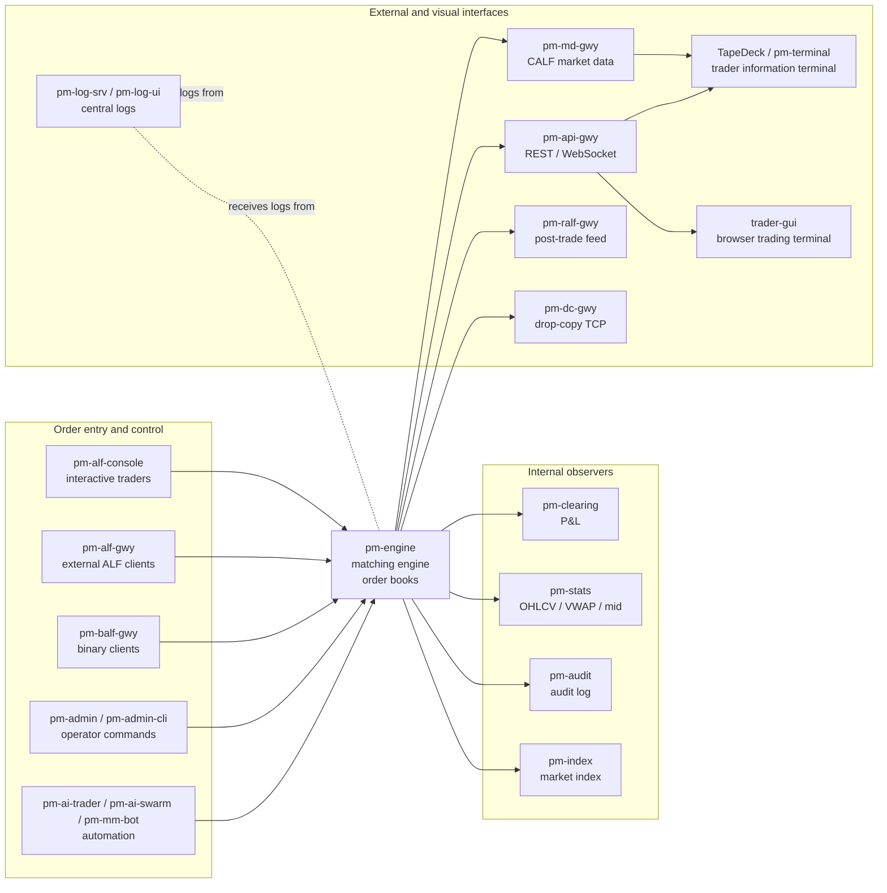
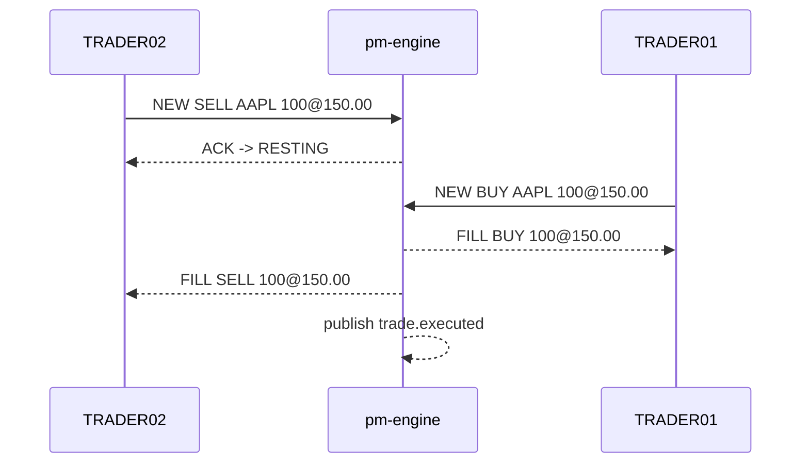

# Getting Started

!!! note "Learning objectives"
    After reading this page you will understand:

    - What EduMatcher is, and why it is split into many `pm-*` processes
    - The smallest useful path from installation to a first trade, whether you
      installed the containers or the Python package
    - The handful of concepts that make the rest of the guide easier to read
    - How configuration, data files, market data, logs and reports fit together
    - Which chapters to read next for your role


## What EduMatcher is

EduMatcher is a working educational exchange. It has a real matching engine,
real order books, session phases, auctions, market-maker quoting, risk controls,
statistics, clearing-style P&L, audit logs, external gateways, market-data feeds,
post-trade feeds, monitoring tools and autonomous bot traders.

That makes it useful for three different kinds of learning:

- **Market microstructure** — what happens inside an order book, why auctions
  exist, how spreads, time priority, market makers and risk controls change the
  market
- **Exchange operations** — how to configure a venue, start the processes, run a
  session, monitor it, stop it and inspect what happened afterwards
- **Protocol and system design** — how order entry, market data, post-trade
  dissemination, drop copy, logging and recovery semantics are separated in a
  multi-process system

The project is intentionally bigger than a toy. The User Guide is long because
the system covers the whole exchange surface, not because you must learn every
chapter before typing your first order. This page is the map.

!!! tip "If you would rather be told exactly what to do next"
    This page is the **map**: what the system is and how the pieces relate.
    If you want a **route** instead — a staged path with exact commands and a
    checkpoint at every step — go to
    [A Path Through the Guide](001-learning-path.md). It gets you to a running
    exchange in about fifteen minutes and a matched trade in about an hour.

!!! tip "If you are new to exchanges"
    Read [How an Exchange Works](../how-exchange-works.md) before the rest of
    the User Guide. It explains the domain without assuming you already know
    what a book, fill, auction, market maker or drop-copy feed is.


## The system in one picture

EduMatcher is a set of independent processes connected by message streams. The
engine is the only process that owns the order books. Everything else either
sends commands to the engine, listens to events from it, or exposes those events
to another audience.



The important first idea is this: **the exchange is not one command**. It is a
small operating environment. For a five-minute demo you only need `pm-engine`
and two `pm-alf-console` terminals. For a classroom or realistic session you add
configuration, the scheduler, clearing, statistics, market data, logging and
visual displays.


## The five concepts to learn first

You do not need every detail yet. These concepts are enough to make the rest of
the guide readable.

| Concept | What it means | Read more |
|---|---|---|
| **Engine** | `pm-engine`, the authoritative process that owns all order books and matches orders | [Running the Exchange](040-running-the-exchange.md#running-the-exchange), [Processes](170-processes.md) |
| **Symbol** | A tradeable instrument such as `AAPL`, with tick size, reference prices, optional market-maker seeds and risk settings | [Configuration](010-configuration.md), [Risk Controls](120-risk-controls.md) |
| **Gateway ID** | The identity a trader, bot or operator uses when connecting; roles such as `TRADER`, `MARKET_MAKER` and `ADMIN` are attached to gateway IDs | [Configuration](010-configuration.md#alf-gateway-allowlist), [Gateway Concepts](051-gateway-intro.md) |
| **Session phase** | Where the trading day is: `PRE_OPEN`, `OPENING_AUCTION`, `CONTINUOUS`, `CLOSING_AUCTION`, `CLOSED`, or a halt-related phase | [Auctions & Scheduling](080-session-scheduling.md) |
| **Deployed configuration** | The running system reads one compiled artifact at `<EDUMATCHER_DATA_DIR>/ref_data/engine_config.json`; you edit YAML, then deploy it | [Configuration](010-configuration.md#file-location) |

Two more ideas become important once you start observing or integrating:

- **Events and records are not the same thing.** The engine publishes live
  events. `pm-stats`, `pm-clearing`, `pm-audit`, `pm-index` and the log server
  turn those events into durable records. See [Persistence](180-persistence.md).
- **Internal tools and external protocols are separate.** Local processes use
  ZeroMQ around the engine. External clients use ALF, BALF, CALF, RALF, DC1 or
  the API gateway. See [External Protocols Overview](210-protocols-overview.md).


## How to approach the documentation

The User Guide is arranged roughly in layers:

| Layer | Chapters | Use them when... |
|---|---|---|
| **Start and configure** | Getting Started, Configuration, Config Verifier, Config GUI, Running the Exchange | You need to install, create a session config, deploy it and start processes |
| **Trade** | Gateway Reference, Order Types, Combo Orders, Auctions & Scheduling, Market Making | You want to understand what traders and market makers can do |
| **Operate** | Risk Controls, P&L & Clearing, Statistics, Market Index, Exchange Commands, Processes | You are running a classroom, demo or test venue and need control and observability |
| **Persist and audit** | Persistence, Audit Trail, Drop Copy, Centralized Log Server | You need to know what gets written, where, and how to inspect or replay it |
| **Integrate** | External Protocols Overview, ALF, BALF, CALF, RALF, API Gateway, protocol appendices | You are writing a client, feed handler, dashboard or post-trade consumer |
| **Observe visually** | TapeDeck, Log Operator Console, ticker/board/viewer process sections | You want browser or terminal displays for a running market |
| **Practice** | Examples, Example Engine Configs, Training | You want guided exercises rather than reference material |

The [Training Guide](../training/index.md) is the most beginner-friendly
hands-on route. The User Guide is the reference; the training chapters are the
guided lab.


## Installation

Installation has its own chapter: [Installation](005-installation.md). It
covers all five modes — the one-command container install, building the
containers from a checkout, the Multipass VM, `pipx` and a Poetry checkout —
together with the container networking, every build flag, and every directory
the system uses.

Two of them matter for this page, because they lead to different first steps.

**Containers — the whole system, four browser applications included:**

```bash
curl -fsSL https://raw.githubusercontent.com/johan162/EduMatcher/main/deployment/curl/install.sh | bash
cd ~/.edumatcher && ./edumatcher.sh start
```

The exchange is now running on a bundled configuration. Open
<http://localhost:8090> for the trading terminal and <http://localhost:8091>
for the log console. The `pm-*` commands used throughout this guide live
*inside* the container:

```bash
./edumatcher.sh shell        # then pm-admin, pm-alf-console, pm-stats-cli, ...
```

**Python package — the processes on your own machine:**

```bash
pipx install edumatcher
mkdir edumatcher-session && cd edumatcher-session
pm-setup
```

Here you start each process yourself. That is slower, and it is the better way
to *learn* the system: you see what each process does, and what breaks when one
is missing.

| | Containers | `pipx` / Poetry |
|---|---|---|
| Time to a running exchange | one command | a few, plus `pm-setup` |
| Web applications | four, already wired to the exchange | started separately |
| Where `pm-*` commands run | inside the container, after `./edumatcher.sh shell` | your own shell |
| Data on disk | `~/.edumatcher/data` | `~/.local/share/edumatcher` |
| Best for | seeing the whole system; classrooms and demos | learning the pieces; developing against them |

Commands in this chapter are shown in installed form. In a Poetry checkout,
prefix every `pm-*` command with `poetry run`. In a container, run them after
`./edumatcher.sh shell`, where they are already on `PATH` and the data
directory is already set.


## Environment variables

EduMatcher has one variable that decides *where everything lives*:

| Variable | Default in installed mode | Default in source checkout | Purpose |
|---|---|---|---|
| `EDUMATCHER_DATA_DIR` | `~/.local/share/edumatcher` | `<repo>/src/data/` | Root directory for deployed reference data and runtime data files |

Every process reads the deployed config from
`<EDUMATCHER_DATA_DIR>/ref_data/engine_config.json`. Set this variable once in
your shell profile or launcher so every process in a session sees the same
configuration and writes to the same data area.

### How the default is selected

The data directory is selected when the EduMatcher Python package is imported;
it is not selected from the process's current working directory:

1. If `EDUMATCHER_DATA_DIR` is set, its expanded and absolute path wins in both
  development and installed deployments.
2. Otherwise, EduMatcher checks where `edumatcher/config.py` is installed. If
  its package parent is named `src`, EduMatcher treats the process as running
  from a source checkout and uses `<repo>/src/data/`.
3. Otherwise, EduMatcher treats the package as installed and uses
  `~/.local/share/edumatcher` (for example, `/Users/<user>/.local/share/edumatcher`
  on macOS).

This means running an installed command from inside a repository does not make
it a source checkout, and running a Poetry command from another directory does
not change the source-checkout data location. All processes in one exchange
must use the same `EDUMATCHER_DATA_DIR` value when an explicit shared location
is needed.

The authored YAML may live elsewhere, but deployment always installs the
compiled artifact and its copied source under the selected data directory:

```text
<DATA_DIR>/ref_data/engine_config.json
<DATA_DIR>/ref_data/engine_config.yaml
```

Configured relative runtime paths such as `data/stats.db` are also resolved
under `<DATA_DIR>`, so they refer to the same files regardless of the command's
working directory. Absolute paths remain explicit overrides.

A container sets this for you: `EDUMATCHER_DATA_DIR` is `/data` inside, bind-
mounted from `~/.edumatcher/data` (or `deployment/docker/data` from a
checkout), so the databases and logs are ordinary files on your disk.

Other environment variables exist — which network interface each process binds,
where the log failover directory goes — but none of them are needed for a first
session. They are all in [Installation](005-installation.md).


## Configuration: edit YAML, deploy artifact

EduMatcher separates the file you edit from the file the exchange runs.

| File | Purpose |
|---|---|
| `engine_config.yaml` | Authored configuration. Keep this in your session directory or version control. Edit this. |
| `<EDUMATCHER_DATA_DIR>/ref_data/engine_config.json` | Compiled deployed artifact. Every running process reads this. Do not edit it by hand. |

Why this matters: a multi-process exchange is dangerous if each process can be
pointed at a different file. EduMatcher avoids that. You deploy once, then every
process reads the same artifact.

Typical loop:

```bash
# Start from the sample copied by pm-setup, or generate a new authored file
pm-config-gen \
    --symbols AAPL MSFT TSLA \
    --gateways TRADER01:TRADER TRADER02:TRADER OPS01:ADMIN MM01:MARKET_MAKER \
    --output engine_config.yaml

# Validate only
pm-config-deploy --check engine_config.yaml

# Validate, compile and install as the deployed artifact
pm-config-deploy engine_config.yaml

# Confirm where the deployed config lives
pm-config-deploy --show
```

For the full field reference, see [Configuration](010-configuration.md). For a
visual editor, see [Configuration GUI](030-config-GUI.md). For a catalog of
ready-made examples, see [Example Engine Configs](810-example-configs.md).


## Your first session: one trade in five minutes

This path uses the sample configuration installed by `pm-setup`. It has
`TRADER01`, `TRADER02`, `OPS01`, `MM01` and symbols such as `AAPL`, `MSFT` and
`TSLA`. Session scheduling is disabled in the sample, so matching is available
immediately.

Open three terminals in the same session environment.

!!! tip "Using the container install?"
    The exchange is already running — skip Terminal 1. Open two shells inside
    the container instead of two on your host:

    ```bash
    cd ~/.edumatcher
    ./edumatcher.sh shell        # in each of two terminals
    ```

    Then run the `pm-alf-console` commands below in those. The container's
    default configuration is `three-basic`, which has the same symbols
    (`AAPL`, `MSFT`, `TSLA`) and the same gateways (`TRADER01`, `TRADER02`,
    `OPS01`, `MM01`) as the `pm-setup` sample, so every command below works
    unchanged. `pm-config-show` prints what is actually deployed if you want to
    confirm. You can also watch the trade land in the browser terminal on
    <http://localhost:8090>.

### Terminal 1 - start the engine

```bash
pm-engine --verbose
```

Wait until the engine has bound its sockets and printed the deployed
configuration it is using. Leave this process running.

### Terminal 2 - connect the seller

```bash
pm-alf-console --id TRADER02
```

At the `TRADER02>` prompt, post a resting sell order:

```text
NEW|SYM=AAPL|SIDE=SELL|TYPE=LIMIT|QTY=100|PRICE=150.00|TIF=DAY
```

### Terminal 3 - connect the buyer

```bash
pm-alf-console --id TRADER01
```

At the `TRADER01>` prompt, buy at the same price:

```text
NEW|SYM=AAPL|SIDE=BUY|TYPE=LIMIT|QTY=100|PRICE=150.00|TIF=DAY
```

Both gateways should report a fill. The engine matched the buy and sell because
the bid price was high enough to trade with the resting ask.



That is the core of the system. Everything else in EduMatcher either changes
what orders can do, changes when matching is allowed, observes what happened, or
exposes the same activity to other clients.

!!! tip "What if the order fills before the other trader acts?"
    Your configuration may contain market-maker seed quotes. In that case an
    aggressive order can trade against the seeded quote instead of waiting for
    the other participant. That is not a bug; it means the book already had
    liquidity. Read [Market Making](090-market-maker.md) when you are ready for
    that layer.


## Add one process at a time

After the first trade, add observers. This is the safest way to learn the
system: start with the engine and gateways, then add one new responsibility at a
time.

| When you want to... | Start this | Then read |
|---|---|---|
| See one live order book | `pm-viewer --symbol AAPL` | [Order Types](060-order-types.md), [Processes](170-processes.md) |
| See a multi-symbol board or ticker | `pm-board`, `pm-ticker` | [Statistics and Reporting](140-statistics-and-reporting.md) |
| Record OHLCV, VWAP and mid prices | `pm-stats` | [Statistics and Reporting](140-statistics-and-reporting.md) |
| Track positions and P&L | `pm-clearing` | [P&L & Clearing](130-pnl-clearing.md) |
| Capture a full audit log | `pm-audit` | [Audit Trail](190-audit.md), [Persistence](180-persistence.md) |
| Drive opening and closing phases by time | `pm-scheduler` | [Auctions & Scheduling](080-session-scheduling.md) |
| Run operator commands | `pm-admin` or `pm-admin-cli` | [Risk Controls](120-risk-controls.md), [Exchange Commands](160-exchange-commands.md) |
| Publish external market data | `pm-md-gwy` | [Market Data Feed (CALF)](240-calf-gateway.md) |
| Open the browser trader terminal | TapeDeck / `pm-terminal` stack | [Trader Information Terminal](290-trader-info-terminal.md) |
| Collect logs from all processes | `pm-log-srv`, then `pm-log-cli` or `pm-log-ui` | [Centralized Log Server](280-log-srv.md), [Log Operator Console](285-log-srv-gui.md) |

| Open the browser trading terminal, log console or config builder | the container stack, or `make dev` in `web-apps/<app>` | [Installation](005-installation.md), [Trader Information Terminal](290-trader-info-terminal.md), [Log Operator Console](285-log-srv-gui.md) |

The full process catalog is in [Processes](170-processes.md). Use that chapter
when you want exact command-line flags and startup dependencies.

Once you know which processes you want, you do not have to start them one at a
time forever. `pm-opctl-cli start` brings up a whole named profile — `micro`,
`mini` or `default` — writes each process's log to a file, and reports the lot
with `pm-opctl-cli list`. It is what the container runs internally, and it works
the same on the host. See
[Running the Exchange](040-running-the-exchange.md#starting-the-stack-with-pm-opctl-cli).


## What the major feature areas are for

### Trading and order behavior

Start here if you are a trader, market maker or instructor building exercises.

- [ALF Console (pm-alf-console)](055-alf-console.md) explains command syntax and
  responses such as `NEW`, `CANCEL`, `STATUS`, `ORDERS`, `QUOTE` and `QLEGS`
  (see [Gateway Concepts](051-gateway-intro.md) for what a gateway is)
- [Order Types](060-order-types.md) explains LIMIT, MARKET, STOP, ICEBERG,
  trailing stop, OCO and time-in-force behavior
- [Combo Orders](070-combo-orders.md) explains multi-leg strategies and
  cascade cancellation
- [Auctions & Scheduling](080-session-scheduling.md) explains opening/closing
  auctions, equilibrium prices, trading dates, time zones and the scheduler
- [Market Making](090-market-maker.md) and [Market-Maker Bot](100-mm-bot.md)
  explain quote obligations, quote lifecycle and automated quoting

### Operations and controls

Start here if you are running the venue.

- [Running the Exchange](040-running-the-exchange.md) gives practical startup
  sequences and readiness checks
- [Risk Controls](120-risk-controls.md) covers price collars, circuit breakers,
  halts, resumes and kill switches
- [Exchange Commands](160-exchange-commands.md) covers admin command flows and
  automation helpers
- [Processes](170-processes.md) is the map of every runtime process and utility

### Observation, reports and records

Start here if you need to explain or audit what happened.

- [P&L & Clearing](130-pnl-clearing.md) explains positions, realized/unrealized
  P&L and clearing queries
- [Statistics and Reporting](140-statistics-and-reporting.md) explains daily
  OHLCV, VWAP, midpoint snapshots, raw tick storage and `pm-stats-cli`
- [Market Index](150-market-index.md) and [Index Admin CLI](152-index-admin-cli.md)
  cover cap-weighted index calculation and corporate actions
- [Persistence](180-persistence.md) shows every file EduMatcher writes
- [Audit Trail](190-audit.md) explains full event capture and `pm-audit-cli`

### External connectivity

Start here if you are writing a client or integration.

- [External Protocols Overview](210-protocols-overview.md) tells you which
  protocol family to use
- [ALF TCP Gateway](220-alf-gateway.md) and [Appendix: ALF Protocol](900-app-alf-protocol.md)
  cover text order entry
- [BALF TCP Gateway](230-balf-gateway.md) and [Appendix: BALF Protocol](910-app-balf-protocol.md)
  cover binary order entry
- [Market Data Feed (CALF)](240-calf-gateway.md), [CALF Protocol Spy](241-calf-spy-cli.md)
  and [Appendix: CALF Protocol](920-app-calf-protocol.md) cover market-data
  subscriptions, snapshots and replay
- [Post-Trade Dissemination (RALF)](250-ralf-gateway.md), [RALF Protocol Spy](251-ralf-spy-cli.md)
  and [Appendix: RALF Protocol](930-app-ralf-protocol.md) cover external
  post-trade consumers
- [API Gateway](260-api-gateway.md) covers REST and WebSocket access for
  dashboards and application clients
- [Message Reference](270-message-reference.md) is the internal event catalog


## Roadmaps by role

You can read the whole guide front to back, but most readers should not start
that way. Pick the path that matches what you are trying to do.

| Role or goal | Suggested path |
|---|---|
| **Beginner learning the market** | [How an Exchange Works](../how-exchange-works.md) -> this page -> [Training](../training/index.md) chapters 00-08 -> [ALF Console](055-alf-console.md) |
| **Student trader** | Installation -> first session -> [ALF Console](055-alf-console.md) -> [Order Types](060-order-types.md) -> [Auctions & Scheduling](080-session-scheduling.md) |
| **Instructor running a class** | Installation -> [Configuration](010-configuration.md) -> [Running the Exchange](040-running-the-exchange.md) -> [Processes](170-processes.md) -> [Training](../training/index.md) |
| **Market maker** | [Market Making](090-market-maker.md) -> [Market-Maker Bot](100-mm-bot.md) -> [ALF Console](055-alf-console.md#qlegs-inspect-mm-quote-legs-and-fill-flags) |
| **Operator / supervisor** | [Running the Exchange](040-running-the-exchange.md) -> [Risk Controls](120-risk-controls.md) -> [Exchange Commands](160-exchange-commands.md) -> [Centralized Log Server](280-log-srv.md) |
| **Analyst / auditor** | [P&L & Clearing](130-pnl-clearing.md) -> [Statistics and Reporting](140-statistics-and-reporting.md) -> [Audit Trail](190-audit.md) -> [Persistence](180-persistence.md) |
| **Dashboard or feed developer** | [External Protocols Overview](210-protocols-overview.md) -> [CALF](240-calf-gateway.md) or [API Gateway](260-api-gateway.md) -> protocol appendices |
| **Core developer** | Developer install -> [Architecture](../architecture/01-architecture.md) -> [Developer Practice](../developer/01-dev-practice.md) -> [The Development Loop](../developer/08-dev-workflow.md) -> tests for the subsystem you are changing |
| **Web application developer** | [Installation](005-installation.md) -> [The Development Loop](../developer/08-dev-workflow.md) -> the app's own `README.md` -> [API Gateway](260-api-gateway.md) or [CALF](240-calf-gateway.md) |


## Three details worth knowing early

### Prices are exact integer ticks internally

Displayed prices look like money: `150.25`. Internally, the engine matches on
integer ticks. With `tick_decimals: 2`, `150.25` is stored as `15025` ticks.
This avoids floating-point drift in matching, turnover and reports.

Most commands, CLIs and APIs convert for you. Raw SQLite rows may show the tick
form. Read [Prices are stored as integer ticks](140-statistics-and-reporting.md#prices-are-stored-as-integer-ticks)
before doing direct SQL analysis.

### Instants and trading dates are different

Event timestamps are UTC instants. Daily OHLCV, clearing summaries and index
rows are grouped by the exchange's local trading date. If a session crosses
midnight UTC, one trading day can span two UTC dates.

If you run `pm-stats` and `pm-clearing` with a non-default timezone, give both
the same value:

```bash
pm-stats --timezone Europe/Stockholm
pm-clearing --timezone Europe/Stockholm
```

Read [The trading date](080-session-scheduling.md#the-trading-date) before
comparing daily reports.

### Empty books are normal until someone provides liquidity

An exchange does not create bids and asks by itself. The book has liquidity only
when orders rest in it. For demos, you can provide liquidity manually, by seeded
market-maker quotes in configuration, or with `pm-mm-bot` / AI traders.

If a beginner sees no fill, the most common reason is simple: nobody is resting
on the other side at a price that crosses.


## Quick glossary

| Term | Meaning |
|---|---|
| **Order book** | The sorted resting buy and sell orders for one symbol |
| **Bid / ask** | Best available buy price / best available sell price |
| **Spread** | Difference between best ask and best bid |
| **Fill** | An execution: two orders matched and traded |
| **TIF** | Time-in-force: how long an order may remain active (`DAY`, `GTC`, `ATO`, `ATC`, etc.) |
| **Auction** | A call phase where orders collect first and execute together at an equilibrium price |
| **Market maker** | A participant expected to quote both bid and ask liquidity |
| **Circuit breaker** | A risk control that halts a symbol after a configured price move |
| **Drop copy** | A copy of fills sent to compliance, audit or risk systems |
| **CALF** | EduMatcher's external market-data protocol |
| **RALF** | EduMatcher's external post-trade dissemination protocol |
| **LALF** | EduMatcher's centralized log protocol |

For the full vocabulary, see the [Glossary](../glossary.md).


## Where to go next

| If you want to... | Go to |
|---|---|
| Be told what to do next, step by step | [A Path Through the Guide](001-learning-path.md) |
| Follow a guided, hands-on lab with exercises | [Training](../training/index.md) |
| Get the whole system running, GUIs included | [Installation](005-installation.md) |
| Build your own session configuration | [Configuration](010-configuration.md) |
| Operate a session — start, monitor, troubleshoot, shut down | [Running the Exchange](040-running-the-exchange.md) |
| See the complete runtime map | [Processes](170-processes.md) |
| Write a client against a protocol | [External Protocols Overview](210-protocols-overview.md) |
| Work on EduMatcher itself | [Developer Practice](../developer/01-dev-practice.md) |

The rest of the guide is large, but it is not a wall. It is a map of a whole
exchange. Start with one process, one symbol and one trade; then add the next
layer when the previous one makes sense.