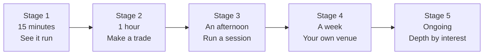
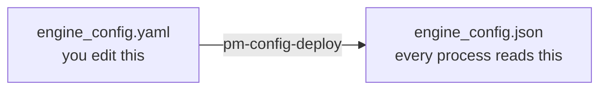

# A Path Through the Guide

!!! note "What this page is"
    EduMatcher is a whole exchange, and its documentation is sized to match.
    That is intimidating on day one, and it does not have to be: you can reach
    a working exchange with a live order book in about fifteen minutes, and
    everything after that is optional depth you can take in any order.

    This page is the staged route. Each stage has a **goal**, the **exact
    commands**, and a **checkpoint** that tells you whether it worked. Nothing
    in a later stage is needed to complete an earlier one.

    If something here does not work as written, that is a documentation bug —
    please report it.


## The map



| Stage | Goal | You will have |
|---|---|---|
| **1** | See a real exchange running | Four browser applications, live prices |
| **2** | Put an order in the book and match it | A filled trade you caused |
| **3** | Operate a session end to end | Records, reports, an audit trail |
| **4** | Build a venue of your own | Your own configuration, deployed |
| **5** | Go as deep as you need | Protocols, bots, integrations |

A rough rule for the whole guide: **read a chapter when you have a question it
answers**, not before. The chapter list is a reference shelf, not a syllabus.


## Stage 1 — See it run (about 15 minutes)

**Goal:** a running exchange with live, moving prices in your browser. No
configuration, no Python, no concepts yet.

### What you need

A container runtime — Podman or Docker. Nothing else. You do not need Python,
Node, or a clone of the repository.

### Do this

```bash
curl -fsSL https://raw.githubusercontent.com/johan162/EduMatcher/main/deployment/curl/install.sh | bash
cd ~/.edumatcher
./edumatcher.sh config three-basic-nomm
./edumatcher.sh start
```

The first start pulls five container images and takes a few minutes. Later
starts take seconds.

**Explanation:** `edumatcher.sh` is the simplified control surface for a container installed
exchange. The first subcommand `config three-basic-nomm` installs an exchange config file (also known as reference data)
with three symbols (order-books) with some very basic exchange config and no-market-maker quotes in any of the
order books. 

This is however not realistic as in a real exchange an order book would never be truly empty (even directly after an IPO there would be investment banks that guarantees some initial quotes to provide liquidity) but it makes for good start point
for learning about exchnages to start with empty books.

The last subcommmand `start` does what you think; starts the exchange!


### Checkpoint

Open these three URLs. All three should load:

| URL | What it is |
|---|---|
| <http://localhost:8090> | **TapeDeck** — a read-only market display. Prices, depth, trades |
| <http://localhost:8091> | **Log console** — every process's operational log |
| <http://localhost:8093> | **Trading GUI** — where you would place orders as a trader |

Then confirm the exchange itself is healthy:

```bash
./edumatcher.sh status
```

Every process should show as running.

!!! question "Nothing is moving on TapeDeck"
    That is expected and correct. An exchange does not invent trades — the
    book is empty until someone puts an order in it. That is Stage 2.

    What you *should* see is the symbol list (AAPL, MSFT, TSLA) and a
    connection indicator that is not `RECONNECTING`.

### What you just started

One container running the exchange — a matching engine plus about a dozen
supporting processes — and four containers running the browser applications.
They share a private network, which is why nothing asked you for an address.

Read [Installation](005-installation.md) when you want to know where the data
lives, how to change what the exchange trades, or how any of that is wired.
**You do not need it yet.**


## Stage 2 — Make a trade (about an hour)

**Goal:** understand what an order book is by putting two orders into one and
watching them match.

### The five words you need first

You can pick these up as you go, but they make everything below readable:

| Word | Meaning |
|---|---|
| **Order book** | The list of resting buy and sell orders for one symbol |
| **Resting** | An order sitting in the book, waiting for someone to trade with it |
| **Fill** | Two orders matched — a trade happened |
| **Bid / ask** | The best price someone will buy at / sell at |
| **Gateway ID** | Who you are when you connect. `TRADER01` is a trader, `OPS01` an operator |

If those are new, read [How an Exchange Works](../how-exchange-works.md) — it
explains the domain without assuming you know any of it. Twenty minutes, and
the rest of the guide gets much easier.

### The configuration you are running

The default bundled configuration is called `three-basic`. It gives you:

- **Symbols:** `AAPL`, `MSFT`, `TSLA`
- **Gateways:** `TRADER01` and `TRADER02` (traders), `MM01` (market maker),
  `OPS01` (operator)
- **Session scheduling: off** — matching is available immediately, with no
  opening auction to wait for

That last point is why this configuration is the default: you can trade the
moment it starts.

### Do this

The `pm-*` commands live inside the container. Open **two** terminals and put
each one inside it:

```bash
cd ~/.edumatcher
./edumatcher.sh shell
```

**Terminal 1 — the seller.** Connect as `TRADER02` and post an order to sell
100 AAPL at 150.00:

```bash
pm-alf-console --id TRADER02
```

At the `TRADER02>` prompt:

```text
NEW|SYM=AAPL|SIDE=SELL|TYPE=LIMIT|QTY=100|PRICE=150.00|TIF=DAY
```

Nothing trades yet. There is no buyer, so the order *rests* in the book. Look
at <http://localhost:8090> — AAPL now has an ask at 150.00 where it had
nothing.

**Terminal 2 — the buyer.** Connect as `TRADER01` and buy at the same price:

```bash
pm-alf-console --id TRADER01
```

```text
NEW|SYM=AAPL|SIDE=BUY|TYPE=LIMIT|QTY=100|PRICE=150.00|TIF=DAY
```

### Checkpoint

- Both consoles report a **fill**
- TapeDeck shows a trade at 150.00, and the ask at 150.00 is gone
- The log console at <http://localhost:8091> has entries from the engine

You have just caused a trade on a real matching engine.

!!! question "It filled immediately, before I sent the second order"
    Then the book already had liquidity — some configurations seed
    market-maker quotes at startup. Not a bug: your order traded against a
    resting quote instead of waiting. `three-basic` does seed `MM01` quotes on
    some symbols. Try a price far from the market (say `PRICE=10.00` on a buy)
    to see an order rest instead.

!!! question "`unknown gateway` or the console will not connect"
    Check the ID spelling — it is case-sensitive — and that you are inside the
    container. `pm-config-show` prints the configuration that is actually
    deployed, including the gateway list.

### Look at what happened

Still inside the container:

```bash
pm-admin --id OPS01
```

At the prompt, try:

```text
SYMBOLS
GATEWAYS
BOOK|SYM=AAPL
SESSION_STATUS
```

This is the operator's view: what exists, who is connected, what the book
looks like right now.

### Where to read more

| If you want to know... | Read |
|---|---|
| What else you can type at a trader prompt | [ALF Console](055-alf-console.md) |
| What order types exist beyond LIMIT | [Order Types](060-order-types.md) |
| What an operator can do | [Exchange Commands](160-exchange-commands.md) |
| The concepts behind all of it | [Getting Started](000-getting-started.md) |


## Stage 3 — Run a session (an afternoon)

**Goal:** operate the exchange as an exchange — with phases, records and
reports — rather than typing single orders.

By now you should be comfortable with Stage 2's loop. This stage adds the
three things that make it a *session* rather than a demo.

### 1. Sessions and phases

Real venues open and close. Set the exchange to a configuration that has
session scheduling enabled:

```bash
cd ~/.edumatcher
./edumatcher.sh config three-nominal
```

This switches the deployed configuration and restarts. Now the exchange moves
through `PRE_OPEN`, `OPENING_AUCTION`, `CONTINUOUS`, `CLOSING_AUCTION` and
`CLOSED` on a timetable, and orders sent in the wrong phase are handled
differently.

Read [Auctions & Scheduling](080-session-scheduling.md) — this is the single
most important chapter for understanding why an exchange behaves as it does.

**Checkpoint:** `pm-admin --id OPS01` then `SESSION_STATUS` reports a phase,
and `SCHEDULE` shows the day's timetable.

### 2. The records

The exchange writes everything down. Trade a little, then, inside the
container:

```bash
pm-stats-cli daily          # OHLCV per symbol per trading day
pm-stats-cli trades         # every matched trade
pm-clearing-cli pnl         # positions and profit/loss per gateway
pm-audit-cli events --limit 20
```

These read the databases that `pm-stats`, `pm-clearing` and `pm-audit` have
been writing since startup. They are files on your own disk — see
[Persistence](180-persistence.md).

**Checkpoint:** `pm-stats-cli trades` lists the trade you made in Stage 2.

!!! question "A CLI says there is no database, or no rows"
    The recorder that writes it either is not running or started after the
    events happened. `./edumatcher.sh status` shows which processes are up.
    Recorders only capture what happens while they are running — which is why
    the startup order in [Running the Exchange](040-running-the-exchange.md)
    puts them before the engine.

### 3. Watching it live

```bash
pm-viewer --symbol AAPL     # one order book, in detail
pm-board                    # several symbols at once
pm-ticker                   # a scrolling tape
```

### Where to read more

| Topic | Chapter |
|---|---|
| Everything an operator does, start to shutdown | [Running the Exchange](040-running-the-exchange.md) |
| Halts, collars, circuit breakers | [Risk Controls](120-risk-controls.md) |
| What P&L means here | [P&L & Clearing](130-pnl-clearing.md) |
| Statistics and reports | [Statistics and Reporting](140-statistics-and-reporting.md) |


## Stage 4 — Build your own venue (a week, on and off)

**Goal:** stop using bundled examples and define an exchange of your own —
your symbols, your participants, your trading day.

### The one idea to understand first

EduMatcher separates **the file you edit** from **the file it runs**:



Editing the YAML changes nothing until you deploy it. This is deliberate: in a
multi-process system, the alternative is processes disagreeing about the rules.

### The loop

```bash
# 1. Generate a starting point
pm-config-gen \
    --symbols AAPL MSFT TSLA \
    --gateways TRADER01:TRADER TRADER02:TRADER OPS01:ADMIN MM01:MARKET_MAKER \
    --seed-mm-mid-range 90:160 \
    --seed-last-prices-from-mm \
    --output engine_config.yaml

# 2. Check it before deploying — this catches most mistakes
pm-cverifier engine_config.yaml

# 3. Deploy it
pm-config-deploy engine_config.yaml

# 4. See what the running system will actually use
pm-config-show
```

The two `--seed-*` flags matter more than they look. Declaring a
`MARKET_MAKER` gateway obliges you to give it a quote for **every** symbol;
without them, `pm-config-gen` writes empty stubs, warns you to fill in the
prices, and the engine refuses the configuration until you do.
`--seed-mm-mid-range 90:160` invents plausible quotes in that price range, and
`--seed-last-prices-from-mm` derives the reference prices that the collar
checks need. The result runs as generated — which is what you want for a first
configuration of your own.

`pm-cverifier` is worth running every time. It reports errors, warnings and
advisories with explanations, and it is much faster than discovering a problem
when the engine refuses to start. A clean run ends in `0 errors`; warnings and
advisories are usually fine to leave alone at this stage.

To run *your* configuration in the container stack:

```bash
cd ~/.edumatcher
./edumatcher.sh config ./engine_config.yaml
```

**Checkpoint:** after a restart, `pm-config-show` lists your symbols and
gateways, and TapeDeck shows them.

### Where to read more

| Topic | Chapter |
|---|---|
| Every configuration field | [Configuration](010-configuration.md) |
| Every check the verifier makes | [Config Verifier](020-config-verifier.md) |
| A visual editor instead of YAML | [Configuration GUI](030-config-GUI.md) |
| Ready-made examples to copy | [Example Engine Configs](810-example-configs.md) |
| Seeding liquidity so books are not empty | [Market Making](090-market-maker.md) |


## Stage 5 — Depth, by interest

From here there is no order. Pick the branch that matches what you want.

**I want to write a client that connects to the exchange.**
Start at [External Protocols Overview](210-protocols-overview.md), which tells
you which protocol family fits your case, then the chapter for that protocol
and its appendix. If you are writing a dashboard rather than a trading client,
[API Gateway](260-api-gateway.md) is usually the right answer instead of a
socket protocol.

**I want automated traders.**
[Market-Maker Bot](100-mm-bot.md) and the AI trader processes in
[Processes](170-processes.md). Bots are also the easiest way to get a book
that looks alive without typing orders.

**I want to teach with this.**
The [Training Guide](../training/index.md) is a guided lab with exercises and
checkpoints — a different format from this reference guide, and better for a
classroom. Pair it with
[Running the Exchange](040-running-the-exchange.md).

**I want to understand the internals.**
[Architecture](../architecture/01-architecture.md), then
[Processes](170-processes.md), then
[Message Reference](270-message-reference.md).

**I want to work on EduMatcher itself.**
[Developer Practice](../developer/01-dev-practice.md) and
[The Development Loop](../developer/08-dev-workflow.md).


## When something does not work

In roughly the order worth trying:

| Question | Command |
|---|---|
| Is everything running? | `./edumatcher.sh status` |
| What did the exchange say at startup? | `./edumatcher.sh logs` |
| What configuration is actually deployed? | `pm-config-show` (inside the container) |
| Am I looking at the exchange I think I am? | `./edumatcher.sh mounts` |
| Which ports are published? | `./edumatcher.sh urls` |
| What happened, in detail? | The log console at <http://localhost:8091> |

Two mistakes are common enough to name:

- **Two exchanges at once.** A released install and a source-built stack use
  the same container names and ports, so only one can run. Both refuse to
  start on top of the other, and `mounts` tells you which one owns the ports.
- **Expecting the book to fill itself.** An empty book with no fills usually
  means nobody is resting on the other side at a crossing price. That is the
  market working correctly.

[Running the Exchange — Troubleshooting](040-running-the-exchange.md#troubleshooting-startup-problems)
goes further, and the [FAQ](../faq.md) covers the rest.


## If you prefer a different route

This page is one path, not the only one.

- **[Getting Started](000-getting-started.md)** is the conceptual map: what the
  system is, why it is split into processes, and how the pieces relate. Read it
  alongside Stage 2 if you like understanding before doing.
- **[Training](../training/index.md)** is a guided lab with graded exercises.
  Better if you learn by structured practice, and the right choice if you are
  running a class.
- The **[Glossary](../glossary.md)** is there whenever a word does not land.
