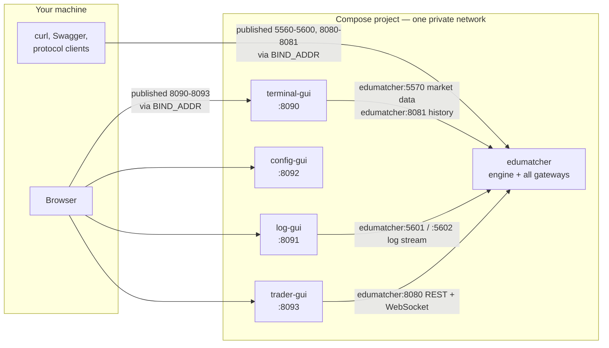
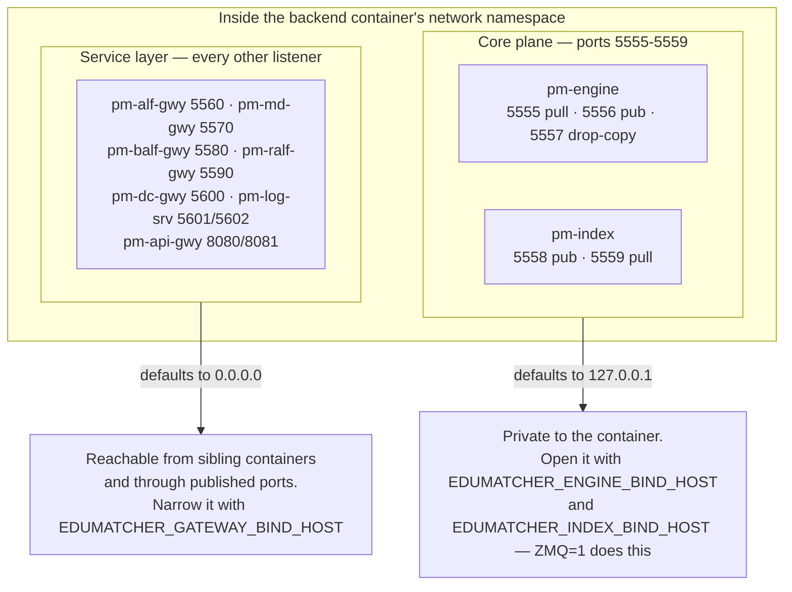
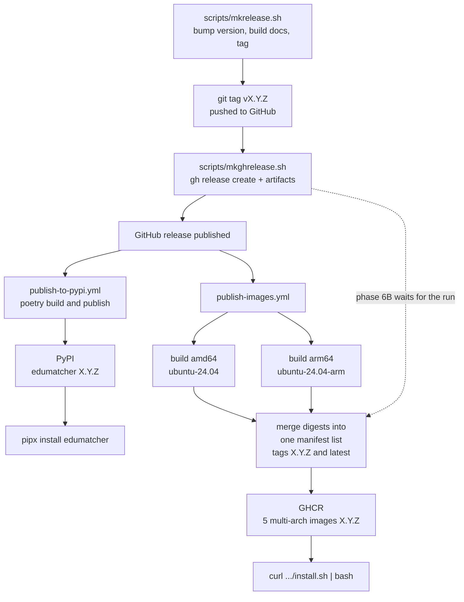

# Installation

!!! note "Learning objectives"
    After reading this page you will understand:

    - Which of the five installation modes fits what you are trying to do
    - How the container deployment is wired, and why the web GUIs reach the
      exchange without any published port being involved
    - What `127.0.0.1` and `0.0.0.0` mean in each of the three separate places
      they appear, which of them actually protects you, and how the core plane
      and the service layer come by their different defaults
    - Every flag that controls a build or a start, and every directory the
      system reads or writes
    - How a release is produced, and what a developer must do to cut one


## Choosing an installation mode

The first question is whether you want to **run** EduMatcher or **change** it.

| Mode | Best for | Needs on your machine | What you get | Command style |
|---|---|---|---|---|
| **Containers, one command** | Running a venue: classroom, demo, self-study | Podman or Docker | The exchange **and** all four web GUIs | `./edumatcher.sh start` |
| **Containers from source** | Changing the code and seeing it run as a system | Podman/Docker, Poetry, Node | The same, built from your checkout | `make up-all` |
| **VM bootstrap** | Workshops where host setup must stay untouched | Multipass, `curl` | Backend inside a Multipass VM | `multipass shell ems` |
| **pipx** | Students running processes by hand, one per terminal | Python 3.13, `pipx` | `pm-*` commands on your PATH | `pm-engine` |
| **Poetry checkout** | Developing, running the test suite | Python 3.13, Poetry | Repository plus dev dependencies | `poetry run pm-engine` |

The container modes give you the whole system — engine, gateways, REST API and
the four browser applications — with one command. The pipx and Poetry modes
give you the individual processes to start yourself, which is what the rest of
this guide assumes when it shows a bare `pm-*` command. In Poetry mode, prefix
those commands with `poetry run`.

!!! tip "If you are not sure"
    Use the one-command container install. It is the fastest route to a
    running market, and nothing it installs is outside a single directory you
    can delete.


## Containers: the whole system in one command

Everything this install creates lives in **one directory**, `~/.edumatcher` by
default. Nothing is written anywhere else — no system paths, no service
registered, no change to your PATH — so removing that directory removes the
installation.

| Inside it | Holds |
|---|---|
| `~/.edumatcher/data` | **Every trade, order book, log and database the exchange produces.** Mounted into the containers, so it is on your disk rather than inside one, and survives stop, start and update |
| `~/.edumatcher/config` | An engine configuration of your own, when you supply one |
| `~/.edumatcher/compose.yaml`, `.env`, `edumatcher.sh` | The deployment itself |

Pick a different location with `--dir`; the layout is the same underneath it.
Two Compose volumes sit outside that directory, in your container engine's
storage — the log viewer's acknowledgements and the trading terminal's failover
log. Neither holds exchange data, and `./edumatcher.sh uninstall` removes both.

!!! tip "`~/.edumatcher/data` is the directory to back up, and the one to delete"
    `./edumatcher.sh uninstall` keeps it; `uninstall --data` is what erases a
    venue's history. `./edumatcher.sh mounts` shows which directory is behind
    each path inside each container if you are ever unsure.

With that established:

```bash
curl -fsSL https://raw.githubusercontent.com/johan162/EduMatcher/main/deployment/curl/install.sh | bash
```

Then open <http://localhost:8090>.

That starts a complete exchange plus four web applications, from images built
and published by the project. Nothing is compiled on your machine: no Python,
no Node, no checkout. The only requirement is Podman or Docker.

| Application | URL | What it is |
|---|---|---|
| Trading terminal | <http://localhost:8090> | Live order books, trades and market data |
| Log viewer | <http://localhost:8091> | The centralized log, searchable, with acknowledgements |
| Configuration builder | <http://localhost:8092> | Author an `engine_config.yaml` in the browser |
| Trader GUI | <http://localhost:8093> | Submit and manage orders as a trading participant |
| REST API docs | <http://localhost:8080/docs> | Swagger UI for the `desk` API gateway |

### What the installer does

1. Checks that Podman or Docker is present, preferring Podman when both are.
2. Resolves the newest release (or the one you named with `--version`).
3. Downloads `compose.yaml`, `edumatcher.sh` and `.env.example` **from that
   release's tag**, so the files and the images always come from one commit.
4. Writes `.env`, creating `data/` and `config/` beside it.
5. Pulls the five images and starts them.

Step 3 is worth noting: the support files come from the release tag being
installed, not from a branch, so the compose file and the images can never
describe different systems.

### Installer options

| Option | Default | Effect |
|---|---|---|
| `--version X.Y.Z` | newest release | Install one specific release. All five images carry this tag, so it pins the whole system |
| `--config NAME` | `three-basic` | Deploy a bundled example configuration |
| `--config FILE` | — | ...or a path to an `engine_config.yaml` of your own |
| `--dir PATH` | `~/.edumatcher` | Where to install |
| `--no-start` | — | Fetch and configure, but do not start anything |
| `--help` | — | Show the options |

Because the script is read from a pipe, options need `bash -s --` so that the
shell hands them to the script rather than consuming them itself:

```bash
curl -fsSL .../install.sh | bash -s -- --config ten-nominal --version 0.26.3
```

Two environment variables are also honoured: `REPO_OWNER` (which GitHub
account and GHCR namespace to use) and `REPO_REF` (fetch the support files
from a branch instead of the release tag, for testing an unreleased installer).

### Configuring it: the `.env` file

`~/.edumatcher/.env` is where every choice about a running install lives. The
installer writes it from `.env.example` on the first run and **keeps your copy
afterwards**, so a later `./edumatcher.sh update` re-pins the version without
discarding anything else you changed.

Compose reads that file automatically because it sits beside `compose.yaml`.
Nothing else does: there is no separate configuration for the containers, and
the compose file itself contains no settings, only `${VARIABLE}` references
into this file.

| Variable | Default | What it does |
|---|---|---|
| `EM_VERSION` | *(the installed release)* | Which release to run. All five images carry this tag, so one value pins the whole system. `latest` follows the newest release |
| `GHCR_OWNER` | `johan162` | The GHCR namespace the images are pulled from. Change it only for a fork |
| `EM_CONFIG` | `three-basic` | Which bundled example configuration the exchange deploys |
| `EM_CONFIG_FILE` | *(empty)* | Set to `/config/engine_config.yaml` when you run a configuration of your own. Non-empty wins over `EM_CONFIG` |
| `EM_PROFILE` | `default` | Which processes start: `default`, `mini` or `micro`. See [Processes](170-processes.md) |
| `TZ` | `UTC` | Container timezone. Set it to match the trading calendar in your configuration, e.g. `Europe/Stockholm` |
| `BIND_ADDR` | `127.0.0.1` | Which host interface the published ports listen on. See the warning below |
| `EDUMATCHER_GATEWAY_BIND_HOST` | `0.0.0.0` | Bind host for the service-layer listeners *inside* the container — the four protocol gateways, `pm-log-srv` and `pm-api-gwy`. It is what makes them reachable from the GUI containers, and it wins over any `bind_address:` in the deployed configuration. Not a host-exposure setting; that is `BIND_ADDR` |
| `EM_ZMQ` | `0` | `1` also publishes the raw ZeroMQ bus (5555-5559, 5601/5602) and tells the engine and `pm-index` to bind the container interface, so tools on your machine can attach. The equivalent of `make up ZMQ=1` |
| `TERMINAL_GUI_PORT` | `8090` | Host port for the trading terminal |
| `LOG_GUI_PORT` | `8091` | Host port for the log viewer |
| `CONFIG_GUI_PORT` | `8092` | Host port for the configuration builder |
| `TRADER_GUI_PORT` | `8093` | Host port for the trader GUI |

Two settings have their own commands, because editing them by hand is easy to
get half-right — `EM_CONFIG` and `EM_CONFIG_FILE` must agree, and `EM_VERSION`
needs an image pull to take effect:

```bash
./edumatcher.sh config ten-nominal    # sets EM_CONFIG, clears EM_CONFIG_FILE
./edumatcher.sh config ./mine.yaml    # copies the file, sets EM_CONFIG_FILE
./edumatcher.sh update 0.26.2         # sets EM_VERSION, pulls, restarts
```

Everything else is a plain edit followed by `./edumatcher.sh restart`.

!!! warning "`BIND_ADDR=0.0.0.0` puts an unauthenticated exchange on your network"
    It is the right setting for a classroom where students connect to the
    instructor's machine, and the wrong one on a network you do not control:
    the protocol gateways have no password. The default keeps everything on
    this machine.

#### Two values you will not find in `.env`

The trading terminal also needs `API_GATEWAY_URL` and `PM_TERMINAL_API_KEY`.
Those are **resolved at startup and injected**, not stored: the read-only API
key is generated per engine configuration — a different one in each bundled
example — and lives on a different gateway instance than the trading
credentials. `./edumatcher.sh start` reads the deployed configuration and
passes both to the terminal. Setting them in `.env` would only go stale the
next time you switched configuration.

### Everyday commands

Everything is driven by one script in the install directory:

```bash
cd ~/.edumatcher
./edumatcher.sh status              # containers, plus the exchange process table
./edumatcher.sh logs terminal-gui   # follow one service
./edumatcher.sh shell               # a shell inside the exchange container
./edumatcher.sh shell pm-config-show      # ...or one command in it
./edumatcher.sh urls                # the application table, with your ports
./edumatcher.sh mounts              # which directory is behind each container path
./edumatcher.sh stop                # stop everything; ./data is kept
./edumatcher.sh start               # bring it back
./edumatcher.sh update              # pull the newest release and restart
./edumatcher.sh update 0.20.5       # ...or move to an exact one
./edumatcher.sh uninstall           # remove containers and volumes, keep data
./edumatcher.sh uninstall --data    # remove everything
```

### Choosing what the exchange trades

EduMatcher ships twelve ready-made configurations: one, three, ten or thirty
order books, each as a `basic`, `nominal` or `complex` variant. They are inside
the backend image, so no download is involved in switching.

```bash
./edumatcher.sh config ten-nominal
./edumatcher.sh restart
```

The names are `one-`, `three-`, `ten-` and `thirty-` combined with `basic`,
`nominal` and `complex`. `./edumatcher.sh config` lists them all if you mistype
one. See [Example Engine Configs](810-example-configs.md) for what each
contains.

To run a configuration of your own, give the same command a path instead:

```bash
./edumatcher.sh config ./my-market.yaml
./edumatcher.sh restart
```

The file is copied into `~/.edumatcher/config/`, mounted read-only into the
container, and deployed on every start — so editing it and restarting is the
whole edit-test loop. Switching back to a bundled example is
`./edumatcher.sh config three-basic`. The configuration builder at
<http://localhost:8092> is the easy way to author one; see
[Configuration GUI](030-config-GUI.md).


## Containers from the source checkout

Use this when you are changing EduMatcher and want to see your change running
as a whole system. It builds the same five images from your working tree.

```bash
git clone https://github.com/johan162/EduMatcher.git
cd EduMatcher/deployment/docker
make build          # builds a wheel from the checkout, then the image
make up-all         # exchange + terminal-, log- and trader-gui
```

`make help` lists every target. The two that matter are `up` (the exchange
alone) and `up-all` (the exchange plus the GUIs).

### Flags that control the build

`make build` decides **where the EduMatcher package comes from**:

| Flag | Result |
|---|---|
| *(none)* | Build a wheel from this checkout with Poetry and install that. This is the default deliberately: a rebuild after editing source must pick up the edit |
| `PYPI=1` | Ignore the checkout; install the newest release from PyPI |
| `VERSION=x.y.z` | Install exactly that PyPI release (implies `PYPI=1`) |
| `DEV=1` | Accepted and ignored — it used to select the local wheel, which is now the default |
| `CONTAINER_ENGINE=docker` | Force Docker when Podman is also installed |

!!! warning "Confirm which package went in"
    A successful build prints `Installing local wheel: /tmp/wheel/edumatcher-<version>.whl`.
    If instead you see pip *downloading* `edumatcher`, the image is running a
    published release rather than your code — and a source change you are
    hunting for will appear not to take effect.

### Flags that control a start

| Flag | Default | Effect |
|---|---|---|
| `CONFIG=<name>` | `three-basic` | Deploy a bundled example |
| `CONFIG=<file>` | — | Deploy an `engine_config.yaml` of your own; the file is copied to `deployment/docker/config/` and mounted read-only |
| `PROFILE=<name>` | `default` | Which processes `pm-opctl-cli` starts: `default`, `mini` or `micro`. See [Processes](170-processes.md) |
| `ZMQ=1` | off | Also publish the raw ZeroMQ bus (5555-5559, 5601-5602) to the host, and set the engine and index sockets to bind `0.0.0.0` inside the container |
| `SSH=1` | off | Run `sshd` in the container on `SSH_PORT`, authorised by your `~/.ssh/*.pub` |
| `CONFIG_GUI=1` | off | Include the configuration builder in `up-all`. It is opt-in because it talks to nothing — it is a standalone authoring tool |

Flags combine: `make up-all CONFIG=ten-complex PROFILE=mini ZMQ=1 CONFIG_GUI=1`.

### Settings in `.env`

`deployment/docker/.env` is created from `.env.example` on the first build.
Compose reads it automatically because it sits beside the compose files, and it
is git-ignored — so it is the right place for choices specific to your machine,
as opposed to a `make` flag, which applies to one invocation only.

When the same setting is available in more than one place, the nearer one wins:

```text
make flag  →  shell environment  →  .env  →  compose ${VAR:-default}  →  image ENV
```

That is why `make up-all CONFIG=ten-nominal` does not edit `.env`, and why a
plain `make up-all` afterwards goes back to whatever `.env` says.

| Variable | Default | Meaning |
|---|---|---|
| `COMPOSE_PROJECT_NAME` | `edumatcher` | Compose project name; decides container and network naming |
| `EDUMATCHER_VERSION` | *(empty)* | PyPI version for `PYPI=1` builds; empty means newest |
| `WITH_SSH` | `1` | Install `openssh-server` into the image at build time |
| `EM_CONFIG` | `three-basic` | Bundled example to deploy |
| `EM_CONFIG_FILE` | *(empty)* | Path **inside the container** to a configuration of your own; set for you by `CONFIG=<file>` |
| `EM_PROFILE` | `default` | Process profile to start |
| `TZ` | `UTC` | Container timezone — match the trading calendar in your configuration |
| `BIND_ADDR` | `127.0.0.1` | Which host interface the published ports listen on. See below |
| `EDUMATCHER_GATEWAY_BIND_HOST` | `0.0.0.0` | Bind host for the service-layer listeners *inside* the container — the four protocol gateways, `pm-log-srv` and `pm-api-gwy`. It is what makes them reachable from the GUI containers, and it wins over any `bind_address:` in the deployed configuration. Not a host-exposure setting; that is `BIND_ADDR` |
| `SSH_PORT` | `2222` | Host port forwarded to `sshd` |
| `TERMINAL_GUI_PORT` | `8090` | Host port for the trading terminal |
| `LOG_GUI_PORT` | `8091` | Host port for the log viewer |
| `CONFIG_GUI_PORT` | `8092` | Host port for the configuration builder |
| `TRADER_GUI_PORT` | `8093` | Host port for the trader GUI |
| `IMAGE_NAME` / `IMAGE_TAG` | `edumatcher` / `local` | Image naming |
| `CONTAINER_NAME` | `edumatcher` | Container name |

Beyond these, the compose files read a few variables that have sensible
defaults and no `.env` entry: `CORS_ORIGIN`, `MAX_WS_CLIENTS`, `CALF_CLIENT_ID`
and `INDEX_IDS` for the trading terminal, `LOG_SRV_ENABLED` for its logging
uplink, and `PIP_INDEX_URL` as a build argument. Export any of them in your
shell before `make up-all` if you need to.

`API_GATEWAY_URL` and `PM_TERMINAL_API_KEY` are read the same way but should be
left alone: `up-all` resolves them from the deployed configuration and injects
them, for the reasons in
[The read-only API key](#the-read-only-api-key).

### Image build arguments

Passed with `--build-arg`, or through the compose files' `args:` blocks. You
need these mainly behind a corporate proxy.

The backend image (`deployment/docker/Dockerfile`):

| Argument | Default | Purpose |
|---|---|---|
| `PYTHON_VERSION` | `3.13` | Base image tag for both build and runtime stages |
| `EDUMATCHER_VERSION` | *(empty)* | PyPI version to install when no local wheel is present |
| `PIP_INDEX_URL` | *(empty)* | Point pip at an internal index such as Artifactory |
| `WITH_SSH` | `1` | Set to `0` for a smaller image with no `openssh-server` |

Each web GUI image (`web-apps/*/Dockerfile`):

| Argument | Default | Purpose |
|---|---|---|
| `WEB_PORT` | per app | Port the server listens on inside the container |
| `NPM_REGISTRY` | `https://registry.npmjs.org/` | Internal npm mirror |
| `NPM_STRICT_SSL` | `true` | Set `false` when a proxy re-signs TLS |
| `HTTP_PROXY` / `HTTPS_PROXY` / `NO_PROXY` | *(empty)* | Honoured by npm during the build |
| `USE_PROXY_CA` / `CA_CERT_FILE` | *(empty)* | config-gui only: install a corporate CA certificate |


## How the containers are wired

This section is worth reading even if the install "just worked", because the
one thing that reliably confuses people here — the difference between
`127.0.0.1` and `0.0.0.0` — appears in three separate places that mean three
different things, and only one of them is a security boundary.

### One compose project, one private network

All five containers belong to a single Compose project, so Compose puts them on
one private network and gives each a name on it. The backend answers to the
hostname `edumatcher`.



Two things follow, and both are easy to get wrong:

- **The GUIs do not use the published ports.** Their traffic never leaves the
  private network. The ports published on your machine exist for *you* — your
  browser, `curl`, Swagger, the protocol example clients.
- **Nothing needs `host.docker.internal`.** Older setups pointed the GUIs at
  the host and back in again, which behaved differently on Docker Desktop,
  Linux Docker and Podman. Sharing one project removes the problem rather than
  working around it.

The configuration builder is the exception: it talks to nothing at all, which
is why it is opt-in with `CONFIG_GUI=1` when building from source.

### The two planes, and where each address is decided

Every listening socket in EduMatcher belongs to one of two planes, and the two
have deliberately different defaults.



**The core plane is the internal bus.** `pm-engine` and `pm-index` speak
ZeroMQ to the other EduMatcher processes and to nothing else, so they default
to `127.0.0.1` and a stock install keeps the bus inside the container.
Starting with `ZMQ=1` sets `EDUMATCHER_ENGINE_BIND_HOST` and
`EDUMATCHER_INDEX_BIND_HOST` to `0.0.0.0` and publishes 5555–5559, so you can
attach your own ZeroMQ client from the host.

**The service layer is what clients talk to.** All seven gateway processes
default to `0.0.0.0`, because every practical deployment needs them reachable
from somewhere else — a sibling GUI container, a student's laptop in a
classroom, a protocol example running on your host.

Each service listener resolves its bind host in this order, first match wins:

| Precedence | Source | Example |
|---|---|---|
| 1 | The process's own `--host` command-line flag | `pm-md-gwy --host 127.0.0.1` |
| 2 | The `EDUMATCHER_GATEWAY_BIND_HOST` environment variable | `EDUMATCHER_GATEWAY_BIND_HOST=127.0.0.1` |
| 3 | `bind_address:` (or `host:` for `pm-api-gwy`) in the engine configuration | `bind_address: 10.0.0.5` |
| 4 | The built-in default | `0.0.0.0` |

`EDUMATCHER_GATEWAY_BIND_HOST` deliberately sits *above* the configuration
file. It is a deployment-wide switch: one environment variable closes every
service listener at once, without editing a configuration that may not be
yours to edit.

### What `0.0.0.0` does and does not expose

| Where | Set by | `127.0.0.1` means | `0.0.0.0` means |
|---|---|---|---|
| **Published ports** — the host side | `BIND_ADDR` in `.env` | Only this machine can reach the exchange | Anyone on your network can |
| **Service listeners** — inside the container | default, or `EDUMATCHER_GATEWAY_BIND_HOST`, or `bind_address:` / `host:` | Only processes *in that container* — not even a sibling container | Any container on the Compose network, and anything reaching a published port |
| **Core plane** — inside the container | default, or `EDUMATCHER_ENGINE_BIND_HOST` / `EDUMATCHER_INDEX_BIND_HOST`; set by `ZMQ=1` | Same: container-internal only | Reachable from the Compose network and publishable |

**Only the first row is a security boundary.** The second and third are inside
a network namespace that already isolates the container: binding `0.0.0.0`
there exposes nothing to the outside world, because there is no route in except
through a port you chose to publish. Whether the exchange is visible on your
LAN is decided entirely by `BIND_ADDR`.

!!! warning "`BIND_ADDR=0.0.0.0` puts an unauthenticated exchange on your network"
    It is the right setting for a classroom where students connect to the
    instructor's machine. It is the wrong setting on a network you do not
    control. There is no password on the order-entry gateways — anyone who can
    open the socket can submit orders.

!!! note "On bare metal there is no namespace"
    A `pipx` or Poetry install has no container around it, so a service
    listener on `0.0.0.0` really is on your network. If that is not what you
    want, export `EDUMATCHER_GATEWAY_BIND_HOST=127.0.0.1` — one variable,
    every gateway, no configuration edits. This is a change in default
    behaviour; see the note in `CHANGELOG.md`.

### Why there is no longer a loopback rewrite

Earlier versions shipped the bundled examples with
`bind_address: 127.0.0.1` and had the container entrypoint rewrite them to
`0.0.0.0` on the way in. That rewrite worked, but it meant the deployed
configuration was not the configuration you wrote, and `pm-config-show`
described one thing while the processes did another.

The gateways now bind `0.0.0.0` themselves, the twelve bundled examples say
`0.0.0.0`, and the entrypoint rewrites nothing: **the deployed configuration is
the configuration you supplied**, and `make config-show` describes what the
processes actually do.

### Two things that look like evidence and are not

Both of these will tell you a gateway is reachable when it is not:

**"I can reach the port from the host."** Podman's rootless port forwarding
delivers a published connection to *loopback inside the container's namespace*.
A listener bound to `127.0.0.1` therefore answers host traffic perfectly, while
a sibling container connecting across the private network gets
`ECONNREFUSED`. Host reachability says nothing about container-to-container
reachability. The stock defaults avoid this, but you can still walk into it by
setting `EDUMATCHER_GATEWAY_BIND_HOST=127.0.0.1`, by passing `--host` to a
process, or by supplying a configuration that pins `bind_address:` to
loopback.

**"`make status` is all green."** `pm-opctl-cli list` shows
`tcp connect to 127.0.0.1:5570 ok`, but that check also runs inside the
container, over the same loopback. A healthy process table is not evidence that
anything outside that container can connect.

The check that settles it is the compiled configuration, which is the file the
processes actually read:

```bash
podman exec edumatcher python3 -c \
  "import json; print(json.load(open('/data/ref_data/engine_config.json'))['market_data_gateway'])"
```

and, from a GUI container, an actual connection attempt:

```bash
podman exec edumatcher-terminal-gui node -e '
const net = require("net");
const s = net.connect(5570, "edumatcher", () => { console.log("OPEN"); s.end(); });
s.on("error", e => console.log("FAIL", e.code));'
```

### The read-only API key

One value cannot be a fixed default. The trading terminal reads historical data
through `pm-api-gwy` using the credential whose `gateway_id` is `null`. That
key is **generated per engine configuration** — every bundled example has a
different one — and it is issued on the `dashboards` gateway instance (port
8081), not the `desk` instance (8080) that carries the trading credentials.

Both start paths therefore run in two phases: bring up the exchange, read the
key out of the deployed configuration, then start the GUIs with it. If a
configuration has no such credential the start still succeeds and says so — the
live market-data feed needs no key, only the history panels do.


## Directories and paths

Every location the system reads or writes, and what controls it.

### The data directory

One variable decides where an exchange keeps its state:

| Path | Controlled by | Contains |
|---|---|---|
| `<DATA_DIR>` | `EDUMATCHER_DATA_DIR`; see [Getting Started](000-getting-started.md#environment-variables) for how the default is chosen | Everything below |
| `<DATA_DIR>/ref_data/engine_config.json` | `pm-setup`, `pm-config-deploy` | The **compiled artifact every process reads** |
| `<DATA_DIR>/ref_data/engine_config.yaml` | same | The authored source it was compiled from, kept for provenance |
| `<DATA_DIR>/emo/` | `pm-opctl-cli` | One log per process, PID files, and the active profile name |
| `<DATA_DIR>/log.db` | `pm-log-srv` | The centralized log |
| `<DATA_DIR>/stats.db` | `pm-stats` | Statistics and history behind the REST API |
| `<DATA_DIR>/clearing.db`, `clearing_report.csv` | `pm-clearing` | Positions and P&L |
| `<DATA_DIR>/audit.log`, `audit_index.db` | `pm-audit` | The audit trail and its index |
| `<DATA_DIR>/gtc_orders.json`, `gtc_combos.json`, `book_stats.json` | `pm-engine` | Resting orders and book state across restarts |
| `<DATA_DIR>/logs/` | log clients | Failover logs written when `pm-log-srv` is unreachable |

Configured relative paths such as `data/stats.db` resolve under `<DATA_DIR>`,
so they mean the same file no matter which directory a process was started
from. Absolute paths in the configuration remain explicit overrides.

### Where that lands in each mode

| Mode | `<DATA_DIR>` is | Controlled by |
|---|---|---|
| One-command containers | `~/.edumatcher/data` on your disk, mounted at `/data` in the container | `--dir` at install time |
| Containers from source | `deployment/docker/data`, mounted at `/data` | The `./data:/data` mount in `compose.yaml` |
| pipx | `~/.local/share/edumatcher` | `EDUMATCHER_DATA_DIR` |
| Poetry checkout | `<repo>/src/data/` | `EDUMATCHER_DATA_DIR` |
| VM | `/home/ubuntu/session` inside the VM | `mknode.sh` |

The container images set `EDUMATCHER_DATA_DIR=/data` internally, so the
container's view and your directory are the same files. Your data is on your
disk, not inside a container: it survives stop, start, rebuild and update.

### Supporting directories

| Path | Created by | Purpose |
|---|---|---|
| `~/.edumatcher/` | the installer (`--dir` to change) | `compose.yaml`, `.env`, `edumatcher.sh`, `data/`, `config/` |
| `~/.edumatcher/config/` | `./edumatcher.sh config <file>` | Your own configuration, mounted read-only at `/config` |
| `deployment/docker/.env` | first `make build` or `make up` | Machine-specific settings; git-ignored |
| `deployment/docker/config/` | `make up-all CONFIG=<file>` | As above, for the source-built stack |
| `deployment/docker/.wheel/` | `make build` | The locally built wheel the image installs from |
| `deployment/docker/.ssh/` | `make keys` | `authorized_keys` assembled from your `~/.ssh/*.pub`, for `SSH=1` |
| `/backend-data` (in log-gui) | the `./data:/backend-data:ro` mount | Where the log viewer reads `log.db` — read-only by construction, so the viewer can never write the log server's database |
| `log-gui-acks`, `terminal-gui-logs` | Compose named volumes | Log acknowledgements; the terminal's failover log |


## VM bootstrap — a ready-to-run Multipass VM

Use this when you want the fewest assumptions about your host machine. Your
host needs Multipass and `curl`; Python and EduMatcher are installed inside the
VM. This mode installs the backend only — the web GUIs are part of the
container deployment. Provisioning runs `pm-setup`, so the VM comes up with a
deployed configuration and `pm-opctl-cli` ready to start the stack.

```bash
curl -fsSL https://raw.githubusercontent.com/johan162/EduMatcher/main/deployment/vm/curl_setup_vm.sh | \
    bash -s -- --version 0.26.3 --snapshot

multipass shell ems
cd /home/ubuntu/session
pm-opctl-cli start
```

| Option | Default | Purpose |
|---|---|---|
| `--name <vm>` | `ems` | Name the VM |
| `--version X.Y.Z` | `dev` | Install a specific EduMatcher release. The default installs a local wheel, so pass this unless you have a checkout |
| `--dev` | — | Install the wheel from the repository's `dist/` instead of PyPI |
| `--cpus` / `--memory` / `--disk` | `4` / `4G` / `6G` | Size the VM |
| `--image <name>` | `lts` | Base Multipass image |
| `--snapshot-name <name>` | `clean` | Name of the snapshot taken after provisioning |
| `--snapshot` | already on | Snapshots are taken by default; the flag only makes that explicit |
| `--ssh-key <path>` | `~/.ssh/<vm>_ed25519` | Private key whose public half is installed for passwordless login |

To read the script before running it:

```bash
curl -fsSL https://raw.githubusercontent.com/johan162/EduMatcher/main/deployment/vm/curl_setup_vm.sh -o curl_setup_vm.sh
less curl_setup_vm.sh
bash curl_setup_vm.sh --version 0.26.3 --snapshot
```


## pipx — commands on your own machine

Use this when you want to run the processes yourself, one per terminal, which
is how most of this guide is written.

| Requirement | Notes |
|---|---|
| Python 3.13 or later | Check with `python --version` |
| `pipx` | Installs command-line applications into isolated environments |
| Several terminals | Or `tmux` / `screen`; one process per pane is normal |

```bash
# macOS with Homebrew
brew install pipx
pipx ensurepath

# Linux / generic Python install
python -m pip install --user pipx
python -m pipx ensurepath
```

Then install and bootstrap a session directory:

```bash
pipx install edumatcher
mkdir edumatcher-session
cd edumatcher-session
pm-setup
```

`pm-setup` creates the data directory, deploys a bundled example configuration
and prints the `EDUMATCHER_DATA_DIR` line to add to your shell profile. Open a
new terminal afterwards so every `pm-*` command sees the same data directory.

```bash
pm-setup --config ten-nominal   # a different bundled example
pm-setup --data-dir ~/my-venue  # an explicit location
pm-setup --force                # replace an already-deployed configuration
pm-setup --no-config            # create the directory only
```


## Poetry checkout — developing EduMatcher

```bash
git clone https://github.com/johan162/EduMatcher.git
cd EduMatcher
poetry config virtualenvs.in-project true
poetry install --with dev,docs

poetry run pm-engine --verbose
poetry run pm-alf-console --id TRADER01
```

Developer mode uses the repository-local data directory. When exact behaviour
matters, use the same deployed-configuration flow as installed mode: author
YAML, run `poetry run pm-config-deploy ...`, then restart the processes.


## How a release is produced

Two scripts and two GitHub workflows. One tag produces the Python package and
the container images together, all carrying the same version, which is what
lets the installer pin a whole system with a single number.



Each image is built **natively** on both architectures rather than emulated,
then the two are joined into one manifest list. A user on Intel and a user on
Apple Silicon pull the same tag and each gets the right binary.

The five published images are:

```text
ghcr.io/johan162/edumatcher                 the exchange, all pm-* processes
ghcr.io/johan162/edumatcher-terminal-gui    the trading terminal
ghcr.io/johan162/edumatcher-log-gui         the log viewer
ghcr.io/johan162/edumatcher-config-gui      the configuration builder
ghcr.io/johan162/edumatcher-trader-gui      the trader GUI
```

`latest` is only moved for an exact `vMAJOR.MINOR.PATCH` tag, so a pre-release
never becomes what a new user gets by default — the same rule the PyPI workflow
uses to choose between PyPI and TestPyPI.

### Publishing by hand

`make ghcr-push` in `deployment/docker/` builds all five images from your
checkout and pushes them, for when the workflow cannot run:

```bash
export GITHUB_USER=<you> GHCR_TOKEN=<token with write:packages>
make ghcr-push                              # all five, tagged :dev
make ghcr-push TAG=0.20.6 FORCE=1 LATEST=1  # as a release tag
```

It builds only for the architecture you are on. Pushing a single-architecture
image over a release tag replaces the manifest list, and users on the other
architecture then get "no matching manifest" — which you will not notice,
because your own machine keeps working. That is why a release-looking tag needs
`FORCE=1` and why `latest` is never moved unless asked.


## Developer release checklist

For the maintainer cutting a release. Steps 1-4 are local, 5-7 are automated
but need watching, and 8-10 are the checks that the release actually works for
somebody who is not you.

### Before tagging

1. **Working tree is clean and tests pass.**
   ```bash
   poetry run pytest
   make -C web-apps/terminal-gui typecheck test
   ```
   Repeat the last line for `log-gui`, `trader-gui` and `config-gui`.

2. **`CHANGELOG.md` has an entry for this version.** `scripts/mkchlogentry.sh`
   drafts one from the commit log.

3. **The container stack starts from a clean state.** This is the test that
   catches a stale deployed configuration or a broken image:
   ```bash
   cd deployment/docker
   make build && make down-all && make clean-data && make up-all
   ```
   Confirm the build printed `Installing local wheel: ...`, not a PyPI
   download, then check each application answers: 8090, 8091, 8093, and
   `curl -s localhost:8093/api/v1/healthz`.

4. **The trading terminal shows a live book *and* history.** This exercises the
   whole chain — the private network, the gateway bind hosts and the
   per-configuration API key — in one look:
   ```bash
   curl -s localhost:8090/api/bridge/status
   ```
   Expect `"calf":"ACTIVE"` with a non-zero `symbols` count.

### Tag and release

5. **Run `scripts/mkrelease.sh`.** It bumps the version, builds the
   documentation bundles, commits and tags.

6. **Wait for the CI workflows on the tag to go green** before creating the
   release.

7. **Run `scripts/mkghrelease.sh`.** It validates the artifacts in `dist/`,
   creates the GitHub release, and then waits for the container image workflow.

   | Option | Effect |
   |---|---|
   | `--dry-run` | Show what would happen; create nothing |
   | `--pre-release` | Force pre-release marking regardless of the tag |
   | `--skip-images` | Do not wait for the image workflow |
   | `IMAGE_WAIT_MINUTES=n` | How long to wait (default 30) |

   If the image workflow fails, the GitHub release still exists — only the
   images are missing. Re-run just that part:
   ```bash
   gh run view <run-id> --log-failed
   gh workflow run publish-images.yml -f tag=vX.Y.Z
   ```

### After the release

8. **First release only: fix the GHCR package permissions.** Two separate
   settings, both one-time and both per package:

   - **Make each package Public.** New packages are private, so `podman pull`
     fails for everyone except you and the one-line installer silently stops
     working.
   - **Grant the repository Write access** under *Manage Actions access* for
     any package that existed before the workflow did — one pushed by hand with
     a personal access token, for example. Such a package belongs to your user
     account rather than the repository, and the workflow's `GITHUB_TOKEN`
     cannot write to it. The symptom is `denied: permission_denied:
     read_package` on push, after authentication has already succeeded.

9. **Verify the one-line install as a stranger would.** First **stop any stack
   you already have running** — the released deployment and the source-built one
   use the same container names and host ports, so an install started beside a
   running stack silently attaches to it and verifies nothing:

   ```bash
   make -C deployment/docker down-all
   ```

   Then install into a throwaway directory so your own instance is untouched:
   ```bash
   curl -fsSL https://raw.githubusercontent.com/johan162/EduMatcher/vX.Y.Z/deployment/curl/install.sh \
       | bash -s -- --dir /tmp/em-release-test
   ```
   Then open <http://localhost:8090>, and clean up with
   `cd /tmp/em-release-test && ./edumatcher.sh uninstall --data`.

10. **Verify the PyPI install** in a fresh environment:
    ```bash
    pipx install edumatcher==X.Y.Z
    ```

!!! tip "Where releases usually go wrong"
    Two failures are quiet rather than loud. An image built from PyPI instead
    of the checkout looks like a successful build but ships the *previous*
    release — step 3's `Installing local wheel` line is what catches it. And
    private GHCR packages fail only for other people, never for the maintainer
    who is already authenticated — step 9, run without credentials, is what
    catches that.

## Doing a manual GHCR push

Normally the push is handled by the workflow but it can be manually overridden.
The target `ghcr-push` in `deployment/docker/Makefile` builds all five images from. 
In will login with ghe existing GITHUB_USER/GHCR_TOKEN, then tags and pushes each one.

```
export GITHUB_USER=<user with admin priv> GHCR_TOKEN=<token with write:packages>

make ghcr-push                              # all five, tagged :dev
make ghcr-push TAG=0.20.6 FORCE=1           # ...as a release tag
make ghcr-push TAG=0.20.6 FORCE=1 LATEST=1  # ...and move :latest
```


## Where to go next

- [Getting Started](000-getting-started.md) — what EduMatcher is, and your
  first trade in five minutes
- [Engine Configuration](010-configuration.md) — authoring an
  `engine_config.yaml`
- [Configuration GUI](030-config-GUI.md) — doing it in the browser instead
- [Running the Exchange](040-running-the-exchange.md) — starting processes and
  keeping them healthy
- [Processes](170-processes.md) — what each `pm-*` process is for
