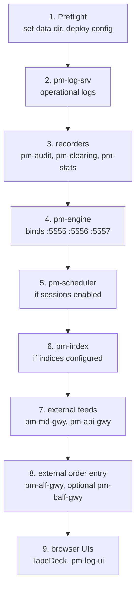

# Running the Exchange

!!! note "Learning objectives"
    After reading this page you will understand:

    - The three ways to run the exchange — containers, `pm-opctl-cli`, or one
      terminal per process — and which one fits what you are doing
    - How to prepare a session before the first process starts
    - Why the deployed configuration artifact is the operational source of truth
    - Which processes to start for a minimum session, a recorded session, a
      classroom session, and an externally connected session
    - How to verify that the exchange is healthy after startup
    - How to monitor, troubleshoot, restart and shut down a running exchange
    - Which operator playbook to follow for common scenarios

    **Prerequisites**: read [Getting Started](000-getting-started.md) first. For
    configuration syntax and validation rules, read
    [Configuration](010-configuration.md). For the full process catalog, read
    [Processes](170-processes.md).


## Operator model

EduMatcher is a multi-process exchange. `pm-engine` owns the order books and
binds the core ZeroMQ sockets. Every other process connects to it, sends
commands, subscribes to events, records data, or exposes an external interface.

The operator's job is to make five things true before trading starts:

1. Every process sees the same `EDUMATCHER_DATA_DIR`.
2. The authored `engine_config.yaml` has been validated and deployed.
3. Loss-sensitive recorders are running before the first meaningful event.
4. Gateways and external feeds are started only after the engine is ready.
5. There is a clear shutdown and recovery plan.

For the deep architectural explanation, see [Processes](170-processes.md). This
chapter is the practical runbook.

## Three ways to run it

The processes are the same in all three. What differs is who starts them, and
where they live.

| | Containers | `pm-opctl-cli` on the host | One terminal per process |
|---|---|---|---|
| Start the exchange | `./edumatcher.sh start` or `make up-all` | `pm-opctl-cli start` | 8–14 commands, in order |
| Web applications | four, included | started separately | started separately |
| Process table | `make status` | `pm-opctl-cli list` | `ps`, and your own notes |
| Process logs | `data/emo/<name>.log` | `<DATA_DIR>/emo/<name>.log` | each terminal's scrollback |
| Best for | classrooms, demos, anyone who wants it *running* | scripted or repeated local runs | learning what each process does, and debugging one of them |

**If you want a running exchange**, use the containers. That is
[Installation](005-installation.md); the rest of this chapter still applies,
because the container runs exactly these processes:

```bash
cd ~/.edumatcher && ./edumatcher.sh start     # a released install
cd deployment/docker && make up-all           # from a checkout
```

**If you are learning the system**, start processes by hand. Nothing below
assumes a container, and the manual startup order is the best way to see why
each process exists and what it depends on.

!!! note "The container is not a different system"
    Inside the container it is `pm-opctl-cli` starting the same `pm-*`
    processes, reading the same deployed artifact, writing the same databases
    into a directory on your own disk. Every operator command, CLI and
    troubleshooting step in this chapter works there too — `make shell`, or
    `./edumatcher.sh shell`, puts you at a prompt inside it.


## Runtime source of truth

Modern EduMatcher separates the file you edit from the file the exchange runs.

| File | Who uses it | Operator action |
|---|---|---|
| `engine_config.yaml` | Humans, source control, review tools, config generators | Edit and review this file |
| `<EDUMATCHER_DATA_DIR>/ref_data/engine_config.json` | Every running `pm-*` process | Install it with `pm-config-deploy`; do not edit by hand |

No runtime process accepts a config path. The engine, scheduler, gateways,
recorders, market-data gateway, API gateway, log server and index process all
read the deployed artifact from the data directory. That prevents one process
from accidentally running against a different file from the rest of the exchange.

The practical rule is simple:

```bash
pm-config-deploy --check engine_config.yaml  # validate only
pm-config-deploy engine_config.yaml          # validate, compile, install
pm-config-deploy --show                      # print deployed paths
```

After deployment, restart any running process that must pick up the change.
Deploying a new artifact is atomic, but it does not hot-reload processes that
already loaded the previous artifact.

!!! warning "Do not skip deployment"
    Editing `engine_config.yaml` is not enough. A running exchange reads
    `<EDUMATCHER_DATA_DIR>/ref_data/engine_config.json`. If startup logs warn
    that the authored source changed after deployment, deploy again and restart.


## Running modes

EduMatcher runs installed on the host, from a source checkout, or in a
container. The behaviour is the same; the command prefix and the default data
directory differ.

| | Installed mode | Developer mode | Container |
|---|---|---|---|
| Typical user | Instructor, student, demo operator | Contributor, test runner, docs author | Anyone who wants the whole system, GUIs included |
| Install | `pipx install edumatcher` | `poetry install --with dev,docs` | `install.sh`, or `make up-all` from a checkout |
| Command style | `pm-engine --verbose` | `poetry run pm-engine --verbose` | `make shell`, then `pm-engine --verbose` |
| Default data directory | `~/.local/share/edumatcher` | `<repo>/src/data/` | `/data` inside; `~/.edumatcher/data` or `deployment/docker/data` outside |
| First setup | `pm-setup` | Usually none, but deployment is still recommended | Done by the entrypoint on first start |

Throughout this chapter commands are shown in installed form. In developer mode,
prefix each `pm-*` command with `poetry run`. In a container, run them inside it
— `make shell` or `./edumatcher.sh shell` — where they are already on `PATH`
and `EDUMATCHER_DATA_DIR` is already `/data`.


## Data directory

`EDUMATCHER_DATA_DIR` is the one location knob for a running exchange. Set it
once per shell, service unit, tmux session, container, or launcher.

| Path under `EDUMATCHER_DATA_DIR` | Written or read by | Purpose |
|---|---|---|
| `ref_data/engine_config.json` | all processes | compiled runtime configuration |
| `ref_data/engine_config.yaml` | `pm-config-deploy` | copy of the source used to build the artifact |
| `stats.db` | `pm-stats`, `pm-stats-cli`, API history reads | OHLCV, trades, midpoint and related statistics |
| `clearing.db` | `pm-clearing`, `pm-clearing-cli` | positions, trades, P&L summaries |
| `audit.log` or configured audit path | `pm-audit`, `pm-audit-cli` | event audit trail |
| `log.db` | `pm-log-srv`, `pm-log-cli` | centralized operational logs |
| `gtc_orders.json`, `gtc_combos.json` | `pm-engine` | clean-shutdown persistence for GTC state |

Example per-session isolation:

```bash
export EDUMATCHER_DATA_DIR="$HOME/edumatcher-sessions/morning"
mkdir -p "$EDUMATCHER_DATA_DIR"
pm-config-deploy ./configs/morning.yaml
pm-engine --verbose
```

For the complete file map, see
[Persistence -> Data files at a glance](180-persistence.md#data-files-at-a-glance).

!!! note "Where this is in a container install"
    `EDUMATCHER_DATA_DIR` is `/data` inside the container, bind-mounted from a
    directory on your disk — `~/.edumatcher/data` for a released install,
    `deployment/docker/data` from a checkout. Everything in the table above is
    therefore a real file you can open, back up and delete with your own tools;
    `./edumatcher.sh mounts` (or `make mounts`) prints which host directory is
    behind each container path, which is the fastest way to settle "*which*
    exchange's data am I looking at".


## Preflight checklist

Run this before a classroom, demo, test session, or integration exercise.

| Check | Command or question | Why it matters |
|---|---|---|
| Correct shell mode | `which pm-engine` or `poetry run pm-engine --version` | Confirms whether commands are installed or source-prefixed |
| One data directory | `echo "$EDUMATCHER_DATA_DIR"` | Prevents split stats, logs and config |
| Authored config validates | `pm-config-deploy --check engine_config.yaml` | Catches YAML, schema and semantic errors before startup |
| Config is deployed | `pm-config-deploy engine_config.yaml` | Installs the artifact every process reads |
| Deployed paths are expected | `pm-config-deploy --show` | Confirms where the runtime artifact lives |
| Ports are free | `lsof -i :5555 -i :5556 -i :5557` | Finds an old engine before bind failure |
| Recorder policy is clear | Decide whether `pm-stats`, `pm-audit`, `pm-clearing` start before trading | Missed early events cannot always be reconstructed |
| Timezone is consistent | Choose `--timezone` for `pm-stats` and `pm-clearing`, or leave both default UTC | Daily reports must reconcile |
| Operator gateway exists | Confirm an `ADMIN` gateway ID if using halts/resumes | Admin-only commands require an admin role |
| External clients are expected | Decide whether to start ALF/BALF/CALF/RALF/API/DC gateways | Avoid exposing unused ports |

!!! tip "Prefer a clean rehearsal"
    For a new class or public demo, run the full startup once with
    `pm-scheduler --now --delay 5`, make one trade, query stats and clearing,
    then shut down cleanly. It is much easier to fix a config in rehearsal than
    while participants are waiting.

### Preflight for a container install

Most of the checklist above is handled for you: the entrypoint deploys the
configuration, `EDUMATCHER_DATA_DIR` is fixed, and one container means one data
directory. What is left is shorter:

| Check | Command | Why it matters |
|---|---|---|
| The right configuration is deployed | `./edumatcher.sh config` or `make config-show` | `EM_CONFIG` picks a bundled example; `EM_CONFIG_FILE` overrides it |
| Every process came up | `./edumatcher.sh status` or `make status` | Runs `pm-opctl-cli list` inside the container |
| It is *your* exchange on those ports | `./edumatcher.sh mounts` or `make mounts` | A released and a source-built stack use the same container names and host ports |
| The applications answer | open 8090, 8091, 8093 | The two-phase start can succeed for the backend and still leave a GUI unhealthy |
| Timezone matches the calendar | `TZ` in `.env` | Set it before the session; it affects every timestamp and the trading date |


## Minimum viable run

The absolute minimum exchange is one engine and one or more order-entry
gateways. This is enough to learn order flow, but it is not enough for an
operator who needs records afterwards.

Open one terminal per process, or use `tmux`/`screen`.

### Step 1 - start the engine

```bash
pm-engine --verbose
```

Wait until the engine reports that it loaded the deployed configuration and is
listening on the core sockets.

Typical signals:

```text
Loaded deployed config .../ref_data/engine_config.json
Session handling: disabled (startup state: CONTINUOUS)
Drop copy PUB bound on port 5557
Listening on PULL=tcp://127.0.0.1:5555  PUB=tcp://127.0.0.1:5556
```

The exact wording may vary by release, but the important facts are: config
loaded, session mode known, and sockets bound.

### Step 2 - connect two traders

```bash
pm-alf-console --id TRADER01
pm-alf-console --id TRADER02
```

The gateway IDs must exist under `gateways.alf` in the deployed configuration,
unless the engine is intentionally running unrestricted with no deployed config.

### Step 3 - submit a test order

From one gateway:

```text
NEW|SYM=AAPL|SIDE=BUY|TYPE=LIMIT|QTY=100|PRICE=150.00|TIF=DAY
```

An accepted order proves the path from gateway to engine and back is alive. A
fill requires a crossing order or resting liquidity on the other side.

!!! warning "Minimum is not operator-safe"
    If only the engine and gateways are running, there is no durable audit log,
    no statistics database and no P&L database. That may be fine for a five
    minute demo, but it is usually not enough for a real exercise.


## Starting the stack with `pm-opctl-cli`

Starting eight to fourteen processes by hand, in the right order, is exactly
the kind of thing that goes wrong five minutes before a class.
`pm-opctl-cli` does it for you. It is not a container tool — it works the same
on the host — and it is what the container itself runs internally.

```bash
pm-opctl-cli start          # start the 'default' profile
pm-opctl-cli start mini     # ... a smaller one
pm-opctl-cli list           # one row per process, with health
pm-opctl-cli health -q      # exit 0 when everything is running
pm-opctl-cli stop           # stop what it started
```

`start` is idempotent: a process it finds already running is left alone and
reported as such, so it is safe to re-run after adding one by hand.

### The three built-in profiles

| Profile | Processes | Use it for |
|---|---|---|
| `micro` | `pm-log-srv`, `pm-engine` | The smallest thing that can match an order |
| `mini` | `micro` plus `pm-stats`, `pm-scheduler`, `pm-md-gwy`, `pm-api-gwy` (desk), `pm-alf-gwy`, `pm-ralf-gwy`, `pm-dc-gwy` | A trading-capable venue with external access, without clearing or audit |
| `default` | `mini` plus `pm-audit`, `pm-clearing`, `pm-index`, `pm-balf-gwy` and the second `pm-api-gwy` instance (`dashboards`) | Everything — the operational baseline below |

The built-ins are used as they are when no configuration file exists.
`pm-opctl-cli init` writes all three to `<DATA_DIR>/emo-config.yaml`, and once
that file exists **its profiles replace the built-ins entirely**. That is the
supported way to add a process, change a flag or define a profile of your own.

Each entry in a profile is a `name`, a `command`, and optionally a
`healthcheck` command or a `tcp` `host:port` to probe.

### What it gives you that a row of terminals does not

- **Ordering.** Processes are started in the profile's order, which encodes the
  dependencies described below. It does not wait for each one to become
  healthy — for a slow first start, check `pm-opctl-cli list` before inviting
  participants in.
- **A process table.** `list` reports each process as `running`, `not
  responding` (the PID is alive but its check failed) or `dead`. A
  `healthcheck` outranks a `tcp` probe, because a TCP connect to a ZeroMQ
  socket proves only that libzmq's I/O thread is accepting — not that the
  application is still processing messages.
- **Log files instead of scrollback.** Combined stdout and stderr are appended
  to `<DATA_DIR>/emo/<name>.log`, with PID files beside them.
- **A stop that stops only what it started**, from those PID files. `kill` is
  the blunt instrument: it sends `SIGTERM` to *every* process whose command
  line contains `pm-`, including ones it never started.

`pm-opctl-cli` does not start the browser applications. Those are containers
(`make up-all`) or a local dev server — see
[Installation](005-installation.md).

!!! tip "In a container, use the Makefile wrappers"
    `make status`, `make health` and `make proc-logs P=engine` in
    `deployment/docker` run `pm-opctl-cli` inside the container for you, so you
    do not need a shell for the routine checks.


## Recommended startup order

For any session where records matter, use the **operational baseline** below.
This is stricter than the technical minimum. The technical minimum is still just
`pm-engine` plus one or more order-entry clients, but that is not enough for a
properly operated class, demo, test venue, integration environment, or
production-like rehearsal.

This baseline *is* the `default` profile: `pm-opctl-cli start` and a container
start both perform this sequence. Read this section to understand why the order
is what it is — and follow it by hand when you want to watch each process come
up, or when you are debugging one of them.

The ordering has two principles:

1. Start observability before the engine emits anything worth preserving.
2. Start the engine before any process that drives state transitions or exposes
     live services to users.



| Order | Process | Typical command | Required options | Why here |
|---:|---|---|---|---|
| 0 | Preflight | `pm-config-deploy --check engine_config.yaml` then `pm-config-deploy engine_config.yaml` | `EDUMATCHER_DATA_DIR` set consistently | Every later process reads the deployed artifact; do this before anything long-running starts. |
| 1 | `pm-log-srv` | `pm-log-srv` | Optional `--host`, `--port`, `--db`; usually none | Operational logs should have somewhere to go before other long-running services start. This is operationally mandatory when you rely on centralized logs. |
| 2 | `pm-audit` | `pm-audit --terminal` | Optional `--audit-log-file`; use `--terminal` when watching live | Audit is the durable event trail. Start it before the engine so initial session, seed and trade events are not missed. |
| 3 | `pm-clearing` | `pm-clearing --timezone Europe/Stockholm` | Use the same `--timezone` as `pm-stats`, or omit both for UTC | Clearing records trades, positions and P&L. Start it before trading; daily reconciliation depends on timezone consistency. |
| 4 | `pm-stats` | `pm-stats --timezone Europe/Stockholm` | Use the same `--timezone` as `pm-clearing`; optional `--snapshot-interval` | Statistics powers reports, history and many displays. Start it before trades so OHLCV and history are complete. |
| 5 | `pm-engine` | `pm-engine --verbose` | Usually none; all config comes from the deployed artifact | The engine owns the books and binds `:5555`, `:5556`, `:5557`. Start it after subscribers that must not miss early events. |
| 6 | `pm-scheduler` | `pm-scheduler` or `pm-scheduler --now --delay 5` | Only needed when scheduled sessions are enabled | The scheduler drives phase transitions. Start it after the engine so transitions have a live target and before participants are invited to trade. |
| 7 | `pm-index` | `pm-index` | Index definitions in deployed config | Start before market-data consumers so index publications are available when feeds and dashboards connect. |
| 8 | `pm-md-gwy` | `pm-md-gwy` | Optional `--bind`, `--port`, `--engine-host` | CALF market data is the live feed used by external clients and TapeDeck. Start after engine/index are alive. |
| 9 | `pm-api-gwy` | `pm-api-gwy` | Optional `--instance NAME`, `--host`, `--port`, `--engine-host`; API keys come from config | The API gateway has no `--id`. Use `--instance` only when multiple `api_gateways` entries are configured. Start after engine and stats history are available. |
| 10 | `pm-alf-gwy` | `pm-alf-gwy` | Optional `--bind`, `--port`, `--engine-host`; gateway IDs come from client `HELLO` and config | The ALF TCP gateway has no process-level `--id`. Start after the engine is healthy, then external text clients can connect. |
| 11 | `pm-balf-gwy` | `pm-balf-gwy` | Optional `--bind`, `--port`, `--engine-host`; identity is configured/client-provided | Optional binary order-entry gateway. Start only for BALF client exercises or integrations. |
| 12 | Web applications | `cd deployment/docker && make up-all` | None — `up-all` resolves the read-only API key and the backend hostname itself | TapeDeck needs `pm-md-gwy` for live data and `pm-api-gwy` for history; the log console needs `pm-log-srv`. Starting them last is why `up-all` runs in two phases. |

This order is approximate for independent consumers, but not arbitrary. The
recorders can safely wait for the engine to appear, so starting them first is a
good habit when completeness matters. The scheduler and external gateways should
wait until the engine is actually up. Browser UIs should be last because they
depend on the services underneath them.

!!! note "Running the web applications against a host install"
    `make up-all` starts the backend *and* the applications as one container
    stack, which is the simplest thing when nothing else is running. To point
    the applications at an exchange you started by hand instead, run them from
    `web-apps/<app>/` — see
    [The Development Loop](../developer/08-dev-workflow.md), whose "hybrid" setup
    is exactly this case.

!!! note "Where are participant terminals?"
        Local interactive participant terminals (`pm-alf-console --id TRADER01`) are
        not part of the baseline service stack. Start them after step 6, once the
        engine, scheduler policy and operator checks are ready. For supervised
        sessions, start `pm-admin --id OPS01` before inviting traders in.


## Starting each process

This section gives operational startup commands. The full flag reference for
each command lives in [Processes](170-processes.md).

### Core engine

```bash
pm-engine --verbose
```

Use `--verbose` during learning, demos and incident work. For a quiet long run,
use the default warning-level logging.

### Loss-sensitive recorders

Start these before the first trade if you want complete records:

```bash
pm-audit --terminal
pm-stats --timezone Europe/Stockholm
pm-clearing --timezone Europe/Stockholm
```

Use the same timezone for `pm-stats` and `pm-clearing`. If the exchange runs in
UTC, omit both `--timezone` flags.

### Session scheduler

```bash
# Normal schedule from deployed config, or built-in defaults if no config exists
pm-scheduler

# Rehearsal mode: run the whole trading day quickly
pm-scheduler --now --delay 5
```

The scheduler sends session transitions to the engine. It does not match orders
and it does not replace the engine's risk checks.

### Interactive traders and operators

```bash
pm-alf-console --id TRADER01
pm-alf-console --id TRADER02
pm-admin --id OPS01
```

`pm-admin` can connect with any configured gateway ID for read-only and
gateway-scoped commands. Exchange-wide halt/resume and symbol-wide mass cancel
commands require a gateway with `role: ADMIN`.

### Terminal observers

```bash
pm-viewer --symbol AAPL
pm-orders
pm-board
pm-ticker --interval 15
```

`pm-board` and `pm-ticker` become much more useful when `pm-stats` is already
running and has observed trades.

### Automation

```bash
pm-mm-bot --symbol AAPL
pm-ai-trader --id AI01 --profile aggressive --symbols AAPL,MSFT
pm-ai-swarm --count 5 --duration 60
```

Automated participants still use gateway IDs and must be allowed by the
configuration. For market making, see [Market Making](090-market-maker.md) and
[Market-Maker Bot](100-mm-bot.md).

### External order entry

```bash
pm-alf-gwy
pm-balf-gwy
```

Use `pm-alf-gwy` for text ALF clients over TCP and `pm-balf-gwy` for binary
order-entry clients. Both ultimately send orders into the same engine.

### External market data, post-trade and API services

```bash
pm-md-gwy      # CALF market data, default TCP :5570
pm-ralf-gwy    # RALF post-trade dissemination
pm-dc-gwy      # DC1 TCP relay for engine drop copy
pm-api-gwy     # REST/WebSocket API, default HTTP :8080
pm-index       # optional real-time index calculator
```

Start only the services your session needs. Each exposed gateway is another
port to document, monitor and protect.

### Centralized operational logs

```bash
pm-log-srv
pm-log-cli diagnose
pm-log-cli query --limit 20
```

`pm-log-srv` records operational logging, not trading events. Use it alongside
`pm-audit`, not instead of it. Automatic logging into `pm-log-srv` is being
rolled out process by process; see [Centralized Log Server](280-log-srv.md) for
current support and CLI workflows.

### TapeDeck trader information terminal

TapeDeck (`pm-terminal`) is the browser-based read-only market display in
`web-apps/terminal-gui/`. It is not a Python `pm-*` console script. It depends on:

- `pm-md-gwy` for live CALF market data
- `pm-api-gwy` with a read-only API key for history and charts
- optionally `pm-log-srv` for bridge logs

The usual way to start it is as part of the container stack, which resolves
the read-only API key from the deployed configuration and wires the terminal to
the exchange for you:

```bash
cd deployment/docker && make up-all      # or: ./edumatcher.sh start
```

Then open <http://localhost:8090>. The same applies to the log console (8091)
and the browser trading terminal (8093).

To run it against an exchange you started by hand instead, start it from
`web-apps/terminal-gui/` with the key and the gateway URL in its environment:

```bash
export PM_TERMINAL_API_KEY='key-readonly-...'   # the credential with gateway_id: null
export API_GATEWAY_URL='http://127.0.0.1:8081'  # the 'dashboards' instance, not 'desk'
make dev                                        # or: make up, for a container
```

That key is generated per engine configuration and is issued on the
`dashboards` API gateway instance. Without it the live book works and the
history panels stay empty. See
[Trader Information Terminal (TapeDeck)](290-trader-info-terminal.md) for
remote display servers and troubleshooting, and
[The Development Loop](../developer/08-dev-workflow.md) for the
`make dev-env` helper that prints both values for you.


## Process groups by scenario

| Scenario | Start these processes |
|---|---|
| Quick trade demo | `pm-engine`, two `pm-alf-console` terminals |
| Recorded classroom session | `pm-engine`, `pm-audit`, `pm-stats`, `pm-clearing`, `pm-scheduler`, participant gateways, `pm-admin` |
| Market-making exercise | recorded classroom set plus `pm-viewer`, `pm-mm-bot` or `MM01` gateway, possibly `pm-orders` |
| External client integration | core engine/recorders plus `pm-alf-gwy` or `pm-balf-gwy`, `pm-md-gwy`, `pm-ralf-gwy` as needed |
| Browser market display | core engine/recorders plus `pm-md-gwy`, `pm-api-gwy`, TapeDeck |
| Operational investigation | running system plus `pm-audit-cli`, `pm-stats-cli`, `pm-clearing-cli`, `pm-log-cli`, `pm-admin-cli` |
| Everything, with the web applications | the container stack: `./edumatcher.sh start`, or `make up-all` from a checkout |

The first five rows are `pm-opctl-cli` profiles or subsets of them: `micro` is
the quick demo, `mini` adds external access, `default` is the recorded
classroom set plus the index and the second API instance.


## The `tools/launch_all.sh` convenience launcher

`tools/launch_all.sh` is a macOS convenience launcher. It opens each process in
its own Terminal window and automatically falls back to `poetry run` when
`pm-engine` is not on PATH.

```bash
./tools/launch_all.sh              # default viewer symbol
./tools/launch_all.sh AAPL         # one viewer
./tools/launch_all.sh AAPL MSFT    # one viewer window per symbol
```

Use it for demos and local rehearsals. For repeated operations, prefer a
checked-in script, `tmux` session, container compose file, or service supervisor
that explicitly sets `EDUMATCHER_DATA_DIR` and starts only the processes needed
for that scenario.

!!! warning "Launcher scope"
    The launcher starts a traditional local demo stack. It does not start newer
    external services such as `pm-md-gwy`, `pm-api-gwy`, `pm-ralf-gwy`,
    `pm-log-srv` or TapeDeck. Start those explicitly when your playbook needs
    them.

!!! tip "Prefer `pm-opctl-cli` for anything repeated"
    The launcher's value is that you can *see* each process in its own window,
    which is useful while learning. For a stack you start more than once,
    `pm-opctl-cli start` covers the full process set, is portable beyond macOS,
    writes proper log files, and stops cleanly.


## Verifying the system is running correctly

### Immediate checks after startup

**1. Confirm engine sockets are bound**

```bash
lsof -i :5555 -i :5556 -i :5557
```

Expected: one `pm-engine`/Python process listening on all three ports.

**2. Confirm the engine sees the intended config**

```bash
pm-config-deploy --show
```

Then compare the printed compiled path with the path named in the engine startup
logs. If they differ, your shell or launcher is using a different
`EDUMATCHER_DATA_DIR`.

**3. Confirm gateways authenticate**

```bash
pm-alf-console --id TRADER01
```

The gateway should connect and show a prompt. A timeout usually means the engine
is not reachable or the gateway ID is not configured.

**4. Query state through the operator console**

```bash
pm-admin --id OPS01
```

Then run:

```text
SYMBOLS
GATEWAYS
SESSION_STATUS
SCHEDULE
```

Check that the symbol list, gateway list and session state match the intended
session.

**5. Submit a harmless resting order**

```text
NEW|SYM=AAPL|SIDE=BUY|TYPE=LIMIT|QTY=100|PRICE=150.00|TIF=DAY
```

Then verify it appears in `pm-viewer --symbol AAPL` or `pm-admin` `BOOK|SYM=AAPL`.

**6. Confirm durable recorders are writing**

```bash
pm-stats-cli daily
pm-clearing-cli pnl
pm-audit-cli events --limit 5
```

If a CLI reports no database or no events, check that the corresponding recorder
was started in the same data directory and has observed relevant activity.

**7. Confirm external feeds only if used**

```bash
pm-calf-spy --channels TOP,TRADE --symbols AAPL --format human
pm-ralf-spy --role AUDIT --format human
pm-dc-spy --format human
curl -s http://127.0.0.1:8080/api/v1/healthz
```

Use the checks that match the services you actually started.

**In a container**, the first two checks collapse into one, and the rest are
run the same way with a shell inside:

```bash
make status                     # or ./edumatcher.sh status — the process table
make health                     # exit code 0 when every process is up
make ports                      # what is actually published on the host
make shell                      # then any pm-*-cli command, as above
```

`make status` runs `pm-opctl-cli list` inside the container, so a `not
responding` row means the same thing there as on the host.


## Monitoring a running exchange

### Operator surfaces

| Tool | Best for |
|---|---|
| `pm-admin` | Live session, symbol, gateway and risk-control commands |
| `pm-admin-cli` | Scripts, health checks, one-shot operator queries |
| `pm-viewer --symbol <SYM>` | One order book in detail |
| `pm-orders` | Resting orders across gateways |
| `pm-board` | Multi-symbol terminal board |
| `pm-ticker` | Scrolling market tape based on stats |
| TapeDeck | Browser display for live prices, trades, movers, index, auctions and halts |
| `pm-audit --terminal` | Raw event flow while recording to disk |
| `pm-log-cli diagnose` | Operational log diagnosis when log server data exists |
| Log Operator Console (log-gui) | Browsing, searching and acknowledging centralized logs in a browser |
| `make status` / `./edumatcher.sh status` | The container process table, without opening a shell |
| `make logs` / `./edumatcher.sh logs` | The container's own entrypoint output — startup and deployment problems |
| `make proc-logs P=engine` | Follow one process log from `data/emo/` |

### Common operator queries

Interactive `pm-admin` examples:

```text
SESSION_STATUS
SCHEDULE
SYMBOLS
GATEWAYS
BOOK|SYM=AAPL
ORDERS|GW=TRADER01
VOLUME
HALT_SYM|SYM=AAPL
RESUME_SYM|SYM=AAPL
```

Equivalent one-shot CLI examples:

```bash
pm-admin-cli --id OPS01 session-status
pm-admin-cli --id OPS01 symbols
pm-admin-cli --id OPS01 gateways
pm-admin-cli --id OPS01 book --sym AAPL
pm-admin-cli --id OPS01 orders --gw TRADER01
pm-admin-cli --id OPS01 halt-sym --sym AAPL
pm-admin-cli --id OPS01 resume-sym --sym AAPL
```

### Lightweight health check

```bash
#!/usr/bin/env bash
set -euo pipefail

lsof -i :5555 >/dev/null
lsof -i :5556 >/dev/null
lsof -i :5557 >/dev/null

pm-admin-cli --id OPS01 session-status >/dev/null
pm-admin-cli --id OPS01 symbols >/dev/null

echo "OK: engine sockets and admin queries are healthy"
```

Add scenario-specific checks for `pm-md-gwy`, `pm-api-gwy`, TapeDeck, clearing,
stats or logs when those services are required.

With `pm-opctl-cli` managing the stack, most of that script is one command:

```bash
pm-opctl-cli health -q || echo "one or more processes are down"
```

and against a container, from the host:

```bash
make -C deployment/docker health
```


## Logging levels

Most long-running `pm-*` processes share the same logging flags.

| Flag | Effect |
|---|---|
| *(none)* | `WARNING` and above |
| `-v`, `--verbose` | `INFO`: startup, config, lifecycle and connection messages |
| `-vv` | `DEBUG`: detailed message flow, useful during local debugging |
| `--log-level LEVEL` | Explicit level such as `ERROR`, `INFO` or `DEBUG` |
| `-q`, `--quiet` | Explicit warning-level output |

Use verbose logging for rehearsals and incident response. For long unattended
runs, combine normal process output with `pm-audit`, `pm-stats`, `pm-clearing`
and, where configured, `pm-log-srv`.


## Troubleshooting startup problems

### Engine exits immediately

| Symptom | Likely cause | Fix |
|---|---|---|
| Address already in use on `:5555`, `:5556` or `:5557` | Another engine is still running | `lsof -i :5555`, stop the old process, then restart |
| Config digest or source warning | Authored YAML changed after deploy, or deployed artifact was modified | Run `pm-config-deploy engine_config.yaml`, then restart |
| Unknown artifact schema | Artifact was compiled by an incompatible version | Re-run `pm-config-deploy` with the current package |
| Invalid config | Validation or loader rejected the authored file before deployment, or the deployed artifact is stale | Run `pm-config-deploy --check engine_config.yaml` and fix reported errors |

### Gateway authentication timeout

Most common causes:

1. `pm-engine` is not running or has not finished binding sockets.
2. The gateway is using a different `EDUMATCHER_DATA_DIR` from the engine.
3. The gateway ID is not in `gateways.alf` in the deployed configuration.
4. Local firewall, VPN or container networking prevents access to port `5555`.

Checks:

```bash
lsof -i :5555
pm-config-deploy --show
pm-admin-cli --id OPS01 gateways
```

### Viewer or board shows an empty book

An empty book is normal until orders rest in it. Submit a resting order, connect
a market maker, seed market-maker quotes in config, or start `pm-mm-bot`.

If the book should already have liquidity, check:

- The symbol exists in the deployed config.
- The market-maker gateway connected and authenticated.
- The market-maker quote seed references a `MARKET_MAKER` gateway.
- The session phase allows the expected behavior.

### Stats, ticker or board show no activity

`pm-stats` must be running before trades occur if you want complete statistics.
`pm-ticker` and much of `pm-board` depend on `stats.db`.

Checks:

```bash
pm-stats-cli daily
pm-stats-cli trades --limit 5
```

If there are no rows, verify that `pm-stats` is running in the same data
directory and that at least one trade has occurred.

### Clearing and stats do not reconcile

The most common operator error is running `pm-stats` and `pm-clearing` with
different timezones. Stop both, restart with the same `--timezone`, and document
the choice in the session launcher.

### Scheduler transitions do not happen

Check these in order:

1. Is `pm-scheduler` running?
2. Is `sessions_enabled: true` in the deployed config?
3. Does the schedule use the timezone and country you expect?
4. Is today a trading day under that country calendar?
5. Did the scheduler start before the transition time passed?

For a rehearsal independent of wall-clock time:

```bash
pm-scheduler --now --delay 5
```

### Admin command rejected

Read-only and gateway-scoped commands can be issued by configured gateways, but
exchange-wide halt/resume and symbol-wide mass cancel commands require
`role: ADMIN`.

Fix the gateway role in `engine_config.yaml`, deploy it, and restart affected
processes:

```yaml
gateways:
  alf:
    - id: OPS01
      role: ADMIN
      description: Operator console
```

### External feed is reachable but silent

For CALF/RALF/DC/API issues, separate connectivity from data availability:

- Connectivity: can the client reach the TCP or HTTP port?
- Session: did the client complete `HELLO` or authentication?
- Subscription: did the client subscribe to a channel and symbol that exists?
- Source events: has the engine actually published the kind of event expected?

Useful probes:

```bash
pm-calf-spy --channels TOP,TRADE --symbols AAPL
pm-ralf-spy --role AUDIT
pm-dc-spy
curl -s http://127.0.0.1:8080/api/v1/status
```

### TapeDeck loads but shows offline or missing history

If the browser loads, the TapeDeck bridge is running. Then check upstreams:

| Symptom | Likely cause |
|---|---|
| `RECONNECTING` or `OFFLINE` live state | bridge cannot reach `pm-md-gwy` on CALF port `5570` |
| Live prices tick but charts are empty | bridge cannot reach `pm-api-gwy`, the API key is missing, or `pm-stats` has no history |
| Index view is empty | no `pm-index` process or no index configured |
| Logs absent | `pm-log-srv` disabled or unreachable; TapeDeck may be using local fallback logs |

See [Trader Information Terminal](290-trader-info-terminal.md) for the full
TapeDeck runbook.


### Container-specific problems

| Symptom | Likely cause | Fix |
|---|---|---|
| A GUI shows data from an exchange you did not start | Another install's containers own these names and ports | `./edumatcher.sh mounts` or `make mounts` names the host directory behind each container path. Stop the other stack first |
| The stack starts but the terminal's history panels are empty | The read-only API key was not resolved — the configuration has no credential with `gateway_id: null` | Add one under `api_gateways` and redeploy. The live feed does not need it; history does |
| `make status` is all green but a sibling container cannot connect | A listener was narrowed to loopback inside the container | Check `EDUMATCHER_GATEWAY_BIND_HOST` and any `bind_address:` in your configuration — see [Installation](005-installation.md#what-0000-does-and-does-not-expose) |
| A source change has no effect | The image was not rebuilt | `make build` for the backend, `make build-guis` for a web app |
| No entries in the log viewer's live tab | `pm-log-srv`'s ZeroMQ sockets are not published | Only matters when running the app outside the stack; inside it, nothing needs publishing |

A container that will not start at all is usually explained by its own output:
`./edumatcher.sh logs` or `make logs` shows the entrypoint's configuration
deployment, which is where a bad `EM_CONFIG` or an invalid supplied
configuration surfaces.


## Restart and shutdown

### Restarting non-engine processes

Most non-engine processes can be stopped and restarted independently. They
reconnect to the engine on startup. The main caveat is data completeness:

- A restarted viewer can recover its current view from snapshots.
- A restarted external gateway can accept new clients.
- A stopped `pm-audit`, `pm-stats` or `pm-clearing` misses events while offline.
- A stopped `pm-md-gwy` may cause external clients to reconnect and replay only
  within the configured replay window.

### Restarting the engine

Restarting `pm-engine` disconnects every gateway and invalidates live subscriber
state. Use it for planned maintenance, not casual operator cleanup.

Before restarting:

1. Halt or close the session if appropriate.
2. Tell participants to stop sending orders.
3. Stop external gateways if clients should not reconnect during the restart.
4. Press `Ctrl-C` in the engine terminal or send `SIGINT`.
5. Wait for clean shutdown messages.
6. Start the engine, then restart or verify dependent processes.

On clean shutdown, the engine persists GTC state and publishes end-of-day style
events. DAY orders expire.

### Full clean shutdown

Recommended order:

1. Stop order entry: participant gateways, ALF/BALF gateways, bots.
2. Stop external feeds and displays: CALF/RALF/DC/API, TapeDeck, viewers.
3. Stop scheduler.
4. Stop the engine with `Ctrl-C` or `pkill -INT -f pm-engine`.
5. Stop recorders after the engine has emitted final events.
6. Archive the data directory if this was a class, demo or test run.

Example archive:

```bash
tar -czf edumatcher-session-$(date +%Y%m%d-%H%M%S).tgz \
    -C "$EDUMATCHER_DATA_DIR" .
```

### Shutting down a managed stack

`pm-opctl-cli stop` sends `SIGTERM` to everything it started, in the order the
PID files are found — which is *not* the order above. For a session whose
records matter, stop order entry first (close the participant terminals, or
halt the session with `pm-admin`), then let it stop the rest.

For a container:

```bash
./edumatcher.sh stop        # or: make down-all
```

The container stops the processes and exits; the data directory is on your disk
and survives untouched, so `start` resumes the same exchange. `make clean-data`
— and only that — throws the exchange state away.


## Appendix: operator playbooks

These playbooks are intentionally explicit. Copy them into a session-specific
runbook and replace IDs, symbols, timezones and ports with your own.

### Playbook 1 - five-minute local smoke test

Goal: prove that a local install can start, accept orders and match one trade.

1. Prepare:

    ```bash
    mkdir -p ~/edumatcher-smoke
    cd ~/edumatcher-smoke
    pm-setup
    pm-config-deploy --show
    ```

2. Start engine:

    ```bash
    pm-engine --verbose
    ```

3. Start two gateways:

    ```bash
    pm-alf-console --id TRADER01
    pm-alf-console --id TRADER02
    ```

4. In `TRADER02`, place a sell:

    ```text
    NEW|SYM=AAPL|SIDE=SELL|TYPE=LIMIT|QTY=100|PRICE=150.00|TIF=DAY
    ```

5. In `TRADER01`, place a crossing buy:

    ```text
    NEW|SYM=AAPL|SIDE=BUY|TYPE=LIMIT|QTY=100|PRICE=150.00|TIF=DAY
    ```

6. Success criteria: both gateways show fills.

### Playbook 2 - recorded classroom session

Goal: run a session with complete audit, stats and clearing records.

1. Set data directory and deploy config:

    ```bash
    export EDUMATCHER_DATA_DIR="$HOME/edumatcher-sessions/class-01"
    mkdir -p "$EDUMATCHER_DATA_DIR"
    pm-config-deploy --check engine_config.yaml
    pm-config-deploy engine_config.yaml
    ```

2. Start core services:

    ```bash
    pm-engine --verbose
    pm-audit --terminal
    pm-stats --timezone Europe/Stockholm
    pm-clearing --timezone Europe/Stockholm
    ```

3. Start session control and participants:

    ```bash
    pm-scheduler
    pm-admin --id OPS01
    pm-alf-console --id TRADER01
    pm-alf-console --id TRADER02
    pm-alf-console --id MM01
    ```

4. Start displays:

    ```bash
    pm-viewer --symbol AAPL
    pm-orders
    pm-board
    pm-ticker --interval 15
    ```

5. During the session, check:

    ```bash
    pm-admin-cli --id OPS01 session-status
    pm-admin-cli --id OPS01 gateways
    pm-stats-cli daily
    pm-clearing-cli pnl
    ```

6. After shutdown, archive `$EDUMATCHER_DATA_DIR`.

### Playbook 3 - external client integration test

Goal: expose order entry, market data and post-trade feeds to client developers.

1. Start the core recorded stack: engine, audit, stats, clearing.
2. Start only the required external gateways:

    ```bash
    pm-alf-gwy
    pm-balf-gwy
    pm-md-gwy
    pm-ralf-gwy
    pm-dc-gwy
    ```

3. Verify feeds locally before handing endpoints to clients:

    ```bash
    pm-calf-spy --channels TOP,TRADE --symbols AAPL
    pm-ralf-spy --role AUDIT
    pm-dc-spy
    ```

4. Document exposed ports, expected protocol, gateway IDs, credentials and
   replay limits for each client team.

### Playbook 4 - TapeDeck wallboard

Goal: run the browser terminal for a classroom screen or observer desk.

1. Start core engine and recorders.
2. Start market data and API history services:

    ```bash
    pm-md-gwy
    pm-api-gwy
    ```

3. Optionally start operational logs:

    ```bash
    pm-log-srv
    ```

4. Start TapeDeck:

    ```bash
    cd web-apps/terminal-gui
    export PM_TERMINAL_API_KEY='...'
    make up
    ```

5. Open `http://localhost:8090` and check live state, Overview, Symbol Detail,
   Tape and Session/Halt views.

### Playbook 5 - incident response: bad or unexpected fills

Goal: stop damage, preserve evidence, and determine scope.

1. Stop new matching if needed:

    ```bash
    pm-admin-cli --id OPS01 halt
    # or only one symbol
    pm-admin-cli --id OPS01 halt-sym --sym AAPL
    ```

2. Preserve current state:

    ```bash
    pm-admin-cli --id OPS01 gateways
    pm-admin-cli --id OPS01 orders --gw TRADER01
    pm-audit-cli events --limit 50
    pm-clearing-cli pnl
    ```

3. Identify affected gateway IDs and symbols from audit, fills and clearing.
4. Cancel risky outstanding interest if appropriate:

    ```bash
    pm-admin-cli --id OPS01 cancel-sym --sym AAPL
    pm-admin-cli --id OPS01 kill --gw TRADER01
    ```

5. Resume only after the cause is understood:

    ```bash
    pm-admin-cli --id OPS01 resume-sym --sym AAPL
    pm-admin-cli --id OPS01 resume
    ```

### Playbook 6 - config change between sessions

Goal: change symbols, gateways, risk controls or schedules without split-brain
configuration.

1. Stop trading and shut down affected processes.
2. Edit `engine_config.yaml`.
3. Validate and deploy:

    ```bash
    pm-config-deploy --check engine_config.yaml
    pm-config-deploy engine_config.yaml
    ```

4. Restart the engine and dependent processes.
5. Verify with `SYMBOLS`, `GATEWAYS`, `SCHEDULE` and one test order.


## See also

- [Getting Started](000-getting-started.md) - first concepts and first trade
- [Configuration](010-configuration.md) - authored YAML and deployed artifact
- [Processes](170-processes.md) - full process inventory and message flow
- [ALF Console](055-alf-console.md) - participant command syntax
- [Auctions & Scheduling](080-session-scheduling.md) - session phases and trading date
- [Risk Controls](120-risk-controls.md) - collars, circuit breakers and halts
- [Persistence](180-persistence.md) - all files written by the exchange
- [Trader Information Terminal](290-trader-info-terminal.md) - TapeDeck browser display
- [Installation](005-installation.md) - the container stack, its networking and every directory it uses
- [The Development Loop](../developer/08-dev-workflow.md) - running a web application against a backend you started yourself