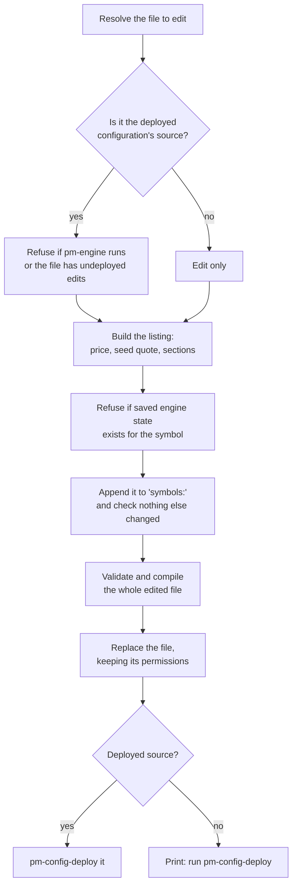

# Listing a New Symbol (`pm-new-symbol`)

!!! note "Learning objectives"
    After reading this page you will understand:

    - What an IPO means on EduMatcher, and which part of it the exchange owns
    - How `pm-new-symbol` (alias `pm-ipo`) chooses the file it edits, and when it redeploys
    - Why the IPO price becomes the book's reference price
    - How the opening seed quote is sized and priced against the market maker's obligation
    - Every check that makes the command refuse, and what to do about each one
    - The IPO-day steps the command deliberately leaves to you


## What an IPO is, and what the exchange does

An initial public offering has two halves. In the **primary market**, the
issuer sells new shares to investors at an agreed **offer price**. That
happens before listing day, and no exchange order book is involved. In the
**secondary market**, the shares start trading on an exchange. The listing is
that exchange's part of the IPO:

- a new order book exists for the symbol,
- the offer price becomes the **reference price** that the price collar and the
  circuit breaker measure moves against (there is no previous close yet), and
- a designated market maker usually posts an opening quote, so the first
  investor who wants to sell has somebody to sell to.

`pm-new-symbol` does exactly this to an existing configuration. It does not
touch any participant's position. EduMatcher has no primary-market allocation,
so the shares investors "bought in the offering" only appear once they are
traded.

## Quick start

With the exchange stopped:

```bash
pm-opctl-cli stop
pm-new-symbol --symbol NEWCO --ipo-price 20.00 --outstanding-shares 50000000
pm-opctl-cli start
```

```text
Listed NEWCO in /home/me/course/engine_config.yaml: IPO price 20.00, 50000000 shares outstanding
  seed quote MM01: 1000 @ 19.90 / 1000 @ 20.10 (DAY)
Deployed to /home/me/.local/share/edumatcher/ref_data/engine_config.json. Start the exchange to open trading.
```

`pm-ipo` is the same command under another name. Use whichever reads better
in your course material.

## What the command does



Nothing is written until the edited file has passed the same four
verification layers as `pm-config-deploy` (see
[Config Verifier](020-config-verifier.md)). A refusal at any step leaves both
the YAML and the deployed artifact exactly as they were.

## Which file is edited

[Configuration](010-configuration.md) separates the YAML you **author** from
the compiled artifact the exchange **runs**. Every artifact records the file
it was compiled from in `meta.source_path`. `pm-new-symbol` edits that
source, never the artifact.

| Situation | What happens |
|---|---|
| No `--config` | Edits the deployed artifact's source and redeploys it |
| `--config` names the deployed source | Same as no `--config` |
| `--config` names any other file | Edits that file only. Run `pm-config-deploy` on it yourself |
| `--config` names `ref_data/engine_config.yaml`, which was copied from somewhere else | Refused: that file is only a copy, and the next deploy of the real source would drop the symbol |
| The source is a bundled example (`pm-config-deploy --example …`) | Refused: shipped examples are never edited. Copy it, deploy the copy, then list |
| Nothing deployed and no `--config` | Refused: there is nothing to list into |

If you set up with `pm-setup`, the deployed source *is*
`<DATA_DIR>/ref_data/engine_config.yaml`, so the default works without
`--config`.

!!! warning "Undeployed edits block the listing"
    The deployed source must be byte-for-byte what was last deployed (its
    SHA-256 must match `meta.source_sha256`). Otherwise the IPO deploy would
    also ship whatever else had been edited, without review. Deploy or revert
    those edits first.

## The IPO price

`--ipo-price` is written as both `last_buy_price` and `last_sell_price` of the
new symbol. When the engine starts, it uses them as:

- the book's last buy and last sell prices,
- the **collar reference**, so orders far from the offer price are rejected
  when collars are enforced (see [Risk Controls](120-risk-controls.md)), and
- the **circuit-breaker reference**, so the first minutes of trading are
  protected from the very first order.

The price must be positive and a whole number of ticks: with the default
`--tick-decimals 2`, `20.005` is refused. There is no separate bid and ask
because nothing has traded yet. The offer price is the only price the market
knows.

## The seed quote

### When one is written

| Configuration | Seed quote |
|---|---|
| At least one `MARKET_MAKER` gateway and `require_mm_seed_quotes: true` (the default) | Always. The engine would refuse to start without one |
| No `MARKET_MAKER` gateway, or `require_mm_seed_quotes: false` (the `-nomm` examples) | None, so the book opens empty. `--mm-gateway-id` asks for one anyway |

With exactly one market-maker gateway, it posts the seed. With several, you
must choose one with `--mm-gateway-id`. The command will not pick one for
you.

### How it is priced

The quote must meet the market maker's own obligation. The engine resolves
that obligation with this precedence, and `pm-new-symbol` resolves it the same
way:

1. `gateways.alf[…].mm_obligations.<SYMBOL>` for that gateway and symbol
2. the gateway's own `mm_max_spread_ticks` / `mm_min_qty` /
   `enforce_mm_obligation`
3. `mm_obligation_defaults`, which the gateway fields default to

(A global per-symbol entry under `mm_obligation_defaults.symbols` cannot name
a symbol that is not listed yet, so it plays no part here.)

By default the quote is exactly the widest spread allowed, placed around the
IPO price:

```text
bid = ipo_price - (max_spread_ticks // 2) × tick
ask = bid + max_spread_ticks × tick
```

With `mm_max_spread_ticks: 20` and an IPO price of `20.00`, that gives
`19.90 / 20.10`. With an odd width such as 7, the extra tick goes on the ask:
`19.97 / 20.04`.

To quote tighter, pass both `--mm-bid-price` and `--mm-ask-price`. Explicit
prices must be on the tick grid, must be ordered, and must **straddle the IPO
price** (`bid ≤ ipo_price ≤ ask`). When the obligation is enforced, they must
also not be wider than the maximum spread. The quantities
(`--mm-bid-qty`, `--mm-ask-qty`, default 1000 each) must not be below
`mm_min_qty` when the obligation is enforced.

`--mm-tif` is `DAY` (the default) or `GTC`. Auction-only TIFs make no sense
for a resting opening quote. `--no-mm-seed-once` makes the engine re-inject
the seed on every start, even when a quote from that market maker survived
the restart. The default is to inject it only once. See
[Market Making](090-market-maker.md) for how seed quotes behave afterwards.

## Optional sections: `--field`

`--field KEY=YAML_VALUE` sets one of the symbol's optional sections. The value
is parsed as YAML, so nested mappings work. Only these keys are accepted:

| Key | Example | Purpose |
|---|---|---|
| `level` | `--field level=L2` | Risk-control level from `risk_controls.levels` |
| `collar` | `--field 'collar={static_band_pct: 0.15}'` | Per-symbol collar bands |
| `order_limits` | `--field 'order_limits={max_order_qty: 10000}'` | Maximum order quantity / value |
| `circuit_breaker` | `--field 'circuit_breaker={reference_window_ns: 60000000000}'` | Per-symbol breaker overrides |

Any other key is refused. The configuration loader ignores keys it does not
know, so a misspelt `colar=` would otherwise vanish silently.

## Symbol names

A symbol is 1–8 characters of `A-Z`, `0-9`, `.` and `_`. Lower case is
upper-cased (`newco` becomes `NEWCO`). The limit comes from the wire: the BALF
execution report carries the symbol as `char[8]`
([Message Reference](270-message-reference.md)). A longer name would pass
configuration validation and then fail at the first fill.

## Why it refused

Every refusal leaves the YAML and the deployed artifact unchanged.

| Message (abridged) | Cause | What to do |
|---|---|---|
| `something is listening on tcp://…:5556` / `pm-engine is running (pid …)` | The exchange is running | `pm-opctl-cli stop`, then run again |
| `pgrep is unavailable …` | The running check cannot be done | Install `procps`. The command errs on the side of refusing |
| `has edits that were never deployed` | The deployed source differs from what was deployed | Deploy or revert those edits first |
| `is only the deployed copy of …` | `--config` points at `ref_data/` while the source lives elsewhere | Pass the real source with `--config` |
| `is a bundled example` | The exchange runs a shipped example | Copy it, `pm-config-deploy` the copy, then list |
| `already listed` | The symbol exists (in any letter case) | Choose another symbol |
| `must be 1-8 characters …` | Invalid symbol name | See *Symbol names* |
| `not on the … tick grid` | Price has too many decimals | Round it, or raise `--tick-decimals` |
| `several MARKET_MAKER gateways` | More than one market maker could seed it | Pass `--mm-gateway-id` |
| `exceeds …'s obligation` / `below …'s obligation` | The explicit quote breaks the market maker's obligation | Tighten the spread or raise the quantities |
| `… has a bid of …` | The default spread would push the bid to zero or below (penny stocks) | Give `--mm-bid-price` / `--mm-ask-price`, or more `--tick-decimals` |
| `holds saved state for …` | `book_stats.json`, `gtc_orders.json` or `gtc_combos.json` still holds data for this symbol name | See below |
| `would make … invalid`, followed by check codes | The edited file fails validation (for example a bad `--field` value) | Fix what the listed codes describe (see [Config Verifier](020-config-verifier.md)) |
| `rewrite 'symbols' in block style` / `cannot be appended …` | The YAML layout cannot be edited safely | Add the symbol by hand |

!!! warning "Saved state wins over the listing"
    When the engine starts, a symbol's entry in `book_stats.json` takes
    precedence over its configured last prices, and resting orders in
    `gtc_orders.json` go back into its book. So a symbol name that traded
    before would open at the old price, with the old orders, not at the offer
    price. The same happens if you list a symbol, start the exchange, then
    remove it to correct a mistake before the engine has run again.
    `pm-new-symbol` refuses in all of these cases. Remove the symbol's
    entries from the files it names, or clear all engine state with
    `pm-opctl-cli clear`. Note that the second option discards the resting
    orders of *every* symbol. See [Persistence](180-persistence.md).

## The IPO-day checklist

The command handles the configuration. These steps are yours:

1. **Before**: agree the offer price, shares outstanding, tick size, and which
   market maker will support the stock. `pm-valuation` works out the first two
   for a fictive company (see [IPO Valuation](046-valuation.md)). Decide on day-one risk settings. A
   tighter collar and an `order_limits` cap are common for a new listing.
2. **Stop the exchange**: all of it, not just `pm-engine`. Every process reads
   the configuration only when it starts. A gateway restarted on its own
   would know a symbol the engine does not, or the other way round.
3. **List**: run `pm-new-symbol`. Read any `[WARN]` advice it prints about
   the new symbol.
4. **Check**: `pm-config-show` shows the deployed configuration, including the
   new symbol and its seed quote.
5. **Commit** the authored YAML to version control. The artifact is rebuilt
   from it, so the YAML is your record of the listing.
6. **Market-maker bot**: a `pm-mm-bot` started with `--all-symbols` (as the
   `mm-demo` profile does) quotes the new symbol automatically. A bot with an
   explicit `--symbols` list or a config-file `symbols:` block does not. Add
   the symbol there (see [MM Bot](100-mm-bot.md)).
7. **Obligations**: if the market maker needs obligations specific to this
   symbol, add `mm_obligations.<SYMBOL>` to its gateway *before* listing. The
   seed quote is then sized against it.
8. **Index membership** is a separate decision. The symbol does not join any
   index. Add it later as a constituent (see
   [Market Index](150-market-index.md) and
   [Index Admin CLI](152-index-admin-cli.md)).
9. **Start** the exchange. With `sessions_enabled: true`, the new symbol takes
   part in the opening auction like every other symbol. That is where a real
   IPO's opening price is discovered (see
   [Auctions & Scheduling](080-session-scheduling.md)). Without sessions,
   continuous trading starts at once against the seed quote.
10. **Watch the first trades**. The circuit breaker is already armed at the
    offer price.

!!! tip "Remote and container deployments"
    Run the command against the exchange's own data directory (the same
    `EDUMATCHER_DATA_DIR`). The running-engine check looks at the local
    machine only: the engine's publish port and the local process table. It
    cannot prove that an engine on another host, or in a container that does
    not publish port 5556, is stopped. Check that yourself.

## Options

| Option | Default | Meaning |
|---|---|---|
| `--config PATH` | the deployed source | Authored YAML to edit |
| `--symbol NAME` | required | New symbol |
| `--ipo-price PRICE` | required | Offer price, and the reference price |
| `--outstanding-shares N` | required | Shares outstanding (used for index market caps) |
| `--tick-decimals N` | `2` | Price grid, 0..8 |
| `--mm-gateway-id ID` | the only MM gateway | Who posts the seed quote |
| `--mm-bid-price`, `--mm-ask-price` | max spread around the price | Explicit seed prices; both or neither |
| `--mm-bid-qty`, `--mm-ask-qty` | `1000` | Seed sizes |
| `--mm-tif` | `DAY` | `DAY` or `GTC` |
| `--[no-]mm-seed-once` | on | Skip the seed when a restored quote exists |
| `--field KEY=YAML_VALUE` | none | `level`, `collar`, `order_limits`, `circuit_breaker`; repeatable |

## Where to go next

- [IPO Valuation](046-valuation.md) - finding the offer price with `pm-valuation`
- [Configuration](010-configuration.md) - authored YAML, the compiled artifact and `pm-config-deploy`
- [Config Verifier](020-config-verifier.md) - what the validation codes mean
- [Running the Exchange](040-running-the-exchange.md) - stopping and starting with `pm-opctl-cli`
- [Market Making](090-market-maker.md) - seed quotes and obligations
- [Risk Controls](120-risk-controls.md) - collars and circuit breakers around the IPO price
- [Market Index](150-market-index.md) - adding the new symbol to an index
- [Persistence](180-persistence.md) - the saved state that can override a listing
