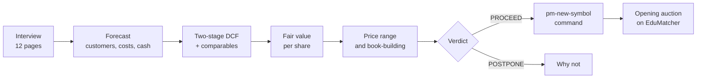

# IPO Valuation (`pm-valuation`)

!!! note "Learning objectives"
    After reading this page you will understand:

    - What `pm-valuation` computes, and how its result becomes a listing
    - How to answer the interview, and what happens to the questions you skip
    - How to read the report, and which numbers are heuristics rather than finance
    - How to print the report as a PDF document
    - How to save, share and reload a scenario, and how to start from a classroom case
    - How `--list` hands the offer price to `pm-new-symbol`


## What the tool is for

[Listing a New Symbol](045-new-symbol.md) starts from an agreed offer price.
`pm-valuation` is where that price comes from. It interviews you about a
fictive company, values it, and simulates the IPO that sells its shares:



The tool is a teaching model, not a pricing engine. Every rate, multiple and
sector preset is an assumption, and the demand and first-day-pop formulas are
calibrated heuristics that show direction and causes. The real first-day price
is found by the opening auction once the symbol is listed, which is the point
of the exercise: the students' own orders decide whether their price was
right. The formulas, presets and worked example are in the design document,
`docs-design/EduMatcher-valuation.md`.

## Quick start

Start from a classroom case, change what you like, and press F5:

```bash
pm-valuation --case kestrel
```

Or print the report without the interview:

```bash
pm-valuation --case kestrel --no-tui --mode deterministic
```

```text
Kestrel Security Inc. (KSEC) — IPO valuation  PROCEED

1. Verdict
  PROCEED

   Fair value per share           22.39
   Price range              18.00–20.00
   Offer price                    24.00
   Market capitalisation      1,865.0 m
   Primary raise                425.0 m
   Coverage                       7.04×
   Expected first-day pop         25.6%
...
17. Next step
  pm-new-symbol --symbol KSEC --ipo-price 24.00 --outstanding-shares 77708333 --tick-decimals 2
```

Without `--load` or `--case`, the interview starts empty: every answer has an
automatic value, so pressing F5 straight away values an average B2B software
company.

## The interview

The interview is a full-screen terminal form with twelve pages. A preview on
the right shows fair value, the price range and the verdict, recalculated as
you type.

| Page | What it asks |
|---|---|
| 1 Company | Name, ticker, **sector preset**, S-1 cover details |
| 2 Market | Addressable market, its growth, your reachable share |
| 3 Customers & pricing | Last year's revenue, customers, price per customer, churn, growth |
| 4 People | Headcount, cost per employee, how hiring follows revenue |
| 5 Costs | Infrastructure, acquisition cost, R&D, G&A, stock-based pay |
| 6 Capital & tax | Capex, working capital, tax, loss carry-forwards, cash and debt |
| 7 Discount rates | Risk-free rate, equity risk premium, betas and premia per stage |
| 8 Offering | Shares before the IPO, raise, fees, IPO discount, lock-ups |
| 9 Investors & sentiment | Institutional and retail interest, hype, comparable multiple |
| 10 Index | The fictive index rulebook, and what the exchange may relax |
| 11 Management | Last private round, minimum market cap, maximum dilution |
| 12 Simulation | Scenarios, Monte Carlo draws, seed, correlation |

`--quick` shows only pages 1 and 11. Everything else keeps its automatic value.

### Automatic values and their source

Every question can be skipped. The hint beside a field shows what the model
will use instead, and where it comes from:

| Source | Meaning |
|---|---|
| **you** | Your answer. It always wins |
| **preset** | The sector preset chosen on page 1 |
| **derived** | Computed from other answers, e.g. customers from revenue ÷ price |
| **default** | A fixed default, e.g. a 25% tax rate |

F2 opens the review page: every value in one table with its source, which is
also section 3 of the report.

### Typing values

| Field | Accepts | Notes |
|---|---|---|
| Money and counts | `90m`, `1.4bn`, `2.5k`, `1_000`, `60,000` | |
| Percentages | `12`, `12%`, `0.5` | A plain number is **percentage points**: `0.5` is 0.5%, never 50% |
| Ratios | `10`, `10x` | |
| Yes / no | `yes`, `no` | |
| Choices | Enter opens a pick-list | Sector, market structure, interest levels, … |
| Optional fields | `none` | "Not given", e.g. no last private round |

An empty field goes back to its automatic value (Ctrl-D does the same). A
value out of range turns the field red and the error replaces the help line.
F5 refuses to calculate while any field has a problem, and lists them.

### Keys

| Key | Action |
|---|---|
| Tab / Shift-Tab, ↓ / ↑ | Next / previous field |
| PgDn / PgUp | Next / previous page |
| Enter | Open a pick-list |
| Ctrl-D | Clear the field back to its automatic value |
| F1 | Glossary, with a filter |
| F2 | Review every value and its source |
| F3 | Show or hide the advanced fields |
| F5 | Calculate and open the report |
| F9 | Save the scenario |
| Esc / Ctrl-Q | Quit; asks first if there are unsaved changes |

## The report

F5 opens the report in a scrollable viewer with a section index on the left.

| Key | Action |
|---|---|
| ↑ / ↓, PgUp / PgDn, Space, Home / End | Scroll |
| Tab / Shift-Tab | Next / previous section |
| `b` | **Back to the interview, with every answer kept** |
| `c` | Compare with the previous calculation: headline numbers, changes, and the inputs that changed |
| `e` | Export the report as Markdown |
| `p` | Write the report as a printable PDF (see below) |
| `q` | Quit |

`b`, change one answer, F5, `c` is the what-if loop the exercise is built on.

The sections, in order:

| Section | Content |
|---|---|
| Verdict | PROCEED, PROCEED (THIN BOOK) or POSTPONE, the headline numbers and why |
| S-1 cover | Registrant, ticker, SIC code, emerging-growth and smaller-reporting status |
| Assumptions | Every input with its source |
| Market and customers; Unit economics; Headcount | The ten-year operating forecast |
| Income statement; Taxes, reinvestment and FCFF | From revenue to free cash flow |
| Discount rates; DCF | The rate build-up per stage, discount factors, terminal value |
| Bridge and fair value | From enterprise value to value per share, blended with comparables |
| Scenarios, tornado and sensitivity | Bear / base / bull, the drivers that matter most, two grids |
| Monte Carlo | The distribution of fair value, and the chance the offer price is too high |
| Pricing | Range, management floor, the book at every price, the chosen price, allocation, first-day pop |
| Capitalisation and dilution | Shares before and after, dilution to new investors |
| Lock-ups, free float and index | The index rulebook at the offer price, and the lock-up overhang |
| Risk factors | The model's warnings, phrased as an S-1 would |
| Next step | The `pm-new-symbol` command, and the index command for later |
| What this model leaves out | Its limits |

Scenarios appear with `--mode deterministic` or `both`, Monte Carlo with
`montecarlo` or `both`; the section numbers close up when one is left out.

### How the offer price is chosen

The range is fair value less the IPO discount (15% by default), rounded to
"nice" prices. Management's minimum market cap can move it up. The book is
then built at every price from 20% below the range to 20% above it, and the
deal is priced at the **highest price that is covered at least 3×**. If no
price reaches 3×, it is priced at the bottom of the band on a thin book. If
even that is less than 1× covered, or the management floor leaves the bankers
less than the minimum discount to fair value, the IPO is **postponed**.

### The PDF report

`--pdf FILE`, or `p` in the report viewer, writes the report as a document
for print: A4 by default, `--paper letter` for US Letter.

```bash
pm-valuation --case kestrel --no-tui --pdf kestrel.pdf
```

It holds the same numbers as the terminal report, arranged as a document:

| Part | Content |
|---|---|
| Cover | Company, verdict and headline figures |
| Contents | Every chapter and section, with page numbers |
| Executive summary | The verdict, the headline figures, why, what the model flags, the principal risks and the next step |
| Chapters 1–6 | The company and its offering; operating forecast; valuation; uncertainty; the offering; risks and next steps. Each chapter and section opens with prose on what it shows and how to read it |
| Figures | Revenue and free cash flow over the forecast; the tornado; the Monte Carlo distribution against the offer price; the book's coverage at each price |
| Appendix A | Every assumption with its source |
| Appendix B | The glossary |

Every page after the cover carries the company in its header, and the page
number and the disclaimer in its footer. The document has PDF bookmarks for
each chapter and section. The comparison with a previous run (`c`) is not
part of it.

The PDF uses the Vera font that ships with ReportLab, embedded in the file.
Vera has no Greek letters or check marks, so the PDF spells those few symbols
out: "Beta" for β, "correlation" for ρ, "met" and "not met" for ✓ and ✗.

## Scenario files

A scenario file holds only what you typed. Defaults are recomputed when it is
loaded, so a change to a sector preset shows up.

```yaml
pm_valuation: 1
company:   {name: Aurora Metrics Inc., ticker: AURM, sector: b2b_saas}
customers: {last_fy_revenue: 90m, now: 1800}
capital:   {ppe_start: 12m, nol: 150m, cash: 60m}
offering:  {shares_pre: 80m, secondary_shares: 5m}
management: {last_round: 1.4bn}
```

Values are written the way you type them in the interview. Loading is strict:
an unknown field or format version is an error, so a typo cannot silently
fall back to a default.

| Command | Effect |
|---|---|
| F9, or `--save FILE` | Write your answers |
| `--save FILE --with-defaults` | Write every value, each commented with its source: a fully specified case to hand out |
| `--load FILE` | Start from a file |
| `--case NAME` | Start from a classroom case shipped with the tool |

The classroom cases are `kestrel` and `halvard`. The
[IPO Valuation training chapter](../training/280-ipo-valuation.md) uses them.

## Listing the result

`--list` passes the priced IPO to `pm-new-symbol`, in the same process and
with the same arguments the Next step section prints:

```bash
pm-opctl-cli stop
pm-valuation --load aurora.yaml --no-tui --list
pm-opctl-cli start
```

- `--list` needs `--no-tui`. Explore in the interview, save with F9, then
  list from the saved file, so the listed price is always reproducible.
- `--config PATH` is passed on as `pm-new-symbol --config`: the authored YAML
  to edit. Without it, the deployed configuration's source is edited and
  redeployed.
- Every `pm-new-symbol` guard applies: the exchange must be stopped, and no
  saved state may exist for the symbol (see
  [Why it refused](045-new-symbol.md#why-it-refused)).
- A postponed IPO has nothing to list: the report is printed, and the command
  exits with status 1.
- The seed quote, collar and other listing options are `pm-new-symbol`'s
  defaults. To choose them, run the printed command yourself with the extra
  options.

When the index verdict is positive, Next step also prints the
`pm-index-admin-cli` command for the first trading day on which the stock can
join the index. That is a later step, not part of listing.

## Exit status

| Status | Meaning |
|---|---|
| 0 | Success, including a POSTPONE verdict |
| 1 | Invalid answers in `--no-tui` mode, an unreadable scenario file, or a failed `--list` |
| 2 | Usage error, e.g. `--list` without `--no-tui` |

## Options

| Option | Default | Meaning |
|---|---|---|
| `--load FILE` | none | Scenario file to start from |
| `--case NAME` | none | Classroom case to start from (`kestrel`, `halvard`) |
| `--no-tui` | off | Print the report instead of interviewing |
| `--quick` | off | Interview pages 1 and 11 only |
| `--mode MODE` | the scenario's, else `both` | `deterministic`, `montecarlo` or `both` |
| `--draws N` | `10000` | Monte Carlo draws |
| `--seed S` | `42` | Monte Carlo seed |
| `--save FILE` | none | Write the scenario |
| `--with-defaults` | off | With `--save`: write every value with its source |
| `--export FILE` | none | Write the report as Markdown |
| `--pdf FILE` | none | Write the report as a printable PDF |
| `--paper SIZE` | `a4` | PDF page size: `a4` or `letter` |
| `--presets FILE` | bundled | Alternative sector presets |
| `--list` | off | With `--no-tui`: list the priced IPO with `pm-new-symbol` |
| `--config PATH` | the deployed source | With `--list`: the engine YAML to edit |

!!! tip "Terminal width"
    The interview fits 80 columns, but the automatic-value hints need about
    100. Reports printed with `--no-tui` are always 100 columns wide, so they
    read the same in a terminal, a pipe or a file; a narrower terminal wraps
    their lines. A table wider than 100 columns is split into parts that each
    repeat its first column. `--export` writes every table in one piece.

## Where to go next

- [Listing a New Symbol](045-new-symbol.md) - what `--list` does to the configuration
- [Auctions & Scheduling](080-session-scheduling.md) - the opening auction that tests the price
- [Market Index](150-market-index.md) - the index the report's inclusion verdict refers to
- [Index Admin CLI](152-index-admin-cli.md) - adding the stock to an index after seasoning
- [IPO Valuation training chapter](../training/280-ipo-valuation.md) - the classroom exercise
