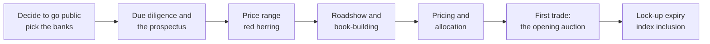
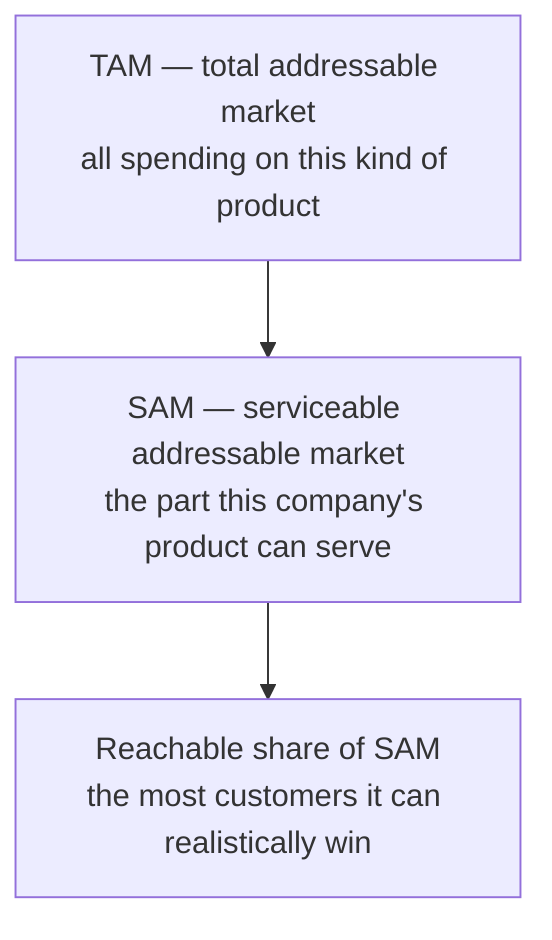
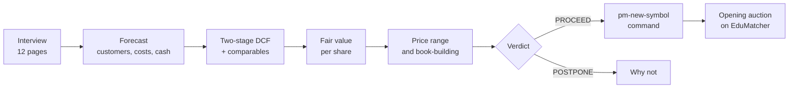

# IPO Valuation (`pm-valuation`)

!!! note "Learning objectives"
    After reading this page you will understand:

    - What an initial public offering (IPO) is, who takes part, and the steps from the decision to go public to the first trade
    - Why a sum of money today is worth more than the same sum later, and how interest rates, risk and discounting express that
    - How a company is valued from its future cash flows (a DCF) and from what investors pay for similar companies (comparables)
    - How a young company's forecast is built from its market (TAM, SAM), its customers and its costs
    - How scenarios and a Monte Carlo simulation show what the company might be worth, not just one number
    - What the offering document is (a prospectus in Sweden, an S-1 in the US), and how book-building turns a valuation into an offer price
    - How a Swedish IPO and a US IPO differ, and how to switch `pm-valuation` between them
    - Why the final price is part calculation and part judgement, and what goes wrong when it is too high or too low
    - How to use `pm-valuation`: the interview, the report, the PDF, scenario files and the hand-off to `pm-new-symbol`

!!! tip "How to read this page"
    The page has two parts. **Part I** (up to
    [Using pm-valuation](#using-pm-valuation)) teaches the finance: no
    background in investment banking or accounting is assumed. Every idea is
    introduced with a small worked example you can check with a calculator.
    **Part II** is the reference for the tool. If you already know what a DCF
    and a book-build are, skip to Part II.

    The numbers in the worked examples are chosen to be easy to follow. Where
    a section says *"in the Tornfalk case"*, the numbers come from the
    classroom case `pm-valuation --case tornfalk`, so you can find them in the
    tool's own report.

    `pm-valuation` works in two **frameworks**: a Swedish IPO (the default:
    amounts in SEK, a prospectus approved by Finansinspektionen, a listing on
    Nasdaq Stockholm) and a US IPO (`--market us`: USD, an S-1 filed with the
    SEC). Part I explains both; its examples are Swedish. A *billion* is
    1,000 million, a Swedish *miljard* (not a *biljon*), written "bn".

## Going public: what an IPO is

A young company is usually owned by a small group: its founders, its
employees (through shares and options) and venture capital funds that
invested in return for part of the company. These **private** owners cannot
easily sell their shares, and the company can raise new money only by
negotiating with a few investors at a time.

An **initial public offering** (IPO) changes that. The company sells shares
to the public for the first time, and the shares are then **listed** on a
stock exchange, where anyone can buy and sell them. Companies go public to:

- **raise capital** for growth: new shares are sold and the money goes to the
  company (the *primary* offering);
- **give existing owners a way out**: some existing shares may be sold in the
  same offering (the *secondary* offering), and all shares become tradable
  after a waiting period;
- **gain a currency**: listed shares can pay for acquisitions and reward
  employees;
- **gain visibility and credibility** with customers, suppliers and lenders.

The price of this is permanent public scrutiny, heavy reporting duties, the
cost of the offering itself, and the loss of some control.

### Who takes part

| Party | Role in the IPO |
|---|---|
| **Issuer** | The company selling shares. Its management and board decide to go public and must agree the price. |
| **Existing shareholders** | Founders, employees and venture investors. Every new share sold dilutes them; a secondary offering lets some of them sell. |
| **Underwriters** | Investment banks that organise the offering, write the prospectus with the lawyers, market the shares and, in a *firm commitment* underwriting, buy the shares from the company and resell them. They are paid a fee, the **gross spread** or commission: typically around 7% of the money raised in a mid-sized US IPO, and roughly half that in Europe. |
| **Institutional investors** | Pension funds, mutual funds, hedge funds and insurers. They buy most of an IPO and their orders decide the price. |
| **Retail investors** | Private individuals, usually offered a smaller tranche. In Sweden they apply through their bank or an online broker. |
| **Cornerstone investors** | Large investors who commit to buy a fixed amount before the offer opens. Common in Swedish IPOs, rare in US ones. |
| **The regulator** | In Sweden **Finansinspektionen** (FI), which must approve the prospectus; in the United States the Securities and Exchange Commission (SEC), which must declare the registration statement effective. No shares can be offered before that. |
| **The exchange** | Lists the shares and runs the first trading. On EduMatcher the opening auction finds the first price. |

### Primary and secondary markets

The IPO itself happens in the **primary market**: the company sells shares
to investors at the **offer price**, and the money flows to the company. From
the first trade onwards, investors trade with each other in the
**secondary market**, the exchange, and the company receives nothing more.
The difference between the offer price and the price at which trading ends on
the first day is the **first-day return**, or **pop**.



Each step is explained in [The IPO process](#the-ipo-process) below, after the
finance that the price is built on.

## The pricing dilemma: science and black magic

Everything in this page leads to one number: the **offer price**. It is the
hardest number in the whole process, because both ways of getting it wrong
are expensive.

| | Price too high | Price too low |
|---|---|---|
| **In the book** | Investors refuse to order: the book is thin or undersubscribed | The book is many times oversubscribed |
| **On the first day** | The stock falls below the offer price ("breaks issue"); buyers lose money at once | The stock jumps: a large pop |
| **Who pays** | The investors who bought, and the bankers' reputation with them | The company and the selling shareholders: they sold for less than the market would pay |
| **Worst case** | The IPO is pulled or postponed; the company may not get another chance for months | *Money left on the table*: the pop times the shares sold, a real loss to the company |
| **Longer term** | A "broken" IPO is remembered; later fund-raising is harder | A modest pop is good marketing; a huge one looks like a mistake |

Too high, and nobody buys. Too low, and you give money away. The right price
is somewhere between, and it is found by two very different kinds of work:

- **Hard finance.** A valuation built from the company's expected cash
  flows, a discount rate and the prices of comparable companies. It is
  arithmetic: given the assumptions, anyone gets the same answer. It gives a
  **range** of defensible values.
- **Judgement, negotiation and market mood** — the "black magic". What
  investors will actually pay on the day depends on sentiment, on which
  stocks are in fashion, on the story management tells, on how badly the
  founders want a higher number than their last private round, and on what
  the bankers think their investor clients will accept. None of this is in a
  spreadsheet, and all of it moves the price.

`pm-valuation` makes both halves visible. The valuation chapters of its report
are the hard finance. The pricing chapter simulates the black magic with
labelled heuristics (interest levels, a hype factor, a coverage target), so
you can see *which way* each force pushes the price. The final judge is the
opening auction on EduMatcher, where your fellow students' orders decide
whether the price was right.

## Money has a time value

The whole of valuation rests on one idea: **a sum of money today is worth
more than the same sum in the future.** There are three reasons.

1. **Opportunity.** Money you have today can be invested and grow. If you wait
   a year for it, you lose a year of growth.
2. **Inflation.** Prices rise, so the same amount buys less later.
3. **Risk.** A promise of future money may not be kept. The further away and
   the less certain the payment, the less it is worth today.

The rest of this section turns these three reasons into arithmetic.

### Interest and compounding

If you deposit 1,000 at an interest rate of 5% a year, after one year you have
$1{,}000 \times 1.05 = 1{,}050$. In the second year you earn interest on the
interest as well, $1{,}050 \times 1.05 = 1{,}102.50$, and after three years
$1{,}157.63$. This is **compounding**. In general, an amount $PV$ invested at a
rate $r$ for $n$ years grows to a **future value**

$$
FV = PV \times (1 + r)^n
$$

Compounding is slow at first and powerful later. A handy approximation, the
*rule of 72*: money doubles in about $72 / (\text{rate in \%})$ years. At 8% it
doubles in about 9 years.

### Present value and discounting

Turn the question around: **what is a payment in the future worth today?** If
1,000 arrives in three years and you could earn 5% a year meanwhile, it is
worth the amount that would grow to 1,000 in three years:

$$
PV = \frac{FV}{(1 + r)^n} = \frac{1{,}000}{1.05^3} = 863.84
$$

This is **discounting**, and $r$ is the **discount rate**. The factor
$1/(1+r)^n$ is the **discount factor**: the value today of 1 received in year
$n$. Two things make a future payment worth less today: a higher rate, and a
longer wait.

| Discount factor | Year 1 | Year 5 | Year 10 | Year 20 | Year 30 |
|---|---:|---:|---:|---:|---:|
| at 4% | 0.962 | 0.822 | 0.676 | 0.456 | 0.308 |
| at 10% | 0.909 | 0.621 | 0.386 | 0.149 | 0.057 |
| at 20% | 0.833 | 0.402 | 0.162 | 0.026 | 0.004 |

Read the table as prices: at a 10% discount rate, 1 promised in ten years is
worth 0.386 today; at 20% it is worth 0.162. The same promise of 1,000 in
three years is worth 863.84 at 5% but only 657.52 at 15%. **The discount rate
is the single most powerful number in a valuation**, because it acts on every
future cash flow at once, and hardest on the distant ones.

### The risk-free rate

Which rate should you discount at? Start with the return you can get with
**no risk** at all: lending to a government that can always repay in its own
currency. The yield on a long-dated government bond (for a Swedish company the
10-year Swedish government bond, for a US company the 10-year US Treasury) is
used as the **risk-free rate**, $r_f$. It pays for time and expected
inflation, but not for risk. `pm-valuation` defaults to 3.0% in the Swedish
framework (about the Swedish 10-year yield in August 2026) and 4.25% in the
US one. Check today's value before you rely on it.

### Risk and the required return

Nobody buys shares in a loss-making technology company to earn the risk-free
rate. Investors demand a **risk premium** on top: the riskier the investment,
the higher the return they require, and so the higher the rate at which they
discount its future cash flows. The **required return** is the discount rate.

The standard way to set it for shares is the **capital asset pricing model**
(CAPM):

$$
r_e = r_f + \beta \times ERP
$$

- The **equity risk premium** (ERP) is the extra return investors expect from
  the stock market as a whole over the risk-free rate, usually estimated at
  4–6% a year. `pm-valuation` defaults to 5.6% in the Swedish framework (the
  median in PwC's 2026 survey of Swedish practitioners) and 5% in the US one.
- **Beta** ($\beta$) measures how strongly a stock moves with the market. A
  beta of 1 moves with the market; 1.5 moves 50% more, up and down. Young
  technology companies have high betas.

For a Swedish company with a beta of 1.5:
$r_e = 3.0\% + 1.5 \times 5.6\% = 11.4\%$. Practitioners add further premia
that CAPM leaves out, for small size and for the risk that a young company
fails to deliver its plan. In the Tornfalk case the first five years are
discounted at 15.9%: 11.4% plus a 1.5% size premium plus a 3% execution
premium. From year 6, when the company is expected to be established, the rate
falls to 9.66% ($3.0\% + 1.1 \times 5.6\% + 0.5\%$).

When a company also borrows, the lenders require a return too (the interest
rate, reduced by the tax it saves). The average of the two required returns,
weighted by how much of the company is financed each way, is the **weighted
average cost of capital** (WACC). Most young companies have little debt, so
their WACC is close to the cost of equity.

!!! tip "Risk lowers value"
    Higher risk means a higher discount rate, and a higher discount rate means
    a lower value today for the same expected cash flows. This is why the
    market pays less for a promise from a start-up than for the same promise
    from a government.

### Streams of cash: NPV, perpetuities and growth

A company does not pay one amount once; it produces a **stream** of cash
flows. Its value today is the sum of the present values of every flow. For
an investment, subtracting what it costs today gives the **net present
value** (NPV).

**Example.** A machine costs 1,000 today and earns 400 a year for three years.
At a 10% discount rate:

| Year | Cash flow | Discount factor | Present value |
|---:|---:|---:|---:|
| 1 | 400 | 0.9091 | 363.64 |
| 2 | 400 | 0.8264 | 330.58 |
| 3 | 400 | 0.7513 | 300.53 |
| | | **Total** | **994.74** |

The machine earns 1,200 in total but is worth only 994.74 today, so its NPV is
$994.74 - 1{,}000 = -5.26$: at a 10% required return it is not quite worth
buying.

Companies are expected to last indefinitely. A cash flow $C$ that continues
for ever (a **perpetuity**) is worth $C / r$; one that starts at $C$ next year
and then grows at a constant rate $g$ for ever (a **growing perpetuity**) is
worth

$$
PV = \frac{C}{r - g}
$$

At $r = 10\%$, a perpetual 100 a year is worth 1,000. If it grows at 2.5% a
year it is worth $100 / (0.10 - 0.025) = 1{,}333$; at 5% growth, 2,000; at 8%,
5,000. Two lessons follow. First, value is extremely sensitive to long-run
growth when $g$ is close to $r$. Second, $g$ must stay below $r$, and in
practice at or below the long-run growth of the economy (2–3%), or the formula
claims the company will one day be larger than the world.

## What a company is worth

A share is a claim on part of a company's future. So the value of a company
is, in principle, the present value of all the cash it will ever be able to
pay its owners. That principle is simple; applying it to a company that has
never made a profit is where the work lies.

### Three ways to value a company

| Approach | Question it asks | Used for |
|---|---|---|
| **Intrinsic value** (discounted cash flow, DCF) | What are the company's expected future cash flows worth today? | The core of the valuation; forces every assumption into the open |
| **Relative value** (comparables, multiples) | What do investors pay for similar listed companies, per unit of revenue or profit? | A check on the DCF, and what investors in the book will actually compare |
| **Asset value** | What would the company's assets fetch if sold? | Banks, property and failing companies; rarely useful for a software company whose value is its customers and people |

The DCF and the comparables rarely agree. The DCF reflects *your* forecast;
comparables reflect the *market's* current mood about the sector. When the two
differ widely, one of them is telling you something: either your forecast is
too cautious, or the sector is priced for perfection. `pm-valuation` blends
them (70% DCF, 30% comparables by default) and warns when they differ by more
than 50%.

### From profit to cash

An income statement starts with **revenue** and subtracts costs to reach
profit. A simplified one, in the order `pm-valuation` reports it:

| Line | Meaning |
|---|---|
| Revenue | What customers pay |
| − Cost of revenue | Running the service: infrastructure, support, operations staff |
| = **Gross profit** | What is left to pay for everything else; as a share of revenue, the *gross margin* |
| − Research and development (R&D) | Building the product |
| − Sales and marketing (S&M) | Winning customers |
| − General and administrative (G&A) | Finance, legal, management, the cost of being listed |
| − Stock-based compensation | Pay in shares; a real cost, because it dilutes every other owner |
| = **EBITDA** | Earnings before interest, taxes, depreciation and amortisation |
| − Depreciation and amortisation (D&A) | The cost of equipment spread over its useful life |
| = **EBIT** | Earnings before interest and taxes: the operating profit |

**Profit is not cash.** Three adjustments turn operating profit into the cash
the business actually generates:

- **Taxes** are paid on profit. Losses in early years are carried forward
  (a *net operating loss*, NOL) and reduce the tax on later profits.
- **Capital expenditure** (capex) is cash spent on equipment now; the income
  statement only shows it slowly, as depreciation. So add back D&A and
  subtract capex.
- **Working capital** is cash tied up in running the business: customers who
  have not yet paid, minus suppliers not yet paid and customers who paid in
  advance. Growth usually ties up more of it. Subscription companies that bill
  a year in advance are the happy exception: their growth *releases* cash.

The result is the **free cash flow to the firm** (FCFF): the cash available to
everyone who financed the company, before any of it is paid to lenders or
owners.

$$
FCFF = EBIT - \text{taxes} + D\&A - \text{capex} - \Delta\text{working capital}
$$

**Example — Tornfalk, year 5 (SEK m):**
EBIT 1,101.9 − taxes 122.7 + D&A 100.2 − capex 248.1 − change in working
capital (−94.4) = **925.7**. The change in working capital is negative because
Tornfalk's customers pay in advance, so growth adds cash rather than using it.

### Enterprise value and equity value

Think of buying a house with a mortgage. The house is worth 500,000; the
mortgage is 300,000; the owner's share (the equity) is worth 200,000. If the
house also contains a safe with 20,000 in it, the owner's equity is worth
220,000.

A company works the same way. Discounting FCFF gives the value of the
business as a whole, the **enterprise value** (EV), which belongs to lenders
and owners together. To reach the value of the shares, the **equity value**:

$$
\text{Equity value} = EV + \text{cash} - \text{debt}
$$

Dividing by the number of shares gives the **value per share**, the number the
offer price is compared with. In the Tornfalk case: EV 10,330.4 m SEK, plus
900.0 m net cash, minus 180.0 m in offering fees, divided by 120 million
pre-IPO shares, is a DCF value of 92.09 SEK per share.

!!! note "Why the money raised does not change the value per share"
    Selling new shares at a *fair* price brings in exactly as much cash as the
    new shares are worth, so existing owners neither gain nor lose, except for
    the fees. The model therefore values the company before the IPO and
    deducts only the costs of raising the money.

## Forecasting a young company

A DCF needs cash flows for years to come. For a mature company, next year
looks like last year plus a little. For a young company growing 50% a year,
you have to build the forecast from its drivers. `pm-valuation` does this from
the bottom up, and so should you when you answer its questions.

### How big can it get? TAM, SAM and the reachable share



- The **total addressable market** (TAM) is everything customers spend on this
  kind of product worldwide: the whole pond.
- The **serviceable addressable market** (SAM) is the part the company's
  product, geography and price can actually serve.
- The **reachable share** (sometimes called the *serviceable obtainable
  market*, SOM) is the part of SAM the company can realistically win against
  competitors. It depends on the market structure: a fragmented, competitive
  market allows a smaller share than one where a few firms dominate.

In the Tornfalk case in year 1: a 448 bn SEK TAM, of which 25% is serviceable
(112 bn), of which Tornfalk can reach at most 8%, about 9 bn SEK of revenue, or
14,222 customers at 630,000 SEK a year each. It has 2,600 today: plenty of
room to grow, but not unlimited room.

### Customers, churn and price

Revenue is built from customers:

- Each year the company **wins** new customers (*gross adds*), faster while it
  is small relative to its reachable market and slower as it approaches that
  ceiling. This S-shaped path is called **logistic** growth.
- It **loses** a share of its customers every year: the **churn** rate.
- Each customer pays the **average revenue per user** (ARPU), which grows with
  price rises and upselling.

Tornfalk, year 1: 2,600 customers at the start, 1,508 won, 208 lost (8%
churn), 3,900 at the end. Revenue is ARPU times the average number of customers
during the year: 2,047.5 m SEK.

**Unit economics** ask whether a customer is worth what it costs to win. The
*lifetime value* (LTV) is the gross profit a customer brings before leaving:
with an ARPU of 60,000, a 75% gross margin and 8% churn, a customer stays on
average $1 / 0.08 = 12.5$ years and is worth $60{,}000 \times 0.75 / 0.08 =
562{,}500$. Compare it with the *customer acquisition cost* (CAC), all sales
and marketing spend divided by customers won. An LTV at least three times the
CAC is a common mark of a healthy subscription business.

### People and costs

Staff are the largest cost of a young technology company. Headcount grows with
revenue, but less than proportionally (the model's *elasticity*, 0.6 by
default: 10% more revenue needs about 6% more people). Revenue per employee
therefore rises as the company grows, and the operating margin with it. This
**operating leverage** is why investors accept years of losses: they are
paying for the margin the company will have once it is large.

## The discounted cash flow, step by step

A DCF applies the time value of money to the forecast. Here it is on a small
company, with round numbers, before looking at what `pm-valuation` adds.

**Step 1 — Forecast the free cash flows.** Five years: −20, −5, 10, 25, 35
(millions). The early losses are typical of a growing company.

**Step 2 — Choose the discount rate.** 12%.

**Step 3 — Discount each year.**

| Year | FCFF | Discount factor at 12% | Present value |
|---:|---:|---:|---:|
| 1 | −20 | 0.8929 | −17.86 |
| 2 | −5 | 0.7972 | −3.99 |
| 3 | 10 | 0.7118 | 7.12 |
| 4 | 25 | 0.6355 | 15.89 |
| 5 | 35 | 0.5674 | 19.86 |
| | | **Sum, years 1–5** | **21.02** |

**Step 4 — Add a terminal value.** The company does not stop after year 5.
Assume its cash flow grows at 3% a year for ever from then on. With the growing
perpetuity formula, the value at the end of year 5 of all later years is the
**terminal value**:

$$
TV_5 = \frac{FCFF_6}{r - g} = \frac{35 \times 1.03}{0.12 - 0.03} = 400.56
$$

It is worth $400.56 \times 0.5674 = 227.29$ today.

**Step 5 — Enterprise value.** $21.02 + 227.29 = 248.31$ million.

**Step 6 — Bridge to value per share.** With 50 m cash, 20 m debt and 10 m
shares: $(248.31 + 50 - 20) / 10 = 27.83$ per share.

!!! warning "Most of the value is in the far future"
    In this example **91.5%** of the enterprise value is the terminal value:
    the years after the forecast ends. That is normal for a growth company, and
    it is the DCF's great weakness. Change the discount rate by one point and
    the value per share moves from 27.83 to 31.99 (at 11%) or 24.53 (at 13%).
    Change long-run growth by one point and it moves to 25.36 (2%) or 30.92
    (4%). A DCF is only as good as its assumptions, which is why the report
    shows sensitivity grids and why the offer price is not simply the DCF
    value.

### What `pm-valuation` does differently

The model follows the same steps with more care in three places:

- **Two stages.** Years 1–5 are discounted at a higher rate (risky growth)
  than years 6–10 (established business). Each year's discount factor is the
  product of every earlier year's rate, so later years carry the high early
  rate too.
- **Ten years, not five,** so that growth can slow before the terminal value
  takes over.
- **Growth must be paid for.** The simple formula above lets the company grow
  for ever for free. The model's terminal value instead asks how much the
  company must reinvest to grow at $g$, given the return it earns on new
  investment (RONIC).

$$
TV_N = \frac{NOPAT_{N+1} \times \left(1 - \dfrac{g}{RONIC}\right)}{r_2 - g}
$$

NOPAT is operating profit after tax. If new investment earns only the cost of
capital, growth adds no value at all. In the Tornfalk case, the terminal value
is 66.6% of an enterprise value of 10,330.4 m SEK.

## Comparables: what the market pays

The second method asks what investors currently pay for similar listed
companies, expressed as a **multiple**: enterprise value divided by revenue,
by EBITDA, or by profit. Young companies without profits are compared on
**EV / revenue**, usually next year's revenue.

In the Tornfalk case, listed business-software companies trade at 10 times
next year's revenue. Tornfalk's next-year revenue of 2,047.5 m SEK therefore
implies an enterprise value of 20,475 m SEK, and 176.62 SEK per share: almost
double the DCF's 92.09. The blend, 70% DCF and 30% comparables, is the
**fair value** of 117.45 SEK per share.

Multiples are quick and they are what investors in the book will look at. But
they import the market's mood wholesale: when a sector is in fashion, every
company in it looks cheap next to its peers.

## Uncertainty: scenarios, sensitivity and Monte Carlo

Every input to the forecast is a guess. A single fair value hides how good or
bad the guess might be. Three tools show the range.

**Scenarios.** Set every driver to a pessimistic value at once (the *bear*
case) and then to an optimistic value (the *bull* case). In the Tornfalk case
fair value ranges from 16.94 (bear) through 117.45 (base) to 307.41 SEK
(bull): a reminder of how much is unknown.

**Sensitivity and the tornado.** Move one driver at a time to its bear and bull
values, keeping everything else at base, and rank the drivers by how far they
move fair value. The ranked bars look like a tornado. The drivers at the top
are the ones worth arguing about; for Tornfalk it is how fast headcount grows
with revenue, then how much of its market it can reach.

**Monte Carlo simulation.** Scenarios move all drivers together to their
extremes, which is unlikely; the tornado moves one at a time, which ignores
combinations. A **Monte Carlo** simulation does neither. It builds thousands of
possible companies, each with every driver drawn at random from its range, and
values each one exactly as the base case. The result is a **distribution** of
fair values:

- The **median** (P50) is the middle company; P5 and P95 bound the central 90%.
- Drivers are **correlated**: in reality good news tends to arrive together
  (strong growth, low churn, a strong market). The model links the draws
  through a common factor with correlation $\rho$ (0.5 by default).
- The most useful single number is the share of simulated companies worth
  **less than the offer price**: the probability that IPO buyers overpay.

In the Tornfalk case (10,000 companies): P5 58.53, median 110.48, P95 174.18
SEK; and in 43.8% of them fair value is below the 105.00 SEK offer price. The
book was twelve times covered, yet for the fundamentals the price is close to
a coin flip.

## The IPO process

With the finance in place, here is how a valuation becomes an offer price.
`pm-valuation` follows the Swedish process by default: a prospectus approved
by Finansinspektionen, and a listing on Nasdaq Stockholm. With `--market us`
it follows the American one: a Form S-1 filed with the SEC, and a listing on
Nasdaq or NYSE. The two differ in names, legal detail and a few conventions,
not in substance:

| | Sweden (`--market se`, the default) | United States (`--market us`) |
|---|---|---|
| Company form | Public limited company, **AB (publ)** | Corporation, **Inc.**, usually incorporated in Delaware |
| Offering document | **Prospectus**, under the EU Prospectus Regulation | Registration statement, **Form S-1**, which contains the prospectus |
| Who checks it | **Finansinspektionen** (FI) approves it | The **SEC** reviews it and declares it effective |
| Exchange | Nasdaq Stockholm, Main Market | Nasdaq or NYSE |
| Price range | Stated in the prospectus; its top is the **maximum price** | Filed in an amended S-1; the final price may be up to about 20% outside it |
| Bank fees (model default) | 3% of the money raised | 7% of the money raised |
| Buyers | Institutions, often **cornerstone investors**, and an offer to the public | Mainly institutions |
| Currency | SEK | USD |

### Preparing: the banks and the prospectus

The company chooses its **underwriters**, one or more investment banks led by
a *bookrunner*, in Swedish deals often called the *global coordinator*. Months
of **due diligence** follow: bankers, lawyers and auditors check everything the
company will say about itself, because everyone responsible for the offering
document is liable if it is misleading. Only a public company may offer its
shares to the public, so a Swedish private company (AB) first becomes a public
one, **AB (publ)**. A few weeks before the offer, it usually announces its
**intention to float**, which starts the public conversation about the IPO.

The result is the **prospectus**, the document investors read. In Sweden,
Finansinspektionen must approve it before the offer opens. In the United
States it is the main part of the **registration statement, Form S-1**, filed
with the SEC. The headings differ; the content is much the same:

| Part of the prospectus | What it tells an investor |
|---|---|
| Summary | The business and the offering in a few pages; the S-1 also has a cover page with the price, the shares and the banks' fee |
| **Risk factors** | Everything that could go wrong, from competition to key people leaving |
| Reasons for the offer and use of proceeds | Why the company lists, and what it will do with the money |
| Capitalisation and **dilution** | How the share count changes, and how much new investors pay over the book value per share |
| Operating and financial review (MD&A in an S-1) | Management's explanation of the numbers |
| Business and market | The company, its market and its strategy |
| Financial statements | Audited accounts |
| Terms of the offer, or Underwriting | The price range, how shares are allocated, the banks, their fees and the lock-up agreements |

Smaller companies may publish lighter documents. In the EU, small and
medium-sized companies, and companies listing on a growth market such as
Nasdaq First North, may use the shorter **EU Growth prospectus**. In the
United States, an **emerging growth company** (EGC, annual revenue below about
1.235 billion dollars) may, for example, present fewer years of audited
accounts, and a **smaller reporting company** (SRC) qualifies by its public
float or revenue. The report's first section is the document's cover in
brief: the **Prospectus cover** with the issuer, Finansinspektionen and the
listing venue, or, with `--market us`, the **S-1 cover** with the SIC code
and the EGC and SRC status, which `pm-valuation` works out from your answers.

### The price range and the IPO discount

When the offer opens, the prospectus is published with a **price range**, for
example 94.50–105.00 SEK per share. In the United States, the company files an
amended S-1 with the range and prints the **preliminary prospectus**,
nicknamed the *red herring* for the red warning on its cover that the
registration is not yet effective.

The range is deliberately set **below** fair value. The gap is the **IPO
discount**, typically 10–15%, and there are good reasons for it:

- New investors take a risk on a company with no trading history; the
  discount pays them for it.
- A stock that rises on its first day creates goodwill and attention, and
  makes the next offering easier.
- Bankers want a book of orders several times larger than the offering, so
  that the price holds when trading starts (see below).

In the Tornfalk case, fair value is 117.45 SEK, a 15% discount gives a
midpoint of 99.83, and the range is rounded to 94.50–105.00 SEK. If management
insists on a minimum valuation, for example no lower than the last private
funding round, the range moves up to meet it, and the discount shrinks. When
it shrinks too far, the IPO cannot be sold (the Halvard case).

### The roadshow and book-building

Often before the offer is even launched, a few large investors commit to buy
a fixed amount of money's worth of shares at whatever price is set. These
**cornerstone investors** are common in Sweden. Their names in the prospectus
tell other investors that professionals have already checked the company.

Then, for one to two weeks, management and the bankers present the company to
institutional investors in meetings and presentations: the **roadshow**. The
investors respond with **indications of interest**: how many shares they
would buy, and at what maximum price. These orders are not binding, but
reputations depend on them. In Sweden the offer is usually also open to the
public: private investors apply for shares through their bank or online
broker during the same period.

The bookrunner collects all indications in **the book**, and so learns how
much demand there is at every price. The key number is **coverage**, or
oversubscription: demand divided by the value of the shares offered.

| Price (SEK) | Coverage (Tornfalk's book) |
|---:|---:|
| 75.50 (20% below the range) | 31.41× |
| 94.50 (bottom of the range) | 16.22× |
| 105.00 (top of the range, the maximum price) | 11.92× |

Demand falls as the price rises, as it should. A book covered 12 times means
investors asked for twelve times the shares on offer. Such a deal is called
**hot**.

### Pricing and allocation

When the book closes, the company and the bookrunner set the **offer price**.
The usual rule: the highest price at which the book is still comfortably
oversubscribed, typically at least three times.

How high that can go depends on the market. In Sweden, the prospectus states
the top of the range as the **maximum price**. Private investors applied on
that promise, so a higher price would need a supplement to the prospectus that
lets everyone withdraw, and in practice the maximum price is a hard limit.
`pm-valuation` uses it as one. In the United States a deal may price about 20%
outside the filed range without re-filing, and with `--market us` that is the
limit instead. Tornfalk prices at the maximum price, 105.00 SEK, and is still
11.92 times covered: an American deal would have raised the price above the
range.

At 12 times coverage most investors get only a fraction of what they asked
for. **Allocation** is at the bookrunner's discretion: cornerstones receive
their shares first, then long-term investors are favoured, and so, it is often
said, are the bank's best clients. Tornfalk's institutions receive about 8% of
their orders, its private investors about 22%. Unfilled investors who still
want the stock must buy it on the exchange on the first day. That unfilled
demand drives the first-day price up.

If the book is covered less than the target, the deal can still price at the
bottom of the range on a **thin book**, with a real risk of trading below the
offer price. If it is not covered even once, the IPO is **postponed**.

Real IPOs usually also include an **over-allotment option**, called the
**greenshoe** in the United States: the banks may sell up to 15% more shares
and buy them back in the market if the price falls, which supports the price.
`pm-valuation` leaves it out.

### The first day and after

Trading starts with an **opening auction**: buy and sell orders collected
before the open are matched at the single price that trades the most shares
(see [Auctions & Scheduling](080-session-scheduling.md)). That price, not the
offer price, is the market's first verdict.

The first-day return is the **pop**. IPOs in Sweden, the United States and
most other countries have on average closed their first day above the offer
price, in the United States somewhere in the high teens of percent over the
past four decades, with enormous variation: some double, some fall. The pop
is a gain for the investors who were allocated shares, and a cost to the
company:

$$
\text{Money left on the table} = \text{pop} \times \text{offer price} \times \text{shares sold}
$$

Tornfalk's expected pop is 29.8%. On 38.1 million shares sold at 105.00 SEK,
that is 1,193.1 million SEK, about 1.2 miljarder kronor, that the company
could have raised but did not.

Two dates matter after the IPO:

- **Lock-up expiry.** Existing owners usually agree not to sell for 180 days,
  sometimes longer. When the lock-up ends, many more shares can be sold, and
  the price often weakens in anticipation. For Tornfalk, 120 million pre-IPO
  shares, 3.2 times the free float, are released.
- **Index inclusion.** Stock-market indices require a minimum size, a minimum
  free float (shares available to trade) and usually a *seasoning* period of
  trading before a new stock can join. Inclusion brings buying from index
  funds, so investors in the book value the prospect of it. See
  [Market Index](150-market-index.md).

## The black magic: what the formulas cannot tell you

The valuation gives a defensible range. What decides where in that range, or
outside it, the price ends up is not arithmetic:

- **Market mood and the IPO window.** When stocks are rising and recent IPOs
  have done well, investors queue up; after a market fall, the same company
  cannot be sold at any sensible price. Companies time their IPOs for an open
  *window*.
- **Fashion.** Sectors go in and out of favour, and the comparables multiple
  moves with them. A company valued at 10 times revenue one year may be worth
  4 times the next with no change in its business.
- **The story.** Investors buy a narrative about the future: a new market, a
  platform, a famous founder. A convincing story shows up as demand in the
  book, not as a change in the discount rate.
- **Anchoring.** Founders and venture investors anchor on the valuation of the
  last private funding round. Pricing below it (a *down round*) is painful for
  them, so they may set a floor that the market will not meet.
- **Conflicting incentives.** The bankers' fee is a percentage of the money
  raised, which favours a higher price. But their long-term business is with
  the institutional investors who buy IPOs, which favours a lower price and a
  pop. The company wants the most money; it also wants a successful first day.
- **The self-fulfilling pop.** Oversubscription creates unfilled demand, which
  creates the pop, which is reported as success, which creates demand for the
  next IPO.

`pm-valuation` represents these forces with a few labelled **heuristics**,
not finance theory. Investor interest levels and a hype factor move demand,
a coverage target sets the pricing rule, and a formula links coverage to the
expected pop. They show which way each force pushes, and how strongly
compared with the others. They do not forecast the first day. On EduMatcher
the opening auction does that, with real orders from real people.

!!! tip "Try it"
    Run `pm-valuation --case tornfalk`, press F5, then `b` to go back.
    Change only the investor interest and hype on page 9, press F5 again and
    `c` to compare. The valuation does not move at all, and the offer price
    stays at the maximum price, 105.00 SEK. But coverage falls from 11.92 to
    5.01 times, and the expected pop from 29.8% to 16.9%. That is the black
    magic, isolated.

## Using pm-valuation

[Listing a New Symbol](045-new-symbol.md) starts from an agreed offer price.
`pm-valuation` is where that price comes from. It interviews you about a
fictive company, values it with the methods of Part I, and simulates the IPO
that sells its shares:



The tool is a teaching model, not a pricing engine. Every rate, multiple and
sector preset is an assumption, and the demand and first-day-pop formulas are
calibrated heuristics that show direction and causes. The real first-day price
is found by the opening auction once the symbol is listed, which is the point
of the exercise: the students' own orders decide whether their price was
right. The formulas, presets and worked example are in the design document,
`docs-design/EduMatcher-valuation.md`.

## Quick start

Start from a classroom case, change what you like, and press F5:

```bash
pm-valuation --case tornfalk
```

Or print the report without the interview:

```bash
pm-valuation --case tornfalk --no-tui --mode deterministic
```

```text
Tornfalk Security AB (TORN) — IPO valuation  PROCEED

1. Verdict
  PROCEED

   Fair value per share           117.45
   Price range              94.50–105.00
   Offer price                    105.00
   Market capitalisation      16,600.0 m
   Primary raise               4,000.0 m
   Coverage                       11.92×
   Expected first-day pop          29.8%
...
17. Next step
  pm-new-symbol --symbol TORN --ipo-price 105.00 --outstanding-shares 158095238 --tick-decimals 2
```

Without `--load` or `--case`, the interview starts empty: every answer has an
automatic value, so pressing F5 straight away values an average Swedish B2B
software company, in SEK.

## Sweden or the United States

The market, page 1's last question, decides the IPO framework and every
country-specific default. Sweden (`se`) is the default; `--market us` on the
command line selects the United States and overrides the scenario file.

| | `se` | `us` |
|---|---|---|
| Currency | SEK | USD |
| Offering document and report section 2 | Prospectus, approved by Finansinspektionen; **Prospectus cover** | Form S-1, filed with the SEC; **S-1 cover** with SIC code, EGC and SRC status |
| Default company name, incorporation, lead bank | Newco AB, Sweden, Fiktiva Banken AB | Newco Inc., Delaware, Fictive & Co. |
| Risk-free rate, equity risk premium | 3.0%, 5.6% | 4.25%, 5% |
| Tax rate, inflation, long-run growth | 20.6%, 2%, 2% | 25%, 2.5%, 2.5% |
| Bank fee (gross spread) | 3% | 7% |
| Maximum price above the range | 0%: the top of the range is the maximum price | 20% |
| Typical share price at the IPO | About 100 SEK | About 20 dollars |

Money defaults, such as a sector's cost per employee or the index rulebook's
minimum size, are converted into the market's currency at a fixed 10 SEK per
dollar. Swedish salaries are set lower than American ones, and revenue per
employee is scaled with them, so staff costs keep the same share of revenue in
both markets.

The market is saved in the scenario file, and **the file's amounts are in
that market's currency**. `--market us` on a Swedish case therefore reads
1.4bn of revenue as 1.4 billion dollars, not kronor, and values a company ten
times larger. To compare the frameworks fairly, convert the amounts too.

Swedish and English count large numbers differently. A Swedish *miljard* is
a thousand million, the English **billion**; a Swedish *biljon* is a million
million. `pm-valuation` accepts both spellings for amounts (see
[Typing values](#typing-values)), and its reports write large amounts in
millions, `m`, which read the same in both languages.

## The interview

The interview is a full-screen terminal form with twelve pages. A preview on
the right shows fair value, the price range and the verdict, recalculated as
you type.

| Page | What it asks |
|---|---|
| 1 Company | Name, ticker, **sector preset**, cover details, **market** (`se` or `us`) |
| 2 Market | Addressable market, its growth, your reachable share |
| 3 Customers & pricing | Last year's revenue, customers, price per customer, churn, growth |
| 4 People | Headcount, cost per employee, how hiring follows revenue |
| 5 Costs | Infrastructure, acquisition cost, R&D, G&A, stock-based pay |
| 6 Capital & tax | Capex, working capital, tax, loss carry-forwards, cash and debt |
| 7 Discount rates | Risk-free rate, equity risk premium, betas and premia per stage |
| 8 Offering | Shares before the IPO, raise, fees, IPO discount, lock-ups |
| 9 Investors & sentiment | Institutional and retail interest, hype, comparable multiple |
| 10 Index | The fictive index rulebook, and what the exchange may relax |
| 11 Management | Last private round, minimum market cap, maximum dilution |
| 12 Simulation | Scenarios, Monte Carlo draws, seed, correlation |

`--quick` shows only pages 1 and 11. Everything else keeps its automatic value.

### Automatic values and their source

Every question can be skipped. The hint beside a field shows what the model
will use instead, and where it comes from:

| Source | Meaning |
|---|---|
| **you** | Your answer. It always wins |
| **preset** | The sector preset chosen on page 1 |
| **derived** | Computed from other answers, e.g. customers from revenue ÷ price |
| **default** | A fixed default, or the market's, e.g. the Swedish 20.6% tax rate |

F2 opens the review page: every value in one table with its source, which is
also section 3 of the report.

### Typing values

| Field | Accepts | Notes |
|---|---|---|
| Money and counts | `90m`, `1.4bn`, `2.5k`, `1_000`, `60,000` | Swedish suffixes too: `90mkr` (miljoner kronor), `1.4md` or `1.4mdr` (miljarder) |
| Percentages | `12`, `12%`, `0.5` | A plain number is **percentage points**: `0.5` is 0.5%, never 50% |
| Ratios | `10`, `10x` | |
| Yes / no | `yes`, `no` | |
| Choices | Enter opens a pick-list | Sector, market structure, interest levels, … |
| Optional fields | `none` | "Not given", e.g. no last private round |

An empty field goes back to its automatic value (Ctrl-D does the same). A
value out of range turns the field red and the error replaces the help line.
F5 refuses to calculate while any field has a problem, and lists them.

### Keys

| Key | Action |
|---|---|
| Tab / Shift-Tab, ↓ / ↑ | Next / previous field |
| PgDn / PgUp | Next / previous page |
| Enter | Open a pick-list |
| Ctrl-D | Clear the field back to its automatic value |
| F1 | Glossary, with a filter |
| F2 | Review every value and its source |
| F3 | Show or hide the advanced fields. The line under the fields says how many the page has, or that it has none |
| F5 | Calculate and open the report |
| F9 | Save the scenario |
| Esc / Ctrl-Q | Quit; asks first if there are unsaved changes |

## The report

F5 opens the report in a scrollable viewer with a section index on the left.

| Key | Action |
|---|---|
| ↑ / ↓, PgUp / PgDn, Space, Home / End | Scroll |
| Tab / Shift-Tab | Next / previous section |
| `b` | **Back to the interview, with every answer kept** |
| `c` | Compare with the previous calculation: headline numbers, changes, and the inputs that changed |
| `e` | Export the report as Markdown |
| `p` | Write the report as a printable PDF (see below) |
| `q` | Quit |

`b`, change one answer, F5, `c` is the what-if loop the exercise is built on.

The sections, in order:

| Section | Content |
|---|---|
| Verdict | PROCEED, PROCEED (THIN BOOK) or POSTPONE, the headline numbers and why |
| Prospectus cover, or S-1 cover | Issuer, ticker, the authority and the listing venue; for the US also SIC code, emerging-growth and smaller-reporting status |
| Assumptions | Every input with its source |
| Market and customers; Unit economics; Headcount | The ten-year operating forecast |
| Income statement; Taxes, reinvestment and FCFF | From revenue to free cash flow |
| Discount rates; DCF | The rate build-up per stage, discount factors, terminal value |
| Bridge and fair value | From enterprise value to value per share, blended with comparables |
| Scenarios, tornado and sensitivity | Bear / base / bull, the drivers that matter most, two grids |
| Monte Carlo | The distribution of fair value, and the chance the offer price is too high |
| Pricing | Range, management floor, the book at every price, the chosen price, allocation, first-day pop |
| Capitalisation and dilution | Shares before and after, dilution to new investors |
| Lock-ups, free float and index | The index rulebook at the offer price, and the lock-up overhang |
| Risk factors | The model's warnings, phrased as a prospectus would |
| Next step | The `pm-new-symbol` command, and the index command for later |
| What this model leaves out | Its limits |

Scenarios appear with `--mode deterministic` or `both`, Monte Carlo with
`montecarlo` or `both`; the section numbers close up when one is left out.

### How the offer price is chosen

The range is fair value less the IPO discount (15% by default), rounded to
"nice" prices. Management's minimum market cap can move it up. The book is
then built at every price from 20% below the range up to the **maximum
price**: the top of the range in Sweden, 20% above it with `--market us`. The
deal is priced at the **highest price that is covered at least 3×**. If no
price reaches 3×, it is priced at the bottom of the band on a thin book. If
even that is less than 1× covered, or the management floor leaves the bankers
less than the minimum discount to fair value, the IPO is **postponed**.

### The PDF report

`--pdf FILE`, or `p` in the report viewer, writes the report as a document
for print: A4 by default, `--paper letter` for US Letter.

```bash
pm-valuation --case tornfalk --no-tui --pdf tornfalk.pdf
```

It holds the same numbers as the terminal report, arranged as a document:

| Part | Content |
|---|---|
| Cover | Company, verdict and headline figures |
| Contents | Every chapter and section, with page numbers |
| Executive summary | The verdict, the headline figures, why, what the model flags, the principal risks and the next step |
| Chapters 1–6 | The company and its offering; operating forecast; valuation; uncertainty; the offering; risks and next steps. Each chapter and section opens with prose on what it shows and how to read it |
| Figures | Revenue and free cash flow over the forecast; the tornado; the Monte Carlo distribution against the offer price; the book's coverage at each price |
| Appendix A | Every assumption with its source |
| Appendix B | The glossary |

Every page after the cover carries the company in its header, and the page
number and the disclaimer in its footer. The document has PDF bookmarks for
each chapter and section. The comparison with a previous run (`c`) is not
part of it.

The PDF uses the Vera font that ships with ReportLab, embedded in the file.
Vera has no Greek letters or check marks, so the PDF spells those few symbols
out: "Beta" for β, "correlation" for ρ, "met" and "not met" for ✓ and ✗.

## Scenario files

A scenario file holds only what you typed. Defaults are recomputed when it is
loaded, so a change to a sector preset shows up.

```yaml
pm_valuation: 1
company:   {name: Tornfalk Security AB, ticker: TORN, sector: b2b_saas, market: se}
customers: {last_fy_revenue: 1.4bn, now: 2600}
capital:   {cash: 900m}
offering:  {shares_pre: 120m, raise: 4bn}
investors: {inst_interest: very_high, retail_interest: high, hype: 5, n_institutions: 60}
```

Amounts are in the currency of the file's market: here SEK.

Values are written the way you type them in the interview. Loading is strict:
an unknown field or format version is an error, so a typo cannot silently
fall back to a default.

| Command | Effect |
|---|---|
| F9, or `--save FILE` | Write your answers |
| `--save FILE --with-defaults` | Write every value, each commented with its source: a fully specified case to hand out |
| `--load FILE` | Start from a file |
| `--case NAME` | Start from a classroom case shipped with the tool |

The classroom cases are `tornfalk` (Tornfalk Security AB, a hot deal) and
`halvard` (Halvard Robotics AB, a hard one), both Swedish. The
[IPO Valuation training chapter](../training/280-ipo-valuation.md) uses them.

## Listing the result

`--list` passes the priced IPO to `pm-new-symbol`, in the same process and
with the same arguments the Next step section prints:

```bash
pm-opctl-cli stop
pm-valuation --load tornfalk.yaml --no-tui --list
pm-opctl-cli start
```

- `--list` needs `--no-tui`. Explore in the interview, save with F9, then
  list from the saved file, so the listed price is always reproducible.
- `--config PATH` is passed on as `pm-new-symbol --config`: the authored YAML
  to edit. Without it, the deployed configuration's source is edited and
  redeployed.
- Every `pm-new-symbol` guard applies: the exchange must be stopped, and no
  saved state may exist for the symbol (see
  [Why it refused](045-new-symbol.md#why-it-refused)).
- A postponed IPO has nothing to list: the report is printed, and the command
  exits with status 1.
- The seed quote, collar and other listing options are `pm-new-symbol`'s
  defaults. To choose them, run the printed command yourself with the extra
  options.

When the index verdict is positive, Next step also prints the
`pm-index-admin-cli` command for the first trading day on which the stock can
join the index. That is a later step, not part of listing.

## Exit status

| Status | Meaning |
|---|---|
| 0 | Success, including a POSTPONE verdict |
| 1 | Invalid answers in `--no-tui` mode, an unreadable scenario file, or a failed `--list` |
| 2 | Usage error, e.g. `--list` without `--no-tui` |

## Options

| Option | Default | Meaning |
|---|---|---|
| `--load FILE` | none | Scenario file to start from |
| `--case NAME` | none | Classroom case to start from (`tornfalk`, `halvard`) |
| `--market M` | the scenario's, else `se` | IPO framework and defaults: `se` (Sweden) or `us` (United States) |
| `--no-tui` | off | Print the report instead of interviewing |
| `--quick` | off | Interview pages 1 and 11 only |
| `--mode MODE` | the scenario's, else `both` | `deterministic`, `montecarlo` or `both` |
| `--draws N` | `10000` | Monte Carlo draws |
| `--seed S` | `42` | Monte Carlo seed |
| `--save FILE` | none | Write the scenario |
| `--with-defaults` | off | With `--save`: write every value with its source |
| `--export FILE` | none | Write the report as Markdown |
| `--pdf FILE` | none | Write the report as a printable PDF |
| `--paper SIZE` | `a4` | PDF page size: `a4` or `letter` |
| `--presets FILE` | bundled | Alternative sector presets |
| `--list` | off | With `--no-tui`: list the priced IPO with `pm-new-symbol` |
| `--config PATH` | the deployed source | With `--list`: the engine YAML to edit |

!!! tip "Terminal width"
    The interview is laid out for a terminal at least 120 columns wide; in a
    narrower one the automatic-value hints are cut off first. Reports printed
    with `--no-tui` are always 100 columns wide, so they read the same in a
    terminal, a pipe or a file; a narrower terminal wraps their lines. A
    table wider than 100 columns is split into parts that each repeat its
    first column. `--export` writes every table in one piece.

## Where to go next

- [Listing a New Symbol](045-new-symbol.md) - what `--list` does to the configuration
- [Auctions & Scheduling](080-session-scheduling.md) - the opening auction that tests the price
- [Market Index](150-market-index.md) - the index the report's inclusion verdict refers to
- [Index Admin CLI](152-index-admin-cli.md) - adding the stock to an index after seasoning
- [IPO Valuation training chapter](../training/280-ipo-valuation.md) - the classroom exercise
