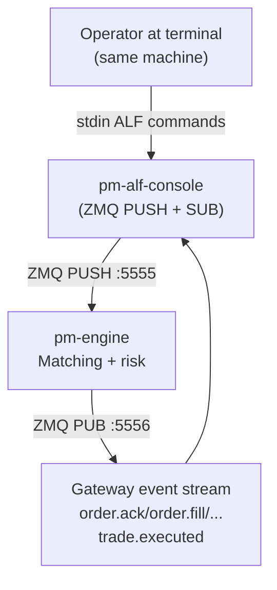
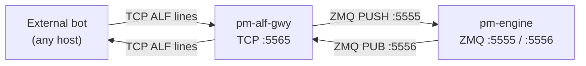
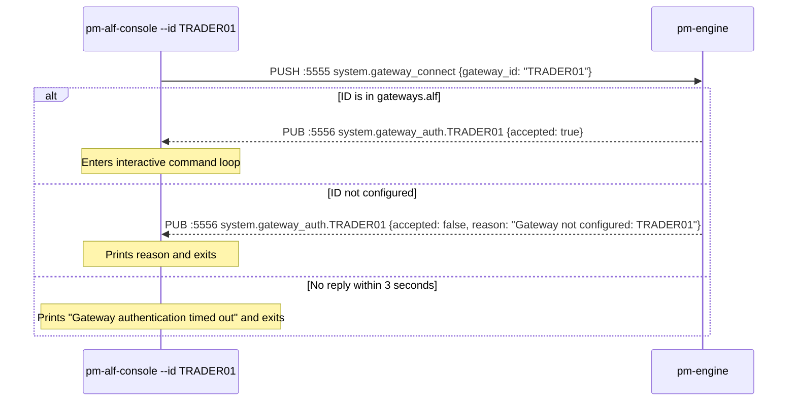
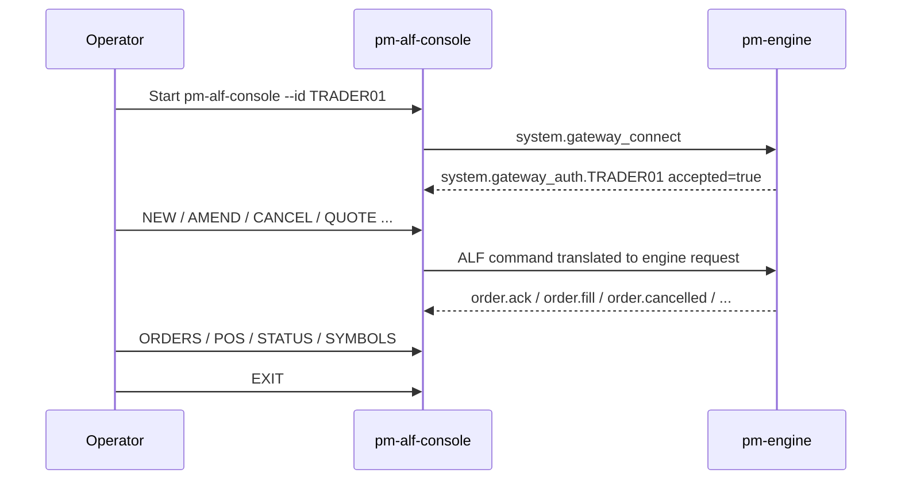
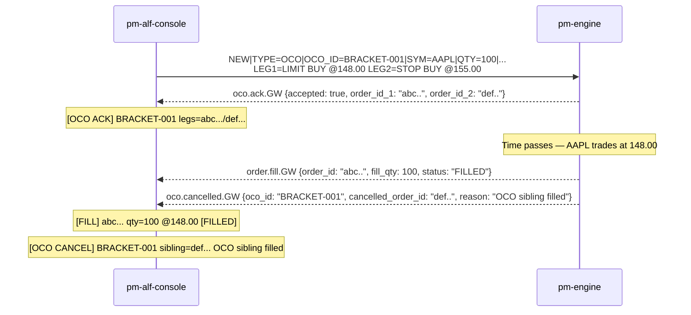

# Gateway Reference

!!! note "Learning objectives"
    After reading this page you will understand:

    - What a gateway is and what role it plays in an exchange architecture
    - Why real exchanges offer multiple gateway protocols and what the major
      industry-standard formats are
    - How EduMatcher simplifies the real-world concepts of users, participants,
      and members — and what those concepts mean in production
    - Why arrival order at the matching engine matters and how real exchanges are
      legally obligated to handle it fairly
    - How to start a gateway, submit every order type, manage positions, and read
      responses

    **Prerequisites**: [Configuration](010-configuration.md) — you need a valid
    `engine_config.yaml` with your gateway ID and role configured before connecting.
    [Order Types](060-order-types.md) — understand what NEW, AMEND, OCO, and COMBO
    mean before using the commands here.
    [Messages](270-messages.md) — for the raw two-frame format underlying every
    gateway response.

## Background — Gateways in Real Exchange Architecture

### What is a gateway?

An exchange **gateway** is the entry point through which external participants
send orders and receive market data and execution reports.  It translates the
external message format (FIX, binary, proprietary) into the internal format the
matching engine understands, authenticates the sender, applies pre-trade risk
checks, and routes messages to the right destination.

The gateway is deliberately kept outside the matching engine.  The engine's
only job is to match orders; it must not be slowed down by format parsing,
session management, or rate limiting.  Separating these concerns also allows
the exchange to offer multiple gateway protocols simultaneously — an HFT firm
and a retail broker can both connect to the same engine while speaking
completely different wire formats.

### Industry-standard gateway protocols

Real exchanges offer a range of gateway types.  Each targets a different
client population:

| Protocol | Type | Used by | Notes |
|----------|------|---------|-------|
| **FIX 4.2 / 4.4 / 5.0** | Text (tag=value) | Brokers, buy-side OMS | The lingua franca of institutional order routing; every major venue supports it; verbose but universally understood |
| **OUCH (Nasdaq)** | Binary | HFT, proprietary traders | Ultra-low latency; fixed-length binary fields; single-digit microsecond round trips |
| **ITCH (Nasdaq)** | Binary (market data only) | Market data consumers | One-way feed; used for direct order book reconstruction at co-location |
| **FAST / SBE** | Binary | Market data consumers | Simple Binary Encoding; used by CME, Eurex for market data |
| **BOE (CBOE/BATS)** | Binary | HFT | Binary Order Entry; competes with OUCH |
| **ETI (Eurex)** | Binary | European derivatives traders | Enhanced Transaction Interface; supports complex derivatives workflows |
| **Proprietary REST/WebSocket** | Text / JSON | Retail, algorithmic | Used by crypto exchanges and some retail venues; easy to integrate |

EduMatcher's order-entry gateway speaks a **FIX-inspired pipe-delimited text format** that
we call **ALF** (**AL**most **F**ix):
`NEW|SYM=AAPL|SIDE=BUY|TYPE=LIMIT|QTY=100|PRICE=150.00`.
It borrows FIX's field=value concept but uses a simplified subset - no session
layer, no checksums, no sequence numbers, and no standard FIX message set.
A production FIX gateway would add all of these.

!!! note "Formal protocol reference"
    This page explains ALF from the gateway user's point of view.
    The formal syntax and semantics of the ALF protocol are defined in
    [Appendix: ALF Protocol Reference](900-app-alf-protocol.md).

### One user per gateway — a learning simplification

EduMatcher maps one gateway process to one user.  In a real exchange, the
relationship between gateways, users, and legal entities has several layers:

```
Exchange
  └─ Member firm  (legal entity; signed exchange rules; financial responsibility)
       ├─ Participant  (trading desk or system within the firm)
       │    ├─ User  (individual trader or algorithm)
       │    └─ User
       └─ Participant
            └─ User
```

A single FIX session (one TCP connection to the exchange) can carry orders for
many users in the same firm, tagged with a `SenderSubID` or `Account` field to
identify the individual.  Risk limits may be set at the firm level, the desk
level, or the individual user level.  Pre-trade checks (position limits, fat-finger
checks, credit checks) can be applied independently at each layer.

EduMatcher collapses all of this:

- There is no concept of a member firm or legal entity.
- There is no concept of a "user" separate from the gateway.
- The gateway ID (`--id GW01`) is the only identity the engine knows.
- All orders from `GW01` are treated as one account for position tracking and
  self-match prevention purposes.

This makes the system much easier to learn and operate, at the cost of the
access-control and risk-management structures that real venues require.

### Multiple gateways and arrival order

When two gateways submit orders at almost the same moment, the engine processes
them in the order the messages arrive at its PULL socket.  On localhost with
ZeroMQ, this is effectively FIFO — but only at the network level, not at the
wall-clock level of the original submission.

In production this is a critical fairness issue:

- Two orders submitted at the same microsecond by two different participants on
  opposite sides of a co-location facility do not arrive at the engine at the
  same time.
- The order that traverses fewer network hops, or whose gateway server sits
  closer to the matching engine, will arrive first.
- This is the economics behind **co-location** services: participants pay to
  place their servers in the same data centre as the exchange, minimising the
  physical distance their messages travel.

**Legal fairness obligations**

Regulated exchanges are legally required to treat all participants fairly and
without discrimination.  In practice this means:

- **Deterministic FIFO processing**: the engine must process messages in the
  exact sequence they are received; it cannot re-order them for any reason.
- **No preferential access**: the exchange must offer the same co-location
  facilities and network connections to any participant willing to pay the
  published fee.
- **Timestamping**: many regulators (MiFID II in Europe, FINRA/SEC in the US)
  require the exchange to log a nanosecond-precision hardware timestamp
  ("gateway receipt timestamp") on every inbound message and include it in
  execution reports.  This creates an auditable record of arrival order that
  can be reviewed by regulators after any suspicious trading pattern.
- **Speed bumps**: some venues (IEX, Cboe EDGA) deliberately introduce a short
  delay (350 microseconds for IEX's "Magic Shoebox") on certain order types to
  level the playing field between speed-optimised HFT and slower participants.

EduMatcher has none of these mechanisms.  The engine processes messages in
ZeroMQ arrival order with no timestamps beyond the wall clock of the machine
running the test.  For a learning system on localhost this is irrelevant; for a
regulated venue it would be a *compliance failure*.


## What this process does

`pm-alf-console` is the **interactive ALF trading terminal** for local, in-session
use.  It is designed for humans sitting at the same machine as the running engine:
it connects **directly to the engine's ZMQ sockets**, reads commands from stdin,
and prints responses to stdout.

!!! warning "Local machine only"
    `pm-alf-console` connects directly to the engine's ZMQ PUSH/SUB ports
    (`5555` / `5556`).  It has no TCP listener of its own, so it **cannot accept
    connections from other hosts**.  It is only suitable for demos, learning, and
    manual testing on the same machine as the engine.

    For programmatic clients or any client running on a **different host**, use
    [`pm-alf-gwy`](220-alf-gateway.md) instead.  That process binds a TCP port
    (default `5565`), accepts multiple ALF connections over the network, and
    bridges them to the engine's ZMQ bus — without any client needing ZMQ access.

Responsibilities of `pm-alf-console`:

- authenticates the gateway ID against `gateways.alf`
- parses ALF command lines into validated engine requests
- subscribes to gateway-scoped lifecycle events (acks, fills, cancels, rejects)
- maintains local session caches for `ORDERS`, `POS`, `QBOOT`, and `QLEGS`
- provides interactive terminal ergonomics (history, tab completion, live events)


## Architecture position

`pm-alf-console` sits **directly on the ZMQ bus**.  It holds a ZMQ PUSH socket
(sends commands to the engine) and a ZMQ SUB socket (receives engine events).
There is no TCP layer between the operator and the engine — commands flow
directly over ZeroMQ, which is why the process must run on the same host or
at least have direct network access to the engine's ZMQ ports.



For clients on **another host**, `pm-alf-gwy` adds a TCP accept loop in front
of the same ZMQ bridge, so the client only needs a plain TCP socket:



See [ALF TCP Gateway](220-alf-gateway.md) for full documentation of `pm-alf-gwy`.


## When to use ALF — protocol comparison

EduMatcher offers multiple interfaces. Use this quick guide to choose the right one.

| Interface | Transport | Best for | Not suitable for |
|----------|-----------|----------|------------------|
| **ALF** (`pm-alf-console`) | ZMQ direct (local only) | Human/manual trading at the same machine — demos, learning, ad-hoc testing | Remote clients; any process on a different host |
| **ALF** (`pm-alf-gwy`) | TCP text `:5565` | External bots, remote scripts, any language, any host | Interactive terminal workflows (no tab completion, no P&L display) |
| **CALF** (`pm-md-gwy`) | TCP text | External market data (`TOP`, `TRADE`, `STATE`, `INDEX`) | Order entry |
| **RALF** (`pm-ralf-gwy`) | TCP text | External post-trade feeds (`CLEARING`, `DROP_COPY`, `AUDIT`) | Pre-trade market data, order entry |
| **REST / WebSocket** (`pm-api-gwy`) | HTTP/JSON + WS | Browser and API-native apps | Lowest-latency interactive trading |
| **Internal ZMQ PUB/PULL** | ZMQ binary | Internal processes that import `edumatcher` | External clients |

Rule of thumb:

- Manual command-line order entry, **same machine** → **`pm-alf-console`**
- Automated bot or **remote host** → **`pm-alf-gwy`**
- External market data feed → **CALF**
- External clearing/audit feed → **RALF**
- Browser/web integration → **REST/WebSocket**

The interactive gateway (`pm-alf-console`) is your trading console for demos and
learning. Each gateway instance represents one user connecting to the trading
system. Multiple gateways can run simultaneously.


## Starting a Gateway

```bash
poetry run pm-alf-console --id GW01
```

The `--id` flag sets your gateway identifier. It appears on all orders and fills.
The ID must be preconfigured in `engine_config.yaml` under `gateways.alf`.

On startup, the gateway:

1. Connects PUSH socket to the engine PULL port (5555)
2. Connects SUB socket to the engine PUB port (5556)
3. Subscribes to: `order.ack.{ID}`, `order.fill.{ID}`, `order.amended.{ID}`, `order.cancelled.{ID}`, `order.expired.{ID}`, `order.orders.{ID}`, `combo.ack.{ID}`, `combo.status.{ID}`, `oco.ack.{ID}`, `oco.cancelled.{ID}`, `quote.ack.{ID}`, `quote.status.{ID}`, `risk.kill_switch_ack.{ID}`, `system.symbols.{ID}`, `system.quote_bootstrap.{ID}`, `system.gateway_auth.{ID}`, `trade.executed`
4. Sends `system.gateway_connect` and waits up to **3 seconds** for the auth response
5. If accepted: enters the interactive prompt loop
6. If rejected: prints the reason and exits immediately
7. If timeout (engine not running): exits with "Gateway authentication timed out"

!!! note "A second pair of sockets talks to pm-index"
    Independently of the engine sockets above, `pm-alf-console` also opens a
    PUSH socket to the `pm-index` process's PULL port (`EDUMATCHER_INDEX_PULL_PORT`,
    default `5559`) and a SUB socket to its PUB port
    (`EDUMATCHER_INDEX_PUB_PORT`, default `5558`), subscribed to `index.update`,
    `index.history.{ID}`, and `index.error.{ID}`. These back the `INDEX` command
    family below and are independent of gateway authentication — `pm-index` does
    not need to be running for the rest of the console to work, but `INDEX` and
    `INDEX|HISTORY` will simply produce no output if it is not.

!!! note "A third socket talks to the drop-copy feed"
    `pm-alf-console` also connects a SUB socket to the engine's drop-copy PUB
    port (`DROP_COPY_PUB_ADDR`, default `:5557`), but subscribes to nothing
    on it until `DC|STATE=ON` (or `--drop-copy` at startup) — see
    [DC — Toggle Drop-Copy Relay](#dc-toggle-drop-copy-relay) below.



The gateway does **not** subscribe to `session.state`. Use `pm-audit`,
`pm-viewer`, `pm-orders`, or the scheduler output if you need to watch trading
phase transitions live.

Allowed gateway IDs are configured in `engine_config.yaml` under `gateways.alf`.

Example:

```yaml
gateways:
  alf:
    - id: TRADER01
      description: The first trader
    - id: TRADER02
      description: High frequency
```

If a gateway starts with an ID that is not listed there, the engine refuses
the connection and the gateway exits.


## Session lifecycle

Every gateway session follows this operator lifecycle:




## Command Format

All commands use the ALF pipe-separated key=value format.

!!! note
    For the precise ALF grammar, parser rules, field semantics, and full command
    catalog, see [Appendix: ALF Protocol Reference](900-app-alf-protocol.md).

### Command families at a glance

| Family | Commands | Purpose |
|--------|----------|---------|
| Order entry | `NEW`, `NEW|TYPE=COMBO`, `NEW|TYPE=OCO`, `QUOTE` | Create new exposure |
| Order updates | `AMEND`, `CANCEL`, `QUOTE_CANCEL` | Modify or remove exposure |
| Risk controls | `KILL` | Emergency local gateway kill-switch |
| Drop copy | `DC` | Toggle asynchronous relay of this gateway's own fills from the engine's drop-copy feed |
| Monitoring | `STATUS`, `ORDERS`, `POS`, `SYMBOLS`, `QBOOT`, `QLEGS`, `INDEX` | Inspect live/cached state |
| Session control | `HELP`, `EXIT`, `QUIT` | Terminal usability |

### Role entitlements (what each role can do)

| Gateway role | Allowed trading behavior | Disallowed behavior |
|--------------|--------------------------|---------------------|
| `TRADER` | Standard `NEW`/`AMEND`/`CANCEL`, OCO/COMBO, monitoring commands | MM quote commands (`QUOTE`, `QUOTE_CANCEL`) |
| `MARKET_MAKER` | All trader behavior plus quote workflows (`QUOTE`, `QBOOT`, `QLEGS`) | N/A within configured symbols/limits |
| `ADMIN` (if configured) | Operational commands per config/policy | Business flow outside policy |

If a command is not allowed for your configured role, the gateway prints a rejection.

### QUOTE — Submit/Replace A Two-Sided MM Quote

!!! tip
    For automated quoting, see [Market-Maker Bot (pm-mm-bot)](100-mm-bot.md).

```
QUOTE|SYM=<symbol>|BID=<price>|ASK=<price>|BID_QTY=<n>|ASK_QTY=<n>[|TIF=<DAY|GTC>][|QUOTE_ID=<label>]
```

Example:

```text
MM01> QUOTE|SYM=AAPL|BID=209.80|ASK=210.20|BID_QTY=500|ASK_QTY=500|QUOTE_ID=Q1
[09:30:00.101] QUOTE ACK   Q1  bid=7c4a91e2 ask=be2170fd
[09:30:00.102] QUOTE ACTIVE  Q1
```

Rules:

- `BID` must be strictly less than `ASK`
- `BID_QTY` and `ASK_QTY` must be positive integers
- Existing quote for the same gateway+symbol is replaced

### QUOTE_CANCEL — Cancel Active Quote

```
QUOTE_CANCEL|SYM=<symbol>
```

### QLEGS — Inspect MM Quote Legs and Fill Flags

`QLEGS` prints a local quote-leg projection for the current gateway session.
It is intended for `MARKET_MAKER` ALF sessions where operators need a compact,
low-cognitive-load view of which quote legs are still active and which have
already traded.

!!! note "`pm-alf-console` vs. `pm-alf-gwy`"
    This section describes `pm-alf-console`'s `QLEGS`, which renders entirely
    from its own **local, session-scoped cache** built by observing this
    session's own quote/fill/cancel events — it never asks the engine.
    `pm-alf-gwy` also supports `QLEGS` with the same command syntax and
    column semantics described below, but forwards the request to the engine
    (`system.quote_legs_request`) and renders the engine's authoritative
    reply instead of a local cache — see
    [ALF TCP Gateway → QLEGS](220-alf-gateway.md#qlegs-quote-leg-snapshot-active-recent).
    The `RECENT`/`ALL` history in both cases is real and current; it is kept
    in memory only and does not survive an engine restart — see
    [Persistence → What is deliberately not persisted](180-persistence.md#data-files-at-a-glance).

```
QLEGS[|SYM=<symbol>][|SHOW=ACTIVE|RECENT|ALL]
```

| Field  | Required | Default     | Description                                                             |
|--------|----------|-------------|-------------------------------------------------------------------------|
| `SYM`  | No       | all symbols | Restrict output to one symbol                                           |
| `SHOW` | No       | `ACTIVE`    | `ACTIVE` = currently live legs, `RECENT` = completed legs, `ALL` = both |

Output columns:

- `Symbol`, `Quote`, `Leg` (`BUY`/`SELL`), `Order`
- `Qty`, `Rem`, `Filled`, `Filled?`
- `Leg status`, `Quote status`, `Time`

#### Operator examples

1. Show only currently active quote legs across all symbols:

```text
MM01> QLEGS
```

2. Show active legs for one symbol while managing a live quote:

```text
MM01> QLEGS|SYM=AAPL
```

3. Show recent completed/cancelled legs to understand what just happened:

```text
MM01> QLEGS|SHOW=RECENT
```

4. Full audit-style view (active + recent) for one symbol:

```text
MM01> QLEGS|SYM=AAPL|SHOW=ALL
```

#### Example workflow (manual MM session)

```text
MM01> QUOTE|SYM=AAPL|BID=209.80|ASK=210.20|BID_QTY=500|ASK_QTY=500|QUOTE_ID=Q123
[09:30:00.101] QUOTE ACK   Q123  bid=7c4a91e2 ask=be2170fd
[09:30:00.102] QUOTE ACTIVE  Q123

MM01> QLEGS|SYM=AAPL
# shows BUY leg 7c4a91e2 and SELL leg be2170fd as active, Filled?=NO

[09:31:02.417] FILL      7c4a91e2  qty=100 @209.8  remaining=400  [PARTIAL]

MM01> QLEGS|SYM=AAPL|SHOW=ALL
# BUY leg now shows Filled=100, Filled?=YES, status=PARTIAL
# SELL leg state reflects remaining quote lifecycle events
```

`QLEGS` is read-only. It does not send modify/cancel actions to the engine.
Use `QUOTE`, `QUOTE_CANCEL`, or `KILL` for control actions.

### QBOOT — Request Quote Bootstrap State

`QBOOT` asks the engine for the current active quote slot state for this
gateway. It is intended for MM startup/reconnect workflows where quote legs may
have been seeded by config before the gateway connected.

```
QBOOT[|SYM=<symbol>]
```

| Field | Required | Default     | Description                               |
|-------|----------|-------------|-------------------------------------------|
| `SYM` | No       | all symbols | Restrict bootstrap response to one symbol |

Examples:

```text
MM_AAPL_01> QBOOT
# prints all active quote bootstrap entries owned by MM_AAPL_01

MM_AAPL_01> QBOOT|SYM=AAPL
# prints only AAPL bootstrap quote state for MM_AAPL_01
```

Sample output:

```text
       Quote bootstrap - MM_AAPL_01
┏━━━━━━━━┳━━━━━━━┳━━━━━━━━┳━━━━━━━━┳━━━━━━━━┳━━━━━━━┳━━━━━━━┓
┃ Symbol ┃ Quote ┃ State  ┃ Bid    ┃ Ask    ┃BidRem ┃AskRem ┃
┡━━━━━━━━╇━━━━━━━╇━━━━━━━━╇━━━━━━━━╇━━━━━━━━╇━━━━━━━╇━━━━━━━┩
│ AAPL   │ Q123  │ ACTIVE │ 209.80 │ 210.20 │  500  │  500  │
└────────┴───────┴────────┴────────┴────────┴───────┴───────┘
```

Typical startup use:

1. Connect gateway / bot as `MM_<SYMBOL>_01` (or matching seed owner).
2. Run `QBOOT|SYM=<symbol>`.
3. If exactly one healthy two-leg quote is returned, adopt it.
4. If state is missing/partial, cancel and re-issue.

### INDEX — Show Live Index Level / Structural History

`INDEX` prints the most recent index level update received from `pm-index`.
`INDEX|HISTORY` requests the structural/audit history (index creation,
corporate actions, constituent adds, delistings) for one index.

```
INDEX
INDEX|HISTORY[|INDEX=<index_id>][|FROM=<date>][|TO=<date>]
```

| Field   | Required | Default                                          | Description                                    |
|---------|----------|---------------------------------------------------|-------------------------------------------------|
| `INDEX` | No       | the last index ID seen on `index.update`          | Index to query history for                     |
| `FROM`  | No       | 30 days before now                                | Start of the history window                    |
| `TO`    | No       | now                                                | End of the history window                      |

Bare `INDEX` reads from an in-memory cache populated by the `index.update`
feed and does not send a request to the engine or `pm-index` — if no
`index.update` has been received yet, it prints
`No index data received yet. Is pm-index running?`.

`INDEX|HISTORY` sends a request to `pm-index` and prints a **structural**
history table (`INIT`, `CORP_ACTION`, `ADD_CONSTITUENT`, `DELIST` records) —
it is not a level/EOD time series. For level and EOD history, use
`pm-stats-cli index-daily` / `index-snapshots` instead; see
[Statistics and Reporting](140-statistics-and-reporting.md).

If `INDEX=` is omitted and no `index.update` has been seen yet, `INDEX|HISTORY`
prints `INDEX|HISTORY requires INDEX=<id> or prior index.update.` and sends
nothing.

Example:

```text
TRADER01> INDEX
[09:31:00.512] TECH100  4213.55 [green]+12.30 +0.29%[/green] [dim]O=4201.25 H=4220.10 L=4198.00[/dim] OPEN

TRADER01> INDEX|HISTORY|INDEX=TECH100|FROM=2026-06-01|TO=2026-07-01
# prints a "Index structural history" table of corporate-action-style records
```

### KILL — Trigger Kill-Switch

```
KILL
KILL|SYM=<symbol>
```

`KILL` cancels active quote legs and non-quote resting orders for the gateway.

### DC — Toggle Drop-Copy Relay

```
DC|STATE=ON
DC|STATE=OFF
```

`DC` subscribes (or unsubscribes) this session to the engine's drop-copy feed
(`DropCopyPublisher`, ZMQ PUB `:5557` — see [Drop Copy](200-drop-copy.md)),
scoped to **this gateway's own fills only**. Once `DC|STATE=ON` is active,
every subsequent fill for this gateway arrives asynchronously as a `DC_FILL`
line, in addition to (not instead of) the usual `FILL` line driven by
`order.fill.{GW_ID}` on the main event bus.

```text
GW01> DC|STATE=ON
[dim]DC ON[/dim]
...
[09:31:02.417] DC_FILL   7c4a91e2  AAPL  qty=100 @150.05  [TAKER]  #42  (drop_copy.event.GW01)
```

Disabled by default; start with `--drop-copy` to enable automatically on
connect instead of sending `DC|STATE=ON` manually every session:

```bash
pm-alf-console --id GW01 --drop-copy
```

!!! note "Why both FILL and DC_FILL?"
    `FILL` (from `order.fill.{GW_ID}` on `:5556`) is the trading session's
    own fill notification and always arrives regardless of `DC` state.
    `DC_FILL` is a second, independent notification sourced from the
    engine's dedicated drop-copy feed (`:5557`) — the same feed a real
    exchange would deliver to a separate risk/back-office recipient. Seeing
    both for the same fill (with different envelopes: `DC_FILL` carries the
    drop-copy `seq`/`liquidity_flag`, not the order-lifecycle `remaining`/
    `status` fields `FILL` carries) is expected and mirrors how a real
    participant's own trading session and their firm's drop-copy recipient
    receive independent copies of the same execution.
    `pm-alf-gwy` supports the identical `DC|STATE=ON`/`DC|STATE=OFF`
    command for external TCP clients — see
    [ALF TCP Gateway → DC](220-alf-gateway.md#dc-toggle-drop-copy-relay).

### NEW — Submit an Order

```
NEW|SYM=<symbol>|SIDE=<BUY|SELL>|TYPE=<order-type>|QTY=<quantity>[|PRICE=<price>][|STOP=<price>][|TRAIL=<offset>][|TIF=<DAY|GTC>][|VISIBLE=<n>][|SMP=<action>]
```

**SMP** (Self Match Prevention) values: `NONE`, `CANCEL_AGGRESSOR`, `CANCEL_RESTING`, `CANCEL_BOTH`.
SMP prevents you from accidentally trading against your own resting orders. If
`SMP` is omitted, the engine falls back to the gateway's configured
`gateways.alf[].smp_action` (or `NONE` if none is configured) rather than a
fixed default — see
[Configuration — Gateway Fields](010-configuration.md#gateway-fields) for the
config field, and
[Risk Controls — Self-Match Prevention](120-risk-controls.md#self-match-prevention-smp)
for a full explanation of how SMP is enforced during matching and how the
per-order value and the gateway default interact.

!!! note "ATO / ATC orders"
    The `ATO` (At-The-Open) and `ATC` (At-The-Close) TIF values are accepted by
    the engine during the appropriate auction phase but are **not exposed** in the
    gateway’s tab completion. To submit an ATO/ATC order, type the TIF value
    manually: `TIF=ATO` or `TIF=ATC`. These orders are only valid during
    `OPENING_AUCTION` and `CLOSING_AUCTION` phases respectively.

#### Examples

| Order Type    | Command                                                                          |
|---------------|----------------------------------------------------------------------------------|
| Market buy    | `NEW\|SYM=AAPL\|SIDE=BUY\|TYPE=MARKET\|QTY=100`                                  |
| Limit sell    | `NEW\|SYM=AAPL\|SIDE=SELL\|TYPE=LIMIT\|QTY=100\|PRICE=152.00`                    |
| GTC limit     | `NEW\|SYM=MSFT\|SIDE=BUY\|TYPE=LIMIT\|QTY=200\|PRICE=310.00\|TIF=GTC`            |
| Stop-loss     | `NEW\|SYM=AAPL\|SIDE=SELL\|TYPE=STOP\|QTY=100\|STOP=148.00`                      |
| Stop-limit    | `NEW\|SYM=AAPL\|SIDE=SELL\|TYPE=STOP_LIMIT\|QTY=100\|STOP=148.00\|PRICE=147.50`  |
| FOK           | `NEW\|SYM=AAPL\|SIDE=BUY\|TYPE=FOK\|QTY=100\|PRICE=150.00`                       |
| IOC           | `NEW\|SYM=AAPL\|SIDE=BUY\|TYPE=IOC\|QTY=100\|PRICE=150.00`                       |
| Iceberg       | `NEW\|SYM=AAPL\|SIDE=BUY\|TYPE=ICEBERG\|QTY=1000\|PRICE=150.00\|VISIBLE=100`     |
| Trailing stop | `NEW\|SYM=AAPL\|SIDE=SELL\|TYPE=TRAILING_STOP\|QTY=100\|TRAIL=1.50`              |
| With SMP      | `NEW\|SYM=AAPL\|SIDE=BUY\|TYPE=LIMIT\|QTY=100\|PRICE=150.00\|SMP=CANCEL_RESTING` |

#### Required fields by type

| Type          | Required fields                                | Optional                            |
|---------------|------------------------------------------------|-------------------------------------|
| MARKET        | SYM, SIDE, QTY                                 | SMP                                 |
| LIMIT         | SYM, SIDE, QTY, PRICE                          | TIF, SMP                            |
| STOP          | SYM, SIDE, QTY, STOP                           | TIF, SMP                            |
| STOP_LIMIT    | SYM, SIDE, QTY, STOP, PRICE                    | TIF, SMP                            |
| FOK           | SYM, SIDE, QTY, PRICE                          | SMP                                 |
| IOC           | SYM, SIDE, QTY, PRICE                          | SMP                                 |
| ICEBERG       | SYM, SIDE, QTY, PRICE, VISIBLE (must be < QTY) | TIF, SMP                            |
| TRAILING_STOP | SYM, SIDE, QTY, TRAIL                          | STOP (initial stop price), TIF, SMP |


### NEW (Combo) — Submit a Multi-Leg Order

```
NEW|TYPE=COMBO|COMBO_ID=<label>|COMBO_TYPE=AON|TIF=<DAY|GTC>|LEG_COUNT=<n>|LEG0.SYM=<sym>|LEG0.SIDE=<BUY|SELL>|LEG0.QTY=<n>|LEG0.PRICE=<p>|LEG1.SYM=...
```

#### Combo fields

| Field              | Required | Description                                      |
|--------------------|----------|--------------------------------------------------|
| `TYPE=COMBO`       | Yes      | Signals multi-leg order                          |
| `COMBO_ID=<label>` | Yes      | Your tracking label (used for cancel)            |
| `COMBO_TYPE=AON`   | Yes      | All-or-none semantics                            |
| `TIF=DAY\|GTC`     | No       | Time-in-force (default DAY), applies to all legs |
| `LEG_COUNT=<n>`    | Yes      | Number of legs (2–10)                            |
| `LEG<i>.SYM`       | Yes      | Symbol for leg *i* (0-indexed)                   |
| `LEG<i>.SIDE`      | Yes      | BUY or SELL                                      |
| `LEG<i>.QTY`       | Yes      | Quantity                                         |
| `LEG<i>.PRICE`     | Yes*     | Limit price (*required for LIMIT type)           |
| `LEG<i>.TYPE`      | No       | Order type (default LIMIT)                       |
| `SMP=<action>`     | No       | Self-match prevention, applied to every leg; same values as `NEW`'s `SMP`. If omitted, falls back to the gateway's configured `gateways.alf[].smp_action` (else `NONE`) — see [Configuration — Gateway Fields](010-configuration.md#gateway-fields) |

#### Examples

| Strategy | Command |
|----------|---------|
| Pairs trade | `NEW\|TYPE=COMBO\|COMBO_ID=PAIR-001\|COMBO_TYPE=AON\|TIF=GTC\|LEG_COUNT=2\|LEG0.SYM=MSFT\|LEG0.SIDE=BUY\|LEG0.QTY=100\|LEG0.PRICE=415.00\|LEG1.SYM=AAPL\|LEG1.SIDE=SELL\|LEG1.QTY=100\|LEG1.PRICE=210.00` |
| 3-leg arb | `NEW\|TYPE=COMBO\|COMBO_ID=ARB-01\|COMBO_TYPE=AON\|TIF=DAY\|LEG_COUNT=3\|LEG0.SYM=AAPL\|LEG0.SIDE=BUY\|LEG0.QTY=200\|LEG0.PRICE=210.00\|LEG1.SYM=MSFT\|LEG1.SIDE=SELL\|LEG1.QTY=100\|LEG1.PRICE=415.00\|LEG2.SYM=GOOG\|LEG2.SIDE=SELL\|LEG2.QTY=50\|LEG2.PRICE=170.00` |

#### Constraints

- 2–10 legs per combo
- No duplicate symbols (each leg must be a different instrument)
- All legs validated against `engine_config.yaml` symbol allowlist


### AMEND — Amend a Resting Order

```
AMEND|ID=<full-order-id>[|PRICE=<new-price>][|QTY=<new-total-qty>]
```

At least one of `PRICE=` or `QTY=` must be present.

| Field   | Required    | Description                                     |
|---------|-------------|-------------------------------------------------|
| `ID`    | Yes         | Full order UUID (visible in the `ORDERS` table) |
| `PRICE` | Conditional | New limit price; omit to keep current price     |
| `QTY`   | Conditional | New total quantity; must be ≥ filled quantity   |

**Priority rules:**

| Change                 | Time priority                                                        |
|------------------------|----------------------------------------------------------------------|
| Quantity decrease only | **Preserved** — the order keeps its queue position                   |
| Price change           | **Lost** — the order moves to the back of the queue at the new price |
| Quantity increase      | **Lost** — the order moves to the back of the queue                  |

Reply: `AMENDED <id>  price=<p> qty=<q> remaining=<r>` on success, or a rejection via `REJECTED` with a reason.


### NEW (OCO) — Submit a One-Cancels-Other Pair

An OCO pair links two orders on the same symbol so that when one fills or is cancelled, the engine automatically cancels the other.

```
NEW|TYPE=OCO|OCO_ID=<label>|SYM=<symbol>|QTY=<qty>[|TIF=<DAY|GTC>]
   |LEG1_SIDE=<BUY|SELL>|LEG1_TYPE=<type>[|LEG1_PRICE=<p>][|LEG1_STOP=<p>][|LEG1_TRAIL=<offset>]
   |LEG2_SIDE=<BUY|SELL>|LEG2_TYPE=<type>[|LEG2_PRICE=<p>][|LEG2_STOP=<p>][|LEG2_TRAIL=<offset>]
```

| Field        | Required           | Description                                    |
|--------------|--------------------|------------------------------------------------|
| `OCO_ID`     | Yes                | Client label for the pair                      |
| `SYM`        | Yes                | Instrument ticker — shared by both legs        |
| `QTY`        | Yes                | Quantity — shared by both legs                 |
| `TIF`        | No                 | `DAY` or `GTC`; defaults to `DAY`              |
| `LEG1_SIDE`  | Yes                | `BUY` or `SELL`                                |
| `LEG1_TYPE`  | Yes                | Order type for leg 1                           |
| `LEG1_PRICE` | Conditional        | Required for `LIMIT`, `STOP_LIMIT`, `FOK` legs |
| `LEG1_STOP`  | Conditional        | Required for `STOP`, `STOP_LIMIT` legs         |
| `LEG1_TRAIL` | Conditional        | Required for `TRAILING_STOP` legs              |
| `LEG2_*`     | Same rules as LEG1 | Second leg fields                              |

#### Example — bracket order

Buy limit below the market + stop-loss above (common bracket structure for a short position):

```
NEW|TYPE=OCO|OCO_ID=BRACKET-001|SYM=AAPL|QTY=100|TIF=GTC
   |LEG1_SIDE=BUY|LEG1_TYPE=LIMIT|LEG1_PRICE=148.00
   |LEG2_SIDE=BUY|LEG2_TYPE=STOP|LEG2_STOP=155.00
```

If the LIMIT leg fills at 148.00, the engine automatically cancels the STOP leg. If the STOP triggers at 155.00, the LIMIT leg is cancelled.




### CANCEL — Cancel a Resting Order, Combo, or OCO

```
CANCEL|ID=<full-order-id>          # single-leg order
CANCEL|COMBO_ID=<combo-label>      # combo and all its resting legs
CANCEL|OCO_ID=<oco-label>          # both legs of an OCO pair
```

The full order ID is shown in the `ORDERS` table. Only the first 8 characters appear in inline fill/cancel messages — use `ORDERS` to copy the full UUID.

Cancelling a combo or OCO is atomic: all resting child legs are cancelled, but fills that already occurred are not reversed.


### STATUS — View Gateway Summary

`STATUS` prints a quick local summary for the current gateway session.

```
STATUS
```

Use it when you want to confirm the gateway identity, known symbols, cached
order counts by lifecycle state, cached quote legs, and position symbols without
opening the full order table.

!!! note "Order inspection is via ORDERS"
    `STATUS` is a summary command. For detailed order inspection — full order
    IDs, quantities, remaining quantity, price, TIF, and current status — use
    `ORDERS`.

### ORDERS — Inspect This Gateway's Orders

```
ORDERS
```

Prints a rich table of all **single-leg** orders submitted in this gateway session with
full order ID, current status, remaining quantity, and last update time. This is
the primary command for order inspection inside `pm-alf-console`.

!!! note
    Combo orders are not shown in the `ORDERS` table. Their lifecycle is tracked
    via real-time `combo.ack` and `combo.status` messages printed as they arrive.
    To see all order activity (including combo children), use `pm-orders`.


### POS — View Current Positions

```
POS
```

Displays a position summary table showing net quantity, average entry cost,
last trade price, unrealized P&L, and realized P&L for each symbol traded:

```
┌─────────────────────────────────────────────────────────────────────────┐
│                            Positions                                     │
├──────────┬─────────┬──────────┬──────────┬────────────┬─────────────────┤
│ Symbol   │ Net Qty │ Avg Cost │  Last Px │ Unreal P&L │     Real P&L    │
├──────────┼─────────┼──────────┼──────────┼────────────┼─────────────────┤
│ AAPL     │    +100 │   150.25 │   151.00 │     +75.00 │          +0.00  │
│ MSFT     │     -50 │   415.00 │   414.50 │     +25.00 │        +120.00  │
│ TSLA     │       0 │        — │        — │          — │        +340.00  │
└──────────┴─────────┴──────────┴──────────┴────────────┴─────────────────┘
```

**How it works:**

- Positions are accumulated locally from `order.fill` events received by this gateway
- Last price per symbol is tracked from the `trade.executed` feed (all trades, not just this gateway's)
- Unrealized P&L = (last price − avg cost) × net quantity
- Realized P&L is booked when reducing or closing a position (average cost method)
- Flat positions (net qty = 0) with non-zero realized P&L are shown dimmed
- Positions reset when the gateway disconnects (they are session-local)

!!! tip
    Use `POS` after each fill to monitor your exposure without switching to `pm-orders`.


### SYMBOLS — List Active Instruments

```
SYMBOLS
```

Requests the list of all symbols that currently have an active order book in the engine.
The gateway sends the request and the engine replies with the current instrument list
plus any available `symbol_meta` fields, which are printed as a rich table:

```
┌─────────────────────────────────────────────────────────┐
│                    Active Instruments                   │
├────┬────────┬──────┬─────────────┬────────────┬─────────┤
│  # │ Symbol │ Tick │ MM Enforced │ Max Spread │ Min Qty │
├────┼────────┼──────┼─────────────┼────────────┼─────────┤
│  1 │ AAPL   │ 0.01 │ YES         │         10 │     100 │
│  2 │ MSFT   │ 0.01 │ NO          │         10 │     100 │
│  3 │ TSLA   │ 0.01 │ —           │          — │       — │
└────┴────────┴──────┴─────────────┴────────────┴─────────┘
```

When metadata is available, the columns mean:

- `Tick`: symbol tick size derived from engine config
- `MM Enforced`: whether MM obligation rules are currently enforced for this gateway/symbol
- `Max Spread`: effective `mm_max_spread_ticks`
- `Min Qty`: effective `mm_min_qty`

!!! note
    `SYMBOLS` returns symbols that have at least one active order book (created
    when the first order for a symbol arrives or when market-maker orders are
    injected at startup). It does NOT list all symbols from `engine_config.yaml`
    unless those symbols already have orders.

!!! note "Gateway authorization"
    `SYMBOLS` and all trading commands are available only after successful
    startup authentication. If your ID is not listed under `gateways.alf`,
    the engine refuses the connection.


### HELP — Command Reference

```
HELP
```


### EXIT / QUIT — Disconnect

```
EXIT
```


## Reconnect and state re-sync playbook

After restarting the gateway, rebuild local confidence in state with this sequence.

1. Run `SYMBOLS` to confirm active books and symbol metadata.
2. Run `ORDERS` to recover your current resting single-leg orders.
3. If you are a market maker, run `QBOOT` then `QLEGS|SHOW=ALL`.
4. Run `POS` to rebuild your session-local position view from current stream.
5. Resume normal trading only after steps 1-4 look consistent.

Why this matters:

- `ORDERS` gives authoritative order IDs for follow-up `AMEND`/`CANCEL`
- `QBOOT`/`QLEGS` avoids accidental duplicate quoting after reconnect
- `POS` helps detect drift between expected and observed exposure


## Gateway Responses

All events are printed inline with a `[HH:MM:SS.mmm]` timestamp prefix. A background thread receives events from the engine while you continue typing.

### Order Events

| Message                                               | Meaning                                               |
|-------------------------------------------------------|-------------------------------------------------------|
| `ACK  <id>  order accepted`                           | Engine received and registered the order              |
| `REJECTED  <id>  <reason>`                            | Order was rejected (e.g. FOK: insufficient liquidity) |
| `FILL  <id>  qty=50 @150.50  remaining=50  [PARTIAL]` | Partial fill                                          |
| `FILL  <id>  qty=100 @150.50  remaining=0  [FILLED]`  | Full fill                                             |
| `AMENDED  <id>  price=151.0 qty=100 remaining=100`    | Amendment confirmed                                   |
| `CANCELLED  <id>`                                     | Cancel confirmed                                      |
| `EXPIRED  <id>  (DAY order — trading day ended)`      | Engine shut down or session phase change              |

### Quote Events

| Message                                                  | Meaning                                                                    |
|----------------------------------------------------------|----------------------------------------------------------------------------|
| `QUOTE ACK  <quote_id>  bid=<8-char-id> ask=<8-char-id>` | Both quote legs accepted and posted to the book                            |
| `QUOTE REJ  <quote_id>  <reason>`                        | Quote rejected (e.g. `BID >= ASK`, missing gateway role)                   |
| `QUOTE <status>  <quote_id>  [reason]`                   | Quote lifecycle update — status is `INACTIVATED`, `CANCELLED`, or `FILLED` |

### OCO Events

| Message                                                 | Meaning                                                                           |
|---------------------------------------------------------|-----------------------------------------------------------------------------------|
| `OCO ACK  <oco_id>  legs=<leg1_8char>/<leg2_8char>`     | Both legs linked; IDs are first 8 chars of each order UUID                        |
| `OCO REJ  <oco_id>  <reason>`                           | OCO rejected (invalid legs, symbol mismatch, etc.)                                |
| `OCO CANCEL  <oco_id>  sibling=<order_8char>  <reason>` | Engine auto-cancelled the sibling leg after the other leg filled or was cancelled |

### Combo Events

| Message                                       | Meaning                                                 |
|-----------------------------------------------|---------------------------------------------------------|
| `COMBO ACK  <combo_id>  accepted`             | Combo validated, child orders posted to books           |
| `COMBO REJECTED  <combo_id>  <reason>`        | Combo failed validation (e.g. "Duplicate symbols")      |
| `COMBO STATUS  <combo_id>  PARTIALLY_MATCHED` | At least one leg has filled                             |
| `COMBO STATUS  <combo_id>  MATCHED`           | All legs fully filled                                   |
| `COMBO STATUS  <combo_id>  FAILED  <reason>`  | A leg was cancelled/expired; siblings cascade-cancelled |
| `COMBO STATUS  <combo_id>  CANCELLED`         | User-initiated cancel completed                         |

### Risk Events

| Message                               | Meaning                                                 |
|---------------------------------------|---------------------------------------------------------|
| `KILL ACK  orders=<n> quote_legs=<n>` | Kill-switch applied; counts show what was cancelled     |
| `KILL REJ  <reason>`                  | Kill-switch rejected (not expected in normal operation) |

### Drop-Copy Events

Only printed while `DC` is enabled (`DC|STATE=ON` or `--drop-copy`) — see
[DC — Toggle Drop-Copy Relay](#dc-toggle-drop-copy-relay).

| Message | Meaning |
|---|---|
| `DC ON` / `DC OFF` | Confirms the relay was toggled locally (printed immediately, no round trip to the engine) |
| `DC_FILL  <id>  <symbol>  qty=<n> @<price>  [<MAKER\|TAKER>]  #<seq>  (drop_copy.event.<GW_ID>)` | One event per fill, sourced from the engine's drop-copy feed (`:5557`) rather than the main event bus — arrives in addition to the ordinary `FILL` line |

### System Events

| Message                           | Meaning                                                   |
|-----------------------------------|------------------------------------------------------------|
| `Active Instruments` table        | Response to `SYMBOLS` command                             |
| `<INDEX_ID>  <level>  ...`        | Response to `INDEX`, printed from the cached `index.update` feed |
| `Index structural history` table  | Response to `INDEX\|HISTORY`                               |
| `INDEX ERROR  <reason>`           | `pm-index` rejected an `INDEX\|HISTORY` request            |

!!! note "Session phase changes"
    The gateway does **not** subscribe to `session.state` events. Trading phase transitions are not displayed in the gateway terminal. To monitor session phases, run `pm-audit`, `pm-viewer`, or `pm-orders` in a separate terminal.


## End-to-end operator walkthrough

This transcript shows a realistic manual session from connect to disconnect.

```text
# Start gateway
$ poetry run pm-alf-console --id TRADER01

TRADER01> SYMBOLS
# confirms AAPL/MSFT active

TRADER01> NEW|SYM=AAPL|SIDE=BUY|TYPE=LIMIT|QTY=100|PRICE=150.00
[09:30:00.100] ACK  7c4a91e2  order accepted

TRADER01> ORDERS
# copy full UUID from table if you plan to amend/cancel

TRADER01> AMEND|ID=7c4a91e2-...|PRICE=150.10
[09:30:01.500] AMENDED  7c4a91e2  price=150.1 qty=100 remaining=100

[09:30:02.200] FILL  7c4a91e2  qty=40 @150.10  remaining=60  [PARTIAL]

TRADER01> POS
# exposure now reflects partial fill

TRADER01> CANCEL|ID=7c4a91e2-...
[09:30:03.000] CANCELLED  7c4a91e2

TRADER01> EXIT
```

Recommended habits:

- Always use `ORDERS` to copy full IDs before `AMEND`/`CANCEL`
- Check `POS` after fills, not only at end of session
- If behavior looks inconsistent, run the re-sync playbook above


## Multiple Gateways

Run as many gateways as needed — each in its own terminal window:

```bash
# Terminal A
poetry run pm-alf-console --id TRADER01

# Terminal B  
poetry run pm-alf-console --id TRADER02

# Terminal C
poetry run pm-alf-console --id TRADER03
```

Before starting a new gateway ID (for example `TRADER03`), add it to
`engine_config.yaml` in `gateways.alf` and restart the engine.

Each gateway only receives events for its own orders. Use `pm-orders` to see all
gateways' activity.


## Interactive Features

### Tab Completion

The gateway provides **context-aware tab completion**:

| Position                  | Completions                                                                                                                               |
|---------------------------|-------------------------------------------------------------------------------------------------------------------------------------------|
| First word                | `NEW`, `AMEND`, `CANCEL`, `QUOTE`, `QUOTE_CANCEL`, `QBOOT`, `QLEGS`, `KILL`, `DC`, `STATUS`, `ORDERS`, `POS`, `SYMBOLS`, `INDEX`, `HELP`, `EXIT`, `QUIT` |
| After `NEW\|`             | `SYM=`, `SIDE=`, `TYPE=`, `QTY=`, `PRICE=`, `STOP=`, `TRAIL=`, `TIF=`, `VISIBLE=`, `SMP=`                                                 |
| After `NEW\|TYPE=COMBO\|` | `COMBO_ID=`, `COMBO_TYPE=`, `TIF=`, `LEG_COUNT=`, plus `LEG0.SYM=`, `LEG0.SIDE=`, etc.                                                    |
| After `NEW\|TYPE=OCO\|`   | `OCO_ID=`, `SYM=`, `QTY=`, `TIF=`, `LEG1_SIDE=`, `LEG1_TYPE=`, etc.                                                                       |
| After `AMEND\|`           | `ID=`, `PRICE=`, `QTY=`                                                                                                                   |
| After `CANCEL\|`          | `ID=`, `COMBO_ID=`, `OCO_ID=`                                                                                                             |
| After `TYPE=`             | All order types: `MARKET`, `LIMIT`, `STOP`, `STOP_LIMIT`, `FOK`, `IOC`, `ICEBERG`, `TRAILING_STOP`, `COMBO`, `OCO`                        |
| After `SIDE=`             | `BUY`, `SELL`                                                                                                                             |
| After `TIF=`              | `DAY`, `GTC`, `ATO`, `ATC`                                                                                                                |
| After `SMP=`              | `NONE`, `CANCEL_AGGRESSOR`, `CANCEL_RESTING`, `CANCEL_BOTH`                                                                               |
| After `SYM=`              | Known symbols (populated from the last `SYMBOLS` reply)                                                                                   |

Press **Tab** to cycle through suggestions.

### Command History

Press **↑** / **↓** arrow keys to navigate through previously entered commands
(in-memory, session-scoped — history is not persisted across gateway restarts).

### Background Event Display

A background thread listens on the SUB socket and prints events (fills, cancels,
combo status changes, session transitions) in real-time, interleaved cleanly with
the command prompt. You can continue typing while events arrive.

## Common mistakes and fast triage

| Symptom | Typical cause | Fast check | Action |
|---|---|---|---|
| `Gateway authentication timed out` | Engine is not running/reachable | Is `pm-engine` running in another terminal? | Start `pm-engine` first |
| `Gateway not configured: GW01` | Gateway ID not in `engine_config.yaml` | Check `gateways.alf` list | Add ID under `gateways.alf` and restart engine |
| `REJECTED: SYMBOL_NOT_CONFIGURED` | Symbol unknown to engine config | Run `SYMBOLS` | Use listed symbols or add symbol to config |
| `REJECTED: SYMBOL_HALTED` | Circuit breaker/operator halt | Check audit/viewer output | Wait for resume or use admin controls |
| `REJECTED: STATIC_COLLAR_BREACH` | Price too far from reference | Compare to recent trade prices | Reprice closer to market |
| Order rests but does not fill | No crossing liquidity | Check opposite side activity | Wait or improve price |
| `Quotes are only allowed for MARKET_MAKER participants` | Role is `TRADER` | Verify gateway role in config | Change role to `MARKET_MAKER` if intended |
| `AMEND`/`CANCEL` fails with unknown ID | Short ID used instead of full UUID | Run `ORDERS` and inspect full ID | Retry with full order UUID |

## See also

- [Configuration](010-configuration.md#alf-gateway-allowlist) — gateway roles, allowlists, disconnect behaviour, and MM obligations
- [Order Types](060-order-types.md) — full semantics for every order type accepted by the gateway
- [ALF Protocol Reference](900-app-alf-protocol.md) — formal ABNF grammar and field rules for the pipe-delimited syntax
- [Messages](270-messages.md) — the ZeroMQ messages the gateway publishes and subscribes to
- [Risk Controls](120-risk-controls.md) — how the engine enforces collars, halts, and kill switches on gateway flow
- [Running the Engine](040-running-the-engine.md) — how to start `pm-alf-console` and verify the connection
- [Index](150-index.md) — `pm-index` process, index composition, and the `index.update`/`index.history` feed behind the `INDEX` command
- [Statistics and Reporting](140-statistics-and-reporting.md) — `pm-stats-cli index-daily`/`index-snapshots` for level/EOD history (vs. `INDEX|HISTORY`'s structural records)
