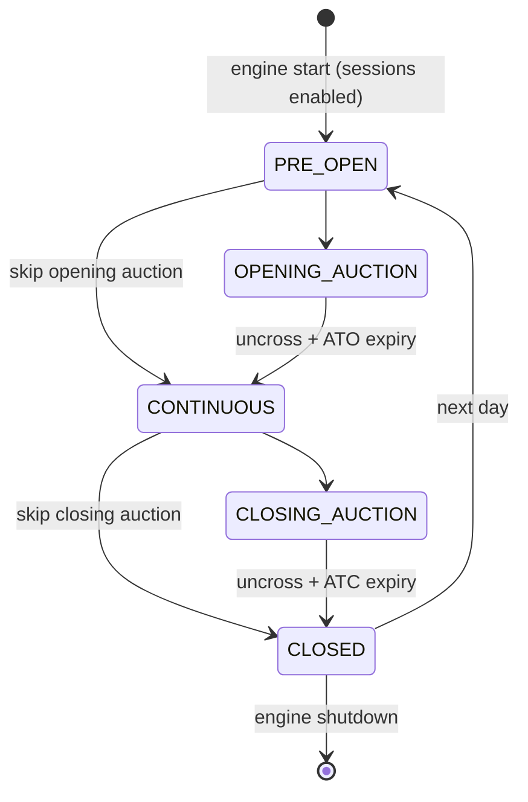

# Auctions & Session Scheduling

!!! note "Learning objectives"
    After reading this page you will understand:

    - Why exchanges use auctions rather than continuous matching at the open and close
    - How the equilibrium (uncross) price is calculated
    - Which order types are valid in each session phase
    - What happens to resting orders at each phase transition
    - How to drive phase transitions in EduMatcher

   **Prerequisite**: [A Full Trading Day](../concepts/05-concepts-trading-day.md) gives a visual
    overview of the session phases before diving into the mechanics here.

## What are auctions?

In real exchanges, a trading day is not a single uninterrupted period of
continuous matching.  Instead it is divided into **session phases**, two of
which are dedicated **auction periods** — one at the open and one at the
close.

An auction collects orders over a fixed time window without executing any of
them.  When the window ends the exchange computes a single **equilibrium
price** and fills every **crossable** order at that price in one atomic event
called the **uncross**.  ("Crossable" means orders that overlap in price: a
buy order priced at or above the equilibrium and a sell order priced at or
below it — they can trade because the buyer is willing to pay at least what
the seller demands.)

### Why auctions exist

| Problem | How auctions help |
|---|---|
| **Opening price discovery** | Overnight news creates uncertainty.  An opening auction lets all participants express interest simultaneously, producing a fair opening price that reflects the balance of supply and demand — rather than letting the first few aggressive orders set the tone. |
| **Closing price quality** | The official closing price is used by fund managers to value portfolios (NAV = Net Asset Value), by index providers to rebalance index compositions, and by clearinghouses for end-of-day settlement.  A closing auction concentrates end-of-day liquidity into a single price, reducing the impact of last-second volatility. |
| **Reduced information asymmetry** | In continuous trading a fast participant can exploit outdated ("stale") resting orders before the slower participant has time to update them — for example, news breaks and a high-frequency trader buys shares from a resting sell order whose owner hasn't yet cancelled it.  Because auctions execute everything at once, speed advantages are neutralised during these windows. |
| **Maximised fill quantity** | The equilibrium algorithm explicitly maximises the number of shares that can trade, giving more participants a fill than a sequence of bilateral matches would. |

### EduMatcher's auction model

EduMatcher implements a **standard two-sided call auction** used by most
equity exchanges (Euronext, LSE, Nasdaq Nordic, etc.).  Each symbol book
participates in a global schedule of session phases:

```
PRE_OPEN → OPENING_AUCTION → CONTINUOUS → CLOSING_AUCTION → CLOSED
```

The scheduler process (`pm-scheduler`) drives these transitions by sending
`session.transition` messages to the engine over ZeroMQ.


## Session phases

| Phase | Orders accepted? | Matching? | Description |
|---|---|---|---|
| `PRE_OPEN` | Yes | No | Orders rest on the book, no execution.  Participants can position themselves before the auction starts. |
| `OPENING_AUCTION` | Yes | No | Orders continue to accumulate.  **ATO** (At-The-Open) orders are accepted only during this phase. |
| `CONTINUOUS` | Yes | Yes | Normal price-time-priority matching.  Every incoming order is immediately swept against resting liquidity. |
| `CLOSING_AUCTION` | Yes | No | Orders accumulate for the closing uncross.  **ATC** (At-The-Close) orders are accepted only during this phase. |
| `CLOSED` | No | No | Market is closed.  All new orders are rejected. |

### Order acceptance rules by phase

| Order characteristic | PRE_OPEN | OPENING_AUCTION | CONTINUOUS | CLOSING_AUCTION | CLOSED |
|---|---|---|---|---|---|
| LIMIT / ICEBERG | Rest | Rest | Match | Rest | Reject |
| MARKET | Reject | Reject | Match | Reject | Reject |
| FOK | Reject | Reject | Match | Reject | Reject |
| IOC | Reject | Reject | Match | Reject | Reject |
| STOP / STOP_LIMIT | Rest (no trigger) | Rest (no trigger) | Normal trigger logic | Rest (no trigger) | Reject |
| TRAILING_STOP | Rest (no trigger¹) | Rest (no trigger¹) | Normal trigger logic | Rest (no trigger¹) | Reject |
| TIF = ATO | Reject | **Accept** | Reject | Reject | Reject |
| TIF = ATC | Reject | Reject | Reject | **Accept** | Reject |

¹ TRAILING_STOP is rejected during PRE_OPEN/auction phases if no `STOP=` is given and
  no prior trade has established a `last_trade_price` for the symbol.

MARKET, FOK, and IOC orders are always rejected outside CONTINUOUS because they
cannot rest on the book — they require immediate execution.

### Transition side-effects

When the engine transitions **into a matching phase** (i.e. when the new state
has matching enabled and the old one did not — including the `PRE_OPEN → CONTINUOUS`
shortcut):

1. **Uncross** — the equilibrium price algorithm runs on every symbol book
   and executes all crossable interest at the equilibrium price.
2. **TIF expiry** — ATO orders are expired when leaving `OPENING_AUCTION`;
   ATC orders are expired when leaving `CLOSING_AUCTION`.  Expired orders
   receive an `order.expired` event on the PUB socket.

!!! note
    The uncross also fires on `PRE_OPEN → CONTINUOUS` (skipping the opening
    auction).  Any orders that accumulated during pre-open are crossed at
    the equilibrium price before continuous matching begins.

### Valid state transitions



Invalid transitions are silently rejected by the engine and logged to
stderr.


## The session scheduler (`pm-scheduler`)

The scheduler is a standalone process that sends `session.transition`
messages to the engine at configured wall-clock times over a ZeroMQ PUSH
socket.

### Starting the scheduler

```bash
# Use times from engine_config.yaml (or built-in defaults)
poetry run pm-scheduler

# Rapid-fire all transitions immediately (for testing / demos)
poetry run pm-scheduler --now

# Custom delay between transitions in --now mode (default 3 s)
poetry run pm-scheduler --now --delay 5

# Point to a different config file
poetry run pm-scheduler --config my_schedule.yaml
```

### Configuring the schedule

Add a `schedule` section to `engine_config.yaml`:

```yaml
schedule:
  pre_open: "09:00"
  opening_auction_start: "09:25"
  continuous_start: "09:30"
  closing_auction_start: "16:00"
  closing_auction_end: "16:05"
```

Times are `HH:MM` in local time.

### Session handling toggle

Session gating in the engine is controlled by `sessions_enabled`:

```yaml
sessions_enabled: true
```

- `true` (default): session transitions are enforced, the engine starts
   `CLOSED`, and new orders are rejected outside order-accepting session
   states.
- `false`: session handling is disabled, `session.transition` messages are
   ignored by the engine, and the engine starts (and remains) in `CONTINUOUS`
   state — all order types are accepted and matched immediately.

Use `sessions_enabled: false` when you want an always-open simulation without
time-based session control.

### Built-in default schedule

If no config file provides a `schedule` section, `pm-scheduler` uses:

| Time  | Transition target |
|-------|-------------------|
| 09:00 | `PRE_OPEN` |
| 09:25 | `OPENING_AUCTION` |
| 09:30 | `CONTINUOUS` |
| 16:00 | `CLOSING_AUCTION` |
| 16:05 | `CLOSED` |

### `--now` mode

The `--now` flag skips wall-clock waiting and sends every transition in the
default sequence with a short configurable delay between each.  This is
useful for integration testing and demos where you want to exercise the full
auction lifecycle in seconds rather than hours.

```bash
poetry run pm-scheduler --now --delay 2
```

Output:

```
[SCHEDULER] --now mode: sending all transitions with 2.0s delays

[SCHEDULER] → PRE_OPEN
[SCHEDULER] → OPENING_AUCTION
[SCHEDULER] → CONTINUOUS
[SCHEDULER] → CLOSING_AUCTION
[SCHEDULER] → CLOSED
[SCHEDULER] Done.
```


## Equilibrium price

The **equilibrium price** (also called the **auction price** or **uncross
price**) is the single price at which the auction executes all crossable
interest.  It is the price that maximises the number of shares traded while
minimising the leftover imbalance.

### Intuition

Imagine plotting two curves:

- **Cumulative demand** — for each candidate price $P$, how many shares are
  buyers willing to buy at $P$ or higher?  (Sum of all bid quantities where
  $\text{bid price} \geq P$.)
- **Cumulative supply** — for each candidate price $P$, how many shares are
  sellers willing to sell at $P$ or lower?  (Sum of all ask quantities where
  $\text{ask price} \leq P$.)

The equilibrium price sits where these two curves cross — the point where
the most shares can change hands.

### Algorithm

The engine computes the equilibrium price in $O(p)$ time, where $p$ is the
number of distinct price levels on the book.

#### Step 1 — Build cumulative quantity arrays

Let $B = \{b_1, b_2, \ldots\}$ be the set of distinct bid prices sorted
**descending** (highest first), and $A = \{a_1, a_2, \ldots\}$ the set of
distinct ask prices sorted **ascending** (lowest first).

Compute the running cumulative quantities:

$$
\text{cum\_buy}[b_i] = \sum_{j=1}^{i} \text{bid\_qty}(b_j)
$$

$$
\text{cum\_sell}[a_i] = \sum_{j=1}^{i} \text{ask\_qty}(a_j)
$$

Because bids are sorted highest-first, $\text{cum\_buy}[b_i]$ gives the
total bid quantity at prices $\geq b_i$.  Symmetrically,
$\text{cum\_sell}[a_i]$ gives total ask quantity at prices $\leq a_i$.

#### Step 2 — Evaluate every candidate price

The set of candidate prices is $C = B \cup A$ (every distinct price level on
either side), sorted ascending.

For each candidate price $P \in C$:

$$
\text{buy\_qty}(P) = \text{cum\_buy}[\min\{b \in B \mid b \geq P\}]
$$

$$
\text{sell\_qty}(P) = \text{cum\_sell}[\max\{a \in A \mid a \leq P\}]
$$

$$
\text{exec\_qty}(P) = \min\bigl(\text{buy\_qty}(P),\; \text{sell\_qty}(P)\bigr)
$$

$$
\text{surplus}(P) = \bigl|\text{buy\_qty}(P) - \text{sell\_qty}(P)\bigr|
$$

#### Step 3 — Select the best price

$$
P^* = \arg\max_{P \in C} \text{exec\_qty}(P)
$$

If multiple prices yield the same maximum $\text{exec\_qty}$, break ties by:

1. Pick the $P$ with the smallest $\text{surplus}$ (least imbalance).
2. If still tied, pick the **lowest** price among the candidates.
   (This is an arbitrary but deterministic convention; some real exchanges
   pick the price nearest the last traded price instead.)

If $\text{exec\_qty}(P^*) = 0$, there is no crossable interest and no
uncross takes place.

#### Step 4 — Determine imbalance

At the chosen $P^*$:

- If $\text{buy\_qty} > \text{sell\_qty}$ → imbalance side is **BUY**
- If $\text{sell\_qty} > \text{buy\_qty}$ → imbalance side is **SELL**
- If equal → **balanced** (no imbalance)

The surplus quantity is the number of shares that could not be matched.

### Worked example

Consider this order book accumulated during an opening auction:

| Side | Price | Quantity |
|------|-------|----------|
| BUY  | 105   | 10       |
| BUY  | 103   | 10       |
| BUY  | 100   | 10       |
| SELL | 102   | 15       |
| SELL | 104   | 10       |

**Cumulative buy** (highest first): 105→10, 103→20, 100→30

**Cumulative sell** (lowest first): 102→15, 104→25

Evaluate candidates (ascending):

| $P$ | buy_qty | sell_qty | exec_qty | surplus |
|-----|---------|----------|----------|---------|
| 100 | 30      | 0        | 0        | 30      |
| 102 | 20      | 15       | 15       | 5       |
| 103 | 20      | 15       | 15       | 5       |
| 104 | 10      | 25       | 10       | 15      |
| 105 | 10      | 25       | 10       | 15      |

Maximum exec_qty = **15** at prices 102 and 103 (both with surplus 5).
Tie-broken by lowest price: $P^* = 102$.

Result: 15 shares execute at **102.00**, with a BUY-side imbalance of 5
shares.

### Uncross execution

Once the equilibrium price $P^*$ is determined, the engine sweeps the book:

1. Take the best bid (highest price, earliest time) and the best ask
   (lowest price, earliest time).  This is **price-time priority**: orders
   at better prices go first; among equal prices, the one that arrived
   earlier goes first.
2. If the bid price $\geq P^*$ and the ask price $\leq P^*$, fill
   $\min(\text{bid\_remaining}, \text{ask\_remaining})$ shares at $P^*$.
3. Repeat until no more crossable interest remains.
4. Any remaining orders whose prices do NOT cross $P^*$ (surplus orders)
   stay on the book and participate in the next phase (typically continuous
   trading).  They are not expired or cancelled — they simply did not get
   matched in the auction.

All fills occur at the single equilibrium price — there is no price
improvement or slippage during the uncross.

### Published events

When an uncross completes, the engine publishes:

| Topic | Content |
|---|---|
| `order.fill.{gateway_id}` | One per order that received a fill (partial or complete) |
| `trade.executed` | One per matched pair |
| `auction.result.{symbol}` | Summary: equilibrium price, quantity, surplus, imbalance side |
| `order.expired.{gateway_id}` | One per ATO/ATC order that did not fill and was expired |
| `session.state` | Confirms the new session state after the transition |

## See also

- [Configuration](01-configuration.md#session-scheduling) — `schedule:` YAML keys and `sessions_enabled`
- [Order Types](04-order-types.md#time-in-force-tif) — ATO and ATC time-in-force explained
- [Processes](10-processes.md#pm-scheduler) — how to start and configure `pm-scheduler`
- [Running the Engine](03-running-the-engine.md) — the `--now` shortcut for rapid session cycling
- [Risk Controls](12-risk-controls.md) — circuit-breaker resumption modes that re-use the uncross algorithm
- [Messages](09-messages.md) — `session.state`, `auction.result`, and `order.expired` message formats


