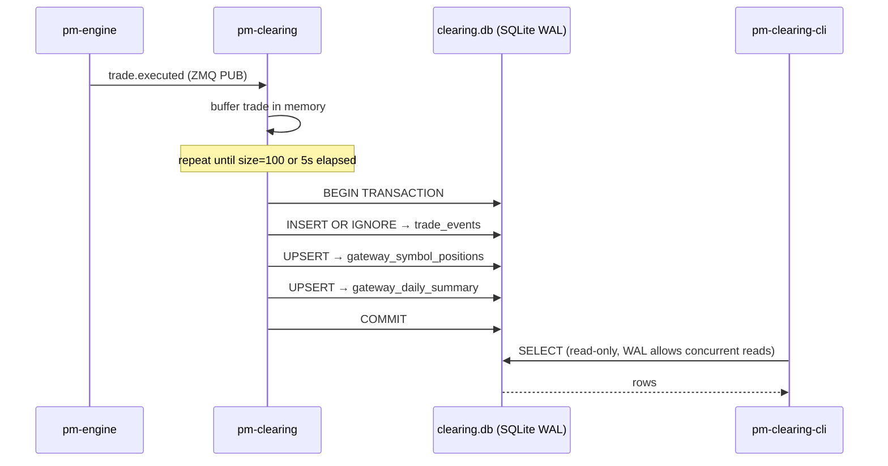
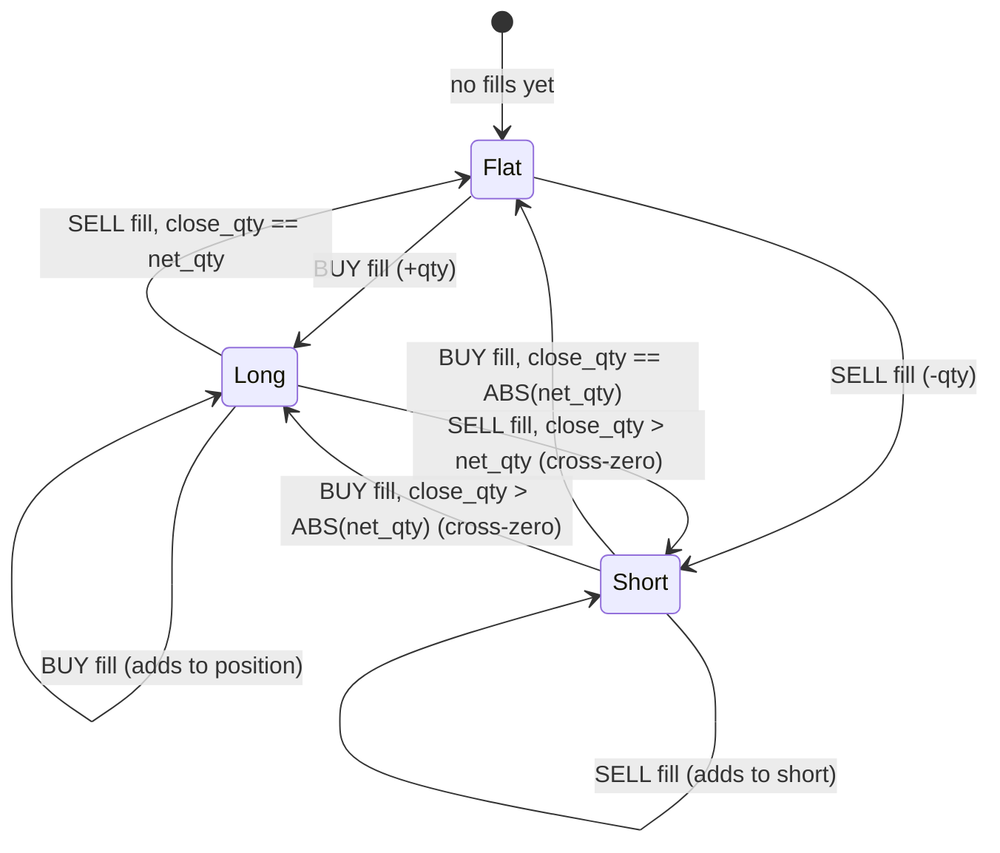

# P&L & Clearing

!!! note "Learning objectives"
    After reading this page you will understand:

    - What P&L and clearing mean in an exchange context
    - How long and short positions are tracked and how VWAP average cost works
    - The difference between realized and unrealized P&L
    - How the `pm-clearing` process subscribes to trades and writes to SQLite
    - How to query clearing data using every `pm-clearing-cli` command verb
    - A practical cookbook for answering clearing-house questions from the command line

    **Prerequisite**: Complete [Your First Trade](../concepts/04-concepts-first-trade.md).


## What this page covers

**P&L** stands for **Profit and Loss** — the running tally of how much money
each trader has made or lost. **Clearing** is the process of settling trades
after they execute: confirming who owes what to whom, updating account
balances, and recording the transaction history.

In a real exchange, clearing involves counterparty risk management, margin
calls, and settlement cycles (T+1 or T+2). EduMatcher simplifies this to
real-time P&L accounting with no credit risk — every trade settles instantly.

EduMatcher v2 uses a **two-component clearing system**:

| Component | Role |
|-----------|------|
| `pm-clearing` | Long-running subscriber — reads every `trade.executed` event, maintains in-memory positions and P&L, and writes batched results to `clearing.db` (SQLite) |
| `pm-clearing-cli` | One-shot query tool — reads from `clearing.db` and prints human-friendly or machine-readable output without SQL |


## Starting the clearing process

```bash
pm-clearing
```

No arguments are required. The process connects to the engine's PUB socket
(port 5556), creates or opens `data/clearing.db`, and begins tracking P&L.
It can be started before or after trading begins — it will pick up all trades
from the moment it subscribes.

### Message flow



### Optional arguments

```text
pm-clearing [OPTIONS]

  --datapath PATH        Data directory or explicit .db file path
  --db-name NAME         SQLite filename within data dir (default: clearing.db)
  --flush-size N         Max buffered trades before flush (1..100, default: 100)
  --flush-interval SEC   Max seconds between flushes (>=0.1, default: 5)
  --print-every N        Print P&L summary every N trades (0 = never, default: 100)
  --version              Show version and exit
  --help                 Show help and exit
```

### What pm-clearing subscribes to

`trade.executed` is the only required subscription for P&L. The engine also
emits these messages, which `pm-clearing` does not yet subscribe to (planned
for a future version):

| Topic | Purpose |
|---|---|
| `system.eod` | Finalize end-of-day state |
| `system.gateway_connect` / `gateway_disconnect` | Audit trail |
| `session.state` | Trading phase annotation |


## Data folder location

`pm-clearing` writes to `clearing.db` in the same data directory used by
all other EduMatcher processes:

| Running mode | Default location | Override |
|---|---|---|
| Source checkout | `<repo>/src/data/clearing.db` | `EDUMATCHER_DATA_DIR` |
| Installed (`pipx`) | `~/.local/share/edumatcher/clearing.db` | `EDUMATCHER_DATA_DIR` |

Pass `--datapath` to use a different directory or file:

```bash
# Use a custom directory
pm-clearing --datapath ~/trading/sessions/morning

# Use an explicit db file
pm-clearing --datapath ~/trading/clearing_2026.db
```


## Position tracking

For each `(gateway_id, symbol)` pair, `pm-clearing` tracks:

| Field | Description |
|---|---|
| `net_qty` | Net quantity held. Positive = long, negative = short, zero = flat. |
| `avg_cost` | Volume-weighted average entry price (VWAP). |
| `realized_pnl` | Accumulated P&L from trades that reduced the position. |
| `unrealized_pnl` | Paper P&L on the remaining open position. |
| `mark_price` | Latest observed trade price, used to value the open position. |

### Position state machine



Realized P&L is calculated on every state transition that reduces an open position.


## VWAP average cost

When you build a position through multiple trades at different prices, the
**volume-weighted average price (VWAP)** gives your blended entry cost:

$$
\text{avg\_cost}_\text{new} = \frac{\text{avg\_cost}_\text{old} \times \lvert \text{net\_qty}_\text{old} \rvert + \text{fill\_price} \times \text{fill\_qty}}{\lvert \text{net\_qty}_\text{new} \rvert}
$$

This is recalculated on every fill that increases an existing position.


## Realized P&L

**Realized P&L** is profit or loss that is locked in — it comes from trades
that **reduce** your position.

**Closing a long position (via SELL):**
$$
\text{realized} += (\text{fill\_price} - \text{avg\_cost}) \times \text{closed\_qty}
$$

**Closing a short position (via BUY):**
$$
\text{realized} += (\text{avg\_cost} - \text{fill\_price}) \times \text{closed\_qty}
$$

When a fill crosses zero (e.g. closes a 100-share long and opens a 30-share
short in one trade), P&L is realized on the full close and `avg_cost` is
reset to the fill price for the new-side position.


## Unrealized P&L

**Unrealized P&L** is the theoretical value of the remaining open position
at the current mark price:

$$
\text{unrealized} = \text{net\_qty} \times (\text{mark\_price} - \text{avg\_cost})
$$

For a short position `net_qty` is negative, so a falling mark price produces
positive unrealized P&L.


## Worked example

| Step | Event | Calculation | net_qty | avg_cost | realized_pnl |
|---|---|---|---|---|---|
| 1 | BUY 10 @ 100 | Open long | +10 | 100.00 | 0 |
| 2 | BUY 10 @ 110 | Add to long. avg = (1000+1100)/20 | +20 | 105.00 | 0 |
| 3 | SELL 20 @ 115 | Full close. realized = (115−105)×20 | 0 | 0 | 200 |
| 4 | SELL 15 @ 108 | Cross-zero from flat → open short | −15 | 108.00 | 200 |
| 5 | BUY 20 @ 105 | Close 15 short, open 5 long. realized += (108−105)×15 | +5 | 105.00 | 245 |


## Using pm-clearing-cli

`pm-clearing-cli` provides verb-based access to all clearing data without writing SQL.
It always reads from the same `clearing.db` used by `pm-clearing`.

```bash
pm-clearing-cli [GLOBAL_OPTIONS] <verb> [verb-options]

Global options:
  --datapath PATH      Data directory or explicit .db file path
  --db-name NAME       SQLite filename if datapath is a directory
  --format FMT         table | json | csv  (default: table)
  --no-header          Suppress CSV header row
  --version
  --help
```

### gateways — live gateway P&L totals

Returns one row per gateway with cumulative P&L and net position.

```bash
# All gateways
pm-clearing-cli gateways

# One gateway
pm-clearing-cli gateways --gateway TRADER01

# Machine-readable output
pm-clearing-cli --format json gateways
```

Output fields: `gateway_id`, `realized_pnl_total`, `unrealized_pnl_total`,
`total_pnl`, `net_qty_total`


### positions — current positions by gateway and symbol

```bash
# All positions
pm-clearing-cli positions

# One gateway, all symbols
pm-clearing-cli positions --gateway MM01

# One symbol across all gateways
pm-clearing-cli positions --symbol AAPL

# CSV export
pm-clearing-cli --format csv positions > positions.csv
```

Output fields include `net_qty`, `avg_cost`, `mark_price`, `realized_pnl`,
`unrealized_pnl`, buy/sell quantities and notionals.


### pnl — realized/unrealized/total P&L

```bash
# Exchange-wide P&L
pm-clearing-cli pnl

# One gateway
pm-clearing-cli pnl --gateway TRADER01

# One symbol across all gateways
pm-clearing-cli pnl --symbol MSFT
```


### daily — daily rollup summaries

```bash
# Today's summary for all gateways
pm-clearing-cli daily --date 2026-07-05

# A date range
pm-clearing-cli daily --from 2026-07-01 --to 2026-07-05

# One gateway's week
pm-clearing-cli daily --gateway MM01 --from 2026-07-01 --to 2026-07-05

# JSON export for a spreadsheet
pm-clearing-cli --format json daily --date 2026-07-05 > daily_2026-07-05.json
```


### trades — raw trade events

```bash
# All trades today
pm-clearing-cli trades --date 2026-07-05

# One symbol, paginated
pm-clearing-cli trades --symbol AAPL --limit 50

# Everything a gateway touched today
pm-clearing-cli trades --gateway TRADER07 --date 2026-07-05

# Date range
pm-clearing-cli trades --from 2026-07-01 --to 2026-07-05 --symbol MSFT
```


### exposure — net and gross notional exposure

Useful for spotting large concentrated positions.

```bash
# Largest exposures first (default sort: gross_notional)
pm-clearing-cli exposure

# Sort by total P&L
pm-clearing-cli exposure --sort total_pnl

# One symbol
pm-clearing-cli exposure --symbol AAPL

# JSON for a risk dashboard
pm-clearing-cli --format json exposure > exposure.json
```

Allowed `--sort` values: `gross_notional`, `net_notional`, `realized_pnl`,
`unrealized_pnl`, `total_pnl`


### symbols — symbol-level clearing totals

```bash
# All symbols traded
pm-clearing-cli symbols

# Sort by traded notional (descending)
pm-clearing-cli symbols --sort traded_notional

# Filter to one date
pm-clearing-cli symbols --date 2026-07-05
```

Allowed `--sort` values: `symbol`, `traded_qty`, `traded_notional`,
`realized_pnl`, `open_net_qty`


### dates — available trading dates

```bash
# List all dates in the DB
pm-clearing-cli dates

# With per-date volume and net amount
pm-clearing-cli dates --with-totals

# Filter by symbol
pm-clearing-cli dates --symbol AAPL

# Narrow date window with totals
pm-clearing-cli dates --from 2026-07-01 --to 2026-07-05 --with-totals
```


### health — DB metadata and freshness

Use this to verify that `pm-clearing` is running and writing.

```bash
pm-clearing-cli health
```

Output fields: `db_path`, `trade_events_rows`, `gateway_symbol_positions_rows`,
`gateway_daily_summary_rows`, `last_trade_ts_ns`, `last_flush_ts_ns`, `wal_mode`


### reconcile — verify aggregate consistency

Compares raw `trade_events` buy-side totals against `gateway_daily_summary`
aggregates. Zero rows means the DB is internally consistent. Any returned row
shows exactly where a discrepancy exists.

```bash
# Full reconciliation
pm-clearing-cli reconcile

# Scope to one gateway or date
pm-clearing-cli reconcile --gateway TRADER01
pm-clearing-cli reconcile --from 2026-07-01 --to 2026-07-05

# JSON output for automated checking
pm-clearing-cli --format json reconcile
```


### prune — remove old raw trade events

Deletes `trade_events` rows older than the retention window (default 90 days).
Aggregate tables are **not** pruned.

```bash
# Delete rows older than 90 days and VACUUM
pm-clearing-cli prune

# Custom retention window
pm-clearing-cli prune --days 180

# See what would be deleted without deleting
pm-clearing-cli prune --dry-run
```

!!! tip
    `pm-clearing` also prunes automatically on startup, so manual pruning is
    rarely needed. Use `--dry-run` first if you are uncertain.


## Clearing cookbook — common questions and answers

### "What is our live P&L right now?"

```bash
pm-clearing-cli pnl
```

Or for a specific gateway:

```bash
pm-clearing-cli pnl --gateway TRADER01
```

### "Which gateways have the largest open exposure?"

```bash
pm-clearing-cli exposure --sort gross_notional --limit 10
```

### "Show me every trade TRADER07 did today"

```bash
pm-clearing-cli trades --gateway TRADER07 --date 2026-07-05
```

### "What was the total exchange volume and notional today?"

```bash
pm-clearing-cli daily --date 2026-07-05
```

Or for a date range, including net amounts:

```bash
pm-clearing-cli dates --from 2026-07-01 --to 2026-07-05 --with-totals
```

### "Which symbols generated the biggest P&L swings?"

```bash
pm-clearing-cli symbols --date 2026-07-05 --sort realized_pnl
```

### "Did clearing stop updating? When was the last flush?"

```bash
pm-clearing-cli health
```

Compare `last_flush_ts_ns` against the current time. If it is more than a few
minutes stale during active trading, `pm-clearing` may have stopped.

### "Export today's daily summary for the finance team"

```bash
pm-clearing-cli --format csv daily --date 2026-07-05 > clearing_2026-07-05.csv
```

### "Verify the database is internally consistent"

```bash
pm-clearing-cli reconcile
# OK — no discrepancies found.
```

If the reconcile output shows rows, contact the EduMatcher operations team.

### "How do I isolate per-session data?"

Set `EDUMATCHER_DATA_DIR` before starting:

```bash
export EDUMATCHER_DATA_DIR="$HOME/sessions/morning"
pm-clearing &
pm-clearing-cli pnl  # reads morning/clearing.db
```


## Notes

- P&L figures are **gross of transaction costs** — no fees or commissions are
  deducted.
- Bilateral netting (netting across multiple gateways controlled by the same
  participant) is not supported; P&L is tracked per individual gateway ID.
- Settlement date tracking (T+1/T+2) is not implemented; all positions are
  marked intraday.
- `mark_price` is the most recent `trade.executed` price for that symbol.
  Positions that have not been touched since the market opened may show stale
  marks.

## Quick-reference: P&L formulas

| Metric | Formula | When computed |
|---|---|---|
| **Avg cost** (adding to position) | $\frac{\text{old\_avg} \times \lvert\text{old\_qty}\rvert + \text{price} \times \text{qty}}{\lvert\text{new\_qty}\rvert}$ | Fill increases same-side position |
| **Realized P&L** (long closing) | $(\text{fill\_price} - \text{avg\_cost}) \times \text{close\_qty}$ | Sell reduces a long position |
| **Realized P&L** (short closing) | $(\text{avg\_cost} - \text{fill\_price}) \times \text{close\_qty}$ | Buy reduces a short position |
| **Unrealized P&L** | $\text{net\_qty} \times (\text{mark\_price} - \text{avg\_cost})$ | After every trade event |
| **Total P&L** | $\text{realized} + \text{unrealized}$ | Always |

## See also

- [Statistics and Reporting](16-statistics-and-reporting.md) — `pm-stats-cli` for market data queries
- [Processes](10-processes.md) — how `pm-clearing` connects to the engine
- [Messages](09-messages.md) — `trade.executed` fields consumed by `pm-clearing`
- [Order Types](04-order-types.md) — which order types produce fills
