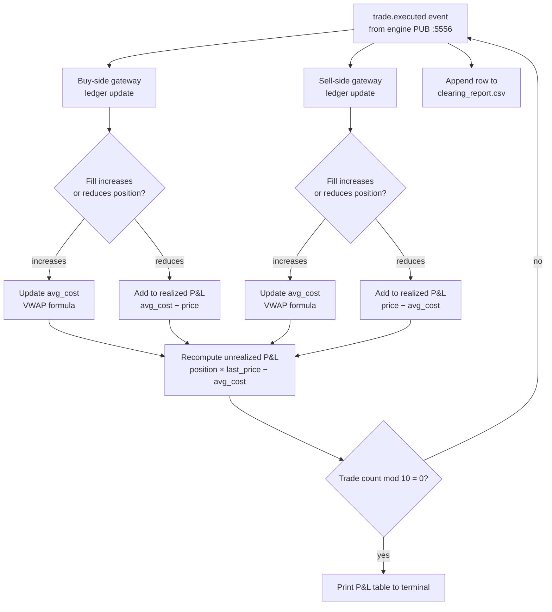

# P&L & Clearing

!!! note "Learning objectives"
    After reading this page you will understand:

    - What P&L and clearing mean in an exchange context
    - How long and short positions are tracked
    - How VWAP average cost is calculated when building a position
    - The difference between realized and unrealized P&L
    - How to read the P&L output from `pm-clearing`

    **Prerequisite**: Complete [Your First Trade](../concepts/04-concepts-first-trade.md) — seeing
    P&L update in real time makes the formulas on this page much more concrete.

## What this page covers

**P&L** stands for **Profit and Loss** — the running tally of how much money
each trader has made or lost. **Clearing** is the process of settling trades
after they execute: confirming who owes what to whom, updating account
balances, and recording the transaction history.

In a real exchange, clearing involves counterparty risk management, margin
calls, and settlement cycles (T+1 or T+2). EduMatcher simplifies this to
real-time P&L accounting with no credit risk — every trade settles instantly.

The `pm-clearing` process acts as the financial settlement layer.
It subscribes to every `trade.executed` event and maintains a running
**P&L ledger per user (gateway) per symbol**. Each gateway represents one
trader; the clearing process tracks their positions independently.

### Starting the clearing process

```bash
pm-clearing
```

No arguments are required. The process connects to the engine's PUB socket
(port 5556) and begins tracking P&L immediately. Start it before or after
trading begins — it will pick up all trades from the moment it subscribes.


## Position Tracking

A **position** is the net quantity of shares you currently hold in a given
symbol. If you bought 100 and then sold 40, your position is +60 (you still
own 60 shares). Positions can be:

- **Long** (positive): you own shares and profit when the price rises.
- **Short** (negative): you sold shares you don't own (borrowed) and profit
  when the price falls.
- **Flat** (zero): no exposure.

For each `(gateway_id, symbol)` pair the clearing process tracks:

| Field            | Description                                                           |
|------------------|-----------------------------------------------------------------------|
| `position`       | Net quantity held. Positive = long, negative = short, zero = flat.    |
| `avg_cost`       | Volume-weighted average entry price (explained below).                |
| `realized_pnl`   | Accumulated profit/loss from trades that reduced the position.        |
| `unrealized_pnl` | Paper profit/loss on the remaining open position (not yet locked in). |


## VWAP Average Cost

When you build a position through multiple trades at different prices, what
is your "average entry price"? The answer is the **volume-weighted average
price (VWAP)**: each trade contributes to the average proportional to its
size.

The average cost is updated whenever a fill *increases* the existing position
(buying more when already long, or selling more when already short):

$$
\text{avg\_cost}_\text{new} = \frac{\text{avg\_cost}_\text{old} \times \lvert \text{position}_\text{old} \rvert + \text{fill\_price} \times \text{fill\_qty}}{\lvert \text{position}_\text{new} \rvert}
$$


## Realized P&L

**Realized P&L** is profit or loss that is "locked in" — it comes from
trades that **reduce** your position. Once you sell shares you were holding
(or buy back shares you were short), the difference between your average
entry price and your exit price becomes realized profit or loss. It cannot
change after the fact.

Realized P&L is computed when a fill **reduces** the current position
(closing or reversing):

**Long position (reducing):**
$$
\text{realized} += (\text{fill\_price} - \text{avg\_cost}) \times \text{reduce\_qty}
$$

**Short position (reducing):**
$$
\text{realized} += (\text{avg\_cost} - \text{fill\_price}) \times \text{reduce\_qty}
$$


## Unrealized P&L

**Unrealized P&L** (also called "paper profit/loss") is the theoretical
profit or loss on your *remaining open position* if you were to close it
right now at the current market price. It fluctuates with every new trade
in the market — nothing is locked in until you actually trade.

Recomputed on every event using the last trade price as the **mark price**
(the reference price used to value the position):

$$
\text{unrealized} = \text{position} \times (\text{last\_price} - \text{avg\_cost})
$$

For a short position, `position` is negative, so a price fall produces positive unrealized P&L.


## Example

| Step | Action | Position | Avg Cost | Last Price | Realized | Unrealized |
|------|--------|----------|----------|------------|----------|------------|
| 1 | Buy 100 @ 150.00 | +100 | 150.00 | 150.00 | 0.00 | 0.00 |
| 2 | Buy 100 @ 152.00 | +200 | 151.00 | 152.00 | 0.00 | +200.00 |
| 3 | Sell 150 @ 155.00 | +50  | 151.00 | 155.00 | +600.00 | +200.00 |
| 4 | Sell 50 @ 149.00  | 0    | —      | 149.00 | +500.00 | 0.00 |


## P&L Table Display

The clearing process prints a rich table:

- Every **10 trades** automatically
- On **Ctrl-C** exit (final summary)

Columns: `Gateway | Symbol | Position | Avg Cost | Last Price | Realized | Unrealized | Total P&L`

Positive P&L is shown in green, negative in red.

Example terminal output:

```
┌────────┬───────┬──────────┬──────────┬────────────┬───────────┬─────────────┬────────────┐
Gateway Symbol  Position  Avg Cost  Last Price   Realized  Unrealized  Total P&L
├────────┼───────┼──────────┼──────────┼────────────┼───────────┼─────────────┼────────────┤
GW01    AAPL    +50       151.00    155.00       +600.00   +200.00     +800.00
GW02    AAPL    -50       151.00    155.00       -600.00   -200.00     -800.00
GW01    MSFT    0         —         143.25       +125.00   0.00        +125.00
└────────┴───────┴──────────┴──────────┴────────────┴───────────┴─────────────┴────────────┘
```


## P&L Update Flow



## clearing_report.csv

Every trade is appended to `data/clearing_report.csv`:

```
trade_id,symbol,buy_order_id,sell_order_id,buy_gateway,sell_gateway,price,quantity,timestamp
abc123,AAPL,ord-aaa,ord-bbb,GW01,GW02,150.50,100,2026-04-29T14:32:01.123
```

| Column          | Description                                      |
|-----------------|--------------------------------------------------|
| `trade_id`      | Engine-assigned unique trade identifier          |
| `symbol`        | Traded instrument symbol                         |
| `buy_order_id`  | Order ID of the resting or aggressing buy order  |
| `sell_order_id` | Order ID of the resting or aggressing sell order |
| `buy_gateway`   | Gateway ID of the buyer                          |
| `sell_gateway`  | Gateway ID of the seller                         |
| `price`         | Execution price (decimal)                        |
| `quantity`      | Executed quantity                                |
| `timestamp`     | ISO 8601 timestamp of the trade                  |

This file persists across restarts — it is never truncated, giving a complete history
of all trades for the day.


## Notes

- P&L is **informational only** — no margin checks or risk limits are applied.
- Both sides of every trade (buyer and seller) have their ledgers updated independently.
- The `last_price` used for unrealized P&L is the most recent trade price for that symbol.

## Quick-reference: P&L formulas

| Metric | Formula | When computed |
|---|---|---|
| **Avg cost** (building position) | $\frac{\text{old\_avg} \times \lvert\text{old\_pos}\rvert + \text{fill\_price} \times \text{fill\_qty}}{\lvert\text{new\_pos}\rvert}$ | Fill increases position |
| **Realized P&L** (long closing) | $(\text{fill\_price} - \text{avg\_cost}) \times \text{reduce\_qty}$ | Sell reduces a long position |
| **Realized P&L** (short closing) | $(\text{avg\_cost} - \text{fill\_price}) \times \text{reduce\_qty}$ | Buy reduces a short position |
| **Unrealized P&L** | $\text{position} \times (\text{last\_price} - \text{avg\_cost})$ | After every trade event |
| **Total P&L** | $\text{realized} + \text{unrealized}$ | Always |

## See also

- [Processes](10-processes.md#pm-clearing-clearing-pl) — how `pm-clearing` connects to the engine and what it subscribes to
- [Persistence](11-persistence.md#other-persistent-files) — `clearing_report.csv` across sessions
- [Order Types](04-order-types.md) — which fills produce P&L events
- [Messages](09-messages.md) — `trade.executed` message fields consumed by `pm-clearing`
