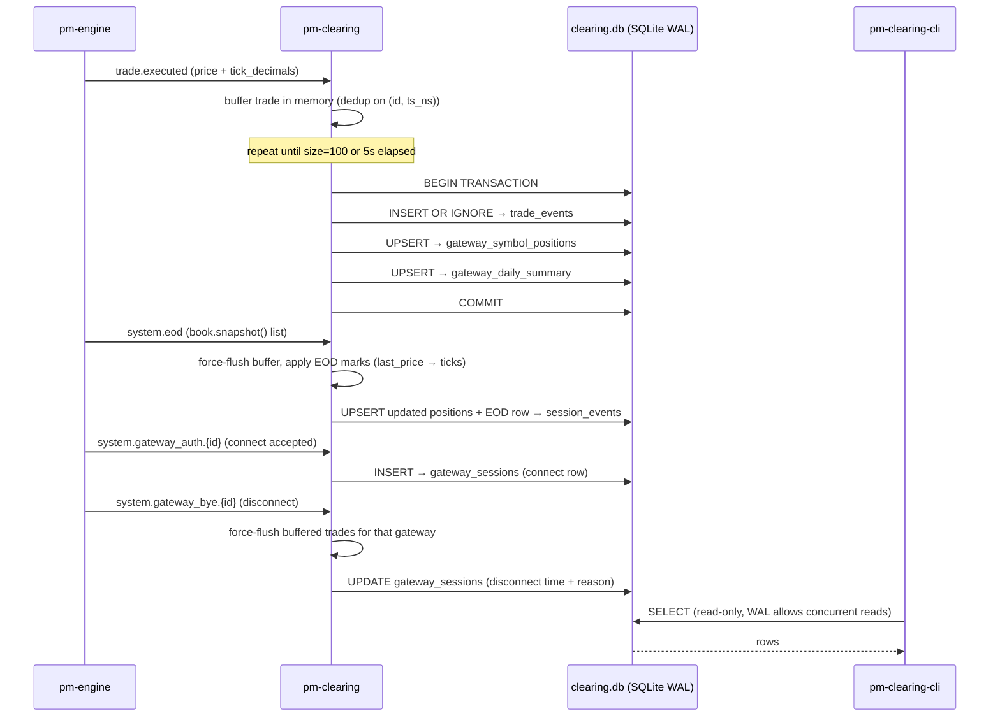
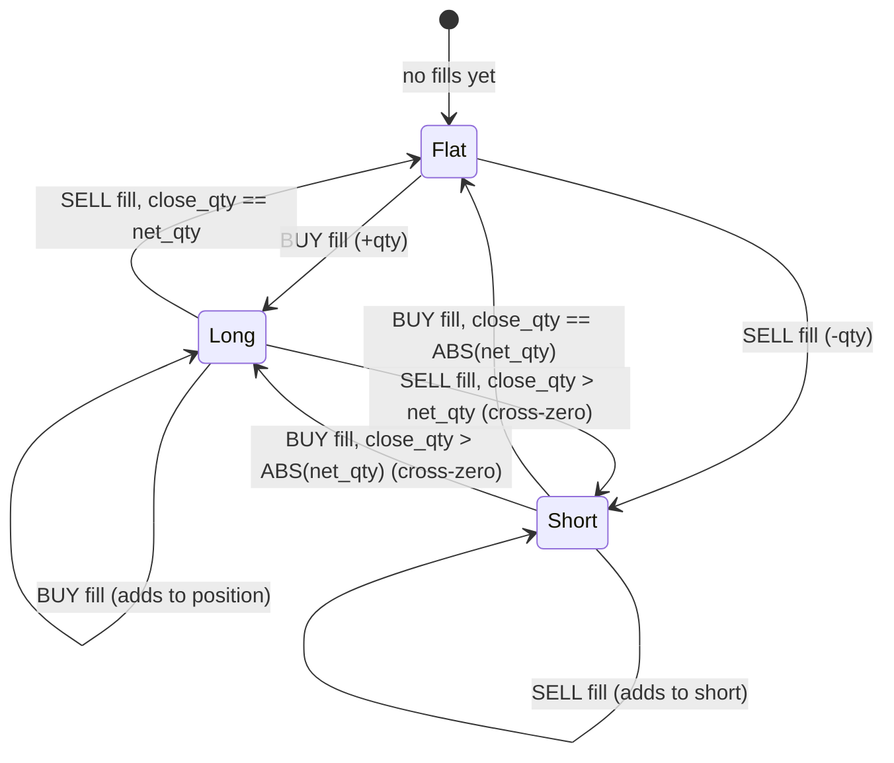

# P&L & Clearing

!!! note "Learning objectives"
    After reading this page you will understand:

    - What P&L and clearing mean in an exchange context
    - How long and short positions are tracked and how VWAP average cost works
    - The difference between realized and unrealized P&L
    - How the `pm-clearing` process subscribes to trade and lifecycle events
    - The SQLite database schema and what each table stores
    - How to query clearing data using every `pm-clearing-cli` command verb
    - How to inspect end-of-day marks and gateway session history
    - A practical cookbook for answering clearing-house questions from the command line

    **Prerequisite**: Complete [Your First Trade](../concepts/04-concepts-first-trade.md).


## What this page covers

**P&L** stands for **Profit and Loss** — the running tally of how much money
each trader has made or lost. **Clearing** is the process of settling trades
after they execute: confirming who owes what to whom, updating account
balances, and recording the transaction history.

In a real exchange, clearing involves counterparty risk management, margin
calls, and settlement cycles (T+1 or T+2). EduMatcher simplifies this to
real-time P&L accounting with no credit risk — every trade settles instantly.

EduMatcher v2 uses a **two-component clearing system**:

| Component | Role |
|-----------|------|
| `pm-clearing` | Long-running subscriber — reads every `trade.executed` event, maintains in-memory positions and P&L, and writes batched results to `clearing.db` (SQLite) |
| `pm-clearing-cli` | One-shot query tool — reads from `clearing.db` and prints human-friendly or machine-readable output without SQL |


## Starting the clearing process

```bash
pm-clearing
```

No arguments are required. The process connects to the engine's PUB socket
(port 5556), creates or opens `data/clearing.db`, and begins tracking P&L.
It can be started before or after trading begins — it will pick up all trades
from the moment it subscribes.

**Warm start on restart.** If `clearing.db` already contains positions,
`pm-clearing` rebuilds its in-memory ledger from `gateway_symbol_positions`
before it subscribes, so a restart *accumulates* onto the durable position
state instead of resetting every position to flat and overwriting it. This
means `pm-clearing` can be stopped and restarted mid-session without corrupting
positions or P&L.

### Message flow



### Optional arguments

```text
pm-clearing [OPTIONS]

  --datapath PATH        Data directory or explicit .db file path
  --db-name NAME         SQLite filename within data dir (default: clearing.db)
  --flush-size N         Max buffered trades before flush (1..100, default: 100)
  --flush-interval SEC   Max seconds between flushes (>=0.1, default: 5)
  --print-every N        Print P&L summary every N trades (0 = never, default: 100)
  --retention-days N     Prune trade_events rows older than N days on startup
                         (default: 90; use 0 to disable startup pruning)
  --timezone TZ          Exchange session timezone (IANA name, e.g.
                         America/New_York) used to bucket trades into a
                         trading day (default: UTC)
  --version              Show version and exit
  --help                 Show help and exit
```

!!! note "Trade-date bucketing and the session timezone"
    Each trade is assigned a `trade_date` (used by `gateway_daily_summary`,
    the `daily`/`dates` verbs, and the EOD row) based on the calendar day of
    its timestamp in the `--timezone` you pass. The default is UTC. Set it to
    the exchange's local timezone so an evening session — or any session that
    straddles 00:00 UTC — stays in a single `trade_date` bucket instead of
    being split across two days.

### What pm-clearing subscribes to

`pm-clearing` subscribes to these topics on the engine PUB socket:

| Topic | Required | Action |
|---|---|---|
| `trade.executed` | Yes | De-duplicate on `(id, ts_ns)`, buffer, apply to ledger, batch-write to DB |
| `system.eod` | No (secondary) | Force-flush, apply EOD marks from the book snapshot, write `session_events` row |
| `system.gateway_auth.{id}` | No (secondary) | Record a `gateway_sessions` connect row when a gateway's auth is accepted |
| `system.gateway_bye.{id}` | No (secondary) | Force-flush that gateway's trades, update the `gateway_sessions` row with the disconnect |

The secondary subscriptions add contextual information without affecting the core
P&L accuracy. If they are not received (for example, engine was killed hard
rather than gracefully shut down), position data is still complete.

!!! note "Gateway lifecycle is read from the PUB broadcasts"
    `system.gateway_connect` / `system.gateway_disconnect` are **gateway → engine**
    messages on the engine's PULL socket — they are never seen by a PUB
    subscriber. The engine broadcasts the corresponding lifecycle events on PUB
    as `system.gateway_auth.{id}` (on connect) and `system.gateway_bye.{id}`
    (on disconnect), and `pm-clearing` records sessions from those. The inbound
    topic names are still accepted for direct-injection tooling and tests.

#### `system.eod` — end-of-day finalisation

On receipt, `pm-clearing`:

1. **Force-flushes** any buffered trades immediately, bypassing the 100-trade
   and 5-second thresholds.
2. Applies EOD **mark-to-market**. The `system.eod` message carries a list of
   `book.snapshot()` dicts, so `pm-clearing` reads each book's `last_price`
   (a display price) — or the top-of-book `bids[0]`/`asks[0]` mid when no trade
   occurred — and converts it to integer ticks with `to_ticks(...)` to update
   `mark_price` and `unrealized_pnl` in every open position.
3. Writes the updated positions to `gateway_symbol_positions` so
   `gateway_daily_summary.end_unrealized_pnl` reflects the official EOD mark.
4. Inserts an `EOD` sentinel row into `session_events` with the timestamp and
   the mark prices applied (in ticks). This lets `pm-clearing-cli eod` report
   exact session-close times.

#### `system.gateway_auth.{id}` / `system.gateway_bye.{id}` — gateway lifecycle

On an **accepted connect** (`system.gateway_auth.{id}` with `accepted=true`),
`pm-clearing` inserts a row into `gateway_sessions` recording `gateway_id` and
the ingestion timestamp; a refused auth opens no session. On **disconnect**
(`system.gateway_bye.{id}`), it updates that row with `disconnected_at_ns` and
the disconnect reason, and immediately force-flushes any buffered trades for the
disconnecting gateway so no fill is lost before the engine processes its order
cancellations.


## Data folder location

`pm-clearing` writes to `clearing.db` in the same data directory used by
all other EduMatcher processes:

| Running mode | Default location | Override |
|---|---|---|
| Source checkout | `<repo>/src/data/clearing.db` | `EDUMATCHER_DATA_DIR` |
| Installed (`pipx`) | `~/.local/share/edumatcher/clearing.db` | `EDUMATCHER_DATA_DIR` |

Pass `--datapath` to use a different directory or file:

```bash
# Use a custom directory
pm-clearing --datapath ~/trading/sessions/morning

# Use an explicit db file
pm-clearing --datapath ~/trading/clearing_2026.db
```


## SQLite database schema

`pm-clearing` creates and maintains five tables and two views in `clearing.db`.
All tables are created idempotently on startup so the same DB file can be
re-opened safely across process restarts.

### Table overview

| Table | Purpose |
|---|---|
| `trade_events` | Append-only fact table; one row per `trade.executed` event |
| `gateway_symbol_positions` | Running position state; one row per `(gateway_id, symbol)` |
| `gateway_daily_summary` | Daily rollup aggregates; one row per `(trade_date, gateway_id, symbol)` |
| `session_events` | Clearing-significant events (`EOD`, plus `GAP` and `ID_COLLISION` integrity alarms) |
| `gateway_sessions` | Gateway connect / disconnect history |

### `trade_events`

Append-only audit log. Populated by `pm-clearing` from `trade.executed` using
`INSERT OR IGNORE`, idempotent on the composite key `(id, ts_ns)`.

The engine's trade `id` is a per-process counter that restarts from `1` on
every engine launch, so it is **not** globally unique — a second engine run
re-issues ids `1, 2, 3, …`. Keying the archive on `(id, ts_ns)` keeps every
execution: a genuine duplicate delivery repeats both fields and is de-duplicated,
while a reused id from a later run carries a different timestamp and is preserved
as a distinct row. When an incoming id collides with an already-stored row that
has a *different* timestamp, `pm-clearing` also writes an `ID_COLLISION` alarm
to `session_events` rather than silently dropping the row.

| Column | Type | Description |
|---|---|---|
| `id` | TEXT | Engine trade id — unique only *within* one engine run (part of the composite primary key `(id, ts_ns)`) |
| `ts_ns` | INTEGER | Engine event timestamp in nanoseconds (part of the composite primary key) |
| `trade_date` | TEXT | Session-timezone date (`YYYY-MM-DD`) derived from `ts_ns` (default UTC; see `--timezone`) |
| `symbol` | TEXT | Instrument symbol |
| `quantity` | INTEGER | Matched trade size |
| `price` | INTEGER | Execution price in ticks |
| `tick_decimals` | INTEGER | Symbol precision (`10^-d`) |
| `buy_order_id` | TEXT | Buy-side order reference |
| `sell_order_id` | TEXT | Sell-side order reference |
| `buy_gateway_id` | TEXT | Gateway credited with the buy fill |
| `sell_gateway_id` | TEXT | Gateway credited with the sell fill |
| `aggressor_side` | TEXT | `BUY`, `SELL`, or NULL |
| `ingest_ts_ns` | INTEGER | Ingestion timestamp (local wall clock) |

Retention: rows older than `--retention-days` (default 90) are deleted on
startup and on demand via `pm-clearing-cli prune`.

### `gateway_symbol_positions`

Live running state for every `(gateway_id, symbol)` key seen so far.
Upserted on every flush (`INSERT … ON CONFLICT(gateway_id, symbol) DO UPDATE`).
On startup, `pm-clearing` warm-starts its in-memory ledger from this table (see
[Warm start on restart](#starting-the-clearing-process)), so a restart resumes
from the persisted positions rather than overwriting them from flat.

| Column | Type | Description |
|---|---|---|
| `gateway_id` | TEXT | Gateway identifier |
| `symbol` | TEXT | Instrument symbol |
| `net_qty` | INTEGER | Signed net quantity (+ long, − short) |
| `avg_cost` | REAL | VWAP average entry cost (display units) |
| `realized_pnl` | REAL | Cumulative realized P&L (display units) |
| `unrealized_pnl` | REAL | Current open mark-to-market (display units) |
| `mark_price` | INTEGER | Latest trade price in ticks; updated on `system.eod` if enabled |
| `tick_decimals` | INTEGER | Precision for this symbol |
| `buy_qty` | INTEGER | Cumulative buy-side filled quantity |
| `sell_qty` | INTEGER | Cumulative sell-side filled quantity |
| `buy_notional` | INTEGER | Cumulative buy-side notional in ticks |
| `sell_notional` | INTEGER | Cumulative sell-side notional in ticks |
| `last_trade_ts_ns` | INTEGER | Latest trade timestamp for this key |
| `updated_ts_ns` | INTEGER | Flush timestamp |

### `gateway_daily_summary`

Daily incremental aggregates. Updated in the same transaction as
`gateway_symbol_positions`.

| Column | Type | Description |
|---|---|---|
| `trade_date` | TEXT | Session-timezone date (`YYYY-MM-DD`); default UTC (see `--timezone`) |
| `gateway_id` | TEXT | Gateway identifier |
| `symbol` | TEXT | Instrument symbol |
| `traded_qty` | INTEGER | Daily total filled quantity for this key |
| `traded_notional` | INTEGER | Daily total notional in ticks |
| `buy_qty` | INTEGER | Daily buy-side filled quantity |
| `sell_qty` | INTEGER | Daily sell-side filled quantity |
| `buy_notional` | INTEGER | Daily buy-side notional in ticks |
| `sell_notional` | INTEGER | Daily sell-side notional in ticks |
| `net_amount` | INTEGER | `buy_notional − sell_notional` |
| `realized_pnl` | REAL | Daily realized P&L contribution |
| `end_net_qty` | INTEGER | Net quantity at last flush for this date |
| `end_avg_cost` | REAL | Average cost at last flush |
| `end_unrealized_pnl` | REAL | Unrealized P&L at last flush; updated by `system.eod` mark pass |
| `tick_decimals` | INTEGER | Symbol precision |
| `last_trade_ts_ns` | INTEGER | Latest trade timestamp |
| `updated_ts_ns` | INTEGER | Flush timestamp |

### `session_events`

Append-only log of clearing-significant events. Three event types are written:

| `event_type` | Written when | `payload_json` |
|---|---|---|
| `EOD` | `system.eod` received on graceful engine shutdown | `{"eod_marks": {symbol: price_ticks, ...}, "symbols_count": N}` |
| `GAP` | The engine's trade-id sequence jumps forward, i.e. the lossy PUB feed dropped one or more trades | `{"last_seq": L, "next_seq": N, "missing_trades": M}` |
| `ID_COLLISION` | An incoming trade id matches a stored row with a *different* timestamp (engine-restart id reuse) | `{"id": ..., "new_ts_ns": ..., "existing_ts_ns": [...]}` |

| Column | Type | Description |
|---|---|---|
| `id` | INTEGER (autoincrement) | Surrogate key |
| `event_type` | TEXT | `EOD`, `GAP`, or `ID_COLLISION` |
| `ts_ns` | INTEGER | Ingestion timestamp |
| `trade_date` | TEXT | Session-timezone date derived from `ts_ns` (default UTC) |
| `payload_json` | TEXT | Event-specific JSON (see table above) |

`EOD` rows are surfaced by `pm-clearing-cli eod`. `GAP` and `ID_COLLISION` are
durable integrity alarms — they are recorded so a dropped-trade or id-reuse
event is visible after the fact rather than silently corrupting positions; query
them directly from `session_events` by `event_type`.

### `gateway_sessions`

One row per accepted gateway connection. Updated with disconnect time when the
engine's `system.gateway_bye.{id}` broadcast is received.

| Column | Type | Description |
|---|---|---|
| `gateway_id` | TEXT | Gateway identifier |
| `connected_at_ns` | INTEGER | Ingestion timestamp of connect event |
| `disconnected_at_ns` | INTEGER | Ingestion timestamp of disconnect; NULL if session still open |
| `disconnect_reason` | TEXT | Reason string from disconnect message; NULL if not provided |

Query with `pm-clearing-cli sessions`.


## Position tracking

For each `(gateway_id, symbol)` pair, `pm-clearing` tracks:

| Field | Description |
|---|---|
| `net_qty` | Net quantity held. Positive = long, negative = short, zero = flat. |
| `avg_cost` | Volume-weighted average entry price (VWAP). |
| `realized_pnl` | Accumulated P&L from trades that reduced the position. |
| `unrealized_pnl` | Paper P&L on the remaining open position. |
| `mark_price` | Latest observed trade price, used to value the open position. |

### Position state machine



Realized P&L is calculated on every state transition that reduces an open position.


## VWAP average cost

When you build a position through multiple trades at different prices, the
**volume-weighted average price (VWAP)** gives your blended entry cost:

$$
\text{avg\_cost}_\text{new} = \frac{\text{avg\_cost}_\text{old} \times \lvert \text{net\_qty}_\text{old} \rvert + \text{fill\_price} \times \text{fill\_qty}}{\lvert \text{net\_qty}_\text{new} \rvert}
$$

This is recalculated on every fill that increases an existing position.


## Realized P&L

**Realized P&L** is profit or loss that is locked in — it comes from trades
that **reduce** your position.

**Closing a long position (via SELL):**
$$
\text{realized} += (\text{fill\_price} - \text{avg\_cost}) \times \text{closed\_qty}
$$

**Closing a short position (via BUY):**
$$
\text{realized} += (\text{avg\_cost} - \text{fill\_price}) \times \text{closed\_qty}
$$

When a fill crosses zero (e.g. closes a 100-share long and opens a 30-share
short in one trade), P&L is realized on the full close and `avg_cost` is
reset to the fill price for the new-side position.


## Unrealized P&L

**Unrealized P&L** is the theoretical value of the remaining open position
at the current mark price:

$$
\text{unrealized} = \text{net\_qty} \times (\text{mark\_price} - \text{avg\_cost})
$$

For a short position `net_qty` is negative, so a falling mark price produces
positive unrealized P&L.


## Worked example

| Step | Event | Calculation | net_qty | avg_cost | realized_pnl |
|---|---|---|---|---|---|
| 1 | BUY 10 @ 100 | Open long | +10 | 100.00 | 0 |
| 2 | BUY 10 @ 110 | Add to long. avg = (1000+1100)/20 | +20 | 105.00 | 0 |
| 3 | SELL 20 @ 115 | Full close. realized = (115−105)×20 | 0 | 0 | 200 |
| 4 | SELL 15 @ 108 | Cross-zero from flat → open short | −15 | 108.00 | 200 |
| 5 | BUY 20 @ 105 | Close 15 short, open 5 long. realized += (108−105)×15 | +5 | 105.00 | 245 |


## Position arithmetic in depth

This section walks through every position transition step by step, starting
from scratch. It is written for readers who find the formulas above abstract
or who are puzzled by how cross-zero trades work internally.

### What a position actually is

A position is EduMatcher's record of three things for every `(gateway_id, symbol)` pair:

1. **How many units are currently held** (`net_qty`) — positive means long (you own them), negative means short (you owe them), zero means flat (no exposure).
2. **At what blended price they were acquired** (`avg_cost`) — the VWAP of all fills that built the current open position.
3. **How much profit has already been locked in** (`realized_pnl`) — gains and losses from fills that *reduced* the position.

Every `trade.executed` message produces exactly two fill applications: one crediting the buyer's gateway and one crediting the seller's. Each application runs through the same position-update logic described below.

### The four fill outcomes

There are four things that can happen when a fill is applied to a position:

| Outcome | When it happens | Effect on avg_cost | Realized P&L? |
|---|---|---|---|
| **Open** | position is flat | set to fill price | No |
| **Add** | fill is same direction as existing position | recalculated (VWAP) | No |
| **Reduce / Close** | fill opposes existing position, does not exceed it | unchanged | Yes, on closed qty |
| **Cross-zero** | fill opposes existing position and exceeds it | reset to fill price (for new side) | Yes, on closed qty only |


### Opening a position (flat → long or flat → short)

When `net_qty = 0`, the position is flat and any fill simply opens it.

**Example — BUY 10 @ 100:**

```
Before:  net_qty = 0,  avg_cost = 0.00,  realized_pnl = 0

Step 1:  net_qty  = 0 + 10 = 10
Step 2:  avg_cost = 100.00      (fill price becomes the entry cost)

After:   net_qty = +10,  avg_cost = 100.00,  realized_pnl = 0
```

Nothing is realized here. You now own 10 units at an average cost of 100.


### Adding to an existing position (VWAP update)

When a fill is in the **same direction** as the current position — buying while already long, or selling while already short — the position grows and `avg_cost` is recalculated as a volume-weighted average.

**Example — BUY 10 @ 110 (already long 10 @ 100):**

```
Before:  net_qty = +10,  avg_cost = 100.00

existing_notional = 100.00 × 10 = 1,000
incoming_notional = 110.00 × 10 = 1,100

net_qty  = 10 + 10 = 20
avg_cost = (1,000 + 1,100) / 20 = 105.00

After:   net_qty = +20,  avg_cost = 105.00,  realized_pnl = 0
```

The VWAP of 105 reflects the blended cost of all 20 shares: 10 bought at 100
and 10 bought at 110.


### Reducing a position (partial or full close)

When a fill **opposes** the current position but does not exceed it in
size, the position shrinks. P&L is realized on the closed portion only.
`avg_cost` is **not** changed — it reflects your entry basis and stays fixed
until you either go flat or cross zero.

**Example — SELL 5 @ 115 (long 20 @ 105):**

```
Before:  net_qty = +20,  avg_cost = 105.00,  realized_pnl = 0

close_qty = min(5, 20) = 5

realized_delta = (fill_price − avg_cost) × close_qty
               = (115 − 105) × 5 = 50

net_qty = 20 − 5 = 15          (still long)
avg_cost unchanged at 105.00   (entry basis of remaining shares)

After:   net_qty = +15,  avg_cost = 105.00,  realized_pnl = 50
```

The $50 is now permanent regardless of what price does next.

**Full close — SELL 15 @ 115 (long 15 @ 105):**

```
close_qty = min(15, 15) = 15

realized_delta = (115 − 105) × 15 = 150

net_qty  = 15 − 15 = 0
avg_cost = 0.00    (reset to zero when flat)

After:   net_qty = 0,  avg_cost = 0.00,  realized_pnl = 200
```

Position is flat. `avg_cost` resets to zero because there is nothing left to
track an entry basis against.


### Cross-zero: the confusing case

**Cross-zero** happens when a single fill is large enough to close the entire
existing position *and* still have excess quantity left over, which opens a
new position on the **opposite** side — all in one step.

Think of it as two things happening at once:

1. The fill closes the existing position (realizing P&L on the full open quantity).
2. The leftover quantity opens a brand-new position on the other side at the fill price.

#### Long-side example: SELL 25 @ 115 when long 15 @ 105

```
Before:  net_qty = +15,  avg_cost = 105.00,  realized_pnl = 0
```

**Step 1 — how much closes the long?**

```
open_qty  = abs(+15) = 15
close_qty = min(25, 15) = 15    ← only 15 units can close a 15-unit long
excess    = 25 − 15 = 10        ← these 10 open a new short
```

**Step 2 — realize P&L on the closed portion:**

```
realized_delta = (fill_price − avg_cost) × close_qty
               = (115 − 105) × 15 = 150
```

**Step 3 — update net_qty:**

```
net_qty = +15 + (−25) = −10    ← positive → zero → negative: crossed zero
```

**Step 4 — the position flipped sides, so reset avg_cost to the fill price:**

```
avg_cost = 115.00    ← entry cost of the new 10-unit short
```

**Final state:**

```
net_qty       = −10
avg_cost      = 115.00
realized_pnl  = 150
unrealized_pnl = −10 × (115 − 115) = 0   (mark = fill price, no gain yet)
```

The 10-unit short contributes *zero* realized P&L at this moment. Its P&L
will only become realized when a future buy reduces or closes it.

!!! note "Realized P&L is only for the closing portion"
    In a cross-zero fill, `close_qty = min(fill_qty, open_qty)` caps
    the realized calculation at the original position size. The excess
    quantity that opens the new side starts with zero realized P&L.
    This prevents double-counting: the new position's entry cost is the
    fill price, so any future P&L from it starts from that baseline.


#### Short-side example: BUY 30 @ 105 when short 20 @ 108

The mirror image applies when crossing zero from a short position.

```
Before:  net_qty = −20,  avg_cost = 108.00,  realized_pnl = 0
```

**Step 1 — how much closes the short?**

```
open_qty  = abs(−20) = 20
close_qty = min(30, 20) = 20
excess    = 30 − 20 = 10
```

**Step 2 — realize P&L on the short close:**

```
realized_delta = (avg_cost − fill_price) × close_qty
               = (108 − 105) × 20 = 60
```

For a short, falling price is profit, so the formula subtracts in the
opposite order: `avg_cost − fill_price`.

**Step 3 — update net_qty:**

```
net_qty = −20 + 30 = +10    ← negative → zero → positive: crossed zero
```

**Step 4 — reset avg_cost for new long:**

```
avg_cost = 105.00
```

**Final state:**

```
net_qty       = +10
avg_cost      = 105.00
realized_pnl  = 60
```


### How the code tells the three outcomes apart

When a fill opposes an existing position, the code applies `net_qty += signed_qty`
first, then reads the resulting sign to decide what happened:

| Scenario (long 15, SELL N) | `net_qty` after | Sign check result | Outcome |
|---|---|---|---|
| SELL 5 (partial close) | +10 | still positive, fill was SELL → no match | avg_cost unchanged, partial close |
| SELL 15 (full close) | 0 | zero → first `if net_qty == 0` branch fires | avg_cost reset to 0 |
| SELL 25 (cross-zero) | −10 | negative and fill was SELL → **match** | avg_cost reset to fill price |

The sign check reads: *"after the update, does `net_qty` agree with the fill direction?"* The only way that can be true when entering the reduce/close branch is if the fill exceeded the open quantity — i.e., it crossed zero.

Checking **after** the update is intentional and precise. Before the update, the position is on the opposing side by definition (that is the condition that got us into this branch). After the update, a sign that agrees with the fill direction is the unambiguous fingerprint of a cross-zero event.


### Unrealized P&L after every fill

After every fill — regardless of outcome — unrealized P&L is recalculated:

$$
\text{unrealized} = \text{net\_qty} \times (\text{mark\_price} - \text{avg\_cost})
$$

`mark_price` is set to the latest fill price after each trade. For a flat position (`net_qty = 0`) unrealized P&L is always zero.

For a **short** position `net_qty` is negative, so the formula naturally
produces positive unrealized P&L when the price falls below `avg_cost`:

```
net_qty = −10,  avg_cost = 115,  mark_price = 110
unrealized = −10 × (110 − 115) = −10 × (−5) = +50
```


### All five outcomes side by side

The table below shows a single gateway trading `AAPL` through all five
position transitions in sequence:

| # | Fill | open_qty before | close_qty | Outcome | net_qty | avg_cost | realized_pnl |
|---|---|---|---|---|---|---|---|
| 1 | BUY 10 @ 100 | 0 | — | Open long | +10 | 100.00 | 0 |
| 2 | BUY 10 @ 110 | — | — | Add (VWAP) | +20 | 105.00 | 0 |
| 3 | SELL 5 @ 115 | 20 | 5 | Partial close | +15 | 105.00 | 50 |
| 4 | SELL 15 @ 115 | 15 | 15 | Full close | 0 | 0.00 | 200 |
| 5 | SELL 15 @ 108 | 0 | — | Open short (from flat) | −15 | 108.00 | 200 |
| 6 | BUY 20 @ 105 | 15 | 15 | Cross-zero: close 15 short + open 5 long | +5 | 105.00 | 245 |

Row 6 is cross-zero: the BUY 20 closes 15 units of the short (realizing `(108−105)×15 = 45`) and opens a new 5-unit long at 105, accounting for the cumulative jump from 200 to 245.


## Using pm-clearing-cli

`pm-clearing-cli` provides verb-based access to all clearing data without writing SQL.
It always reads from the same `clearing.db` used by `pm-clearing`.
For a process-level command matrix and operational notes, see
[Processes — pm-clearing-cli](10-processes.md#pm-clearing-cli--clearing-query-cli).

```bash
pm-clearing-cli [GLOBAL_OPTIONS] <verb> [verb-options]

Global options:
  --datapath PATH      Data directory or explicit .db file path
  --db-name NAME       SQLite filename if datapath is a directory
  --format FMT         table | json | csv  (default: table)
  --no-header          Suppress CSV header row
  --raw-output         Disable normalization and show raw tick-unit values
  --version
  --help
```


### Command verb reference

| Verb | Primary source table | What it returns | Key options |
|---|---|---|---|
| `gateways` | `gateway_pnl_totals` view | One row per gateway with total realized, unrealized, and total P&L | `--gateway`, `--limit` |
| `positions` | `gateway_symbol_positions` | Live position state for every `(gateway, symbol)` key | `--gateway`, `--symbol`, `--limit` |
| `pnl` | `gateway_symbol_positions` | Realized / unrealized / total P&L, one row per `(gateway, symbol)` | `--gateway`, `--symbol`, `--limit` |
| `daily` | `gateway_daily_summary` | Daily rollup totals and end-of-day snapshots | `--gateway`, `--symbol`, `--date`, `--from`, `--to`, `--limit` |
| `trades` | `trade_events` | Raw trade-level audit log | `--gateway`, `--symbol`, `--date`, `--from`, `--to`, `--limit` |
| `exposure` | `gateway_symbol_positions` | Net and gross notional exposure, sorted by size | `--gateway`, `--symbol`, `--sort`, `--limit` |
| `symbols` | `gateway_daily_summary` + `gateway_symbol_positions` | Symbol-level cleared volume, notional, P&L, and open position | `--date`, `--from`, `--to`, `--sort`, `--limit` |
| `dates` | `trade_events` / `daily_exchange_totals` | Available trading dates; add `--with-totals` for per-date volume and net amount | `--gateway`, `--symbol`, `--from`, `--to`, `--with-totals`, `--limit` |
| `health` | Three tables + WAL pragma | Row counts, last trade timestamp, last flush timestamp, WAL mode | — |
| `reconcile` | `trade_events` vs `gateway_daily_summary` | Discrepancies between raw facts and aggregates (both sides), including keys present only in the summaries | `--gateway`, `--symbol`, `--from`, `--to`, `--retention-days` |
| `sessions` | `gateway_sessions` | Gateway connect and disconnect history written from the engine's `system.gateway_auth` / `system.gateway_bye` broadcasts | `--gateway`, `--from`, `--to`, `--connected-only`, `--limit` |
| `eod` | `session_events` | End-of-day sentinel rows written on `system.eod`, including mark prices applied | `--from`, `--to`, `--limit` |
| `prune` | `trade_events` | Deletes rows older than N days (default 90) and VACUUMs; write-access verb | `--days`, `--dry-run` |


### gateways — live gateway P&L totals

Returns the cumulative P&L and net position for every gateway that has traded. A clearing house uses this as the **top-level risk snapshot**: it answers "who is exposed and by how much" in a single query, without needing to filter by symbol or date.

| Option | Type | Default | Description |
|---|---|---|---|
| `--gateway GW_ID` | string | all gateways | Return only this gateway |
| `--limit N` | integer | 1000 | Maximum rows returned |
| `--format FMT` | `table`\|`json`\|`csv` | `table` | Output format |

```bash
# All gateways
pm-clearing-cli gateways

# One gateway
pm-clearing-cli gateways --gateway TRADER01

# Machine-readable output
pm-clearing-cli --format json gateways
```

Output fields: `gateway_id`, `realized_pnl_total`, `unrealized_pnl_total`,
`total_pnl`, `net_qty_total`

!!! note "Totals are in display currency"
    The P&L totals in the `gateway_pnl_totals` view are normalized to display
    currency *per symbol* before being summed, because one tick is worth a
    different amount at different `tick_decimals` (100 ticks is 1.00 at 2
    decimals but 0.01 at 4). This lets a gateway's totals combine symbols with
    different precisions correctly. The same applies to the per-date totals in
    `dates --with-totals`. Quantity columns (`net_qty_total`, `traded_qty_total`)
    are raw share counts and are not scaled.


### positions — current positions by gateway and symbol

Returns the full live position state for every `(gateway, symbol)` key. A clearing house uses this to **drill into the detail behind a gateway's aggregate P&L**: it shows exact quantities, average cost, mark price, and the breakdown between buy-side and sell-side notional, which is the starting point for any margin or exposure calculation.

| Option | Type | Default | Description |
|---|---|---|---|
| `--gateway GW_ID` | string | all | Filter to one gateway |
| `--symbol SYMBOL` | string | all | Filter to one symbol |
| `--limit N` | integer | 10 000 | Maximum rows returned |
| `--format FMT` | `table`\|`json`\|`csv` | `table` | Output format |
| `--raw-output` | flag | off | Show raw tick-unit values instead of display units |

```bash
# All positions
pm-clearing-cli positions

# One gateway, all symbols
pm-clearing-cli positions --gateway MM01

# One symbol across all gateways
pm-clearing-cli positions --symbol AAPL

# CSV export
pm-clearing-cli --format csv positions > positions.csv
```

Output fields include `net_qty`, `avg_cost`, `mark_price`, `tick_decimals`,
`realized_pnl`, `unrealized_pnl`, buy/sell quantities and notionals.

Price-derived fields in CLI output — including `avg_cost`, which renders in the
same display units as `mark_price` — are normalized using each row's
`tick_decimals` (table, JSON, and CSV formats). Use `--raw-output` to see the
underlying tick-unit values instead.


### pnl — realized/unrealized/total P&L

Returns a focused P&L view without the quantity and notional detail of `positions`. A clearing house uses this as a **daily P&L report**: compliance and risk officers can see at a glance which gateways or symbols are profitable, which are running losses, and whether unrealized exposure is within acceptable bounds.

| Option | Type | Default | Description |
|---|---|---|---|
| `--gateway GW_ID` | string | all | Filter to one gateway |
| `--symbol SYMBOL` | string | all | Filter to one symbol |
| `--limit N` | integer | 10 000 | Maximum rows returned |
| `--format FMT` | `table`\|`json`\|`csv` | `table` | Output format |

```bash
# Exchange-wide P&L
pm-clearing-cli pnl

# One gateway
pm-clearing-cli pnl --gateway TRADER01

# One symbol across all gateways
pm-clearing-cli pnl --symbol MSFT
```


### daily — daily rollup summaries

Returns per-day aggregates for every `(gateway, symbol)` key, including end-of-day position snapshots. A clearing house uses this for **day-end reconciliation and settlement records**: it provides the official closing quantities, average costs, and P&L figures that feed downstream reporting, fee calculation, and regulatory filings.

| Option | Type | Default | Description |
|---|---|---|---|
| `--gateway GW_ID` | string | all | Filter to one gateway |
| `--symbol SYMBOL` | string | all | Filter to one symbol |
| `--date YYYY-MM-DD` | date | — | Exact date match |
| `--from YYYY-MM-DD` | date | — | Inclusive start date |
| `--to YYYY-MM-DD` | date | — | Inclusive end date |
| `--limit N` | integer | 1 000 | Maximum rows returned |
| `--format FMT` | `table`\|`json`\|`csv` | `table` | Output format |

```bash
# Today's summary for all gateways
pm-clearing-cli daily --date 2026-07-05

# A date range
pm-clearing-cli daily --from 2026-07-01 --to 2026-07-05

# One gateway's week
pm-clearing-cli daily --gateway MM01 --from 2026-07-01 --to 2026-07-05

# JSON export for a spreadsheet
pm-clearing-cli --format json daily --date 2026-07-05 > daily_2026-07-05.json
```


### trades — raw trade events

Returns the append-only trade fact log exactly as captured from the engine. A clearing house uses this as the **primary audit and investigation tool**: it provides an immutable, timestamped record of every matched fill, which is the source of truth for dispute resolution, trade reconstruction, and regulatory trade reporting.

| Option | Type | Default | Description |
|---|---|---|---|
| `--gateway GW_ID` | string | all | Match either the buy-side or sell-side gateway |
| `--symbol SYMBOL` | string | all | Filter to one symbol |
| `--date YYYY-MM-DD` | date | — | Exact date match |
| `--from YYYY-MM-DD` | date | — | Inclusive start date |
| `--to YYYY-MM-DD` | date | — | Inclusive end date |
| `--limit N` | integer | 200 | Maximum rows returned |
| `--format FMT` | `table`\|`json`\|`csv` | `table` | Output format |
| `--raw-output` | flag | off | Show raw tick-unit prices instead of display units |

```bash
# All trades today
pm-clearing-cli trades --date 2026-07-05

# One symbol, paginated
pm-clearing-cli trades --symbol AAPL --limit 50

# Everything a gateway touched today
pm-clearing-cli trades --gateway TRADER07 --date 2026-07-05

# Date range
pm-clearing-cli trades --from 2026-07-01 --to 2026-07-05 --symbol MSFT
```

The `trades` verb includes `tick_decimals`; `price` is rendered in display
units using that precision for all output formats.


### exposure — net and gross notional exposure

Returns net and gross notional exposure ranked by size. A clearing house uses this for **real-time risk concentration monitoring**: large gross notional positions signal potential margin pressure, while a high gross-to-net ratio indicates a participant is running offsetting positions that could unwind rapidly.

| Option | Type | Default | Description |
|---|---|---|---|
| `--gateway GW_ID` | string | all | Filter to one gateway |
| `--symbol SYMBOL` | string | all | Filter to one symbol |
| `--sort FIELD` | string | `gross_notional` | Order rows; see allowed values below |
| `--limit N` | integer | 1 000 | Maximum rows returned |
| `--format FMT` | `table`\|`json`\|`csv` | `table` | Output format |

```bash
# Largest exposures first (default sort: gross_notional)
pm-clearing-cli exposure

# Sort by total P&L
pm-clearing-cli exposure --sort total_pnl

# One symbol
pm-clearing-cli exposure --symbol AAPL

# JSON for a risk dashboard
pm-clearing-cli --format json exposure > exposure.json
```

Allowed `--sort` values: `gross_notional`, `net_notional`, `realized_pnl`,
`unrealized_pnl`, `total_pnl`


### symbols — symbol-level clearing totals

Aggregates all gateways together to show exchange-wide traded volume, notional, and open interest per symbol. A clearing house uses this for **market-level overview and settlement totalling**: it answers which instruments drove the most activity and identifies symbols with large aggregate open positions that may carry overnight risk.

| Option | Type | Default | Description |
|---|---|---|---|
| `--date YYYY-MM-DD` | date | — | Restrict daily rollup to an exact date |
| `--from YYYY-MM-DD` | date | — | Inclusive start date for daily rollup |
| `--to YYYY-MM-DD` | date | — | Inclusive end date for daily rollup |
| `--sort FIELD` | string | `symbol` | Order rows; see allowed values below |
| `--limit N` | integer | 1 000 | Maximum rows returned |
| `--format FMT` | `table`\|`json`\|`csv` | `table` | Output format |

```bash
# All symbols traded
pm-clearing-cli symbols

# Sort by traded notional (descending)
pm-clearing-cli symbols --sort traded_notional

# Filter to one date
pm-clearing-cli symbols --date 2026-07-05
```

Allowed `--sort` values: `symbol`, `traded_qty`, `traded_notional`,
`realized_pnl`, `open_net_qty`


### dates — available trading dates

Lists every date for which clearing data exists in the DB. A clearing house uses this as an **index for date-range reporting**: before running a `daily` or `trades` query over a period, use `dates` to confirm which days have data and, with `--with-totals`, to get a quick exchange-wide volume summary per day without querying the full trade log.

| Option | Type | Default | Description |
|---|---|---|---|
| `--gateway GW_ID` | string | all | Restrict dates to those where this gateway traded |
| `--symbol SYMBOL` | string | all | Restrict dates to those where this symbol traded |
| `--from YYYY-MM-DD` | date | — | Inclusive start date |
| `--to YYYY-MM-DD` | date | — | Inclusive end date |
| `--with-totals` | flag | off | Add `traded_qty_total`, `traded_notional_total`, `net_amount_total` columns per date |
| `--limit N` | integer | 1 000 | Maximum rows returned |
| `--format FMT` | `table`\|`json`\|`csv` | `table` | Output format |

```bash
# List all dates in the DB
pm-clearing-cli dates

# With per-date volume and net amount
pm-clearing-cli dates --with-totals

# Filter by symbol
pm-clearing-cli dates --symbol AAPL

# Narrow date window with totals
pm-clearing-cli dates --from 2026-07-01 --to 2026-07-05 --with-totals
```


### health — DB metadata and freshness

Returns a single-row operational summary of the clearing database. A clearing house uses this as a **liveness and monitoring check**: it confirms that `pm-clearing` is actively writing, reports how many records are stored, and shows when the last flush occurred so operators can detect a stalled or disconnected clearing process before it causes a data gap.

| Option | Type | Default | Description |
|---|---|---|---|
| `--format FMT` | `table`\|`json`\|`csv` | `table` | Output format |

No filter options — `health` always returns a single summary row.

```bash
pm-clearing-cli health
```

Output fields: `db_path`, `trade_events_rows`, `gateway_symbol_positions_rows`,
`gateway_daily_summary_rows`, `last_trade_ts_ns`, `last_flush_ts_ns`, `wal_mode`


### reconcile — verify aggregate consistency (buy and sell sides)

Cross-checks raw `trade_events` fact totals against the pre-computed aggregates in `gateway_daily_summary` for both the buy side and the sell side. A clearing house uses this as a **data integrity gate**: it should return zero rows on a healthy DB, and any discrepancy identifies exactly which date, gateway, symbol, and direction has diverged — pointing directly to the rows that need investigation.

The comparison is a **full outer** one: it is driven by the union of keys on
*both* sides, so a `(date, gateway, symbol)` key that exists only in the
summaries — the shape produced when every raw row for a key is lost — is
reported rather than being invisible. Because `prune` removes raw rows while
keeping summaries, pass `--retention-days` (matching the `pm-clearing`
retention window) to ignore dates older than the raw-retention window and avoid
false positives for legitimately pruned days.

| Option | Type | Default | Description |
|---|---|---|---|
| `--gateway GW_ID` | string | both sides | Restrict to one gateway on either buy or sell side |
| `--symbol SYMBOL` | string | all | Restrict to one symbol |
| `--from YYYY-MM-DD` | date | — | Inclusive start date |
| `--to YYYY-MM-DD` | date | — | Inclusive end date |
| `--retention-days N` | integer | off | Ignore dates older than N days (match `pm-clearing --retention-days`) so pruned-raw days are not flagged |
| `--format FMT` | `table`\|`json`\|`csv` | `table` | Output format |

Output columns: `side` (`BUY` or `SELL`), `trade_date`, `gateway_id`, `symbol`,
`raw_qty`, `summary_qty`, `qty_diff`, `raw_notional`, `summary_notional`, `notional_diff`.

```bash
# Full reconciliation (both sides)
pm-clearing-cli reconcile

# Scope to one gateway or date range
pm-clearing-cli reconcile --gateway TRADER01
pm-clearing-cli reconcile --from 2026-07-01 --to 2026-07-05

# Ignore days older than the raw-retention window (avoids false positives
# for pruned days once trade_events has been pruned but summaries remain)
pm-clearing-cli reconcile --retention-days 90

# JSON output for automated checking
pm-clearing-cli --format json reconcile
```


### sessions — gateway connection and disconnection history

Returns the timeline of every gateway connection recorded by `pm-clearing` from the engine's `system.gateway_auth` (accepted connect) and `system.gateway_bye` (disconnect) broadcasts. A clearing house uses this for **participant access auditing**: it establishes exactly when each participant was active, how long they were connected, and whether a disconnect was clean or forced — context that is essential when investigating missing trades or unexpected position changes.

| Option | Type | Default | Description |
|---|---|---|---|
| `--gateway GW_ID` | string | all | Filter to one gateway |
| `--from YYYY-MM-DD` | date | — | Inclusive start date (matched on `connect_date`) |
| `--to YYYY-MM-DD` | date | — | Inclusive end date (matched on `connect_date`) |
| `--connected-only` | flag | off | Return only sessions where `disconnected_at_ns` is NULL |
| `--limit N` | integer | 500 | Maximum rows returned |
| `--format FMT` | `table`\|`json`\|`csv` | `table` | Output format |

```bash
# All sessions today
pm-clearing-cli sessions --from 2026-07-05

# History for one gateway
pm-clearing-cli sessions --gateway TRADER07

# Only currently-open sessions (no recorded disconnect)
pm-clearing-cli sessions --connected-only

# Date range
pm-clearing-cli sessions --from 2026-07-01 --to 2026-07-05

# JSON export
pm-clearing-cli --format json sessions > sessions.json
```

Output fields: `gateway_id`, `connect_date`, `connected_at_ns`,
`disconnected_at_ns`, `disconnect_reason`

!!! tip
    If a gateway has trades in `trade_events` but no row in `gateway_sessions`,
    `pm-clearing` was not running when the gateway's `system.gateway_auth`
    broadcast was published. Restart `pm-clearing` to start capturing session
    history going forward.


### eod — end-of-day sentinel events

Returns the end-of-day sentinel rows written to `session_events` when `pm-clearing` receives `system.eod` from a graceful engine shutdown. A clearing house uses this to **confirm official session close and validate end-of-day marks**: it answers exactly when the day closed, which mark prices were applied to all open positions at that moment, and provides the authoritative reference point for overnight P&L, margin calls, and daily settlement statements.

| Option | Type | Default | Description |
|---|---|---|---|
| `--from YYYY-MM-DD` | date | — | Inclusive start date |
| `--to YYYY-MM-DD` | date | — | Inclusive end date |
| `--limit N` | integer | 100 | Maximum rows returned |
| `--format FMT` | `table`\|`json`\|`csv` | `table` | Output format |

```bash
# Latest EOD markers
pm-clearing-cli eod

# Date range
pm-clearing-cli eod --from 2026-07-01 --to 2026-07-05

# Most recent session close
pm-clearing-cli eod --limit 1
```

Output fields: `id`, `event_type` (always `EOD`), `ts_ns`, `trade_date`,
`payload_json` (JSON object with `eod_marks` dict and `symbols_count`).

To extract the EOD mark prices for AAPL from the JSON payload:

```bash
pm-clearing-cli --format json eod --limit 1 \
  | python3 -c "
import json, sys
row = json.load(sys.stdin)[0]
marks = json.loads(row['payload_json'])['eod_marks']
print('AAPL EOD mark:', marks.get('AAPL', 'n/a'))
"
```

!!! note
    `EOD` rows are only written when `pm-clearing` receives `system.eod` from a
    graceful engine shutdown. If the engine was killed hard (e.g. `kill -9`),
    no EOD row is written and the positions retain the last intraday mark.


### prune — remove old raw trade events

Deletes `trade_events` rows older than the configured retention window and runs `VACUUM` to reclaim disk space. A clearing house uses this for **storage lifecycle management**: raw fill records accumulate indefinitely; periodic pruning keeps the DB file at a manageable size while preserving all aggregate tables (`gateway_daily_summary`, `gateway_symbol_positions`) that hold the long-running reporting value beyond the raw-event window.

!!! warning
    `prune` is the only write-access verb. It opens `clearing.db` in read/write mode
    and runs `DELETE` + `VACUUM`. It does not need `pm-clearing` to be stopped first
    because SQLite WAL mode allows concurrent writers, but for safety prefer running
    it during a quiet period.

| Option | Type | Default | Description |
|---|---|---|---|
| `--days N` | integer | 90 | Delete rows older than N days; minimum 1 |
| `--dry-run` | flag | off | Report how many rows would be deleted without deleting any |

```bash
# Delete rows older than 90 days and VACUUM
pm-clearing-cli prune

# Custom retention window
pm-clearing-cli prune --days 180

# See what would be deleted without deleting
pm-clearing-cli prune --dry-run
```

!!! tip
    `pm-clearing` also prunes automatically on startup, so manual pruning is
    rarely needed. Use `--dry-run` first if you are uncertain.


## Clearing cookbook — common questions and answers

### "What is our live P&L right now?"

```bash
pm-clearing-cli pnl
```

Or for a specific gateway:

```bash
pm-clearing-cli pnl --gateway TRADER01
```

### "Which gateways have the largest open exposure?"

```bash
pm-clearing-cli exposure --sort gross_notional --limit 10
```

### "Show me every trade TRADER07 did today"

```bash
pm-clearing-cli trades --gateway TRADER07 --date 2026-07-05
```

### "What was the total exchange volume and notional today?"

```bash
pm-clearing-cli daily --date 2026-07-05
```

Or for a date range, including net amounts:

```bash
pm-clearing-cli dates --from 2026-07-01 --to 2026-07-05 --with-totals
```

### "Which symbols generated the biggest P&L swings?"

```bash
pm-clearing-cli symbols --date 2026-07-05 --sort realized_pnl
```

### "Did clearing stop updating? When was the last flush?"

```bash
pm-clearing-cli health
```

Compare `last_flush_ts_ns` against the current time. If it is more than a few
minutes stale during active trading, `pm-clearing` may have stopped.

### "What was the official EOD mark for AAPL yesterday?"

```bash
pm-clearing-cli eod --from 2026-07-04 --to 2026-07-04
```

This returns the sentinel row written by `pm-clearing` on `system.eod`,
including the exact close timestamp and the `payload_json` field which
contains the EOD mark prices applied to each symbol.

### "When did TRADER07 connect and disconnect today?"

```bash
pm-clearing-cli sessions --gateway TRADER07 --from 2026-07-05
```

### "Which gateways were connected during today's session?"

```bash
pm-clearing-cli sessions --from 2026-07-05
```

### "Which gateways are currently connected (no recorded disconnect)?"

```bash
pm-clearing-cli sessions --connected-only
```

### "Why does TRADER07 have no trades today — was it ever connected?"

Run the session history first:

```bash
pm-clearing-cli sessions --gateway TRADER07 --from 2026-07-05
```

This tells you whether the gateway connected at all. If no rows are returned,
TRADER07 never authenticated. If a row is present with a rapid
`disconnected_at_ns`, the gateway was kicked mid-session. Then check trades:

```bash
pm-clearing-cli trades --gateway TRADER07 --date 2026-07-05
```

### "Export today's daily summary for the finance team"

```bash
pm-clearing-cli --format csv daily --date 2026-07-05 > clearing_2026-07-05.csv
```

### "Verify the database is internally consistent"

```bash
pm-clearing-cli reconcile
# OK — no discrepancies found.
```

If the reconcile output shows rows, contact the EduMatcher operations team.

### "How do I isolate per-session data?"

Set `EDUMATCHER_DATA_DIR` before starting:

```bash
export EDUMATCHER_DATA_DIR="$HOME/sessions/morning"
pm-clearing &
pm-clearing-cli pnl  # reads morning/clearing.db
```


## Notes

- P&L figures are **gross of transaction costs** — no fees or commissions are
  deducted.
- Bilateral netting (netting across multiple gateways controlled by the same
  participant) is not supported; P&L is tracked per individual gateway ID.
- Settlement date tracking (T+1/T+2) is not implemented; all positions are
  marked intraday.
- `mark_price` is the most recent `trade.executed` price for that symbol during
  a trading session. On graceful engine shutdown, `pm-clearing` updates
  `mark_price` to the official EOD `last_price` from the `system.eod` book
  snapshot (converted to ticks).
- Duplicate trade deliveries (retransmission or replay) are de-duplicated on
  `(id, ts_ns)` before they reach the ledger, so a replayed trade never
  double-counts a position; the archive and positions always agree.
- `pm-clearing` raises durable integrity alarms in `session_events`: a `GAP`
  row when the engine trade-id sequence jumps forward (the PUB feed dropped
  trades — they cannot be recovered without a replay feed, but the loss is no
  longer silent), and an `ID_COLLISION` row when an engine restart reuses a
  trade id.
- `session_events` and `gateway_sessions` are populated only if `pm-clearing`
  is running at the time the corresponding messages arrive. A hard engine kill
  produces no `EOD` row. Gateway sessions whose `system.gateway_auth` broadcast
  was published before `pm-clearing` was launched will not have a connect row.

## Quick-reference: P&L formulas

| Metric | Formula | When computed |
|---|---|---|
| **Avg cost** (adding to position) | $\frac{\text{old\_avg} \times \lvert\text{old\_qty}\rvert + \text{price} \times \text{qty}}{\lvert\text{new\_qty}\rvert}$ | Fill increases same-side position |
| **Realized P&L** (long closing) | $(\text{fill\_price} - \text{avg\_cost}) \times \text{close\_qty}$ | Sell reduces a long position |
| **Realized P&L** (short closing) | $(\text{avg\_cost} - \text{fill\_price}) \times \text{close\_qty}$ | Buy reduces a short position |
| **Unrealized P&L** | $\text{net\_qty} \times (\text{mark\_price} - \text{avg\_cost})$ | After every trade event |
| **Total P&L** | $\text{realized} + \text{unrealized}$ | Always |

## See also

- [Statistics and Reporting](16-statistics-and-reporting.md) — `pm-stats-cli` for market data queries
- [Audit Trail](26-audit.md) — `pm-audit-cli` for querying the full event log
- [Processes](10-processes.md) — how `pm-clearing` connects to the engine
- [Messages](09-messages.md) — `trade.executed` fields consumed by `pm-clearing`
- [Order Types](04-order-types.md) — which order types produce fills
