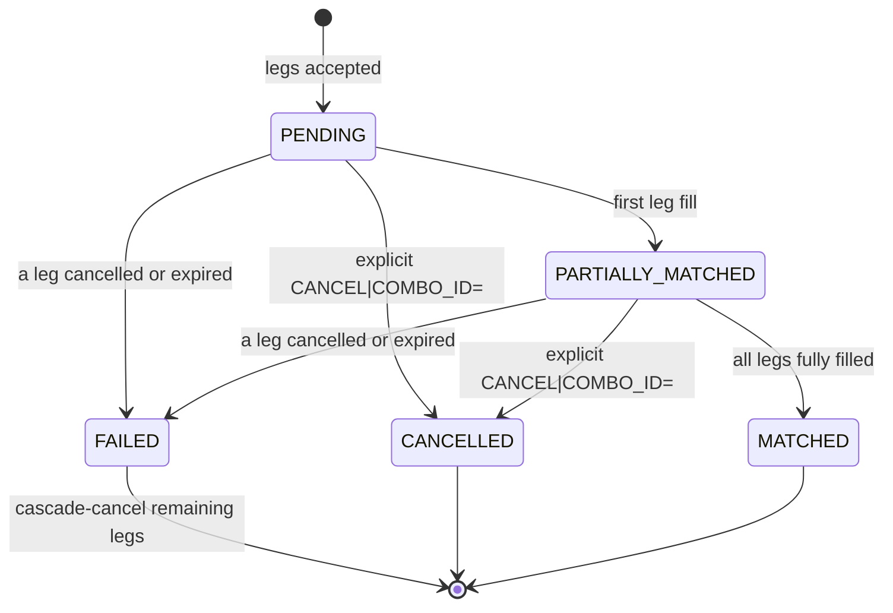

# Combo Orders

!!! note "Learning objectives"
    After reading this page you will understand:

    - Why single-leg orders are not enough for many real trading strategies, and
      what **leg risk** means in practice
    - How combo orders solve that problem by linking multiple child orders as a single
      atomic unit
    - The real-world strategies that require combos — from simple pairs trades to
      three-leg statistical arbitrage — explained without jargon
    - The extra complexity combos introduce: distributed state, cascade cancellation,
      fill-event hooks, and GTC persistence recovery
    - The advanced concept of **implied (synthetic) orders** — quotes the exchange
      itself computes from existing liquidity in related books — including the
      mathematics behind their price and quantity calculation


## What Is a Combo Order, and Why Would I Use One?

Imagine you are watching two tech stocks, MSFT and AAPL, and you have noticed
that whenever MSFT rises faster than AAPL the gap tends to close within a few
days.  You want to bet on that gap closing: buy MSFT, sell AAPL, at the same
moment.  If you type two separate orders — one buy, one sell — the market can
move between the two keystrokes.  The MSFT buy fills, AAPL doesn't, and you
are stuck owning something you didn't want to own alone.

That is called **leg risk**, and it is why combo orders exist.

A combo order bundles two or more orders into one instruction that the exchange
treats as a unit:

- All legs are submitted together.
- If the market cannot fill all of them, none fill.
- If any leg is later cancelled or expires, the exchange automatically cancels
  all the remaining legs for you.

### Three real-world situations where combos matter

**Situation 1 — You want to trade a relationship, not a direction.**
You do not care whether the stock market goes up or down today.  You care that
MSFT is temporarily cheap *relative to* AAPL.  A combo lets you express that
view in one trade: buy MSFT, sell AAPL.  You profit when the gap narrows,
regardless of which way the whole market moves.

**Situation 2 — You want to enter a position and hedge it at the same time.**
You are bullish on AAPL but worried about a broad market crash.  A combo lets
you buy AAPL and simultaneously sell an index (like SPY) in one atomic step.
If the whole market falls, your SPY short offsets the AAPL loss.

**Situation 3 — You are a professional quant with a model.**
Your algorithm says a particular three-stock basket is mispriced by 0.3%.
You need all three legs to fill at the same time, otherwise the arbitrage
disappears before you can complete the position.  A three-leg combo is the
only practical way to do this.


Until now every order in EduMatcher has been a **single-leg** order — one symbol,
one side, one quantity. That is enough to teach matching, price-time priority, and
basic order types. Real markets, however, are full of strategies that require
**multiple orders to work together as a unit**. That is what combo orders are for.


## What Are Combo Orders?

A combo order (also called a multi-leg order, spread order, or strategy order) is a
single instruction that bundles **two or more child orders** across different symbols.
The child orders are linked: they are submitted, tracked, and — critically — cancelled
as a group.

```
COMBO [BUY 100 MSFT @415.00, SELL 100 AAPL @210.00]
```

The exchange decomposes this into two child limit orders and posts them to the
respective order books. The parent combo tracks whether all legs have filled.

!!! info "Real-world terminology"
    CME calls these **spread orders**. NASDAQ uses **complex orders**. Options
    exchanges speak of **strategy orders** (straddles, strangles, butterflies). The
    mechanics are the same: multiple legs, one intent.


## Why Do Combo Orders Exist?

### The problem with placing legs separately

Suppose you want to buy MSFT and simultaneously sell AAPL — a classic **pairs trade**.
With single-leg orders you would type two commands:

```
NEW|SYM=MSFT|SIDE=BUY|TYPE=LIMIT|QTY=100|PRICE=415.00
NEW|SYM=AAPL|SIDE=SELL|TYPE=LIMIT|QTY=100|PRICE=210.00
```

Between the first and second keystroke, the market can move. Your MSFT buy might fill
("fill" = the exchange matched your order against a counterparty and the trade
executed) at 415.00 but by the time your AAPL sell arrives, the price has dropped to
208.00 and your limit sits unfilled. You are now **unhedged** — **long** MSFT (you
bought it and own it) with no offsetting **short** (a position where you profit if
the price falls). Hedging means holding a second position that offsets the risk of
your first; without the AAPL short, you have pure directional MSFT exposure.
This is called **leg risk** (or execution risk).

### What combos solve

| Single-leg problem | Combo solution |
|----|-----|
| Leg risk — one side fills, the other doesn't | Both legs submitted atomically in one message |
| Manual cancellation — if one leg fails you must remember to cancel the other | Cascade-cancel: if any leg is cancelled or expires, all siblings are cancelled automatically |
| State tracking — you mentally track which orders belong together | The engine tracks the parent combo and its children as a unit |
| Strategy intent — the engine doesn't know your two orders are related | The engine understands the relationship and can report combo-level status |


## New Strategies Enabled by Combos

Single-leg trading limits you to directional bets: buy because you think the price
will rise, sell because you think it will fall. Combos unlock **relative-value** and
**volatility** strategies where the profit comes from the relationship between two or
more instruments, not the direction of any one.

### Pairs Trading

Buy one stock, sell a correlated stock. You profit when the spread between them
reverts to its historical mean, regardless of whether the overall market moves up or
down.

```
COMBO: BUY 100 MSFT @415.00, SELL 100 AAPL @210.00
```

**Thesis:** MSFT is temporarily cheap relative to AAPL. If the gap narrows — whether
both rise, both fall, or MSFT rises faster — the combo profits.

### Calendar (Time) Spread

Buy a near-dated instrument and sell a far-dated one (or vice versa). Common in
futures and options. In EduMatcher this maps to two symbols representing different
expiries.

```
COMBO: BUY 50 ESM26 @5200.00, SELL 50 ESU26 @5220.00
```

**Thesis:** The price difference between June and September futures will widen or
narrow predictably as expiry approaches.

### Statistical Arbitrage

Trade a basket of instruments whose combined position has near-zero market exposure.
Requires more legs than pairs trading.

```
COMBO: BUY 200 AAPL @210.00, SELL 100 MSFT @415.00, SELL 50 GOOG @170.00
```

**Thesis:** A quantitative model says this basket is mispriced. The combo lets you
enter the entire position atomically.

### Hedged Entry

Buy a stock and simultaneously place a protective stop on a correlated instrument to
limit downside.

```
COMBO: BUY 100 MSFT @415.00, SELL 100 SPY @520.00
```

**Thesis:** You want MSFT exposure but hedge broad market risk by shorting the index.

### Market-Making Spread

A **market maker** is a participant whose job is to continuously post both a buy
order (bid) and a sell order (ask) on the book, providing liquidity so that other
traders can execute immediately. The market maker profits from the small price
gap between their bid and ask (the "bid-ask spread"), but takes on inventory risk.

With combos, a market maker can quote both sides of two related symbols
simultaneously, capturing the bid-ask spread on both while maintaining a hedged
book.

```
COMBO: BUY 100 MSFT @414.80, SELL 100 MSFT_PROXY @415.20
```


## Complexity Introduced by Combos

Combos look simple on the surface — "just submit two orders together." Under the hood
they introduce **significant new complexity** that single-leg orders never had to deal
with.

### Distributed State

A single-leg order lives in one order book. A combo spans **multiple books**. The
engine must track a parent object (the combo) and its children (the legs) across
separate data structures. Every fill, cancel, or expiry on any child must propagate
back to the parent.

### Lifecycle Management

Single-leg orders have a simple lifecycle: NEW → PARTIAL → FILLED (or CANCELLED /
EXPIRED). Combos add a **second layer**:



The engine must detect transitions at the combo level whenever a child-level event
occurs.

### Cascade Cancellation

If one leg of a combo is cancelled or expires, the remaining legs must be
**automatically cancelled**. This is non-trivial:

- The cancelled leg might be on a different book than its siblings.
- A sibling might be **partially filled** — do you cancel only the unfilled
  remainder, or reject the entire combo?
- A sibling might fill in the same engine cycle that the first leg is cancelled —
  a race between fill and cancel.

EduMatcher handles this by marking the combo as FAILED and cancelling all
siblings' unfilled quantities. Fills that already occurred are **not** unwound.

!!! warning "No trade unwinds"
    Once a trade is executed, it is final. A combo failure does not reverse fills
    that already happened on other legs. This mirrors real exchange behavior — trades
    are irrevocable.

### Fill Event Hooks

In a single-leg system the engine processes an order and publishes fills. With combos,
every fill on a resting child order must also trigger a **parent combo check**: "Is
this combo now fully matched?" This requires a reverse lookup from child order ID to
parent combo ID on every fill event.

### Persistence Recovery

GTC combos must survive engine restarts. On shutdown the engine persists both the
parent combo metadata and its child orders. On startup it must reconstruct the
parent-child links and resume tracking fill progress — a non-trivial deserialization
problem.

### Visibility and Information Leakage

Should combo child orders be visible on the per-symbol book? If yes, counterparties
can see "someone is building a pairs position" and **front-run** the trade (rush to
trade ahead of them, anticipating the price impact of the remaining legs). If no, the
book underrepresents true liquidity. EduMatcher shows child orders on the book
(they are normal resting orders) but does **not** label them as combo legs.


## Trading Combos in EduMatcher

### Submitting a Combo

From the gateway terminal, use the `TYPE=COMBO` format:

```
NEW|TYPE=COMBO|COMBO_ID=PAIR-001|COMBO_TYPE=AON|TIF=GTC|LEG_COUNT=2|LEG0.SYM=MSFT|LEG0.SIDE=BUY|LEG0.QTY=100|LEG0.PRICE=415.00|LEG1.SYM=AAPL|LEG1.SIDE=SELL|LEG1.QTY=100|LEG1.PRICE=210.00
```

| Field               | Meaning                                                                        |
|---------------------|--------------------------------------------------------------------------------|
| `TYPE=COMBO`        | Tells the parser this is a multi-leg order                                     |
| `COMBO_ID=PAIR-001` | Your tracking label (human-readable)                                           |
| `COMBO_TYPE=AON`    | All-or-none semantics: combo completes only when **all** legs are fully filled |
| `TIF=GTC`           | Time-in-force applied to all legs                                              |
| `LEG_COUNT=2`       | Number of legs (2–10)                                                          |
| `LEG<i>.SYM`        | Symbol for leg *i*                                                             |
| `LEG<i>.SIDE`       | BUY or SELL for leg *i*                                                        |
| `LEG<i>.TYPE`       | Order type for leg *i* — `LIMIT`, `MARKET`, `STOP`, `STOP_LIMIT`, `FOK`, `ICEBERG`, `IOC`, or `TRAILING_STOP` (defaults to `LIMIT` if omitted) |
| `LEG<i>.QTY`        | Quantity for leg *i*                                                           |
| `LEG<i>.PRICE`      | Limit price for leg *i* — required for legs typed `LIMIT`, `IOC`, or `FOK`     |
| `LEG<i>.STOP`       | Stop price for leg *i* — required for legs typed `STOP` or `STOP_LIMIT`        |
| `SMP=`              | Optional self-match-prevention action applied to all legs — `NONE`, `CANCEL_AGGRESSOR`, `CANCEL_RESTING`, or `CANCEL_BOTH` (default `NONE`) |

!!! note "Price/stop requirements are enforced differently at different points"
    The exact set of leg order types that require `LEG<i>.PRICE` vs `LEG<i>.STOP`
    can differ slightly depending on whether the combo is submitted live via the
    gateway or seeded from `market_maker_combos` in `engine_config.yaml` at
    startup — treat the table above as a practical guide, and expect the engine
    to reject a combo outright (with a descriptive error) rather than silently
    accept an inconsistent leg.

### What Happens After Submission

1. The engine validates the combo (symbols allowed, no duplicates, valid quantities).
2. If valid, the engine sends a **combo ACK** back to your gateway.
3. The engine creates **child orders** — one per leg — and posts them to the
   respective order books.
4. Child orders match and rest like normal orders. Each fill is reported to you as a
   standard `order.fill` event.
5. When **all legs are fully filled**, the engine publishes a `combo.status(MATCHED)`
   event.
6. If any leg is **cancelled or expires** before all legs fill, the engine
   cascade-cancels the remaining legs and publishes `combo.status(FAILED)`.

### Cancelling a Combo

```
CANCEL|COMBO_ID=PAIR-001
```

This cancels all child legs atomically. Fills that already occurred are not reversed.

### Monitoring Combo Status

Child orders appear in the `ORDERS` command's output like any other resting
order (the `ORDERS` response does not currently include a parent-combo-ID
column). To follow a combo's overall progress, watch for `combo.ack` and
`combo.status` events on your gateway — see [Messages](270-messages.md).


## New Demands on Market Makers

Single-leg market makers quote bid and ask on one symbol. Combos create demand for
**cross-symbol liquidity** — someone must be willing to take the other side of both
legs simultaneously.

### Why Single-Leg MM Is Not Enough

A pairs trader submits `COMBO [BUY MSFT, SELL AAPL]`. The MSFT leg rests on the MSFT
book and the AAPL leg rests on the AAPL book. A single-symbol market maker on MSFT
might fill the MSFT leg, but nobody fills the AAPL leg. The combo sits
partially matched, exposed to leg risk, until eventually the AAPL leg fills or expires.

### What Combo-Aware Market Makers Provide

A market maker that understands combos can:

- **Seed both sides** of common pairs at startup, ensuring combos find immediate
  liquidity.
- **Quote spreads** rather than individual symbols, tightening the effective cost of
  entering a combo position.
- **Rebalance dynamically** — when one leg fills, adjust quotes on the other leg to
  maintain a hedged book.

### Configuration

In `engine_config.yaml`, market-maker startup quote seeds can be combined with combo seeds:

```yaml
symbols:
  MSFT:
    market_maker_quotes:
      - gateway_id: MM01
        bid_price: 414.00
        ask_price: 416.00
        bid_qty: 100
        ask_qty: 100
  AAPL:
    market_maker_quotes:
      - gateway_id: MM01
        bid_price: 209.00
        ask_price: 211.00
        bid_qty: 100
        ask_qty: 100

market_maker_combos:
  - combo_id: MM-MSFT-AAPL
    combo_type: AON
    tif: GTC
    legs:
      - symbol: MSFT
        side: BUY
        order_type: LIMIT
        quantity: 100
        price: 414.50
      - symbol: AAPL
        side: SELL
        order_type: LIMIT
        quantity: 100
        price: 210.50
```

This ensures that when a retail trader submits a combo, there is resting liquidity on
both legs from day one.


## Example Strategies in Detail

### Example 1 — Pairs Trade: MSFT vs AAPL

**Setup:** You believe MSFT is undervalued relative to AAPL. The historical price
ratio is 2.0 (MSFT ≈ 2× AAPL), but today MSFT is trading at 415 and AAPL at 212 —
a ratio of 1.96. You expect reversion.

**Combo:**

```
NEW|TYPE=COMBO|COMBO_ID=PAIR-REVERT|COMBO_TYPE=AON|TIF=GTC|LEG_COUNT=2|LEG0.SYM=MSFT|LEG0.SIDE=BUY|LEG0.QTY=100|LEG0.PRICE=415.00|LEG1.SYM=AAPL|LEG1.SIDE=SELL|LEG1.QTY=100|LEG1.PRICE=212.00
```

**Outcome if ratio reverts to 2.0:**

P&L convention: for your **long** MSFT position, profit = (exit price − entry price)
× quantity. For your **short** AAPL position, profit = (entry price − exit price) ×
quantity (you profit when the price falls below where you sold).

| Scenario              | MSFT     | AAPL     | P&L                   |
|-----------------------|----------|----------|-----------------------|
| Both rise             | 420 (+5) | 210 (+2) | +500 + 200 = **+700** |
| Both fall             | 410 (−5) | 205 (+7) | −500 + 700 = **+200** |
| MSFT rises, AAPL flat | 420 (+5) | 212 (0)  | +500 + 0 = **+500**   |

The combo profits regardless of market direction — only the spread matters.

### Example 2 — Hedged Long

**Setup:** You are bullish on AAPL but worried about a broad market sell-off.

**Combo:**

```
NEW|TYPE=COMBO|COMBO_ID=HEDGE-LONG|COMBO_TYPE=AON|TIF=DAY|LEG_COUNT=2|LEG0.SYM=AAPL|LEG0.SIDE=BUY|LEG0.QTY=200|LEG0.PRICE=210.00|LEG1.SYM=SPY|LEG1.SIDE=SELL|LEG1.QTY=100|LEG1.PRICE=520.00
```

If the market crashes, your SPY short offsets losses on AAPL. If AAPL outperforms the
index, you profit on the spread.

### Example 3 — Calendar Spread

**Setup:** You expect the June/September ES futures spread to narrow.

**Combo:**

```
NEW|TYPE=COMBO|COMBO_ID=CAL-ES|COMBO_TYPE=AON|TIF=GTC|LEG_COUNT=2|LEG0.SYM=ESM26|LEG0.SIDE=BUY|LEG0.QTY=50|LEG0.PRICE=5200.00|LEG1.SYM=ESU26|LEG1.SIDE=SELL|LEG1.QTY=50|LEG1.PRICE=5220.00
```

You enter at a spread of 20 points. If the spread narrows to 10, you close both legs
and pocket 10 × 50 = 500 points profit.

### Example 4 — Three-Leg Statistical Arbitrage

**Setup:** A quant model identifies a mispricing in the AAPL/MSFT/GOOG triangle.

**Combo:**

```
NEW|TYPE=COMBO|COMBO_ID=STAT-ARB|COMBO_TYPE=AON|TIF=GTC|LEG_COUNT=3|LEG0.SYM=AAPL|LEG0.SIDE=BUY|LEG0.QTY=200|LEG0.PRICE=210.00|LEG1.SYM=MSFT|LEG1.SIDE=SELL|LEG1.QTY=100|LEG1.PRICE=415.00|LEG2.SYM=GOOG|LEG2.SIDE=SELL|LEG2.QTY=50|LEG2.PRICE=170.00
```

The combo ensures all three legs enter simultaneously. Without a combo, the
arbitrageur risks partial execution and model-breaking slippage.

### Example 5 — Market-Maker Spread Seeding

**Setup:** A market maker wants to provide liquidity for MSFT/AAPL pairs traders.

**Combo (bid side of spread):**

```
NEW|TYPE=COMBO|COMBO_ID=MM-BID|COMBO_TYPE=AON|TIF=GTC|LEG_COUNT=2|LEG0.SYM=MSFT|LEG0.SIDE=BUY|LEG0.QTY=100|LEG0.PRICE=414.50|LEG1.SYM=AAPL|LEG1.SIDE=SELL|LEG1.QTY=100|LEG1.PRICE=210.50
```

**Combo (ask side of spread):**

```
NEW|TYPE=COMBO|COMBO_ID=MM-ASK|COMBO_TYPE=AON|TIF=GTC|LEG_COUNT=2|LEG0.SYM=MSFT|LEG0.SIDE=SELL|LEG0.QTY=100|LEG0.PRICE=415.50|LEG1.SYM=AAPL|LEG1.SIDE=BUY|LEG1.QTY=100|LEG1.PRICE=209.50
```

The market maker earns the spread between bid and ask on **both** legs — but must
manage the risk that one leg fills before the other.


## Summary

| Aspect               | Single-Leg Orders        | Combo Orders                         |
|----------------------|--------------------------|--------------------------------------|
| Scope                | One symbol               | 2–10 symbols                         |
| Leg risk             | N/A                      | Managed by cascade-cancel            |
| Strategies           | Directional (long/short) | Relative-value, hedged, arbitrage    |
| State tracking       | One book, one lifecycle  | Parent combo + children across books |
| Cancellation         | Cancel one order         | Cancel cascades to all siblings      |
| Market-maker demands | Quote one symbol         | Quote cross-symbol spreads           |
| Persistence          | One order per file entry | Combo metadata + child orders        |
| Complexity           | Low                      | Significantly higher                 |

Combos are where an educational trading system transitions from "toy" to
"architecturally realistic." They force you to think about distributed state,
failure cascades, and the tension between atomicity and performance — the same
problems real exchanges spend years solving.


## See also

- [Implied Orders](../concepts/07-concepts-implied-orders.md) - A crash course in implied (or synthetic) orders
- [Order Types](060-order-types.md) — the individual order types used as combo legs
- [Persistence](180-persistence.md) — how GTC combos are saved and restored across sessions
- [Messages](270-messages.md) — `combo.ack`, `combo.status`, `order.fill`, and cascade-cancel events
- [Gateway](050-gateway.md) — the full COMBO and CANCEL|COMBO_ID= command syntax
