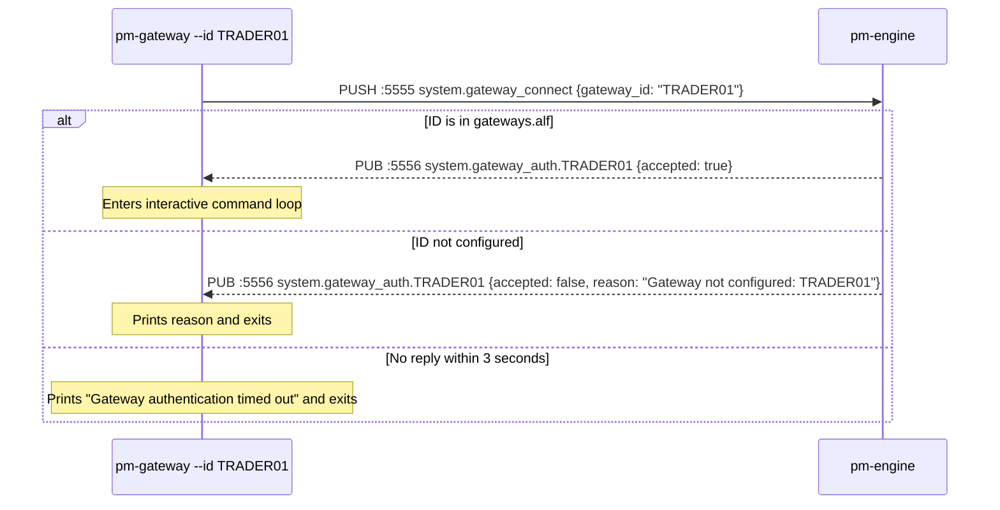
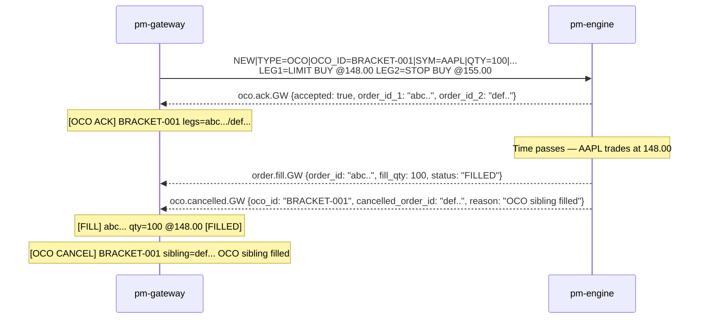

# Gateway Reference

!!! note "Learning objectives"
    After reading this page you will understand:

    - What a gateway is and what role it plays in an exchange architecture
    - Why real exchanges offer multiple gateway protocols and what the major
      industry-standard formats are
    - How EduMatcher simplifies the real-world concepts of users, participants,
      and members — and what those concepts mean in production
    - Why arrival order at the matching engine matters and how real exchanges are
      legally obligated to handle it fairly
    - How to start a gateway, submit every order type, manage positions, and read
      responses

    **Prerequisites**: [Configuration](01-configuration.md) — you need a valid
    `engine_config.yaml` with your gateway ID and role configured before connecting.
    [Order Types](04-order-types.md) — understand what NEW, AMEND, OCO, and COMBO
    mean before using the commands here.
    [Messages](09-messages.md) — for the raw two-frame format underlying every
    gateway response.

## Background — Gateways in Real Exchange Architecture

### What is a gateway?

An exchange **gateway** is the entry point through which external participants
send orders and receive market data and execution reports.  It translates the
external message format (FIX, binary, proprietary) into the internal format the
matching engine understands, authenticates the sender, applies pre-trade risk
checks, and routes messages to the right destination.

The gateway is deliberately kept outside the matching engine.  The engine's
only job is to match orders; it must not be slowed down by format parsing,
session management, or rate limiting.  Separating these concerns also allows
the exchange to offer multiple gateway protocols simultaneously — an HFT firm
and a retail broker can both connect to the same engine while speaking
completely different wire formats.

### Industry-standard gateway protocols

Real exchanges offer a range of gateway types.  Each targets a different
client population:

| Protocol | Type | Used by | Notes |
|----------|------|---------|-------|
| **FIX 4.2 / 4.4 / 5.0** | Text (tag=value) | Brokers, buy-side OMS | The lingua franca of institutional order routing; every major venue supports it; verbose but universally understood |
| **OUCH (Nasdaq)** | Binary | HFT, proprietary traders | Ultra-low latency; fixed-length binary fields; single-digit microsecond round trips |
| **ITCH (Nasdaq)** | Binary (market data only) | Market data consumers | One-way feed; used for direct order book reconstruction at co-location |
| **FAST / SBE** | Binary | Market data consumers | Simple Binary Encoding; used by CME, Eurex for market data |
| **BOE (CBOE/BATS)** | Binary | HFT | Binary Order Entry; competes with OUCH |
| **ETI (Eurex)** | Binary | European derivatives traders | Enhanced Transaction Interface; supports complex derivatives workflows |
| **Proprietary REST/WebSocket** | Text / JSON | Retail, algorithmic | Used by crypto exchanges and some retail venues; easy to integrate |

EduMatcher's gateway speaks a **FIX-inspired pipe-delimited text format** that
we call **ALF** (**AL**most **F**ix):
`NEW|SYM=AAPL|SIDE=BUY|TYPE=LIMIT|QTY=100|PRICE=150.00`.
It borrows FIX's field=value concept but uses a simplified subset - no session
layer, no checksums, no sequence numbers, and no standard FIX message set.
A production FIX gateway would add all of these.

!!! note "Formal protocol reference"
    This page explains ALF from the gateway user's point of view.
    The formal syntax and semantics of the ALF protocol are defined in
    [Appendix: ALF Protocol Reference](20-app-alf-protocol.md).

### One user per gateway — a learning simplification

EduMatcher maps one gateway process to one user.  In a real exchange, the
relationship between gateways, users, and legal entities has several layers:

```
Exchange
  └─ Member firm  (legal entity; signed exchange rules; financial responsibility)
       ├─ Participant  (trading desk or system within the firm)
       │    ├─ User  (individual trader or algorithm)
       │    └─ User
       └─ Participant
            └─ User
```

A single FIX session (one TCP connection to the exchange) can carry orders for
many users in the same firm, tagged with a `SenderSubID` or `Account` field to
identify the individual.  Risk limits may be set at the firm level, the desk
level, or the individual user level.  Pre-trade checks (position limits, fat-finger
checks, credit checks) can be applied independently at each layer.

EduMatcher collapses all of this:

- There is no concept of a member firm or legal entity.
- There is no concept of a "user" separate from the gateway.
- The gateway ID (`--id GW01`) is the only identity the engine knows.
- All orders from `GW01` are treated as one account for position tracking and
  self-match prevention purposes.

This makes the system much easier to learn and operate, at the cost of the
access-control and risk-management structures that real venues require.

### Multiple gateways and arrival order

When two gateways submit orders at almost the same moment, the engine processes
them in the order the messages arrive at its PULL socket.  On localhost with
ZeroMQ, this is effectively FIFO — but only at the network level, not at the
wall-clock level of the original submission.

In production this is a critical fairness issue:

- Two orders submitted at the same microsecond by two different participants on
  opposite sides of a co-location facility do not arrive at the engine at the
  same time.
- The order that traverses fewer network hops, or whose gateway server sits
  closer to the matching engine, will arrive first.
- This is the economics behind **co-location** services: participants pay to
  place their servers in the same data centre as the exchange, minimising the
  physical distance their messages travel.

**Legal fairness obligations**

Regulated exchanges are legally required to treat all participants fairly and
without discrimination.  In practice this means:

- **Deterministic FIFO processing**: the engine must process messages in the
  exact sequence they are received; it cannot re-order them for any reason.
- **No preferential access**: the exchange must offer the same co-location
  facilities and network connections to any participant willing to pay the
  published fee.
- **Timestamping**: many regulators (MiFID II in Europe, FINRA/SEC in the US)
  require the exchange to log a nanosecond-precision hardware timestamp
  ("gateway receipt timestamp") on every inbound message and include it in
  execution reports.  This creates an auditable record of arrival order that
  can be reviewed by regulators after any suspicious trading pattern.
- **Speed bumps**: some venues (IEX, Cboe EDGA) deliberately introduce a short
  delay (350 microseconds for IEX's "Magic Shoebox") on certain order types to
  level the playing field between speed-optimised HFT and slower participants.

EduMatcher has none of these mechanisms.  The engine processes messages in
ZeroMQ arrival order with no timestamps beyond the wall clock of the machine
running the test.  For a learning system on localhost this is irrelevant; for a
regulated venue it would be a compliance failure.


The gateway (`pm-gateway`) is your trading terminal. Each gateway instance represents
one user connecting to the trading system. Multiple gateways can run simultaneously.

## Starting a Gateway

```bash
poetry run pm-gateway --id GW01
```

The `--id` flag sets your gateway identifier. It appears on all orders and fills.
The ID must be preconfigured in `engine_config.yaml` under `gateways.alf`.

On startup, the gateway:

1. Connects PUSH socket to the engine PULL port (5555)
2. Connects SUB socket to the engine PUB port (5556)
3. Subscribes to: `order.ack.{ID}`, `order.fill.{ID}`, `order.amended.{ID}`, `order.cancelled.{ID}`, `order.expired.{ID}`, `order.orders.{ID}`, `combo.ack.{ID}`, `combo.status.{ID}`, `oco.ack.{ID}`, `oco.cancelled.{ID}`, `quote.ack.{ID}`, `quote.status.{ID}`, `risk.kill_switch_ack.{ID}`, `system.symbols.{ID}`, `system.gateway_auth.{ID}`, `trade.executed`
4. Sends `system.gateway_connect` and waits up to **3 seconds** for the auth response
5. If accepted: enters the interactive prompt loop
6. If rejected: prints the reason and exits immediately
7. If timeout (engine not running): exits with "Gateway authentication timed out"



The gateway does **not** subscribe to `session.state`. Use `pm-audit`,
`pm-viewer`, `pm-orders`, or the scheduler output if you need to watch trading
phase transitions live.

Allowed gateway IDs are configured in `engine_config.yaml` under `gateways.alf`.

Example:

```yaml
gateways:
  alf:
    - id: TRADER01
      description: The first trader
    - id: TRADER02
      description: High frequency
```

If a gateway starts with an ID that is not listed there, the engine refuses
the connection and the gateway exits.


## Command Format

All commands use the ALF pipe-separated key=value format.

!!! note
    For the precise ALF grammar, parser rules, field semantics, and full command
    catalog, see [Appendix: ALF Protocol Reference](20-app-alf-protocol.md).

### QUOTE — Submit/Replace A Two-Sided MM Quote

```
QUOTE|SYM=<symbol>|BID=<price>|ASK=<price>|BID_QTY=<n>|ASK_QTY=<n>[|TIF=<DAY|GTC>][|QUOTE_ID=<label>]
```

Rules:

- `BID` must be strictly less than `ASK`
- `BID_QTY` and `ASK_QTY` must be positive integers
- Existing quote for the same gateway+symbol is replaced

### QUOTE_CANCEL — Cancel Active Quote

```
QUOTE_CANCEL|SYM=<symbol>
```

### KILL — Trigger Kill-Switch

```
KILL
KILL|SYM=<symbol>
```

`KILL` cancels active quote legs and non-quote resting orders for the gateway.

### NEW — Submit an Order

```
NEW|SYM=<symbol>|SIDE=<BUY|SELL>|TYPE=<order-type>|QTY=<quantity>[|PRICE=<price>][|STOP=<price>][|TRAIL=<offset>][|TIF=<DAY|GTC>][|VISIBLE=<n>][|SMP=<action>]
```

**SMP** (Self Match Prevention) values: `NONE` (default), `CANCEL_AGGRESSOR`, `CANCEL_RESTING`, `CANCEL_BOTH`.
SMP prevents you from accidentally trading against your own resting orders.

!!! note "ATO / ATC orders"
    The `ATO` (At-The-Open) and `ATC` (At-The-Close) TIF values are accepted by
    the engine during the appropriate auction phase but are **not exposed** in the
    gateway’s tab completion. To submit an ATO/ATC order, type the TIF value
    manually: `TIF=ATO` or `TIF=ATC`. These orders are only valid during
    `OPENING_AUCTION` and `CLOSING_AUCTION` phases respectively.

#### Examples

| Order Type | Command |
|-----------|--------|
| Market buy | `NEW\|SYM=AAPL\|SIDE=BUY\|TYPE=MARKET\|QTY=100` |
| Limit sell | `NEW\|SYM=AAPL\|SIDE=SELL\|TYPE=LIMIT\|QTY=100\|PRICE=152.00` |
| GTC limit | `NEW\|SYM=MSFT\|SIDE=BUY\|TYPE=LIMIT\|QTY=200\|PRICE=310.00\|TIF=GTC` |
| Stop-loss | `NEW\|SYM=AAPL\|SIDE=SELL\|TYPE=STOP\|QTY=100\|STOP=148.00` |
| Stop-limit | `NEW\|SYM=AAPL\|SIDE=SELL\|TYPE=STOP_LIMIT\|QTY=100\|STOP=148.00\|PRICE=147.50` |
| FOK | `NEW\|SYM=AAPL\|SIDE=BUY\|TYPE=FOK\|QTY=100\|PRICE=150.00` |
| IOC | `NEW\|SYM=AAPL\|SIDE=BUY\|TYPE=IOC\|QTY=100\|PRICE=150.00` |
| Iceberg | `NEW\|SYM=AAPL\|SIDE=BUY\|TYPE=ICEBERG\|QTY=1000\|PRICE=150.00\|VISIBLE=100` |
| Trailing stop | `NEW\|SYM=AAPL\|SIDE=SELL\|TYPE=TRAILING_STOP\|QTY=100\|TRAIL=1.50` |
| With SMP | `NEW\|SYM=AAPL\|SIDE=BUY\|TYPE=LIMIT\|QTY=100\|PRICE=150.00\|SMP=CANCEL_RESTING` |

#### Required fields by type

| Type | Required fields | Optional |
|------|----------------|----------|
| MARKET | SYM, SIDE, QTY | SMP |
| LIMIT | SYM, SIDE, QTY, PRICE | TIF, SMP |
| STOP | SYM, SIDE, QTY, STOP | TIF, SMP |
| STOP_LIMIT | SYM, SIDE, QTY, STOP, PRICE | TIF, SMP |
| FOK | SYM, SIDE, QTY, PRICE | SMP |
| IOC | SYM, SIDE, QTY | PRICE, SMP |
| ICEBERG | SYM, SIDE, QTY, PRICE, VISIBLE (must be < QTY) | TIF, SMP |
| TRAILING_STOP | SYM, SIDE, QTY, TRAIL | STOP (initial stop price), TIF, SMP |


### NEW (Combo) — Submit a Multi-Leg Order

```
NEW|TYPE=COMBO|COMBO_ID=<label>|COMBO_TYPE=AON|TIF=<DAY|GTC>|LEG_COUNT=<n>|LEG0.SYM=<sym>|LEG0.SIDE=<BUY|SELL>|LEG0.QTY=<n>|LEG0.PRICE=<p>|LEG1.SYM=...
```

#### Combo fields

| Field | Required | Description |
|-------|----------|-------------|
| `TYPE=COMBO` | Yes | Signals multi-leg order |
| `COMBO_ID=<label>` | Yes | Your tracking label (used for cancel) |
| `COMBO_TYPE=AON` | Yes | All-or-none semantics |
| `TIF=DAY\|GTC` | No | Time-in-force (default DAY), applies to all legs |
| `LEG_COUNT=<n>` | Yes | Number of legs (2–10) |
| `LEG<i>.SYM` | Yes | Symbol for leg *i* (0-indexed) |
| `LEG<i>.SIDE` | Yes | BUY or SELL |
| `LEG<i>.QTY` | Yes | Quantity |
| `LEG<i>.PRICE` | Yes* | Limit price (*required for LIMIT type) |
| `LEG<i>.TYPE` | No | Order type (default LIMIT) |

#### Examples

| Strategy | Command |
|----------|---------|
| Pairs trade | `NEW\|TYPE=COMBO\|COMBO_ID=PAIR-001\|COMBO_TYPE=AON\|TIF=GTC\|LEG_COUNT=2\|LEG0.SYM=MSFT\|LEG0.SIDE=BUY\|LEG0.QTY=100\|LEG0.PRICE=415.00\|LEG1.SYM=AAPL\|LEG1.SIDE=SELL\|LEG1.QTY=100\|LEG1.PRICE=210.00` |
| 3-leg arb | `NEW\|TYPE=COMBO\|COMBO_ID=ARB-01\|COMBO_TYPE=AON\|TIF=DAY\|LEG_COUNT=3\|LEG0.SYM=AAPL\|LEG0.SIDE=BUY\|LEG0.QTY=200\|LEG0.PRICE=210.00\|LEG1.SYM=MSFT\|LEG1.SIDE=SELL\|LEG1.QTY=100\|LEG1.PRICE=415.00\|LEG2.SYM=GOOG\|LEG2.SIDE=SELL\|LEG2.QTY=50\|LEG2.PRICE=170.00` |

#### Constraints

- 2–10 legs per combo
- No duplicate symbols (each leg must be a different instrument)
- All legs validated against `engine_config.yaml` symbol allowlist


### AMEND — Amend a Resting Order

```
AMEND|ID=<full-order-id>[|PRICE=<new-price>][|QTY=<new-total-qty>]
```

At least one of `PRICE=` or `QTY=` must be present.

| Field | Required | Description |
|-------|----------|-------------|
| `ID` | Yes | Full order UUID (visible in the `ORDERS` table) |
| `PRICE` | Conditional | New limit price; omit to keep current price |
| `QTY` | Conditional | New total quantity; must be ≥ filled quantity |

**Priority rules:**

| Change | Time priority |
|--------|---------------|
| Quantity decrease only | **Preserved** — the order keeps its queue position |
| Price change | **Lost** — the order moves to the back of the queue at the new price |
| Quantity increase | **Lost** — the order moves to the back of the queue |

Reply: `AMENDED <id>  price=<p> qty=<q> remaining=<r>` on success, or a rejection via `REJECTED` with a reason.


### NEW (OCO) — Submit a One-Cancels-Other Pair

An OCO pair links two orders on the same symbol so that when one fills or is cancelled, the engine automatically cancels the other.

```
NEW|TYPE=OCO|OCO_ID=<label>|SYM=<symbol>|QTY=<qty>[|TIF=<DAY|GTC>]
   |LEG1_SIDE=<BUY|SELL>|LEG1_TYPE=<type>[|LEG1_PRICE=<p>][|LEG1_STOP=<p>][|LEG1_TRAIL=<offset>]
   |LEG2_SIDE=<BUY|SELL>|LEG2_TYPE=<type>[|LEG2_PRICE=<p>][|LEG2_STOP=<p>][|LEG2_TRAIL=<offset>]
```

| Field | Required | Description |
|-------|----------|-------------|
| `OCO_ID` | Yes | Client label for the pair |
| `SYM` | Yes | Instrument ticker — shared by both legs |
| `QTY` | Yes | Quantity — shared by both legs |
| `TIF` | No | `DAY` or `GTC`; defaults to `DAY` |
| `LEG1_SIDE` | Yes | `BUY` or `SELL` |
| `LEG1_TYPE` | Yes | Order type for leg 1 |
| `LEG1_PRICE` | Conditional | Required for `LIMIT`, `STOP_LIMIT`, `FOK` legs |
| `LEG1_STOP` | Conditional | Required for `STOP`, `STOP_LIMIT` legs |
| `LEG1_TRAIL` | Conditional | Required for `TRAILING_STOP` legs |
| `LEG2_*` | Same rules as LEG1 | Second leg fields |

#### Example — bracket order

Buy limit below the market + stop-loss above (common bracket structure for a short position):

```
NEW|TYPE=OCO|OCO_ID=BRACKET-001|SYM=AAPL|QTY=100|TIF=GTC
   |LEG1_SIDE=BUY|LEG1_TYPE=LIMIT|LEG1_PRICE=148.00
   |LEG2_SIDE=BUY|LEG2_TYPE=STOP|LEG2_STOP=155.00
```

If the LIMIT leg fills at 148.00, the engine automatically cancels the STOP leg. If the STOP triggers at 155.00, the LIMIT leg is cancelled.




### CANCEL — Cancel a Resting Order, Combo, or OCO

```
CANCEL|ID=<full-order-id>          # single-leg order
CANCEL|COMBO_ID=<combo-label>      # combo and all its resting legs
CANCEL|OCO_ID=<oco-label>          # both legs of an OCO pair
```

The full order ID is shown in the `ORDERS` table. Only the first 8 characters appear in inline fill/cancel messages — use `ORDERS` to copy the full UUID.

Cancelling a combo or OCO is atomic: all resting child legs are cancelled, but fills that already occurred are not reversed.


### ORDERS — View This Session's Orders

```
ORDERS
```

Prints a rich table of all **single-leg** orders submitted in this gateway session with
current status, remaining quantity, and last update time.

!!! note
    Combo orders are not shown in the `ORDERS` table. Their lifecycle is tracked
    via real-time `combo.ack` and `combo.status` messages printed as they arrive.
    To see all order activity (including combo children), use `pm-orders`.


### POS — View Current Positions

```
POS
```

Displays a position summary table showing net quantity, average entry cost,
last trade price, unrealized P&L, and realized P&L for each symbol traded:

```
┌─────────────────────────────────────────────────────────────────────────┐
│                            Positions                                     │
├──────────┬─────────┬──────────┬──────────┬────────────┬─────────────────┤
│ Symbol   │ Net Qty │ Avg Cost │  Last Px │ Unreal P&L │     Real P&L    │
├──────────┼─────────┼──────────┼──────────┼────────────┼─────────────────┤
│ AAPL     │    +100 │   150.25 │   151.00 │     +75.00 │          +0.00  │
│ MSFT     │     -50 │   415.00 │   414.50 │     +25.00 │        +120.00  │
│ TSLA     │       0 │        — │        — │          — │        +340.00  │
└──────────┴─────────┴──────────┴──────────┴────────────┴─────────────────┘
```

**How it works:**

- Positions are accumulated locally from `order.fill` events received by this gateway
- Last price per symbol is tracked from the `trade.executed` feed (all trades, not just this gateway's)
- Unrealized P&L = (last price − avg cost) × net quantity
- Realized P&L is booked when reducing or closing a position (average cost method)
- Flat positions (net qty = 0) with non-zero realized P&L are shown dimmed
- Positions reset when the gateway disconnects (they are session-local)

!!! tip
    Use `POS` after each fill to monitor your exposure without switching to `pm-orders`.


### SYMBOLS — List Active Instruments

```
SYMBOLS
```

Requests the list of all symbols that currently have an active order book in the engine.
The gateway sends the request and the engine replies with the current instrument list,
which is printed as a rich table:

```
┌─────────────────────┐
│  Active Instruments │
├────┬────────────────┤
│  1 │ AAPL           │
│  2 │ MSFT           │
│  3 │ TSLA           │
└────┴────────────────┘
```

!!! note
    `SYMBOLS` returns symbols that have at least one active order book (created
    when the first order for a symbol arrives or when market-maker orders are
    injected at startup). It does NOT list all symbols from `engine_config.yaml`
    unless those symbols already have orders.

!!! note "Gateway authorization"
    `SYMBOLS` and all trading commands are available only after successful
    startup authentication. If your ID is not listed under `gateways.alf`,
    the engine refuses the connection.


### HELP — Command Reference

```
HELP
```


### EXIT / QUIT — Disconnect

```
EXIT
```


## Gateway Responses

All events are printed inline with a `[HH:MM:SS.mmm]` timestamp prefix. A background thread receives events from the engine while you continue typing.

### Order Events

| Message | Meaning |
|---------|--------|
| `ACK  <id>  order accepted` | Engine received and registered the order |
| `REJECTED  <id>  <reason>` | Order was rejected (e.g. FOK: insufficient liquidity) |
| `FILL  <id>  qty=50 @150.50  remaining=50  [PARTIAL]` | Partial fill |
| `FILL  <id>  qty=100 @150.50  remaining=0  [FILLED]` | Full fill |
| `AMENDED  <id>  price=151.0 qty=100 remaining=100` | Amendment confirmed |
| `CANCELLED  <id>` | Cancel confirmed |
| `EXPIRED  <id>  (DAY order — trading day ended)` | Engine shut down or session phase change |

### Quote Events

| Message | Meaning |
|---------|--------|
| `QUOTE ACK  <quote_id>  bid=<8-char-id> ask=<8-char-id>` | Both quote legs accepted and posted to the book |
| `QUOTE REJ  <quote_id>  <reason>` | Quote rejected (e.g. `BID >= ASK`, missing gateway role) |
| `QUOTE <status>  <quote_id>  [reason]` | Quote lifecycle update — status is `INACTIVATED`, `CANCELLED`, or `FILLED` |

### OCO Events

| Message | Meaning |
|---------|--------|
| `OCO ACK  <oco_id>  legs=<leg1_8char>/<leg2_8char>` | Both legs linked; IDs are first 8 chars of each order UUID |
| `OCO REJ  <oco_id>  <reason>` | OCO rejected (invalid legs, symbol mismatch, etc.) |
| `OCO CANCEL  <oco_id>  sibling=<order_8char>  <reason>` | Engine auto-cancelled the sibling leg after the other leg filled or was cancelled |

### Combo Events

| Message | Meaning |
|---------|--------|
| `COMBO ACK  <combo_id>  accepted` | Combo validated, child orders posted to books |
| `COMBO REJECTED  <combo_id>  <reason>` | Combo failed validation (e.g. "Duplicate symbols") |
| `COMBO STATUS  <combo_id>  PARTIALLY_MATCHED` | At least one leg has filled |
| `COMBO STATUS  <combo_id>  MATCHED` | All legs fully filled |
| `COMBO STATUS  <combo_id>  FAILED  <reason>` | A leg was cancelled/expired; siblings cascade-cancelled |
| `COMBO STATUS  <combo_id>  CANCELLED` | User-initiated cancel completed |

### Risk Events

| Message | Meaning |
|---------|--------|
| `KILL ACK  orders=<n> quote_legs=<n>` | Kill-switch applied; counts show what was cancelled |
| `KILL REJ  <reason>` | Kill-switch rejected (not expected in normal operation) |

### System Events

| Message | Meaning |
|---------|--------|
| `Active Instruments` table | Response to `SYMBOLS` command |

!!! note "Session phase changes"
    The gateway does **not** subscribe to `session.state` events. Trading phase transitions are not displayed in the gateway terminal. To monitor session phases, run `pm-audit`, `pm-viewer`, or `pm-orders` in a separate terminal.


## Multiple Gateways

Run as many gateways as needed — each in its own terminal window:

```bash
# Terminal A
poetry run pm-gateway --id TRADER01

# Terminal B  
poetry run pm-gateway --id TRADER02

# Terminal C
poetry run pm-gateway --id TRADER03
```

Before starting a new gateway ID (for example `TRADER03`), add it to
`engine_config.yaml` in `gateways.alf` and restart the engine.

Each gateway only receives events for its own orders. Use `pm-orders` to see all
gateways' activity.


## Interactive Features

### Tab Completion

The gateway provides **context-aware tab completion**:

| Position | Completions |
|----------|-------------|
| First word | `NEW`, `AMEND`, `CANCEL`, `QUOTE`, `QUOTE_CANCEL`, `KILL`, `ORDERS`, `POS`, `SYMBOLS`, `HELP`, `EXIT`, `QUIT` |
| After `NEW\|` | `SYM=`, `SIDE=`, `TYPE=`, `QTY=`, `PRICE=`, `STOP=`, `TRAIL=`, `TIF=`, `VISIBLE=`, `SMP=` |
| After `NEW\|TYPE=COMBO\|` | `COMBO_ID=`, `COMBO_TYPE=`, `TIF=`, `LEG_COUNT=`, plus `LEG0.SYM=`, `LEG0.SIDE=`, etc. |
| After `NEW\|TYPE=OCO\|` | `OCO_ID=`, `SYM=`, `QTY=`, `TIF=`, `LEG1_SIDE=`, `LEG1_TYPE=`, etc. |
| After `AMEND\|` | `ID=`, `PRICE=`, `QTY=` |
| After `CANCEL\|` | `ID=`, `COMBO_ID=`, `OCO_ID=` |
| After `TYPE=` | All order types: `MARKET`, `LIMIT`, `STOP`, `STOP_LIMIT`, `FOK`, `IOC`, `ICEBERG`, `TRAILING_STOP`, `COMBO`, `OCO` |
| After `SIDE=` | `BUY`, `SELL` |
| After `TIF=` | `DAY`, `GTC`, `ATO`, `ATC` |
| After `SMP=` | `NONE`, `CANCEL_AGGRESSOR`, `CANCEL_RESTING`, `CANCEL_BOTH` |
| After `SYM=` | Known symbols (populated from the last `SYMBOLS` reply) |

Press **Tab** to cycle through suggestions.

### Command History

Press **↑** / **↓** arrow keys to navigate through previously entered commands
(in-memory, session-scoped — history is not persisted across gateway restarts).

### Background Event Display

A background thread listens on the SUB socket and prints events (fills, cancels,
combo status changes, session transitions) in real-time, interleaved cleanly with
the command prompt. You can continue typing while events arrive.

## Common mistakes

New users frequently encounter these issues when first using the gateway:

| Symptom | Cause | Fix |
|---|---|---|
| `Gateway authentication timed out` | Engine is not running | Start `pm-engine` first |
| `Gateway not configured: GW01` | Gateway ID not in `engine_config.yaml` | Add the ID under `gateways.alf` or run in unrestricted mode (no config) |
| `REJECTED: SYMBOL_NOT_CONFIGURED` | Symbol not in config | Add the symbol under `symbols:` in the config |
| `REJECTED: SYMBOL_HALTED` | A circuit breaker fired or operator halted the symbol | Wait for resume, or use `pm-admin` to resume |
| `REJECTED: STATIC_COLLAR_BREACH` | Order price too far from reference | Choose a price closer to the last traded price |
| Order rests but does not fill | No counterparty at that price | Another gateway must post a crossing order |
| `Quotes are only allowed for MARKET_MAKER participants` | Gateway role is `TRADER` | Change the role to `MARKET_MAKER` in config |

## See also

- [Configuration](01-configuration.md#alf-gateway-allowlist) — gateway roles, allowlists, disconnect behaviour, and MM obligations
- [Order Types](04-order-types.md) — full semantics for every order type accepted by the gateway
- [ALF Protocol Reference](20-app-alf-protocol.md) — formal ABNF grammar and field rules for the pipe-delimited syntax
- [Messages](09-messages.md) — the ZeroMQ messages the gateway publishes and subscribes to
- [Risk Controls](12-risk-controls.md) — how the engine enforces collars, halts, and kill switches on gateway flow
- [Running the Engine](03-running-the-engine.md) — how to start `pm-gateway` and verify the connection
