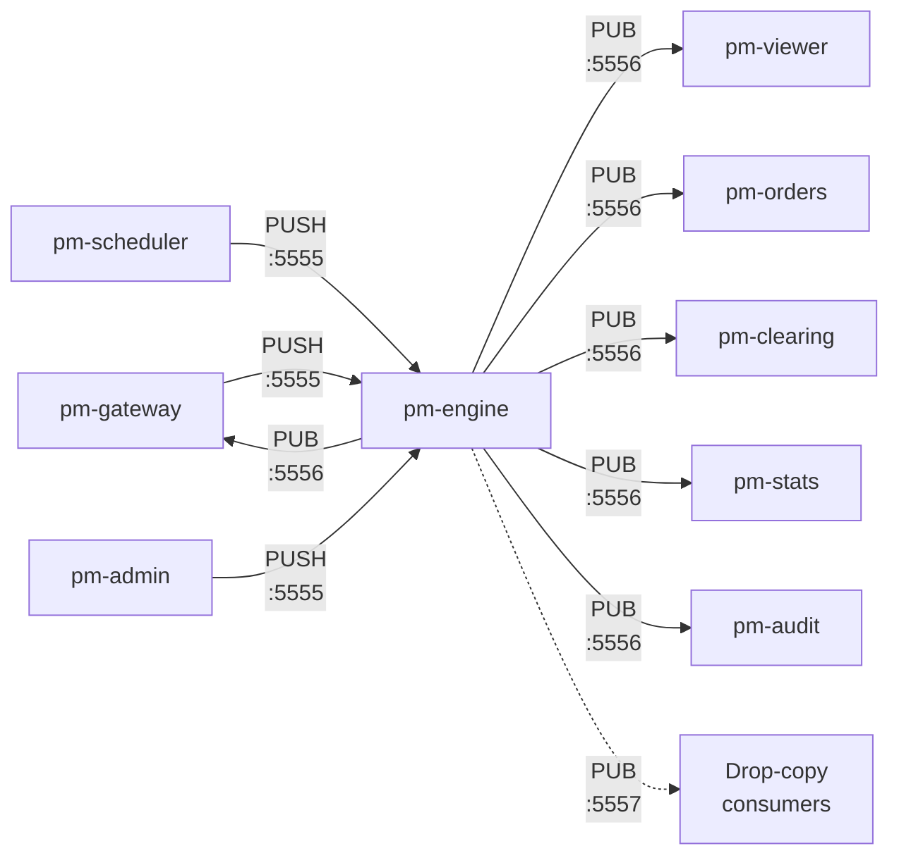
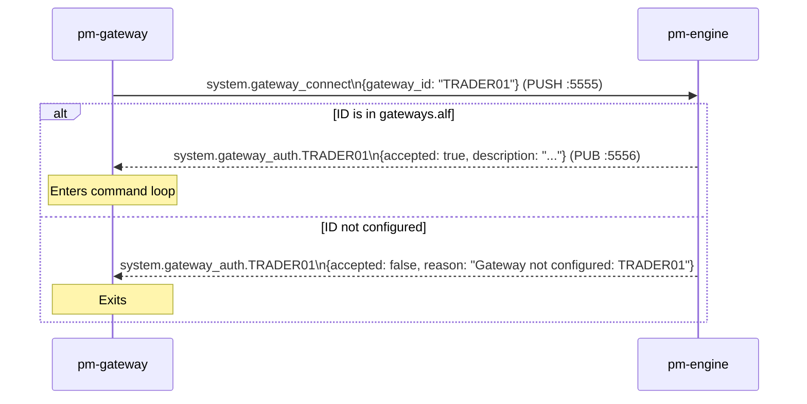
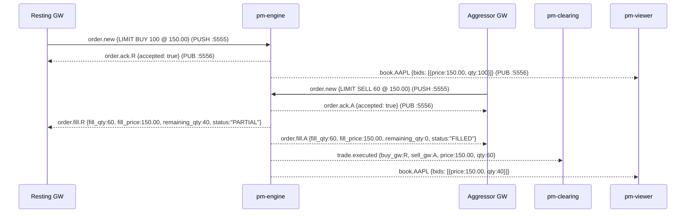

# Message Reference

!!! note "Learning objectives"
    After reading this page you will understand:

    - What a message is in the context of a distributed bus system and how it
      differs from a function call or shared data structure
    - How messages are defined in real systems (schema registries, IDL, plain JSON)
      and the pragmatic trade-offs EduMatcher makes
    - What ZeroMQ requires of a message — frames, encoding, topic filters
    - Why ZeroMQ has no broker, and what that means for reliability and operational
      complexity compared with broker-based systems (Kafka, RabbitMQ, NATS)
    - The full catalogue of messages used in EduMatcher, their fields, and which
      processes produce and consume each one


## Background — Messages in a Bus System

### What is a message?

A function call passes data synchronously inside a process: the caller blocks
until the callee returns.  A **message** is an asynchronous unit of data sent
between processes.  The sender does not wait for a response; it hands the
message to the transport layer and moves on.

Messages carry three things:

1. **Identity** — what kind of event this is (the topic or message type)
2. **Payload** — the data describing the event
3. **Routing metadata** — information the transport needs to deliver it
   (addresses, topic filters, sequence numbers)

### How message formats are defined in real systems

In production systems there are three common approaches to defining what a
message looks like:

**Schema registries (Avro, Protobuf, Thrift)**
: Messages are defined in an Interface Definition Language (IDL) file.
  A code generator produces serialisers and deserialisers for every target
  language.  The registry enforces compatibility: a new field may be added
  but existing fields cannot be removed or re-typed without a version bump.
  Kafka and gRPC use this model.

**Canonical JSON/XML schemas (JSON Schema, OpenAPI, AsyncAPI)**
: Message shapes are described in a human-readable document (like AsyncAPI
  for event-driven systems).  Any process that speaks JSON can produce or
  consume a message without a code generator.  The schema document is the
  contract; violations surface only at runtime unless you add a validation
  library.

**Hardcoded structures**
: The simplest approach — message shape is implicit in the code that creates
  and reads it.  No IDL, no registry, no generator.  Fast to build, but
  schema drift is invisible until something breaks at runtime.

EduMatcher uses the **hardcoded approach**.  Each message type is created
by a helper function in `src/edumatcher/models/message.py` (e.g.
`make_order_new_msg`, `make_gateway_connect_msg`) and decoded by `decode()`.
Every field documented on this page is exactly what those functions produce.
This is ideal for a learning system — you can read the code and immediately
see the message — but a real exchange would use Protobuf or Avro to enforce
schema contracts across teams and languages.

### What ZeroMQ requires of a message

ZeroMQ does not impose a message format.  It sees messages as one or more
opaque **frames** — byte arrays that are sent and received atomically as a
group.  It is up to the application to define what those bytes mean.

EduMatcher uses exactly **two frames** for every message:

```
frame[0]  →  topic string, UTF-8 encoded
             e.g.  b"order.ack.GW01"

frame[1]  →  JSON payload, UTF-8 encoded
             e.g.  b'{"order_id": "3f2a...", "accepted": true}'
```

`frame[0]` doubles as the **PUB/SUB filter key**.  A subscriber that
registers for prefix `"order.ack.GW01"` will receive only messages whose
first frame starts with that string — all other messages are dropped by the
ZeroMQ layer before the application even sees them.  This prefix-match filter
is evaluated in the kernel's socket buffer, not in Python, so it adds almost
no CPU overhead regardless of how many message types are on the bus.

### ZeroMQ without a broker

Most messaging systems interpose a **broker** between producers and consumers:

```
Producer ──▶  Broker  ──▶  Consumer
```

The broker buffers messages, persists them to disk, routes them to the right
queues, and handles consumer acknowledgements.  Examples: RabbitMQ, Apache
Kafka, NATS JetStream, AWS SQS.

ZeroMQ is **brokerless**.  Producers connect directly to consumers (or to the
engine in PUSH/PULL):

```
Gateway ──PUSH──▶  Engine ──PUB──▶  Subscriber A
                                ├──▶  Subscriber B
                                └──▶  Subscriber C
```

There is no third process in the middle.  The advantages and disadvantages
flow directly from that choice:

**Advantages of no broker**

| Advantage | Detail |
|-----------|--------|
| **Lower latency** | No extra network hop; messages go directly from sender to receiver |
| **Fewer moving parts** | No broker process to install, configure, monitor, or restart |
| **No single point of failure** | The engine is the bus; if the engine is up, the bus is up |
| **Simpler deployment** | `pip install pyzmq` is the entire installation |

**Disadvantages of no broker**

| Disadvantage | Detail |
|--------------|--------|
| **No persistence** | If a subscriber is down when a message is published, the message is gone forever |
| **No guaranteed delivery** | PUB/SUB drops messages to slow subscribers without warning |
| **No replay** | You cannot re-consume old messages; there is no commit log |
| **Tight coupling on addresses** | Producers must know the address of the engine; adding a new engine address requires reconfiguring all clients |
| **No backpressure** | A fast publisher can overwhelm a slow subscriber; the subscriber's receive buffer fills and messages are silently discarded |

For EduMatcher these trade-offs are acceptable: the system runs on
localhost, sessions last hours not days, and correctness over time is handled
by the GTC persistence layer rather than the message bus.  For a real exchange,
the audit trail would be written by a Kafka consumer (guaranteed delivery,
infinite replay), and the matching engine would use a persisted queue for order
intake.


## Message structure

Every inter-process communication in EduMatcher is a two-frame ZeroMQ
multipart message.  ZeroMQ (ZMQ) is a high-performance messaging library;
a "multipart message" is simply an ordered list of byte-array frames sent
and received atomically:

| Frame | Content |
|---|---|
| `frame[0]` | Topic string (UTF-8) — used for PUB/SUB prefix filtering |
| `frame[1]` | JSON payload (UTF-8) |

## Transport channels

| Channel | ZMQ pattern | Address | Direction |
|---|---|---|---|
| Order submission | PUSH → PULL | `tcp://127.0.0.1:5555` | Gateway → Engine |
| Event broadcast | PUB → SUB | `tcp://127.0.0.1:5556` | Engine → all subscribers |
| Drop copy | PUB → SUB | `tcp://127.0.0.1:5557` | Engine → drop-copy consumers |

The dedicated drop-copy channel is implemented in
`src/edumatcher/engine/drop_copy.py` and is documented in more detail on the
[Drop Copy](13-drop-copy.md) page.



### `system.gateway_connect`

Sent by an ALF gateway at startup to authenticate its gateway ID against
`engine_config.yaml`.



| Field | Type | Description |
|---|---|---|
| `gateway_id` | string | Gateway identifier being requested (e.g. `TRADER01`) |

**Reply:** `system.gateway_auth.{GW_ID}`

| Field | Type | Description |
|---|---|---|
| `gateway_id` | string | Gateway identifier |
| `accepted` | boolean | `true` if ID is configured in `gateways.alf` |
| `reason` | string | Rejection reason when `accepted=false` |
| `description` | string | Optional configured description for the gateway |

When `accepted=false`, the gateway must terminate and MUST NOT submit orders.


### `order.new`

Sent by a gateway to submit a new order for matching.

| Field | Type | Description |
|---|---|---|
| `id` | string (UUID) | Unique order identifier |
| `symbol` | string | Instrument ticker, e.g. `MSFT` |
| `side` | `"BUY"` \| `"SELL"` | Order side |
| `order_type` | string | `MARKET`, `LIMIT`, `STOP`, `STOP_LIMIT`, `FOK`, `IOC`, `ICEBERG`, `TRAILING_STOP` |
| `tif` | `"DAY"` \| `"GTC"` \| `"ATO"` \| `"ATC"` \| `"FOK"` | Time-in-force |
| `quantity` | integer | Total order quantity |
| `remaining_qty` | integer | Unfilled quantity (equals `quantity` on submission) |
| `gateway_id` | string | Originating gateway identifier, e.g. `TRADER01` |
| `timestamp` | float | Unix epoch (seconds) |
| `status` | string | Initial status, always `"NEW"` |
| `price` | float \| null | Limit price (LIMIT, STOP_LIMIT, FOK, ICEBERG) |
| `stop_price` | float \| null | Trigger price (STOP, STOP_LIMIT) |
| `visible_qty` | integer \| null | Peak size for ICEBERG orders |
| `displayed_qty` | integer \| null | Current visible slice (ICEBERG) |
| `trail_offset` | float \| null | Offset from best price for `TRAILING_STOP` orders |
| `smp_action` | string | Self-match prevention: `NONE`, `CANCEL_AGGRESSOR`, `CANCEL_RESTING`, `CANCEL_BOTH` |

**Valid field combinations by order type:**

| `order_type` | `price` | `stop_price` | `visible_qty` | `trail_offset` | Notes |
|---|---|---|---|---|---|
| `MARKET` | — | — | — | — | Fills at best available; rejected if symbol halted |
| `LIMIT` | Required | — | — | — | Rests if no match; subject to collar check |
| `STOP` | — | Required | — | — | Triggers a market order when stop price touched |
| `STOP_LIMIT` | Required | Required | — | — | Triggers a limit order when stop price touched |
| `FOK` | Required | — | — | — | Fill fully immediately or cancel entirely |
| `IOC` | Optional | — | — | — | Fill as much as possible immediately, cancel remainder |
| `ICEBERG` | Required | — | Required | — | Shows only `visible_qty`; replenishes from hidden reserve |
| `TRAILING_STOP` | — | — | — | Required | Stop price follows best opposite-side price by `trail_offset` |


### `order.cancel`

Sent by a gateway to cancel a resting order.

| Field | Type | Description |
|---|---|---|
| `order_id` | string (UUID) | ID of the order to cancel |
| `gateway_id` | string | Gateway that owns the order |


### `order.amend`

Sent by a gateway to amend the price and/or quantity of a resting order.

| Field | Type | Description |
|---|---|---|
| `order_id` | string (UUID) | ID of the order to amend |
| `gateway_id` | string | Gateway that owns the order |
| `price` | float \| absent | New limit price (omit to keep current) |
| `qty` | integer \| absent | New total quantity (omit to keep current) |

At least one of `price` or `qty` must be present.

**Priority rules:**

- Quantity decrease only → priority **preserved** (timestamp unchanged)
- Price change or quantity increase → priority **lost** (new timestamp assigned)

**Reply:** `order.amended.{GW_ID}` on success, or `order.ack.{GW_ID}` with `accepted=false` on rejection.


### `quote.new`

Sent by a market-maker gateway to submit or replace a two-sided quote.
Role requirements and MM obligation controls are documented in
[Configuration - Role Privileges](01-configuration.md#role-privileges).

| Field | Type | Description |
|---|---|---|
| `gateway_id` | string | Originating gateway identifier |
| `symbol` | string | Instrument ticker |
| `quote_id` | string \| absent | Optional client-provided quote label |
| `bid_price` | float | Bid price |
| `bid_qty` | integer | Bid quantity |
| `ask_price` | float | Ask price |
| `ask_qty` | integer | Ask quantity |
| `tif` | string | Quote leg time-in-force (`DAY` or `GTC`) |

Replies:

- `quote.ack.{GW_ID}`
- `quote.status.{GW_ID}`

### `quote.ack.{GW_ID}`

Acknowledgement of a `quote.new` submission.

| Field | Type | Description |
|---|---|---|
| `quote_id` | string | Client-provided quote label (echoed from request) |
| `accepted` | boolean | `true` = accepted; `false` = rejected |
| `reason` | string | Rejection reason (empty string when accepted) |
| `bid_order_id` | string (UUID) | Order ID of the bid leg *(present when accepted)* |
| `ask_order_id` | string (UUID) | Order ID of the ask leg *(present when accepted)* |

### `quote.status.{GW_ID}`

Published when the quote's lifecycle state changes (e.g. a fill inactivates the quote or a cancel removes it).

| Field | Type | Description |
|---|---|---|
| `quote_id` | string | Client-provided quote label |
| `status` | string | New quote state (see values below) |
| `reason` | string | Additional context (e.g. halt reason); empty when not applicable |

**Status values:**

| Value | Meaning |
|---|---|
| `ACTIVE` | Quote successfully placed on the book (both legs resting) |
| `INACTIVE_BID_FILLED` | Bid leg filled; ask leg auto-cancelled |
| `INACTIVE_ASK_FILLED` | Ask leg filled; bid leg auto-cancelled |
| `CANCELLED` | Quote removed (explicit cancel, kill switch, or halt) |

### `quote.cancel`

Cancel the active quote for one symbol.

| Field | Type | Description |
|---|---|---|
| `gateway_id` | string | Gateway identifier |
| `symbol` | string | Instrument ticker |


## OCO messages (gateway → engine / engine → subscribers)

A **One-Cancels-Other (OCO)** pair links two resting orders so that when one fills or is cancelled the other is automatically cancelled by the engine.

### `order.oco`

Links two existing resting orders into an OCO pair.

| Field | Type | Description |
|---|---|---|
| `oco_id` | string | Client-assigned label for the pair |
| `gateway_id` | string | Gateway that owns both orders |
| `order_id_1` | string (UUID) | First leg of the pair |
| `order_id_2` | string (UUID) | Second leg of the pair |

Both orders must already be resting on the book and must belong to the same gateway.

**Reply:** `oco.ack.{GW_ID}`

### `order.oco_cancel`

Cancel both legs of an OCO pair.

| Field | Type | Description |
|---|---|---|
| `oco_id` | string | OCO pair label to cancel |
| `gateway_id` | string | Gateway that owns the pair |

### `oco.ack.{GW_ID}`

Acknowledgement of an `order.oco` request.

| Field | Type | Description |
|---|---|---|
| `oco_id` | string | OCO pair label |
| `accepted` | boolean | `true` if both orders were successfully linked |
| `reason` | string | Rejection reason when `accepted=false` |
| `order_id_1` | string (UUID) | First leg order ID *(present when accepted)* |
| `order_id_2` | string (UUID) | Second leg order ID *(present when accepted)* |

### `oco.cancelled.{GW_ID}`

Notifies the gateway when the engine cancels the sibling leg of an OCO pair (because the other leg filled or was cancelled).

| Field | Type | Description |
|---|---|---|
| `oco_id` | string | OCO pair label |
| `cancelled_order_id` | string (UUID) | The sibling order that was automatically cancelled |
| `reason` | string | Why the sibling was cancelled, e.g. `"OCO sibling filled"` |


## Risk control messages (gateway → engine)

### `risk.kill_switch`

Cancels all resting orders and quotes for the specified gateway. Does not halt the symbol; trading continues normally for other participants.

| Field | Type | Description |
|---|---|---|
| `gateway_id` | string | Gateway whose exposure to cancel |
| `symbol` | string \| empty | Scope to a single symbol; empty string or absent means all symbols |

**Reply:** `risk.kill_switch_ack.{GW_ID}`

| Field | Type | Description |
|---|---|---|
| `accepted` | boolean | Always `true` for authenticated gateways |
| `cancelled_orders` | integer | Number of resting orders cancelled |
| `cancelled_quotes` | integer | Number of quote legs cancelled |

### `risk.symbol_halt`

Operator command to halt a single symbol. Any authenticated connected gateway may send this; no ADMIN role is required.

| Field | Type | Description |
|---|---|---|
| `gateway_id` | string | Requesting gateway identifier |
| `symbol` | string | Symbol to halt |

**Reply:** `risk.symbol_halt_ack.{GW_ID}`

| Field | Type | Description |
|---|---|---|
| `accepted` | boolean | `true` if the symbol was halted |
| `reason` | string | Rejection reason when `accepted=false` |
| `cancelled_quotes` | integer | Number of MM quote legs cancelled on halt |

The engine also publishes `circuit_breaker.halt.{SYMBOL}` with `resumption_mode = "MANUAL"` when a symbol is halted this way.

### `risk.symbol_resume`

Resume trading on a single previously halted symbol.

| Field | Type | Description |
|---|---|---|
| `gateway_id` | string | Requesting gateway identifier |
| `symbol` | string | Symbol to resume |

**Reply:** `risk.symbol_resume_ack.{GW_ID}`

| Field | Type | Description |
|---|---|---|
| `accepted` | boolean | `true` if the symbol was resumed |
| `reason` | string | Rejection reason when `accepted=false` |

The engine publishes `circuit_breaker.resume.{SYMBOL}` with `mode = "MANUAL"` when the symbol is resumed.

### `risk.cancel_symbol`

Cancel all resting orders and quotes on a single symbol across all gateways. The symbol remains active; only resting interest is cleared.

| Field | Type | Description |
|---|---|---|
| `gateway_id` | string | Requesting gateway identifier |
| `symbol` | string | Symbol to clear |

**Reply:** `risk.cancel_symbol_ack.{GW_ID}`

| Field | Type | Description |
|---|---|---|
| `accepted` | boolean | `true` if the clear was applied |
| `reason` | string | Rejection reason when `accepted=false` |
| `cancelled_orders` | integer | Number of resting orders cancelled |
| `cancelled_quotes` | integer | Number of quote legs cancelled |

### `risk.circuit_breaker_halt_all`

Administrative global halt request. This sets all known symbols to halted.
Only gateways configured with `role: ADMIN` are authorized.

Operational semantics:

- This is an exchange-wide manual halt. It is not timer-based.
- The engine marks affected symbols as halted and publishes
  `circuit_breaker.halt.<SYMBOL>` with `resumption_mode = "MANUAL"` and
  `resume_at_ns = null`.
- While halted, quote entry is rejected and immediate-execution order types are
  rejected under the normal halt rules.
- The halt remains in effect until an explicit `risk.circuit_breaker_resume_all`
  is sent, or until end-of-day session reset.

| Field | Type | Description |
|---|---|---|
| `gateway_id` | string | Requesting admin gateway identifier |

Reply: `risk.circuit_breaker_halt_all_ack.{GW_ID}`

Ack payload fields:

| Field | Type | Description |
|---|---|---|
| `accepted` | boolean | `true` if request was authorized and applied |
| `reason` | string | Rejection reason when `accepted=false` |
| `halted_symbols` | integer | Number of symbols set to halted |
| `cancelled_quotes` | integer | Number of quote legs cancelled during halt |


### `risk.circuit_breaker_resume_all`

Administrative global resume request. Clears the halt on every symbol that was
halted by a preceding `risk.circuit_breaker_halt_all`.
Only gateways configured with `role: ADMIN` are authorized.

Operational semantics:

- The engine iterates all symbols currently marked as halted, sets each to
  non-halted, and deactivates any in-memory circuit-breaker state.
- A `circuit_breaker.resume.<SYMBOL>` event (with `mode = "MANUAL"`) is
  published for each resumed symbol.
- Only symbols that are currently halted are touched; symbols that are already
  trading are left unchanged.
- If no symbols are halted, the request is still accepted and
  `resumed_symbols = 0` is returned.

| Field | Type | Description |
|---|---|---|
| `gateway_id` | string | Requesting admin gateway identifier |

Reply: `risk.circuit_breaker_resume_all_ack.{GW_ID}`

Ack payload fields:

| Field | Type | Description |
|---|---|---|
| `accepted` | boolean | `true` if request was authorized and applied |
| `reason` | string | Rejection reason when `accepted=false` |
| `resumed_symbols` | integer | Number of symbols transitioned from halted to trading |


### ADMIN workflow: exchange-wide halt and resume

This section describes how an operator uses an ADMIN-role gateway to perform
an exchange-wide circuit-breaker halt and subsequently resume all trading.

**Step 0 — configure an ADMIN gateway**

Declare a gateway with `role: ADMIN` in `engine_config.yaml`:

```yaml
gateways:
  alf:
    - id: GW_ADMIN
      description: Operations desk
      role: ADMIN
      disconnect_behaviour: CANCEL_QUOTES_ONLY
```

See [Role Privileges](01-configuration.md#role-privileges)
for the full permissions matrix.

**Step 1 — connect the ADMIN gateway**

The gateway sends `system.gateway_connect` as usual. The engine registers the
session and marks its role as `ADMIN`.

**Step 2 — trigger the exchange-wide halt**

Send `risk.circuit_breaker_halt_all` via the PUSH socket:

```json
{ "gateway_id": "GW_ADMIN" }
```

The engine will:

1. Verify the gateway is connected and carries role `ADMIN`.
2. Collect every known symbol (from order books, circuit-breaker state, and
   engine configuration).
3. Mark each symbol as halted with `resumption_mode = "MANUAL"`.
4. Cancel all outstanding MM quote legs (both sides).
5. Publish one `circuit_breaker.halt.<SYMBOL>` event per symbol.
6. Acknowledge with `risk.circuit_breaker_halt_all_ack.GW_ADMIN`.

Expected inbound events (subscribe to `circuit_breaker.*`):

```
circuit_breaker.halt.AAPL  → { symbol: "AAPL", resumption_mode: "MANUAL", level: "ADMIN_ALL", ... }
circuit_breaker.halt.MSFT  → { symbol: "MSFT", resumption_mode: "MANUAL", level: "ADMIN_ALL", ... }
...
risk.circuit_breaker_halt_all_ack.GW_ADMIN → { accepted: true, halted_symbols: N, cancelled_quotes: M }
```

**Step 3 — resume all trading**

When the situation is resolved, send `risk.circuit_breaker_resume_all`:

```json
{ "gateway_id": "GW_ADMIN" }
```

The engine will:

1. Verify the gateway is connected and carries role `ADMIN`.
2. Collect every symbol currently marked as halted.
3. Clear the halt and deactivate circuit-breaker state for each symbol.
4. Publish one `circuit_breaker.resume.<SYMBOL>` event per symbol.
5. Acknowledge with `risk.circuit_breaker_resume_all_ack.GW_ADMIN`.

Expected inbound events:

```
circuit_breaker.resume.AAPL  → { symbol: "AAPL", mode: "MANUAL" }
circuit_breaker.resume.MSFT  → { symbol: "MSFT", mode: "MANUAL" }
...
risk.circuit_breaker_resume_all_ack.GW_ADMIN → { accepted: true, resumed_symbols: N }
```

After receiving the ack, normal order flow resumes for all previously halted
symbols. Market-maker quote obligations are enforced again immediately.

### `system.gateway_disconnect`

Graceful disconnect notice from gateway to engine.

| Field | Type | Description |
|---|---|---|
| `gateway_id` | string | Gateway identifier |
| `reason` | string | Optional disconnect reason |


### `order.combo`

Sent by a gateway to submit a combo (multi-leg) order.

| Field | Type | Description |
|---|---|---|
| `id` | string (UUID) | Internal combo identifier |
| `combo_id` | string | User-provided tracking label |
| `gateway_id` | string | Originating gateway identifier |
| `combo_type` | `"AON"` | Combo semantics (all-or-none) |
| `tif` | `"DAY"` \| `"GTC"` | Time-in-force for all legs |
| `legs` | array of leg objects | Each leg: `{symbol, side, order_type, quantity, price}` |
| `timestamp` | float | Unix epoch (seconds) |
| `status` | string | Initial status (`"PENDING"`) |


### `order.combo_cancel`

Sent by a gateway to cancel a combo and all its child legs.

| Field | Type | Description |
|---|---|---|
| `combo_id` | string | User-provided combo label to cancel |
| `gateway_id` | string | Gateway that owns the combo |


## Order events (engine → subscribers)

All topics in this section are published on the PUB socket and filtered by the gateway-specific suffix where applicable.

The following diagram shows the full lifecycle for a limit order that rests and is later filled by an aggressor:



### `order.ack.{GW_ID}`

Acknowledgement of an `order.new` submission.  
Subscribed to by the originating gateway and the order monitor.

| Field | Type | Description |
|---|---|---|
| `order_id` | string (UUID) | Order being acknowledged |
| `accepted` | boolean | `true` = accepted; `false` = rejected |
| `reason` | string | Rejection reason (empty string when accepted) |
| `symbol` | string | Instrument ticker *(present when accepted)* |
| `side` | string | Order side *(present when accepted)* |
| `order_type` | string | Order type *(present when accepted)* |
| `tif` | string | Time-in-force *(present when accepted)* |
| `qty` | integer | Original quantity *(present when accepted)* |
| `price` | float \| null | Limit price *(present when accepted)* |

!!! note "Rejection reasons"
    Common rejection reasons: `"Symbol not configured: XYZ"`, `"Insufficient liquidity"` (FOK), `"Order not found"` (cancel), `"Gateway not configured: TRADER99"`, `"Gateway not connected: TRADER01"`.


### `order.fill.{GW_ID}`

Notifies a gateway (and the order monitor) of a partial or full fill.  
Both the aggressor and the resting counterparty receive their own `order.fill` message.

| Field | Type | Description |
|---|---|---|
| `order_id` | string (UUID) | Filled order |
| `fill_qty` | integer | Quantity matched in this fill event |
| `fill_price` | float | Price at which the fill occurred |
| `remaining_qty` | integer | Unfilled quantity remaining after this fill |
| `status` | `"PARTIAL"` \| `"FILLED"` | Order status after the fill |
| `symbol` | string | Instrument ticker |
| `side` | string | Order side |
| `order_type` | string | Order type |
| `tif` | string | Time-in-force |
| `qty` | integer | Original quantity |
| `price` | float \| null | Limit price |


### `order.cancelled.{GW_ID}`

Confirms a cancel request or a Self-Match Prevention (SMP) forced cancellation.

| Field | Type | Description |
|---|---|---|
| `order_id` | string (UUID) | Cancelled order |


### `order.amended.{GW_ID}`

Confirms a successful order amendment.

| Field | Type | Description |
|---|---|---|
| `order_id` | string (UUID) | Amended order ID (unchanged from original) |
| `price` | float | New price after amendment |
| `qty` | integer | New total quantity after amendment |
| `remaining_qty` | integer | Remaining unfilled quantity |
| `priority_reset` | boolean | `true` if the order lost time priority |


### `order.expired.{GW_ID}`

Published during engine shutdown for every resting `DAY` order that did not fill.

| Field | Type | Description |
|---|---|---|
| `order_id` | string (UUID) | Expired order |


### `order.orders.{GW_ID}`

Response to an `order.orders_request` from a gateway; delivers the full current order list.

| Field | Type | Description |
|---|---|---|
| `orders` | array of order dicts | Each element has the same shape as `order.new` plus a current `status` and `remaining_qty` |


## Combo events (engine → subscribers)

### `combo.ack.{GW_ID}`

Acknowledgement of a combo order submission.

| Field | Type | Description |
|---|---|---|
| `combo_id` | string | User-provided combo label |
| `accepted` | boolean | `true` = combo accepted; `false` = rejected |
| `reason` | string | Rejection reason (empty when accepted) |
| `combo` | object \| null | Full combo payload when accepted |

!!! note "Rejection reasons"
    Common rejection reasons: `"Combo requires at least 2 legs"`, `"Duplicate symbols in combo legs"`, `"Symbol not configured: XYZ"`, `"Leg 0: invalid quantity 0"`, `"Leg 0: LIMIT requires a price"`.


### `combo.status.{GW_ID}`

Published when a combo transitions between lifecycle states.

| Field | Type | Description |
|---|---|---|
| `combo_id` | string | User-provided combo label |
| `status` | string | New combo status (see below) |
| `details` | object \| null | Optional details, e.g. `{"reason": "Leg 0 (AAPL) CANCELLED"}` |

**Combo statuses:**

| Status | Meaning |
|--------|---------|
| `PENDING` | Combo accepted, children resting, no fills yet |
| `PARTIALLY_MATCHED` | At least one leg has a fill, but not all legs are fully filled |
| `MATCHED` | All legs fully filled — combo complete |
| `FAILED` | A child leg was cancelled or expired — cascade-cancel triggered |
| `CANCELLED` | User cancelled via `CANCEL\|COMBO_ID=` — all children cancelled |


## Trade events (engine → all subscribers)

### `trade.executed`

Published once per matched trade pair. Consumed by clearing, audit, and statistics processes.

| Field | Type | Description |
|---|---|---|
| `id` | string (UUID) | Unique trade identifier |
| `symbol` | string | Instrument ticker |
| `buy_order_id` | string (UUID) | Buyer's order |
| `sell_order_id` | string (UUID) | Seller's order |
| `buy_gateway_id` | string | Gateway that submitted the buy order |
| `sell_gateway_id` | string | Gateway that submitted the sell order |
| `price` | float | Execution price |
| `quantity` | integer | Matched quantity |
| `timestamp` | float | Unix epoch (seconds) |


## Book events (engine → all subscribers)

### `book.{SYMBOL}`

Full order-book snapshot published after every state change for the named symbol.  
Consumed by order-book viewers and the statistics process.

| Field | Type | Description |
|---|---|---|
| `symbol` | string | Instrument ticker |
| `bids` | array of level dicts | Sorted best-to-worst; each level: `{"price", "qty", "count"}` |
| `asks` | array of level dicts | Sorted best-to-worst; each level: `{"price", "qty", "count"}` |
| `last_price` | float \| null | Price of the most recent trade |
| `last_qty` | integer \| null | Quantity of the most recent trade |
| `last_buy_price` | float \| null | Last price where the buyer was aggressor |
| `last_sell_price` | float \| null | Last price where the seller was aggressor |
| `recent_trades` | array | Up to 5 most recent `trade.executed` payloads |


## Request / response (gateway → engine, point-to-point)

These messages travel over the PUSH/PULL channel (port 5555) and the reply is published on the PUB socket filtered by `{GW_ID}`.

### `book.snapshot_request`

Requests the current book snapshot for a symbol (used by viewers on startup to avoid waiting for the next update).

| Field | Type | Description |
|---|---|---|
| `symbol` | string | Symbol to request |

**Reply:** `book.{SYMBOL}` — same shape as above.


### `system.symbols_request`

Requests the list of configured symbols from the engine.
Used by gateways on connect and by the statistics process at startup to discover
which symbols to pull opening book snapshots for.

| Field | Type | Description |
|---|---|---|
| `gateway_id` | string | Requesting process identifier. Gateways use their own ID; the statistics process uses the fixed ID `"STATS"` |

**Reply:** `system.symbols.{GW_ID}`

| Field | Type | Description |
|---|---|---|
| `symbols` | array of strings | All symbols configured in `engine_config.yaml` |
| `symbol_meta` | object | Per-symbol metadata map keyed by symbol (e.g. `{"AAPL": {...}}`) |

When present, each `symbol_meta.{SYMBOL}` entry may include:

- `tick_size` (float): symbol tick size derived from `tick_decimals`
- `enforce_mm_obligation` (bool): effective MM obligation enforcement for this gateway/symbol
- `mm_max_spread_ticks` (int): effective max MM spread in ticks
- `mm_min_qty` (int): effective minimum MM quote quantity


### `order.orders_request`

Requests the current order list for a specific gateway.

| Field | Type | Description |
|---|---|---|
| `gateway_id` | string | Gateway whose orders are requested |

**Reply:** `order.orders.{GW_ID}` — see above.

### `system.quote_bootstrap_request`

Request active quote bootstrap state for a gateway. This is useful for market-
maker startup/reconnect flows to discover currently active quote slots (for
example config-seeded quotes that were injected before the gateway connected).

| Field | Type | Description |
|---|---|---|
| `gateway_id` | string | Gateway identifier whose active quote slots are queried |
| `symbol` | string \\| empty | Optional symbol filter (empty means all symbols for the gateway) |

**Reply:** `system.quote_bootstrap.{GW_ID}`

| Field | Type | Description |
|---|---|---|
| `quotes` | array | Active quote slot entries for the requested gateway/symbol filter |

Each element in `quotes` includes:

- `quote_id`, `gateway_id`, `symbol`, `state`
- `bid_order_id`, `ask_order_id`
- `bid_price`, `ask_price`
- `bid_qty`, `ask_qty`
- `bid_remaining_qty`, `ask_remaining_qty`
- `bid_status`, `ask_status`


### `system.session_state_request`

Requests the current session state and whether session enforcement is enabled.

| Field | Type | Description |
|---|---|---|
| `gateway_id` | string | Requesting gateway or process identifier |

**Reply:** `system.session_status.{GW_ID}`

| Field | Type | Description |
|---|---|---|
| `state` | string | Current session state (same values as `session.state`) |
| `sessions_enabled` | boolean | Whether session-phase enforcement is active |


### `system.session_schedule_request`

Requests the configured session schedule (the times the scheduler will send phase transitions).

| Field | Type | Description |
|---|---|---|
| `gateway_id` | string | Requesting gateway or process identifier |

**Reply:** `system.session_schedule.{GW_ID}`

| Field | Type | Description |
|---|---|---|
| `sessions_enabled` | boolean | Whether session enforcement is active |
| `schedule` | object | Mapping of phase name to `"HH:MM"` string, matching the `schedule` section of `engine_config.yaml` |


### `system.gateways_request`

Requests the list of configured gateways and their connection status.

| Field | Type | Description |
|---|---|---|
| `gateway_id` | string | Requesting gateway identifier |

**Reply:** `system.gateways.{GW_ID}`

| Field | Type | Description |
|---|---|---|
| `gateways` | array of objects | One entry per configured gateway |

Each gateway entry:

| Field | Type | Description |
|---|---|---|
| `id` | string | Gateway identifier |
| `role` | string | `TRADER`, `MARKET_MAKER`, or `ADMIN` |
| `connected` | boolean | Whether the gateway is currently connected |
| `description` | string | Human-readable label from config |


### `system.volume_request`

Requests cumulative traded volume for all symbols in the current session.

| Field | Type | Description |
|---|---|---|
| `gateway_id` | string | Requesting gateway identifier |

**Reply:** `system.volume.{GW_ID}`

| Field | Type | Description |
|---|---|---|
| `symbols` | object | Map from symbol name to per-symbol volume stats |
| `total_qty` | integer | Total quantity traded across all symbols |
| `total_value` | float | Total notional value traded |
| `total_trades` | integer | Total number of trade pairs |

Each per-symbol entry in `symbols`:

| Field | Type | Description |
|---|---|---|
| `qty` | integer | Traded quantity for this symbol |
| `value` | float | Notional value for this symbol |
| `trades` | integer | Number of trade pairs for this symbol |


## System messages (engine → all subscribers)

### `session.state`

Broadcast whenever the engine transitions between session phases (e.g.
from OPENING_AUCTION to CONTINUOUS).  Consumed by gateways, monitors,
and the statistics process to know what trading mode is currently active.

| Field | Type | Description |
|---|---|---|
| `state` | string | New session state: `"PRE_OPEN"`, `"OPENING_AUCTION"`, `"CONTINUOUS"`, `"CLOSING_AUCTION"`, `"CLOSED"` |
| `prev_state` | string | Previous session state (empty string on first transition) |


### `auction.result.{SYMBOL}`

Broadcast once per symbol after an auction uncross completes (i.e. when
transitioning out of OPENING_AUCTION or CLOSING_AUCTION).  Reports the
equilibrium price, quantity matched, and any imbalance.

| Field | Type | Description |
|---|---|---|
| `symbol` | string | Instrument ticker |
| `eq_price` | float \| null | Equilibrium (uncross) price; `null` if no crossable interest |
| `eq_qty` | integer | Total quantity matched at the equilibrium price |
| `trades_count` | integer | Number of individual trade pairs generated |
| `imbalance_side` | string | `"BUY"`, `"SELL"`, or `""` (balanced) |
| `imbalance_qty` | integer | Surplus quantity that could not be matched |


### `system.eod`

Broadcast by the engine at shutdown before sockets are closed.  
Consumed by the statistics process to record end-of-day closing bid/ask prices.

| Field | Type | Description |
|---|---|---|
| `books` | array of book snapshots | One entry per active symbol; each element has the same shape as a `book.{SYMBOL}` payload |


## Circuit breaker events (engine → all subscribers)

These events are published on PUB :5556 whenever a symbol halts or resumes, regardless of whether the halt was triggered by a trade threshold, a per-symbol operator command, or the exchange-wide ADMIN halt.

### `circuit_breaker.halt.{SYMBOL}`

| Field | Type | Description |
|---|---|---|
| `symbol` | string | Halted instrument ticker |
| `trigger_price` | float \| null | Trade price that crossed the CB threshold; `null` for operator-initiated halts |
| `reference_price` | float \| null | Rolling reference price at halt time; `null` for operator-initiated halts |
| `resume_at_ns` | integer \| null | Engine nanosecond timestamp when the halt will auto-expire; `null` for manual (`ADMIN_ALL`) halts |
| `resumption_mode` | `"AUCTION"` \| `"CONTINUOUS"` \| `"MANUAL"` | How the symbol will reopen: auction uncross, immediate continuous matching, or explicit operator resume |
| `level` | string | CB ladder level that fired (`"L1"`, `"L2"`, `"L3"`) or `"ADMIN_ALL"` for operator-initiated halts |

### `circuit_breaker.resume.{SYMBOL}`

| Field | Type | Description |
|---|---|---|
| `symbol` | string | Resumed instrument ticker |
| `mode` | `"AUCTION"` \| `"CONTINUOUS"` \| `"MANUAL"` | How the symbol reopened |


## Session messages (scheduler → engine)

### `session.transition`

Sent by the `pm-scheduler` process to request a session-phase transition.
Travels over the PUSH/PULL channel (port 5555), same as order messages.

| Field | Type | Description |
|---|---|---|
| `to_state` | string | Target state: `"PRE_OPEN"`, `"OPENING_AUCTION"`, `"CONTINUOUS"`, `"CLOSING_AUCTION"`, `"CLOSED"` |

The engine validates the transition (see [Auctions & Scheduling](06-auctions-scheduling.md)
for valid state transitions).  Invalid transitions are silently rejected
and logged to stderr.  On success, the engine publishes a `session.state`
event confirming the new phase.


## Subscription filter summary

| Subscriber | Topics subscribed |
|---|---|
| Gateway | `order.ack.{GW}`, `order.fill.{GW}`, `order.amended.{GW}`, `order.cancelled.{GW}`, `order.expired.{GW}`, `order.orders.{GW}`, `combo.ack.{GW}`, `combo.status.{GW}`, `oco.ack.{GW}`, `oco.cancelled.{GW}`, `quote.ack.{GW}`, `quote.status.{GW}`, `risk.kill_switch_ack.{GW}`, `system.symbols.{GW}`, `system.quote_bootstrap.{GW}`, `system.gateway_auth.{GW}`, `trade.executed` |
| Order-book viewer | `book.{SYMBOL}`, `session.state` |
| Order monitor | `order.` (prefix — all order events), `combo.`, `session.state` |
| Clearing | `trade.executed` |
| Audit | *(empty filter — receives everything)* |
| Statistics | `trade.`, `book.`, `system.eod`, `system.symbols.STATS`, `session.state`, `auction.result.` |

## See also

- [Processes](10-processes.md) — which process subscribes to which topic prefix
- [Gateway](08-gateway.md) — how participants receive fill, book, and risk events
- [Commands](02-commands.md) — `ExchangeCommandClient` methods and their underlying message topics
- [Drop Copy](13-drop-copy.md) — the separate :5557 socket for fill-only event feeds
- [Risk Controls](12-risk-controls.md) — `risk.*` message payloads in detail


## Price And Timestamp Semantics (v2)

- Internal engine/model state uses integer ticks for price and integer
  nanoseconds for ordering-critical timestamps.
- External process payloads keep human-readable decimal prices and seconds-based
  timestamps where appropriate.
- Message producers convert from internal ticks/ns at publish boundaries.

Practical rule:

- Do not perform business logic on decimal payload values in core matching code.
- Do conversion at process edges only.
