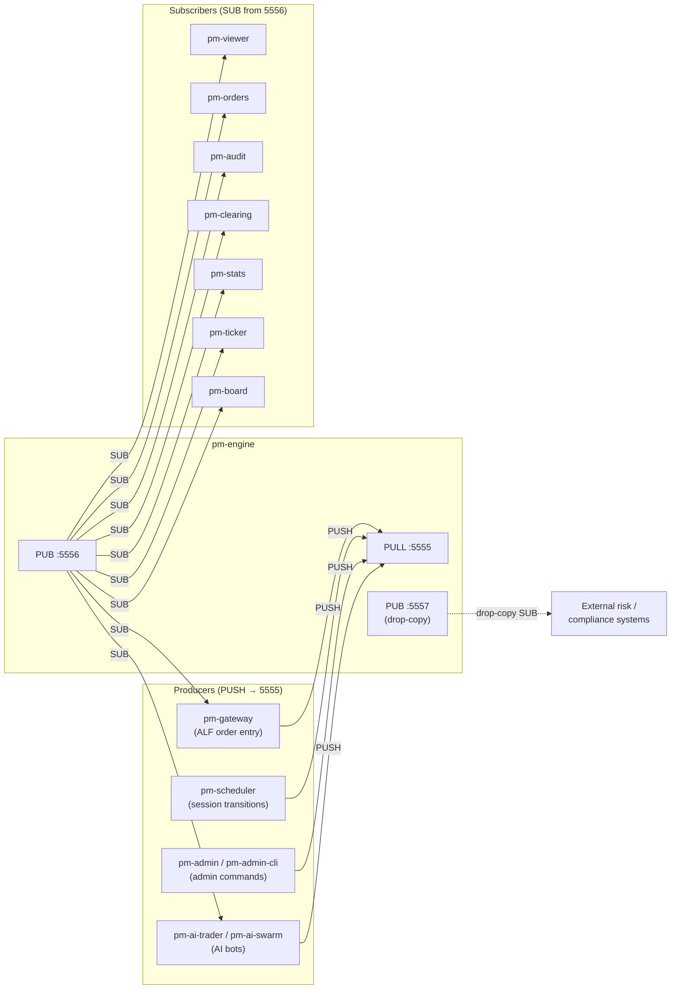
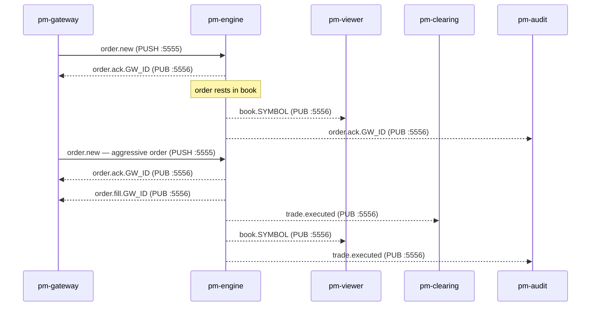

# Processes

!!! note "Learning objectives"
    After reading this page you will understand:

    - Why EduMatcher is built as a set of independent processes connected by a
      message bus rather than a single monolithic program
    - The trade-offs that architecture introduces: scalability and observability
      vs. deployment complexity and latency
    - The role and responsibilities of each of the twelve core runtime processes plus
      the optional AI trader and admin tools
    - Which processes are mandatory and which are optional observers
    - How to read the message-flow tables to trace an order from submission to fill


## Background — Why Separate Processes?

### The monolith approach

The simplest trading system is a single program: the user types an order,
the matching logic runs, and the result is printed — all in the same process.
This is easy to build, easy to debug, and fast.  It is also a dead end as soon
as you need any of the following:

- More than one trader connected simultaneously
- Observers (audit, statistics, P&L) that see every trade without modifying the
  matching logic
- The ability to restart one component without restarting everything
- A viewer that can run on a different machine from the engine

### The message-bus approach

EduMatcher distributes work across processes connected by a **ZeroMQ message
bus**. The engine owns three sockets:



The engine is the only process that writes to the order book.  Every other
process is either a **producer** (sends commands via PUSH) or a **subscriber**
(reads events via SUB), or both.  No process shares memory with any other.

| Port | Socket type | Bound by | Purpose |
|------|------------|----------|---------|
| **5555** | PULL | pm-engine | Receives all inbound commands (orders, cancels, admin) |
| **5556** | PUB | pm-engine | Broadcasts all market events (fills, book updates, session changes) |
| **5557** | PUB | pm-engine | Drop-copy feed — fill events tagged per gateway, with sequence numbers and replay support |

This design has concrete advantages:

| Advantage | How it helps |
|-----------|-------------|
| **Isolation** | A crashing viewer cannot corrupt the order book |
| **Observability** | Any subscriber can see every event without changing the engine |
| **Horizontal scale** | Multiple gateways connect simultaneously; each is independent |
| **Language freedom** | A subscriber can be written in any language that speaks ZeroMQ |
| **Testability** | The engine can be tested with a fake gateway; subscribers can be tested with recorded message streams |

And honest disadvantages:

| Disadvantage | Consequence |
|-------------|------------|
| **Latency** | Each message crosses a socket; a round-trip (order → engine → ACK) takes microseconds rather than nanoseconds on localhost |
| **Startup order** | The engine must bind before any other process connects |
| **Partial failure** | If the engine crashes mid-session, subscribers hold stale state until it restarts |
| **No shared clock** | Timestamps are set by the sender; two processes on different machines can disagree by milliseconds |
| **Message loss** | ZeroMQ PUB/SUB drops messages if a subscriber is slow; fast publishers can outrun slow consumers |

For an educational system running on a laptop, none of the disadvantages are
serious.  For a production exchange, each one would require careful engineering
(persistent queues, hardware timestamping, consensus protocols).

### The two bus patterns used here

| Pattern | Socket pair | Direction | Used for |
|---------|------------|-----------|---------|
| **PUSH/PULL** | Gateway PUSH → Engine PULL | One-to-one, reliable delivery | Sending commands (orders, cancel requests) to the engine |
| **PUB/SUB** | Engine PUB → many SUBs | One-to-many, topic-filtered | Broadcasting events (fills, book updates, session changes) |

PUSH/PULL guarantees delivery to exactly one receiver (the engine).
PUB/SUB does not guarantee delivery — a subscriber that is not yet connected
will miss messages sent before it subscribes.  This is why the engine publishes
an initial book snapshot on startup: late-joining viewers can request the
current state rather than waiting for the next change.


## Process Overview

A complete EduMatcher session uses **ten core runtime processes** across three categories, plus optional AI trader and admin entrypoints.

!!! info "Why `pm-`?"
    All CLI commands share the `pm-` prefix, short for **Process for Matching**.
    The prefix avoids name collisions with system utilities and makes it easy to
    identify EduMatcher processes in a process list (`ps aux | grep pm-`).

!!! tip "Installation modes"
    Commands are shown without a prefix. If you are running from a **source
    checkout** (developer mode), prepend `poetry run`:

    ```
    poetry run pm-engine --verbose
    ```

    If you installed with **pipx** (end-user mode), the commands are on your
    PATH and need no prefix:

    ```
    pm-engine --verbose
    ```

    See [Getting Started → Installation](00-getting-started.md#installation)
    for the full setup guide and the `pm-setup` bootstrap command.

## Environment variables

Two variables control where EduMatcher finds and stores files at runtime.
Set them once in your shell profile (`~/.zshrc` or `~/.bashrc`) and every
`pm-*` command picks them up automatically.

| Variable | Default (installed) | Default (source checkout) | Purpose |
|---|---|---|---|
| `EDUMATCHER_DATA_DIR` | `~/.local/share/edumatcher` | `<repo>/src/data/` | Directory for all persistent data files (`gtc_orders.json`, `stats.db`, `audit.log`, etc.) |
| `EDUMATCHER_CONFIG` | `./engine_config.yaml` (CWD) | `<repo>/engine_config.yaml` | Path to the engine configuration YAML |

The `--config` flag on `pm-engine` and `pm-scheduler` overrides both the
environment variable and the default.

```bash
# Example: per-session isolation
export EDUMATCHER_DATA_DIR="$HOME/sessions/morning"
export EDUMATCHER_CONFIG="$HOME/sessions/morning/engine_config.yaml"
pm-engine --verbose
```

**Core processes:**

| Process | Command | Role | Required? |
|---------|---------|------|-----------|
| **pm-engine** | `pm-engine` | Matching engine — the single writer | Yes |
| **pm-gateway** | `pm-gateway --id GW01` | ALF order entry terminal (one per trader) | At least one |
| **pm-scheduler** | `pm-scheduler` | Drives session phase transitions | No |
| **pm-viewer** | `pm-viewer --symbol AAPL` | Live order book display | No |
| **pm-orders** | `pm-orders` | Cross-gateway order status monitor | No |
| **pm-board** | `pm-board` | Full-screen multi-symbol display | No |
| **pm-ticker** | `pm-ticker` | Scrolling market data ticker | No (needs pm-stats) |
| **pm-stats** | `pm-stats` | OHLCV statistics to SQLite | No |
| **pm-clearing** | `pm-clearing` | P&L and trade settlement | No |
| **pm-audit** | `pm-audit` | Full event log to disk | No |

**Admin tools:**

| Process | Command | Role | Required? |
|---------|---------|------|-----------|
| **pm-admin** | `pm-admin` | Interactive admin console | No |
| **pm-admin-cli** | `pm-admin-cli <command>` | One-shot CLI admin commands | No |

**Optional AI trader tools:**

| Process | Command | Role | Required? |
|---------|---------|------|-----------|
| **pm-ai-trader** | `pm-ai-trader` | Single AI trading bot gateway | No |
| **pm-ai-swarm** | `pm-ai-swarm` | Coordinated multi-agent AI trading swarm | No |

!!! warning "Start the engine first"
    The engine binds the ZeroMQ sockets.  All other processes connect to those
    sockets.  If a process starts before the engine is ready, it will either fail
    immediately or silently lose its first messages.


## pm-engine — Matching Engine

The heart of the system — receives orders, matches them, publishes events.

```bash
pm-engine [--verbose] [--config engine_config.yaml]
```

| Flag | Description |
|------|-------------|
| `--verbose` / `-v` | Print each order received and trade produced to stdout |
| `--config` / `-c` | Path to engine config YAML (default: `engine_config.yaml`) |

**Startup behaviour**:
1. Creates `data/` directory if needed
2. Parses `engine_config.yaml` if present — registers symbol/gateway allowlists and session settings
3. Binds the main ZMQ PULL :5555 and PUB :5556 sockets during engine initialization
4. On `run()`, restores persisted book stats, GTC orders, and GTC combos
5. Applies config-driven seeds (book stats gaps, market-maker quotes, market-maker combos)
6. Tries to bind the dedicated drop-copy PUB :5557 socket
7. Publishes initial book snapshots for populated books and enters the poll loop

See [Configuration](01-configuration.md) for full details on the config file.

**Shutdown (Ctrl-C)**:
1. Serializes all resting GTC orders to `data/gtc_orders.json`
2. Publishes `order.expired` for all resting DAY orders
3. Publishes `system.eod` with the final book snapshot for every active symbol
4. Closes sockets

**Messages received** (PULL :5555):

| Topic | Source |
|---|---|
| `order.new` | Gateways |
| `order.cancel` | Gateways |
| `order.combo` | Gateways |
| `order.combo_cancel` | Gateways |
| `system.gateway_connect` | Gateways |
| `book.snapshot_request` | Viewers, Stats |
| `system.symbols_request` | Gateways, Stats |
| `order.orders_request` | Gateways |
| `risk.kill_switch` | Gateways, Admin |
| `risk.circuit_breaker_halt_all` | Admin gateways |
| `risk.circuit_breaker_resume_all` | Admin gateways |
| `session.transition` | Scheduler |

**Messages published** (PUB :5556):

| Topic | Purpose |
|---|---|
| `order.ack.{GW_ID}` | Order accepted/rejected |
| `order.fill.{GW_ID}` | Partial or full fill |
| `order.cancelled.{GW_ID}` | Cancel confirmation |
| `order.expired.{GW_ID}` | TIF expiry |
| `order.orders.{GW_ID}` | Order list reply |
| `combo.ack.{GW_ID}` | Combo accepted/rejected |
| `combo.status.{GW_ID}` | Combo lifecycle change |
| `trade.executed` | Every matched trade pair |
| `book.{SYMBOL}` | Book snapshot after every change |
| `session.state` | Session phase change |
| `auction.result.{SYMBOL}` | Auction uncross result |
| `system.gateway_auth.{GW_ID}` | Gateway authentication reply |
| `system.symbols.{GW_ID}` | Symbol list reply |
| `system.eod` | End-of-day broadcast |

**Messages published** (drop-copy PUB :5557):

| Topic | Purpose |
|---|---|
| `drop_copy.event.{GW_ID}` | Fill event with sequence number and nanosecond timestamp, filtered per gateway |

The drop-copy socket is lazily bound on startup. See [Drop-Copy Feed](13-drop-copy.md) for subscription protocol and replay support.

!!! warning
    Start the engine **first** — gateways and subscribers will fail to connect otherwise.


## pm-gateway — User Gateway

One instance per user. Accepts ALF commands on stdin.
See [ALF Protocol Reference](20-app-alf-protocol.md).

```bash
pm-gateway --id <GW_ID>
```

| Flag | Required | Description |
|------|----------|-------------|
| `--id` | Yes | Unique gateway identifier (e.g. `GW01`, `ALICE`) |

**Connection behaviour**:
1. Sends `system.gateway_connect` to the engine
2. Waits for `system.gateway_auth.<GW_ID>`
3. Enters command loop only if accepted

If the ID is not listed in `engine_config.yaml` under `gateways.alf`, connection
is refused and the gateway exits.

**Messages sent** (PUSH → :5555):

| Topic | Purpose |
|---|---|
| `system.gateway_connect` | Authentication request |
| `order.new` | Submit order |
| `order.cancel` | Cancel order |
| `order.combo` | Submit combo |
| `order.combo_cancel` | Cancel combo |
| `order.orders_request` | Request order list |
| `system.symbols_request` | Request symbol list |

**Messages subscribed** (SUB from :5556):

| Topic | Purpose |
|---|---|
| `system.gateway_auth.{own GW_ID}` | Authentication reply |
| `order.ack.{own GW_ID}` | Order acknowledgements |
| `order.fill.{own GW_ID}` | Fill notifications |
| `order.amended.{own GW_ID}` | Successful amend notifications |
| `order.cancelled.{own GW_ID}` | Cancel confirmations |
| `order.expired.{own GW_ID}` | Expiry notifications |
| `order.orders.{own GW_ID}` | Order list replies |
| `combo.ack.{own GW_ID}` | Combo acknowledgements |
| `combo.status.{own GW_ID}` | Combo status updates |
| `oco.ack.{own GW_ID}` | OCO creation acknowledgements |
| `oco.cancelled.{own GW_ID}` | OCO sibling-cancel notifications |
| `quote.ack.{own GW_ID}` | Quote acknowledgements |
| `quote.status.{own GW_ID}` | Quote lifecycle updates |
| `risk.kill_switch_ack.{own GW_ID}` | Kill-switch acknowledgement |
| `system.symbols.{own GW_ID}` | Symbol list reply |
| `trade.executed` | Global trade feed for last-price / P&L display |

See the [Gateway Reference](08-gateway.md) for the full command list.


## pm-viewer — Order Book Viewer

Live terminal view of a single symbol's order book.

```bash
pm-viewer --symbol AAPL [--depth 10]
```

| Flag | Default | Description |
|------|---------|-------------|
| `--symbol` / `-s` | required | Symbol to watch |
| `--depth` / `-d` | 10 | Number of price levels to show per side |

**Display**:
- Left panel: top-N **bid** levels (price, total qty, number of orders)
- Middle panel: top-N **ask** levels
- Right panel: 5 most recent trades with timestamps
- Header bar: symbol name, last trade price, last trade qty, refresh time

!!! note "Iceberg orders"
    Iceberg orders only show their `displayed_qty` (the visible peak) in the viewer.
    The hidden quantity is completely invisible — this is by design and demonstrates the
    privacy feature of iceberg orders.

Run multiple viewers simultaneously for different symbols:

```bash
pm-viewer --symbol AAPL &
pm-viewer --symbol MSFT &
pm-viewer --symbol TSLA
```

**Messages subscribed** (SUB from :5556):

| Topic | Purpose |
|---|---|
| `book.{SYMBOL}` | Book updates for the watched symbol |
| `session.state` | Session phase changes (displayed in header) |

**Messages sent** (PUSH → :5555):

| Topic | Purpose |
|---|---|
| `book.snapshot_request` | Requests initial book state on startup |


## pm-orders — Order Status Monitor

Live cross-gateway view of all orders in the system.

```bash
pm-orders [--gateway GW01]
```

| Flag | Default | Description |
|------|---------|-------------|
| `--gateway` / `-g` | (all) | Filter to a single gateway |

Displays a live table with columns:
`ID | Gateway | Symbol | Side | Type | TIF | Qty | Remaining | Price | Status | Updated`

Status colours: green=NEW, yellow=PARTIAL, bright green=FILLED, red=REJECTED/CANCELLED, dim=EXPIRED.

**Messages subscribed** (SUB from :5556):

| Topic | Purpose |
|---|---|
| `order.` (prefix) | All order events (ack, fill, cancelled, expired) |
| `combo.` (prefix) | Combo ack and status events |
| `session.state` | Session phase changes |


## pm-audit — Event Logger

Records every message on the bus to a rotating log file.

```bash
pm-audit [--log-file data/audit.log] [--terminal]
```

| Flag | Default | Description |
|------|---------|-------------|
| `--log-file` | `data/audit.log` | Output log file path |
| `--terminal` / `-t` | off | Also print each entry to stdout |

**Log format** (one entry per line):
```
[2026-04-29T14:32:01.123] [trade.executed] {"id": "...", "symbol": "AAPL", ...}
[2026-04-29T14:32:01.125] [book.AAPL] {"bids": [...], "asks": [...], ...}
```

Log files rotate at 10 MB with 5 backups kept.

Use `--terminal` during demos so the class can see every event in real time.

**Messages subscribed** (SUB from :5556):

| Topic | Purpose |
|---|---|
| *(empty prefix — receives all messages)* | Records everything published on the PUB socket |


## pm-clearing — Clearing & P&L

Records all trades and tracks running P&L per user per symbol.

```bash
pm-clearing
```

No flags required. Outputs:
- Inline trade confirmation for each `trade.executed` event
- Full P&L table every 10 trades
- Final P&L summary on Ctrl-C

Trade records are appended to `data/clearing_report.csv`:
```
trade_id,symbol,buy_order_id,sell_order_id,buy_gateway,sell_gateway,price,quantity,timestamp
```

**Messages subscribed** (SUB from :5556):

| Topic | Purpose |
|---|---|
| `trade.executed` | Every matched trade pair — drives P&L calculations |

See [P&L & Clearing](07-pnl-clearing.md) for the full accounting model.


## pm-stats — Statistics Recorder

Records market statistics for every symbol to a SQLite database (`data/stats.db`).

```bash
pm-stats [--db data/stats.db]
```

| Flag | Default | Description |
|------|---------|-------------|
| `--db` | `data/stats.db` | SQLite database file path |

**Subscriptions:**

| Topic | Purpose |
|---|---|
| `trade.*` | Updates OHLCV, VWAP, min/max, volume, trade log |
| `book.*` | Records opening bid/ask prices; drives 15-minute snapshots |
| `system.eod` | Records end-of-day closing bid/ask prices |

**On engine shutdown**, the engine broadcasts `system.eod` before closing sockets.
`pm-stats` receives it and immediately flushes the closing bid/ask for every active symbol
into `daily_stats`.

### How statistics are computed

**OHLCV and VWAP** accumulate in memory, one `SymbolStats` object per symbol, and are
flushed to `daily_stats` after each trade.

| Statistic | Trigger | Rule |
|-----------|---------|------|
| `open_price` | First `trade.*` of the day | Set once; never overwritten |
| `close_price` | Every `trade.*` | Always overwritten with the latest price |
| `high_price` | Every `trade.*` | Running `max(current, trade_price)` |
| `low_price` | Every `trade.*` | Running `min(current, trade_price)` |
| `volume` | Every `trade.*` | Cumulative sum of matched quantities |
| `trade_count` | Every `trade.*` | Incremented by 1 |
| `vwap` | Every `trade.*` | $\sum(price \times qty) / \sum(qty)$; maintained as two running accumulators |
| `largest_trade_qty/price` | Every `trade.*` | Replaced when `qty > current_largest` |
| `open_bid/ask` | First `book.*` update of the day | Set once from the book snapshot |
| `close_bid/ask` | `system.eod` | Overwritten with the final bid/ask from the book |

**15-minute price snapshots** are written to `price_snapshots` when a `book.*` message
arrives and at least 15 minutes have elapsed since the last snapshot for that symbol
(`SNAPSHOT_INTERVAL_SEC = 900`). The mid-price is computed as:

$$mid = \frac{best\_bid + best\_ask}{2}$$

If one side of the book is empty the available side is used as the mid-price; if both
sides are empty the last known trade price is used instead.

**Trade log** rows are appended on every `trade.*` event — no aggregation, one row per
matched trade pair, using the trade UUID from the engine as the primary key.

**Startup behaviour** — on startup `pm-stats` sends a `book.snapshot_request` via PUSH
`:5555` for every symbol it discovers from `system.symbols.STATS`. This primes the
`open_bid`/`open_ask` values and the first snapshot interval even before the first trade.

### Statistics Database Schema

The database lives at `data/stats.db` (SQLite 3). Three tables are maintained.

#### `daily_stats`

One row per `(date, symbol)`. Upserted on every trade and again when `system.eod` arrives.

| Column | Type | Description |
|---|---|---|
| `date` | TEXT (PK) | Calendar date `YYYY-MM-DD` |
| `symbol` | TEXT (PK) | Instrument ticker |
| `open_price` | REAL | Price of the first trade of the day |
| `high_price` | REAL | Highest trade price of the day |
| `low_price` | REAL | Lowest trade price of the day |
| `close_price` | REAL | Price of the last trade of the day |
| `open_bid` | REAL | Best bid at the time of the first book update |
| `open_ask` | REAL | Best ask at the time of the first book update |
| `close_bid` | REAL | Best bid recorded at engine shutdown (`system.eod`) |
| `close_ask` | REAL | Best ask recorded at engine shutdown (`system.eod`) |
| `volume` | INTEGER | Total traded quantity for the day |
| `trade_count` | INTEGER | Number of individual trades |
| `vwap` | REAL | Volume-weighted average price: $\sum(price \times qty) / \sum(qty)$ |
| `largest_trade_qty` | INTEGER | Quantity of the single largest trade |
| `largest_trade_price` | REAL | Price of the single largest trade |

Example query — end-of-day summary:
```sql
SELECT date, symbol,
       open_price, high_price, low_price, close_price,
       volume, trade_count,
       ROUND(vwap, 4) AS vwap
FROM daily_stats
ORDER BY date DESC, symbol;
```


#### `price_snapshots`

One row per `(ts, symbol)` written every **15 minutes** when a book update arrives.

| Column | Type | Description |
|---|---|---|
| `ts` | TEXT (PK) | ISO-8601 timestamp (UTC, second precision) |
| `symbol` | TEXT (PK) | Instrument ticker |
| `mid_price` | REAL | `(best_bid + best_ask) / 2`; falls back to whichever side is present, then `last_price` |
| `best_bid` | REAL | Best bid price at snapshot time (null if empty book) |
| `best_ask` | REAL | Best ask price at snapshot time (null if empty book) |
| `pct_change` | REAL | Percentage change of `mid_price` vs. previous snapshot: $100 \times (mid_{t} - mid_{t-1}) / mid_{t-1}$ |

Example query — intraday price path for MSFT:
```sql
SELECT ts, mid_price, best_bid, best_ask,
       ROUND(pct_change, 4) || '%' AS change
FROM price_snapshots
WHERE symbol = 'MSFT'
ORDER BY ts;
```


#### `trade_log`

Append-only record of every individual matched trade.

| Column | Type | Description |
|---|---|---|
| `ts` | TEXT | ISO-8601 timestamp (UTC, millisecond precision) |
| `trade_id` | TEXT (PK) | UUID from the engine |
| `symbol` | TEXT | Instrument ticker |
| `price` | REAL | Execution price |
| `quantity` | INTEGER | Matched quantity |
| `buy_gateway_id` | TEXT | Gateway that submitted the buy order |
| `sell_gateway_id` | TEXT | Gateway that submitted the sell order |

Example query — all trades for a symbol sorted by time:
```sql
SELECT ts, price, quantity, buy_gateway_id, sell_gateway_id
FROM trade_log
WHERE symbol = 'AAPL'
ORDER BY ts;
```

!!! tip "Querying the database"
    You can open `data/stats.db` with any SQLite client:
    ```bash
    sqlite3 data/stats.db
    .headers on
    .mode column
    SELECT * FROM daily_stats;
    ```


## pm-scheduler — Session Scheduler

Drives session-phase transitions (PRE_OPEN → OPENING_AUCTION → CONTINUOUS →
CLOSING_AUCTION → CLOSED) by sending `session.transition` messages to the
engine at configured wall-clock times.

```bash
pm-scheduler [--config engine_config.yaml] [--now] [--delay 3]
```

| Flag | Default | Description |
|------|---------|-------------|
| `--config` / `-c` | `engine_config.yaml` | Config file containing the `schedule` section |
| `--now` | off | Skip wall-clock waiting; send all transitions immediately with a delay between each |
| `--delay` | 3 | Seconds between transitions in `--now` mode |

**Messages sent** (PUSH → :5555):

| Topic | Purpose |
|---|---|
| `session.transition` | Requests the engine to move to the next session phase |

The scheduler does not subscribe to any PUB messages — it is fire-and-forget.

See [Auctions & Scheduling](06-auctions-scheduling.md) for the full schedule configuration
and session-phase documentation.


## pm-ticker — Scrolling Market Ticker

Prints a scrolling ticker-tape line at regular intervals — one line per snapshot
containing all active symbols with live prices, OHLCV, and bid/ask spreads.

```bash
pm-ticker [--interval 30] [--db data/stats.db] [--db-interval 900]
```

| Flag | Default | Description |
|------|---------|-------------|
| `--interval` | 30 | Seconds between printed ticker lines |
| `--db` | `data/stats.db` | Path to the statistics SQLite database |
| `--db-interval` | 900 | Seconds between daily_stats DB re-queries (15 min) |

**Output format** (one line per interval, scrolls up naturally):

```
09:15:00  ◆  MSFT  415.00  +0.48%  H:418.00  L:412.00  Vol:52,400 (8T)  414.50/415.50  ◆  AAPL …
```

Each symbol segment shows:

| Field | Description |
|-------|-------------|
| Symbol | Instrument name (bold cyan) |
| Last price | Most recent trade price or closing price from DB |
| Change % | Percentage change vs. today's open price (green if up, red if down) |
| H: / L: | Intraday high (green) and low (red) from the daily_stats table |
| Vol | Cumulative traded volume for the day |
| (nT) | Number of trades today |
| Bid/Ask | Current best bid (green) / best ask (red) from live book |

The ticker combines **live ZMQ data** (last price, bid/ask from `book.*` messages)
with **historical DB data** (OHLCV, trade count from `pm-stats`'s SQLite database).
The DB is re-queried every `--db-interval` seconds to pick up updated daily statistics.

**Messages subscribed** (SUB from :5556):

| Topic | Purpose |
|---|---|
| `book.` (prefix) | Live last price, best bid/ask per symbol |

!!! note "Depends on pm-stats"
    The ticker reads from `data/stats.db` which is populated by `pm-stats`.
    Without `pm-stats` running, the ticker still works but only shows live bid/ask
    and last price — OHLCV, volume, and trade count will be missing.


## pm-board — Market Board

Full-screen multi-symbol display designed for large monitors or projection screens.
Shows all active symbols in a single paged table with exchange-style colouring.

```bash
pm-board [--rows 8] [--interval 10]
```

| Flag | Default | Description |
|------|---------|-------------|
| `--rows` / `-r` | 8 | Maximum number of symbols (rows) displayed per page |
| `--interval` / `-i` | 10 | Seconds before auto-rotating to the next page |

**Controls:**

| Key | Action |
|-----|--------|
| ++enter++ | Advance to next page immediately |
| ++ctrl+c++ | Exit |

**Display columns:**

| Column | Description |
|--------|-------------|
| Symbol | Instrument ticker |
| Last | Last traded price (coloured green if up from first trade, red if down) |
| Chg % | Percentage change from the first trade of the session: $100 \times (last - first) / first$ |
| Bid | Best (highest) bid price currently in the book |
| Ask | Best (lowest) ask price currently in the book |
| Spread | Difference between best ask and best bid: $ask - bid$ |
| Last Buy | Last trade price where this symbol was bought (green) |
| Last Sell | Last trade price where this symbol was sold (red) |
| Vol | Cumulative traded volume for the session |
| Updated | Timestamp of the most recent book update for this symbol |

The header bar shows: page number, total pages, number of active symbols, the
auto-rotate interval, and the current clock time.

**Paging behaviour:**

- Symbols are sorted alphabetically and divided into pages of `--rows` symbols each.
- The display auto-rotates to the next page every `--interval` seconds.
- When the last page is reached, rotation wraps back to page 1.
- Pressing ENTER advances immediately and resets the auto-rotate timer.

**Colour conventions** (matching standard exchange displays):

- **Green** — price increase, buy trades, positive change %
- **Red** — price decrease, sell trades, negative change %
- **White** — unchanged or neutral values

**Messages subscribed** (SUB from :5556):

| Topic | Purpose |
|---|---|
| `book.` (prefix) | Book updates for all symbols — discovers symbols automatically |
| `trade.executed` | Every matched trade — drives volume and last-price tracking |

!!! tip "Large-screen demo"
    For classroom or conference demos, maximise the terminal and use large rows:
    ```bash
    pm-board --rows 15 --interval 8
    ```
    The board auto-discovers symbols as they become active — no configuration needed.

## Optional AI trader tools

EduMatcher ships two AI-focused entrypoints that connect to the bus as
ordinary gateway producers:

| Process | Command | Role |
|---------|---------|------|
| **pm-ai-trader** | `pm-ai-trader` | Single automated trader using the gateway interface |
| **pm-ai-swarm** | `pm-ai-swarm` | Multi-agent trading swarm / orchestration entrypoint |

See [AI Bot Traders](../developer/02-ai-bot.md) for configuration and runtime details.


## pm-admin — Interactive Admin Console

An interactive REPL for sending operational commands to a running engine without
needing a full gateway session.

```bash
pm-admin
```

No flags required. On launch the console connects to the engine and presents a
prompt. Supported commands include kill-switch, circuit-breaker halt/resume,
and other operational controls.

**Messages sent** (PUSH → :5555):

| Topic | Purpose |
|---|---|
| `risk.kill_switch` | Trigger an exchange-wide order kill |
| `risk.circuit_breaker_halt_all` | Halt all symbols (requires ADMIN gateway role) |
| `risk.circuit_breaker_resume_all` | Resume all halted symbols (requires ADMIN gateway role) |

**Messages subscribed** (SUB from :5556):

| Topic | Purpose |
|---|---|
| `system.gateway_auth.{GW_ID}` | Authentication reply |
| `risk.kill_switch_ack.{GW_ID}` | Kill-switch acknowledgement |
| `session.state` | Session phase changes |


## pm-admin-cli — CLI Admin Commands

A non-interactive alternative to `pm-admin` for scripting or single-shot
operational commands.

```bash
pm-admin-cli <command> [options]
```

Each invocation sends one command to the engine, waits for an acknowledgement,
prints the result, and exits. Suitable for use in shell scripts and CI
automation.


## Order Lifecycle Message Flow

The following diagram traces a single limit order from submission to full fill,
showing which process sends each message and on which socket:



All subscribers (`pm-viewer`, `pm-clearing`, `pm-audit`, `pm-stats`, `pm-board`,
etc.) receive the same `trade.executed` and `book.{SYMBOL}` events concurrently
from the single PUB socket — none of them coordinate with each other.


## Planned Processes

The following processes are documented as design proposals and will be added in
future releases. They do not yet exist as runnable scripts.

| Process | Protocol | Purpose | Status |
|---------|----------|---------|--------|
| **pm-balf-gateway** | BALF | Binary order entry gateway for low-latency programmatic clients | Design proposal |
| **pm-md-gwy** | CALF | Market-data distribution gateway delivering order-book snapshots, trade prints, and session-state changes over TCP | Design proposal |
| **pm-index** | — | Real-time index calculation service publishing index values on port 5558 | Design proposal |

See the [BALF Protocol Reference](21-app-balf-protocol.md) and [CALF Protocol Reference](22-app-calf-protocol.md) for the message specifications these processes will implement.

## See also

- [Running the Engine](03-running-the-engine.md) — startup order, launch scripts, and verification
- [Configuration](01-configuration.md) — how each process is configured via `engine_config.yaml`
- [Messages](09-messages.md) — the full ZeroMQ message catalog all processes share
- [Persistence](11-persistence.md) — which process writes which data file
- [Drop Copy](13-drop-copy.md) — the engine's built-in :5557 drop-copy feed
