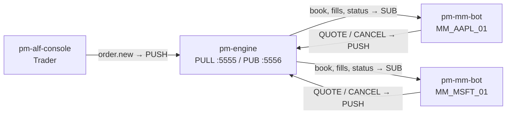
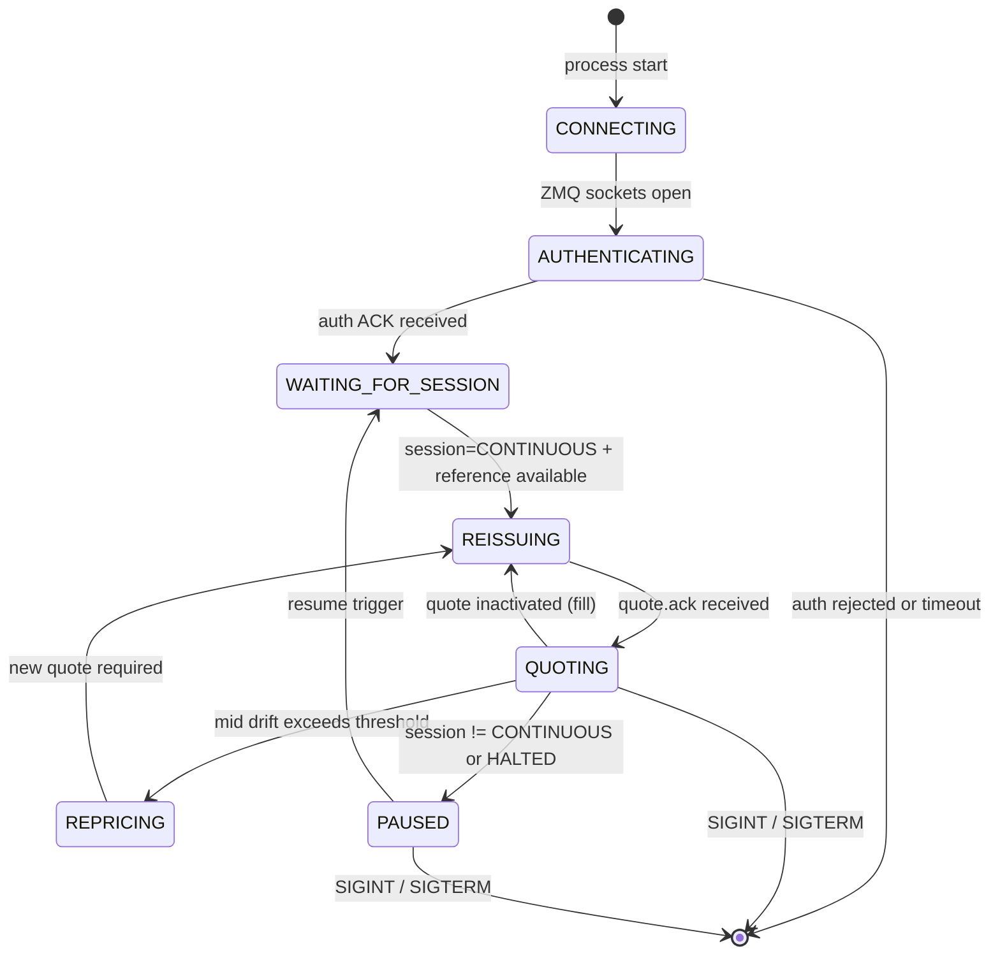

# Market-Maker Bot (pm-mm-bot)

!!! note "Learning objectives"
    After reading this page you will understand:

    - What `pm-mm-bot` is and how it differs from manual `QUOTE` commands
    - How to launch one or more autonomous market-maker bot instances
    - How one instance can quote several symbols at once with `--symbols`,
      and when to prefer that over one process per symbol
    - The bot's lifecycle: startup handshake, quoting, repricing, and shutdown
    - How quote refresh works after fills and mid-price drift
    - How to configure gateway entries in `engine_config.yaml` for MM bots
    - How to bootstrap a fresh exchange with no existing book data
    - How to keep a bot's parameters in a version-controlled `--config` file

    **Prerequisites**: [Market Making](090-market-maker.md) — understand the `QUOTE` command,
    `quote_refresh_policy`, and `disconnect_behaviour` before using the bot.
    [Configuration](010-configuration.md) — each bot instance needs a pre-registered
    `MARKET_MAKER` gateway in the engine config.

---

## What is pm-mm-bot?

`pm-mm-bot` is an **autonomous market-maker process** that keeps one or more
symbols liquid without human intervention. It connects to the engine as a
single `MARKET_MAKER` gateway, posts a two-sided quote (bid and ask) per
symbol it covers, and automatically reprices each one when:

- One side of that symbol's quote is filled
- That symbol's mid-price drifts beyond a configurable threshold
- The session state changes (e.g. entering or leaving an auction phase)

A single instance can quote **one symbol or several** from the same process,
behind the same gateway ID — nothing on the engine side ties a
`MARKET_MAKER` gateway to a single symbol (the engine's `QuoteIndex` keys
every active quote by `(gateway_id, symbol)` and tracks a *set* of such keys
per gateway). Each symbol progresses through its own copy of the bot's state
machine independently: a fill, cancel, drift, or QLEGS divergence on one
symbol never touches another symbol's quoting.

```bash
# One process, one symbol (the classic form, still the default)
pm-mm-bot --symbol AAPL

# One process, several symbols
pm-mm-bot --symbols AAPL,MSFT,TSLA
```

Running one instance per symbol (as separate processes) is still fully
supported and is the right choice when you want independent OS-level
failure domains — a crash in one symbol's process cannot affect another's:

```bash
pm-mm-bot --symbol AAPL &
pm-mm-bot --symbol MSFT &
pm-mm-bot --symbol TSLA &
```

Multiple instances can also compete on the same symbol — they appear as
independent market makers in the book (use `--id-suffix` to distinguish them).

| Feature | Manual `QUOTE` | `pm-mm-bot` |
|---|---|---|
| Requires human operator | Yes | No |
| Automatic reissue after fill | No | Yes |
| Drift-based repricing | No | Yes |
| Session-aware (pause in auctions) | Manual | Automatic |
| Multiple symbols per process | N/A | Built-in (`--symbols`) |
| Multiple instances per symbol | Possible | Built-in (`--id-suffix`) |

!!! note "One process vs. several — which to use"
    Both are legitimate, for different scenarios. `--symbols` is the right
    default when you just want a handful of symbols quoted with one set of
    parameters and one thing to launch, stop, and watch in the logs — it is
    also the only way to get a genuinely shared process (one PUSH/SUB
    connection, one auth handshake, one heartbeat clock) across symbols. One
    process per symbol is the right choice when symbols need materially
    different parameters (different `--gap`, `--strategy`, or timeouts), or
    when you specifically want a bad symbol (say, one that keeps getting
    rejected) to be unable to affect any other symbol's process at all — see
    [Per-symbol failure isolation](#per-symbol-failure-isolation) below for
    how a `--symbols` bot already isolates a *failing* symbol without a
    separate process, which covers most of that second concern on its own.

---

## Quick start

```bash
# Start a market maker for AAPL with default settings
pm-mm-bot --symbol AAPL

# With explicit spread and quantity
pm-mm-bot --symbol AAPL --gap 0.10 --qty 500

# In Poetry development mode
poetry run pm-mm-bot --symbol AAPL --gap 0.10 --qty 500 -v
```

Before launching, ensure the gateway ID is registered in `engine_config.yaml`:

```yaml
gateways:
  alf:
    - id: MM_AAPL_01
      description: "AAPL market-maker bot"
      role: MARKET_MAKER
      disconnect_behaviour: CANCEL_QUOTES_ONLY
      quote_refresh_policy: INACTIVATE_ON_ANY_FILL
```

---

## Gateway identity convention

A single-symbol bot instance uses the gateway ID format:

```
MM_<SYMBOL>_<nn>
```

Where `<SYMBOL>` is the symbol in uppercase and `<nn>` is the two-digit suffix
from `--id-suffix` (default `01`).

| `--symbol` | `--id-suffix` | Gateway ID |
|---|---|---|
| `AAPL` | `01` (default) | `MM_AAPL_01` |
| `AAPL` | `02` | `MM_AAPL_02` |
| `MSFT` | `01` | `MM_MSFT_01` |

A `--symbols` bot derives the same shape from every symbol it covers, joined
with underscores, unless `--label` overrides that segment directly:

| `--symbols` | `--label` | Gateway ID |
|---|---|---|
| `AAPL,MSFT` | *unset* | `MM_AAPL_MSFT_01` |
| `AAPL,MSFT,TSLA` | `TECH` | `MM_TECH_01` |

`--label` exists because `MM_<SYMBOL>_<nn>` has no natural multi-symbol form
once the symbol list grows — a five-symbol gateway ID built by joining every
symbol is legal but unwieldy in logs and `pm-admin`. Pick a short label (e.g.
a sector or desk name) once the symbol list stops being self-describing at a
glance.

This convention makes bot gateways immediately identifiable in logs, the admin
console (`pm-admin`), and the order book viewer (`pm-board`).

---

## Architecture

Each `pm-mm-bot` instance is a standalone process that communicates with the
engine using the same ZMQ PUSH/SUB pattern as all other participants — one
PUSH/SUB pair per process regardless of how many symbols that process quotes:



Here `B1` and `B2` are two separate processes, each quoting one symbol —
the same diagram describes a single `--symbols AAPL,MSFT` process just as
well by collapsing `B1`/`B2` into one box `MM_AAPL_MSFT_01` with two QUOTE
streams into the same PUSH socket instead of two sockets.

---

## Bot lifecycle

### State machine

The bot progresses through a well-defined set of states:



### Startup sequence

1. Open ZMQ sockets (PUSH and SUB) — once per process, not once per symbol
2. Send `gateway_connect` and wait for `gateway_auth` ACK — once per process
3. Request symbol list and verify every `--symbol`/`--symbols` entry exists
4. For each symbol: send `QBOOT` — if an active quote already exists for
   this `(gateway_id, symbol)` pair, adopt it instead of creating a
   duplicate
5. For each symbol: send `QLEGS` to reconcile quote-leg mapping
6. Wait for `session.state` event (fail fast if not received within
   timeout) — once per process, since session state applies to the whole
   exchange rather than to one symbol
7. For each symbol still active after steps 3–5: resolve its initial
   reference price and begin quoting

Steps 3–5 and 7 run once per symbol and are where
[per-symbol failure isolation](#per-symbol-failure-isolation) applies: a
symbol that fails one of these checks is excluded from quoting rather than
aborting the whole process, as long as at least one other symbol succeeds.

### Per-symbol failure isolation

A `--symbols` bot does not treat a startup problem with one symbol as fatal
to the others. If, say, `AAPL`'s `--gap` violates its `mm_max_spread_ticks`
obligation while `MSFT`'s does not, the bot logs `AAPL` as excluded and
continues quoting `MSFT` — the process only exits with a startup failure if
*every* symbol fails its checks (exactly the single-symbol behavior, applied
to the whole symbol set rather than to one symbol). The same isolation
applies to any other per-symbol startup failure: an unknown symbol, an
invalid strategy/gap/tick combination, or no reference price available.

This is a startup-time check only — once a symbol is quoting, a runtime
problem specific to that symbol (a rejected quote, a circuit-breaker halt)
already only affects that symbol's own state, the same way it always has;
see [Session state handling](#session-state-handling) and
[Quote refresh logic](#quote-refresh-logic) above.

### Graceful shutdown

On `SIGINT` (Ctrl+C) or `SIGTERM`, the bot:

1. Sends `quote.cancel` for every symbol still quoting
2. Waits up to `--shutdown-timeout-sec` for cancel confirmation
3. Closes ZMQ sockets and exits

---

## Pricing logic

### Mid-price tracking

The bot tracks the current mid-price from the order book:

- **Both sides present**: `mid = (best_bid + best_ask) / 2`
- **Ask only**: `mid = best_ask`
- **Bid only**: `mid = best_bid`
- **No data**: keep previous mid

### Quote placement

Given the mid-price and `--gap` (total spread), the bot places:

- **Bid** at `mid − gap/2`, rounded to the nearest tick
- **Ask** at `mid + gap/2`, rounded to the nearest tick

A minimum spread of 2 ticks is always guaranteed, even after rounding.

### Drift detection

After posting a quote, the bot records the mid at the time of posting. On each
book update, it checks whether the mid has moved by more than `--drift-ticks`
ticks. If so, it cancels and reissues at the new mid.

---

## Quote refresh logic

### Refresh triggers

| Trigger | Action |
|---|---|
| Quote inactivated (one side filled) | Reissue after `--reissue-delay-ms` |
| Mid-price drift exceeds threshold | Cancel active quote, then reissue at new mid |
| Quote rejected | Retry after delay |
| Periodic heartbeat (no active quote) | Reissue |
| Periodic QLEGS reconciliation mismatch | Clear local state and reissue |

### Reissue delay

After a fill, the bot waits `--reissue-delay-ms` (default: 200 ms) before
reissuing. If multiple fills arrive in quick succession, the timer resets on
each fill — resulting in exactly one reissue after the burst settles.

### Cancel timeout guard

When the bot is replacing an active quote, it first sends `quote.cancel` and
waits up to `--cancel-timeout-sec` for lifecycle confirmation. If no
confirmation arrives within that window, it forces a safe replacement by
clearing local quote IDs and sending a fresh `quote.new`.

### Self-healing against dropped messages

ZMQ delivery is best-effort, so the bot is built to recover if an engine reply
is ever lost:

- **Dropped `quote.ack`** — after sending a quote the bot waits for the ack to
  confirm it. If the ack never arrives, the heartbeat guard notices it holds no
  live quote and, once a full `--heartbeat-interval-sec` has elapsed since the
  last quote was sent (so an in-flight ack is never pre-empted), it reissues.
- **Periodic QLEGS reconciliation** — every `--qlegs-reconcile-interval-sec` the
  bot requests a fresh quote-leg snapshot (`QLEGS`). The request is
  non-blocking: the reply is processed in the normal event loop, so fills and
  status updates are never missed while the snapshot is outstanding. If the
  snapshot shows no legs, a different `quote_id`, or different leg order IDs than
  the bot is tracking, it clears its local state and reissues to converge.

---

## Session state handling

The bot respects the exchange session lifecycle:

| Session State              | Bot Behaviour                       |
|----------------------------|-------------------------------------|
| `PRE_OPEN`                 | Wait — do not quote                 |
| `OPENING_AUCTION`          | Cancel any live quote; wait         |
| `CONTINUOUS`               | Post and maintain a two-sided quote |
| `CLOSING_AUCTION`          | Cancel any live quote; wait         |
| `CLOSED`                   | Cancel any live quote; wait         |
| `HALTED` (circuit breaker) | Cancel and pause immediately        |

When the session transitions to `CONTINUOUS`, the bot resumes quoting
automatically.

---

## Bootstrap: starting with an empty book

When the exchange starts fresh (no existing book or trades), the bot needs an
initial reference price. It resolves one using this priority:

1. **QBOOT** — active quote from a previous session (restart recovery)
2. **Book mid / last trade** — the current book mid if another participant has
   posted orders, otherwise the most recent `trade.executed` price
3. **Bootstrap quote** — inactive quote prices from QBOOT
4. **Random range** — `--initial_min` to `--initial_max` (configurable)

If no source is available and no random range is configured, the bot exits with
a clear error message.

```bash
# Bootstrap from random price range when the book is empty
pm-mm-bot --symbol AAPL --initial_min 95.00 --initial_max 105.00
```

---

## CLI reference

| Argument                           | Default                | Description                                                        |
|------------------------------------|------------------------|--------------------------------------------------------------------|
| `--config PATH`                    | *unset*                | YAML file supplying any flag below by long name (see [Config file](#config-file)) |
| `--symbol SYM`                     | *required¹*             | Instrument to make a market in — mutually exclusive with `--symbols` |
| `--symbols SYM1,SYM2,...`          | *required¹*             | Comma-separated symbols to quote from one process — mutually exclusive with `--symbol` |
| `--label NAME`                     | *derived*               | Override the gateway-ID symbol segment (default: `--symbol`, or every `--symbols` entry joined with `_`) |
| `--strategy NAME`                  | `symmetric`            | Pricing strategy (only `symmetric` exists today)                   |
| `--gap PRICE`                      | `0.10`                 | Total spread (bid at mid−gap/2, ask at mid+gap/2)                  |
| `--qty N`                          | `500`                  | Quote size on each leg                                             |
| `--id-suffix NN`                   | `01`                   | Running number for gateway ID (`MM_AAPL_01`)                       |
| `--drift-ticks N`                  | `3`                    | Reprice when mid moves by this many ticks                          |
| `--reissue-delay-ms N`             | `200`                  | Wait after fill before re-issuing                                  |
| `--tif {DAY,GTC}`                  | `DAY`                  | Time-in-force for quote legs                                       |
| `--heartbeat-interval-sec F`       | `5.0`                  | Periodic live-quote check interval                                 |
| `--startup-session-timeout-sec F`  | `5.0`                  | Max wait for first `session.state`                                 |
| `--bootstrap-timeout-sec F`        | `1.0`                  | Max wait for QBOOT reply                                           |
| `--cancel-timeout-sec F`           | `1.0`                  | Max wait for cancel confirmation before forced replacement reissue |
| `--shutdown-timeout-sec F`         | `2.0`                  | Max wait for cancel on SIGINT/SIGTERM                              |
| `--qlegs-reconcile-interval-sec F` | `15.0`                 | Periodic QLEGS reconciliation interval                             |
| `--initial_min PRICE`              | *unset*                | Lower bound for random bootstrap price                             |
| `--initial_max PRICE`              | *unset*                | Upper bound for random bootstrap price                             |
| `--engine-pull ADDR`               | `tcp://127.0.0.1:5555` | Engine PUSH/PULL address                                           |
| `--engine-pub ADDR`                | `tcp://127.0.0.1:5556` | Engine PUB address                                                 |
| `--log-level`                      | `WARNING`              | Explicit level: `CRITICAL`, `ERROR`, `WARNING`, `INFO`, `DEBUG`    |
| `-v`, `--verbose`                  | `false`                | Increase verbosity (`-v` enables bot debug prints, `-vv` sets DEBUG) |
| `-q`, `--quiet`                    | `false`                | Reduce output to warnings/errors                                   |

¹ Exactly one of `--symbol` or `--symbols` is required, directly or via
`--config` — giving both, or neither, is a startup usage error.

---

## Config file

Every flag above except `--config` itself and the logging flags
(`--log-level`, `-v`/`--verbose`, `-q`/`--quiet`, `--log-target`, `--log-file`,
`--log-failover-timeout`) can instead live in a YAML file, keyed by the flag's
long name with dashes replaced by underscores:

```yaml
# mm_aapl.yaml
symbol: AAPL
id_suffix: "01"
strategy: symmetric
gap: 0.08
qty: 300
tif: GTC
drift_ticks: 4
```

```bash
pm-mm-bot --config mm_aapl.yaml
```

A multi-symbol bot's file uses `symbols:` instead of `symbol:`, as either a
YAML list or the same comma-separated string the CLI takes — both are
accepted and mean the same thing:

```yaml
# mm_tech.yaml
symbols:
  - AAPL
  - MSFT
label: TECH
strategy: symmetric
gap: 0.08
qty: 300
```

```bash
pm-mm-bot --config mm_tech.yaml
```

An explicit CLI flag always overrides the same key from the file — so
`pm-mm-bot --config mm_aapl.yaml --gap 0.12` quotes with `gap=0.12` even
though the file says `0.08`. This makes it easy to keep one committed file
per symbol (or symbol group) for a classroom session while still overriding
a single value from the command line for a one-off run. A gap set in the
file (like a `--gap` typed on the CLI) counts as an explicit choice: the bot
will not silently override it with the MM-obligation default described in
[Gap validation](#gap-validation) below.

`--symbol` or `--symbols` may be omitted from the CLI as long as the config
file supplies one of them; `pm-mm-bot` fails fast with a usage error if
neither does, and equally fails fast if both `--symbol` and `--symbols` end
up set (from any combination of CLI and file). An unknown key in the file (a
typo, or a flag name spelled with dashes instead of underscores) is also a
fast, explicit startup failure rather than being silently ignored.

### Pricing strategies

`--strategy` (or the file's `strategy:` key) selects which pricing logic the
bot uses to compute bid/ask from the tracked mid-price. `symmetric` — quote
symmetrically around mid at a fixed `--gap`, described in
[Pricing logic](#pricing-logic) above — is the only strategy shipped today.
The bot fails fast at startup if `--strategy` names anything else. The
selection point exists so a future strategy (e.g. one that skews the quote
by inventory, or widens the gap with volatility) can be added as a new
pricing module without changing the bot's state machine, ZMQ handling, or
CLI plumbing.

---

## Engine configuration

### Gateway registration

Each bot instance — whether it quotes one symbol or several — must be
pre-registered as a single gateway entry in `engine_config.yaml`:

```yaml
gateways:
  alf:
    - id: MM_AAPL_01
      description: "AAPL market-maker bot instance 1"
      role: MARKET_MAKER
      disconnect_behaviour: CANCEL_QUOTES_ONLY
      quote_refresh_policy: INACTIVATE_ON_ANY_FILL
      enforce_mm_obligation: true
      mm_max_spread_ticks: 10
      mm_min_qty: 100
      smp_action: CANCEL_RESTING

    - id: MM_AAPL_02
      description: "AAPL market-maker bot instance 2"
      role: MARKET_MAKER
      disconnect_behaviour: CANCEL_QUOTES_ONLY
      quote_refresh_policy: INACTIVATE_ON_ANY_FILL
```

A `pm-mm-bot --symbols AAPL,MSFT --label TECH` process registers as *one*
gateway entry the same way — nothing in `gateways:` names which symbols a
`MARKET_MAKER` gateway quotes, since that's the bot's own `--symbol`/
`--symbols` choice, not an engine-config concept:

```yaml
gateways:
  alf:
    - id: MM_TECH_01
      description: "AAPL+MSFT market-maker bot"
      role: MARKET_MAKER
      disconnect_behaviour: CANCEL_QUOTES_ONLY
      quote_refresh_policy: INACTIVATE_ON_ANY_FILL
      enforce_mm_obligation: true
      mm_max_spread_ticks: 10
      mm_min_qty: 100
```

One easy-to-miss consequence: the per-symbol `market_maker_quotes` seed
(needed to bootstrap a fresh exchange — see
[Bootstrap](#bootstrap-starting-with-an-empty-book)) is required on **every**
symbol once **any** `MARKET_MAKER` gateway exists in the config, regardless
of which gateway is meant to quote which symbol (`pm-cverifier`'s check
`M001` enforces this). So `MM_TECH_01`'s config needs a seed under both
`symbols.AAPL.market_maker_quotes` and `symbols.MSFT.market_maker_quotes`,
each referencing `MM_TECH_01` — `pm-config-gen --seed-mm-mid-range` generates
these automatically for every symbol, so this is only a concern when writing
`engine_config.yaml` by hand.

### Recommended settings

- **`disconnect_behaviour: CANCEL_QUOTES_ONLY`** — ensures stale quotes are
  removed if the bot crashes or restarts
- **`quote_refresh_policy: INACTIVATE_ON_ANY_FILL`** — the engine cancels the
  remaining leg when either side fills, triggering an immediate reissue
- **`smp_action`** — self-match-prevention default for this gateway (`NONE`
  if unset). Since `mm_bot` only ever submits `QUOTE`s (no plain `NEW`/combo
  orders), this is the *only* SMP control it has — quote legs have no
  per-request `SMP=` field of their own, so a bid/ask leg sweeping into a
  resting order from the *same* gateway id (e.g. a stale leg left over from
  a prior quote) is always handled per this gateway-level setting instead of
  self-trading. See
  [Configuration Spec §5.2](990-app-config-spec.md#52-gatewaysalf-required)
  for the full `SmpAction` value list and how this default also applies to
  `NEW`/combo orders from other gateway roles when they omit `SMP=`. See
  [Risk Controls — Self-Match Prevention](120-risk-controls.md#self-match-prevention-smp)
  for the full conceptual explanation, including a worked example of exactly
  this stale-quote-leg scenario

### Gap validation

The bot enforces pricing validity at startup, per symbol (each symbol has
its own `tick_size` and, potentially, its own `mm_max_spread_ticks`):

- `gap >= 2 * tick_size` (via pricer validation)
- if `mm_max_spread_ticks` is available in that symbol's metadata, the bot
  validates `gap <= mm_max_spread_ticks * tick_size`

Defaulting rules:

- An explicitly supplied `--gap` (in either the `--gap 0.10` or `--gap=0.10`
  form) is always respected for every symbol — it is only validated against
  each symbol's obligation, never overridden.
- If `--gap` is not provided and `mm_max_spread_ticks` is available for a
  symbol, that symbol's gap defaults to half its max spread:
  `(mm_max_spread_ticks / 2) * tick_size`. On a `--symbols` bot this can
  differ per symbol — `AAPL` and `MSFT` need not end up with the same
  effective gap.
- If no MM spread metadata is available for a symbol, that symbol uses the
  standard `0.10` default.

A symbol whose validated gap violates its own obligation is excluded from
quoting rather than failing the whole process — see
[Per-symbol failure isolation](#per-symbol-failure-isolation) above.

---

## Usage examples

### Single symbol, default settings

```bash
pm-mm-bot --symbol AAPL
```

### One process quoting several symbols

```bash
pm-mm-bot --symbols AAPL,MSFT,TSLA --label TECH
```

### Two competing MMs on the same symbol

```bash
pm-mm-bot --symbol AAPL --gap 0.08 --qty 500 &
pm-mm-bot --symbol AAPL --gap 0.12 --qty 300 --id-suffix 02 &
```

### Faster repricing for volatile sessions

```bash
pm-mm-bot --symbol MSFT --gap 0.20 --drift-ticks 1 --reissue-delay-ms 100
```

### Fresh exchange with no book data

```bash
pm-mm-bot --symbol AAPL --initial_min 95.00 --initial_max 105.00
```

### Verbose mode for troubleshooting

```bash
pm-mm-bot --symbol AAPL --gap 0.10 --qty 500 -v
```

### Config file, with one value overridden on the CLI

```bash
pm-mm-bot --config mm_aapl.yaml --gap 0.12
```

---

## Understanding bot output

Each bot prefixes every log line with its gateway ID and timestamp. At default
verbosity the bot is quiet — it only logs milestones and problems, not routine
quoting activity:

```
[MM:MM_AAPL_01 09:30:00] starting: symbols=AAPL strategy=symmetric gap=0.1 qty=500 tif=DAY drift_ticks=3
[MM:MM_AAPL_01 09:30:01] authenticated
[MM:MM_AAPL_01 09:30:01] bootstrap from random range: 150.00
[MM:MM_AAPL_01 09:30:14] quote REJECTED: gap exceeds mm_max_spread_ticks
[MM:MM_AAPL_01 09:30:20] circuit breaker HALT
[MM:MM_AAPL_01 09:30:45] circuit breaker RESUME
[MM:MM_AAPL_01 09:31:02] heartbeat: no active quote — reissuing
[MM:MM_AAPL_01 09:31:10] QLEGS mismatch: quote_id divergence — reissuing
[MM:MM_AAPL_01 09:35:00] shutdown complete
```

The `starting:` line reports the bot's resolved configuration and is always
visible — you don't need `-v` to confirm what a running bot is actually
configured to quote. For a `--symbols` bot, `symbols=` lists every symbol
the process covers (e.g. `symbols=AAPL,MSFT`), and every per-symbol log line
below carries an additional `[SYMBOL]` tag ahead of the message so you can
tell which symbol a given quoting decision belongs to:

```
[MM:MM_TECH_01 09:30:00] starting: symbols=AAPL,MSFT strategy=symmetric gap=0.1 qty=500 tif=DAY drift_ticks=3
[MM:MM_TECH_01 09:30:01] authenticated
[MM:MM_TECH_01 09:30:01] [AAPL] bootstrap from random range: 150.00
[MM:MM_TECH_01 09:30:01] [MSFT] bootstrap from random range: 310.00
[MM:MM_TECH_01 09:30:14] [AAPL] quote REJECTED: gap exceeds mm_max_spread_ticks
[MM:MM_TECH_01 09:30:14] [AAPL] startup failed: --gap exceeds mm_max_spread_ticks obligation
[MM:MM_TECH_01 09:30:14] running symbols=['MSFT'] session=CONTINUOUS
[MM:MM_TECH_01 09:30:20] [MSFT] circuit breaker HALT
[MM:MM_TECH_01 09:30:45] [MSFT] circuit breaker RESUME
[MM:MM_TECH_01 09:35:00] shutdown complete
```

Here `AAPL` failed its gap-vs-obligation check at startup (see
[Per-symbol failure isolation](#per-symbol-failure-isolation)) and was
excluded, while `MSFT` continued on its own — the `running symbols=[...]`
line always reports exactly which symbols made it into the main quoting
loop.

With `--verbose` (`-v`), the bot additionally logs routine quoting activity —
symbol/session updates, every quote sent, every fill, and every repricing
decision:

```
[MM:MM_AAPL_01 09:30:01] symbols received: ['AAPL', 'MSFT', 'TSLA']
[MM:MM_AAPL_01 09:30:01] reference from book/trade: 150.00
[MM:MM_AAPL_01 09:30:01] QUOTE sent bid=149.95 ask=150.05
[MM:MM_AAPL_01 09:30:01] quote ACK id=q-001
[MM:MM_AAPL_01 09:30:14] fill: ASK 200@150.05
[MM:MM_AAPL_01 09:30:15] QUOTE sent bid=149.95 ask=150.05
[MM:MM_AAPL_01 09:31:02] drift detected — repricing
[MM:MM_AAPL_01 09:31:02] state: QUOTING -> REPRICING
[MM:MM_AAPL_01 09:31:02] QUOTE sent bid=149.99 ask=150.09
```

`-v` also raises the underlying log level and enables the bot's own debug
prints together — it is not just a "print more" switch, it also turns on
low-level flow tracing (e.g. `book mid=...`, `session: OLD -> NEW`, and
`state: OLD -> NEW` transitions of the bot's own state machine).

---

## Troubleshooting

| Symptom | Cause | Fix |
|---|---|---|
| `auth rejected` | Gateway ID not in `engine_config.yaml` | Add the `MM_<SYM>_<nn>` (or `MM_<LABEL>_<nn>`) entry with `role: MARKET_MAKER` |
| `invalid config file: ... unknown key(s)` | A `--config` file has a typo'd or unsupported key | Check the key against [Config file](#config-file) — long flag name, dashes as underscores |
| `--symbol or --symbols is required (directly or via --config)` | Neither `--symbol` nor `--symbols` nor the config file's `symbol:`/`symbols:` key was given | Add one of the two |
| `--symbol and --symbols are mutually exclusive` | Both `--symbol` and `--symbols` ended up set, from any combination of CLI and `--config` | Use only one |
| `startup failed: no reference price` | Empty book + no `--initial_min`/`--initial_max`, for a symbol with no other symbol left quoting | Add bootstrap range flags |
| `startup failed: no session.state` | Engine not running or scheduler not started | Start the engine and scheduler |
| `startup failed: no symbol survived startup checks` | Every symbol failed startup (see [Per-symbol failure isolation](#per-symbol-failure-isolation)) | Fix whichever per-symbol cause each excluded-symbol log line names |
| `[SYM] excluded from quoting: ...` | One symbol (not all) failed a startup check on a `--symbols` bot | Expected if intentional (e.g. testing failure isolation); otherwise fix that symbol's cause and restart |
| `quote REJECTED` | Gap or qty violates MM obligation policy | Reduce `--gap` / increase `--qty` or adjust gateway MM settings |
| Bot quotes but prices look wrong | Tick size mismatch | Check symbol `tick_size` in engine config |
| Bot stops quoting for a while, then resumes on its own | An engine reply (`quote.ack`/`quote.status`) was dropped | Expected self-healing; the heartbeat and QLEGS reconciliation recover automatically. Lower `--heartbeat-interval-sec` for faster recovery |

---

## See also

- [Market Making](090-market-maker.md) — the `QUOTE` command, the MM obligations framework, and Market-Maker Protection (MMP)
- [AI Traders](110-ai-traders.md) — the `pm-ai-trader` and `pm-ai-swarm` processes
- [Configuration](010-configuration.md) — engine and gateway configuration
- [Processes](170-processes.md) — architecture overview of all EduMatcher processes
- [Risk Controls](120-risk-controls.md) — the kill switch
